# 第九章. AdventureWorks 生产 - 神经网络

有一天，你坐在办公室里，沉浸在你在 AdventureWorks 新获得的摇滚明星地位的光环中，这时你的老板敲响了门。她说：“既然你在我们现有网站的面向消费者的部分做得这么好，我们想知道你是否愿意参与一个内部绿色田野项目。”你响亮地打断她，“是的！”她微笑着继续说，“好的。问题是出在我们的生产区。管理层非常感兴趣我们如何减少我们的废品数量。每个月我们都会收到一份来自 Excel 的报告，看起来像这样：”

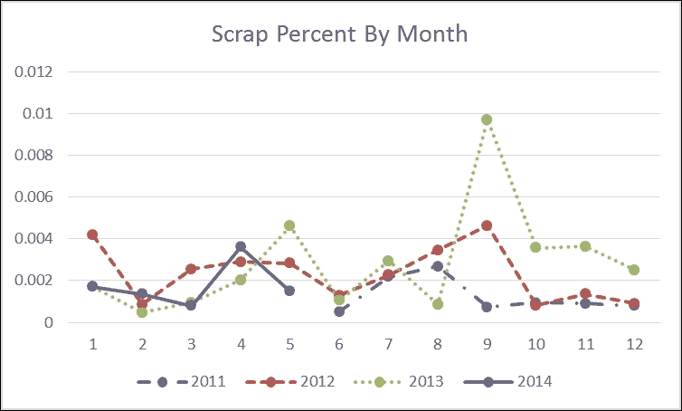

“问题是，我们不知道如何处理这些数据。生产是一个复杂的流程，有许多变量可能会影响物品是否被废弃。我们正在寻找两件事：

+   一种识别对物品是否被废弃影响最大的项目的方法

+   一个允许我们的规划者改变关键变量以进行“如果……会怎样”的模拟并改变生产流程的工具

你告诉你的老板可以。由于这是一个绿色田野应用，而且你一直在听关于 ASP.NET Core 1.0 的炒作，这似乎是一个尝试它的绝佳地方。此外，你听说过数据科学中的一个热门模型，神经网络，并想知道现实是否与炒作相符。

# 神经网络

神经网络是数据科学的一个相对较晚的参与者，试图让计算机模仿大脑的工作方式。我们耳朵之间的灰质在建立联系和推理方面非常好，直到一定程度。神经网络的前景是，如果我们能构建出模仿我们大脑工作方式的模型，我们就可以结合计算机的速度和湿件的模式匹配能力，创建一个可以提供洞察力，而计算机或人类单独可能错过的学习模型。

## 背景

神经网络从实际大脑中汲取词汇；神经网络是一系列神经元的集合。如果你还记得生物学 101（或者《战争机器 2》），大脑有数十亿个神经元，它们看起来或多或少是这样的：

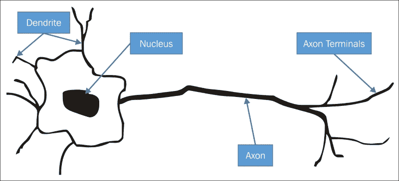

一个神经元的轴突末端连接到另一个神经元的树突。由于单个神经元可以有多个树突和轴突末端，神经元可以连接，并被连接到许多其他神经元。两个神经元之间实际的连接区域被称为突触。我们的大脑使用电信号在神经元之间传递信息。

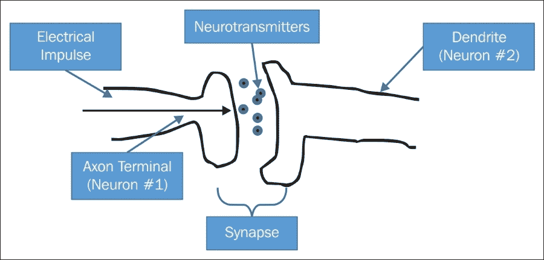

由于我们正在为神经网络模拟人脑，因此我们可以合理地认为我们将使用相同的词汇。在神经网络中，我们有一系列输入和一个输出。在输入和输出之间，有一个由神经元组成的隐藏层。任何从输入到隐藏层、隐藏层内部的神经元之间，以及从隐藏层到输出的连接都被称为突触。

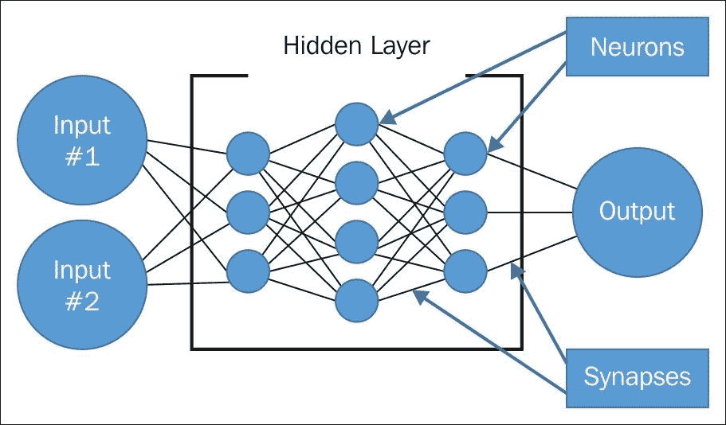

注意，每个突触只连接到其右侧的神经元（或输出）。在神经网络中，数据总是单向流动，突触永远不会连接到自身或网络中的任何其他前一个神经元。还有一点需要注意，当隐藏层有多个神经元时，它被称为深度信念网络（或深度学习）。尽管如此，我们在这本书中不会涉及深度信念网络，尽管这确实是你下次和朋友打保龄球时可能会讨论的话题。

在神经网络中，突触只有一个任务。它们从一个神经元形成连接到下一个神经元，并应用一个权重到这个连接上。例如，神经元 1 以两个权重激活突触，因此神经元 2 接收到的输入为两个：

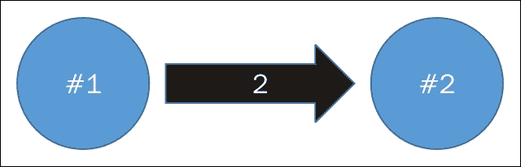

神经元有一个更复杂的工作。它们接收来自所有输入突触的值，从称为偏差的东西那里获取输入（我稍后会解释），对输入应用激活函数，然后输出一个信号或什么都不做。激活函数可以单独处理每个输入，也可以将它们组合起来，或者两者兼而有之。存在许多种类的激活函数，从简单到令人难以置信。在这个例子中，输入被相加：


一些神经网络足够智能，可以根据需要添加和删除神经元。对于这本书，我们不会做任何类似的事情——我们将固定每层的神经元数量。回到我在上一段中提到的词汇，对于神经元内的任何给定激活函数，有两种输入：通过突触传递的权重和偏差。权重是一个分配给突触的数字，它取决于突触的性质，并且在神经网络的整个生命周期中不会改变。偏差是一个分配给所有神经元（和输出）的全局值，与权重不同，它经常改变。神经网络中的机器学习组件是计算机所做的许多迭代，以创建最佳权重和偏差组合，从而给出最佳的预测分数。

## 神经网络演示

在建立这个心理模型之后，让我们看看神经网络的实际应用。让我们看看一系列在考试前学习和喝酒的学生，并比较他们是否通过了那次考试：

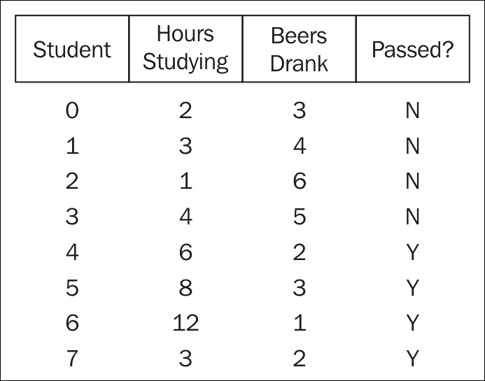

由于我们有两个输入变量（*x*，即**学习时间**和**喝啤酒量**），我们的神经网络将有两个输入。我们有一个因变量（**是否通过**），因此我们的神经网络将有一个输出：

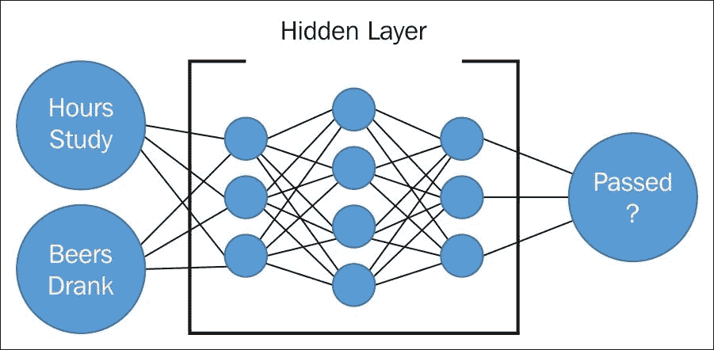

有一点需要注意，输入的数量取决于值的范围。所以如果我们有一个分类输入（例如男性/女性），我们将有一个与该类别值范围相对应的输入数量：

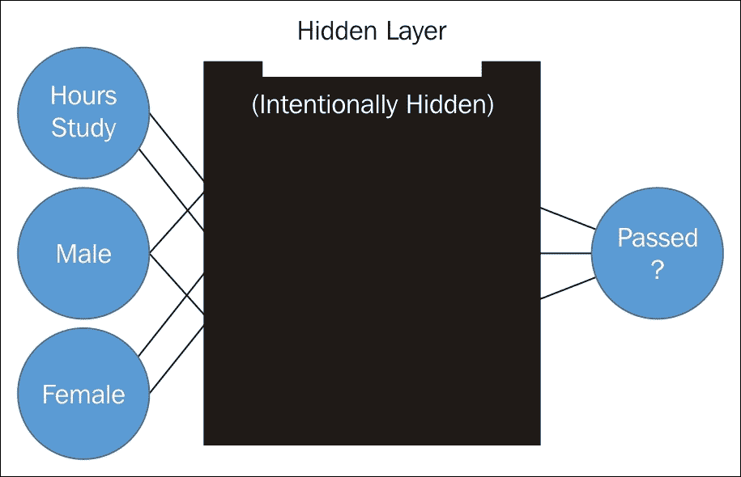

1.  进入 Visual Studio 并创建一个新的 C# ASP.NET 网络应用程序：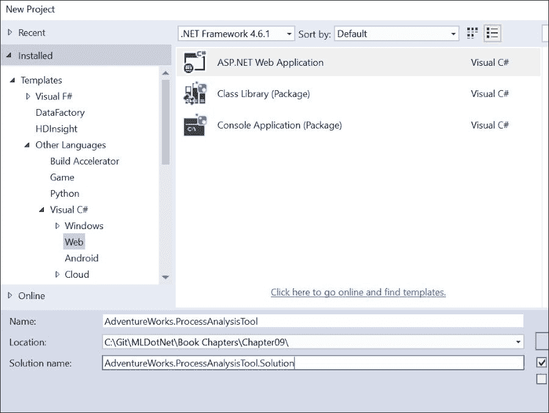

1.  在下一个对话框中，选择 **ASP.NET 5 模板**并将身份验证类型更改为 **无身份验证**。请注意，在本书编写之后，模板可能会从 ASP.NET 5 更改为 ASP.NET Core 1。你可以将这两个术语视为同义词。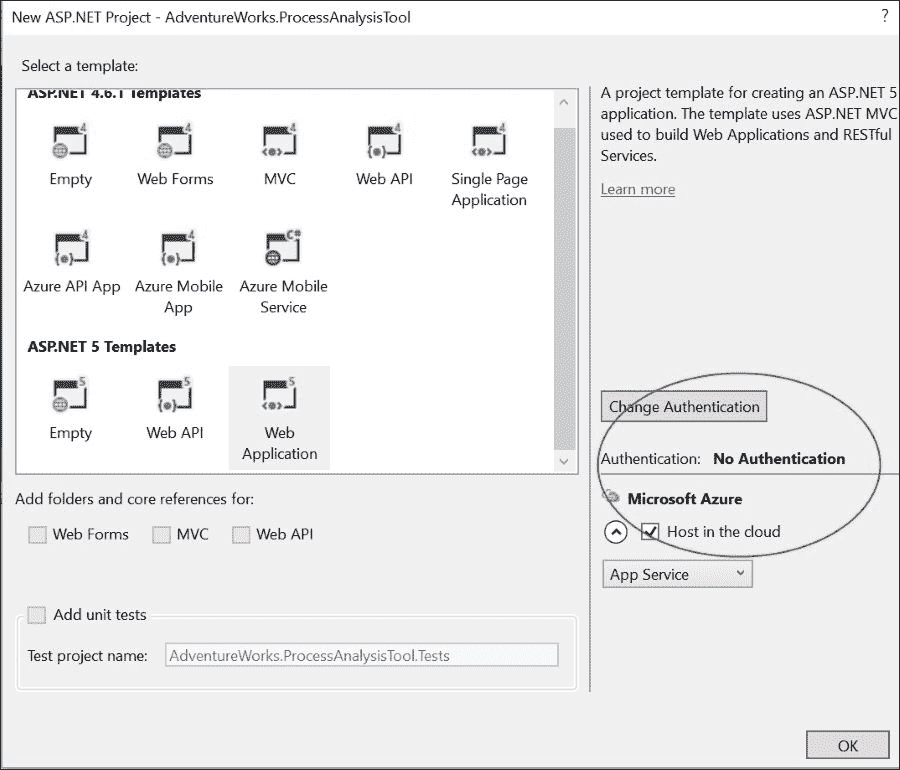

1.  如果代码生成一切正常，你会得到以下项目：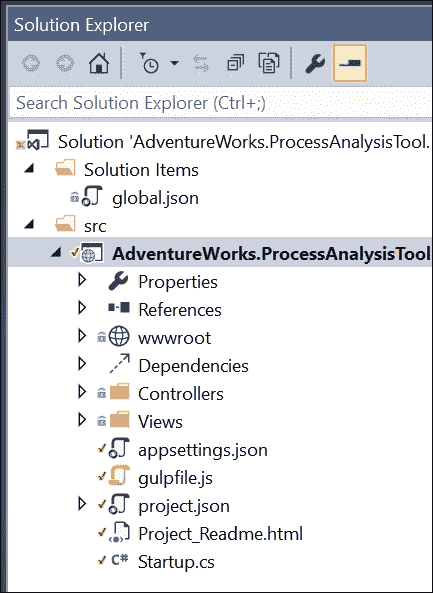

1.  接下来，让我们添加一个 F# Windows 库项目：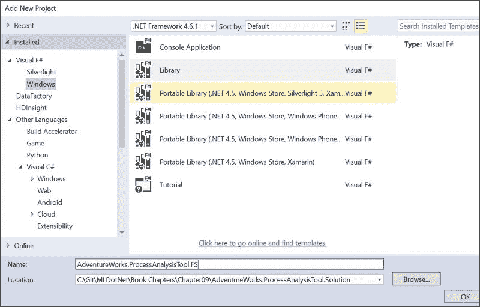

1.  一旦创建了 F# 项目，打开 NuGet 包管理器控制台并安装 numl。确保你在为 NuGet 安装目标 F# 项目：

    ```py
    PM> install-package numl

    ```

    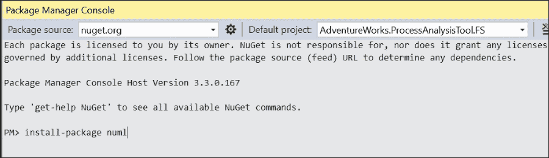

1.  将 `Scipt1.fsx` 重命名为 `StudentNeuralNetwork.fsx`。

1.  前往脚本并将其中的所有内容替换为以下代码：

    ```py
    #r "../packages/numl.0.8.26.0/lib/net40/numl.dll"

    open numl
    open numl.Model
    open numl.Supervised.NeuralNetwork

    type Student = {[<Feature>]Study: float; 
                    [<Feature>]Beer: float; 
                    [<Label>] mutable Passed: bool}

    let data = 
        [{Study=2.0;Beer=3.0;Passed=false};
         {Study=3.0;Beer=4.0;Passed=false};
         {Study=1.0;Beer=6.0;Passed=false};
         {Study=4.0;Beer=5.0;Passed=false};
         {Study=6.0;Beer=2.0;Passed=true};
         {Study=8.0;Beer=3.0;Passed=true};
         {Study=12.0;Beer=1.0;Passed=true};
         {Study=3.0;Beer=2.0;Passed=true};]

    let data' = data |> Seq.map box
    let descriptor = Descriptor.Create<Student>()
    let generator = NeuralNetworkGenerator()
    generator.Descriptor <- descriptor
    let model = Learner.Learn(data', 0.80, 100, generator)
    let accuracy = model.Accuracy
    ```

1.  当你将这个项目发送到 FSI 时，你会得到以下结果：

    ```py
    val generator : NeuralNetworkGenerator
    val model : LearningModel =
     Learning Model:
     Generator numl.Supervised.NeuralNetwork.NeuralNetworkGenerator
     Model:
    numl.Supervised.NeuralNetwork.NeuralNetworkModel
     Accuracy: 100.00 %

    val accuracy : float = 1.0

    ```

如果你已经完成了第三章（更多 AdventureWorks 回归
```

当你将这个项目发送到 FSI 时，你会得到以下结果：

```py
val testData : Student = {Study = 7.0;
 Beer = 1.0;
 Passed = false;}

> 

val predict : obj = {Study = 7.0;
 Beer = 1.0;
 Passed = true;}

```

在这种情况下，我们的学生如果学习 7 小时并且喝了一杯啤酒就能通过考试。

## 神经网络 – 尝试 #1

理论问题解决之后，让我们看看神经网络是否可以帮助我们处理 AdventureWorks。正如第三章中所述，*更多 AdventureWorks 回归*，让我们看看是否可以使用业务领域专家来帮助我们制定一些可行的假设。当我们访问制造经理时，他说：“我认为有几个领域你应该关注。看看生产位置是否有影响。我们共有七个主要位置”：

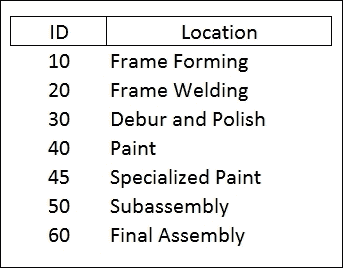

“我很想知道我们的**油漆**位置是否产生了比预期更多的缺陷，因为我们该区域的周转率很高。”

“此外，查看供应商和有缺陷的产品之间是否存在关系。在某些情况下，我们为单个供应商购买零件；在其他情况下，我们有两个或三个供应商为我们提供零件。在我们组装自行车时，我们没有跟踪哪个零件来自哪个供应商，但也许你可以发现某些供应商与有缺陷的采购订单相关联。”

这些看起来是两个很好的起点，因此让我们前往**解决方案资源管理器**，在 F#项目中创建一个名为`AWNeuralNetwork.fsx`的新脚本文件：

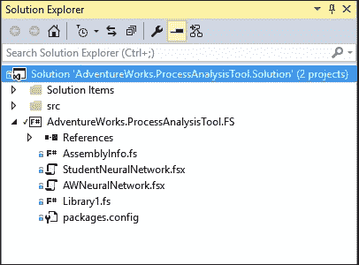

接下来，打开 NuGet 包管理器并输入以下内容：

```py
PM> Install-Package SQLProvider -prerelease

```

接下来，打开脚本文件并输入以下内容（注意，版本号可能因你而异）：

```py
#r "../packages/SQLProvider.0.0.11-alpha/lib/FSharp.Data.SQLProvider.dll"
#r "../packages/numl.0.8.26.0/lib/net40/numl.dll"
#r "../packages/FSharp.Collections.ParallelSeq.1.0.2/lib/net40/FSharp.Collections.ParallelSeq.dll"

open numl
open System
open numl.Model
open System.Linq
open FSharp.Data.Sql
open numl.Supervised.NeuralNetwork
open FSharp.Collections.ParallelSeq

[<Literal>]
let connectionString = "data source=nc54a9m5kk.database.windows.net;initial catalog=AdventureWorks2014;user id= PacktReader;password= P@cktM@chine1e@rning;"

type AdventureWorks = SqlDataProvider<ConnectionString=connectionString>
let context = AdventureWorks.GetDataContext()
```

将此发送到 REPL 会得到以下结果：

```py
val connectionString : string =
 "data source=nc54a9m5kk.database.windows.net;initial catalog=A"+[70 chars]
type AdventureWorks = SqlDataProvider<...>
val context : SqlDataProvider<...>.dataContext

```

接下来，让我们处理位置假设。转到脚本并输入以下内容：

```py
type WorkOrderLocation = {[<Feature>] Location10: bool; 
                          [<Feature>] Location20: bool; 
                          [<Feature>] Location30: bool; 
                          [<Feature>] Location40: bool; 
                          [<Feature>] Location45: bool; 
                          [<Feature>] Location50: bool; 
                          [<Feature>] Location60: bool; 
                          [<Label>] mutable Scrapped: bool}

let getWorkOrderLocation (workOrderId, scrappedQty:int16) =
    let workOrderRoutings = context.``[Production].[WorkOrderRouting]``.Where(fun wor -> wor.WorkOrderID = workOrderId) |> Seq.toArray
    match workOrderRoutings.Length with
    | 0 -> None
    | _ ->
        let location10 = workOrderRoutings |> Array.exists(fun wor -> wor.LocationID = int16 10)
        let location20 = workOrderRoutings |> Array.exists(fun wor -> wor.LocationID = int16 20)
        let location30 = workOrderRoutings |> Array.exists(fun wor -> wor.LocationID = int16 30)
        let location40 = workOrderRoutings |> Array.exists(fun wor -> wor.LocationID = int16 40)
        let location45 = workOrderRoutings |> Array.exists(fun wor -> wor.LocationID = int16 45)
        let location50 = workOrderRoutings |> Array.exists(fun wor -> wor.LocationID = int16 50)
        let location60 = workOrderRoutings |> Array.exists(fun wor -> wor.LocationID = int16 60)
        let scrapped = scrappedQty > int16 0
        Some {Location10=location10;Location20=location20;Location30=location30;Location40=location40;
        Location45=location45;Location50=location50;Location60=location60;Scrapped=scrapped}
```

将此发送到 REPL 会得到以下结果：

```py
type WorkOrderLocation =
 {Location10: bool;
 Location20: bool;
 Location30: bool;
 Location40: bool;
 Location45: bool;
 Location50: bool;
 Location60: bool;
 mutable Scrapped: bool;}
val getWorkOrderLocation :
 workOrderId:int * scrappedQty:int16 -> WorkOrderLocation option

```

你可以看到我们有一个记录类型，每个位置作为一个字段，以及一个表示是否有报废的指示器。这个数据结构的自动化程度是工作订单。每个订单可能访问一个或所有这些位置，并且可能有某些报废数量。`getWorkOrderFunction`函数接受`WorkOrderLocation`表，其中每个位置是表中的一行，并将其扁平化为`WorkOrderLocation`记录类型。

接下来，回到脚本并输入以下内容：

```py
let locationData =
    context.``[Production].[WorkOrder]`` 
    |> PSeq.map(fun wo -> getWorkOrderLocation(wo.WorkOrderID,wo.ScrappedQty))
    |> Seq.filter(fun wol -> wol.IsSome)
    |> Seq.map(fun wol -> wol.Value)
    |> Seq.toArray
```

将此发送到 REPL 会得到以下结果：

```py
val locationData : WorkOrderLocation [] =
 |{Location10 = true;
 Location20 = true;
 Location30 = true;
 Location40 = false;
 Location45 = true;
 Location50 = true;
 Location60 = true;
 Scrapped = false;}; {Location10 = false;
 Location20 = false;
 Location30 = false;
 Location40 = false;

```

这段代码与你在[第五章中看到的内容非常相似，*时间到 – 获取数据*。我们访问数据库并拉取所有工作订单，然后将位置映射到我们的`WorkOrderLocation`记录。请注意，我们使用`PSeq`，这样我们就可以通过同时调用数据库来获取每个工作订单的位置来提高性能。

数据本地化后，让我们尝试使用神经网络。进入脚本文件并输入以下内容：

```py
let locationData' = locationData |> Seq.map box
let descriptor = Descriptor.Create<WorkOrderLocation>()
let generator = NeuralNetworkGenerator()
generator.Descriptor <- descriptor
let model = Learner.Learn(locationData', 0.80, 5, generator)
let accuracy = model.Accuracy
```

在长时间等待后，将此发送到 REPL 会得到以下结果：

```py
val generator : NeuralNetworkGenerator
val model : LearningModel =
 Learning Model:
 Generator numl.Supervised.NeuralNetwork.NeuralNetworkGenerator
 Model:
numl.Supervised.NeuralNetwork.NeuralNetworkModel
 Accuracy: 0.61 %

val accuracy : float = 0.006099706745

```

所以，呃，看起来位置并不能预测缺陷可能发生的地方。正如我们在 第三章 "更多 AdventureWorks 回归" 中看到的，有时你不需要一个工作模型来使实验有价值。在这种情况下，我们可以回到导演那里，告诉他报废发生在他的整个生产地点，而不仅仅是喷漆（这样就把责任推给了新来的那个人）。

## 神经网络 – 尝试 #2

让我们看看是否可以使用导演的第二个假设来找到一些东西，即某些供应商可能比其他供应商的缺陷率更高。回到脚本中，输入以下内容：

```py
type  VendorProduct = {WorkOrderID: int;
                       [<Feature>]BusinessEntityID: int; 
                       [<Feature>]ProductID: int; 
                       [<Label>] mutable Scrapped: bool}

let workOrders = context.``[Production].[WorkOrder]`` |> Seq.toArray
let maxWorkOrder = workOrders.Length
let workOrderIds = Array.zeroCreate<int>(1000)
let workOrderIds' = workOrderIds |> Array.mapi(fun idx i -> workOrders.[System.Random(idx).Next(maxWorkOrder)])
                                 |> Array.map(fun wo -> wo.WorkOrderID)
```

当你将其发送到 FSI 后，你会得到以下内容：

```py
type VendorProduct =
 {WorkOrderID: int;
 BusinessEntityID: int;
 ProductID: int;
 mutable Scrapped: bool;}

 …
 FSharp.Data.Sql.Common.SqlEntity; FSharp.Data.Sql.Common.SqlEntity;
 FSharp.Data.Sql.Common.SqlEntity; FSharp.Data.Sql.Common.SqlEntity; ...|]
val maxWorkOrder : int = 72591
val workOrderIds : int [] =
 [|0; 0; 0; 0; 0; 0; 0; 0; 0; 0; 0; 0; 0; 0; 0; 0; 0; 0; 0; 0; 0; 0; 0; 0; 0;
 0; 0; 0; 0; 0; 0; 0; 0; 0; 0; 0; 0; 0; 0; 0; 0; 0; 0; 0; 0; 0; 0; 0; 0; 0;
 0; 0; 0; 0; 0; 0; 0; 0; 0; 0; 0; 0; 0; 0; 0; 0; 0; 0; 0; 0; 0; 0; 0; 0; 0;
 0; 0; 0; 0; 0; 0; 0; 0; 0; 0; 0; 0; 0; 0; 0; 0; 0; 0; 0; 0; 0; 0; 0; 0; 0;
 ...|]
val workOrderIds' : int [] =

```

`VendorProduct` 记录类型你应该很熟悉。接下来的代码块创建了一个包含 1,000 个随机工作订单 ID 的数组。正如我们从第一个实验中学到的，神经网络需要很长时间才能完成。我们将在下一章中查看一些大数据解决方案，但在此之前，我们将做数据科学家一直做的事情——从更大的数据集中抽取样本。请注意，我们正在使用 `Array.Mapi` 高阶函数，这样我们就可以使用索引值在工作订单数组中定位正确的值。不幸的是，我们无法将索引传递给类型提供者并在服务器上评估，因此整个工作订单表被带到本地，这样我们就可以使用索引。

接下来，将以下内容输入到脚本中：

```py
let (|=|) id a = Array.contains id a

let vendorData = 
    query{for p in context.``[Production].[Product]`` do
          for wo in p.FK_WorkOrder_Product_ProductID do
          for bom in p.FK_BillOfMaterials_Product_ProductAssemblyID do
          join pv in context.``[Purchasing].[ProductVendor]`` on (bom.ComponentID = pv.ProductID)
          join v in context.``[Purchasing].[Vendor]`` on (pv.BusinessEntityID = v.BusinessEntityID)
          select  ({WorkOrderID = wo.WorkOrderID;BusinessEntityID = v.BusinessEntityID; ProductID = p.ProductID; Scrapped = wo.ScrappedQty > int16 0})}
          |> Seq.filter(fun vp -> vp.WorkOrderID |=| workOrderIds')
          |> Seq.toArray
```

当你将其发送到 FSI 后，稍作等待，你会得到以下内容：

```py
val ( |=| ) : id:'a -> a:'a [] -> bool when 'a : equality
val vendorData : VendorProduct [] =
 |{WorkOrderID = 25;
 BusinessEntityID = 1576;
 ProductID = 764;
 Scrapped = false;}; {WorkOrderID = 25;
 BusinessEntityID = 1586;
 ProductID = 764;
 Scrapped = false;}; {WorkOrderID = 25;

```

第一行是我们在 [第五章 "时间到 – 获取数据" 中遇到的 `in` (`|=|`) 操作符。接下来的代码块使用从 1,000 个随机选择的工作订单中的数据填充 `vendorData` 数组。请注意，由于每个工作订单将使用多个部件，而每个部件可能由各种供应商（在这种情况下，称为商业实体）提供，因此存在一些重复。

数据本地化后，进入脚本并输入以下内容：

```py
let vendorData' = vendorData |> Seq.map box
let descriptor' = Descriptor.Create<VendorProduct>()
let generator' = NeuralNetworkGenerator()
generator'.Descriptor <- descriptor'
let model' = Learner.Learn(vendorData', 0.80, 5, generator')
let accuracy' = model'.Accuracy
```

当你将其发送到 FSI 后，你会得到以下内容：

```py
val generator' : NeuralNetworkGenerator
val model' : LearningModel =
 Learning Model:
 Generator numl.Supervised.NeuralNetwork.NeuralNetworkGenerator
 Model:
numl.Supervised.NeuralNetwork.NeuralNetworkModel
 Accuracy: 99.32 %

val accuracy' : float = 0.9931740614

```

所以，这很有趣。我们有一个非常高的准确率。人们可能会想：这是否是因为在单一供应商的产品情况下，所有报废的量都将与他们相关，因为他们是唯一的。然而，由于单个供应商可能提供多个输入产品，而这些产品可能有不同的报废率，你可以使用该模型来预测特定供应商和特定产品是否会有报废率。此外，请注意，由于为每个供应商和产品添加一个输入（这将使数据帧非常稀疏），这里有一个供应商输入和一个产品输入。虽然这些可以被认为是分类值，但我们可以为了这个练习牺牲一些精度。

你需要记住关于神经网络的关键点是，神经网络无法告诉你它是如何得到答案的（非常像人脑，不是吗？）。所以神经网络不会报告哪些供应商和产品的组合会导致缺陷。要做到这一点，你需要使用不同的模型。

# 构建应用程序

由于这个神经网络提供了我们所需的大部分信息，让我们继续构建我们的 ASP.NET 5.0 应用程序，并使用该模型。在撰写本文时，ASP.NET 5.0 仅支持 C#，因此我们必须将 F#转换为 C#并将代码移植到应用程序中。一旦其他语言被 ASP.NET 支持，我们将更新网站上的示例代码。

如果你不太熟悉 C#，它是.NET 堆栈中最流行的语言，并且与 Java 非常相似。C#是一种通用语言，最初结合了命令式和面向对象的语言特性。最近，函数式结构被添加到语言规范中。然而，正如老木匠的格言所说，“如果是螺丝，就用螺丝刀。如果是钉子，就用锤子。”既然如此，你最好用 F#进行.NET 函数式编程。在下一节中，我将尽力解释在将代码移植过来时 C#实现中的任何差异。

## 设置模型

你已经有了创建好的 MVC 网站模板。打开 NuGet 包管理器控制台，将其安装到其中：

```py
PM > install-package numl

```

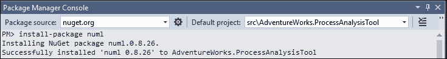

接下来，在**解决方案资源管理器**中创建一个名为`Models`的文件夹：

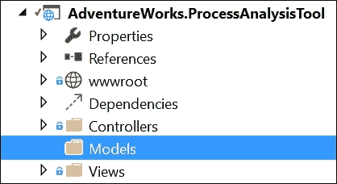

在那个文件夹中，添加一个名为`VendorProduct`的新类文件：

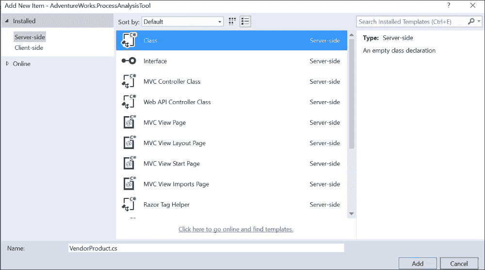

在那个文件中，将所有代码替换为以下内容：

```py
using numl.Model;

namespace AdventureWorks.ProcessAnalysisTool.Models
{
    public class VendorProduct
    {
        public int WorkOrderID { get; set; }
        [Feature]
        public int BusinessEntityID { get; set; }
        [Feature]
        public int ProductID { get; set; }
        [Label]
        public bool Scrapped { get; set; }
    }
}
```

如你所猜，这相当于我们在 F#中创建的记录类型。唯一的真正区别是属性默认可变（所以要小心）。转到**解决方案资源管理器**并找到`Project.json`文件。打开它，并在`frameworks`部分删除此条目：

```py
:    "dnxcore50": { }
```

此部分现在应如下所示：

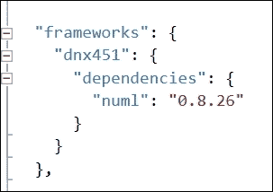

运行网站以确保它正常工作：


我们正在做的是移除网站对.NET Core 的依赖。虽然 numl 支持.NET Core，但我们现在不需要它。

如果网站正在运行，让我们添加我们剩余的辅助类。回到**解决方案资源管理器**，添加一个名为`Product.cs`的新类文件。进入该类，将现有代码替换为以下内容：

```py
using System;

namespace AdventureWorks.ProcessAnalysisTool.Models
{
    public class Product
    {
        public int ProductID { get; set; }
        public string Description { get; set; }
    }
}
```

这是一个记录等效类，当用户选择要建模的`Product`时将使用它。

返回到**解决方案资源管理器**并添加一个名为`Vendor.cs`的新类文件。进入该类，将现有代码替换为以下内容：

```py
using System;

namespace AdventureWorks.ProcessAnalysisTool.Models
{
    public class Vendor
    {
        public int VendorID { get; set; }
        public String Description { get; set; }

    }
}
```

就像`Product`类一样，这将用于填充用户的下拉列表。

返回到**解决方案资源管理器**并添加一个名为 `Repository.cs` 的新类文件。进入该类并将现有代码替换为以下内容：

```py
using System;
using System.Collections.Generic;
using System.Data.SqlClient;
using System.Linq;

namespace AdventureWorks.ProcessAnalysisTool.Models
{
    public class Repository
    {
        public String ConnectionString { get; private set; }
        public Repository(String connectionString)
        {
            this.ConnectionString = connectionString;
        }

        public ICollection<Vendor> GetAllVendors()
        {
            var vendors = new List<Vendor>();
            using (var connection = new SqlConnection(this.ConnectionString))
            {
                var commandText =
                    "Select distinct V.BusinessEntityID, V.Name from [Purchasing].[Vendor] as V " +
                    "Inner join[Purchasing].[ProductVendor] as PV " +
                    "on V.BusinessEntityID = PV.BusinessEntityID " +
                    "order by 2 asc";

                using (var command = new SqlCommand(commandText, connection))
                {
                    connection.Open();
                    var reader = command.ExecuteReader();
                    while (reader.Read())
                    {
                        vendors.Add(new Vendor() { VendorID = (int)reader[0], Description = (string)reader[1] });
                    }
                }
            }
            return vendors;
        }

        public ICollection<Product> GetAllProducts()
        {
            var products = new List<Product>();
            using (var connection = new SqlConnection(this.ConnectionString))
            {
                var commandText =
                    "Select distinct P.ProductID, P.Name from [Production].[Product] as P " +
                    "Inner join[Purchasing].[ProductVendor] as PV " +
                    "on P.ProductID = PV.ProductID " +
                    "order by 2 asc";

                using (var command = new SqlCommand(commandText, connection))
                {
                    connection.Open();
                    var reader = command.ExecuteReader();
                    while (reader.Read())
                    {
                        products.Add(new Product() { ProductID = (int)reader[0], Description = (string)reader[1] });
                    }
                }
            }
            return products;
        }

        public ICollection<VendorProduct> GetAllVendorProducts()
        {
            var vendorProducts = new List<VendorProduct>();
            using (var connection = new SqlConnection(this.ConnectionString))
            {
                var commandText =
                    "Select WO.WorkOrderID, PV.BusinessEntityID, PV.ProductID, WO.ScrappedQty " +
                    "from[Production].[Product] as P " +
                    "inner join[Production].[WorkOrder] as WO " +
                    "on P.ProductID = WO.ProductID " +
                    "inner join[Production].[BillOfMaterials] as BOM " +
                    "on P.ProductID = BOM.ProductAssemblyID " +
                    "inner join[Purchasing].[ProductVendor] as PV " +
                    "on BOM.ComponentID = PV.ProductID ";

                using (var command = new SqlCommand(commandText, connection))
                {
                    connection.Open();
                    var reader = command.ExecuteReader();
                    while (reader.Read())
                    {
                        vendorProducts.Add(new VendorProduct()
                        {
                            WorkOrderID = (int)reader[0],
                            BusinessEntityID = (int)reader[1],
                            ProductID = (int)reader[2],
                            Scrapped = (short)reader[3] > 0
                        });
                    }
                }
            }

            return vendorProducts;
        }

        public ICollection<VendorProduct> GetRandomVendorProducts(Int32 number)
        {
            var returnValue = new List<VendorProduct>();
            var vendorProducts = this.GetAllVendorProducts();
            for (int i = 0; i < number; i++)
            {
                var random = new System.Random(i);
                var index = random.Next(vendorProducts.Count - 1);
                returnValue.Add(vendorProducts.ElementAt(index));
            }
            return returnValue;
        }
    }
}
```

如您可能猜到的，这是调用数据库的类。由于 C# 没有类型提供者，我们需要手动编写 ADO.NET 代码。我们需要添加对 `System.Data` 的引用以使此代码工作。进入**解决方案资源管理器**中的**引用**并添加它：

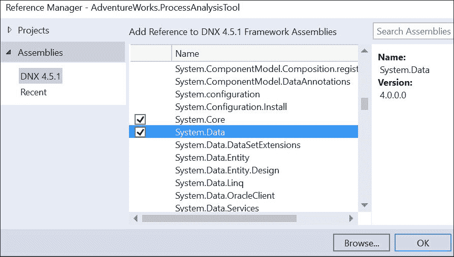

您可以再次运行网站以确保我们处于正确的轨道。在**解决方案资源管理器**中添加一个名为 `NeuralNetwork.cs` 的类文件。将其所有代码替换为以下内容：

```py
using numl;
using numl.Model;
using numl.Supervised.NeuralNetwork;
using System;
using System.Collections.Generic;

namespace AdventureWorks.ProcessAnalysisTool.Models
{
    public class NeuralNetwork
    {
        public ICollection<VendorProduct> VendorProducts { get; private set; }
        public LearningModel Model { get; private set; }

        public NeuralNetwork(ICollection<VendorProduct> vendorProducts)
        {
            if(vendorProducts ==  null)
            {
                throw new ArgumentNullException("vendorProducts");
            }
            this.VendorProducts = vendorProducts;
            this.Train();
        }

        internal void Train()
        {
            var vendorData = VendorProducts;
            var descriptor = Descriptor.Create<VendorProduct>();
            var generator = new NeuralNetworkGenerator();
            generator.Descriptor = descriptor;
            var model = Learner.Learn(vendorData, 0.80, 5, generator);
            if (model.Accuracy > .75)
            {
                this.Model = model;
            }
        }

        public bool GetScrappedInd(int vendorId, int productId)
        {
            if(this.Model == null)
            {
                return true;
            }
            else
            {
                var vendorProduct = new VendorProduct()
                {
                    BusinessEntityID = vendorId, ProductID = productId,
                    Scrapped = false
                };
                return (bool)this.Model.Model.Predict((object)vendorProduct);
            }
        }
    }
}
```

这个类为我们执行了神经网络计算的重活。注意，这个类是数据无关的，因此它可以轻松地移植到 .NET Core。我们需要的只是一个 `VendorProducts` 集合，将其传递给神经网络的构造函数进行计算。

创建了所有这些类后，您的解决方案资源管理器应该看起来像这样：

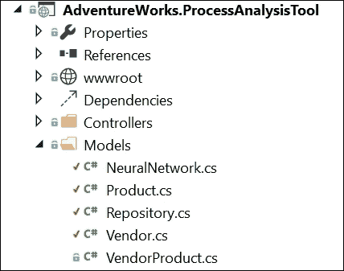

您应该能够编译并运行网站。现在让我们为神经网络实现一个用户界面。

## 构建用户体验

以下步骤将指导您构建用户体验：

进入**解决方案资源管理器**并选择**AdventureWorks.ProcessAnalysisTool**。导航到**添加** | **新建项**：

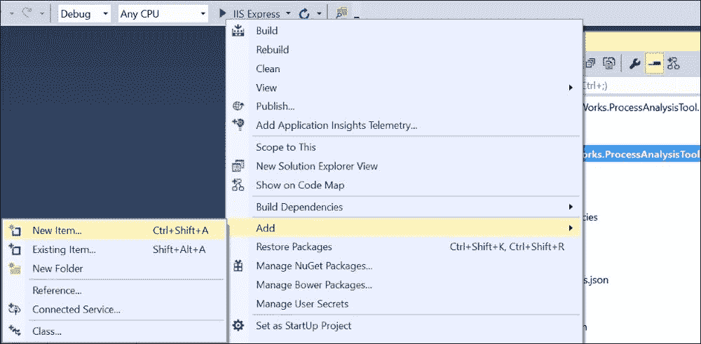

在下一个对话框中，选择**类**并将其命名为 `Global.cs`：

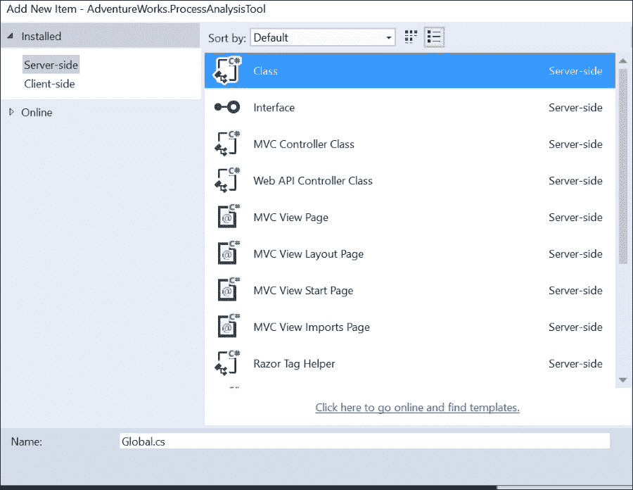

进入 `Global` 类并将所有内容替换为以下内容：

```py
using AdventureWorks.ProcessAnalysisTool.Models;

namespace AdventureWorks.ProcessAnalysisTool
{
    public static class Global
    {
        static NeuralNetwork _neuralNetwork = null;

        public static void InitNeuralNetwork()
        {
            var connectionString = "data source=nc54a9m5kk.database.windows.net;initial catalog=AdventureWorks2014;user id= PacktReader;password= P@cktM@chine1e@rning;";
            var repository = new Repository(connectionString);
            var vendorProducts = repository.GetRandomVendorProducts(1000);
            _neuralNetwork = new NeuralNetwork(vendorProducts);
        }

        public static NeuralNetwork NeuralNetwork
        { get
            {
                return _neuralNetwork;
            }
        }
    }
}
```

这个类为我们创建一个新的神经网络。我们可以通过名为 `Neural Network` 的只读属性访问神经网络的功能。因为它被标记为静态，所以只要应用程序在运行，这个类就会保留在内存中。

接下来，在主站点中找到 `Startup.cs` 文件。

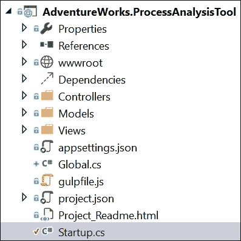

打开文件并将构造函数（称为 `Startup`）替换为以下代码：

```py
        public Startup(IHostingEnvironment env)
        {
            // Set up configuration sources.
            var builder = new ConfigurationBuilder()
                .AddJsonFile("appsettings.json")
                .AddEnvironmentVariables();
                Configuration = builder.Build();

            Global.InitNeuralNetwork();
        }
```

当网站启动时，它将创建一个所有请求都可以使用的全局神经网络。

接下来，在 `Controllers` 目录中找到 `HomeController`。

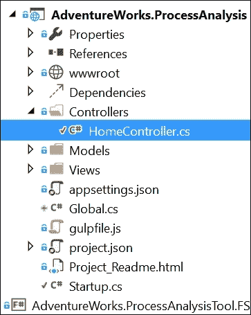

打开该文件并添加此方法以填充一些供应商和产品的下拉列表：

```py
        [HttpGet]
        public IActionResult PredictScrap()
        {
            var connectionString = "data source=nc54a9m5kk.database.windows.net;initial catalog=AdventureWorks2014;user id= PacktReader;password= P@cktM@chine1e@rning;";
            var repository = new Repository(connectionString);
            var vendors = repository.GetAllVendors();
            var products = repository.GetAllProducts();

            ViewBag.Vendors = new SelectList(vendors, "VendorID", "Description");
            ViewBag.Products = new SelectList(products, "ProductID", "Description");

            return View();
        } 
```

接下来，添加此方法，在供应商和产品被发送回服务器时在全局神经网络上运行 `Calculate`：

```py
        [HttpPost]
        public IActionResult PredictScrap(Int32 vendorId, Int32 productId)
        {
            ViewBag.ScappedInd = Global.NeuralNetwork.GetScrappedInd(vendorId, productId);

            var connectionString = "data source=nc54a9m5kk.database.windows.net;initial catalog=AdventureWorks2014;user id= PacktReader;password= P@cktM@chine1e@rning;";
            var repository = new Repository(connectionString);
            var vendors = repository.GetAllVendors();
            var products = repository.GetAllProducts();

            ViewBag.Vendors = new SelectList(vendors, "VendorID", "Description", vendorId);
            ViewBag.Products = new SelectList(products, "ProductID", "Description", productId);

            return View();
        }
```

如果您折叠到定义，`HomeController` 将看起来像这样：

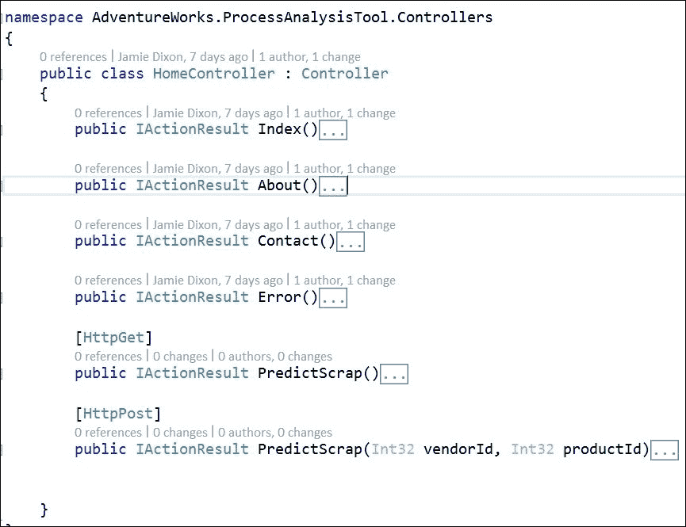

接下来，进入**解决方案资源管理器**并导航到**AdventureWorks.ProcessAnalysisTool** | **视图** | **主页**。右键单击文件夹并导航到**添加** | **新建项**：

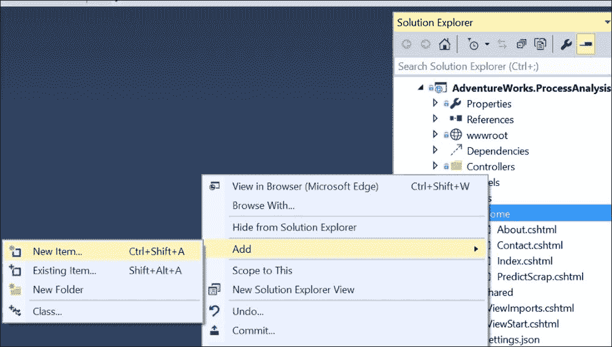

在下一个对话框中，选择**MVC 视图页面**并将其命名为 `PredictScrap.cshtml`：

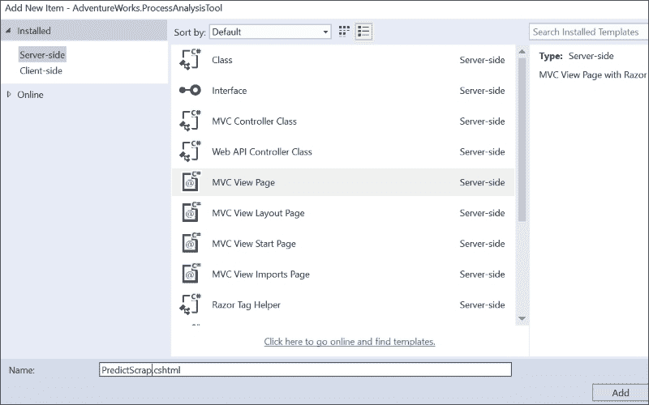

打开这个页面并将所有内容替换为以下内容：

```py
<h2>Determine Scrap Rate</h2>

@using (Html.BeginForm())
{
    <div class="form-horizontal">
        <h4>Select Inputs</h4>
        <hr />

        <div class="form-group">
            <div class="col-md-10">
                @Html.DropDownList("VendorID", (SelectList)ViewBag.Vendors, htmlAttributes: new { @class = "form-control" })
                @Html.DropDownList("ProductID", (SelectList)ViewBag.Products, htmlAttributes: new { @class = "form-control" })
           </div>
        </div>
        <div class="form-group">
            <div class="col-md-offset-2 col-md-10">
                <input type="submit" value="Predict!" class="btn btn-default" />
            </div>
        </div>
        <h4>Will Have Scrap?</h4>
        <div class="form-group">
            <div class="col-md-offset-2 col-md-10">
                @ViewBag.ScappedInd
            </div>
        </div>
   </div>
}
```

这是一个输入表单，它将允许用户选择供应商和产品，并查看神经网络将预测什么——这个组合是否会有废料。当你第一次运行网站并导航到 `localhost:port/home/PredictScrap` 时，你会看到为你准备好的下拉列表：

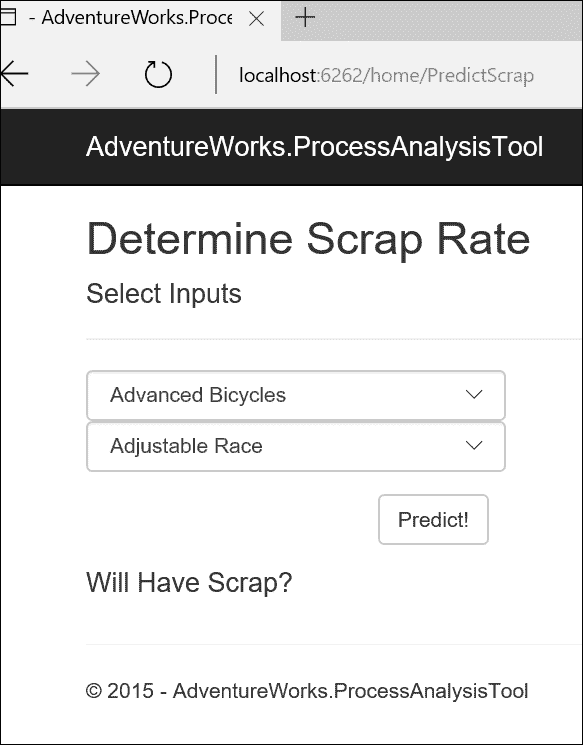

选择一个供应商和一个产品，然后点击 **预测**！：

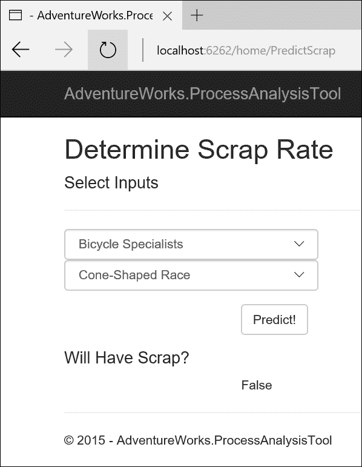

现在我们有一个完全运行的 ASP .NET Core 1.0 网站，该网站使用神经网络来预测 AdventureWorks 废料百分比。有了这个框架，我们可以将网站交给用户体验专家，使其外观和感觉更好——核心功能已经就位。

# 摘要

本章开辟了一些新领域。我们深入研究了 ASP.NET 5.0 用于我们的网站设计。我们使用 numl 创建了两个神经网络：一个显示公司面积与废料率之间没有关系，另一个可以根据供应商和产品预测是否会有废料。然后我们在网站上实现了第二个模型。
