# 第十章：大数据和物联网

到目前为止，这本书遵循了一种提取数据、清洗和塑形数据，然后构建机器学习模型的模式。所有示例的共同点是，当我们提取数据时，我们已经将它从服务器（或其他外部来源）本地带到我们的机器上。这意味着我们的分析仅限于适合我们本地机器内存中的数据。虽然这对于小型和中型数据集来说很好，但还有很多数据集和问题不适合 RAM。在过去的几年里，大数据的兴起，我们可以对太大、无结构或快速移动的数据集提出问题，这些数据集无法使用我们传统的机器学习技术进行分析。与大数据很好地匹配的一个领域是小型、低成本设备的大量涌现，这些设备可以将大量数据发送到服务器进行分析。这些**物联网**（**IoT**）设备有可能以典型计算机和智能手机无法实现的方式重塑我们周围的世界。在本章中，让我们在 AdventureWorks 中运行一个潜在的大数据和物联网场景。

# AdventureWorks 和物联网

有一天，你坐在办公室里，你的老板走进来说：“自从你在帮助我们降低废品率方面做得如此出色，我们希望你能和我们的研发部门一起工作，做一个概念验证。上个月，管理团队参加了一个关于物联网的会议，我们认为有一个有趣的应用案例：**物联网自行车**（**IoB**）。我们打算在一种可以读取自行车及其骑行模式某些诊断信息的自行车型号上安装传感器。我们认为我们的一部分客户会非常喜欢“智能自行车”。

你前往研发区域，他们已经将一辆自行车改装成这样：

+   轮胎压力传感器

+   速度表传感器

+   速度传感器

+   安装在座椅下的 Raspberry Pi 2

+   连接到 PI 的无线以太网盾

+   连接到 PI 的 GPS 盾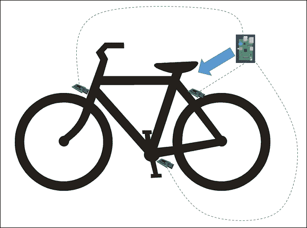

研发部门的负责人告诉你：“我们正在寻找成本效益高的无线传感器。在此之前，我们正在通过车架的管子将电线连接到 PI。我们最初考虑使用骑行者的手机作为 CPU，但最终选择了 PI，因为它体积更小，重量也比手机轻得多——骑行者非常关心重量问题。PI 从可充电电池中获取电力，当自行车在家充电时，所有车载数据都会在那个时间上传到我们的服务器。出于安全原因，我们只想在自行车在家时从 PI 向服务器传输数据，这样骑行者就不会因为使用蜂窝网络而受到数据计划限制。”

研发部门负责人继续说：“我们设想了一个仪表板，让人们可以跟踪他们的骑行路线、骑行习惯等等。您的角色在于机器学习部分。我们需要一种方法来分析我们将要收集的大量数据，以便在骑行时为用户提供增强的客户体验。”

## 数据考虑因素

您将来自自行车的数据（称为遥测数据）视为两个不同的问题。问题一是将数据从单个自行车传输到服务器，问题二是拥有一种格式，允许在大规模上进行机器学习。您决定通过使用 Microsoft Azure IoT 套件将自行车的数据流式传输到当前的 Northwind SQL Azure 数据库来解决这两个问题。您添加了一个名为`telemetry`的表，并将外键添加到`PurchaseOrderHeader`。

您接下来将一些来自 AdventureWorks 早期采用者计划中的骑行者的数据填充到表格中。虽然表格开始时数据不多，但预计会迅速增长。表格的原子级别是每秒大约发生一次的单次读取。这意味着对于 30 分钟的骑行，我们捕获了 1,800 行数据。由于我们早期采用者计划中有大约 200 名骑行者，每次他们骑行时，我们将生成大约 360,000 行数据。一次骑行生成的数据量几乎与当前 AdventureWorks 数据库为公司维护的全部数据量相当。在一个月的时间里，这些骑行者每隔一天就出去骑行，我们将拥有 5,400,000 行数据。

我们正在捕获的数据元素之一是纬度和经度。幸运的是，我们所有的骑行者都住在北达科他州的 Enderlin，并且都在美国最直的公路上骑行，即 46 号公路([`en.wikipedia.org/wiki/North_Dakota_Highway_46_(54st_SE)`](https://en.wikipedia.org/wiki/North_Dakota_Highway_46_(54st_SE))). 这意味着我们的经度不会改变。此外，我们正在以英尺每秒作为速度计来捕获速度，这样我们可以轻松地比较骑行者之间的表现。

数据就绪后，让我们看看如何进行大规模数据分析。

## MapReduce

打开 Visual Studio 并创建一个新的 Visual F# Windows 库，命名为`AdventureWorks.IOB`：

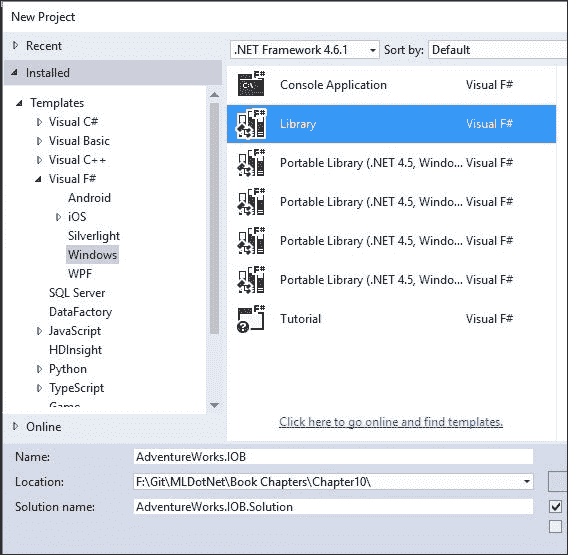

进入 NuGet 包管理器控制台并输入以下内容：

```py
PM> install-package Accord.MachineLearning

```

然后，将`script1.fsx`重命名为`MapReduce.fsx`。现在，输入来自第五章的相同代码，*时间到 – 获取数据*，该代码创建了一个 k-NN：

```py
#r"../packages/Accord.3.0.2/lib/net40/Accord.dll"
#r"../packages/Accord.Math.3.0.2/lib/net40/Accord.Math.dll"
#r"../packages/Accord.Statistics.3.0.2/lib/net40/Accord.Statistics.dll"
#r"../packages/Accord.MachineLearning.3.0.2/lib/net40/Accord.MachineLearning.dll"

open Accord
open System
open Accord.Math
open Accord.MachineLearning

let inputs = [|[|5.0;1.0|];[|4.5;1.5|];[|5.1;0.75|];[|1.0;3.5|];[|0.5;4.0|];[|1.25;4.0|]|]
let outputs = [|1;1;1;0;0;0|]

let classes = 2
let k = 3
let knn = new KNearestNeighbors(k, classes, inputs, outputs)

let input = [|5.0;0.5|]
let output = knn.Compute(input)
```

将此发送到 FSI，我们得到以下结果：

```py
val inputs : float [] [] =
 [|[|5.0; 1.0|]; [|4.5; 1.5|]; [|5.1; 0.75|]; [|1.0; 3.5|]; [|0.5; 4.0|];
 [|1.25; 4.0|]|]
val outputs : int [] = [|1; 1; 1; 0; 0; 0|]
val classes : int = 2
val k : int = 3
val knn : Accord.MachineLearning.KNearestNeighbors
val input : float [] = [|5.0; 0.5|]
val output : int = 1

```

注意这一行：

```py
let output = knn.Compute(input)

```

我们调用`knn.Compute`在创建 k-NN 模型后对单个输入进行计算。

对于单个计算来说，这已经足够好了，但如果我们要进行数千次计算呢？例如，让我们在 250,000 个随机样本上调用`knn.Compute()`。完成所有 250,000 次计算后，让我们将结果相加，然后将总数除以观察次数，看看数据集是否偏向特定类别。

首先，让我们创建一个函数来创建随机输入：

```py
let createInput i =
    let random = Random(i)
    [|float(random.Next(0,6)) + Math.Round(random.NextDouble(),2);
      float(random.Next(0,6)) + Math.Round(random.NextDouble(),2);|]
```

将此发送到 FSI 将给我们以下结果：

```py
val createInput : i:int -> float []

```

接下来，让我们创建一个包含 250,000 个项目的数组并用随机值填充它：

```py
let observations = Array.zeroCreate<int> 250000
let inputs' = 
    observations 
    |>Array.mapi (fun idx _ -> createInput idx)
```

将此发送到 REPL 将给我们以下结果：

```py
val observations : int [] =
 [|0; 0; 0; 0; 0; 0; 0; 0; 0; 0; 0; 0; 0; 0; 0; 0; 0; 0; 0; 0; 0; 0; 0; 0; 0;
 0; 0; 0; 0; 0; 0; 0; 0; 0; 0; 0; 0; 0; 0; 0; 0; 0; 0; 0; 0; 0; 0; 0; 0; 0;
 0; 0; 0; 0; 0; 0; 0; 0; 0; 0; 0; 0; 0; 0; 0; 0; 0; 0; 0; 0; 0; 0; 0; 0; 0;
 0; 0; 0; 0; 0; 0; 0; 0; 0; 0; 0; 0; 0; 0; 0; 0; 0; 0; 0; 0; 0; 0; 0; 0; 0;
 ...|]
val inputs' : float [] [] =
 [|[|4.82; 4.56|]; [|1.11; 2.77|];

```

数据准备就绪后，让我们进行计算。我添加了一个计时器，以给我们一个运行 250,000 条记录的性能影响的印象：

```py
let stopwatch = System.Diagnostics.Stopwatch()
stopwatch.Start()
let predictionTotal = 
    inputs' 
    |>Seq.map(fun i -> knn.Compute i)
    |>Seq.reduce(fun acc i -> acc + i)

let predictionBias = float predictionTotal/float 250000
stopwatch.Stop()
stopwatch.Elapsed.TotalSeconds
```

将此发送到 FSI 将给我们以下结果：

```py
val stopwatch : Diagnostics.Stopwatch
val predictionTotal : int = 109826
val predictionBias : float = 0.439304
val it : float = 0.1787221

```

有趣的代码片段如下：

```py
let predictionTotal = 
    inputs' 
    |>Seq.map(fun i -> knn.Compute i)
    |>Seq.reduce(fun acc i -> acc + i)
```

注意，我们正在进行映射和归约。映射对你来说已经是老生常谈了，但你可能对归约不太熟悉。归约是一个高阶函数，它接受两个参数：一个累加器和一个值。这两个参数是同一类型（在这种情况下，`int`）。归约所做的是遍历数组中的每个项目并应用一个函数。然后，它将计算结果添加到累加器中。在这种情况下，累加器`acc`被添加到`array (i)`的值中。

从视觉上看，它看起来如下：

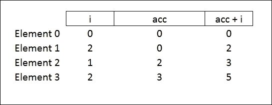

你可能听说过在大数据背景下使用的 map/reduce 表达式。这是因为大数据分析的一些先驱，如 Google 和 Yahoo，基于 map/reduce 的概念创建了 Hadoop。Hadoop 是一个大数据平台，包括文件系统（HDFS）、查询语言（Hive 和 PIG）和机器学习（Mahdut）。通常，当人们谈论 Hadoop 和 map/reduce 时，他们是在谈论一个使用键/值对的特殊实现。此外，map/reduce 的*map*部分通常分布在一千台通用机器上。*reduce*可以根据传递给 reduce 的函数的性质进行分布。如果函数在数据集的某个部分上执行`groupBy`或其他计算，它就可以进行分布。在本章中，我们将分布 map，但不会分布 reduce。

为了说明为什么 map/reduce 在大数据中很受欢迎，让我们将映射分布到我的机器上的所有核心。这可以模拟 Hadoop 如何在成千上万的联网计算机之间分配处理。进入 Visual Studio 并打开 NuGet 包管理器，输入以下内容：

```py
PM> Install-Package FSharp.Collections.ParallelSeq

```

接下来，进入`MapReduce.fsx`并在底部输入以下内容：

```py
#r"../packages/FSharp.Collections.ParallelSeq.1.0.2/lib/net40/FSharp.Collections.ParallelSeq.dll"
open FSharp.Collections.ParallelSeq

let stopwatch' = new System.Diagnostics.Stopwatch()
stopwatch'.Start()
let predictionTotal' = 
    inputs' 
    |>PSeq.map(fun i -> knn.Compute i)
    |>Seq.reduce(fun acc i -> acc + i)
let predictionBias' = float predictionTotal'/float 250000
stopwatch'.Stop()
stopwatch'.Elapsed.TotalSeconds
```

将此发送到 FSI 将给我们以下结果：

```py
val stopwatch' : Diagnostics.Stopwatch
val predictionTotal' : int = 109826
val predictionBias' : float = 0.439304
val it : float = 0.0700362

```

注意，代码与前面的代码相同，只是我们现在正在实现映射函数的`PSeq`，因此我们将其分布到所有核心上。你可以看到，通过实现映射函数的并行性，时间显著下降。

如果您认为我们针对大数据场景有解决方案，那么您是错误的。看看当我们尝试处理 540 万条记录时会发生什么：

```py
System.OutOfMemoryException: Exception of type 'System.OutOfMemoryException' was thrown.
>    at Microsoft.FSharp.Collections.ArrayModule.ZeroCreateT

```

我们不能仅用我的机器来分析数据。为了进行映射/归约并将映射分布到多台机器上，我们可以实现 Hadoop 或其更快的兄弟产品 Spark，但那样我们就必须离开 Visual Studio 和.NET，并进入 JVM 的世界。此外，我们还需要学习 Java/Python/Scala，并且无法轻松地与现有的.NET 应用程序集成。作为替代方案，我们可以使用 Azure 的 HDInsight 实现，但那样我们就被锁定在特定的云供应商上了。相反，让我们使用`MBrace`来处理我们的分布式计算。

## MBrace

MBrace 是一个开源项目，用于使用 F#或 C#进行可扩展的数据脚本。您可以在[`mbrace.io/`](http://mbrace.io/)找到网站。MBrace 支持在本地模拟分布式计算以及在 Azure 和即将推出的 AWS 上的实际实现。对于本章，我们将坚持使用本地模拟，这样您就不需要 Azure 或 AWS 订阅来运行示例。

返回 Visual Studio，打开 NuGet 包管理器，并输入以下内容：

```py
PM> Install-Package MBrace.Thespian -pre

```

一旦所有包安装完成，进入`MapReduce.fsx`并在底部添加以下内容（注意，版本号可能因您而异）：

```py
#load"../packages/MBrace.Thespian.1.0.19/MBrace.Thespian.fsx"

open MBrace.Core.Builders
open MBrace.Thespian
open MBrace.Core
open MBrace.Library.Cloud

//Spin up your clusters
let cluster = ThespianCluster.InitOnCurrentMachine(4)

//Basic Example
let number = cloud { return 5 + 10 } |> cluster.Run
```

将此发送到 REPL 后，我们得到了以下结果：

```py
namespace FSI_0007.MBrace

>

val cluster : ThespianCluster

>

val number : int = 15

```

但也要注意在您的机器上 Visual Studio 之外发生的事情。您可能得到了这个对话框：

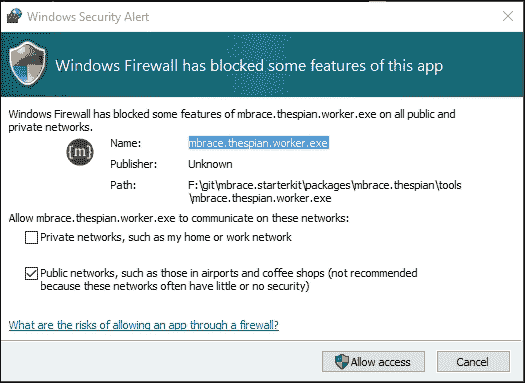

如果是这样，请点击**允许访问**。

接下来，出现了四个对话框，代表您在这行初始化的四个机器：

```py
let cluster = ThespianCluster.InitOnCurrentMachine(4)
```

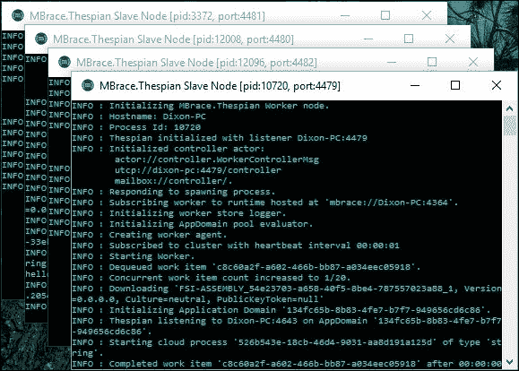

如果您在对话框之间切换，您会注意到其中一个看起来像这样：

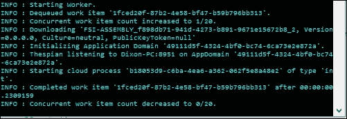

考虑执行以下行：

```py
let number = cloud { return 5 + 10 } |> cluster.Run
```

MBrace 将作业发送到四个控制台中的一个。当使用 MBrace 时，花括号`{}`内的所有内容都会被执行。在这种情况下，它是 5 + 10，但很快它将包含更复杂的计算。

返回`MapReduce.fsx`并在底部添加以下脚本：

```py
let mBraceTotal =
    inputs'
    |>Seq.map(fun i ->cloud { return knn.Compute i })
    |> Cloud.Parallel
    |> cluster.Run
    |>Seq.reduce(fun acc i -> acc + i)

let mBracePrediction = float mBraceTotal/float 250000
```

当您将此发送到 REPL 时，一段时间内不会有太多的事情发生。如果您查看四个控制台窗口，您会看到它们正在努力计算`knn.map`，针对那些 250,000 个值中的每一个：

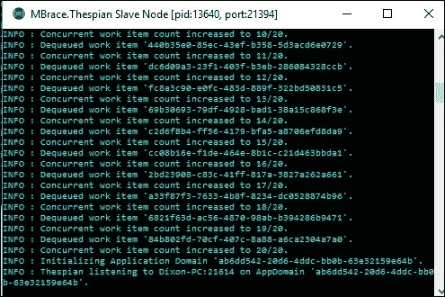

由于这是在本地机器上，并且向不同进程传递数据存在开销，所以它的速度比我们在本章前面看到的内存中的 map/reduce 要慢得多。然而，在现实世界中，当我们拥有的数据比任何一台机器都能处理的多，并且我们可以在 Azure 或 AWS 上启动多台机器时，MBrace 真的非常出色。你也会注意到，我们没有在那些其他四台机器上安装 Accord.NET。Vagabond 是 MBrace NuGet 包的一部分，它为我们处理安装缺失的程序集。这是一种永远不会打折的酷炫品牌。我们不必担心搭建和配置机器，我们可以让 MBrace 为我们处理所有这些。

我们还想使用一种最后的语法。回到`MapReduce.fsx`，在底部添加以下内容：

```py
let mBraceTotal' =
    inputs' |>Balanced.map(fun i -> knn.Compute i) |> cluster.Run
            |>Seq.reduce(fun acc i -> acc + i)

let mBracePrediction' = float mBraceTotal/float 250000
```

将它发送到 REPL 的效果与第一个 MBrace 示例相同。考虑以下行：

```py
|>Balanced.map(fun i -> knn.Compute i) |> cluster.Run

```

这行替换了第一个 MBrace 示例中的这些行：

```py
    |>Seq.map(fun i ->cloud { return knn.Compute i })
    |> Cloud.Parallel
    |> cluster.Run
```

这是我们将用于 AdventureWorks 实现的语法。如果你想深入了解 MBrace，请下载 GitHub 上找到的入门包[`github.com/mbraceproject/MBrace.StarterKit/blo`](https://github.com/mbraceproject/MBrace.StarterKit)。随着我们对 MapReduce 和 MBrace 的介绍完成，让我们看看我们能用 AdventureWorks 数据做什么。

## 分布式逻辑回归

在 Visual Studio **解决方案资源管理器**中，添加一个名为`AdventureWorksLR`的新 F#脚本文件。回到 Visual Studio，打开 NuGet 包管理器，输入以下内容：

```py
PM> Install-Package SQLProvider -prerelease

```

在那个脚本中添加以下代码（你的版本号可能不同）：

```py
#r "../packages/SQLProvider.0.0.11-alpha/lib/net40/FSharp.Data.SQLProvider.dll"

open System
open System.Linq
open FSharp.Data.Sql

[<Literal>]
let connectionString = "data source=nc54a9m5kk.database.windows.net;initial catalog=AdventureWorks2014;user id=PacktReader;password= P@cktM@chine1e@rning;"

type AdventureWorks = SqlDataProvider<ConnectionString=connectionString>
let context = AdventureWorks.GetDataContext()

type Telemetry = {ID:int; BusinessEntityID: int; TimeStamp: System.DateTime; 
                 Longitude: float; Latitude: float; 
                 FrontTirePressure: float; BackTirePressure: float;
                 GearId: int; TireSpeed: float; RiderLevel: int}

let telemetry = query {for t in context.''[Person].[Telemetry]'' do
  join rl in context.''[Person].[RiderLevel]'' on (t.BusinessEntityID = rl.BusinessEntityID)
  select {ID=t.ID; BusinessEntityID=t.BusinessEntityID;
          TimeStamp=t.TimeStamp;
          Longitude=t.Longitude; Latitude=t.Latitude; 
          FrontTirePressure=t.FrontTirePressure;
          BackTirePressure=t.BackTirePressure;
          GearId=t.GearID;TireSpeed=t.TireSpeed;
          RiderLevel=rl.RiderLevel}}
  |>Seq.toArray
```

将此发送到 FSI，我们得到以下结果：

```py
val connectionString : string =
  "data source=nc54a9m5kk.database.windows.net;initial catalog=A"+[72 chars]
type AdventureWorks = FSharp.Data.Sql.SqlDataProvider<...>
val context : FSharp.Data.Sql.SqlDataProvider<...>.dataContext
type Telemetry =
  {ID: int;
   BusinessEntityID: int;
   TimeStamp: System.DateTime;
   Longitude: float;
   Latitude: float;
   FrontTirePressure: float;
   BackTirePressure: float;
   GearId: int;
   TireSpeed: float;
   RiderLevel: int;}
val telemetry : Telemetry [] =
  [|{ID = 1;
     BusinessEntityID = 295;
     TimeStamp = 12/30/2015 3:19:02 PM;
     Longitude = 46.6297;
     Latitude = -97.6087;
     FrontTirePressure = 100.0;
     BackTirePressure = 100.0;
     GearId = 2;
     TireSpeed = 20.04;
     RiderLevel = 0;}; {ID = 2;
                        BusinessEntityID = 775;
```

这里没有新的代码。我们正在创建一个包含我们从物联网自行车中捕获的所有有用数据的`telemetry`类型。然后我们创建一个来自数据库中所有数据的遥测数组。如果你想知道，`telemetry`表中共有 360,000 条记录。

回到脚本，输入以下内容：

```py
#r"../packages/Accord.3.0.2/lib/net40/Accord.dll"
#r"../packages/Accord.Math.3.0.2/lib/net40/Accord.Math.dll"
#r"../packages/Accord.Statistics.3.0.2/lib/net40/Accord.Statistics.dll"
#r"../packages/Accord.MachineLearning.3.0.2/lib/net40/Accord.MachineLearning.dll"

open System
open Accord
open Accord.Math
open Accord.Statistics
open Accord.MachineLearning
open Accord.Statistics.Models.Regression.Linear

Tools.Shuffle(telemetry)
let attachmentPoint = float telemetry.Length * 0.7 |> int
let train = telemetry.[..attachmentPoint]
let test = telemetry.[attachmentPoint+1..]

let trainInputs = train |> Array.map(fun t -> [|float t.GearId; float t.RiderLevel|])
let trainOutputs = train |> Array.map(fun t -> t.TireSpeed)
let target = new MultipleLinearRegression(2, false)
target.Regress(trainInputs, trainOutputs)
```

将此发送到 FSI，我们得到以下结果：

```py
 RiderLevel = 1;}; ...|]
val trainInputs : float [] [] =
 [|[|1.0; 1.0|]; [|2.0; 2.0|]; [|2.0; 1.0|]; [|3.0; 1.0|]; [|1.0; 0.0|];
 [|3.0; 1.0|]; [|4.0; 2.0|]; [|2.0; 0.0|]; [|3.0; 1.0|]; [|1.0; 0.0|];
...|]
val trainOutputs : float [] =
 [|23.3934008; 30.5693388; 18.2111048; 19.3842; 14.007411; 21.861742;
 36.6713256; 14.5381236; 16.2; 25.451495; 25.4571174; 14.5671708;
 20.1900384; 19.3655286; 27.8646144; 21.6268866; 19.3454316; ...|]
val target : MultipleLinearRegression =
 y(x0, x1) = 5.72463678857853*x0 + 6.83607853679457*x1
val it : float = 18472679.55

```

这段代码创建了一个多元线性回归，用于根据骑行者的级别和他们使用的档位来预测自行车速度。不要看 r2，让我们做一个嗅探测试。回到脚本，添加以下内容：

```py
let possible = 
    [|0..4|] 
    |>  Array.collect(fun i -> [|0..2|] 
                               |> Array.map(fun j -> [|float i; float j|]))
let predict = 
    possible
    |> Array.map(fun i -> i, target.Compute(i))
```

将此发送到 REPL，我们得到以下结果：

```py
val possible : float [] [] =
 [|[|0.0; 0.0|]; [|0.0; 1.0|]; [|0.0; 2.0|]; [|1.0; 0.0|]; [|1.0; 1.0|];
 [|1.0; 2.0|]; [|2.0; 0.0|]; [|2.0; 1.0|]; [|2.0; 2.0|]; [|3.0; 0.0|];
 [|3.0; 1.0|]; [|3.0; 2.0|]; [|4.0; 0.0|]; [|4.0; 1.0|]; [|4.0; 2.0|]|]
val predict : (float [] * float) [] =
 [|([|0.0; 0.0|], 0.0); ([|0.0; 1.0|], 6.836078537);
 ([|0.0; 2.0|], 13.67215707); ([|1.0; 0.0|], 5.724636789);
 ([|1.0; 1.0|], 12.56071533); ([|1.0; 2.0|], 19.39679386);
 ([|2.0; 0.0|], 11.44927358); ([|2.0; 1.0|], 18.28535211);
 ([|2.0; 2.0|], 25.12143065); ([|3.0; 0.0|], 17.17391037);
 ([|3.0; 1.0|], 24.0099889); ([|3.0; 2.0|], 30.84606744);
 ([|4.0; 0.0|], 22.89854715); ([|4.0; 1.0|], 29.73462569);
 ([|4.0; 2.0|], 36.57070423)|]

```

在这个脚本中，`possible`是一个所有可能的档位（值 0 到 4）和骑行者级别（值 0 到 2）组合的交错数组。然后我们用`Compute()`方法的结果填充这个矩阵。当你将数据以更用户友好的方式呈现时，你可以看到存在一种关系——精英骑行者在所有档位上比初学者骑得快，而且看起来初学者根本不用最低档：

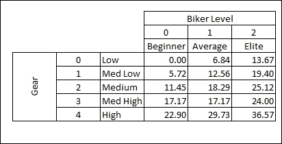

在创建了这个模型之后，我们就可以在数据上运行分类器，并得到给定档位和骑行者级别的预期速度。进入脚本文件，输入以下内容：

```py
#load"../packages/MBrace.Thespian.1.0.19/MBrace.Thespian.fsx"

open MBrace.Core.Builders
open MBrace.Thespian
open MBrace.Core
open MBrace.Library.Cloud

let cluster = ThespianCluster.InitOnCurrentMachine(4)

let testInputs = test |> Array.map(fun t -> [|float t.GearId; float t.RiderLevel|])

let mBraceTotal =
    testInputs 
    |> Balanced.map(fun i ->
                    target.Compute(i)) |> cluster.Run
```

当你将此代码发送到 REPL 时，你会看到控制台窗口弹出并开始工作。几分钟之后，你会得到这个结果：

```py
val mBraceTotal : float [] =
 |36.57070423; 25.12143065; 36.57070423; 18.28535211; 5.724636789;
 24.0099889; 5.724636789; 25.12143065; 24.0099889; 18.28535211; 24.0099889;
 5.724636789; 36.57070423; 12.56071533; 24.0099889; 11.44927358; 0.0;
 11.44927358; 25.12143065; 12.56071533; 30.84606744; 12.56071533;
 11.44927358; 18.28535211;

```

你可能想知道是否有方法可以分发模型的创建（即`target.Regress(trainInputs, trainOutputs)`这一行）。简短的回答是，你不能使用我们正在使用的框架来做这件事。然而，一些模型可能适合分布式和重新聚合，但你必须扩展 numl 和 Accord 提供的内容。

# 物联网

但在我们离开机器学习和物联网之前，让我们疯狂一下。PI 不仅仅是一个输入设备——天哪，它比五年前你买的笔记本电脑还要强大。让我们让我们的树莓派自行车成为三州地区的终极力量。

## PCL 线性回归

进入 Visual Studio，添加一个新的 Visual F# Windows Portable Library (.NET 4.5)名为`AdventureWorks.IOB.PCL`：

![PCL 线性回归项目创建完成后，进入 NuGet 包管理器控制台，输入以下内容：```pyPM> Install-Package portable.accord.statisticsPM> Install-Package portable.accord.MachineLearning```确保默认项目指向`AdventureWorks.IOB.PCL`：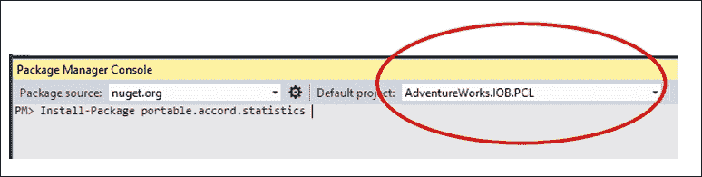

处理 PCL 时遇到的一个问题是，由于它们是.NET Framework 的精简版，因此没有数据访问支持。这意味着我们无法使用我们熟悉的环境类型提供者来获取遥测数据以训练我们的模型。相反，我们需要从不同的项目获取数据，并将这些数据推送到 PCL 中以便训练模型。另一个“陷阱”是，在 PCL 项目中创建的脚本文件在 FSI 中评估，而 FSI 是一个完整的.NET Framework。这意味着你不能假设你写在`.fsx`文件中的所有代码都可以复制粘贴到`.fs`文件中。由于我们是在已有的代码基础上构建的，所以我们将不会在这个部分使用脚本文件。我知道……深呼吸……没有 REPL 的功能性编程。

进入 PCL 项目，删除`Script.fsx`文件，并将`PortableLibrary1.fs`重命名为`SpeedModel.fs`。

在`SpeedModel.fs`文件中，将所有现有代码替换为以下内容：

```py
namespace AdventureWorks.IOB.PCL

open System
open Accord
open Accord.Math
open Accord.Statistics
open Accord.MachineLearning
open Accord.Statistics.Models.Regression.Linear

typeTelemetry = {ID:int; BusinessEntityID: int; 
                 TimeStamp: System.DateTime; 
                 Longitude: float; Latitude: float; 
                 FrontTirePressure: float; 
                 BackTirePressure: float;
                 GearId: int; TireSpeed: float; RiderLevel: int}
typeSpeedModel() = 
letmutable model = newMultipleLinearRegression(2, false)

member this.CurrentModel 
with get() = model
and set (value) = model <- value

member this.Train(telemetries:Telemetry array) = 
        Tools.Shuffle(telemetries)
let inputs = telemetries |>Array.map(fun t -> [|float t.GearId; float t.RiderLevel|])
let outputs = telemetries |>Array.map(fun t -> t.TireSpeed)
        model.Regress(inputs, outputs)

member this.Classify telemetry =
let input = [|float telemetry.GearId; float telemetry.RiderLevel|]
        model.Compute(input)        
```

此代码创建了两个.NET 类。`Telemetry`类相当于在 C#或 VB.NET 中看到的只读 DTO/POCO。`SpeedModel`类则更为复杂。该类有一个属性和两个方法：

+   `CurrentModel`是一个属性，允许设置线性回归模型。请注意，模型是一个内部变量，是可变的。

+   `Train`是一个方法，其中传递一个遥测数组，线性回归模型将被更新。`Train()`的实现可以从之前工作的脚本文件中复制粘贴。

+   `Classify`是一个方法，其中传递一个单个遥测，线性回归计算分数。`Classify()`的实现可以从之前工作的脚本文件中复制粘贴。

你可以通过编译项目来检查一切是否正常。

## 服务层

我们的 PCL 准备好了，让我们构建一个服务层来部署模型到现场设备：

1.  进入 Visual Studio，添加一个新的 Visual C# Web **ASP.NET Web 应用程序**：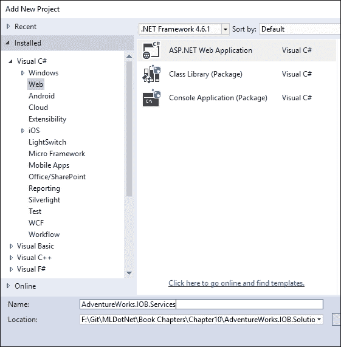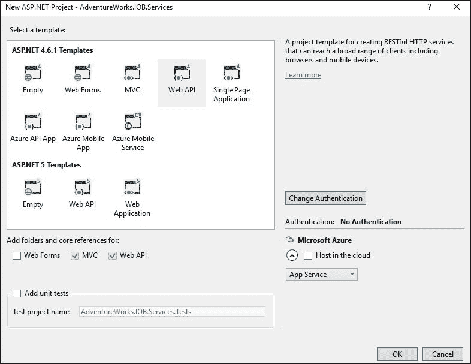

1.  添加一个引用：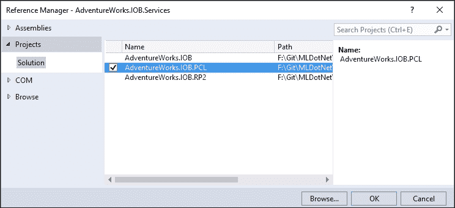

1.  接下来，进入 NuGet 包管理器控制台，添加对`Accord.Statistics`的引用。确保**默认项目**指向`AdventureWorks.IOB.Services`：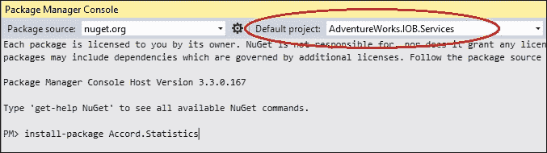

1.  接下来，进入`Web.Config`文件并添加一个连接字符串条目：

    ```py
    <configuration>
    <connectionStrings>
    <addname="Northwind"connectionString="data source=nc54a9m5kk.database.windows.net;initial catalog=AdventureWorks2014;user id=PacktReader;password= P@cktM@chine1e@rning;" />
    </connectionStrings>
    <appSettings>
    <addkey="webpages:Version"value="3.0.0.0" />
    ```

1.  转到`Global.asax.cs`文件，并用以下内容替换整个内容：

    ```py
    using System;
    using System.Collections.Generic;
    using System.Web.Http;
    using System.Web.Mvc;
    using System.Web.Optimization;
    using System.Web.Routing;
    using AdventureWorks.IOB.PCL;
    using System.Threading;
    using System.Configuration;
    using System.Data.SqlClient;

    namespace AdventureWorks.IOB.Services
    {
    publicclassWebApiApplication : System.Web.HttpApplication
        {
    staticObject _lock = newObject();
    Timer _timer = null;
    staticSpeedModel _speedModel = null;

    protectedvoid Application_Start()
            {
    AreaRegistration.RegisterAllAreas();
    GlobalConfiguration.Configure(WebApiConfig.Register);
    FilterConfig.RegisterGlobalFilters(GlobalFilters.Filters);
    RouteConfig.RegisterRoutes(RouteTable.Routes);
    BundleConfig.RegisterBundles(BundleTable.Bundles);

                _speedModel = newSpeedModel();
                _timer = newTimer(TrainModel, null, 0, TimeSpan.FromMinutes(5).Milliseconds);

            }

    protectedTelemetry[] CreateTelemetries(String connectionString)
            {
    var telemetries = newList<Telemetry>();

    using (var connection = newSqlConnection(connectionString))
                {
    var commandText = "Select T.*,RL.RiderLevel from [Person].[Telemetry] as T " +
    "inner join[Person].[RiderLevel] as RL " +
    "on T.BusinessEntityID = rl.BusinessEntityID";
    using (var command = newSqlCommand(commandText, connection))
                    {
                        connection.Open();
    var reader = command.ExecuteReader();
    while(reader.Read())
                        {
                            telemetries.Add(newTelemetry((int)reader[0], (int)reader[1],
                            (DateTime)reader[2], 
                            (double)reader[3], 
                            (double)reader[4],
                            (double)reader[5], 
                            (double)reader[6],(int)reader[7],
                            (double)reader[8], 
                            (int)reader[9]));
                        }
                    }
                }

    return telemetries.ToArray();
            }

            private void TrainModel(object state)
            {
                var connectionString = ConfigurationManager.ConnectionStrings["Northwind"].ConnectionString;
                var telemetries = CreateTelemetries(connectionString);
                lock (_lock)
                {
                    SpeedModel.Train(telemetries);
                }
            }

    publicstaticSpeedModel SpeedModel
            {
    get
                {
    lock (_lock)
                    {
    return _speedModel;
                    }
                }
    set
                {
    lock (_lock)
                    {
                        _speedModel = value;
                    }
                }
            }
        }
    }
    ```

你现在可以编译这个项目了。这段代码与第三章，*更多 AdventureWorks 回归*非常相似，我们创建了一个每 5 分钟触发一次的计时器。此外，我们使用锁来防止模型在非法状态下被读取。当计时器触发时，模型将根据数据库中的数据重新创建。请注意，这是 C#应用程序负责获取传递给`SpeedModel`类的数据的部分。

转到`Controllers`并将`ValuesController`重命名为`SpeedModelController`。进入文件并将所有代码替换为以下内容：

```py
using System.Web.Http;
using System.Net.Http;
using System.IO;
using System.Xml.Serialization;
using System.Net;

namespace AdventureWorks.IOB.Services.Controllers
{
  publicclassSpeedModelController : ApiController
    {
    // GET api/SpeedModel
      publicHttpResponseMessage Get()
        {
          HttpResponseMessage result = null;

          if (WebApiApplication.SpeedModel != null)
            {
              using (MemoryStream stream = newMemoryStream())
                {
                  var formatter = newXmlSerializer(typeof(double[]));
                  formatter.Serialize(stream, WebApiApplication.SpeedModel.CurrentModel.Coefficients);
                  var content = stream.ToArray();

                  result = Request.CreateResponse(HttpStatusCode.OK);
                  result.Content = newByteArrayContent(content);
                  return result;
                }
            }
              else
            {
              return Request.CreateResponse(HttpStatusCode.Gone);
            }
        }

    }
}
```

如果你编译了项目并运行了网站，当你导航到控制器时，你会得到以下内容：

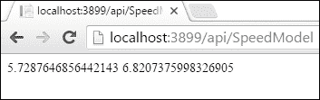

我们现在有一种方法可以根据数据库中的所有数据创建模型，我们可以将其共享给单个客户端。

## 通用 Windows 应用程序和 Raspberry Pi 2

这个通用应用程序有几个组成部分：

+   当应用程序连接到其家庭网络时，它将：

    +   将收集的所有遥测数据上传到 Azure 的 IoT Suite

    +   从我们的服务层下载基于 AdventureWorks 数据库中所有骑手创建的最新全局模型

+   当应用程序运行时，它将从连接到自行车的传感器收集遥测数据。在某个时刻之后，它将开始生成自己的本地模型，并将其与全局 AdventureWorks 模型进行比较。如果本地模型开始偏离全局模型的预期速度，它将指示骑手换挡。应用程序将保留遥测数据在本地存储中，直到它连接到网络，然后上传数据。

让我们来编写这段代码：

1.  进入**解决方案资源管理器**，添加一个新的 Visual C# Windows 通用空白应用程序，命名为`AdventureWorks.IOB.RP2`：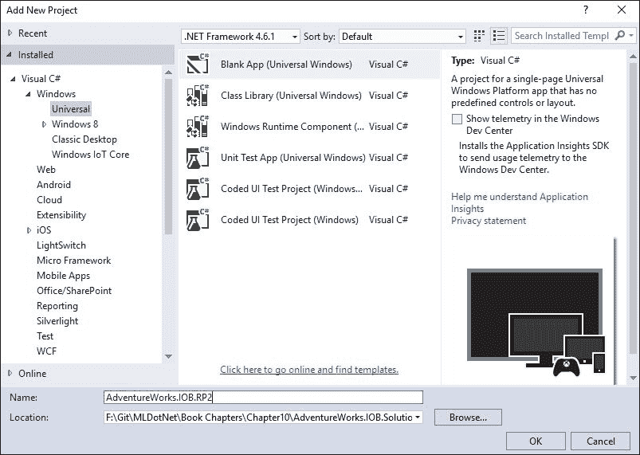

1.  项目创建后，转到其**引用**部分并选择**添加引用**：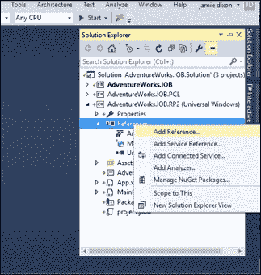

    添加引用...选项

1.  然后导航到**项目** | **解决方案**并选择你的 PCL 项目的位置：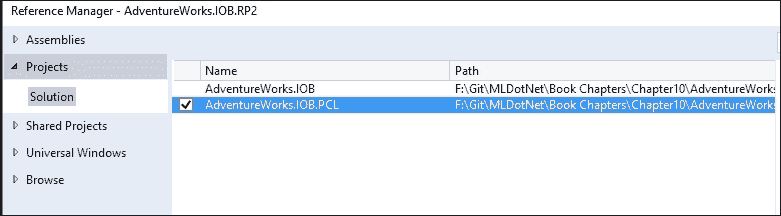

1.  现在导航到**通用 Windows** | **扩展** | **Windows IoT 扩展用于 UWP**：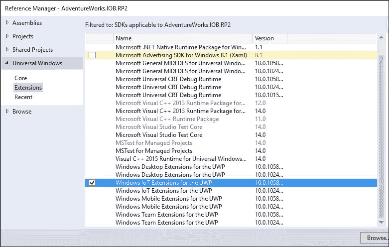

1.  接下来，进入 NuGet 包管理器控制台，输入以下内容：

    ```py
    PM> Install-Package portable.accord.statistics

    ```

1.  确保默认项目指向`AdventureWorks.IOB.RP2`：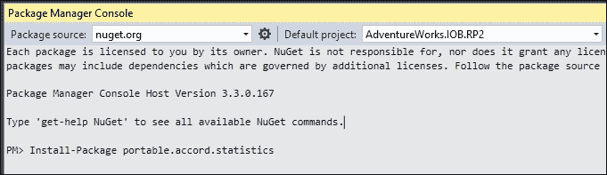

    构建项目以确保一切正常。

1.  接下来，转到**解决方案资源管理器**，添加一个名为`Sensors`的新文件夹：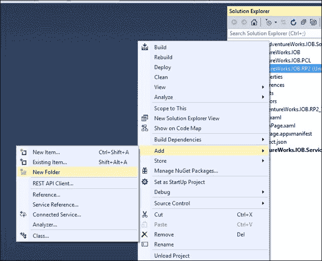

    添加新文件夹

1.  导航到`Sensors`文件夹：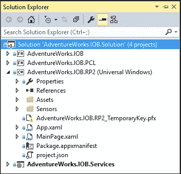

1.  添加一个名为`TelemetryEventArgs.cs`的新类：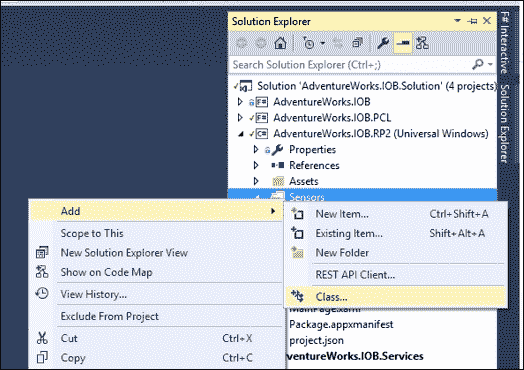

    添加一个新类

1.  在`TelemetryEventArgs.cs`中，用以下代码替换现有代码：

    ```py
    using AdventureWorks.IOB.PCL;
    using System;

    namespace AdventureWorks.IOB.RP2.Sensors
    {
      Public class TelemetryEventArgs : EventArgs
        {
          Public Telemetry Telemetry { get; set; }
        }
    }
    ```

1.  在传感器文件夹中，添加一个名为`IBikeController`的新接口。创建后，用以下代码替换所有代码：

    ```py
    using System;

    namespace AdventureWorks.IOB.RP2.Sensors
    {
    Public interface IBikeController
        {
          Event EventHandler<TelemetryEventArgs> TelemetryCreated;
          void SwitchGear(int targetGear);
        }
    }
    ```

    此接口将由主应用程序用于，嗯，与树莓派进行接口交互。Pi 通过一个名为`TelemetryCreated`的事件将信息传回主应用程序。我们之所以使用接口（而不是直接与 PI 交谈），是因为我们想要借鉴 SOLID 原则，并为我们的应用程序提供几个实现：一个内存中的自行车控制器，我们可以用它来确保一切连接正确，以及一个实际的树莓派自行车控制器，它实际上与我们现在可用的硬件进行通信。此外，市场上有很多传感器，我们需要一种方法在不更改现有代码的情况下添加新传感器。

1.  进入`Sensors`文件夹，添加一个名为`InMemoryBikeController`的新类。用以下代码替换现有代码：

    ```py
    using AdventureWorks.IOB.PCL;
    using System;
    using System.Threading;

    namespace AdventureWorks.IOB.RP2.Sensors
    {

        public class InMemoryBikeController : IBikeController
        {
            Timer _timer = null;

            public InMemoryBikeController()
            {
                _timer = new Timer(GenerateTelemetry, null, 0, TimeSpan.FromSeconds(1).Milliseconds);
            }

            public event EventHandler<TelemetryEventArgs> TelemetryCreated;

            private void GenerateTelemetry(object state)
            {
                var telemetry = new Telemetry(0, 0, DateTime.UtcNow, 46.6297, -97.6087, 100.0, 100.0, 2, 10.0, 1);
                var args = new TelemetryEventArgs() { Telemetry = telemetry };

                if (TelemetryCreated != null)
                {
                    TelemetryCreated(this, args);
                }
            }

            public void SwitchGear(int targetGear)
            {

            }
        }
    }
    ```

    此代码模拟了一个实际的树莓派。每秒，它触发一个带有一些硬编码遥测数据的事件。它还有一个`SwitchGears`的方法占位符，什么都不做。

1.  确保一切编译正常，跳转到`MainPage.xaml`文件，并用以下内容替换所有内容：

    ```py
    <Page
      x:Class="AdventureWorks.IOB.RP2.MainPage"

      mc:Ignorable="d">

      <Grid Background="{ThemeResource ApplicationPageBackgroundThemeBrush}">
      <StackPanel HorizontalAlignment="Center" VerticalAlignment="Center">
      <TextBox x:Name="StatusMessage" Text="IOB Ready!" Margin="10" IsReadOnly="True"/>
      </StackPanel>
      </Grid>
    </Page>
    ```

    这创建了一个状态框，你可以用它进行调试。当你将此应用程序部署到树莓派时，这就不必要了，因为没有图形用户界面。

1.  接下来，进入`MainPage.xaml.cs`文件，并用以下内容替换所有内容：

    ```py
    using System;
    using System.IO;
    using System.Linq;
    using Windows.UI.Xaml;
    using Windows.Web.Http;
    using AdventureWorks.IOB.PCL;
    using Windows.UI.Xaml.Controls;
    using System.Xml.Serialization;
    using System.Collections.Generic;
    using AdventureWorks.IOB.RP2.Sensors;
    using Windows.Networking.Connectivity;
    using Accord.Statistics.Models.Regression.Linear;

    namespace AdventureWorks.IOB.RP2
    {
      publicsealedpartialclassMainPage : Page
        {
          String _networkName = String.Empty;
          SpeedModel _globalSpeedModel = null;
          SpeedModel _localSpeedModel = null;
          List<Telemetry> _telemetries = null;
          IBikeController _bikeController = null;
          DispatcherTimer _timer = null;

          public MainPage()
            {
               this.InitializeComponent();
               _networkName = "MySafeNetwork";
               _globalSpeedModel = newSpeedModel();
               _localSpeedModel = newSpeedModel();
               _telemetries = newList<Telemetry>();
               _bikeController = newInMemoryBikeController();
               _timer = newDispatcherTimer();

               _timer.Interval = newTimeSpan(0, 0, 1);

               NetworkInformation.NetworkStatusChanged += NetworkInformation_NetworkStatusChanged;
               _bikeController.TelemetryCreated += _bikeController_TelemetryCreated;
               _timer.Tick += _timer_Tick;

            }

            privatevoid _timer_Tick(object sender, object e)
            {
              if(_telemetries.Count > 300)
                {
                  _localSpeedModel.Train(_telemetries.ToArray());

                  var targetGlobalGear = _globalSpeedModel.Classify(_telemetries.Last());
                  var targetLocalGear = _localSpeedModel.Classify(_telemetries.Last());
                  if (targetGlobalGear < targetLocalGear)
                    {
                       _bikeController.SwitchGear((int)targetGlobalGear);
                    }
                }
            }

            privatevoid _bikeController_TelemetryCreated(object sender, TelemetryEventArgs e)
            {
               _telemetries.Add(e.Telemetry);
            }

            privatevoid NetworkInformation_NetworkStatusChanged(object sender)
            {
              var connectionProfile = NetworkInformation.GetInternetConnectionProfile();
              if (connectionProfile.ProfileName == _networkName)
                {
                   GetGlobalModel();
                   UploadLocalTelemetryData();
                }
            }

            privateasyncvoid GetGlobalModel()
            {
              var client = newHttpClient();
              var uri = newUri("http://localhost:3899/api/SpeedModel");
              try
                {
                  var response = await client.GetAsync(uri);
                  if (response.IsSuccessStatusCode)
                    {
                      var content = await response.Content.ReadAsInputStreamAsync();
                      using (var stream = content.AsStreamForRead())
                        {
                          var formatter = newXmlSerializer(typeof(double[]));
                          var coefficients = (double[])formatter.Deserialize(stream);
                          var regression = newMultipleLinearRegression(2);
                          Array.Copy(coefficients, regression.Coefficients,coefficients.Length);
                          _globalSpeedModel.CurrentModel = regression;
                        }
                    }
                }
                catch (Exception e)
                {
                   this.StatusMessage.Text = e.ToString();
                }

            }

              privateasyncvoid UploadLocalTelemetryData()
            {
    //TODO: Send _telemetries to Azure IoT Suite
            }

        }
    }
    ```

    这就是重头戏所在。当应用程序启动时，它开始一个每秒触发一次的计时器（`_timer_Tick`）。如果本地集合中有超过 5 分钟的数据，它将生成一个`SpeedModel`。然后，它将这个速度模型与全局模型进行比较，如果全局输出小于本地输出，它将通过`.SwitchGear()`向骑手发出信号。实际实现取决于控制器。正如你将在一分钟内看到的那样，树莓派控制器会打开一个骑手可以看到的 LED 灯。在其他示例中，我们可以将 Pi 连接到自行车的变速机构，为骑手换挡——就像自行车的自动变速器一样。

1.  接下来，进入**解决方案资源管理器**，右键点击**属性**，将启动项目更改为**多个启动项目**，并将`Services`和`RP2`项目更改为**启动**。`Services`项目必须列在`RP2`项目之前：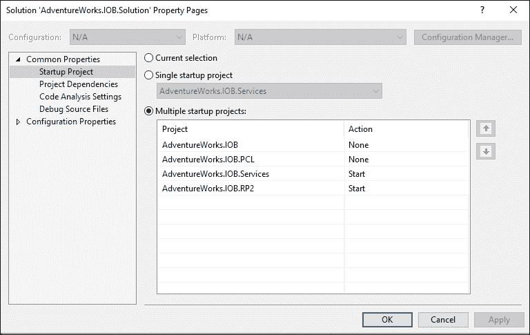

1.  在我们运行此应用之前，你需要做的最后一件事是部署通用 Windows 应用。如果你问我为什么需要先部署它，我会告诉你，“因为微软说了。”进入**解决方案资源管理器**，右键点击`Rp2`项目，并选择**部署**：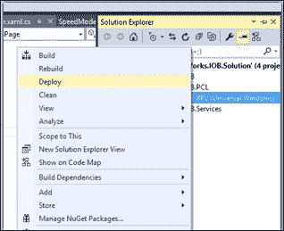

    部署选项

1.  现在，你可以运行应用，浏览器将弹出服务层，通用 Windows 应用将启动：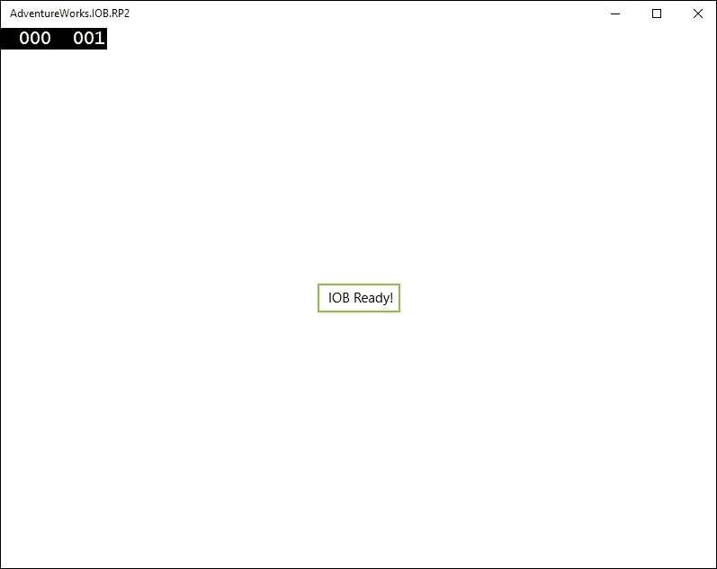

注意屏幕上没有发生太多事情。这在物联网项目中很典型；动作发生在设备和连接的外围设备上。如果设备触发了`NetworkStatus_Changed`事件，设备将获取最新的全局模型并上传全局模型。如果你是那种想在屏幕上看到东西的人，你可以通过放置`GetGlobalModelinMainPage()`并写入状态框来模拟此操作。

让我们构建`BikeController`的树莓派实现。由于这是一本关于机器学习的书，而不是关于物联网的书，因此我不会涵盖设置树莓派和进行所有布线和编码的细节。作为一个参考框架，我使用了在[`ms-iot.github.io/content/en-US/win10/samples/Potentiometer.htm`](http://ms-iot.github.io/content/en-US/win10/samples/Potentiometer.htm)找到的示例。基本上，每个传感器都会被视为一个模拟输入设备（如电位计），它将信号转换为数字信号。对于每个输入，创建了一个`SpiConnection`，如下所示：

```py
privateasyncTask<SpiDevice> InitSPI(int pin)
        {
            var settings = newSpiConnectionSettings(pin);
            settings.ClockFrequency = 500000;   
            settings.Mode = SpiMode.Mode0;    

            string spiAqs = SpiDevice.GetDeviceSelector("SPI0");
            var deviceInfo = awaitDeviceInformation.FindAllAsync(spiAqs);
            returnawaitSpiDevice.FromIdAsync(deviceInfo[0].Id, settings);
        }
```

每秒，读取每个设备的缓冲区：

```py
privatevoid SensorTimer_Tick(ThreadPoolTimer timer)
        {
byte[] readBuffer = newbyte[3]; 
byte[] writeBuffer = newbyte[3] { 0x00, 0x00, 0x00 };
            writeBuffer[0] = 0x06;

//Gear
            _gear.TransferFullDuplex(writeBuffer, readBuffer);
var gear = convertToInt(readBuffer);
```

读取被汇总到遥测数据中，并引发事件：

```py
var telemetry = newTelemetry(0, _businessEntityID, DateTime.UtcNow,
                latitude, longitude, frontTire, backTire, gear, tireSpeed, _riderLevel);
var args = newTelemetryEventArgs() { Telemetry = telemetry };

if (TelemetryCreated != null)
            {
                TelemetryCreated(this, args);
            }
```

同时，另一个计时器正在运行，每两秒关闭一次 LED。当调用`SwitchGear`方法时，LED 被设置：

```py
public void SwitchGear(int targetGear)
        {
            _led.Write(GpioPinValue.Low);
        }
```

因此，控制器应用可以打开 LED，然后树莓派在两秒后关闭它。你可以在书中附带的代码示例中看到最终结果。

## 部署选项

下一步

+   我省略了一些重要的物联网问题，这些问题需要解决才能使这个自行车应用完全功能化：

+   如何将此应用部署到树莓派超出了本书的范围。你可以在[`dev.windows.com/en-US/iot`](https://dev.windows.com/en-US/iot)了解更多信息。

+   将遥测数据存储到本地超出了本书的范围。这是一个通用的 Windows 应用程序问题，您可以在[`msdn.microsoft.com/en-us/library/windows/apps/dn894631.aspx`](https://msdn.microsoft.com/en-us/library/windows/apps/dn894631.aspx)进行查询。

+   将数据上传到 Azure IoT 套件超出了本书的范围。您可以在[`www.microsoft.com/en-us/server-cloud/internet-of-things/azure-iot-suite.aspx`](https://www.microsoft.com/en-us/server-cloud/internet-of-things/azure-iot-suite.aspx)找到更多相关信息。

# 摘要

这是一章相当雄心勃勃的内容。我们探讨了大数据的一些挑战以及如何使用 MBrace 帮助我们进行分布式机器学习。然后我们创建了一个示例物联网项目，以展示大数据是如何生成的，以及我们如何部署机器学习模型到设备上。该物联网应用使用了两个机器学习模型以获得最佳结果。然后我们简要地探讨了如何利用.NET 的力量构建多个输入设备，以便我们可以扩展到目前和未来可用的各种物联网硬件。
