# 第二章. 实际应用中的现实世界监督学习

从带有明显目标或标签的观察中学习的能力，通常是为了对未见数据做出预测，这被称为**监督机器学习**。如果目标是类别，则问题属于分类；如果目标是数值，则称为**回归**。实际上，所尝试的是推断将数据映射到目标的功能。监督机器学习在广泛的机器学习应用中被广泛使用，无论是有标签数据可用还是标签可以手动添加。

监督机器学习的核心假设是，从训练数据中学习到的模式将在未见数据中表现出来。

在本章中，我们将讨论在训练模型之前用于探索、分析和预处理数据的步骤。然后，我们将介绍从简单的线性模型到复杂的集成模型的不同建模技术。我们将展示不同的评估指标和验证标准，这些标准使我们能够比较模型性能。一些讨论伴随着简短的数学解释，这有助于更精确地表达概念并激发更多数学倾向读者的兴趣。在本章中，我们将重点关注分类作为监督学习方法，但原则同样适用于分类和回归，这是监督学习的两个广泛应用。

从本章开始，我们将介绍工具来帮助说明每个章节中提出的概念是如何用于解决机器学习问题的。没有什么比将新学的材料直接应用于现实世界问题更能加强对新材料的理解了。在这个过程中，我们往往比仅仅被动吸收理论更能获得更清晰、更相关的理解。如果学习新工具的机会是学习的一部分，那就更好了！为了达到这个目标，我们将介绍一个大多数数据科学从业者都熟悉的数据集，并使用它来解决一个分类问题，同时突出引导解决方案的过程和方法。

在本章中，我们将使用 RapidMiner 和 Weka 来构建从单个知名数据集中学习的过程。工作流程和代码可在网站上供读者下载、执行和修改。

RapidMiner 是一个基于 GUI 的 Java 框架，它使得在工具内部从头到尾进行数据科学项目变得非常容易。它有一个简单的拖放界面来构建工作流程，用于摄取和清理数据，探索和转换特征，使用广泛的机器学习算法进行训练，进行验证和模型评估，将最佳模型应用于测试数据，等等。它是学习如何使流程的各个部分协同工作并快速产生结果的一个优秀工具。Weka 是另一个基于 GUI 的框架，它有一个我们将用于说明执行分析所需的更多编码的 Java API。

本章我们将涵盖的主要主题包括：

+   数据质量分析

+   描述性数据分析

+   可视化分析

+   数据转换和预处理

+   数据采样

+   特征相关性分析和降维

+   模型构建

+   模型评估、评估和比较

+   案例研究—马绞痛分类

# 形式描述和符号

我们希望介绍一些用于监督学习中使用的术语的符号和形式定义。在不指定的情况下，我们将遵循这种符号贯穿本书的其余部分，并在遇到新概念时适当扩展。这种符号将提供一个精确和一致的语言来描述术语，并使对主题的理解更加快速和高效。

+   **实例**：每个观察都是数据实例。通常变量 *X* 用于表示输入空间。每个数据实例有许多变量（也称为特征），被称为 **x**（用粗体表示的向量表示）的维度为 *d*，其中 *d* 表示每个实例中的变量或特征或属性的数量。特征表示为 **x** = *(x*[1]*,x*[2]*,…x*[d]*)*^T，其中每个值在它是数值时对应于特征值。

+   **标签**：标签（也称为目标）是感兴趣的因变量，通常用 *y* 表示。在 **分类** 中，标签的值是问题域中定义良好的类别；它们不需要是数值或可以排序的事物。在 **回归** 中，标签是实数值。

+   **二元分类**，其中目标只取两个值，在数学上表示为：

    y ∈ {1,–1}

+   **回归**，其中目标可以取实数域内的任何值，表示为：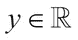

+   **数据集**：通常，数据集用 *D* 表示，由单个数据实例及其标签组成。实例通常表示为集合 {**x**[1],**x**[2]…**x**[n]}。每个实例的标签表示为集合 **y** = {*y*[1]*,y*[2]*,…y*[n]}。整个标记数据集表示为集合中的配对元素，如 *D* = {(**x**[1], *y*[1]),(**x**[2], *y*[2])…(**x**[n], *y*[n])}，其中  用于实值特征。

## 数据质量分析

从质量较差的数据中可以学习到的东西有限。质量问题的因素可能包括，但不仅限于，噪声数据、缺失值和标签错误。因此，第一步是理解我们面前的数据，以便我们确定如何解决任何数据质量问题。异常值仅仅是噪声，还是表明人口中有有趣的异常？对于所有特征，缺失数据是否应该以相同的方式处理？稀疏特征应该如何处理？这些问题以及类似的问题在最初就显现出来。

如果我们很幸运，我们会收到一个清洗过的、准确标记的数据集，并附带描述数据元素、数据的血统以及是否对数据进行过任何转换的文档。这样的数据集就可以准备好按照数据采样部分描述的方法分成训练、验证和测试样本。然而，如果数据没有清洗并且不适合用于我们的目的，我们必须在采样开始之前以原则性的方式准备数据。（数据分区的意义将在本章的“训练、验证和测试集”部分中解释）。

在接下来的章节中，我们将讨论在分析特征之前所需的数据质量分析和转换步骤。

## 描述性数据分析

应对以下特征进行分析和总结的完整数据样本（包括训练、验证和测试）。在数据尚未分成训练、验证和测试的情况下，数据转换的任务需要确保样本具有相似的特征和统计信息。这对于确保训练的模型可以泛化到未见过的数据至关重要，正如我们将在数据采样部分所学到的。

### 基本标签分析

分析的第一步是理解不同集合以及整体数据中标签的分布。这有助于确定例如目标变量的分布是否存在不平衡，以及这种不平衡是否在所有样本中一致。因此，第一步通常是找出训练集和测试集中每个类别的例子数量。

### 基本特征分析

下一步是计算每个特征的统计信息，例如

+   唯一值的数量

+   缺失值的数量：可能包括按不同缺失值代理（NA、null、?等）分组的计数。

+   对于分类：这是跨特征类别的计数，按标签类别跨特征类别的计数，最频繁出现的类别（众数），按标签类别的众数等。

+   对于数值：最小值、最大值、中位数、标准差、方差等。

特征分析提供了基本的见解，这些见解可以作为缺失值和噪声的有用指标，这些缺失值和噪声可能会影响学习过程或算法的选择。

## 可视化分析

数据的可视化是一个广泛的话题，它是在机器学习和数据挖掘领域不断发展的一个领域。我们只将涵盖一些有助于我们在实践中分析数据的可视化重要方面。

### 单变量特征分析

这里的目标是每次可视化一个特征，与标签相关。使用的技术如下：

#### 分类特征

堆叠条形图是一种简单的方式来展示每个特征类别在标签中的分布，当问题是一类分类时。

#### 连续特征

直方图和箱线图是连续特征的两种基本可视化技术。

直方图有预定义的区间，其宽度要么是固定的间隔，要么是基于某种用于分割特征值全范围的计算。然后计算每个区间内的数据实例数量，并根据这个计数调整区间的身高。直方图有各种变体，如相对直方图或基于频率的直方图、帕累托直方图、二维直方图等；每个都是概念的一小部分变化，允许对特征有不同见解。对于那些想了解更多关于这些变体的人来说，维基百科上的直方图文章是一个很好的资源。

箱线图是数值特征的键视觉技术，因为它们以百分位数和异常值来展示分布。

### 多变量特征分析

多变量特征分析的想法是可视化多个特征，以深入了解它们之间的关系。这里解释了一些著名的图表。

+   **散点图**：理解不同特征之间以及特征和标签之间关系的重要技术。在实践中通常使用二维散点图，其中数值特征形成维度。数据点在某些想象轴上的对齐显示相关性，而数据点的散射则显示无相关性。它还可以用于在低维空间中识别簇。气泡图是散点图的变体，其中两个特征形成维度轴，第三个特征与数据点的尺寸成比例，该图呈现出“气泡”场的样子。密度图通过引入数据点颜色、背景颜色等，帮助可视化更多特征，从而提供额外的见解。

+   **散点图矩阵**：散点图矩阵是散点图的扩展，其中为每个特征（和标签）可视化了成对的散点图。它提供了一种有效的方式，以比较和执行高维数据的多元分析。

+   **并行图**：在这种可视化中，每个特征线性排列在 x 轴上，每个特征的值域形成 y 轴。因此，每个数据元素都表示为一条线，该线上的每个特征值都位于平行轴上。如果可用，类标签用于着色线条。并行图提供了对有效分离数据的特征的良好理解。偏差图是并行图的变体，其中不是显示实际数据点，而是绘制均值和标准偏差。Andrews 图是并行图的另一种变体，其中使用傅里叶级数转换数据，并将对应于每个数据的函数值投影。

# 数据转换和预处理

在本节中，我们将涵盖数据转换的广泛主题。数据转换的主要思想是将输入数据以谨慎的方式进行转换，以便对其进行清理，从中提取最相关的信息，并将其转换为可用于进一步分析和学习的可用形式。在这些转换过程中，我们必须只使用在设计时考虑到不添加任何可能影响数据完整性的偏差或伪影的方法。

## 特征构建

在某些数据集的情况下，我们需要从已给出的特征中创建更多特征。通常，会使用常见的聚合器，如平均值、总和、最小值或最大值，以创建额外的特征。例如，在金融欺诈检测中，卡欺诈数据集通常包含账户在活跃期间不同时间段的交易行为。通过捕获“每天发生借记交易时的金额总和，对于每个账户，一天之内”的行为合成，就是一个特征构建的例子，它为数据集添加了一个新的维度，这个维度是由现有特征构建的。一般来说，设计新的特征以增强数据的预测能力需要领域知识和对数据的经验，这使得它既是一门艺术也是一门科学。

## 处理缺失值

在现实世界的数据集中，通常许多特征都有缺失值。在某些情况下，它们是因测量错误、记录失误或由于各种情况下的不可用而缺失；例如，个人可能选择不透露年龄或职业。为什么要在乎缺失值呢？一种极端且不罕见的方法是忽略任何具有缺失特征的记录，换句话说，只保留“完整”的例子。当数据中广泛存在缺失特征时，这种方法可能会严重减少数据集的大小。正如我们稍后将要看到的，如果我们处理的是一个复杂系统，数据集的大小可以给我们带来宝贵的优势。此外，即使存在缺失值，只要我们使用适当的措施来处理问题，即使在“不完整”的记录中，也常常可以挖掘出有预测价值的值。另一方面，当数据本身的省略本身具有重要意义时，如贷款申请中故意隐瞒信息以掩盖事实的情况，可能会无意中丢弃关键信息。

以下是学习过程中的一个重要步骤，即采用某种系统的方式来处理缺失值，并理解每个案例中决策的后果。有一些算法，如朴素贝叶斯，对缺失值不太敏感，但通常，在数据上进行分析之前，将这些缺失值作为预处理步骤处理是良好的实践。以下是一些处理缺失值的方法。

+   **用均值和众数替换**：当我们用特征的均值替换连续值特征的缺失值时，新的均值显然保持不变。但如果均值受到异常值的影响很大，更好的方法可能是使用计算中去除异常值后的均值，或者使用中位数或众数，而不是均值。同样，当特征在数据集中稀疏表示时，均值可能没有意义。对于具有分类值的特征，用样本中出现频率最高的值替换缺失值是一个合理的选择。

+   **通过插补替换**：当我们插补一个缺失值时，实际上是在构建一个关于该特征的分类或回归模型，并基于记录中的其他特征进行预测，以便对缺失值进行分类或估计。

+   **最近邻插补法**：对于分类特征的缺失值，我们将该特征视为目标，并使用已知的类别数量 k 训练一个 KNN 模型。然后使用此模型来预测缺失值。（KNN 模型是非参数的，根据其邻居的函数为其“传入”数据实例分配一个值——该算法将在本章后面关于非线性模型时进行描述）。

+   **基于回归的插补**：在连续值变量的情况下，我们使用线性模型如线性回归来估计缺失数据——原理与分类值相同。

+   **用户定义的插补**：在许多情况下，用于插补缺失值的最合适的值必须来自问题域。例如，pH 值为 7.0 是中性的，更高的是碱性，更低的是酸性。对于 pH 值，插补一个中性值可能比均值或中位数更有意义，这种洞察力是用户定义插补的一个例子。同样，在用正常体温或静息心率进行替换的情况下——所有这些都是来自医学的例子。

## 异常值

处理异常值需要大量的注意和分析。异常值可能是数据中的噪声或错误，也可能是特定感兴趣的特殊行为。后一种情况在第三章“无监督机器学习技术”中进行了深入讨论。在这里，我们假设前一种情况，即领域专家满意地认为这些值确实是第一种意义上的异常值，即噪声或错误获取或记录的数据，需要适当处理。

以下是检测数据中异常值的不同技术

+   **四分位数范围（IQR）**：四分位数范围是数据变异性的度量，或者说，是统计分散度的度量。每个数值特征根据其在数据集中的值进行排序，然后有序集被分为四分位数。通常使用中位数来衡量集中趋势。IQR 被测量为上四分位数和下四分位数的差，即 Q3-Q1。通常认为，异常值是高于 Q3 + 1.5 * IQR 和低于 Q1 - 1.5 * IQR 的数据值。

+   **基于距离的方法**：基于距离的最基本方法使用**k-最近邻**（**k-NN**）和距离度量来评分数据点。通常的参数是 k-NN 中的值*k*和一个距离度量，如欧几里得距离。距离最远的数据点被认为是异常值。有许多变体使用局部邻域、概率或其他因素，这些将在第三章，*无监督机器学习技术*中全部涵盖。混合数据集，既有分类特征又有数值特征，可能会扭曲基于距离的度量。

+   **基于密度的方法**：基于密度的方法计算给定距离*D*内数据点的比例，如果比例小于指定的阈值*p*，则被认为是异常值。参数*p*和*D*被认为是用户定义的值；选择这些值适当的挑战是使用这些方法在预处理阶段的主要障碍之一。

+   **特征的数学变换**：对于非正态数据，比较平均值是非常误导的，例如在存在异常值的情况下。非参数统计使我们能够对高度偏斜的数据做出有意义的观察。使用对数或平方根函数对这些值进行变换往往会在许多情况下使数据归一化，或者使它们更容易进行统计测试。这些变换会极大地改变特征的分布形状——异常值越极端，对数变换的影响就越大，例如。

+   **在机器学习模型中使用鲁棒统计算法处理异常值**：我们将在下一节建模中讨论的许多分类算法，隐式或显式地处理异常值。作为元学习框架的 Bagging 和 Boosting 变体，通常对异常值或噪声数据点具有弹性，可能不需要预处理步骤来处理它们。

+   **归一化**：许多算法——基于距离的方法就是一个例子——对特征的规模非常敏感。预处理数值特征确保它们都在一个良好的行为范围内。这里给出了特征归一化的最知名技术：

    +   **最小-最大标准化**：在这种技术中，给定范围 *[L,U]*，通常是 *[0,1]*，每个具有值 *x* 的特征分别使用最小值和最大值 *x*[max] 和 *x*[min] 进行归一化，使用以下公式：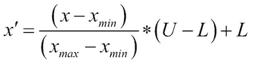

    +   **Z 分数标准化**：在这种技术中，也称为标准化，特征值会自动转换，使得平均值是 0，标准差是 1。转换的技术如下：对于每个特征 *f*，计算其均值 µ(*f*) 和标准差 σ(*f*)，然后将具有值 *x* 的特征转换如下：

    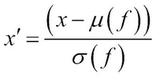

## 离散化

许多算法只能处理分类值或名义值才能有效，例如贝叶斯网络。在这种情况下，将数值特征通过监督或无监督方法离散化为类别变得至关重要。讨论的一些技术包括：

+   **通过分箱进行离散化**：这种技术也被称为等宽离散化。对于每个特征 *f* 的整个数据范围，从值 *x*[max] 到 *x*[min]，被划分为预定义的 *k* 个等间隔，每个间隔的宽度为 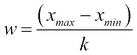。"切割点"或离散化间隔如下：

+   **通过频率进行离散化**：这种技术也被称为等频率离散化。特征被排序后，整个数据被离散化为预定义的 *k* 个间隔，使得每个间隔包含相同比例的数据。这两种技术，通过分箱和通过频率的离散化，由于预定义的 *k* 值而损失信息。

+   **通过熵进行离散化**：给定标签，计算在值变化的迭代点处的熵，使得区间的箱子尽可能纯净或具有区分性。请参阅*特征评估技术*部分，了解基于熵（信息增益）的理论和计算。

## 数据采样

接收到的数据集可能经常需要谨慎采样，以便有效地从数据中学习。数据的特征以及建模练习的目标决定了是否需要采样，以及如何进行。在我们开始从这些数据中学习之前，创建训练、验证和测试数据样本至关重要，如本节所述。

### 是否需要采样？

当数据集很大或噪声较多，或者偏向于某一类型时，是否进行采样的问题变得重要。答案取决于各种方面，如数据集本身、目标以及用于选择模型的评估标准，以及可能的其他实际考虑。在某些情况下，算法在内存和空间方面存在可扩展性问题，但通过模型性能（根据它们预期实现的回归或分类目标）在样本上工作得很好。例如，SVM 在内存和训练时间上的可扩展性分别为*O(n²)*和*O(n³)*。在其他情况下，数据的不平衡程度如此之高，以至于许多算法不足以处理偏斜。在文献中，通过创建新的训练样本来重新平衡原始数据集中类别分布的步骤也被称为**重采样**。

### 欠采样和过采样

在类别分布上存在明显不平衡的数据集可以称为包含一个独特的少数类。通常，这个少数类是我们特别感兴趣的实例集合，因为其成员在如此罕见的情况下出现。例如，在信用卡欺诈中，不到 0.1%的数据属于欺诈。这种偏斜不利于学习；毕竟，当我们寻求最小化分类的总误差时，我们给予所有类别相同的权重，无论一个类别相对于另一个类别是否代表性不足。在二元分类问题中，我们将少数类称为正类，将多数类称为负类，这是我们将在以下讨论中遵循的惯例。

大类欠采样是一种常用的技术，用于解决数据中的偏斜问题。以信用卡欺诈为例，我们可以从原始数据集中创建不同的训练样本，使得每个样本都包含原始数据集中的所有欺诈案例，而非欺诈实例则以某种固定的比例分布在所有训练样本中。因此，通过这种方法创建的给定训练集中，与原始偏斜数据集相比，多数类现在代表性不足，从而有效地平衡了类别的分布。可以通过这种方式创建带有标记的正例和负例实例，比例为，例如，1:20 到 1:50，但必须注意，使用的负例样本应具有与主要数据集的数据统计和分布相似的特征。使用多个训练样本，以及正负实例的不同比例，是为了使任何可能存在的采样偏差变得明显。

或者，我们也可以选择对少数类进行过采样。和之前一样，我们创建多个样本，其中少数类的实例是通过从原始数据集中有放回或无放回地采样选出的。当无放回地采样时，样本之间没有重复的实例。有放回地采样时，某些实例可能出现在多个样本中。在完成样本的初始播种后，我们可以通过在每个样本中对少数类进行随机有放回采样，直到我们得到所需的正负实例比例，从而产生更平衡的类别分布。过采样可能导致过拟合，因为分类决策边界由于重复值而变得更加具体。**SMOTE（合成少数类过采样技术**）是一种通过在特征空间中创建合成数据点来缓解此问题的技术，它通过在正类相邻实例之间进行插值来实现（*参考文献* [20]）。

#### 分层采样

创建样本，使得具有相似特征的数据以与它们在总体中出现的相同比例被抽取，这被称为分层采样。在多类分类中，如果有 *N* 个类别，每个类别以一定的比例存在，那么创建的样本将代表原始数据集中每个类别的相同比例。通常，创建多个样本来训练和测试模型，以验证采样偏差是良好的实践。

## 训练集、验证集和测试集

创建良好的分类模型的圣杯是在一组高质量、具有代表性的（训练数据）上训练，调整参数并找到有效的模型（验证数据），最后，通过其在未见数据上的行为来估计模型的表现（测试数据）。

逻辑分组背后的核心思想是确保模型在训练期间未见过的数据上进行验证或测试。否则，一个简单的“死记硬背的学习者”可能会优于算法。学习算法的泛化能力必须在不同于训练数据集但来自同一总体的数据集上评估（*参考文献* [11]）。在从训练数据中移除过多数据以增加验证和测试预算之间取得平衡可能导致模型“欠拟合”，即没有足够的例子来构建有助于泛化的模式。另一方面，将所有标记数据分配给训练，而不进行任何验证或测试的极端选择可能导致“过拟合”，即模型过于忠实于例子，泛化能力不足。

通常，在大多数机器学习挑战和现实世界的客户问题中，人们一开始就得到一个训练集和一个测试集来评估模型的性能。在这些合作中，唯一的问题是如何在给定的训练集的基础上验证并找到最有效的参数。在某些合作中，只提供了标记的数据集，你需要考虑训练、验证和测试集，以确保你的模型不会过度拟合或欠拟合数据。

建模需要三个逻辑过程，因此需要三个逻辑数据集，即训练、验证和测试。训练数据集的目的是向学习算法提供标记数据以构建模型。验证集的目的是通过在验证集上训练来观察被评估的训练模型参数的效果。最后，在训练和验证集的组合上重新训练最佳参数或模型，以找到一个最优模型，然后在该模型上测试盲测试集。

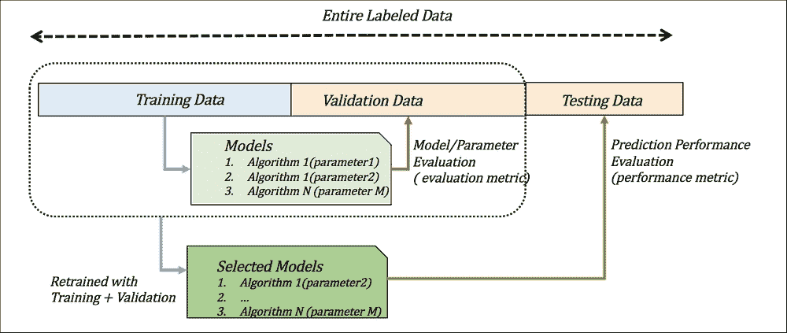

图 1：训练、验证和测试数据及其使用方法

两个因素会影响学习或泛化能力：算法的选择（及其参数）和训练数据的数量。这种泛化能力可以通过包括预测误差在内的各种指标来估计。模型对未见数据的总体误差估计或风险由以下给出：

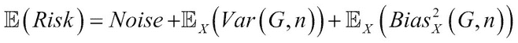

在这里，*噪声*是随机噪声，*Var (G,n)*被称为方差误差，它是衡量我们的假设或算法*(G)*如果给定不同的数据集有多敏感的度量。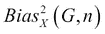被称为偏差误差，表示模型中最佳算法（所有可能数据集上的平均学习者）与最优算法的距离。

如*图 2*和*图 3*所示的学习曲线——其中训练和测试错误是固定的算法及其参数或训练数据大小——可以提供对欠拟合或过拟合的指示。

当训练数据量固定时，不同的算法或具有不同参数选择的相同算法可以表现出不同的学习曲线。*图 2*显示了在相同数据量下，两种算法给出基于偏差和方差的两种不同学习曲线的情况。

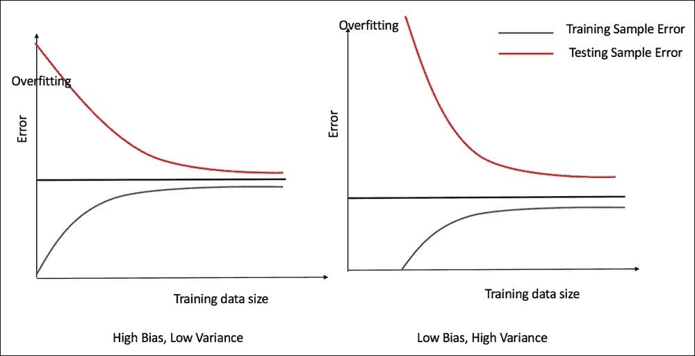

图 2：当模型复杂度固定时，训练数据与错误率的关系表明了不同模型的选择。

算法或模型选择也会影响模型性能。一个复杂的算法，具有更多可调整的参数，可能导致过拟合，而一个简单的算法，参数较少，可能存在欠拟合。当训练数据量固定时，以下经典图示了模型性能和复杂性的关系：

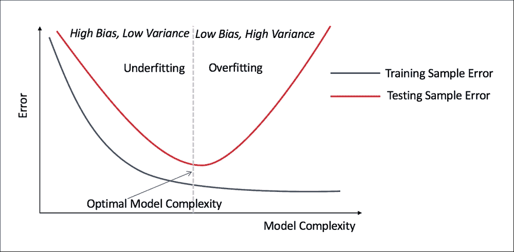

图 3：当训练数据量固定时，模型复杂性与训练和测试数据中的错误率的关系。

验证允许探索参数空间以找到最佳泛化模型。正则化（将在线性模型中讨论）和验证是两种用于防止过拟合的机制。有时使用“k 折交叉验证”过程进行验证，这涉及到创建*k*个数据样本，使用*(k – 1)*个进行训练，剩余的一个进行测试，重复*k*次以给出平均估计。以下图示了 5 折交叉验证作为示例：


图 4：5 折交叉验证。

以下是一些常用的数据采样、验证和学习的技巧：

+   **训练、验证和测试的随机分割**：60%，20%，20%。在 60%的数据上训练，使用 20%进行验证，然后将训练集和验证集合并以训练一个最终模型，用于在剩余的 20%上进行测试。分割可以是随机的，基于时间、基于地区等。

+   **训练、交叉验证和测试**：分为训练集和测试集各占三分之一，在训练集上使用交叉验证进行验证，在全部三分之二的数据上训练，在三分之一的数据上测试。分割可以是随机的，基于时间、基于地区等。

+   **训练和交叉验证**：当训练集较小时，只能进行模型选择而不需要大量参数调整。在整个数据集上运行交叉验证，并选择在整个数据集上学习的最佳模型。

# 特征相关性分析和降维

特征相关性和选择的目标是找到对目标变量有区分性的特征，并帮助减少数据的维度[1,2,3]。这主要通过改善维度灾难的影响和去除无关特征的噪声来提高模型性能。通过仔细评估在验证集上添加和去除特征时的模型，我们可以看到特征相关性的影响。由于对*k*个特征的穷举搜索涉及 2^k – 1 个集合（考虑所有*k*个特征的组合，每个特征要么保留要么去除，不考虑一个特征都不存在的退化情况），因此需要评估的模型数量可能变得不可接受，因此需要某种启发式搜索技术。以下将描述这些技术中最常见的一些。

## 特征搜索技术

一些非常常见的搜索技术被用来寻找特征集：

+   **前向或爬山搜索**：在这种搜索中，每次添加一个特征，直到评估模块输出性能不再进一步变化。

+   **反向搜索**：从整个集合开始，每次移除一个特征，直到不再发生性能改进。某些应用程序交替使用前向和反向技术来搜索特征。

+   **进化搜索**：可以使用各种进化技术，如遗传算法，作为搜索机制，并且可以使用基于过滤器或包装器的评估指标作为适应度标准来指导过程。

## 特征评估技术

在高层次上，评估特征有三个基本方法。

### 过滤器方法

这种方法指的是使用技术而不使用机器学习算法进行评估。过滤器方法的基本思想是使用搜索技术选择一个特征（或特征子集）并使用某种统计量来衡量其重要性，直到达到停止标准。

#### 单变量特征选择

这种搜索与根据使用的统计量对每个特征进行排名一样简单。

##### 信息论方法

所有信息论方法都以熵机制为核心概念。其思想是，如果特征在数据集中随机出现，则熵最大，或者说，压缩或编码的能力低，特征可能是不相关的。另一方面，如果特征值的分布使得某些值在一个类别中相对于其他类别更普遍，那么熵最小化，特征具有区分性。以这种方式将问题表述为熵需要某种形式的离散化，以便将数值特征转换为类别，以便计算概率。

考虑一个具有训练数据 *D*[X] 的二分类问题。如果 *X*[i] 是具有 *v* 个不同分类值的 *i*^(th) 特征，使得 *D*[Xi] *= {D*[1]*, D*[2]*… D*[v]*}*，那么特征 *X*[i] 中的信息或熵为：

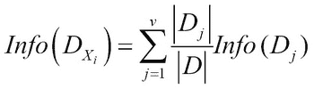

在这里，*Info(D*[j]*)* 是分割的熵，其计算如下：

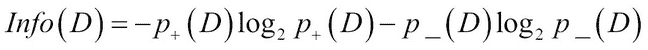

在这里，*p*[+]*(D)* 是数据集 *D* 中的数据属于正类的概率，而 *p_(D)* 是它属于负类的概率，在该样本中。特征的信息增益是根据整体信息和特征信息来计算的

*InfoGain(X*[i]*) = Info(D) – Info(D*[Xi]*)*

对于数值特征，值按升序排序，并且考虑相邻值之间的分割点作为不同的值。

熵的减少越大，特征的相关性就越高。当特征具有大量值时，信息增益存在问题；这时增益比率就派上用场。增益比率通过引入分割信息来纠正大分割的信息增益。特征*X*[i]和*GainRatio*的分割信息如下：

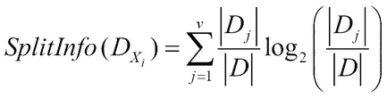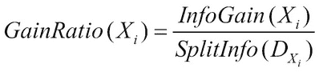

还有其他杂质度量，如基尼杂质指数（如*决策树*算法部分所述）和基于不确定性的度量来计算特征相关性。

##### 统计方法

卡方特征选择是最常见的特征选择方法之一，其基础是统计假设检验。零假设是特征和类别变量相互独立。数值特征被离散化，以便所有特征都具有分类值。列联表的计算如下：

| 特征值 | 类别=P | 类别=N | 对类别 *niP* + *niN* 求和 |
| --- | --- | --- | --- |
| *X*[1] | (*n*[1P]&#124;*µ*[1P]) | (*n*[1N]&#124;*µ*[1N]) | *n*[1] |
| …. | … | …. | … |
| *X*[m] | (*n*[mP]&#124;*µ*[mP]) | (*n*[mN]&#124;*µ*[mN]) | *n*[m] |
|   | *n*[*P] | *n*[*P] | *n* |

> *列联表 1：显示二元类别的特征值和类别分布。*

在前面的表中，*n*[ij]是具有值——在离散化后——等于*x*[i]和类别值*j*的特征的数量。

值求和如下：

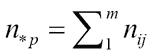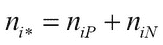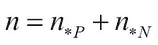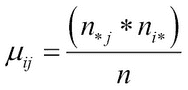

这里*n*是数据实例的数量，*j = P, N*是类别值，*i =1,2, … m*是特征的不同离散化值的索引，该表有*m – 1*个自由度。

卡方统计量由以下公式给出：

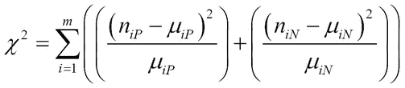

卡方值用于与置信水平阈值进行比较以测试显著性。例如，对于*i = 2*，5%置信水平下的卡方值为 3.84；如果我们的值小于表格中的 3.83，那么我们知道该特征是有趣的，并且零假设被拒绝。

#### 多变量特征选择

大多数多变量特征选择方法有两个目标：

+   减少特征与其他选定的特征之间的冗余

+   最大化特征与类别标签的相关性或相关性

寻找此类特征子集的任务不能穷尽，因为该过程可能具有很大的搜索空间。通常使用启发式搜索方法，如回溯搜索、前向搜索、爬山法和遗传算法来找到特征子集。接下来将介绍两种非常著名的评估技术，以实现上述目标。

##### 最小冗余最大相关性（mRMR）

在这种技术中，数值特征通常被离散化——就像在单变量预处理中做的那样——以获得不同的值类别。

对于每个子集 *S*，两个特征 *X*[i] 和 *X*[j] 之间的冗余可以测量如下：

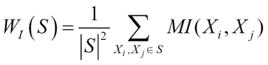

这里，*MI (X*[i]*, X*[j]*)* = 两个特征 *X*[i] 和 *X*[j] 之间的互信息度量。特征 *X*[i] 与类别 *C* 之间的相关性可以测量如下：

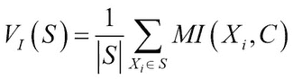

此外，可以将这两个目标结合起来，使用以下方法找到最佳特征子集：

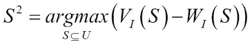

##### 基于相关性的特征选择 (CFS)

基本思想与前面的例子相似；子集 *S* 的整体优点被测量为：

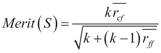

在这里，*k* 是特征的总数，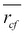 是平均特征类别相关性，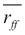 是平均特征间互相关性。分子给出相关性因子，分母给出冗余因子，因此搜索的目标是最大化整体比率或*优点 (S)*。

还有其他技术，如基于快速相关性的特征选择，它基于相同的原则，但在计算指标方面有所变化。读者可以在 Weka 中尝试这些和其他技术。

过滤方法的优势在于其方法与学习算法无关，因此可以免除选择算法和参数的麻烦。它们也比基于包装的方法更快。

### 包装方法

搜索技术与在特征搜索方法中讨论的方法相同；只是评估方法不同。在包装方法中，使用机器学习算法来评估基于各种指标发现的具有区分性的特征子集。用作包装方法的机器学习算法可能与用于建模的算法相同或不同。

最常用的交叉验证用于学习算法。性能指标，如曲线下面积或 F 分数，作为交叉验证的平均值，指导搜索过程。由于训练和评估模型的成本非常高，我们选择具有快速训练速度的算法，如线性回归、线性 SVM 或基于决策树的算法。

一些包装方法使用特定的算法，如随机森林来衡量特征相关性，已经非常成功。

### 嵌入方法

这种方法不需要特征搜索技术。不是在预处理中进行特征选择，而是在机器学习算法本身中进行。规则归纳、决策树、随机森林等算法在训练算法中执行特征选择。一些算法，如回归或基于 SVM 的方法，被称为**收缩方法**，可以在模型中添加正则化项以克服数据集中噪声特征的影响。岭回归和 lasso 正则化是回归中提供隐式特征选择的知名技术。

在第三章“无监督机器学习技术”中，将讨论其他使用无监督算法的技术，这些技术也可以在监督环境中有效地使用，例如，**主成分分析**（**PCA**）。

# 模型构建

在现实世界的问题中，学习有许多约束，评估模型在未见数据上的性能也有许多方法。每个建模算法在应用于特定问题或特定领域的问题类时都有其优势和劣势。这一点在著名的**无免费午餐定理**（**NFLT**）中得到了阐述，该定理指出——对于监督学习的情况——在所有数据分布的平均情况下，每个分类算法的表现几乎与其他任何算法一样好，包括总是选择同一类的算法！监督学习、搜索和优化的 NFLT 应用可以在[`www.no-free-lunch.org/`](http://www.no-free-lunch.org/)找到。

在本节中，我们将讨论最常用的实用算法，提供必要的细节来回答诸如算法的输入和输出是什么？它是如何工作的？在选择算法时需要考虑哪些优势和局限性？对于每个模型，我们将包括测试所选数据集时获得的示例代码和输出。这应该为读者提供对过程的洞察。一些算法，如神经网络和深度学习、贝叶斯网络、基于流的机器学习等，将在各自的章节中单独介绍。

## 线性模型

当数据线性可分时，线性模型效果很好。这始终应该是首先要确定的事情。

### 线性回归

线性回归可用于分类和估计问题。它是实践中最广泛使用的方法之一。它包括通过数据点找到最佳拟合超平面。

#### 算法输入和输出

特征必须是数值型的。分类特征使用各种预处理技术进行转换，例如，当分类值成为具有 1 和 0 值的特征时。线性回归模型在分类中输出一个分类类别，在回归中输出数值。许多实现还给出置信度值。

#### 它是如何工作的？

模型试图在输入空间中学习一个“超平面”，以最小化每个类别的数据点之间的误差（*参考文献* [4]）。

线性模型在 d 维输入空间中学习的超平面由以下公式给出：

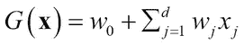

模型将输入空间分割成两个区域（二元分类），分别是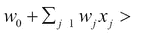和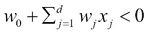。将特征 0 的坐标赋值为 1，即*x*0=1，假设空间或模型的向量表示为：

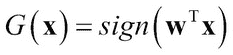

权重矩阵可以通过各种方法推导出来，例如普通最小二乘法或使用矩阵表示的迭代方法，如下所示：

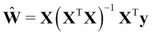

在最小二乘问题中，如果矩阵**X**^T**X**不是满秩的，或者遇到各种数值稳定性问题，解决方案将进行修改如下：

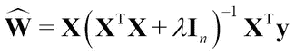

这里，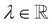被添加到大小为(*n* + 1, *n* + 1)的单位矩阵**I**[n]的对角线上，其余值被设置为 0。这种解决方案被称为**岭回归**，参数λ理论上控制了平方损失和解决方案低范数的权衡。常数λ也称为正则化常数，有助于防止“过拟合”。

#### 优点和局限性

+   当特征少于 100 个且数据点只有几千个时，这是一个尝试获取洞察力的合适方法。

+   在一定程度上是可解释的，因为权重提供了对每个特征影响的洞察。

+   假设线性关系、可加性和不相关特征，因此它不模拟复杂的非线性现实世界数据。一些线性回归的实现允许移除共线性特征来克服这个问题。

+   非常容易受到数据中的异常值的影响，如果有巨大的异常值，在进行线性回归之前必须先处理这些异常值。

+   异方差性，即训练点的方差不等，可能会影响简单的最小二乘回归模型。采用加权最小二乘等技术来克服这种情况。

### 朴素贝叶斯

基于贝叶斯规则，朴素贝叶斯分类器假设数据的特征相互独立（*参考文献* [9]）。它特别适合于大型数据集，尽管它对特征独立性的假设是朴素的，但通常比其他更复杂的技术表现更好。

#### 算法输入和输出

朴素贝叶斯模型可以接受既是分类又是连续的特征。通常，如果连续特征以正确的格式离散化，朴素贝叶斯模型的性能会得到提高。朴素贝叶斯输出所有类别的类别和概率分数，使其成为评分模型的良好分类器。

#### 它是如何工作的？

它是一个基于概率的建模算法。基本思想是使用贝叶斯定理并测量不同项的概率，如这里所示。测量概率可以通过预处理（如离散化）、假设某种分布或，如果数据足够多，映射数值特征的分布来完成。

应用贝叶斯定理以获得后验概率作为预测，其中*k*代表*k*^(th)类别。

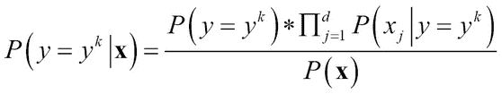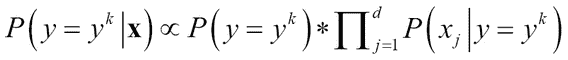

#### 优点和局限性

+   它对孤立噪声数据点具有鲁棒性，因为在估计输入数据的概率时，这些点会被平均。

+   从贝叶斯分类中得到的概率分数可以作为评分模型。

+   能够很好地处理缺失值，因为它们在估计概率时没有被使用。

+   此外，它对无关属性具有鲁棒性。如果特征没有用，类别的概率分布将是均匀的，并且会相互抵消。

+   在训练速度和内存方面非常好，它可以并行化，因为方程中每个概率的计算都是相互独立的。

+   当使用朴素贝叶斯时，相关特征可能成为一个大问题，因为条件独立性假设不再有效。

+   大多数优化算法都假设误差是正态分布的。

### 逻辑回归

如果我们使用线性回归模型，比如使用最小二乘回归方法，输出必须转换为类别，比如 0 和 1。许多线性回归算法输出类别和置信度作为概率。一般来说，如果我们看到线性回归的概率大多超出了 0.2 到 0.8 的范围，那么逻辑回归算法可能是一个更好的选择。

#### 算法输入和输出

与线性回归类似，所有特征都必须是数值的。分类特征必须转换为数值。像在朴素贝叶斯中一样，此算法为每个类别输出类别和概率，可以用作评分模型。

#### 如何工作？

逻辑回归使用输入特征的线性函数来模拟类别的后验概率。

二元分类的逻辑回归模型如下所示：

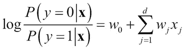

该模型是线性模型的对数几率或 logit 转换（*参考文献* [6]）。权重向量通常使用各种优化方法计算，如**迭代加权最小二乘法**（**IRLS**）或**Broyden-Fletcher-Goldfarb-Shanno**（**BFGS**）方法，或这些方法的变体。

#### 优点和局限性

+   克服了输入和输出之间异方差性和某些非线性问题。

+   在误差估计中不需要正态分布的假设。

+   它是可解释的，但不如线性回归模型那么可解释，因为需要一些统计学知识。它提供诸如优势比、*p* 值等信息，这些信息有助于理解特征对类别的影响，以及根据 *p* 值的重要性进行隐式特征相关性。

+   在实践中，必须使用 L1 或 L2 正则化来克服逻辑回归模型中的过拟合问题。

+   许多优化算法可用于提高训练速度和鲁棒性。

## 非线性模型

接下来，我们将讨论一些知名、实用且最常用的非线性模型。

### 决策树

决策树也被称为**分类和回归树**（**CART**）（*参考文献* [5]）。它们的表示是通过在每个内部节点评估一个关于单个属性的不等式来构建的二叉树，每个叶子节点对应于从其路径到达的决策产生的输出值或类别。当提供新的输入时，通过从根节点开始遍历树来预测输出。

#### 算法输入和输出

特征可以是分类的也可以是数值的。它生成类别作为输出，大多数实现使用基于频率的估计给出分数或概率。尽管有一些扩展，但决策树的概率并不是像朴素贝叶斯和逻辑回归那样的平滑函数。

#### 它是如何工作的？

通常，从根节点开始创建单个树，根节点使用单个特征进行决策，根据特征的值将决策分支到各个分支，而在叶子节点处则是一个类别或更多特征。有许多选择要做，例如树的数量、如何选择根级别或后续叶子级别的特征，以及如何在不分类的情况下分割特征值。这导致了许多不同的算法或对基本决策树的修改。许多分割特征值的技术与在离散化部分讨论的内容相似。通常，会应用某种形式的剪枝来减少树的大小，这有助于解决过拟合问题。

Gini 指数是另一种用于分割特征的流行技术。所有数据点的集合 *S* 中的数据点的 Gini 指数如下 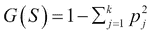，其中 *p*[1]，*p*[2] … *p*[k] 是每个类别的概率分布。

如果 *p* 是所有数据点集合 *S* 中属于正类别的数据点的分数或概率，那么 1 – *p* 是其他类别的分数或二分类中的错误率。如果数据集 *S* 以 *r* 种方式分割为 *S*[1]*， S*[2]*，…S*[r]，那么每个集合的错误率可以量化为 |*S*[i]|。*r* 种分割的 Gini 指数如下：


使用最低 Gini 指数的分割用于选择。流行的决策树算法 CART 使用 Gini 指数作为分割标准。

数据点集 S 的熵可以类似地计算如下：

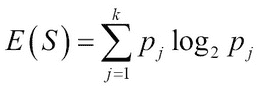

类似地，基于熵的分割计算如下：

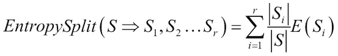

熵分割的值越低，特征越好，这一点在 ID3 和 C4.5 决策树算法中得到了应用（*参考文献* [12]）。

停止标准与剪枝标准相关。提前停止树的生长或剪枝的目的是减少“过拟合”，这与线性模型和逻辑模型中的正则化类似。通常，训练集被分为树生长集和剪枝集，这样剪枝就可以使用不同的数据来克服生长集的任何偏差。**最小描述长度**（**MDL**），根据节点数量惩罚树的复杂性，是许多决策树算法中常用的方法。

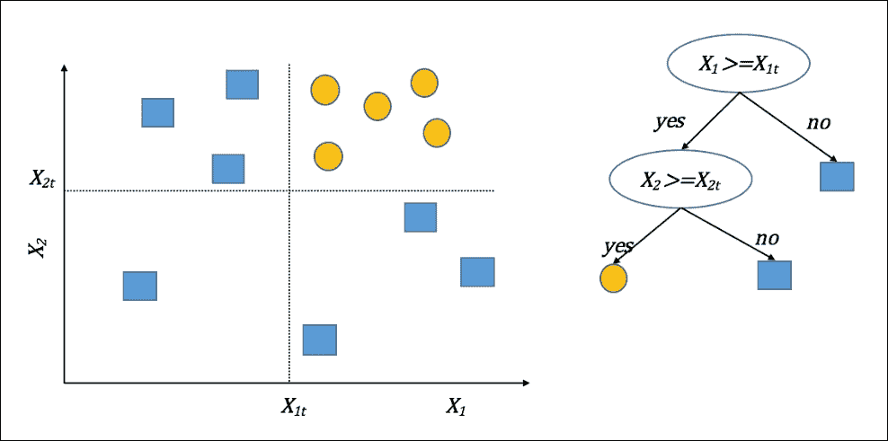

图 5：显示了一个二维二分类问题和一个通过在阈值*X*[1t]和*X*[1t]处进行分割诱导的决策树

#### 优点和局限性

+   决策树的主要优点是它们很容易解释。它们可以用通俗易懂的语言来理解，并且特别适合商业领域的专家轻松理解精确模型。

+   如果特征数量很多，那么构建决策树可能需要大量的训练时间，因为算法的复杂性会增加。

+   决策树固有的问题是过拟合。许多树算法都有剪枝选项来减少这种影响。使用剪枝和验证技术可以在很大程度上减轻这个问题。

+   当特征之间存在相关性时，决策树工作得很好。

+   决策树在类别之间构建轴平行的边界，这种偏差可能会引入错误，尤其是在复杂、平滑、非线性边界的情况下。

### K-近邻（KNN）

K-近邻属于非参数和懒惰算法的分支。K-近邻不对底层数据做出任何假设，也不从训练数据中构建和泛化模型（*参考文献* [10]）。

#### 算法输入和输出

虽然 KNN 可以处理分类和数值特征，但寻找邻居的核心——距离计算，与数值特征配合得更好。将数值特征归一化到相同的范围是必须的步骤之一。KNN 的输出通常是基于邻居距离计算的类别。

#### 如何工作？

KNN 使用整个训练数据对未见过的测试数据进行预测。当出现未见过的测试数据时，KNN 通过某种距离计算找到 K 个“最近的邻居”，并根据邻居和决定类别的度量标准对新的点进行分类。如果我们考虑由**x**[1]和**x**[2]表示的两个数据点，对应的向量，距离计算如下：

+   欧几里得距离：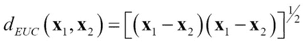

+   余弦距离或相似度：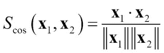

用于对未见数据分类的度量可能仅仅是*K*个邻居中的多数类。

训练时间很小，因为它只需构建数据结构以以最小化未见面数据时最近邻的计算方式来存储数据。该算法依赖于从训练数据点存储数据的选择，以实现搜索邻居的高效性，使用哪种距离计算来找到最近邻，以及使用哪种度量来根据所有邻居的类别进行分类。通过使用验证技术来选择 KNN 中的"*K*"值是至关重要的。

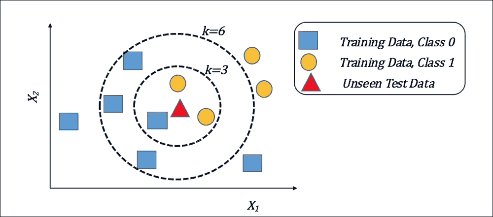

图 6：使用二维数据以及不同的 k 值选择来展示 K-最近邻。

#### 优点和局限性

+   对底层数据分布没有假设，并且训练时间最小，这使得它成为学习的一个非常有吸引力的方法。

+   KNN 使用局部信息来计算距离，在特定领域可以产生高度自适应的行为。

+   当*K*值选择得当，对噪声训练数据具有鲁棒性。

+   根据数据点的数量和硬件限制，保留整个训练数据用于分类可能会出现问题。

+   特征数量和维度的诅咒会影响此算法，因此在 KNN 建模之前必须进行某种形式的维度缩减或特征选择。

### 支持向量机（SVM）

简单来说，SVM 可以被视为通过解决约束优化问题来最大化分离超平面和数据之间边界的线性分类器。SVM 甚至可以通过使用后面描述的核将数据转换到更高维空间来处理非线性可分的数据。

#### 算法输入和输出

SVM 仅对数值特征有效，尽管大多数实现可以通过将特征转换为数值或二进制来处理分类特征。归一化通常是选择之一，因为它有助于训练中的优化部分。SVM 的输出是类别预测。有一些实现提供概率估计作为置信度，但这需要相当多的训练时间，因为它们使用 k 折交叉验证来构建估计。

#### 如何工作？

在其线性形式中，SVM 的工作方式类似于线性回归分类器，在两个类别之间绘制线性决策边界。两者的区别在于，在 SVM 中，边界是以最大化边界附近点之间的“间隔”或距离的方式绘制的。边界上的点被称为“支持向量”（*参考文献* [13 和 8]）。

因此，支持向量机（SVM）试图在类似于线性回归模型的线性模型中找到权重向量，如下所示：

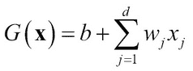

权重 *w*[0] 在这里表示为 *b*。对于二类分类问题，SVM 试图找到一个超平面：

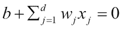

超平面试图将数据点分离，使得属于同一类别的所有点都位于超平面的同一侧，如下所示：

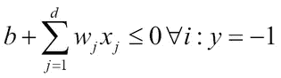

模型通过约束优化和惩罚函数 *C*（用于克服误差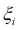）来最大化间隔：


使得 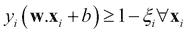 和 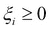。

由于这个原因，它们也被称为大间隔分类器。基于核的 SVM 将输入数据转换到一个假设的特征空间，在这个空间中，SV 机制以线性方式工作，边界在特征空间中绘制。

在变换后的表示上，核函数如下给出：

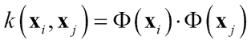

这里 Φ 是输入空间上的一个变换。可以看出，SVM 的整个优化和求解过程保持不变，唯一的例外是点积 **x**[i] · **x**[j] 被核函数 *k*(**x**[i], **x**[j]) 所替代，这是一个涉及不同空间中两个向量的函数，实际上并没有转换到那个空间。这被称为**核技巧**。

通常使用的最著名的核函数包括：

+   **高斯径向基核**：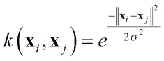

+   **多项式核**：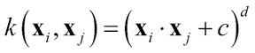

+   **Sigmoid 核**：

SVM 的性能对一些优化参数、核参数以及核心 SV 参数（如代价函数 *C*）非常敏感。通常使用网格搜索或进化搜索等技术，结合交叉验证等验证技术来寻找最佳参数值。


图 7：从训练数据中学习得到的 SVM 线性超平面，它能在两个类别之间创建最大间隔分离。


图 8：核变换说明如何使用多项式变换将二维输入空间转换为三维特征空间，其中数据是线性可分的。

#### 优点和局限性

+   SVM 在泛化、低过拟合方面表现优异，如果参数选择得当，对于复杂非线性数据有良好的理论基础。

+   SVM 在具有大量特征和较少训练数据的情况下也能很好地工作。

+   SVM 对噪声训练数据不太敏感。

+   SVM 的最大缺点是它们不可解释。

+   SVM（支持向量机）的另一个大问题是其训练时间和内存需求。它们是 *O(n²)* 和 *O(n³)*，当数据量大或存在硬件限制时，可能会导致严重的可扩展性问题。有一些修改可以帮助减少这两者。

+   SVM 通常在二分类问题上表现良好，但对于多分类问题，尽管有诸如一对多和一对一等技术，但它的鲁棒性不如决策树等一些其他分类器。

## 集成学习和元学习器

将多个算法或模型组合起来进行分类，而不是仅仅依赖一个，这被称为集成学习。它有助于结合各种模型，因为每个模型都可以被视为——在高级别上——在整个数据集中检测特定模式的专家。每个基学习器也可以在略微不同的数据集上学习。最后，将所有模型的结果结合起来进行预测。根据组合中使用的算法的相似程度、如何向每个算法展示训练数据集以及算法如何组合结果以最终对未见数据集进行分类，集成学习有许多分支：


图 9：集成学习策略的说明

一些常见的集成学习方法包括：

+   不同的学习算法

+   相同的学习算法，但具有不同的参数选择

+   不同特征集上的不同学习算法

+   不同训练数据的不同学习算法

### 自助聚合或 bagging

它是用于在不同样本中划分数据并在每个样本上构建分类器的最常用的集成方法之一。

#### 算法输入和输出

输入受所使用的基学习器的选择限制——如果使用决策树，基本上没有限制。该方法输出类成员资格以及类的概率分布。

#### 它是如何工作的？

bagging 的核心思想是对具有高方差的不同学习器应用自助估计，例如决策树。自助估计是任何依赖于有放回随机抽样的统计量。整个数据被使用自助估计分成不同的样本，并对每个样本使用基学习器构建模型。最后，在预测时，通过多数投票得到平均预测——这是结合所有学习器的一种技术。

##### 随机森林

随机森林是基本 Bagged 决策树的改进。即使在 Bagging 的情况下，基本的决策树在创建树时在每个分割点都有所有特征的选择。正因为如此，即使有不同的样本，许多树也可以形成高度相关的子模型，这导致 Bagging 的性能下降。通过给不同的模型提供随机特征以及随机数据集，子模型之间的相关性降低，与基本 Bagged 树相比，随机森林表现出更好的性能。随机森林中的每棵树都在随机特征上生长其结构，从而最小化偏差；在决策上结合许多这样的树可以减少方差（*参考文献* [15]）。随机森林还用于通过平均树中的不纯度减少来衡量特征相关性，并对所有特征进行排名，以给出每个特征的相对重要性。

#### 优点和局限性

+   比单个基学习器有更好的泛化能力。克服了基学习器过拟合的问题。

+   由于 Bagging 作为元学习器结合了甚至可解释的学习器，其可解释性非常低。

+   与大多数其他集成学习器一样，Bagging 对噪声和异常值具有弹性。

+   随机森林通常不会对训练数据是独立同分布(iid)的情况下产生过拟合。

### Boosting

Boosting 是另一种流行的集成学习方法，它基于使用弱学习器并迭代地学习“错误分类”或难以学习的点。因此，想法是“提升”难以学习的实例，并使基学习器更有效地学习决策边界。Boosting 有各种变体，如 AdaBoost、LogitBoost、ConfidenceBoost、Gradient Boosting 等。我们在这里介绍一个非常基本的 AdaBoost 形式（*参考文献* [14]）。

#### 算法输入和输出

输入受所使用的基学习器的选择约束——如果使用决策树，基本上没有限制。输出类成员资格以及类别的概率分布。

#### 如何工作？

Boosting 背后的基本思想是迭代地重新加权输入样本，以创建新的数据分布，以便在每次迭代中从简单的基学习器中学习模型。

初始时，所有实例都使用的权重均匀加权，并且在每次迭代*t*时，种群被重新抽样或重新加权，如所示，其中和*Z*t 是归一化常数。

最终模型作为迭代中学习到的所有模型的线性组合工作：


每次迭代的重新加权或重新抽样数据基于“错误”；导致错误的点被抽样更多或具有更大的权重。

#### 优点和局限性

+   比基学习器有更好的泛化能力，并且非常有效地克服了过拟合的问题。

+   一些提升算法，如 AdaBoost，可能对均匀噪声敏感。存在一些提升算法的变体，如“GentleBoost”和“BrownBoost”，它们可以减少异常值的影响。

+   提升算法在误差估计上有理论上的界限和保证，使其成为一个统计上稳健的算法。

# 模型评估、评估和比较

这里讨论的关键思想包括：

+   如何评估或估计分类器在未见数据集上的性能，这些数据集将是它未来预测未见数据集的。

+   我们应该使用哪些指标来评估模型的性能？

+   如果我们必须在它们之间进行选择，我们如何比较算法？

## 模型评估

为了训练模型（s），调整模型参数，选择模型，并最终估计模型在未见数据上的预测行为，我们需要许多数据集。我们不能在单一数据集上训练模型并估计其在该数据集上的行为，因为这会产生明显的乐观偏差，估计结果不太可能匹配未见数据的行为。因此，至少需要将可用的数据进行分区，形成训练集和测试集。此外，在我们对测试集进行测试之前，我们需要调整模型的参数，并在单独的数据集上测试调整的效果。如果我们使用同一数据集进行训练、参数调整和测试，乐观偏差和错误估计的问题同样适用。因此，从理论和实践上讲，需要有三个数据集，即训练集、验证集和测试集。

模型在训练集上训练，不同参数对训练集的影响在验证集上得到验证，最终选择参数的模型在测试集上运行以评估模型在未见数据上的性能。当数据集不够大，或者数据集很大但类别之间的不平衡性很大，即一个类别只占总人口的很小一部分时，我们无法创建太多的样本。记住，我们方法中描述的步骤之一是创建不同的数据样本和数据集。如果总训练数据量很大，并且数据量和类别比例良好，那么使用随机分层划分来创建这三个集合是最常见的选项。在某些显示季节性和时间相关行为的特定数据集中，基于时间界限创建数据集是一种常见的做法。在许多情况下，当数据集不够大时，可能只创建两个物理分区，即训练和测试。训练数据集大约占 66%到 80%，其余用于测试。然后使用 k 折交叉验证技术从训练数据集中创建验证集。训练数据集被分成*k*次，每次产生*k-1/k*随机训练*1/k*测试数据样本，并生成所需的性能平均指标。这样，有限的训练数据被分成*k*次，并使用不同训练/测试分割的平均性能来评估参数的影响。在交叉验证中，使用 10 折交叉验证是最常见的做法。

## 模型评估指标

在调整参数或选择模型时，下一个重要的决定是基于某些性能指标做出决策。在分类学习中，有不同可用的指标，你可以根据业务需求做出决策。例如，在某个领域，不漏掉任何一个真正的阳性是最重要的关注点，而在其他领域，人类参与判断模型结果时，过多的假阳性是更大的关注点。在某些情况下，整体良好的准确率被认为更为重要。在高度不平衡的数据集，如欺诈或网络攻击中，一个类别的实例只有几个，而另一个类别的实例有数百万。在这种情况下，准确率给出了模型性能的错误指示，因此使用一些其他指标，如精确度、真正阳性比率或曲线下面积作为指标。

我们现在将讨论在分类算法评估中最常使用的指标（*参考文献* [16, 17 和 19]）。


图 10：分类模型的模型评估指标

### 混淆矩阵和相关指标


图 11：混淆矩阵

混淆矩阵是许多模型性能指标定义的核心。指标和同义词的激增是矩阵元素在不同学科中衍生出的不同数量的效用结果，每个学科都强调模型行为的不同方面。

矩阵的四个元素是假阳性、假阴性、真阳性和真阴性的数量原始计数。通常，这些数量的不同比率更有趣，例如真阳性率（或灵敏度、或召回率）和假阳性率（FPR，或 1—特异性，或漏报率）。准确率反映了正确预测的百分比，无论是类别 1 还是类别 0。对于倾斜的数据集，准确率并不特别有用，因为即使是恒定的预测也可能看起来表现良好。

### ROC 和 PRC 曲线

之前提到的指标，如准确率、精确率、召回率、灵敏度和特异性，是汇总指标，即它们描述了整个数据集的行为。在许多复杂问题中，观察 TP 和 FP 等指标之间的权衡通常很有价值。

许多分类器，主要是基于概率的分类器，除了给出分类外，还给出预测的置信度或概率。获得 ROC 或 PRC 曲线的过程是在学习模型上运行未见验证或测试集，然后获得预测和预测概率。根据置信度按降序对预测进行排序。对于每个概率或置信度，计算两个指标，即 FP 的分数（FP 率）和 TP 的分数（TP 率）。

将 TP 率绘制在 y 轴上，FP 率绘制在 x 轴上，可以得到 ROC 曲线。随机分类器的 ROC 曲线靠近对角线，而优秀分类器的 ROC 曲线倾向于图表的左上角。**曲线下面积**（**AUC**）是通过使用 ROC 曲线从 0 到 1 的梯形面积来测量的面积。例如，在运行交叉验证时，可能会有许多 ROC 曲线。有两种方法可以得到“平均”ROC 曲线：首先，使用垂直平均，即 TPR 平均在不同 FP 率下绘制；其次，使用水平平均，即在不同的 TP 率下绘制 FPR 平均。根据经验法则，曲线下面积大于 0.8 的分类器被认为对未见数据具有良好的预测能力。

精确率-召回率曲线或 PRC 曲线与 ROC 曲线类似，但与 TPR 对 FPR 不同，分别将精确率和召回率绘制在 y 轴和 x 轴上。当数据高度不平衡时，即 ROC 曲线并不能真正显示影响，而 PRC 曲线在判断性能方面更为可靠。

### 收益图和提升曲线

提升和增益图更偏向于敏感性或真正阳性。这两个图表的全部目的在于展示，与随机选择相比，模型的预测和置信度可以检测到未见数据样本中更好的质量或真正阳性。

这通常对用于检测金融犯罪中的欺诈或网络安全中的威胁的检测引擎非常有吸引力。增益图和提升曲线给出了在不同四分位数或总数据区间的不同区间内将被检测到的真正阳性的精确估计。这将给业务决策者提供洞察，了解需要多少调查人员或需要花费多少小时来检测欺诈行为或网络攻击，从而可以给出模型的实际投资回报率。

生成增益图或提升曲线的过程与通过模型运行未见过的验证或测试数据并获取预测以及置信度或概率的过程类似。这涉及到按降序排列概率，并计算数据集每个四分位数的 TPs 数量。最后，每个四分位数的计数直方图给出提升曲线，而每个四分位数的 TPs 累计计数给出增益图。在许多工具，如 RapidMiner 中，为了获得计数和累计计数，使用分箱技术而不是粗略的区间（如四分位数），而是使用固定的较大区间。

## 模型比较

当涉及到选择算法，或者给定算法的正确参数时，我们会在不同的数据集上，或者在交叉验证的情况下，在同一数据集的不同分割上进行比较。在这些比较中，会使用统计测试的度量来做出决策。使用经典统计学中的假设检验的基本思想是比较算法中的两个度量。零假设是算法基于测量的度量之间没有差异，因此测试是为了根据测量的度量来验证或拒绝零假设（*参考文献* [16]）。统计测试回答的主要问题是——算法获得的结果或度量是其真实特征，还是偶然得到的？

在本节中，我们将讨论在实际情况中使用的比较分类算法的最常见方法。

### 比较两个算法

一般过程是在相同的训练集上训练算法，然后在多个验证集、不同的测试集或交叉验证上运行模型，衡量之前讨论的兴趣度量，如错误率或曲线下面积，然后获取每个算法的度量统计，以决定哪个效果更好。每种方法都有其优点和缺点。

#### McNemar 测试

这是一个非参数测试，因此它不对数据分布做出假设。McNemar 的测试构建了一个关于性能度量值（如“误分类或错误”）的列联表，例如：

两个算法误分类的数量(*c*[00])

+   算法 *G1* 误分类但算法 *G2* 正确分类的数量(*c*[01])

+   算法 *G2* 误分类但算法 *G1* 正确分类的数量(*c*[10])

+   同时被 *G1* 和 *G2* 正确分类的数量(*c*[11])

如果 χ² 超过  统计量，则可以在 1 – α 的置信水平下拒绝两个算法 *G1* 和 *G2* 的性能度量值相等的零假设。

##### 配对 t 检验

这是一个参数测试，并且假设计算出的度量值呈正态分布是有效的。通常，它与交叉验证过程结合使用，并计算曲线下面积、精确度或错误率等度量值的结果，然后测量均值和标准差。除了正态分布假设之外，两个度量值来自具有相等方差的总体这一额外假设可能对这种方法是一个很大的缺点。


 是两个算法 *G1* 和 *G2* 性能度量值的均值差异。


在这里，*d*i 是试验中两个算法 *G1* 和 *G2* 性能度量值的差异，并且有 *n* 次试验。

*t*-统计量使用均值差异和标准误差（从标准差计算得出）计算，并与表格中的正确 alpha 值进行比较，以检查显著性：


#### Wilcoxon 符号秩检验

在数据集上测试两个度量值最流行的非参数方法是使用 Wilcoxon 符号秩检验。算法在相同的训练数据和度量值（如错误率或准确率下的面积）上训练，并在不同的验证或测试集上计算。设 *d*[i] 为 *N* 个数据集的第 *i* 次试验中两个分类器性能度量值的差异。差异根据其绝对值进行排名，并关联平均秩以处理平局。设 *R*^+ 为第二个算法优于第一个算法的秩之和，R^– 为第一个算法优于第二个算法的秩之和：


统计量  然后与 alpha 值的阈值进行比较， 以拒绝假设。

### 比较多个算法

现在我们将讨论在涉及两个以上算法且需要跨多个算法进行评估指标比较时使用的两种最常见技术。

#### ANOVA 测试

这些是参数测试，假设样本呈正态分布，即我们用于评估的指标。方差分析（ANOVA）测试遵循与其他测试相同的过程，即使用相似的训练集训练模型/算法，并在不同的验证或测试集上运行。ANOVA 测试计算的主要量包括每个算法性能的指标均值，然后计算所有算法的整体指标均值。

设*p*[ij]为*i = 1,2… k*和*j = 1,2 …l*的试验和分类器的性能指标。分类器*j*在所有试验中的平均性能和整体平均性能如下：


评估两种类型的变异。第一种是组内变异，即每个算法与整体指标均值的总偏差，第二种是组间变异，即每个算法指标均值的偏差。组内变异和组间变异用于计算相应的组内和组间平方和，如下：


使用两个平方和以及如 F 统计量这样的计算，即两者的比率，可以在 alpha 值上进行显著性测试以接受或拒绝零假设：


ANOVA 测试在假设指标的正态分布和方差相等方面与配对 t 测试具有相同的局限性。

#### 弗里德曼测试

弗里德曼测试是一种针对多个算法比较的非参数测试，它对数据分布或指标的方差没有假设，ANOVA 测试有这些假设。它使用排名而不是直接使用性能指标进行计算。在每个数据集或试验中，算法被排序，最好的算法排名为 1，依此类推，对所有分类器都如此。计算算法在*n*个数据集上的平均排名，记为*R*[j]。弗里德曼统计量在*l*个分类器上的计算如下，并与 alpha 值比较以接受或拒绝零假设：


# 案例研究 – 马肠阻塞分类

为了说明第一章中描述的不同步骤和方法，从数据分析到模型评估，需要一个具有现实世界特征的代表性数据集。

我们从以下链接可用的 UCI 存储库中选择“马肠阻塞数据集”:[`archive.ics.uci.edu/ml/datasets/Horse+Colic`](https://archive.ics.uci.edu/ml/datasets/Horse+Colic)

该数据集有 23 个特征，具有类别和连续特征的混合。它包含大量具有缺失值的特征和实例，因此在本处理中，理解如何替换这些缺失值并在建模中使用它们变得更加实用。实际上，大量缺失数据（30%）是该数据集的一个显著特征。数据由连续属性以及类型为名义的属性组成。此外，存在自预测因子使得从实际角度处理此数据集具有指导意义。

本练习的目的是应用我们迄今为止已吸收的监督学习技术。我们将使用真实数据集并通过使用两个开源工具包——WEKA 和 RapidMiner 来完成。借助这些工具，我们将构建一个管道，使我们能够从数据文件的摄取开始，通过数据清洗、学习过程和模型评估。

Weka 是一个机器学习的 Java 框架——我们将看到如何使用这个框架通过几行代码从头到尾解决一个分类问题。除了 Java API 之外，Weka 还有一个 GUI。

RapidMiner 是一个具有拖放功能和大量算法及可视化工具的图形化环境，这使得快速运行数据实验和不同建模技术变得极其简单。

## 业务问题

业务问题是确定数据集中已知变量的值——如果马的病变是手术性的。我们将使用测试集作为必须分类的未见数据。

## 机器学习映射

基于数据和标签，这是一个二元分类问题。数据已经分为训练数据和测试数据。这使得评估技术更简单，因为从特征选择到模型的所有方法都可以在相同的测试数据上评估。

该数据集包含 300 个训练样本和 68 个测试样本。有 28 个属性，目标对应于病变是否为手术性的。

## 数据分析

在查看标签类别在训练和测试样本中的分布后，我们在特征分析之前将 300 个训练样本和 68 个测试样本合并。

### 标签分析

训练集中无类别与有类别的比例是 109/191 = 0.57，测试集中为 0.66：

| 训练数据集 |
| --- |
| 手术病变？ | 1 (是) | 2 (否) |
| 示例数量 | 191 | 109 |
| 测试数据集 |
| 手术病变？ | 1 (是) | 2 (否) |
| 示例数量 | 41 | 27 |

> *表 2：标签分析*

#### 特征分析

以下是一个截图，展示了具有类型、缺失值、最小值、最大值、众数和标准差基本统计特征的顶级功能，并按缺失值排序。观察结果如下：

+   没有非缺失值的分类或连续特征；最少的特征是“脉搏”，有 74 个缺失值，共 368 个，即 20%的值缺失，这高于一般的噪声阈值！

+   大多数数值特征也存在缺失值，例如，“鼻胃反流 PH”中有 247 个缺失值，共 368 个，即 67%的值缺失！

+   许多分类特征存在缺失值，例如，“腹部穿刺外观”中有 165 个缺失值，共 368 个，即 45%的值缺失！

+   必须以某种方式处理缺失值，以克服由如此大量缺失值产生的噪声！！特征分析

    图 12：数据集特征的基本统计信息。

## 监督学习实验

在本节中，我们将介绍使用两种不同工具进行的监督学习实验——突出一种工具的编码和分析，另一种工具的 GUI 框架。这为开发者提供了探索他们最舒适路径的机会。

### Weka 实验

在本节中，我们给出了整个代码，并将从加载数据、转换数据、选择特征、构建样本模型、在测试数据上评估它们，甚至比较算法的统计显著性等方面进行过程讲解。

#### Java 中的端到端流程示例

在每个算法中，使用相同的训练/测试数据，并对所有指标进行评估，如下所示。训练和测试文件按如下方式加载到内存中：

```py
DataSource source = new DataSource(trainingFile);
Instances data = source.getDataSet();
if (data.classIndex() == -1)
  data.setClassIndex(data.numAttributes() - 1);
```

使用 WEKA 的通用代码如下所示，其中每个分类器都被一个过滤分类器包裹，用于替换缺失值：

```py
//replacing the nominal and numeric with modes and means
Filter missingValuesFilter= new ReplaceMissingValues();
//create a filtered classifier to use filter and classifier
FilteredClassifier filteredClassifier = new FilteredClassifier();
filteredClassifier.setFilter(f);
// create a bayesian classifier
NaiveBayes naiveBayes = new NaiveBayes();
// use supervised discretization
naiveBayes.setUseSupervisedDiscretization(true);
//set the base classifier e.g naïvebayes, linear //regression etc.
fc.setClassifier(filteredClassifier)
```

当分类器需要执行特征选择时，在 Weka 中，`AttributeSelectedClassifier`进一步包裹了`FilteredClassifier`，如下所示：

```py
AttributeSelectedClassifier attributeSelectionClassifier = new AttributeSelectedClassifier();
//wrap the classifier
attributeSelectionClassifier.setClassifier(filteredClassifier);
//univariate information gain based feature evaluation
    InfoGainAttributeEval evaluator = new InfoGainAttributeEval();
//rank the features
Ranker ranker = new Ranker();
//set the threshold to be 0, less than that is rejected
ranker.setThreshold(0.0);
attributeSelectionClassifier.setEvaluator(evaluator);
attributeSelectionClassifier.setSearch(ranker);
//build on training data
attributeSelectionClassifier.buildClassifier(trainingData);
// evaluate classifier giving same training data
Evaluation eval = new Evaluation(trainingData);
//evaluate the model on test data
eval.evaluateModel(attributeSelectionClassifier,testingData);
```

评估的样本输出如下所示：

```py
=== Summary ===

Correctly Classified Instances     53       77.9412 %
Incorrectly Classified Instances    15       22.0588 %
Kappa statistic             0.5115
Mean absolute error           0.3422
Root mean squared error         0.413
Relative absolute error        72.4875 %
Root relative squared error      84.2167 %
Total Number of Instances       68 

=== Detailed Accuracy By Class ===

 TP Rate FP Rate Precision Recall F-Measure MCC   ROC Area PRC Area Class
 0.927  0.444  0.760   0.927  0.835   0.535  0.823  0.875  1
 0.556  0.073  0.833   0.556  0.667   0.535  0.823  0.714  2
Weighted Avg.  0.779  0.297  0.789   0.779  0.768   0.535  0.823  0.812 

=== Confusion Matrix ===

 a b <-- classified as
 38 3 | a = 1
 12 15 | b = 2

```

#### Weka 实验者和模型选择

如在*模型评估指标*部分所述，为了选择模型，我们需要验证哪个模型在未见过的数据集上表现良好。必须在训练集上进行交叉验证，并使用标准的统计测试指标来分析所选的性能指标。在此，我们展示了使用相同训练数据、10 折交叉验证、对两个模型进行 30 次实验，并使用配对 t 检验比较结果的示例。

一种方法是使用预处理过的朴素贝叶斯，包括替换缺失值并通过移除任何得分低于 0.0 的特征进行特征选择。

另一种方法是使用相同的预处理和 AdaBoostM1 与朴素贝叶斯。


图 13：WEKA 实验者显示了使用 30 次重复的交叉验证运行两个算法的过程。


图 14：WEKA 实验者结果显示了使用配对 t 检验比较两个算法在百分比正确或准确度指标上的结果。

### RapidMiner 实验

现在我们使用 RapidMiner 中的马绞痛数据集进行一些实验。我们将再次遵循章节第一部分介绍的方法。

### 注意

本节的目的不是作为 RapidMiner 工具的教程。实验者应阅读优秀的文档和用户指南，以便熟悉工具的使用。软件中每个操作员都有一个专门的教程——我们建议您在想要了解如何使用特定操作员时使用这些教程。

一旦我们使用数据访问工具导入测试和训练数据文件，我们就会想要直观地探索数据集，以便熟悉情况。特别重要的是要识别出这 28 个属性中的每一个是连续的（在 RapidMiner 中为数值、整数或实数）还是分类的（在 RapidMiner 中为名义、二项或多项）。

#### 可视化分析

从工具的**结果**面板中，我们执行数据的单变量、双变量和多变量分析。统计工具为每个特征提供简短的摘要——对于连续类型，有最小值、最大值、平均值和标准差；对于名义类型，有最少、最多和频率。

当我们进行双变量分析时，数据的有趣特征开始显现。在四分位数颜色矩阵中，颜色代表两个可能的目标值。正如箱线图所示，我们立即注意到一些属性比其他属性更明显地区分这两个目标值。让我们检查几个：


图 15：四分位数颜色矩阵

蠕动：这个特征在按目标值分开时显示出明显的分布差异。两个四分位数区域之间几乎没有重叠。这表明这个特征在目标方面的区分能力。

另一方面，直肠温度的图表在分布上没有明显的差异。这表明这个特征与目标的相关性较低。从脉搏这个特征也可以得出类似的推断。我们预计这些特征在评估它们相对于目标区分能力时排名相当低。

最后，疼痛的图表具有非常不同的特征。它也是区分目标的，但与蠕动的区分方式非常不同。在疼痛的情况下，类别 2 的数据方差比类别 1 大得多。腹部膨胀在类别之间也有明显不同的方差，除了类别 2 比类别 1 有更大的方差。


图 16：散点图矩阵

探索数据的一个重要部分是理解不同的属性如何相互关联以及与目标的相关性。在这里，我们考虑特征对，并查看值的组合发生是否告诉我们有关目标的信息。在这些图中，数据点的颜色代表目标。


图 17：气泡图

在气泡图中，我们可以通过使用绘图工具指定 x 轴和 y 轴以及表示特征大小的第三维（气泡大小）来同时可视化四个特征。目标类别由颜色表示。

在总蛋白的低端，我们看到直肠温度中值范围内的 pH 值较高。在这个簇中，高 pH 值似乎与手术后的病变有更强的相关性。对于总蛋白大于 50 的值，也发现了一个总蛋白变化范围更宽的簇。这个簇中的 pH 值变化也较低。

#### 特征选择

在对数据有了初步了解之后，我们准备使用理论中提出的评估特征相关性的技术。

在这里，我们使用了两种技术：一种基于与目标属性相关的卡方统计量来计算特征权重，另一种基于吉尼不纯度指数。结果如表所示。请注意，正如我们在通过可视化分析特征时推断的那样，脉搏和直肠温度都证明与两种技术显示的低相关性。

| 卡方检验 | 吉尼指数 |
| --- | --- |
| 属性 | 权重 | 属性 | 权重 |
| --- | --- | --- | --- |
| 疼痛 | 54.20626 | 疼痛 | 0.083594 |
| 腹部 | 53.93882 | 腹部 | 0.083182 |
| 蠕动 | 38.73474 | 蠕动 | 0.059735 |
| 腹部膨胀 | 35.11441 | 腹部膨胀 | 0.054152 |
| 周围脉搏 | 23.65301 | 周围脉搏 | 0.036476 |
| 腹腔穿刺外观 | 20.00392 | 腹腔穿刺外观 | 0.030849 |
| 四肢温度 | 17.07852 | 四肢温度 | 0.026338 |
| 黏膜 | 15.0938 | 黏膜 | 0.023277 |
| 鼻胃管反流 | 14.95926 | 鼻胃管反流 | 0.023069 |
| 聚集细胞体积 | 13.5733 | 聚集细胞体积 | 0.020932 |
| 直肠指检-粪便 | 11.88078 | 直肠指检-粪便 | 0.018322 |
| 毛细血管充盈时间 | 8.078319 | 毛细血管充盈时间 | 0.012458 |
| 呼吸频率 | 7.616813 | 呼吸频率 | 0.011746 |
| 总蛋白 | 5.616841 | 总蛋白 | 0.008662 |
| 鼻胃管反流 PH | 2.047565 | 鼻胃管反流 PH | 0.003158 |
| 脉搏 | 1.931511 | 脉搏 | 0.002979 |
| 年龄 | 0.579216 | 年龄 | 8.93E-04 |
| 鼻胃管 | 0.237519 |   |   |
| 腹腔穿刺总蛋白 | 0.181868 |   |   |
| 直肠温度 | 0.139387 |   |   |

> *表 3：由两种不同技术（卡方检验和吉尼指数）确定的关联特征。*

#### 模型流程

在 RapidMiner 中，您可以使用具有输入和输出的运算符定义计算流程，这些运算符可以串联在一起。以下流程表示执行整个操作集的流程，从加载训练和测试数据，处理缺失值，按相关性加权特征，过滤掉得分低的特征，训练使用 Bagging 和随机森林作为算法的集成模型，最后将学习模型应用于测试数据并输出性能指标。请注意，应用于训练数据集的所有预处理步骤必须以相同的顺序通过 Group Models 运算符应用于测试集：


图 18：RapidMiner 流程图

在流程的顶部，训练集由最左侧的运算符摄取，随后排除非预测因子（医院编号、CP 数据）和自预测因子（病变 1）。这之后是替换缺失值（对于连续属性使用均值，对于分类属性使用众数）的运算符。接下来，特征权重运算符根据卡方统计量评估每个特征的权重，随后是一个忽略低权重特征的过滤器。然后，使用 Bagging 和随机森林分类器训练模型，使用预处理后的数据集。

在训练数据上使用的预处理步骤通过 Group Models 运算符按适当顺序分组，并在倒数第二步应用于测试数据。最后，在最后一步，对测试示例上的目标变量的预测以及混淆矩阵和其他性能指标进行评估和展示。

#### 模型评估指标

我们现在可以比较各种模型的结果。如果您一直跟随，您可能会发现您的结果与这里展示的不同——这可能是由于某些学习算法的随机性质，或者模型中使用的某些超参数值的差异。

我们考虑了三个不同的训练数据集：

+   原始训练数据包含缺失值

+   处理缺失值的转换后的训练数据

+   处理缺失值并应用特征选择（卡方检验）以选择高度区分性特征的转换后的训练数据

我们在每个数据集上考虑了三组不同的算法：

+   线性算法（朴素贝叶斯和逻辑回归）

+   非线性算法（决策树和 KNN）

+   集成算法（Bagging、Ada Boost 和随机森林）

##### 混淆度指标评估

| 模型 | 真阳性率 | 假阳性率 | 精确率 | 特异性 | 准确率 | AUC |
| --- | --- | --- | --- | --- | --- | --- |
| 朴素贝叶斯 | 68.29% | 14.81% | 87.50% | 85.19% | 75.00% | 0.836 |
| 逻辑回归 | 78.05% | 14.81% | 88.89% | 85.19% | 80.88% | 0.856 |
| 决策树 | 68.29% | 33.33% | 75.68% | 66.67% | 67.65% | 0.696 |
| k-NN | 90.24% | 85.19% | 61.67% | 14.81% | 60.29% | 0.556 |
| Bagging (GBT) | 90.24% | 74.07% | 64.91% | 25.93% | 64.71% | 0.737 |
| Ada Boost (朴素贝叶斯) | 63.41% | 48.15% | 66.67% | 51.85% | 58.82% | 0.613 |

> *表 4：在具有缺失值的马肠炎数据上训练的模型在未见（测试）数据上的结果*

| 模型 | 真阳性率 | 假阳性率 | 精确度 | 特异性 | 准确率 | AUC |
| --- | --- | --- | --- | --- | --- | --- |
| 朴素贝叶斯 | 68.29% | 66.67% | 60.87% | 33.33% | 54.41% | 0.559 |
| 逻辑回归 | 78.05% | 62.96% | 65.31% | 37.04% | 61.76% | 0.689 |
| 决策树 | 97.56% | 96.30% | 60.61% | 3.70% | 60.29% | 0.812 |
| k-NN | 75.61% | 48.15% | 70.45% | 51.85% | 66.18% | 0.648 |
| Bagging (随机森林) | 97.56% | 74.07% | 66.67% | 25.93% | 69.12% | 0.892 |
| Bagging (GBT) | 82.93% | 18.52% | 87.18% | 81.48% | 82.35% | 0.870 |
| Ada Boost (朴素贝叶斯) | 68.29% | 7.41% | 93.33% | 92.59% | 77.94% | 0.895 |

> *表 5：在替换缺失值后训练的模型在马肠炎数据上的未见（测试）数据结果*

| 模型 | 真阳性率 | 假阳性率 | 精确度 | 特异性 | 准确率 | AUC |
| --- | --- | --- | --- | --- | --- | --- |
| 朴素贝叶斯 | 75.61% | 77.78% | 59.62% | 29.63% | 54.41% | 0.551 |
| 逻辑回归 | 82.93% | 62.96% | 66.67% | 37.04% | 64.71% | 0.692 |
| 决策树 | 95.12% | 92.59% | 60.94% | 7.41% | 60.29% | 0.824 |
| k-NN | 75.61% | 48.15% | 70.45% | 51.85% | 66.18% | 0.669 |
| Bagging (随机森林) | 92.68% | 33.33% | 80.85% | 66.67% | 82.35% | 0.915 |
| Bagging (GBT) | 78.05% | 22.22% | 84.21% | 77.78% | 77.94% | 0.872 |
| Ada Boost (朴素贝叶斯) | 68.29% | 18.52% | 84.85% | 81.48% | 73.53% | 0.848 |

> *表 6：使用卡方统计技术选择的特征在马肠炎数据上训练的模型在未见（测试）数据上的结果*

###### ROC 曲线、提升曲线和增益图

性能图使我们能够直观地评估三个实验中使用的两个模型——在没有替换缺失数据的情况下，以及在用卡方加权特征替换缺失数据后——并将它们相互比较。成对的图显示了我们在本章 earlier 中了解到的每个线性（逻辑回归）、非线性（决策树）和集成（Bagging，使用梯度提升树）技术的性能曲线，这些曲线来自两个实验的结果。


图 19：使用缺失数据进行的实验的 ROC 性能曲线


图 20：使用缺失数据进行的实验的累积增益性能曲线


图 21：使用缺失数据进行的实验的升力性能曲线

## 结果、观察和分析

处理缺失值的影响是显著的。在七个分类器中，除了朴素贝叶斯和逻辑回归之外，当按照各种指标（包括 AUC、精确度、准确率和特异性）处理缺失值时，所有分类器都表现出显著的改进。这告诉我们，处理可能“噪声”的缺失值是数据转换的重要方面。朴素贝叶斯有其处理缺失值的内部方式，而我们实验的结果显示，它在处理空值方面比我们的外部转换做得更好。但总的来说，当考虑到所有分类器时，转换缺失值的概念似乎是有益的。

如建模部分所述，一些算法需要正确处理缺失值和特征选择才能获得最佳性能。从结果中我们可以看到，例如，决策树的性能从缺失数据的 0.696 逐步提高到管理缺失数据的 0.812，以及与特征选择一起处理缺失数据时的最佳性能 0.824。七个分类器中有六个在执行这两个步骤时，AUC（以及其他指标）的性能都有所提高；比较*AUC*的*表 5*和*表 6*提供了这些快速见解。这证明了在进行建模之前进行预处理（如处理缺失值和特征选择）的重要性。

从结果中得出的一个主要结论是，问题高度非线性，因此从最简单的决策树到集成随机森林的多数非线性分类器都表现出色。最佳性能来自元学习算法随机森林，在适当处理缺失值并使用最相关特征进行训练的情况下。以 AUC 衡量的最佳线性模型性能是逻辑回归的 0.856（数据如原样，即包含缺失值），而随机森林通过适当处理缺失数据并伴随特征选择实现了 AUC 性能的 0.915。一般而言，如*表 3*所示，非线性分类器或元学习者在大多数性能指标上都优于线性分类器。

正确处理缺失值，这可以被视为“噪声”，可以显著提高 AdaBoost 的性能。AUC 从 0.613 提高到 0.895，FPR 从 48.15%降低到 7.41%。这确实符合该技术的预期理论行为。

与其他常见技术相比，元学习技术，即使用提升和袋装概念的技巧，在处理现实世界数据时相对更有效。这似乎由结果得到证实，因为基于经过适当噪声处理的 AdaBoost（以朴素贝叶斯作为基学习器）在大多数指标上优于朴素贝叶斯，如*表 5*和*表 6*所示。随机森林和 GBTs 与 AdaBoost 相比，在*表 6*中也表现出最佳性能，再次证实了正确的过程和集成学习可以在现实世界的噪声数据集中产生最优化结果。

### 注意

本章中 WEKA 和 RapidMiner 处理文件的全部数据、模型和结果均可在以下网址找到：[`github.com/mjmlbook/mastering-java-machine-learning/tree/master/Chapter2`](https://github.com/mjmlbook/mastering-java-machine-learning/tree/master/Chapter2)。

# 摘要

监督学习是机器学习应用中占主导地位的技术。该方法包括一系列步骤，从数据探索、数据转换和数据采样开始，通过特征减少、模型构建，最终到模型评估和比较。过程中的每一步都涉及一些决策，这些决策必须回答关键问题：我们应该如何插补缺失值？我们应该使用什么数据采样策略？在数据集中的噪声量和规定的可解释性目标下，最合适的算法是什么？本章展示了将这些过程和技术应用于现实世界问题——使用 UCI 马绞痛数据集的分类问题。

无论问题是分类问题，目标是一个分类值，还是回归问题，目标是一个实值连续变量，用于监督学习的方法都是相似的。在本章中，我们使用了分类进行说明。

第一步是数据分析，这包括特征描述性统计、使用单变量和多变量特征分析的可视化分析。借助各种绘图类型，我们可以揭示数据中的不同趋势，并检查某些特征可能与标签值以及彼此相关或无关。数据分析之后是数据预处理，其中技术包括处理噪声的方法，例如缺失数据的情况，以及异常值，以及通过归一化和离散化准备数据以供建模技术使用。

在预处理之后，我们必须适当地将数据分成训练、验证和测试样本。根据数据和问题的特性，可能使用不同的采样策略，例如，当数据有偏斜或当我们有一个多类分类问题时。根据数据大小，交叉验证是创建单独验证集的常见替代方案。

下一步是剔除无关特征。在过滤方法中，使用单变量分析的技术要么是基于熵的（信息增益、增益比率）要么是基于统计假设检验的（卡方检验）。在主要的多变量方法中，目标是当考虑在一起时减少冗余特征，或者使用与目标标签相关性最高的特征。在包装方法中，我们使用机器学习算法来告诉我们哪些特征更具区分性。最后，一些学习技术将特征选择嵌入到算法中，通常使用岭回归或 Lasso 技术作为正则化项。这些代表嵌入式方法。

建模技术可以广泛地分为线性、非线性以及集成方法。在线性算法中，特征类型可以决定使用哪种算法——线性回归（仅限数值特征）、朴素贝叶斯（数值或分类）和逻辑回归（仅限数值特征，或分类转换为数值）是主要的工具。在选择它们或解释使用这些模型进行学习的结果时，必须理解每种方法的优缺点。

决策树、k-NN 和 SVM 都是非线性技术，每种技术都有其自身的优势和局限性。例如，可解释性是决策树的主要优势。k-NN 在面对噪声数据时具有鲁棒性，但在处理高维数据时表现不佳。SVM 的可解释性较差，但当数据集有限且特征数量较多时，其表现依然出色。

在多个不同模型协作的情况下，集成方法可以充分利用所有模型的优势。Bagging 和 Boosting 都是相对于它们所使用的基学习器在集成中表现更好的技术，并且在许多应用中都很受欢迎。

最后，评价模型性能和比较模型之间有哪些策略和方法可以使用？验证集或交叉验证在泛化到未见数据的能力中起着至关重要的作用。从混淆矩阵中衍生出的性能评估指标被普遍用于评估分类器；某些指标在某些领域和学科中比其他指标更常用。ROC、增益和提升曲线是随着分类阈值变化时模型性能范围的优秀可视化表示。在成对比较模型时，使用基于统计假设检验的几个指标。Wilcoxon 和 McNemar 的检验是两种非参数检验；配对 t 检验是参数方法的一个例子。同样，在比较多个算法时，Friedman 检验是一种常用的非参数检验，它不对数据分布做出假设。ANOVA 是参数检验，它假设指标服从正态分布且方差相等。

本章的最后几节介绍了使用 RapidMiner 工具开发并评估用于从 UCI 马绞痛数据集测试数据分类生成的模型的流程。设计了三个实验来比较和对比在不同数据预处理条件下的模型性能，即不处理缺失数据、使用标准技术替换缺失数据，以及最终在空替换后进行特征选择。在每个实验中，我们选择了多个线性、非线性以及集成方法。作为整体流程的一部分，我们说明了如何使用建模环境。我们可以从结果中得出有意义的结论，这些结论不仅让我们对数据有了深入了解，还展示了不同情况下各种技术类别的相对优势和劣势。我们得出结论，数据高度非线性，集成学习在与其他技术相比时显示出明显的优势。

# 参考文献

1.  D. Bell 和 H. Wang (2000). *相关性形式化及其在特征子集选择中的应用. 机器学习*, 41(2):175–195.

1.  J. Doak (1992). *特征选择方法及其在计算机安全中的应用评估*. 技术报告 CSE–92–18, 加州大学戴维斯分校，计算机科学系.

1.  M. Ben-Bassat (1982). *在特征评估中使用距离度量、信息度量以及误差界限. 在 P. R. Krishnaiah 和 L. N. Kanal 编辑的《统计学手册》，第 2 卷，第 773–791 页，North Holland.

1.  Littlestone N, Warmuth M (1994) *加权多数算法*. 《信息计算》. 108(2):212–261

1.  Breiman L., Friedman J.H., Olshen R.A., Stone C.J. (1984) *分类与回归树*. Wadsforth 国际集团.

1.  B. Ripley(1996), *模式识别与神经网络*. 剑桥大学出版社，剑桥.

1.  Breiman, L., (1996). *Bagging 预测器，机器学习*. 24 123-140.

1.  Burges, C. (1998). *支持向量机在模式识别中的教程*. 《数据挖掘与知识发现》. 2(2):1-47.

1.  Bouckaert, R. (2004), *在连续变量上表现良好的朴素贝叶斯分类器，计算机科学讲义*, 第 3339 卷，第 1089 – 1094 页.

1.  Aha D (1997). *懒惰学习*, Kluwer 学术出版社，多德雷赫特

1.  Nadeau, C. and Bengio, Y. (2003), *泛化误差的推理*. 在《机器学习》52:239– 281.

1.  Quinlan, J.R. (1993). C4.5: *机器学习程序*, Morgan Kaufmann, 旧金山.

1.  Vapnik, V. (1995), *统计学习理论的本质*. Springer Verlag.

1.  Schapire RE, Singer Y, Singhal A (1998). *Boosting 和 Rocchio 应用于文本过滤*. 在 SIGIR '98: 第 21 届国际信息检索研究与发展年度会议论文集，第 215–223 页

1.  Breiman L.(2001). *随机森林*. 《机器学习》, 45 (1), pp 5-32.

1.  Nathalie Japkowicz 和 Mohak Shah (2011). *评估学习算法：从分类的角度*. 剑桥大学出版社.

1.  Hanley, J. & McNeil, B. (1982). *受试者工作特征曲线下面积的意义和使用*. 放射学 143, 29–36.

1.  Tjen-Sien, L., Wei-Yin, L., Yu-Shan, S. (2000). *比较三十三种旧的和新的分类算法的预测准确性、复杂性和训练时间*. 机器学习 40: 203–228.

1.  A. W. Moore 和 M. S. Lee (1994). *最小化交叉验证错误的有效算法*. 在第 11 届国际机器学习会议论文集中，第 190–198 页，新不伦瑞克州新布鲁斯威克，Morgan Kaufmann 出版社.

1.  Nitesh V. Chawla 等人 (2002). *合成少数类过采样技术*. 人工智能研究杂志. 16:321-357.
