# 第五章。实时流机器学习

在第二章《现实世界监督学习的实用方法》、第三章《无监督机器学习技术》和第四章《半监督和主动学习》中，我们讨论了分类、聚类、异常检测、半监督和主动学习的各种技术。从现有或历史数据中进行的学习的形式传统上被称为批量学习。

所有这些算法或技术都假设三个条件，即：

+   可用有限训练数据来构建不同的模型。

+   学习到的模型将是静态的；也就是说，模式不会改变。

+   数据分布也将保持不变。

在许多现实世界的数据场景中，要么事先没有可用的训练数据，要么数据本质上是动态的；也就是说，随着时间的推移而持续变化。许多现实世界应用也可能有具有短暂性质的数据，以高速或大量出现，例如物联网传感器信息、网络监控和 Twitter 动态。这里的要求是立即从实例中学习，然后更新学习。

动态数据的性质和可能变化的分布使得现有的基于批量的算法和技术通常不适用于此类任务。这导致了机器学习中的自适应或可更新或增量学习算法的出现。这些技术可以应用于从数据流中持续学习。在许多情况下，由于大数据的规模和需要将整个数据拟合到内存中的需要，学习大数据的缺点也可以通过将大数据学习问题转化为增量学习问题并逐个检查示例来克服。

在本章中，我们将讨论假设，并讨论监督学习和无监督学习中的不同技术，这些技术有助于实时或流机器学习。我们将使用开源库**大规模在线分析**（**MOA**）来进行现实世界案例研究。

本章的主要部分包括：

+   假设和数学符号。

+   基本流处理和计算技术。讨论流计算、滑动窗口包括 ADWIN 算法和采样。

+   概念漂移和漂移检测：介绍了学习演化的系统、数据管理、检测方法以及隐式和显式适应。

+   增量监督学习：讨论从标记流数据中学习，包括线性、非线性以及集成算法的建模技术。随后是验证、评估和模型比较方法。

+   增量无监督学习：与第三章中讨论的聚类技术类似，包括验证和评估技术。

+   使用异常检测进行无监督学习：基于分区和基于距离的方法，以及所使用的验证和评估技术。

+   基于流的案例研究：介绍了 MOA 框架，提出了业务问题，进行了特征分析，将其映射到机器学习蓝图；描述了实验，并以结果展示和分析结束。

# 假设和数学符号

许多流机器学习技术都做出了某些关键假设，我们将在下面明确陈述：

+   数据中的特征数量是固定的。

+   数据具有小到中等维度，或特征数量，通常在数百个左右。

+   样本数量或训练数据可以是无限的或非常庞大，通常在数百万或数十亿。

+   在监督学习或聚类中，类标签的数量很小且有限，通常少于 10。

+   通常，内存有一个上限；也就是说，我们无法将所有数据放入内存，因此从数据中学习必须考虑这一点，特别是像 K-Nearest-Neighbors 这样的懒惰学习器。

+   通常，处理事件或数据所需的时间有一个上限，通常是几毫秒。

+   数据中的模式或分布可能随时间演变。

+   学习算法必须在有限时间内收敛到解决方案。

设 *D*[t] = {**x**[i], y[i] : *y = f(x)*} 为在时间 *t* ∈ {1, 2, … *i*} 可用的给定数据。

增量学习算法为数据序列 {.., *D*[j-1], *D*[j], *D*[j+1]..} 生成一系列模型/假设 {.., *G*[j-1], G[j], *G*[j+1]..}，其中模型/假设 *G*[i] 仅依赖于前一个假设 *G*[i-1] 和当前数据 *D*[i]。

# 基本流处理和计算技术

现在，我们将描述一些可以在数据流上执行的基本计算。如果我们必须在内存和速度有限的情况下运行汇总操作，如聚合或直方图，我们可以确信需要某种形式的权衡。在这些情况下，两种众所周知的近似类型是：

+   *ϵ* 近似：计算结果在误差的 *ϵ* 分数内接近精确值。

+   (*ϵ**, δ*) 近似：计算结果在 1 ± *ϵ* 范围内，以 1 – *δ* 的概率接近精确值。

## 流计算

当我们必须在内存和整个数据上考虑基本操作时，我们将展示一些基本的计算和聚合，以突出批处理和基于流的计算之间的差异：

+   **频率计数或点查询**：Count-Min Sketch 的通用技术已被成功应用于对数据流进行各种汇总。主要技术是创建一个大小为 *w* x *d* 的窗口。然后，给定一个期望的概率（δ）和可接受的误差（*ϵ*），可以使用 *w* = 2/ *ϵ* 和 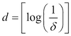 来创建内存中的数据大小。与每一行相关联的是一个哈希函数：*h*(.). 这个函数将值 *x* 均匀地转换到区间 [1, 2 … *w*] 内。这种方法可以用于执行值或点积或频率计数的点查询。

+   **不同计数**：Hash-Sketch 的通用技术可用于执行“不同值”查询或计数。给定进入流值的域 x ∈ [0,1,2….N-1]，哈希函数 *h*(*x*)将值均匀映射到 [0,1,….2L-1]，其中 *L=O(log N)*。

+   **均值**：在不存储所有值的情况下计算均值非常有用，通常使用递归方法实现，只需要观察数（*n*）和迄今为止看到的值的总和（∑*x*[n]）：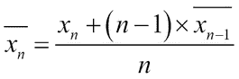

+   **标准差**：与均值一样，标准差可以使用无记忆选项仅使用观察数（*n*）、迄今为止看到的值的总和（∑*x*[n]）和值的平方总和（∑*x*[n]²）来计算：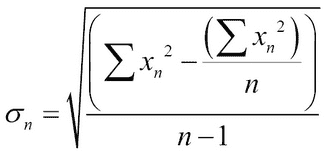

+   **相关系数**：给定两个不同值的流，许多算法需要计算这两个值之间的相关系数，可以通过维护每个流的运行总和（∑*x*[n] 和 ∑*y*[n]）、值的平方总和（∑*x*[n]² 和 ∑*y*[n]²）和交叉乘积（∑*x*[n]x *y*[n]）来实现。相关系数由以下公式给出：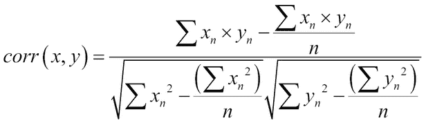

## 滑动窗口

通常，在计算统计数据或汇总时，你不需要整个数据，只需要“最近过去”的数据。在这种情况下，使用滑动窗口技术通过保持窗口大小固定或可调整并移动它来计算汇总统计。

**ADaptable sliding WINdow**（**ADWIN**）是一种用于检测变化以及估计计算所需值的知名技术。ADWIN 背后的想法是保持一个具有可变长度的最近看到值的窗口，其特征是窗口的最大长度与窗口内平均值的平均值没有变化这一事实在统计上是一致的。换句话说，如果新的进入值会改变平均值，则仅当删除旧值时，才会删除旧值。这有两个优点：记录变化并维护最近流中的动态值，如聚合值。确定删除项的主观概念“足够大”可以使用已知的 Hoeffding 界来确定：

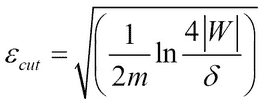

这里 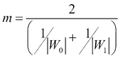 是两个窗口 *W*[0] 和 *W*[1] 之间的调和平均值，其中 *W*[0] 和 *W*[1] 的尺寸分别为 |*W*[0]| 和 |*W*[1]|，*W*[1] 包含更近期的元素。此外，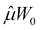 和 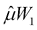 分别是相应的计算平均值。

该算法可以概括为：

1.  ADWIN (*x: 输入流, δ: 置信度*)

1.  init (*W*) //初始化窗口 *W*

1.  while (*x*){

    W ← W ∪ {*x*[t]} //将新实例 *x*[t] 添加到窗口 *W* 的头部

1.  repeat W ← W – *x*old //从窗口尾部删除元素

1.  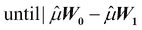 < 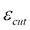 对 *W* 的每个分割都成立

1.  output 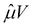

1.  }

ADWIN 还表明，它提供了对假阳性和假阴性的理论界限，这使得它成为一种非常有前途的技术。

## 采样

在许多基于流的算法中，需要减少数据或选择数据的一个子集进行分析。对于基于流的算法，必须增强对整个数据集的采样方法。

在采样中必须解决的关键问题是样本的无偏性和它们如何代表生成流的总体。在非流式环境中，这完全取决于样本大小和采样方法。均匀随机采样（第二章, *实际应用中的监督学习*）是在批量数据世界中用于减少数据的最知名技术之一。考虑到内存限制，水库采样技术被认为是一种非常有效的减少数据的方法。

水库采样的基本思想是保持一个固定大小的水库或样本，比如说 *k*，并且每个进入流量的元素都有 *k/n* 的概率替换水库中的较老元素。详细的算法如下所示：

```py
ReservoirSampling(x:inputstream, k:sizeOfReservoir)
//add first k elements to reservoir
for(i = 0; i < k; i++)
  addToReservoir(x)
  while (x){
    for(i = 0; i < k; i++)
    //flip a coin to get random integer
    r = randomInteger[1..n]
    if(r ≤ k){
      //move it inside the reservoir
      addToReservoir(x)
      //delete an instance randomly from reservoir
      position = randomInteger[1..k]
      removeInstance(position)
    }
}
```

这些方法有扩展，如 Min-wise 采样和负载卸载，可以克服与基本方法相关的一些问题。

# 概念漂移和漂移检测

如本章引言中所述，无限流量的动态性质与静态学习的基本原则直接对立；也就是说，数据的分布或模式保持不变。尽管可能会有快速或突然的变化，但这里的讨论是关于缓慢、渐进的变化。这些缓慢、渐进的变化相当难以检测，将变化与噪声分离变得更加困难：

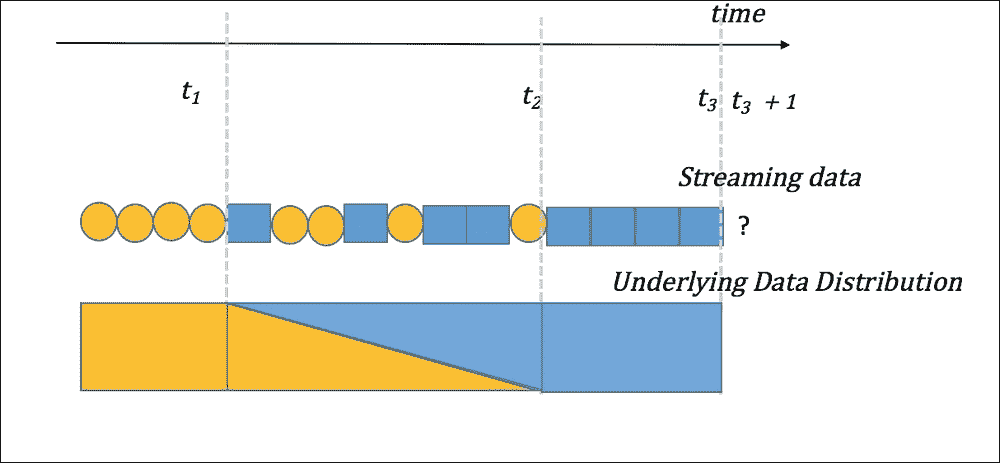

图 1 通过底部面板中颜色从黄色渐变到蓝色的方式展示了概念漂移。采样数据反映了数据分布的潜在变化，这必须被检测到，并学习一个新的模型。

在过去二十年里，各种研究中描述了几种技术，可以按照以下图示进行分类：

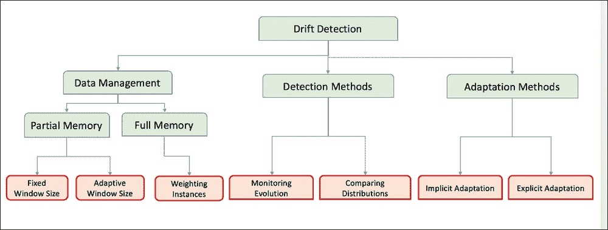

图 2 漂移检测技术分类

## 数据管理

主要思想是在内存中管理一个与数据的动态特性一致的模型。

## 部分内存

这些技术使用内存缓冲区中最最近使用的数据来学习或推导摘要信息。正如之前讨论的那样，关键问题是：检测变化和学习有效性的正确窗口大小是什么？在基于固定窗口大小的技术中，我们使用队列的概念，其中带有最近时间戳的新实例进入，而最旧的实例被移除。因此，窗口包含所有足够近的示例，其大小通常基于内存的物理可用性和队列中数据元素的大小。在自适应窗口大小中，队列与检测算法结合使用。当检测算法根据性能评估表明存在漂移迹象时，窗口大小可以减小，以有效地移除不再帮助模型的旧示例。

### 全内存

思想是在所有示例或数据上存储足够的统计信息。一种方法是对数据进行加权，权重随时间衰减。使用由 λ 给出的速率因子的指数加权可以非常有效：

w[λ] (*x*) = *exp*(– λ * i)

### 检测方法

给定观察到的给定数据的概率 *P(X)*，模式/类 *P(C)* 的概率，以及给定类的数据概率 *P(X|C)*——即模型——检测方法可以大致分为两类：

+   监控模型、分类器或 *P(C|X)* 的演变或性能

+   监控环境中的分布或观察 *P(X)*，*P(C)* 和 *P(X|C)*

#### 监控模型演变

尽管这种方法基于所有模型的 学习都是平稳的，数据来自 **独立、同分布**（**i.i.d.**）的假设，这在许多应用中并不成立，但它已被证明是有效的。以下将描述一些知名技术。

##### 维德默和库巴特

这是最早的方法之一，它观察了错误率或误分类率以及由于新分支等原因对模型（如树结构）的变化。使用这些和已知的阈值，学习窗口的大小会增加或减少。

##### 漂移检测方法或 DDM

此方法假设正在观察的参数，例如分类器正确或错误地标记事物，是一个二元随机变量，遵循二项分布。它假设在概率 pi 处的误分类概率，标准差为 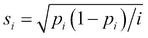，其中值在序列的第 *i*^(th) 点计算。然后，该方法使用两个水平：

+   警告水平：当 *p*[i] + *s*[i] ≥ *p*[min]+ 2 * *s*[min]

+   检测水平：当 *p*[i] + *s*[i] ≥ *p*[min]+ 3 * *s*[min]

在“警告”和“检测”水平之间的所有示例都用于训练一个新的分类器，当达到“检测”水平时，将替换“表现不佳”的分类器。

##### 早期漂移检测方法或 EDDM

EDDM 使用与 DDM 相同的技巧，但略有修改。它使用分类率（即召回率）而不是错误率（1 – 准确率），并使用正确预测数和两个错误预测数之间的距离来改变水平。

EDDM 计算两个误差 *p*[i]*^'* 之间的平均距离和两个 *s*[i]*'*. 标准差之间的距离。水平如下：

+   警告水平：(*p*[i]*^'* + 2 * *s*[i]*^'*) ⁄ (*p^'*[max] + 2 * *s^'*[max]) < *α*

+   检测水平：(*p*[i]*^'* + 2 * *s*[i]*'*) ⁄ (*p^'*[max] + 2 * *s^'*[max]) < *β*

参数 *α* 和 *β* 通常由用户调整到大约 90% 和 95%。

#### 监控分布变化

当没有模型或分类器来检测变化时，我们应用使用某种形式的统计检验来监控分布变化的技巧。这些检验用于识别分布变化。由于假设，无论是参数还是非参数，以及不同的偏差，很难具体地说哪个效果最好。在这里，我们提供一些著名的统计检验。

##### 威尔奇 t 检验

这是 Student *t* 检验的两个样本的改编。检验被改编为采用大小为 *N*[1] 和 *N*[2] 的两个窗口，均值 和 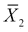，方差 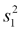和 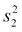来计算 *p* 值，并使用该值来拒绝或接受零假设：

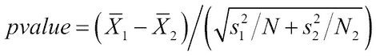

###### 科尔莫哥洛夫-斯米尔诺夫检验

这种统计检验通常用于比较两个分布之间的距离，并验证它们是否低于某些阈值。这可以通过使用两个不同样本大小的窗口，*N*[1] 和 *N*[2]，具有不同的累积分布函数，*F*1 和 F2，*KS* 距离来适应变化检测：

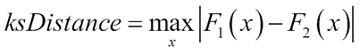

当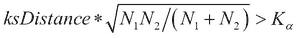（通过 Kolmogorov-Smirnov 表查找获得）的置信度为 *α* 时，拒绝零假设，该假设认为两个分布是相似的。

###### CUSUM 和 Page-Hinckley 测试

**累积和**（**CUSUM**）旨在指示输入的平均值与零显著不同：

*g*[0] = 0 ， *g*[t] = *max*(0, *g*[t–1]) + *ϵ*[t] – *v*)

当 *g*[t] > *h* 时，我们提高变化检测，其中 (*h, v*) 是用户定义的参数。请注意，CUSUM 测试是无记忆的，是一侧或非对称的，仅检测增加。

Page Hinckley 测试与 CUSUM 类似，但有微小差异，如下所示：

*g*0 = 0 ， *g*[t] = *g*[t–1] + *ϵ*[t] – *v*)

对于增加和减少值，我们使用 *G*[t] *= min(g*[t], *G*[t–1]*) 或 G*[t] *= max(g*[t], *G*[t–1]*)*，并且 *Gt – gt > h* 用于变化检测。

### 适应方法

显式和隐式适应是两种在检测到变化时适应环境变化的知名技术。

#### 显式适应

在显式适应中，使用以下技术之一：

+   使用新数据从头开始重新训练模型，以确保以前的模型或数据不会影响新模型

+   使用变化或新数据更新模型，以确保过渡平滑——假设变化是渐进的，而不是剧烈的

+   创建一个随时间学习的模型序列或集成——当协作方法比任何单个模型更好时

#### 隐式适应

在隐式适应中，我们通常使用集成算法/模型来适应概念变化。这可能意味着使用从单个分类器到集成预测，再到使用 ADWIN 进行基于自适应窗口的适应的不同组合——所有这些都属于隐式适应的选择。

# 增量监督学习

本节介绍了在实例的真实标签可用时，从流数据中学习所使用的几种技术。特别是，我们展示了适用于增量学习的线性、非线性以及基于集成算法，以及这些模型评估和验证所需的方法，同时考虑到学习受限于内存和 CPU 时间的限制。

## 建模技术

建模技术分为线性算法、非线性算法和集成方法。

### 线性算法

这里描述的线性方法需要很少或不需要适应来处理流数据。

#### 带损失函数的在线线性模型

可以使用不同的损失函数，如铰链、逻辑和平方误差，在此算法中使用。

##### 输入和输出

这些方法仅使用数值特征。损失函数 *l* 和应用权重更新的学习率 λ 的选择被视为输入参数。输出通常是可更新的模型，这些模型提供带有置信值的预测。

##### 它是如何工作的？

基本算法假设线性权重组合，类似于第二章中解释的线性/逻辑回归，*《面向现实世界监督学习的实用方法》*。流或在线学习算法可以总结如下：

1.  for(t=1,2,…T) do

    1.  **x**[t] = *receive()*; //接收数据

    1.  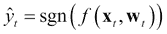 ; //预测标签

    1.  *y*[t] = *obtainTrueLabel()*; //获取真实标签

    1.  *loss* = *l*(**w**[t], (**x**[t], **w**[t])); //计算损失

    1.  if(*l*(**w**t,(**x**t, **w**t )) > 0 then

    1.  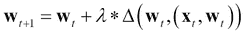 ; //更新权重

    1.  end

1.  end

可以根据问题类型插入不同的损失函数；这里展示了其中一些知名类型：

+   分类：

    +   切比雪夫损失：*l*(**w**[t], (**x**[t], **w**[t])) = max(0, 1 – *yf*(**x**[t], **w**[t]))

    +   逻辑损失：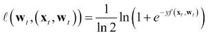

+   回归：

    +   平方损失：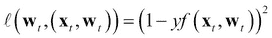

**随机梯度下降** (**SGD**)可以被视为改变权重以最小化平方损失，如前面的损失函数，但以每个示例的梯度方向前进。权重的更新可以描述为：

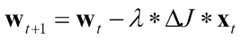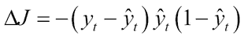

##### 优点和局限性

在线线性模型与第二章中描述的线性模型具有类似的优缺点，*《面向现实世界监督学习的实用方法》*：

+   在一定程度上可解释，因为每个特征的权重可以提供对每个特征影响的见解

+   假设线性关系，加性和不相关特征，因此不模拟复杂的非线性现实世界数据

+   非常容易受到数据中异常值的影响

+   非常快，通常也是尝试或基线算法之一

#### 在线朴素贝叶斯

贝叶斯定理应用于获取预测值，即后验概率，给定一个*m*维输入：

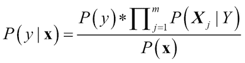

##### 输入和输出

在线朴素贝叶斯可以接受分类和连续输入。对于分类特征来说更容易，因为算法必须维护每个类别的计数，同时计算给定类别的每个特征的*P*(**X**[j]|*Y*)概率。对于连续特征，我们必须假设一个分布，例如高斯分布，或者以增量方式计算在线核密度估计，或者以增量方式对数值特征进行离散化。输出是可更新的模型，可以预测类别并附带置信值。作为概率模型，它们具有更好的置信度分数，分布在 0 到 1 之间。

##### 如何工作？

1.  for(t = 1,2,…T) do

    1.  **x**[t] = *receive()*; //接收数据

    1.  incrementCounters(**x**[t]); //更新*P(***X**j*|Y)*

    1.  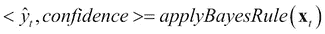 //后验概率

1.  end

##### 优点和局限性

+   这是最快的算法，同时具有低内存占用和计算成本。它在在线或快速学习者中非常受欢迎。

+   假设分布或某些影响预测质量的数值特征的偏差。

### 非线性算法

目前使用最流行的非线性流学习分类器之一是 Hoeffding 树。在以下小节中，介绍了 Hoeffding 界限的概念，然后是算法本身。

#### Hoeffding 树或非常快速决策树（VFDT）

Hoeffding 树（**HT**）背后的关键思想是 Hoeffding 界限的概念。给定一个具有值范围大小**R**的实值随机变量**x**，假设我们有**n**个独立的**x**观察值，并计算其均值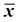。

Hoeffding 界限表明，以 1 – δ的概率，变量**x**的实际均值至少是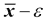其中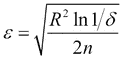

Hoeffding 界限与生成样本的概率分布无关，并且仅使用**n**个示例就能给出良好的近似。

Hoeffding 界限的思想在叶扩展中使用。如果*x*[1]是最具信息量的特征，而*x*[2]排名第二，那么使用用户定义的分割函数*G*(.)进行分割，以便：

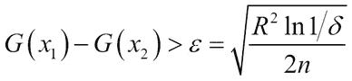

##### 输入和输出

分类数据和连续数据都可以是数据输入的一部分。在许多实现中，连续特征被离散化。所需的概率参数 1 – δ和与决策树共同的分割函数*G*(.)成为输入的一部分。输出是可解释的决策树模型，并且可以用类别和置信度值进行预测/学习。

##### 它是如何工作的？

HoeffdingTree(x:输入流,G(.):分割函数,δ:概率界限)

1.  让 HT 成为一个具有单个叶（根）的树

1.  初始化计数(*n*[ijk], *root*)

1.  for(t=1,2,…T) do //来自流的全部数据

    1.  **x***[t] = receive();* //接收数据

    1.  *y[t] = obtainTrueLabel();* //获取真实标签

    1.  HTGrow((**x**[t], *y*[t]), **HT**, δ)

    1.  end

**HTGrow**((**x**[t], *y*[t]), **HT**, *G*(.), δ)

1.  *l = sort((***x**[t], *y*[t]), **HT**); //使用 HT 对数据进行排序到叶 l

1.  *updateCounts(n*[ijk], *l);* //更新叶 l 的计数

1.  *if(examplesSoFarNotOfSameClass();*//检查是否存在多个类别

1.  *computeForEachFeature(,G(.))*

    1.  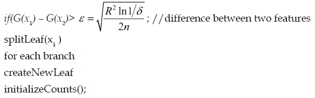

Hoeffding 树具有有趣的特性，例如：

+   它们是一个稳健的低方差模型

+   它们表现出较低的过拟合

+   由于 Hoeffding 界限，存在高概率上的误差率的理论保证

Hoeffding Trees 有适应概念漂移的变体，称为概念适应 VFDT。它们在流上使用滑动窗口概念。决策树中的每个节点都保留足够的统计信息；基于 Hoeffding 测试，当准确性更好时，会生长一个替代子树并将其交换。

##### 优点和局限性

优点和局限性如下：

+   基本 HT 在属性接近所选*ϵ*时存在问题，并打破了平局。在任何节点上决定属性的数量又是一个问题。其中一些问题在 VFDT 中得到解决。

+   随着树的变化，树扩展的内存限制以及在一个实例上花费的时间成为问题。

+   VFDT 在模式变化方面存在问题，CVFDT 试图克服这些问题，如前所述。它是实时和大数据中最优雅、快速、可解释的算法之一。

### 集成算法

集成学习的思想与批量监督学习类似，其中多个算法以某种形式训练和组合来预测未见数据。即使在在线设置中，不同的集成方法也能带来相同的益处；例如，使用不同类型的多个算法，使用具有不同参数或样本数据的类似类型的模型，所有这些都可以找到不同的搜索空间或模式，从而降低总误差。

#### 加权多数算法

**加权多数算法**（**WMA**）训练一组基础分类器，并按某种方式加权它们的投票，然后基于多数进行预测。

##### 输入和输出

输入类型的约束（仅分类，仅连续，或混合）取决于所选的基础分类器。模型的可解释性取决于所选的基础模型（s），但很难解释模型组合的输出。当预测不正确时，每个模型的权重通过每个示例/实例的因子（*β*）更新。权重和模型的组合可以给出一些可解释性的线索。

##### 它是如何工作的？

*WeightedMajorityAlgorithm(x: inputstream, hm: m learner models)*

1.  *initializeWeights(w*[i]*)*

1.  for(t=1, 2,…T) do

    1.  *x*[t] *= receive();*

    1.  *foreach model hk* *∈* *h*

    1.  *y*[i] ← *h*k;

1.  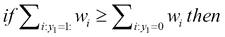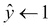

1.  else 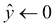

1.  if *y* is known then

    1.  for *i* = 1 to m do

    1.  if *y*i ≠ *y* then

    1.  *wi* ← *w*i ** β*

        end if

        end for

1.  end

##### 优点和局限性

优点和局限性如下：

+   WMA 具有简单的实现和理论上的集成误差界限

+   困难之处在于选择正确的基算法，因为模型和池中模型的数量。

#### 在线 Bagging 算法

正如在监督学习章节中看到的，袋装算法从训练集中创建不同的样本，并使用多个算法进行学习和预测，减少了方差，在学习和预测中非常有效。

##### 输入和输出

对输入类型的限制（仅分类，仅连续，或混合）取决于所选的基本分类器。与算法对应的参数选择的基本分类器算法也是输入。输出是学习模型，可以根据所选分类器预测类别/置信度。

##### 它是如何工作的？

基本的批量袋装算法需要整个数据可用以创建不同的样本，并将这些样本提供给不同的分类器。Oza 的在线袋装算法改变了这一限制，使得从无界数据流中学习成为可能。基于采样，原始算法中的每个训练实例被复制多次，每个基本模型使用原始实例的 *k* 份副本进行训练，其中：

*P(k) = exp(–1)/k!*

这相当于取一个训练示例，并为每个分类器选择 *k~Poisson(1)*，然后更新基本分类器 *k* 次。因此，消除了对示例数量的依赖，算法可以在无限流上运行：

*OnlineBagging(x: inputstream, h*[m]*: m learner models)*

1.  为所有 *m* ∈ {1,2,..*M*} 初始化基本模型 *h*[m]*

1.  for(t=1,2,…T) do

    1.  *x*[t]*=receive();*

    1.  foreach model *m* = {1,2,..*M*}

        *w = Poisson*(1)

        *updateModel(h*[m]*, w, x*[t]*)*

    1.  end

1.  return

1.  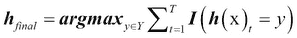

##### 优点和局限性

优点和局限性如下：

+   实验表明，它是最成功的在线或流算法之一。

+   权重必须分配给数据实例，而不考虑其他实例；这减少了在批量中可用且对模型性能良好的不同加权方案的选择。

性能完全取决于 *M* 学习者的选择——用于问题域的学习者类型。我们只能通过采用模型验证技术部分中描述的不同验证技术来决定这个选择。

#### 在线提升算法

监督提升算法采用许多 *弱学习器*，其准确率略高于随机，通过迭代采样错误分类的示例来组合它们以产生强学习器。这个概念在 Oza 的在线提升算法中是相同的，但为了连续数据流进行了修改。

##### 输入和输出

对输入类型（仅分类，仅连续，或混合）的限制取决于所选的基本分类器。基本分类器算法及其相应的参数是输入。输出是学习模型，可以根据所选分类器预测类别/置信度。

##### 它是如何工作的？

将批量提升修改为在线提升的方法如下：

1.  为 *M* 个基本模型保留两套权重，*λ*^c 是一个维度为 *M* 的向量，它携带正确分类实例的权重总和，而 *λ*^w 是一个维度为 *M* 的向量，它携带错误分类实例的权重总和。

1.  权重初始化为 1。

1.  给定一个新的实例（**x**[t]，*y*[t]），算法通过更新基本模型的迭代过程。

1.  对于每个基本模型，重复以下步骤：

    1.  对于第一次迭代，*k = Poisson(λ)* 被设置，学习分类器使用（在此表示为 *h*[1]）*k* 次更新算法（使用（**x**[t]，*y*[t]))：

    1.  如果 *h*[1] 错误地分类了实例，则 *λ*^(w1) 增加，*ϵ*[1]，由 *h*[1] 错误分类的加权分数，被计算，并且示例的权重乘以 1/2 *ϵ*[1]。

##### 优点和局限性

优点和局限性如下：

+   再次，性能取决于多个学习者的选择、它们的类型以及特定问题的领域。在模型验证技术部分描述的不同方法帮助我们选择学习者。

+   Oza 的在线提升已被理论和实证证明不是“无损”；也就是说，与它的批量版本相比，模型是不同的。因此，它存在性能问题，近年来已经研究了不同的扩展来提高性能。

## 在在线设置中的验证、评估和比较

与我们在前几章中看到的机器学习模式不同，流学习在执行验证和评估的核心步骤时提出了独特的挑战。我们不再处理批量数据的事实意味着，用于验证评估和模型比较的标准技术必须适应增量学习。

### 模型验证技术

在离线或批量设置中，我们讨论了调整算法参数或测试算法泛化能力作为防止过拟合的对策的各种方法。批标签数据中的一些技术，如交叉验证，在在线或流设置中不直接适用。在线或流设置中最常用的技术将在下面给出。

#### 预序评估

预序评估方法是一种将实例提供给算法的方法，然后使用损失函数将算法的输出预测与实际标签进行比较。因此，算法始终在未见数据上测试，无需“保留”数据来估计泛化。预序误差是根据实际值和预测值之间累积损失函数的总和计算的，给出如下：

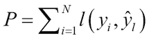

为了更好地估计变化数据，进行了三种基本预序评估的变体，它们是：

+   使用地标窗口（基本）

+   使用滑动窗口

+   使用遗忘机制

最后两种方法是之前描述的技术扩展，其中你在预测上放置权重或衰减因子，这些权重或因子会随着时间的推移而减少。

#### 保留集评估

这是保留机制或“独立测试集”方法在批量学习中的扩展。在这里，总标记集或流数据被分为训练集和测试集，要么基于某些固定间隔，要么基于算法看到的示例/实例数量。想象一下连续的数据流，我们在 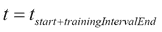 和 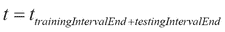 处放置已知的间隔，以比较评估指标，如下一节所述，以评估性能。

#### 控制排列

上述机制的问题在于，它们提供了随时间变化的“平均”行为，可能会掩盖一些基本问题，例如算法由于漂移而在开始时表现良好，而在结束时表现非常糟糕。前述方法的优点是，它们可以应用于实际的输入流以获得估计。克服这种缺点的一种方法是在数据的不同随机集中创建不同的随机集，同时保持时间上的邻近性，并在这些随机集上进行评估。

#### 评估标准

大多数评估标准与监督学习章节中描述的相同，应根据业务问题、业务问题到机器学习技术的映射以及从中获得的收益来选择。在本节中，总结了读者最常用的在线监督学习评估标准：

+   **准确率**：衡量学习算法正确分类真实正例和真实负例的度量：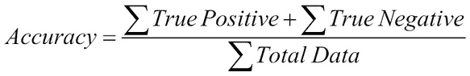

+   **平衡准确率**：当类别不平衡时，通常使用平衡准确率作为度量。平衡准确率是特异性和敏感性的算术平均值。也可以将其视为在二元分类问题中，从相同的概率中抽取正例和负例时的准确率。

+   **ROC 曲线下面积** (**AUC**): ROC 曲线下面积提供了算法泛化能力的良好度量。接近 1.0 表示算法具有良好的泛化能力，而接近 0.5 则表示它更接近随机猜测。

+   **Kappa 统计量** (**K**): Kappa 统计量用于衡量分类中观察到的准确度与随机猜测的预期准确度。在在线学习中，Kappa 统计量通过计算先验准确度 (*p*o) 和随机分类器准确度 (*p*c) 来使用，其表达式为：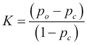

+   **Kappa Plus 统计量**: Kappa Plus 统计量是对 Kappa 统计量的一种修改，通过用持久分类器替换随机分类器来获得。持久分类器是一种基于先前实例的标签或结果预测下一个实例的分类器。

当考虑“漂移”或概念变化，如前所述，除了这些标准措施外，还使用一些已知的措施来给出定量度量：

+   **真实变化检测的概率**: 通常使用合成数据或已知变化的数据进行测量。它提供了学习算法检测变化的能力。

+   **误报概率**: 与离线设置中使用假阳性率不同，在线设置使用检测时间的倒数或平均运行长度，该长度使用预期假阳性检测时间来计算。

+   **检测延迟**: 这是指识别漂移所需的时间，以实例为单位的术语。

#### 比较算法和指标

当在线设置中比较两个分类器或学习者时，通常的机制是采用性能指标，例如错误率，并使用适用于在线学习的统计检验。以下描述两种广泛使用的方法：

+   **McNemar 检验**: McNemar 检验是一种非参数统计检验，通常用于比较两个分类器的评估指标，例如“错误率”，通过存储两个分类器的简单统计信息。通过计算统计量 *a*，即一个算法正确分类的点数而另一个算法错误分类的数量，以及统计量 *b*，即其逆，我们得到 McNemar 检验如下：

    该检验遵循 χ2 分布，p 值可用于检查统计显著性。

+   **Nemenyi 检验**: 当存在多个算法和多个数据集时，我们使用基于所有平均排名的 Nemenyi 检验进行统计显著性检验。如果排名差异超过由以下给出的关键差异，则认为两个算法在统计上以显著不同的方式表现：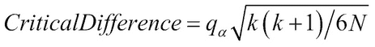

    在这里，K=算法数量，N=数据集数量。

假设关键差异值遵循 Student-T 分布。

# 使用聚类进行增量无监督学习

数据流中聚类的概念与批量或离线模式中的概念相同；也就是说，在保持对有限内存和处理所需时间的限制作为约束的同时，寻找有趣的数据簇或模式，这些模式在数据中聚集在一起。对现有算法进行单次修改或保持一个小内存缓冲区以执行现有算法的迷你批处理版本，构成了所有算法的基本变化，使它们适合流或实时无监督学习。

## 建模技术

在线学习的聚类建模技术分为基于分区、基于层次、基于密度和基于网格，类似于批量聚类的情况。

### 基于分区

基于分区算法的概念类似于批量聚类，其中形成**k**个聚类以优化某些目标函数，如最小化簇间距离，最大化簇内距离等。

#### 在线 k-Means

k-Means 是最受欢迎的聚类算法，它将数据划分为用户指定的**k**个聚类，通常是为了最小化质心与分配给聚类的点之间的平方误差或距离。我们将说明 k-Means 的一个非常基本的在线自适应版本，其中存在几种变体。

##### 输入和输出

主要，数值特征被视为输入；一些工具将分类特征转换为某种形式的数值表示。算法本身将聚类数量参数**k**和最大迭代次数**n**作为输入。

##### 它是如何工作的？

1.  输入数据流被认为是无限的，但块大小是恒定的。

1.  保留一个块大小的内存缓冲区以存储数据或数据的压缩表示。

1.  初始时，使用块大小的第一个数据流来找到聚类的**k**个质心，质心信息被存储，缓冲区被清除。

1.  对于达到块大小后的下一个数据：

    1.  对于最大迭代次数或直到质心没有变化：

    1.  使用缓冲数据和当前质心执行 k-Means。

    1.  最小化质心与分配给聚类的数据之间的平方和误差。

    1.  迭代后，缓冲区被清除，并获得了新的质心。

1.  重复步骤 4，直到数据不再可用。

##### 优点和局限性

优点和局限性如下：

+   与批量基础类似，检测到的聚类形状取决于距离度量，在形状不规则的领域问题中不合适。

+   参数**k**的选择，如在批量基础上，可能会限制在具有许多不同模式或聚类的数据集上的性能。

+   异常值和缺失数据可能会在线 k-Means 的聚类行为中引起许多不规则性。

+   如果选择的缓冲区大小或迭代 k-Means 运行的流块大小较小，则无法找到正确的聚类。如果选择的块大小较大，可能会导致速度减慢或错过数据的变化。例如，**非常快速 k-Means 算法**（**VFKM**），它使用 Hoeffding 界限来确定缓冲区大小，在很大程度上克服了这一限制。

### 基于层次和微聚类的

层次方法通常基于**聚类特征**（**CF**）和**聚类树**（**CT**）。我们将描述层次聚类和**BIRCH**算法的基本内容和元素，CluStream 算法就是基于这个扩展的。

聚类特征是一种以压缩方式计算和保存关于簇的汇总统计量，而不是保留簇所属的全部数据。在一个**d**维数据集中，有**N**个点的簇中，计算两个总和，即每个维度的总和**LS**和每个维度的数据总平方和**SS**，这个三元组的表示向量形成聚类特征：

*CF*[j]* = < N, LS*[j]*, SS*[j]* >*

这些统计数据有助于总结整个簇信息。簇的重心可以通过以下方式轻松计算：

*质心*[j]* = LS*[j]* / N*

可以使用以下方法估计簇的半径：

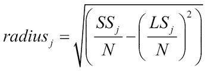

可以使用以下方法估计簇的直径：

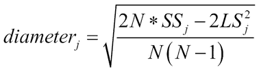

CF 向量具有很好的增量性和累加性，这在流或增量更新中非常有用。

对于增量更新，当我们必须更新 CF 向量时，以下条件成立：

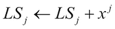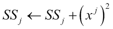

当两个 CF 需要合并时，以下条件成立：

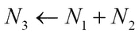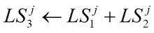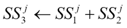

**聚类特征树**（**CF 树**）表示一个层次树结构。CF 树的构建需要两个用户定义的参数：

+   分支因子**b**，即任何节点可以拥有的最大子簇或非叶节点数

+   最大直径（或半径）**T**，CF 父节点可以吸收的示例数量

CF 树操作，如插入，是通过递归遍历 CF 树并使用 CF 向量根据距离度量找到最近节点来完成的。如果一个叶节点已经吸收了由参数*T*给出的最大元素，则节点被分割。操作结束时，CF 向量会适当地更新其统计量：


图 3：一个展示层次结构的聚类特征树示例。

我们将根据这一概念讨论**BIRCH**（**平衡迭代减少和聚类层次结构**）。

#### 输入和输出

BIRCH 只接受数值特征。CF 和 CF 树参数，如分支因子*b*和叶节点的最大直径（或半径）*T*是用户定义的输入。

#### 它是如何工作的？

BIRCH 是为非常大的数据库设计的，原本是一个*两遍*算法；也就是说，扫描整个数据一次，然后再次扫描，因此是一个*O(N)*算法。它可以很容易地修改为单遍算法，以在线方式保留相同的属性：

1.  在第一阶段或扫描中，它遍历数据，通过顺序访问点并执行之前讨论的 CF 树操作，创建一个内存中的 CF 树结构。

1.  在第二阶段，这是一个可选阶段，我们去除异常值并合并子簇。

1.  第三阶段是为了克服第一阶段数据顺序的问题。我们使用层次聚类对 CF 树进行重构。

1.  第四阶段是最后一个阶段，这是一个可选阶段，用于计算统计信息，如计算质心、将数据分配给最近的质心等，以提高效率。

#### 优点和局限性

优点和局限性如下：

+   它是最受欢迎的线性扩展算法之一，在大数据库或数据流上具有线性扩展能力。

+   它以 CF 和 CF 树的形式具有紧凑的内存表示，用于对传入数据的统计和操作。

+   它比大多数算法更好地处理异常值。

+   一个主要的局限性是，当簇的形状不是球形时，它已被证明表现不佳。

+   BIRCH 中的 CF 向量聚类概念被 Aggarwal 等人扩展，以适应高效的流挖掘需求，并命名为*微簇和 CluStream*。

#### 输入和输出

CluStream 只接受数值特征。用户定义的参数包括内存中微簇的数量（*q*）和阈值（*δ*），在时间之后它们可以被删除。此外，输入还包括时间敏感的参数，用于存储微簇信息，由*α*和*l*给出。

#### 它是如何工作的？

1.  微簇扩展了 CF 向量，并保留了两个额外的度量。它们是时间戳的总和以及时间戳平方的总和：

    *微簇*[j] *= < N, LS*[j]*, SS*[j]*, ST, SST>*

1.  算法在内存中存储*q*个微簇，每个微簇都有一个*最大边界*，可以根据质心和簇实例之间的距离的均值和标准差来计算。这些度量乘以一个随时间指数递减的因子。

1.  对于每个新的实例，我们根据欧几里得距离选择最近的微簇，并决定它是否应该被吸收：

    1.  如果新实例与最近微簇质心之间的距离在最大边界内，则它将被吸收，并且微簇统计信息将得到更新。

    1.  如果没有微簇可以吸收，则创建一个新的微簇，包含实例，并根据时间戳和阈值（*δ*），删除最旧的微簇。

    1.  假设时间戳服从正态分布，如果 CluStream 找到的实例的相关时间——实例到达的时间——低于用户指定的阈值，则被视为异常并删除。否则，将合并两个最近的微簇。

1.  微簇信息通过使用金字塔时间窗口概念，时不时地存储在二级存储中。每个微簇使用 *α*l 指数递减的时间间隔来创建快照。这些快照有助于在时间和空间上高效搜索。

#### 优点和局限性

优点和局限性如下：

+   CluStream 已被证明在实时寻找簇方面非常有效

+   CluStream 算法通过使用金字塔时间戳进行有效存储，具有高效的时间和空间使用。CluStream，就像 BIRCH 一样，只能找到球形形状的簇

### 基于密度

与批处理聚类类似，基于密度的技术克服了基于距离的算法面临的“形状”问题。在这里，我们将介绍一个著名的基于密度的算法，即 DenStream，它基于之前讨论的 CF 和 CF Trees 概念。

#### 输入和输出

核心微簇的邻域范围是用户定义的半径 *ϵ*。第二个输入值是微簇的最小总权重 *µ*，它是每个实例到达时间加权函数的总和，其中权重随时间常数衰减，与另一个用户定义的参数 *λ* 成正比。最后，使用输入因子 *β* ∈ (0,1) 来区分潜在的核微簇和异常微簇。

#### 它是如何工作的？

1.  基于 CluStream 的微簇概念，DenStream 包含两个数据结构：*p-微簇*用于潜在簇和*o-微簇*用于异常检测。

1.  每个 *p-微簇* 结构具有：

    1.  与它相关联的权重，该权重随时间戳的更新指数递减。如果微簇中有 *j* 个对象： 其中 *f(t) =* 2^(-λt)

    1.  **加权线性求和**（**WLS**）和**加权线性平方和**（**WSS**）与线性求和和平方和类似存储在微簇中：

    1.  使用之前定义的加权度量计算簇的均值、半径和直径，这与 CF 中的做法完全一样。例如，半径可以表示为：

    

1.  每个 *o-微簇* 与 *p-微簇* 具有相同的结构，并与其相关联时间戳。

1.  当一个新的实例到达时：

    1.  如果新半径在用户定义的边界 *ϵ* 内，则找到最近的 *p-微簇* 并将实例插入其中。如果插入，则相应更新 *p-微簇* 统计数据。

    1.  否则，如果新的半径再次在边界内，就会找到一个*o-微簇*，并将实例插入其中。边界由用户定义参数的乘积*β* × *μ*定义，如果半径超过这个值，*o-微簇*将被移动到*p-微簇*。

    1.  如果实例不能被一个*o-微簇*吸收，那么就会向*o-微簇*中添加一个新的微簇。

1.  在基于权重的间隔时间*t*，*o-微簇*可以变成*p-微簇*，反之亦然。时间间隔以*λ*、*β*和*µ*来定义：

#### 优点和局限性

优点和局限性如下：

+   基于参数，DenStream 可以找到实时数据的有效聚类和异常值。

+   它的优点是能够找到任何形状或大小的聚类和异常值。

+   如果没有正确选择，更新*o-微簇*和*p-微簇*的维护工作可能会计算成本高昂。

### 基于网格

这种技术基于将多维连续空间离散化为多维离散版本，并使用网格。将传入的实例映射到在线网格并维护离线网格的结果是一种高效且有效的方法，可以在实时中找到聚类。

在这里，我们介绍了 D-Stream，这是一个基于网格的在线流聚类算法。

#### 输入和输出

与基于密度的算法一样，D-Stream 使用了实例衰减权重的想法。此外，如以下所述，从输入空间形成的网格中的单元格可能被认为是稀疏的、密集的或偶然的，这些区别是算法的计算和空间效率的核心。因此，基于网格的算法的输入如下：

+   *λ*: 衰减因子

+   0 < *C*[l] < 1 和 *C*[m] > 1：控制网格中密集和稀疏单元格之间边界的参数

+   *β* > 0：一个常数，用于控制当稀疏单元格被视为偶然单元格时的一个条件。

#### 它是如何工作的？

1.  在时间*t*到达的每个实例都有一个随时间指数衰减的密度系数：

1.  在任何给定时间*t*，网格单元格*g*的密度由*D(g, t)*给出，它是映射到网格单元格*g*的所有实例的调整密度的总和*E(g, t)*：

1.  网格中的每个单元格都捕获了以下作为特征向量的统计数据：

    +   *CV(g) =* <*t*[g], *t*>[m], *D*, *label*, *status*> 其中：

    +   *t*[g] = 网格单元格上次更新的时间

    +   *t*[m]= 网格单元格上次由于稀疏性而被移除的时间

    +   *D* = 上次更新时网格单元格的密度

    +   *label* = 网格单元格的类别标签

    +   *status* = {正常或偶然}

1.  当新的实例到达时，它会被映射到一个单元格*g*，并且特征向量被更新。如果*g*不可用，它将被创建，并且网格列表被更新。

1.  具有空实例的网格单元将被移除。此外，长时间未更新的单元可能会变得稀疏，相反，当映射许多实例时，它们会变得密集。

1.  在一个称为间隔的常规时间间隔内，检查网格单元的状态，那些实例数量少于由密度阈值函数确定的数字的单元被视为异常值并被移除。

#### 优点和局限性

优点和局限性如下：

+   D-Streams 在理论和实证上已被证明能够在空间和时间上以非常高的效率找到偶然和正常的聚类。

+   它可以有效地找到任何形状或大小的聚类。

### 验证和评估技术

许多在第三章无监督机器学习技术中讨论的静态聚类评估度量都假设存在静态和非演化的模式。其中一些内部和外部度量甚至在基于流的聚类检测中使用。本节的目标是首先强调流学习聚类评估中固有的问题，然后描述解决这些问题的不同内部和外部度量，最后介绍一些现有的度量——包括内部和外部度量——它们仍然有效。

#### 流聚类评估的关键问题

理解一些特定于流和聚类的关键问题很重要，因为这些度量需要解决这些问题：

+   **老化**: 点在给定时间后不再与聚类度量相关的属性。

+   **遗漏的点**: 点不仅被遗漏为属于聚类，而且遗漏的量在聚类中。

+   **放置错误**: 由新聚类的演变引起的聚类变化。合并现有或删除聚类会导致随着时间的推移出现不断放置错误。必须考虑这些变化随时间的影响。

+   **聚类噪声**: 选择不应属于聚类的数据或围绕噪声形成聚类及其随时间的影响必须被考虑。

#### 评估度量

在流数据上下文中进行聚类的评估度量必须提供聚类质量的有用指标，同时考虑演化和噪声数据流的影响、重叠和合并的聚类等问题。在此，我们介绍了一些在流聚类中使用的外部度量。在第三章无监督机器学习技术中遇到的许多内部度量，如轮廓系数、Dunn 指数和 R 平方，也被使用，此处不再重复。

##### 聚类映射度量（CMM）

CMM 背后的思想是在给定真实情况下量化点到聚类的连通性。它分为三个阶段：

**映射阶段**：在这个阶段，流学习算法分配的聚类映射到真实聚类。基于这些，使用 k-最近邻的概念测量距离和点连通性的各种统计量。

点*p*在聚类*C*i 中到其最近的*k*个邻居的平均距离由以下公式给出：


聚类*C*[i]的平均距离由以下公式给出：


聚类*C*[i]中点*p*的点连通性由以下公式给出：


对每个聚类计算类别频率，并通过计算直方图和聚类中的相似性来执行聚类到真实聚类的映射。

具体来说，聚类*C*[i]映射到真实类别，而*Cl*[j]映射到覆盖*C*[i]中类别频率大多数的真实聚类。剩余定义为类*Cl*[i]中未被真实聚类覆盖的实例数量，以及与相比，在聚类*C*[i]中类*Cl*[1]，*Cl*[2]，*Cl*[3] … *Cl*[1]中的实例的总剩余量给出如下：


使用以下方法映射聚类*C*[i]：


**惩罚阶段**：在这个步骤中，使用错误对象的计算来计算映射错误的每个实例的惩罚；即不是噪声但放置错误的对象，使用以下方法：


点*o*相对于所有找到的聚类的总体惩罚由以下公式给出：


**CMM 计算**：使用所有惩罚在生命周期内加权给出如下：


这里，*C*是找到的聚类，*Cl*是真实聚类，*F*是错误对象，*w(o)*是实例的权重。

##### V 度量

验证度或 V 度量是一个外部度量，它是基于流聚类中两个感兴趣的属性计算的，即**同质性**和**完整性**。如果有*n*个类别，设*C* = {*c*[1], *c*[2] …, *c*[n]}，和*k*个聚类*K* = {*k*[1], *k*[2..]*k*[m]}，则创建列联表，其中*A* = {*a*[ij]}对应于类别*c*[i]和聚类*k*[j]中的实例数量。

**同质性**：同质性定义为聚类的一个属性，反映了聚类中所有数据属于同一类别的程度。

条件熵和类别熵：


同质性定义为：


同质性值越高越理想。

**完整性**：完整性定义为同质性的镜像属性，即所有单个类别的实例都属于同一个聚类。

与同质性类似，条件熵和聚类熵定义为：


完整性定义为：


V-Measure 定义为使用权重因子*β*的同质性和完整性的调和平均值：


完整性或 V-measure 的值越高越好。

##### 其他外部度量

接下来给出一些外部度量，这些度量在比较聚类算法或测量已知类别的聚类有效性时相当流行：

**纯度**和**熵**：它们与之前定义的同质性和完整性相似。

纯度定义为：


熵定义为：


这里，*q* = 类别数量，*k* = 聚类数量，*n*r = 聚类*r*的大小，。

**精度**、**召回率**和**F-Measure**：针对聚类算法修改的信息检索度量如下：

给定，和。

精度定义为：


召回率定义为：


F-measures 定义为：


# 使用离群值检测进行无监督学习

在数据流中寻找离群值或异常值是机器学习中的一个新兴领域。这个领域的研究并没有像基于分类和聚类的问题那样受到研究者的广泛关注。然而，已经有一些非常有趣的想法将聚类的概念扩展到从数据流中寻找离群值。我们将提供一些在流离群值检测中已被证明非常有效的科研。

## 基于分区聚类进行离群值检测

这里的核心思想是使用基于在线分区聚类算法，并根据聚类大小排序或簇间距离排序，将簇标记为离群值。

这里我们介绍由 Koupaie 等人提出的一种算法，使用增量 k-Means。

### 输入和输出

仅使用数值特征，正如大多数 k-Means 算法一样。聚类数量*k*和离群值窗口数量*n*，在离线聚类中使用的输入参数。输出是恒定的离群值（局部和全局）以及一个可更新的模型，用于检测这些离群值。

### 它是如何工作的？

1.  该算法通过 k-Means 算法在两种模式下工作，离线模式和在线模式，两者并行运行。

1.  对于在线模式：

    1.  在给定的窗口 *w* 上应用 k-Means，并找到具有簇的数据的簇和分区。

    1.  根据簇距离和簇大小对簇进行排序。距离最远且尺寸较小的簇被认为是异常值。

    1.  将窗口作为集合 *O*[w] = {**x**[1], **x**[2..]**x**[n]} 存储异常值，并将它们视为局部异常值。

    1.  窗口被清除，过程重复。

1.  对于离线模式：

    1.  从 *n* 个先前窗口中获取异常值，并创建一个集合：

    1.  使用 k-Means 对窗口 *S* 进行聚类，并找到距离最远且尺寸较小的簇。

    1.  这些簇是全局异常值。

    1.  窗口被清除，过程重复。

### 优点和局限性

优点和局限性如下：

+   它对参数 *k* 和 *n* 非常敏感，可以生成大量噪声。

+   只找到了球形簇/异常值，而不同形状的异常值被遗漏了。

## 基于距离的异常值检测聚类

基于距离的异常值检测是流学习领域中研究、实施最广泛的方法。基于滑动窗口、最近邻数量、半径和阈值以及其他考虑数据中异常值的措施，有许多基于距离的方法的变体。我们将尝试在本节中给出最重要的算法的抽样。

### 输入和输出

大多数算法将以下参数作为输入：

+   窗口大小 *w*，对应算法查找异常值模式时的固定大小

+   滑动大小 *s*，对应于将被添加到窗口中的新实例数量，以及将被移除的旧实例数量

+   使用最近邻计算时实例的计数阈值 *k*

+   用于定义距离中异常值阈值的距离阈值 *R*

异常值作为标签或分数（基于邻居和距离）输出。

### 如何工作？

我们展示了基于距离的流异常值算法的不同变体，揭示了它们的不同之处或独特之处。每个算法的独特元素定义了滑动窗口过期时会发生什么，如何处理新的滑动窗口，以及如何报告异常值。

#### 精确风暴

精确风暴将数据存储在当前窗口 *w* 中的已知索引结构中，以便对给定点的范围查询搜索或查询在距离 *R* 内的邻居进行高效处理。它还存储所有数据点的 *k* 个前驱和后继邻居：

+   **过期滑动窗口**：过期滑动窗口中的实例从影响范围查询的索引结构中删除，但保留在邻居的前驱列表中。

+   **新滑动窗口**：对于新滑动窗口中的每个数据点，执行范围查询 *R*，使用结果更新实例的前驱和后继列表，并将实例存储在索引结构中。

+   **异常值报告**：在任何窗口中，在处理过期和新幻灯片元素完成后，任何至少有 *k* 个元素来自后继列表和非过期前驱列表的实例都被报告为异常值。

#### 抽象-C

Abstract-C 保持索引结构与 Exact Storm 相似，但不是为每个对象维护前驱和后继列表，而是仅维护实例参与窗口的邻居计数列表：

+   **过期幻灯片**：在过期幻灯片中的实例将从影响范围查询的索引结构中移除，并且与最后一个窗口对应的计数列表中的第一个元素也被移除。

+   **新幻灯片**：对于新幻灯片中的每个数据点，执行范围查询 *R*，并使用结果更新计数列表。对于现有实例，计数会根据新的邻居更新，并将实例添加到索引结构中。

+   **异常值报告**：在任何窗口中，在处理过期和新幻灯片元素完成后，当前窗口中邻居计数少于 *k* 的所有实例都被视为异常值。

#### 直接更新事件（DUE）

DUE 保持索引结构以进行高效的范围查询，与其它算法完全相同，但有一个不同的假设，即当发生过期幻灯片时，并非每个实例都会以相同的方式受到影响。它维护两个优先队列：不安全内点队列和异常值列表。不安全内点队列根据前驱邻居的最小过期时间的递增顺序排序实例。异常值列表包含当前窗口中的所有异常值：

+   **过期幻灯片**：过期幻灯片中的实例将从影响范围查询的索引结构中移除，并且不安全内点队列将更新过期邻居。那些成为异常值的不安全内点将从优先队列中移除，并移动到异常值列表中。

+   **新幻灯片**：对于新幻灯片中的每个数据点，执行范围查询 *R*，使用结果更新点的后继邻居，并且仅更新实例的最近前驱点。基于这些更新，点被添加到不安全内点优先队列或从队列中移除并添加到异常值列表中。

+   **异常值报告**：在任何窗口中，在处理过期和新幻灯片元素完成后，所有异常值列表中的实例都被报告为异常值。

#### 基于微聚类的算法（MCOD）

基于微聚类的异常值检测克服了为每个数据点执行范围查询的计算问题。在这些算法中，使用微聚类数据结构而不是范围查询。微聚类以实例为中心，半径为 *R*。所有属于微聚类的点成为内点。位于微聚类之外的点可以是异常值或内点，并存储在单独的列表中。它还拥有与 DUE 类似的数据结构，以保持不安全内点的优先队列：

+   **过期的滑动窗口**：过期的滑动窗口中的实例从微簇和包含异常值和内点的数据结构中删除。与 DUE 算法一样，更新过期的邻居的不安全内点队列。微簇也针对非过期数据点进行更新。

+   **新滑动窗口**：对于新滑动窗口中的每个数据点，实例要么成为微簇的中心，要么成为微簇的一部分，或者被添加到事件队列和异常值的数据结构中。如果点在距离*R*内，它被分配给现有的微簇；否则，如果有*k*个点在*R*内，它成为新微簇的中心；如果没有，它进入事件队列和可能的异常值的两个结构中。

+   **异常值报告**：在任何窗口中，在处理过期的和新滑动窗口元素完成后，任何在异常结构中具有少于*k*个邻近实例的实例被报告为异常值。

#### Approx Storm

如其名所示，Approx Storm 是 Exact Storm 的近似。这两种近似方法如下：

+   通过添加一个因子*ρ*并将窗口更改为*ρW*来减少窗口中数据点的数量。

+   通过使用前一个列表中安全的内点数与当前窗口中数字的比例来存储数字而不是前一个邻居的数据结构。

处理过期的和新滑动窗口以及如何根据这些步骤确定异常值如下：

1.  **过期的滑动窗口**：与 Exact Storm 相同——过期的滑动窗口中的实例从影响范围查询的索引结构中删除，但保留在邻居的前一个列表中。

1.  **新滑动窗口**：对于新滑动窗口中的每个数据点，执行范围查询*R*，使用结果来计算之前讨论过的分数，并更新索引结构。如果大小超过该值，则通过移除随机内点来将安全内点的数量限制为*ρW*。假设大多数安全内点都是安全的。

1.  **异常值报告**：在任何窗口中，在处理过期的和新滑动窗口元素之后，当基于分数、窗口大小和前一个列表的实例的邻居数量的近似值小于*k*时，它被视为异常值。

##### 优点和局限性

优点和局限性如下：

+   Exact Storm 在存储和 CPU 方面对存储列表和检索邻居有较高要求。尽管它们被实现为高效的数据结构，但范围查询可能会引入延迟。

+   Abstract-C 相对于 Exact Storm 有轻微的优势，因为它不需要在每个窗口实例上花费时间来查找活跃的邻居。存储和时间消耗仍然很大程度上取决于窗口和滑动选择。

+   DUE 相对于 Exact Storm 和 Abstract-C 有一些优势，因为它可以有效地重新评估点的“内含性”（即，是否不安全的内点仍然保持内点或变为异常点），但排序结构会影响 CPU 和内存。

+   MCOD 由于使用了微簇结构并去除了成对距离计算，在内存和 CPU 方面具有独特的优势。在微簇中存储邻域信息也有助于节省内存。

+   Approx Storm 与其他方法相比，在时间上具有优势，因为它不会处理上一个窗口中的过期数据点。

### 验证和评估技术

基于流的异常的验证和评估仍然是一个开放的研究领域。在许多研究比较中，我们看到使用了各种指标，例如：

+   以每个对象的 CPU 时间来衡量评估时间

+   流中检测到的异常数量

+   与现有标签相关的异常数量，TP/精确率/召回率/PRC 曲线下的面积等

通过改变窗口大小、半径内的邻居等参数，我们确定了对之前提到的性能指标的敏感性，并确定其鲁棒性。

# 流学习案例研究

本章中的案例研究包括几个实验，展示了基于流的机器学习的不同方法。选择了一个经过充分研究的数据集作为流数据源，并使用了基于监督的树方法，如朴素贝叶斯、Hoeffding 树，以及集成方法。在无监督方法中，使用的聚类算法包括 k-Means、DBSCAN、CluStream 和 CluTree。异常检测技术包括 MCOD 和 SimpleCOD 等。我们还展示了分类实验的结果，这些结果展示了处理概念漂移的能力。本章前面描述的用于在滑动窗口中计算统计的 ADWIN 算法被用于几个分类实验中。

## 工具和软件

最受欢迎且可能是最全面的基于 Java 的数据流挖掘框架之一是瓦卡托大学创建的开源**大规模在线分析**（**MOA**）软件。该框架是一系列流分类、聚类和异常检测算法的集合，并支持变化检测和概念漂移。它还包括数据生成器和几个评估工具。该框架可以通过新的流数据生成器、算法和评估器进行扩展。在本案例研究中，我们使用基于文件的数据流，采用了几种流数据学习方法。

### 注意

产品主页：[`moa.cms.waikato.ac.nz/`](http://moa.cms.waikato.ac.nz/)

GitHub：[`github.com/Waikato/moa`](https://github.com/Waikato/moa)

如*图 4*和*图 5*所示的 MOA 工具的一系列截图所示，顶层菜单允许你选择要执行的学习类型。例如，对于分类实验，工具的配置包括选择要运行的任务（此处选择为预 quential 评估），然后配置我们想要使用的学习器和评估器，最后是数据流的来源。**配置任务**对话框中显示的窗口宽度参数可以影响所选模型的准确性，正如我们将在实验结果中看到的那样。除了选择窗口宽度的不同值之外，所有基学习器参数都保留为默认值。一旦配置了任务，就可以通过点击**运行**按钮来运行：


图 4. MOA 配置预 quential 评估分类的图形界面，包括设置窗口宽度


图 5. MOA 预 quential 分类任务的图形界面。在配置任务中，你必须选择一个学习器，定位数据流（细节未显示），并选择一个评估器

任务完成后，可以将模型评估结果导出为 CSV 文件。

## 商业问题

本案例研究的问题是从电力市场数据流中持续学习并预测市场价格变动方向。我们比较了包括概念漂移在内的不同分类方法的准确性和平均成本，以及聚类和异常检测的性能。

## 机器学习映射

本案例研究中使用的数据集可以用来说明经典的基于批次的监督学习和无监督学习技术。然而，在这里我们将其视为基于流的 数据源，以展示我们如何使用本章中描述的技术在 MOA 框架下执行分类、聚类和异常检测任务。在此背景下，我们展示了在假设数据流是平稳的以及表现出概念漂移的演变数据流的情况下，如何实现增量学习。

## 数据收集

该数据集被称为电力或 ELEC 数据集，由新南威尔士电力市场收集。该市场的价格是可变的，并且根据供需情况每 5 分钟调整一次。该数据集包括从 1996 年 5 月到 1998 年 12 月每半小时获得 45,312 个这样的数据点。目标是表示价格相对于 24 小时移动平均值的上升或下降趋势。

### 注意

数据文件是位于[`downloads.sourceforge.net/project/moa-datastream/Datasets/Classification/elecNormNew.arff.zip?r=http%3A%2F%2Fmoa.cms.waikato.ac.nz%2Fdatasets%2F&ts=1483128450&use_mirror=cytranet`](http://downloads.sourceforge.net/project/moa-datastream/Datasets/Classification/elecNormNew.arff.zip?r=http%3A%2F%2Fmoa.cms.waikato.ac.nz%2Fdatasets%2F&ts=1483128450&use_mirror=cytranet)的 ARFF 格式的公开文件。

## 数据采样和转换

在这里进行的实验中，没有进行数据采样；数据集中的每个示例都是单独处理的，没有示例被排除。所有数值数据元素都已归一化到 0 到 1 之间。

### 特征分析和降维

ELEC 数据集包含 45,312 条记录，有九个特征，包括目标类别。特征 class 和 day 是名义的（分类的），其余都是数值的（连续的）。特征列在*表 1*和*表 2*中，并给出了 ELEC 数据集的描述性统计：

| 名称 | 数据类型 | 描述 |
| --- | --- | --- |
| class | nominal | UP, DOWN—相对于 24 小时移动平均的价格变动方向 |
| date | continuous | 记录价格日期 |
| day | nominal | 星期几（1-7） |
| period | continuous |   |
| nswprice | continuous | 新南威尔士州的电力价格 |
| nswdemand | continuous | 新南威尔士州的电力需求 |
| vicprice | continuous | 维多利亚的电力价格 |
| vicdemand | continuous | 维多利亚的电力需求 |
| transfer | integer |   |

> *表 1. ELEC 数据集特征*

|   | count | mean | std | 25% | 50% | 75% |
| --- | --- | --- | --- | --- | --- | --- |
| date | 45312 | 0.49908 | 0.340308 | 0.031934 | 0.456329 | 0.880547 |
| period | 45312 | 0.5 | 0.294756 | 0.25 | 0.5 | 0.75 |
| nswprice | 45312 | 0.057868 | 0.039991 | 0.035127 | 0.048652 | 0.074336 |
| nswdemand | 45312 | 0.425418 | 0.163323 | 0.309134 | 0.443693 | 0.536001 |
| vicprice | 45312 | 0.003467 | 0.010213 | 0.002277 | 0.003467 | 0.003467 |
| vicdemand | 45312 | 0.422915 | 0.120965 | 0.372346 | 0.422915 | 0.469252 |
| transfer | 45312 | 0.500526 | 0.153373 | 0.414912 | 0.414912 | 0.605702 |

> *表 2. ELEC 数据集特征的描述性统计*

特征降维步骤在此省略，因为它在大多数基于流的机器学习中是常见的。

## 模型、结果和评估

实验被分为分类、概念漂移、聚类和异常检测。每个实验集的学习过程细节和实验结果在此给出。

### 监督学习实验

在这组实验中，选择线性、非线性以及集成学习器，以展示各种分类器的行为。**随机梯度下降**（**SGD**），使用线性 SVM，以及朴素贝叶斯是线性分类器，而懒惰 k-NN 是非线性分类器。对于集成学习，我们使用两个元学习器，**利用袋装**（**LB**）和 OxaBag，以及不同的线性和非线性基学习器，如 SGD、朴素贝叶斯和 Hoeffding 树。OxaBag 中使用的算法在集成算法部分进行了描述。在 LB 中，用于重采样的权重因子是可变的（这里使用默认值 6），而 OxaBag 中的权重是固定的，为 1。

预先评估被选用于所有分类方法，因此每个示例首先与现有模型的预测进行测试，然后用于训练模型。这需要选择窗口宽度，不同窗口宽度值下各种模型的性能列于*表 3*。使用了 100、500、1000 和 5000 个元素的宽度：

| 算法 | 窗口宽度 | 评估时间（CPU 秒） | 模型成本（RAM 小时） | 分类正确率（百分比） | Kappa 统计量（百分比） |
| --- | --- | --- | --- | --- |
| SGD | 100 | 0.5781 | 3.76E-10 | 67 | 0 |
| SGD | 500 | 0.5781 | 3.76E-10 | 55.6 | 0 |
| SGD | 1000 | 0.5469 | 3.55E-10 | 53.3 | 0 |
| SGD | 5000 | 0.5469 | 3.55E-10 | 53.78 | 0 |
| NaiveBayes | 100 | 0.7656 | 8.78E-10 | 86 | 65.7030 |
| NaiveBayes | 500 | 0.6094 | 8.00E-10 | 82.2 | 62.6778 |
| NaiveBayes | 1000 | 0.6719 | 7.77E-10 | 75.3 | 48.8583 |
| NaiveBayes | 5000 | 0.6406 | 7.35E-10 | 77.84 | 54.1966 |
| kNN | 100 | 34.6406 | 4.66E-06 | 74 | 36.3057 |
| kNN | 500 | 34.5469 | 4.65E-06 | 79.8 | 59.1424 |
| kNN | 1000 | 35.8750 | 4.83E-06 | 82.5 | 64.8049 |
| kNN | 5000 | 35.0312 | 4.71E-06 | 80.32 | 60.4594 |
| LB-kNN | 100 | 637.8125 | 2.88E-04 | 74 | 36.3057 |
| LB-kNN | 500 | 638.9687 | 2.89E-04 | 79.8 | 59.1424 |
| LB-kNN | 1000 | 655.8125 | 2.96E-04 | 82.4 | 64.5802 |
| LB-kNN | 5000 | 667.6094 | 3.02E-04 | 80.66 | 61.0965 |
| LB-HoeffdingTree | 100 | 13.6875 | 2.98E-06 | 91 | 79.1667 |
| LB-HoeffdingTree | 500 | 13.5781 | 2.96E-06 | 93 | 85.8925 |
| LB-HoeffdingTree | 1000 | 12.5625 | 2.74E-06 | 92.1 | 84.1665 |
| LB-HoeffdingTree | 5000 | 12.7656 | 2.78E-06 | 90.74 | 81.3184 |

> *表 3. 不同窗口大小的分类器性能*

对于表 4 中的算法，使用不同窗口宽度值时的性能相同：

| 算法 | 评估时间（CPU 秒） | 模型成本（RAM 小时） | 分类正确率（百分比） | Kappa 统计量（百分比） |
| --- | --- | --- | --- | --- |
| HoeffdingTree | 1.1562 | 3.85E-08 | 79.1953 | 57.2266 |
| HoeffdingAdaptiveTree | 2.0469 | 2.84E-09 | 83.3863 | 65.5569 |
| OzaBag-NaiveBayes | 2.01562 | 1.57E-08 | 73.4794 | 42.7636 |
| OzaBagAdwin-HoeffdingTree | 5.7812 | 2.26E-07 | 84.3485 | 67.5221 |
| LB-SGD | 2 | 1.67E-08 | 57.6977 | 3.0887 |
| LB-NaiveBayes | 3.5937 | 3.99E-08 | 78.8753 | 55.7639 |

> *表 4\. 分类器性能（所有窗口宽度相同）*

#### 概念漂移实验

在这个实验中，我们继续使用 EvaluatePrequential 来配置分类任务。这次我们选择 `DriftDetectionMethodClassifier` 作为学习器，DDM 作为漂移检测方法。这展示了适应不断变化的数据流。使用的基学习器和获得的结果显示在 *表 5* 中：

| 算法 | 评估时间（CPU 秒） | 模型成本（RAM 小时） | 分类正确率（百分比） | Kappa 统计量（百分比） | 变化检测 |
| --- | --- | --- | --- | --- | --- |
| SGD | 0.307368829 | 1.61E-09 | 53.3 | 0 | 132 |
| Naïve-Bayes | 0.298290727 | 1.58E-09 | 86.6 | 73.03986 | 143 |
| Lazy-kNN | 10.34161893 | 1.74E-06 | 87.4 | 74.8498 | 12 |
| HoeffdingTree | 0.472981754 | 5.49E-09 | 86.2 | 72.19816 | 169 |
| HoeffdingAdaptiveTree | 0.598665043 | 7.19E-09 | 84 | 67.80878 | 155 |
| LB-SGD | 0.912737325 | 2.33E-08 | 53.3 | 0 | 132 |
| LB-NaiveBayes | 1.990137758 | 3.61E-08 | 85.7 | 71.24056 | 205 |
| OzaBag-NaiveBayes | 1.342189725 | 2.29E-08 | 77.4 | 54.017 | 211 |
| LB-kNN | 173.3624715 | 1.14E-04 | 87.5 | 75.03296 | 4 |
| LB-HoeffdingTree | 5.660440101 | 1.61E-06 | 91.3 | 82.56317 | 59 |
| OzaBag-HoeffdingTree | 4.306455545 | 3.48E-07 | 85.4 | 70.60209 | 125 |

> *表 5\. 具有概念漂移检测的分类器性能*

### 聚类实验

几乎所有在 MOA 工具中实现的聚类算法都用于这次实验。收集了外部和内部评估结果，并已在 *表 6* 中列出。CMM、同质性和完整性在本章前面已定义。我们之前在 第三章 的讨论中遇到过纯度和轮廓系数，*无监督机器学习技术*。SSQ 是实例与其各自簇中心距离平方和；SSQ 的值越低，越好。表中 *m = 1* 表示使用微聚类。宏簇计算的频率由所选的时间跨度 *h* 决定，例如：

| 算法 | CMM | 同质性 | 完整性 | 纯度 | SSQ | 轮廓系数 |
| --- | --- | --- | --- | --- | --- | --- |
| Clustream With k-Means (h = 5000; k = 2; m = 1) | 0.7168 | -1.0000 | 0.1737 | 0.9504 | 9.1975 | 0.5687 |
| Clustream With k-Means(h = 1000; k = 5) | 0.5391 | -1.0000 | 0.8377 | 0.7238 | 283.6543 | 0.8264 |
| Clustream (h = 1000; m = 1) | 0.6241 | -1.0000 | 0.4363 | 0.9932 | 7.2734 | 0.4936 |
| Denstream With DBSCAN (h = 1000) | 0.4455 | -1.0000 | 0.7586 | 0.9167 | 428.7604 | 0.6682 |
| ClusTree (h = 5000; m = 1) | 0.7984 | 0.4874 | -0.4815 | 0.9489 | 11.7789 | 0.6879 |
| ClusTree (h = 1000; m = 1) | 0.7090 | -1.0000 | 0.3979 | 0.9072 | 13.4190 | 0.5385 |
| AbstractC | 1.0000 | 1.0000 | -8.1354 | 1.0000 | 0.0000 | 0.0000 |
| MCOD (w = 1000) | 1.0000 | 1.0000 | -8.1354 | 1.0000 | 0.0000 | 0.0000 |

### 异常检测实验

在最终的实验集中，使用了五种异常检测算法来处理 ELEC 数据集。结果见 *表 7*：

| 算法 | 始终内节点的节点 | 始终异常节点的节点 | 同时内节点和异常节点的节点 |
| --- | --- | --- | --- |
| MCOD | 42449 (93.7%) | 302 (0.7%) | 2561 (5.7%) |
| ApproxSTORM | 41080 (90.7%) | 358 (0.8%) | 3874 (8.5%) |
| SimpleCOD | 42449 (93.7%) | 302 (0.7%) | 2561 (5.7%) |
| AbstractC | 42449 (93.7%) | 302 (0.7%) | 2561 (5.7%) |
| ExactSTORM | 42449 (93.7%) | 302 (0.7%) | 2561 (5.7%) |

> *表 7\. 异常检测评估*

以下图表 (*图 6*) 展示了在运行算法 Abstract-C 对整个数据集进行处理后，三个特征对的实验结果。在每一个图表中，都很容易看到围绕数据点的圆圈所标识的异常值。尽管在多个维度上同时可视化异常值是困难的，但双变量散点图给出了一些在基于流的设置中应用异常检测方法的检测结果：


图 6\. 使用 Abstract-C 对 45,300 个实例进行处理后，对三个特征对进行异常检测

*图 7* 中的图像显示了 MOA 的一个截图，其中同时运行了两个算法，`Angiulli.ExactSTORM` 和 `Angiulli.ApproxSTORM`；每个算法的双变量散点图并排显示，并附有每个对象的处理时间比较：


图 7\. MOA 中异常检测的可视化

## 流学习结果分析

基于分类、聚类和异常检测实验中学习到的模型的评估，分析揭示了几个有趣的观察结果。

分类实验：

+   如表 3 所示，性能从线性算法到非线性算法有相当显著的提升。线性 SGD 使用准确率指标达到 67% 的最佳性能，而 KNN 和 Hoeffding Tree 显示 82.4 到 93%。这清楚地表明，问题是非线性的，使用非线性算法将提供更好的性能。

+   K-NNs 提供了良好的性能，但代价是评估时间，如表 3 所示。评估时间和内存都显著更高——大约高两个数量级——比线性方法。当模型需要在更紧的评估周期中运行时，必须非常谨慎地选择算法，如 KNNs。

+   霍夫丁树提供了最佳的分类率和 Kappa 统计量。评估时间也不如 KNNs 高，但仍然在秒的量级，这在许多基于实时流的应用中可能或可能不是可接受的。

+   朴素贝叶斯的评估时间最低——尽管与 SGD 没有太大区别——并且通过选择合适的窗口宽度，可以提供仅次于霍夫丁树的性能。例如，在宽度 100 时，朴素贝叶斯有 86%的分类率，仅次于霍夫丁树的 93%，但与超过 13 秒的评估时间相比，朴素贝叶斯只需 0.76 秒，如表 3 所示。

+   保持窗口宽度不变，从线性（SGD，朴素贝叶斯）到非线性（霍夫丁树）再到基于集成（OzaBag，Adwin，霍夫丁树）的改进模式在表 4 中清晰展示。这清楚地表明，理论上，集成选择可以帮助减少错误，但代价是模型的可解释性降低。

+   与表 3 和表 4 相比，*表 5*显示了为什么具有漂移保护和使用自动漂移检测进行学习可以增加鲁棒性。基于集成的 OzaBag-NaiveBayes、OzaBag-HoeffdingTrees 和 OzaBag-HoeffdingAdaptiveTree 的学习都显示出比非漂移保护运行更好的改进。

聚类实验：

+   从表 6 的前两个模型中，我们可以看到，k-Means 在 5,000 个实例的视域和 k 值为 2 的情况下，与视域较小且 k 值为 5 的模型相比，具有更高的纯度、更高的 CMM 和更低的 SSQ。在完整的结果集中（可在本书网站上找到，见下文链接），可以看到较大视域的影响是导致差异的主要因素。

+   在使用微聚类的聚类模型中，SSQ 通常比不使用微聚类时显著更小。这是可以理解的，因为存在更多的簇和每个簇的实例更少，SSQ 是相对于簇中心来衡量的。

+   DBSCAN 被发现对微聚类和视域大小不敏感。与其他所有模型相比，它在内在度量（轮廓系数）以及外在度量（完整性，纯度）方面都排名很高。

+   两个 ClusTree 模型在 CMM 和纯度分数方面表现最佳，由于微聚类导致低 SSQ。

+   最后两个基于异常值聚类的算法具有完美的 CMM 和纯度分数。这些指标不受窗口大小（尽管这会影响评估时间）或 k 值（邻居计数阈值）的影响。

异常值检测实验：

+   在本组实验中，所有技术表现相当，唯一的例外是 ApproxSTORM，考虑到与精确版本相比，该方法使用的窗口减少，这是可以预料的。

+   实例之间的比例，总是内点与总是外点之间的比例，对于大多数模型来说接近 140。这是否意味着对于给定的数据集具有足够的判别能力取决于实时学习问题的目标。

### 注意

所有 MOA 配置文件和实验结果均可在以下网址获取：[`github.com/mjmlbook/mastering-java-machine-learning/Chapter5`](https://github.com/mjmlbook/mastering-java-machine-learning/Chapter5)。

# 摘要

基于流的学习的假设与基于批次的学习的假设不同，其中最重要的是操作内存和计算时间上的上界。必须计算滑动窗口或采样的运行统计量，以便扩展到可能无限的数据流。我们区分了从静态数据学习的情况，其中假设生成数据分布是恒定的，以及动态或演变数据的情况，其中必须考虑概念漂移。这是通过涉及监控模型性能变化或监控数据分布变化的技巧来实现的。显式和隐式自适应方法是调整概念变化的方式。

已经有几种监督学习和无监督学习方法被改编用于增量在线学习。监督方法包括线性、非线性以及集成技术，介绍了 HoeffdingTree，它特别有趣，很大程度上是因为它对错误率上界提供了保证。模型验证技术，如预 quential 评估，是增量学习特有的改编。对于静态监督学习，评估指标与基于批次的学习方法中使用的相似。在演变数据流的情况下，使用其他指标。

在固定内存和时间约束下运行的聚类算法通常使用小内存缓冲区，并使用标准技术在单次遍历中使用。在评估聚类时必须考虑特定于流的问题，如老化、噪声、丢失或放置错误的数据点。数据流中的异常检测是一个相对较新且正在增长的领域。将聚类中的思想扩展到异常检测已被证明非常有效。

本章案例研究中的实验使用 Java 框架 MOA，展示了各种基于流的监督学习、聚类和异常检测技术。

在下一章中，我们将开始探索在各个领域中用于表示、获取知识和学习的概率图建模技术。

# 参考文献

1.  G. Cormode 和 S. Muthukrishnan (2010). *改进的数据流摘要：Count-Min sketch 及其应用*。算法杂志，55(1):58–75，2005。

1.  João Gama (2010). *从数据流中进行知识发现，Chapman and Hall / CRC 数据挖掘与知识发现系列*，CRC Press 2010，ISBN 978-1-4398-2611-9，第 I-XIX 页，1-237 页。

1.  B. Babcock，M. Datar，R. Motwani (2002)。*在流数据移动窗口上的抽样*，在第 13 届年度 ACM-SIAM 离散算法研讨会论文集，第 633–634 页，2002 年。

1.  Bifet，A. 和 Gavalda，R. (2007). *使用自适应窗口从时间变化数据中学习*. 在 SIAM 国际数据挖掘会议论文集。SDM。443–448 页。

1.  Vitter，J. (1985)。*带有水库的随机抽样. ACM 数学软件交易*. 11，1，37–57 页。

1.  Gama，J.，Medas，P.，Castillo，G.，和 Rodrigues，P. (2004). *具有漂移检测的学习*. 在第 17 届巴西人工智能研讨会论文集，SBIA。286–295 页。

1.  Gama，J.，Sebastiao，R.，和 Rodrigues，P. (2013)。*评估流学习算法*. 机器学习 90，3，317–346 页。

1.  Domingos，P. 和 Hulten，G. (2000). *挖掘高速数据流*. 在第 6 届 ACM SIGKDD 国际知识发现和数据挖掘会议论文集，KDD。71–80 页。

1.  Oza，N. (2001). *在线集成学习*. 博士学位论文，加州大学伯克利分校。

1.  Gama，J.，Žliobaitė，I.，Bifet，A.，Pechenizkiy，M.，Bouchachia，A. (2014). *概念漂移适应综述*. ACM 计算调查* 46(4)，文章编号 44。

1.  Farnstrom，F.，Lewis，J.，和 Elkan，C. (2000). *聚类算法的可扩展性回顾*. SIGKDD 探索，51–57 页。

1.  Zhang，T.，Ramakrishnan，R.，和 Livny，M. (1996). *BIRCH：用于非常大数据库的高效数据聚类方法*. 在 ACM SIGMOD 国际数据管理会议论文集。ACM 出版社，103–114 页。

1.  Aggarwal，C. (2003). *诊断演变数据流中的变化框架*. 在 ACM SIGMOD 会议论文集。575–586 页。

1.  陈，Y. 和 Tu，L. (2007). *基于密度的实时流数据聚类*. 在 KDD '07: 第 13 届 ACM SIGKDD 国际知识发现和数据挖掘会议论文集。ACM 出版社，133–142 页。

1.  Kremer，H.，Kranen，P.，Jansen，T.，Seidl，T.，Bifet，A.，Holmes，G.，和 Pfahringer，B. (2011)。*用于演变数据流聚类的有效评估度量*. 在第 17 届 ACM SIGKDD 国际知识发现和数据挖掘会议论文集，KDD '11。ACM，纽约，纽约，美国，868–876 页。

1.  Mahdiraji，A. R. (2009). *数据流聚类：算法综述*. 国际基于知识和智能工程系统杂志，39–44 页。

1.  F. Angiulli 和 F. Fassetti (2007). *在数据流中检测基于距离的异常值*. 在第 16 届 ACM 信息与知识管理会议论文集，CIKM '07，第 811–820 页，纽约，纽约，美国，2007 年。ACM。

1.  D. Yang，E. A. Rundensteiner，和 M. O. Ward (2009). *在流数据窗口上的基于邻居的模式检测*. 在第 12 届国际扩展数据库技术会议论文集，EDBT '09，第 529–540 页，纽约，纽约，美国，2009 年。ACM。

1.  M. Kontaki, A. Gounaris, A. Papadopoulos, K. Tsichlas, 和 Y. Manolopoulos (2011). *基于距离的异常值在数据流中的连续监控*. 在数据工程（ICDE），2011 年第 27 届国际会议，第 135–146 页，2011 年 4 月。
