# 第六章. 概率图建模

**概率图模型**（**PGMs**），也称为图模型，捕捉不同变量之间的关系并表示概率分布。PGMs 捕捉联合概率分布，可用于回答不同查询并做出推断，使我们能够对未见数据做出预测。PGMs 具有捕捉专家领域知识和变量之间的因果关系以建模系统的巨大优势。PGMs 表示结构，并且可以在一个表示框架中捕捉知识，使其更容易共享和理解领域和模型。PGMs 很好地捕捉了不确定性或概率性质，因此在需要评分或基于不确定性的方法的应用中非常有用。PGMs 被广泛应用于各种使用机器学习的应用中，如语言处理、文本挖掘和信息提取、计算机视觉、疾病诊断和 DNA 结构预测等领域。

朱迪亚·佩尔是 PGMs 领域的先驱，也是第一个引入贝叶斯网络主题的人（*参考文献* [2] 和 [7]）。尽管涵盖 PGMs 的所有知识超出了本章的范围，但我们的目标是详细阐述 PGMs 最重要的方面——贝叶斯网络和有向 PGMs。我们将把主题分为表示、推理和学习三个领域，并将在每个领域讨论具体的算法和子主题。我们将涵盖马尔可夫网络和无向 PGMs，总结与 PGMs 的一些异同，并探讨相关领域，如推理和学习。最后，我们将讨论专门的网络，如**树增强网络**（**TAN**）、马尔可夫链和**隐马尔可夫模型**（**HMM**）。对于该主题的深入探讨，请参阅 Koller 和 Friedman 的*概率图模型*（*参考文献* [1]）。

# 概率回顾

概率论中的许多基本概念在附录 B *概率*中进行了详细阐述。概率论中的某些关键思想构成了概率图模型的基础。对相关理论的良好掌握有助于极大地理解 PGMs 及其如何从数据中做出推断。

## 概率论中的概念

在本节中，我们将讨论与概率论相关的重要概念，这些概念将在本章后面的讨论中使用。

### 条件概率

给定两个相关事件 a 和ß的条件概率的本质，在于捕捉当我们知道另一个事件已经发生时，如何为其中一个事件分配一个值。条件概率或条件分布用*P*(*a* | *ß*)表示，即事件*ß*发生时事件*a*发生的概率（等价于*ß*为真时），其形式定义如下：

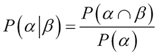

*P*(*a* n *ß*)捕捉了同时发生 a 和ß的事件。

### 链式法则和贝叶斯定理

条件概率的定义导致了条件概率的链式法则，该法则指出，当存在多个事件α[1]，α[2]….α[n]时：

*P*(*α*[1] ∩ *α*[2] ∩….∩ *α*[n] ) = *P*(*α*[1] )*P*(*α*[2] ¦ *α*[1])*P*(*α*[3] | *α*[1] ∩ *α*[2])..*P*(*α*[∩] |*α*[1] ∩ *α*[2] ∩….∩ *α*[n-1])

几个事件的概率可以表示为第一个事件的概率乘以在第一个事件给定的第二个事件的概率，依此类推。因此，*α*[n]的概率取决于α[1]到α[n]的所有事件，并且与事件的顺序无关。

贝叶斯法则也遵循条件概率规则，可以正式表示为：

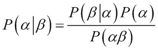

### 随机变量、联合分布和边缘分布

通过将事件空间和结果视为属性和值，自然地映射事件空间和结果。随机变量被定义为具有不同已知特定值的属性。例如，如果*成绩*是与*学生*相关联的属性，并且具有值*{A, B, C}*，那么*P(Grade = A)*表示一个具有结果的随机变量。

随机变量通常用大写字母表示，如*X*，*Y*，和*Z*，它们所取的值用*Val(X) = x*表示。在本章中，我们将主要讨论本质上为分类的值，即取固定数量的离散值。在现实世界中，变量也可以有连续的表示。具有类别{x¹, x² …x^n}的变量的分布可以表示为：

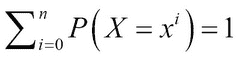

这样一个跨越许多类别的分布称为**多项分布**。在只有两个类别的特殊情况下，该分布被称为**伯努利分布**。

给定一个随机变量，该变量描述的所有事件的概率分布称为边缘分布。例如，如果成绩是随机变量，边缘分布可以定义为*(Grade = A) = 0.25, P(Grade = b) = 0.37 和 P(Grade = C) = 0.38*。

在许多现实世界的模型中，存在多个随机变量，考虑所有这些随机变量的分布称为**联合分布**。例如，如果将学生的*智力*视为另一个变量，并用*P(Intelligence)*或*P(I)*表示，并且具有二进制结果*{低，高}*，那么考虑*智力*和*成绩*的分布，表示为*P(Intelligence, Grade)*或*P(I, G)*，就是联合分布。

一个随机变量的边缘分布可以通过对所有其他变量的值求和从联合分布中计算得出。通过将所有行求和，如 *表 1* 所示，可以得到成绩的边缘分布，通过将列求和可以得到智力的边缘分布。

表 1. I 和 G 的边缘分布

### 边缘独立性和条件独立性

边缘独立性定义为以下内容。考虑两个随机变量 *X* 和 *Y*；那么 *P(X|Y) = P(X)* 意味着随机变量 *X* 与 *Y* 独立。它形式上表示为 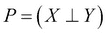 (*P* 满足 *X* 与 *Y* 独立)。

这意味着联合分布可以表示为：

*P(X, Y) = P(X)P(Y)*

如果考试的难度水平 (*D*) 和学生的智力 (*I*) 决定了成绩 (*G*)，我们知道考试的难度水平与学生的智力独立，并且 (*D* ⊥ *I*) 也意味着 *P(D, I) = P(D)P(I)*。

当两个随机变量在第三个变量给定的情况下是独立的，这种独立性称为条件独立性。给定三个随机变量 *X*，*Y* 和 *Z* 的集合，我们可以说 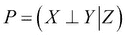；也就是说，变量 *X* 在给定 *Z* 的情况下与 *Y* 独立。条件独立的必要条件是

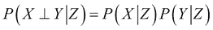

### 因素

因素是定义高维（大量变量）空间中概率分布的基本构建块。它们提供了基本操作，有助于操作概率分布。

“因素”被定义为一种函数，它接受称为“作用域”的随机变量作为输入，并给出一个实值输出。

形式上，一个因素表示为  其中作用域是 (X[1], *X*[2], ….*X*[k] )。

#### 因素类型

不同的因素类型如下：

+   **联合分布**: 对于变量的每一个组合，你都会得到一个实值输出。

+   **未归一化度量**: 当在一个联合分布中，其中一个变量是常数时，输出也是实值，但由于它不总和为 1，因此它是未归一化的。然而，它仍然是一个因素。

+   **条件概率分布**: 形式为 *P(G|I)* 的概率分布也是一个因素。

在因素上执行各种操作，例如：

+   **因素乘积**: 如果两个因素 *ϕ*[1] (*X*[1], *X*[2]) 和 *ϕ*[2] (*X*[2], *X*[3]) 相乘，它会产生 *ϕ*[3] (*X*[1], *X*[2], *X*[3])。实际上，这是将对应于 *ϕ*[1] 的表与 *ϕ*[2] 相乘。

+   **因素边缘化**: 这与边缘化相同，其中 *ϕ*[1] (*X*[1], *X*[2], *X*[3]) 可以对变量进行边缘化，例如 *X*[2]，以给出 *ϕ*[2] (*X*[1], *X*[3])。

+   **因子减少**：这只在其他变量中的一个变量为常数时取其他变量的值。

### 分布查询

给定随机变量的概率，可以执行许多查询来回答某些问题。一些常见的查询类型将在后续章节中解释。

#### 概率查询

这是最常见的查询类型之一，它有两个部分：

+   **证据**：具有已知结果或类别的变量子集。例如，随机变量 **E = e**。

+   **查询**：来自其他变量的随机变量。例如，一个随机变量 **X**。

    *P*(**X**|**E** = **e**)

概率查询的例子包括后验边缘估计，如 *P(I = high|L = bad, S = low) = ?* 和证据概率，如 *P(L = bad, S = low) = ?*。

#### MAP 查询和边缘 MAP 查询

MAP 查询用于找到最可能变量的子集的概率赋值，因此也被称为**最可能解释**（**MPE**）。这些与概率查询的区别在于，我们不是得到概率，而是得到所有变量的最可能值。

从形式上讲，如果我们有变量 *W= X – E*，其中 *E = e* 作为证据，并且我们感兴趣于找到 *W* 中变量的最可能赋值，

*MAP*(**W**|**e**) = *argmax*[w]*P*(**w**,**e**)

边缘查询的一种更普遍的形式是当我们有一个变量的子集，比如说由 *Y* 给出，形成我们的查询，并且有证据 *E = e*，我们感兴趣于找到 *Y* 中变量的最可能赋值。使用 MAP 定义，我们得到：

*MAP*(**Y**|**e**) = *argmax*[y]*P*(**y**|**e**)

假设，*Z= X – Y – E*，那么边缘 MAP 查询是：

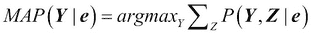

# 图概念

接下来，我们将简要回顾图论中的概念以及我们将在本章中使用的某些定义。

## 图结构和属性

图被定义为包含节点和连接这些节点的边的数据结构。在本章的上下文中，随机变量被表示为节点，边显示了随机变量之间的连接。

形式上，如果 *X = {X*[1]*, X*[2]*,….X*[k]*}* 其中 *X*[1]*, X*[2]*,….X*[k] 是代表节点的随机变量，那么集合 e 中可以存在一个有向边，例如，在由 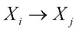 给出的节点之间，或者存在一个 **无向边** ，并且图被定义为一种数据结构 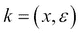。当集合 e 中节点从集合 **X** 之间的每一条边都是有向的时，称图为一个 **有向图**；同样，如果节点之间的每一条边都是无向的，则称该图为 **无向图**，如图 1 所示。此外，如果一个图既有有向边又有无向边， 的表示法代表一个可能是有向或无向的边。

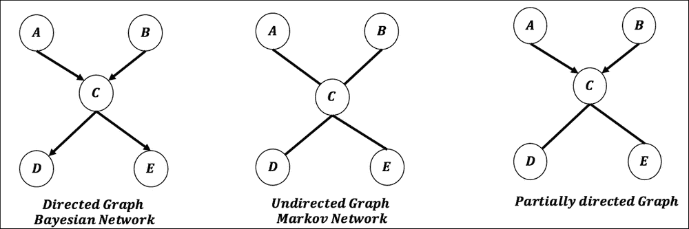

图 1\. 有向、无向和部分有向图

如果图中存在一个有向边 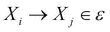，则节点 *X*[i] 被称为 *父节点*，而节点 *X*[j] 被称为 *子节点*。

在无向图的情况下，如果存在边 *X*[i] *– X*[j]，则节点 *X*[i] 和 *X*[j] 被称为相邻节点。

在有向图中，节点 *X* 的父节点集合被称为节点 *X* 的边界，同样地，在无向图中，相邻节点形成彼此的边界。节点 *X* 的度是它参与的边的数量。节点 *X* 的入度是在有向图中与节点 *X* 有关系的边的数量，这些边位于节点 *Y* 和节点 *X* 之间，且 *X* → *Y*。图的度是该图中节点的最大度。

## 子图和团

子图是表示整个集合中的一些节点的图的一部分。**团**是无向图中顶点的子集，其中每两个不同的顶点都是相邻的。

## 路径、迹和环

如果图中 *K = (X, E)* 存在变量 *X*[1]，*X*[2]，…，*X*[k]，那么当对于每一个 *i* = 1, 2 ... *k* – 1，我们都有 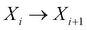 或 *X*[i] *–X*[j]；也就是说，变量之间存在有向边或无向边——记住这可以表示为 *X*[i] ? *X*[j]。一个有向路径至少有一个有向边：。

如果图中 *K = (X, E)* 存在变量 *X*[1]，*X*[2]，…，*X*[k]，那么当对于每一个 *i* = 1, 2 ... *k* – 1，我们都有 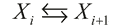。

如果对于图中的每一个 *X*[i]，…，*X*[j]，都存在一条从 *X*[i] 到 *X*[j] 的路径，则称该图为 **连通图**。

在图 *K = (X, e)* 中，如果节点 *X* 和 *Y* 之间存在有向路径，则 *X* 被称为 *Y* 的 *祖先*，而 *Y* 被称为 *X* 的 *后代*。

如果图*K*有一个有向路径 X[1]，X[2]，……，X[k]，其中 X[1] ? X[k]，则该路径称为**循环**。相反，没有循环的图称为**无环图**。

# 贝叶斯网络

通常，所有概率图模型都有三个基本元素，构成了重要的部分：

+   **表示**：这回答了模型意味着什么或代表什么的问题。想法是如何表示和存储*P(X[1]，X[2]，……，X[n]*)的概率分布。

+   **推理**：这回答了以下问题：给定模型，我们如何进行查询并获得答案。这使我们能够从已知证据中推断未知值的值，前提是模型的结构。推动主要讨论点的动机是涉及计算和正确性之间权衡的各种推理形式。

+   **学习**：这回答了给定数据的情况下哪个模型是正确的问题。学习分为两个主要部分：

    +   在给定结构和数据的情况下学习参数

    +   在给定数据的情况下学习结构

我们将使用众所周知的**学生网络**作为贝叶斯网络的例子，在我们的讨论中说明概念和理论。学生网络有五个随机变量，捕捉了以下定义的各种属性之间的关系：

+   **考试难度（D**）

+   **学生智力（I**）

+   学生获得的分数（G）

+   学生的 SAT 分数（S）

+   **基于成绩的学生推荐信（L**）

这些属性中的每一个都具有二进制分类值，例如，变量**难度（D**）有两个类别（d0，d1），分别对应低和高。**成绩（G**）有三个分类值，对应于成绩（A，B，C）。图中所示箭头表示从领域知识中编码的依赖关系——例如，如果我们知道考试的**难度**和学生**智力**，则可以确定**成绩**；如果我们只知道**成绩**，则**推荐信**完全确定（图 2）。可以进一步观察到，变量之间没有显式边表示它们相互独立——例如，考试的**难度**和学生的**智力**是独立变量。

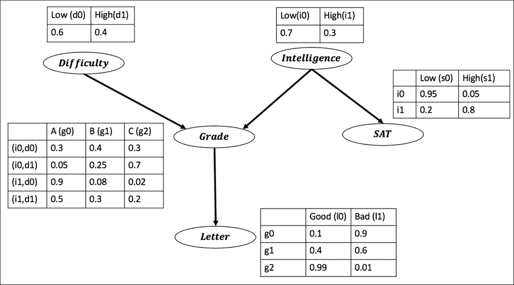

> *图 2. “学生”网络*

## **表示**

图形紧凑地表示随机变量之间的复杂关系，允许快速算法进行查询，而完整枚举将是不可行的。在本节定义的概念中，我们展示了如何通过有向无环图结构和条件独立性使涉及大量变量的问题变得可处理。

### 定义

贝叶斯网络定义为具有以下特征的系统模型：

+   一系列随机变量{X[1]，X[2]，……，X[k]}

+   一个**有向**的**无环图**（**DAG**），节点表示随机变量。

+   每个节点的一个局部**条件概率分布**（**CPD**），与父节点相关联 *P(X*[i] *| parent(X*[i]*))*。

+   使用分布的链式规则获得的联合概率分布是一个因素，表示为：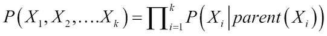

+   对于定义的学生网络，捕获所有节点的联合分布可以表示为：

    *P(D,I,G,S,L)=P(D)P(I)P(G¦D,I)P(S¦I)P(L¦G)*

### 推理模式

贝叶斯网络有助于回答在给定一些数据和事实的情况下提出的各种查询，这里讨论了这些推理模式。

#### 因果或预测推理

如果证据是例如“低智商”，那么在*图 3*右上象限中显示的获得“好信”的机会有多大？这是通过因果推理来解决的。如图一象限所示，因果推理是从上到下流动的。

#### 证据或诊断推理

如果给出诸如“坏信”之类的证据，学生获得“好成绩”的机会有多大？这个问题，如图 3 左上象限所示，是通过证据推理来解决的。如图二象限所示，证据推理是从下到上流动的。

#### 互因果推理

从寻找“相关原因”中获取有趣的模式是互因果推理的目标。如果给出“C 级”和“高智商”的证据，那么课程难度为“高”的机会有多大？这种推理也称为“解释”，因为一个原因解释了另一个原因，这在图 3 的第三象限左下角得到了说明。

#### 组合推理

如果一个学生选修了一门“容易”的课程并且有“坏信”，他获得“C 级”成绩的机会有多大？这是通过具有组合推理模式的查询来解释的。请注意，它包含混合信息，并且不像其他推理模式那样在一个固定的方向上流动，如图中右下角的象限 4 所示：

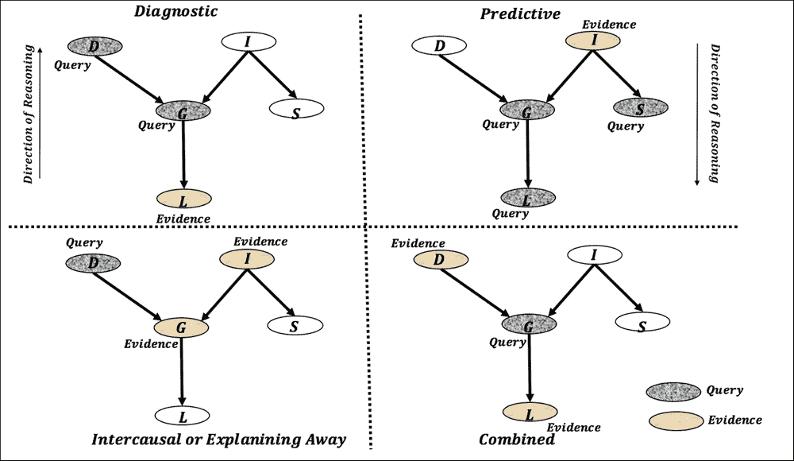

> *图 3. 推理模式*

### 独立性、影响流、D-分离、I-图

节点之间的条件独立性可以在执行查询时用于减少计算。在本节中，我们将讨论与独立性相关的一些重要概念。

#### 影响流

**影响**是指一个变量的条件或结果如何改变与另一个变量相关的值或信念的影响。我们从影响从直接关系（父/子）、因果/证据（父和子以及中间变量）以及组合结构中的变量流动的推理模式中看到了这一点。

唯一没有影响流动的情况是存在一个“v-结构”。也就是说，给定三个变量之间的边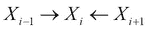，存在一个 v-结构，并且*X*[i - 1]和*X*[i + 1]之间没有影响流动。例如，课程难度和学生的智力之间没有影响流动。

#### D-Separation

随机变量*X*和*Y*在图**G**中被说成是 d-separated 的，前提是在**G**中给定**Z**的情况下，**X**和**Y**之间没有活跃路径。它正式表示为：

*dsep*[G] *(X,Y|Z)*

d-separation 的意义在于它完美地映射到点之间的条件独立性。这给出一个有趣的性质，即在贝叶斯网络中，任何变量在给定节点的父节点的情况下与其非后裔变量是独立的。

在学生网络示例中，节点/变量 Letter 在给定成绩的情况下与 Difficulty、Intelligence 和 SAT 是 d-separated 的。

#### I-Map

从 d-separation 来看，在图**G**中，我们可以收集所有 d-separation 产生的独立性，这些独立性正式表示为：

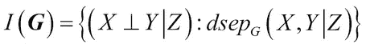

如果*P*满足*I*(**G**)，那么我们说**G**是*P*的一个独立性映射或 I-Map。

I-Map 的主要观点是，可以形式化地证明因式分解关系与独立性之间的关系成立。反之也可以证明。

简而言之，一个人可以读取贝叶斯网络图 G，所有在分布 P 中成立的独立性，无论任何参数！

考虑学生网络——其整个分布可以表示为：

*P(D,I,G,S,L) = P(D)P(I|D)P(G¦D,I)P(S¦D,I,G)P(L¦D,I,G,S)*

现在，考虑 I-Map 的独立性：

+   变量*I*和*D*是非后裔变量，并且不依赖于父节点，所以*P(I|D) = P(I)*

+   变量*S*在给定其父节点*I*的情况下与其非后裔变量*D*和*G*是独立的。*P(S¦D,I,G)=P(S|I)*

+   变量*L*在给定其父节点*G*的情况下与其非后裔变量*D*、*I*和*S*是独立的。*P(L¦D,I,G,S)=P(L|G)*

    *(D,I,G,S,L)=P(D)P(I)P(G¦D,I)P(S¦I)P(L¦G)*

因此，我们已经证明 I-Map 仅通过图网络就能帮助进行因式分解！

## 推理

概率图模型最大的优点是它们能够以条件或 MAP 或边际 MAP 的形式回答概率查询，给定一些证据。

正式地，证据**E = e**的概率由以下公式给出：

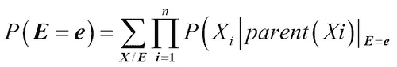

但这个问题已被证明是 NP-Hard（*参考* [3]）或更具体地说，#P-complete。这意味着当存在大量树或变量时，它是不可行的。即使对于树宽（最大团中的变量数）为 25，这个问题似乎也是不可行的——大多数现实世界的模型具有比这更大的树宽。

因此，如果之前讨论的精确推理是不可行的，是否可以使用一些近似来使问题在一定的误差范围内可行？已经证明，即使是一个计算推理的近似算法，其误差 *?* < 0.5，这样我们找到一个数 *p*，使得 |*P*(**E** = **e**) – *p*|< *?*，也是 NP-Hard。

但好消息是，这是“最坏情况”结果之一，表明指数时间复杂度。在“一般情况”中，可以应用启发式方法来减少精确和近似算法的计算时间。

一些执行精确和近似推理的知名技术如图 *4* 所示，它涵盖了除了贝叶斯网络之外的大多数概率图模型。

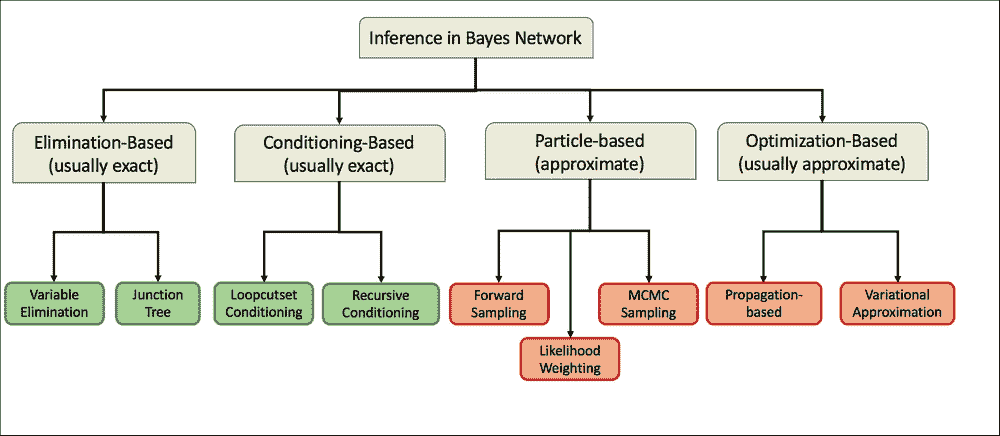

图 4\. 精确和近似推理技术

讨论这些算法的细节超出了本章的范围。我们将详细解释一些算法，并附上参考文献，以便读者更好地理解。

### 基于消除的推理

在这里，我们将描述两种技术，即变量消除算法和团树或连接树算法。

#### 变量消除算法

**变量消除**（**VE**）算法的基本原理在于分配性质，如下所示：

*(ab+ac+ad)= a (b+c+d)*

换句话说，通过提取一个公共因子 *a*，五个算术运算（三个乘法和两个加法）可以减少到四个算术运算（一个乘法和三个加法）。

让我们通过在学生网络中举一个简单的例子来理解计算的简化。如果我们必须计算一个概率查询，例如，考试难度给定信件是好的，即 *P(D¦L=good)=?*。

使用贝叶斯定理：

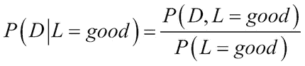

要计算 *P(D¦L=good)=?*，我们可以使用链式法则和联合概率：

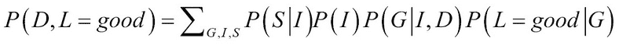

如果我们重新排列右侧的项：

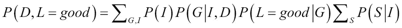

如果我们现在用 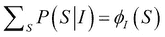 替换，因为该因子与 *S* 条件下的变量 *I* 独立，我们得到：

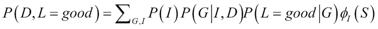

因此，如果我们小心地一次消除一个变量，我们实际上已经将 *O(2^n)* 个因子转换为 *O(nk²)* 个因子，其中 *n* 是变量的数量，*k* 是每个观察值的数量。

因此，VE 算法的主要思想是对变量施加一个顺序，使得查询变量最后。在有序变量列表上维护一个因子列表，并执行求和。通常，我们在 VE 算法的实现中使用动态规划（*参考文献* [4]）。

##### 输入和输出

输入：

+   条件概率分布/表 **F** 列表

+   查询变量 **Q** 的列表

+   观察变量 **E** 和观察值 **e** 的列表

输出：

+   *P*(**Q**|**E** = *e*)

##### 如何工作？

算法在循环中调用 `eliminate` 函数，如下所示：

*VariableElimination*：

1.  当 *?*，贝叶斯网络中所有随机变量的集合不为空时

    1.  从 *?* 中移除第一个变量 **Z**

    1.  *消除*(*F*, **Z**)

1.  结束循环。

1.  将 *?* 设置为 *F* 中所有因子的乘积

1.  在 *?* 中实例化观察变量到它们的观察值。

1.  返回 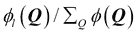（归一化）

*消除* (*F*, **Z**)

1.  从 *F* 中移除所有涉及 **Z** 的函数，例如，*X*[1]，*X*[2]，…，*X*[k]。

1.  计算新函数 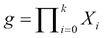

1.  计算新函数 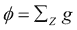

1.  添加新函数 *?* 到 *F*

1.  返回 *F*

考虑具有 *P(D, L = good)* 作为目标的相同学生网络示例。

1.  选择一个变量排序列表：*S*，*I*，*L*，*G*，和 *D*

1.  初始化活动因子列表并引入证据：

    列表：*P(S¦I)P(I)P(D)P(G¦I,D)P(L¦G)d(L = good)*

1.  从列表中消除变量 SAT 或 **S** 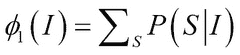

    列表：*P(I)P(D)P(G¦I,D)P(L¦G)d(L = good)* *?*1 *(I)*

1.  消除变量 Intelligence 或 *I* 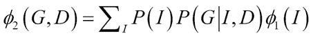

    列表：*P(D)P(L¦G)d(L = good)* *?*2 *(G,D)*

1.  消除变量 Letter 或 *L* 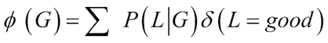

    列表：*P(D)* *?*[3] *(G)* *?*[2] *(G,D)*

1.  消除变量 Grade 或 *G* 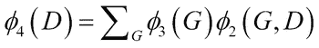

    列表：*P(D)* *?*[4] *(D)*

因此，通过两个值，*P(D=high)* *?*[4] *(D=high)* 和 *P(D=low)* *?*[4] *(D=low)*，我们得到答案。

##### 优势和局限性

优势和局限性如下：

+   VE 算法的主要优势是其简单性和通用性，可以应用于许多网络。

+   当网络中有许多连接时，VE 的计算减少优势似乎消失了。

+   变量最优排序的选择对计算效益非常重要。

#### 团树或桥接树算法

桥接树或团树是变量消除技术的更有效形式。

##### 输入和输出

输入：

+   条件概率分布/表 **F** 的列表

+   查询变量 **Q** 的列表

+   观察变量 **E** 和观察值 **e** 的列表

输出：

+   *P*(**Q|**E = *e*)

##### 如何工作？

涉及的步骤如下：

1.  **道德化**：这是一个将有向图转换为无向图的过程，以下有两个步骤：

    1.  用无向边替换节点之间的有向边。

    1.  如果有两个节点或顶点没有连接但有共同子节点，则添加一个连接它们的边。（注意图 5 中 *V*[4] 和 *V*[5] 以及 *V*[2] 和 *V*[3] 之间的边）：

    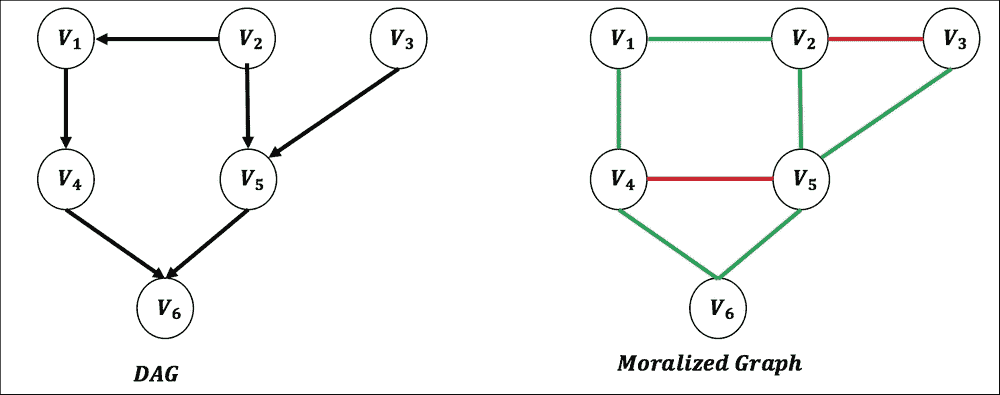

    图 5. DAG 的图道德化，用绿色显示方向边的改变，用红色显示新添加的边。

1.  **三角化**：为了理解三角化，必须形成弦。循环的弦是非连续顶点 *V*[i] 和 *V*[j] 的一对，它们之间有边。如果一个图称为**弦图或三角化图**，如果长度 ≥ 4 的每个循环都有弦。注意图 6 中 *V*[1] 和 *V*[5] 之间的边形成弦，使道德化图成为弦图/三角化图：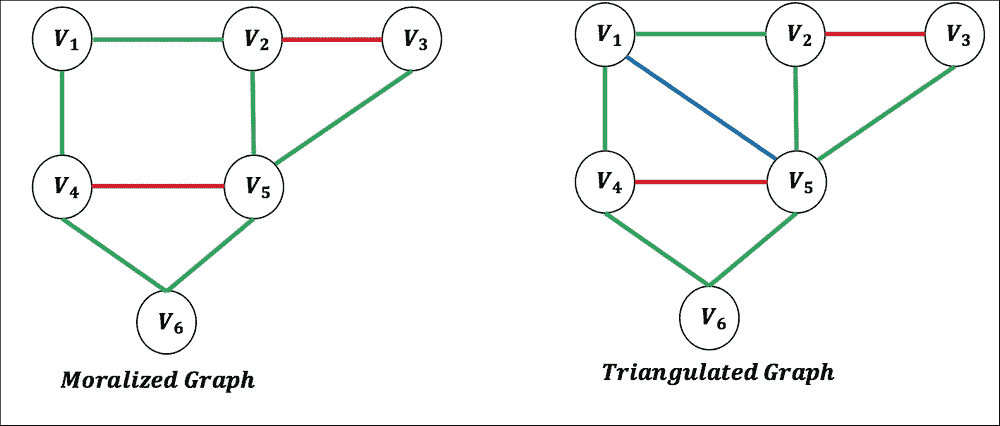

    图 6. 图三角化，通过添加蓝色边将道德化图转换为弦图。

1.  **连接树**：通过以下步骤从弦图形成连接树：

    1.  在图中找到所有完全子图，并将它们作为所有顶点的簇作为节点。完全子图是一个子图，其中每对节点之间都存在边。如果两个节点有一个或多个共同顶点，则创建一个由相交顶点组成的边作为分隔符或 sepset。例如，具有边 *V*[1]、*V*[4]、*V*[5] 和 *V*[6]、*V*[4]、*V*[5] 的循环，其中 *V*[4]、*V*[5] 之间存在公共边，可以简化为一个完全子图，如图中所示，公共边作为分隔符。

    如果前面的图包含一个循环，循环中的所有分隔符都包含相同的变量。通过创建最小生成树来移除图中的循环，同时包括最大分隔符。整个转换过程如图 7 所示：

    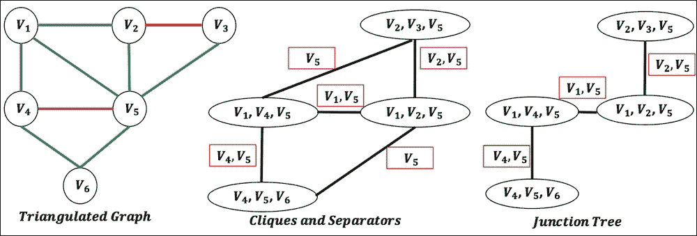

    图 7. 连接树的形成

1.  **在连接树上运行消息传递算法**：连接树可以用来通过完全子图和分隔符的分解来计算联合分布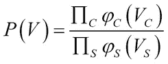

1.  **计算连接树的参数**：连接树的参数可以通过使用原始贝叶斯网络中的父节点按节点获得，称为完全子图势，如图所示：

    1.  (*?*[1] (*V*[2],*V*[3],*V*[5]) = *P*(*V*[5] |*V*[2],*V*[3])*P*(*V*[3])（注意在原始贝叶斯网络中，边 *V*[5] 依赖于 *V*[2]、*V*[3]，而 *V*[3] 是独立的）

    1.  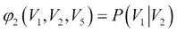

    1.  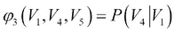

    1.  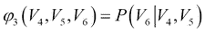

1.  **节点/完全子图在连接树之间的消息传递**：连接树中的一个节点，用完全子图 *C*[i] 表示，将其邻居发送的所有消息与其自己的完全子图势相乘，得到一个因子 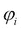，其作用域是连接子图。然后，它对所有变量求和，除了在 *C*[i] 和 *C*[j] 之间的分隔符或分隔符 *S*[i,j] 上的变量，然后将得到的因子作为消息发送到 *C*[j]。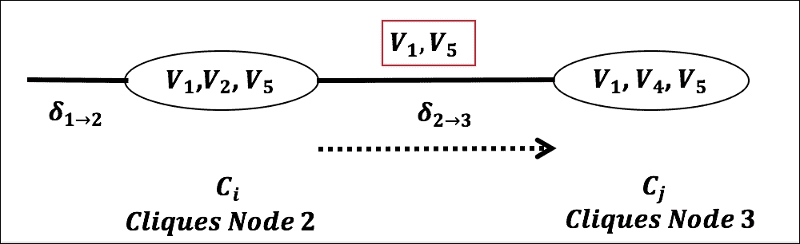

    图 8. 节点/完全子图在连接树之间的消息传递

    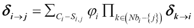

因此，当消息传递到达树根时，联合概率分布就完成了。

##### 优点和局限性

优点和局限性如下：

+   该算法在树宽相关的计算上有理论上的上限。

+   每个团中每个势的乘积可能导致数值溢出和下溢。

### 基于传播的技术

在这里，我们讨论信念传播，这是一种常用的消息传递算法，通过引入因子图和在这些图中可以流动的消息来进行推理。

#### 信念传播

信念传播是最实用的推理技术之一，它适用于大多数概率图模型，包括有向、无向、基于链和时序图。为了理解信念传播算法，我们首先需要定义因子图。

##### 因子图

我们从基本的概率论中知道，整个联合分布可以表示为变量子集上的一个因子，如下所示

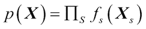

在 DAG 或贝叶斯网络中，*f*s 是一个条件分布。因此，在变量子集上表达联合分布相对于因子有很大的优势。

因子图是网络的表示，其中涉及变量的变量和因子都被制成显式节点（*参考文献* [11]）。在前一节的简化学生网络中，因子图显示在*图 9*中。

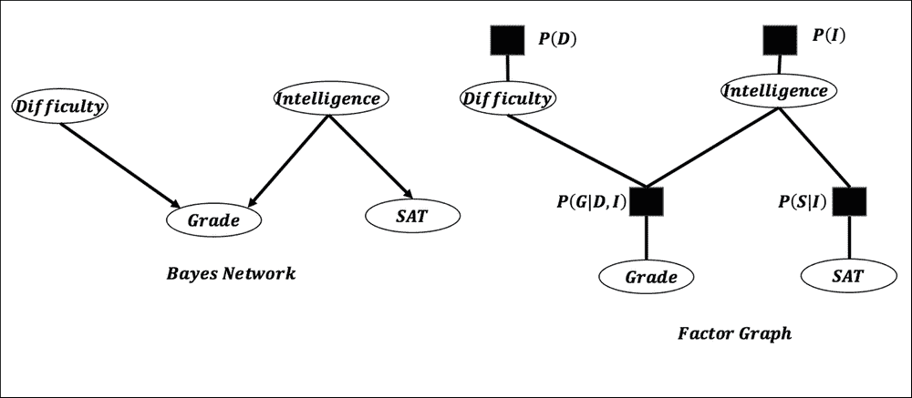

图 9. 简化“学生”网络的因子图

因子图是一个二分图，即它有两种类型的节点，变量和因子。

边在两种相反类型之间流动，即从变量到因子，反之亦然。

将贝叶斯网络转换为因子图是一个简单的步骤，如前所述，其中你开始添加变量节点和条件概率分布作为因子节点。贝叶斯网络和因子图之间的关系是一对多，也就是说，同一个贝叶斯网络可以用多个因子图表示，并且不是唯一的。

##### 因子图中的消息传递

在这些因子图中流动着两种不同的消息，这些消息构成了所有计算的大部分，通过通信实现。

+   **从因子节点到变量节点的消息**：从因子节点发送到变量节点的消息可以用以下方式数学表示：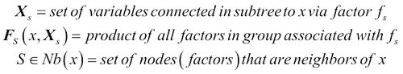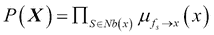 其中 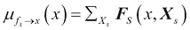 因此，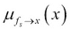 是从因子节点 *f*[s] 到 *x* 的消息，以及从 *x* 的邻居到 *x* 的所有此类消息的乘积给出了 *x* 的联合概率：

    图 10\. 从因子节点到变量节点的消息传递

+   **从变量节点到因子节点的消息**：与前面的例子类似，变量到因子的消息可以展示为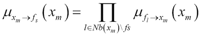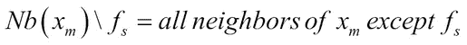

因此，除了发送给它的因子外，所有到达节点 *x*[m] 的因子都被相乘。

图 11\. 从变量节点到因子节点的消息传递

##### 输入和输出

输入：

+   条件概率分布/表 (CPD/CPT) *F* 列表

+   查询变量 **Q** 列表

+   观察变量 **E** 和观察值 **e**

输出：

+   *P*(**Q|**E = *e*)

##### 它是如何工作的？

1.  根据前面讨论的贝叶斯网络创建因子图。

1.  将节点 **Q** 视为图的根。

1.  初始化所有叶节点，即：和

1.  以递归方式应用从叶节点到下一个节点的消息传递。

1.  移动到下一个节点，直到到达根节点。

1.  根节点的边际给出结果。

##### 优点和局限性

优点和局限性如下：

+   如前所述，此算法非常通用，可用于大多数图模型。当没有循环时，此算法在有向树中进行精确推理。

+   这可以很容易地并行实现，有助于可扩展性。根据连通性，内存需求可能非常高。

### 基于采样的技术

我们将讨论一个使用粒子采样来展示从随机变量生成分布 *P(X)* 的简单方法。想法是重复从贝叶斯网络中采样，并使用计数样本来近似推理。

#### 带拒绝的前向采样

关键思想是使用拓扑顺序迭代变量生成独立同分布 (i.i.d.) 样本。在存在某些证据的情况下，例如，*P(X|E = e)* 与生成的样本相矛盾，最简单的方法是拒绝样本并继续。

##### 输入和输出

输入：

+   条件概率分布/表 *F* 列表

+   查询变量 **Q** 列表

+   观察变量 **E** 和观察值 **e**

输出：

+   *P*(**Q|**E = *e*)

##### 它是如何工作的？

1.  对于 *j* = 1 到 *m* //样本数量

    1.  创建变量的拓扑顺序，例如 **X**[1]，**X**[2]，**… X**[n]。

    1.  对于 *i* = 1 到 *n*

        1.  **u**[i] ? **X***(parent*(**X**[i])) //assign *parent*(**X**[i]) to variables

        1.  *sample*(**x**[i], *P*(**X**[i] | **u**[i]) //sample **X**[i] given parent assignments

        1.  if(**x**[i] ?, *P*(**X**[i] | **E** = **e**) reject and go to 1.1.2\. //reject sample if it doesn't agree with the evidence.

    1.  将 (**X**[1]，**X**[2]，…**X**[n]) 作为样本返回。

1.  使用样本的计数计算 *P*(**Q** | **E** = e)。

为学生网络生成一个样本的例子可以是先采样难度得到低，然后采样智力得到高，接着使用 CPD 表对难度=低和智力=高进行采样得到成绩=A，使用 CPD 对智力=高进行 SAT 采样得到 SAT=好，最后使用成绩=A 从字母中进行采样得到 Letter=好。因此，我们得到第一个样本（难度=低，智力=高，成绩=A，SAT=好，Letter=好）

##### 优点和局限性

优点和局限性如下：

+   这种技术实现和执行起来相当简单。它需要大量的样本来在界限内近似。

+   当证据集很大时，拒绝过程变得成本高昂。

## 学习

学习背后的思想是在数据和领域专家的指导下生成结构或找到参数或两者兼而有之。

学习的目标如下：

+   为了便于在贝叶斯网络中进行推理。推理的前提是结构和参数已知，这是学习的结果。

+   为了便于使用贝叶斯网络进行预测。给定观察变量**X**，预测目标变量**Y**。

+   为了便于使用贝叶斯网络进行知识发现。这意味着从数据中理解因果关系、关系和其他特征。

通常，学习可以通过*图 12*来表征。假设存在一个已知的概率分布*P^*，它可能或可能不是由贝叶斯网络*G^*生成的。观察到的数据样本被假定为从这个已知的概率分布*P^*中生成或采样。领域专家可能或可能不存在，以包括关于结构的知识或先验信念。贝叶斯网络是少数几种可以直接使用领域专家关于变量关系或先验概率的输入的技术之一，与其他机器学习算法形成对比。在知识获取和学习数据的过程结束时，我们得到一个具有定义结构和参数（CPTs）的贝叶斯网络作为输出。

图 12. 贝叶斯网络学习要素

基于数据质量（缺失数据或完整数据）以及专家对结构的了解（未知和已知），贝叶斯网络中的学习可以分为以下四类，如*表 2*所示：

| 数据 | 结构 |
| --- | --- |
| 已知结构（学习参数） | 未知结构（学习结构和参数） |
| 完整数据 | 参数估计（最大似然，贝叶斯估计） | 优化（搜索和评分技术） |
| 不完整数据 | 非线性参数优化（期望最大化，梯度下降） | 结构和参数优化（结构 EM，混合模型） |

> *表 2. 贝叶斯网络学习类别*

### 学习参数

在本节中，我们将讨论两种广泛使用的方法来估计给定结构下的参数。我们只讨论完整数据，读者可以参考（*参考文献* [8]）中关于不完整数据参数估计的讨论。

#### 贝叶斯网络的极大似然估计

**最大** **似然估计** (**MLE**) 是一个非常通用的方法，它可以定义为：给定一个数据集 *D*，选择满足以下条件的参数 ：

+   

+   

+   

极大似然是给定训练数据选择贝叶斯网络参数的技术。对于详细讨论，请参阅（*参考文献* [6]）。

给定图 *G* 的已知贝叶斯网络结构和训练数据，我们想要学习参数或 CPDs——更准确地说，CPTs。这可以表示为：

现在每个示例或实例可以用变量来表示。如果有 *i* 个变量由 *x*[i] 表示，并且每个变量的父节点由 *parent*[Xi] 给出，那么：

交换变量和实例：

该术语是：

这是给定其父节点 *parent*[Xi] 的特定变量 *x* *[i]* 的条件似然。因此，这些条件似然的参数是给出的参数的子集。因此：

这里，被称为局部似然函数。当总似然分解为局部似然的独立项时，这成为似然函数的全局分解属性。其思想是，这些局部似然函数可以通过简单地使用训练数据中不同结果的数量来进一步分解为表格 CPD。

设 *N*[ijk] 为在父节点配置 *j* 下观察到的变量或节点 *i* 在状态 *k*[,] 中的次数：

例如，我们可以通过从训练数据中估计似然函数来得到一个简单的条目，对应于 *X*[i] *= a* 和 *父节点*[Xi] *= b*：

考虑两种情况，例如。在第一种情况下， 由 10 个实例满足，其中 *父节点*[Xi] *= b* =100。在第二种情况下，当 *父节点*[Xi] *= b* =1000 时， 满足 100。注意，这两个概率值相同，而第二个有 10 倍更多的数据，是“更可能的”估计！同样，对领域或先验知识的熟悉程度，或者由于不确定性而缺乏这种知识，都没有被 MLE 所捕捉。因此，当样本数量有限或领域专家了解先验概率时，这种方法会存在严重问题。

#### 贝叶斯网络参数估计

这种技术通过使用参数 *?* 的先验知识编码来克服 MLE 的问题。因此，我们可以将我们对参数空间的信念或先验知识编码为概率分布，然后使用变量和参数的联合分布进行估计。

让我们考虑单变量参数学习的情况，其中我们有一些实例 *x*[1]，*x*[2] … *x*[M]，它们都具有参数 **?**[X]。

图 13. 单变量参数学习

因此，该网络是参数和数据上的联合概率模型。其优点是我们可以用它来表示后验分布：

，*P(?) = 先验*，

 因此，最大似然估计与贝叶斯估计之间的区别在于使用了先验概率。

将其推广到给定数据集 *D* 的贝叶斯网络 *G*：

如果我们假设参数的全局独立性

因此，我们得到

再次，就像之前一样，**?**[Xi] | *父节点*[Xi] 的子集是局部的，因此整个后验概率可以用局部术语计算！

##### 使用狄利克雷分布的先验和后验

在实践中，通常使用一种称为狄利克雷分布的连续概率分布来表示参数的先验分布——狄利克雷分布是一种贝塔分布。

概率密度函数：

这里，， 中的 alpha 项被称为超参数，*a*[ijri] > 0。 是伪计数，也称为等效样本量，它为我们提供了一个先验的度量。

贝塔函数，*B(a*[ij]*)* 通常用伽马函数表示如下

使用狄利克雷分布的优点在于它本质上是对偶的，也就是说，无论似然函数如何，如果先验是狄利克雷分布，后验也是狄利克雷分布！

可以证明参数 *?*[ijk] 的后验分布是一个具有更新超参数的狄利克雷分布，并且有一个封闭形式的解！

*a*[ijk] = *a*[ijk] + *N*[ijk]

如果我们使用最大后验估计和后验均值，它们可以证明如下：

### 学习结构

在没有任何领域知识或对结构理解的情况下学习贝叶斯网络包括学习结构和参数。我们首先将讨论用于评估网络结构的某些度量，然后讨论一些用于构建最优结构的著名算法。

#### 评估结构的度量

给定数据集，用于评估贝叶斯网络结构的度量可以大致分为以下几类，许多细节可以在这里找到（*参考文献* [14]）。

+   **偏差阈值度量**：在网络上测量两个变量之间偏差的两种常用技术是皮尔逊卡方统计量和库尔巴克-莱布勒距离。

    给定包含 *M* 个样本的数据集 *D*，考虑两个变量 *X*[i] 和 *X*[j]，皮尔逊卡方统计量测量发散度是

    

    *d*[?2]*(D)* 为 0；当变量相互独立时，较大的值表示变量之间存在依赖性。

    库尔巴克-莱布勒散度是：

    

    *d*[I]*(D)* 再次为 0，它表示独立性，较大的值表示依赖性。使用各种统计假设检验，可以使用阈值来确定显著性。

+   **结构得分度量**：在贝叶斯网络中为结构评分有多种度量方法。在这里，我们将讨论最常用的度量方法。参数学习中讨论的对数似然得分可以用作结构的评分：

+   **贝叶斯信息得分**（**BIC**）也是一种相当流行的评分技术，因为它通过考虑复杂结构的惩罚来避免过拟合，如下面的方程所示：

惩罚函数在 *M* 中是对数形式的，因此，随着其增加，对于复杂结构的惩罚会减轻。

阿卡伊克信息得分（AIC），类似于 BIC，具有类似的惩罚基础评分，并且是：

在参数学习中讨论的贝叶斯得分也被用作评分措施。

#### 学习结构的方法

在本节中，我们将讨论一些用于学习结构的算法；详细信息可以在此处找到（*参考文献* [15]）。

##### 基于约束的技术

基于约束的算法使用各种变量的独立性检验，试图通过遵循此处讨论的逐步过程找到我们在前几节中讨论的不同结构依赖性，例如 d-separation、v-structure 等。

###### 输入和输出

输入是包含所有变量 *{X,Y..}* 的数据集 *D*，对于每个实例 {1,2, ... *m*} 都已知，并且没有缺失值。输出是一个贝叶斯网络图 *G*，其中所有边、方向在 **E** 中已知，以及 CPT 表。

###### 如何工作？

1.  创建一个空的无向边集合 **E**。

1.  测试两个变量之间的条件独立性，这些变量独立于方向以具有边。

    1.  如果对于所有子集 **S** = *U* – {*X, Y*}，如果 *X* 与 *Y* 独立，则将其添加到无向边集合 **E***' 中。

1.  一旦确定了所有潜在的未定向边，边的方向性将从集合 **E***' 中推断出来。

    1.  考虑三元组 *{X, Y, Z}*，如果存在边 *X – Z* 和 *Y – Z*，但使用集合中的所有变量没有 *X – Y* 的边，并且进一步，如果 *X* 在所有边 **S** = *U* – {*X, Y, Z*} 给定的情况下与 *Y* 不独立，这表明  和  的方向。

    1.  将边  和  添加到 **E** 中设置。

    1.  使用局部计算更新 CPT 表。

1.  返回贝叶斯网络 *G*、边 **E** 和 CPT 表。

###### 优点和局限性

+   缺乏鲁棒性是这种方法最大的缺点之一。由于独立性假设会渗透到个体独立性测试中，数据中的小错误可能会对结构造成重大影响。

+   可扩展性和计算时间是主要关注点，因为每个变量的子集都会被测试，大约是 2^n。当变量的数量增加到 100 多时，由于计算时间，这种方法会失败。

##### 搜索和基于分数的技术

搜索和分数方法可以看作是一种启发式优化方法，其中通过迭代，通过小的扰动改变结构，并使用如 BIC 或 MLE 等度量来对结构进行评分，以找到最优的分数和结构。爬山法、深度优先搜索、遗传算法等都被用来进行搜索和评分。

###### 输入和输出

输入是数据集 *D*，其中每个实例 {1,2, ... *m*} 的所有变量 *{X,Y..}* 都是已知的，并且没有缺失值。输出是一个贝叶斯网络图 *G*，其中 **E** 中所有边和方向都是已知的。

###### 它是如何工作的？

图 14\. 搜索和评分

1.  初始化图 *G*，基于领域知识或空或满。根据图初始化边集 **E**，并根据图 *G*、**E** 和数据 *D* 初始化 CPT 表 *T*。通常还会提到一些终止条件，如 *maxIterations*：

1.  *maxScore= -8, score=computeScore(G,***E***, T)*

1.  执行

    1.  *maxScore=score*

    1.  对于每个变量对 *(X, Y)*

        1.  对于每个 

        1.  新图 G' 基于父节点和变量，并改变边。

        1.  计算新的 CPT 表 *T' ? computeCPT(G',E',D)*。

        1.  *currentScore = computeScore(G',***E***',T')*

        1.  如果 *currentScore > score*：

            1.  *score = currentScore*

            1.  *G' = G*, **E***'* = **E**

1.  当  时重复 3 次

###### 优点和局限性

+   卡在局部最优解，这是大多数启发式搜索方法的缺点之一，是最大的缺点之一。

+   在启发式搜索中，没有收敛或理论保证，因此寻找终止条件很大程度上是靠猜测。

# 马尔可夫网络和条件随机场

到目前为止，我们已经涵盖了概率图模型领域的有向无环图，包括表示、推理和学习的各个方面。当图是无向的，它们被称为 **马尔可夫网络**（**MN**）或 **马尔可夫随机** **场**（**MRF**）。在本节中，我们将讨论马尔可夫网络的一些方面，包括表示、推理和学习，就像之前一样。马尔可夫网络或 MRF 在计算机视觉的各个领域都非常流行，如分割、去噪、立体、识别等。有关进一步阅读，请参阅（*参考文献* [10]）。

## 表示

尽管马尔可夫网络，像贝叶斯网络一样，有非有向边，但它仍然具有局部交互和分布。我们首先将讨论参数化的概念，这是一种捕捉这些交互的方法，然后讨论 MN 中的独立性。

### 参数化

在 MN 中，变量之间的亲和力通过以下章节中讨论的三个替代参数化技术来捕捉。

#### 吉布斯参数化

如果概率分布函数被称为吉布斯分布或由吉布斯分布参数化，那么：

*Z*被称为划分函数，定义为：

注意，变量之间的交互是通过来捕捉的，而不是边缘概率，但它们对联合概率有贡献。参数化马尔可夫网络的因子被称为团势。通过在图中的最大团上选择因子，参数的数量可以大幅减少。

#### 因素图

马尔可夫网络图的图结构在使用吉布斯参数化时，并不能揭示出因素是否涉及最大团或其子集等性质。在贝叶斯网络推理部分的章节中讨论的因素图有一个识别最大团的步骤，因此可以捕捉这些参数化。请参阅 BN 中的因素图部分。

#### 对数线性模型

另一种参数化形式是使用来自统计物理的能量模型表示。

势可以用一组特征来表示，而势表通常由具有与之相关联的权重的特征表示。

如果*D*是一组变量，是一个因子，那么：

因此，随着能量的增加，概率会降低，反之亦然。中捕捉的对数细胞频率在统计物理中被称为对数线性。联合概率可以表示为：

是在**D**[i]中的变量上定义的特征函数。

### 独立性

与贝叶斯网络一样，马尔可夫网络也编码了一组独立性假设，这些假设控制了无向图中的影响流动。

#### 全局

如果一组节点**Z**将节点集**X**和**Y**分开，那么在给定**Z**的情况下，**X**中的任何节点到**X**和**Y**之间的**Y**没有活跃路径。图*G*中的独立性是：

#### 成对马尔可夫

如果两个节点，*X*和*Y*，之间没有直接边，那么在给定所有其他节点的情况下，这两个节点是独立的。这种性质是局部独立性，也是最弱的：

##### 马尔可夫毯

在给定其马尔可夫毯的情况下，节点与图中所有其他节点都是独立的，这是马尔可夫网络中的一个重要概念：

这里 **U** *= X 的马尔可夫毯*。

*图 15*显示了变量*X*的马尔可夫毯，包括其父节点、子节点及其子节点的父节点：

图 15\. 节点 X 的马尔可夫毯 - 其父节点、子节点及其子节点的父节点。

## 推理

在 MN 中进行推理是一个类似的#P 完全问题，因此应用了类似的近似或启发式方法。大多数精确和近似推理技术，如变量消除法、交联树法、信念传播法等，这些在贝叶斯网络中讨论过，可以直接应用于马尔可夫网络。边缘和条件概率保持相似，并且是在团上的势函数上计算的

马尔可夫毯简化了一些计算。

## 学习

由于马尔可夫网络中分区函数中所有参数的纠缠，学习马尔可夫网络中的参数复杂且计算成本高。由于分区函数需要网络中所有变量的因子耦合，因此无法将计算分解为局部分布的优势步骤。

在 MN 中进行最大似然估计没有封闭形式的解，因此使用梯度下降等增量技术来在整个参数空间上进行优化。优化函数可以证明是一个凹函数，从而确保全局最优，但梯度下降的每一步迭代都需要在整个网络上进行推理，这使得它计算成本高，有时甚至难以处理。

贝叶斯参数估计需要对参数空间进行积分，这同样没有封闭形式的解，甚至更困难。因此，对于 MN，通常使用近似学习方法，如**马尔可夫链蒙特卡洛**（**MCMC**）。

在 MN 中进行结构学习与参数学习相似，甚至更难，并且已被证明是 NP 难问题。在基于约束的方法中，对于给定的数据集，测试变量之间的条件独立性。在 MN 中，使用成对变量之间的互信息来测试每对变量之间的条件独立性。然后，基于一个阈值，可以认为成对之间存在边或者不存在。这种方法的缺点之一是需要极大量的样本来反驳数据中存在的任何噪声。由于成对边的出现导致的网络复杂性是另一个限制。

在基于搜索和评分的学习中，目标与 BNs 相似，其中搜索结构，评分（基于各种技术）被计算以帮助和调整搜索。在 MNs 的情况下，我们使用对数线性模型中描述的特征，而不是势函数。在优化和评分过程中考虑了特征的加权。

## 条件随机字段

**条件** **随机字段** (**CRFs**) 是一种特殊的马尔可夫网络形式，其中隐藏的和可观察的变量主要用于建模标记序列预测问题 (*参考文献* [16])。序列预测问题在许多文本挖掘领域都有体现，如下一个词/字母预测、**词性**(**POS**) 标注等，以及在生物信息学领域用于 DNA 或蛋白质序列预测。

CRFs 背后的思想是将序列的条件分布建模为特征函数，并使用标记数据通过优化学习经验分布，如图所示。

条件分布如下所示，其中 *Z*(**x**) 是归一化常数。对于 *?* 的参数估计使用最大似然法，通常是通过梯度下降等迭代优化方法获得的对数线性凸函数。

图 16：条件随机字段映射到词性标注领域的序列预测区域。

# 专用网络

在本节中，我们将介绍一些在机器学习应用中非常有用的基本专用概率图模型。

## 树增强网络

在第二章《实际应用中的监督学习》中，我们讨论了朴素贝叶斯网络，它简化地假设所有变量相互独立，并且只依赖于目标或类别变量。这是从数据集中推导或假设的最简单的贝叶斯网络。正如我们在前面的章节中看到的，在贝叶斯网络中学习复杂结构和参数可能很困难，有时甚至是不可能的。**树增强网络**或**TAN** (*参考文献* [9]) 可以被视为一种折中方案，它引入了对树如何连接的约束。TAN 对特征或变量关系施加约束。一个特征除了目标变量外，只能有一个其他特征作为父节点，如图所示：

图 17：树增强网络与朴素贝叶斯和贝叶斯网络的比较，以及每个节点只有一个父节点的约束。

### 输入和输出

输入是包含所有特征的变量 *{X, Y..}* 的训练数据集 *D*。如果不需要在预处理步骤中将特征离散化，则特征具有离散结果。

输出是作为贝叶斯网络带有 CPTs 的 TAN。

### 它是如何工作的？

1.  计算训练数据集中每对变量之间的互信息。

1.  构建一个无向图，每个节点是变量，边是它们之间的互信息。

1.  创建一个最大加权生成树。

1.  通过选择结果或目标变量作为根，并使所有边向外流动，将生成树转换为有向图。

1.  如果类变量与其他特征之间没有有向边，则添加它。

1.  根据先前构建的 DAG 或 TAN 计算 CPTs。

### 优点和局限性

+   它在许多实际模型中比朴素贝叶斯更准确。它比完整的贝叶斯网络更简单，构建和计算速度更快。

## 马尔可夫链

马尔可夫链是专门的概率图模型，包含有向图和循环。马尔可夫链可以看作是自动机的扩展，其中权重是转移的概率。马尔可夫链用于建模直接可观察的时间或序列变化。参见（*参考文献* [12]）以获取进一步的研究。

*图 17* 表示马尔可夫链（一阶）和一般定义可以给出一个随机过程，由

节点作为状态，。

表示状态或节点之间转移概率的边。它通常表示为一个矩阵 ，它是一个 *N* X *N* 矩阵，其中 *N* 是节点或状态的数量。的值捕捉了给定状态 *q*[k] 到节点 *q*[l] 的转移概率。矩阵的行之和为 1，的值。

初始状态概率，*p* = {*p*[1]，*p*[2]，… *p*[N]}。

因此，它可以写成三元组 *M*= (Q, **A**, *p*)，任何状态的概率只取决于最后的状态（一阶）：

联合概率：

图 18. 一阶马尔可夫链

### 隐马尔可夫模型

在许多现实世界的情况中，我们感兴趣的事件并不是直接可观察的。例如，句子中的单词是可观察的，但生成句子的词性却不是。**隐马尔可夫** **模型**（**HMM**）帮助我们建模这样的状态，其中存在可观察的事件和隐藏的状态（*参考文献* [13]）。HMM 在语音识别、语言建模、时间序列分析和生物信息学应用（如 DNA/蛋白质序列预测）等建模应用中被广泛使用，仅举几例。

图 19. 显示隐藏变量和可观察变量的隐马尔可夫模型。

隐马尔可夫模型可以再次定义为三元组 ，其中：

+   是一组观察到的有限状态或符号 。

+   Q 是一组未观察到的有限状态 。

+   T 是参数。

状态转移矩阵，给出为 ，捕捉从状态 *q*[k] 到 *q*[l] 的转移概率。

发射概率捕捉隐藏状态和观察状态之间的关系，给出为  和 *b* ? ?. 。

初始状态分布 *p* = {*p*[1], *p*[2], … *p*[N]}。

因此，HMM 中由一系列隐藏状态 Q = {*q*[1], *q*[2], … *q*[L]} 组成的路径是一个一阶马尔可夫链 *M*= (Q, **A**, *p*)。这条路径在 HMM 中发出一系列符号，*x*[1], *x*[2], *x*[L]，称为观察值。因此，知道观察值和隐藏状态，联合概率是：

在现实世界中，我们只知道观察值 *x* 而不知道隐藏状态 *q*。HMM 帮助我们回答以下问题：

+   什么是最可能生成观察值 *x* 的路径？

+   *x* 的概率是多少？

+   在给定观察值的情况下，处于状态 *q*i *= k* 的概率是多少？

### HMM 中的最可能路径

假设观察值 *x* = *x*[1], *x*[2], *x*[L]，我们想要找到生成观察值的路径 。这可以表示为：

路径 *q** 不一定是唯一的，但在计算和解释时，通常假设路径是唯一的。在一种简单的方法中，我们可以计算 *q* 的所有可能的长度为 *L* 的路径，并选择概率最高的路径（或路径），这会导致指数级的计算或速度。更有效的方法是使用维特比算法，它利用动态规划和递归的概念。它基于将方程分解为更简单项的简单原则：

这里， 和  给定初始条件  并使用动态规划以及路径指针，我们可以有效地计算出答案。

### HMM 中的后验解码

给定观察值 *x*，处于状态 *q*[i] *= k* 的概率可以用贝叶斯定理表示为：

分子可以重写为：

其中  被称为前向变量，而  被称为后向变量。

前向变量的计算类似于 Viterbi 算法，使用动态规划和递归，其中进行的是求和：

观察 *x* 的概率可以是

前向变量是联合概率，后向变量是条件概率：

它被称为后向变量，因为动态规划表是从 *L*^(th) 列开始向后填充到第一列。后向概率也可以用来计算观察 *x* 的概率，如下所示：

# 工具和用法

在本节中，我们将介绍两个在 Java 中非常流行的用于概率图建模的工具。

## OpenMarkov

OpenMarkov 是一个基于 Java 的 PGM 工具，以下是来自 [www.openmarkov.org](http://www.openmarkov.org) 的描述：

### 注意

OpenMarkov 是由西班牙马德里 UNED 的智能决策支持系统研究中心开发的用于概率图形模型（PGMs）的软件工具。

它被设计用于：编辑和评估多种类型的 PGM，如贝叶斯网络、影响图、分解马尔可夫模型等，交互式地从数据中学习贝叶斯网络，以及成本效益分析。

OpenMarkov 在从数据中进行交互式和自动学习方面表现非常出色。它具有预处理数据（使用频率和值进行离散化）以及使用一些搜索算法（如基于搜索的爬山法和基于得分的 PC）进行结构和参数学习的能力。OpenMarkov 以名为 pgmx 的格式存储模型。为了将模型应用于大多数传统软件包，可能需要将 pgmx 模型转换为 XMLBIF 格式。各种开源工具提供了这些转换。

在这里，我们有一些截图说明了如何使用 OpenMarkov 从数据中学习结构和参数。

在 *图 20* 中，我们看到交互式学习的屏幕，在这里你可以选择要使用的数据文件和算法：

图 20. OpenMarkov GUI – 交互式学习，算法选择

下一个步骤是 **预处理** 选项卡（*图 21*），在这里我们可以选择如何进行离散化：

图 21. OpenMarkov GUI – 预处理屏幕

最后，在 *图 22* 中，我们看到学习到的贝叶斯网络结构的显示：

图 22\. OpenMarkov GUI – 结构输出

## Weka 贝叶斯网络 GUI

与 OpenMarkov 相比，Weka 的贝叶斯网络编辑器在交互式和自动学习方面提供了大量贝叶斯网络表示、推理和学习选项。使用 Weka 的优势在于它提供了一系列高度集成的预处理和转换过滤器、算法、评估和实验指标。

在*图 23*中，我们看到贝叶斯网络编辑器，在这里可以选择搜索算法并配置各种选项：

图 23\. WEKA 贝叶斯网络 – 配置搜索算法

贝叶斯网络（BayesNet）学习到的结构和参数在*图 24*的输出屏幕中显示：

图 24\. WEKA 贝叶斯网络 – 学习到的参数和结构

# 案例研究

在本节中，我们将使用现实世界的机器学习数据集进行案例研究，以说明贝叶斯网络的一些概念。

我们将使用 UCI 成人数据集，也称为*人口普查收入*数据集([`archive.ics.uci.edu/ml/datasets/Census+Income`](http://archive.ics.uci.edu/ml/datasets/Census+Income))。这个数据集是从美国人口普查局的 1994 年人口普查数据中提取出来的。数据捐赠者是 Ronny Kohavi 和 Barry Becker，当时他们在 Silicon Graphics 工作。数据集包含 48,842 个实例和 14 个属性，属性类型包括分类和连续型。目标类别是二元的。

## 商业问题

该问题包括根据人口普查数据预测人口成员的收入，具体来说，他们的收入是否超过$50,000。

## 机器学习映射

这是一个分类问题，这次我们将训练贝叶斯图网络来开发预测模型。我们将使用线性、非线性以及集成算法，正如我们在前几章的实验中所做的那样。

## 数据采样和转换

在原始数据集中，有 3,620 个示例存在缺失值和六个重复或冲突的实例。在这里，我们只包括没有缺失值的示例。这个没有未知值的集合被分为 30,162 个训练实例和 15,060 个测试实例。

## 特征分析

特征及其描述在*表 3*中给出：

| 特征 | 类型信息 |
| --- | --- |
| age | 连续型。 |
| workclass | 私营，自营非营利，自营营利，联邦政府，地方政府，州政府，无报酬，从未工作过。 |
| fnlwgt | 连续型。 |
| education | 学士，部分大学，11 年级，高中毕业，专业学校，学院，职业，9 年级，7-8 年级，12 年级，硕士，1-4 年级，10 年级，博士，5-6 年级，学前班。 |
| 教育程度 | 连续型。 |
| marital-status | 已婚平民配偶，离婚，从未结婚，分居，丧偶，已婚配偶缺席，已婚 AF 配偶。 |
| 职业 | 技术支持、手工艺维修、其他服务、销售、执行管理、专业特长、搬运工-清洁工、机器操作-检查员、行政-文职、农业-渔业、运输-搬运、私人家庭服务、保护服务、武装部队。 |
| 关系 | 妻子、亲生子女、丈夫、非家庭、其他亲属、未婚。 |
| 种族 | 白人、亚洲-太平洋岛民、美洲印第安人-爱斯基摩人、其他、黑人。 |
| 性别 | 女性、男性。 |
| 资本收益 | 连续。 |
| 资本损失 | 连续。 |
| 每周小时数 | 连续。 |
| 国籍 | 美国、柬埔寨、英格兰、波多黎各、加拿大、德国、美国海外属地（关岛-美属维尔京群岛等）、印度、日本、希腊、中国南部、古巴、伊朗、洪都拉斯、菲律宾、意大利、波兰、牙买加、越南、墨西哥、葡萄牙、爱尔兰、法国、多米尼加共和国、老挝、厄瓜多尔、台湾、海地、哥伦比亚、匈牙利、危地马拉、尼加拉瓜、苏格兰、泰国、南斯拉夫、萨尔瓦多、特立尼达和多巴哥、秘鲁、香港、荷兰-荷兰。 |

> *表 3. UCI 成人数据集 – 特征*

数据集按标签分割为 24.78%（>50K）到 75.22%（<= 50K）。关键特征的摘要统计在*图 25*中给出：

图 25. 特征摘要统计

## 模型、结果和评估

我们将使用不同类型的贝叶斯网络结构和常规线性、非线性以及集成算法对成人数据集进行详细分析。Weka 还提供了一个选项，可以通过菜单项在训练数据集上可视化图模型，如图*图 26*所示。当领域专家想要理解假设和图模型的结构时，这非常有用。如果领域专家想要更改或修改网络，可以轻松完成并使用贝叶斯网络编辑器保存。

图 26. Weka 探索器 – 可视化菜单

*图 27*显示了训练好的贝叶斯网络模型的图结构可视化：

图 27：贝叶斯网络学习结构的可视化。

实验中使用的算法是：

+   贝叶斯网络分类器

+   在连续数据上使用默认核估计的朴素贝叶斯

+   在连续数据上使用监督离散化的朴素贝叶斯

+   使用 K2 算法和每个节点三个父节点选择进行搜索分数结构参数学习的树增强网络（TAN）

+   具有搜索和评分的贝叶斯网络

+   使用爬山法和 K2 进行搜索

+   使用简单估计进行评分

+   父母选择从两个增加到三个以说明对指标的影响

+   非贝叶斯算法

+   逻辑回归（默认参数）

+   KNN（IBK 与 10 个邻居）

+   决策树（J48，默认参数）

+   AdaBoostM1（决策树和默认参数）

+   随机森林（默认参数）

*表 4* 展示了实验中使用的所有学习者的评估指标，包括贝叶斯网络分类器以及非贝叶斯算法：

| 算法 | TP Rate | FP Rate | Precision | Recall | F-Measure | MCC | ROC Area | PRC Area |
| --- | --- | --- | --- | --- | --- | --- | --- | --- |
| Naïve Bayes (Kernel Estimator) | 0.831 | 0.391 | 0.821 | 0.831 | 0.822 | 0.494 | 0.891 | 0.906 |
| Naïve Bayes (Discretized) | 0.843 | 0.191 | 0.861 | 0.843 | 0.848 | 0.6 | 0.917 | 0.93 |
| TAN (K2, 3 Parents, Simple Estimator) | 0.859 | 0.273 | 0.856 | 0.859 | 0.857 | 0.6 | 0.916 | 0.931 |
| BayesNet (K2, 3 Parents, Simple Estimator) | 0.863 | 0.283 | 0.858 | 0.863 | 0.86 | 0.605 | 0.934 | 0.919 |
| BayesNet (K2, 2 Parents, Simple Estimator) | 0.858 | 0.283 | 0.854 | 0.858 | 0.855 | 0.594 | 0.917 | 0.932 |
| BayesNet (Hill Climbing, 3 Parents, Simple Estimator) | 0.862 | 0.293 | 0.857 | 0.862 | 0.859 | 0.602 | 0.918 | 0.933 |
| Logistic Regression | 0.851 | 0.332 | 0.844 | 0.851 | 0.845 | 0.561 | 0.903 | 0.917 |
| KNN (10) | 0.834 | 0.375 | 0.824 | 0.834 | 0.826 | 0.506 | 0.867 | 0.874 |
| Decision Tree (J48) | 0.858 | 0.300 | 0.853 | 0.858 | 0.855 | 0.590 | 0.890 | 0.904 |
| AdaBoostM1 | 0.841 | 0.415 | 0.833 | 0.841 | 0.826 | 0.513 | 0.872 | 0.873 |
| Random Forest | 0.848 | 0.333 | 0.841 | 0.848 | 0.843 | 0.555 | 0.896 | 0.913 |

> *表 4\. 分类器性能指标*

## 结果分析

使用监督离散化的朴素贝叶斯与核估计相比，表现出相对较好的性能。这为离散化提供了有用的提示，在大多数贝叶斯网络中都需要离散化，它将发挥重要作用。

当贝叶斯网络的复杂性增加时，表中的结果显示出持续改进。例如，使用离散化的朴素贝叶斯假设所有特征都是独立的，TP 率为 84.3，可以有更多父节点的 TAN 算法 TP 率为 85.9，而具有三个父节点的 BN 显示出最佳的 TP 率为 86.2。这清楚地表明，具有一些节点不超过三个父节点的复杂 BN 可以捕捉领域知识并将其编码良好，以预测未见过的测试数据。

使用搜索和得分（使用具有三个父节点的 K2 搜索和贝叶斯得分进行评分）以及简单估计进行估计的贝叶斯网络，在几乎所有的评估指标中表现最佳，如高亮显示的值所示。

贝叶斯网络与 K2 之间的差异非常小——在贝叶斯网络中，结构是通过搜索和 Hill Climbing 的得分来学习的——这表明即使是局部搜索算法也能找到最优解。

具有三个父结构的贝叶斯网络在几乎所有未见测试数据的指标上击败了大多数线性、非线性以及集成方法，如 AdaBoostM1 和随机森林。这表明了 BNs 在不仅能够在包含大量缺失值的小数据集上学习结构和参数，而且在未见数据上预测良好，还能击败其他复杂算法的强大之处。

# 摘要

PGMs 通过变量之间的关系捕获领域知识，并表示联合概率。它们在广泛的领域中都有应用。

概率将事件映射到 0 到 1 之间的实数值，可以解释为事件发生频率的度量（频率主义观点）或对该事件发生的信念程度（贝叶斯观点）。随机变量、条件概率、贝叶斯定理、链式法则、边缘和条件独立性以及因子的概念构成了理解 PGMs 的基础。MAP 和边缘图查询是询问图中变量和关系的方法。

图的结构及其性质，如路径、迹、环、子图和团，对于理解贝叶斯网络至关重要。表示、推理和学习是网络的核心元素，帮助我们捕获、提取并使用这些方法进行预测。从图的表现形式，我们可以推理影响流，并检测有助于在查询模型时减少计算负载的独立性。交联树、变量消除和信念传播方法同样通过简化步骤使从查询中进行推理更加可行。从贝叶斯网络中学习涉及从数据中生成结构和模型参数。我们讨论了学习参数和结构的方法。

**马尔可夫网络**（**MN**），具有无向边，也包含可以使用吉布斯参数化、因子图和对数线性模型等参数化技术捕获的交互作用。MN 中的独立性控制着影响流，就像在贝叶斯网络中一样。推理技术也类似。在 MN 中学习参数和结构是困难的，因此使用了近似方法。专门的网络，如**树增强网络**（**TAN**），假设节点之间的独立性，并在某些应用中非常有用。马尔可夫链和隐马尔可夫模型是其他专业网络，它们也在众多领域中找到应用。

介绍了基于 Java 的工具 Open Markov 和 Weka 贝叶斯网络 GUI，用于 PGMs。本章中的案例研究使用了贝叶斯网络从 UCI 成人人口普查数据集中学习，并将其性能与其他（非 PGM）分类器进行了比较。

# 参考文献

1.  Daphne Koller 和 Nir Friedman (2009). *概率图模型*. MIT Press. ISBN 0-262-01319-3.

1.  T. Verma 和 J. Pearl (1988)，在第四届人工智能不确定性研讨会论文集中，蒙大拿，第 352-359 页。因果网络-语义和表达能力。

1.  Dagum, P. 和 Luby, M. (1993). *在贝叶斯信念网络中近似概率推理是 NP 难*。人工智能 60(1): 141–153。

1.  U. Bertele 和 F. Brioschi，*非序列动态规划*，Academic Press。纽约，1972 年。

1.  Shenoy, P. P. 和 G. Shafer (1990). *概率和信念函数传播的公理*，在《人工智能中的不确定性》第 4 卷，第 169-198 页，North-Holland，阿姆斯特丹。

1.  Bayarri, M.J. 和 DeGroot, M.H. (1989). *选择模型中的信息*。概率与贝叶斯统计学，（R. Viertl 编），Plenum Press，纽约。

1.  Spiegelhalter 和 Lauritzen (1990)。*在有向图形结构上条件概率的顺序更新*。《网络》20 卷。第 579-605 页。

1.  David Heckerman, Dan Geiger, David M Chickering (1995). 在《机器学习杂志》中。*学习贝叶斯网络：知识与统计数据的结合*。

1.  Friedman, N.，Geiger, D.，& Goldszmidt, M. (1997)。*贝叶斯网络分类器*。《机器学习》。第 29 卷，第 131–163 页。

1.  Isham, V. (1981)。*空间点过程和马尔可夫随机场导论*。《国际统计评论》。第 49 卷（1）：21–43。

1.  Frank R. Kschischang, Brendan J. Frey 和 Hans-Andrea Loeliger，*因子图和乘积算法*，IEEE 信息理论汇刊，第 47 卷，第 498–519 页，2001 年 2 月。

1.  Kemeny, J. G. 和 Snell, J. L. *有限马尔可夫链*。纽约：Springer-Verlag，1976 年。

1.  Baum, L. E. 和 Petrie, T. (1966)。*有限状态马尔可夫链的概率函数的统计推断*。《数学统计年鉴》。第 37 卷（6）：1554–1563。

1.  Gelman, A., Hwang, J. 和 Vehtar, A. (2004). *理解贝叶斯模型的预测信息准则*。统计学与计算杂志 24: 997。doi:10.1007/s11222-013-9416-2

1.  Dimitris. Margaritis (2003)。*从数据中学习贝叶斯网络模型结构*。卡内基梅隆大学博士论文。

1.  John Lafferty, Andrew McCallum, Fernando C.N. Pereira (2001)。*条件随机字段：用于序列数据分割和标记的概率模型*，国际机器学习会议 2001（ICML 2001），第 282-289 页。
