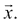

# 附录 A. 线性代数

线性代数在机器学习中至关重要，它为我们提供了一系列特别适用于数据操作和从数据中提取模式的有用工具。此外，当数据必须像在许多机器学习中那样批量处理时，使用“向量形式”作为传统循环结构的替代，在实现优化、数据预处理或分析中的任何操作时，可以获得巨大的运行时效率。

在以下内容中，我们只考虑实数域。因此，向量代表一个*n*个实数值的数组。矩阵是一个具有*m*行和*n*列实数值的二维数组。

这里介绍了线性代数基础的一些关键概念。

# 向量

向量**x**（小写，粗体，按惯例；等价于）可以被视为*n*-维空间中的一个点。按惯例，当我们说向量时，我们指的是列向量。列向量的*转置*是一个具有相同元素数量的行向量，排列在单行中。

## 向量标量积

也称为点积，标量积定义为等长向量的乘积。该操作的结果是一个标量值，通过求向量对应元素的乘积之和得到。因此，给定向量**x**和**y**：

点积**x**T**y**表示为：

# 矩阵

矩阵是一个二维数字数组。每个元素可以通过其行和列位置进行索引。因此，一个 3 x 2 矩阵：

## 矩阵转置

交换矩阵中的列和行产生转置。因此，**A**的转置是一个 2 x 3 矩阵：

### 矩阵加法

矩阵加法定义为具有相同形状的两个矩阵的逐元素相加。设**A**和**B**为两个*m* x *n*矩阵。它们的和**C**可以表示如下：

**C**i,j = **A**i,j + **B**i,j

### 标量乘法

与标量相乘产生一个矩阵，其中每个元素都按标量值缩放。这里**A**乘以标量值*d*：

### 矩阵乘法

如果矩阵**A**的列数等于矩阵**B**的行数，则两个矩阵**A**和**B**可以相乘。如果**A**的维度为*m* x *n*，**B**的维度为*n* x *p*，则乘积**AB**的维度为*m* x *p*：

#### 矩阵乘积的性质

对加法的分配律：A(B + C) = AB + AC

结合律：A(BC) = (AB)C

非交换性：AB ≠ BA

向量点积是交换的：**x**T**y** = **y**T**x**

乘积的转置是转置的乘积：(**AB**)T = **A**T**B**T

##### 线性变换

在线性代数中，矩阵与向量的乘积具有特殊的重要性。考虑一个 3 x 2 矩阵 **A** 与一个 2 x 1 向量 **x** 的乘积，产生一个 3 x 1 向量 *y*：

(C)

(R)

考虑前面矩阵-向量乘积的两种观点是有用的，即列图（**C**）和行图（**R**）。在列图中，乘积可以看作是矩阵列向量的线性组合，而行图可以看作是矩阵行与向量  的点积。

##### 矩阵逆

矩阵与其逆的乘积是单位矩阵。因此：

如果存在矩阵逆，则可以用来解由前面的向量-矩阵乘积方程表示的联立方程组。考虑一个方程组：

*x*1 + 2*x*2 = 3

3*x*1 + 9*x*2 = 21

这可以表示为一个涉及矩阵-向量乘积的方程：

我们可以通过将两边乘以矩阵逆来求解变量 *x*1 和 *x*2。

矩阵逆可以通过不同的方法计算。读者建议观看斯特兰格教授的麻省理工学院讲座：[bit.ly/10vmKcL](http://bit.ly/10vmKcL)。

##### 特征分解

矩阵可以被分解为因子，这些因子可以给我们提供关于矩阵表示的变换的宝贵见解。特征值和特征向量是特征分解的结果。对于给定的方阵 **A**，一个特征向量是一个非零向量，当乘以矩阵时，它被转换为其自身的缩放版本。标量乘数是特征值。一个特征向量的所有标量倍数也是特征向量：

**A** **v** = *λ* **v**

在前面的例子中，**v** 是一个特征向量，λ 是特征值。

矩阵 **A** 的特征值方程由以下给出：

(**A** — *λ* **I**)**v** = 0

特征值的非零解由特征多项式方程的根给出，该方程的阶数为 *n*，由行列式表示：

然后可以通过解 **Av** = λ **v** 来找到特征向量 *v*。

一些矩阵，称为可对角化矩阵，可以完全由它们的特征向量和特征值构建。如果 **Λ** 是具有矩阵 A 的特征值的主对角线的对角矩阵，而 **Q** 是其列是 **A** 的特征向量的矩阵：

那么 **A = Q Λ Q**-1。

##### 正定矩阵

如果一个矩阵只有正特征值，则称为 **正定矩阵**。如果特征值为正或零，则称为 **正半定矩阵**。对于正定矩阵，以下说法是正确的：

**x**T**Ax** *≥* 0

### 奇异值分解 (SVD)

SVD 是任何尺寸为 *n* x *p* 的矩形矩阵 **A** 的分解，表示为三个矩阵的乘积：

**U** 被定义为 *n* x *n*，**S** 是一个对角 *n* x *p* 矩阵，**V** 是 *p* x *p*。**U** 和 **V** 是正交矩阵；即：

**S** 的对角值称为 **A** 的奇异值。**U** 的列称为 **A** 的左奇异向量，而 **V** 的列称为 **A** 的右奇异向量。左奇异向量是 **A**T**A** 的正交归一特征向量，右奇异向量是 **AA**T 的正交归一特征向量。

SVD 表示将原始数据扩展到一个坐标系中，使得协方差矩阵是一个对角矩阵。
