# 第五章：EM 算法及其应用

在本章中，我们将介绍许多统计学习任务的一个重要算法框架：EM 算法。与它的名字相反，这不是解决单个问题的方法，而是一种可以在多个环境中应用的方法论。我们的目标是解释其原理，展示数学推导，以及一些实际例子。特别是，我们将讨论以下主题：

+   **最大似然估计** (**MLE**)和**最大后验**(**MAP**)学习方法

+   具有简单应用的 EM 算法以估计未知参数

+   高斯混合算法，这是 EM 应用中最著名的之一

+   因子分析

+   **主成分分析** (**PCA**)

+   **独立成分分析** (**ICA**)

+   考虑到 EM 步骤的**隐马尔可夫模型** (**HMM**)的前向-后向算法的简要说明

# MLE 和 MAP 学习

假设我们有一个数据生成过程 *p*[*data*]，用于生成数据集 *X*：

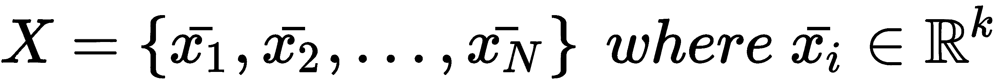

在许多统计学习任务中，我们的目标是根据最大化标准找到最优参数集 *θ*。最常见的方法是基于似然，称为 MLE。在这种情况下，最优集 *θ* 的寻找如下：

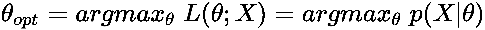

这种方法的优势是不受错误先决条件的影响，但与此同时，它排除了将先验知识纳入模型的可能性。它只是在更广泛的子空间中寻找最佳的 *θ*，以便最大化 *p(X|θ)*。即使这种方法几乎是无偏的，也有更高的概率找到次优解，这可能与合理的（即使不确定）先验相当不同。毕竟，有些模型太复杂，以至于我们无法定义合适的先验概率（例如，考虑强化学习策略，其中存在大量复杂的状态）。因此，MLE 提供了最可靠的解决方案。此外，可以证明参数 *θ* 的 MLE 在概率上收敛到真实值：

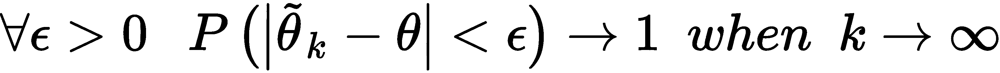

另一方面，如果我们考虑贝叶斯定理，我们可以推导出以下关系：

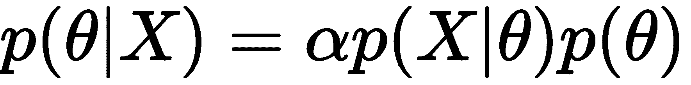

后验概率 *p(θ|X)* 是通过似然和先验概率 *p(θ)* 共同获得的，因此考虑了编码在 *p(θ)* 中的现有知识。选择最大化 *p(θ|X)* 的方法称为 MAP 方法，当可以制定可信的先验或，如在**潜在狄利克雷分配** (**LDA**)的情况下，模型故意基于一些特定的先验假设时，它通常是 MLE 的一个很好的替代方案。

不幸的是，一个错误或不完整的先验分布可能会使模型产生不可接受的结果。因此，MLE 通常是默认选择，即使有可能对*p(θ)*的结构提出合理的假设。为了理解先验对估计的影响，让我们考虑观察到*n*=1000 个二项分布（*θ*对应于参数*p*）的实验，其中*k*=800 次成功。似然如下：

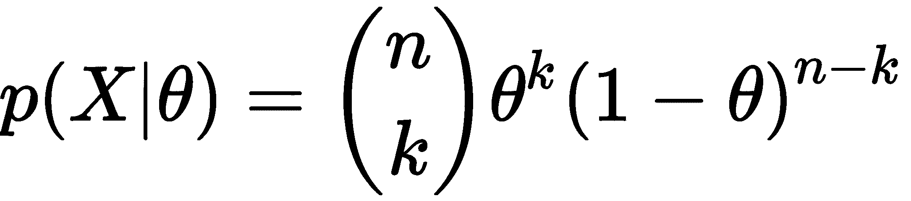

为了简单起见，让我们计算对数似然：

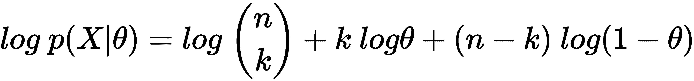

如果我们计算相对于*θ*的导数并将其设置为等于零，我们得到以下结果：

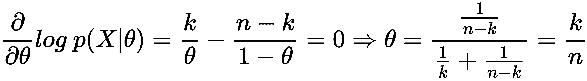

因此，*θ*的 MLE 是 0.8，这与观察结果一致（我们可以这样说，在观察了 1000 次实验，其中 800 次成功之后，*p(X|Success)=0.8*）。如果我们只有数据*X*，我们可以说成功比失败更有可能，因为 1000 次实验中有 800 次是积极的。

然而，在这个简单的练习之后，专家可以告诉我们，考虑到最大的可能人群，边缘概率*p(Success)=0.001*（伯努利分布，*p(Failure) = 1 - P(success)*）并且我们的样本不具有代表性。如果我们信任专家，我们需要使用贝叶斯定理计算后验概率：

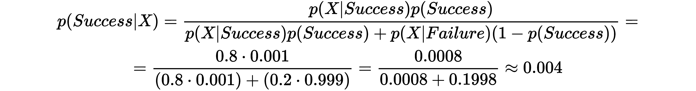

令人惊讶的是，后验概率非常接近零，我们应该拒绝我们的初始假设！在这个时候，有两个选择：如果我们只想基于我们的数据构建模型，MLE 是唯一合理的选项，因为考虑到后验，我们需要接受我们有一个非常差的数据集（这可能是从数据生成过程*p[data]*抽取样本时的偏差）。

另一方面，如果我们真的信任专家，我们有几种处理问题的方法：

+   检查采样过程以评估其质量（我们可以发现更好的采样会导致非常低的*k*值）

+   增加样本数量

+   计算*θ*的 MAP 估计

我建议读者尝试使用简单模型来比较两种方法，以便能够比较相对精度。在这本书中，当我们需要使用统计方法估计模型的参数时，我们总是会采用 MLE。这个选择基于我们的数据集是从*p[data]*正确采样的假设。如果这不可能（想想一个必须区分马、狗和猫的图像分类器，它使用的数据集中有 500 张马的照片，500 张狗的照片和 5 张猫的照片），我们应该扩展我们的数据集或使用数据增强技术来创建人工样本。

# EM 算法

EM 算法是一个通用的框架，可以用于许多生成模型的优化。它最初由*Dempster A. P.*，*Laird N. M.*，*Rubin D. B**.*在*《通过 EM 算法从不完全数据中估计最大似然》*，*《皇家统计学会杂志》*，*B*，*39(1):1–38*，*1977 年 11 月*提出，其中作者还证明了其在不同通用的水平上的收敛性。

对于我们的目的，我们将考虑一个数据集，*X*，以及一组我们无法观察到的潜在变量，*Z*。它们可以是原始模型的一部分，或者人为地作为简化问题的技巧引入。用向量*θ*参数化的生成模型具有等于以下的对数似然：

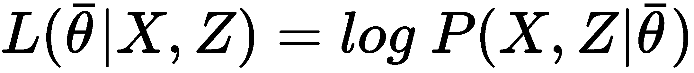

当然，大的对数似然意味着模型能够以小的误差生成原始分布。因此，我们的目标是找到最优的参数集*θ*，以最大化边缘对数似然（由于我们无法观察它们，我们需要对潜在变量求和或积分）：

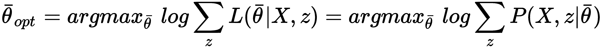

从理论上讲，这个操作是正确的，但不幸的是，由于其复杂性（特别是求和的对数通常很难处理），它几乎总是不可行的。然而，潜在变量的存在可以帮助我们找到一个容易计算的良好代理，其最大化对应于原始对数似然的最大化。让我们首先使用链式法则重写似然的表达式：

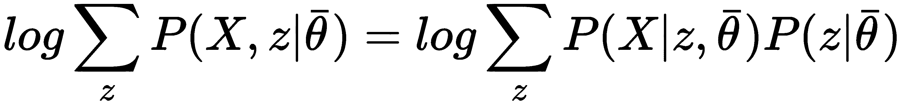

如果我们考虑一个迭代过程，我们的目标是找到一个满足以下条件的程序：

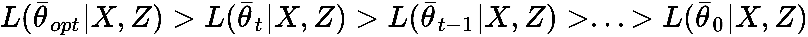

我们可以从考虑一个通用的步骤开始：


第一个要解决的问题是对数和。幸运的是，我们可以使用*詹森不等式*，它允许我们将对数移到求和内部。让我们首先定义*凸函数*的概念：一个在凸集*D*上定义的函数*f(x)*，如果满足以下条件，则称为凸函数：

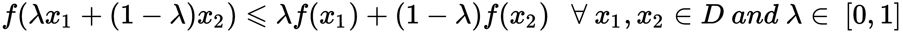

如果不等式是严格的，那么函数被称为*严格凸的*。直观地，考虑一个单变量函数*f(x)*，前面的定义表明函数永远不会高于连接两个点(*x[1]*, *f(x[1])*)和(*x**[2]*, *f(**x[2]**)*)的线段。在严格凸性的情况下，*f(x)*总是位于该线段下方。逆这些定义，我们得到函数是*凹的*或*严格凹的*的条件。

如果函数 *f(x)* 在 *D* 上是凹的，那么函数 *-f(x)* 在 *D* 上是凸的；因此，由于 *log(x)* 在 *0, ∞)* 上是凹的（或用等价记法在 *[0, ∞[) 上），-log(x)* 在 *[0, ∞)* 上是凸的，如下图所示：

![图片

*Jensen 不等式*（证明被省略，但更详细的内容可以在 *Jensen 的算子不等式*，*Hansen F.*，*Pedersen G. K.*，arXiv:math/0204049 [math.OA] 中找到）表明，如果 *f(x)* 是在凸集 *D* 上定义的凸函数，如果我们选择 n 个点 *x[1]*，*x[2]*，...，*x[n]* ∈ *D* 和 n 个常数 *λ[1]*，*λ[2]*，...，*λ[n]* ≥ *0* 满足条件 *λ[1] + λ[2] + ... + λ[n] = 1*，那么以下适用：

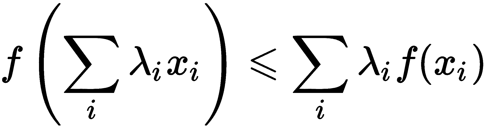

因此，考虑到 *-log(x)* 是凸的，*Jensen 不等式* 对于 *log(x)* 变为如下：

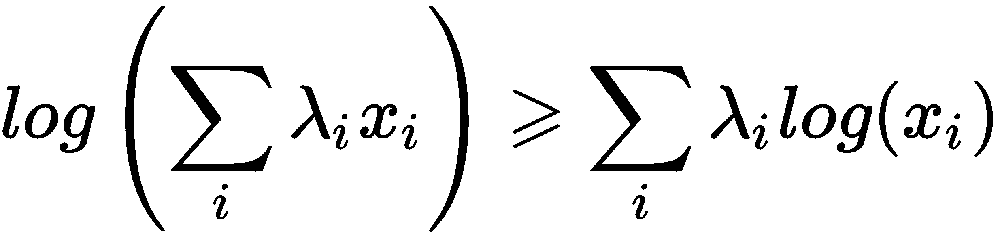

因此，通用的迭代步骤可以重写如下：


应用 Jensen 不等式，我们得到以下结果：


所有条件都满足，因为根据定义，项 *P(z[i]|X, θ[t])* 都在 [0, 1] 之间，并且所有 *z* 的和必须始终等于 1（概率定律）。前面的表达式意味着以下陈述是正确的：

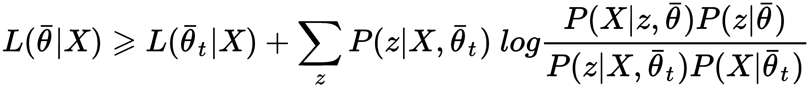

因此，如果我们最大化不等式的右侧，我们也会最大化对数似然。然而，考虑到我们只优化参数向量 *θ* 并且可以删除所有不依赖于它的项，问题可以进一步简化。因此，我们可以定义一个 *Q 函数*（它与我们在第十四章（51bcd684-080e-4354-b2ed-60430bd15f6d.xhtml，*强化学习导论*）中将要讨论的 Q-Learning 没有关系），其表达式如下：

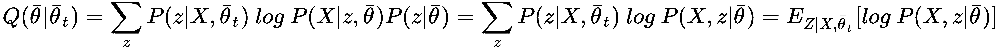

*Q* 是在完整数据 *Y* = (*X*, *Z*) 和当前迭代参数集 *θ[t]* 下对数似然的期望值。在每次迭代中，*Q* 是基于当前的估计 *θ*[*t* ]计算的，并且它是基于变量 *θ* 最大化计算的。现在更清楚为什么潜在变量经常被人为引入：它们允许我们应用 *Jensen 不等式* 并将原始表达式转换为易于评估和优化的期望值。

在这一点上，我们可以形式化 EM 算法：

1.  设置一个阈值 *Thr*（例如，*Thr* = 0.01）

1.  设置一个随机参数向量 *θ[0.]*

1.  当 *|L(θ[t]|X, Z) - L(θ[t-1]|X, Z)| >* *Thr* 时：

    +   **E-Step**: 计算条件概率 *Q*(*θ*|*θ[t]*). 通常，这一步包括使用当前的参数估计 *θ[t]* 来计算条件概率 *p*(*z*|*X*, *θ[t]*) 或其某些矩（有时，充分统计量仅限于均值和协方差）。

    +   **M-步**：找到 *θ[t+1]* = *argmax[θ] Q*(*θ*|*θ[t]*)。新的参数估计是通过最大化 *Q* 函数来计算的。

当对数似然不再增加或达到固定迭代次数后，程序结束。

# 参数估计的一个例子

在这个例子中，我们看到如何应用 EM 算法来估计未知参数（灵感来源于原始论文 *通过 EM 算法从不完全数据中估计最大似然*，Dempster A. P.，Laird N. M.，Rubin D. B.，《皇家统计学会杂志》，B, 39(1):1–38，1977 年 11 月）。

让我们考虑一个由三个可能结果 *x[1]*，*x[2]*，*x[3]* 和相应的概率 *p[1]*，*p[2]* 和 *p[3]* 组成的多项分布模型化的独立实验序列。概率质量函数如下：

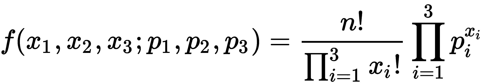

假设我们可以观察到 *z[1]* = *x[1]* + *x[2]* 和 *x[3]*，但我们无法直接访问单个值 *x[1]* 和 *x[2]*。因此，*x[1]* 和 *x[2]* 是潜在变量，而 *z[1]* 和 *x[3]* 是观测变量。概率向量 *p* 按以下方式参数化：

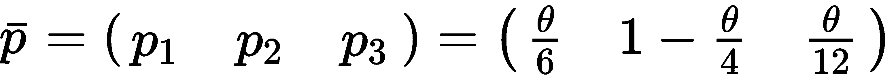

我们的目的是在给定 *n*，*z[1]* 和 *x[3]* 的情况下找到 *θ* 的最大似然估计。让我们开始计算对数似然：


我们可以利用期望值算子 *E*[*•*] 的线性来推导相应的 *Q* 函数的表达式：

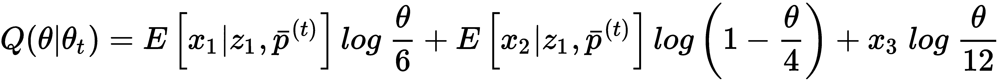

给定 *z[1]* 的变量 *x[1]* 和 *x[2]* 是二项分布的，可以表示为 *θ[t]* 的函数（我们需要在每次迭代中重新计算它们）。因此，*x[1]*^((t+1)) 的期望值如下：

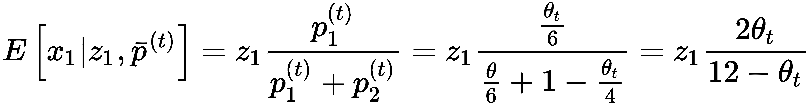

而 *x[2]*^((*t*+*1*)) 的期望值如下：

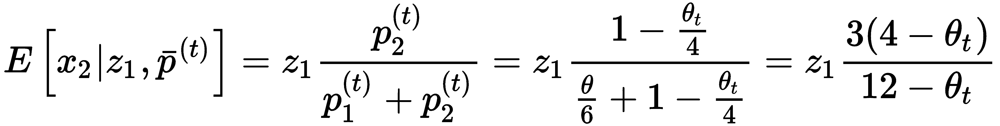

如果我们将这些表达式应用于 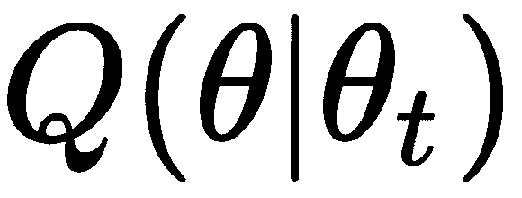 并对 *θ* 求导，我们得到以下结果：

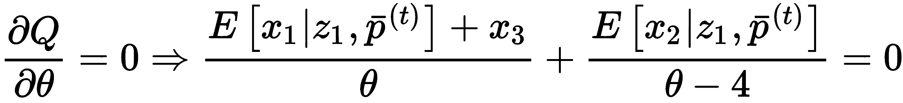

因此，求解 *θ*，我们得到以下结果：

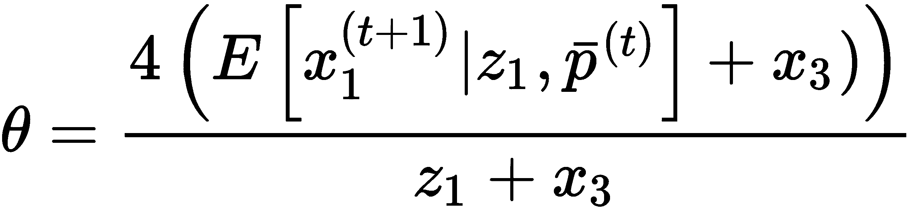

在这一点上，我们可以推导出 *θ* 的迭代表达式：

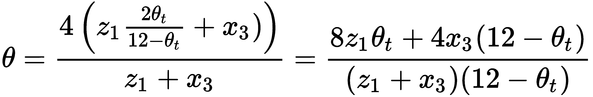

让我们计算当 *z[1]* = 50 和 *x[3]* = 10 时 *θ* 的值：

```py
def theta(theta_prev, z1=50.0, x3=10.0):
    num = (8.0 * z1 * theta_prev) + (4.0 * x3 * (12.0 - theta_prev))
    den = (z1 + x3) * (12.0 - theta_prev)
    return num / den

theta_v = 0.01

for i in range(1000):
    theta_v = theta(theta_v)

print(theta_v)
1.999999999999999

p = [theta_v/6.0, (1-(theta_v/4.0)), theta_v/12.0]

print(p)
[0.33333333333333315, 0.5000000000000002, 0.16666666666666657]
```

在这个例子中，我们已将所有概率进行了参数化，考虑到 *z[1]* = *x[1]* + *x[2]*，我们有一个自由度来选择 *θ*。读者可以通过设置 *p[1]* 或 *p[2]* 中的一个值，并将其他概率作为 *θ* 的函数来重复此例子。计算几乎相同，但在这个情况下，没有自由度。

# 高斯混合

在 第二章 《半监督学习导论》中，我们讨论了半监督学习背景下的生成高斯混合模型。在本段中，我们将应用 EM 算法推导参数更新的公式。

让我们考虑一个从数据生成过程 *p[data]* 中抽取的数据集 *X*：


我们假设整个分布是由 *k* 个高斯分布的和生成的，这样每个样本的概率可以表示如下：

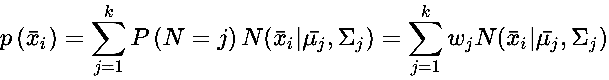

在前面的表达式中，项 *w[j]* = *P*(*N*=j) 是第 *j* 个高斯分布的相对权重，而 *μ*[*j*] 和 *Σ[j]* 是均值和协方差矩阵。为了与概率定律保持一致，我们还需要施加以下条件：

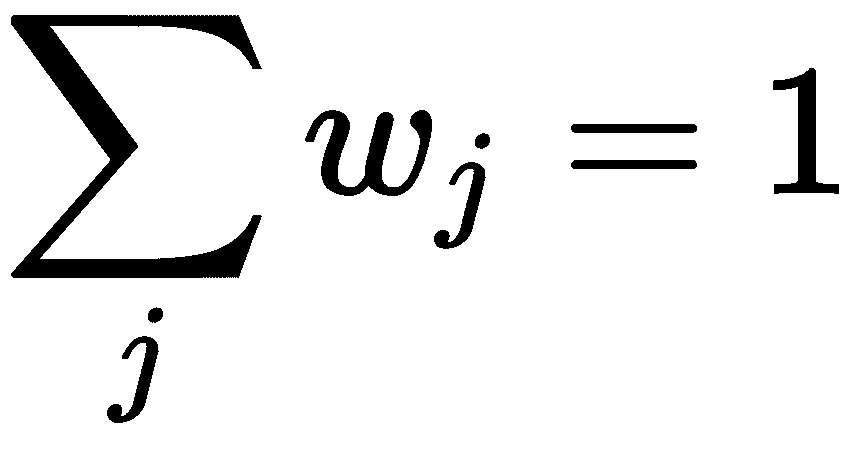

不幸的是，如果我们直接尝试解决这个问题，我们需要管理求和的对数，这个过程变得非常复杂。然而，我们已经了解到，可以使用潜在变量作为辅助工具，每当这个技巧可以简化解决方案时。

让我们考虑一个单个参数集 *θ*=(*w[j]*, *μ[j]*, *Σ[j]*) 和一个潜在指示矩阵 *Z*，其中每个元素 *z[ij]* 等于 1 如果点 *x[i]* 已经由第 *j* 个高斯分布生成，否则为 0。因此，每个 *z[ij]* 是伯努利分布，参数等于 *p*(*j*|*x[i]*, *θ[t]*)。

因此，联合对数似然函数可以使用指数指示符表示法表示如下：

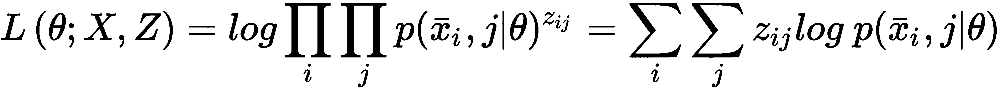

索引 *i* 指的是样本，而 *j* 指的是高斯分布。如果我们应用链式法则和对数性质，表达式变为以下形式：

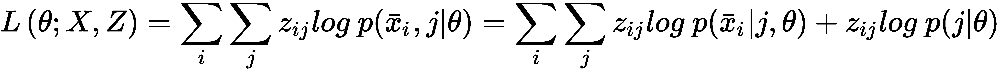

第一个项表示在 *j* 个高斯分布下 *x[i]* 的概率，而第二个项是第 *j* 个高斯分布的相对权重。现在我们可以使用联合对数似然函数来计算 *Q*(*θ*;*θ[t]*) 函数：

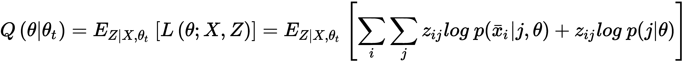

利用 *E[•]* 的线性特性，前面的表达式变为以下形式：


项 *p*(*j*|*x**[i]*, *θ[t]*) 对应于考虑完整数据的 *z[ij]* 的期望值，并表达了给定样本 *x[i]* 的 *j* 个高斯分布的概率。考虑到贝叶斯定理，它可以简化如下：

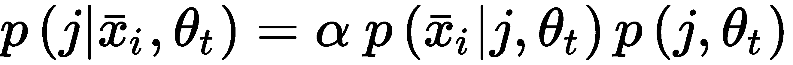

第一个项是 *x[i]* 在 *j^(th)* 高斯下的概率，而第二个项是在相同的参数集 *θ[t]* 下 *j^(th)* 高斯的权重。为了推导参数的迭代表达式，写出多元高斯分布对数的完整公式是有用的：


为了简化这个表达式，我们使用迹技巧。实际上，由于 (*x[i]* -* μ[j*)*^T* Σ^(-1) (*x**[i]* - *μj*) 是一个标量，我们可以利用 *tr*(*AB*) = *tr*(*BA*) 和 *tr*(*c*) = *c* 的性质，其中 *A* 和 *B* 是矩阵，*c* ∈ *ℜ*：

![图片

让我们从均值的估计开始考虑（只有 *Q*(*θ*;*θ**[t]*) 的第一个项依赖于均值和协方差）：


将导数设为零，我们得到以下结果：

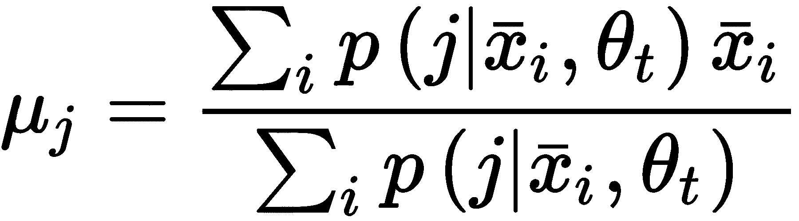

同样地，我们得到协方差矩阵的表达式：

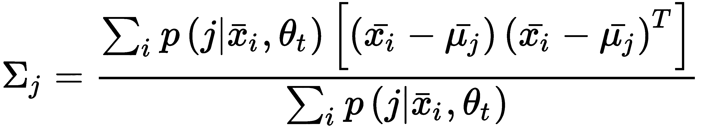

为了获得权重的迭代表达式，过程稍微复杂一些，因为我们需要使用拉格朗日乘数（更多信息可以在[`www.slimy.com/~steuard/teaching/tutorials/Lagrange.html`](http://www.slimy.com/~steuard/teaching/tutorials/Lagrange.html)找到）。考虑到权重的总和必须始终等于 1，可以写出以下方程：

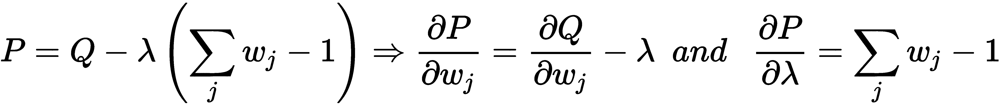

将两个导数都设为零，从第一个导数出发，考虑到 *wj* = *p*(*j*|*θ*)，我们得到以下结果：

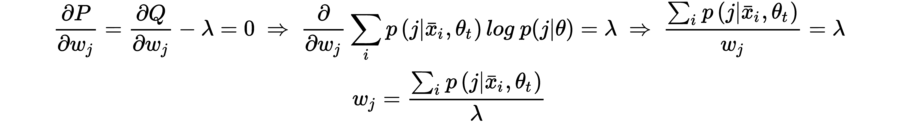

而从第二个导数，我们得到以下结果：

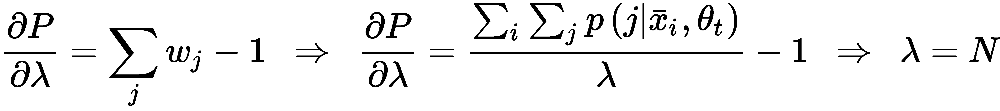

最后一步来源于基本条件：

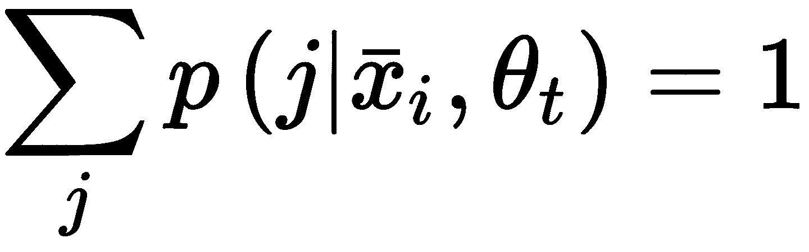

因此，权重的最终表达式如下：

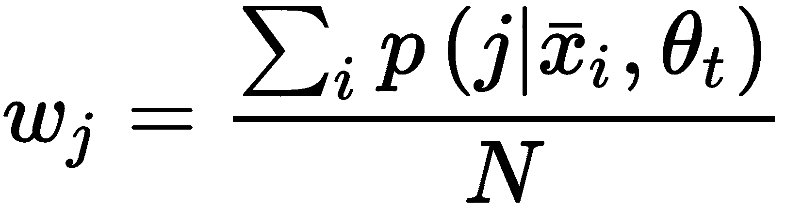

在这一点上，我们可以正式化高斯混合算法：

+   为 *w[j]*^((*0*)), *θ*^((*0*))[j]* 和 *Σ*^((0))*[j]* 设置随机初始值

+   **E-Step**: 使用贝叶斯定理计算 *p*(*j*|*x[i]*, *θ[t]*)：*p*(*j*|*x**[i]*, *θ[t]*) = *α w*^((*t*))[j] * *p*(*x[i]*|*j,* *θ[t]*)

+   **M-Step**: 使用之前提供的公式计算 *w[j]*^((*t+1*)), *θ*^((*t+1*))[j] 和 Σ^((t+1))*[j]*。

该过程必须迭代，直到参数变得稳定。通常，最佳实践是使用阈值和最大迭代次数。

# 使用 Scikit-Learn 的 Gaussian Mixtures 示例

我们现在可以使用 Scikit-Learn 的实现来实施高斯混合算法。直接方法已在第二章，“半监督学习简介”中展示。数据集生成时具有三个聚类中心和由于标准差等于 1.5 的适度重叠：

```py
from sklearn.datasets import make_blobs

nb_samples = 1000
X, Y = make_blobs(n_samples=nb_samples, n_features=2, centers=3, cluster_std=1.5, random_state=1000)
```

相应的图表如下所示：

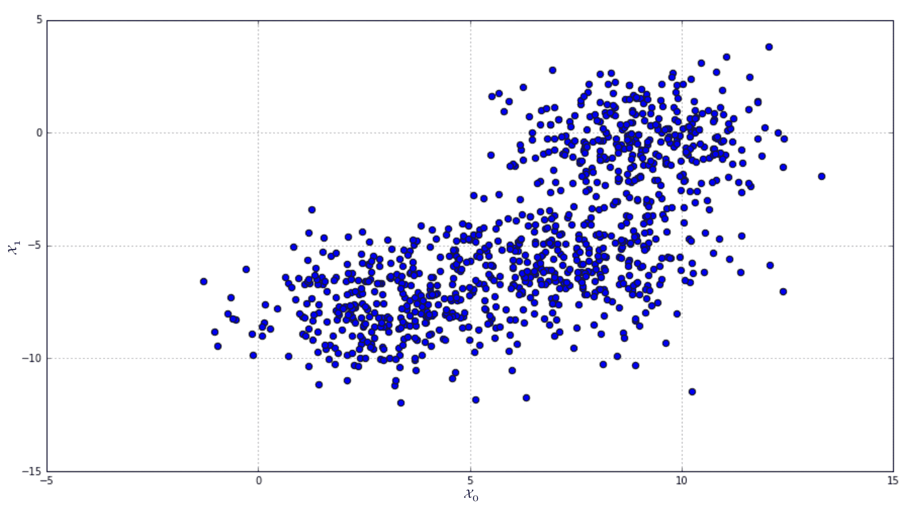

Scikit-Learn 的实现基于 `GaussianMixture` 类，它接受参数如高斯数量 (`n_components`)、协方差类型 (`covariance_type`)，可以是 `full`（默认值），如果所有组件都有自己的矩阵，`tied` 如果矩阵是共享的，`diag` 如果所有组件都有自己的对角矩阵（这条件使得特征之间不相关），以及 `spherical` 当每个高斯在所有方向上都是对称的。其他参数允许设置正则化和初始化因子（有关更多信息，读者可以直接查看文档）。我们的实现基于完全协方差：

```py
from sklearn.mixture import GaussianMixture

gm = GaussianMixture(n_components=3)
gm.fit(X)
```

在模型拟合后，可以通过实例变量 `weights_`、`means_` 和 `covariances_` 访问学习到的参数：

```py
print(gm.weights_)

[ 0.32904743  0.33027731  0.34067526]

print(gm.means_)

[[ 3.03902183 -7.69186648]
 [ 9.04414279 -0.37455175]
 [ 7.37103878 -5.77496152]]

print(gm.covariances_)

[[[ 2.34943036  0.08492009]
  [ 0.08492009  2.36467211]]

 [[ 2.10999633  0.02602279]
  [ 0.02602279  2.21533635]]

 [[ 2.71755196 -0.0100434 ]
  [-0.0100434   2.39941067]]]
```

考虑到协方差矩阵，我们可以理解特征之间非常不相关，高斯几乎呈球形。最终的图表可以通过将每个点分配给相应的聚类（高斯分布）通过 `Yp = gm.transform(X)` 命令获得：

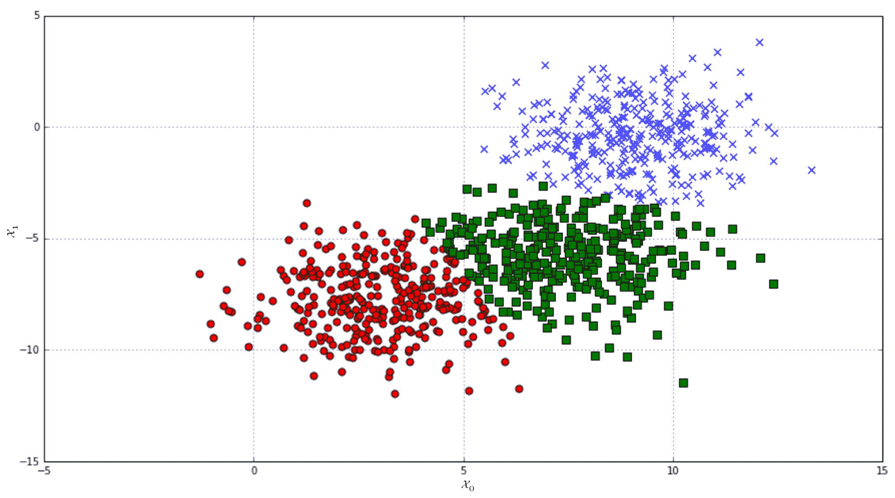

通过应用具有三个组件的高斯混合得到的有标签数据集

读者应该已经注意到高斯混合和 k-means（我们将在第七章，“聚类算法”中讨论）之间有很强的类比。特别是，我们可以声明 K-means 是球形高斯混合的一个特例，其中协方差 *Σ* → 0。这个条件将方法从软聚类（每个样本以精确的概率分布属于所有聚类）转变为硬聚类（通过考虑样本和质心（或均值）之间的最短距离来完成分配）。因此，在某些书中，高斯混合算法也被称为软 K-means。我们将要介绍的一个概念上类似的方法是模糊 K-means，它基于由隶属函数定义的分配，这些函数类似于概率分布。

# 因子分析

假设我们有一个高斯数据生成过程，*p*[*data* ]∼ *N*(*0*, *Σ*)，并且从中抽取了 *M* 个零均值样本：

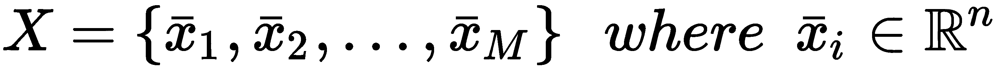

如果*p**[data]*的均值*μ* ≠ *0*，也可以使用这个模型，但需要通过一些公式的微小变化来考虑这个非零值。由于零中心化通常没有缺点，更容易去除均值以简化模型。

在无监督学习中，最常见的问题之一是找到一个低维分布*p[lower]*，使得与*p[data]*的 Kullback-Leibler 散度最小化。当进行**因子分析（FA**）时，根据发表在*EM 算法在机器学习因子分析中的应用*，*Rubin D.*，*Thayer D.*，*Psychometrika*，47/1982，第 1 期，以及*混合因子分析中的 EM 算法*，*Ghahramani Z.*，*Hinton G. E.*，CRC-TG-96-1，1996 年 5 月，的原提案，我们假设将通用样本*x*建模为高斯潜在变量*z*（其维度*p*通常是*p* < *n*）的线性组合，再加上一个可加且去相关的高斯噪声项*ν*：

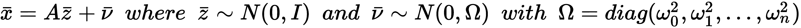

矩阵 A 被称为*因子载荷矩阵*，因为它决定了每个潜在变量（因子）对*x*重建的贡献。因子和输入数据被认为是统计独立的。相反，考虑到最后一个项，如果*ω[0]²* ≠ *ω[1]²* ≠ ... ≠ *ω[n]²*，噪声被称为*异方差*，而如果方差相等*ω[0]²* = *ω[1]²* = ... = *ω[n]²* = *ω²*，则定义为*同方差*。为了理解这两种噪声之间的区别，考虑一个信号 x，它是两个相同声音的和，记录在不同的地方（例如，机场和森林）。在这种情况下，我们可以假设也有不同的噪声方差（第一个应该比第二个高，考虑到不同的噪声源数量）。如果相反，两个声音都在隔音室中录制，或者在同一个机场中录制，同方差噪声更有可能（我们不考虑功率，但方差之间的差异）。

与其他方法（如 PCA）相比，FA 的一个重要优势是其对异方差噪声的内禀鲁棒性。事实上，在模型中包含噪声项（仅限于去相关约束）允许基于单个成分进行部分去噪滤波，而 PCA 的一个前提条件是只施加同方差噪声（在许多情况下，这与噪声完全不存在非常相似）。考虑到前面的例子，我们可以假设第一个方差为*ω[0]²* = *k ω[1]²*，其中*k* > *1*。这样，模型将能够理解第一个成分的高方差应该（以更高的概率）被视为噪声与成分固有属性的乘积。

现在我们来分析线性关系：

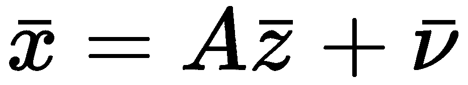

考虑高斯分布的性质，我们知道 *x* 符合正态分布 *N*(*μ*, *Σ*)，因此很容易确定均值或协方差矩阵：


因此，为了解决问题，我们需要找到最佳的 *θ*=(*A*, *Ω*)，使得 *AA^T* + *Ω* ≈ *Σ*（对于零均值数据集，估计仅限于输入协方差矩阵 *Σ*）。现在应该更清楚地理解处理噪声变量的能力。如果 *AA^T* + *Ω* 等于 *Σ* 并且 *Ω* 的估计是正确的，算法将优化因子加载矩阵 A，排除噪声项产生的干扰；因此，成分将大约去噪。

为了采用 EM 算法，我们需要确定联合概率 *p*(*X*, *z*; *θ*) = *p*(*X*|*z*; *θ*)*p*(*z*|*θ*)。右侧的第一个项可以很容易地确定，考虑到 *x* - *Az* 符合正态分布 *N*(*0*, *Ω*)；因此，我们得到以下：

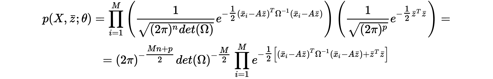

我们现在可以确定 *Q*(*θ*;*θ[t]*) 函数，忽略常数项 (*2π*)^k 和与 *θ* 无关的项 *z^Tz*。此外，展开指数中的乘法是有用的：

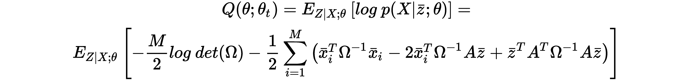

使用迹技巧对最后一个项（它是一个标量）进行重写，我们可以将其表示如下：

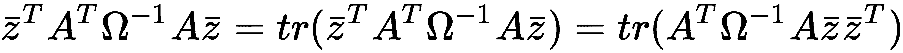

利用 *E*[•] 的线性，我们得到以下：

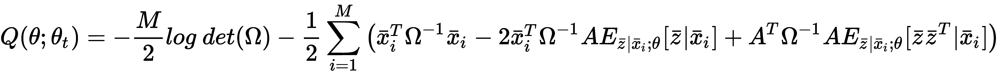

这个表达式与我们之前在高斯混合模型中看到的是相似的，但在这个情况下，我们需要计算 *z* 的条件期望和条件二阶矩。不幸的是，我们无法直接计算它们，但可以通过利用 *x* 和 *z* 的联合正态性来计算。特别是，使用一个经典定理，我们可以根据以下关系对整个联合概率 *p*(*z*, *x*) 进行划分：

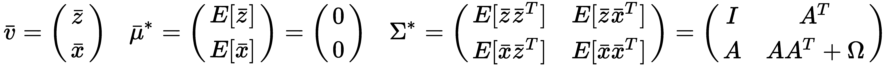

条件分布 *p*(*z*|*x*=*x[i]*) 的均值等于以下：

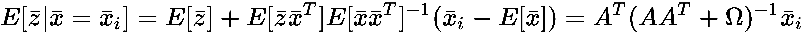

条件方差如下：


因此，条件二阶矩等于以下：


如果我们定义辅助矩阵 *K* = (*AA^T* + *Ω*)^(-1)，则前面的表达式变为以下：


想要了解更多关于此技术细节的读者可以阅读《Preview》。

《统计决策理论导论》，作者：*Pratt J.*，*Raiffa H.*，*Schlaifer R.*，出版社：*MIT Press*。

使用前面的表达式，可以构建逆模型（有时称为*识别模型*，因为它从效果开始重建原因），该模型仍然是高斯分布的：


现在我们能够根据*A*和Ω最大化*Q*(*θ*;*θ**[t]*)，考虑*θ[t]*=(*A[t]*, Ω*[t]*)以及根据之前的估计*θ[t-1]*=(*A[t-1]*, Ω*[t-1]*)计算的条件期望和二阶矩。因此，它们不涉及推导过程。我们采用惯例，在时间*t*计算要最大化的项，而所有其他项都是通过之前的估计获得的（*t* - *1*）：


因此*A*[*t*]的表达式如下（*Q*是有偏输入协方差矩阵*E*[*X^TX*]对于零中心数据集）：


同样，我们可以通过计算相对于Ω*^(-1)*的导数来获得Ω*[t]*的表达式（这个选择简化了计算，并且不会影响结果，因为我们必须将导数设为零）：


第一个项的导数，即实对角矩阵的行列式，是通过使用伴随矩阵*Adj*(Ω)并利用逆矩阵的性质*T^(-1)* = *det(T)^(-1)Adj(T)*和性质*det(T)^(-1) = det(T^(-1))*以及*det(T^T) = det(T)*获得的：


对Ω[t]（施加对角性约束）的表达式如下：


总结步骤，我们可以定义完整的 FA 算法：

1.  为*A^((0))*和Ω*^((0))*设置随机初始值

1.  计算有偏输入协方差矩阵*Q = E[X^TX]*

1.  E 步骤：计算*A^((t))*, Ω*^((t))*, 和*K^((t))*

1.  M 步骤：使用之前的估计和之前提供的公式计算 A^((t+1)), Ω*^((t+1))*, 和*K**^((t+1))*

1.  计算逆模型的矩阵*B*和*Ψ*

必须重复这个过程，直到*A^((t))*, Ω*^((t))*, 和*K**^((t))*的值停止改变（使用阈值）以及最大迭代次数的约束。因子可以通过逆模型*z = Bx + λ*轻松获得。

# Scikit-Learn 的因子分析示例

我们现在可以用 Scikit-Learn 和 MNIST 手写数字数据集（原始版本中包含 70,000 个 28 × 28 的灰度图像，并添加了异方差噪声[*ω[i]*随机选择自[0, 0.75]）来做一个 FA 的例子。

第一步是加载并零中心原始数据集（我使用第一章节中定义的函数，第一章，*机器学习模型基础*）：

```py
import numpy as np

from sklearn.datasets import fetch_mldata

digits = fetch_mldata('MNIST original')
X = zero_center(digits['data'].astype(np.float64))
np.random.shuffle(X)

Omega = np.random.uniform(0.0, 0.75, size=X.shape[1])
Xh = X + np.random.normal(0.0, Omega, size=X.shape)
```

在这一步之后，`X`变量将包含零中心的原数据集，而`Xh`是带噪声的版本。以下截图显示了从两个版本中随机选择的样本：


我们可以使用 Scikit-Learn 的`FactorAnalysis`类，并设置`n_components=64`参数，对两个数据集执行因子分析，并检查得分（所有样本的平均对数似然）。如果已知噪声方差（或有一个良好的估计），可以通过`noise_variance_init`参数包含起始点；否则，它将使用单位矩阵初始化：

```py
from sklearn.decomposition import FactorAnalysis

fa = FactorAnalysis(n_components=64, random_state=1000)
fah = FactorAnalysis(n_components=64, random_state=1000)

Xfa = fa.fit_transform(X)
Xfah = fah.fit_transform(Xh)

print(fa.score(X))
-2162.70193446

print(fah.score(Xh))
-3046.19385694
```

如预期，噪声的存在降低了最终的准确度（最大似然估计）。根据*A. Gramfort*和*D. A. Engemann*在原始 Scikit-Learn 文档中提供的示例，我们可以使用*Lodoit-Wolf*算法（一种用于改善协方差条件的收缩方法，超出了本书的范围）为 MLE 创建一个基准。

对于更多信息，请阅读*A Well-Conditioned Estimator for Large-Dimensional Covariance Matrices*，*Ledoit O.*，*Wolf M.*，*Journal of Multivariate Analysis*，88，2/2004":

```py
from sklearn.covariance import LedoitWolf

ldw = LedoitWolf()
ldwh = LedoitWolf()

ldw.fit(X)
ldwh.fit(Xh)

print(ldw.score(X))
-2977.12971009

print(ldwh.score(Xh))
-2989.27874799
```

使用原始数据集，因子分析比基准表现得更好，而在存在异方差噪声的情况下则略差。读者可以尝试使用网格搜索不同的成分数量和噪声方差的其他组合，并实验去除零中心化步骤的效果。可以使用`components_`实例变量绘制提取的成分：


对原始数据集进行因子分析提取的 64 个成分的图

仔细分析表明，这些成分是许多低级视觉特征的叠加。这是由于对成分具有高斯先验分布的假设（*z* ∼ *N(0, I)*）。事实上，这种分布的一个缺点是其固有的密集性（采样值远离均值的概率通常太高，而在某些情况下，人们希望有一个峰值分布，以阻止值远离其均值，以便能够观察到更具有选择性的成分）。此外，考虑到分布*p[Z|X; θ]*，协方差矩阵*ψ*不能对角化（试图施加此约束可能导致无法解决的问题），导致一个结果的多变量高斯分布，它通常不是由独立的成分组成的。一般来说，单个变量*z[i,]*（在输入样本*x[i]*的条件下）在统计上是相关的，并且重建*x[i,]*是通过几乎所有提取的特征的参与获得的。在这些所有情况下，我们说*编码是密集的*，特征字典在*欠完备的*（成分的维度低于*dim(x[i])*）。

考虑到任何正交变换*Q*应用于*A*（因子负载矩阵）不会影响分布*p[X|Z, θ]*，缺乏独立性也可能是一个问题。事实上，由于*QQ^T=I*，以下适用：


换句话说，任何特征旋转*(x = AQz + ν)*都是原始问题的解决方案，并且无法决定哪个是真实的负载矩阵。所有这些条件导致进一步的结论，即成分之间的互信息不等于零，也不接近最小值（在这种情况下，每个都携带特定的信息部分）。另一方面，我们的主要目标是降低维度。因此，有依赖的成分并不奇怪，因为我们旨在保留*p(X)*中包含的最大原始信息量（记住，信息量与熵相关，而熵与方差成正比）。

同样的现象可以在 PCA（它仍然基于高斯假设）中观察到，但在最后一段，我们将讨论一种称为 ICA 的技术，其目标是基于一组统计独立的特征创建每个样本的表示（不受到降维的约束）。这种方法，尽管有其特殊性，但仍属于被称为*稀疏编码*的算法大家族。在这种情况下，如果相应的字典满足*dim(z[i]) > dim(x[i])*，则称为*过完备*（当然，主要目标不再是降维）。

然而，我们只考虑字典最多是完备的情况*dim(z[i]) = dim(x[i]*)*，因为过完备字典的 ICA 需要更复杂的方法。稀疏度水平当然与*dim(z[i])*成正比，并且在使用 ICA 时，它总是作为次要目标（主要目标始终是成分之间的独立性）实现的。

# 主成分分析

另一种解决高维数据集降维问题的常见方法基于这样的假设：通常，总方差不是由所有成分均匀解释的。如果*p[data]*是一个协方差矩阵为*Σ*的多变量高斯分布，那么熵（它是分布中包含的信息量的度量）如下所示：


因此，如果某些成分具有非常低的方差，它们对熵的贡献也有限，提供的信息很少。因此，它们可以被移除而不会导致精度损失过高。

正如我们在 FA 中所做的那样，让我们考虑一个从*p[data]* ∼ *N(0, Σ)*（为了简单起见，我们假设它是零中心的，即使这不是必要的）抽取的数据集：


我们的目标是定义一个线性变换*z = A^Tx*（向量通常被认为是一列，因此*x*的形状是*(n × 1)*），如下所示：


由于我们想要找出方差较高的方向，我们可以从输入协方差矩阵*Σ*（它是实数、对称和正定的）的特征分解开始构建我们的变换矩阵*A*：


*V*是一个包含特征向量（作为列）的*(n × n)*矩阵，而*Ω*是一个包含特征值的对角矩阵。此外，*V*也是正交的，因此特征向量构成了一个基。另一种方法是基于**奇异值分解**（**SVD**），它有一个增量变体，并且有一些算法可以在任意数量的组件上进行截断分解，从而加快收敛过程（例如 Scikit-Learn 实现`TruncatedSVD`）。

在这种情况下，样本协方差如下所示：


如果我们将 SVD 应用于矩阵*X*（每一行代表一个形状为*(1, n)*的单个样本），我们得到以下结果：


*U*是一个包含（作为行）左奇异向量的单位矩阵（*XX^T*的特征向量），*V*（也是单位矩阵）包含（作为行）右奇异向量（对应于*X^TX*的特征向量），而*Λ*是一个包含*Σ[s]*的奇异值的对角矩阵（它们是*XX^(T)*和*X^TX*的特征值的平方根）。通常，特征值按降序排序，特征向量被重新排列以匹配相应的位置。

因此，我们可以直接使用矩阵*Λ*来选择最相关的特征值（平方根是一个增函数，不会改变顺序）和矩阵*V*来检索相应的特征向量（因子*1/M*是一个比例常数）。这样，我们不需要计算和特征分解协方差矩阵*Σ*（包含*n × n*个元素），并且可以利用一些仅与数据集（不计算*X^TX*）工作的非常快速的近似算法。使用奇异值分解（SVD），可以直接对*X*进行变换，考虑到*U*和*V*是单位矩阵（这意味着*UU^T* = *U^TU* = *I*；因此，共轭转置也是逆）：


目前，*X*只被投影到特征向量空间（它只是简单地旋转了）并且其维度没有改变。然而，从特征向量的定义中，我们知道以下是真的：


如果*λ*很大，*v*的投影将按对应特征向量方向解释的方差成比例放大。因此，如果尚未这样做，我们可以对特征值及其对应的特征向量进行排序（并重命名），以获得以下结果：


如果我们选择前*k*个最大的特征值，我们可以根据对应的特征向量（主成分）构建一个转换矩阵，该矩阵将*X*投影到原始特征向量空间的一个子空间：


使用奇异值分解（SVD），我们可以直接截断*U*和*Λ*，创建包含仅包含前 k 个特征向量的矩阵*U[k]*和包含前 k 个特征值的对角矩阵*Λ[k]*。

当选择*k*的值时，我们假设以下情况是正确的：


为了实现这一目标，通常需要将性能与不同数量的组件进行比较。在下面的图表中，有一个图表显示了方差比（由组件 n 解释的方差/总方差）和累积方差作为组件的函数：


每个组件的解释方差（左）和每个组件的累积方差（右）

在这种情况下，前 10 个组件能够解释总方差的 80%。剩余的 25 个组件的影响越来越小，可以删除。然而，选择必须始终基于具体上下文，考虑到由于信息丢失而引起的价值损失。

确定正确组件数量的一个技巧是基于 X 的特征值分析。在排序后，可以考虑到后续值之间的差异 d = {λ[1] - λ[2]，λ[2] - λ[3]，...，λ[n-1] - λ[n]}。最大的差异*λ[k] - λ[k+1]*决定了潜在最佳降维的索引*k*（显然，需要考虑最小值的约束，因为通常*λ[1] - λ[2]*是最大的差异）。例如，如果 d = {4，4，3，0.2，0.18，0.05}，则原始维度为 n=6；然而，*λ[4] - λ[5]*是最小的差异，因此，将维度降低到*(n + 1) - k = 3*是合理的。原因是直截了当的，特征值决定了每个组件的大小，但我们需要一个相对度量，因为尺度会变化。在示例中，最后三个特征向量指向的方向，与前三个组件相比，解释方差可以忽略不计。

一旦我们定义了转换矩阵*A[k]*，就可以通过以下关系在新的子空间中执行原始向量的实际投影：


整个数据集的完全转换可以简单地按以下方式获得：


现在，让我们分析新的协方差矩阵 *E[Z^TZ]*。如果原始分布 *p[data] x ∼ N(0, Σ)*，则 *p(z)* 也将是高斯分布，具有均值和协方差：


我们知道 *Σ* 是正交的；因此，当 *i ≠ j* 时，*v[i] · v[j] = 0*。如果我们分析 *A^TV* 这个项，我们得到以下结果：


考虑到 Ω 是对角的，结果矩阵 *Σ[z]* 也将是对角的。这意味着 PCA 去除了变换后的协方差矩阵的相关性。同时，我们可以声明，每个去除了输入协方差矩阵相关性的算法都执行了 PCA（带有或没有降维）。例如，*白化过程*是一个没有降维的特定 PCA，而 Isomap（见第三章，*基于图的无监督学习*）使用更几何的方法通过 Gram 矩阵执行相同的操作。这个结果将在第六章，*赫布学习*中使用，以展示一些特定的神经网络如何在不分解 *Σ* 的特征值的情况下执行 PCA。

现在让我们考虑一个具有同方差噪声的 FA。我们已经看到，条件分布的协方差矩阵 *p(X|Z; θ)* 等于 *AA^T + Ω*。在同方差噪声的情况下，它变为 *AA^T + ωI*。对于一般的协方差矩阵 *Σ*，可以证明添加一个常数对角矩阵 *(Σ + aI)* 不会改变原始的特征向量，并且将特征值移动相同的数量：


因此，我们可以考虑没有噪声的通用情况，而不会失去一般性。我们知道 FA（Ω = (0)）的目标是找到矩阵 *A*，使得 *AA^T ≈ Q*（输入协方差）。因此，由于对称性和施加渐近等价性，我们可以写出以下结果：


这个结果意味着 FA 是在存在异方差噪声的情况下管理降维的更通用（且更稳健）的方法，而 PCA 是对同方差噪声的限制。当对受异方差噪声影响的数据集进行 PCA 时，MLE 会变差，因为不同的噪声成分，在不同程度上改变特征值的幅度，可能导致选择到在原始数据集中仅解释了低百分比的方差（在无噪声场景下，通常会被更重要的方向所取代）。如果你想到前一段开头讨论的例子，我们知道噪声是强异方差的，但我们没有工具来告知 PCA 如何应对它，并且第一个组件的方差将远高于预期，考虑到两个来源是相同的。不幸的是，在现实场景中，噪声是相关的，当噪声功率非常高时，无论是因子分析还是 PCA 都无法有效地解决问题。在所有这些情况下，必须采用更复杂的去噪技术。相反，如果可以定义一个近似的对角噪声协方差矩阵，FA 肯定比 PCA 更稳健和高效。后者应仅在无噪声或*准*无噪声场景下考虑。在这两种情况下，结果永远不会导致特征分离。因此，ICA 已经被研究，并已经设计了许多不同的策略。

PCA 的完整算法如下：

1.  创建一个包含所有样本 x[i]作为行的矩阵*X^((M × n))* 

    1.  特征分解版本：

        1.  计算协方差矩阵*Σ = [X^TX]*

        1.  对Σ进行特征分解*Σ = VΩV^T*

    1.  SVD 版本：

        1.  对矩阵*X = UΛV^T*进行 SVD

    1.  选择最大的 k 个特征值（来自Ω或Λ）和相应的特征向量（来自 V）

    1.  创建一个形状为*(n × k)*的矩阵 A，其列是最大的 k 个特征向量（每个特征向量形状为(n × 1)）

    1.  将数据集投影到低维空间 Z = XA（特征分解）或*Z = UΛ (SVD)*

一些包（如 Scipy，它是许多 NumPy 函数的后端，如`np.linalg.svd()`）已经返回了转置的矩阵 V（右奇异向量）。在这种情况下，算法的第 3 步中需要使用*V^T*而不是 V。我建议在实现这些类型的算法时始终检查文档。

# 使用 Scikit-Learn 进行 PCA 的示例

我们可以重复使用与 FA 和异方差噪声相同的实验来评估 PCA 的 MLE 得分。我们将使用具有相同数量组件的`PCA`类（`n_components=64`）。为了达到最大精度，我们还设置了`svd_solver='full'`参数，以强制 Scikit-Learn 应用完整的 SVD 而不是截断版本。这样，只有分解后才会选择最大的特征值，避免了不精确估计的风险：

```py
from sklearn.decomposition import PCA

pca = PCA(n_components=64, svd_solver='full', random_state=1000)
Xpca = pca.fit_transform(Xh)

print(pca.score(Xh))
-3772.7483580391995
```

结果并不令人惊讶：由于异方差噪声导致的错误估计，最大似然估计（MLE）远低于因子分析（FA）。我邀请读者比较不同数据集和噪声水平下的结果，考虑到主成分分析（PCA）的训练性能通常高于因子分析。因此，当处理大型数据集时，一个好的权衡无疑是可取的。与因子分析一样，可以通过`components_`实例变量检索组件。

有趣的是，可以通过组件实例数组`explained_variance_ratio_`检查总解释方差（作为总输入方差的分数）：

```py
print(np.sum(pca.explained_variance_ratio_))
0.862522337381
```

使用 64 个组件，我们解释了总输入方差的 86%。当然，使用图表比较解释方差也是有用的：


如往常一样，前几个组件解释了最大的方差部分；然而，大约在第二十个组件之后，每个贡献都低于 1%（逐渐降低到大约 0%）。这种分析表明两个观察结果：可以通过接受可接受的损失进一步减少组件数量（使用前面的代码片段，很容易只扩展前*n*个组件并比较结果），同时，PCA 只能通过添加大量新组件来克服更高的阈值（例如 95%）。在这个特定案例中，我们知道数据集由手写数字组成；因此，我们可以假设尾部是由于次要差异（一条略长于平均的线，明显的笔触等）；因此，我们可以没有问题地丢弃所有 n > 64（或更少）的组件（使用`inverse_transform()`方法直观地验证重建的图像也很容易）。然而，在进行进一步处理步骤之前始终进行完整分析是最佳实践，尤其是在 X 的维度很高时。

Minka（*自动选择 PCA 的维度*，*Minka T.P.*，*NIPS 2000*）提出了另一种确定组件最佳数量的有趣方法，它基于贝叶斯模型选择。想法是使用最大似然估计（MLE）来优化似然度*p(X|k)*，其中 k 是一个表示组件数量的参数。换句话说，它不是从分析解释方差开始的，而是确定一个*k < n*的值，使得似然度保持尽可能高（隐含地，k 将在*max(k) = k[max]*的约束下解释最大的可能方差）。该方法的理论基础（包括繁琐的数学推导）在前面提到的论文中已有介绍，然而，可以通过设置 Scikit-Learn 的`n_components='mle'`和`svd_solver='full'`参数来使用这种方法。

# 独立成分分析

我们已经看到，PCA 提取的因子是去相关的，但不是独立的。一个经典的例子是鸡尾酒会：我们有一段许多重叠声音的录音，我们想要将它们分开。每个声音都可以被建模为一个随机过程，并且可以假设它们在统计上是独立的（这意味着联合概率可以使用每个源的边缘概率来分解）。使用 FA 或 PCA，我们能够找到去相关的因子，但无法评估它们是否也是独立的（通常它们不是）。在本节中，我们将研究一个能够产生稀疏表示（当字典不是欠完备时）的模型，该模型具有一组统计上独立的成分。

假设我们有一个以零为中心并经过白化的数据集*X*，它是从*N(0, I)*采样的，并且是噪声无线的变换：


在这种情况下，对*z*的先验是建模为一个独立变量的乘积（*α*是归一化因子），每个变量都表示为一个通用的指数函数，其中函数*fk*必须是非二次的，即*p(z; θ)*不能是高斯分布。此外，我们假设*z[i]*的方差等于 1，因此*p(x|z; θ) ∼ N(Az, AA^T)*。联合概率*p(X, z; θ) = p(X|z; θ)p(z|θ)*等于以下：


如果*X*已经被白化，*A*是正交的（证明是直接的）；因此，前面的表达式可以简化。然而，应用 EM 算法需要确定*p(z|X; θ)*，这相当困难。在选择*z*的合适先验分布，即*fk*之后，这个过程可能会更容易，但正如我们在本章开头讨论的那样，如果真实因子分布不同，这个假设可能会有戏剧性的后果。因此，已经研究了其他策略。

我们需要强制执行的主要概念是因子的非高斯分布。特别是，我们希望有一个峰度分布（诱导稀疏性）和重尾。从理论我们知道，标准化的第四矩（也称为*峰度*）是一个完美的度量：


对于高斯分布，*Kurt[X]* 等于三（这通常被认为是参考点，确定所谓的 *Excess Kurtosis* = *Kurtosis - 3*），而对于称为 *Leptokurtotic* 或超高斯的一族分布，它们的峰值高且尾部重（此外，*Kurt[X] < 3* 的分布，称为 *Platykurtotic* 或亚高斯分布，也可以是好的候选者，但它们不太尖锐，通常只考虑超高斯分布）。然而，即使准确，这个度量由于四次方的原因对异常值非常敏感。例如，如果 *x ∼ N(0, 1)* 且 *z = x + ν*，其中 *ν* 是一个噪声项，它改变了一些样本的值，增加到两个，结果可以是一个超高斯分布（*Kurt[x] > 3*），即使过滤掉异常值后，分布的 *Kurt[x] = 3 (高斯)*。

为了克服这个问题，Hyvärinen 和 Oja（*独立成分分析：算法与应用*，*Hyvarinen A.*，*Oja E.*，神经网络 13/2000）提出了基于另一个度量，即 *负熵* 的解决方案。我们知道熵与方差成正比，给定方差，高斯分布具有最大的熵（对于更多信息，请参阅 *信息论数学基础*，*Khinchin A. I.*，Dover 出版公司）；因此，我们可以定义这个度量：


形式上，*X* 的负熵是具有相同协方差的高斯分布的熵与 *X* 的熵（我们假设两者都是零中心的）之差。可以立即理解到 *HN ≥ 0*，因此最大化它的唯一方法是通过减少 *H(X)*。这样，*X* 就变得不那么随机，概率集中在均值周围（换句话说，它变成了超高斯分布）。然而，前面的表达式不能轻易地适应闭式解，因为 *H(X)* 需要计算 *X* 的整个分布，这必须被估计。因此，相同的作者提出了基于非二次函数的近似，这对于推导一个称为 *FastICA* 的固定点迭代算法是有用的（实际上，它比 EM 算法要快得多）。

使用 k 个函数 *fk*，近似变为如下：


在许多实际场景中，一个函数就足够达到合理的精度，对于 f(x) 的最常见选择如下：


在上述论文中，读者可以找到一些当这个函数无法强制组件之间统计独立时可以采用的替代方案。

如果我们逆转模型，我们得到 *z = Wx*，其中 *W = A^(-1)*；因此，考虑单个样本，近似变为以下：


显然，第二项不依赖于 *w*（实际上，它只是一个参考）并且可以排除在优化之外。此外，考虑到初始假设，*E[Z^TZ]=W E[X^TX] W^T = I*，因此 *WW^T = I，即 ||w||² = 1*。因此，我们的目标是找到以下：


这样，我们正在迫使矩阵 *W* 将输入向量 *x* 转换，使得 *z* 具有最低可能的熵；因此，它是超高斯分布的。最大化过程基于超出本书范围的范围的凸优化技术（读者可以在 *Luenberger D. G., Optimization by Vector Space Methods, Wiley* 中找到拉格朗日定理的所有细节）；因此，我们直接提供必须执行的迭代步骤：


当然，为了确保 *||w||²** = 1*，在每一步之后，权重向量 w 必须被归一化 *(w[t+1] = w[t+1] / ||w[t+1]||)*。

在更一般的情况下，矩阵 *W* 包含多个权重向量，如果我们应用之前的规则来找出独立因子，可能会发生某些元素，*w[i]^Tx,* 是相关的。避免这种问题的策略基于 gram-schmidt 正交化过程，该过程逐个去相关成分，从当前成分 *(w[n])* 投影到所有之前的 *(w[1], w[2], ..., w[n-1])* 上，以 *w[n]*。这样， *w[n]* 被迫与所有其他成分正交。

即使这种方法简单且不需要太多努力，但更倾向于一种全局方法，可以直接在迭代结束时与矩阵 *W* 一起工作（这样权重的顺序不是固定的）。如 *快速且鲁棒的定点* 中所述

*独立成分分析算法*，*Hyvarinen A.*，*IEEE Transactions on Neural Networks* 这个结果可以通过我们包含在最终 *FastICA* 算法中的简单子算法实现：

1.  为 *W[0]* 设置随机初始值

1.  设置一个阈值 *Thr*（例如 0.001）

    1.  独立成分提取

    1.  对于 *W* 中的每个 *w*：

        1.  当 *||w[t+1] - w[t]|| > Thr*：

            1.  计算 *w[t+1] = E[x · f^'(w[t]^Tx)] - E[f^('')(w[t]^Tx)] w[t]*

            1.  *w[t+1] = w[t+1] / ||w[t+1]||*

    1.  正交化

    1.  当 *||W[t+1] - W[t]||[F] > Thr*：

        1.  *W[t] = W[t] / sqrt(||W[t]W[t]^T||)*

        1.  *W[t][+1] = (3/2)W[t] - (1/2)WW^TW*

此过程也可以迭代固定次数，但最佳方法是同时使用阈值和最大迭代次数。

# 使用 Scikit-Learn 的快速 ICA 示例

使用相同的数据集，我们现在可以测试 ICA 的性能。然而，在这种情况下，如解释所述，我们需要将数据集归零中心化和白化，但幸运的是，这些预处理步骤由 Scikit-Learn 实现完成（如果省略参数`whiten=True`）。

在 MNIST 数据集上执行 ICA，我们将实例化`FastICA`类，传递参数`n_components=64`和最大迭代次数`max_iter=5000`。也可以指定用于逼近负熵的函数；然而，默认的是*log cosh(x)*，这通常是一个不错的选择：

```py
from sklearn.decomposition import FastICA

fastica = FastICA(n_components=64, max_iter=5000, random_state=1000)
fastica.fit(X)
```

到目前为止，我们可以可视化这些组件（这些组件始终可以通过`components_`实例方差获得）：


由 FastICA 算法提取的 MNIST 数据集的独立成分（64 个组件）

仍然存在一些冗余（读者可以尝试增加组件数量）和背景噪声；然而，现在可以区分一些低级特征（如定向条纹），这些特征在许多数字中是常见的。这种表示还不是非常稀疏。事实上，我们始终使用 64 个组件（如 FA 和 PCA）；因此，字典是不完整的（输入维度是 28×28=784）。为了看到差异，我们可以将字典的大小增加到原来的十倍，设置`n_components=640`：

```py
fastica = FastICA(n_components=640, max_iter=5000, random_state=1000)
fastica.fit(Xs)
```

下面的截图显示了新组件的子集（100 个）：


由 FastICA 算法提取的 MNIST 数据集的独立成分（640 个组件）

这些组件的结构几乎是基本的。它们代表定向条纹和位置点。为了检查输入是如何重建的，我们可以考虑混合矩阵*A*（它作为`mixing_`实例变量可用）。考虑到第一个输入样本，我们可以检查有多少因素具有低于平均值的权重：

```py
M = fastica.mixing_
M0 = M[0] / np.max(M[0])

print(len(M0[np.abs(M0) < (np.mean(np.abs(M0)) / 2.0)]))
233
```

样本使用大约 410 个组件重建。稀疏度更高，但考虑到因素的粒度，很容易理解许多因素是重建单个结构（如 1 的图像）所必需的，其中存在长线条。然而，这并不是缺点，因为，如前所述，ICA 的主要目标是提取独立成分。考虑到与*鸡尾酒会*例子的类比，我们可以推断每个组件代表一个音素，而不是单词或句子的完整声音。

读者可以测试不同的组件数量，并将结果与其他稀疏编码算法（如字典学习或稀疏 PCA）的结果进行比较。

# HMM 的补充

在上一章中，我们讨论了如何使用前向-后向算法训练 HMM，并已看到它 EM 算法的一个特定应用。现在，读者可以以 E 步骤和 M 步骤的内部动态来理解。实际上，该过程从随机初始化 A 和 B 矩阵开始，交替进行：

+   **E 步骤**:

    +   在给定观察和当前参数估计（A 和 B）的情况下，估计 HMM 在时间 t 处于状态*i*并在时间 t+1 处于状态*j*的概率*α^t[ij]*。

    +   在给定观察和当前参数估计（A 和 B）的情况下，估计 HMM 在时间 t 处于状态*i*的概率*β^t[*i* ]。

+   **M 步骤**:

    +   计算转换概率 *a[ij] (A)* 和发射概率 *b[ip] (B)* 的新估计

该过程会重复进行，直到达到收敛。即使没有 Q 函数的明确定义，E 步骤也会确定一个分割表达式，用于根据观察值给出模型的期望完整数据似然（使用前向和后向算法），而 M 步骤则校正参数 A 和 B 以最大化这个似然。

# 摘要

在本章中，我们介绍了 EM 算法，解释了其在许多统计学习场景中应用的理由。我们还讨论了隐藏（潜在）变量的基本作用，以便推导出一个更容易最大化的表达式（Q 函数）。

我们应用了 EM 算法来解决一个简单的参数估计问题，之后用来证明高斯混合估计公式。我们展示了如何使用 Scikit-Learn 的实现，而不是从头开始编写整个程序（如第二章，*半监督学习简介*）。

之后，我们分析了三种不同的成分提取方法。FA 假设我们有一个小数量的高斯潜在变量和一个高斯去相关噪声项。对噪声的唯一限制是具有对角协方差矩阵，因此可能有两种不同的场景。当我们面临异方差噪声时，这个过程就是一个实际的 FA。相反，当噪声是同方差时，算法变成了 PCA 的等价形式。在这种情况下，这个过程相当于检查样本空间以找到方差较高的方向。选择最重要的方向，我们可以将原始数据集投影到一个低维子空间，其中协方差矩阵变得去相关。

FA 和 PCA 的一个问题是它们假设用高斯分布来建模潜在变量。这个选择简化了模型，但同时也产生了密集的表示，其中单个成分在统计上是相互依赖的。因此，我们研究了如何强制因子分布变得稀疏。这个结果算法通常比 MLE 更快、更准确，被称为 FastICA，其目标是通过对负熵的近似最大化提取一组统计上独立的成分。

最后，我们简要解释了 HMM 前向-后向算法（在上一章中讨论过），考虑到将其分为 E 步和 M 步。其他 EM 特定应用将在下一章中讨论。

在下一章中，我们将介绍赫布学习法和自组织映射的基本概念，这些概念对于解决许多具体问题仍然非常有用，例如主成分提取，并且具有强大的神经生理学基础。
