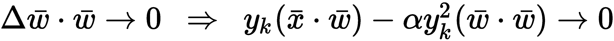

# 第六章：赫布学习和自组织映射

在本章中，我们将介绍基于心理学家唐纳德·赫布（Donald Hebb）定义的方法的赫布学习（Hebbian learning）概念。这些理论立即展示了一个非常简单的生物法则如何能够描述多个神经元在实现复杂目标时的行为，并且是连接人工智能和计算神经科学领域研究活动的开创性策略。

尤其是我们将要讨论以下主题：

+   单个神经元的赫布法则，这是一个简单但生物上合理的行性行为法则

+   一些引入的变体，用以克服一些稳定性问题

+   赫布神经元最终得到的结果，它包括计算输入数据集的第一个主成分

+   两种神经网络模型（Sanger 网络和 Rubner-Tavan 网络），可以提取一定数量的主成分

+   **自组织映射**（**SOMs**）的概念，重点关注 Kohonen 网络

# 赫布法则

**赫布法则**是由加拿大心理学家唐纳德·赫布（Donald Hebb）于 1949 年提出的一个猜想，用以描述自然神经元的突触可塑性。在其发表几年后，这一法则通过神经生理学研究得到了证实，许多研究已经表明它在人工智能领域的许多应用中是有效的。在介绍这一法则之前，描述一下以下图中所示的通用赫布神经元是有用的：


具有向量输入的通用赫布神经元

神经元是一个简单的计算单元，它接收来自突触前单元（其他神经元或感知系统）的输入向量*x*，并输出一个单一的标量值*y*。神经元的内部结构由一个权重向量*w*表示，它模拟了每个突触的强度。对于单个多维输入，输出如下：


在这个模型中，我们假设每个输入信号都编码在向量*x*的相应分量中；因此，*x[i]*由突触权重*w[i,]*处理，依此类推。在赫布理论的原始版本中，输入向量代表神经元的放电率，总是非负的。这意味着突触权重只能加强（神经科学中这种现象的术语是**长期增强**（**LTP**））。然而，为了我们的目的，我们假设*x*是一个实值向量，就像*w*一样。这个条件允许在不失去一般性的情况下模拟更多的人工场景。

当需要处理组织在矩阵中的多个输入样本时，对单个向量的相同操作仍然适用。如果我们有*N*个 m 维输入向量，公式如下：


赫布规则的基本形式在离散形式中可以表示如下（对于单个输入）：


权重校正因此是一个与*x*具有相同方向且大小等于*|x|*乘以一个正参数*η*的向量，这个参数称为学习率，相应的输出*y*（可以是正或负）。*Δw*的方向由*y*的符号决定；因此，在假设*x*和*y*是实值的情况下，从这个规则中产生了两种不同的场景：

+   如果*x[i]* > 0 (< 0)且*y* > 0 (< 0)，*w[i]*会加强

+   如果*x[i]* > 0 (< 0)且*y* < 0 (> 0)，*w[i]*会减弱

考虑到二维向量，这个行为很容易理解：


因此，如果*w*和*x*之间的初始角度*α*小于 90°，*w*将具有与*x*相同的方向，反之亦然，如果*α*大于 90°。在下图中，有这个过程的示意图：


赫布规则的矢量分析

使用一个非常简单的 Python 代码片段可以模拟这种行为。让我们从一个场景开始，其中*α*小于 90°并且进行 50 次迭代：

```py
import numpy as np

w = np.array([1.0, 0.2])
x = np.array([0.1, 0.5])
alpha = 0.0

for i in range(50):
    y = np.dot(w, x.T)
    w += x*y
    alpha = np.arccos(np.dot(w, x.T) / (np.linalg.norm(w) * np.linalg.norm(x)))

print(w)
[  8028.48942243  40137.64711215]

print(alpha * 180.0 / np.pi)
0.00131766983584
```

如预期，最终的角*α*接近零，*w*具有与*x*相同的方向和方向。现在我们可以用*α*大于 90°重复这个实验（我们只改变*w*的值，因为过程是相同的）：

```py
w = np.array([1.0, -1.0])

...

print(w)
[-16053.97884486 -80275.89422431]

print(alpha * 180.0 / np.pi)
179.999176456
```

在这种情况下，最终的角，*α*，大约是 180°，当然，*w*相对于*x*具有相反的方向。

科学家 S. Löwel 用著名的句子表达了这一概念：

“*放电同步的神经元会连接在一起*”

我们可以通过将其（适应到机器学习场景）重新表达这个概念，即这个方法的主要假设基于这样一个想法：当突触前和突触后单元协调一致（它们的信号具有相同的符号）时，神经元之间的连接会变得越来越强。另一方面，如果它们不一致，相应的突触权重会降低。为了精确起见，如果*x*是放电率，它应该表示为实函数*x(t)*以及*y(t)*。根据原始的赫布理论，离散方程必须被微分方程所取代：


如果*x(t)*和*y(t)*具有相同的放电率，突触权重将按比例加强，与两个速率的乘积成正比。如果突触前活动*x(t)*和突触后活动*y(t)*之间存在相对较长的延迟，相应的权重会减弱。这是对“一起放电→一起连接”关系的更符合生物学的解释。

然而，即使理论有很强的神经生理学基础，也需要进行一些修改。事实上，很容易理解，所得到的系统总是不稳定的。如果反复应用两个输入（包括实值和放电率），向量 w 的范数无限增长，这对生物系统来说不是一个合理的假设。事实上，如果我们考虑一个离散迭代步长，我们就有以下方程：


之前的输出 *y[k,]* 总是乘以一个大于 *1* 的因子（除了零输入的情况），因此它无界增长。由于 *y = w · x*，这个条件意味着在每个迭代中 *w* 的大小增加（如果 *x* 的大小为零，则保持不变）（一个更严格的证明可以通过考虑原始微分方程轻松获得）。

这种情况不仅在生物学上不可接受，而且在机器学习问题中，为了防止迭代几次后出现数值溢出，也必须对其进行适当的管理。在下一段中，我们将讨论一些克服这一问题的常用方法。目前，我们可以继续分析，而不引入校正因子。

让我们现在考虑一个数据集，*X*：


我们可以将该规则迭代应用于所有元素，但平均输入样本（现在索引指的是整个特定向量，而不是单个分量）的权重修改更容易（也更有用）：


在前面的公式中，*C* 是输入相关矩阵：


然而，对于我们来说，考虑一个基于输入向量阈值 *θ* 的略有不同的赫布规则是有用的（也有一个生物学理由可以证明这一选择，但超出了本书的范围；感兴趣的读者可以在 *Theoretical Neuroscience*，*Dayan P.*，*Abbott F. L.*，*The MIT Press* 中找到它）。

很容易理解，在原始理论中，*x(t)* 和 *y(t)* 是放电率，这种修改允许一个与 LTP 相反的现象，称为**长期抑制**（**LTD**）。事实上，当 *x(t) < **θ* 且 *y(t)* 为正时，乘积 *(x(t) - **θ**)y(t)* 为负，突触权重减弱。

如果我们设 *θ = 〈x〉 ≈ E[X]*，我们可以推导出一个与之前非常相似的表达式，但基于输入协方差矩阵（通过贝塞尔校正无偏）：


由于明显的原因，这种原始赫布规则的变体被称为**协方差规则**。

也可以使用**最大似然估计**（**MLE**）（或带偏置）的协方差矩阵（除以 *N*），但重要的是要检查所使用的数学包采用了哪个版本。当使用 NumPy 时，可以通过设置 `np.cov()` 函数的 `bias=True/False` 参数来决定版本（默认值为 `False`）。然而，当 *N >> 1* 时，版本之间的差异减小，通常可以忽略不计。在这本书中，我们将使用无偏版本。想要了解贝塞尔校正更多细节的读者可以阅读 *《应用统计学》*，*Warner R.*，*SAGE Publications*。

# 协方差规则分析

协方差矩阵 *Σ* 是实对称的。如果我们应用特征分解，我们得到（对我们来说，保留 *V^(-1)* 而不是简化的版本 *V^T* 更有用）：


*V* 是一个正交矩阵（由于 *Σ* 是对称的），包含 *Σ* 的特征向量（作为列），而 *Ω* 是一个对角矩阵，包含特征值。假设我们将特征值（*λ[1]*，*λ[2]*，...，*λ[m]*) 和相应的特征向量（*v[1]*，*v[2]*，...，*v[m]*) 排序，使得：


此外，假设 *λ*[*1* ]在所有其他特征值中占主导地位（只要 *λ[1] > λ[i]*，其中 *i ≠ 1* 就足够了）。由于特征向量是正交的，它们构成一个基，可以表示向量 w 为特征向量的线性组合：


向量 *u* 包含了在新基中的坐标。现在让我们考虑对协方差规则的修改：


如果我们迭代地应用这个规则，我们得到一个矩阵多项式：


利用二项式定理并考虑 *Σ**⁰=I*，我们可以得到 *w^((k))* 作为 *w^((0))* 的函数的一般表达式：


现在让我们使用基变换重写前面的公式：


向量 *u^((0))* 包含了 *w^((0))* 在新基中的坐标；因此，*w^((k))* 可以表示为一个多项式，其中通项与 *VΩ^iu^((0))* 成正比。

现在让我们考虑对角矩阵 *Ω^k*：


最后一步来源于假设 *λ*[*1*] 大于任何其他特征值，并且当 *k → ∞* 时，所有 *λ[i≠1]^k<< λ[1]^k*。当然，如果 *λ[i][≠1] > 1，λ[i≠1]*^(*k* )也会增长，但是当 *k → ∞* 时，*λ[1]^(k )*对 *w^((k))* 的贡献变得显著减弱。为了理解这个近似的有效性，让我们考虑以下情况，其中 *λ[1]* 略大于 *λ[2]*：


结果显示了一个非常重要的性质：不仅近似是正确的，而且正如我们将要展示的，如果一个特征值 *λ[i]* 大于所有其他特征值，协方差规则将始终收敛到相应的特征向量 *v[i]*。不存在其他稳定的固定点！

当 *λ[1] = λ[2] = ... = λ[n]* 时，这个假设就不再有效。在这种情况下，总方差由每个特征向量的方向等量解释（这是一个在现实场景中不常见的对称性条件）。这种情况也可能在处理有限精度算术时发生，但一般来说，如果最大特征值与第二个特征值之间的差异小于可达到的最大精度（例如，32 位浮点数），接受相等性是合理的。

当然，我们假设数据集没有被白化，因为我们的目标（也在下一段中）是只考虑具有最高总变异性的子集成分来减少原始维度（与主成分分析（PCA）一样，去相关必须是算法的结果，而不是先决条件）。另一方面，对数据集进行零中心化可能是有用的，尽管对于这类算法来说并非真正必要。

如果我们考虑这个近似重新写 *w[k]* 的表达式，我们得到以下结果：


由于 *a[1]v + a[2]v + ... + a[k]v ∝ v*，这个结果表明，当 *k → ∞* 时，*w[k]* 将与协方差矩阵 *Σ* 的第一个特征向量成正比（如果 *u[1]^((0))* 不为零），其大小在没有归一化的情况下将无限增长。由于其他特征值引起的虚假效应在有限次迭代后变得可以忽略（尤其是如果 *w* 除以其范数，使得长度始终为 *||w|| = 1*）。

然而，在得出结论之前，必须添加一个重要条件：


事实上，如果 *w(0)* 与 *v1* 正交，我们将得到（特征向量彼此正交）：


这个重要结果展示了如何使用协方差规则工作的赫布神经元能够执行仅限于第一个成分的 PCA，而无需对 *Σ* 进行特征分解。实际上，向量 *w*（我们不考虑大小增加的问题，这可以很容易地处理）将迅速收敛到输入数据集 *X* 变异性最高的方向。在第五章“EM 算法及其应用”中，我们讨论了 PCA 的细节；在下一段中，我们将讨论使用赫布规则的变体来找到前 N 个主成分的几种方法。

# 协方差规则应用示例

在继续之前，让我们用一个简单的 Python 示例来模拟这种行为。我们首先生成`1000`个从双变量高斯分布中采样的值（方差是有意不对称的），然后应用协方差规则来找到第一个主成分（*w*^(*(0)* ）已被选择，以便不与*v[1]*正交）：

```py
import numpy as np

rs = np.random.RandomState(1000)
X = rs.normal(loc=1.0, scale=(20.0, 1.0), size=(1000, 2))

w = np.array([30.0, 3.0])

S = np.cov(X.T)

for i in range(10):
    w += np.dot(S, w)
    w /= np.linalg.norm(w)

w *= 50.0

print(np.round(w, 1))
[ 50\.  -0.]
```

算法很简单，但有几个元素我们需要评论。第一个是每次迭代结束时向量 *w* 的归一化。这是避免 *w* 无控制增长所需的技术之一。第二个“棘手”的元素是最后的乘法，*w • 50*。因为我们乘以一个正标量，所以 *w* 的方向不受影响，但在完整的图中更容易展示向量。

结果在以下图中展示：


协方差规则的应用。w[∞]成为第一个主成分的比例

经过有限次数的迭代后，*w[∞]* 具有与主特征向量相同的方向，在这种情况下，与 *x* 轴平行。方向取决于初始值 *w[0]*；然而，在主成分分析（PCA）中，这不是一个重要的元素。

# 权重向量稳定化和 Oja 规则

稳定权重向量的最简单方法是每次更新后对其进行归一化。这样，其长度将始终保持等于一。实际上，在这种类型的神经网络中，我们感兴趣的并不是大小，而是方向（归一化后保持不变）。然而，有两个主要原因使得这种方法不太可行：

+   它是非局部的。为了归一化向量 *w*，我们需要知道其所有值，这在生物学上是不可能的。一个真实的突触权重模型应该是自我限制的，不需要访问外部信息，而这些信息可能无法获得。

+   标准化必须在应用校正之后进行，因此需要双重迭代步骤。

在许多机器学习场景中，这些条件并不是限制性的，它们可以被自由采用，但当需要与神经科学模型一起工作时，最好寻找其他解决方案。在离散形式中，我们需要为标准的赫布规则确定一个校正项：


*f* 函数可以作为局部和非局部归一化器。第一种类型的一个例子是**Oja 规则**：


*α* 参数是一个控制归一化强度的正数。可以通过考虑以下条件获得该规则稳定性的非严格证明：



第二个表达式意味着：


因此，当*t → ∞*时，权重校正的幅度接近于零，权重向量*w*的长度将趋近于一个有限极限值：


# Sanger 网络

**Sanger 网络**是由 T. D. Sanger 在《单层线性前馈神经网络中的最优无监督学习》一文中提出的在线**主成分**提取的神经网络模型，发表于*Neural Networks*，1989 年第 2 期。作者从 Hebb 规则的标准版本开始，修改它以能够按降序提取可变数量的主成分（v[1]，v[2]，...，v[m]）（λ[1] > λ[2] > ... > λ[m]）。这种结果方法，作为 Oja 规则的自然扩展，被称为**广义 Hebbian 规则**（**GHA**）（或学习）。网络的结构在以下图中表示：


网络使用从 n 维数据集中提取的样本进行喂养：


*m*个输出神经元通过权重矩阵*W = {w[ij]}*与输入连接，其中第一个索引指的是输入分量（突触单元），第二个索引指的是神经元。网络的输出可以通过标量积轻松计算；然而，在这种情况下，我们对此不感兴趣，因为就像协方差（和 Oja）规则一样，主成分是通过权重更新提取的。

Oja 规则提出后出现的问题涉及多个成分的提取。实际上，如果我们将原始规则应用于前面的网络，所有权重向量（*w*的行）都会收敛到第一个主成分。克服这种限制的主要思想（基于**Gram-Schmidt**正交化方法）基于以下观察：一旦我们提取了第一个成分*w[1]*，第二个成分*w[2]*就可以被强制与*w[1]*正交，第三个成分*w[3]*可以被强制与*w[1]*和*w[2]*正交，依此类推。考虑以下表示：


两个权重向量的正交化

在这种情况下，我们假设*w[1]*是稳定的，*w[2][0]*是另一个权重向量，它正在收敛到*w[1]*。w[20]在*w[1]*上的投影如下：


在前面的公式中，如果我们不需要归一化，可以省略范数（在网络中，这个过程是在完成完整的权重更新后进行的）。*w[20]*的正交分量可以通过差分简单地获得：


将此方法应用于原始的 Oja 规则，我们得到权重更新的新表达式（称为 Sanger 规则）：


该规则指的是单个输入向量 *x*，因此 *x[j]* 是 *x* 的 *j^(th)* 个分量。第一项是经典的赫布规则，它迫使权重 *w* 与第一个主成分平行，而第二项则以一种类似于格拉姆-施密特正交化的方式起作用，通过减去与先前突触后单元连接的所有权重在 *w* 上的投影成比例的项，同时考虑由奥贾规则提供的归一化约束（该约束与输出的平方成正比）。

事实上，展开最后一个项，我们得到以下结果：


从每个分量 *w[ij]* 中减去的项与所有分量成比例，其中索引 *j* 固定，第一个索引等于 *1, 2, ..., i*。此过程不会立即产生正交化，但需要多次迭代才能收敛。证明是非平凡的，涉及凸优化和动态系统方法，但可以在上述论文中找到。Sanger 表明，如果 `学习率` *η(t)* 单调递减并随着 *t → ∞* 趋向于零，则算法始终收敛到排序后的前 *n* 个主成分（从最大的特征值到最小的特征值）。即使对于形式证明是必要的，这个条件也可以放宽（通常稳定的 *η < 1* 足够）。在我们的实现中，矩阵 *W* 在每次迭代后都会进行归一化，因此，在过程结束时，*W^T*（权重在行中）是正交归一的，并构成特征向量子空间的一个基。

以矩阵形式，该规则如下：


Tril(•) 是一个矩阵函数，将它的参数转换为一个下三角矩阵，而项 *yy^T* 等于 *Wxx^TW*。

Sanger 网络的算法如下：

1.  使用随机值初始化 *W^((0))*。如果输入维度是 *n* 且必须提取 *m* 个主成分，则形状将为 *(m × n)*。

1.  设置一个 `学习率` *η*（例如，`0.01`）。

1.  设置一个 `阈值` *Thr*（例如，`0.001`）。

1.  设置一个计数器 *T = 0*。

1.  当 *||W^((t)) - W^((t-1))||[F] > Thr* 时：

    1.  设置 *ΔW = 0*（与 *W* 相同的形状）

    1.  对于 *X* 中的每个 *x*：

        1.  设置 *T = T + 1*

        1.  计算 *y = W^((t))x*

        1.  计算并累积 *ΔW += η(yx^T - Tril(yy^T)W^((t))*

    1.  更新 *W^((t+1)) = W^((t)) + (η / T)ΔW*

    1.  设置 *W^((t+1)) = W^((t+1))** / ||W^((t+1))||^((rows))*（必须按行计算范数）

该算法也可以迭代固定次数（如我们的示例所示），或者可以将两种停止方法一起使用。

# Sanger 网络的示例

在这个 Python 示例中，我们考虑一个二维零中心的样本集 `X`，包含 500 个样本（我们使用第一章中定义的函数）。在初始化 `X` 之后，我们还计算特征分解，以便能够双重检查结果：

```py
import numpy as np

from sklearn.datasets import make_blobs

X, _ = make_blobs(n_samples=500, centers=2, cluster_std=5.0, random_state=1000)
Xs = zero_center(X)

Q = np.cov(Xs.T)
eigu, eigv = np.linalg.eig(Q)

print(eigu)
[ 24.5106037   48.99234467]

print(eigv)
[[-0.75750566 -0.6528286 ]
 [ 0.6528286  -0.75750566]]

n_components = 2

W_sanger = np.random.normal(scale=0.5, size=(n_components, Xs.shape[1]))
W_sanger /= np.linalg.norm(W_sanger, axis=1).reshape((n_components, 1))
```

特征值是逆序的；因此，我们预计最终的 *W* 将有行被交换。以下图表显示了初始条件（权重乘以 15）：


具有初始条件 *W* 的数据集，我们可以实现该算法。为了简化，我们更喜欢使用固定的迭代次数（`5000`）和 `learning_rate` 为 *η=0.01*。读者可以修改代码片段，以便在权重矩阵变得稳定时停止：

```py
learning_rate = 0.01
nb_iterations = 5000
t = 0.0

for i in range(nb_iterations):
    dw = np.zeros((n_components, Xs.shape[1]))
    t += 1.0

    for j in range(Xs.shape[0]):
        Ysj = np.dot(W_sanger, Xs[j]).reshape((n_components, 1))
        QYd = np.tril(np.dot(Ysj, Ysj.T))
        dw += np.dot(Ysj, Xs[j].reshape((1, X.shape[1]))) - np.dot(QYd, W_sanger)

    W_sanger += (learning_rate / t) * dw
    W_sanger /= np.linalg.norm(W_sanger, axis=1).reshape((n_components, 1))
```

首先要检查的是 *W* 的最终状态（我们转置了矩阵以便比较列）：

```py
print(W_sanger.T)
[[-0.6528286  -0.75750566]
 [-0.75750566  0.6528286 ]]
```

如预期，*W* 已经收敛到输入相关矩阵的特征向量（与 *w—* 相关的符号 `*–*` 并不重要，因为我们只关心方向）。第二个特征值是最高的，因此列被交换。重新绘制图表，我们得到以下结果：


最终状态，w 已经收敛到两个主成分

这两个成分是完美正交的（最终的取向可以根据初始条件或随机状态而改变），*w[0]* 指向第一个主成分的方向，而 *w[1]* 指向第二个成分的方向。考虑到这个良好的性质，我们不需要检查特征值的幅度；因此，这个算法可以在不分解输入协方差矩阵的情况下运行。即使需要正式的证明来解释这种行为，也可以直观地理解它。每个神经元都会收敛到给定的完整特征向量子空间中的第一个主成分。这个性质始终得到保持，但在正交化之后，子空间隐式地减少了一个维度。第二个神经元将始终收敛到第一个成分，现在它对应于全局第二个成分，依此类推。

这个算法（以及下一个算法）的一个优点是，标准的 PCA 通常是一个批量过程（即使有批量算法），而 Sanger 的网络是一个在线算法，可以逐步训练。一般来说，Sanger 的网络的时间性能比直接方法差，因为迭代（可以通过更多的矢量化或 GPU 支持实现一些优化）。另一方面，当成分的数量小于输入维度时，Sanger 的网络可以节省内存（例如，对于 *n=1000* 的协方差矩阵有 *10⁶* 个元素，如果 *m = 100*，则权重矩阵有 *10⁴* 个元素）。

# Rubner-Tavan 的网络

在第五章，“EM 算法及其应用”中，我们提到任何去相关输入协方差矩阵的算法都在执行 PCA 而不进行降维。从这个方法出发，Rubner 和 Tavan（在论文“A Self-Organizing Network for Principal-Components Analysis”中，Rubner J.，Tavan P.，Europhysics. Letters，10(7)，1989）提出了一种神经网络模型，其目标是去相关输出分量，以强制输出协方差矩阵（在低维子空间）的后续去相关。假设数据集零中心化且*E[y] = 0*，*m*个主成分的输出协方差矩阵如下：


因此，可以实现近似的去相关，迫使*i ≠ j*的*y[i]y[j]*项接近于零。与标准方法（如白化或 vanilla PCA）的主要区别在于，此过程是局部的，而所有标准方法都是全局的，直接与协方差矩阵操作。作者提出的神经网络模型如下所示（原始模型是为二进制单元提出的，但它对线性单元也相当有效）：


Rubner-Tavan 网络。连接 v[jk]基于反 Hebbian 规则

该网络有*m*个输出单元，最后*m-1*个神经元有一个求和节点，该节点接收前一个单元的加权输出（分层横向连接）。其动态过程很简单：第一个输出不被修改。第二个输出被迫与第一个输出去相关。第三个输出被迫与第一个和第二个输出都去相关，依此类推。由于输入是一个接一个地呈现的，并且出现在相关/协方差矩阵中的累积项（总是更容易将数据集零中心化并使用相关矩阵）必须隐式地分成其加数，因此必须迭代多次。不难理解，收敛到唯一的稳定固定点（作者已经证明其存在）需要一些迭代来纠正错误的输出估计。

网络的输出由两个贡献组成：


符号*y/x^((i))*表示*y/x*的第*i*个元素。第一个项仅基于输入产生部分输出，而第二个项使用分层横向连接来纠正值并强制去相关。内部权重*w[ij]*使用 Oja 规则的标准版本进行更新（这主要是每个权重向量收敛到第一个主成分的原因）：


相反，外部权重*v[jk]*使用反 Hebbian 规则进行更新：


前一个公式可以分为两部分：第一项 *-ηy[j]y[k]* 与标准版的赫布规则（这就是为什么它被称为反赫布）方向相反，并强制去相关。第二项 *-ηy[j]y[k]v[jk]* 起到正则化作用，类似于奥贾规则。项 *-ηy[j]y[k]* 作为奥贾规则的反馈信号，根据实际输出的新幅度重新调整更新。实际上，在修改侧向连接后，输出也被迫改变，这种修改会影响 *w[ij]* 的更新。当所有输出都去相关后，向量 *w[i]* 隐含地必须正交。可以想象一个与格拉姆-施密特正交化的类比，即使在这种情况下，不同分量的提取与去相关的关联更为复杂。就像桑格网络一样，该模型按降序提取前 *m* 个主成分（原因与之前直观解释的相同），但对于一个完整的（非平凡）数学证明，请参阅上述论文。

如果输入维度为 *n* 且分量数等于 *m*，则可以使用所有对角元素设置为 *0* 的下三角矩阵 *V (m × m)* 和标准矩阵 *W (n × m)*。

*W* 的结构如下：


因此， *w[i]* 是一个必须收敛到相应特征向量的列向量。*V* 的结构如下：


使用这种表示法，输出结果如下：


由于输出基于循环侧向连接，其值必须通过迭代前一个公式固定次数或直到连续两个值之间的范数小于预定义的阈值来稳定。在我们的例子中，我们使用固定次数等于五的迭代。更新规则不能直接用矩阵表示法写出，但可以使用向量 *w**i*  和 *v**j* ：


在这种情况下， *y^((i))* 表示 *y* 的 *i^(th)* 个分量。这两个矩阵必须通过循环来填充。

完整的 Rubner-Tavan 网络算法如下（*x* 的维度为 *n*，分量数用 *m* 表示）：

1.  随机初始化  *W^((0))*。其形状为 *(n × m)*。

1.  随机初始化 *V^((0))*。其形状为 *(m × m)*。

1.  设置 *V^((0))= Tril(V^((0)))*。*Tril(•)* 将输入参数转换为下三角矩阵。

1.  将 *V^((0))* 的所有对角元素设置为 *0*。

1.  设置 `学习率` *η*（例如，`0.001`）。

1.  设置一个 `阈值` *Thr*（例如，`0.0001`）。

1.  设置周期计数器 *T=0*。

1.  设置最大迭代次数 `max_iterations`（例如，1000）。

1.  设置一个 `稳定周期数` *stabilization_cycles*（例如，`5`）：

    1.  当 *||W^((t)) - W^((t-1))||[F] > Thr* 且 T < `max_iterations` 时：

        1.  将 *T = T + 1* 设置。

        1.  对于 *X* 中的每个 *x*：

            1.  将 *y[prev]* 设置为零。形状为 (*m, 1*)。

            1.  对于 *i=1* 到 `stabilization_cycles`：

                1.  *y = W^Tx + Vy[prev]*。

                1.  *y[prev] = y*。

            1.  计算 *W* 和 *V* 的更新：

                1.  创建两个空矩阵 *ΔW (n × m)* 和 *ΔV (m × m)*

                1.  对于 *t=1* 到 *m*：

                    1.  *Δw[t] = ηy^((t))(x - y^((t))w[t])*。

                    1.  *Δv[t] = -ηy^((t))(y + y^((t))v[t])*。

                1.  更新 *W* 和 *V*：

                    1.  *W^((t+1)) = W^((t)) + ΔW*。

                    1.  *V^((t+1)) = V^((t)) + ΔV*。

                1.  将 *V = Tril(V)* 并将所有对角线元素设置为 *0*。

                1.  将 *W^((t+1)) = W^((t+1))** / ||W^((t+1))||^((columns))*（规范必须按列计算）

在这种情况下，我们采用了阈值和最大迭代次数，因为该算法通常收敛得非常快。此外，我建议读者在执行点积时始终检查向量和矩阵的形状。

在本例中，以及所有其他例子中，NumPy 随机种子被设置为 `1000` (`np.random.seed(1000)`)。使用不同的值（或重复更多次实验而不重置种子）可能会导致略微不同的结果（这些结果总是连贯的）。

# Rubner-Tavan 网络的示例

对于我们的 Python 示例，我们将使用为 Sanger 的网络已创建的相同数据集（预计将在变量 `Xs` 中可用）。因此，我们可以开始设置所有常数和变量：

```py
import numpy as np

n_components = 2
learning_rate = 0.0001
max_iterations = 1000
stabilization_cycles = 5
threshold = 0.00001

W = np.random.normal(0.0, 0.5, size=(Xs.shape[1], n_components))
V = np.tril(np.random.normal(0.0, 0.01, size=(n_components, n_components)))
np.fill_diagonal(V, 0.0)

prev_W = np.zeros((Xs.shape[1], n_components))
t = 0
```

在这一点上，可以实施训练循环：

```py
while(np.linalg.norm(W - prev_W, ord='fro') > threshold and t < max_iterations):
    prev_W = W.copy()
    t += 1

    for i in range(Xs.shape[0]):
        y_p = np.zeros((n_components, 1))
        xi = np.expand_dims(Xs[i], 1)
        y = None

        for _ in range(stabilization_cycles):
            y = np.dot(W.T, xi) + np.dot(V, y_p)
            y_p = y.copy()

        dW = np.zeros((Xs.shape[1], n_components))
        dV = np.zeros((n_components, n_components))

        for t in range(n_components):
            y2 = np.power(y[t], 2)
            dW[:, t] = np.squeeze((y[t] * xi) + (y2 * np.expand_dims(W[:, t], 1)))
            dV[t, :] = -np.squeeze((y[t] * y) + (y2 * np.expand_dims(V[t, :], 1)))

        W += (learning_rate * dW)
        V += (learning_rate * dV)

        V = np.tril(V)
        np.fill_diagonal(V, 0.0)

        W /= np.linalg.norm(W, axis=0).reshape((1, n_components))
```

最终的 `W` 和输出协方差矩阵如下：

```py
print(W)
[[-0.65992841  0.75897537]
 [-0.75132849 -0.65111933]]

Y_comp = np.zeros((Xs.shape[0], n_components))

for i in range(Xs.shape[0]):
        y_p = np.zeros((n_components, 1))
        xi = np.expand_dims(Xs[i], 1)

        for _ in range(stabilization_cycles):
            Y_comp[i] = np.squeeze(np.dot(W.T, xi) + np.dot(V.T, y_p))
            y_p = y.copy()

print(np.cov(Y_comp.T))
[[ 48.9901765   -0.34109965]
 [ -0.34109965  24.51072811]]
```

如预期的那样，该算法已成功收敛到特征向量（按降序排列），并且输出协方差矩阵几乎完全去相关（非对角元素的符号可以是正也可以是负）。Rubner-Tavan 的网络通常比 Sanger 的网络更快，这得益于由反 Hebbian 规则产生的反馈信号；然而，选择正确的学习率值非常重要。一种可能的策略是从不超过 `0.0001` 的值开始实现时间衰减（如 Sanger 的网络中所做的那样）。然而，当 *n* 增加时（例如，*η = 0.0001 / n*），重要的是要减少 *η*，因为 Oja 规则在侧向连接 *v[jk]* 上的归一化强度通常不足以避免当 *n >> 1* 时的溢出和下溢。我不建议对 *V*（必须仔细分析，因为 *V* 是奇异的）进行任何额外的归一化，因为这可能会减慢过程并降低最终精度。

# 自组织映射

**自组织映射（SOMs）**是由威尔肖和冯·德·马尔堡（Willshaw D. J., Von Der Malsburg C., How patterned neural connections can be set up by self-organization, Proceedings of the Royal Society of London, B/194, N. 1117*）提出的，用于模拟动物中观察到的不同神经生物学现象。特别是，他们发现大脑的一些区域发展出具有不同区域的结构，每个区域对特定输入模式都有高度敏感性。这种行为的背后过程与我们迄今为止讨论的内容截然不同，因为它基于被称为**胜者全得**原则的神经单元之间的竞争。在训练期间，所有单元都受到相同信号的刺激，但只有一个会产生最高的响应。这个单元将自动成为该特定模式的感受野。我们将要介绍的特定模型是由**科霍恩**（在论文*Kohonen T., Self-organized formation of topologically correct feature maps, Biological Cybernetics, 43/1*）提出的，并以他的名字命名。

主要思想是实现一个逐渐的胜者全得范式，以避免神经元（作为最终胜者）过早收敛，并增加网络的塑性水平。这个概念在以下图表中得到了图形化表达（我们考虑的是神经元的一个线性序列）：


科霍恩网络实现的墨西哥帽动态

在这种情况下，相同的模式被呈现给所有神经元。在训练过程的开始（**t=0**），观察到**x[i-2]**到**x[i+2]**之间的正响应，在**x[i]**处达到峰值。显然，潜在的胜者是**x[i]**，但所有这些单元都会根据它们与**x[i]**的距离被增强。换句话说，这个网络（按顺序训练）仍然对变化保持敏感，如果其他模式产生更强的激活。如果相反**x[i]**继续是胜者，半径会略微减小，直到只有增强的单元将是**x[i]**。考虑到这个函数的形状，这种动态通常被称为*墨西哥帽*。通过这种方法，网络保持可塑性，直到所有模式都被反复呈现。例如，如果另一个模式在**x[i]**处引起更强的响应，那么它的激活仍然不要太高，以便网络能够快速重新配置。同时，新的胜者很可能是**x[i]**的邻居，它已经接受了部分增强，可以轻易地取代**x[i]**。

**Kohonen SOM**（也称为 Kohonen 网络或简称 Kohonen 图）通常表示为二维图（例如，一个*m × m*的方阵，或任何其他矩形形状），但三维表面，如球体或环面也是可能的（唯一必要的条件是存在一个合适的度量）。在我们的案例中，我们总是指一个方阵，其中每个细胞是一个具有输入模式维度的突触权重*w*的接收神经元：


在训练和工作阶段，获胜单元是根据样本与每个权重向量之间的相似度来确定的。最常用的度量是欧几里得；因此，如果我们考虑一个形状为*(k × p)*的二维图*W*，使得*W ∈ ℜ^(k × p × n)*，那么获胜单元（就其坐标而言）的计算如下：


如前所述，避免过早收敛是很重要的，因为完整的最终配置可能与初始配置大不相同。因此，训练过程通常分为两个不同的阶段。在第一个阶段，其持续时间通常是总迭代次数的 10-20%（让我们称这个值为*t[max]*），对获胜单元及其邻居（通过采用衰减半径来计算）进行校正。相反，在第二个阶段，半径设置为 1.0，校正仅应用于获胜单元。这样，就有可能分析更多的可能配置，自动选择与最小误差相关的一个。邻域可以有不同的形状；它可以方形（在封闭的 3D 图中，边界不再存在），或者，更简单的是，可以采用基于指数衰减距离加权的径向基函数：


每个神经元的相对权重由*σ(t)*决定。*σ[0]*函数是初始半径，*τ*是一个时间常数，必须将其视为超参数，它决定了衰减权重的斜率。合适的值是总迭代次数的 5-10%。采用径向基函数，不需要计算实际的邻域，因为乘数*n(i, j)*在边界之外接近于零。一个缺点是与计算成本相关，它比方形邻域高（因为必须为整个图计算函数）；然而，可以通过预计算所有平方距离（分子）并利用 NumPy（如 NumPy）提供的矢量化功能来加速这个过程：

更新规则非常简单，它基于将获胜单元的突触权重移动到模式*x[i,]*（在整个数据集*X*上重复）这一想法：


*η(t)* 函数是学习率，可以是固定的，但最好是开始时使用一个较高的值，*η[0]*，然后让它衰减到目标最终值，*η[∞]*：


这样，初始变化迫使权重与输入模式对齐，而所有后续更新允许轻微的修改以改进整体准确性。因此，每次更新都与学习率、邻域加权距离以及每个模式与突触向量之间的差异成比例。理论上，如果获胜单元的 *Δw[ij]* 等于 0.0，这意味着一个神经元已经成为了特定输入模式的吸引子，其邻居将对接收到的噪声/修改版本敏感。最有趣的是，完整的最终图将包含所有模式的吸引子，这些吸引子被组织起来以最大化相邻单元之间的相似性。这样，当呈现新的模式时，映射最相似形状的神经元区域将显示出更高的响应。例如，如果模式由手写数字组成，数字 1 和数字 7 的吸引子将比数字 8 的吸引子更接近。一个形状不规则的 1（可能被解释为 7）将引发介于前两个吸引子之间的响应，使我们能够根据距离分配相对概率。正如我们将在示例中看到的那样，这个特性使得同一模式类别的不同变体之间有一个平滑的过渡，避免了强制二元决策的刚性边界（如在 K-means 聚类或硬分类器中）。

完整的 Kohonen SOM 算法如下：

1.  随机初始化 *W^((0)*）。其形状是 *(k × p × n)*。

1.  初始化 `nb_iterations`（总迭代次数）和 *t[max]*（例如，`nb_iterations` = 1000 和 t[max] = 150）。

1.  初始化 *τ*（例如，*τ* = 100）。

1.  初始化 *η[0]* 和 *η[∞]*（例如，*η*[*0*] = 1.0 和 *η*[*∞*] = 0.05）。

1.  对于 `t = 0` 到 `nb_iterations`：

    1.  如果 *t < t[max]*：

        1.  计算 *η(t)*

        1.  计算 *σ(t)*

    1.  否则：

        1.  设置 *η(t) = η[∞]*

        1.  设置 *σ(t) = σ[∞]*

    1.  对于 *X* 中的每个 *x[i]*：

        1.  计算获胜单元 *u^*（假设坐标是 *i*，*j*）

        1.  计算 *n(i, j)*

        1.  将权重校正 *Δw[ij]^((t)*）应用于所有突触权重 *W^((t)*）。

    1.  重新归一化 *W^((t)*）= W^((t)*） / ||W^((t)*）||^((columns)*）（规范必须按列计算）

# SOM 示例

我们现在可以使用 Olivetti 人脸数据集实现一个 SOM。由于这个过程可能非常长，在这个例子中我们限制输入模式的数量为 100（使用 5 × 5 矩阵）。读者可以尝试使用整个数据集和更大的地图。

第一步是加载数据，对其进行归一化，使得所有值都在 0.0 和 1.0 之间，并设置常数：

```py
import numpy as np

from sklearn.datasets import fetch_olivetti_faces

faces = fetch_olivetti_faces(shuffle=True)

Xcomplete = faces['data'].astype(np.float64) / np.max(faces['data'])
np.random.shuffle(Xcomplete)

nb_iterations = 5000
nb_startup_iterations = 500
pattern_length = 64 * 64
pattern_width = pattern_height = 64
eta0 = 1.0
sigma0 = 3.0
tau = 100.0

X = Xcomplete[0:100]
matrix_side = 5
```

在这一点上，我们可以使用具有小标准差的正态分布来初始化权重矩阵：

```py
W = np.random.normal(0, 0.1, size=(matrix_side, matrix_side, pattern_length))
```

现在，我们需要定义函数来确定基于最小距离的获胜单元：

```py
def winning_unit(xt):
    distances = np.linalg.norm(W - xt, ord=2, axis=2)
    max_activation_unit = np.argmax(distances)
    return int(np.floor(max_activation_unit / matrix_side)), max_activation_unit % matrix_side
```

定义函数 *η(t)* 和 *σ(t)* 也是有用的：

```py
def eta(t):
    return eta0 * np.exp(-float(t) / tau)

def sigma(t):
    return float(sigma0) * np.exp(-float(t) / tau)
```

如前所述，与其为每个单元计算径向基函数，不如使用预先计算的包含所有可能距离的单元对的距离矩阵（在这种情况下，5 × 5 × 5 × 5）。这样，NumPy 通过其向量化功能允许更快地计算：

```py
precomputed_distances = np.zeros((matrix_side, matrix_side, matrix_side, matrix_side))

for i in range(matrix_side):
    for j in range(matrix_side):
        for k in range(matrix_side):
            for t in range(matrix_side):
                precomputed_distances[i, j, k, t] = \
                    np.power(float(i) - float(k), 2) + np.power(float(j) - float(t), 2)

def distance_matrix(xt, yt, sigmat):
    dm = precomputed_distances[xt, yt, :, :]
    de = 2.0 * np.power(sigmat, 2)
    return np.exp(-dm / de)
```

`distance_matrix` 函数返回整个映射中径向基函数的值，给定中心点（获胜单元） `xt, yt` 和 *σ* 的当前值 `sigmat`。现在，可以开始训练过程（为了避免相关性，最好在每个迭代的开始时对输入序列进行洗牌）：

```py
sequence = np.arange(0, X.shape[0])
t = 0

for e in range(nb_iterations):
    np.random.shuffle(sequence)
    t += 1

    if e < nb_startup_iterations:
        etat = eta(t)
        sigmat = sigma(t)
    else:
        etat = 0.2
        sigmat = 1.0

    for n in sequence:
        x_sample = X[n]

        xw, yw = winning_unit(x_sample)
        dm = distance_matrix(xw, yw, sigmat)

        dW = etat * np.expand_dims(dm, axis=2) * (x_sample - W)
        W += dW

    W /= np.linalg.norm(W, axis=2).reshape((matrix_side, matrix_side, 1))
```

在这种情况下，我们将 *η*[*∞*] 设置为 `0.2`，但我邀请读者尝试不同的值并评估最终结果。经过 `5000` 个周期的训练后，我们得到了以下权重矩阵（每个权重都绘制为二维数组）：


如所见，权重已经收敛到具有略微不同特征的脸上。特别是，观察脸的形状和表情，很容易注意到不同吸引子之间的过渡（有些脸在笑，而有些则更严肃；有些人戴眼镜，有胡须和胡须，等等）。还重要的是要考虑矩阵的容量大于最小容量（数据集中有十个不同的个体）。这允许映射更多不能轻易被正确神经元吸引的图案。例如，一个人可以有带胡须和不带胡须的照片，这可能会导致混淆。如果矩阵太小，可能会观察到收敛过程中的不稳定性，而如果太大，则很容易看到冗余。正确的选择取决于每个不同的数据集以及内部方差，而且无法定义一个标准标准。一个好的起点是选择一个容量是所需吸引子数量的 2.0 到 3.0 倍以上的矩阵，然后增加或减少其大小，直到准确性达到最大。最后要考虑的是标记阶段。在训练过程的最后，我们对获胜神经元的权重分布一无所知，因此有必要处理数据集并为每个模式标记获胜单元。这样，就可以提交新的模式以获得最可能的标签。这个过程尚未展示，但它很简单，读者可以轻松地为每种不同场景实现它。

# 摘要

在本章中，我们讨论了赫布规则，展示了它是如何驱动输入数据集的第一主成分的计算的。我们还看到，这个规则是不稳定的，因为它会导致突触权重的无限增长，以及如何通过归一化或奥贾规则来解决这个问题。

我们介绍了两种基于赫布学习（桑格的和鲁布纳-塔万网络）的不同神经网络，它们的内部动力学略有不同，能够按正确顺序（从最大的特征值开始）提取前*n*个主成分，而无需对输入协方差矩阵进行特征值分解。

最后，我们介绍了 SOM 的概念，并介绍了一个称为 kohonen 网络的模型，该模型能够通过竞争学习过程将输入模式映射到一个表面上，在该表面上放置了一些吸引子（每个类别一个）。这样的模型能够通过在吸引子中引发与模式最相似的强烈反应来识别新的模式（属于同一分布）。通过这种方式，在标记过程之后，该模型可以作为软分类器使用，可以轻松地处理噪声或改变的模式。

在下一章中，我们将讨论一些重要的聚类算法，重点关注硬聚类和软聚类之间的差异（已在上一章中讨论），并讨论评估算法性能的主要技术。
