# 第十四章：强化学习简介

在本章中，我们将介绍**强化学习**（**RL**）的基本概念，它是一组允许智能体学习如何在未知环境中行为的途径，这得益于在每个可能行动之后提供的奖励。强化学习已经研究了数十年，但在最近几年，它达到了一个非常成熟的水平，因为现在可以结合深度学习模型和标准（通常是简单）算法来解决极其复杂的问题（例如完美学习如何玩 Atari 游戏）。 

尤其是以下内容：

+   环境、智能体、策略和奖励的概念

+   **马尔可夫决策过程**（**MDP**）的概念

+   策略迭代算法

+   价值迭代算法

+   TD(0)算法

# 强化学习基础

想象一下，你想要学习骑自行车，并向朋友寻求建议。他们解释了齿轮的工作原理，如何释放刹车以及一些其他技术细节。最后，你询问保持平衡的秘诀。你期待什么样的回答？在一个假想的监督世界中，你应该能够完美量化你的行动，并通过将结果与精确的参考值进行比较来纠正错误。在现实世界中，你对行动背后的数量一无所知，更重要的是，你永远不会知道正确的值是什么。提高抽象级别，我们考虑的场景可以描述为：一个通用的**智能体**在**环境**中执行行动，并接收某种程度与行动能力成比例的**反馈**。

根据这个**反馈**，**智能体**可以纠正其行动以达到特定的目标。这个基本架构在以下图中表示：

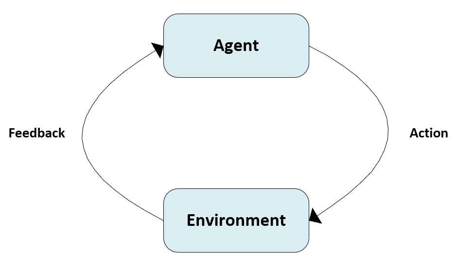

基本强化学习架构

回到我们最初的例子，当你第一次骑自行车并试图保持平衡时，你会注意到错误动作会导致斜率的增加，这反过来又增加了重力力的水平分量，推动自行车向侧面移动。当垂直分量得到补偿时，结果是旋转，直到自行车完全倒下才会停止。然而，由于你可以用腿来控制平衡，当自行车开始倒下时，根据牛顿第三定律，腿上的力会增加，你的大脑会理解有必要做出相反方向的移动。即使这个问题可以用物理定律轻松表达，但没有人通过计算力和动量来学习骑自行车。这是强化学习的主要概念之一：智能体必须始终根据一部分信息做出选择，这通常被定义为*奖励*，它代表了环境提供的响应。如果动作是正确的，奖励将是正的，否则，将是负的。在接收到奖励后，智能体可以微调称为*策略*的策略，以最大化预期的未来奖励。例如，骑了几次车后，你将能够稍微移动身体以在转弯时保持平衡，但可能，在开始时，你需要伸出腿来避免摔倒。因此，你最初的政策建议了一个错误动作，它收到了重复的负面奖励，所以你的大脑通过增加选择另一个动作的概率来纠正它。这个方法背后的隐含假设是，智能体总是*理性的*，这意味着它的目标是最大化其动作的预期回报（没有人愿意为了感受不同的情绪而摔倒）。

在讨论强化学习系统的单个组件之前，有必要添加几个基本假设。第一个假设是，一个智能体可以无限次地重复其经验。换句话说，我们假设只有当我们有足够的时间时，才可能学习到一个有效的策略（可能是最优策略）。显然，这在动物世界中是不可接受的，我们都知道许多经验是非常危险的；然而，这个假设对于证明某些算法的收敛性是必要的。确实，次优策略有时可以非常快速地学习到，但要达到最优策略，通常需要多次迭代。在现实的人工系统中，我们总是在有限次迭代后停止学习过程，但如果某些经验阻止智能体继续与环境交互，那么几乎不可能找到有效的解决方案。由于许多任务都有最终状态（无论是积极的还是消极的），我们假设智能体可以玩任意数量的*回合*（某种程度上类似于监督学习的时代），利用之前学习到的经验。

第二个假设稍微有点技术性，通常被称为*马尔可夫性质*。当智能体与环境交互时，它会观察到一系列状态。即使这可能看起来有些矛盾，我们假设每个状态都是状态化的。我们可以用一个简单的例子来解释这个概念；假设你在填充一个水箱，每五秒钟你测量一次水位。想象一下，在 *t = 0* 时，水位 *L = 10*，水正在流入。你在 *t = 1* 时期待什么？显然，*L > 10*。换句话说，在没有外部未知原因的情况下，我们假设一个状态包含其先前历史，因此，即使序列是离散化的，它也代表了一个不允许跳跃的连续演变。当一个 RL 任务满足这个属性时，它被称为马尔可夫决策过程，并且很容易使用简单的算法来评估动作。幸运的是，大多数自然事件都可以建模为 MDP（当你朝着门走时，每一步向右的方向都必须减少距离），但有些游戏是隐式无状态的。例如，如果你想使用 RL 算法来学习如何猜测一系列独立事件的概率结果（例如抛硬币），结果可能会非常错误。原因很清楚：任何状态都与先前状态无关，并且任何试图建立历史的尝试都是失败的。因此，如果你观察到一系列 *0, 0, 0, 0, ...*，你无权增加对 0 下注的价值，除非在考虑事件的可能性后，你假设硬币是作弊的。然而，如果没有理由这样做，这个过程就不是 MDP，每个场景（事件）都是完全独立的。我们所做的所有假设，无论是隐式还是显式，都是基于这个基本概念，所以在评估新的、不寻常的场景时要注意，因为你可能会发现使用特定算法的理论依据是不成立的。

# 环境

**环境**是**智能体**必须达到其目标的空间实体。就我们的目的而言，一个通用环境是一个接收输入动作，*a[t]*（我们使用索引 *t* 因为这是一个自然的时间过程），并输出一个由状态，*s[t+1]*，和奖励，*r[t+1]*组成的元组的系统。这两个元素是提供给智能体以做出其下一步决策的唯一信息。如果我们正在处理一个 MDP，并且可能动作的集合，A，和状态的集合，S，是离散且有限的，那么问题是一个定义明确的有限 MDP（在许多连续情况下，可以通过离散化空间将问题视为有限 MDP）。如果有最终状态，该任务被称为*episodic*，通常，目标是在最短的时间内达到一个正的最终状态或最大化分数。智能体和环境之间循环交互的方案如下所示：

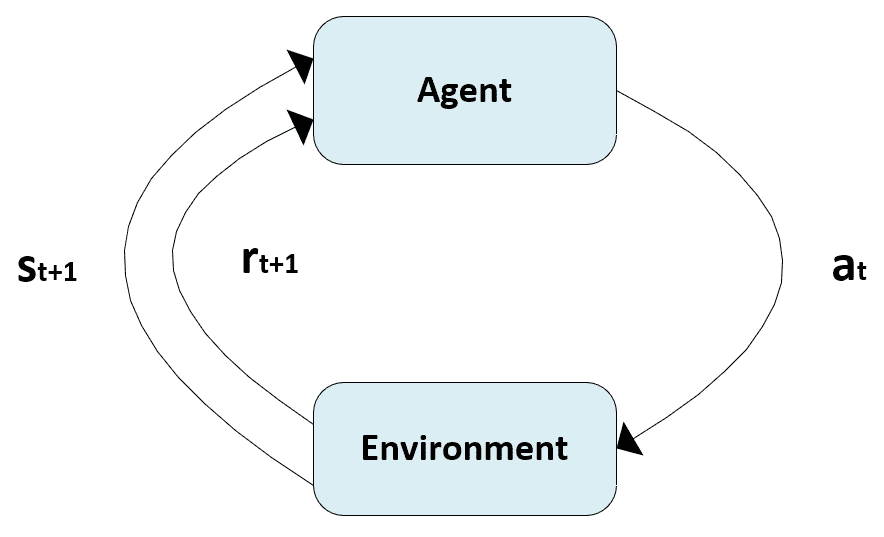

代理-环境交互模式

环境的一个非常重要的特征是其内部性质。它可以是有序的或随机的。一个有序的环境由一个函数定义，该函数将每个可能动作，*a[t]*，在特定状态，*s[t]*，关联到一个明确的后继状态，*s*[*t+1*]，以及一个精确的奖励，*r[t+1]*：

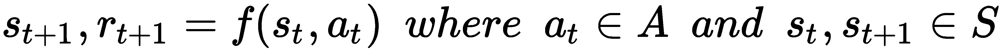

相反，一个随机环境由给定动作，*a[t]*，当前状态，*s[t]*，和一组可能的后继状态，*s^i[t+1]*，之间的转移概率来定义：

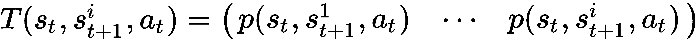

如果一个状态，*s[i]*，有一个转移概率，*T(s[i], s[i], a[t]) = 1 ∀ a[t ]∈ A*，则该状态被定义为*吸收状态*。通常，所有在序列任务中的结束状态都被建模为吸收状态，以避免任何进一步的转换。当一个序列不被限制在固定数量的步骤时，确定其结束的唯一标准是检查代理是否达到了吸收状态。

由于我们不知道哪个状态将是后续状态，因此有必要考虑在初始状态，*s[t]*，和动作，*a[t]*，下所有可能奖励的期望值：

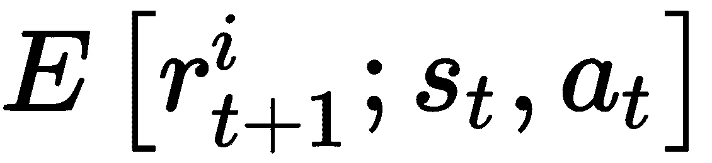

通常，管理随机环境更容易，因为可以通过将所有概率设置为 0（除了对应实际后继状态的概率）立即将其转换为有序环境（例如，T(•) = (0, 0, ..., 1, ..., 0)）。同样，期望回报可以设置为*r[t+1]*。了解 T(•)以及*E[r^i[t+1]]*对于应用某些特定算法是必要的，但当需要极其复杂的分析来为环境找到一个合适的模型时，可能会出现问题。在这些所有情况下，可以使用无模型方法，因此环境被视为一个黑盒，其输出在时间，*t*（在代理执行动作，*a[t-1]*之后），是评估策略的唯一可用信息。

# 奖励

我们已经看到，奖励（有时负奖励被称为*惩罚*，但最好使用标准化的符号）是环境在每次行动后提供的唯一反馈。然而，使用奖励的方法有两种不同的途径。第一种是一个非常短视的代理的策略，只考虑刚刚收到的奖励。这种方法的明显问题是无法考虑可能导致非常高的奖励的更长序列。例如，一个代理必须穿越几个具有负奖励的状态（例如，-0.1），但之后，他们到达一个具有非常积极奖励的状态（例如，+5.0）。短视的代理无法找到最佳策略，因为它只会试图避免立即的负奖励。另一方面，最好假设单个奖励包含未来将获得的奖励的一部分，这些奖励将遵循相同的策略。这个概念可以通过引入*折现奖励*来表示，它被定义为：

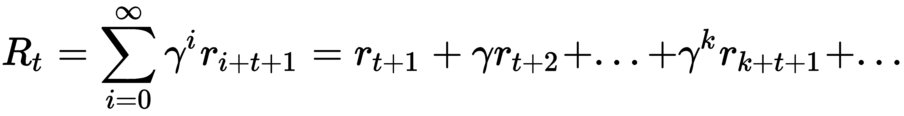

在前面的表达式中，我们假设了一个具有折现因子γ的无穷远视角，γ是一个介于 0 和 1 之间的实数（不包括）。当γ = 0 时，代理非常短视，因为*R[t] = r[t+1]*，但当*γ*趋近于 1 时，当前奖励考虑了以时间步长成反比的方式折现的未来贡献。这样，非常接近的奖励将比非常遥远的奖励有更高的权重。如果所有奖励的绝对值都受限于最大即时绝对奖励*|r[i]| ≤ |r[max]|*，则前面的表达式将始终有界。事实上，考虑到几何级数的性质，我们得到：

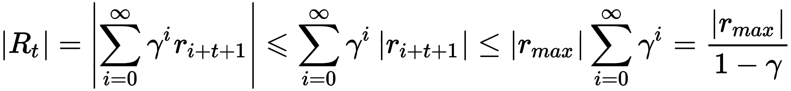

显然，γ的正确选择是许多问题的关键因素，并且不能轻易推广。正如在许多其他类似情况下一样，我建议测试不同的值，选择那个最小化收敛速度同时产生近似最优策略的值。当然，如果任务是具有长度 T(e[i])的周期性任务，折现奖励变为：

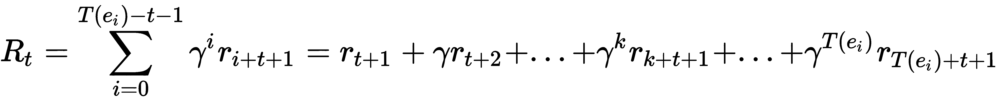

# Python 中的棋盘环境

我们将考虑一个基于代表隧道的棋盘环境的例子。代理的目标是到达结束状态（右下角），避免 10 个负吸收状态的水井。奖励如下：

+   **结束状态**：+5.0

+   **韦尔斯**：-5.0

+   **所有其他状态**：-0.1

为所有非终止状态选择一个小负奖励有助于迫使代理前进，直到达到最大（最终）奖励。让我们开始建模一个具有 5×15 矩阵的环境：

```py
import numpy as np

width = 15
height = 5

y_final = width - 1
x_final = height - 1

y_wells = [0, 1, 3, 5, 5, 7, 9, 11, 12, 14]
x_wells = [3, 1, 2, 0, 4, 1, 3, 2, 4, 1]

standard_reward = -0.1
tunnel_rewards = np.ones(shape=(height, width)) * standard_reward

for x_well, y_well in zip(x_wells, y_wells):
    tunnel_rewards[x_well, y_well] = -5.0

tunnel_rewards[x_final, y_final] = 5.0
```

环境的图形表示（就奖励而言）如下表所示：

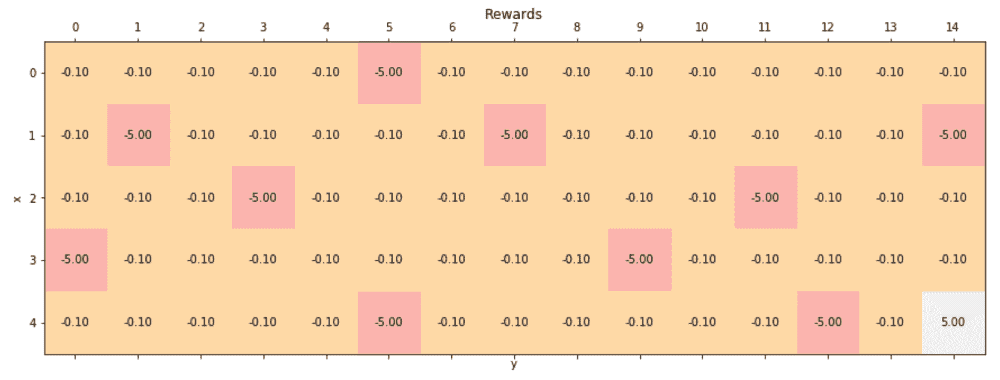

洞穴环境中的奖励

代理允许在四个方向上移动：上、下、左和右。显然，在这种情况下，环境是确定的，因为每个动作都会将代理移动到预定义的单元格。我们假设，每当一个动作被禁止（例如，当代理在第一列时尝试向左移动），后续状态是相同的（带有相应的奖励）。

# 策略

一个 *策略* 正式上是代理遵循的确定或随机法则，以最大化其回报。传统上，所有策略都用字母 *π* 表示。一个 *确定策略* 通常是一个当前状态的函数，输出一个精确的动作：

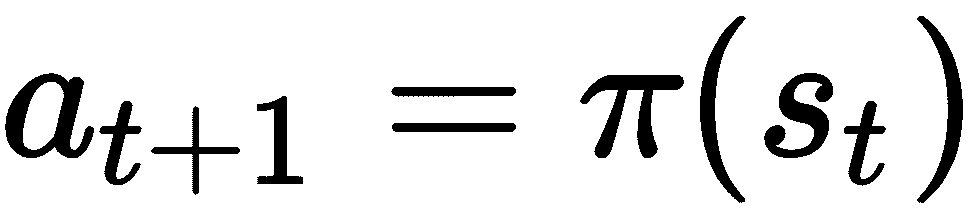

一个 *随机策略*，类似于环境，输出每个动作的概率（在这种情况下，我们假设我们与一个有限的 MPD 工作）：

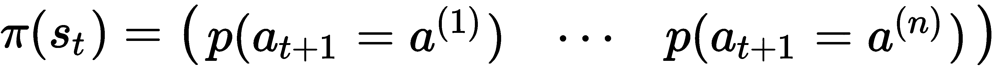

然而，与环境相反，代理必须始终选择一个特定的动作，将任何随机策略转化为一系列确定的选择。一般来说，当 *π(s, a) > 0 ∀ a ∈ A* 的策略被称为 *软*，它在训练过程中非常有用，因为它允许更灵活的建模，而不会提前选择次优动作。相反，当 *π(s, a[i]) = 0 ∀ i ≠ j* 和 *π(s, a[j]) = 1* 时，该策略也被定义为 *硬*。这种转换可以以多种方式执行，但最常见的一种是定义一个相对于价值的贪婪策略（我们将在下一节讨论这个概念）。这意味着在每一步，策略将选择最大化后续状态价值的动作。显然，这是一个非常理性的方法，可能会过于实用。事实上，当某些状态的价值没有变化时，贪婪策略将始终迫使代理执行相同的动作。

这种问题被称为*探索-利用困境*，当允许智能体评估最初可能看起来次优的替代策略时会出现。换句话说，我们希望智能体在开始利用策略之前探索环境，以确定策略是否真的是最好的，或者是否存在隐藏的替代方案。为了解决这个问题，可以采用*ε-贪婪策略*，其中值*ε*被称为*探索因子*，代表一个概率。在这种情况下，策略将以概率*ε*随机选择一个动作，以概率*1 - ε*选择贪婪的动作。通常，在训练过程的开始阶段，*ε*保持非常接近 1.0，以鼓励探索，并且随着策略变得更加稳定，它逐渐减少。在许多深度强化学习应用中，这种方法是基本的，特别是在没有环境模型的情况下。原因是贪婪策略最初可能是错误的，并且有必要允许智能体在强制做出确定性决策之前探索许多可能的状态和动作序列。

# 政策迭代

在本节中，我们将分析一种基于对环境（就转移概率和期望回报而言）的完整知识来寻找最优策略的策略。第一步是定义一种可以用来构建贪婪策略的方法。假设我们正在处理一个有限的 MDP 和一个通用策略π；我们可以定义状态*s[t]*的内在价值为智能体从状态*s[t]*开始并遵循随机策略π所获得的期望折现回报：

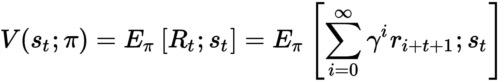

在这种情况下，我们假设，由于智能体将遵循*π*，如果从状态*s[a]*开始获得的期望回报大于从状态 s[b]开始获得的回报，那么状态*s[a]*比状态*s[b]*更有用。不幸的是，当*γ > 0*时，试图直接使用之前的定义找到每个状态的价值几乎是不可能的。然而，这是一个可以用动态规划（有关更多信息，请参阅*动态规划与马尔可夫过程*，*罗纳德·A·霍华德*，麻省理工学院出版社）解决的问题，它允许我们迭代地解决这个问题。

尤其是我们需要将之前的公式转换成*贝尔曼方程*：

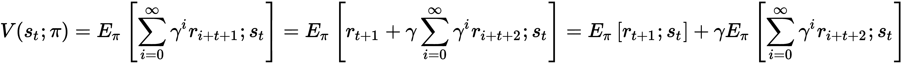

右侧的第一个项可以表示为：

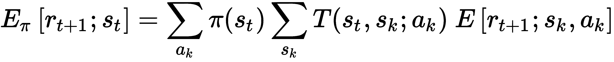

换句话说，它是考虑代理处于状态，*s[t]*，并评估所有可能动作及其后续状态转移的所有预期回报的加权平均值。对于第二项，我们需要一个小技巧。假设我们从*s[t+1]*开始，因此预期值对应于*V(s[t+1];π)*；然而，由于和从*s[t]*开始，我们需要考虑从*s[t]*开始的所有可能的转移。在这种情况下，我们可以将这个项重写为：

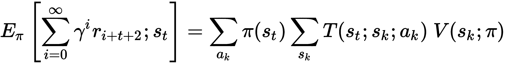

再次，第一项考虑了从*s[t]*（并最终到达*s[t+1]*）开始的所有可能的转移，而第二项是每个结束状态的价值。因此，完整的表达式变为：

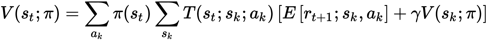

对于确定性策略，公式是：

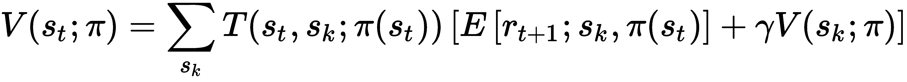

之前的方程是针对有限马尔可夫决策过程（MDP）的通用离散**贝尔曼方程**的特殊情况，该方程可以表示为一个向量算子，即*L[π]*，作用于价值向量：

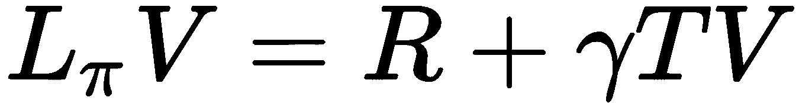

证明存在一个唯一的固定点对应于*V(s; π)*是容易的，因此*Lπ V(s; π) = V(s; π)*。然而，为了解这个系统，我们需要同时考虑所有方程，因为在**贝尔曼方程**的左右两边都有*V(•; π)*项。能否将问题转化为一个迭代过程，以便利用前一次的计算结果进行下一次计算？答案是肯定的，这是**L[π]**的一个重要属性的后果。让我们考虑在时间*t*和*t+1*计算的两个价值向量之间的无穷范数：

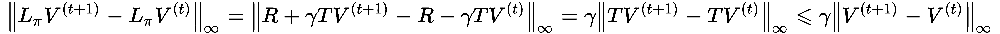

当折现因子γ ∈ [0, 1]时，贝尔曼算子*L[π]*是一个γ-收缩，通过γ因子减少参数之间的距离（它们变得越来越相似）。**Banach 不动点定理**指出，在度量空间*D*上的收缩*L: D → D*，在*D*中有一个唯一的固定点*d^* ∈ D*，可以通过反复应用收缩到任何*d^((0)) ∈ D*来找到。

因此，我们知道存在一个唯一的固定点*V(s; π)*，这是我们研究的目标。如果我们现在考虑一个通用的起始点*V^((t))*，并计算与*V(s; π)*之间的范数，我们得到：

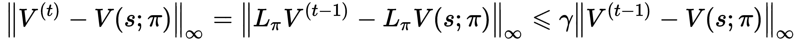

重复此过程，直到*t = 0*，我们得到：

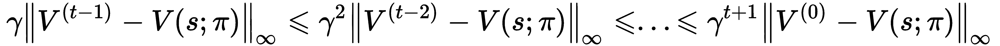

项*γ^(t+1) →* *0*，同时继续迭代*V^((t))*和*V(s; π)*之间的距离，这个距离越来越小，允许我们使用迭代方法而不是一次性闭合方法。因此，**贝尔曼方程**变为：

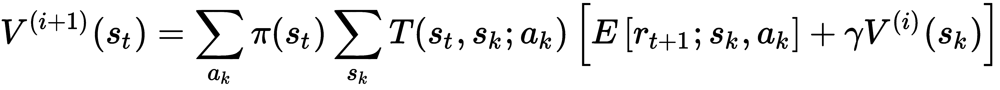

这个公式使我们能够找到每个状态（这个步骤正式称为*策略评估*）的值，但当然，它需要一个策略。在第一步，我们可以随机选择动作，因为我们没有其他任何信息，但在完成评估周期后，我们可以开始根据值定义一个贪婪策略。为了实现这个目标，我们需要引入强化学习中的一个非常重要的概念，即*Q 函数*（必须与 EM 算法中定义的*Q 函数*区分开来），它被定义为从状态，*s[t]*，开始并选择一个特定动作，*a[t]*，的智能体获得的期望折现回报：

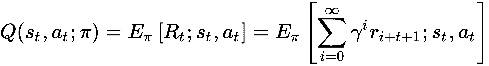

定义与*V(s; π)*非常相似，但在这个情况下，我们将动作，a[t]，作为一个变量。显然，我们可以通过简单地移除策略/动作求和来定义*Q(s, a; π)*的贝尔曼方程：

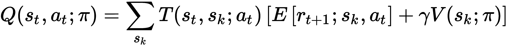

Sutton 和 Barto（在*强化学习*，*Sutton R. S.，Barto A. G.*，麻省理工学院出版社）证明了一个简单但非常重要的定理（称为*策略改进定理*），该定理表明，给定确定性策略，*π[1]*和*π[2]*，如果*Q(s, π2; π[2]) ≥ V(s; π[1])∀ s ∈ S*，则*π[2]*优于或等于*π[1]*。证明非常紧凑，可以在他们的书中找到，然而，结果可以直观地理解。如果我们考虑一个状态序列，*s[1] → s[2] → ... → s[n]*和*π2 = π1∀ i < m < n*，而*π2 ≥ π1∀ i ≥ m*，策略，*π[2]*，至少等于*π[1]*，并且如果至少有一个不等式是严格的，它就变得更好。相反，如果*Q(s, π2; π[2]) ≥ V(s; π[1])*，这意味着*π2 ≥ π1*，并且如果至少有一个状态，*s[i]*，其中*π2 > π1*，那么*Q(s, π2; π[2]) > V(s; π[1])*。因此，在完成策略评估周期后，我们有权利定义一个新的贪婪策略：

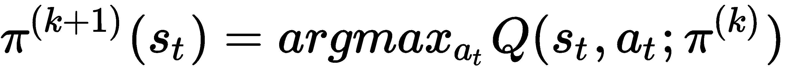

这一步被称为 *策略改进*，其目标是将每个状态关联的动作设置为导致后继状态具有最大值的动作。不难理解，当 *V^((t)) → **V(s; π)* 时，最佳策略将保持稳定。事实上，当 *t → ∞* 时，Q 函数将收敛到由 *V(s; π)* 和 argmax(•) 确定的稳定固定点，并且总是选择相同的动作。然而，如果我们从一个随机策略开始，通常一个策略评估周期不足以保证收敛。因此，在策略改进步骤之后，通常需要重复评估并交替两个阶段，直到策略变得稳定（这就是为什么算法被称为策略迭代）。一般来说，收敛速度相当快，但实际速度取决于问题的性质、状态和动作的数量以及奖励的一致性。

完整的政策迭代算法（如 Sutton 和 Barto 所提出）如下：

1.  设置一个初始确定性随机策略 *π(s)*

1.  将初始值数组设置为 *V(s) = 0 ∀ s ∈ S*

1.  设置一个容差阈值 Thr（例如，Thr = 0.0001）

1.  设置最大迭代次数 *N[iter]*

1.  设置计数器 *e = 0*

1.  当 *e < N[iter]* 时：

    1.  e += 1

    1.  执行：

        1.  将 *Vold = V(s) ∀ s ∈ S*

        1.  执行策略评估步骤，从 *Vold* 读取当前值并更新 *V(s)*

    1.  当 *Avg(|V(s) - Vold|) > Thr* 时：

    1.  将 *πold = π(s) ∀ s ∈ S*

    1.  执行策略改进步骤

    1.  如果 *π[old]**(s) == π(s)*：

        1.  Break

1.  输出最终的确定性策略 *π(s)*

在这种情况下，因为我们完全了解环境，所以不需要探索阶段。策略总是被利用，因为它被设计成对真实值（当 t → ∞时获得）贪婪。

# 检查棋盘环境中的策略迭代

我们希望应用策略迭代算法以找到隧道环境的最佳策略。让我们首先定义一个随机的初始策略和一个所有值（除了终端状态）都等于 0 的值矩阵：

```py
import numpy as np

nb_actions = 4

policy = np.random.randint(0, nb_actions, size=(height, width)).astype(np.uint8)
tunnel_values = np.zeros(shape=(height, width))
```

初始随机策略（t=0）如下图表所示：

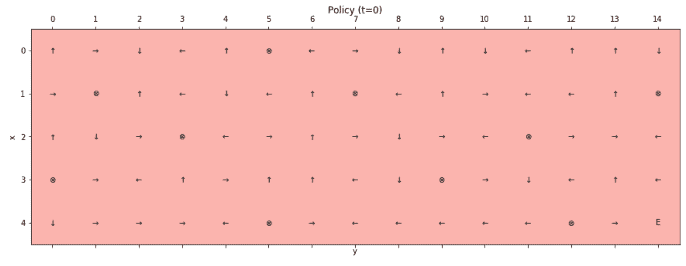

初始（t=0）随机策略

用 ⊗ 表示的状态表示井，而最终的积极状态由大写字母 *E* 表示。因此，初始值矩阵（t=0）如下：

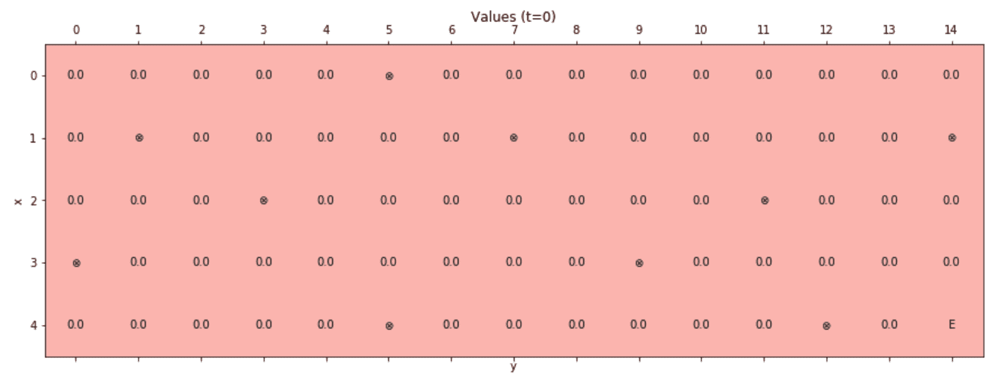

初始（t=0）值矩阵

在这一点上，我们需要定义执行政策评估和改进步骤的函数。由于环境是确定性的，因此过程稍微简单一些，因为通用转移概率，*T(s[i]，s[j]; a[k])*，对于唯一可能的后续状态等于 1，否则为 0。同样，政策也是确定性的，只考虑一个动作。执行政策评估步骤，冻结当前值，并使用*V^((t))*更新整个矩阵，*V^((t+1))*；然而，也可以立即使用新值。我邀请读者测试这两种策略，以找到最快的方法。在这个例子中，我们使用折现因子，γ = 0.9（不言而喻，一个有趣的练习是测试不同的值并比较评估过程的结果和最终行为）：

```py
import numpy as np

gamma = 0.9

def policy_evaluation():
    old_tunnel_values = tunnel_values.copy() 

    for i in range(height):
        for j in range(width): 
            action = policy[i, j]

            if action == 0:
                if i == 0:
                    x = 0
                else:
                    x = i - 1
                y = j

            elif action == 1:
                if j == width - 1:
                    y = width - 1
                else:
                    y = j + 1
                x = i

            elif action == 2:
                if i == height - 1:
                    x = height - 1
                else:
                    x = i + 1
                y = j

            else:
                if j == 0:
                    y = 0
                else:
                    y = j - 1
                x = i

            reward = tunnel_rewards[x, y]
            tunnel_values[i, j] = reward + (gamma * old_tunnel_values[x, y])

def is_final(x, y):
    if (x, y) in zip(x_wells, y_wells) or (x, y) == (x_final, y_final):
        return True
    return False

def policy_improvement():
    for i in range(height):
        for j in range(width):
            if is_final(i, j):
                continue

            values = np.zeros(shape=(nb_actions, ))

            values[0] = (tunnel_rewards[i - 1, j] + (gamma * tunnel_values[i - 1, j])) if i > 0 else -np.inf
            values[1] = (tunnel_rewards[i, j + 1] + (gamma * tunnel_values[i, j + 1])) if j < width - 1 else -np.inf
            values[2] = (tunnel_rewards[i + 1, j] + (gamma * tunnel_values[i + 1, j])) if i < height - 1 else -np.inf
            values[3] = (tunnel_rewards[i, j - 1] + (gamma * tunnel_values[i, j - 1])) if j > 0 else -np.inf

            policy[i, j] = np.argmax(values).astype(np.uint8)
```

定义好函数后，我们开始政策迭代周期（最大迭代次数，*N[iter]* = 100,000，容差阈值等于 10^(-5)）：

```py
import numpy as np

nb_max_epochs = 100000
tolerance = 1e-5

e = 0

while e < nb_max_epochs:
    e += 1
    old_tunnel_values = tunnel_values.copy()
    policy_evaluation()

    if np.mean(np.abs(tunnel_values - old_tunnel_values)) < tolerance:
        old_policy = policy.copy()
        policy_improvement()

        if np.sum(policy - old_policy) == 0:
            break
```

在过程结束时（在这种情况下，算法在 182 次迭代后收敛，但这个值可能会因不同的初始政策而变化），值矩阵是：

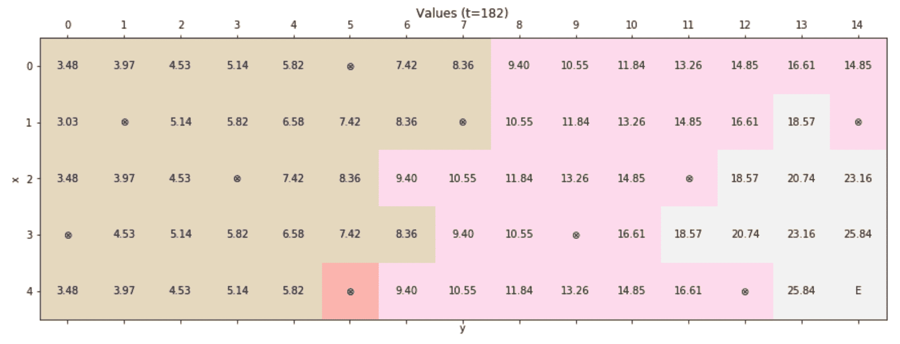

最终值矩阵

分析值，可以看到算法是如何发现它们是单元格与结束状态之间距离的隐函数。此外，政策总是避免陷阱，因为最大值总是在相邻状态中找到。通过绘制最终政策可以轻松验证这种行为：

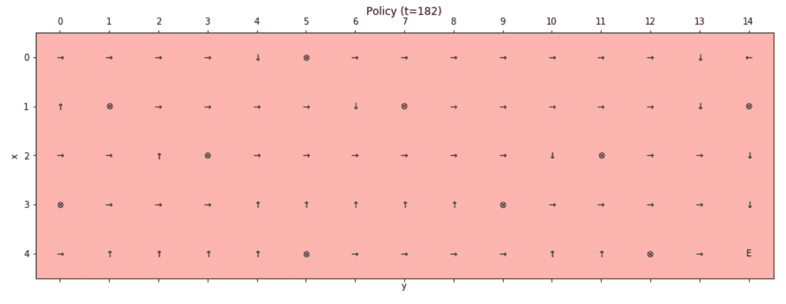

最终政策

选择一个随机的初始状态，智能体将始终达到结束状态，避免陷阱并确认政策迭代算法的优化性。

# 值迭代

政策迭代的一个替代方法是**值迭代**算法。主要假设基于经验观察，政策评估步骤收敛得相当快，因此在固定步骤数（通常是 1 步）后停止过程是合理的。实际上，政策迭代可以想象成一场游戏，其中第一个玩家试图在考虑稳定政策的情况下找到正确的值，而另一个玩家则创建一个对新值具有贪婪性的新政策。显然，第二步会损害先前评估的有效性，迫使第一个玩家重复这个过程。然而，由于贝尔曼方程使用一个固定的单点，算法收敛到一个解决方案，其特征是政策不再改变，因此评估变得稳定。这个过程可以通过移除政策改进步骤并以贪婪方式继续评估来简化。形式上，每一步都是基于以下更新规则：

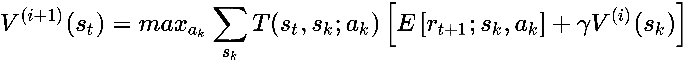

现在，迭代不再考虑策略（隐式地假设它将根据值进行贪婪选择），并选择所有 *V^((t))(a[t])* 中最大的可能值 *V^((t+1))*。换句话说，值迭代通过选择对应于最可能（p → 1）被选中的动作的值，来预测策略改进步骤所做的选择。将上一节中提出的收敛证明扩展到这个情况并不困难，因此，*V^((∞)) → V^((opt))*，以及策略迭代也是如此。然而，平均迭代次数通常较小，因为我们从一个可以对比值迭代过程的随机策略开始。

当值变得稳定时，最优贪婪策略简单地获得如下：

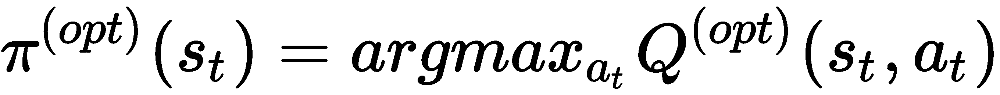

这个步骤在形式上等同于策略改进迭代，然而，它只在过程结束时执行一次。

Sutton 和 Barto 提出的完整值迭代算法如下：

1.  设置初始值数组，*V(s) = 0 ∀ s ∈ S*

1.  设置一个容差阈值，*Thr*（例如，*Thr = 0.0001*）

1.  设置最大迭代次数，*N[iter]*

1.  设置计数器，*e* = 0

1.  While *e < N[iter]*:

    1.  *e += 1*

    1.  Do:

        1.  Set *Vold = V(s) ∀ s ∈ S*

        1.  执行值评估步骤，从 *Vold* 读取当前值并更新 *V(s)*

    1.  While *Avg(|V(s) - Vold|) > Thr*

1.  输出最终的确定性策略 *π(s) = argmax[a] Q(s, a)*

# 棋盘环境中的值迭代

为了测试这个算法，我们需要设置一个所有值都等于 0 的初始值矩阵（它们也可以随机选择，但由于我们没有关于最终配置的先验信息，每个初始选择在概率上是等效的）：

```py
import numpy as np

tunnel_values = np.zeros(shape=(height, width))
```

在这一点上，我们可以定义两个函数来执行值评估和最终策略选择（函数 `is_final()` 是在先前的例子中定义的）：

```py
import numpy as np

def value_evaluation():
    old_tunnel_values = tunnel_values.copy() 

    for i in range(height):
        for j in range(width): 
            rewards = np.zeros(shape=(nb_actions, ))
            old_values = np.zeros(shape=(nb_actions, ))

            for k in range(nb_actions):
                if k == 0:
                    if i == 0:
                        x = 0
                    else:
                        x = i - 1
                    y = j

                elif k == 1:
                    if j == width - 1:
                        y = width - 1
                    else:
                        y = j + 1
                    x = i

                elif k == 2:
                    if i == height - 1:
                        x = height - 1
                    else:
                        x = i + 1
                    y = j

                else:
                    if j == 0:
                        y = 0
                    else:
                        y = j - 1
                    x = i

                rewards[k] = tunnel_rewards[x, y]
                old_values[k] = old_tunnel_values[x, y]

            new_values = np.zeros(shape=(nb_actions, ))

            for k in range(nb_actions):
                new_values[k] = rewards[k] + (gamma * old_values[k])

            tunnel_values[i, j] = np.max(new_values)

def policy_selection():
    policy = np.zeros(shape=(height, width)).astype(np.uint8)

    for i in range(height):
        for j in range(width):
            if is_final(i, j):
                continue

            values = np.zeros(shape=(nb_actions, ))

            values[0] = (tunnel_rewards[i - 1, j] + (gamma * tunnel_values[i - 1, j])) if i > 0 else -np.inf
            values[1] = (tunnel_rewards[i, j + 1] + (gamma * tunnel_values[i, j + 1])) if j < width - 1 else -np.inf
            values[2] = (tunnel_rewards[i + 1, j] + (gamma * tunnel_values[i + 1, j])) if i < height - 1 else -np.inf
            values[3] = (tunnel_rewards[i, j - 1] + (gamma * tunnel_values[i, j - 1])) if j > 0 else -np.inf

            policy[i, j] = np.argmax(values).astype(np.uint8)

    return policy
```

主要区别在于 `value_evaluation()` 函数，它现在必须考虑所有可能的后继状态，并选择导致具有最高值的状态的值。而 `policy_selection()` 函数与 `policy_improvement()` 相当，但由于它只被调用一次，它直接输出到最终最优策略。

在这一点上，我们可以运行一个训练周期（假设与之前相同的常数）：

```py
import numpy as np

e = 0

policy = None

while e < nb_max_epochs:
    e += 1
    old_tunnel_values = tunnel_values.copy()
    value_evaluation()

    if np.mean(np.abs(tunnel_values - old_tunnel_values)) < tolerance:
        policy = policy_selection()
        break
```

最终值配置（经过 127 次迭代）如下图表所示：

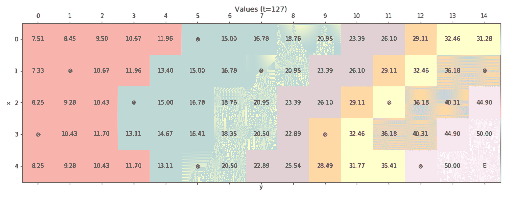

最终值矩阵

如前例所示，最终值配置是每个状态与结束状态之间距离的函数，但在这个情况下，*γ = 0.9* 的选择并不最优。事实上，靠近最终状态的水井不再被认为是非常危险的。绘制最终策略可以帮助我们理解其行为：

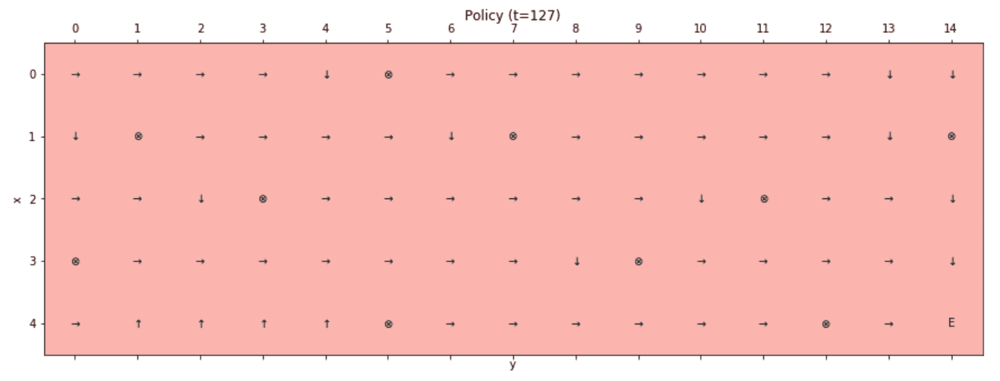

最终策略

如预期的那样，远离目标的井被避免，但靠近最终状态的两个井被视为合理的惩罚。这是因为价值迭代算法在价值和折扣因子方面非常贪婪，*γ < 1.0*；负状态的影响可以通过最终奖励来补偿。在许多场景中，这些状态是吸收的，因此它们的隐含奖励是*+∞*或*-∞*，这意味着没有其他动作可以改变最终值。我邀请读者用不同的折扣因子（记住，*γ → 1*的智能体非常短视，会避开任何障碍，甚至降低策略的效率）重复这个例子，并改变最终状态的价值。此外，读者应该能够回答以下问题：当标准奖励（默认值为*-0.1*）增加或减少时，智能体的行为是什么？

# TD(0)算法

动态规划算法的一个问题是需要完全了解环境的状态和转移概率。不幸的是，在直接经验之前，这些信息在很多情况下都是未知的。特别是，状态可以通过让智能体探索环境来发现，但转移概率需要我们计算到达某个状态的数量，这通常是不可能的。

此外，如果一个环境有吸收状态，那么如果智能体已经学会了一个好的初始策略，它可能会阻止访问许多状态。例如，在一个可以描述为离散马尔可夫决策过程（MDP）的游戏中，智能体在学会如何前进而不陷入负吸收状态的同时，发现环境。

这些问题的通用解决方案是由一种不同的评估策略提供的，称为**时间差分**（**TD**）强化学习。在这种情况下，我们从一个空的价值矩阵开始，并让智能体遵循一个关于价值（但初始的是，通常是随机的）的贪婪策略。一旦智能体观察到由于一个动作*a[t]*导致的转移*s[i] → s[j]*，并得到一个奖励*r[ij]*，它就会更新对*V(s[i])*的估计。这个过程以剧集（这是最自然的方式）为结构，并在完成最大步数或遇到终端状态时结束。特别是，TD(0)算法根据以下规则更新价值：

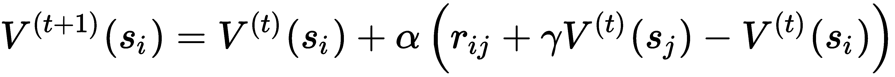

常数 *α* 被限制在 0 和 1 之间，并作为学习率。每次更新都会考虑与当前值 *V^((t))(s[i])* 的变化，这个变化与实际回报和先前估计之间的差异成比例。术语 *r[ij] + γV^((t))(s[j])* 与先前方法中使用的术语类似，并代表给定当前回报和从后续状态开始的折现值所期望的值。然而，由于 *V^((t))(s[j])* 是一个估计值，这个过程基于从先前值的自举。换句话说，我们从一个估计值开始，以确定下一个值，这个值应该更接近稳定的固定点。确实，TD(0) 是基于序列（通常称为回溯）的 TD 算法家族中最简单的例子，这个序列可以推广为（考虑 k 步）：

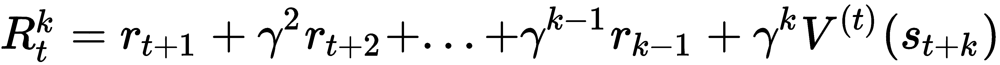

由于我们使用单个奖励来近似期望的折现回报，TD(0) 通常被称为单步 TD 方法（或单步回溯）。可以通过考虑更多的后续奖励或替代策略来构建更复杂的算法。我们将在第十五章 高级策略估计算法中分析一个通用的变体，称为 TD(*λ*)，并解释为什么这个算法对应于 *λ = 0* 的选择。

TD(0) 已被证明会收敛，尽管证明（可以在 *基于模型的时序差分学习控制收敛*，*Van Hasselt H.*，*Wiering M. A.*，*2007 年 IEEE 近似动态规划与强化学习研讨会（ADPRL 2007）论文中找到）更为复杂，因为需要考虑马尔可夫过程的演变。实际上，在这种情况下，我们使用截断估计和自举值 *V(s[j])* 来近似期望的折现回报，而 *V(s[j])* 在最初（以及大量迭代中）是不稳定的。然而，假设当 *t → ∞* 时收敛，我们得到：

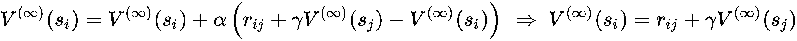

最后一个公式表示在贪婪最优策略迫使智能体执行导致状态从 *s[j]* 转移到 *s[i]* 的动作的情况下，状态 *s[i]* 的值。当然，在这个时候，自然会问在什么条件下算法会收敛。实际上，我们正在考虑的是周期性任务，并且估计 *V^((∞))(s[i])* 只有在智能体无限次地执行到 *s[i]* 的转移，无限次地选择所有可能动作的情况下才是正确的。这种条件通常通过说策略必须是 **无限探索下的极限贪婪（GLIE**）来表示。换句话说，真正的贪婪只有在智能体能够无限制地探索环境，并且在不限次数的周期中不受限制时，才作为一个渐近状态实现。

这可能是 TD RL 最重要的限制，因为在现实场景中，某些状态可能非常不可能，因此估计永远不会积累足够经验以收敛到实际值。我们将在第十五章，“高级策略估计算法”中分析一些解决此问题的方法，但在我们的例子中，我们采用随机起始。换句话说，由于策略是贪婪的，可以始终避免某些状态，我们迫使智能体在每个剧集开始时在一个随机的非终端单元格中。这样，即使在贪婪策略下，我们也允许进行深度探索。当这种方法不可行（例如，因为环境动力学不可控）时，只能通过采用ε-贪婪策略来解决探索-利用困境，该策略选择一部分次优（甚至错误）的动作。这样，可以观察更多的转移，但代价是收敛速度较慢。

然而，正如 Sutton 和 Barto 所指出的，TD(0)收敛到由 MDP 确定的值函数的最大似然估计，找到模型的隐式转移概率。因此，如果观察的数量足够高，TD(0)可以快速找到一个最优策略，但与此同时，它对某些状态-动作对从未经历（或很少经历）的偏差估计也更加敏感。在我们的例子中，我们不知道初始状态是哪一个，因此选择一个固定的起始点会导致一个极其僵化的策略，几乎完全无法处理噪声情况。例如，如果起始点改为相邻（但从未探索过）的单元格，算法可能无法找到到达正终端状态的最优路径。另一方面，如果我们知道动力学是明确定义的，TD(0)将迫使智能体选择在当前环境知识下最有可能产生最优结果的动作。如果动力学部分是随机的，ε-贪婪策略的优势可以通过考虑智能体经历相同转移和相应值成比例增加的连续剧集来理解。例如，如果环境在许多经验之后改变一个转移，当策略几乎稳定时，智能体必须面对全新的经验。这种纠正需要许多剧集，由于这种随机变化发生的概率非常低，智能体可能永远无法学会正确的行为。相反，通过选择一些随机动作，遇到类似状态（甚至相同状态）的概率增加（想想一个状态由截图表示的游戏），算法可以相对于非常不可能的转移变得更加鲁棒。

完整的 TD(0)算法如下：

1.  设置一个初始的确定性随机策略，*π(s)*

1.  设置初始值数组，*V(s) = 0 ∀ s ∈ S*

1.  设置段落数量，*N[episodes]*

1.  设置每段的最大步数，*N[max]*

1.  设置一个常数，*α*（例如，*α = 0.1*）

1.  设置一个常数，*γ*（例如，*γ** = 0.9*）

1.  设置计数器，*e = 0*

1.  对于 *i = 1* 到 *N[episodes]*：

    1.  观察初始状态，*s[i]*

    1.  当 *s[j]* 非终止状态且 *e < N[max]*：

        1.  *e += 1*

        1.  选择动作，**a[t] = π(s[i])** 

        1.  观察转换，*(a[t], s[i]) → (s[j], r[ij])*

        1.  更新状态*的值函数，*s[i]*

        1.  设置 *s[i] = s[j]*

    1.  更新策略，使其与值函数贪婪，*π(s) = argmax[a] Q(s, a)*

# 棋盘环境中的 TD(0)

在这一点上，我们可以在棋盘环境中测试 TD(0)算法。第一步是定义一个初始随机策略和一个所有元素都等于 0 的值矩阵：

```py
import numpy as np

policy = np.random.randint(0, nb_actions, size=(height, width)).astype(np.uint8)
tunnel_values = np.zeros(shape=(height, width))
```

由于我们希望在每段开始时选择一个随机起点，我们需要定义一个辅助函数，该函数必须排除终端状态（所有常数与之前定义相同）：

```py
import numpy as np

xy_grid = np.meshgrid(np.arange(0, height), np.arange(0, width), sparse=False)
xy_grid = np.array(xy_grid).T.reshape(-1, 2)

xy_final = list(zip(x_wells, y_wells))
xy_final.append([x_final, y_final])

xy_start = []

for x, y in xy_grid:
    if (x, y) not in xy_final:
        xy_start.append([x, y])

xy_start = np.array(xy_start)

def starting_point():
    xy = np.squeeze(xy_start[np.random.randint(0, xy_start.shape[0], size=1)])
    return xy[0], xy[1]
```

现在我们可以实现一个函数来评估单个段（将最大步数设置为 500，常数为*α* = 0.25）：

```py
max_steps = 1000
alpha = 0.25

def episode():
    (i, j) = starting_point()
    x = y = 0

    e = 0

    while e < max_steps:
        e += 1

        action = policy[i, j]

        if action == 0:
            if i == 0:
                x = 0
            else:
                x = i - 1
            y = j

        elif action == 1:
            if j == width - 1:
                y = width - 1
            else:
                y = j + 1
            x = i

        elif action == 2:
            if i == height - 1:
                x = height - 1
            else:
                x = i + 1
            y = j

        else:
            if j == 0:
                y = 0
            else:
                y = j - 1
            x = i

        reward = tunnel_rewards[x, y]
        tunnel_values[i, j] += alpha * (reward + (gamma * tunnel_values[x, y]) - tunnel_values[i, j])

        if is_final(x, y):
            break
        else:
            i = x
            j = y
```

确定与值相关的贪婪策略的函数与之前示例中已实现的函数相同；然而，我们报告它以确保示例的一致性：

```py
def policy_selection():
    for i in range(height):
        for j in range(width):
            if is_final(i, j):
                continue

            values = np.zeros(shape=(nb_actions, ))

            values[0] = (tunnel_rewards[i - 1, j] + (gamma * tunnel_values[i - 1, j])) if i > 0 else -np.inf
            values[1] = (tunnel_rewards[i, j + 1] + (gamma * tunnel_values[i, j + 1])) if j < width - 1 else -np.inf
            values[2] = (tunnel_rewards[i + 1, j] + (gamma * tunnel_values[i + 1, j])) if i < height - 1 else -np.inf
            values[3] = (tunnel_rewards[i, j - 1] + (gamma * tunnel_values[i, j - 1])) if j > 0 else -np.inf

            policy[i, j] = np.argmax(values).astype(np.uint8) 
```

在这一点上，我们可以开始一个包含 5,000 个段落的训练周期：

```py
n_episodes = 5000

for _ in range(n_episodes):
    episode()
    policy_selection()
```

最终值矩阵如下所示：

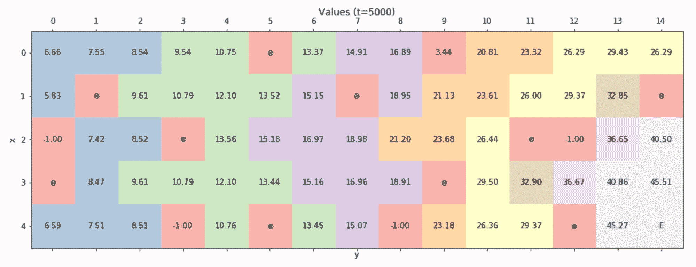

随机起始点的最终值矩阵

如前所述的示例，最终值与最终正状态的距离成反比。让我们分析得到的策略，以了解算法是否收敛到一致解：

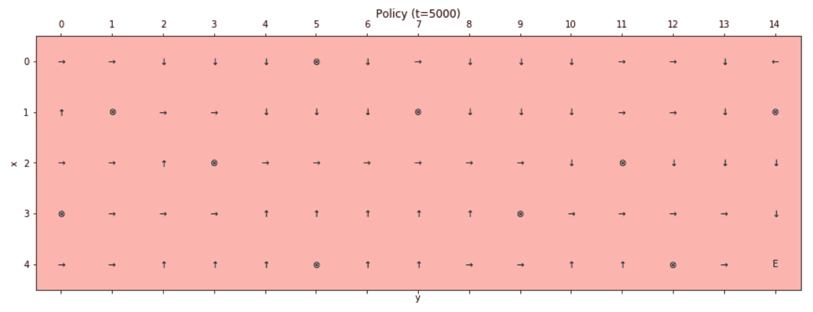

随机起始点的最终策略

如所示，允许随机选择起始状态以独立于初始条件找到最佳路径。为了更好地理解这种策略的优势，让我们绘制当初始状态固定为单元格*(0, 0)*（对应左上角）时的最终值矩阵： 

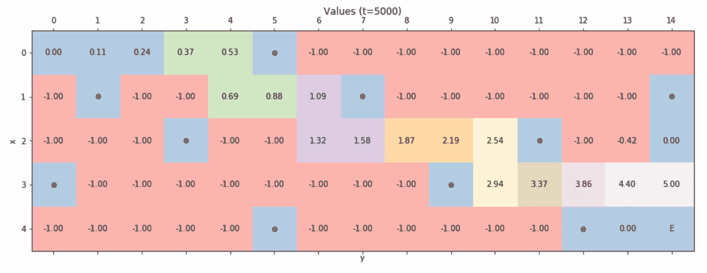

以固定初始状态（0, 0）的最终值矩阵

在没有进一步分析的情况下，我们可以看到许多状态从未被访问过或只被访问过几次，因此得到的策略与特定初始状态极为贪婪。值为-1.0 的块表示代理经常必须随机选择动作的状态，因为值没有差异，因此用不同的初始状态解决环境可能极其困难。得到的策略证实了这一分析：

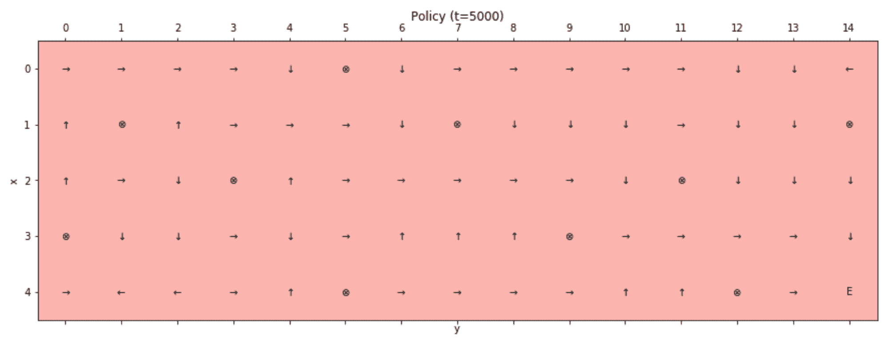

以固定初始状态（0, 0）的最终策略

如所见，智能体只有在初始点允许我们从*(0, 0)*开始穿越轨迹时才能达到最终状态。在这些所有情况下，即使路径比上一个例子中的路径更长，也有可能恢复最优策略。相反，如*(0, 4)*这样的状态显然是存在策略损失的情况。换句话说，智能体在没有任何知识或意识的情况下采取行动，成功的概率收敛到 0。作为一个练习，我邀请读者用不同的起始点（例如，一组固定的起始点）和更高的*α*值来测试这个算法。目标也是回答这些问题：是否可以加快学习过程？是否需要从所有可能的状态开始，才能获得全局最优策略？

# 摘要

在本章中，我们介绍了最重要的强化学习（RL）概念，重点关注环境作为马尔可夫决策过程（MDP）的数学结构，以及不同类型的策略以及它们如何从智能体获得的期望奖励中推导出来。特别是，我们定义了状态的价值为考虑一个按因子*γ*折现的序列的期望未来奖励。同样，我们引入了 Q 函数的概念，即当智能体处于特定状态时，动作的价值。

这些概念直接采用了策略迭代算法，该算法基于动态规划方法，假设对环境的完全了解。任务分为两个阶段；在第一阶段，智能体根据当前策略评估所有状态，而在第二阶段，策略被更新以对新价值函数进行贪婪选择。这样，智能体被迫始终选择导致最大化获得价值的转换的动作。

我们还分析了一种变体，称为价值迭代，它执行单一评估并以贪婪的方式选择策略。与前一种方法的主要区别在于，现在智能体立即选择最高价值，假设这个过程的结果与策略迭代等效。实际上，很容易证明，在无限次转换之后，两种算法都会收敛到最优价值函数。

最后一个算法称为 TD(0)，它基于无模型的方法。实际上，在许多情况下，很难知道所有转换概率，有时甚至所有可能的状态都是未知的。这种方法基于时间差分评估，它在与环境交互时直接执行。如果智能体可以无限次访问所有状态（显然，这只是一个理论条件），则该算法已被证明比其他方法更快地收敛到最优价值函数。

在下一章，第十五章，*高级策略估计算法*中，我们将继续讨论强化学习算法，介绍一些可以使用深度卷积网络立即实现的高级方法。
