# 第十五章：高级策略估计算法

在本章中，我们将继续探索强化学习（**Reinforcement Learning**，**RL**）的世界，关注那些可以用于解决难题的复杂算法。由于这仍然是强化学习的入门部分（整个主题极其庞大），本章的结构基于许多实用的例子，这些例子可以作为在更复杂场景中工作的基础。

本章将讨论的主题包括：

+   TD(λ) 算法

+   行为-评论家 TD(0)

+   SARSA

+   Q-learning

+   基于简单视觉输入和神经网络的 Q-learning

# TD(λ) 算法

在上一章中，我们介绍了时间差分策略，并讨论了一个简单的例子，称为 TD(0)。在 TD(0) 的情况下，折现奖励是通过使用一步回溯来近似的。因此，如果智能体在状态 *s[t]* 执行动作 *a[t]*，并且观察到转换到状态 *s[t][+1]*，则近似变为以下：

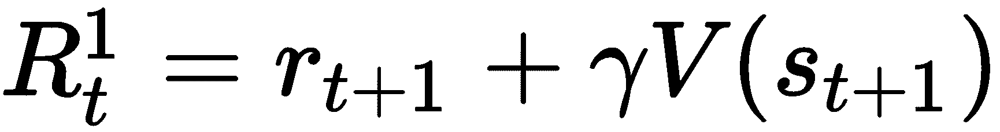

如果任务是分段的（如在许多现实场景中）并且有 *T(e[i])* 步，则分段 *e[i]* 的完整回溯如下：

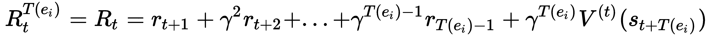

上述表达式在 MDP 过程达到吸收状态时结束；因此，*R[t]* 是实际折现奖励的价值。TD(0) 和此选择之间的区别很明显：在前一种情况下，我们可以在每次转换后更新价值函数，而使用完整回溯则需要等待分段的结束。我们可以说这种方法（被称为蒙特卡洛，因为它基于对整个序列总体奖励的平均化思想）正好是 TD(0) 的对立面；因此，考虑基于 *k*-步回溯的中间解决方案是合理的。特别是，我们的目标是找到一个在线算法，一旦回溯可用，就可以利用它们。

让我们想象一个由四个步骤组成的序列。智能体处于第一个状态并观察到一次转换；在这个时候，只能进行一步回溯，并且更新价值函数以提高收敛速度是个好主意。在第二次转换之后，智能体可以使用两步回溯；然而，它也可以考虑除了较新的、更长的回溯之外的第一步回溯。因此，我们有两种近似：

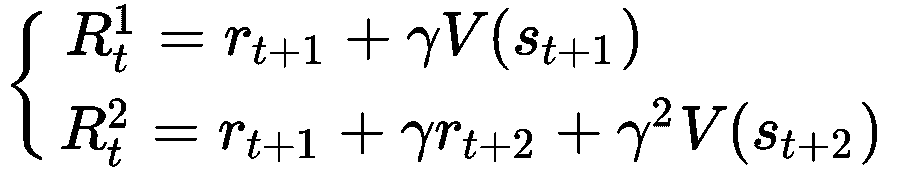

前面哪一个是更可靠的？显然，第二个依赖于第一个（特别是当价值函数几乎稳定时），等等，直到分段的结束。因此，最常见的策略是采用加权平均，为每个回溯分配不同的重要性水平（假设最长的回溯有 *k* 步）：

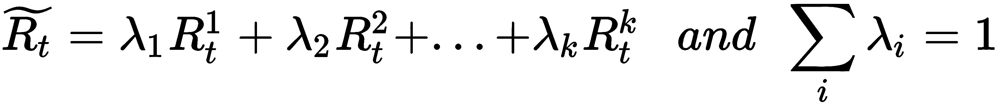

Watkins 在 *《延迟奖励学习》*（Watkins C.I.C.H.，博士论文，剑桥大学，1989 年）中证明了这种方法（无论是否有平均）具有减少相对于最优值函数 *V(s; π)* 的期望 *R[t]^k* 的绝对误差的基本性质。事实上，他证明了以下不等式成立：

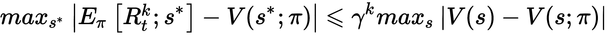

由于 *γ* 被限制在 0 和 1 之间，右侧始终小于最大绝对误差 *V(t) - V(s;π)*，其中 *V(s)* 是在一段时间内某个状态的价值。因此，*k*-步回溯（或不同回溯的组合）的期望折现回报提供了对最优值函数更准确的估计，如果策略被选择为相对于它贪婪的话。这并不令人惊讶，因为更长的回溯包含了更多的实际回报，但这个定理的重要性在于它在使用不同 *k*-步回溯的平均值时的有效性。换句话说，它为我们提供了数学证明，即直观的方法实际上会收敛，并且它还可以有效地提高收敛速度和最终精度。

然而，管理 *k* 系数通常是有问题的，在许多情况下是无用的。TD(λ)背后的主要思想是使用一个可以调整以满足特定需求的单一因子，*λ*。理论分析（或称为 Sutton 和 Barto 所指的“前视图”）在一般情况下基于指数衰减平均。如果我们考虑一个 *λ* 被限制在 0 和 1（不包括）之间的几何级数，我们得到：

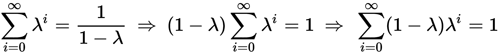

因此，我们可以考虑无限回溯的平均折现回报 *R[t]^((λ)*):

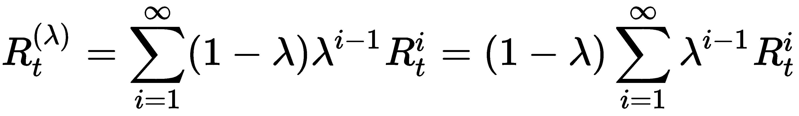

在定义有限情况之前，了解 *R[t]^((λ)*) 是如何构建的有助于理解。由于 *λ* 被限制在 0 和 1 之间，因子按比例衰减到 *λ*，因此第一次回溯影响最大，所有后续的回溯对估计的影响越来越小。这意味着，在一般情况下，我们假设对 *R[t]* 的估计对 *立即*回溯（它们变得越来越精确）更重要，我们只利用较长的回溯来提高估计的价值。现在，应该清楚的是，*λ* = 0 等同于 TD(0)，因为只有一步回溯保留在求和中（记住 *0⁰ = 1*），而更高的值涉及所有剩余的回溯。现在，让我们考虑一个长度为 *T(e[i]*) 的回溯 *e[i]*。

传统上，如果智能体在 *t = T(e[i]*) 达到吸收状态，所有剩余的 *t+i* 返回都等于 *Rt*；因此，我们可以截断 *R[t]^((λ)*):

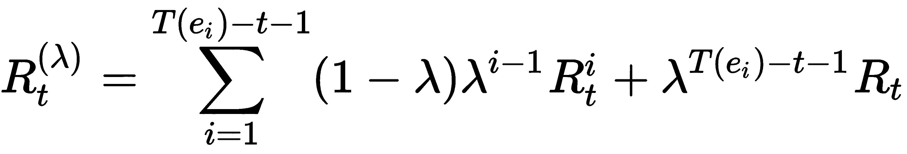

之前表达式的第一项涉及所有非终止状态，而第二项等于 *R[t]*，按第一时间步和最终状态之间的距离成比例折扣。再次强调，如果 *λ* = 0，我们得到 TD(0)，但现在我们也被授权考虑 *λ* = *1*（因为总和总是扩展到有限数量的元素）。当 λ = 1 时，我们得到 *R[t]^((λ))* = *R[t]*，这意味着我们需要等待直到剧集的结束才能获得实际的折扣奖励。如前所述，这种方法通常不是首选解决方案，因为当剧集非常长时，智能体选择的动作在大多数情况下都是基于过时的价值函数。因此，通常使用 *λ* 值小于 1 的 *TD(λ)*，以获得在线更新的优势，同时基于新状态的纠正。为了在不看未来的情况下实现这一目标（我们希望在新的信息可用时立即更新 *V(s)*），我们需要引入 *资格迹**e(s)* 的概念（有时，在计算神经科学背景下，*e(s)* 也被称为 *刺激迹*）。

状态 *s* 的资格迹是一个随时间变化的函数，它返回特定状态的权重（大于 0）。让我们想象一个序列，*s[1], s[2], ..., s[n]*，并考虑一个状态，*s[i]*。在备份 *V(s[i])* 更新后，智能体继续其探索。在什么情况下，*s[i]* 的新更新（给定更长的备份）是重要的？如果 *s[i]* 不再被访问，更长的备份的影响必须越来越小，并且 *s[i]* 被说成是不适合在 *V(s)* 中进行更改。这是之前假设的后果，即较短的备份通常具有更高的重要性。因此，如果 *s[i]* 是初始状态（或紧接在初始状态之后）并且智能体移动到其他状态，*s[i]* 的影响必须衰减。相反，如果 *s[i]* 被重新访问，这意味着之前对 *V(s[i])* 的估计可能是错误的，因此 *s[i]* 是适合进行更改的。（为了更好地理解这个概念，想象一个序列，*s[1], s[2], s[1], ...*。很明显，当智能体处于 *s[1]* 以及 *s[2]* 时，它不能选择正确的动作；因此，有必要重新评估 *V(s)*，直到智能体能够继续前进。）

最常见的策略（在*Reinforcement Learning*，*Sutton R. S.*，*Barto A. G.*，*The MIT Press*中也有讨论）是以递归的方式定义资格迹。在每个时间步之后，*et*会以一个等于*γλ*的因子衰减（以满足前向视角的要求）；但是，当状态*s*被重新访问时，*et*也会增加 1（*et* =* γλet-1* + *1*）。这样，我们可以在需要强调其影响时，对*e(s)*的趋势进行跳跃。然而，由于*e(s)*的衰减与跳跃独立，后来访问和重新访问的状态的影响比很快重新访问的状态要低。这种选择的原因非常直观：在长时间序列之后重新访问的状态的重要性显然低于在几步之后重新访问的状态的重要性。实际上，如果代理在场景开始时在两个状态之间来回移动，那么*R[t]*的估计显然是错误的，但当代理在探索其他区域之后重新访问状态时，错误变得不那么显著。例如，一个策略可以允许一个初始阶段以实现部分目标，然后可以强制代理返回以到达终端状态。

利用资格迹，*TD(λ)*可以在更复杂的环境中实现非常快的收敛，在一步 TD 方法和蒙特卡洛方法之间进行权衡（通常避免使用蒙特卡洛方法）。在此阶段，读者可能会想知道我们是否确信收敛性，幸运的是，答案是肯定的。Dayan 在*The convergence of TD (λ) for General λ*，*Dayan P.*，*Machine Learning 8*，*3–4/1992*中证明了对于通用的*λ*，只要满足一些特定的假设和基本条件，即策略是 GLIE，*TD(λ)*就会收敛。证明非常技术性，超出了本书的范围；然而，最重要的假设（通常是满足的）是：

+   **马尔可夫决策过程**（**MDP**）有吸收状态（换句话说，所有场景都在有限步骤内结束）。

+   所有的转移概率均非空（所有状态可以无限次访问）。

第一个条件很明显，没有吸收状态会导致无限探索，这与 TD 方法不相容（有时可以提前结束场景，但这可能是不被接受的（在某些情况下）或次优选择（在许多情况下））。此外，Sutton 和 Barto（在上述书中）证明了 TD(λ)等价于使用加权平均的折现回报近似，但没有向前看未来（这显然是不可能的）。

完整的 TD(λ)算法（带有可选的强制终止场景）如下：

1.  设置一个初始的确定性随机策略，*π(s)*

1.  设置初始值数组，*V(s) = 0 ∀ s ∈ S*

1.  设置初始资格迹数组，*e(s) = 0 **∀ s ∈ S**

1.  设置剧集数，*N*[*episodes*]

1.  设置每剧集的最大步数，*N*[*max*]

1.  设置一个常数，α (α = *0.1*)

1.  设置一个常数，γ (γ = *0.9*)

1.  设置一个常数，λ (λ = *0.5*)

1.  设置一个计数器，*e* = *0*

1.  对于 *i* = *1* 到 *N[episodes]*:

    1.  创建一个空的状态列表，*L*

    1.  观察初始状态，*s[i]*，并将 *s[i]* 添加到 *L*

    1.  当 *s[j]* 是非终结符且 *e < N[max:]*

        1.  *e += 1*

        1.  选择动作，*a[t] = **π(s[i])** 

        1.  观察转换，*(a[t], s[i]) → (s[j], r[ij])*

        1.  计算 TD 错误作为 *TD[error] = r[ij] + γV(s[j]) - V(s[i])*

        1.  增加资格迹，*e(s[i]) += 1.0*

        1.  对于 *s* 在 *L* 中：

            1.  更新值，*V(s) += α · TD[error] · e(s)*

            1.  更新资格迹，*e(s) *= γλ*

        1.  设置 *s[i]* = *s*[*j*]

        1.  将 *s[j]* 添加到 *L*

    1.  更新策略，使其对值函数贪婪，*π(s) = argmax[a] Q(s, a)*

读者可以通过考虑 TD 错误及其反向传播来更好地理解此算法的逻辑。即使这只是一个比较，也可以想象 TD(λ) 的行为类似于用于训练神经网络的 **随机梯度下降** (**SGD**) 算法。事实上，错误被传播到前面的状态（类似于 MLP 的底层），并按其重要性成比例地影响它们，这种重要性由它们的资格迹定义。因此，资格迹较高的状态可以被认为是错误的责任更大；因此，相应的值必须按比例进行纠正。这不是一个正式的解释，但它可以简化对动态的理解，而不会过度损失严谨性。

# 在更复杂的棋盘环境中的 TD(λ)

在这一点上，我们想要用稍微复杂一点的地道环境测试 TD(λ) 算法。实际上，连同吸收状态一起，我们还将考虑一些中间的正状态，这些状态可以想象为 *检查点*。智能体应该学习从任何单元格到最终状态的最佳路径，试图通过尽可能多的检查点。让我们先定义新的结构：

```py
import numpy as np

width = 15
height = 5

y_final = width - 1
x_final = height - 1

y_wells = [0, 1, 3, 5, 5, 6, 7, 9, 10, 11, 12, 14]
x_wells = [3, 1, 2, 0, 4, 3, 1, 3, 1, 2, 4, 1]

y_prizes = [0, 3, 4, 6, 7, 8, 9, 12]
x_prizes = [2, 4, 3, 2, 1, 4, 0, 2]

standard_reward = -0.1
tunnel_rewards = np.ones(shape=(height, width)) * standard_reward

def init_tunnel_rewards():
    for x_well, y_well in zip(x_wells, y_wells):
        tunnel_rewards[x_well, y_well] = -5.0

    for x_prize, y_prize in zip(x_prizes, y_prizes):
        tunnel_rewards[x_prize, y_prize] = 1.0

    tunnel_rewards[x_final, y_final] = 5.0

init_tunnel_rewards()
```

奖励结构如下所示：

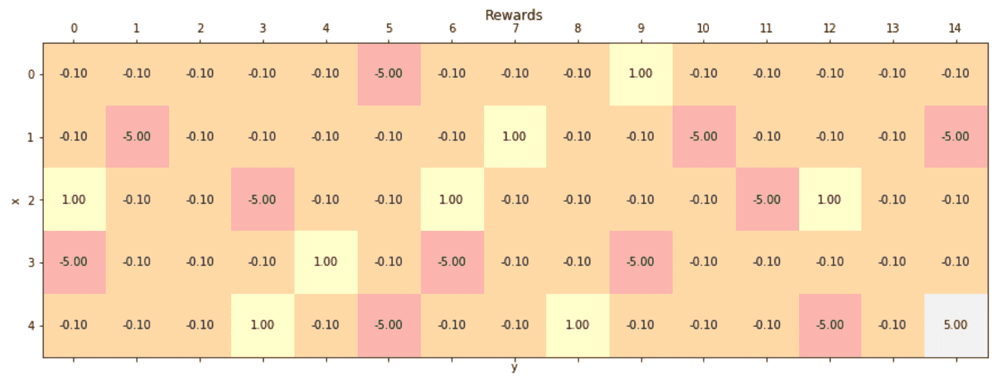

新地道环境中的奖励方案

在这一点上，我们可以继续初始化所有常数（特别是，我们选择了 *λ = 0.6*，这是一个中间解决方案，保证了接近蒙特卡洛方法的意识，同时不损害学习速度）：

```py
import numpy as np

nb_actions = 4
max_steps = 1000
alpha = 0.25
lambd = 0.6
gamma = 0.95

tunnel_values = np.zeros(shape=(height, width))
eligibility_traces = np.zeros(shape=(height, width))
policy = np.random.randint(0, nb_actions, size=(height, width)).astype(np.uint8)
```

就像在 Python 中，关键字 `lambda` 是保留的；我们使用了截断的表达式 `lambd` 来声明常数。

由于我们想要从一个随机单元格开始，我们需要重复上一章中介绍的相同程序；但在这个情况下，我们还包括检查点状态：

```py
import numpy as np

xy_grid = np.meshgrid(np.arange(0, height), np.arange(0, width), sparse=False)
xy_grid = np.array(xy_grid).T.reshape(-1, 2)

xy_final = list(zip(x_wells, y_wells)) + list(zip(x_prizes, y_prizes))
xy_final.append([x_final, y_final])

xy_start = []

for x, y in xy_grid:
    if (x, y) not in xy_final:
        xy_start.append([x, y])

xy_start = np.array(xy_start)

def starting_point():
    xy = np.squeeze(xy_start[np.random.randint(0, xy_start.shape[0], size=1)])
    return xy[0], xy[1]
```

我们现在可以定义`episode()`函数，它实现了完整的 TD(λ)周期。由于我们不希望智能体无限次地四处游荡尝试通过检查点，我们决定在探索期间减少奖励，以激励智能体仅通过必要的检查点——同时尽可能快地达到最终状态：

```py
import numpy as np

def is_final(x, y):
    if (x, y) in zip(x_wells, y_wells) or (x, y) == (x_final, y_final):
        return True
    return False

def episode():
    (i, j) = starting_point()
    x = y = 0

    e = 0

    state_history = [(i, j)]

    init_tunnel_rewards()
    total_reward = 0.0

    while e < max_steps:
        e += 1

        action = policy[i, j]

        if action == 0:
            if i == 0:
                x = 0
            else:
                x = i - 1
            y = j

        elif action == 1:
            if j == width - 1:
                y = width - 1
            else:
                y = j + 1
            x = i

        elif action == 2:
            if i == height - 1:
                x = height - 1
            else:
                x = i + 1
            y = j

        else:
            if j == 0:
                y = 0
            else:
                y = j - 1
            x = i

        reward = tunnel_rewards[x, y]
        total_reward += reward

        td_error = reward + (gamma * tunnel_values[x, y]) - tunnel_values[i, j]
        eligibility_traces[i, j] += 1.0

        for sx, sy in state_history:
            tunnel_values[sx, sy] += (alpha * td_error * eligibility_traces[sx, sy])
            eligibility_traces[sx, sy] *= (gamma * lambd)

        if is_final(x, y):
            break
        else:
            i = x
            j = y

            state_history.append([x, y])

            tunnel_rewards[x_prizes, y_prizes] *= 0.85

    return total_reward

def policy_selection():
    for i in range(height):
        for j in range(width):
            if is_final(i, j):
                continue

            values = np.zeros(shape=(nb_actions, ))

            values[0] = (tunnel_rewards[i - 1, j] + (gamma * tunnel_values[i - 1, j])) if i > 0 else -np.inf
            values[1] = (tunnel_rewards[i, j + 1] + (gamma * tunnel_values[i, j + 1])) if j < width - 1 else -np.inf
            values[2] = (tunnel_rewards[i + 1, j] + (gamma * tunnel_values[i + 1, j])) if i < height - 1 else -np.inf
            values[3] = (tunnel_rewards[i, j - 1] + (gamma * tunnel_values[i, j - 1])) if j > 0 else -np.inf

            policy[i, j] = np.argmax(values).astype(np.uint8)
```

`is_final()`和`policy_selection()`函数与上一章中定义的相同，无需解释。即使实际上并不必要，我们决定在达到`max_steps`步数后强制终止。这有助于开始时，因为策略不是*ε*-贪婪的，智能体可能会陷入无限循环探索中。现在我们可以为固定数量的轮次训练模型（或者，当值数组不再变化时，可以停止过程）：

```py
n_episodes = 5000

total_rewards = []

for _ in range(n_episodes): 
    e_reward = episode()
    total_rewards.append(e_reward)
    policy_selection()
```

`episode()`函数返回总奖励；因此，检查智能体学习过程是如何发展的很有用：

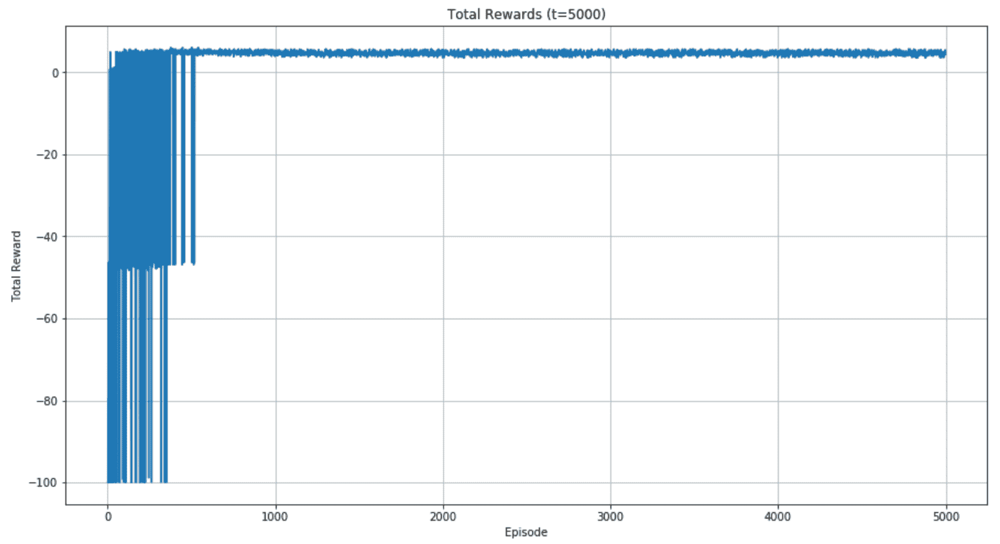

智能体获得的总奖励

在开始时（大约 500 轮），智能体采用不可接受的策略，导致非常负面的总奖励。然而，在大约 1,000 次迭代后，算法达到了一个最优策略，后续的轮次仅略有改进。振荡是由于不同的起始点；然而，总奖励从未为负，并且随着检查点权重的衰减，这是一个积极的信号，表明智能体达到了最终的正状态。为了证实这一假设，我们可以绘制学习到的值函数：

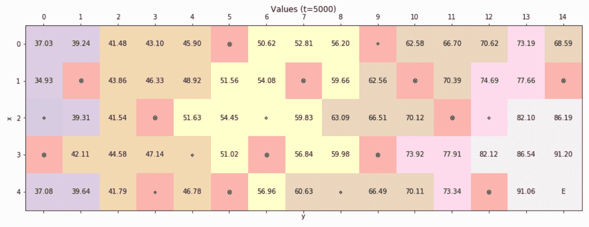

最终值矩阵

这些值与我们的初始分析一致；事实上，当单元格接近检查点时，它们往往更高，但与此同时，全局配置（考虑到对*V(s)*贪婪的策略）迫使智能体达到周围值最高的结束状态。最后一步是检查实际策略，特别关注检查点：

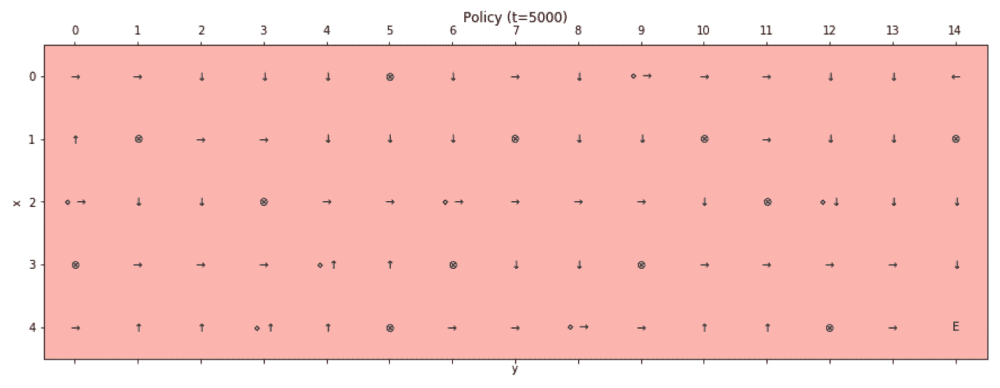

最终策略

如我们所见，智能体试图通过检查点，但当它接近最终状态时，它（正确地）更倾向于尽快结束这一轮。我邀请读者使用不同的常数*λ*值重复实验，并改变检查点的环境动态。如果它们的值保持不变会发生什么？是否可以通过更高的*λ*来改善策略？

重要的是要记住，由于我们广泛使用随机值，连续的实验可能会由于不同的初始条件而产生不同的结果。然而，当轮次足够多时，算法应该始终收敛到最优策略。

# 棋盘环境中的 Actor-Critic TD(0)

在这个例子中，我们想要使用一个名为 *Actor-Critic* 的替代算法，结合 TD(0)。在这个方法中，智能体被分为两个部分，一个 Critic，它负责评估价值估计的质量，以及一个 actor，它选择并执行动作。正如 Dayan 在 *Theoretical Neuroscience* 中所指出的（*Dayan P*., *Abbott L*. *F*., *The MIT Press*），Actor-Critic 方法中的动态类似于策略评估和策略改进步骤的交织。实际上，Critic 的知识是通过一个迭代过程获得的，其初始评估通常是次优的。

结构架构如下图所示：

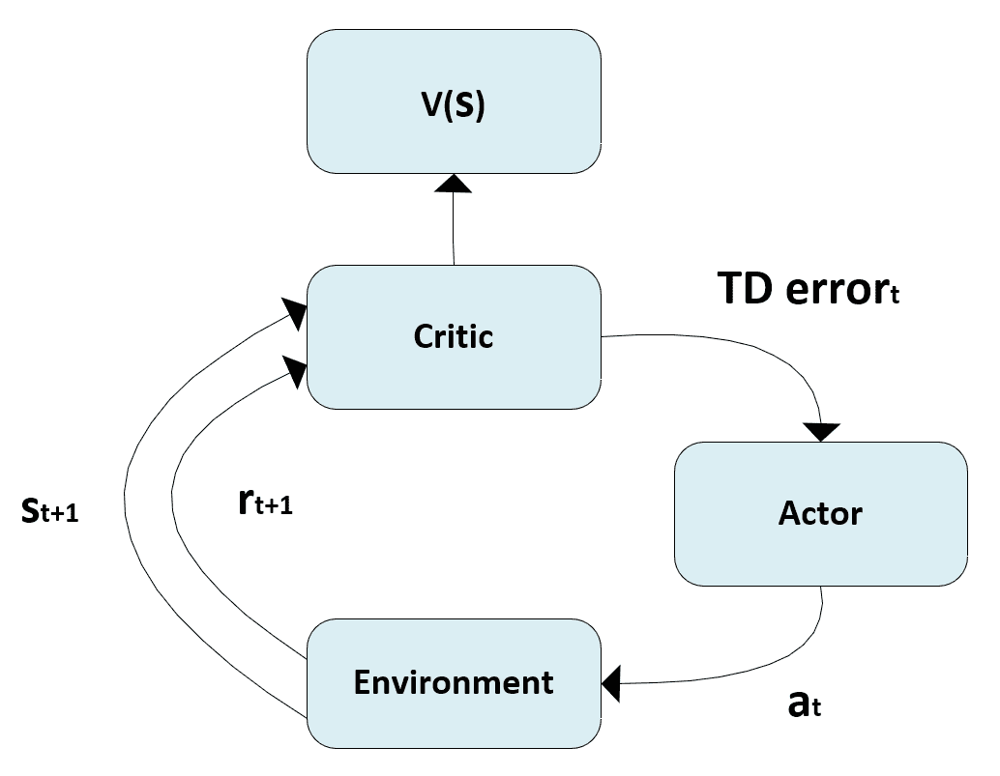

Actor-Critic 架构

在这个特定情况下，最好采用基于 softmax 函数的 *ε*-greedy 软策略。模型存储一个矩阵（或一个近似函数），称为 *策略重要性*，其中每个条目 *pi* 代表在特定状态下对特定动作的偏好值。实际的随机策略是通过应用 softmax 并使用一个简单的技巧来增加当指数变得非常大时的数值稳定性来获得的：

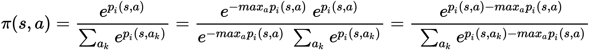

在状态 *s[i]* 中执行动作 *a* 并观察到过渡到状态 *s[j]* 以及奖励 *r[ij]* 后，Critic 评估 TD 错误：

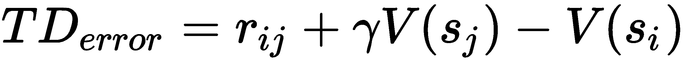

如果 *V(s[i]) < r[ij] + γV(s[j]*)，则认为转换是积极的，因为值在增加。相反，当 *V(s[i]) > r[ij] + γV(s[j]*)* 时，Critic 将动作评估为负，因为之前的值高于新的估计。一种更通用的方法是基于 *优势* 的概念，它被定义为：

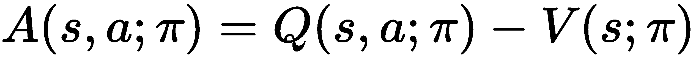

通常，前一个表达式中的一个项可以被近似。在我们的情况下，我们无法直接计算 *Q* 函数；因此，我们用项 *r[ij] + γV(s[j]*)* 来近似它。很明显，优势的作用类似于 TD 错误（这是一个近似）的作用，并且必须代表在某个状态下采取的动作是一个好选择还是坏选择。对所有 **优势 Actor-Critic** (*A3C*) 算法（换句话说，标准 *策略梯度* 算法的改进）的分析超出了本书的范围。然而，读者可以在 *High-Dimensional Continuous Control Using Generalized Advantage Estimation* 中找到一些有用的信息，*Schulman J*., *Moritz P*., *Levine S*., *Jordan M*. *I*., *Abbeel P*., *ICLR 2016*。

当然，Actor-Critic 校正是不够的。为了改进策略，有必要使用标准算法（如 TD(0)、TD(λ)或最小二乘回归，这可以通过神经网络实现）来学习正确的值函数 *V(s)*。对于许多其他算法，这个过程只有在足够多的迭代次数之后才能收敛，这必须被利用来多次访问状态，尝试所有可能的行为。

因此，使用 TD(0)方法，在评估 TD 误差后的第一步是使用前一章中定义的规则更新 *V(s)*：

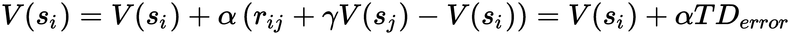

第二步更加实用；实际上，Critic 的主要作用实际上是对每个动作进行批评，决定在某种状态下是增加还是减少再次选择该动作的概率。这个目标可以通过简单地更新策略重要性来实现：

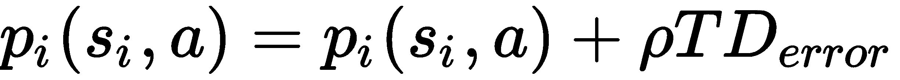

学习率 *ρ* 的作用极其重要；事实上，不正确的值（换句话说，过高的值）可能导致初始错误的校正，从而损害收敛。必须记住，值函数在开始时几乎完全未知，因此 Critic 没有机会通过意识来增加正确的概率。因此，我总是建议从非常小的值（*ρ = 0.001*）开始，并且只有在算法的收敛速度确实得到有效提高时才增加它。

由于策略基于 softmax 函数，在 Critic 更新后，值将始终被重新归一化，从而形成一个实际的概率分布。经过足够多的迭代次数，并且正确选择 *ρ* 和 *γ*，模型能够学习到随机策略和值函数。因此，可以通过始终选择概率最高的动作（这对应于隐式贪婪行为）来使用训练好的智能体：

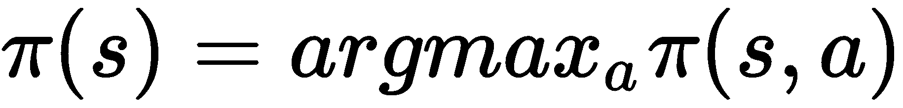

现在我们将这个算法应用到隧道环境中。第一步是定义常数（因为我们正在寻找一个远视的智能体，所以我们设置折现因子 *γ = 0.99*）：

```py
import numpy as np

tunnel_values = np.zeros(shape=(height, width))

gamma = 0.99
alpha = 0.25
rho = 0.001
```

在这一点上，我们需要定义策略重要性数组和一个生成 softmax 策略的函数：

```py
import numpy as np

nb_actions = 4

policy_importances = np.zeros(shape=(height, width, nb_actions))

def get_softmax_policy():
    softmax_policy = policy_importances - np.amax(policy_importances, axis=2, keepdims=True)
    return np.exp(softmax_policy) / np.sum(np.exp(softmax_policy), axis=2, keepdims=True)
```

实现单个训练步骤所需的函数非常简单，读者应该已经熟悉它们的结构：

```py
import numpy as np

def select_action(epsilon, i, j):
    if np.random.uniform(0.0, 1.0) < epsilon:
        return np.random.randint(0, nb_actions)

    policy = get_softmax_policy()
    return np.argmax(policy[i, j])

def action_critic_episode(epsilon):
    (i, j) = starting_point()
    x = y = 0

    e = 0

    while e < max_steps:
        e += 1

        action = select_action(epsilon, i, j)

        if action == 0:
            if i == 0:
                x = 0
            else:
                x = i - 1
            y = j

        elif action == 1:
            if j == width - 1:
                y = width - 1
            else:
                y = j + 1
            x = i

        elif action == 2:
            if i == height - 1:
                x = height - 1
            else:
                x = i + 1
            y = j

        else:
            if j == 0:
                y = 0
            else:
                y = j - 1
            x = i

        reward = tunnel_rewards[x, y]
        td_error = reward + (gamma * tunnel_values[x, y]) - tunnel_values[i, j]

        tunnel_values[i, j] += (alpha * td_error)
        policy_importances[i, j, action] += (rho * td_error)

        if is_final(x, y):
            break
        else:
            i = x
            j = y
```

在这一点上，我们可以用 50,000 次迭代和 30,000 次探索性迭代（探索因子线性衰减）来训练模型：

```py
n_episodes = 50000
n_exploration = 30000

for t in range(n_episodes):
    epsilon = 0.0

    if t <= n_exploration:
        epsilon = 1.0 - (float(t) / float(n_exploration))

    action_critic_episode(epsilon)
```

结果的贪婪策略如图所示：

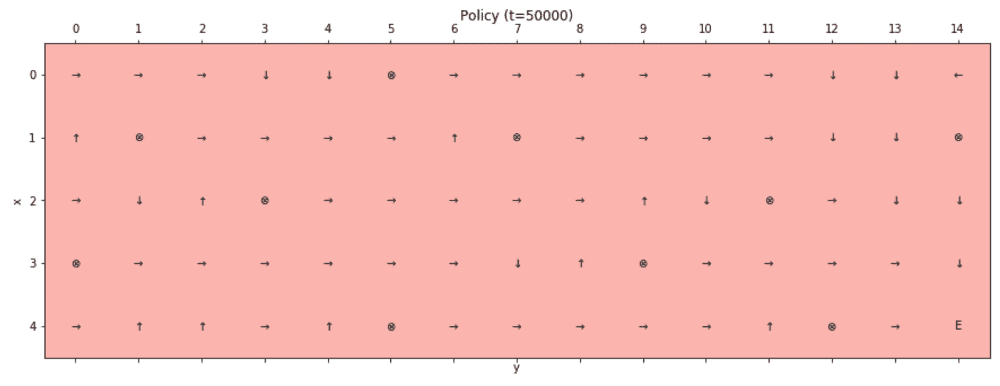

最终贪婪策略

最终的贪婪策略与目标一致，智能体通过避免陷阱始终达到最终的正状态。这种算法可能比必要的更复杂；然而，在复杂情况下，它证明非常有效。事实上，学习过程可以通过 Critic 执行的快速校正而显著改进。此外，作者注意到 Actor-Critic 对错误的（或噪声的）评估更稳健。由于策略是分别学习的，*V(s)*的小幅变化不会轻易改变概率*π(s, a)*（特别是当动作通常比其他动作强得多时）。另一方面，如前所述，为了避免过早收敛，有必要避免算法修改重要性/概率，而不需要过多的迭代。只有在分析每个具体场景之后，才能找到正确的权衡，不幸的是，没有适用于所有情况的通用规则。我的建议是测试各种配置，从小的值开始（例如，折扣因子*γ ∈ [0.7, 0.9]*），评估在相同的探索期后获得的累计奖励。

复杂的深度学习模型（如异步 A3C；参见*异步深度强化学习方法*，Mnih V.，Puigdomènech Badia A.，Mirza M.，Graves A.，Lillicrap T. P.，Harley T.，Silver D.，Kavukcuoglu K.，arXiv:1602.01783 [cs.LG]*以获取更多信息）基于一个网络，该网络输出 softmax 策略（其动作通常与概率成正比）和值。而不是使用显式的*ε*-greedy 软策略，可以在全局成本函数中添加一个*最大熵约束*：

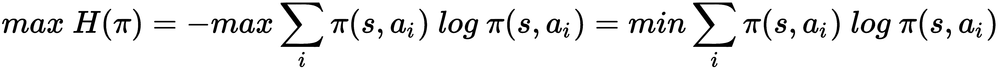

当所有动作具有相同概率时，熵达到最大值，这个约束（带有适当的权重）迫使算法增加探索概率，直到某个动作变得主导，不再需要避免贪婪选择。这是一种合理且简单的方法来应用*自适应ε-greedy 策略*，因为模型与每个状态分别工作，不确定性非常低的状态可以变得贪婪；在需要继续探索时，可以自动保持高熵，以最大化奖励。

双重校正的效果，加上最大熵约束，提高了模型的收敛速度，鼓励在初始迭代中进行探索，并产生非常高的最终精度。我邀请读者在其他场景和算法中实现这个变体。特别是，在本章的结尾，我们将尝试一个基于神经网络的算法。由于示例相当简单，我建议使用 Tensorflow 根据 Actor-Critic 方法创建一个小型网络。读者可以为价值使用*均方误差*损失，为策略使用 softmax 交叉熵。一旦模型成功应用于我们的玩具示例，就可以开始处理更复杂的情况（如 OpenAI Gym 中提出的[`gym.openai.com/`](https://gym.openai.com/)）。

# SARSA 算法

**SARSA**（其名称来源于序列*状态-动作-奖励-状态-动作*）是 TD(0)的自然扩展，用于估计*Q*函数。其标准公式（有时称为一步 SARSA 或 SARSA(0)，原因与上一章中解释的相同）基于单个下一个奖励*r[t+1]*，该奖励是通过在状态*s[t]*中执行动作*a[t]*获得的。时间差计算基于以下更新规则：

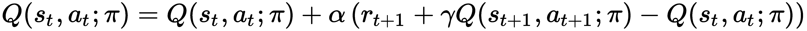

该方程等价于 TD(0)，如果策略选择为 GLIE，根据*Convergence Results for Single-Step On-Policy Reinforcement-Learning Algorithms*（*Singh S.*，*Jaakkola T.*，*Littman M. L.*，*Szepesvári C.*，*Machine Learning*，*39/2000*）中的证明，SARSA 在所有（状态，动作）对都被无限次体验的情况下，以概率 1 收敛到最优策略*π^(opt)(s)*。这意味着如果策略更新为相对于由*Q*引起的当前价值函数的贪婪策略，则成立：

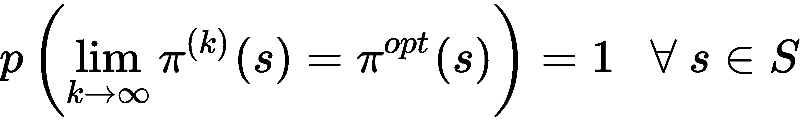

对于*Q*函数，同样的结果也是有效的。特别是，证明中所需的最重要条件是：

+   学习率，*α ∈ [0, 1]*，满足约束*Σα = ∞*和*Σα² < ∞*

+   奖励的方差必须是有限的

当*α*是状态和时间步的函数时，第一个条件尤为重要；然而，在许多情况下，它是一个介于 0 和 1 之间的常数，因此，*Σα² = ∞*。解决这个问题的常见方法（尤其是当需要大量迭代时）是在训练过程中让学习率衰减（换句话说，指数衰减）。相反，为了减轻非常大的奖励的影响，可以将它们剪辑到合适的范围内（*[-1, 1]*）。在许多情况下，不需要采用这些策略，但在更复杂的场景中，它们可能变得至关重要，以确保算法的收敛。此外，正如前一章所指出的，这类算法在开始稳定策略之前需要一个长的探索阶段。最常用的策略是采用*ε*-贪婪策略，探索因子的时序衰减。在最初的迭代中，智能体必须探索，而不关心动作的回报。这样，就可以在最终精炼阶段开始之前评估实际值，该阶段的特点是纯粹的贪婪探索，基于对*V(s)*的更精确近似。

完整的 SARSA(0)算法（带有可选的强制终止剧集）是：

1.  设置一个初始的确定性随机策略，*π(s)*

1.  设置初始值数组，*Q(s, a) = 0 ∀ s ∈ S* 和 *∀ a ∈ A*

1.  设置剧集数量，*N[episodes*]

1.  设置每剧集的最大步数，*N[max*]

1.  设置常数，*α* (*α = 0.1*)

1.  设置常数，*γ* (*γ** = 0.9*)

1.  设置初始探索因子，*ε^((0)) = 1.0*

1.  定义一个策略，让探索因子*ε*衰减（线性或指数）

1.  设置计数器，*e = 0*

1.  对于*i = 1*到*N[episodes]*：

    1.  观察初始状态，*s[i*]

    1.  当*s[j]*非终止且*e < N[max]*时：

        1.  *e += 1*

        1.  选择动作，*a[t] = **π(s[i**)，带有探索因子*ε*^(*e*)*

        1.  观察转换，*(a[t], s[i]) → (s[j], r[ij])*

        1.  选择动作，*a[t+1] = π(s[j]*)，带有探索因子*ε*^(*e*)*

        1.  更新*Q(s[t], a[t])*函数（如果*s[j]*是终止状态，则设置*Q(s[t+1], a[t+1]*) = 0*)

        1.  设置*s[i] = s[j*]

可选性跟踪的概念也可以扩展到 SARSA（以及其他 TD 方法）；然而，这超出了本书的范围。对感兴趣的读者来说，可以在*Sutton R. S.，Barto A. G.，强化学习，布拉德福德图书*中找到所有算法（包括它们的数学公式）。

# 棋盘环境中的 SARSA

我们现在可以在原始隧道环境中测试 SARSA 算法（所有未重新定义的元素与上一章相同）。第一步是定义*Q(s, a)*数组以及在训练过程中使用的常数：

```py
import numpy as np

nb_actions = 4

Q = np.zeros(shape=(height, width, nb_actions))

x_start = 0
y_start = 0

max_steps = 2000
alpha = 0.25
```

由于我们想采用*ε*-贪婪策略，我们可以将起点设置为 `(0, 0)`，迫使代理达到积极最终状态。我们现在可以定义执行训练步骤所需的函数：

```py
import numpy as np

def is_final(x, y):
    if (x, y) in zip(x_wells, y_wells) or (x, y) == (x_final, y_final):
        return True
    return False

def select_action(epsilon, i, j):
    if np.random.uniform(0.0, 1.0) < epsilon:
        return np.random.randint(0, nb_actions)
    return np.argmax(Q[i, j])

def sarsa_step(epsilon):
    e = 0

    i = x_start
    j = y_start

    while e < max_steps:
        e += 1

        action = select_action(epsilon, i, j)

        if action == 0:
            if i == 0:
                x = 0
            else:
                x = i - 1
            y = j

        elif action == 1:
            if j == width - 1:
                y = width - 1
            else:
                y = j + 1
            x = i

        elif action == 2:
            if i == height - 1:
                x = height - 1
            else:
                x = i + 1
            y = j

        else:
            if j == 0:
                y = 0
            else:
                y = j - 1
            x = i

        action_n = select_action(epsilon, x, y)
        reward = tunnel_rewards[x, y]

        if is_final(x, y):
            Q[i, j, action] += alpha * (reward - Q[i, j, action])
            break

        else:
            Q[i, j, action] += alpha * (reward + (gamma * Q[x, y, action_n]) - Q[i, j, action])

            i = x
            j = y
```

`select_action()` 函数被设计为以概率*ε*选择随机动作，以概率*1 - **ε*选择基于*Q(s, a)*的贪婪动作。`sarsa_step()` 函数很简单，执行一个完整的剧集更新*Q(s, a)*（这就是为什么这是一个在线算法）。在这个阶段，我们可以对模型进行 20,000 个剧集的训练，并在前 15,000 个剧集期间使用*ε*的线性衰减（当 t > 15,000 时，*ε*设置为 0，以便采用纯贪婪策略）：

```py
n_episodes = 20000
n_exploration = 15000

for t in range(n_episodes):
    epsilon = 0.0

    if t <= n_exploration:
        epsilon = 1.0 - (float(t) / float(n_exploration))

    sarsa_step(epsilon)
```

如同往常，让我们检查学习到的值（考虑到策略是贪婪的，我们将绘制*V(s)* = max[a] Q(s, a)*）：

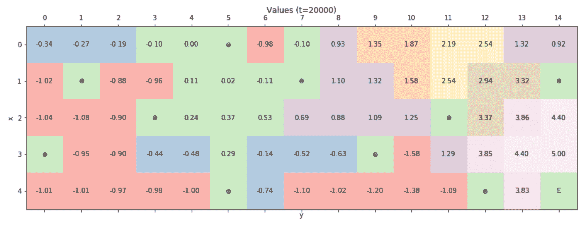

最终值矩阵（作为*V(s) = max[a] Q(s, a)*）

如预期，Q 函数已经以一致的方式学习，我们可以通过绘制结果策略来得到证实：

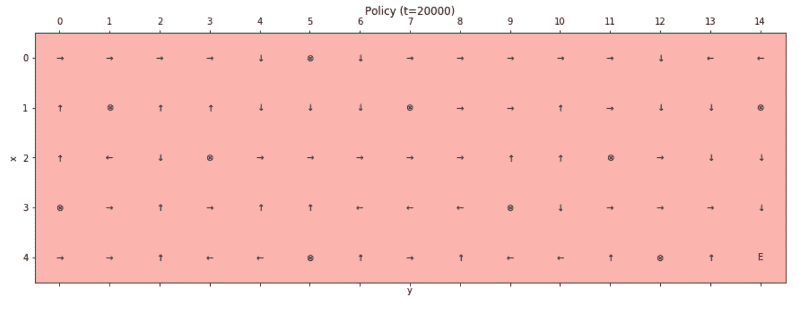

最终策略

政策与初始目标一致，代理避免了所有负面吸收状态，始终试图向最终积极状态移动。然而，一些路径似乎比预期的要长。作为一个练习，我邀请读者重新训练模型，进行更多的迭代次数，调整探索期。此外，*是否可以通过增加（或减少）折扣因子γ来改进模型？* 记住，*γ → 0* 导致短视的代理，只能根据即时奖励选择动作，而*γ → 1* 则迫使代理考虑更多的未来奖励。这个特定例子基于一个长期环境，因为代理始终从 *(0, 0)* 开始，必须到达最远点；因此，所有中间状态的重要性都较低，展望未来以选择最佳动作是有帮助的。使用随机起点可以无疑地改善所有初始状态的政策，但研究不同的*γ*值如何影响决策是有趣的；因此，我建议重复实验以评估不同的配置并提高对涉及 TD 算法的不同因素的意识。

# Q-learning

这个算法由 Watkins（在*延迟奖励学习*，*Watkins C.I.C.H.*，*博士论文*，*剑桥大学*，*1989*；并在*Watkins C.I.C.H.*，*Dayan P.*，*技术笔记 Q-Learning*，*机器学习 8*，*1992*）提出，作为 SARSA 的更有效替代方案。*Q-learning*的主要特点是 TD 更新规则立即对*Q(s[t+1], a)*函数贪婪：

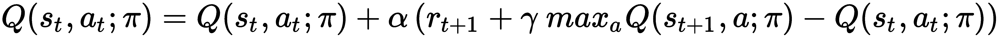

关键思想是比较当前 *Q(s[t], a[t])* 值与代理处于后续状态时可以达到的最大 *Q* 值。实际上，由于策略必须是 GLIE，可以通过避免选择不会与最终动作关联的 *Q* 值而导致的错误估计来提高收敛速度。通过选择最大 *Q* 值，算法将比 SARSA 更快地趋向于最优解，并且，收敛证明也更加宽松。事实上，Watkins 和 Dayan（在上述论文中）证明了，如果 *|r[i]| < R*，则学习率 *α ∈ 0, 1[* （在这种情况下， α 必须始终小于 1）并且对 SARSA 施加相同的约束（*Σα = ∞* 和 *Σα² < ∞*），则估计的 *Q* 函数以概率 1 收敛到最优值：

![

如同 SARSA 所讨论的，可以通过使用裁剪函数和时间衰减来管理奖励和学习率的条件。在几乎所有的深度 Q 学习应用中，这些是保证收敛的极其重要的因素；因此，我邀请读者在训练过程无法收敛到可接受的解决方案时考虑它们。

完整的 Q-learning 算法（带有可选的强制终止回合）是：

1.  设置一个初始的确定性随机策略，*π(s)*

1.  设置初始值数组，*Q(s, a) = 0 ∀ s ∈ S* 和 *∀ a ∈ A*

1.  设置回合数，*N*[*episodes*]

1.  设置每个回合的最大步数，*N*[*max*]

1.  设置一个常数，*α* (*α = 0.1*)

1.  设置一个常数，*γ* (*γ** = 0.9*)

1.  设置一个初始探索因子， *ε^((0))* (*ε^((0)) = 1.0*)

1.  定义一个策略，让探索因子 *ε*衰减（线性或指数）

1.  设置一个计数器，*e = 0*

1.  对于 *i = 1* 到 *N[episodes]*:

    1.  观察初始状态， *s*[*i*]

    1.  当 *s[j]* 是非终止状态且 *e < N[max]* 时：

        1.  *e += 1*

        1.  选择动作，*a[t] = **π(s[i])*, 带有探索因子 *ε*^(*(e)*)

        1.  观察转换 (*a[t], s[i]*) → (*s[j], r[ij]*)

        1.  选择动作，*a[t+1] = π(s[j]**)*，带有探索因子 *ε*^(*(e)*)

        1.  使用 *max[a] Q(s[t+1], a)* 更新 *Q(s[t], a[t])* 函数（如果 *s[j]* 是终止状态，则设置 *Q(s[t+1], a[t+1]**) = 0*）

        1.  设置 *s[i] = s*[*j*]

# 棋盘环境中的 Q 学习

让我们用 Q 学习算法重复之前的实验。由于所有常数都相同（以及选择*ε*-贪婪策略和起始点设置为*(0, 0)*），我们可以直接定义实现单个回合训练的函数：

```py
import numpy as np

def q_step(epsilon):
    e = 0

    i = x_start
    j = y_start

    while e < max_steps:
        e += 1

        action = select_action(epsilon, i, j)

        if action == 0:
            if i == 0:
                x = 0
            else:
                x = i - 1
            y = j

        elif action == 1:
            if j == width - 1:
                y = width - 1
            else:
                y = j + 1
            x = i

        elif action == 2:
            if i == height - 1:
                x = height - 1
            else:
                x = i + 1
            y = j

        else:
            if j == 0:
                y = 0
            else:
                y = j - 1
            x = i

        reward = tunnel_rewards[x, y]

        if is_final(x, y):
            Q[i, j, action] += alpha * (reward - Q[i, j, action])
            break

        else:
            Q[i, j, action] += alpha * (reward + (gamma * np.max(Q[x, y])) - Q[i, j, action])

            i = x
            j = y
```

我们现在可以训练模型 5,000 次迭代，其中 3,500 次是探索性的：

```py
n_episodes = 5000
n_exploration = 3500

for t in range(n_episodes):
    epsilon = 0.0

    if t <= n_exploration:
        epsilon = 1.0 - (float(t) / float(n_exploration))

    q_step(epsilon)
```

得到的值矩阵（定义为 SARSA 实验中）是：

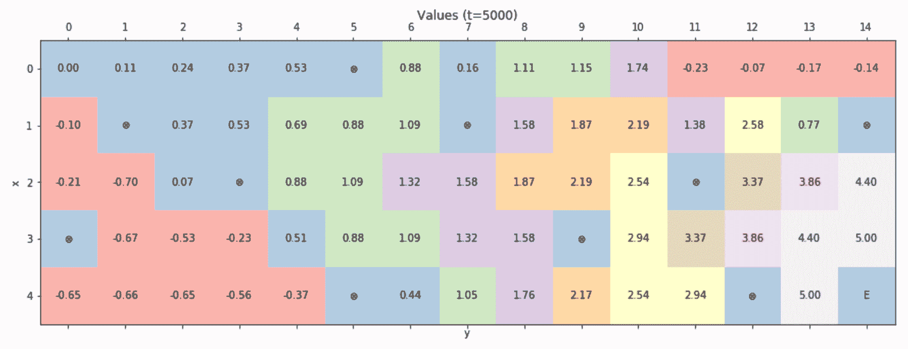

最终值矩阵

再次，学到的*Q*函数（以及显然的，贪婪的*V(s)*）与初始目标一致（特别是考虑到起始点设置为*(0, 0)*），并且由此产生的策略可以立即证实这一结果：


最终策略

Q 学习的表现与 SARSA（即使收敛速度更快）没有太大区别，并且一些初始状态管理并不完美。这是我们的选择的结果；因此，我邀请读者使用随机起始重复练习，并比较 Q 学习和 SARSA 的训练速度。

# 使用神经网络的 Q 学习

现在，我们想使用较小的棋盘环境和神经网络（使用 Keras）来测试 Q 学习算法。与前例的主要区别在于，现在状态由当前配置的截图表示；因此，模型必须学会将值与每个输入图像和动作关联起来。这不是实际的深度 Q 学习（它基于深度卷积网络，需要更复杂的环境，我们无法在本书中讨论），但它展示了这样的模型如何使用与人类相同的输入学习最优策略。为了减少训练时间，我们正在考虑一个正方形的棋盘环境，有四个负吸收状态和一个正最终状态：

```py
import numpy as np

width = 5
height = 5
nb_actions = 4

y_final = width - 1
x_final = height - 1

y_wells = [0, 1, 3, 4]
x_wells = [3, 1, 2, 0] 

standard_reward = -0.1
tunnel_rewards = np.ones(shape=(height, width)) * standard_reward

for x_well, y_well in zip(x_wells, y_wells):
    tunnel_rewards[x_well, y_well] = -5.0

tunnel_rewards[x_final, y_final] = 5.0
```

下图显示了奖励的图形表示：

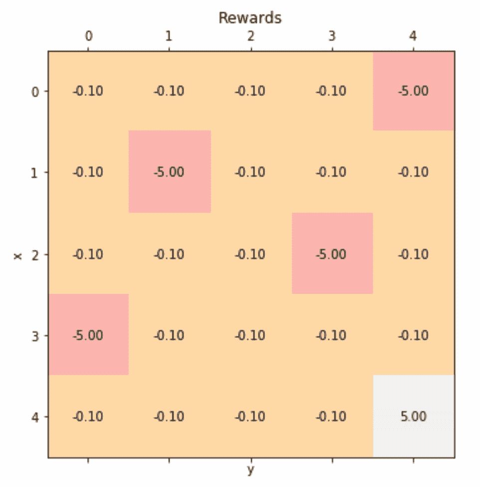

较小棋盘环境中的奖励

由于我们希望向网络提供图形输入，我们需要定义一个函数来创建表示隧道的矩阵：

```py
import numpy as np

def reset_tunnel():
    tunnel = np.zeros(shape=(height, width), dtype=np.float32)

    for x_well, y_well in zip(x_wells, y_wells):
        tunnel[x_well, y_well] = -1.0

    tunnel[x_final, y_final] = 0.5

    return tunnel
```

`reset_tunnel()`函数将所有值设置为 0，除了（用`-1`标记）和最终状态（由`0.5`定义）。代理的位置（用值`1`定义）直接由训练函数管理。在此阶段，我们可以创建和编译我们的神经网络。由于问题不太复杂，我们正在使用 MLP：

```py
from keras.models import Sequential
from keras.layers import Dense, Activation

model = Sequential()

model.add(Dense(8, input_dim=width * height))
model.add(Activation('tanh'))

model.add(Dense(4))
model.add(Activation('tanh'))

model.add(Dense(nb_actions))
model.add(Activation('linear'))

model.compile(optimizer='rmsprop',
              loss='mse')
```

输入是一个展平的数组，而输出是*Q*函数（所有对应于每个动作的值）。网络使用 RMSprop 和均方误差损失函数进行训练（我们的目标是减少实际值和预测值之间的均方误差）。为了训练和查询网络，创建两个专用函数是有帮助的：

```py
import numpy as np

def train(state, q_value):
    model.train_on_batch(np.expand_dims(state.flatten(), axis=0), np.expand_dims(q_value, axis=0))

def get_Q_value(state):
    return model.predict(np.expand_dims(state.flatten(), axis=0))[0]

def select_action_neural_network(epsilon, state):
    Q_value = get_Q_value(state)

    if np.random.uniform(0.0, 1.0) < epsilon:
        return Q_value, np.random.randint(0, nb_actions)

    return Q_value, np.argmax(Q_value)
```

这些函数的行为很简单。对读者可能陌生的唯一元素是使用`train_on_batch()`方法。与`fit()`不同，此函数允许我们执行单个训练步骤，给定一批输入-输出对（在我们的情况下，我们始终只有一个对）。由于我们的目标是找到从每个可能的单元格开始的到达最终状态的最优路径，我们将使用随机起始：

```py
import numpy as np

xy_grid = np.meshgrid(np.arange(0, height), np.arange(0, width), sparse=False)
xy_grid = np.array(xy_grid).T.reshape(-1, 2)

xy_final = list(zip(x_wells, y_wells))
xy_final.append([x_final, y_final])

xy_start = []

for x, y in xy_grid:
    if (x, y) not in xy_final:
        xy_start.append([x, y])

xy_start = np.array(xy_start)

def starting_point():
    xy = np.squeeze(xy_start[np.random.randint(0, xy_start.shape[0], size=1)])
    return xy[0], xy[1]
```

现在，我们可以定义执行单个训练步骤所需的函数：

```py
import numpy as np

def is_final(x, y):
    if (x, y) in zip(x_wells, y_wells) or (x, y) == (x_final, y_final):
        return True
    return False

def q_step_neural_network(epsilon, initial_state): 
    e = 0
    total_reward = 0.0

    (i, j) = starting_point()

    prev_value = 0.0
    tunnel = initial_state.copy()
    tunnel[i, j] = 1.0

    while e < max_steps:
        e += 1

        q_value, action = select_action_neural_network(epsilon, tunnel)

        if action == 0:
            if i == 0:
                x = 0
            else:
                x = i - 1
            y = j

        elif action == 1:
            if j == width - 1:
                y = width - 1
            else:
                y = j + 1
            x = i

        elif action == 2:
            if i == height - 1:
                x = height - 1
            else:
                x = i + 1
            y = j

        else:
            if j == 0:
                y = 0
            else:
                y = j - 1
            x = i

        reward = tunnel_rewards[x, y]
        total_reward += reward

        tunnel_n = tunnel.copy()
        tunnel_n[i, j] = prev_value
        tunnel_n[x, y] = 1.0

        prev_value = tunnel[x, y]

        if is_final(x, y):
            q_value[action] = reward
            train(tunnel, q_value)
            break

        else:
            q_value[action] = reward + (gamma * np.max(get_Q_value(tunnel_n)))
            train(tunnel, q_value)

            i = x
            j = y

            tunnel = tunnel_n.copy()

    return total_reward
```

`q_step_neural_network()`函数与前面示例中定义的函数非常相似。唯一的区别是视觉状态的管理。每次发生转换时，值`1.0`（表示代理）从旧位置移动到新位置，前一个单元格的值重置为其默认值（保存在`prev_value`变量中）。另一个次要区别是缺少*α*，因为 SGD 算法中已经设置了学习率，因此没有必要在模型中添加另一个参数。现在我们可以用 10,000 次迭代训练模型，其中 7,500 次用于探索：

```py
n_episodes = 10000
n_exploration = 7500

total_rewards = []

for t in range(n_episodes):
    tunnel = reset_tunnel()

    epsilon = 0.0

    if t <= n_exploration:
        epsilon = 1.0 - (float(t) / float(n_exploration))

    t_reward= q_step_neural_network(epsilon, tunnel)
    total_rewards.append(t_reward)
```

当训练过程完成后，我们可以分析总奖励，以了解网络是否成功学习了*Q*函数：

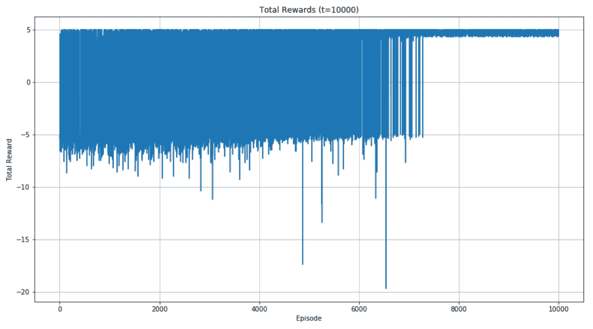

神经网络 Q 学习算法获得的总奖励

很明显，模型运行良好，因为经过探索期后，总奖励值稳定在`4`左右，由于路径长度不同而出现小幅波动（然而，由于 Keras 使用的内部随机状态，最终图表可能会有所不同）。为了确认这一点，让我们使用贪婪策略（相当于*ε = 0*）生成所有可能初始状态下的轨迹：

```py
import numpy as np

trajectories = []
tunnels_c = []

for i, j in xy_start:
    tunnel = reset_tunnel()

    prev_value = 0.0

    trajectory = [[i, j, -1]]

    tunnel_c = tunnel.copy()
    tunnel[i, j] = 1.0
    tunnel_c[i, j] = 1.0

    final = False
    e = 0

    while not final and e < max_steps:
        e += 1

        q_value = get_Q_value(tunnel)
        action = np.argmax(q_value)

        if action == 0:
            if i == 0:
                x = 0
            else:
                x = i - 1
            y = j

        elif action == 1:
            if j == width - 1:
                y = width - 1
            else:
                y = j + 1
            x = i

        elif action == 2:
            if i == height - 1:
                x = height - 1
            else:
                x = i + 1
            y = j

        else:
            if j == 0:
                y = 0
            else:
                y = j - 1
            x = i

        trajectory[e - 1][2] = action
        trajectory.append([x, y, -1])

        tunnel[i, j] = prev_value

        prev_value = tunnel[x, y]

        tunnel[x, y] = 1.0
        tunnel_c[x, y] = 1.0

        i = x
        j = y

        final = is_final(x, y)

    trajectories.append(np.array(trajectory))
    tunnels_c.append(tunnel_c)

trajectories = np.array(trajectories) 
```

下图显示了 12 条随机轨迹：

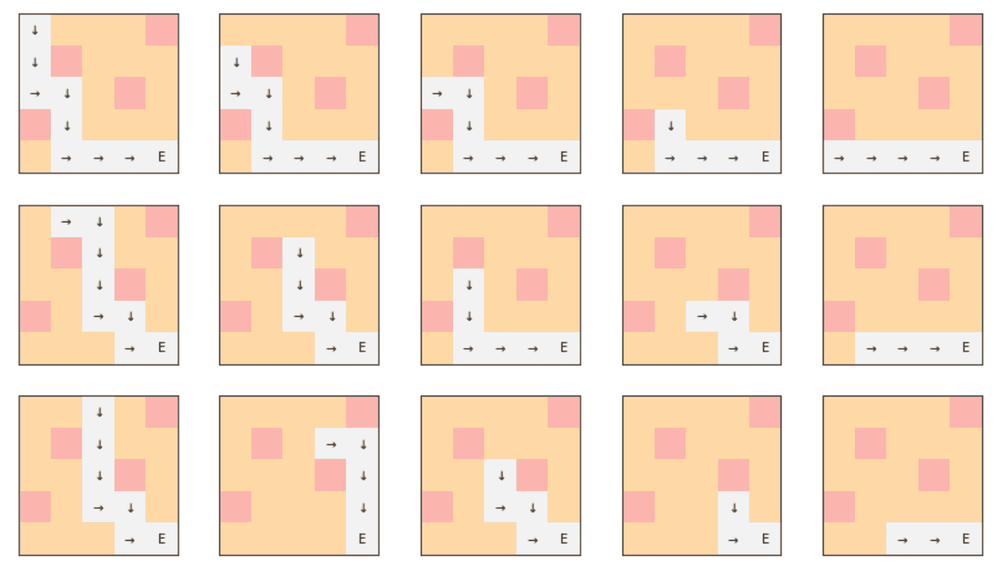

使用贪婪策略生成的 12 条轨迹

代理始终遵循最优策略，不受初始状态的影响，并且永远不会陷入陷阱。即使示例相当简单，也有助于向读者介绍深度 Q 学习（有关更多细节，读者可以查看介绍性论文，*深度强化学习*：*概述*，*Li Y.*，*arXiv:1701.07274 [cs.LG]*）。

在一般情况下，环境可以是一个更复杂的游戏（如 Atari 或 Sega），可能采取的动作数量非常有限。此外，没有随机开始的可能性，但通常一个好的做法是跳过一些初始帧，以避免对估计器的偏差。显然，网络必须更复杂（涉及卷积以更好地学习几何依赖关系），并且迭代次数必须非常大。为了加快收敛速度，可以采用许多其他技巧和特定算法，但由于篇幅限制，这些内容超出了本书的范围。

然而，一般过程及其逻辑几乎是相同的，理解为什么某些策略更可取以及如何提高准确性并不困难。作为一个练习，我邀请读者创建更复杂的环境，带有或不带有检查点和随机奖励。看到模型能够轻松地通过足够多的回合学习动态，这并不令人惊讶。此外，正如在 Actor-Critic 部分所建议的，使用 Tensorflow 实现这样一个模型是一个好主意，并将性能与 Q-learning 进行比较。

# 摘要

在本章中，我们介绍了基于不同长度备份的平均的 TD(0)的自然演变。被称为 TD(λ)的算法非常强大，它保证了比 TD(0)更快的收敛速度，只需满足少数（非限制性）条件。我们还展示了如何使用 TD(0)实现 Actor-Critic 方法，以便学习随机策略和值函数。

在接下来的章节中，我们讨论了基于估计*Q*函数的两种方法：SARSA 和 Q-learning。它们非常相似，但后者采用贪婪方法，其性能（特别是训练速度）使其优于 SARSA。Q-learning 算法是最新发展中最重要的模型之一。事实上，它是第一个与深度卷积网络结合使用的强化学习方法，用于解决复杂环境（如 Atari 游戏）。因此，我们也提供了一个基于 MLP 的简单示例，该 MLP 处理视觉输入并输出每个动作的*Q*值。

强化学习的世界极其迷人，每天都有数百名研究人员致力于改进算法和解决越来越复杂的问题。我邀请读者查阅参考文献，以找到可以利用的有用资源，从而更深入地理解模型及其发展。此外，我建议阅读由谷歌 DeepMind 团队撰写的博客文章，该团队是深度强化学习领域的先驱之一。我还建议搜索在*arXiv*上免费提供的论文。

我很高兴以这个主题结束这本书，因为我相信强化学习可以提供新的、更强大的工具，这将极大地改变我们的生活！
