# 第七章：实现深度学习算法

深度学习是近年来在受欢迎程度上显著增长的机器学习领域。深度学习，也被称为深度结构学习或分层学习，指的是使用多层人工神经网络从数据中训练。在过去的几年里，已经能够执行某些任务，如图像识别，比人类做得更好。

我们将在本章中涵盖以下主题：

+   理解深度学习

+   深度学习的应用

+   理解深度神经网络

+   理解卷积神经网络

# 理解深度学习

深度学习算法在过去十年中获得了流行。自动驾驶汽车、语音识别和机器人技术等技术由于深度学习算法的改进而取得了显著进步。深度学习帮助研究人员在训练模型执行此类任务时显著减少了错误数量，并在某些任务上超越了人类。然而，最有趣的是，深度学习算法的灵感来源于人类大脑的工作方式。

让我们以图像识别为例。我们看到物体并能够根据我们过去看到这些物体的经验来识别它们。然而，让我们分解这个过程，看看具体发生了什么。首先，光线击中物体，进入我们的眼睛，并击中视网膜。视网膜是一种感觉膜，将光线转换为神经信号。然后，这个信号通过视网膜后面的各个层级传递到大脑。我们的大脑识别在我们眼前场景中存在的物体数量。根据过去的参考，我们的大脑可以识别这些物体。

我们观察物体并识别它的过程中没有单一的过程。从光线进入我们的眼睛到我们的大脑识别物体之间有各种抽象层级。当我们的大脑停止并决定它试图解释的信号中的哪些特征时，没有特定的过程。这样的特征提取过程是自动发生的。

深度学习算法也遵循一个类似的过程。深度学习将获取数据到各个抽象层级的任务分解，使得每一层解释输入数据，并为下一层抽象提供有意义的输出。例如，在图像识别任务中，输入可能是一组来自图像的像素。在第一层，像素可以被处理以找到图像中的边缘。在第二层，关于边缘的信息可以被处理以检测这些边缘之间的角。在下一层，这些角和边缘可以被用来检测图像中的对象。下一层可能预测每个对象是什么。这些抽象层不需要我们定义，但可以自动训练。

在诸如朴素贝叶斯和线性回归等算法中，我们总是使用手工制作的特征。我们已经有分析师查看传入的数据集，并根据数据定义特征集。我们将每个类别标记为分类或连续。然而，在深度学习方法中，我们只需要具有简单特征的数据集，并使用抽象层来创建额外的抽象特征。因此，在如图像识别这样的任务中，数据集是像素集，传统算法在学会如何分类之前需要帮助识别图像中的对象。我们还需要从对象中提取特征，如颜色和大小，然后才能将这些特征输入到分类模型中。然而，对于深度学习算法，我们使用图像的像素作为算法的输入，并带有标记的对象，这样深度学习模型就可以识别错误并执行自我纠正。

深度学习算法可以执行监督学习和无监督学习算法。

# 深度学习的应用

在本节中，我们将展示一些流行的深度学习算法应用实例。

# 自动驾驶汽车

自动驾驶汽车已成为汽车行业的主流，每个主要公司都在投资建设下一代自动驾驶汽车。大多数公司在其最新车型中提供一定程度的自动驾驶功能。这些算法主要是由深度学习算法驱动的。让我们看看如何使用深度学习开发自动驾驶算法。

自动驾驶算法的任务是分析道路状况并正确地对其做出反应，以便将汽车从起点开到目的地地址。这个算法的输入是他们从汽车四面安装的摄像头接收到的视频流。算法的输出是转向、油门和刹车的信号。

这个任务极其复杂，因为驾驶员在处理道路状况时需要做出瞬间的决策。驾驶员不仅需要记住到达目的地需要转弯的位置或道路上的速度限制，还必须监控道路上其他车辆和可能横穿道路的行人。

为此类任务创建基于规则的算法非常困难，因为道路上可能发生的大量排列组合。此外，生成具有良好定义特征的任何标记数据集也很困难，因为可能出现的情景数量很难在一个全面的数据集中进行标记。

深度学习算法在这种情况下非常完美，因为从视频流中自动提取特征并根据奖励函数训练模型可以帮助我们抽象自动驾驶汽车中的问题。我们可以将深度学习算法的输入设置为视频流中的像素，将奖励函数设置为在遵守所有交通规则的同时向目的地前进的进度。模拟器用于训练这些模型。这种模拟模仿了道路上的实际条件。

深度学习算法可以自动确定如何生成抽象层的层次，将视频流中的像素转换为检测边缘和对象，类似于图像识别模型。一旦检测到对象，基于汽车所做的错误和纠正，我们训练模型学习如何输出油门、刹车和方向盘指令。最初，在运行模型时，自动驾驶汽车会犯错误并撞到物体。然而，经过足够的迭代，深度学习模型可以学会如何避免这样的错误，并在预定的路线上行驶。因此，无需从视频流中手动提取特征，也不需要生成任何结构化数据集，深度学习算法可以自动学习实现某些目标。

# 使用深度学习算法学习玩视频游戏

深度学习的另一个流行例子是训练机器玩电脑游戏。世界各地的研究人员通过训练模型来玩 2D 平台游戏，如超级马里奥，来测试他们的深度学习算法。模型的输入是屏幕上的像素，而模型生成的输出是一系列控制器指令，这些指令控制角色并在游戏中完成目标。

我们不需要教深度学习模型这是款视频游戏，以及有一个名叫马里奥的角色需要跳上平台来完成关卡。我们只需要定义一个奖励函数，使得如果角色在没有死亡的情况下移动到下一个平台，我们就奖励深度学习模型，如果角色死亡，我们就惩罚模型。如前所述，深度学习模型会自动将问题划分为多个抽象层次。

模型学习如何自动检测屏幕上的边缘和平台。它首先通过角色进行随机移动，并迅速学习当按下不同的控制器按钮时屏幕上的像素是如何被操作的。基于角色的移动，模型学习如何使主要角色前进。类似于自动驾驶汽车，它也会自动学习触摸屏幕上的某些物体会导致惩罚，以及跳上屏幕上的某些边缘会导致玩家掉入坑中。因此，基于这些给模型提供反馈的奖励函数，模型学习如何导航关卡中的障碍物，将玩家移动到正确的方向。经过进一步训练，它还可以学习如何解决游戏中的谜题。

因此，只需向深度学习模型提供屏幕像素，我们就可以训练一台机器来玩电子游戏。你可以在周围看到这些实现的例子。不久，机器将学会如何通过基于这些机器学习模型的理性思考来解决复杂的谜题。

# 理解深度学习算法

在下一节中，我们将研究最流行的深度学习算法之一，称为深度神经网络。

在我们探讨深度神经网络之前，我们将研究神经网络是什么。然后，我们将学习深度神经网络算法是什么，以及为什么它们比神经网络有改进。最后，我们将研究卷积神经网络——这是在图像识别领域使用的一种神经网络变体——并展示我们如何能够从图像的像素中自动学习抽象层。

# 神经网络算法

神经网络算法是受生物神经网络算法启发的机器学习算法。神经网络模仿我们大脑中的神经元是如何工作的。它们有输入节点，信息被输入到网络中，以及一个输出层，它传输特定的动作或预测。神经网络定义了一个结构，其中存储了机器学习模型的信息。

以下截图显示了神经网络结构：

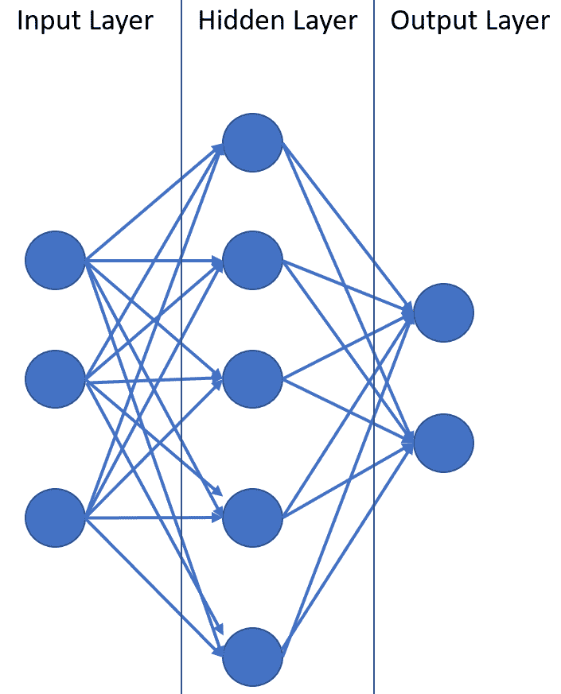

来自数据集的输入特征被输入到神经网络输入节点中。例如，如果我们有一个包含诸如温度、云条件和风速等特征的数据库，并且我们的任务是预测某一天是否会下雨，那么这些特征就被作为输入输入到神经网络中。这些特征可以是二进制或连续值。请注意，每个输入特征对应一个输入节点。

模型的信息存储在隐藏层中的边和节点上。有各种算法可以用来训练神经网络。大多数算法迭代地在神经网络中传递输入参数，并根据隐藏节点中的权重预测输出节点的值。基于预测中的误差，这些权重被调整以改进模型。

输出节点对应于神经网络算法需要做出的预期动作或预测。我们的目标是训练隐藏节点中的权重，使得输出节点的值是准确的。

因此，神经网络松散地基于可以处理输入信号并基于该神经元的函数产生输出的生物神经元。

# 激活函数

现在，让我们看看神经网络算法是如何训练来计算每个隐藏节点的权重的。在我们开始训练神经网络模型之前，我们需要定义每个隐藏节点将如何处理输入信号并产生输出。用于根据输入函数计算隐藏节点输出的函数称为激活函数。激活函数定义了隐藏节点可以生成的输出范围。在其最简单形式中，激活函数可以是一个步骤函数，其中节点输出基于输入是 0 或 1。在我们天气数据集中的简单例子是这样的：如果天空多云，隐藏节点的输出可能是 1，作为预测降雨的预测，如果天空晴朗，隐藏节点的输出是 0。

这样的步骤激活函数定义为以下：

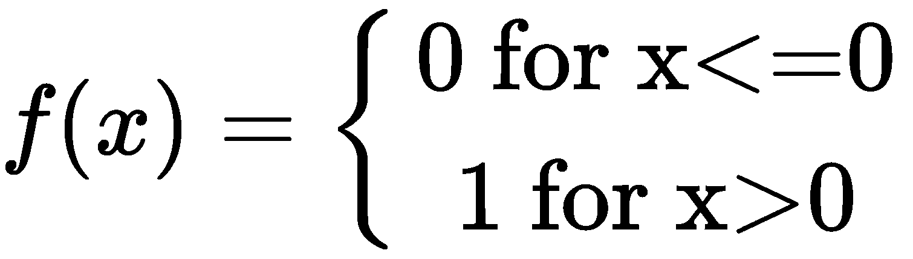

类似地，如果我们计划使用逻辑或 Sigmoid 步骤函数，输出范围从 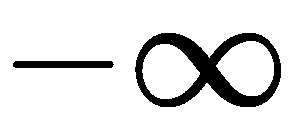 到 。

逻辑步骤函数定义为以下：

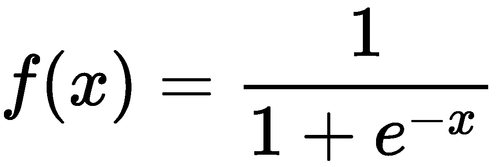

基于我们使用的学习算法，我们可以选择激活函数。大多数支持神经网络学习的机器学习库也支持使用各种激活函数。

每个节点之间的边都分配一个权重， 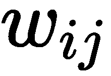，使得该链接位于神经元  和神经元  之间。

# 反向传播

一旦我们确定了神经网络中连接的权重和激活函数，神经网络就能够根据给定的输入有效地产生输出。然而，这是一个未训练的神经网络，需要一个算法根据它在预测输出时犯的错误来修改和调整神经网络。

使用随机梯度下降进行反向传播的权重更新可以使用以下方程执行。

反向传播算法是能够实现这一结果的流行机制之一。反向传播算法定义了一种方法，通过修改连接的值，如何将输出中的错误传播到连接中。算法背后的直觉非常简单。考虑一个孩子触摸到一个非常热的平底锅并学会不要触摸放在炉子上的锅。孩子犯了一个错误，但从中学习并避免再次犯同样的错误。反向传播算法也允许神经网络犯错误。预测输出和期望输出之间的差异可以使用公式计算，例如均方误差。一旦我们量化了错误，我们就可以使用梯度下降等算法来确定如何修改连接的权重。我们还使用了梯度下降算法来处理第三章中的线性回归算法，*使用回归算法预测房价*。反向传播过程类似于我们学习线性回归算法系数的方式。然而，我们不是学习回归器的值，而是在神经网络中估计连接权重的值。

使用随机梯度下降进行反向传播的权重更新可以使用以下方程进行：

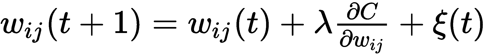

在这个方程中，是神经网络的 学习率。这是一个可调参数，定义了神经网络能够多快适应训练数据集。权重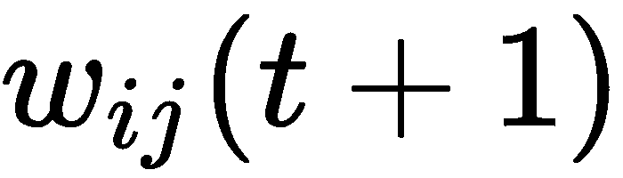是基于连接的先前权重计算的。权重变化值由学习率决定，即错误、先前权重和一个随机项之间的差异。

我们通过将训练数据传递到神经网络中并在每次迭代中修改连接的权重来遍历训练数据。权重被修改，以便每次迭代时错误率都会降低。尽管随机梯度下降不能达到全局最大值，但它对于训练神经网络以减少错误是有效的。当错误低于某个可接受的值或收敛到准确性改进最小的时候，我们终止迭代。

神经网络可以用于训练监督学习以及无监督学习。

# 深度神经网络简介

**深度神经网络**（**DNN**）是神经网络的一种变体，其中我们使用一个以上的隐藏层。数据必须通过一个以上的隐藏层，网络才能被认定为深度神经网络。这增加了神经网络模型的复杂性，因为它极大地增加了网络中的连接，从而增加了学习时间。

这里展示了深度神经网络的一个表示：

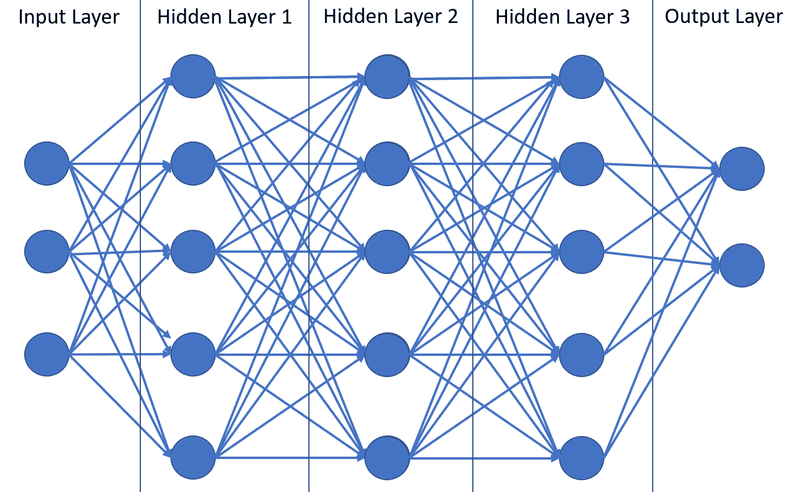

然而，增加额外的隐藏层也允许网络通过多个层次的模式识别传递输入数据。每个隐藏层都从前一个隐藏层接收输入。因此，它们可以识别比前一层更复杂的模式。这是因为在之前的层中，特征被聚合和重新组合。这被称为特征层次。DNN 中更深层的特征可以识别更复杂的模式。因此，DNN 更擅长处理具有复杂模式的数据库。此外，由于隐藏层自动生成这些抽象层，因此不需要领域专业知识进行特征提取。例如，在图像识别中，我们不需要对图像中物体的边缘进行标记，因为初始层可以学会识别边缘，而深层层则学会识别可能由这些边缘生成的物体。

深度学习和 DNN 是数据科学家在业界经常听到的热门词汇。对于大多数应用，如自动驾驶汽车或机器人技术，DNN 与人工智能同义。由于 GPU 架构的进步，这些 DNN 结构的生成非常适合，因此这些算法无法处理大量数据集以训练高度准确的机器学习算法。

# 理解卷积神经网络

在本节中，我们将探讨一种 DNNs 的变体，其中网络结构被修改以适应图像识别任务。

在本章迄今为止讨论的神经网络中，我们看到了所有输入层都是一维的。然而，图像是二维的。为了捕捉图像如何被输入神经网络进行训练，我们必须修改输入层的结构。传统算法需要人类对图像中物体的边缘进行标记。**卷积神经网络**（**CNNs**）可以通过足够的训练自动检测图像中的物体，并且根据图像的标签，它们可以学习如何在不显式标记图像边缘的情况下识别图像中的物体。

CNNs 需要一个预处理阶段，其中图像必须被准备成特定的数据结构，该结构用作前馈 DNNs 的输入。预处理阶段的第一项任务是分解图片成更小的图像，这样我们就不丢失图像中的任何信息。CNN 的灵感来源于人类视觉皮层的组织。我们的神经元对特定视野中看到的视觉做出反应。这被称为局部感受野。这些局部感受野相互重叠。同样，在 CNN 中，我们以图像作为输入，并将图像的重叠子区域表示为局部感受野。

以下图表展示了如何使用局部感受野的概念，通过滑动窗口从图像中生成特征图：

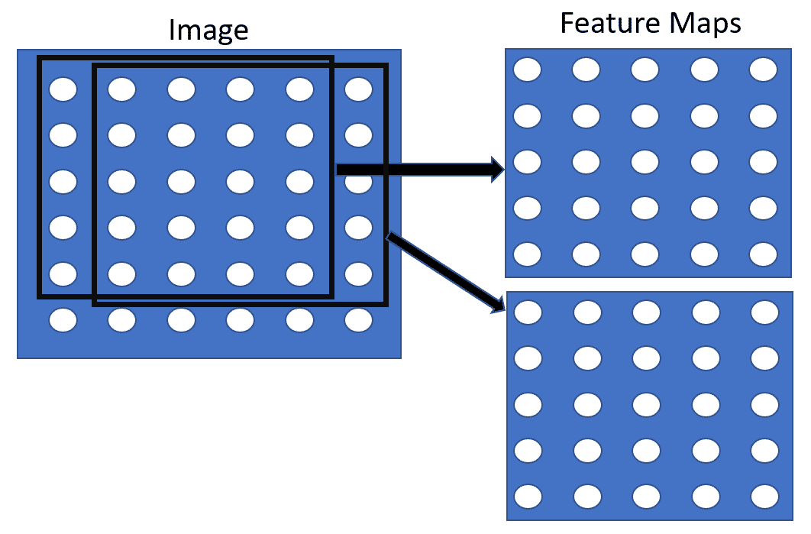

使用这种方法的优点是它消除了图像中对象的大小和位置问题。例如，想象图像中有一只猫。根据我们的训练示例，我们已对包含猫的图片进行了标记。使用局部感受野，我们检测到这只猫并将特征图标记为图像中有猫的图片。在新的图像中，无论猫在图像中的位置如何，我们都会找到一个包含猫的图像的特征图，因为我们使用这种滑动窗口方法创建了多个子图像。从图像中生成的这一层特征图被称为卷积层。

我们还可以通过应用各种过滤器到过程中，从同一组像素生成多个特征图。例如，我们可以应用颜色过滤器到像素，并从同一组像素生成三个特征图。作为一个数据科学家，你必须根据你想要从图像中提取的信息量以及我们生成这些网络时可以使用的处理能力来设计 CNN。

一旦生成了卷积层，我们通过使用称为池化的过程从图像中创建压缩特征图。这有助于我们以更小的特征图来表示特征图。在压缩特征图时，可以应用两种流行的池化过程。在最大池化方法中，通过仅从每个网格中选择最大值来降低特征图的维度。

以下截图展示了最大池化如何从每个特征图中取最大值，并将特征图的维度从 4x4 矩阵降低到 2x2：

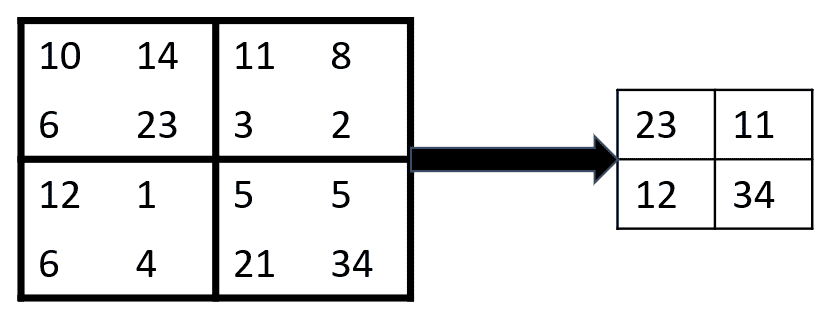

另一种池化类型称为平均池化，这是在池化数据时选择网格中值的平均值。以下图表展示了平均池化是如何工作的：

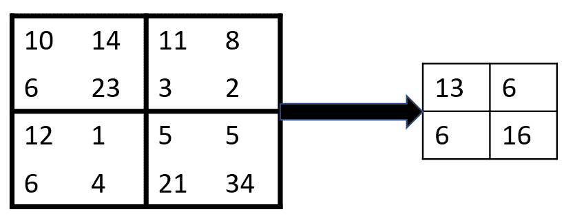

最大池化通常比平均池化更受欢迎，因为它在降低特征图维度时起到噪声抑制的作用，并移除了非主导特征。与卷积层类似，池化层也可以使用重叠窗口来创建更小的特征图。请注意，这些决策可以根据你想要从图像中捕获的细节程度来做出。

CNN 的另一个组成部分是卷积层。当我们设计 CNN 时，一组图像可能会决定我们从图像中提取哪些特征图。然而，根据应用需求，我们可能希望从图像中提取不同的特征。例如，如果我们的图像识别软件正在检测由地震仪（一种检测地震的设备）生成的图表，我们的特征图将包含黑白图表，其中我们的算法需要对时间序列中的边缘进行敏感检测。在这种情况下，我们可以设计一个卷积核，将特征图中的一定模式转换为另一个可以注释这些模式的特征图。同样，如果你正在处理带有对象的彩色图像，为每种颜色创建三个特征图，检测边缘，然后合并特征图，这很有帮助。因此，卷积层帮助设计此类神经网络的科学家根据特定应用对其进行调整。我们不会解释如何设置卷积层的细节，因为大多数库都允许你使用预设计的 CNN 应用于你的应用。

因此，通过使用局部感受野、卷积层和池化操作，我们构建以下结构将图像展平为 DNN 的输入：

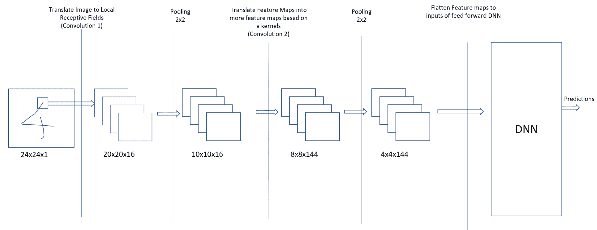

通过使用局部感受野方法，第一层卷积将图像转换为特征图。然后，我们通过池化数据来减少特征图的维度，将特征图的维度从 20x20 减少到 10x10。在下一阶段，我们根据可能选择的核将池化后的特征图转换为更多的特征图。这些核可能将检测直线或交叉的特征图转换为其他特征图。然后，我们将卷积层的输出池化到 4x4 特征图。此时，原始图像被转换为 DNN 任务特定信息。这些特征图也代表了图像的空间成分。然后，DNN 根据这些数据训练，并学习根据特征图可能表示的内容来预测输出。

# 摘要

在本章中，我们解释了深度学习的含义以及它在现实世界中的应用。我们还研究了应用案例，例如自动驾驶汽车和视频游戏机器人，以及它们如何使用深度学习自动学习执行任务。我们解释了神经网络是什么，以及 DNN 是如何改进它们的。我们还研究了 DNN 的一个变体，称为 CNN，并介绍了 CNN 的各个组成部分。

本章的目标是向您提供有关深度学习算法的信息，以便您了解它们如何在现实世界中应用。尽管我们没有深入探讨深度学习的数学原理，也没有提供关于激活函数等概念的所有细节，但我们希望您在深度学习领域获得了实际的知识。对于那些好奇心旺盛的人，这个领域正在进行着大量的研究，我们敦促您更多地了解您感兴趣的算法。

在下一章中，我们将探讨如何使用流行的技术，如 TensorFlow 和 MXNet，来实现深度学习。这些知识将帮助您实现一系列深度学习算法。

# 练习

1.  如果你拥有一部智能手机，你的手机上就有很多应用使用了深度学习。探索你的手机上哪些应用使用了本章中列出的算法之一，并研究如何设计这样的算法。

1.  列出 CNN 的各种组件，并设计一个能够检测人脸特征的 CNN。
