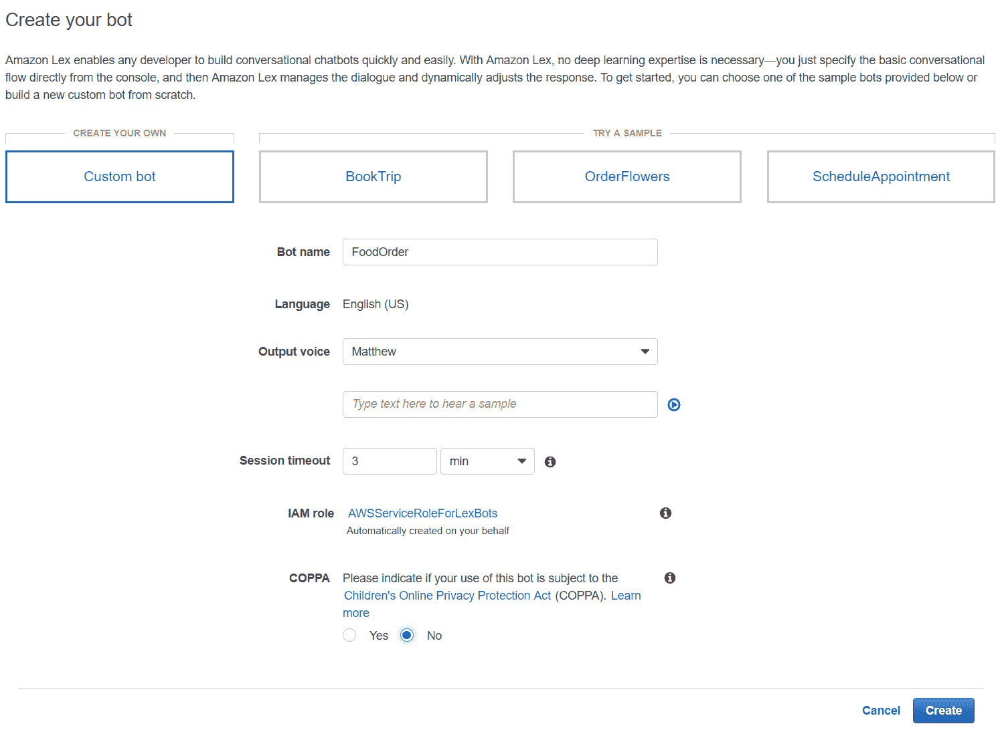
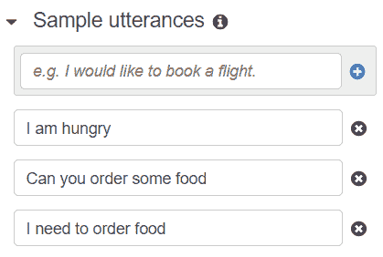
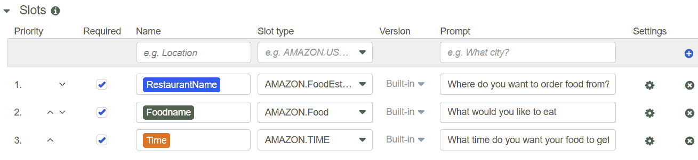
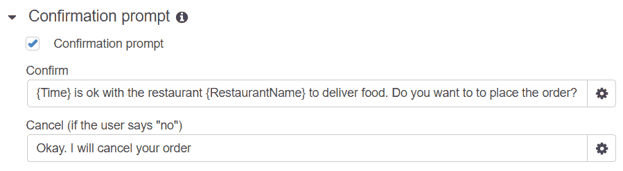
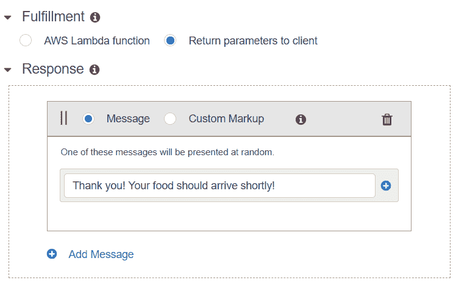
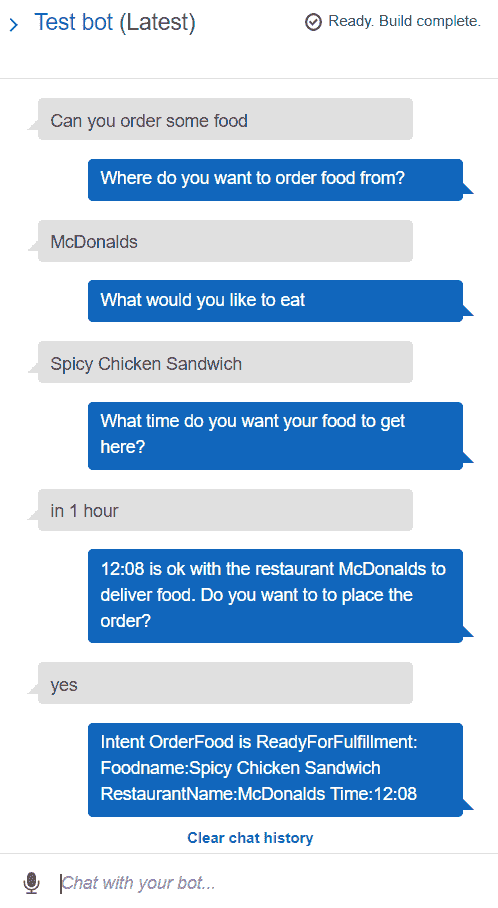

# 第十二章：使用 AWS Lex 构建对话界面

机器学习最受欢迎的应用之一是聊天机器人；它们可以像人类一样与你交谈，并理解你的指令。这些聊天机器人使用**自然语言处理**（**NLP**）来解析指令，并根据你的问题返回查询或答案。亚马逊提供了一种名为**Lex**（它是**Alexa**的简称）的服务，你可以用它构建复杂的聊天机器人，这些机器人可以执行各种任务。

在本章中，我们将介绍以下主题：

+   介绍 Amazon Lex

+   使用 Amazon Lex 构建自定义聊天机器人

# 介绍 Amazon Lex

Amazon Lex ([`aws.amazon.com/lex/`](https://aws.amazon.com/lex/)) 提供的服务可用于创建对话机器人。对话机器人使用各种机器学习技术，如**语音识别**、**NLP**和**深度学习**。由于近年来这些领域的进步，对话机器人已成为我们日常生活中的常客。数百万人使用亚马逊 Alexa、谷歌助手、Siri 或 Cortana 作为对话设备来完成各种任务。这些设备可以执行简单的任务，例如告诉你天气、为你叫一辆 Uber、订购披萨，以及控制你的照明。许多企业也提供聊天机器人以提供客户支持。例如，互联网服务提供商 Verizon FIOS 提供了一种聊天机器人，可以根据与你的对话执行诸如指向正确的故障排除文档或根据你的聊天重置路由器等任务。许多公司也使用此类对话机器人进行自动电话呼叫（机器人电话），在这种情况下，很难判断另一端的通话者是否不是真人。

从零开始构建这样的对话机器人并不容易。正如我们在第十章 Working with AWS Comprehend 中学习的那样，自然语言并不遵循严格的语法结构，我们有多种方式来表达相同的意思。因此，对话机器人需要能够从自然语言查询中解析相关数据，并给出最可能的答案。例如，亚马逊 Echo 可以理解不同格式的查询，并发现哪些是最相关的信息可以展示给用户。首先，这样的设备需要理解语音并将其转换为机器可以理解的文本。其次，它们需要触发能够回答该问题的正确技能，并将用户输入呈现给该技能。一旦技能生成答案，它必须使用文本到语音转换器将其转换回语音。所有这些步骤都需要专门的、高质量的深度学习模型来执行这些任务。例如，亚马逊使用深度学习模型来确定其文本到语音转换器中单词之间的停顿。

虽然构建这样的对话机器人可能听起来是一项艰巨的任务，但 Amazon 还提供了您可以使用他们的模型来生成此类任务的服务。这项服务称为 Amazon Lex，您可以通过 AWS 控制台访问它。

# 使用 Amazon Lex 构建 custom chatbot

在本节中，我们将使用 Amazon Lex 构建一个简单的自定义对话机器人。要访问 Amazon Lex 控制台，只需进入 AWS 控制台并搜索此服务。一旦到达控制台，您将有一个选项来创建一个新的机器人。您可以构建可以处理特定任务的独立机器人。在本例中，我们提供了以下步骤来创建一个用户可以要求在指定时间从特定餐厅订购食物的机器人：

1.  要开始，请点击控制台上的“创建机器人”选项。您将能够访问以下截图：

您必须在屏幕上指定机器人名称以及测试机器人时想要选择的语音。您还可以指定会话超时时间，这样离开订单未完成并离开机器的人就不会有其他人继续他们的聊天会话的风险。在本例中，我们创建了一个自定义机器人。然而，您也可以访问示例机器人来测试服务并了解这些机器人是如何创建的。

1.  当您点击创建按钮时，您将被带到下一个屏幕，您需要输入有关您的机器人如何工作的信息。首先，您必须指定您的特定机器人在聊天屏幕中是如何被触发的。在我们的案例中，用户有多种方式可以让聊天窗口知道他们饿了，因此您应该添加应该触发您的机器人的查询示例。这些查询在 Amazon Lex 中被称为**utterances**。我们添加了以下将触发我们的机器人的 utterances：

1.  Amazon Lex 将使用机器学习来扩展 utterances 列表，这样如果用户提出“你能订购一些食物”这样的问题，我们的机器人仍然会被触发，因为 utterance 与我们指定的相似。

1.  一旦我们指定了将触发我们的机器人，我们必须指定机器人启动时会发生什么。您可以使用 AWS 上的 Lambda 函数执行特定任务，或者使用控制台来设计聊天。由于设计 Lambda 函数不在本书的范围内，我们将使用控制台来询问用户他们想订购什么。以下屏幕选项显示了我们可以添加的预期用户信息：

1.  我们定义了三个变量，我们希望我们的聊天机器人能够获取这些变量的输入。例如，我们想知道他们想要从哪家餐厅订购，他们想要订购什么，以及他们希望食物准备好的时间。Amazon Lex 提供了预构建的槽位（变量类型），您在获取输入时可以选择。例如，AMAZON.Food 槽位类型将尝试确保变量的值是食物类型，而 AMZON.Time 变量类型将确保添加的时间是有效的时间。

1.  当我们的机器人有了所有必需变量的信息后，您必须指定机器人将如何响应。在我们的例子中，为了保持简单，我们只需告诉用户我们已经订购了食物（请注意，此代码实际上并没有订购食物）。如果您正在构建一个真正的订购食物的应用程序，您还可以调用一个 lambda 函数，该函数可以运行与变量名称相关的自定义代码。以下截图显示了如何添加有关机器人响应的信息，以及确认屏幕：

1.  如果用户确认，您可以使用以下 Fulfillment 选项向用户发送感谢信息：

1.  当您填写完表格后，您可以使用屏幕上的构建选项来构建您的机器人。如果您在屏幕上犯了任何错误，构建会提示您修复它们。最后，一旦您成功构建了机器人，您可以通过选择右侧的测试聊天机器人选项来测试它。以下屏幕显示了我们的聊天机器人是如何工作的。如您所见，我们能够与我们的聊天机器人进行聊天，并（假装）从它那里订购食物，如下面的截图所示：

通过在真实机器学习模型和用户之间添加一层抽象层，Amazon Lex 使得创建聊天机器人对每个人都非常容易。您可以专注于构建最适合您需求的机器人，而无需担心背后的算法。由于 Amazon Lex 是一项服务，AWS 会根据您对其机器学习模型的调用次数向您收费。

此外，您可以通过每个机器人的操作下拉菜单中的“导出”选项轻松地将 Amazon Lex 模型导出到 Alexa 技能套件。因此，通过使用 Amazon Lex，您可以在几分钟内设计聊天机器人并将其发布供 Alexa 使用。Amazon Lex 还提供了 API，您可以使用这些 API 来构建机器人，以便您可以使用代码更新或编辑您的语句或槽位。请参阅 boto3 API 文档（[`boto3.amazonaws.com/v1/documentation/api/latest/reference/services/lex-models.html`](https://boto3.amazonaws.com/v1/documentation/api/latest/reference/services/lex-models.html)）以了解如何使用 API。对 API 的调用使用与我们第十章“与 AWS Comprehend 一起工作”和第十一章“使用 AWS Rekognition”中提供的示例类似的代码。

# 摘要

Amazon Lex 使得构建对话机器人对每个人来说都更容易、更易于访问。对话机器人使用许多机器学习模型来为用户提供快速回答。Amazon Lex 提供了一个图形界面，您可以在其中指定您的机器人应该响应哪些语句，应该收集哪些信息槽位，以及机器人应该向用户提出哪些确认问题。此类工具可以直接在仪表板上进行测试，正如我们在上一节中所展示的那样。

作为数据科学家，需要构建能够让客户惊叹的应用程序，使用 Amazon Comprehend、Rekognition 和 Lex 等工具快速构建这些原型是一个好方法。然而，当大规模使用时，这些服务可能会变得昂贵。在这种情况下，我们总是致力于使用 Apache Spark 或 SageMaker 等框架构建我们自己的模型。

在下一章中，我们将学习如何设置新的 AWS 集群，并探讨如何根据您的任务选择正确的集群的细微差别。

# 练习

1.  创建一个聊天机器人，根据用户提供的信息提供航班状态。

1.  创建一个能够回答各种与天气相关的问题的聊天机器人。
