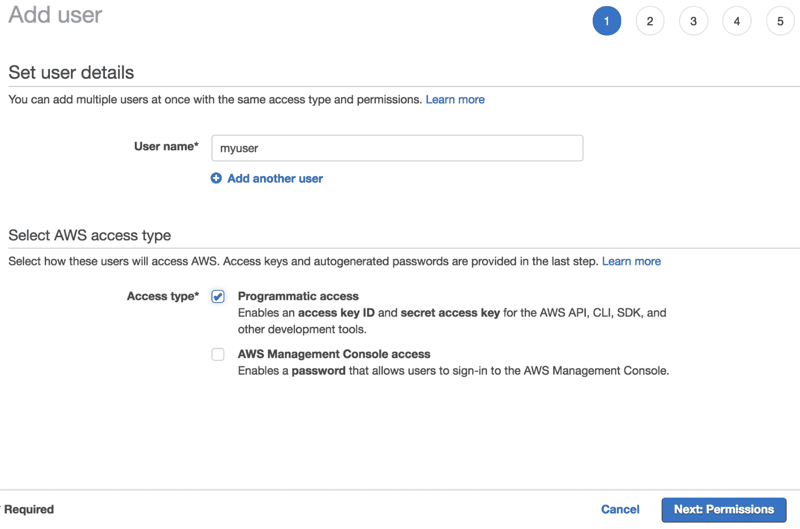
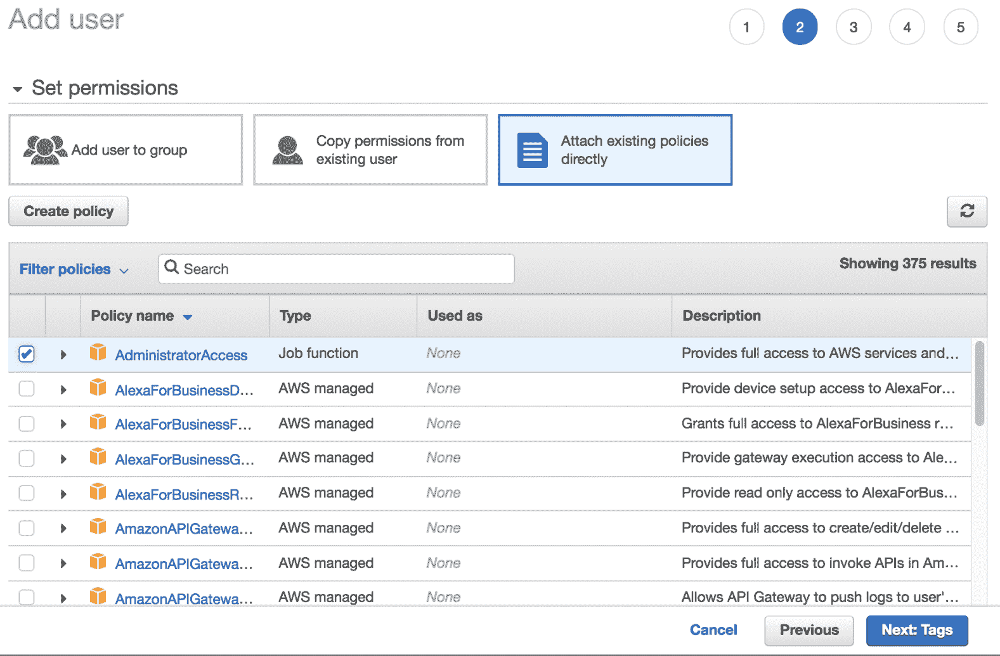

# 附录：AWS 入门

由于我们将重点关注 AWS 上的机器学习，因此您在尚未创建账户的情况下，通过创建账户开始使用 AWS 非常重要。请访问[`portal.aws.amazon.com/billing/signup#/start`](https://portal.aws.amazon.com/billing/signup#/start)。您需要提供一些信用卡信息，但只有在您有效使用不同服务后才会被收费。考虑许多服务都有免费层，您可以免费开始使用。一旦您注册，下一步就是在平台上创建一个用户，您将使用该用户进行程序性访问。

导航到[`console.aws.amazon.com/iam/home`](https://console.aws.amazon.com/iam/home)并创建用户：

一旦您创建了用户，请授予一些权限（在我们的例子中，我们将授予完全访问权限）：

您可以选择设置标签以更好地跟踪成本，如果您有多个用户的话，但在这本书中我们不会重点讨论这一点。一旦您创建了用户，您就可以导航到该用户并创建密钥：

一旦您生成了这些密钥，您可以将它们存储在您的机器上的 ~/.aws/credentials 中，如[`docs.aws.amazon.com/cli/latest/userguide/cli-config-files.html`](https://docs.aws.amazon.com/cli/latest/userguide/cli-config-files.html)中所述。通过将凭证存储在该文件中，您在机器上运行的代码将知道如何与 AWS 进行身份验证。
