# 第二章：线性回归——机器学习的阻挡和冲撞

"有些人试图在这场比赛中寻找不存在的东西，但足球只关乎两件事——阻挡和冲撞。"

- 文斯·隆巴迪，名人堂足球教练

我们开始使用一种简单而极其有效的技术，这种技术已经被使用了很长时间：**线性回归**。阿尔伯特·爱因斯坦曾说过，事情应该尽可能简单，但不能更简单。这是明智的建议，也是开发机器学习算法时的一条好规则。考虑到我们稍后将要讨论的其他技术，没有比经过检验的线性回归更简单的模型了，它使用**最小二乘法**来预测定量结果。事实上，我们可以将其视为我们稍后将要讨论的所有方法的基石，其中许多只是扩展。如果您能掌握线性回归方法，那么坦白说，我相信您也可以掌握这本书的其余部分。因此，让我们把这视为我们成为机器学习大师之旅的一个良好起点。

本章涵盖了入门材料，该领域的专家可以跳过直接进入下一主题。否则，在尝试其他更复杂的学习方法之前，请确保您彻底理解这个主题。我相信您会发现，许多项目只需应用以下章节中讨论的内容就可以解决。线性回归可能是向客户解释的最简单的模型，他们中的大多数至少对**R-squared**有一个初步的了解。其中许多人已经对其有深入的了解，因此对变量贡献、多重共线性等问题感到舒适。

# 单变量线性回归

我们首先探讨一种简单的方法来预测一个定量响应*Y*，其中一个预测变量*x*，假设*Y*与*x*之间存在线性关系。这个模型的公式可以写成，*Y = B0 + B1x + e*。我们可以将其表述为*Y*的期望值是参数*B0*（截距）加上*B1*（斜率）乘以*x*，再加上一个误差项*e*。最小二乘法选择模型参数，以最小化预测*y*值与实际*Y*值之间的**残差平方和**（**RSS**）。以一个简单的例子来说，假设我们得到的*Y1*和*Y2*的实际值分别为*10*和*20*，以及*y1*和*y2*的预测值分别为*12*和*18*。为了计算 RSS，我们将平方差相加，即*RSS = (Y1 - y1)² + (Y2 - y2)²*，通过简单的代入，得到*(10 - 12)² + (20 - 18)² = 8*。

我曾在我们的精益六西格玛黑带培训期间对一位同行说过，这关乎平方和的总和；理解平方和，其他问题就会自然而然地解决。也许这是真的，至少在某种程度上。

在我们开始应用之前，我想指出，如果您阅读各种研究突破的头版新闻，您应该带着怀疑的眼光和批判性的思维去阅读，因为媒体提出的结论可能并不有效。正如我们将看到的，R 和任何其他软件都将给出一个解决方案，无论输入如何。然而，仅仅因为数学上有意义，或者报告了高相关系数或 R 平方统计量，并不意味着结论是有效的。

为了使这个观点更加明确，让我们看看著名的`Anscombe`数据集，该数据集在 R 中可用。统计学家 Francis Anscombe 制作了这个集合，以强调数据分析时数据可视化和异常值的重要性。它由四对具有相同统计特性的*X*和*Y*变量组成，但绘制时却显示出非常不同的结果。我已使用这些数据来培训同事，并教育商业伙伴关于专注于统计数据而不探索数据和检查假设的危险。如果您有类似的需求，我认为这是一个很好的开始。这是在继续进行严肃建模之前的一个简短离题：

```py
    > #call up and explore the data

    > data(anscombe)

    > attach(anscombe)

    > anscombe
       x1 x2 x3 x4    y1   y2    y3    y4
    1  10 10 10  8  8.04 9.14  7.46  6.58
    2   8  8  8  8  6.95 8.14  6.77  5.76
    3  13 13 13  8  7.58 8.74 12.74  7.71
    4   9  9  9  8  8.81 8.77  7.11  8.84
    5  11 11 11  8  8.33 9.26  7.81  8.47
    6  14 14 14  8  9.96 8.10  8.84  7.04
    7   6  6  6  8  7.24 6.13  6.08  5.25
    8   4  4  4 19  4.26 3.10  5.39 12.50
    9  12 12 12  8 10.84 9.13  8.15  5.56
    10  7  7  7  8  4.82 7.26  6.42  7.91
    11  5  5  5  8  5.68 4.74  5.73  6.89

```

正如我们将看到的，每一对都有相同的相关系数：`0.816`。前两个如下所示：

```py
    > cor(x1, y1) #correlation of x1 and y1
    [1] 0.8164205

    > cor(x2, y1) #correlation of x2 and y2

    [1] 0.8164205

```

正如`Anscombe`所意图的，真正的洞察在于我们将所有四个对一起绘制时，如下所示：

```py
    > par(mfrow = c(2,2)) #create a 2x2 grid for 
       plotting

    > plot(x1, y1, main = "Plot 1")

    > plot(x2, y2, main = "Plot 2")

    > plot(x3, y3, main = "Plot 3")

    > plot(x4, y4, main = "Plot 4")

```

下载示例代码

您可以从[`www.packtpub.com`](http://www.packtpub.com)的账户下载您购买的所有 Packt 书籍的示例代码文件。如果您在其他地方购买了这本书，您可以访问[`www.packtpub.com/support`](http://www.packtpub.com/support)并注册，以便将文件直接通过电子邮件发送给您。

上一段代码的输出如下：

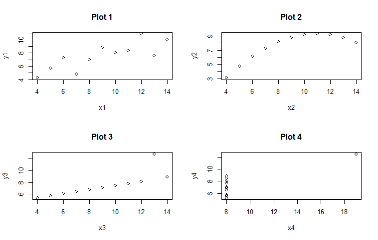

如我们所见，**图 1**似乎有一个真正的线性关系，**图 2**是曲线关系，**图 3**有一个危险的异常值，而**图 4**则是由一个异常值驱动的。这就是一个关于仅依赖相关性的危险警告故事。

# 商业理解

我们的第一案例关注的是预测美国怀俄明州蛇河流域的水产量（以英寸为单位），作为当年降雪含水量的函数。这个预测将有助于管理水流和水库水平，因为蛇河为几个西部州提供了急需的灌溉用水。`snake`数据集可在`alr3`包中找到（注意，alr 代表应用线性回归）：

```py
    > install.packages("alr3")
    > library(alr3)
    > data(snake)
    > dim(snake)
    [1] 17  2
    > head(snake)
         X    Y
    1 23.1 10.5
    2 32.8 16.7
    3 31.8 18.2
    4 32.0 17.0
    5 30.4 16.3
    6 24.0 10.5

```

现在我们有了`17`个观测值，可以开始数据探索。但在开始之前，让我们将`X`和`Y`改为有意义的变量名，如下所示：

```py
    > names(snake) <- c("content", "yield")
    > attach(snake) # attach data with new names
    > head(snake)

      content yield
    1    23.1  10.5
    2    32.8  16.7
    3    31.8  18.2
    4    32.0  17.0
    5    30.4  16.3
    6    24.0  10.5

    > plot(content, yield, xlab = "water content of 
        snow", ylab = "water yield")

```

上一段代码的输出如下：

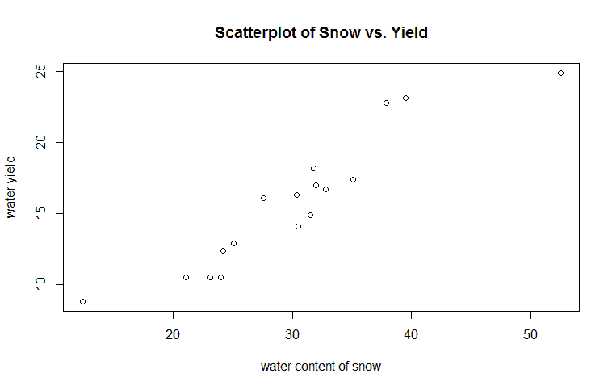

这是一个有趣的图，因为数据呈线性，并且由于两端存在两个潜在的异常值而呈现出轻微的曲线形状。因此，转换数据或删除异常观测值可能是合理的。

要在 R 中执行线性回归，可以使用 `lm()` 函数以标准形式 *fit = lm(Y ~ X)* 创建模型。然后，你可以使用以下代码通过拟合模型上的各种函数来测试你的假设：

```py
    > yield.fit <- lm(yield ~ content)

    > summary(yield.fit)

    Call:
    lm(formula = yield ~ content)

    Residuals:
            Min      1Q  Median      3Q     Max
    -2.1793 -1.5149 -0.3624  1.6276  3.1973

    Coefficients: Estimate Std. Error t value Pr(>|t|) 
    (Intercept)  0.72538    1.54882   0.468    0.646 
    content      0.49808    0.04952  10.058 4.63e-08 
    ***
    ---
    Signif. codes:  0 '***' 0.001 '**' 0.01 '*' 0.05 
      '.' 0.1 ' ' 1

    Residual standard error: 1.743 on 15 degrees of 
      freedom
    Multiple R-squared:  0.8709,    Adjusted R-squared:  
       0.8623
    F-statistic: 101.2 on 1 and 15 DF,  p-value: 
       4.632e-08

```

使用 `summary()` 函数，我们可以检查包括模型规范、残差的描述性统计、系数、模型显著性的代码以及模型误差和拟合的总结在内的多个项目。现在，让我们专注于参数系数估计，看看我们的预测变量是否有显著的 p-value，以及整体模型的 F-检验是否有显著的 p-value。查看参数估计，模型告诉我们 `yield` 等于 `0.72538` 加上 `0.49808` 乘以 `content`。可以说，对于 `content` 的每 1 个单位变化，`yield` 将增加 `0.49808` 个单位。`F-统计量` 用于检验模型系数都为 0 的原假设。

由于 `p-value` 非常显著，我们可以拒绝原假设，并继续进行内容检验的 t-检验，该检验检验的是原假设为 0。再次，我们可以拒绝原假设。此外，我们还可以看到 `Multiple R-squared` 和 `Adjusted R-squared` 的值。`Adjusted R-squared` 将在多元回归主题下进行讨论，所以让我们专注于 `Multiple R-squared`；在这里我们看到它是 `0.8709`。从理论上讲，它可以从 0 到 1 变化，是 *X* 和 *Y* 之间关联强度的度量。在这种情况下，解释是 87% 的 **水产量** 变化可以由 **雪水含量** 解释。顺便提一下，R-squared 仅仅是 [X, Y] 的相关系数的平方。

我们可以回忆我们的散点图，并使用以下代码添加由我们的模型产生的最佳拟合线：

```py
    > plot(content, yield)

    > abline(yield.fit, lwd=3, col="red")

```

上述代码的输出如下：

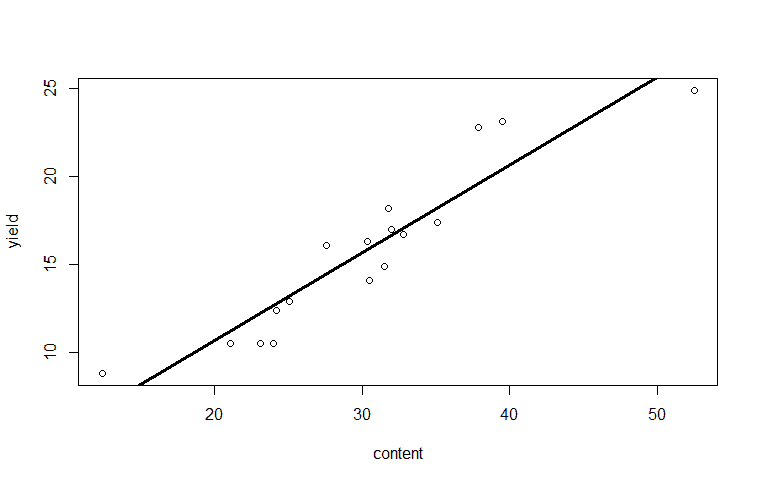

线性回归模型的好坏取决于其假设的有效性，可以总结如下：

+   **线性关系**：这是预测变量和响应变量之间的线性关系。如果这种关系不明显，可以通过对 *X* 或 *Y* 进行变换（对数、多项式、指数等）来解决问题。

+   **误差的非相关性**：在时间序列和面板数据中，这是一个常见问题，其中 *e[n] = beta[n-1]*；如果误差相关，你可能会创建一个定义不良的模型。

+   **同方差性**：通常误差的正态分布和恒定方差，这意味着误差的方差在不同输入值上是恒定的。违反这个假设可以创建有偏的系数估计，导致显著性检验过高或过低。这反过来又会导致错误的结论。这种违反被称为**异方差性**。

+   **无多重共线性**：两个预测变量之间没有线性关系，也就是说，特征之间应该没有相关性。这同样可能导致有偏的估计。

+   **异常值的存在**：异常值会严重扭曲估计，理想情况下，在用线性回归拟合模型之前必须将其移除；正如我们在 Anscombe 示例中看到的那样，这可能导致有偏的估计。

由于我们正在构建一个独立于时间的单变量模型，我们只关心线性性和异方差性。其他假设将在下一节中变得重要。最初检查假设的最好方法是生成图表。当`plot()`函数与线性模型拟合结合使用时，将自动生成四个图表，允许你检查假设。R 一次生成一个图表，你可以通过按*Enter*键来浏览它们。最好同时检查所有四个，我们以下列方式进行检查：

```py
    > par(mfrow = c(2,2))

    > plot(yield.fit)

```

上述代码的输出如下：

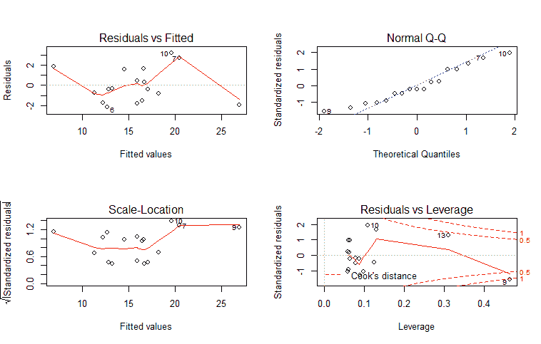

左侧的两个图表允许我们检查误差的同方差性和非线性。我们寻找的是某种类型的模式，或者更重要的是，没有任何模式存在。鉴于只有 17 个观测值的样本量，没有什么明显的可以观察到。常见的异方差误差看起来像是 U 形、倒 U 形，或者紧密地聚集在图表的左侧。随着拟合值的增加，它们会变得更宽（漏斗形状）。可以安全地得出结论，我们的模型中没有出现同方差性的违反。

上右角的**正态 Q-Q 图**帮助我们确定残差是否呈正态分布。**分位数-分位数**（**Q-Q**）图表示一个变量的分位数值与另一个变量的分位数值相对应。看起来异常值（观测值**7**、**9**和**10**）可能导致了假设的违反。**残差与杠杆**图可以告诉我们哪些观测值（如果有），过度影响了模型；换句话说，如果有任何异常值，我们应该关注。这个统计量是**库克距离**或**库克 D**，通常认为大于 1 的值值得进一步检查。

究竟什么是进一步检查？这正是艺术与科学的交汇点。最简单的解决办法可能是简单地删除观察结果，在这种情况下是数字**9**，然后重新构建模型。然而，更好的选择可能是转换预测变量和/或响应变量。如果我们仅仅删除观察结果**9**，那么观察结果**10**和**13**可能会超出大于 1 的带区。我相信这正是领域专业知识可能至关重要的地方。我数不清有多少次发现，探索和理解异常值可以带来宝贵的见解。当我们第一次检查之前的散点图时，我指出了潜在的异常值，而这些恰好是观察结果编号**9**和**13**。作为一个分析师，与适当的主题专家讨论以了解这种情况的原因是至关重要的。这是一个测量错误吗？这些观察结果有逻辑上的解释吗？我当然不知道，但这是一个增加你为组织带来价值的机会。

话虽如此，我们可以通过更详细地检查当前的模型，特别是**正态 Q-Q 图**来深入挖掘。R 默认的 Q-Q 图不提供置信区间，鉴于我们对基础图的担忧，我们应该检查置信区间。`car`包中的`qqPlot()`函数自动提供这些置信区间。由于`car`包与`alr3`包一起加载，我可以用一行代码生成该图：

```py
    > qqPlot(yield.fit)

```

上述代码的输出如下：

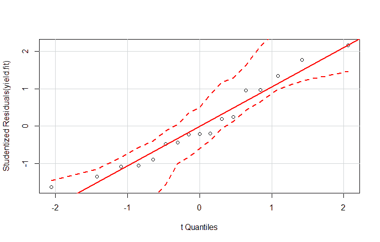

根据图示，残差呈正态分布。我认为这可以让我们有信心选择包含所有观察结果的模型。尝试其他模型需要清晰的推理和判断。如果我们能够明确地拒绝误差正态分布的假设，那么我们可能不得不检查变量转换和/或观察结果删除。

# 多元线性回归

你可能会问自己，在现实世界中你是否会只有一个预测变量。这确实是一个公平的问题，当然是一个非常罕见的情况（时间序列可能是一个常见的例外）。很可能会包含几个，如果不是很多预测变量或特征——在机器学习中亲切地称为特征——必须包含在你的模型中。有了这个，让我们继续讨论多元线性回归和新的业务案例。

# 业务理解

按照水资源保护/预测的主题，让我们看看 `alr3` 包中的另一个数据集，它恰当地命名为 `water`。在本书第一版编写期间，南加州的严重干旱引起了极大的恐慌。即使是州长杰里·布朗也开始采取行动，呼吁公民减少 20% 的用水量。在这个练习中，让我们假设我们已被加利福尼亚州委托预测水资源可用性。提供给我们的数据包含 43 年的雪降水量，测量了奥文谷六个不同地点的数据。它还包含一个响应变量，即加利福尼亚州比什普附近的溪流径流体积，该径流最终流入奥文谷水渠，并最终流入洛杉矶水渠。准确的径流预测将允许工程师、规划者和政策制定者更有效地制定节水措施。我们试图创建的模型将具有以下形式 *Y = B0 + B1x1 +...Bnxn + e*，其中预测变量（特征）可以是 1 到 *n*。

# 数据理解和准备

首先，我们将加载名为 `water` 的数据集，并定义 `str()` 函数的结构如下：

```py
    > data(water)

    > str(water)
    'data.frame':   43 obs. of  8 variables:
    $ Year   : int  1948 1949 1950 1951 1952 1953 1954 
      1955 1956 1957 ...
    $ APMAM  : num  9.13 5.28 4.2 4.6 7.15 9.7 5.02 6.7 
       10.5 9.1 ...
    $ APSAB  : num  3.58 4.82 3.77 4.46 4.99 5.65 1.45 
       7.44 5.85 6.13 ...
    $ APSLAKE: num  3.91 5.2 3.67 3.93 4.88 4.91 1.77 
       6.51 3.38 4.08 ...
    $ OPBPC  : num  4.1 7.55 9.52 11.14 16.34 ...
    $ OPRC   : num  7.43 11.11 12.2 15.15 20.05 ...
    $ OPSLAKE: num  6.47 10.26 11.35 11.13 22.81 ...
    $ BSAAM  : int  54235 67567 66161 68094 107080 
       67594 65356 67909 92715 70024 ...

```

在这里，我们有八个特征和一个响应变量 `BSAAM`。观测数据从 1943 年开始，连续进行了 43 年。由于在这个练习中我们并不关心观测发生在哪一年，因此创建一个新的数据框，排除年份向量是有意义的。这相当简单。我们只需一行代码就可以创建新的数据框，然后使用 `head()` 函数来验证它是否工作：

```py
    > socal.water <- water[ ,-1] #new dataframe with 
      the deletion of 
      column 1

    > head(socal.water)
      APMAM APSAB APSLAKE OPBPC  OPRC OPSLAKE  BSAAM
    1  9.13  3.58    3.91  4.10  7.43    6.47  54235
    2  5.28  4.82    5.20  7.55 11.11   10.26  67567
    3  4.20  3.77    3.67  9.52 12.20   11.35  66161
    4  4.60  4.46    3.93 11.14 15.15   11.13  68094
    5  7.15  4.99    4.88 16.34 20.05   22.81 107080
    6  9.70  5.65    4.91  8.88  8.15    7.41  67594

```

由于所有特征都是定量数据，查看相关统计并生成散点图矩阵是有意义的。相关系数或 **Pearson's r** 是衡量两个变量之间线性关系强度和方向的指标。该统计量将是一个介于 -1 和 1 之间的数字，其中 -1 是完全负相关，+1 是完全正相关。系数的计算是两个变量的协方差除以它们标准差的乘积。正如之前讨论的，如果你平方相关系数，你将得到 R-squared。

有许多方法可以生成相关图矩阵。有些人喜欢生成 **热图**，但我非常喜欢 `corrplot` 包生成的结果。它可以生成多种不同的变体，包括椭圆、圆形、方形、数字、阴影、颜色和饼图。我喜欢椭圆方法，但你可以自由地尝试其他方法。让我们加载 `corrplot` 包，使用基本的 `cor()` 函数创建一个相关对象，并检查以下结果：

```py
    > library(corrplot)

    > water.cor <- cor(socal.water)

    > water.cor
  APMAM      APSAB    APSLAKE      OPBPC 
    APMAM   1.0000000 0.82768637 0.81607595 0.12238567 
    APSAB   0.8276864 1.00000000 0.90030474 0.03954211 
    APSLAKE 0.8160760 0.90030474 1.00000000 0.09344773 
    OPBPC   0.1223857 0.03954211 0.09344773 1.00000000 
    OPRC    0.1544155 0.10563959 0.10638359 0.86470733 
    OPSLAKE 0.1075421 0.02961175 0.10058669 0.94334741 
    BSAAM   0.2385695 0.18329499 0.24934094 0.88574778 
             OPRC    OPSLAKE     BSAAM
    APMAM   0.1544155 0.10754212 0.2385695
    APSAB   0.1056396 0.02961175 0.1832950
    APSLAKE 0.1063836 0.10058669 0.2493409
    OPBPC   0.8647073 0.94334741 0.8857478
    OPRC    1.0000000 0.91914467 0.9196270
    OPSLAKE 0.9191447 1.00000000 0.9384360
    BSAAM   0.9196270 0.93843604 1.0000000

```

那么，这告诉我们什么呢？首先，响应变量与 OP 特征高度正相关，其中`OPBPC`为`0.8857`，`OPRC`为`0.9196`，`OPSLAKE`为`0.9384`。此外，请注意，AP 特征彼此之间以及与 OP 特征高度相关。这意味着我们可能会遇到多重共线性问题。相关图矩阵提供了以下相关性的良好视觉表示：

```py
    > corrplot(water.cor, method = "ellipse")

```

以下代码片段的输出如下：

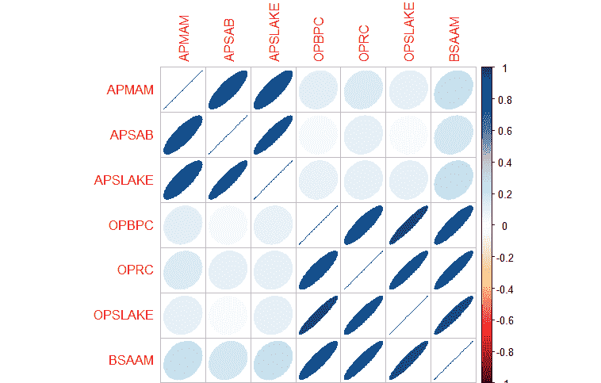

另一种流行的可视化方法是散点图矩阵。这可以通过`pairs()`函数调用。它加强了我们在前一个输出中的相关图所看到的内容：

```py
 > pairs(~ ., data = socal.water)

```

以下代码片段的输出如下：

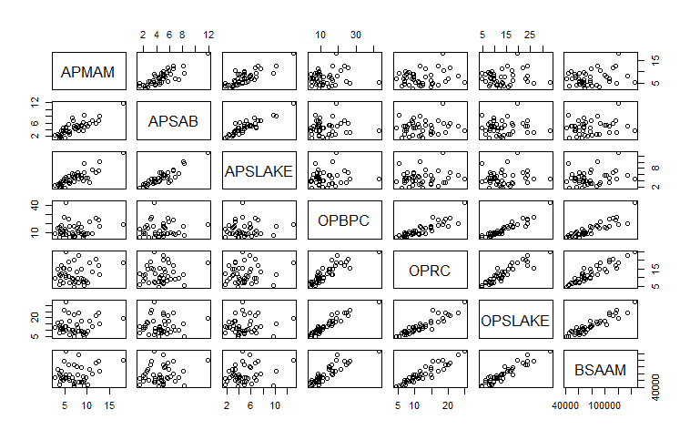

# 建模与评估

我们在这里要讨论的关键要素之一是至关重要的特征选择任务。在本章中，我们将讨论使用`leaps`包的逐步最佳子集回归方法。后面的章节将介绍更高级的技术。

**正向逐步选择**从一个没有特征的模型开始；然后逐个添加特征，直到所有特征都被添加。在创建具有最低 RSS 的模型的过程中添加了一个选定的特征。所以从理论上讲，第一个选定的特征应该是比其他任何特征更好地解释响应变量的那个，依此类推。

需要注意的是，添加一个特征总是会降低 RSS 并增加 R-squared，但它并不一定会改善模型的`拟合度`和可解释性。

**反向逐步回归**从模型中的所有特征开始，逐个移除最不有用的特征。有一种混合方法，其中特征通过正向逐步回归添加，但算法随后检查是否可以移除任何不再提高模型拟合度的特征。一旦构建了模型，分析师可以检查输出并使用各种统计量来选择他们认为提供最佳拟合的特征。

在这里补充一点很重要，逐步技术可能会遇到严重的问题。你可以在数据集上执行正向逐步，然后是反向逐步，最终得到两个完全冲突的模型。底线是，逐步可能会产生有偏的回归系数；换句话说，它们太大，置信区间太窄（Tibshirani，1996）。

最佳子集回归可以是特征选择中逐步方法的满意替代。在最佳子集回归中，算法为所有可能的特征组合拟合模型；因此，如果您有 3 个特征，将创建 7 个模型。与逐步回归一样，分析师需要应用判断或统计分析来选择最佳模型。模型选择将是以下讨论的关键主题。正如您可能已经猜到的，如果您的数据集具有许多特征，这可能是一项相当大的任务，并且当您有比观察值更多的特征时（`p`大于`n`），该方法表现不佳。

当然，这些最佳子集的限制不适用于我们当前的任务。鉴于其局限性，我们将放弃逐步方法，但请随意尝试。我们将首先加载`leaps`包。为了了解特征选择是如何工作的，我们将首先构建并检查包含所有特征的模型，然后通过最佳子集进行深入选择以确定最佳拟合。

要构建包含所有特征的线性模型，我们再次可以使用`lm()`函数。其形式如下：*fit = lm(y ~ x1 + x2 + x3...xn)*。如果您想包含所有特征，可以使用波浪号后的点号作为快捷方式，而不是必须全部输入。为了开始，让我们加载`leaps`包并构建一个包含所有特征的模型以供检查，如下所示：

```py
    > library(leaps)

    > fit <- lm(BSAAM ~ ., data = socal.water)

    > summary(fit)

    Call:
    lm(formula = BSAAM ~ ., data = socal.water)

    Residuals:
       Min     1Q Median     3Q    Max
    -12690  -4936  -1424   4173  18542

    Coefficients:
 Estimate Std. Error t value Pr(>|t|) 
    (Intercept) 15944.67    4099.80   3.889 0.000416 
      ***
    APMAM         -12.77     708.89  -0.018 0.985725 
    APSAB        -664.41    1522.89  -0.436 0.665237 
    APSLAKE      2270.68    1341.29   1.693 0.099112 . 
    OPBPC          69.70     461.69   0.151 0.880839 
    OPRC         1916.45     641.36   2.988 0.005031 **
    OPSLAKE      2211.58     752.69   2.938 0.005729 **
    ---
    Signif. codes:  0 '***' 0.001 '**' 0.01 '*' 0.05 
      '.' 0.1 '' 1
    Residual standard error: 7557 on 36 degrees of 
      freedom
    Multiple R-squared:  0.9248,    Adjusted R-squared:  
      0.9123
    F-statistic: 73.82 on 6 and 36 DF,  p-value: < 
      2.2e-16

```

就像单变量回归一样，我们检查`F-统计量`上的`p-value`以验证至少有一个系数不为零。实际上，`p-value`非常显著。我们还应该有对`OPRC`和`OPSLAKE`参数的显著`p-value`。有趣的是，尽管与响应变量高度相关，但`OPBPC`并不显著。简而言之，当我们控制其他 OP 特征时，`OPBPC`不再解释预测变量的任何有意义的变化，也就是说，特征`OPBPC`在模型中与`OPRC`和`OPSLAKE`一起不再从统计角度增加任何内容。

在构建了第一个模型之后，让我们继续转向最佳子集。我们使用`leaps`包中的`regsubsets()`函数创建`sub.fit`对象，如下所示：

```py
    > sub.fit <- regsubsets(BSAAM ~ ., data = 
       socal.water)

```

然后，我们创建`best.summary`对象以进一步检查模型。与所有 R 对象一样，您可以使用`names()`函数列出可用的输出：

```py
    > best.summary <- summary(sub.fit)

    > names(best.summary)
    [1] "which"  "rsq"    "rss"    "adjr2"  "cp"     
       "bic"    "outmat" "obj"

```

模型选择中其他有价值的函数包括`which.min()`和`which.max()`。这些函数将提供具有最小或最大值的模型，如下代码片段所示：

```py
    > which.min(best.summary$rss)
    [1] 6

```

代码告诉我们，具有六个特征的模型具有最小的 RSS，这是应该的，因为那是最大数量的输入，更多的输入意味着更低的 RSS。这里的一个重要观点是，添加特征总是会降低 RSS！此外，它总是会增加 R-squared。我们可以添加一个完全不相关的特征，比如洛杉矶湖人队的胜利次数，RSS 会降低，R-squared 会增加。这个数量可能非常小，但确实存在。因此，我们需要一个有效的方法来正确选择相关特征。

对于特征选择，在本章中我们将讨论四种统计方法：**赤池信息量准则**（**AIC**）、**马尔可夫 Cp 准则**（**Cp**）、**贝叶斯信息准则**（**BIC**）和调整后的 R-squared。对于前三种，目标是使统计量的值最小化；对于调整后的 R-squared，目标是使统计量的值最大化。这些统计量的目的是创建尽可能简约的模型，换句话说，就是惩罚模型复杂性。

这四个统计量的公式如下：

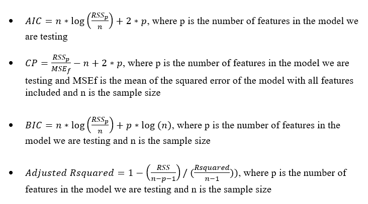

在线性模型中，`AIC`和`Cp`是成比例的，所以我们只关注`Cp`，它遵循`leaps`包中的输出。`BIC`倾向于选择比`Cp`变量更少的模型，因此我们将比较两者。为此，我们可以创建并分析两个并排的图。让我们先对`Cp`进行操作，然后是`BIC`，以下代码片段将帮助我们：

```py
    > par(mfrow = c(1,2))

    > plot(best.summary$cp, xlab = "number of 
       features", ylab = "cp")

    > plot(sub.fit, scale = "Cp")

```

前一个代码片段的输出如下：

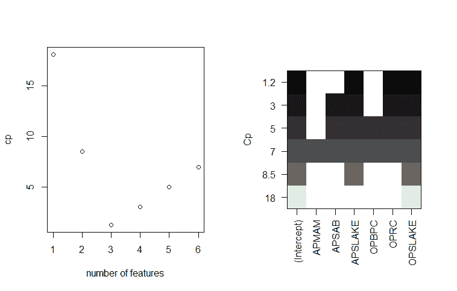

在左侧的图中，具有三个特征的模型具有最低的**cp**。右侧的图显示了提供最低**Cp**的特征。阅读这个图的方法是选择 y 轴顶部的最低**Cp**值，即**1.2**。然后，向右移动并查看对应于 x 轴的彩色方块。这样做，我们看到**APSLAKE**、**OPRC**和**OPSLAKE**是包含在这个特定模型中的特征。通过使用`which.min()`和`which.max()`函数，我们可以确定**cp**与 BIC 和调整后的 R-squared 的比较：

```py
    > which.min(best.summary$bic)
    [1] 3

    > which.max(best.summary$adjr2)
    [1] 3

```

在这个例子中，BIC 和调整后的 R-squared 与最优模型的**Cp**相匹配。现在，就像多元回归一样，我们需要检查模型并测试假设。我们将通过创建一个线性模型对象并检查与之前相同的图来完成这项工作，如下所示：

```py
    > best.fit <- lm(BSAAM ~ APSLAKE + OPRC + OPSLAKE, 
      data = 
      socal.water)

    > summary(best.fit)
    Call:
    lm(formula = BSAAM ~ APSLAKE + OPRC + OPSLAKE)

    Residuals:
       Min     1Q Median     3Q    Max
    -12964  -5140  -1252   4446  18649

    Coefficients:
    Estimate Std. Error t value Pr(>|t|) 
    (Intercept)  15424.6     3638.4   4.239 0.000133 
    ***
    APSLAKE       1712.5      500.5   3.421 0.001475 **
    OPRC          1797.5      567.8   3.166 0.002998 **
    OPSLAKE       2389.8      447.1   5.346 4.19e-06 
    ***
    ---
    Signif. codes:  0 '***' 0.001 '**' 0.01 '*' 0.05 
      '.' 0.1 ' ' 1

    Residual standard error: 7284 on 39 degrees of 
      freedom
    Multiple R-squared:  0.9244,    Adjusted R-squared:  
      0.9185
    F-statistic: 158.9 on 3 and 39 DF,  p-value: < 
      2.2e-16

```

使用三特征模型，`F 统计量`和所有 t 检验都具有显著的 p 值。通过第一次测试后，我们可以生成我们的诊断图：

```py
    > par(mfrow = c(2,2))

    > plot(best.fit)

```

前一个代码片段的输出如下：

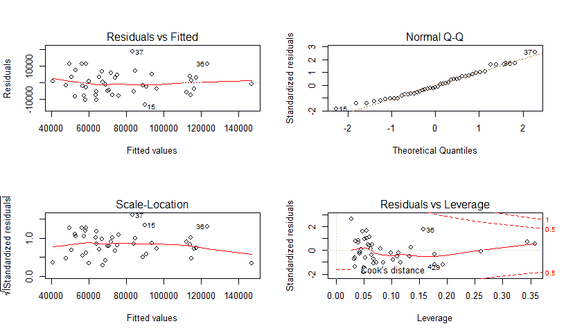

观察图表，可以安全地假设残差具有恒定的方差，并且服从正态分布。在杠杆图中没有迹象表明需要进一步调查。

为了调查共线性问题，可以调用**方差膨胀因子**（**VIF**）统计量。VIF 是特征系数在拟合完整模型时的方差与特征系数在单独拟合时的方差之比。公式是*1 / (1-R²[i]*)，其中`R²i`是我们感兴趣的特征`i`的 R-squared 值，通过所有其他特征进行回归。VIF 可以取的最小值是 1，这意味着完全没有共线性。没有硬性规则，但一般来说，VIF 值超过 5（或者有人说 10）表明存在问题的共线性量（James，第 101 页，2013 年）。精确值难以选择，因为没有多共线性使你的模型不可接受的硬性统计截止点。

`car`包中的`vif()`函数是生成这些值所需的所有，如下面的代码片段所示：

```py
    > vif(best.fit)

    APSLAKE     OPRC  OPSLAKE
    1.011499 6.452569 6.444748

```

根据相关性分析，我们与**OPRC**和**OPSLAKE**（值大于 5）存在潜在的共线性问题并不令人惊讶。以下截图中的两个变量的图表清楚地说明了这一点：

```py
    > plot(socal.water$OPRC, socal.water$OPSLAKE, xlab 
      = "OPRC", ylab = "OPSLAKE")

```

上述命令的输出如下：

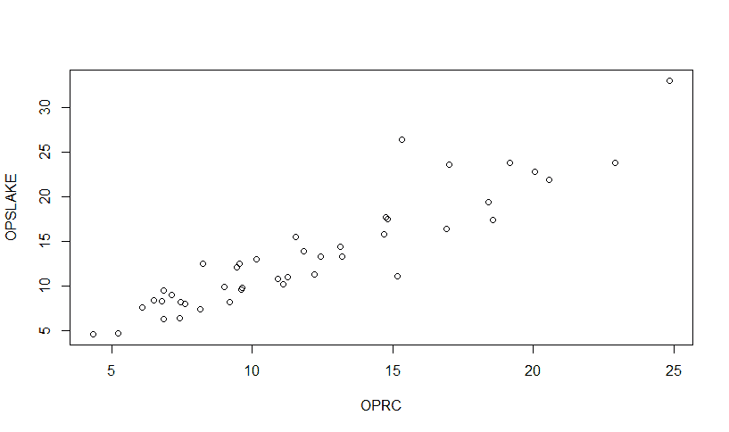

解决共线性问题的简单方法是通过删除变量来消除问题，同时不损害预测能力。如果我们查看最佳子集的调整 R-squared 值，我们可以看到，APSLAKE 和 OPSLAKE 的双变量模型产生了`0.90`的值，而添加 OPRC 仅略微将其增加到`0.92`：

```py
    > best.summary$adjr2 #adjusted r-squared values
    [1] 0.8777515 0.9001619 0.9185369 0.9168706 
      0.9146772 0.9123079

```

让我们来看看双变量模型并测试其假设：

```py
    > fit.2 <- lm(BSAAM ~ APSLAKE+OPSLAKE, data = 
      socal.water)

    > summary(fit.2)

    Call:
    lm(formula = BSAAM ~ APSLAKE + OPSLAKE)

    Residuals:
              Min       1Q   Median       3Q      Max
    -13335.8  -5893.2   -171.8   4219.5  19500.2

    Coefficients:
 Estimate Std. Error t value Pr(>|t|) 
    (Intercept)  19144.9     3812.0   5.022  1.1e-05 
    ***
    APSLAKE       1768.8      553.7   3.194  0.00273 **
    OPSLAKE       3689.5      196.0  18.829  < 2e-16  
    ***
    ---
    Signif. codes:  0 '***' 0.001 '**' 0.01 '*' 0.05 
      '.' 0.1 ' ' 1

    Residual standard error: 8063 on 40 degrees of 
      freedom
    Multiple R-squared:  0.9049,    Adjusted R-squared:  
      0.9002
    F-statistic: 190.3 on 2 and 40 DF,  p-value: < 
      2.2e-16

    > par(mfrow=c(2,2))

    > plot(fit.2)

```

上述代码片段的输出如下：

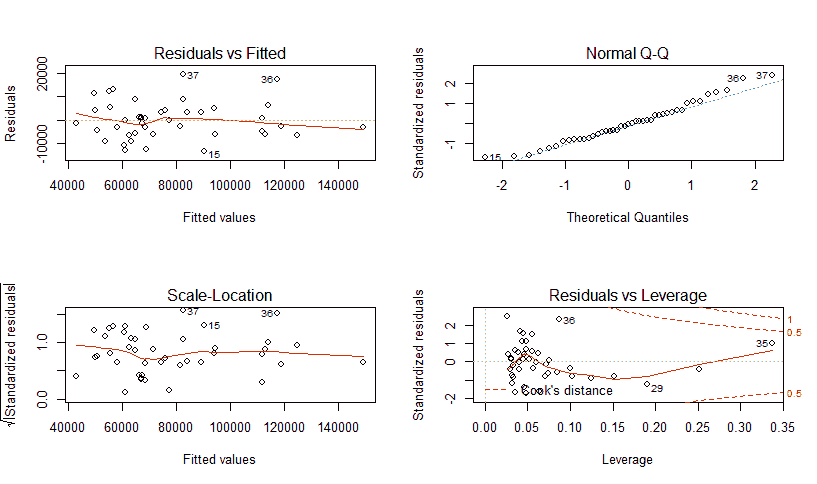

模型是显著的，诊断结果似乎没有引起担忧。这应该也解决了我们的共线性问题，我们可以使用`vif()`函数再次检查：

```py
    > vif(fit.2)

     APSLAKE  OPSLAKE
    1.010221 1.010221

```

如我之前所述，我认为拟合值与残差的关系图并不令人担忧，但如果你有任何疑问，可以在 R 中正式测试误差常量方差的假设。这个测试被称为**布雷斯-帕甘**（**BP**）测试。为此，我们需要加载`lmtest`包，并运行一行代码。BP 测试的零假设是误差方差为零，备择假设不是零：

```py
    > library(lmtest)

    > bptest(fit.2)

    studentized Breusch-Pagan test

    data:  fit.2
    BP = 0.0046, df = 2, p-value = 0.9977

```

由于`p-value = 0.9977`，我们没有证据拒绝零假设，即误差方差为零。测试摘要中的`BP = 0.0046`值是卡方值。

考虑到所有因素，似乎最佳预测模型是包含两个特征 APSALA 和 OPSALA 的模型。该模型可以解释流量径流体积变化的 90%。为了预测径流，它等于 19,145（截距）加上 APSALA 测量值的 1,769 倍加上 OPSALA 测量值的 3,690 倍。可以使用基础 R 中的拟合值和响应变量值来绘制`预测值 vs. 实际值`的散点图，如下所示：

```py
    > plot(fit.2$fitted.values, socal.water$BSAAM, xlab 
     = "predicted", ylab = "actual", main = "Predicted 
       vs.Actual")

```

上述代码片段的输出如下：


虽然信息丰富，但 R 的基础图形不一定适合向商业伙伴展示。然而，我们可以在 R 中轻松地美化这个图形。对于这个例子，有几个用于改进图形的包可用，我将使用`ggplot2`。在生成图形之前，我们必须将预测值放入我们的数据框`socal.water`中。我还想将`BSAAM`重命名为`Actual`，并在数据框中放入一个新的向量，如下所示：

```py
    > socal.water["Actual"] = water$BSAAM #create the 
       vector Actual

    > socal.water$Forecast = predict(fit.2) #populate 
       Forecast with the predicted values

```

接下来，我们将加载`ggplot2`包，并使用一行代码生成更美观的图形：

```py
    > library(ggplot2)

    > ggplot(socal.water, aes(x = Forecast, y = 
       Actual)) + geom_point() + geom_smooth(method = 
          lm) + labs(title = "Forecast versus Actuals")

```

输出如下：

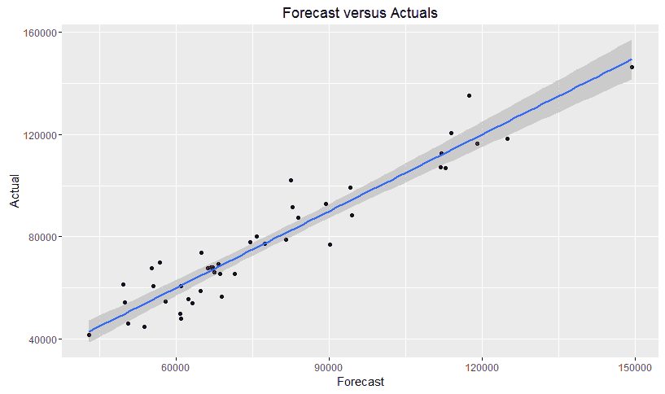

在继续之前，让我们考察一种最终模型选择技术。在接下来的章节中，我们将详细讨论交叉验证。交叉验证是模型选择和测试中广泛使用且有效的方法。为什么这有必要呢？这归结于偏差-方差权衡。赖特州立大学的 Tarpey 教授对这个主题有一个很好的引用：

“我们经常使用回归模型来预测未来的观测值。我们可以使用我们的数据来拟合模型。然而，使用估计模型时使用的相同数据来评估模型的好坏是作弊行为——这往往会给出过于乐观的结果，关于模型预测未来观测值的能力。如果我们省略一个观测值，拟合模型然后预测省略的响应，这将给出一个更少偏差的想法，关于模型预测能力的好坏。”

在前引引用中，Tarpey 教授讨论的交叉验证技术被称为**留一法交叉验证**（**LOOCV**）。在线性模型中，你可以通过检查**预测误差平方和**（**PRESS**）统计量，选择具有最低值的模型来轻松执行 LOOCV。R 库`MPV`会为你计算这个统计量，如下所示：

```py
    > library(MPV) 

    > PRESS(best.fit) 
    [1] 2426757258 

    > PRESS(fit.2) 
    [1] 2992801411 

```

仅凭这个统计量，我们就可以选择我们的`最佳拟合`模型。然而，如前所述，我认为在这种情况下，更简约的模型更好。你可以构建一个简单的函数来计算这个统计量，利用以下代码中所示的一些优雅的矩阵代数：

```py
    > PRESS.best = sum((resid(best.fit)/(1 - 
       hatvalues(best.fit)))²) 

    > PRESS.fit.2 = sum((resid(fit.2)/(1  -
       hatvalues(fit.2)))²)

    > PRESS.best 
    [1] 2426757258 

    > PRESS.fit.2 
    [1] 2992801411 

```

“什么是`hatvalues`？”你可能会问。嗯，如果我们考虑我们的线性模型 *Y = B0 + B1x + e*，我们可以将其转换为矩阵表示：*Y = XB + E*。在这个表示法中，`Y`保持不变，`X`是输入值的矩阵，`B`是系数，而`E`代表误差。这个线性模型求解`B`的值。不深入矩阵乘法的痛苦细节，回归过程产生了一个被称为**帽子矩阵**的结果。这个矩阵映射，或者说有些人说是投影，你的模型计算值到实际值；因此，它捕捉了特定观察在你模型中的影响力。所以，残差平方和除以 1 减去`hatvalues`与 LOOCV 相同。

# 其他线性模型考虑因素

在继续之前，我们需要讨论两个额外的线性模型主题。第一个是包含定性特征，第二个是交互项；这两个主题将在以下章节中解释。

# 定性特征

一个定性特征，也称为因子，可以具有两个或更多级别，例如男性/女性或差/中性/好。如果我们有一个具有两个级别的特征，比如说性别，那么我们可以创建一个所谓的指示符或虚拟特征，任意地将一个级别分配为`0`，另一个分配为`1`。如果我们只创建一个指示符模型，我们的线性模型仍然遵循之前的公式，即*Y = B0 + B1x + e*。如果我们把特征编码为男性等于 0，女性等于 1，那么男性的期望值就只是截距*B0*，而女性的期望值就是*B0 + B1x*。在你有特征超过两个级别的情况下，你可以创建 n-1 个指示符；所以，对于三个级别，你会有两个指示符。如果你创建了与级别一样多的指示符，你就会陷入虚拟变量陷阱，这会导致完美的多重共线性。

我们可以通过一个简单的例子来学习如何解释输出。让我们加载`ISLR`包，并使用以下代码片段使用`Carseats`数据集构建一个模型：

```py
    > library(ISLR)

    > data(Carseats)

    > str(Carseats)

    'data.frame':   400 obs. of  11 variables:
    $ Sales      : num  9.5 11.22 10.06 7.4 4.15 ...
    $ CompPrice  : num  138 111 113 117 141 124 115 136 
       132 132 ...
    $ Income     : num  73 48 35 100 64 113 105 81 110 
       113 ...
    $ Advertising: num  11 16 10 4 3 13 0 15 0 0 ...
    $ Population : num  276 260 269 466 340 501 45 425 
       108 131 ...
    $ Price      : num  120 83 80 97 128 72 108 120 124        
       124 ...
    $ ShelveLoc  : Factor w/ 3 levels 
       "Bad","Good","Medium": 1 2 3 3 1 
      1 3 2 3 3 ...
    $ Age        : num  42 65 59 55 38 78 71 67 76 76 
      ...
    $ Education  : num  17 10 12 14 13 16 15 10 10 17 
      ...
    $ Urban      : Factor w/ 2 levels "No","Yes": 2 2 2 
      2 2 1 2 2 1 1 
      ...
    $ US         : Factor w/ 2 levels "No","Yes": 2 2 2 
      2 1 2 1 2 1 2 
      ..

```

对于这个例子，我们将仅使用`Advertising`（广告），一个定量特征和定性特征`ShelveLoc`（货架位置），它是一个有三个级别的因子：`Bad`（差），`Good`（好）和`Medium`（中等）来预测`Carseats`的销售。对于因子，R 会自动为分析编码指示符。我们按照以下方式构建和分析模型：

```py
    > sales.fit <- lm(Sales ~ Advertising + ShelveLoc, 
       data = Carseats)

    > summary(sales.fit)

    Call:
    lm(formula = Sales ~ Advertising + ShelveLoc, data = 
    Carseats)

    Residuals:
        Min      1Q  Median      3Q     Max
    -6.6480 -1.6198 -0.0476  1.5308  6.4098

    Coefficients:
 Estimate Std. Error t value Pr(>|t|) 
    (Intercept)      4.89662    0.25207  19.426  < 2e-
      16 ***
    Advertising      0.10071    0.01692   5.951 5.88e-
      09 ***
    ShelveLocGood    4.57686    0.33479  13.671  < 2e-
      16 ***
    ShelveLocMedium  1.75142    0.27475   6.375 5.11e-
      10 ***
    ---
    Signif. codes:  0 '***' 0.001 '**' 0.01 '*' 0.05 
      '.' 0.1 ' ' 1

    Residual standard error: 2.244 on 396 degrees of 
      freedom
    Multiple R-squared:  0.3733,    Adjusted R-squared:  
      0.3685
    F-statistic: 78.62 on 3 and 396 DF,  p-value: < 
      2.2e-16

```

如果货架位置是好的，给定截距`4.89662`，销售估计几乎是位置差时的两倍。要查看 R 如何编码指示符特征，你可以使用`contrasts()`函数：

```py
    > contrasts(Carseats$ShelveLoc)

            Good Medium
    Bad       0      0
    Good      1      0
    Medium    0      1

```

# 交互项

在 R 中，交互项同样容易编码。如果某个特征对预测的影响取决于另一个特征的价值，则两个特征之间存在交互。这遵循以下公式：*Y = B0 + B1x + B2x + B1B2x + e*。一个例子可以在`MASS`包中的`Boston`数据集中找到。响应是中值房屋价值，输出中的`medv`。我们将使用两个特征：低社会经济地位房屋的百分比，称为`lstat`，以及房屋的年龄（以年为单位），在以下输出中称为`age`：

```py
    > library(MASS)

    > data(Boston)

    > str(Boston)

    'data.frame':   506 obs. of  14 variables:
    $ crim   : num  0.00632 0.02731 0.02729 0.03237 
       0.06905 ...
    $ zn     : num  18 0 0 0 0 0 12.5 12.5 12.5 12.5 
       ...
    $ indus  : num  2.31 7.07 7.07 2.18 2.18 2.18 7.87 
       7.87 7.87 7.87 
      ...
    $ chas   : int  0 0 0 0 0 0 0 0 0 0 ...
    $ nox    : num  0.538 0.469 0.469 0.458 0.458 0.458 
      0.524 0.524 
      0.524 0.524 ...
    $ rm     : num  6.58 6.42 7.18 7 7.15 ...
    $ age    : num  65.2 78.9 61.1 45.8 54.2 58.7 66.6 
      96.1 100 85.9 
      ...
    $ dis    : num  4.09 4.97 4.97 6.06 6.06 ...
    $ rad    : int  1 2 2 3 3 3 5 5 5 5 ...
    $ tax    : num  296 242 242 222 222 222 311 311 311 
      311 ...
    $ ptratio: num  15.3 17.8 17.8 18.7 18.7 18.7 15.2 
      15.2 15.2 15.2 
      ...
    $ black  : num  397 397 393 395 397 ...
    $ lstat  : num  4.98 9.14 4.03 2.94 5.33 ...
    $ medv   : num  24 21.6 34.7 33.4 36.2 28.7 22.9 
      27.1 16.5 18.9 ...

```

在代码中使用`lm()`函数和*feature1*feature2*将两个特征及其交互项都放入模型中，如下所示：

```py
    > value.fit <- lm(medv ~ lstat * age, data = 
      Boston)

    > summary(value.fit)

    Call:
    lm(formula = medv ~ lstat * age, data = Boston)

    Residuals:
        Min      1Q  Median      3Q     Max
    -15.806  -4.045  -1.333   2.085  27.552

    Coefficients:
 Estimate Std. Error t value Pr(>|t|) 
    (Intercept) 36.0885359  1.4698355  24.553  < 2e-16 
      ***
    lstat       -1.3921168  0.1674555  -8.313 8.78e-16 
      ***
    age         -0.0007209  0.0198792  -0.036   0.9711 
    lstat:age    0.0041560  0.0018518   2.244   0.0252 
      * 
    ---
    Signif. codes:  0 '***' 0.001 '**' 0.01 '*' 0.05 
      '.' 0.1 ' ' 1

    Residual standard error: 6.149 on 502 degrees of 
      freedom
    Multiple R-squared:  0.5557,    Adjusted R-squared:  
      0.5531
    F-statistic: 209.3 on 3 and 502 DF,  p-value: < 
      2.2e-16

```

检查输出，我们可以看到，尽管社会经济地位是一个高度预测的特征，但房屋的年龄并不是。然而，这两个特征有一个显著的交互作用，可以正解释房屋价值。

# 摘要

在机器学习的背景下，我们训练一个模型并对其进行测试，以预测或预报一个结果。在本章中，我们深入探讨了线性回归这一简单而极其有效的方法，用于预测定量响应。后续章节将涵盖更多高级技术，但其中许多只是本章所学内容的扩展。我们讨论了不直观检查数据集，而仅仅依赖统计数据来指导模型选择的问题。

只需几行代码，你就可以做出强大而有洞察力的预测，以支持决策。这不仅简单有效，而且你还可以包括特征之间的定量变量和交互项。实际上，这是任何深入研究机器学习世界的人都必须掌握的方法。
