# 第十二章：时间序列与因果关系

“一个经济学家是一个专家，他将知道明天为什么他昨天预测的事情今天没有发生。”

- 拉乌尔·J·彼得

单变量时间序列是测量在标准时间度量上收集的，这可能是以分钟、小时、天、周或月为单位。使时间序列相对于其他数据成为问题的是观测的顺序可能很重要。这种顺序的依赖性可能导致标准分析方法的偏差或方差过高。

似乎关于机器学习和时间序列数据的文献很少。这是不幸的，因为现实世界中的大量数据都涉及时间成分。此外，时间序列分析可能相当复杂且棘手。我可以说，如果你没有看到时间序列分析被错误地执行，那么你可能没有足够仔细地观察。

另一个常被忽视的与时间序列相关的问题是因果关系。是的，我们不希望混淆相关性与因果关系，但在时间序列分析中，可以通过应用格兰杰因果关系的技巧来确定是否存在因果关系（从统计学的角度来说）。

在本章中，我们将应用时间序列/计量经济学技术来识别单变量预测模型、向量自回归模型，最后是格兰杰因果关系。完成本章后，你可能不会成为时间序列分析的完全大师，但你将知道足够多的知识来进行有效的分析，并了解在构建时间序列模型和创建预测模型（预测）时需要考虑的基本问题。

# 单变量时间序列分析

我们将关注两种分析和预测单一时间序列的方法：**指数平滑**和**自回归积分移动平均**（**ARIMA**）模型。我们将首先查看指数平滑模型。

与移动平均模型一样，指数平滑模型使用过去观测的权重。但与移动平均模型不同，越近期的观测得到的权重相对于较晚的观测越大。有三个可能的平滑参数可以估计：整体平滑参数、趋势参数和季节性平滑参数。如果没有趋势或季节性，那么这些参数将变为零。

平滑参数产生以下方程的预测：

*Yt+1 = α(Yt) + (1 – α)Yt-1 + (1-α)2Yt-2 +…，其中 0 < α ≤ 1*

在这个方程中，*Y[t]* 是时间 T 的值，而 alpha (*α*) 是平滑参数。算法通过最小化误差来优化 alpha（以及其他参数），例如，**平方误差和**（**SSE**）或**均方误差**（**MSE**）。

预测方程以及趋势和季节性方程（如果适用），将如下所示：

+   预测，其中 *A* 是前一个平滑方程，*h* 是预测期数，*Y[t+h] = A + hB[t] + S[t]*

+   趋势方程，*B[t] = β(A[t] – A[t-1]) + (1 – β)B[t-1]*

+   季节性，其中 *m* 是季节性周期的数量， *S[t] = Ω(Y[t] – A[t-1] – B[t-1]) + (1 - Ω)S[t-m]*

这个方程被称为 **Holt-Winters 方法**。预测方程本质上是加性的，趋势是线性的。该方法还允许包含一个衰减趋势和乘性季节性，其中季节性随时间成比例增加或减少。根据我的经验，Holt-Winters 方法提供了最佳的预测，甚至比 ARIMA 模型更好。我得出这个结论是因为我不得不基于月度数据更新数百个时间序列的长期预测，并且在大约 90% 的情况下，Holt-Winters 产生了最小的预测误差。此外，你不必担心像 ARIMA 模型中的平稳性假设。平稳性是指时间序列在所有时间段内具有恒定的均值、方差和相关性。话虽如此，了解 ARIMA 模型仍然很重要，因为会有一些情况下它们的性能最佳。

从自回归模型开始，时间 *T* 的 *Y* 值是 *Y* 的先前值的线性函数。自回归滞后-1 模型 *AR(1)* 的公式是 *Yt = constant + ΦYt-1 + Et*。该模型的关键假设如下：

+   *Et* 表示具有零均值和恒定方差的同分布且相互独立的误差

+   误差与 *Yt* 无关

+   *Yt, Yt-1, Yt-n...* 是平稳的，这意味着 *Φ* 的绝对值小于一

对于平稳时间序列，你可以检查 **自相关函数** (**ACF**)。平稳序列的 ACF 给出了 *Yt* 和 *Yt-h* 之间的相关性，其中 *h = 1, 2...n*。让我们使用 R 来创建一个 *AR(1)* 序列并绘制它。在这个过程中，我们还将查看 `ggfortify` 包的功能，它作为 `ggplot2` 函数的包装器：

```py
 > library(ggfortify) 

 > set.seed(123)

    > ar1 <- arima.sim(list(order = c(1, 0, 0), ar = 0.5), n = 200)

    > autoplot(ar1, main = "AR1")

```

下面的输出是前一个命令的结果：

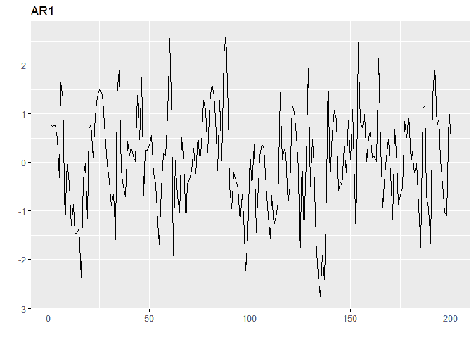

现在，让我们来检查 `ACF`：

```py
    > autoplot(acf(ar1, plot = F), main = "AR1 - ACF")

```

前一个命令的输出如下：

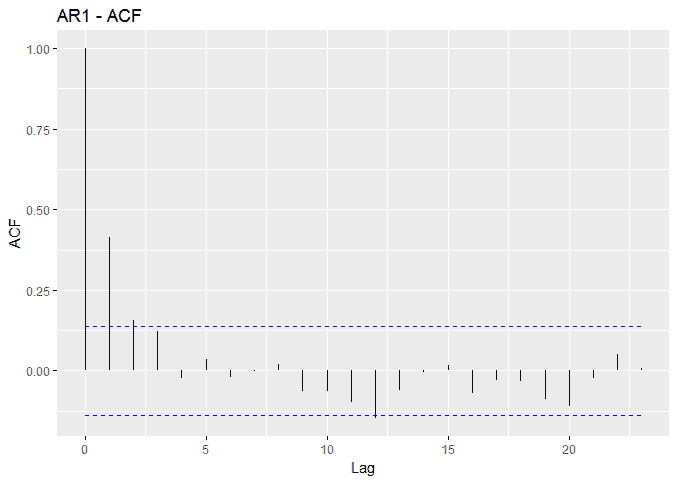

**ACF** 图像显示了随着 **滞后** 的增加，相关性指数级下降。虚线蓝色线表示显著相关性的置信区间。任何延伸到高置信区间以上或低置信区间以下的线都被认为是显著的。除了 ACF 之外，还应该检查 **偏自相关函数** (**PACF**)。PACF 是条件相关性，这意味着 *Yt* 和 *Yt-h* 之间的相关性是在两个观察值之间的观察值条件下确定的。理解这一点的直觉方法之一是考虑一个线性回归模型及其系数。假设你有 *Y = B0 + B1X1* 与 *Y = B0 + B1X1 + B2X2*。在第一个模型中，*X* 与 *Y* 的关系是线性的，有一个系数，但在第二个模型中，系数将不同，因为现在还要考虑 *Y* 与 *X2* 之间的关系。注意，在以下的 `PACF` 图像中，滞后 1 处的偏自相关值与滞后 1 处的自相关值相同，因为这不是条件相关性：

```py
    > autoplot(pacf(ar1, plot = F), main = "AR1 - PACF")

```

以下是在先前的命令输出：

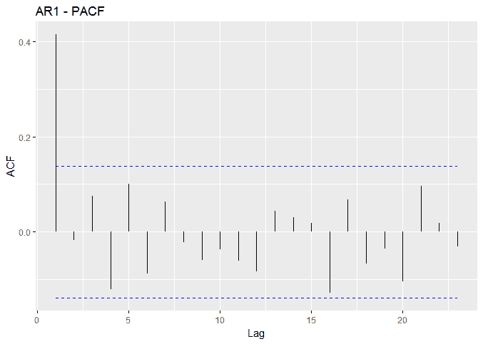

我们可以安全地假设，从先前的时序图像来看，序列是平稳的。在实践练习中，我们将查看一些统计测试以确保数据是平稳的，但大多数情况下，目测就足够了。如果数据不是平稳的，那么可以通过取其差分来去趋势。这是 ARIMA 中的积分 (I)。差分后，新的序列变为 *ΔYt = Yt - Yt-1*。应该期望一阶差分来实现平稳性，但在某些情况下，可能需要二阶差分。具有 *AR(1)* 和 *I(1)* 的 ARIMA 模型将被标注为 (1,1,0)。

MA 代表移动平均。这并不是像股票价格 50 日移动平均那样的简单移动平均，而是一个应用于误差的系数。误差当然是同质独立分布的，均值为零，方差恒定。*MA(1)* 模型的公式是 *Yt = 常数 + Et + ΘEt-1*。正如我们在 *AR(1)* 模型中所做的那样，我们可以在 R 中构建一个 *MA(1)*，如下所示：

```py
    > set.seed(123)

    > ma1 <- arima.sim(list(order = c(0, 0, 1), ma = -0.5), n = 200)

    > autoplot(ma1, main = "MA1")

```

以下是在先前的命令输出：


`ACF` 和 `PACF` 图像与 *AR(1)* 模型略有不同。注意，在查看图像以确定模型是否具有 AR 和/或 MA 项时，有一些经验法则。它们可能有点主观；所以我会把这些启发式方法留给你去学习，但请相信 R 可以识别正确的模型。在以下图像中，我们将看到滞后 1 处存在显著的相关性，以及滞后 1 和滞后 2 处存在两个显著的偏相关性：

```py
    > autoplot(acf(ma1, plot = F), main = "MA1 - ACF")

```

以下是在先前的命令输出：

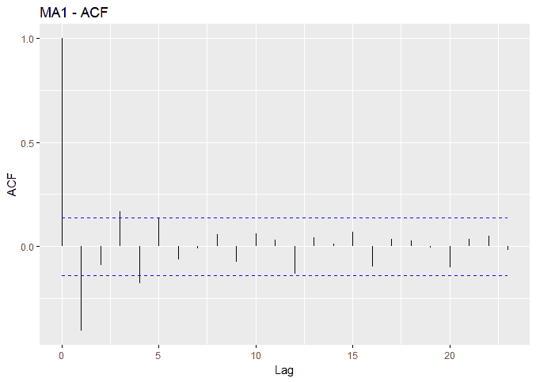

上述图像是 `ACF` 图像，现在，我们将看到 `PACF` 图像：

```py
    > autoplot(pacf(ma1, plot = F), main = "MA1 - PACF")

```

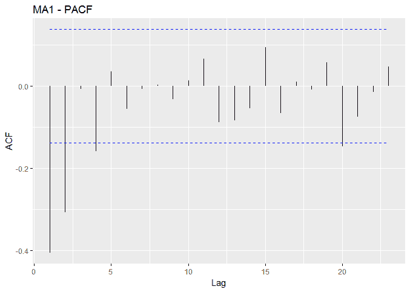

使用 ARIMA 模型，可以纳入季节性，包括自回归、积分和移动平均项。非季节性 ARIMA 模型的表示通常为 (p,d,q)。对于季节性 ARIMA，假设数据是按月度，那么表示将是 (p,d,q) x (P,D,Q)12，其中表示中的 '12' 考虑了月度季节性。在我们将使用的包中，R 将自动识别是否应该包含季节性；如果是，将包括最优项。

# 理解格兰杰因果性

假设你被问到一个问题，例如，“新处方数量和药物 X 的总处方数量之间有什么关系？”。你知道这些是按月度测量的，所以你该如何理解这种关系，鉴于人们认为新处方将推高总处方数量。或者，测试商品价格（特别是铜价）是否是美国股市价格领先指标的这个假设如何？好吧，使用两套时间序列数据，*x* 和 *y*，格兰杰因果性是一种试图确定一个序列是否可能影响另一个序列变化的方法。这是通过取一个序列的不同滞后并使用它来建模第二个序列的变化来完成的。为了实现这一点，我们将创建两个模型来预测 *y*，一个只包含 *y* 的过去值 (`Ω`)，另一个包含 *y* 和 *x* 的过去值 (`π`)。模型如下，其中 *k* 是时间序列中的滞后数：

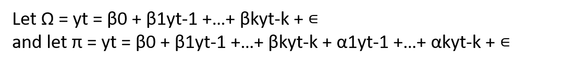

然后将 RSS 进行比较，并使用 `F-test` 来确定嵌套模型 `(Ω)` 是否足够充分地解释 *y* 的未来值，或者是否完整模型 (`π`) 更好。`F-test` 用于检验以下零假设和备择假设：

+   *H0*: 对于每个 *i* `∊[1,k]`，`αi = 0`，不存在格兰杰因果性

+   *H1*: 至少存在一个 *i* `∊[1,k]` 使得 `αi ≠ 0`，格兰杰因果性

实质上，我们试图确定我们是否可以说，从统计上讲，*x*比*y*的过去值提供更多关于*y*未来值的信息。在这个定义中，很明显，我们并不是试图证明实际的因果关系；只是说这两个值通过某种现象相关联。沿着这个思路，我们还必须以相反的方向运行这个模型，以验证*y*不会提供关于*x*未来值的信息。如果我们发现这种情况成立，那么很可能存在一些外生变量，比如*Z*，需要控制，或者可能是格兰杰因果关系的更好候选者。为了避免虚假结果，该方法应应用于平稳时间序列。请注意，有一些研究论文讨论了非线性模型使用的技巧，但这超出了本书的范围；然而，我们将从非平稳的角度来考察它。有一篇出色的介绍性论文围绕着古老的“先有鸡还是先有蛋”的难题（Thurman，1988）。

有几种不同的方法可以识别适当的滞后结构。自然地，一个人可以使用蛮力和无知来测试所有合理的滞后，一次一个。一个人可能基于领域专业知识或可能存在的先前研究而有一个合理的直觉来指导滞后选择。如果没有，那么**向量自回归**（**VAR**）可以用来识别具有最低信息准则的滞后结构，例如**赤池信息准则**（**AIC**）或**最终预测误差**（**FPE**）。为了简单起见，这里给出两个变量的 VAR 模型的符号，并且每个变量只包含一个滞后。这个符号可以扩展到适当数量的变量和滞后。

+   *Y = constant[1] + B[11]Y[t-1] + B[12]Y[t-1] + e[1]*

+   *X = constant[1] + B2[1]Y[t-1] + B2[2]Y[t-1] + e2*

在 R 中，这个过程实施起来相当简单，我们将在下面的实际问题中看到。

# 商业理解

地球不会走开。是我们自己要走。

- 哲学家和喜剧演员，乔治·卡尔林

气候变化正在发生。它始终如此，并将继续如此，但至少从政治和经济角度来看，最大的问题是气候变化是否是人为造成的？我将利用本章内容对计量经济学时间序列模型进行测试，以尝试了解碳排放是否在统计上导致气候变化，特别是气温上升。就我个人而言，我愿意对这个问题保持中立立场，始终牢记卡尔林先生在其关于该主题的教诲中留给我们的原则。

第一件事是找到并收集数据。对于温度，我选择了**HadCRUT4**年际平均温度时间序列，这可能是金标准。这些数据是由东安格利亚大学的气候研究单位和英国气象办公室的哈德尔中心合作编制的。关于数据编制和建模的完整讨论可在[`www.metoffice.gov.uk/hadobs/index.html`](http://www.metoffice.gov.uk/hadobs/index.html)找到。

我们将使用的数据是以年异常值的形式提供的，它是通过给定时间段的平均年地表温度的中位数与参考年（1961-1990 年）的平均值之差来计算的。年地表温度是全球收集的温度数据集，由**CRUTEM4**地表空气温度和**HadSST3**海表数据集混合而成。这些数据因存在偏差和不准确而被质疑：[`www.telegraph.co.uk/comment/11561629/Top-scientists-start-to-examine-fiddled-global-warming-figures.html`](http://www.telegraph.co.uk/comment/11561629/Top-scientists-start-to-examine-fiddled-global-warming-figures.html)。这超出了我们努力的范围，因此我们必须接受并利用这些数据，就像它们现在这样。我从 1919 年 3 月到 2013 年之间提取了数据，以匹配我们的二氧化碳数据。

全球二氧化碳排放估计可以在美国能源部**二氧化碳信息分析中心**（**CDIAC**）的以下网站找到：[`cdiac.ornl.gov/`](http://cdiac.ornl.gov/)

我已经将数据放在了一个`.csv`文件（`climate.csv`）中，供您下载并存储在您的当前工作目录：[`github.com/datameister66/data/`](https://github.com/datameister66/data/)

让我们加载它并检查其结构：

```py
    > climate <- read.csv("climate.csv", stringsAsFactors = F)

    > str(climate)
     'data.frame': 95 obs. of 3 variables:
     $ Year: int 1919 1920 1921 1922 1923 1924 1925 1926 1927 1928 ...
     $ CO2 : int 806 932 803 845 970 963 975 983 1062 1065 ...
     $ Temp: num -0.272 -0.241 -0.187 -0.301 -0.272 -0.292 -0.214 
       -0.105 -0.208  -0.206 ...

```

最后，我们将将其放入时间序列结构中，指定起始和结束年份：

```py
    > climate <- ts(climate[, 2:3], frequency = 12,
       start = 1919, end = 2013)  

    > head(climate)
         CO2   Temp
    [1,] 806 -0.272
    [2,] 932 -0.241
    [3,] 803 -0.187
    [4,] 845 -0.301
    [5,] 970 -0.272
    [6,] 963 -0.292 

```

在数据加载并放入时间序列结构后，我们现在可以开始理解和进一步准备它以进行分析。

# 数据理解和准备

需要两个包来完成这项工作，所以请确保它们已安装在你的系统上：

```py
    > library(forecast)

    > library(tseries)

```

让我们从两个时间序列的图中开始：

```py
    > autoplot(climate)

```

前一个命令的输出如下：

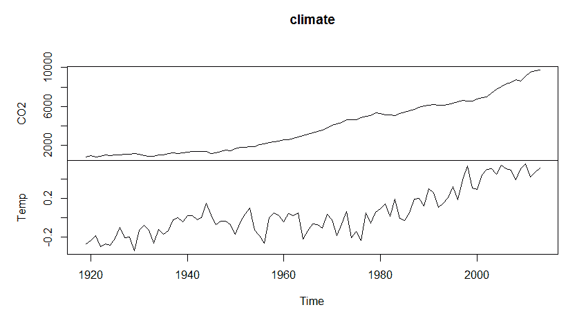

看起来，二氧化碳水平确实是在二战后开始增加的，并且在 20 世纪 70 年代中期温度异常值急剧上升。似乎没有明显的异常值，并且随时间的变化似乎是恒定的。使用标准程序，我们可以看到两个序列高度相关，如下所示：

```py
    > cor(climate)
               CO2      Temp
    CO2  1.0000000 0.8404215
    Temp 0.8404215 1.0000000

```

如前所述，这没有什么值得高兴的，因为它绝对证明不了任何东西。我们将通过绘制两个序列的`ACF`和`PACF`来寻找结构：

```py
    > autoplot(acf(climate[, 2], plot = F), main="Temp ACF")

```

前一段代码片段的输出如下：

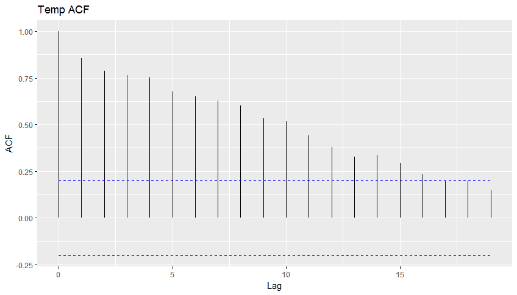

此代码为我们提供了温度的`PACF`图：

```py
 > autoplot(pacf(climate[, 2], plot = F), main = "Temp PACF")

```

前一段代码片段的输出如下：

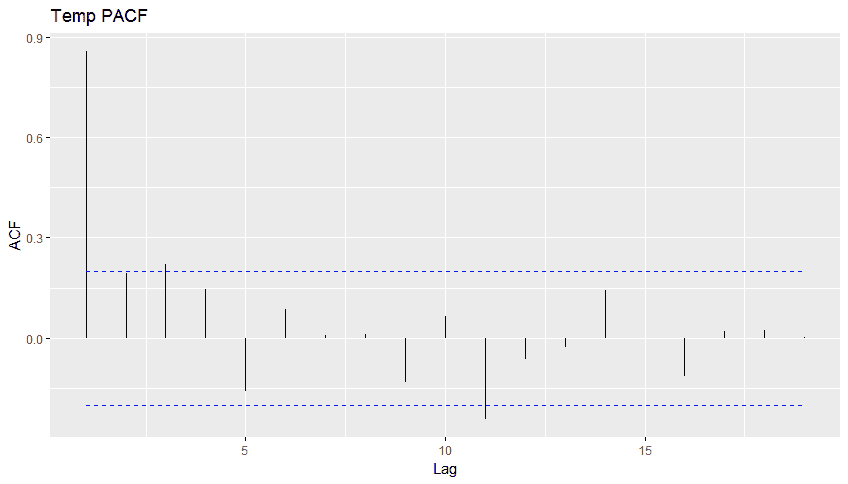

以下代码为我们提供了`CO2`的`ACF`图：

```py
 > autoplot(acf(climate[, 1], plot = F), main = "CO2 ACF")

```

上述代码片段的输出如下：

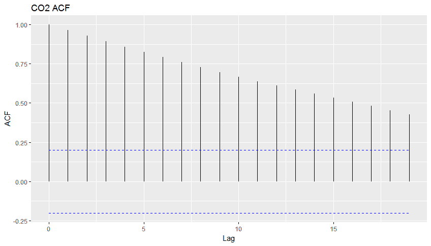

以下代码为我们提供了`CO2`的`PACF`图：

```py
 > autoplot(pacf(climate[, 1], plot = F), main = "CO2 PACF")

```

上述代码片段的输出如下：

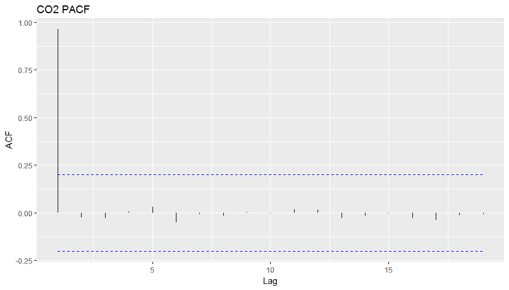

由于 ACF 模式缓慢衰减和 PACF 模式迅速衰减，我们可以假设这些序列都是自回归的，尽管温度似乎有一些显著的 MA 项。接下来，让我们看看**交叉相关函数**（**CCF**）。请注意，我们在函数中将我们的*x*放在*y*之前：

```py
    > ccf(climate[, 1], climate[, 2], main = "CCF")

```

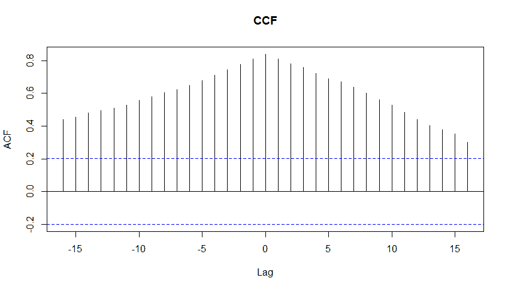

**CCF**显示了温度和二氧化碳滞后之间的相关性。如果*x*变量的负滞后具有高相关性，我们可以说*x*领先*y*。如果*x*的正滞后具有高相关性，我们说*x*滞后*y*。在这里，我们可以看到 CO2 既是领先变量也是滞后变量。对于我们的分析，看到前者是令人鼓舞的，但看到后者是奇怪的。我们将在 VAR 和格兰杰因果分析中看到这是否会成为问题。

此外，我们还需要测试数据是否是平稳的。我们可以使用`tseries`包中可用的**增强迪基-富勒**（**ADF**）测试来证明这一点，使用`adf.test()`函数，如下所示：

```py
    > adf.test(climate[, 1])

           Augmented Dickey-Fuller Test

    data: climate[, 1]
    Dickey-Fuller = -1.1519, Lag order = 4, p-value =
    0.9101
    alternative hypothesis: stationary

    > adf.test(climate[, 2])

           Augmented Dickey-Fuller Test

    data: climate[, 2]
    Dickey-Fuller = -1.8106, Lag order = 4, p-value =
    0.6546
    alternative hypothesis: stationary

```

对于这两个序列，我们都有不显著的`p 值`，因此我们不能拒绝零假设，并得出它们不是平稳的结论。

在探索了数据之后，让我们开始建模过程，从将单变量技术应用于温度异常开始。

# 建模和评估

在建模和评估步骤中，我们将关注三个任务。第一个任务是仅针对地表温度产生一个单变量预测模型。第二个任务是开发一个基于地表温度和二氧化碳水平的回归模型，利用该输出结果来告知我们关于二氧化碳水平是否是地表温度异常的格兰杰原因的研究工作。

# 单变量时间序列预测

在这个任务中，目标是产生一个针对地表温度的单变量预测，重点是选择霍尔特线性趋势模型或 ARIMA 模型。我们将训练模型，并在一个时间外的测试集上确定它们的预测准确性，就像我们在其他学习尝试中所做的那样。以下代码创建了温度子集，然后是训练集和测试集，从二战后开始：

```py
    > temp <- climate[, 2]

    > temp <- climate[, 2]

    > train <- window(temp, start = 1946, end = 2003)

    > test <- window(temp, start = 2004)

```

要构建我们的平滑模型，我们将使用`forecast`包中的`holt()`函数。我们将构建两个模型，一个带有，一个不带阻尼趋势。在这个函数中，我们需要指定时间序列，预测期数作为*h = ...*，选择初始状态值的方法，即`"optimal"`或`"simple"`，以及我们是否想要阻尼趋势。指定`"optimal"`，算法将找到最优的初始起始值以及平滑参数，而`"simple"`使用前几个观测值来计算起始值。现在，在`forecast`包中，你可以使用`ets()`函数，它将找到所有最优参数。然而，在我们的情况下，让我们继续使用`holt()`，这样我们可以比较方法。让我们尝试不带阻尼趋势的`holt`模型，如下所示：

```py
 > fit.holt <- holt(train, h = 10, initial = "optimal")

```

使用以下代码绘制`forecast`并查看其在样本外表现如何：

```py
    > plot(forecast(fit.holt))

    > lines(test, type = "o") 

```

前面代码的输出如下：

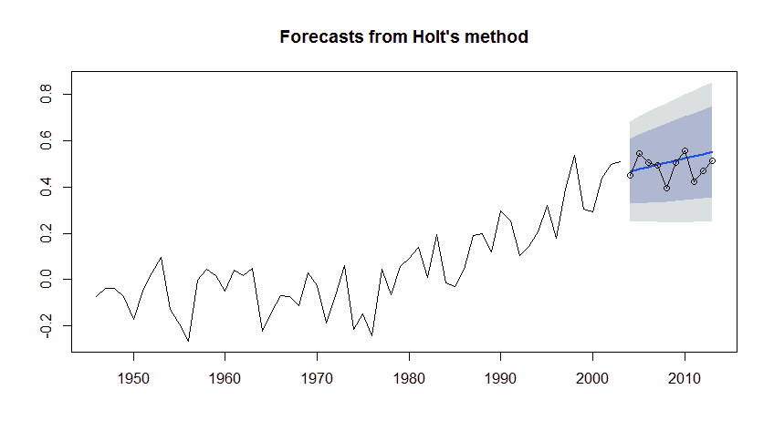

观察图表，似乎这个预测显示了一个轻微的线性上升趋势。让我们尝试加入`damped`趋势，如下所示：

```py
    > fit.holtd <- holt(train, h = 10, initial = "optimal", damped = 
      TRUE)

    > plot(forecast(fit.holtd),main = "Holt Damped")

 > lines(test, type = "o") 

```

前面代码的输出如下：

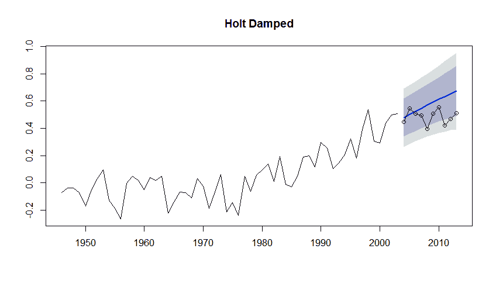

最后，在单变量分析中，我们使用`auto.arima()`构建了一个`ARIMA`模型，它也来自`forecast`包。你可以在函数中指定许多选项，或者你只需包括你的时间序列数据，它将找到最佳的`ARIMA`拟合：

```py
    > fit.arima <- auto.arima(train)
    > summary(fit.arima)
    Series: train 
    ARIMA(0,1,1) with drift 

    Coefficients:
            ma1  drift
        -0.6949 0.0094
    s.e. 0.1041 0.0047

```

简化的输出显示，选定的模型是一个 MA = 1，I = 1，或者`ARIMA(0,1,1)`带有漂移（相当于截距项）。我们可以以前面的方式检查其在`test`数据上的性能图：

```py
 > plot(forecast(fit.arima, h = 10))

 > lines(test, type="o") 

```

前面代码的输出如下：

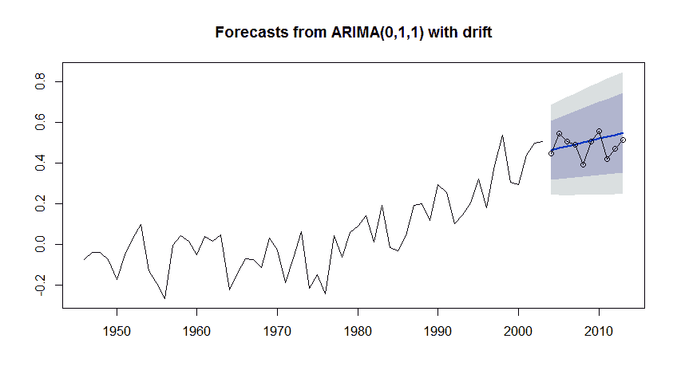

这与不带阻尼趋势的`holt`方法非常相似。我们可以对每个模型进行评分，以找到提供最低误差、平均绝对百分比误差（MAPE）的模型，以下代码所示：

```py
 > mapeHOLT <- sum(abs((test - fit.holt$mean)/test))/10
 > mapeHOLT
 [1] 0.105813
 > mapeHOLTD <- sum(abs((test - fit.holtd$mean)/test))/10
 > mapeHOLTD
 [1] 0.2220256
 > mapeARIMA <- sum(abs((test - forecast(fit.arima, h = 
      10)$mean)/test))/10
 > mapeARIMA
 [1] 0.1034813 

```

与`holt`方法相比，ARIMA 0,1,1 的预测误差略低，并且很明显，阻尼趋势模型表现最差。

通过统计和视觉证据，似乎对于单变量预测模型的最佳选择是 ARIMA 模型。有趣的是，在第一版使用年度数据时，带有阻尼趋势的 Holt 方法具有最佳的准确性。

通过这样，我们已经完成了构建表面温度异常的单变量预测模型，现在我们将继续进行下一个任务，看看 CO2 水平是否导致这些异常。

# 检查因果关系

对于本章内容，我认为这是理论与实践相结合的关键点，我们将从纯粹的关联中区分出因果关系，好吧，至少从统计学的角度来说是这样。这不是第一次将这种技术应用于这个问题。Triacca（2005）没有找到任何证据表明大气中的二氧化碳是导致地表温度异常的格兰杰原因。另一方面，Kodra（2010）得出结论，存在因果关系，但指出他们的数据即使在二阶差分后也不是平稳的。虽然这项工作不能解决争议，但希望它能激发你在个人努力中应用这种方法。当前的主题确实提供了一个有效的训练场，以展示格兰杰因果关系。

我们的计划是首先展示虚假的线性回归，其中残差受到自相关性的影响，也称为序列相关性。然后，我们将检查两种不同的格兰杰因果关系的处理方法。第一种将是传统方法，其中两个序列都是平稳的。然后，我们将查看 Toda 和 Yamamoto（1995）展示的方法，该方法将该方法应用于原始数据，有时也称为“水平”。

# 线性回归

让我们开始虚假回归，我在现实世界中看到这种回归被实施得太频繁了。在这里，我们只是构建一个线性模型并检查结果：

```py
 > fit.lm <- lm(Temp ~ CO2, data = climate)

    > summary(fit.lm)

    Call:
    lm(formula = Temp ~ CO2, data = climate)

    Residuals:
         Min       1Q  Median      3Q     Max 
    -0.36411 -0.08986 0.00011 0.09475 0.28763 

    Coefficients:
                  Estimate  Std. Error  t value     Pr(>|t|) 
    (Intercept) -2.430e-01   2.357e-02   -10.31   <2e-16 ***
    CO2          7.548e-05   5.047e-06    14.96   <2e-16 ***
    ---
    Signif. codes: 
    0 '***' 0.001 '**' 0.01 '*' 0.05 '.' 0.1 ' ' 1

    Residual standard error: 0.1299 on 93 degrees of freedom
    Multiple R-squared: 0.7063, Adjusted R-squared: 0.7032 
    F-statistic: 223.7 on 1 and 93 DF, p-value: < 2.2e-16

```

注意到一切都是显著的，我们的调整 R 平方为 0.7。好吧，它们高度相关，但正如 Granger 和 Newbold（1974）所讨论的，这都没有意义。再次强调，我曾在许多拥有高级学位的人的会议上看到过类似的结果，我不得不扮演“坏人”的角色，挑战这些结果。

我们可以绘制序列相关性图，从残差的时间序列图开始，这将产生一个清晰的模式：

```py
 > plot.ts(fit.lm$residuals)

```

上述代码的输出如下：

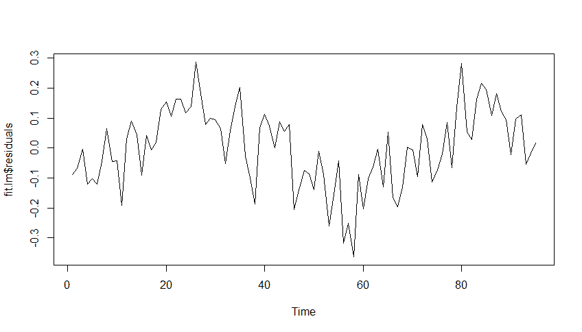

然后，我们创建一个 ACF 图，显示到滞后 10 的显著自相关：

```py
 > acf(fit.lm$residuals)

```

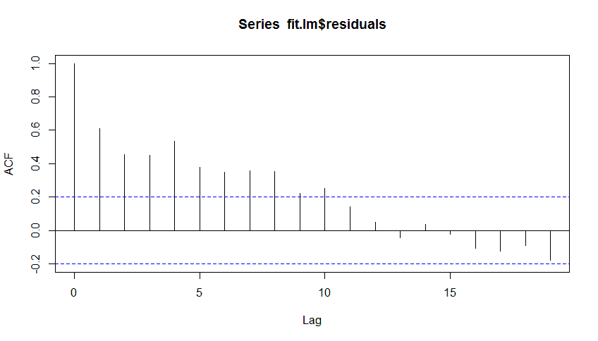

你可以通过执行`Durbin-Watson 测试`来测试自相关性。测试中的零假设是没有自相关性存在：

```py
 > dwtest(fit.lm)

 Durbin-Watson test

 data: fit.lm
 DW = 0.77425, p-value = 4.468e-12
    alternative hypothesis: true autocorrelation is greater than 0

```

从观察图表来看，我们安全地拒绝无自相关性的零假设并不令人惊讶。处理自相关性的简单方法是将依赖时间序列的滞后变量纳入考虑，或者使所有数据平稳。我们将在下一步使用向量自回归来识别在因果关系努力中应包含的适当滞后结构。

# 向量自回归

在前一节中，我们已经看到温度是平稳的，而 CO2 需要一阶差分。另一种简单的方法是使用`forecast`包的`ndiffs()`函数。它提供了一个输出，说明了使数据平稳所需的最小差分数。在函数中，你可以指定你想使用三个可用测试中的哪一个：**Kwiatkowski, Philips, Schmidt & Shin**（**KPSS**），**Augmented Dickey Fuller**（**ADF**），或**Philips-Peron**（**PP**）。我将使用 ADF，其零假设是数据不是平稳的：

```py
 > ndiffs(climate[, 1], test = "adf")
 [1] 1

 > ndiffs(climate[, 2], test = "adf")
 [1] 1 

```

我们可以看到，两者都需要一阶差分才能达到平稳。为了开始，我们将创建差分。然后，我们将完成传统方法，其中两个序列都是平稳的。让我们也加载用于此练习的包：

```py
 > library(vars)

 > library(aod)

 > climateDiff <- diff(climate)

    > climateDiff <- window(climateDiff, start = 1946)

    > head(climateDiff)
         CO2     Temp
    [1,]  78   -0.099
    [2,] 154    0.034
    [3,]  77    0.001
    [4,] -50   -0.035
    [5,] 211   -0.100
    [6,] 137    0.121

```

现在的问题是根据信息准则确定最优滞后结构，这可以通过向量自回归来完成。这是使用`vars`包中的`VARselect`函数完成的。你只需要在函数中使用`lag.max = x`指定模型中的数据和滞后数。让我们使用最多 12 个滞后：

```py
    > lag.select <- VARselect(climateDiff, lag.max = 12)

    > lag.select$selection
    AIC(n) HQ(n) SC(n) FPE(n) 
         5     1     1      5

```

我们使用`lag$selection`调用了信息准则。提供了四种不同的标准，包括**AIC**，**Hannan-Quinn 准则**（**HQ**），**Schwarz-Bayes 准则**（**SC**），和**FPE**。请注意，AIC 和 SC 在第二章中有所介绍，*线性回归 - 机器学习的技巧和策略*，所以这里不会介绍准则公式或差异。如果你想看到每个滞后实际的输出结果，可以使用`lag$criteria`。我们可以看到，`AIC`和`FPE`选择了滞后 5，而 HQ 和 SC 选择了滞后 1 作为 VAR 模型的最优结构。似乎使用 5 年滞后是有意义的。我们将使用`var()`函数创建该模型。我会让你尝试使用滞后 1：

```py
    > fit1 <- VAR(climateDiff, p = 5)

```

摘要结果相当长，因为它构建了两个单独的模型，可能需要占用两整页。我提供的是简化的输出，显示了以温度为预测变量的结果：

```py
 > summary(fit1)
 Residual standard error: 0.1006 on 52 degrees of freedom
    Multiple R-Squared: 0.4509, Adjusted R-squared: 0.3453 
    F-statistic: 4.27 on 10 and 52 DF, p-value: 0.0002326

```

该模型具有显著性，其调整后的 R 平方为 0.35。

正如我们在前一节中所做的那样，我们应该检查序列相关性。在这里，`VAR`包提供了`serial.test()`函数用于多元自相关。它提供了几种不同的测试，但让我们专注于`Portmanteau Test`，并且请注意，DW 测试仅适用于单变量序列。零假设是自相关为零，备择假设是它们不为零：

```py
    > serial.test(fit1, type = "PT.asymptotic")

        Portmanteau Test (asymptotic)

    data: Residuals of VAR object fit1
    Chi-squared = 35.912, df = 44, p-value = 0.8021

```

在`p-value`为`0.3481`的情况下，我们没有证据拒绝零假设，可以说残差不是自相关的。这个测试在 1 滞后下说了什么呢？

在 R 中进行格兰杰因果检验，你可以使用`lmtest`包中的`Grangertest()`函数或`vars`包中的`causality()`函数。我将使用`causality()`函数来演示这个技术。这非常简单，你只需要创建两个对象，一个用于`x`导致`y`，另一个用于`y`导致`x`，利用之前创建的`fit1`对象：

```py
    > x2y <- causality(fit1, cause = "CO2")

    > y2x <- causality(fit1, cause = "Temp")

```

现在调用格兰杰检验结果只是一个简单的问题：

```py
    > x2y$Granger

         Granger causality H0: CO2_diff do not Granger-cause
 climate2.temp

 data: VAR object fit1
 F-Test = 2.2069, df1 = 5, df2 = 104, p-value = 0.05908

 > y2x$Granger

 Granger causality H0: climate2.temp do not Granger-cause
 CO2_diff

 data: VAR object fit1
 F-Test = 0.66783, df1 = 5, df2 = 104, p-value = 0.6487 

```

格兰杰导致温度差异的 CO2 的`p-value`值为`0.05908`，在其他方向上并不显著。那么这一切意味着什么呢？我们可以说的第一件事是 Y 不会导致 X。至于 X 导致 Y，我们不能在 0.05 的显著性水平上拒绝零假设，因此我们得出结论，X 不会格兰杰导致 Y。然而，这是这里相关的结论吗？记住，p-value 评估的是如果零假设为真，效果发生的可能性。还要记住，这个测试从未被设计成一些二元的是或不是。如果这是一个受控实验，我们不太可能犹豫地说我们没有足够的证据来拒绝零假设，就像**食品药品监督管理局**（**FDS**）在 3 期临床试验中会做的那样。由于这项研究是基于观察数据的，我相信我们可以这样说，“CO2 排放格兰杰导致地表温度异常”是非常可能的。但是，对这个结论有很多批评的空间。我一开始就提到了关于数据质量的争议。仍然让我担忧的是分析从哪一年开始。我选择了 1945 年，因为它看起来大约是正确的；你可以说我应用了 SAS 术语中的*proc eyeball*。选择哪一年对分析有巨大的影响，改变滞后结构，也导致不显著的`p-values`。

然而，我们仍然需要使用替代的格兰杰因果技术来模拟原始的 CO2 水平。找到正确滞后数目的过程与之前相同，只是我们不需要使数据平稳：

```py
 > climateLevels <- window(climate, start = 1946)

    > level.select <- VARselect(climateLevels, lag.max = 12)

    > level.select$selection
    AIC(n) HQ(n) SC(n) FPE(n) 
        10     1     1     6 

```

让我们尝试滞后 6 的结构，看看我们是否可以达到显著性，记住要额外添加一个滞后项来考虑积分序列。关于这个技术和为什么需要这样做，可以在[`davegiles.blogspot.de/2011/04/testing-for-granger-causality.html`](http://davegiles.blogspot.de/2011/04/testing-for-granger-causality.html)找到讨论：

```py
 fit2 <- VAR(climateLevels, p = 7)   
    > serial.test(fit2, type = "PT.asymptotic")

           Portmanteau Test (asymptotic)

    data: Residuals of VAR object fit2
    Chi-squared = 35.161, df = 36, p-value = 0.5083

```

现在，为了确定 X 导致 Y 的格兰杰因果性，你进行一个 Wald 测试，其中 X 和仅 X 的系数在预测 Y 的方程中为 0，记住不要在测试中包含解释积分的额外系数。

R 中的 Wald 测试在已经加载的`aod`包中可用。我们需要指定完整模型的系数、其方差-协方差矩阵以及因果变量的系数。

在 VAR 对象中我们需要测试的 Temp 系数包括从 2 到 12 的偶数范围，而 CO2 的系数则是从 1 到 11 的奇数。在我们的函数中，我们不用 c(2, 4, 6，等等)，而是用 base R 的`seq()`函数创建一个对象。

首先，让我们看看 CO2 是如何导致温度的格兰杰因果关系的：

```py
 > CO2terms <- seq(1, 11, 2)

    > Tempterms <- seq(2, 12, 2)

```

我们现在可以运行以下代码中描述的`wald`测试：

```py
 > wald.test(b = coef(fit2$varresult$Temp),
    Sigma = vcov(fit2$varresult$Temp),
    Terms = c(CO2terms))
       Wald test:
       ----------

    Chi-squared test:
    X2 = 11.5, df = 6, P(> X2) = 0.074

```

怎么样？我们接近了神奇的 0.05 `p-value`。让我们用以下代码测试其他方向的因果关系：

```py
 > wald.test(b = coef(fit2$varresult$CO2),
    Sigma = vcov(fit2$varresult$CO2),
    Terms = c(Tempterms))
       Wald test:
       ----------

    Chi-squared test:
    X2 = 3.9, df = 6, P(> X2) = 0.69

```

最后要展示的是如何使用向量自回归来生成预测。`predict`函数可用，所以让我们用`autoplot()`函数对其 25 年期的预测进行可视化，看看会发生什么：

```py
    > autoplot(predict(fit2, n.ahead = 25, ci = 0.95))

```

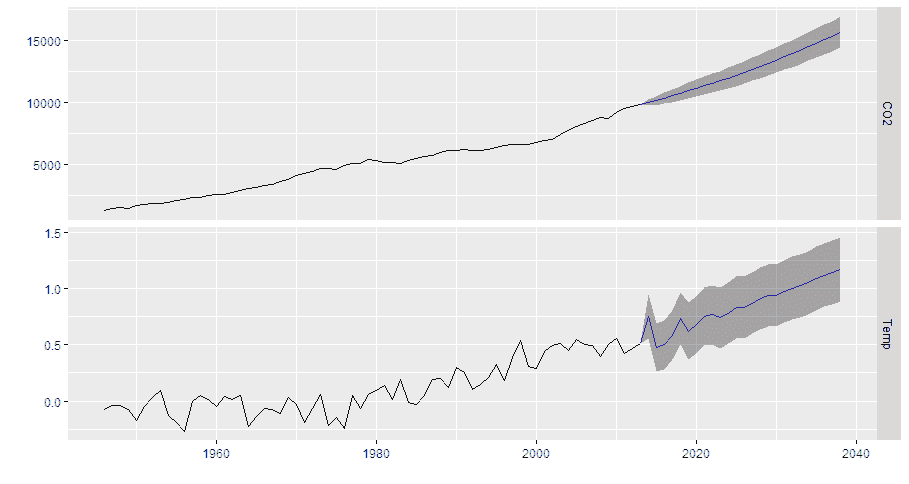

看起来，黑暗的日子即将来临，或许可以说，就像流行电视剧《权力的游戏》中的“冬天就要来了”。对我来说这没什么，因为我的长期投资和储蓄计划一直包括罐头食品和弹药。我还能做什么呢，骑马去上班？只有当戈尔来做的时候，我才会这么做。与此同时，我将致力于我的晒黑工作。

如果没有别的，我希望这能激发你对如何将这项技术应用到自己的实际问题中，或者甚至更深入地检查气候变化数据的思考。在证明因果关系时，应该有一个很高的标准，而格兰杰因果关系是辅助这一努力的一个伟大工具。

# 摘要

在本章中，目标是讨论时间元素在机器学习和分析领域的重要性，识别分析时间序列时的常见陷阱，并展示绕过这些陷阱的技术和方法。我们探讨了全球温度异常和人类二氧化碳排放的单变量和双变量时间序列分析。此外，我们还研究了格兰杰因果关系，以确定我们是否可以说，从统计学的角度来看，大气 CO2 水平导致地表温度异常。我们发现，从 CO2 到温度的格兰杰因果关系的 p 值高于 0.05 但低于 0.10。这确实表明，格兰杰因果关系是研究机器学习问题中因果关系的有效工具。在下一章中，我们将转换方向，探讨如何将学习方法应用于文本数据。

此外，请记住，在时间序列分析中，我们只是触及了表面。我鼓励你探索关于变化点检测、时间序列分解、非线性预测等许多其他技术。尽管通常不被认为是机器学习工具箱的一部分，但我相信你会发现它对你的工具箱来说是一个无价的补充。
