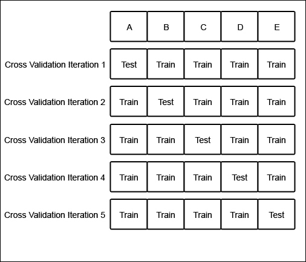
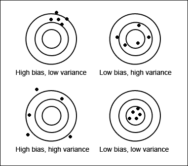
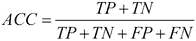
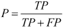
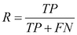

# 第一章：机器学习的基础

本章将回顾机器学习中的基本概念。我们将讨论机器学习算法的应用、监督学习与无监督学习的广谱、训练数据和测试数据的使用以及模型评估。最后，我们将介绍 scikit-learn，并安装接下来章节所需的工具。

长久以来，我们的想象力被能够学习并模仿人类智慧的机器所吸引。虽然像阿瑟·克拉克的 HAL 和艾萨克·阿西莫夫的 Sonny 这样的通用人工智能的愿景尚未实现，但可以通过经验获得新知识和技能的软件程序变得越来越常见。我们使用这些机器学习程序来发现我们喜欢的新音乐，快速找到我们想在网上购买的鞋子。机器学习程序使我们能够对智能手机发出命令，并让我们的恒温器自动调整温度。机器学习程序能够比人类更好地解读潦草的邮寄地址，并更警惕地防止信用卡欺诈。从研究新药物到估算新闻标题版本的页面浏览量，机器学习软件正在成为许多行业的核心。机器学习甚至渗透到长期以来被认为是人类独有的活动中，比如撰写回顾杜克大学篮球队输给北卡罗来纳大学的体育专栏。

机器学习是设计和研究利用过去经验做出未来决策的软件工具；它是研究从数据中学习的程序。机器学习的根本目标是*归纳*，即从规则应用的示例中推导出一个未知的规则。机器学习的经典例子是垃圾邮件过滤。通过观察成千上万封已标记为垃圾邮件或正常邮件的电子邮件，垃圾邮件过滤器学会了对新邮件进行分类。

人工智能研究的先驱计算机科学家阿瑟·塞缪尔曾说过，机器学习是“赋予计算机在没有明确编程的情况下学习能力的研究。”在 1950 年代和 1960 年代，塞缪尔开发了可以下跳棋的程序。虽然跳棋的规则很简单，但要击败经验丰富的对手，需要复杂的策略。塞缪尔并没有明确编程这些策略，而是通过与成千上万场游戏的经验，程序学会了复杂的行为，使它能够击败许多人类对手。

计算机科学家 Tom Mitchell 的名言更正式地定义了机器学习：“一个程序可以说是通过经验*E*在某些任务类*T*和性能度量*P*上学习，如果它在*T*中的任务表现，按照*P*度量，随着经验*E*的增加而得到改进。”例如，假设你有一组图片，每张图片描绘的是狗或猫。一个任务可能是将图片分类为狗和猫的不同集合。程序可以通过观察已经分类的图片来学习执行此任务，并通过计算正确分类的图片百分比来评估其性能。

我们将使用 Mitchell 的机器学习定义来组织本章内容。首先，我们将讨论经验的类型，包括**监督**学习和**无监督**学习。接下来，我们将讨论机器学习系统可以执行的常见任务。最后，我们将讨论可以用来评估机器学习系统的性能度量。

# 从经验中学习

机器学习系统通常被描述为通过经验进行学习，可能有或没有人类的监督。在监督学习问题中，程序通过学习一对对标注的输入和输出，预测输入的输出；也就是说，程序通过正确答案的示例来学习。在无监督学习中，程序不通过标注数据来学习，而是尝试发现数据中的模式。例如，假设你收集了描述人们身高和体重的数据。一个无监督学习问题的例子是将数据点分组。程序可能会将数据分为男性和女性，或者儿童和成人。

现在假设数据也标注了个人的性别。一个监督学习问题的例子是根据一个人的身高和体重来预测他或她是男性还是女性。我们将在接下来的章节中讨论监督学习和无监督学习的算法和示例。

监督学习和无监督学习可以被认为处于一个光谱的两端。一些问题类型，被称为**半监督**学习问题，既利用监督数据也利用无监督数据；这些问题位于监督学习和无监督学习之间的光谱上。半监督机器学习的一个例子是强化学习，其中程序根据其决策获得反馈，但反馈可能与单个决策无关。例如，一个学习玩横版滚动视频游戏（如*超级马里奥兄弟*）的强化学习程序，当它完成一个关卡或超过某个分数时，可能会获得奖励，而当它失去生命时，则会受到惩罚。然而，这种监督反馈与特定决策（例如是否奔跑、避开食人蘑菇或捡起火焰花）无关。尽管本书会讨论半监督学习，我们将主要关注监督学习和无监督学习，因为这两个类别涵盖了大多数常见的机器学习问题。在接下来的章节中，我们将更详细地回顾监督学习和无监督学习。

监督学习程序通过从标记的示例中学习，了解输入应产生的输出。机器学习程序的输出有许多不同的名称。机器学习涉及多个学科，许多学科都有自己的术语。本书中，我们将输出称为**响应变量**。响应变量的其他名称包括因变量、回归变量、标准变量、测量变量、响应变量、解释变量、结果变量、实验变量、标签和输出变量。类似地，输入变量也有多个名称。本书中，我们将输入变量称为**特征**，它们所测量的现象称为**解释变量**。解释变量的其他名称包括预测变量、回归变量、控制变量、操控变量和暴露变量。响应变量和解释变量可以取实数值或离散值。

包含监督经验的示例集合被称为**训练集**。用于评估程序性能的示例集合被称为**测试集**。响应变量可以被看作是由解释变量提出的问题的答案。监督学习问题通过学习不同问题的答案来学习；也就是说，监督学习程序提供了正确的答案，并且必须学会对未见过的但相似的问题做出正确回应。

# 机器学习任务

两个最常见的监督学习任务是**分类**和**回归**。在分类任务中，程序必须学习从一个或多个解释变量预测响应变量的离散值。也就是说，程序必须预测新观察值的最可能类别、类或标签。分类的应用包括预测某只股票价格是上涨还是下跌，或者决定一篇新闻文章是属于政治还是休闲版块。在回归问题中，程序必须预测一个连续响应变量的值。回归问题的例子包括预测新产品的销量，或者根据工作描述预测工资。与分类类似，回归问题也需要监督学习。

一个常见的无监督学习任务是发现训练数据中相关观察值的组，称为**簇**。这个任务被称为**聚类**或聚类分析，它将观察值分配到组中，使得同一组内的观察值在某种相似性度量下，比与其他组的观察值更为相似。聚类通常用于探索数据集。例如，给定一组电影评论，聚类算法可能会发现正面和负面评论的集合。系统无法将这些簇标记为“正面”或“负面”；在没有监督的情况下，它只能知道这些分组的观察值在某种度量下是相似的。聚类的一个常见应用是发现市场中某个产品的顾客细分。通过了解哪些特征是特定顾客群体的共同点，市场营销人员可以决定他们的营销活动需要强调哪些方面。聚类也被互联网广播服务使用；例如，给定一组歌曲，聚类算法可能会根据歌曲的流派将它们分组。使用不同的相似性度量，同一个聚类算法可能会根据歌曲的调性，或者它们包含的乐器来分组歌曲。

**降维**是另一种常见的无监督学习任务。有些问题可能包含成千上万甚至百万个解释变量，而处理这些变量可能需要大量的计算资源。此外，如果某些解释变量捕捉到噪声或与潜在关系无关，程序的泛化能力可能会降低。降维是发现那些对响应变量变化贡献最大的解释变量的过程。降维还可以用于数据可视化。回归问题如预测房屋价格与房屋大小之间的关系就很容易进行可视化；房屋的大小可以绘制在图表的*x*轴上，房屋的价格可以绘制在*y*轴上。同样，当添加第二个解释变量时，住房价格回归问题也很容易进行可视化。例如，房屋的浴室数量可以绘制在 z 轴上。然而，当问题涉及成千上万的解释变量时，就变得无法可视化了。

# 训练数据和测试数据

训练集中的观察值构成了算法用来学习的经验。在监督学习问题中，每个观察值由一个观察到的响应变量和一个或多个观察到的解释变量组成。

测试集是一个类似的观察集合，用于通过某些性能指标评估模型的表现。重要的是，测试集不能包含来自训练集的任何观察。如果测试集中包含了训练集中的示例，那么就很难评估算法是否学会了从训练集中泛化，还是仅仅记住了它。一个能够很好地泛化的程序将能够有效地使用新数据执行任务。相反，一个通过学习过于复杂的模型记住训练数据的程序，可能能够准确预测训练集中的响应变量的值，但对于新示例的响应变量预测会失败。

记忆训练集被称为**过拟合**。一个记住其观察结果的程序可能无法很好地完成任务，因为它可能会记住噪声或偶然的关系和结构。平衡记忆和泛化，或者过拟合和欠拟合，是许多机器学习算法共同面临的问题。在后续章节中，我们将讨论正则化，它可以应用于许多模型以减少过拟合。

除了训练数据和测试数据之外，有时还需要一个第三组数据，称为**验证集**或**保留集**。验证集用于调整称为**超参数**的变量，这些变量控制模型的学习方式。程序仍然会在测试集上进行评估，以提供其在现实世界中的表现估计；其在验证集上的表现不应作为模型在现实世界中的表现估计，因为程序已经专门针对验证数据进行了调整。通常，将一个监督学习数据集划分为训练集、验证集和测试集。对分区大小没有严格要求，大小可以根据可用数据量的不同而有所变化。通常会将 50％或更多的数据分配给训练集，25％分配给测试集，其余部分分配给验证集。

一些训练集可能只包含几百个观察值，而其他的可能包含数百万个。廉价存储、网络连接的增加、配备传感器的智能手机的普及以及对隐私态度的转变，共同促成了当今大数据的状态，或是包含数百万或数十亿个样本的训练集。虽然本书不会使用需要在几十或上百台机器上进行并行处理的数据集，但许多机器学习算法的预测能力会随着训练数据量的增加而提升。然而，机器学习算法也遵循“垃圾进，垃圾出”的原则。一个通过阅读一本庞大且充满错误的教材来备考的学生，可能不会比一个阅读一本简洁但写得很好的教材的学生考得更好。同样，一个在大量嘈杂、无关或标签错误的数据上训练的算法，也不会比在一个较小且更能代表现实问题的数据集上训练的算法表现得更好。

许多监督学习数据集是手动准备的，或者通过半自动化过程生成的。在某些领域，创建一个大型监督数据集可能是非常昂贵的。幸运的是，scikit-learn 提供了几个数据集，允许开发者专注于模型的实验开发。在开发过程中，尤其是当训练数据稀缺时，一种称为**交叉验证**的做法可以用来在相同的数据上训练和验证算法。在交叉验证中，训练数据被划分。算法使用除一个分区之外的所有分区进行训练，并在剩余的分区上进行测试。然后，这些分区会旋转多次，以便算法能在所有数据上进行训练和评估。下图展示了包含五个分区或**折叠**的交叉验证：



原始数据集被划分为五个大小相等的子集，标记为**A**到**E**。最初，模型在**B**到**E**的分区上进行训练，并在**A**分区上进行测试。在下一轮中，模型在**A**、**C**、**D**和**E**的分区上进行训练，并在**B**分区上进行测试。分区将轮换，直到模型在所有分区上进行过训练和测试。交叉验证提供了比单一数据分区测试更准确的模型性能估计。

# 性能指标、偏差和方差

有许多指标可以用来衡量一个程序是否在更有效地执行任务。对于监督学习问题，许多性能指标衡量的是预测错误的数量。预测错误有两个根本原因：模型的**偏差**和**方差**。假设你有许多训练集，它们都是唯一的，但在代表性上都相等。如果一个模型的偏差很大，那么无论用哪个训练集进行训练，它都会对某个输入产生类似的错误；模型会偏向自己对真实关系的假设，而不是训练数据中展示的关系。相反，如果一个模型的方差很大，它会根据训练集的不同而对某个输入产生不同的错误。高偏差的模型缺乏灵活性，而高方差的模型可能过于灵活，以至于将训练集中的噪声也拟合进去。也就是说，一个高方差的模型会过拟合训练数据，而高偏差的模型则会欠拟合训练数据。可以通过将偏差和方差比作投掷飞镖来帮助理解。每一支飞镖类似于来自不同数据集的一个预测。一个高偏差但低方差的模型会将飞镖投向远离靶心的地方，但飞镖会聚集在一起。一个高偏差和高方差的模型会将飞镖投向四处；飞镖既远离靶心，又互相分散。

一个低偏差和高方差的模型会将飞镖投向更接近靶心的地方，但飞镖聚集得不好。最后，一个低偏差和低方差的模型会将飞镖投向紧紧聚集在靶心周围的地方，如下图所示：



理想情况下，模型既具有低偏差又具有低方差，但减少其中一个往往会增加另一个。这被称为**偏差-方差权衡**。我们将在本书中讨论许多模型的偏差和方差。

无监督学习问题没有错误信号可供测量；相反，无监督学习问题的性能指标衡量的是数据中发现的结构的一些属性。

大多数性能衡量标准只能针对特定类型的任务进行计算。机器学习系统应该使用能够代表现实世界中错误成本的性能衡量标准进行评估。虽然这看起来显而易见，但以下例子描述了使用一种适合一般任务但不适用于具体应用的性能衡量标准。

考虑一个分类任务，其中机器学习系统观察肿瘤，并必须预测这些肿瘤是恶性还是良性。**准确率**，即被正确分类的实例所占的比例，是程序性能的直观衡量标准。虽然准确率能够衡量程序的表现，但它并不能区分被误判为良性的恶性肿瘤和被误判为恶性的良性肿瘤。在某些应用中，所有类型错误的成本可能是一样的。然而，在这个问题中，未能识别恶性肿瘤可能比将良性肿瘤错误分类为恶性肿瘤更为严重。

我们可以测量每一种可能的预测结果，以创建对分类器性能的不同视角。当系统正确地将肿瘤分类为恶性时，这种预测被称为**真正例**。当系统错误地将良性肿瘤分类为恶性时，这种预测是**假正例**。类似地，**假负例**是将肿瘤错误预测为良性，而**真负例**是正确预测肿瘤为良性。这四种结果可以用来计算几个常见的分类性能衡量标准，包括**准确率**、**精确度**和**召回率**。

准确率通过以下公式计算，其中*TP*是正确预测为恶性肿瘤的数量，*TN*是正确预测为良性肿瘤的数量，*FP*是错误预测为恶性肿瘤的数量，*FN*是错误预测为良性肿瘤的数量：



精确度是预测为恶性肿瘤中，实际为恶性的比例。精确度通过以下公式计算：



召回率是系统识别出的恶性肿瘤的比例。召回率通过以下公式计算：



在这个例子中，精确度衡量的是被预测为恶性的肿瘤中，实际为恶性的比例。召回率衡量的是实际恶性肿瘤中被检测出的比例。

精度和召回率度量可能揭示一个具有令人印象深刻的准确率的分类器实际上未能检测出大多数恶性肿瘤。如果大多数肿瘤是良性的，即使是一个从不预测恶性的分类器，也可能具有很高的准确率。一个不同的分类器，尽管准确率较低，但召回率较高，可能更适合此任务，因为它能检测到更多的恶性肿瘤。

还有许多其他用于分类的性能度量方法可以使用；我们将在后续章节中讨论一些，包括多标签分类问题的度量标准。在下一章中，我们将讨论回归任务的一些常见性能度量标准。

# scikit-learn 简介

自 2007 年发布以来，scikit-learn 已成为最流行的 Python 开源机器学习库之一。scikit-learn 提供了用于机器学习任务的算法，包括分类、回归、降维和聚类。它还提供了提取特征、处理数据和评估模型的模块。

scikit-learn 作为 SciPy 库的扩展而构思，基于流行的 Python 库 NumPy 和 matplotlib。NumPy 扩展了 Python，使其能够高效地操作大型数组和多维矩阵。matplotlib 提供了可视化工具，SciPy 提供了科学计算模块。

scikit-learn 因为拥有文档齐全、易于使用和多功能的 API，在学术研究中非常流行。开发人员可以通过只改变几行代码，利用 scikit-learn 实验不同的算法。scikit-learn 封装了某些流行的机器学习算法实现，例如 LIBSVM 和 LIBLINEAR。其他 Python 库，包括 NLTK，也为 scikit-learn 提供了封装。scikit-learn 还包含各种数据集，使开发人员可以专注于算法，而无需担心数据的获取和清理。

作为许可宽松的 BSD 许可证下的开源软件，scikit-learn 可以在商业应用中不受限制地使用。scikit-learn 的许多算法速度快且可扩展，适用于几乎所有的数据集，除了极大的数据集。最后，scikit-learn 以其可靠性著称；库中的大部分内容都由自动化测试覆盖。

# 安装 scikit-learn

本书是为 scikit-learn 版本 0.15.1 编写的；请使用该版本以确保示例能够正确运行。如果您之前已安装过 scikit-learn，可以通过以下代码检索版本号：

```py
>>> import sklearn
>>> sklearn.__version__
'0.15.1'
```

如果你之前没有安装过 scikit-learn，可以通过包管理器安装它，或者从源代码构建它。我们将在接下来的章节中回顾 Linux、OS X 和 Windows 的安装过程，但可以参考[`scikit-learn.org/stable/install.html`](http://scikit-learn.org/stable/install.html)获取最新的安装说明。以下说明仅假设你已经安装了 Python 2.6、Python 2.7 或 Python 3.2 或更高版本。前往[`www.python.org/download/`](http://www.python.org/download/)获取安装 Python 的说明。

## 在 Windows 上安装 scikit-learn

scikit-learn 需要 Setuptools，这是一个支持 Python 软件打包和安装的第三方包。可以通过运行[`bitbucket.org/pypa/setuptools/raw/bootstrap/ez_setup.py`](https://bitbucket.org/pypa/setuptools/raw/bootstrap/ez_setup.py)中的引导脚本，在 Windows 上安装 Setuptools。

也可以获取适用于 32 位和 64 位版本的 Windows 二进制文件。如果无法确定需要哪一版本，请安装 32 位版本。两个版本都依赖于 NumPy 1.3 或更高版本。32 位版本的 NumPy 可以从[`sourceforge.net/projects/numpy/files/NumPy/`](http://sourceforge.net/projects/numpy/files/NumPy/)下载。64 位版本可以从[`www.lfd.uci.edu/~gohlke/pythonlibs/#scikit-learn`](http://www.lfd.uci.edu/~gohlke/pythonlibs/#scikit-learn)下载。

可以从[`sourceforge.net/projects/scikit-learn/files/`](http://sourceforge.net/projects/scikit-learn/files/)下载 32 位版本的 Windows 安装程序。可以从[`www.lfd.uci.edu/~gohlke/pythonlibs/#scikit-learn`](http://www.lfd.uci.edu/~gohlke/pythonlibs/#scikit-learn)下载 64 位版本的安装程序。

也可以从源代码在 Windows 上构建 scikit-learn。构建需要一个 C/C++编译器，如 MinGW（[`www.mingw.org/`](http://www.mingw.org/)）、NumPy、SciPy 和 Setuptools。

要构建，请从[`github.com/scikit-learn/scikit-learn`](https://github.com/scikit-learn/scikit-learn)克隆 Git 仓库，并执行以下命令：

```py
python setup.py install

```

## 在 Linux 上安装 scikit-learn

在 Linux 上安装 scikit-learn 有多种选择，具体取决于你的发行版。推荐的安装 scikit-learn 的方式是使用`pip`。你也可以使用包管理器进行安装，或者从源代码构建 scikit-learn。

要使用`pip`安装 scikit-learn，请执行以下命令：

```py
sudo pip install scikit-learn

```

要构建 scikit-learn，请从[`github.com/scikit-learn/scikit-learn`](https://github.com/scikit-learn/scikit-learn)克隆 Git 仓库。然后安装以下依赖项：

```py
sudo apt-get install python-dev python-numpy python-numpy-dev python-setuptools python-numpy-dev python-scipy libatlas-dev g++

```

导航到仓库目录并执行以下命令：

```py
python setup.py install

```

## 在 OS X 上安装 scikit-learn

可以使用 Macports 在 OS X 上安装 scikit-learn：

```py
sudo port install py26-sklearn

```

如果安装了 Python 2.7，请运行以下命令：

```py
sudo port install py27-sklearn

```

scikit-learn 也可以使用`pip`通过以下命令进行安装：

```py
pip install scikit-learn

```

## 验证安装

为了验证 scikit-learn 是否已正确安装，请打开 Python 控制台并执行以下命令：

```py
>>> import sklearn
>>> sklearn.__version__
'0.15.1'
```

要运行 scikit-learn 的单元测试，首先安装`nose`库。然后执行以下命令：

```py
nosetest sklearn –exe

```

恭喜！您已成功安装 scikit-learn。

# 安装 pandas 和 matplotlib

pandas 是一个开源库，为 Python 提供数据结构和分析工具。pandas 是一个强大的库，许多书籍描述了如何使用 pandas 进行数据分析。我们将使用 pandas 的一些便利工具来导入数据和计算汇总统计信息。

pandas 可以在 Windows、OS X 和 Linux 上使用`pip`通过以下命令进行安装：

```py
pip install pandas

```

pandas 也可以在基于 Debian 和 Ubuntu 的 Linux 发行版上通过以下命令进行安装：

```py
apt-get install python-pandas

```

matplotlib 是一个用于轻松创建图表、直方图和其他图形的 Python 库。我们将使用它来可视化训练数据和模型。matplotlib 有几个依赖项。像 pandas 一样，matplotlib 依赖于 NumPy，NumPy 应该已经安装好。在基于 Debian 和 Ubuntu 的 Linux 发行版上，可以通过以下命令安装 matplotlib 及其依赖项：

```py
apt-get install python-matplotlib

```

OS X 和 Windows 的二进制文件可以从[`matplotlib.org/downloads.html`](http://matplotlib.org/downloads.html)下载。

# 总结

在本章中，我们将机器学习定义为设计和研究能够通过从经验中学习来提高任务表现的程序。我们讨论了经验中监督的范围。在这个范围的一个端点是监督学习，在这种学习方式下，程序通过带有相应输出标签的输入来学习。范围的另一端是无监督学习，在这种学习方式下，程序必须在没有标签的数据中发现隐藏的结构。半监督方法则结合了带标签和不带标签的训练数据。

我们讨论了常见的机器学习任务类型，并回顾了示例应用。在分类任务中，程序必须根据解释变量预测离散响应变量的值。在回归任务中，程序必须根据解释变量预测连续响应变量的值。在回归任务中，程序必须根据解释变量预测连续响应变量的值。无监督学习任务包括聚类，其中根据某种相似度度量将观测值组织成组；以及降维，它将一组解释变量减少为一组较小的合成特征，同时尽可能保留更多信息。我们还回顾了偏差-方差权衡，并讨论了不同机器学习任务的常见性能衡量标准。

我们还讨论了 scikit-learn 的历史、目标和优势。最后，我们通过安装 scikit-learn 和其他常用的配套库来准备我们的开发环境。在下一章中，我们将更详细地讨论回归任务，并使用 scikit-learn 构建我们的第一个机器学习模型。
