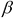
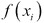
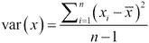
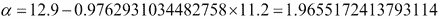
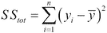
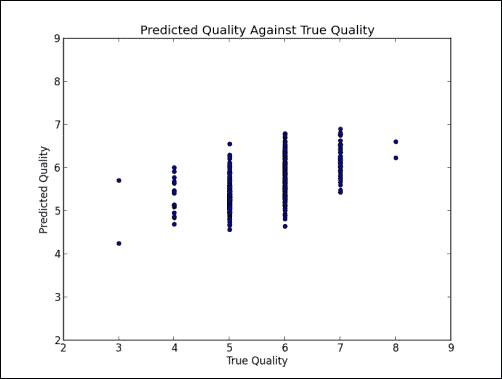

# 第二章：线性回归

在本章中，你将学习如何在回归问题中使用线性模型。首先，我们将研究简单线性回归，它建立了一个响应变量与单个解释变量之间的关系。接下来，我们将讨论多重线性回归，它是简单线性回归的推广，支持多个解释变量。然后，我们将讨论多项式回归，这是一种多重线性回归的特例，能够有效地建模非线性关系。最后，我们将讨论如何通过找到使成本函数最小化的参数值来训练我们的模型。在讨论更大数据集的应用之前，我们将通过一个玩具问题来学习这些模型和学习算法的工作原理。

# 简单线性回归

在上一章中，你了解到训练数据用于估计监督学习问题中模型的参数。过去对解释变量及其相应响应变量的观察构成了训练数据。该模型可以用于预测在先前未观察到的解释变量值下响应变量的值。回顾一下，回归问题的目标是预测连续响应变量的值。在本章中，我们将研究几个线性回归模型的示例。我们将讨论每种方法的训练数据、模型、学习算法和评估指标。首先，让我们考虑**简单线性回归**。简单线性回归可用于建立一个响应变量与一个解释变量之间的线性关系。线性回归已被应用于许多重要的科学和社会问题；我们将要考虑的这个例子可能并非其中之一。

假设你想知道比萨饼的价格。你可能会直接查看菜单。然而，这本书是一本机器学习书籍，所以我们将使用简单线性回归来预测比萨饼的价格，基于我们可以观察到的比萨饼的某个属性。让我们建模比萨饼大小与价格之间的关系。首先，我们将编写一个使用 scikit-learn 的程序，可以根据比萨饼的大小预测它的价格。然后，我们将讨论简单线性回归是如何工作的，以及它如何被推广到解决其他类型的问题。假设你已经在比萨饼日志中记录了你之前吃过的比萨饼的直径和价格。这些观察数据构成了我们的训练数据：

| 训练实例 | 直径（英寸） | 价格（美元） |
| --- | --- | --- |
| 1 | 6 | 7 |
| 2 | 8 | 9 |
| 3 | 10 | 13 |
| 4 | 14 | 17.5 |
| 5 | 18 | 18 |

我们可以通过使用`matplotlib`将训练数据绘制在图表上来可视化它：

```py
>>> import matplotlib.pyplot as plt
>>> X = [[6], [8], [10], [14],   [18]]
>>> y = [[7], [9], [13], [17.5], [18]]
>>> plt.figure()
>>> plt.title('Pizza price plotted against diameter')
>>> plt.xlabel('Diameter in inches')
>>> plt.ylabel('Price in dollars')
>>> plt.plot(X, y, 'k.')
>>> plt.axis([0, 25, 0, 25])
>>> plt.grid(True)
>>> plt.show()
```

前面的脚本产生了以下图形。比萨饼的直径绘制在*x*轴上，价格绘制在*y*轴上。


从训练数据的图形中，我们可以看到比萨的直径与其价格之间存在正相关关系，这也应该得到我们自己吃比萨经验的验证。随着比萨直径的增大，其价格通常也会增加。以下的比萨价格预测程序使用线性回归来建模这种关系。让我们回顾以下程序，并讨论线性回归是如何工作的：

```py
>>> from sklearn.linear_model import LinearRegression
>>> # Training data
>>> X = [[6], [8], [10], [14],   [18]]
>>> y = [[7], [9], [13], [17.5], [18]]
>>> # Create and fit the model
>>> model = LinearRegression()
>>> model.fit(X, y)
>>> print 'A 12" pizza should cost: $%.2f' % model.predict([12])[0]
A 12" pizza should cost: $13.68
```

简单线性回归假设响应变量与解释变量之间存在线性关系；它用一个称为超平面的线性面来建模这个关系。超平面是一个子空间，其维度比包含它的空间少一个维度。在简单线性回归中，响应变量有一个维度，解释变量有另一个维度，总共有两个维度。因此，回归超平面只有一个维度；一个一维的超平面就是一条直线。

`sklearn.linear_model.LinearRegression` 类是一个**估计器**。估计器根据观察到的数据预测一个值。在 scikit-learn 中，所有估计器都实现了 `fit()` 和 `predict()` 方法。前者用于学习模型的参数，后者用于利用学习到的参数预测响应变量的值。使用 scikit-learn 很容易进行不同模型的实验，因为所有估计器都实现了 `fit` 和 `predict` 方法。

`LinearRegression` 的 `fit` 方法学习以下简单线性回归模型的参数：


 是响应变量的预测值；在这个例子中，它是比萨的预测价格。  是解释变量。截距项  和系数  是模型的参数，这些参数由学习算法学习得出。下图中的直线描绘了比萨的大小与价格之间的关系。使用这个模型，我们预计一个 8 英寸比萨的价格约为 7.33 美元，而一个 20 英寸比萨的价格约为 18.75 美元。


使用训练数据学习简单线性回归的参数值，以生成最佳拟合模型的过程称为**普通最小二乘法**或**线性最小二乘法**。在本章中，我们将讨论近似模型参数值和解析解法的方法。首先，我们必须定义什么是模型拟合训练数据。

## 评估模型适应度的代价函数

由若干参数值集生成的回归线在下图中绘制。我们如何评估哪些参数生成了最佳拟合的回归线？


**代价** **函数**，也称为**损失函数**，用于定义和衡量模型的误差。模型预测的价格与训练集中比萨实际价格之间的差异被称为**残差**或**训练误差**。稍后，我们将在一个单独的测试数据集上评估模型；预测值与测试数据中观察到的值之间的差异被称为**预测** **误差**或**测试误差**。

我们模型的残差由以下图中训练实例的点和回归超平面之间的垂直线表示：


我们可以通过最小化残差的总和来生成最佳的比萨价格预测器。也就是说，当模型对所有训练样本的响应变量预测值接近观察到的实际值时，我们的模型就得到了拟合。这种衡量模型拟合度的方式被称为**残差** **平方和**代价函数。严格来说，这个函数通过对所有训练样本的残差平方求和来评估模型的拟合度。残差平方和通过以下公式计算，其中  为观察值， 为预测值：


让我们通过在前一个脚本中添加以下两行来计算我们模型的残差平方和：

```py
>>> import numpy as np
>>> print 'Residual sum of squares: %.2f' % np.mean((model.predict(X) - y) ** 2)
Residual sum of squares: 1.75
```

现在我们有了代价函数，可以找到最小化该函数的模型参数值。

## 解普通最小二乘法以进行简单线性回归

在这一节中，我们将解决简单线性回归的普通最小二乘法问题。回顾一下，简单线性回归由以下方程给出：


同时，回想一下，我们的目标是求解使成本函数最小化的 和 的值。我们将首先求解。为此，我们将计算 的**方差**和 与 的**协方差**。

方差是衡量一组值分布范围的指标。如果该组中的所有数值相等，则方差为零。小方差表示这些数值接近该组的均值，而一组包含远离均值且彼此差异较大的数值则具有较大的方差。方差可以通过以下方程计算：



在上述方程中， 是 的均值， 是 在 训练实例中的值， 是训练实例的数量。让我们计算训练集中的比萨直径的方差：

```py
>>> from __future__ import division
>>> xbar = (6 + 8 + 10 + 14 + 18) / 5
>>> variance = ((6 - xbar)**2 + (8 - xbar)**2 + (10 - xbar)**2 + (14 - xbar)**2 + (18 - xbar)**2) / 4
>>> print variance
23.2
```

NumPy 还提供了`var`方法来计算方差。可以使用`ddof`关键字参数设置贝塞尔修正来计算样本方差：

```py
>>> import numpy as np
>>> print np.var([6, 8, 10, 14, 18], ddof=1)
23.2
```

协方差是衡量两个变量共同变化程度的指标。如果变量的值一起增加，则它们的协方差为正；如果一个变量倾向于增加而另一个减少，则它们的协方差为负。如果两个变量之间没有线性关系，则它们的协方差为零；这些变量是线性不相关的，但不一定是独立的。协方差可以通过以下公式计算：


与方差类似，是训练实例的直径，是直径的平均值，是价格的平均值，是训练实例的价格，而是训练实例的数量。我们来计算训练集中比萨饼直径和价格的协方差：

```py
>>> xbar = (6 + 8 + 10 + 14 + 18) / 5
>>> ybar = (7 + 9 + 13 + 17.5 + 18) / 5
>>> cov = ((6 - xbar) * (7 - ybar) + (8 - xbar) * (9 - ybar) + (10 - xbar) * (13 - ybar) +
>>>        (14 - xbar) * (17.5 - ybar) + (18 - xbar) * (18 - ybar)) / 4
>>> print cov
>>> import numpy as np
>>> print np.cov([6, 8, 10, 14, 18], [7, 9, 13, 17.5, 18])[0][1]
22.65
22.65
```

现在我们已经计算了自变量的方差和响应与自变量的协方差，我们可以使用以下公式求解：


在求解了后，我们可以使用以下公式求解：


在前面的公式中，是的平均值，而是的平均值。是重心的坐标，这是模型必须经过的点。我们可以使用重心和的值来求解，如下所示：



现在我们已经解决了能够最小化成本函数的模型参数的值，我们可以代入比萨饼的直径并预测其价格。例如，一款 11 英寸的比萨饼预计价格为 12.70 美元，而一款 18 英寸的比萨饼预计价格为 19.54 美元。恭喜你！你使用了简单线性回归来预测比萨饼的价格。

# 评估模型

我们使用了学习算法从训练数据中估算模型的参数。我们如何评估我们的模型是否能良好地表示实际关系呢？假设你在披萨日志中找到了另一页记录。我们将使用这页中的条目作为测试集来衡量模型的表现：

| 测试实例 | 直径（英寸） | 观察到的价格（美元） | 预测的价格（美元） |
| --- | --- | --- | --- |
| 1 | 8 | 11 | 9.7759 |
| 2 | 9 | 8.5 | 10.7522 |
| 3 | 11 | 15 | 12.7048 |
| 4 | 16 | 18 | 17.5863 |
| 5 | 12 | 11 | 13.6811 |

可以使用多种方法来评估我们模型的预测能力。我们将使用**r 平方**来评估我们的披萨价格预测器。R 平方衡量模型预测响应变量观察值的准确度。更具体地说，r 平方是模型解释的响应变量方差的比例。r 平方值为 1 表示模型可以毫无误差地预测响应变量。r 平方值为 0.5 表示模型能够预测响应变量方差的一半。计算 r 平方有几种方法。在简单线性回归的情况下，r 平方等于皮尔逊积矩相关系数的平方，或皮尔逊的*r*。

使用这种方法，r 平方应该是一个介于零和一之间的正数。这种方法是直观的；如果 r 平方描述了模型解释的响应变量方差比例，它不能大于 1 或小于 0。其他方法，包括 scikit-learn 使用的方法，并不会将 r 平方计算为皮尔逊*r*的平方，如果模型表现极差，它可能返回负的 r 平方。我们将遵循 scikit-learn 使用的方法来计算我们披萨价格预测器的 r 平方值。

首先，我们必须计算总平方和。是第个测试实例的响应变量观察值，且是响应变量观察值的均值。



接下来，我们必须计算残差平方和。请记住，这也是我们的成本函数。


最后，我们可以使用以下公式来计算 r 平方：


**0.6620**的 r 平方值表示模型能够解释测试实例价格变化的大部分方差。现在，让我们使用 scikit-learn 来验证我们的计算。`LinearRegression`的`score`方法返回模型的 r 平方值，如下例所示：

```py
>>> from sklearn.linear_model import LinearRegression
>>> X = [[6], [8], [10], [14],   [18]]
>>> y = [[7], [9], [13], [17.5], [18]]
>>> X_test = [[8],  [9],   [11], [16], [12]]
>>> y_test = [[11], [8.5], [15], [18], [11]]
>>> model = LinearRegression()
>>> model.fit(X, y)
>>> print 'R-squared: %.4f' % model.score(X_test, y_test)
R-squared: 0.6620
```

# 多元线性回归

我们已经训练并评估了一个模型，用来预测比萨的价格。当你迫不及待想要向朋友和同事展示这个比萨价格预测器时，你却因模型不完美的 r 平方得分以及预测可能带来的尴尬而感到担忧。我们如何改进这个模型？

回想一下你个人的吃比萨经验，你可能对比萨的其他特征有一些直觉，这些特征与比萨的价格相关。例如，价格通常取决于比萨上的配料数量。幸运的是，你的比萨日志详细描述了配料；让我们把配料数量作为第二个解释变量，加入我们的训练数据。我们不能继续进行简单线性回归，但可以使用简单线性回归的推广方法——多元线性回归，它可以使用多个解释变量。严格来说，多元线性回归是以下模型：


这个编辑没有意义。更改为：“简单线性回归使用一个解释变量和一个系数，而多元线性回归为每个任意数量的解释变量使用一个系数。”


对于简单线性回归，这相当于以下内容：


 是训练实例中响应变量的值的列向量。 是模型参数值的列向量。，称为设计矩阵，是训练实例中解释变量值的 维矩阵。 是训练实例的数量， 是解释变量的数量。让我们更新我们的比萨训练数据，将配料数量加入，值如下：

| 训练实例 | 直径（英寸） | 配料数量 | 价格（美元） |
| --- | --- | --- | --- |
| 1 | 6 | 2 | 7 |
| 2 | 8 | 1 | 9 |
| 3 | 10 | 0 | 13 |
| 4 | 14 | 2 | 17.5 |
| 5 | 18 | 0 | 18 |

我们还必须更新我们的测试数据，加入第二个解释变量，如下所示：

| 测试实例 | 直径（英寸） | 配料数量 | 价格（美元） |
| --- | --- | --- | --- |
| 1 | 8 | 2 | 11 |
| 2 | 9 | 0 | 8.5 |
| 3 | 11 | 2 | 15 |
| 4 | 16 | 2 | 18 |
| 5 | 12 | 0 | 11 |

我们的学习算法必须估计三个参数的值：两个特征的系数和截距项。虽然有人可能会试图通过将方程两边除以  来求解 ，但矩阵除法是不可能的。就像除以一个整数等同于乘以该整数的倒数一样，我们可以通过将  乘以  的逆矩阵来避免矩阵除法。矩阵求逆用上标 -1 来表示。只有方阵才能求逆。 很可能不是方阵；训练实例的数量必须等于特征的数量，才有可能是方阵。我们将把  乘以其转置矩阵，得到一个可以求逆的方阵。矩阵的转置用上标  来表示，矩阵的转置是将矩阵的行变为列，列变为行，形式如下：


总结一下，我们的模型由以下公式给出：


我们从训练数据中知道  和  的值。我们必须找到  的值，以最小化代价函数。我们可以如下所示求解 ：


我们可以使用 NumPy 来求解 ，如下所示：

```py
>>> from numpy.linalg import inv
>>> from numpy import dot, transpose
>>> X = [[1, 6, 2], [1, 8, 1], [1, 10, 0], [1, 14, 2], [1, 18, 0]]
>>> y = [[7], [9], [13], [17.5], [18]]
>>> print dot(inv(dot(transpose(X), X)), dot(transpose(X), y))
[[ 1.1875    ]
 [ 1.01041667]
 [ 0.39583333]]
```

NumPy 还提供了一个最小二乘函数，可以更简洁地求解参数的值：

```py
>>> from numpy.linalg import lstsq
>>> X = [[1, 6, 2], [1, 8, 1], [1, 10, 0], [1, 14, 2], [1, 18, 0]]
>>> y = [[7],    [9],    [13],    [17.5],  [18]]
>>> print lstsq(X, y)[0]
[[ 1.1875    ]
 [ 1.01041667]
 [ 0.39583333]]
```

让我们更新我们的比萨价格预测程序，使用第二个解释变量，并将其在测试集上的表现与简单线性回归模型进行比较：

```py
>>> from sklearn.linear_model import LinearRegression
>>> X = [[6, 2], [8, 1], [10, 0], [14, 2], [18, 0]]
>>> y = [[7],    [9],    [13],    [17.5],  [18]]
>>> model = LinearRegression()
>>> model.fit(X, y)
>>> X_test = [[8, 2], [9, 0], [11, 2], [16, 2], [12, 0]]
>>> y_test = [[11],   [8.5],  [15],    [18],    [11]]
>>> predictions = model.predict(X_test)
>>> for i, prediction in enumerate(predictions):
>>>     print 'Predicted: %s, Target: %s' % (prediction, y_test[i])
>>> print 'R-squared: %.2f' % model.score(X_test, y_test)
Predicted: [ 10.0625], Target: [11]
Predicted: [ 10.28125], Target: [8.5]
Predicted: [ 13.09375], Target: [15]
Predicted: [ 18.14583333], Target: [18]
Predicted: [ 13.3125], Target: [11]
R-squared: 0.77
```

看起来将配料数量作为一个解释变量已提高了我们模型的性能。在后续章节中，我们将讨论为什么仅通过单一测试集来评估模型可能会提供不准确的性能估计，以及如何通过在多个数据分区上进行训练和测试来更准确地估计其性能。不过，目前我们可以接受，多元线性回归模型的表现明显优于简单线性回归模型。或许比萨的其他属性也可以用来解释其价格。如果这些解释变量与响应变量之间的关系在现实世界中不是线性的怎么办？在下一节中，我们将探讨多元线性回归的一个特例，该特例可以用来建模非线性关系。

# 多项式回归

在前面的例子中，我们假设自变量与响应变量之间的关系是线性的。这个假设并不总是成立。在本节中，我们将使用**多项式回归**，它是多元线性回归的一种特例，通过在模型中添加大于一的多项式项。通过添加多项式项转换训练数据，能够捕捉到实际的曲线关系，之后使用与多元线性回归相同的方式进行拟合。为了便于可视化，我们将再次仅使用一个解释变量——披萨的直径。让我们通过以下数据集将线性回归与多项式回归进行比较：

| 训练实例 | 直径（英寸） | 价格（美元） |
| --- | --- | --- |
| 1 | 6 | 7 |
| 2 | 8 | 9 |
| 3 | 10 | 13 |
| 4 | 14 | 17.5 |
| 5 | 18 | 18 |
| 测试实例 | 直径（英寸） | 价格（美元） |
| --- | --- | --- |
| 1 | 6 | 7 |
| 2 | 8 | 9 |
| 3 | 10 | 13 |
| 4 | 14 | 17.5 |

**二次回归**，即使用二次多项式进行回归，公式如下：


我们仅使用一个解释变量，但现在模型有三个项，而不是两个。解释变量经过转换，并作为第三项添加到模型中，以捕捉曲线关系。此外，注意多项式回归的公式与多元线性回归的向量表示形式相同。`PolynomialFeatures`转换器可以用来轻松地将多项式特征添加到特征表示中。让我们将模型拟合到这些特征上，并与简单线性回归模型进行比较：

```py
>>> import numpy as np
>>> import matplotlib.pyplot as plt
>>> from sklearn.linear_model import LinearRegression
>>> from sklearn.preprocessing import PolynomialFeatures

>>> X_train = [[6], [8], [10], [14],   [18]]
>>> y_train = [[7], [9], [13], [17.5], [18]]
>>> X_test = [[6],  [8],   [11], [16]]
>>> y_test = [[8], [12], [15], [18]]

>>> regressor = LinearRegression()
>>> regressor.fit(X_train, y_train)
>>> xx = np.linspace(0, 26, 100)
>>> yy = regressor.predict(xx.reshape(xx.shape[0], 1))
>>> plt.plot(xx, yy)

>>> quadratic_featurizer = PolynomialFeatures(degree=2)
>>> X_train_quadratic = quadratic_featurizer.fit_transform(X_train)
>>> X_test_quadratic = quadratic_featurizer.transform(X_test)

>>> regressor_quadratic = LinearRegression()
>>> regressor_quadratic.fit(X_train_quadratic, y_train)
>>> xx_quadratic = quadratic_featurizer.transform(xx.reshape(xx.shape[0], 1))

>>> plt.plot(xx, regressor_quadratic.predict(xx_quadratic), c='r', linestyle='--')
>>> plt.title('Pizza price regressed on diameter')
>>> plt.xlabel('Diameter in inches')
>>> plt.ylabel('Price in dollars')
>>> plt.axis([0, 25, 0, 25])
>>> plt.grid(True)
>>> plt.scatter(X_train, y_train)
>>> plt.show()

>>> print X_train
>>> print X_train_quadratic
>>> print X_test
>>> print X_test_quadratic
>>> print 'Simple linear regression r-squared', regressor.score(X_test, y_test)
>>> print 'Quadratic regression r-squared', regressor_quadratic.score(X_test_quadratic, y_test)
```

以下是前述脚本的输出：

```py
[[6], [8], [10], [14], [18]]
[[  1   6  36]
 [  1   8  64]
 [  1  10 100]
 [  1  14 196]
 [  1  18 324]]
[[6], [8], [11], [16]]
[[  1   6  36]
 [  1   8  64]
 [  1  11 121]
 [  1  16 256]]
Simple linear regression r-squared 0.809726797708
Quadratic regression r-squared 0.867544365635
```

简单线性回归模型用实线表示，绘制在下图中。用虚线表示的二次回归模型明显更好地拟合了训练数据。


简单线性回归模型的 R 平方值为 0.81；二次回归模型的 R 平方值提高到 0.87。虽然二次和三次回归模型是最常见的，我们也可以添加任意阶数的多项式。下图展示了二次回归和三次回归模型：


现在，让我们尝试一个更高阶的多项式。下图中的回归曲线是由一个九次方多项式创建的：


九次多项式回归模型几乎完美地拟合了训练数据！然而，模型的 R 方值为 -0.09。我们创建了一个非常复杂的模型，完美地拟合了训练数据，但未能逼近真实关系。这个问题称为 **过拟合**。该模型应该生成一个通用规则，将输入映射到输出；然而，它只是记住了训练数据中的输入和输出。因此，模型在测试数据上的表现较差。它预测一个 16 英寸的比萨饼应该少于 10 美元，而一个 18 英寸的比萨饼应该超过 30 美元。该模型完美拟合了训练数据，但未能学习到大小与价格之间的真实关系。

# 正则化

**正则化**是一组可以防止过拟合的技术。正则化通过向问题中添加信息，通常是对复杂性进行惩罚，从而对问题进行调整。奥卡姆剃刀原理指出，假设越少的假设越好。因此，正则化旨在找到最简单的模型来解释数据。

scikit-learn 提供了几种正则化的线性回归模型。**岭回归**，也称为 **提霍诺夫正则化**，惩罚变得过大的模型参数。岭回归通过将系数的 L2 范数添加到残差平方和代价函数中来进行调整，具体如下：


 是一个超参数，用于控制惩罚的强度。**超参数**是模型的参数，不会自动学习，必须手动设置。当  增加时，惩罚增强，代价函数的值也增加。当  等于零时，岭回归等同于线性回归。

scikit-learn 还提供了 **最小绝对收缩和选择算子**（**LASSO**）的实现。LASSO 通过将其 L1 范数添加到代价函数中来惩罚系数，具体如下：


LASSO 会产生稀疏的参数；大多数系数将变为零，模型将依赖于特征的一个小子集。与此不同的是，岭回归会产生模型，其中大多数参数虽然小，但不为零。当解释变量之间存在相关性时，LASSO 会将一个变量的系数收缩到零。岭回归则会更均匀地收缩它们。最后，scikit-learn 提供了 **弹性网** 正则化的实现，该方法线性地结合了 LASSO 和岭回归使用的 L1 和 L2 惩罚。也就是说，LASSO 和岭回归是弹性网方法的特例，其中 L1 或 L2 惩罚的超参数之一为零。

# 应用线性回归

我们通过一个简单的问题学习了如何使用线性回归模型建立解释变量与响应变量之间的关系。现在，我们将使用一个真实的数据集，并应用线性回归来解决一个重要任务。假设你正在参加一个聚会，想要喝到最好喝的葡萄酒。你可以向朋友们请求推荐，但你怀疑他们会喝任何葡萄酒，无论它的来源如何。幸运的是，你带了 pH 测试条和其他工具来测量葡萄酒的各种物理化学属性——毕竟，这是一个聚会。我们将使用机器学习根据葡萄酒的物理化学属性来预测其质量。

UCI 机器学习库的葡萄酒数据集测量了 1,599 种不同红酒的十一种物理化学属性，包括 pH 值和酒精含量。每种酒的质量已由人工评审员打分，分数范围从零到十；零表示最差质量，十表示最佳质量。数据集可以从[`archive.ics.uci.edu/ml/datasets/Wine`](https://archive.ics.uci.edu/ml/datasets/Wine)下载。我们将把这个问题视为一个回归任务，并将葡萄酒的质量回归到一个或多个物理化学属性上。这个问题中的响应变量仅取 0 到 10 之间的整数值；我们可以将其视为离散值，并将问题作为多类分类任务来处理。然而，在本章中，我们将把响应变量视为一个连续值。

## 探索数据

| 固定酸度 | 挥发酸度 | 柠檬酸度 | 残留糖分 | 氯化物 | 游离二氧化硫 | 总二氧化硫 | 密度 | pH | 硫酸盐 | 酒精 | 质量 |
| --- | --- | --- | --- | --- | --- | --- | --- | --- | --- | --- | --- |
| 7.4 | 0.7 | 0 | 1.9 | 0.076 | 11 | 34 | 0.9978 | 3.51 | 0.56 | 9.4 | 5 |
| 7.8 | 0.88 | 0 | 2.6 | 0.098 | 25 | 67 | 0.9968 | 3.2 | 0.68 | 9.8 | 5 |
| 7.8 | 0.76 | 0.04 | 2.3 | 0.092 | 15 | 54 | 0.997 | 3.26 | 0.65 | 9.8 | 5 |
| 11.2 | 0.28 | 0.56 | 1.9 | 0.075 | 17 | 60 | 0.998 | 3.16 | 0.58 | 9.8 | 6 |

scikit-learn 是一个用于构建机器学习系统的工具；与 SPSS Statistics 或 R 语言等软件包相比，它在数据探索方面的能力较为贫弱。我们将使用 pandas，这是一个开源的 Python 数据分析库，用于从数据中生成描述性统计信息；我们将使用这些统计信息来指导模型的一些设计决策。pandas 将一些来自 R 的概念引入了 Python，例如数据框（dataframe），它是一个二维、表格化且异质的数据结构。使用 pandas 进行数据分析是多本书籍的主题；在以下示例中，我们将只使用一些基本方法。

首先，我们将加载数据集并查看一些基本的摘要统计信息。数据以 `.csv` 文件提供。请注意，字段是用分号而不是逗号分隔的。

```py
>>> import pandas as pd
>>> df = pd.read_csv('winequality-red.csv', sep=';')
>>> df.describe()

                pH    sulphates      alcohol      quality
count  1599.000000  1599.000000  1599.000000  1599.000000
mean      3.311113     0.658149    10.422983     5.636023
std       0.154386     0.169507     1.065668     0.807569
min       2.740000     0.330000     8.400000     3.000000
25%       3.210000     0.550000     9.500000     5.000000
50%       3.310000     0.620000    10.200000     6.000000
75%       3.400000     0.730000    11.100000     6.000000
max       4.010000     2.000000    14.900000     8.000000
```

`pd.read_csv()`函数是一个方便的工具，可以将`.csv`文件加载到数据框中。`Dataframe.describe()`方法计算数据框中每一列的汇总统计信息。前面的代码示例只显示了数据框最后四列的汇总统计信息。注意质量变量的汇总情况；大多数酒的评分是五分或六分。可视化数据有助于表明响应变量与解释变量之间是否存在关系。我们可以使用`matplotlib`来创建一些散点图。请参考以下代码片段：

```py
>>> import matplotlib.pylab as plt
>>> plt.scatter(df['alcohol'], df['quality'])
>>> plt.xlabel('Alcohol')
>>> plt.ylabel('Quality')
>>> plt.title('Alcohol Against Quality')
>>> plt.show()
```

前面代码片段的输出结果如下图所示：


在前图的散点图中，酒精含量与质量之间呈现出微弱的正相关关系；高酒精含量的酒往往质量较高。下图则揭示了挥发性酸度与质量之间的负相关关系：


这些图表表明响应变量依赖于多个解释变量；我们来用多元线性回归建模这种关系。我们如何决定在模型中包含哪些解释变量呢？`Dataframe.corr()`计算一对一的相关矩阵。相关矩阵确认了酒精含量和质量之间存在最强的正相关关系，而质量与挥发性酸度呈负相关，挥发性酸度是导致酒品有醋味的属性。总结来说，我们假设优质的酒具有较高的酒精含量，并且不带有醋味。这个假设似乎有道理，尽管它暗示了酒类爱好者的味觉可能比他们声称的要不那么精细。

## 拟合和评估模型

现在我们将数据分为训练集和测试集，训练回归器，并评估其预测结果：

```py
>>> from sklearn.linear_model import LinearRegression
>>> import pandas as pd
>>> import matplotlib.pylab as plt
>>> from sklearn.cross_validation import train_test_split

>>> df = pd.read_csv('wine/winequality-red.csv', sep=';')
>>> X = df[list(df.columns)[:-1]]
>>> y = df['quality']
>>> X_train, X_test, y_train, y_test = train_test_split(X, y)

>>> regressor = LinearRegression()
>>> regressor.fit(X_train, y_train)
>>> y_predictions = regressor.predict(X_test)
>>> print 'R-squared:', regressor.score(X_test, y_test)
0.345622479617
```

首先，我们使用 pandas 加载了数据，并将响应变量与解释变量分开。接着，我们使用`train_test_split`函数将数据随机分割成训练集和测试集。可以使用关键字参数指定两个分区的数据比例。默认情况下，25%的数据被分配给测试集。最后，我们训练了模型并在测试集上进行了评估。

r 平方值为 0.35，表示测试集中的 35%的方差由模型解释。如果将不同的 75%的数据分配到训练集，模型的表现可能会有所变化。我们可以使用交叉验证来更好地估计估计器的性能。回顾第一章，每一轮交叉验证都训练并测试数据的不同分割，以减少变异性：

```py
>>> import pandas as pd
>>> from sklearn. cross_validation import cross_val_score
>>> from sklearn.linear_model import LinearRegression
>>> df = pd.read_csv('data/winequality-red.csv', sep=';')
>>> X = df[list(df.columns)[:-1]]
>>> y = df['quality']
>>> regressor = LinearRegression()
>>> scores = cross_val_score(regressor, X, y, cv=5)
>>> print scores.mean(), scores
0.290041628842 [ 0.13200871  0.31858135  0.34955348  0.369145    0.2809196 ]
```

`cross_val_score` 辅助函数允许我们使用提供的数据和估计器轻松执行交叉验证。我们使用 `cv` 关键字参数指定了五折交叉验证，即每个实例将随机分配到五个分区之一。每个分区将用于训练和测试模型。 `cross_val_score` 返回每轮估计器 `score` 方法的值。 R 平方分数的范围为 0.13 到 0.36！分数的均值 0.29 比从单一训练/测试拆分产生的 R 平方分数更好地估计了估计器的预测能力。

让我们检查一些模型的预测结果，并将真实质量分数与预测分数绘制在一起：

```py
Predicted: 4.89907499467 True: 4
Predicted: 5.60701048317 True: 6
Predicted: 5.92154439575 True: 6
Predicted: 5.54405696963 True: 5
Predicted: 6.07869910663 True: 7
Predicted: 6.036656327 True: 6
Predicted: 6.43923020473 True: 7
Predicted: 5.80270760407 True: 6
Predicted: 5.92425033278 True: 5
Predicted: 5.31809822449 True: 6
Predicted: 6.34837585295 True: 6
```

以下图展示了前述代码的输出：



预期地，很少有预测能完全匹配响应变量的真实值。由于大部分训练数据是关于普通葡萄酒的，该模型在预测普通葡萄酒的质量时表现更好。

# 使用梯度下降拟合模型

在本章的示例中，我们通过以下方程解析地求解了模型参数的值，该方程最小化了成本函数的值：


请回忆， 是每个训练示例的解释变量值的矩阵。  的点积结果是一个维度为  的方阵，其中  等于解释变量的数量。反转这个方阵的计算复杂度几乎是解释变量数量的立方。虽然本章的示例中解释变量数量较少，但在后续章节中遇到数万个解释变量的问题时，这种反转可能成本高昂。此外，如果  的行列式为零，它就无法反转。在本节中，我们将讨论另一种有效估算模型参数最优值的方法，称为**梯度下降**。请注意，我们对良好拟合的定义没有改变；我们仍将使用梯度下降估算模型参数的值，以最小化成本函数的值。

梯度下降有时通过一个类比来描述：假设一个蒙着眼睛的人正试图从山坡上的某个地方走到山谷的最低点。他无法看到地形，因此他每次都朝着坡度最陡的方向迈出一步。接着他再迈出一步，依然朝着坡度最陡的方向。每一步的大小与当前位置的坡度成正比。当地形陡峭时，他迈出较大的一步，因为他相信自己仍然接近山顶，并且不会超过山谷的最低点。当地形变得不那么陡峭时，他会迈出较小的步伐。如果他继续迈出大步，可能会不小心越过山谷的最低点。此时他需要改变方向，重新朝着山谷的最低点迈进。通过逐步减小步伐，他可以避免反复跨越山谷的最低点。蒙眼的人继续走，直到他再也无法迈出一步使自己的高度降低；此时，他就找到了山谷的底部。

从形式上讲，梯度下降是一种优化算法，可以用来估计函数的局部最小值。回想一下，我们使用的是残差平方和（RSS）代价函数，其公式如下：


我们可以使用梯度下降来找到模型参数的值，从而最小化代价函数的值。梯度下降通过计算代价函数在每一步的偏导数，迭代更新模型参数的值。计算代价函数的偏导数所需的微积分超出了本书的范围，而且在使用 scikit-learn 时也不需要了解这些内容。然而，理解梯度下降如何工作可以帮助你更有效地使用它。

需要注意的是，梯度下降估计的是函数的局部最小值。对于一个凸的代价函数，其值在所有可能参数的取值下的三维图形看起来像一个碗。碗的底部是唯一的局部最小值。非凸代价函数可能有多个局部最小值，也就是说，它们的代价函数值的图形可能会有多个峰值和谷值。梯度下降只保证找到局部最小值；它会找到一个谷底，但不一定是最低的那个谷底。幸运的是，残差平方和代价函数是凸的。

梯度下降的一个重要超参数是学习率，它控制盲人行走的步伐大小。如果学习率足够小，代价函数将随着每次迭代而减少，直到梯度下降收敛到最优参数。然而，随着学习率的减小，梯度下降收敛所需的时间也会增加；如果盲人迈小步，他将比迈大步花更多时间到达山谷。如果学习率过大，盲人可能会反复越过山谷的底部，也就是说，梯度下降可能在参数的最优值附近震荡。

梯度下降有两种类型，它们通过每次训练迭代中用于更新模型参数的训练实例数量来区分。**批量梯度下降**（有时简称为梯度下降）使用所有训练实例来更新模型参数。**随机梯度下降**（**SGD**）则通过每次迭代仅使用一个训练实例来更新参数。训练实例通常是随机选择的。由于随机梯度下降比批量梯度下降收敛得更快，因此当训练实例数达到数十万或更多时，通常会选择使用它来优化代价函数。批量梯度下降是一个确定性算法，给定相同的训练集，它会产生相同的参数值。作为一种随机算法，SGD 每次运行时可能会产生不同的参数估计值。由于 SGD 每次仅使用单个训练实例来更新权重，它可能无法像梯度下降那样有效地最小化代价函数。尽管如此，它的逼近通常足够接近，特别是对于像残差平方和这样的凸代价函数。

让我们使用随机梯度下降来估计使用 scikit-learn 构建的模型的参数。`SGDRegressor` 是一种 SGD 的实现，甚至可以用于具有数十万或更多特征的回归问题。它可以用来优化不同的代价函数，以拟合不同的线性模型；默认情况下，它将优化残差平方和。在这个例子中，我们将预测波士顿住房数据集中基于 13 个解释变量的房价：

```py
>>> import numpy as np
>>> from sklearn.datasets import load_boston
>>> from sklearn.linear_model import SGDRegressor
>>> from sklearn.cross_validation import cross_val_score
>>> from sklearn.preprocessing import StandardScaler
>>> from sklearn.cross_validation import train_test_split
>>> data = load_boston()
>>> X_train, X_test, y_train, y_test = train_test_split(data.data, data.target)
```

scikit-learn 提供了一个便捷的函数来加载数据集。首先，我们使用 `train_test_split` 将数据分为训练集和测试集：

```py
>>> X_scaler = StandardScaler()
>>> y_scaler = StandardScaler()
>>> X_train = X_scaler.fit_transform(X_train)
>>> y_train = y_scaler.fit_transform(y_train)
>>> X_test = X_scaler.transform(X_test)
>>> y_test = y_scaler.transform(y_test)
```

接下来，我们使用 `StandardScaler` 对特征进行标准化，这将在下一章中详细介绍：

```py
>>> regressor = SGDRegressor(loss='squared_loss')
>>> scores = cross_val_score(regressor, X_train, y_train, cv=5)
>>> print 'Cross validation r-squared scores:', scores
>>> print 'Average cross validation r-squared score:', np.mean(scores)
>>> regressor.fit_transform(X_train, y_train)
>>> print 'Test set r-squared score', regressor.score(X_test, y_test)
```

最后，我们训练了估计器，并通过交叉验证和测试集进行了评估。以下是脚本的输出：

```py
Cross validation r-squared scores: [ 0.73428974  0.80517755  0.58608421  0.83274059  0.69279604]
Average cross validation r-squared score: 0.730217627242
Test set r-squared score 0.653188093125
```

# 摘要

本章讨论了三种线性回归的案例。我们通过一个简单线性回归的例子，展示了如何使用一条直线来建模单一解释变量与响应变量之间的关系。接着，我们讨论了多元线性回归，它将简单线性回归推广到多个解释变量与响应变量之间关系的建模。最后，我们描述了多项式回归，这是多元线性回归的一个特例，用于建模解释变量与响应变量之间的非线性关系。这三种模型可以视为广义线性模型的特例，广义线性模型是一个用于建模线性关系的框架，我们将在第四章《从线性回归到逻辑回归》中详细讨论。

我们使用残差平方和成本函数来评估模型的拟合程度，并讨论了两种方法来学习能够最小化成本函数的模型参数值。首先，我们通过解析方法求解了模型参数的值。接着，我们讨论了梯度下降法，这是一种能够高效估计模型参数最优值的方法，即使模型有大量特征时也能应用。在本章的例子中，特征是解释变量的简单测量，因此很容易将它们应用到我们的模型中。在下一章，你将学习如何为不同类型的解释变量创建特征，包括分类变量、文本和图像。
