# 第三章. 特征提取与预处理

前一章讨论的示例使用了简单的数字解释变量，例如比萨饼的直径。许多机器学习问题需要从类别变量、文本或图像的观察中学习。在本章中，你将学习处理数据的基本技术，并为这些观察创建特征表示。这些技术可以与在第二章中讨论的*线性回归*模型一起使用，也可以与我们将在后续章节讨论的模型一起使用。

# 从类别变量中提取特征

许多机器学习问题具有**类别**特征或**名义**特征，而不是连续特征。例如，一个根据职位描述预测薪资的应用程序，可能使用诸如职位所在地点之类的类别特征。类别变量通常使用**一对 K**或**独热**编码进行编码，其中解释变量通过每个可能值的一个二进制特征进行编码。

例如，假设我们的模型有一个 `city` 解释变量，能够取三个值之一：`New York`、`San Francisco` 或 `Chapel Hill`。独热编码使用每个可能的城市一个二进制特征来表示该解释变量。

在 scikit-learn 中，`DictVectorizer` 类可用于对类别特征进行独热编码：

```py
>>> from sklearn.feature_extraction import DictVectorizer
>>> onehot_encoder = DictVectorizer()
>>> instances = [
>>>     {'city': 'New York'},
>>>     {'city': 'San Francisco'},
>>>     {'city': 'Chapel Hill'}>>> ]
>>> print onehot_encoder.fit_transform(instances).toarray()
[[ 0\.  1\.  0.] [ 0\.  0\.  1.][ 1\.  0\.  0.]]
```

注意，生成的特征在特征向量中的顺序不一定与它们出现的顺序相同。在第一个训练示例中，`city` 特征的值为 `New York`。特征向量中的第二个元素对应于 `New York` 值，并且在第一次出现时被设置为 `1`。直观上看，可能会认为用单个整数特征来表示类别解释变量的值，但这将编码虚假的信息。例如，前一个示例的特征向量将只有一个维度。`New York` 可以表示为 `0`，`San Francisco` 为 `1`，`Chapel Hill` 为 `2`。这种表示法会为变量的值编码一个在现实世界中不存在的顺序；城市之间没有自然顺序。

# 从文本中提取特征

许多机器学习问题使用文本作为解释变量。文本必须转换为一种不同的表示形式，将其尽可能多的含义编码到特征向量中。在接下来的章节中，我们将回顾机器学习中最常见的文本表示方式的变体：词袋模型。

## 词袋表示法

文本的最常见表示方法是**袋模型**。这种表示方法使用一个多重集（或袋），该袋编码了文本中出现的单词；袋模型不编码文本的任何语法，忽略单词的顺序，并不考虑任何语法规则。袋模型可以被视为对独热编码（one-hot encoding）的扩展。它为文本中每个感兴趣的单词创建一个特征。袋模型的直觉是，包含相似单词的文档通常具有相似的意义。尽管袋模型编码的信息有限，但它仍然可以有效地用于文档分类和检索。

一组文档称为**语料库**。让我们使用一个包含以下两个文档的语料库来检查袋模型：

```py
corpus = [
    'UNC played Duke in basketball',
    'Duke lost the basketball game'
]
```

这个语料库包含八个独特的单词：`UNC`、`played`、`Duke`、`in`、`basketball`、`lost`、`the` 和 `game`。语料库的独特单词构成了它的**词汇**。袋模型使用一个特征向量，每个元素对应语料库词汇中的一个单词，来表示每个文档。我们的语料库有八个独特的单词，因此每个文档将由一个包含八个元素的向量来表示。构成特征向量的元素数量称为向量的**维度**。**字典**将词汇映射到特征向量中的索引位置。

在最基本的袋模型表示中，特征向量中的每个元素都是一个二进制值，表示对应的单词是否出现在文档中。例如，第一个文档中的第一个单词是 `UNC`。字典中的第一个单词是 `UNC`，因此向量中的第一个元素为 1。字典中的最后一个单词是 `game`，第一个文档中没有出现 `game`，因此向量中的第八个元素被设为 `0`。`CountVectorizer` 类可以从字符串或文件中生成袋模型表示。默认情况下，`CountVectorizer` 将文档中的字符转换为小写，并**分词**。分词是将字符串拆分为**词元**的过程，或者是将字符分割成有意义的序列。词元通常是单词，但也可以是包括标点符号和词缀在内的较短序列。`CountVectorizer` 类使用一个正则表达式来分词，按空白字符拆分字符串，并提取长度为两个或更多字符的字符序列。

我们语料库中的文档由以下特征向量表示：

```py
>>> from sklearn.feature_extraction.text import CountVectorizer
>>> corpus = [
>>>     'UNC played Duke in basketball',
>>>     'Duke lost the basketball game'
>>> ]
>>> vectorizer = CountVectorizer()
>>> print vectorizer.fit_transform(corpus).todense()
>>> print vectorizer.vocabulary_
[[1 1 0 1 0 1 0 1]
 [1 1 1 0 1 0 1 0]]
{u'duke': 1, u'basketball': 0, u'lost': 4, u'played': 5, u'game': 2, u'unc': 7, u'in': 3, u'the': 6}
```

现在让我们向语料库中添加第三个文档：

```py
corpus = [
    'UNC played Duke in basketball',
    'Duke lost the basketball game',
    'I ate a sandwich'
]
```

我们语料库的字典现在包含以下十个独特的单词。注意，`I` 和 `a` 没有被提取出来，因为它们不符合 `CountVectorizer` 用来分词的默认正则表达式：

```py
{u'duke': 2, u'basketball': 1, u'lost': 5, u'played': 6, u'in': 4, u'game': 3, u'sandwich': 7, u'unc': 9, u'ate': 0, u'the': 8} 
```

现在，我们的特征向量如下：

```py
UNC played Duke in basketball = [[0 1 1 0 1 0 1 0 0 1]]
Duke lost the basketball game = [[0 1 1 1 0 1 0 0 1 0]]
I ate a sandwich = [[1 0 0 0 0 0 0 1 0 0]]
```

前两篇文章的含义比它们与第三篇文章的含义更为相似，而且在使用如**欧几里得距离**这样的度量标准时，它们的特征向量也比与第三篇文章的特征向量更为相似。两个向量之间的欧几里得距离等于两个向量之间差异的**欧几里得范数**，或称 L2 范数：

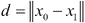

记住，向量的欧几里得范数等于该向量的大小，大小由以下方程给出：

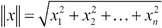

scikit-learn 的`euclidean_distances`函数可以用来计算两个或多个向量之间的距离，并且它确认了语义上最相似的文档在空间中也是彼此最接近的。以下示例中，我们将使用`euclidean_distances`函数来比较我们的文档特征向量：

```py
>>> from sklearn.metrics.pairwise import euclidean_distances
>>> counts = [
>>>     [0, 1, 1, 0, 0, 1, 0, 1],
>>>     [0, 1, 1, 1, 1, 0, 0, 0],
>>>     [1, 0, 0, 0, 0, 0, 1, 0]
>>> ]
>>> print 'Distance between 1st and 2nd documents:', euclidean_distances(counts[0], counts[1])
>>> print 'Distance between 1st and 3rd documents:', euclidean_distances(counts[0], counts[2])
>>> print 'Distance between 2nd and 3rd documents:', euclidean_distances(counts[1], counts[2])
Distance between 1st and 2nd documents: [[ 2.]]
Distance between 1st and 3rd documents: [[ 2.44948974]]
Distance between 2nd and 3rd documents: [[ 2.44948974]]
```

现在假设我们使用的是新闻文章语料库，而不是我们之前的简单语料库。我们的词典可能包含数十万个独特的单词，而不仅仅是十二个。表示文章的特征向量将包含数十万个元素，并且许多元素将是零。大多数体育文章不会包含任何特定于财经文章的词汇，大多数文化文章也不会包含任何特定于财经文章的词汇。具有大量零值元素的高维特征向量称为**稀疏向量**。

使用高维数据会为所有机器学习任务带来一些问题，包括那些不涉及文本的任务。第一个问题是，高维向量需要比小型向量更多的内存。NumPy 提供了一些数据类型，通过高效地表示稀疏向量的非零元素，缓解了这个问题。

第二个问题被称为**维度灾难**，或**Hughes 效应**。随着特征空间的维度增加，需要更多的训练数据以确保每个特征值组合都有足够的训练实例。如果某个特征的训练实例不足，算法可能会对训练数据中的噪声进行过拟合，导致无法泛化。在接下来的部分，我们将回顾几种减少文本特征维度的策略。在第七章中，*PCA 降维*一节中，我们将回顾数值维度减少的技术。

## 停用词过滤

降低特征空间维度的一个基本策略是将所有文本转换为小写。这一策略源于这样一个观点：字母的大小写不会影响大多数单词的含义；`sandwich`和`Sandwich`在大多数语境下具有相同的意义。大写字母可能表示某个单词位于句子的开头，但袋装词模型（bag-of-words model）已经丢弃了所有关于单词顺序和语法的信息。

第二种策略是删除语料库中大多数文档都常见的单词。这些单词被称为**停用词**，包括限定词如`the`、`a`和`an`；助动词如`do`、`be`和`will`；以及介词如`on`、`around`和`beneath`。停用词通常是功能性词汇，它们通过语法而非词汇本身的定义为文档的含义做出贡献。`CountVectorizer`类可以通过`stop_words`关键字参数过滤停用词，并且还包含一个基本的英语停用词表。我们来重新创建我们的文档特征向量，并应用停用词过滤：

```py
>>> from sklearn.feature_extraction.text import CountVectorizer
>>> corpus = [
>>>     'UNC played Duke in basketball',
>>>     'Duke lost the basketball game',
>>>     'I ate a sandwich'
>>> ]
>>> vectorizer = CountVectorizer(stop_words='english')
>>> print vectorizer.fit_transform(corpus).todense()
>>> print vectorizer.vocabulary_
[[0 1 1 0 0 1 0 1]
 [0 1 1 1 1 0 0 0]
 [1 0 0 0 0 0 1 0]]
{u'duke': 2, u'basketball': 1, u'lost': 4, u'played': 5, u'game': 3, u'sandwich': 6, u'unc': 7, u'ate': 0}
```

特征向量现在的维度较少，前两个文档向量彼此之间仍然比与第三个文档更相似。

## 词干提取和词形还原

虽然停用词过滤是一种简单的降维策略，但大多数停用词表只包含几百个单词。即便经过过滤，大型语料库仍可能包含数十万个独特的词汇。两种进一步降维的相似策略被称为**词干提取**和**词形还原**。

高维文档向量可能单独编码同一单词的多种派生或屈折形式。例如，`jumping`和`jumps`都是`jump`这个词的形式；在一个关于跳远的语料库中，文档向量可能会用特征向量中的单独元素编码每个屈折形式。词干提取和词形还原是将单词的屈折形式和派生形式压缩成单一特征的两种策略。

让我们考虑另一个包含两个文档的玩具语料库：

```py
>>> from sklearn.feature_extraction.text import CountVectorizer
>>> corpus = [
>>>     'He ate the sandwiches',
>>>     'Every sandwich was eaten by him'
>>> ]
>>> vectorizer = CountVectorizer(binary=True, stop_words='english')
>>> print vectorizer.fit_transform(corpus).todense()
>>> print vectorizer.vocabulary_
[[1 0 0 1]
 [0 1 1 0]]
{u'sandwich': 2, u'ate': 0, u'sandwiches': 3, u'eaten': 1}
```

这些文档具有相似的含义，但它们的特征向量没有共同的元素。两个文档都包含了`ate`的一个词形和`sandwich`的一个屈折形式。理想情况下，这些相似性应该体现在特征向量中。词形还原是根据词语的上下文确定屈折词的**词形**，即形态学根词的过程。词形是单词的基础形式，用来在字典中查找单词。**词干提取**与词形还原的目标相似，但它并不试图生成单词的形态学根词。相反，词干提取移除所有看起来像是词缀的字符模式，结果是一个不一定是有效单词的词形。词形还原通常需要一个词汇资源，如 WordNet，以及单词的词性。词干提取算法通常使用规则而非词汇资源来生成词干，并且可以在任何令牌上运行，即使没有其上下文。

让我们考虑在两个文档中对单词`gathering`进行词形还原：

```py
corpus = [
    'I am gathering ingredients for the sandwich.',
    'There were many wizards at the gathering.'
]
```

在第一句中，`gathering`是动词，其词形还原为`gather`。在第二句中，`gathering`是名词，其词形还原为`gathering`。我们将使用**自然语言工具包**（**NLTK**）来进行词干提取和词形还原。可以通过[`www.nltk.org/install.html`](http://www.nltk.org/install.html)上的说明安装 NLTK。安装完成后，执行以下代码：

```py
>>> import nltk
>>> nltk.download()
```

然后按照说明下载 NLTK 的语料库。

使用`gathering`的词性，NLTK 的`WordNetLemmatizer`正确地对两个文档中的单词进行了词形还原，结果如以下示例所示：

```py
>>> from nltk.stem.wordnet import WordNetLemmatizer
>>> lemmatizer = WordNetLemmatizer()
>>> print lemmatizer.lemmatize('gathering', 'v')
>>> print lemmatizer.lemmatize('gathering', 'n')
gather
gathering
```

让我们将词形还原与词干提取进行比较。Porter 词干提取器无法考虑屈折形式的词性，并且对两个文档都返回`gather`：

```py
>>> from nltk.stem import PorterStemmer
>>> stemmer = PorterStemmer()
>>> print stemmer.stem('gathering')
gather
```

现在让我们对我们的示例语料库进行词形还原：

```py
>>> from nltk import word_tokenize
>>> from nltk.stem import PorterStemmer
>>> from nltk.stem.wordnet import WordNetLemmatizer
>>> from nltk import pos_tag
>>> wordnet_tags = ['n', 'v']
>>> corpus = [
>>>     'He ate the sandwiches',
>>>     'Every sandwich was eaten by him'
>>> ]
>>> stemmer = PorterStemmer()
>>> print 'Stemmed:', [[stemmer.stem(token) for token in word_tokenize(document)] for document in corpus]
>>> def lemmatize(token, tag):
>>>     if tag[0].lower() in ['n', 'v']:
>>>         return lemmatizer.lemmatize(token, tag[0].lower())
>>>     return token
>>> lemmatizer = WordNetLemmatizer()
>>> tagged_corpus = [pos_tag(word_tokenize(document)) for document in corpus]
>>> print 'Lemmatized:', [[lemmatize(token, tag) for token, tag in document] for document in tagged_corpus]
Stemmed: [['He', 'ate', 'the', 'sandwich'], ['Everi', 'sandwich', 'wa', 'eaten', 'by', 'him']]
Lemmatized: [['He', 'eat', 'the', 'sandwich'], ['Every', 'sandwich', 'be', 'eat', 'by', 'him']]
```

通过词干提取和词形还原，我们减少了特征空间的维度。尽管语料库字典中的单词在句子中屈折形式不同，我们仍然生成了更有效地编码文档含义的特征表示。

## 扩展词袋模型并加入 TF-IDF 权重

在上一节中，我们使用了词袋模型（bag-of-words）表示法来创建特征向量，这些向量编码了语料库字典中的单词是否出现在文档中。这些特征向量并没有编码语法、单词顺序或单词的频率。直观地说，单词在文档中出现的频率可以表明该文档与该单词的相关程度。包含一个单词出现的长文档可能讨论的主题完全不同于包含该单词多次出现的文档。在本节中，我们将创建编码单词频率的特征向量，并讨论解决由编码术语频率所引发的两个问题的策略。

我们现在不再使用二进制值表示特征向量中的每个元素，而是使用一个整数，表示单词在文档中出现的次数。

我们将使用以下语料库。经过停用词过滤后，语料库通过以下特征向量表示：

```py
>>> from sklearn.feature_extraction.text import CountVectorizer
>>> corpus = ['The dog ate a sandwich, the wizard transfigured a sandwich, and I ate a sandwich']
>>> vectorizer = CountVectorizer(stop_words='english')
>>> print vectorizer.fit_transform(corpus).todense()
[[2 1 3 1 1]]
{u'sandwich': 2, u'wizard': 4, u'dog': 1, u'transfigured': 3, u'ate': 0}
```

`dog` 的元素现在设置为 `1`，而 `sandwich` 的元素设置为 `2`，表示相应的单词分别出现了一次和两次。请注意，`CountVectorizer` 的 `binary` 关键字参数被省略了；它的默认值是 `False`，这导致它返回的是原始的词频而非二值频率。在特征向量中对词汇的原始频率进行编码提供了更多关于文档含义的信息，但假设所有文档的长度大致相同。

在两个文档中，可能会有许多单词的出现频率相同，但如果一个文档的长度比另一个大得多，两个文档仍然可能是不同的。scikit-learn 的 `TfdfTransformer` 对象可以通过将词频向量矩阵转换为标准化的词频权重矩阵来缓解这个问题。默认情况下，`TfdfTransformer` 会对原始计数进行平滑处理，并应用 L2 标准化。平滑后的标准化词频由以下公式给出：

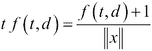

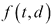 是文档 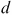 中词 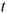 的频率，且 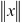 是计数向量的 L2 范数。除了对原始词频进行归一化之外，我们还可以通过计算**对数缩放的词频**来改进特征向量，这将词频缩放到更有限的范围，或者通过计算**增强的词频**来进一步减轻较长文档的偏差。对数缩放的词频由以下公式给出：

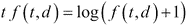

当 `TfdfTransformer` 对象的 `sublinear_tf` 关键字参数设置为 `True` 时，它会计算对数缩放的词频。增强的频率由以下公式给出：

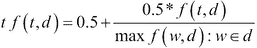

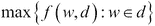 是文档  中所有单词的最大频率。scikit-learn 0.15.2 版本没有实现增强词频，但可以轻松地将 `CountVectorizer` 的输出转换。

归一化、对数尺度的词频和增强的词频可以表示文档中词项的频率，同时减轻文档大小不同所带来的影响。然而，这些表示方法仍然存在一个问题。特征向量中对于在文档中频繁出现的词项赋予了很大的权重，即使这些词项在语料库的大多数文档中也频繁出现。这些词项并不能有效地帮助表示特定文档相对于整个语料库的含义。例如，大部分关于杜克大学篮球队的文章可能都会出现`basketball`、`Coach K`和`flop`这些词汇。这些词汇可以被视为语料库特有的停用词，可能对计算文档相似度没有帮助。**逆文档频率**（**IDF**）是衡量词项在语料库中稀有或常见程度的指标。逆文档频率的计算公式如下：

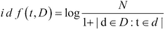

在这里，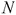表示语料库中文档的总数，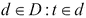表示包含术语的文档数量。一个术语的**TF-IDF**值是其词频和逆文档频率的乘积。`TfidfTransformer`在其`use_idf`关键字参数设置为默认值`True`时返回 TF-IDF 的权重。由于 TF-IDF 加权特征向量通常用于表示文本，scikit-learn 提供了一个`TfidfVectorizer`类，它封装了`CountVectorizer`和`TfidfTransformer`。我们可以使用`TfidfVectorizer`为我们的语料库创建 TF-IDF 加权特征向量：

```py
>>> from sklearn.feature_extraction.text import TfidfVectorizer
>>> corpus = [
>>>     'The dog ate a sandwich and I ate a sandwich',
>>>     'The wizard transfigured a sandwich'
>>> ]
>>> vectorizer = TfidfVectorizer(stop_words='english')
>>> print vectorizer.fit_transform(corpus).todense()
[[ 0.75458397  0.37729199  0.53689271  0\.          0\.        ]
 [ 0\.          0\.          0.44943642  0.6316672   0.6316672 ]]
```

通过将 TF-IDF 权重与原始词频进行比较，我们可以看到，像`沙拉`这种在语料库中许多文档中都出现的词汇已经被削弱权重。

## 空间高效的特征向量化方法，使用哈希技巧

在本章之前的示例中，使用一个包含语料库所有唯一词项的字典，将文档中的词项映射到特征向量的元素。创建这个字典有两个缺点。首先，语料库需要进行两次遍历：第一次遍历用来创建字典，第二次遍历用来为文档创建特征向量。其次，字典必须存储在内存中，对于大型语料库来说，这可能是不可接受的。通过对词项应用哈希函数来直接确定其在特征向量中的索引，可以避免创建字典。这个捷径称为**哈希技巧**。以下示例使用`HashingVectorizer`来演示哈希技巧：

```py
>>> from sklearn.feature_extraction.text import HashingVectorizer
>>> corpus = ['the', 'ate', 'bacon', 'cat']
>>> vectorizer = HashingVectorizer(n_features=6)
>>> print vectorizer.transform(corpus).todense()
[[-1\.  0\.  0\.  0\.  0\.  0.]
 [ 0\.  0\.  0\.  1\.  0\.  0.]
 [ 0\.  0\.  0\.  0\. -1\.  0.]
 [ 0\.  1\.  0\.  0\.  0\.  0.]]
```

哈希技巧是无状态的。它可以用于在并行和在线或流式应用中创建特征向量，因为它不需要对语料库进行初始遍历。请注意，`n_features`是一个可选的关键字参数。它的默认值，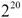，对于大多数问题来说是足够的；这里设置为`6`，以使矩阵足够小，既可以打印出来，又能显示所有非零特征。此外，请注意，某些词频是负数。由于哈希冲突是可能的，`HashingVectorizer`使用了一个带符号的哈希函数。特征的值与其标记的哈希值具有相同的符号；如果词语`cats`在文档中出现两次，并且其哈希值为`-3`，则文档特征向量的第四个元素将减少二。若词语`dogs`也出现两次，并且哈希值为`3`，特征向量的第四个元素将增加二。使用带符号的哈希函数可以使哈希冲突的错误互相抵消，而不是累积；信息丢失优于信息丢失和引入虚假信息。哈希技巧的另一个缺点是，生成的模型更难以检查，因为哈希函数无法回忆出每个特征向量元素映射的输入标记是什么。

# 从图像中提取特征

计算机视觉是研究和设计处理和理解图像的计算工件。这些工件有时会使用机器学习。计算机视觉的概述远远超出了本书的范围，但在本节中，我们将回顾一些在计算机视觉中用于表示机器学习问题中图像的基本技术。

## 从像素强度中提取特征

数字图像通常是一个栅格（或像素图），它将颜色映射到网格上的坐标。图像可以被视为一个矩阵，其中每个元素代表一个颜色。图像的基本特征表示可以通过将矩阵的行连接在一起并重新塑形为一个向量来构造。**光学字符识别**（**OCR**）是一个典型的机器学习问题。我们将使用此技术创建可以用于 OCR 应用程序的基本特征表示，用于识别字符分隔的表单中的手写数字。

scikit-learn 附带的`digits`数据集包含超过 1,700 个手写数字（从零到九）的灰度图像。每个图像的边长为八个像素。每个像素由一个强度值表示，范围在零到 16 之间；白色是最强的，表示为零，黑色是最弱的，表示为 16。下图是从数据集中提取的手写数字图像：

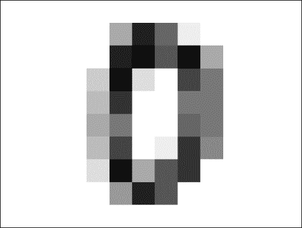

让我们通过将 8 x 8 的矩阵重新塑形为 64 维向量，为图像创建一个特征向量：

```py
>>> from sklearn import datasets
>>> digits = datasets.load_digits()
>>> print 'Digit:', digits.target[0]
>>> print digits.images[0]
>>> print 'Feature vector:\n', digits.images[0].reshape(-1, 64)
Digit: 0
[[  0\.   0\.   5\.  13\.   9\.   1\.   0\.   0.]
 [  0\.   0\.  13\.  15\.  10\.  15\.   5\.   0.]
 [  0\.   3\.  15\.   2\.   0\.  11\.   8\.   0.]
 [  0\.   4\.  12\.   0\.   0\.   8\.   8\.   0.]
 [  0\.   5\.   8\.   0\.   0\.   9\.   8\.   0.]
 [  0\.   4\.  11\.   0\.   1\.  12\.   7\.   0.]
 [  0\.   2\.  14\.   5\.  10\.  12\.   0\.   0.]
 [  0\.   0\.   6\.  13\.  10\.   0\.   0\.   0.]]
Feature vector:
[[  0\.   0\.   5\.  13\.   9\.   1\.   0\.   0\.   0\.   0\.  13\.  15\.  10\.  15.
    5\.   0\.   0\.   3\.  15\.   2\.   0\.  11\.   8\.   0\.   0\.   4\.  12\.   0.
    0\.   8\.   8\.   0\.   0\.   5\.   8\.   0\.   0\.   9\.   8\.   0\.   0\.   4.
   11\.   0\.   1\.  12\.   7\.   0\.   0\.   2\.  14\.   5\.  10\.  12\.   0\.   0.
    0\.   0\.   6\.  13\.  10\.   0\.   0\.   0.]]
```

这种表示方法对于一些基本任务（如识别打印字符）是有效的。然而，记录图像中每个像素的强度会生成过于庞大的特征向量。一张 100 x 100 的灰度图像将需要一个 10,000 维的向量，而一张 1920 x 1080 的灰度图像将需要一个 2,073,600 维的向量。与我们之前创建的 TF-IDF 特征向量不同，在大多数问题中，这些向量并不是稀疏的。空间复杂度并不是这种表示方法的唯一缺点；从特定位置像素的强度中学习会导致模型对图像的尺度、旋转和位移变化敏感。训练于我们基本特征表示的模型可能无法识别即使是轻微位移、放大或旋转几度后的相同数字。此外，从像素强度中学习本身也有问题，因为模型可能会对光照变化产生敏感性。因此，这种表示方法对于涉及照片或其他自然图像的任务是无效的。现代计算机视觉应用通常使用手工设计的特征提取方法，这些方法适用于许多不同的问题，或者使用深度学习等技术自动学习无监督问题的特征。在下一节中，我们将重点介绍前者。

## 将兴趣点提取为特征

我们之前创建的特征向量表示了图像中的每个像素；图像的所有信息属性和噪声属性都被表示出来。检查训练数据后，我们可以发现所有图像的边缘都有一圈白色像素；这些像素并不是有用的特征。人类可以快速识别许多物体，而不需要观察物体的每个属性。我们可以通过观察车盖的轮廓来识别一辆车，而无需观察后视镜；我们可以通过鼻子或嘴巴来识别一张人脸的图像。这种直觉促使我们创建仅包含图像最有信息量属性的表示。这些信息属性或**兴趣点**是那些被丰富纹理包围，并且即使在图像扰动的情况下也能被重现的点。**边缘**和**角点**是两种常见的兴趣点类型。边缘是像素强度快速变化的边界，角点是两条边缘的交点。我们使用 scikit-image 提取下图中的兴趣点：

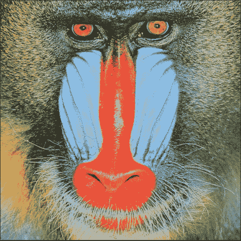

提取兴趣点的代码如下：

```py
>>> import numpy as nps
>>> from skimage.feature import corner_harris, corner_peaks
>>> from skimage.color import rgb2gray
>>> import matplotlib.pyplot as plt
>>> import skimage.io as io
>>> from skimage.exposure import equalize_hist

>>> def show_corners(corners, image):
>>>     fig = plt.figure()
>>>     plt.gray()
>>>     plt.imshow(image)
>>>     y_corner, x_corner = zip(*corners)
>>>     plt.plot(x_corner, y_corner, 'or')
>>>     plt.xlim(0, image.shape[1])
>>>     plt.ylim(image.shape[0], 0)
>>>     fig.set_size_inches(np.array(fig.get_size_inches()) * 1.5)
>>>     plt.show()

>>> mandrill = io.imread('/home/gavin/PycharmProjects/mastering-machine-learning/ch4/img/mandrill.png')
>>> mandrill = equalize_hist(rgb2gray(mandrill))
>>> corners = corner_peaks(corner_harris(mandrill), min_distance=2)
>>> show_corners(corners, mandrill)
```

下图展示了提取的兴趣点。在该图像的 230400 个像素中，有 466 个被提取为兴趣点。这种表示方式更为紧凑；理想情况下，兴趣点附近有足够的变化，能够重建它们，即使图像的光照发生了变化。

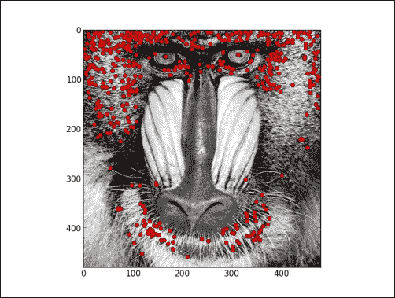

## SIFT 和 SURF

**尺度不变特征变换**（**SIFT**）是一种从图像中提取特征的方法，相较于我们之前讨论的提取方法，它对图像的尺度、旋转和光照的敏感度较低。每个 SIFT 特征或描述符是一个向量，用于描述图像某一区域的边缘和角点。与我们之前示例中的兴趣点不同，SIFT 还捕捉了每个兴趣点及其周围环境的组成信息。**加速稳健特征**（**SURF**）是另一种从图像中提取兴趣点并创建与图像的尺度、方向和光照无关的描述的方法。SURF 的计算速度比 SIFT 更快，并且在识别经过某些变换的图像特征时更为有效。

解释 SIFT 和 SURF 提取的实现超出了本书的范围。然而，通过对它们工作原理的直觉理解，我们仍然可以有效地使用实现这些算法的库。

在这个示例中，我们将使用`mahotas`库从以下图像中提取 SURF。


就像提取的兴趣点一样，提取的 SURF 只是创建特征表示的第一步，这些表示可以用于机器学习任务。在训练集中，每个实例都会提取不同的 SURF。在第六章，*K 均值聚类*中，我们将聚类提取的 SURF，以学习可以被图像分类器使用的特征。在以下示例中，我们将使用`mahotas`库来提取 SURF 描述符：

```py
>>> import mahotas as mh
>>> from mahotas.features import surf

>>> image = mh.imread('zipper.jpg', as_grey=True)
>>> print 'The first SURF descriptor:\n', surf.surf(image)[0]
>>> print 'Extracted %s SURF descriptors' % len(surf.surf(image))
The first SURF descriptor:
[  6.73839947e+02   2.24033945e+03   3.18074483e+00   2.76324459e+03
  -1.00000000e+00   1.61191475e+00   4.44035121e-05   3.28041690e-04
   2.44845817e-04   3.86297608e-04  -1.16723672e-03  -8.81290243e-04
   1.65414959e-03   1.28393061e-03  -7.45077384e-04   7.77655540e-04
   1.16078772e-03   1.81434398e-03   1.81736394e-04  -3.13096961e-04
    3.06559785e-04   3.43443699e-04   2.66200498e-04  -5.79522387e-04
   1.17893036e-03   1.99547411e-03  -2.25938217e-01  -1.85563853e-01
   2.27973631e-01   1.91510135e-01  -2.49315698e-01   1.95451021e-01
   2.59719480e-01   1.98613061e-01  -7.82458546e-04   1.40287015e-03
   2.86712113e-03   3.15971628e-03   4.98444730e-04  -6.93986983e-04
   1.87531652e-03   2.19041521e-03   1.80681053e-01  -2.70528820e-01
   2.32414943e-01   2.72932870e-01   2.65725332e-01   3.28050743e-01
   2.98609869e-01   3.41623138e-01   1.58078002e-03  -4.67968721e-04
   2.35704122e-03   2.26279888e-03   6.43115065e-06   1.22501486e-04
   1.20064616e-04   1.76564805e-04   2.14148537e-03   8.36243899e-05
   2.93382280e-03   3.10877776e-03   4.53469215e-03  -3.15254535e-04
   6.92437341e-03   3.56880279e-03  -1.95228401e-04   3.73674995e-05
   7.02700555e-04   5.45156362e-04]
Extracted 994 SURF descriptors
```

# 数据标准化

许多估算器在训练标准化数据集时表现更好。标准化数据具有**零均值**和**单位方差**。一个具有零均值的解释变量是围绕原点居中的；它的平均值为零。特征向量具有单位方差，当其特征的方差都在同一数量级时，才满足单位方差。例如，假设一个特征向量编码了两个解释变量，第一个变量的值范围从零到一，第二个解释变量的值范围从零到 100,000。第二个特征必须缩放到接近{0,1}的范围，以确保数据具有单位方差。如果一个特征的方差比其他特征大几个数量级，那么这个特征可能会主导学习算法，导致其无法从其他变量中学习。一些学习算法在数据没有标准化时，也会更慢地收敛到最佳参数值。可以通过减去变量的均值并将差值除以变量的标准差来标准化一个解释变量。使用 scikit-learn 的`scale`函数可以轻松地标准化数据：

```py
>>> from sklearn import preprocessing
>>> import numpy as np
>>> X = np.array([
>>>     [0., 0., 5., 13., 9., 1.],
>>>     [0., 0., 13., 15., 10., 15.],
>>>     [0., 3., 15., 2., 0., 11.]
>>> ])
>>> print preprocessing.scale(X)
[[ 0\.         -0.70710678 -1.38873015  0.52489066  0.59299945 -1.35873244]
 [ 0\.         -0.70710678  0.46291005  0.87481777  0.81537425  1.01904933]
 [ 0\.          1.41421356  0.9258201  -1.39970842 -1.4083737   0.33968311]]
```

# 摘要

在本章中，我们讨论了特征提取，并对将任意数据转化为机器学习算法可以使用的特征表示的基本技术有了理解。首先，我们使用独热编码和 scikit-learn 的`DictVectorizer`从类别型解释变量中创建了特征。然后，我们讨论了为机器学习问题中最常见的数据类型之一——文本数据——创建特征向量。我们研究了词袋模型的几种变体，该模型舍弃了所有语法信息，仅对文档中令牌的频率进行编码。我们从创建基本的二进制词频开始，使用了`CountVectorizer`。你学会了通过过滤停用词和词干提取令牌来预处理文本，并且将特征向量中的词频替换为 TF-IDF 权重，这些权重对常见词语进行了惩罚，并对不同长度的文档进行了标准化。接下来，我们为图像创建了特征向量。我们从一个光学字符识别问题开始，其中我们将手写数字的图像表示为像素强度的平铺矩阵。这是一种计算上比较昂贵的方法。我们通过仅提取图像中最有趣的点作为 SURF 描述符，改进了图像的表示。

最后，你学会了如何标准化数据，以确保我们的估算器能够从所有解释变量中学习，并且能够尽可能快速地收敛。我们将在后续章节的示例中使用这些特征提取技术。在下一章，我们将结合词袋模型表示法和多重线性回归的泛化方法来分类文档。
