# 第四章：从线性回归到逻辑回归

在第二章，*线性回归*中，我们讨论了简单线性回归、多元线性回归和多项式回归。这些模型是广义线性模型的特例，广义线性模型是一种灵活的框架，相比普通线性回归，它要求的假设更少。在本章中，我们将讨论这些假设，尤其是它们与广义线性模型的另一个特例——**逻辑回归**的关系。

与我们之前讨论的模型不同，逻辑回归用于分类任务。回想一下，在分类任务中，目标是找到一个函数，将一个观测值映射到其关联的类别或标签。学习算法必须使用特征向量对及其对应的标签来推导映射函数参数的值，从而生成最佳分类器，这个分类器的性能通过特定的性能度量来衡量。在二分类问题中，分类器必须将实例分配到两个类别中的一个。二分类的例子包括预测病人是否患有某种疾病，音频样本是否包含人类语音，或者杜克大学男篮队是否会在 NCAA 锦标赛第一轮输掉比赛。在多分类任务中，分类器必须为每个实例分配多个标签中的一个。在多标签分类中，分类器必须为每个实例分配多个标签中的一个子集。在本章中，我们将通过几个使用逻辑回归的分类问题，讨论分类任务的性能度量，并应用你在上一章中学到的一些特征提取技术。

# 使用逻辑回归进行二分类

普通线性回归假设响应变量服从正态分布。**正态** **分布**，也称为**高斯分布**或**钟形曲线**，是一个描述观测值在任意两个实数之间的概率的函数。正态分布的数据是对称的。也就是说，一半的值大于均值，另一半的值小于均值。正态分布数据的均值、中位数和众数也相等。许多自然现象大致遵循正态分布。例如，人的身高是正态分布的；大多数人身高适中，少数人高，少数人矮。

在某些问题中，响应变量并非服从正态分布。例如，抛硬币可以有两个结果：正面或反面。**伯努利分布**描述了一个随机变量的概率分布，该变量以概率*P*取正类，以概率*1-P*取负类。如果响应变量代表一个概率，它必须限制在{0,1}的范围内。线性回归假设解释变量值的恒定变化会导致响应变量值的恒定变化，但如果响应变量的值代表一个概率，这一假设就不成立。广义线性模型通过使用链接函数将解释变量的线性组合与响应变量联系起来，从而消除了这一假设。事实上，我们已经在第二章中使用了一个链接函数，*线性回归*；普通线性回归是广义线性模型的一个特例，它使用**恒等链接函数**将解释变量的线性组合与正态分布的响应变量联系起来。我们可以使用不同的链接函数将解释变量的线性组合与非正态分布的响应变量联系起来。

在逻辑回归中，响应变量描述了结果为正类的概率。如果响应变量等于或超过判别阈值，则预测为正类；否则，预测为负类。响应变量被建模为解释变量线性组合的**逻辑** **函数**的函数。逻辑函数由以下方程给出，它始终返回一个介于零和一之间的值：

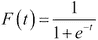

以下是逻辑函数在区间{-6,6}范围内的值的图示：

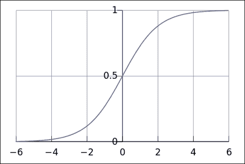

对于逻辑回归，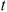等同于解释变量的线性组合，如下所示：

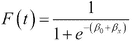

**Logit 函数**是逻辑函数的逆函数。它将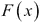与解释变量的线性组合联系起来：

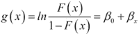

现在我们已经定义了逻辑回归模型，接下来让我们将其应用于一个二分类任务。

# 垃圾邮件过滤

我们的第一个问题是经典的二分类问题的现代版本：垃圾邮件分类。然而，在我们的版本中，我们将对垃圾短信和正常短信进行分类，而不是电子邮件。我们将使用在第三章，*特征提取与预处理*中学到的技术从短信中提取 TF-IDF 特征，并使用逻辑回归对短信进行分类。

我们将使用来自 UCI 机器学习库的 SMS 垃圾邮件分类数据集。该数据集可以从[`archive.ics.uci.edu/ml/datasets/SMS+Spam+Collection`](http://archive.ics.uci.edu/ml/datasets/SMS+Spam+Collection)下载。首先，让我们探索数据集，并使用 pandas 计算一些基本的统计信息：

```py
>>> import pandas as pd
>>> df = pd.read_csv('data/SMSSpamCollection', delimiter='\t', header=None)
>>> print df.head()

      0                                                  1
0   ham  Go until jurong point, crazy.. Available only ...
1   ham                      Ok lar... Joking wif u oni...
2  spam  Free entry in 2 a wkly comp to win FA Cup fina...
3   ham  U dun say so early hor... U c already then say...
4   ham  Nah I don't think he goes to usf, he lives aro...
[5 rows x 2 columns]

>>> print 'Number of spam messages:', df[df[0] == 'spam'][0].count()
>>> print 'Number of ham messages:', df[df[0] == 'ham'][0].count()

Number of spam messages: 747
Number of ham messages: 4825
```

每行数据包含一个二进制标签和一条短信。数据集包含 5,574 个实例；4,827 条消息是正常短信，剩余 747 条是垃圾短信。正常短信标记为零，垃圾短信标记为一。虽然值得注意的或案例结果通常被分配标签一，而非案例结果通常分配标签零，但这些分配是任意的。检查数据可能会揭示应当在模型中捕获的其他属性。以下是一些典型消息，代表了两类短信：

```py
Spam: Free entry in 2 a wkly comp to win FA Cup final tkts 21st May 2005\. Text FA to 87121 to receive entry question(std txt rate)T&C's apply 08452810075over18's
Spam: WINNER!! As a valued network customer you have been selected to receivea £900 prize reward! To claim call 09061701461\. Claim code KL341\. Valid 12 hours only.
Ham: Sorry my roommates took forever, it ok if I come by now?
Ham: Finished class where are you.
```

让我们使用 scikit-learn 的`LogisticRegression`类进行一些预测：

```py
>>> import numpy as np
>>> import pandas as pd
>>> from sklearn.feature_extraction.text import TfidfVectorizer
>>> from sklearn.linear_model.logistic import LogisticRegression
>>> from sklearn.cross_validation import train_test_split, cross_val_score
```

首先，我们使用 pandas 加载`.csv`文件，并将数据集划分为训练集和测试集。默认情况下，`train_test_split()`将 75%的样本分配到训练集中，并将剩余的 25%的样本分配到测试集中：

```py
>>> df = pd.read_csv('data/SMSSpamCollection', delimiter='\t', header=None)
>>> X_train_raw, X_test_raw, y_train, y_test = train_test_split(df[1], df[0])
```

接下来，我们创建一个`TfidfVectorizer`。回顾第三章，*特征提取与预处理*，`TfidfVectorizer`结合了`CountVectorizer`和`TfidfTransformer`。我们用训练短信对其进行拟合，并对训练和测试短信进行转换：

```py
>>> vectorizer = TfidfVectorizer()
>>> X_train = vectorizer.fit_transform(X_train_raw)
>>> X_test = vectorizer.transform(X_test_raw)
```

最后，我们创建一个`LogisticRegression`实例并训练我们的模型。像`LinearRegression`一样，`LogisticRegression`实现了`fit()`和`predict()`方法。作为一个合理性检查，我们打印了一些预测结果供人工检查：

```py
>>> classifier = LogisticRegression()
>>> classifier.fit(X_train, y_train)
>>> predictions = classifier.predict(X_test)
>>> for i, prediction in enumerate(predictions[:5]):
>>>     print 'Prediction: %s. Message: %s' % (prediction, X_test_raw[i])
```

以下是脚本的输出：

```py
Prediction: ham. Message: If you don't respond imma assume you're still asleep and imma start calling n shit
Prediction: spam. Message: HOT LIVE FANTASIES call now 08707500020 Just 20p per min NTT Ltd, PO Box 1327 Croydon CR9 5WB 0870 is a national rate call
Prediction: ham. Message: Yup... I havent been there before... You want to go for the yoga? I can call up to book 
Prediction: ham. Message: Hi, can i please get a  &lt;#&gt;  dollar loan from you. I.ll pay you back by mid february. Pls.
Prediction: ham. Message: Where do you need to go to get it?
```

我们的分类器表现如何？我们用于线性回归的性能指标对于这个任务不合适。我们关心的只是预测类别是否正确，而不是距离决策边界有多远。在接下来的部分，我们将讨论一些可以用来评估二分类器的性能指标。

# 二分类性能指标

存在多种指标来评估二元分类器对可信标签的性能。最常见的指标包括**准确性**、**精确率**、**召回率**、**F1 度量**和**ROC AUC 分数**。所有这些度量都依赖于**真正预测**、**真负预测**、**假正预测**和**假负预测**的概念。*正*和*负*是指类别。*真*和*假*表示预测类别是否与真实类别相同。

对于我们的短信垃圾分类器，真正预测是指分类器正确预测消息是垃圾。真负预测是指分类器正确预测消息是非垃圾。将非垃圾消息预测为垃圾是假正预测，将垃圾消息错误分类为非垃圾是假负预测。**混淆矩阵**或**列联表**可以用来可视化真正和假正、假负预测。矩阵的行是实例的真实类别，列是实例的预测类别：

```py
>>> from sklearn.metrics import confusion_matrix
>>> import matplotlib.pyplot as plt

>>> y_test = [0, 0, 0, 0, 0, 1, 1, 1, 1, 1]
>>> y_pred = [0, 1, 0, 0, 0, 0, 0, 1, 1, 1]
>>> confusion_matrix = confusion_matrix(y_test, y_pred)
>>> print(confusion_matrix)
>>> plt.matshow(confusion_matrix)
>>> plt.title('Confusion matrix')
>>> plt.colorbar()
>>> plt.ylabel('True label')
>>> plt.xlabel('Predicted label')
>>> plt.show()

 [[4 1]
 [2 3]]
```

混淆矩阵显示有四个真负预测，三个真正预测，两个假负预测和一个假正预测。在多类问题中，混淆矩阵变得更加有用，因为在这些问题中确定最常见的错误类型可能很困难。

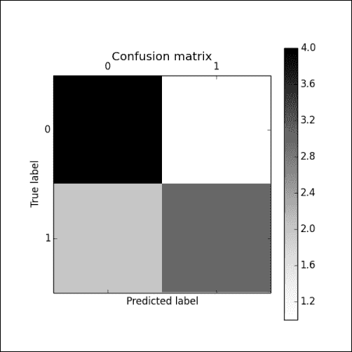

## 准确性

准确性衡量分类器预测正确的分数比例。scikit-learn 提供一个函数来计算给定正确标签的一组预测的准确性：

```py
>>> from sklearn.metrics import accuracy_score
>>> y_pred, y_true = [0, 1, 1, 0], [1, 1, 1, 1]
>>> print 'Accuracy:', accuracy_score(y_true, y_pred)

Accuracy: 0.5
```

`LogisticRegression.score()` 使用准确率预测和评分测试集标签。让我们评估我们分类器的准确性：

```py
>>> import numpy as np
>>> import pandas as pd
>>> from sklearn.feature_extraction.text import TfidfVectorizer
>>> from sklearn.linear_model.logistic import LogisticRegression
>>> from sklearn.cross_validation import train_test_split, cross_val_score
>>> df = pd.read_csv('data/sms.csv')
>>> X_train_raw, X_test_raw, y_train, y_test = train_test_split(df['message'], df['label'])
>>> vectorizer = TfidfVectorizer()
>>> X_train = vectorizer.fit_transform(X_train_raw)
>>> X_test = vectorizer.transform(X_test_raw)
>>> classifier = LogisticRegression()
>>> classifier.fit(X_train, y_train)
>>> scores = cross_val_score(classifier, X_train, y_train, cv=5)
>>> print np.mean(scores), scores

Accuracy 0.956217208018 [ 0.96057348  0.95334928  0.96411483  0.95454545  0.94850299]
```

请注意，由于训练集和测试集是随机分配的，您的准确性可能会有所不同。虽然准确性衡量了分类器的整体正确性，但它不区分假正误差和假负误差。有些应用程序对假负误差比假正误差更敏感，反之亦然。此外，如果人群中类别的比例不均衡，准确性不是一个信息丰富的度量。例如，一个预测信用卡交易是否欺诈的分类器可能更容易对假负误差敏感，而不是对假正误差敏感。为了促进客户满意度，信用卡公司可能更愿意冒险验证合法交易，而不是冒险忽略欺诈交易。由于大多数交易是合法的，准确性不是这个问题的合适度量。一个总是预测交易合法的分类器可能有很高的准确性分数，但是并不实用。因此，分类器通常使用称为精确率和召回率的两个额外指标进行评估。

## 精确率和召回率

回顾第一章，*机器学习基础*，精确度是正确预测为正类的比例。例如，在我们的 SMS 垃圾邮件分类器中，精确度是被分类为垃圾邮件的消息中实际是垃圾邮件的比例。精确度通过以下比率给出：

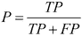

在医学领域，有时称为敏感度，召回率是分类器识别的真正正实例的比例。召回率为 1 表示分类器没有做出任何假阴性预测。对于我们的 SMS 垃圾邮件分类器，召回率是正确分类为垃圾邮件的垃圾邮件消息的比例。召回率通过以下比率计算：

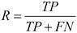

单独来看，精确度和召回率通常并不能提供足够的信息；它们都是分类器性能的片面视图。精确度和召回率都可能无法区分表现良好的分类器和某些表现不佳的分类器。一种简单的分类器通过对每个实例都预测为正类，可以轻松获得完美的召回率。例如，假设测试集包含十个正类实例和十个负类实例。一个对每个实例都预测为正类的分类器将获得 1 的召回率，如下所示：

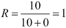

一个对每个示例都预测为负类的分类器，或者只做出假阳性和真阴性预测的分类器，将会获得零的召回率。同样，一个预测只有单个实例为正类且恰好正确的分类器，将获得完美的精确度。

scikit-learn 提供了一个函数，可以根据一组预测和相应的可信标签集来计算分类器的精确度和召回率。让我们计算一下我们 SMS 分类器的精确度和召回率：

```py
>>> import numpy as np
>>> import pandas as pd
>>> from sklearn.feature_extraction.text import TfidfVectorizer
>>> from sklearn.linear_model.logistic import LogisticRegression
>>> from sklearn.cross_validation import train_test_split, cross_val_score
>>> df = pd.read_csv('data/sms.csv')
>>> X_train_raw, X_test_raw, y_train, y_test = train_test_split(df['message'], df['label'])
>>> vectorizer = TfidfVectorizer()
>>> X_train = vectorizer.fit_transform(X_train_raw)
>>> X_test = vectorizer.transform(X_test_raw)
>>> classifier = LogisticRegression()
>>> classifier.fit(X_train, y_train)
>>> precisions = cross_val_score(classifier, X_train, y_train, cv=5, scoring='precision')
>>> print 'Precision', np.mean(precisions), precisions
>>> recalls = cross_val_score(classifier, X_train, y_train, cv=5, scoring='recall')
>>> print 'Recalls', np.mean(recalls), recalls

Precision 0.992137651822 [ 0.98717949  0.98666667  1\.          0.98684211  1\.        ]
Recall 0.677114261885 [ 0.7         0.67272727  0.6         0.68807339  0.72477064]
```

我们分类器的精确度是 0.992；几乎所有它预测为垃圾邮件的消息实际上都是垃圾邮件。它的召回率较低，这表明它错误地将大约 22% 的垃圾邮件消息误分类为非垃圾邮件。由于训练和测试数据是随机划分的，您的精确度和召回率可能有所不同。

# 计算 F1 得分

F1 得分是精确度和召回率的调和平均数或加权平均数。也称为 f 值或 f 得分，F1 得分通过以下公式计算：

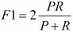

F1 度量值惩罚那些精度和召回率不平衡的分类器，例如总是预测正类的简单分类器。一个具有完美精度和召回率的模型将获得 F1 分数为 1。一个具有完美精度但召回率为零的模型将获得 F1 分数为零。至于精度和召回率，scikit-learn 提供了一个函数来计算一组预测的 F1 分数。让我们计算我们分类器的 F1 分数。以下代码片段继续前面的示例：

```py
>>> f1s = cross_val_score(classifier, X_train, y_train, cv=5, scoring='f1')
>>> print 'F1', np.mean(f1s), f1s

F1 0.80261302628 [ 0.82539683  0.8         0.77348066  0.83157895  0.7826087 ]
```

我们分类器的精度和召回率的算术平均值为 0.803。由于分类器的精度和召回率差异较小，因此 F1 度量的惩罚较小。有时模型会使用 F0.5 和 F2 分数进行评估，分别偏向精度和召回率。

# ROC AUC

**接收者操作特征**（Receiver Operating Characteristic），或称**ROC 曲线**，可视化分类器的性能。与准确率不同，ROC 曲线对类别不平衡的数据集不敏感；与精度和召回率不同，ROC 曲线展示了分类器在所有判别阈值下的表现。ROC 曲线绘制了分类器的召回率与其**误报率**之间的关系。误报率，或称假阳性率，是假阳性数量除以总负样本数。它通过以下公式计算：

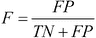

**AUC**是 ROC 曲线下的面积，它将 ROC 曲线简化为一个值，该值代表分类器的预期性能。下图中的虚线表示一个随机预测类别的分类器，它的 AUC 为 0.5。实线则表示一个优于随机猜测的分类器：

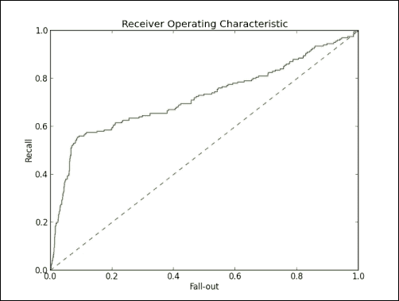

让我们绘制我们 SMS 垃圾短信分类器的 ROC 曲线：

```py
>>> import numpy as np
>>> import pandas as pd
>>> import matplotlib.pyplot as plt
>>> from sklearn.feature_extraction.text import TfidfVectorizer
>>> from sklearn.linear_model.logistic import LogisticRegression
>>> from sklearn.cross_validation import train_test_split, cross_val_score
>>> from sklearn.metrics import roc_curve, auc
>>> df = pd.read_csv('data/sms.csv')
>>> X_train_raw, X_test_raw, y_train, y_test = train_test_split(df['message'], df['label'])
>>> vectorizer = TfidfVectorizer()
>>> X_train = vectorizer.fit_transform(X_train_raw)
>>> X_test = vectorizer.transform(X_test_raw)
>>> classifier = LogisticRegression()
>>> classifier.fit(X_train, y_train)
>>> predictions = classifier.predict_proba(X_test)
>>> false_positive_rate, recall, thresholds = roc_curve(y_test, predictions[:, 1])
>>> roc_auc = auc(false_positive_rate, recall)
>>> plt.title('Receiver Operating Characteristic')
>>> plt.plot(false_positive_rate, recall, 'b', label='AUC = %0.2f' % roc_auc)
>>> plt.legend(loc='lower right')
>>> plt.plot([0, 1], [0, 1], 'r--')
>>> plt.xlim([0.0, 1.0])
>>> plt.ylim([0.0, 1.0])
>>> plt.ylabel('Recall')
>>> plt.xlabel('Fall-out')
>>> plt.show()
```

从 ROC AUC 图中可以明显看出，我们的分类器优于随机猜测；大部分图形区域位于其曲线下方：

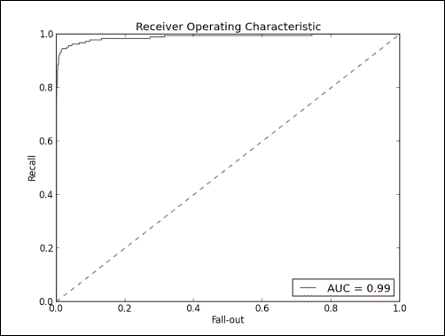

# 使用网格搜索调优模型

超参数是模型的参数，它们不是通过学习获得的。例如，我们的逻辑回归 SMS 分类器的超参数包括正则化项的值和用于去除频繁或不频繁出现的词汇的阈值。在 scikit-learn 中，超参数通过模型的构造函数进行设置。在之前的示例中，我们没有为 `LogisticRegression()` 设置任何参数；我们使用了所有超参数的默认值。这些默认值通常是一个好的起点，但它们可能无法产生最优模型。**网格搜索**是一种常见的方法，用于选择产生最佳模型的超参数值。网格搜索为每个需要调整的超参数提供一组可能的值，并评估在这些值的笛卡尔积元素上训练的模型。也就是说，网格搜索是一种穷举搜索，它为开发者提供的每种超参数值的所有可能组合训练和评估模型。网格搜索的一个缺点是，即使对于小型的超参数值集合，它的计算成本也很高。幸运的是，这是一个**尴尬的并行**问题；因为进程之间不需要同步，许多模型可以轻松并行训练和评估。让我们使用 scikit-learn 的 `GridSearchCV()` 函数来寻找更好的超参数值：

```py
import pandas as pd
from sklearn.feature_extraction.text import TfidfVectorizer
from sklearn.linear_model.logistic import LogisticRegression
from sklearn.grid_search import GridSearchCV
from sklearn.pipeline import Pipeline
from sklearn.cross_validation import train_test_split
from sklearn.metrics import precision_score, recall_score, accuracy_score

pipeline = Pipeline([
    ('vect', TfidfVectorizer(stop_words='english')),
    ('clf', LogisticRegression())
])
parameters = {
    'vect__max_df': (0.25, 0.5, 0.75),
    'vect__stop_words': ('english', None),
    'vect__max_features': (2500, 5000, 10000, None),
    'vect__ngram_range': ((1, 1), (1, 2)),
    'vect__use_idf': (True, False),
    'vect__norm': ('l1', 'l2'),
    'clf__penalty': ('l1', 'l2'),
    'clf__C': (0.01, 0.1, 1, 10),
}
```

`GridSearchCV()` 接受一个估计器、一个参数空间和一个性能衡量标准。参数 `n_jobs` 指定并行作业的最大数量；将 `n_jobs` 设置为 `-1` 以使用所有 CPU 核心。请注意，`fit()` 必须在 Python 的 `main` 块中调用，以便分叉出额外的进程；此示例必须作为脚本执行，而不是在交互式解释器中运行：

```py
if __name__ == "__main__":
    grid_search = GridSearchCV(pipeline, parameters, n_jobs=-1, verbose=1, scoring='accuracy', cv=3)
    df = pd.read_csv('data/sms.csv')
    X, y, = df['message'], df['label']
    X_train, X_test, y_train, y_test = train_test_split(X, y)
    grid_search.fit(X_train, y_train)
    print 'Best score: %0.3f' % grid_search.best_score_
    print 'Best parameters set:'
    best_parameters = grid_search.best_estimator_.get_params()
    for param_name in sorted(parameters.keys()):
        print '\t%s: %r' % (param_name, best_parameters[param_name])
    predictions = grid_search.predict(X_test)
    print 'Accuracy:', accuracy_score(y_test, predictions)
    print 'Precision:', precision_score(y_test, predictions)
    print 'Recall:', recall_score(y_test, predictions)
```

以下是脚本的输出：

```py
Fitting 3 folds for each of 1536 candidates, totalling 4608 fits
[Parallel(n_jobs=-1)]: Done   1 jobs       | elapsed:    0.2s
[Parallel(n_jobs=-1)]: Done  50 jobs       | elapsed:    4.0s
[Parallel(n_jobs=-1)]: Done 200 jobs       | elapsed:   16.9s
[Parallel(n_jobs=-1)]: Done 450 jobs       | elapsed:   36.7s
[Parallel(n_jobs=-1)]: Done 800 jobs       | elapsed:  1.1min
[Parallel(n_jobs=-1)]: Done 1250 jobs       | elapsed:  1.7min
[Parallel(n_jobs=-1)]: Done 1800 jobs       | elapsed:  2.5min
[Parallel(n_jobs=-1)]: Done 2450 jobs       | elapsed:  3.4min
[Parallel(n_jobs=-1)]: Done 3200 jobs       | elapsed:  4.4min
[Parallel(n_jobs=-1)]: Done 4050 jobs       | elapsed:  7.7min
[Parallel(n_jobs=-1)]: Done 4608 out of 4608 | elapsed:  8.5min finished
Best score: 0.983
Best parameters set:
  clf__C: 10
  clf__penalty: 'l2'
  vect__max_df: 0.5
  vect__max_features: None
  vect__ngram_range: (1, 2)
  vect__norm: 'l2'
  vect__stop_words: None
  vect__use_idf: True
Accuracy: 0.989956958393
Precision: 0.988095238095
Recall: 0.932584269663
```

优化超参数的值提高了我们模型在`test`集上的召回率。

# 多类分类

在前面的章节中，你学会了使用逻辑回归进行二分类。然而，在许多分类问题中，通常会涉及多个类别。我们可能希望根据音频样本预测歌曲的类型，或根据星系的类型对图像进行分类。**多类分类**的目标是将实例分配给一组类别中的一个。scikit-learn 使用一种称为**一对多**（one-vs.-all）或**一对其余**（one-vs.-the-rest）的方法来支持多类分类。一对多分类为每个可能的类别使用一个二分类器。预测时，具有最大置信度的类别会被分配给该实例。`LogisticRegression` 天生支持使用一对多策略进行多类分类。让我们使用 `LogisticRegression` 来解决一个多类分类问题。

假设你想看一部电影，但你对观看糟糕的电影有强烈的排斥感。为了帮助你做出决策，你可以阅读一些关于你考虑的电影的评论，但不幸的是，你也对阅读电影评论有强烈的排斥感。让我们使用 scikit-learn 来找出评价较好的电影。

在这个例子中，我们将对来自 Rotten Tomatoes 数据集中的电影评论短语进行情感分类。每个短语可以被分类为以下情感之一：负面、稍微负面、中立、稍微正面或正面。虽然这些类别看似有序，但我们将使用的解释变量并不总是能支持这种顺序，因为讽刺、否定和其他语言现象的存在。相反，我们将把这个问题作为一个多类分类任务来处理。

数据可以从[`www.kaggle.com/c/sentiment-analysis-on-movie-reviews/data`](http://www.kaggle.com/c/sentiment-analysis-on-movie-reviews/data)下载。首先，让我们使用 pandas 来探索数据集。请注意，以下代码片段中的导入和数据加载语句是后续代码片段所必需的：

```py
>>> import pandas as pd
>>> df = pd.read_csv('movie-reviews/train.tsv', header=0, delimiter='\t')
>>> print df.count()

PhraseId      156060
SentenceId    156060
Phrase        156060
Sentiment     156060
dtype: int64
```

数据集的列是以制表符分隔的。数据集包含 156,060 个实例。

```py
>>> print df.head()

   PhraseId  SentenceId                                             Phrase  \
0         1           1  A series of escapades demonstrating the adage ...
1         2           1  A series of escapades demonstrating the adage ...
2         3           1                                           A series
3         4           1                                                  A
4         5           1                                             series

   Sentiment
0          1
1          2
2          2
3          2
4          2

[5 rows x 4 columns]
```

`情感`列包含响应变量。`0` 标签对应情感`负面`，`1` 对应`稍微负面`，依此类推。`短语`列包含原始文本。每个电影评论的句子已被解析成更小的短语。在这个例子中，我们不需要`短语 ID`和`句子 ID`列。让我们打印一些短语并查看它们：

```py
>>> print df['Phrase'].head(10)

0    A series of escapades demonstrating the adage ...
1    A series of escapades demonstrating the adage ...
2                                             A series
3                                                    A
4                                               series
5    of escapades demonstrating the adage that what...
6                                                   of
7    escapades demonstrating the adage that what is...
8                                            escapades
9    demonstrating the adage that what is good for ...
Name: Phrase, dtype: object
```

现在让我们来查看目标类别：

```py
>>> print df['Sentiment'].describe()

count    156060.000000
mean          2.063578
std           0.893832
min           0.000000
25%           2.000000
50%           2.000000
75%           3.000000
max           4.000000
Name: Sentiment, dtype: float64

>>> print df['Sentiment'].value_counts()

2    79582
3    32927
1    27273
4     9206
0     7072
dtype: int64

>>> print df['Sentiment'].value_counts()/df['Sentiment'].count()

2    0.509945
3    0.210989
1    0.174760
4    0.058990
0    0.045316
dtype: float64
```

最常见的类别是`中立`，它包含超过 50% 的实例。准确度对于这个问题来说并不是一个有意义的性能衡量标准，因为一个退化的分类器只预测`中立`就能获得接近 0.5 的准确度。大约四分之一的评论是正面或稍微正面的，约五分之一的评论是负面或稍微负面的。让我们用 scikit-learn 来训练一个分类器：

```py
import pandas as pd
from sklearn.feature_extraction.text import TfidfVectorizer
from sklearn.linear_model.logistic import LogisticRegression
from sklearn.cross_validation import train_test_split
from sklearn.metrics.metrics import classification_report, accuracy_score, confusion_matrix
from sklearn.pipeline import Pipeline
from sklearn.grid_search import GridSearchCV

def main():
    pipeline = Pipeline([
        ('vect', TfidfVectorizer(stop_words='english')),
        ('clf', LogisticRegression())
    ])
    parameters = {
        'vect__max_df': (0.25, 0.5),
        'vect__ngram_range': ((1, 1), (1, 2)),
        'vect__use_idf': (True, False),
        'clf__C': (0.1, 1, 10),
    }
    df = pd.read_csv('data/train.tsv', header=0, delimiter='\t')
    X, y = df['Phrase'], df['Sentiment'].as_matrix()
    X_train, X_test, y_train, y_test = train_test_split(X, y, train_size=0.5)
    grid_search = GridSearchCV(pipeline, parameters, n_jobs=3, verbose=1, scoring='accuracy')
    grid_search.fit(X_train, y_train)
    print 'Best score: %0.3f' % grid_search.best_score_
    print 'Best parameters set:'
    best_parameters = grid_search.best_estimator_.get_params()
    for param_name in sorted(parameters.keys()):
        print '\t%s: %r' % (param_name, best_parameters[param_name])

if __name__ == '__main__':
    main()
```

以下是脚本的输出：

```py
Fitting 3 folds for each of 24 candidates, totalling 72 fits
[Parallel(n_jobs=3)]: Done   1 jobs       | elapsed:    3.3s
[Parallel(n_jobs=3)]: Done  50 jobs       | elapsed:  1.1min
[Parallel(n_jobs=3)]: Done  68 out of  72 | elapsed:  1.9min remaining:    6.8s
[Parallel(n_jobs=3)]: Done  72 out of  72 | elapsed:  2.1min finished
Best score: 0.620
Best parameters set:
  clf__C: 10
  vect__max_df: 0.25
  vect__ngram_range: (1, 2)
  vect__use_idf: False
```

## 多类分类性能指标

与二分类一样，混淆矩阵有助于可视化分类器所犯的错误类型。可以为每个类别计算精确度、召回率和 F1 分数，同时也可以计算所有预测的准确性。让我们评估分类器的预测结果。以下代码片段继续上一个示例：

```py
    predictions = grid_search.predict(X_test)
    print 'Accuracy:', accuracy_score(y_test, predictions)
    print 'Confusion Matrix:', confusion_matrix(y_test, predictions)
    print 'Classification Report:', classification_report(y_test, predictions)
```

以下内容将被追加到输出中：

```py
Accuracy: 0.636370626682
Confusion Matrix: [[ 1129  1679   634    64     9]
 [  917  6121  6084   505    35]
 [  229  3091 32688  3614   166]
 [   34   408  6734  8068  1299]
 [    5    35   494  2338  1650]]
Classification Report:              precision    recall  f1-score   support

          0       0.49      0.32      0.39      3515
          1       0.54      0.45      0.49     13662
          2       0.70      0.82      0.76     39788
          3       0.55      0.49      0.52     16543
          4       0.52      0.36      0.43      4522

avg / total       0.62      0.64      0.62     78030
```

首先，我们使用通过网格搜索找到的最佳参数集进行预测。尽管我们的分类器比基线分类器有所改进，但它仍然常常将`稍微正面`和`稍微负面`误分类为`中立`。

# 多标签分类和问题转化

在前面的部分，我们讨论了二分类问题，其中每个实例必须被分配到两个类别中的一个；还有多分类问题，其中每个实例必须被分配到类别集合中的一个。接下来我们要讨论的分类问题类型是多标签分类问题，其中每个实例可以被分配到类别集合的一个子集。多标签分类的例子包括为论坛上的帖子分配标签，以及对图像中的物体进行分类。多标签分类的方法有两种类型。

**问题转化**方法是将原始的多标签问题转化为一组单标签分类问题的技术。我们将要回顾的第一个问题转化方法是将训练数据中遇到的每个标签集转化为单一标签。例如，考虑一个多标签分类问题，在该问题中，新闻文章必须从一组类别中分配到一个或多个类别。以下训练数据包含七篇文章，这些文章可以涉及五个类别中的一个或多个。

|   | 类别 |
| --- | --- |
| **实例** | **本地** | **美国** | **商业** | **科技** | **体育** |
| 1 | ✔ | ✔ |   |   |   |
| 2 | ✔ |   | ✔ |   |   |
| 3 |   |   | ✔ | ✔ |   |
| 4 |   |   |   |   | ✔ |
| 5 | ✔ |   |   |   |   |
| 6 |   |   | ✔ |   |   |
| 7 |   | ✔ |   | ✔ |   |

将问题转化为一个单标签分类任务，使用在训练数据中看到的标签的幂集，最终得到以下训练数据。之前，第一个实例被分类为`本地`和`美国`。现在它只有一个标签，`本地`  ` 美国`。

|   | 类别 |
| --- | --- |
| **实例** | **本地** | **本地**  ** 美国** | **商业** | **本地**  ** 商业** | **美国**  ** 科技** | **商业**  ** 科技** | **体育** |
| 1 |   | ✔ |   |   |   |   |   |
| 2 |   |   |   | ✔ |   |   |   |
| 3 |   |   |   |   |   | ✔ |   |
| 4 |   |   |   |   |   |   | ✔ |
| 5 | ✔ |   |   |   |   |   |   |
| 6 |   |   | ✔ |   |   |   |   |
| 7 |   |   |   |   | ✔ |   |   |

具有五个类别的多标签分类问题现在变成了一个具有七个类别的多类分类问题。虽然幂集问题转换直观易懂，但增加类别的数量通常是不可行的；此转换可能会生成许多新标签，而这些标签仅对应少数训练实例。此外，分类器只能预测在训练数据中出现过的标签组合。

|   | 类别 |   | 类别 |
| --- | --- | --- | --- |
| **实例** | **本地** | **非本地** | **实例** | **商业** | **非商业** |
| 1 | ✔ |   | 1 |   | ✔ |
| 2 | ✔ |   | 2 | ✔ |   |
| 3 |   | ✔ | 3 | ✔ |   |
| 4 |   | ✔ | 4 |   | ✔ |
| 5 | ✔ |   | 5 |   | ✔ |
| 6 |   | ✔ | 6 | ✔ |   |
| 7 |   | ✔ | 7 |   | ✔ |
|   |   |   |   |   |   |
|   | **类别** |   | **类别** |
| 实例 | 美国 | 非美国 | 实例 | 美国 | 非美国 |
| 1 | ✔ |   | 1 | ✔ |   |
| 2 | ✔ |   | 2 | ✔ |   |
| 3 |   | ✔ | 3 |   | ✔ |
| 4 |   | ✔ | 4 |   | ✔ |
| 5 |   | ✔ | 5 |   | ✔ |
| 6 |   | ✔ | 6 |   | ✔ |
| 7 | ✔ |   | 7 | ✔ |   |
|   |   |   |   |   |   |
|   | **类别** |   | **类别** |
| 实例 | 科学与技术 | 非科学与技术 | 实例 | 体育 | 非体育 |
| 1 |   | ✔ | 1 |   | ✔ |
| 2 |   | ✔ | 2 |   | ✔ |
| 3 | ✔ |   | 3 |   | ✔ |
| 4 |   | ✔ | 4 | ✔ |   |
| 5 |   | ✔ | 5 |   | ✔ |
| 6 |   | ✔ | 6 |   | ✔ |

第二种问题转换是为训练集中的每个标签训练一个二分类器。每个分类器预测实例是否属于某个标签。我们的示例需要五个二分类器；第一个分类器预测实例是否应该被分类为`Local`，第二个分类器预测实例是否应该被分类为`US`，依此类推。最终预测是所有二分类器预测的联合结果。转换后的训练数据如上图所示。此问题转换确保单标签问题将拥有与多标签问题相同数量的训练样本，但忽略了标签之间的关系。

## 多标签分类性能评估指标

多标签分类问题必须使用与单标签分类问题不同的性能评估指标进行评估。最常见的两种性能指标是**汉明损失**和**贾卡尔相似度**。汉明损失是错误标签的平均比例。需要注意的是，汉明损失是一个损失函数，完美的得分是零。贾卡尔相似度，或称贾卡尔指数，是预测标签与真实标签交集的大小除以预测标签与真实标签并集的大小。它的取值范围从零到一，得分为一时表示完美。贾卡尔相似度的计算公式如下：

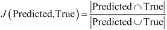

```py
>>> import numpy as np
>>> from sklearn.metrics import hamming_loss
>>> print hamming_loss(np.array([[0.0, 1.0], [1.0, 1.0]]), np.array([[0.0, 1.0], [1.0, 1.0]]))
0.0
>>> print hamming_loss(np.array([[0.0, 1.0], [1.0, 1.0]]), np.array([[1.0, 1.0], [1.0, 1.0]]))
0.25
>>> print hamming_loss(np.array([[0.0, 1.0], [1.0, 1.0]]), np.array([[1.0, 1.0], [0.0, 1.0]]))
0.5
>>> print jaccard_similarity_score(np.array([[0.0, 1.0], [1.0, 1.0]]), np.array([[0.0, 1.0], [1.0, 1.0]]))
1.0
>>> print jaccard_similarity_score(np.array([[0.0, 1.0], [1.0, 1.0]]), np.array([[1.0, 1.0], [1.0, 1.0]]))
0.75
>>> print jaccard_similarity_score(np.array([[0.0, 1.0], [1.0, 1.0]]), np.array([[1.0, 1.0], [0.0, 1.0]]))
0.5
```

# 总结

本章我们讨论了广义线性模型，它将普通线性回归扩展，以支持具有非正态分布的响应变量。广义线性模型使用连接函数将解释变量的线性组合与响应变量关联起来；与普通线性回归不同，关系不必是线性的。特别地，我们考察了逻辑连接函数，这是一种 sigmoid 函数，它对任何实数值返回一个介于零和一之间的值。

我们讨论了逻辑回归，它是一种广义线性模型，使用逻辑连接函数将解释变量与伯努利分布的响应变量关联起来。逻辑回归可用于二分类任务，在该任务中，实例必须被分配到两个类别中的一个；我们使用逻辑回归来分类垃圾短信和正常短信。接着我们讨论了多类分类任务，在此任务中，每个实例必须从标签集合中分配一个标签。我们使用一对多策略来分类电影评论的情感。最后，我们讨论了多标签分类任务，其中实例必须被分配到标签集合的子集。完成了广义线性模型的回归与分类讨论后，我们将在下一章介绍一种非线性模型——决策树，用于回归和分类。
