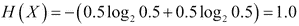
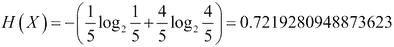

# 第五章：使用决策树进行非线性分类和回归

在前几章中，我们讨论了广义线性模型，它通过链接函数将解释变量的线性组合与一个或多个响应变量联系起来。你学习了如何使用多元线性回归来解决回归问题，并且我们使用了逻辑回归来处理分类任务。在这一章中，我们将讨论一个用于分类和回归任务的简单非线性模型：决策树。我们将使用决策树构建一个广告拦截器，它能够学习将网页上的图像分类为横幅广告或页面内容。最后，我们将介绍集成学习方法，这些方法结合多个模型来生成一个估算器，其预测性能优于任何单一模型。

# 决策树

决策树是类似树状的图形，用于建模决策过程。它们类似于游戏《二十个问题》。在《二十个问题》中，一名玩家，称为回答者，选择一个物体，但不向其他玩家透露物体是什么，这些其他玩家被称为提问者。物体应该是常见名词，比如“吉他”或“三明治”，而不是“1969 年吉布森 Les Paul Custom 吉他”或“北卡罗来纳”。提问者必须通过提问最多二十个可以回答“是”、“否”或“也许”的问题来猜测物体。提问者的一个直观策略是逐步提高问题的具体性；作为第一个问题问“它是乐器吗？”不会有效减少可能的答案数量。决策树的分支指定了可以检查的最短解释变量序列，以估算响应变量的值。延续这个类比，在《二十个问题》游戏中，提问者和回答者都知道训练数据，但只有回答者知道测试实例的特征值。

决策树通常通过递归地将训练实例集根据实例的解释变量值划分为子集来学习。以下图示展示了一个决策树，我们将在本章稍后更详细地讨论它。


决策树的内部节点通过框表示，用来测试解释变量。这些节点通过边连接，边上指定了测试结果的可能性。训练实例根据测试结果被分为多个子集。例如，一个节点可能会测试某个解释变量的值是否超过某个阈值。通过测试的实例将沿着边连接到节点的右子节点，而未通过测试的实例将沿着边连接到节点的左子节点。子节点同样测试它们的训练实例子集，直到满足停止准则。在分类任务中，决策树的叶节点代表类别。在回归任务中，叶节点中包含的实例的响应变量值可能会被平均，以生成响应变量的估计值。构建完决策树后，为一个测试实例做预测只需要沿着边走，直到到达叶节点。

# 训练决策树

我们将使用一种名为**迭代二分法 3**（**ID3**）的算法来创建决策树。ID3 由罗斯·昆兰发明，是最早用于训练决策树的算法之一。假设你需要将动物分类为猫或狗。不幸的是，你不能直接观察这些动物，只能通过它们的几个属性来做决定。对于每只动物，你会被告知它是否喜欢玩接飞盘，它是否经常生气，以及它最喜欢哪三种食物之一。

为了分类新的动物，决策树将在每个节点检查一个解释变量。它将根据测试结果选择沿着哪条边到达下一个节点。例如，第一个节点可能会问动物是否喜欢玩接飞盘。如果喜欢，我们将沿着边走到左子节点；如果不喜欢，我们将沿着边走到右子节点。最终，一条边将连接到叶节点，指示该动物是猫还是狗。

以下十四个实例构成我们的训练数据：

| 训练实例 | 玩接飞盘 | 是否生气 | 最喜欢的食物 | 物种 |
| --- | --- | --- | --- | --- |
| 1 | 是 | 否 | 培根 | 狗 |
| 2 | 否 | 是 | 狗粮 | 狗 |
| 3 | 否 | 是 | 猫粮 | 猫 |
| 4 | 否 | 是 | 培根 | 猫 |
| 5 | 否 | 否 | 猫粮 | 猫 |
| 6 | 否 | 是 | 培根 | 猫 |
| 7 | 否 | 是 | 猫粮 | 猫 |
| 8 | 否 | 否 | 狗粮 | 狗 |
| 9 | 否 | 是 | 猫粮 | 猫 |
| 10 | 是 | 否 | 狗粮 | 狗 |
| 11 | 是 | 否 | 培根 | 狗 |
| 12 | 否 | 否 | 猫粮 | 猫 |
| 13 | 是 | 是 | 猫粮 | 猫 |
| 14 | 是 | 是 | 培根 | 狗 |

从这些数据我们可以看出，猫通常比狗更易怒。大多数狗喜欢玩接飞盘，而大多数猫拒绝。狗喜欢狗粮和培根，而猫只喜欢猫粮和培根。`is grumpy` 和 `plays fetch` 这两个解释变量可以轻松转换为二进制特征。`favorite food` 这个解释变量是一个类别变量，具有三个可能的值；我们将对其进行独热编码。回顾第三章，*特征提取与预处理*，独热编码通过与变量值相同数量的二进制特征来表示类别变量。如果用单个整数值特征表示类别变量，会对其值编码一种人为的顺序。由于 `favorite food` 有三个可能的状态，我们将用三个二进制特征来表示它。从这个表中，我们可以手动构建分类规则。例如，一个既易怒又喜欢猫粮的动物一定是猫，而一个喜欢玩接飞盘并喜欢培根的动物一定是狗。即使是对于一个小数据集，手动构建这些分类规则也非常繁琐。相反，我们将通过创建决策树来学习这些规则。

## 选择问题

像“二十个问题”一样，决策树通过测试一系列解释变量的值来估算响应变量的值。应该首先测试哪个解释变量？直观地说，产生包含所有猫或所有狗的子集的测试要优于产生仍包含猫和狗的子集的测试。如果子集中的成员属于不同的类别，我们仍然无法确定如何对实例进行分类。我们还应该避免创建只将一只猫或一只狗从其他动物中分离出来的测试；这种测试类似于在“二十个问题”的前几轮问特定问题。更正式地说，这些测试可能很少对实例进行分类，并且可能不会减少我们的不确定性。减少分类不确定性的测试是最好的。我们可以使用一种叫做**熵**的度量来量化不确定性的大小。

用比特（bits）来衡量，熵量化了变量中的不确定性。熵由以下方程给出，其中  是结果的数量，

例如，一次掷公平硬币只有两种结果：正面和反面。硬币正面朝上的概率是 0.5，反面朝上的概率也是 0.5。那么该掷投的熵等于以下公式：



也就是说，只需要一个比特就能表示两个同样可能的结果：正面和反面。两次掷公平硬币可以产生四种可能的结果：正正、正反、反正和反反。每个结果的概率是*0.5 x 0.5 = 0.25*。两次掷投的熵等于以下公式：


如果硬币的两面是相同的，那么表示其结果的变量的熵为 0 比特；也就是说，我们对结果始终确定，变量永远不会代表新信息。熵也可以表示为比特的分数。例如，不公平硬币有两面不同，但其加权使得两面并非等可能出现。假设不公平硬币正面朝上的概率为 0.8，反面朝上的概率为 0.2。那么该硬币一次掷投的熵等于以下公式：


一次不公平硬币的掷投结果可以有一个比特的分数熵。掷投有两个可能的结果，但我们并不完全不确定，因为其中一个结果更为常见。

让我们计算分类一个未知动物的熵。如果我们的动物分类训练数据中狗和猫的数量相等，而我们对该动物一无所知，那么决策的熵为 1。我们所知道的只是该动物可能是猫或狗；就像公平的掷硬币一样，两个结果的可能性是相等的。然而，我们的训练数据包含了六只狗和八只猫。如果我们对未知动物一无所知，那么决策的熵可以通过以下公式来表示：


由于猫更常见，我们对结果的确定性更高。现在让我们找出最有助于分类该动物的解释变量；也就是说，我们要找出能最大程度降低熵的解释变量。我们可以测试`玩接飞盘`这一解释变量，并将训练实例划分为玩接飞盘的动物和不玩接飞盘的动物。这会产生以下两个子集：


决策树通常以类似流程图的图示方式呈现。上一个图示的顶端框是根节点；它包含我们所有的训练实例，并指定将要测试的解释变量。在根节点，我们还没有从训练集中排除任何实例，熵值大约等于 0.985。根节点测试`plays fetch`这一解释变量。回想一下，我们将这个布尔型解释变量转换为二值特征。对于`plays fetch`等于零的训练实例，沿着左子树的边缘走；而对于喜欢玩接球的动物，则沿着右子树的边缘走。左子节点包含一个子集，包含七只不喜欢玩接球的猫和两只狗。该节点的熵值如下所示：


右子树包含一个子集，其中有一只猫和四只喜欢玩接球的狗。该节点的熵值如下所示：



我们可以测试`is grumpy`这一解释变量，而不是测试`plays fetch`。此测试产生了以下决策树。与之前的树一样，未通过测试的实例沿左边缘走，已通过测试的实例沿右边缘走。


我们也可以将实例划分为偏好猫粮的动物和不偏好猫粮的动物，以产生以下决策树：


## 信息增益

对偏好猫粮的动物进行测试，结果得到了两个子集，一个子集包含六只猫、零只狗和 0 比特的熵，另一个子集包含两只猫、六只狗和 0.811 比特的熵。我们如何衡量这些测试中，哪个减少了我们对分类的不确定性最多呢？对这些子集熵值的平均值似乎是衡量熵减少的一种合适方法。在这个例子中，猫粮测试产生的子集具有最低的平均熵。直观上，这个测试似乎是有效的，因为我们可以用它来分类几乎一半的训练实例。然而，选择产生最低平均熵的子集的测试可能会产生一个次优的决策树。例如，假设有一个测试，产生了一个子集，里面有两只狗和没有猫，另一个子集包含四只狗和八只猫。第一个子集的熵值等于以下（注意第二项被省略，因为未定义）：


第二个子集的熵值等于以下值：


这些子集的平均熵值仅为 0.459，但包含大部分实例的子集几乎有一位的熵。这类似于在“二十个问题”中早早问一些具体问题；我们可能会幸运地在前几次就猜中，但更有可能的是我们会浪费问题而没有排除很多可能性。相反，我们将使用一种叫做**信息增益**的度量来衡量熵的减少。通过以下公式计算，信息增益是父节点的熵值与子节点熵值加权平均值之间的差异。是实例的集合，是正在测试的解释变量，是实例的属性值，是属性值等于的实例数量，是解释变量值为的实例子集的熵值。


以下表格包含了所有测试的信息增益。在这种情况下，猫粮测试仍然是最好的，因为它能最大程度地增加信息增益。

| 测试 | 父节点熵 | 子节点熵 | 子节点熵 | 加权平均 | 信息增益 |
| --- | --- | --- | --- | --- | --- |
| **会捡球吗？** | 0.9852 | 0.7642 | 0.7219 | 0.7490 * 9/14 + 0.7219 * 5/14 = 0.7491 | 0.2361 |
| **是不是易怒？** | 0.9852 | 0.9183 | 0.8113 | 0.9183 * 6/14 + 0.8113 * 8/14 = 0.85710.8572 | 0.1280 |
| **最喜欢的食物 = 猫粮** | 0.9852 | 0.8113 | 0 | 0.8113 * 8 /14 + 0.0 * 6/14 = 0.4636 | 0.5216 |
| **最喜欢的食物 = 狗粮** | 0.9852 | 0.8454 | 0 | 0.8454 * 11/14 + 0.0 * 3/14 = 0.6642 | 0.3210 |
| **最喜欢的食物 = 培根** | 0.9852 | 0.9183 | 0.971 | 0.9183 * 9/14 + 0.9710 * 5/14 = 0.9371 | 0.0481 |

现在让我们在树上添加另一个节点。由该测试生成的子节点之一是一个叶子节点，里面只有猫。另一个节点仍然包含两只猫和六只狗。我们将在此节点上添加一个测试。剩下的哪些解释变量能最大程度地减少我们的不确定性？以下表格包含了所有可能测试的信息增益：

| 测试 | 父节点熵 | 子节点熵 | 子节点熵 | 加权平均 | 信息增益 |
| --- | --- | --- | --- | --- | --- |
| **会捡球吗？** | 0.8113 | 1 | 0 | 1.0 * 4/8 + 0 * 4/8 = 0.5 | 0.3113 |
| **是不是易怒？** | 0.8113 | 0 | 1 | 0.0 * 4/8 + 1 * 4/8 = 0.5 | 0.3113 |
| **最喜欢的食物=狗粮** | 0.8113 | 0.9710 | 0 | 0.9710 * 5/8 + 0.0 * 3/8 = 0.6069 | 0.2044 |
| **最喜欢的食物=培根** | 0.8113 | 0 | 0.9710 | 0.0 * 3/8 + 0.9710 * 5/8 = 0.6069 | 0.2044 |

所有的测试都产生熵为 0 的子集，但 `性格烦躁` 和 `玩接球` 测试产生了最大的 信息增益。ID3 通过任意选择最佳测试来打破平局。我们将选择 `性格烦躁` 测试，它将父节点的八个实例分割成一个包含四只狗的叶节点和一个包含两只猫和两只狗的节点。以下是当前树的图示：


我们现在将选择另一个解释变量来测试子节点的四个实例。剩下的测试项 `最喜欢的食物=培根`、`最喜欢的食物=狗粮` 和 `玩接球`，都会产生一个包含一只狗或一只猫的叶节点，以及一个包含剩余动物的节点。剩下的测试项产生相等的信息增益，如下表所示：

| 测试 | 父节点的熵 | 子节点的熵 | 子节点的熵 | 加权平均 | 信息增益 |
| --- | --- | --- | --- | --- | --- |
| **玩接球？** | 1 | 0.9183 | 0 | 0.688725 | 0.311275 |
| **最喜欢的食物=狗粮** | 1 | 0.9183 | 0 | 0.688725 | 0.311275 |
| **最喜欢的食物=培根** | 1 | 0 | 0.9183 | 0.688725 | 0.311275 |

我们将任意选择 `玩接球` 测试，产生一个包含一只狗的叶节点和一个包含两只猫和一只狗的节点。剩下两个解释变量，我们可以测试喜欢培根的动物，或者可以测试喜欢狗粮的动物。这两项测试会产生相同的子集，并创建一个包含一只狗的叶节点和一个包含两只猫的叶节点。我们将任意选择测试喜欢狗粮的动物。以下是完成的决策树图示：


让我们对以下测试数据中的一些动物进行分类：

| 测试实例 | 玩接球 | 性格烦躁 | 最喜欢的食物 | 物种 |
| --- | --- | --- | --- | --- |
| 1 | 是 | 否 | 培根 | 狗 |
| 2 | 是 | 是 | 狗粮 | 狗 |
| 3 | 否 | 是 | 狗粮 | 猫 |
| 4 | 否 | 是 | 培根 | 猫 |
| 5 | 否 | 否 | 猫粮 | 猫 |

让我们对第一只动物进行分类，它喜欢玩接球，性格不常烦躁，并且喜欢培根。我们将沿着边缘走到根节点的左子节点，因为这只动物最喜欢的食物不是猫粮。它不烦躁，因此我们将沿着边缘走到第二级节点的左子节点。这里是一个叶节点，只有狗；我们已正确分类该实例。为了将第三个测试实例分类为猫，我们沿着边缘走到根节点的左子节点，再走到第二级节点的右子节点，再走到第三级节点的左子节点，最后走到四级节点的右子节点。

恭喜！你已经使用 ID3 算法构建了一个决策树。其他算法也可以用来训练决策树。**C4.5** 是 ID3 的改进版本，能够处理连续的解释变量，并且可以处理缺失的特征值。C4.5 还可以对树进行**剪枝**。剪枝通过将分类较少实例的分支替换为叶节点来减少树的大小。由 scikit-learn 实现的决策树使用了 **CART**，这是一种支持剪枝的学习算法。

## 基尼不纯度

在上一节中，我们通过创建产生最大信息增益的节点构建了一个决策树。学习决策树的另一个常见启发式方法是**基尼不纯度**，它衡量一个集合中各类别的比例。基尼不纯度由以下公式给出，其中  是类别的数量， 是该节点的实例子集， 是从节点子集中选择类别  的元素的概率：


直观地讲，当集合中的所有元素都属于同一类别时，基尼不纯度为零，因为选择该类别元素的概率等于一。像熵一样，当每个类别被选择的概率相等时，基尼不纯度最大。基尼不纯度的最大值取决于可能的类别数量，它由以下公式给出：


我们的问题有两个类别，因此基尼不纯度的最大值将等于一半。scikit-learn 支持使用信息增益和基尼不纯度来学习决策树。没有明确的规则来帮助你决定何时使用其中一个标准；在实际应用中，它们通常会产生相似的结果。与机器学习中的许多决策一样，最好比较使用两种选项训练的模型的表现。

# 使用 scikit-learn 训练决策树

让我们使用决策树创建一个可以屏蔽网页上横幅广告的软件。该程序将预测网页上每张图像是否是广告或文章内容。被分类为广告的图像可以使用层叠样式表（CSS）隐藏。我们将使用来自[`archive.ics.uci.edu/ml/datasets/Internet+Advertisements`](http://archive.ics.uci.edu/ml/datasets/Internet+Advertisements)的*互联网广告数据集*来训练一个决策树分类器，该数据集包含 3,279 张图像的数据。类别的比例是倾斜的；459 张图像是广告，2,820 张是内容。决策树学习算法可能会根据不平衡类别比例的数据生成偏向的树；我们将在不修改数据集的情况下评估模型，然后决定是否值得通过过采样或欠采样实例来平衡训练数据。解释变量是图像的维度、包含页面的 URL 中的词、图像 URL 中的词、图像的 alt 文本、图像的锚文本以及围绕图像标签的词窗口。响应变量是图像的类别。解释变量已经转换为特征表示。前三个特征是实数，表示图像的宽度、高度和宽高比。其余特征表示文本变量的二元词频。在接下来的示例中，我们将使用网格搜索寻找产生最高准确度的决策树超参数值，然后在测试集上评估该树的表现：

```py
import pandas as pd
from sklearn.tree import DecisionTreeClassifier
from sklearn.cross_validation import train_test_split
from sklearn.metrics import classification_report
from sklearn.pipeline import Pipeline
from sklearn.grid_search import GridSearchCV
```

首先，我们使用 pandas 读取 `.csv` 文件。该 `.csv` 文件没有标题行，因此我们使用其索引将包含响应变量值的最后一列与特征分开：

```py
if __name__ == '__main__':
    df = pd.read_csv('data/ad.data', header=None)
    explanatory_variable_columns = set(df.columns.values)
    response_variable_column = df[len(df.columns.values)-1]
    # The last column describes the targets
    explanatory_variable_columns.remove(len(df.columns.values)-1)

    y = [1 if e == 'ad.' else 0 for e in response_variable_column]
    X = df[list(explanatory_variable_columns)]
```

我们将广告编码为正类，将内容编码为负类。超过四分之一的实例至少缺少一个图像维度的值。这些缺失值用空格和问号标记。我们用负一替换了缺失值，但我们本可以填补缺失值；例如，我们可以用平均高度值替换缺失的高度值：

```py
    X.replace(to_replace=' *\?', value=-1, regex=True, inplace=True)
```

然后，我们将数据拆分为训练集和测试集：

```py
    X_train, X_test, y_train, y_test = train_test_split(X, y)
```

我们创建了一个管道和 `DecisionTreeClassifier` 的实例。然后，我们将 `criterion` 关键字参数设置为 `entropy`，以便使用信息增益启发式方法构建树：

```py
    pipeline = Pipeline([
        ('clf', DecisionTreeClassifier(criterion='entropy'))
    ])
```

接下来，我们指定了网格搜索的超参数空间：

```py
    parameters = {
        'clf__max_depth': (150, 155, 160),
        'clf__min_samples_split': (1, 2, 3),
        'clf__min_samples_leaf': (1, 2, 3)
    }
```

我们将 `GridSearchCV()` 设置为最大化模型的 F1 分数：

```py
    grid_search = GridSearchCV(pipeline, parameters, n_jobs=-1, verbose=1, scoring='f1')
    grid_search.fit(X_train, y_train)
    print 'Best score: %0.3f' % grid_search.best_score_
    print 'Best parameters set:'
    best_parameters = grid_search.best_estimator_.get_params()
    for param_name in sorted(parameters.keys()):
        print '\t%s: %r' % (param_name, best_parameters[param_name])

    predictions = grid_search.predict(X_test)
    print classification_report(y_test, predictions)

Fitting 3 folds for each of 27 candidates, totalling 81 fits
[Parallel(n_jobs=-1)]: Done   1 jobs       | elapsed:    1.7s
[Parallel(n_jobs=-1)]: Done  50 jobs       | elapsed:   15.0s
[Parallel(n_jobs=-1)]: Done  71 out of  81 | elapsed:   20.7s remaining:    2.9s
[Parallel(n_jobs=-1)]: Done  81 out of  81 | elapsed:   23.3s finished
Best score: 0.878
Best parameters set:
	clf__max_depth: 155
	clf__min_samples_leaf: 2
	clf__min_samples_split: 1
             precision    recall  f1-score   support

          0       0.97      0.99      0.98       710
          1       0.92      0.81      0.86       110

avg / total       0.96      0.96      0.96       820
```

该分类器在测试集中检测到超过 80% 的广告，并且大约 92% 的它预测为广告的图像确实是广告。总体而言，性能非常有前景；在接下来的章节中，我们将尝试修改模型以提高其性能。

## 树集成

**集成学习**方法将一组模型组合起来，生成一个比其单个组件具有更好预测性能的估计器。**随机森林**是一个由在训练实例和解释变量的随机选择子集上训练的决策树集合组成的模型。随机森林通常通过返回其构成树预测的众数或均值来进行预测；scikit-learn 的实现返回树预测的均值。与决策树相比，随机森林更不容易过拟合，因为没有单棵树可以从所有实例和解释变量中学习；没有单棵树可以记住表示中的所有噪声。

让我们更新广告拦截器的分类器，改用随机森林。使用 scikit-learn 的 API，替换`DecisionTreeClassifier`非常简单；我们只需将对象替换为`RandomForestClassifier`的实例。像之前的例子一样，我们将使用网格搜索来找到生成具有最佳预测性能的随机森林的超参数值。

首先，从`ensemble`模块导入`RandomForestClassifier`类：

```py
from sklearn.ensemble import RandomForestClassifier
```

接下来，将`pipeline`中的`DecisionTreeClassifier`替换为`RandomForestClassifier`实例，并更新超参数空间：

```py
    pipeline = Pipeline([
        ('clf', RandomForestClassifier(criterion='entropy'))
    ])
    parameters = {
        'clf__n_estimators': (5, 10, 20, 50),
        'clf__max_depth': (50, 150, 250),
        'clf__min_samples_split': (1, 2, 3),
        'clf__min_samples_leaf': (1, 2, 3)
    }
```

输出如下：

```py
Fitting 3 folds for each of 108 candidates, totalling 324 fits
[Parallel(n_jobs=-1)]: Done   1 jobs       | elapsed:    1.1s
[Parallel(n_jobs=-1)]: Done  50 jobs       | elapsed:   17.4s
[Parallel(n_jobs=-1)]: Done 200 jobs       | elapsed:  1.0min
[Parallel(n_jobs=-1)]: Done 324 out of 324 | elapsed:  1.6min finished
Best score: 0.936
Best parameters set:
   clf__max_depth: 250
   clf__min_samples_leaf: 1
   clf__min_samples_split: 3
   clf__n_estimators: 20
             precision    recall  f1-score   support

          0       0.97      1.00      0.98       705
          1       0.97      0.83      0.90       115

avg / total       0.97      0.97      0.97       820
```

用随机森林替代单一决策树显著降低了错误率；随机森林将广告的精确度和召回率分别提高到 0.97 和 0.83。

## 决策树的优缺点

使用决策树所涉及的妥协与我们讨论的其他模型不同。决策树易于使用。与许多学习算法不同，决策树不要求数据具有零均值和单位方差。虽然决策树可以容忍解释变量的缺失值，但当前 scikit-learn 的实现无法做到这一点。决策树甚至可以学会忽略与任务无关的解释变量。

小型决策树可以通过 scikit-learn 的`tree`模块中的`export_graphviz`函数轻松地进行解释和可视化。决策树的分支是逻辑谓词的结合，它们可以很容易地被可视化为流程图。决策树支持多输出任务，单一决策树可以用于多类分类，而无需采用像一对多这样的策略。

像我们讨论的其他模型一样，决策树是**急切学习者**。急切学习者必须在可以用来估计测试实例的值之前，从训练数据中构建一个与输入无关的模型，但一旦模型构建完成，它们可以相对快速地做出预测。相比之下，**懒惰** **学习者**（如 k 近邻算法）则将所有的泛化推迟到必须做出预测时才进行。懒惰学习者不需要花时间训练，但与急切学习者相比，它们通常预测较慢。

决策树比我们讨论的许多模型更容易过拟合，因为它们的学习算法可能会产生庞大且复杂的决策树，完美地拟合每个训练实例，但却无法概括真实的关系。有几种技术可以缓解决策树中的过拟合问题。**修剪**是一种常见策略，通过去除决策树中一些最高的节点和叶子来减少过拟合，但在 scikit-learn 中尚未实现这一功能。然而，通过为树设置最大深度，或者仅在它们将包含的训练实例数量超过某个阈值时才创建子节点，也能达到类似效果。`DecisionTreeClassifier`和`DecisionTreeRegressor`类提供了设置这些约束的关键字参数。创建随机森林也可以减少过拟合。

高效的决策树学习算法，如 ID3，是**贪心的**。它们通过做出局部最优决策来高效学习，但并不能保证产生全局最优的树。ID3 通过选择一系列解释变量来构建树。每个解释变量之所以被选择，是因为它比其他变量更能减少节点的不确定性。然而，为了找到全局最优树，可能需要进行局部次优的测试。

在我们的示例中，树的大小并不重要，因为我们保留了所有节点。然而，在实际应用中，树的增长可能会受到修剪或类似机制的限制。修剪具有不同形状的树可以产生具有不同性能的树。在实践中，通常由信息增益或基尼不纯度启发式方法指导的局部最优决策往往能产生一个可接受的决策树。

# 总结

本章中，我们学习了用于分类和回归的简单非线性模型——决策树。就像益智游戏“二十个问题”一样，决策树由一系列用于检查测试实例的问题组成。决策树的分支终止于叶子，叶子指定了响应变量的预测值。我们讨论了如何使用 ID3 算法训练决策树，该算法通过递归地将训练实例划分为子集，从而减少我们对响应变量值的不确定性。我们还讨论了集成学习方法，它通过结合一组模型的预测，生成具有更好预测性能的估算器。最后，我们使用随机森林预测网页上的图像是否为横幅广告。在下一章中，我们将介绍我们的第一个无监督学习任务：聚类。
