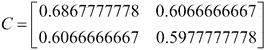

# 第七章：PCA 降维

本章我们将讨论一种叫做**主成分分析**（**PCA**）的降维技术。降维的动机来源于几个问题。首先，它可以用来缓解由维度灾难引发的问题。其次，降维可以在最小化信息丢失的情况下压缩数据。第三，理解具有数百维度的数据结构是困难的；而仅有两三个维度的数据则容易进行可视化。我们将使用 PCA 在二维空间中可视化一个高维数据集，并构建一个人脸识别系统。

# PCA 概述

回想一下第三章，*特征提取与预处理*，我们知道涉及高维数据的问题可能会受到维度灾难的影响。随着数据集维度的增加，估计器需要的样本数会指数增长。获取如此庞大的数据在某些应用中可能是不可行的，而且从大数据集中学习需要更多的内存和处理能力。此外，随着数据维度的增加，数据的稀疏性通常会增加。在高维空间中，检测相似实例变得更加困难，因为所有实例都呈现稀疏特征。

主成分分析，也叫做卡尔霍嫩-洛夫变换（Karhunen-Loeve Transform），是一种用于在高维数据中寻找模式的技术。PCA 常用于探索和可视化高维数据集。它还可以用来压缩数据，并在数据被另一个估计器使用之前对其进行处理。PCA 将一组可能相关的高维变量减少到一组低维的、线性不相关的合成变量，称为**主成分**。低维数据将尽可能保留原始数据的方差。

PCA 通过将数据投影到一个低维子空间来减少数据集的维度。例如，一个二维数据集可以通过将数据点投影到一条线上来降低维度；数据集中的每个实例将由一个单一的值表示，而不是一对值。一个三维数据集可以通过将变量投影到一个平面上来降低到二维。一般来说，一个*n*维的数据集可以通过将数据集投影到一个*k*维子空间来降低维度，其中*k*小于*n*。更正式地说，PCA 可以用来找到一组向量，这些向量构成一个子空间，最小化投影数据的平方误差和。这个投影将保留原始数据集方差的最大比例。

想象一下，你是一本园艺用品目录的摄影师，负责拍摄一个洒水壶。洒水壶是三维的，但照片是二维的；你必须创造一个二维的表示，尽可能多地描述洒水壶。以下是你可以使用的四张可能的照片：


在第一张照片中，可以看到洒水壶的背面，但看不到前面。第二张照片是从洒水壶的喷口正下方拍摄的；这张照片提供了第一张照片中看不到的壶前面的信息，但现在手柄不可见。从第三张图片的鸟瞰视角，无法辨别洒水壶的高度。第四张照片是目录中最明显的选择；这张图片清楚地展示了洒水壶的高度、顶部、喷口和手柄。

PCA 的动机是类似的；它可以将高维空间中的数据投影到一个低维空间，并尽可能保留方差。PCA 旋转数据集，使其与主要成分对齐，以最大化前几个主成分中的方差。假设我们有如下图所示的数据集：


这些实例大致形成了一个从原点到图表右上角的长而细的椭圆。为了减少这个数据集的维度，我们必须将这些点投影到一条线上。以下是两个可以进行投影的线条。沿哪条线，实例变化最多？


这些实例沿着虚线比沿着点线变化得更多。实际上，虚线是第一个主成分。第二个主成分必须与第一个主成分正交；也就是说，第二个主成分必须是统计独立的，当绘制时，第二主成分将垂直于第一个主成分，如下图所示：


每个后续的主成分保留剩余方差的最大部分；唯一的限制是，每个主成分必须与其他主成分正交。

现在假设数据集是三维的。这些点的散点图看起来像一个稍微绕着一个轴旋转的平面圆盘。


这些点可以旋转和平移，使得倾斜的平面几乎完全位于二维空间中。现在这些点形成了一个椭圆；第三维几乎没有方差，可以丢弃。

PCA（主成分分析）在数据集的方差在各维度之间分布不均时最为有效。考虑一个三维数据集，其具有球形凸包。由于每个维度的方差相等，PCA 无法有效地应用于该数据集；任何维度都无法丢弃，否则会丢失大量信息。

通过可视化方式，很容易识别只有二维或三维的数据集的主成分。在下一节中，我们将讨论如何计算高维数据的主成分。

# 执行主成分分析

在讨论主成分分析如何工作之前，我们必须先定义几个术语。

## 方差、协方差和协方差矩阵

回想一下，**方差**是衡量一组值分布的程度。方差是值与均值的平方差的平均值，按以下公式计算：


**协方差**是衡量两个变量一起变化的程度；它是衡量两个变量集之间相关性强度的度量。如果两个变量的协方差为零，则这两个变量不相关。请注意，不相关的变量不一定是独立的，因为相关性仅仅是线性依赖性的度量。两个变量的协方差使用以下公式计算：


如果协方差非零，符号表示变量之间是正相关还是负相关。当两个变量正相关时，一个变量随着另一个变量的增加而增加。当变量负相关时，一个变量相对于其均值减少，而另一个变量相对于其均值增加。**协方差** **矩阵**描述数据集中每对维度之间的协方差值。元素表示数据的和维度的协方差。例如，一个三维数据的协方差矩阵如下所示：


让我们计算以下数据集的协方差矩阵：

| 2 | 0 | −1.4 |
| --- | --- | --- |
| 2.2 | 0.2 | −1.5 |
| 2.4 | 0.1 | −1 |
| 1.9 | 0 | −1.2 |

变量的均值为 2.125、0.075 和-1.275。然后，我们可以计算每一对变量的协方差，得到以下协方差矩阵：


我们可以使用 NumPy 验证我们的计算：

```py
>>> import numpy as np
>>> X = [[2, 0, -1.4],
>>>     [2.2, 0.2, -1.5],
>>>     [2.4, 0.1, -1],
>>>     [1.9, 0, -1.2]]
>>> print np.cov(np.array(X).T)
[[ 0.04916667  0.01416667  0.01916667]
 [ 0.01416667  0.00916667 -0.00583333]
 [ 0.01916667 -0.00583333  0.04916667]]
```

## 特征向量和特征值

一个向量由**方向**和**大小**（或长度）来描述。矩阵的**特征向量**是一个非零向量，满足以下方程：


在前面的方程中， 是一个特征向量，*A* 是一个方阵， 是一个称为**特征值**的标量。特征向量的方向在通过 *A* 变换后保持不变；只有其大小发生了变化，这一变化由特征值表示；即，用矩阵与其特征向量相乘相当于对特征向量进行缩放。前缀 *eigen* 是德语单词，意思是 *属于* 或 *特有的*；矩阵的特征向量是 *属于* 数据结构并表征数据结构的向量。

特征向量和特征值只能从方阵中得出，并非所有方阵都有特征向量或特征值。如果一个矩阵有特征向量和特征值，那么每个维度都会有一对对应的特征向量和特征值。矩阵的主成分是其协方差矩阵的特征向量，按其对应的特征值排序。特征值最大的特征向量是第一个主成分；第二个主成分是特征值第二大的特征向量，依此类推。

让我们计算以下矩阵的特征向量和特征值：


请记住，*A* 和任何 *A* 的特征向量相乘的结果必须等于特征向量与其特征值的乘积。我们将从找到特征值开始，特征值可以通过以下特征方程求得：


特征方程指出，矩阵的行列式，也就是数据矩阵与单位矩阵与特征值的乘积之间的差为零：


这个矩阵的两个特征值都是**-1**。我们现在可以使用特征值来求解特征向量：


首先，我们将方程设置为零：


将 *A* 的值代入后得到如下结果：


我们可以将第一个特征值代入我们的第一个特征值中来求解特征向量。


前面的方程可以改写为一组方程：


任何满足前面方程的非零向量，如下所示，都可以作为特征向量：


PCA 需要单位特征向量，或者说长度为**1**的特征向量。我们可以通过将特征向量除以其范数来归一化它，范数由以下公式给出：


我们向量的范数等于以下值：


这将产生以下单位特征向量：


我们可以使用 NumPy 验证我们对特征向量的解是否正确。`eig`函数返回一个包含特征值和特征向量的元组：

```py
>>> import numpy as np
>>> w, v = np.linalg.eig(np.array([[1, -2], [2, -3]]))
>>> w; v
array([-0.99999998, -1.00000002])
array([[ 0.70710678,  0.70710678],
```

## 使用主成分分析进行降维

让我们使用主成分分析（PCA）将以下二维数据集降维为一维：

| x1 | x2 |
| --- | --- |
| 0.9 | 1 |
| 2.4 | 2.6 |
| 1.2 | 1.7 |
| 0.5 | 0.7 |
| 0.3 | 0.7 |
| 1.8 | 1.4 |
| 0.5 | 0.6 |
| 0.3 | 0.6 |
| 2.5 | 2.6 |
| 1.3 | 1.1 |

PCA 的第一步是从每个观测值中减去每个解释变量的均值：

| x1 | x2 |
| --- | --- |
| 0.9 - 1.17 = -0.27 | 1 - 1.3 = -0.3 |
| 2.4 - 1.17 = 1.23 | 2.6 - 1.3 = 1.3 |
| 1.2 - 1.17 = 0.03 | 1.7 - 1.3 = 0.4 |
| 0.5 - 1.17 = -0.67 | -0.7 - 1.3 = 0.6 |
| 0.3 - 1.17 = -0.87 | -0.7 - 1.3 = 0.6 |
| 1.8 - 1.17 = 0.63 | 1.4 - 1.3 = 0.1 |
| 0.5 - 1.17 = -0.67 | 0.6 - 1.3 = -0.7 |
| 0.3 - 1.17 = -0.87 | 0.6 - 1.3 = -0.7 |
| 2.5 - 1.17 = 1.33 | 2.6 - 1.3 = 1.3 |
| 1.3 - 1.17 = 0.13 | 1.1 - 1.3 = -0.2 |

接下来，我们必须计算数据的主成分。回顾一下，主成分是按其特征值排序的数据协方差矩阵的特征向量。主成分可以通过两种不同的技术来找到。第一种技术需要计算数据的协方差矩阵。由于协方差矩阵是方阵，我们可以使用上一节中描述的方法计算特征向量和特征值。第二种技术则利用数据矩阵的奇异值分解（SVD）来找到协方差矩阵的特征向量和特征值的平方根。我们将首先通过第一种方法完成一个示例，然后描述 scikit-learn 中 PCA 实现所使用的第二种方法。

以下矩阵是数据的协方差矩阵：



使用上一节中描述的技术，特征值为 1.250 和 0.034。以下是单位特征向量：


接下来，我们将把数据投影到主成分上。第一个特征向量具有最大的特征值，是第一个主成分。我们将构建一个变换矩阵，其中矩阵的每一列都是一个主成分的特征向量。如果我们将一个五维数据集降维到三维，我们将构建一个包含三列的矩阵。在这个例子中，我们将把二维数据集投影到一维，因此我们只会使用第一个主成分的特征向量。最后，我们将计算数据矩阵和变换矩阵的点积。以下是将数据投影到第一个主成分后的结果：


许多 PCA 的实现，包括 scikit-learn 中的实现，使用奇异值分解（SVD）来计算特征向量和特征值。SVD 由以下方程给出：


 的列称为数据矩阵的左奇异向量， 的列是其右奇异向量， 的对角元素是其奇异值。虽然矩阵的奇异向量和奇异值在信号处理和统计学的某些应用中很有用，但我们关注它们仅仅是因为它们与数据矩阵的特征向量和特征值有关。具体来说，左奇异向量是协方差矩阵的特征向量， 的对角元素是协方差矩阵特征值的平方根。计算 SVD 超出了本章的范围；然而，使用 SVD 得到的特征向量应该与从协方差矩阵推导出的特征向量相似。

# 使用主成分分析（PCA）可视化高维数据

通过将数据可视化为二维或三维图形，可以轻松发现数据中的模式。高维数据集无法直接图形化表示，但我们仍然可以通过将数据降维至两到三个主成分来获得其结构的一些洞察。

费舍尔的鸢尾花数据集于 1936 年收集，是来自三种鸢尾花物种的每种各 50 个样本的集合：鸢尾花 Setosa、鸢尾花 Virginica 和鸢尾花 Versicolor。解释变量是花瓣和萼片的长度和宽度的测量值。鸢尾花数据集通常用于测试分类模型，并且包含在 scikit-learn 中。让我们将 `iris` 数据集的四个维度降到二维，以便可视化：

```py
>>> import matplotlib.pyplot as plt
>>> from sklearn.decomposition import PCA
>>> from sklearn.datasets import load_iris
```

首先，我们加载内置的鸢尾花数据集，并实例化一个`PCA`估计器。`PCA`类接受一个要保留的主成分数量作为超参数。像其他估计器一样，`PCA`暴露了一个`fit_transform()`方法，返回降维后的数据矩阵：

```py
>>> data = load_iris()
>>> y = data.target
>>> X = data.data
>>> pca = PCA(n_components=2)
>>> reduced_X = pca.fit_transform(X)
```

最后，我们组装并绘制了降维后的数据：

```py
>>> red_x, red_y = [], []
>>> blue_x, blue_y = [], []
>>> green_x, green_y = [], []
>>> for i in range(len(reduced_X)):
>>>     if y[i] == 0:
>>>         red_x.append(reduced_X[i][0])
>>>         red_y.append(reduced_X[i][1])
>>>     elif y[i] == 1:
>>>         blue_x.append(reduced_X[i][0])
>>>         blue_y.append(reduced_X[i][1])
>>>     else:
>>>         green_x.append(reduced_X[i][0])
>>>         green_y.append(reduced_X[i][1])
>>> plt.scatter(red_x, red_y, c='r', marker='x')
>>> plt.scatter(blue_x, blue_y, c='b', marker='D')
>>> plt.scatter(green_x, green_y, c='g', marker='.')
>>> plt.show()
```

缩减后的实例在下图中绘制。数据集的三个类别分别用其自己的标记样式表示。从这个数据的二维视图中，可以清楚地看出一个类别可以很容易地与其他两个重叠的类别分开。没有图形表示，很难注意到这种结构。这一洞察可以影响我们选择分类模型。


# 使用 PCA 进行面部识别

现在让我们将 PCA 应用于面部识别问题。面部识别是一种监督分类任务，其目标是从面部图像中识别出一个人。在本例中，我们将使用来自 AT&T 实验室剑桥分部的*我们的面部数据库*数据集。该数据集包含四十个人的每个人的十张图像。这些图像在不同的光照条件下创建，并且主体改变了他们的面部表情。图像是灰度的，尺寸为 92 x 112 像素。以下是一个示例图像：


尽管这些图像很小，但编码每个像素强度的特征向量将具有 10,304 个维度。从这样高维数据的训练可能需要许多样本以避免过拟合。因此，我们将使用 PCA 来以少数主成分紧凑地表示图像。

我们可以将图像的像素强度矩阵重塑为一个向量，并为所有训练图像创建这些向量的矩阵。每个图像都是这个数据集主成分的线性组合。在面部识别的上下文中，这些主成分被称为**特征脸**。特征脸可以被看作是标准化的面部组件。数据集中的每张脸都可以表示为一些特征脸的组合，并且可以近似为最重要的特征脸的组合：

```py
>>> from os import walk, path
>>> import numpy as np
>>> import mahotas as mh
>>> from sklearn.cross_validation import train_test_split
>>> from sklearn.cross_validation import cross_val_score
>>> from sklearn.preprocessing import scale
>>> from sklearn.decomposition import PCA
>>> from sklearn.linear_model import LogisticRegression
>>> from sklearn.metrics import classification_report
>>> X = []
>>> y = []
```

首先，我们将图像加载到`NumPy`数组中，并将它们的矩阵重塑为向量：

```py
>>> for dir_path, dir_names, file_names in walk('data/att-faces/orl_faces'):
>>>     for fn in file_names:
>>>         if fn[-3:] == 'pgm':
>>>             image_filename = path.join(dir_path, fn)
>>>             X.append(scale(mh.imread(image_filename, as_grey=True).reshape(10304).astype('float32')))
>>>             y.append(dir_path)
>>> X = np.array(X)
```

然后，我们将图像随机分割为训练集和测试集，并在训练集上拟合`PCA`对象：

```py
>>> X_train, X_test, y_train, y_test = train_test_split(X, y)
>>> pca = PCA(n_components=150)
```

我们将所有实例缩减为 150 个维度并训练一个逻辑回归分类器。数据集包含四十个类别；scikit-learn 在幕后自动使用一对所有策略创建二进制分类器：

```py
>>> X_train_reduced = pca.fit_transform(X_train)
>>> X_test_reduced = pca.transform(X_test)
>>> print 'The original dimensions of the training data were', X_train.shape
>>> print 'The reduced dimensions of the training data are', X_train_reduced.shape
>>> classifier = LogisticRegression()
>>> accuracies = cross_val_score(classifier, X_train_reduced, y_train)
```

最后，我们使用交叉验证和测试集评估分类器的性能。在完整数据集上训练的分类器的每类平均 F1 分数为 0.94，但训练所需的时间明显更长，在具有更多训练实例的应用中可能会变得非常缓慢：

```py
>>> print 'Cross validation accuracy:', np.mean(accuracies), accuracies
>>> classifier.fit(X_train_reduced, y_train)
>>> predictions = classifier.predict(X_test_reduced)
>>> print classification_report(y_test, predictions)
```

以下是脚本的输出：

```py
The original dimensions of the training data were (300, 10304)
The reduced dimensions of the training data are (300, 150)
Cross validation accuracy: 0.833841819347 [ 0.82882883  0.83        0.84269663]
             precision    recall  f1-score   support

data/att-faces/orl_faces/s1       1.00      1.00      1.00         2
data/att-faces/orl_faces/s10       1.00      1.00      1.00         2
data/att-faces/orl_faces/s11       1.00      0.60      0.75         5
...
data/att-faces/orl_faces/s9       1.00      1.00      1.00         2

avg / total       0.92      0.89      0.89       100
```

# 摘要

在本章中，我们研究了降维问题。高维数据难以进行可视化。高维数据集还可能遭遇维度灾难；估计器需要大量样本才能从高维数据中学习并进行泛化。我们通过使用一种叫做主成分分析的技术来缓解这些问题，该技术通过将数据投影到低维子空间，将一个高维、可能相关的数据集降维为一组不相关的主成分。我们使用主成分分析将四维 Iris 数据集可视化为二维，并构建了一个人脸识别系统。在下一章中，我们将回到监督学习。我们将讨论一种早期的分类算法——感知机，这将为我们在最后几章中讨论更高级的模型做准备。
