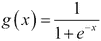
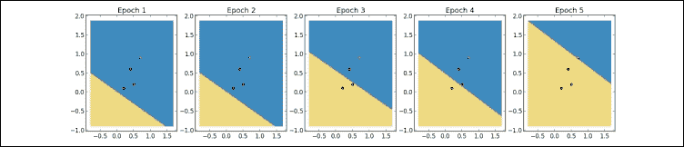

# 第八章：感知器

在前面的章节中，我们讨论了广义线性模型，该模型通过连接函数将解释变量和模型参数的线性组合与响应变量关联。在本章中，我们将讨论另一种线性模型，称为感知器。感知器是一种二分类器，可以从单个训练实例中学习，这对于从大数据集中进行训练非常有用。更重要的是，感知器及其局限性激发了我们将在最后几章讨论的模型。

感知器由弗兰克·罗森布拉特（Frank Rosenblatt）于 1950 年代末在康奈尔航空实验室发明，感知器的开发最初是受模拟人脑的努力驱动的。大脑由称为**神经元**的细胞组成，这些神经元处理信息，并通过称为**突触**的神经元之间的连接传递信息。据估计，人脑由多达 1000 亿个神经元和 100 万亿个突触组成。如下面的图所示，神经元的主要组成部分包括树突、细胞体和轴突。树突从其他神经元接收电信号。信号在神经元的细胞体中被处理，然后通过轴突传递到另一个神经元。


单个神经元可以被看作是一个计算单元，处理一个或多个输入并生成输出。感知器的功能与神经元类似；它接受一个或多个输入，处理它们并返回一个输出。看起来仅仅模拟人脑中数百亿个神经元中的一个，似乎用途有限。一定程度上这是正确的；感知器无法逼近一些基本的函数。然而，我们仍然会讨论感知器，原因有二。首先，感知器能够进行在线的错误驱动学习；学习算法可以通过单个训练实例而不是整个训练实例批次来更新模型的参数。在线学习对于从太大以至于无法全部存储在内存中的训练集进行学习非常有用。第二，理解感知器的工作原理对于理解我们将在后续章节中讨论的一些更强大的模型是必要的，包括支持向量机和人工神经网络。感知器通常使用如下图所示的图表来表示：


标记为 、 和  的圆圈是输入单元。每个输入单元代表一个特征。感知机通常会使用一个额外的输入单元来表示常数偏置项，但该输入单元通常在图示中省略。中间的圆圈是计算单元或神经元的主体。连接输入单元和计算单元的边类似于树突。每条边是**加权**的，或与一个参数相关联。参数可以容易地解释；与正类相关的解释变量将具有正权重，而与负类相关的解释变量将具有负权重。指向计算单元外部的边返回输出，可以将其视为轴突。

# 激活函数

感知机通过使用**激活函数**处理解释变量和模型参数的线性组合来对实例进行分类，如下方公式所示。参数和输入的线性组合有时被称为感知机的**预激活**。


这里， 是模型的参数， 是常数偏置项， 是激活函数。常用几种不同的激活函数。Rosenblatt 原始的感知机使用了**Heaviside 阶跃**函数。Heaviside 阶跃函数也叫做单位阶跃函数，表示如下公式，其中  是特征的加权组合：


如果解释变量和偏置项的加权和大于零，激活函数返回一，感知机预测该实例属于正类。否则，函数返回零，感知机预测该实例属于负类。Heaviside 阶跃激活函数在下图中绘制：


另一个常见的激活函数是**逻辑 sigmoid** 激活函数。这个激活函数的梯度可以高效地计算，这在后续章节构建人工神经网络时非常重要。逻辑 sigmoid 激活函数由以下公式给出，其中  是加权输入的总和：



这个模型应该很熟悉；它是解释变量值和模型参数的线性组合，通过逻辑函数进行处理。也就是说，它与逻辑回归的模型相同。虽然使用逻辑 sigmoid 激活函数的感知机与逻辑回归有相同的模型，但它学习参数的方式不同。

## 感知机学习算法

感知机学习算法首先将权重设置为零或小的随机值。然后它预测一个训练实例的类别。感知机是一种**基于错误的**学习算法；如果预测正确，算法继续处理下一个实例。如果预测错误，算法会更新权重。更正式地，更新规则如下所示：


对于每个训练实例，每个解释变量的参数值增加！感知机学习算法，其中！感知机学习算法是实例！感知机学习算法的真实类别，！感知机学习算法是实例！感知机学习算法的预测类别，！感知机学习算法是实例！感知机学习算法的解释变量！感知机学习算法的值，而！感知机学习算法是控制学习率的超参数。如果预测正确，！感知机学习算法等于零，且！感知机学习算法项等于零。因此，如果预测正确，权重不会更新。如果预测错误，权重将增加学习率、！感知机学习算法和特征值的乘积。

这个更新规则类似于梯度下降的更新规则，权重的调整是为了正确分类实例，并且更新的大小由学习率控制。每次遍历训练实例称为**一个周期（epoch）**。当学习算法在完成一个周期时没有错误分类任何实例，就认为学习算法已收敛。学习算法并不保证一定会收敛；在本章后面，我们将讨论无法线性分离的数据集，对于这些数据集，收敛是无法实现的。因此，学习算法还需要一个超参数，指定在算法终止之前可以完成的最大周期数。

# 感知机的二分类

让我们解决一个玩具分类问题。假设您希望将成年猫与小猫分开。您的数据集中只有两个解释变量：动物白天睡觉的时间比例和动物白天易怒的时间比例。我们的训练数据包括以下四个实例：

| 实例 | 白天睡觉的时间比例 | 易怒的时间比例 | 小猫还是成年猫？ |
| --- | --- | --- | --- |
| 1 | 0.2 | 0.1 | 小猫 |
| 2 | 0.4 | 0.6 | 小猫 |
| 3 | 0.5 | 0.2 | 小猫 |
| 4 | 0.7 | 0.9 | 成年猫 |

下面的散点图显示这些实例是线性可分的：


我们的目标是训练一个能够使用两个实数解释变量分类动物的感知器。我们将小猫表示为正类，成年猫表示为负类。前面的网络图描述了我们将要训练的感知器。

我们的感知器有三个输入单元。 是偏置项的输入单元。 和  是两个特征的输入单元。我们感知器的计算单元使用了海维赛德激活函数。在这个例子中，我们将最大训练轮数设为十；如果算法在 10 轮内没有收敛，它将停止并返回当前权重值。为了简单起见，我们将学习率设为一。最初，我们将所有权重设置为零。让我们看一下第一个训练轮次，如下表所示：

| Epoch 1 |   |   |   |   |
| --- | --- | --- | --- | --- |
| **实例** | **初始权重****x****激活** | **预测，目标** | **正确** | **更新后的权重** |
| 0 | 0, 0, 0;1.0, 0.2, 0.1;1.0*0 + 0.2*0 + 0.1*0 = 0.0; | 0, 1 | False | 1.0, 0.2, 0.1 |
| 1 | 1.0, 0.2, 0.1;1.0, 0.4, 0.6;1.0*1.0 + 0.4*0.2 + 0.6*0.1 = 1.14; | 1, 1 | True | 1.0, 0.2, 0.1 |
| 2 | 1.0, 0.2, 0.1;1.0, 0.5, 0.2;1.0*1.0 + 0.5*0.2 + 0.2*0.1 = 1.12; | 1, 1 | True | 1.0, 0.2, 0.1 |
| 3 | 1.0, 0.2, 0.1;1.0, 0.7, 0.9;1.0*1.0 + 0.7*0.2 + 0.9*0.1 = 1.23; | 1, 0 | False | 0, -0.5, -0.8 |

最初，所有权重都等于零。第一个实例的解释变量的加权和为零，激活函数输出为零，感知器错误地预测小猫为成年猫。由于预测错误，我们根据更新规则更新权重。我们将每个权重增加学习率、真实标签与预测标签之间的差异以及相应特征的值的乘积。

接下来，我们继续进行第二次训练实例，并使用更新后的权重计算特征的加权和。这个加权和等于 1.14，因此激活函数输出 1。这个预测是正确的，所以我们继续进行第三个训练实例，并且不更新权重。第三个实例的预测也是正确的，因此我们继续进行第四个训练实例。第四个实例的特征加权和为 1.23。激活函数输出 1，错误地预测这个成年猫是小猫。由于这个预测是错误的，我们将每个权重增加学习率、真实标签与预测标签之间的差异以及相应特征的乘积。我们通过对训练集中的所有实例进行分类完成了第一次训练周期。感知机并没有收敛；它错误地分类了训练集中的一半实例。下图展示了第一次训练周期后的决策边界：


请注意，决策边界在整个周期中都有移动；周期结束时由权重形成的决策边界可能并不会产生周期初期看到的相同预测。由于我们没有超过最大训练周期数，我们将再次遍历这些实例。第二次训练周期如下表所示：

| 第 2 周期 |   |   |   |   |
| --- | --- | --- | --- | --- |
| **实例** | **初始权重** **x** **激活** | **预测, 目标** | **正确** | **更新后的权重** |
| 0 | 0, -0.5, -0.81.0, 0.2, 0.11.0*0 + 0.2*-0.5 + 0.1*-0.8 = -0.18 | 0, 1 | 错误 | 1, -0.3, -0.7 |
| 1 | 1, -0.3, -0.71.0, 0.4, 0.61.0*1.0 + 0.4*-0.3 + 0.6*-0.7 = 0.46 | 1, 1 | 正确 | 1, -0.3, -0.7 |
| 2 | 1, -0.3, -0.71.0, 0.5, 0.21.0*1.0 + 0.5*-0.3 + 0.2*-0.7 = 0.71 | 1, 1 | 正确 | 1, -0.3, -0.7 |
| 3 | 1, -0.3, -0.71.0, 0.7, 0.91.0*1.0 + 0.7*-0.3 + 0.9*-0.7 = 0.16 | 1, 0 | 错误 | 0, -1, -1.6 |

第二个训练周期开始时，使用了第一个训练周期的权重值。在这个周期中，有两个训练实例被错误分类。权重更新了两次，但第二个周期结束时的决策边界与第一个周期结束时的决策边界相似。


算法在这个周期未能收敛，因此我们将继续训练。下表描述了第三个训练周期：

| 第 3 周期 |   |   |   |   |
| --- | --- | --- | --- | --- |
| **实例** | **初始权重** **x** **激活** | **预测, 目标** | **正确** | **更新后的权重** |
| 0 | 0, -1, -1.61.0, 0.2, 0.11.0*0 + 0.2*-1.0 + 0.1*-1.6 = -0.36 | 0, 1 | `错误` | 1,-0.8, -1.5 |
| 1 | 1,-0.8, -1.51.0, 0.4, 0.61.0*1.0 + 0.4*-0.8 + 0.6*-1.5 = -0.22 | 0, 1 | 错误 | 2, -0.4, -0.9 |
| 2 | 2, -0.4, -0.91.0, 0.5, 0.21.0*2.0 + 0.5*-0.4 + 0.2*-0.9 = 1.62 | 1, 1 | 正确 | 2, -0.4, -0.9 |
| 3 | 2, -0.4, -0.91.0, 0.7, 0.91.0*2.0 + 0.7*-0.4 + 0.9*-0.9 = 0.91 | 1, 0 | 错误 | 1, -1.1, -1.8 |

感知机在这一周期中比之前的周期分类更多的实例错误。下图描绘了第三个周期结束时的决策边界：


感知机在第四和第五训练周期中继续更新其权重，并且继续对训练实例进行错误分类。在第六个周期中，感知机正确分类了所有实例；它收敛到了一个权重集，可以将两个类别分开。下表描述了第六个训练周期：

| 第 6 周期 |   |   |   |   |
| --- | --- | --- | --- | --- |
| **实例** | **初始权重****x****激活值** | **预测值，目标值** | **正确** | **更新后的权重** |
| 0 | 2, -1, -1.51.0, 0.2, 0.11.0*2 + 0.2*-1 + 0.1*-1.5 = 1.65 | 1, 1 | 正确 | 2, -1, -1.5 |
| 1 | 2, -1, -1.51.0, 0.4, 0.61.0*2 + 0.4*-1 + 0.6*-1.5 = 0.70 | 1, 1 | 正确 | 2, -1, -1.5 |
| 2 | 2, -1, -1.51.0, 0.5, 0.21.0*2 + 0.5*-1 + 0.2*-1.5 = 1.2 | 1, 1 | 正确 | 2, -1, -1.5 |
| 3 | 2, -1, -1.51.0, 0.7, 0.91.0*2 + 0.7*-1 + 0.9*-1.5 = -0.05 | 0, 0 | 正确 | 2, -1, -1.5 |

第六次训练周期结束时的决策边界如下图所示：


下图显示了所有训练周期中的决策边界。



## 感知机的文档分类

scikit-learn 提供了感知机的实现。与我们使用的其他实现一样，`Perceptron` 类的构造函数接受设置算法超参数的关键字参数。`Perceptron` 同样暴露了 `fit_transform()` 和 `predict()` 方法。`Perceptron` 还提供了 `partial_fit()` 方法，允许分类器训练并对流数据进行预测。

在这个例子中，我们训练一个感知器来分类 20 个新闻组数据集中的文档。该数据集由约 20,000 个文档组成，采样自 20 个 Usenet 新闻组。该数据集通常用于文档分类和聚类实验；scikit-learn 提供了一个便利的函数来下载和读取数据集。我们将训练一个感知器来分类来自三个新闻组的文档：`rec.sports.hockey`、`rec.sports.baseball`和`rec.auto`。scikit-learn 的`Perceptron`原生支持多类分类；它将使用“一对多”策略为训练数据中的每个类别训练一个分类器。我们将文档表示为 TF-IDF 加权的词袋。`partial_fit()`方法可以与`HashingVectorizer`结合使用，在内存受限的环境中对大量或流数据进行训练：

```py
>>> from sklearn.datasets import fetch_20newsgroups
>>> from sklearn.metrics.metrics import f1_score, classification_report
>>> from sklearn.feature_extraction.text import TfidfVectorizer
>>> from sklearn.linear_model import Perceptron

>>> categories = ['rec.sport.hockey', 'rec.sport.baseball', 'rec.autos']
>>> newsgroups_train = fetch_20newsgroups(subset='train', categories=categories, remove=('headers', 'footers', 'quotes'))
>>> newsgroups_test = fetch_20newsgroups(subset='test', categories=categories, remove=('headers', 'footers', 'quotes'))

>>> vectorizer = TfidfVectorizer()
>>> X_train = vectorizer.fit_transform(newsgroups_train.data)
>>> X_test = vectorizer.transform(newsgroups_test.data)

>>> classifier = Perceptron(n_iter=100, eta0=0.1)
>>> classifier.fit_transform(X_train, newsgroups_train.target )
>>> predictions = classifier.predict(X_test)
>>> print classification_report(newsgroups_test.target, predictions)
```

以下是脚本的输出：

```py
             precision    recall  f1-score   support

          0       0.89      0.87      0.88       396
          1       0.87      0.78      0.82       397
          2       0.79      0.88      0.83       399

avg / total       0.85      0.85      0.85      1192
```

首先，我们使用`fetch_20newsgroups()`函数下载并读取数据集。与其他内置数据集一致，函数返回一个包含`data`、`target`和`target_names`字段的对象。我们还指定删除文档的标题、页脚和引用。每个新闻组在标题和页脚中使用不同的约定；保留这些解释性变量会使得文档分类变得过于简单。我们使用`TfifdVectorizer`生成 TF-IDF 向量，训练感知器，并在测试集上进行评估。未经超参数优化，感知器的平均精度、召回率和 F1 分数为 0.85。

# 感知器的局限性

尽管感知器在我们的例子中很好地分类了实例，但该模型存在局限性。像感知器这种使用 Heaviside 激活函数的线性模型并不是**通用函数逼近器**；它们无法表示某些函数。具体来说，线性模型只能学习逼近**线性可分**数据集的函数。我们所检查的线性分类器找到一个超平面，将正类与负类分开；如果没有一个超平面能够分开这些类别，那么问题就不是线性可分的。

一个简单的线性不可分的函数示例是逻辑运算**XOR**，即排他或运算。XOR 的输出为 1，当其输入之一为 1 而另一个为 0 时。XOR 的输入和输出在以下图中以二维形式绘制。当 XOR 输出**1**时，实例用圆圈标记；当 XOR 输出**0**时，实例用菱形标记，如下图所示：


使用单一的直线无法将圆形与菱形分开。假设这些实例是放置在板上的钉子。如果你用一根橡皮筋围绕正实例，并且用第二根橡皮筋围绕负实例，那么橡皮筋会在板中间交叉。橡皮筋代表**凸** **外壳**，即包含集合内所有点以及连接集合中一对点的任何直线上的所有点的外包络。特征表示在更高维空间中比在低维空间中更有可能是线性可分的。例如，当使用高维表示如词袋模型时，文本分类问题往往是线性可分的。

在接下来的两章中，我们将讨论可以用于建模线性不可分数据的技术。第一种技术叫做**核化**，它将线性不可分的数据投影到一个更高维的空间，在这个空间中数据是线性可分的。核化可以应用于许多模型，包括感知机，但它与支持向量机特别相关，支持向量机将在下一章中讨论。支持向量机还支持可以找到将线性不可分的类别以最少错误分开的超平面的技术。第二种技术创建了一个感知机的有向图。由此生成的模型，称为**人工神经网络**，是一个通用的函数逼近器；我们将在第十章中讨论人工神经网络，*从感知机到人工神经网络*。

# 摘要

本章中，我们讨论了感知机。感知机受到神经元的启发，是一种用于二分类的线性模型。感知机通过处理解释变量和权重的线性组合以及激活函数来对实例进行分类。虽然带有逻辑 sigmoid 激活函数的感知机与逻辑回归是相同的模型，但感知机通过在线的、基于误差的算法来学习其权重。感知机在某些问题中可以有效使用。像我们讨论的其他线性分类器一样，感知机并不是一个通用的函数逼近器；它只能通过超平面将一种类别的实例与另一种类别的实例分开。一些数据集是线性不可分的；也就是说，没有可能的超平面能够正确地分类所有实例。在接下来的章节中，我们将讨论两种可以处理线性不可分数据的模型：人工神经网络，它通过感知机图构建一个通用的函数逼近器；以及支持向量机，它将数据投影到一个更高维的空间，在这个空间中数据是线性可分的。
