# 第九章. 从感知机到支持向量机

在上一章中，我们讨论了感知机。作为一种二分类器，感知机无法有效地对线性不可分的特征表示进行分类。在我们讨论第二章中*线性回归*时，也遇到了类似的问题；我们检查了一个响应变量与解释变量之间不是线性关系的数据集。为了提高模型的准确性，我们引入了一种多重线性回归的特例，称为多项式回归。我们创建了特征的合成组合，并能够在更高维的特征空间中建模响应变量与特征之间的线性关系。

尽管这种增加特征空间维度的方法看起来是用线性模型逼近非线性函数的有希望的技术，但它有两个相关的问题。第一个是计算问题；计算映射后的特征并处理更大的向量需要更多的计算能力。第二个问题涉及到泛化；增加特征表示的维度引入了维度灾难。学习高维特征表示需要指数级更多的训练数据，以避免过拟合。

本章中，我们将讨论一种强大的分类和回归模型，称为**支持向量****机**（**SVM**）。首先，我们将重新探讨将特征映射到更高维空间。然后，我们将讨论支持向量机如何解决在学习映射到更高维空间的数据时遇到的计算和泛化问题。整个书籍都致力于描述支持向量机，描述训练 SVM 所用的优化算法需要比我们在之前的章节中使用的更为高级的数学。我们不会像之前那样通过玩具示例详细推导，而是尽量通过建立直觉来理解支持向量机的工作原理，以便有效地在 scikit-learn 中应用它们。

# 核与核技巧

回想一下，感知机通过使用超平面作为决策边界，将正类的实例与负类的实例分开。决策边界由以下方程给出：

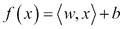

预测是通过以下函数进行的：

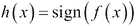

请注意，之前我们将内积表示为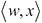，即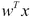。为了与支持向量机中使用的符号约定保持一致，我们将在本章采用前一种表示法。

虽然证明超出了本章的范围，但我们可以用不同的方式来写这个模型。下面的模型表达式被称为**对偶**形式。我们之前使用的表达式是**原始**形式：

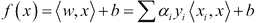

原始形式与对偶形式之间最重要的区别在于，原始形式计算的是*模型参数*和测试实例特征向量的内积，而对偶形式计算的是*训练实例*和测试实例特征向量的内积。稍后，我们将利用对偶形式的这一性质来处理线性不可分的类别。首先，我们需要正式化将特征映射到更高维空间的定义。

在第二章的多项式回归部分中，*线性回归*，我们将特征映射到一个更高维的空间，在这个空间中它们与响应变量是线性相关的。这个映射通过从原始特征的组合中创建二次项来增加特征的数量。这些合成特征使我们能够用线性模型表示一个非线性函数。一般来说，映射由以下表达式给出：

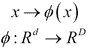

下图左侧的图示展示了一个线性不可分数据集的原始特征空间。右侧的图示显示了数据在映射到更高维空间后变得线性可分：

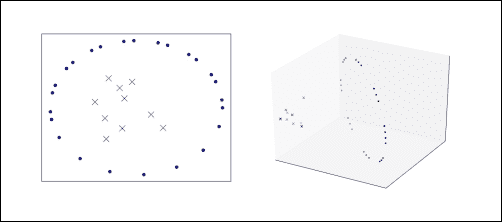

让我们回到决策边界的对偶形式，并观察到特征向量仅出现在点积中。我们可以通过如下方式将数据映射到更高维空间，通过对特征向量应用映射：

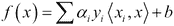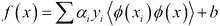

如前所述，这个映射使我们能够表示更复杂的模型，但它也带来了计算和泛化问题。映射特征向量并计算它们的点积可能需要大量的计算资源。

请注意第二个方程式，尽管我们已将特征向量映射到更高维空间，但特征向量仍然只以点积的形式出现。点积是标量；一旦计算出这个标量，我们就不再需要映射后的特征向量。如果我们能够使用其他方法来产生与映射向量点积相同的标量，就可以避免显式计算点积和映射特征向量的高昂工作。

幸运的是，有一种方法叫做 **核技巧**。**核函数**是一种函数，给定原始特征向量后，它返回与其对应的映射特征向量的点积相同的值。核函数并不显式地将特征向量映射到更高维的空间，或者计算映射向量的点积。核函数通过一系列不同的操作产生相同的值，这些操作通常可以更高效地计算。核函数在以下方程中定义得更为正式：

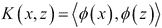

让我们演示一下核函数是如何工作的。假设我们有两个特征向量，*x* 和 *z*：

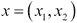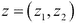

在我们的模型中，我们希望通过以下转换将特征向量映射到更高维的空间：

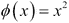

映射后的归一化特征向量的点积相当于：

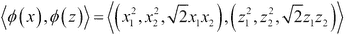

由以下方程给出的核函数产生的值与映射特征向量的点积相同：

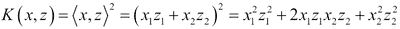

让我们为特征向量代入值，使这个例子更加具体：

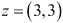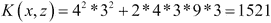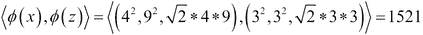

由以下方程给出的核函数 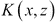 产生了与映射特征向量的点积 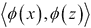 相同的值，但从未显式地将特征向量映射到更高维空间，并且需要更少的算术运算。这个例子使用的是二维特征向量。即使是具有适度特征数量的数据集，也可能导致映射特征空间的维度巨大。scikit-learn 提供了几种常用的核函数，包括多项式核函数、Sigmoid 核函数、高斯核函数和线性核函数。多项式核函数由以下方程给出：

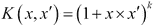

二次核函数，或多项式核函数，其中 *k* 等于 2，通常用于自然语言处理。

Sigmoid 核函数由以下方程给出。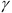 和 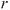 是可以通过交叉验证调整的超参数：

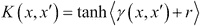

高斯核是处理需要非线性模型问题的一个不错的选择。高斯核是一个**径向基函数**。在映射后的特征空间中，作为超平面的决策边界类似于原始空间中的超球面决策边界。高斯核产生的特征空间可以有无限多个维度，这是其他方法无法做到的。高斯核的表达式如下：

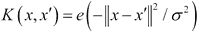

是一个超参数。在使用支持向量机时，特征缩放始终很重要，但在使用高斯核时，特征缩放尤其重要。

选择一个核函数可能具有挑战性。理想情况下，核函数将以一种对任务有用的方式来衡量实例之间的相似性。虽然核函数通常与支持向量机一起使用，但它们也可以与任何可以通过两个特征向量的点积表示的模型一起使用，包括逻辑回归、感知机和主成分分析。在下一节中，我们将讨论映射到高维特征空间所导致的第二个问题：泛化。

# 最大间隔分类与支持向量

下图展示了来自两个线性可分类的实例以及三个可能的决策边界。所有这些决策边界都将正类的训练实例与负类的训练实例分开，且感知机可以学习它们中的任何一个。哪个决策边界最有可能在测试数据上表现最佳？

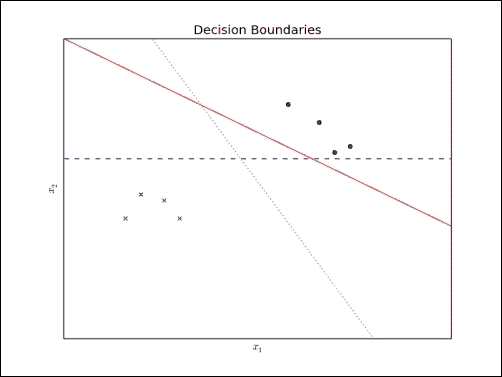

从这个可视化中可以直观地看出，虚线决策边界是最优的。实线决策边界靠近许多正实例。测试集可能包含一个正实例，其第一个解释变量的值稍小，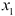；该实例将被错误分类。虚线决策边界远离大多数训练实例，但它靠近一个正实例和一个负实例。下图提供了评估决策边界的不同视角：

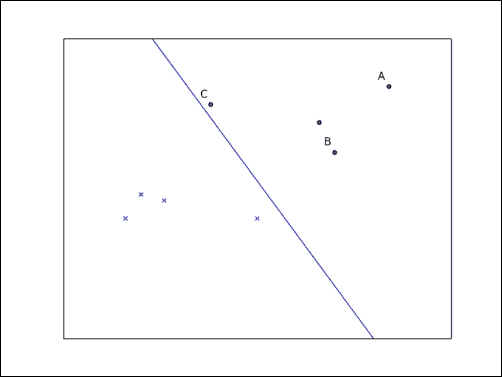

假设所绘制的线是逻辑回归分类器的决策边界。标记为**A**的实例远离决策边界；它会被预测为属于正类，并且概率较高。标记为**B**的实例仍会被预测为属于正类，但由于该实例接近决策边界，概率会较低。最后，标记为**C**的实例会被预测为属于正类，但概率较低；即使训练数据有细微变化，也可能改变预测的类别。最有信心的预测是针对那些远离决策边界的实例。我们可以通过其**函数间隔**来估计预测的信心。训练集的函数间隔由以下方程给出：

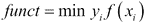

在前述公式中，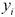是实例的真实类别。对于实例**A**，函数间隔较大，而对于实例**C**，函数间隔较小。如果**C**被错误分类，则函数间隔为负数。函数间隔等于 1 的实例被称为**支持向量**。这些实例足以定义决策边界；其他实例则不需要用于预测测试实例的类别。与函数间隔相关的是**几何间隔**，即分隔支持向量的带状区域的最大宽度。几何间隔等于标准化后的函数间隔。必须对函数间隔进行标准化，因为它们可以通过使用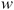来缩放，这对训练来说是有问题的。当是单位向量时，几何间隔等于函数向量。我们现在可以将最佳决策边界的定义形式化为具有最大几何间隔。通过以下约束优化问题，可以求解最大化几何间隔的模型参数：

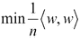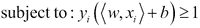

支持向量机的一个有用特性是，该优化问题是凸的；它有一个单一的局部最小值，这也是全局最小值。虽然证明超出了本章的范围，但之前的优化问题可以通过模型的对偶形式来表示，以适应核方法，如下所示：

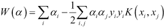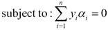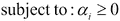

找到最大化几何间隔的参数，前提是所有正实例的函数间隔至少为 1，所有负实例的函数间隔最多为 -1，这是一个二次规划问题。这个问题通常使用一种叫做 **序列最小优化**（**SMO**）的算法来解决。SMO 算法将优化问题分解为一系列最小的子问题，然后通过解析方法解决这些子问题。

# 在 scikit-learn 中分类字符

让我们应用支持向量机解决一个分类问题。近年来，支持向量机在字符识别任务中得到了成功应用。给定一张图像，分类器必须预测出图像中的字符。字符识别是许多光学字符识别系统中的一个组件。即便是较小的图像，在使用原始像素强度作为特征时，也需要高维表示。如果类别是线性不可分的，并且必须映射到更高维度的特征空间，特征空间的维度可能会变得更大。幸运的是，SVM 适合高效地处理这种数据。首先，我们将使用 scikit-learn 来训练一个支持向量机以识别手写数字。接着，我们将处理一个更具挑战性的问题：在照片中识别字母数字字符。

## 分类手写数字

混合国家标准与技术研究所（MNIST）数据库包含 70,000 张手写数字图像。这些数字是从美国人口普查局的员工和美国高中生的手写文档中采样得到的。图像为灰度图，尺寸为 28 x 28 像素。我们可以使用以下脚本查看其中的一些图像：

```py
>>> import matplotlib.pyplot as plt
>>> from sklearn.datasets import fetch_mldata
>>> import matplotlib.cm as cm

>>> digits = fetch_mldata('MNIST original', data_home='data/mnist').data
>>> counter = 1
>>> for i in range(1, 4):
>>>     for j in range(1, 6):
>>>         plt.subplot(3, 5, counter)
>>>         plt.imshow(digits[(i - 1) * 8000 + j].reshape((28, 28)), cmap=cm.Greys_r)
>>>         plt.axis('off')
>>>         counter += 1
>>> plt.show()
```

首先，我们加载数据。如果数据集未在磁盘上找到，scikit-learn 提供了 `fetch_mldata` 方便的函数来下载数据集并将其读入一个对象。然后，我们为数字零、数字一和数字二创建一个子图，显示五个实例。脚本将生成以下图形：

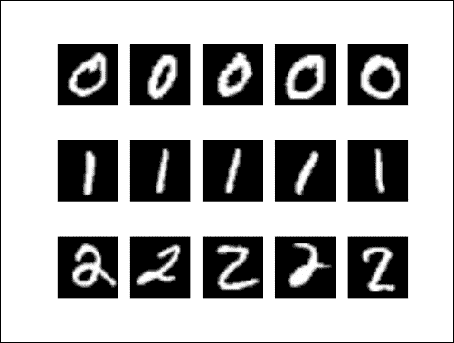

MNIST 数据集被划分为 60,000 张图像的训练集和 10,000 张图像的测试集。该数据集通常用于评估各种机器学习模型，之所以流行，是因为几乎不需要预处理。我们将使用 scikit-learn 构建一个分类器，能够预测图像中展示的数字。

首先，我们导入必要的类：

```py
from sklearn.datasets import fetch_mldata
from sklearn.pipeline import Pipeline
from sklearn.preprocessing import scale
from sklearn.cross_validation import train_test_split
from sklearn.svm import SVC
from sklearn.grid_search import GridSearchCV
from sklearn.metrics import classification_report
```

在网格搜索过程中，脚本会派生额外的进程，这要求从 `__main__` 块执行。

```py
if __name__ == '__main__':
    data = fetch_mldata('MNIST original', data_home='data/mnist')
    X, y = data.data, data.target
    X = X/255.0*2 – 1
```

接下来，我们使用`fetch_mldata`便捷函数加载数据。我们对特征进行缩放，并将每个特征围绕原点居中。然后，我们使用以下代码行将预处理后的数据分割为训练集和测试集：

```py
    X_train, X_test, y_train, y_test = train_test_split(X, y)
```

接下来，我们实例化一个`SVC`，即支持向量分类器对象。该对象提供了类似于 scikit-learn 其他估算器的 API；分类器使用`fit`方法进行训练，并通过`predict`方法进行预测。如果查看`SVC`的文档，你会发现该估算器需要的超参数比我们讨论的大多数其他估算器要多。通常，更强大的估算器需要更多的超参数。对于`SVC`来说，最有趣的超参数是通过`kernel`、`gamma`和`C`关键字参数设置的。`kernel`关键字参数指定要使用的核。scikit-learn 提供了线性、多项式、sigmoid 和径向基函数核的实现。当使用多项式核时，还应该设置`degree`关键字参数。`C`控制正则化，它类似于我们在逻辑回归中使用的 lambda 超参数。`gamma`关键字参数是 sigmoid、多项式和 RBF 核的核系数。设置这些超参数可能会很具挑战性，因此我们通过网格搜索来调整它们，代码如下所示。

```py
    pipeline = Pipeline([
        ('clf', SVC(kernel='rbf', gamma=0.01, C=100))
    ])
    print X_train.shape
    parameters = {
        'clf__gamma': (0.01, 0.03, 0.1, 0.3, 1),
        'clf__C': (0.1, 0.3, 1, 3, 10, 30),
    }
    grid_search = GridSearchCV(pipeline, parameters, n_jobs=2, verbose=1, scoring='accuracy')
    grid_search.fit(X_train[:10000], y_train[:10000])
    print 'Best score: %0.3f' % grid_search.best_score_
    print 'Best parameters set:'
    best_parameters = grid_search.best_estimator_.get_params()
    for param_name in sorted(parameters.keys()):
        print '\t%s: %r' % (param_name, best_parameters[param_name])
    predictions = grid_search.predict(X_test)
    print classification_report(y_test, predictions)
```

以下是前述脚本的输出：

```py
Fitting 3 folds for each of 30 candidates, totalling 90 fits
[Parallel(n_jobs=2)]: Done   1 jobs       | elapsed:  7.7min
[Parallel(n_jobs=2)]: Done  50 jobs       | elapsed: 201.2min
[Parallel(n_jobs=2)]: Done  88 out of  90 | elapsed: 304.8min remaining:  6.9min
[Parallel(n_jobs=2)]: Done  90 out of  90 | elapsed: 309.2min finished
Best score: 0.966
Best parameters set:
	clf__C: 3
	clf__gamma: 0.01
             precision    recall  f1-score   support

        0.0       0.98      0.99      0.99      1758
        1.0       0.98      0.99      0.98      1968
        2.0       0.95      0.97      0.96      1727
        3.0       0.97      0.95      0.96      1803
        4.0       0.97      0.98      0.97      1714
        5.0       0.96      0.96      0.96      1535
        6.0       0.98      0.98      0.98      1758
        7.0       0.97      0.96      0.97      1840
        8.0       0.95      0.96      0.96      1668
        9.0       0.96      0.95      0.96      1729

avg / total       0.97      0.97      0.97     17500
```

最好的模型具有 0.97 的平均 F1 分数；通过在超过一万实例上进行训练，可以进一步提高此分数。

## 自然图像中的字符分类

现在让我们尝试一个更具挑战性的问题。我们将在自然图像中分类字母数字字符。Chars74K 数据集由 T. E. de Campos、B. R. Babu 和 M. Varma 为*自然图像中的字符识别*收集，包含了超过 74,000 张数字 0 到 9 以及大写和小写字母的图像。以下是三张小写字母`z`的图像示例。Chars74K 可以从[`www.ee.surrey.ac.uk/CVSSP/demos/chars74k/`](http://www.ee.surrey.ac.uk/CVSSP/demos/chars74k/)下载。

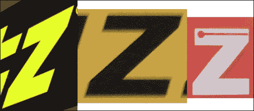

收集的图像类型各异。我们将使用 7,705 张从印度班加罗尔街景照片中提取的字符图像。与 MNIST 相比，这部分 Chars74K 中的图像展示了各种字体、颜色和扰动。解压档案后，我们将使用`English/Img/GoodImg/Bmp/`目录中的文件。首先，我们将导入所需的类。

```py
import os
import numpy as np
from sklearn.svm import SVC
from sklearn.cross_validation import train_test_split
from sklearn.metrics import classification_report
import Image
```

接下来，我们将定义一个使用 Python 图像库调整图像大小的函数：

```py
def resize_and_crop(image, size):
    img_ratio = image.size[0] / float(image.size[1])
    ratio = size[0] / float(size[1])
    if ratio > img_ratio:
        image = image.resize((size[0], size[0] * image.size[1] / image.size[0]), Image.ANTIALIAS)
        image = image.crop((0, 0, 30, 30))
    elif ratio < img_ratio:
        image = image.resize((size[1] * image.size[0] / image.size[1], size[1]), Image.ANTIALIAS)
        image = image.crop((0, 0, 30, 30))
    else:
        image = image.resize((size[0], size[1]), Image.ANTIALIAS)
    return image
```

然后，我们将加载每个 62 个类别的图像，并将它们转换为灰度图像。与 MNIST 不同，Chars74K 的图像尺寸不一致，因此我们将使用我们定义的 `resize_and_crop` 函数将其调整为边长为 30 像素的大小。最后，我们将处理后的图像转换为 NumPy 数组：

```py
X = []
y = []

for path, subdirs, files in os.walk('data/English/Img/GoodImg/Bmp/'):
    for filename in files:
        f = os.path.join(path, filename)
        img = Image.open(f).convert('L') # convert to grayscale
        img_resized = resize_and_crop(img, (30, 30))
        img_resized = np.asarray(img_resized.getdata(), dtype=np.float64) \
            .reshape((img_resized.size[1] * img_resized.size[0], 1))
        target = filename[3:filename.index('-')]
        X.append(img_resized)
        y.append(target)

X = np.array(X)
X = X.reshape(X.shape[:2])

We will then train a support vector classifier with a polynomial kernel.classifier = SVC(verbose=0, kernel='poly', degree=3)
X_train, X_test, y_train, y_test = train_test_split(X, y, random_state=1)
classifier.fit(X_train, y_train)
predictions = classifier.predict(X_test)
print classification_report(y_test, predictions)
```

上述脚本生成以下输出：

```py
             precision    recall  f1-score   support

        001       0.24      0.22      0.23        23
        002       0.24      0.45      0.32        20
       ...
        061       0.33      0.15      0.21        13
        062       0.08      0.25      0.12         8

avg / total       0.41      0.34      0.36      1927
```

显然，这比在 MNIST 中分类数字要更加具有挑战性。字符的外观变化更为广泛，由于这些图像是从照片中采样的，而非扫描文档，字符也更容易受到扰动。此外，Chars74K 中每个类别的训练实例远少于 MNIST 中的数量。通过增加训练数据、采用不同的图像预处理方法，或使用更复杂的特征表示，分类器的性能可以得到提升。

# 摘要

在本章中，我们讨论了支持向量机——一种强大的模型，可以缓解感知机的一些局限性。感知机可以有效地用于线性可分的分类问题，但它无法表示更复杂的决策边界，除非将特征空间扩展到更高的维度。不幸的是，这种扩展容易引发计算和泛化问题。支持向量机通过使用核函数来解决第一个问题，核函数避免了显式计算特征映射。它们通过最大化决策边界与最近实例之间的边距来解决第二个问题。在下一章中，我们将讨论人工神经网络模型，类似于支持向量机，这些模型通过扩展感知机来克服其局限性。
