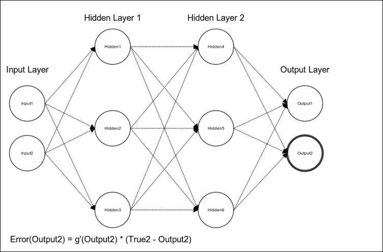
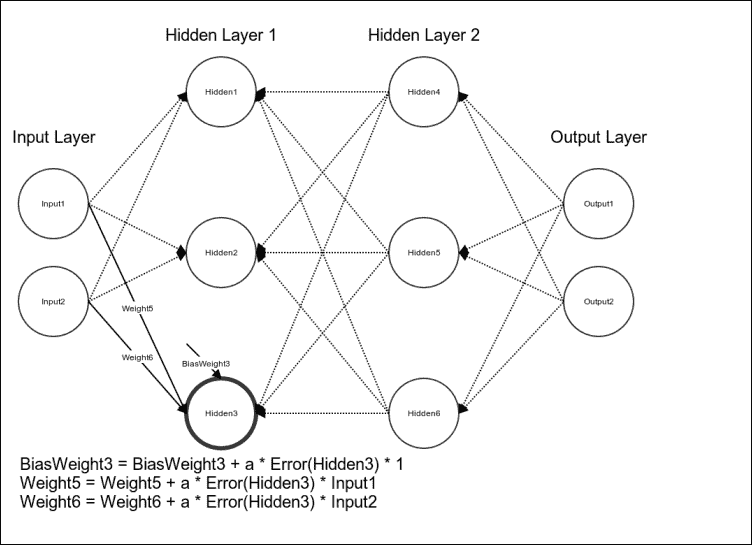

# 第十章. 从感知机到人工神经网络

在第八章，*感知机*中，我们介绍了感知机，它是一个用于二分类的线性模型。你了解到，感知机并不是一个通用的函数逼近器；它的决策边界必须是一个超平面。在前一章中，我们介绍了支持向量机，通过使用核函数将特征表示有效地映射到一个更高维的空间，从而使实例能够线性可分，解决了感知机的一些局限性。在本章中，我们将讨论**人工神经网络**，它是用于分类和回归的强大非线性模型，采用了一种不同的策略来克服感知机的局限性。

如果感知机类似于神经元，那么人工神经网络，或称**神经网络**，则类似于大脑。正如数十亿个神经元与数万亿个突触组成了人类大脑，人工神经网络是由感知机或其他人工神经元组成的有向图。该图的边有权重；这些权重是模型的参数，必须通过学习来获得。

整本书讲述了人工神经网络的各个方面；本章将概述其结构和训练方法。在写作时，已经为 scikit-learn 开发了一些人工神经网络，但它们在版本 0.15.2 中不可用。读者可以通过查看包含神经网络模块的 scikit-learn 0.15.1 的分支来跟随本章的示例。该分支中的实现可能会在未来的 scikit-learn 版本中合并，且不会对本章中描述的 API 做出任何更改。

# 非线性决策边界

回想一下第八章，*感知机*，我们提到过，虽然一些布尔函数如 AND、OR 和 NAND 可以通过感知机来近似实现，但如以下图所示，线性不可分的函数 XOR 是无法通过感知机来实现的：


让我们更详细地回顾 XOR（异或），以便直观理解人工神经网络的强大功能。与当两个输入都为 1 时，AND 输出 1；当至少有一个输入为 1 时，OR 输出 1 不同，XOR 的输出是 1，仅当其中一个输入为 1 时。我们可以将 XOR 视为当两个条件成立时输出 1。第一个条件是至少有一个输入必须为 1；这与 OR 测试的条件相同。第二个条件是不能两个输入都为 1；NAND 测试这个条件。我们可以通过将输入先用 OR 和 NAND 处理，再用 AND 验证两个函数的输出都为 1 来产生与 XOR 相同的输出。也就是说，OR、NAND 和 AND 这三个函数可以组合成与 XOR 相同的输出。

以下表格提供了输入 *A* 和 *B* 的异或、或、与、非与的真值表。通过这些表格，我们可以验证将或（OR）和非与（NAND）的输出输入到与（AND）中，得到的结果与将 *A* 和 *B* 输入到异或（XOR）中得到的结果相同：

| A | B | A 和 B | A 非与 B | A 或 B | A 异或 B |
| --- | --- | --- | --- | --- | --- |
| 0 | 0 | 0 | 1 | 0 | 0 |
| 0 | 1 | 0 | 1 | 1 | 1 |
| 1 | 0 | 0 | 1 | 1 | 1 |
| 1 | 1 | 1 | 0 | 1 | 0 |
| A | B | A 或 B | A 非与 B | (A 或 B) 和 (A 非与 B) |
| --- | --- | --- | --- | --- |
| 0 | 0 | 0 | 1 | 0 |
| 0 | 1 | 1 | 1 | 1 |
| 1 | 0 | 1 | 1 | 1 |
| 1 | 1 | 1 | 0 | 0 |

我们不会尝试用单个感知器表示异或（XOR），而是从多个人工神经元构建人工神经网络，每个神经元逼近一个线性函数。每个实例的特征表示将作为输入传递给两个神经元；一个神经元表示非与（NAND），另一个神经元表示或（OR）。这些神经元的输出将被第三个神经元接收，该神经元表示与（AND），用于测试异或的两个条件是否同时为真。

# 前馈和反馈人工神经网络

人工神经网络由三个部分组成。第一部分是模型的**架构**，或称拓扑结构，描述了神经元的层次以及它们之间连接的结构。第二部分是人工神经元使用的激活函数。第三部分是学习算法，用于寻找最优的权重值。

人工神经网络主要有两种类型。**前馈神经网络**是最常见的一种神经网络，其特点是定向无环图。前馈神经网络中的信号只会朝一个方向传播——向输出层传播。相反，**反馈神经网络**，或称递归神经网络，则包含循环。反馈循环可以表示网络的内部状态，根据输入的不同，反馈循环可以导致网络行为随时间发生变化。前馈神经网络通常用于学习一个函数，将输入映射到输出。由于反馈神经网络的时间行为特性，它们更适合处理输入序列。由于反馈神经网络在 scikit-learn 中没有实现，我们将在讨论中仅限于前馈神经网络。

## 多层感知器

**多层感知器**（**MLP**）是最常用的人工神经网络之一。这个名字有些误导；多层感知器并不是一个具有多层的单一感知器，而是由多个层次的人工神经元组成，这些神经元可以是感知器。MLP 的各层形成一个定向无环图。通常，每一层都与后续的层完全连接；每一层中的每个人工神经元的输出都是下一层中每个人工神经元的输入，直到输出层。MLP 通常有三层或更多层的人工神经元。

**输入层**由简单的输入神经元组成。 输入神经元连接到至少一个**隐藏层**的人工神经元。 隐藏层表示潜在变量； 该层的输入和输出在训练数据中无法观察到。 最后，最后一个隐藏层连接到**输出层**。 以下图表描述了具有三层的多层感知器的架构。 标有**+1**的神经元是偏置神经元，大多数架构图中没有描绘。


隐藏层中的人工神经元或**单元**通常使用非线性激活函数，如双曲正切函数和逻辑函数，其方程如下：


与其他监督模型一样，我们的目标是找到最小化成本函数值的权重值。 平方误差成本函数通常与多层感知器一起使用。 其由以下方程给出，其中*m*是训练实例的数量：


## 最小化成本函数

**反向传播**算法通常与梯度下降等优化算法结合使用，以最小化成本函数的值。 该算法以*反向传播*的混成词命名，并指向网络层中错误流动的方向。 反向传播理论上可用于训练任意数量的隐藏单元排列在任意数量的层的前馈网络，尽管计算能力限制了这种能力。

反向传播类似于梯度下降，它使用成本函数的梯度来更新模型参数的值。 与我们之前看到的线性模型不同，神经网络包含表示潜在变量的隐藏单元； 我们无法从训练数据中知道隐藏单元应该做什么。 如果我们不知道隐藏单元应该做什么，我们就无法计算它们的错误，也无法计算成本函数相对于它们的权重的梯度。 克服这一问题的一个天真解决方案是随机扰动隐藏单元的权重。 如果对一个权重的随机改变减少了成本函数的值，我们保存该改变并随机改变另一个权重的值。 这种解决方案的明显问题是其昂贵的计算成本。 反向传播提供了一个更有效的解决方案。

我们将通过反向传播训练一个前馈神经网络。该网络有两个输入单元，两个隐藏层，每个隐藏层有三个隐藏单元，和两个输出单元。输入单元完全连接到第一个隐藏层的单元，分别称为`Hidden1`、`Hidden2`和`Hidden3`。连接单元的边缘被初始化为小的随机权重。

## 前向传播

在前向传播阶段，特征被输入到网络，并通过后续层传递以产生输出激活值。首先，我们计算`Hidden1`单元的激活值。我们找到输入到`Hidden1`的加权和，然后通过激活函数处理这个和。注意，`Hidden1`除了接收来自输入单元的输入外，还接收来自偏置单元的恒定输入，偏置单元在图中未显示。在下图中，是激活函数：


接下来，我们计算第二个隐藏单元的激活值。与第一个隐藏单元一样，它接收来自两个输入单元的加权输入，以及来自偏置单元的恒定输入。然后，我们将加权输入的和或**预激活**通过激活函数处理，如下图所示：


然后，我们以相同的方式计算`Hidden3`的激活值：


计算完第一层所有隐藏单元的激活值后，我们继续处理第二层隐藏单元。在这个网络中，第一层隐藏单元与第二层隐藏单元完全连接。与第一层隐藏单元类似，第二层隐藏单元接收来自偏置单元的恒定输入，这些偏置单元在图中未显示。接下来，我们计算`Hidden4`的激活值：


接下来，我们计算`Hidden5`和`Hidden6`的激活值。计算完第二层所有隐藏单元的激活值后，我们进入输出层，如下图所示。`Output1`的激活值是第二层隐藏单元的激活值的加权和，通过激活函数处理后得到。与隐藏单元类似，输出单元也接收来自偏置单元的恒定输入：


我们以相同的方式计算`Output2`的激活值：


我们已经计算出网络中所有单元的激活值，现在前向传播已完成。由于网络使用初始随机权重值，可能无法很好地逼近真实函数。我们现在必须更新权重值，使网络能够更好地逼近我们的函数。

## 反向传播

我们只能在输出单元处计算网络的误差。隐藏单元代表潜在变量；我们无法在训练数据中观察到它们的真实值，因此无法计算它们的误差。为了更新它们的权重，我们必须将网络的误差通过其各层反向传播。我们将从`Output1`开始。它的误差等于真实输出与预测输出之间的差，乘以该单元激活函数的偏导数：


然后我们计算第二个输出单元的误差：



我们计算了输出层的误差。现在我们可以将这些误差反向传播到第二个隐藏层。首先，我们将计算隐藏单元`Hidden4`的误差。我们将`Output1`的误差与连接`Hidden4`和`Output1`的权重值相乘。我们同样计算`Output2`的误差。然后我们将这些误差相加，并计算它们的和与`Hidden4`的偏导数的乘积：


我们同样计算了`Hidden5`的误差：


然后我们计算下图中的`Hidden6`误差：


我们计算了第二隐藏层相对于输出层的误差。接下来，我们将继续将误差反向传播到输入层。隐藏单元`Hidden1`的误差是它的偏导数与第二隐藏层中误差的加权和的乘积：


我们同样计算隐藏单元`Hidden2`的误差：


我们同样计算了`Hidden3`的误差：


我们计算了第一隐藏层的误差。现在我们可以使用这些误差来更新权重值。我们将首先更新连接输入单元到`Hidden1`的边的权重，以及连接偏置单元到`Hidden1`的边的权重。我们将通过学习率、`Hidden1`的误差和`Input1`的值的乘积来递增连接`Input1`和`Hidden1`的权重值。

我们将同样通过学习率、`Hidden1`的误差和`Input2`的值的乘积来递增`Weight2`的值。最后，我们将通过学习率、`Hidden1`的误差和 1 的乘积来递增连接偏置单元到`Hidden1`的权重值。


然后我们将使用相同的方法更新连接隐藏单元`Hidden2`到输入单元和偏置单元的权重值：


接下来，我们将更新连接输入层到`Hidden3`的权重值：



自输入层到第一个隐藏层的权重值更新后，我们可以继续处理连接第一个隐藏层到第二个隐藏层的权重。我们将`Weight7`的值增加学习率、`Hidden4`的误差和`Hidden1`的输出的乘积。接着，类似地更新`Weight8`到`Weight15`的权重值：


`Hidden5`和`Hidden6`的权重更新方式相同。我们更新了连接两个隐藏层的权重值。现在，我们可以更新连接第二个隐藏层和输出层的权重值。使用与前几层权重相同的方法，我们递增了`W16`到`W21`的权重值：


将`Weight21`的值增加学习率、`Output2`的误差和`Hidden6`的激活的乘积后，我们完成了对网络权重的值的更新。现在，我们可以使用新的权重值执行另一个前向传播；使用更新后的权重计算得到的成本函数值应该更小。我们将重复此过程，直到模型收敛或满足其他停止标准。与我们讨论过的线性模型不同，反向传播不会优化凸函数。反向传播可能会收敛于指定局部而非全局最小值的参数值。在实践中，对于许多应用而言，局部最优通常是足够的。

# 用多层感知器逼近异或

让我们训练一个多层感知器来逼近异或函数。在撰写本文时，多层感知器已作为 2014 年 Google Summer of Code 项目的一部分实现，但尚未合并或发布。未来版本的 scikit-learn 很可能会包含这个多层感知器的实现，而 API 描述的部分将不会有任何改变。在此期间，可以从[`github.com/IssamLaradji/scikit-learn.git`](https://github.com/IssamLaradji/scikit-learn.git)克隆包含多层感知器实现的 scikit-learn 0.15.1 分支。

首先，我们将创建一个玩具二元分类数据集，代表异或，并将其分为训练集和测试集：

```py
>>> from sklearn.cross_validation import train_test_split
>>> from sklearn.neural_network import MultilayerPerceptronClassifier
>>> y = [0, 1, 1, 0] * 1000
>>> X = [[0, 0], [0, 1], [1, 0], [1, 1]] * 1000
>>> X_train, X_test, y_train, y_test = train_test_split(X, y, random_state=3)
```

接下来，我们实例化`MultilayerPerceptronClassifier`。我们通过`n_hidden`关键字参数指定网络的架构，该参数接受一个隐藏层中隐藏单元数的列表。我们创建了一个使用逻辑激活函数的具有两个单元的隐藏层。`MultilayerPerceptronClassifier`类会自动创建两个输入单元和一个输出单元。在多类问题中，分类器将为每个可能的类别创建一个输出单元。

选择一个架构是具有挑战性的。虽然有一些经验法则可以选择隐藏单元和层数的数量，但这些规则通常仅仅是通过轶事证据来支持的。最佳的隐藏单元数量取决于训练实例的数量、训练数据中的噪声、要逼近的函数的复杂性、隐藏单元的激活函数、学习算法以及采用的正则化方法。在实践中，架构只能通过交叉验证比较它们的性能来进行评估。

我们通过调用 fit()方法训练网络：

```py
>>> clf = MultilayerPerceptronClassifier(n_hidden=[2],
>>>                                      activation='logistic',
>>>                                      algorithm='sgd',
>>>                                      random_state=3)
>>> clf.fit(X_train, y_train)
```

最后，我们打印一些预测结果以供手动检查，并评估模型在测试集上的准确性。该网络在测试集上完美地逼近了 XOR 函数：

```py
>>> print 'Number of layers: %s. Number of outputs: %s' % (clf.n_layers_, clf.n_outputs_)
>>> predictions = clf.predict(X_test)
>>> print 'Accuracy:', clf.score(X_test, y_test)
>>> for i, p in enumerate(predictions[:10]):
>>>     print 'True: %s, Predicted: %s' % (y_test[i], p)
Number of layers: 3\. Number of outputs: 1
Accuracy: 1.0
True: 1, Predicted: 1
True: 1, Predicted: 1
True: 1, Predicted: 1
True: 0, Predicted: 0
True: 1, Predicted: 1
True: 0, Predicted: 0
True: 0, Predicted: 0
True: 1, Predicted: 1
True: 0, Predicted: 0
True: 1, Predicted: 1
```

# 手写数字分类

在上一章中，我们使用支持向量机对 MNIST 数据集中的手写数字进行了分类。在本节中，我们将使用人工神经网络对图像进行分类：

```py
from sklearn.datasets import load_digits
from sklearn.cross_validation import train_test_split, cross_val_score
from sklearn.pipeline import Pipeline
from sklearn.preprocessing import StandardScaler
from sklearn.neural_network.multilayer_perceptron import MultilayerPerceptronClassifier
```

首先，我们使用`load_digits`便捷函数加载 MNIST 数据集。我们将在交叉验证期间分叉额外的进程，这需要从`main-`保护块中执行：

```py
>>> if __name__ == '__main__':
>>>     digits = load_digits()
>>>     X = digits.data
>>>     y = digits.target
```

特征缩放对于人工神经网络尤为重要，它将帮助某些学习算法更快地收敛。接下来，我们创建一个`Pipeline`类，在拟合`MultilayerPerceptronClassifier`之前先对数据进行缩放。该网络包含一个输入层、一个具有 150 个单元的隐藏层、一个具有 100 个单元的隐藏层和一个输出层。我们还增加了正则化超参数`alpha`的值。最后，我们打印三个交叉验证折叠的准确率。代码如下：

```py
>>>     pipeline = Pipeline([
>>>         ('ss', StandardScaler()),
>>>         ('mlp', MultilayerPerceptronClassifier(n_hidden=[150, 100], alpha=0.1))
>>>     ])
>>>     print cross_val_score(pipeline, X, y, n_jobs=-1)
Accuracies [ 0.95681063  0.96494157  0.93791946]
```

平均准确率与支持向量分类器的准确率相当。增加更多的隐藏单元或隐藏层，并进行网格搜索来调整超参数，可能会进一步提高准确率。

# 总结

本章我们介绍了人工神经网络，它们是用于分类和回归的强大模型，可以通过组合多个人工神经元来表示复杂的函数。特别地，我们讨论了人工神经元的有向无环图，称为前馈神经网络。多层感知机是前馈网络的一种类型，其中每一层都与后续层完全连接。一个具有一个隐藏层和有限数量隐藏单元的 MLP 是一个通用的函数逼近器。它可以表示任何连续函数，尽管它不一定能够自动学习适当的权重。我们描述了网络的隐藏层如何表示潜在变量，以及如何使用反向传播算法学习它们的权重。最后，我们使用 scikit-learn 的多层感知机实现来逼近 XOR 函数并分类手写数字。

本章总结了本书的内容。我们讨论了各种模型、学习算法和性能评估标准，以及它们在 scikit-learn 中的实现。在第一章中，我们将机器学习程序定义为那些通过经验学习来改善其任务表现的程序。随后，我们通过实例演示了机器学习中一些最常见的经验、任务和性能评估标准。我们对比萨的价格与其直径进行了回归分析，并对垃圾邮件和普通文本消息进行了分类。我们将颜色聚类用于图像压缩，并对 SURF 描述符进行了聚类以识别猫狗的照片。我们使用主成分分析进行面部识别，构建了随机森林以屏蔽横幅广告，并使用支持向量机和人工神经网络进行光学字符识别。感谢您的阅读；希望您能够利用 scikit-learn 以及本书中的示例，将机器学习应用到您自己的实践中。
