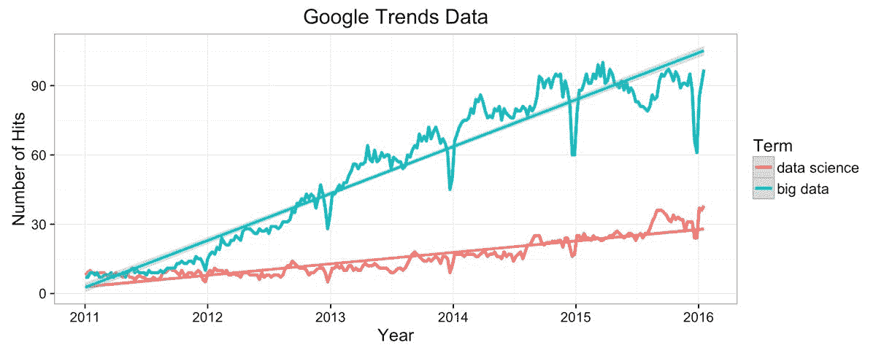
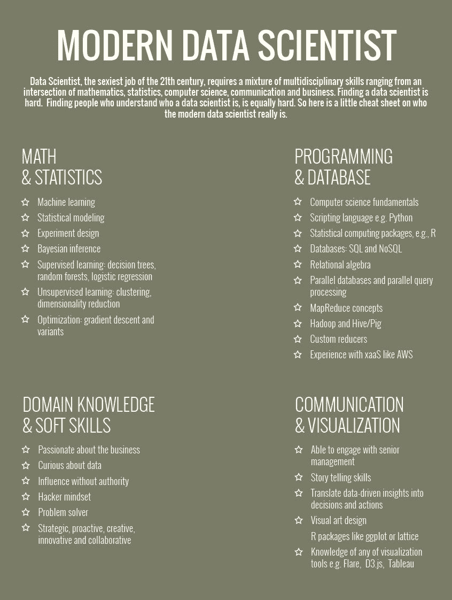
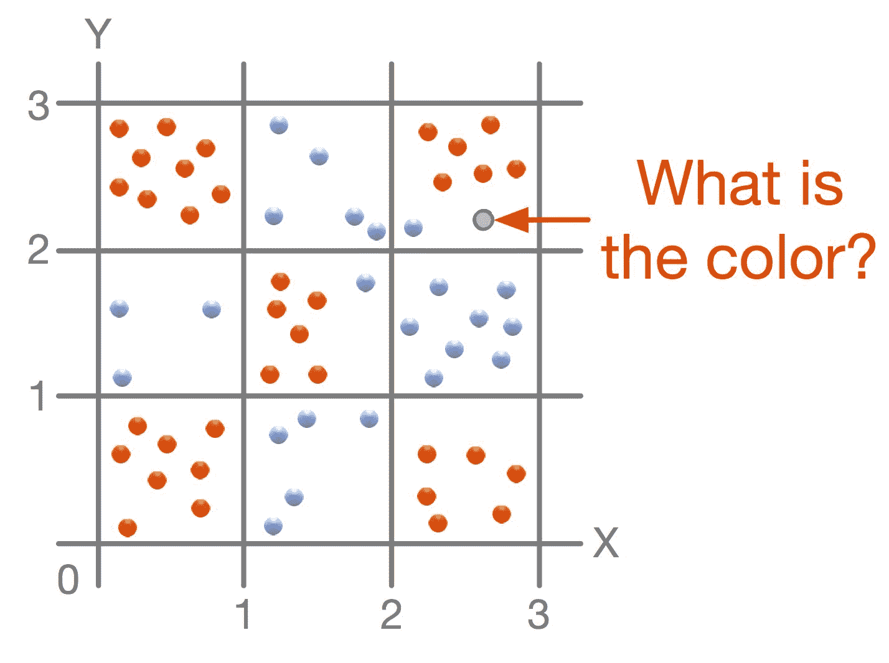
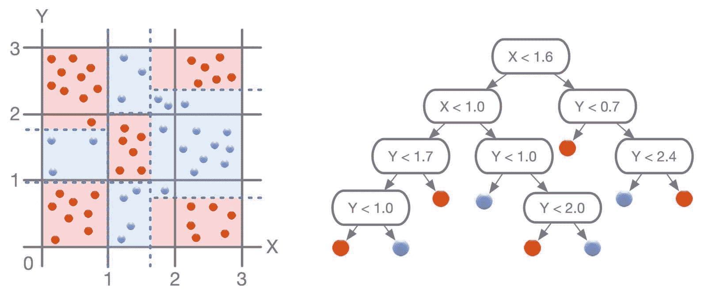
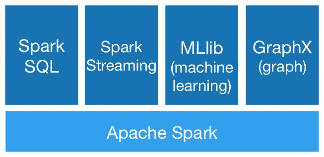
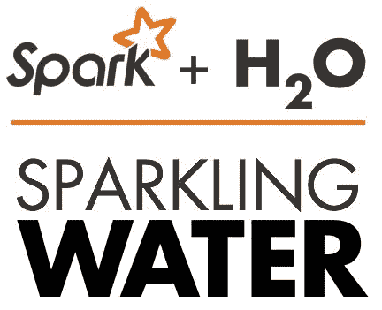
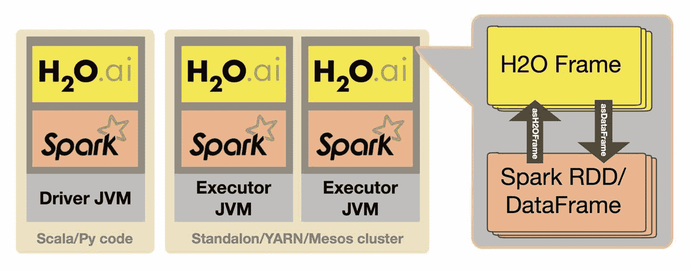
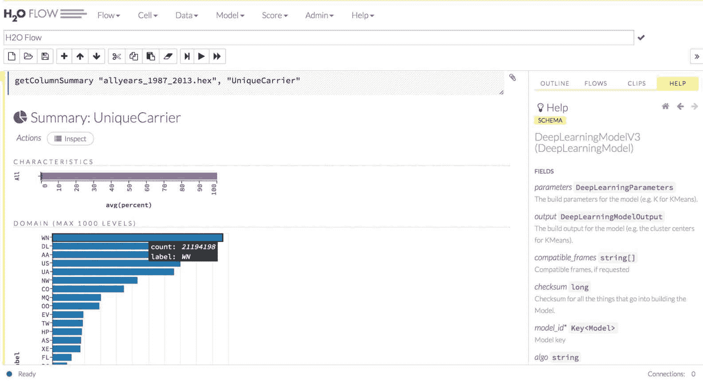

# 第一章：大规模机器学习和 Spark 简介

"信息是 21 世纪的石油，分析是内燃机。"

--彼得·桑德加德，高德纳研究

到 2018 年，预计公司将在大数据相关项目上花费 1140 亿美元，比 2013 年增长了大约 300%（[`www.capgemini-consulting.com/resource-file-access/resource/pdf/big_data_pov_03-02-15.pdf`](https://www.capgemini-consulting.com/resource-file-access/resource/pdf/big_data_pov_03-02-15.pdf)）。支出增加的很大程度上是由于正在创建的数据量以及我们如何更好地利用分布式文件系统（如 Hadoop）来存储这些数据。

然而，收集数据只是一半的战斗；另一半涉及数据提取、转换和加载到计算系统中，利用现代计算机的能力应用各种数学方法，以了解数据和模式，并提取有用信息以做出相关决策。在过去几年里，整个数据工作流程得到了提升，不仅增加了计算能力并提供易于访问和可扩展的云服务（例如，Amazon AWS，Microsoft Azure 和 Heroku），还有一些工具和库，帮助轻松管理、控制和扩展基础设施并构建应用程序。计算能力的增长还有助于处理更大量的数据，并应用以前无法应用的算法。最后，各种计算昂贵的统计或机器学习算法开始帮助从数据中提取信息。

最早被广泛采用的大数据技术之一是 Hadoop，它允许通过将中间结果保存在磁盘上进行 MapReduce 计算。然而，它仍然缺乏适当的大数据工具来进行信息提取。然而，Hadoop 只是一个开始。随着机器内存的增长，出现了新的内存计算框架，它们也开始提供基本支持进行数据分析和建模，例如，SystemML 或 Spark 的 Spark ML 和 Flink 的 FlinkML。这些框架只是冰山一角-大数据生态系统中还有很多，它在不断发展，因为数据量不断增长，需要新的大数据算法和处理方法。例如，物联网代表了一个新的领域，它从各种来源产生大量的流数据（例如，家庭安全系统，Alexa Echo 或重要传感器），不仅带来了从数据中挖掘有用信息的无限潜力，还需要新的数据处理和建模方法。

然而，在本章中，我们将从头开始解释以下主题：

+   数据科学家的基本工作任务

+   分布环境中大数据计算的方面

+   大数据生态系统

+   Spark 及其机器学习支持

# 数据科学

找到数据科学的统一定义，就像品尝葡萄酒并在朋友中比较口味一样-每个人都有自己的定义，没有一个描述比其他更准确。然而，在其核心，数据科学是关于对数据提出智能问题并获得对关键利益相关者有意义的智能答案的艺术。不幸的是，相反的也是真的-对数据提出糟糕的问题会得到糟糕的答案！因此，仔细制定问题是从数据中提取有价值见解的关键。因此，公司现在正在聘请数据科学家来帮助制定并提出这些问题。



图 1 - 大数据和数据科学的增长谷歌趋势

# 21 世纪最性感的角色-数据科学家？

起初，很容易对典型的数据科学家的形象有一个刻板印象：T 恤，运动裤，厚框眼镜，正在用 IntelliJ 调试一段代码……你懂的。除了审美外，数据科学家的一些特质是什么？我们最喜欢的一张海报描述了这个角色，如下图所示：



图 2 - 什么是数据科学家？

数学、统计学和计算机科学的一般知识是必备的，但我们在从业者中看到的一个陷阱与理解业务问题有关，这又回到了对数据提出智能问题。无法再强调：对数据提出更多智能问题取决于数据科学家对业务问题和数据限制的理解；没有这种基本理解，即使是最智能的算法也无法基于摇摇欲坠的基础得出坚实的结论。

# 一个数据科学家的一天

这可能会让你们中的一些人感到震惊——成为一名数据科学家不仅仅是阅读学术论文、研究新工具和模型构建直到清晨，靠浓缩咖啡提神；事实上，这只是数据科学家真正*玩耍*的时间的一小部分（然而，对于每个人来说，咖啡因的部分是 100%真实的）！然而，大部分时间都是在开会中度过的，更好地了解业务问题，分析数据以了解其限制（放心，本书将让您接触到大量不同的特征工程或特征提取任务），以及如何最好地向非数据科学人员呈现发现。这就是真正的*香肠制作*过程所在，最优秀的数据科学家是那些热爱这个过程的人，因为他们更多地了解了成功的要求和基准。事实上，我们可以写一本全新的书来描述这个过程的始终！

那么，关于数据的提问涉及什么（和谁）？有时，这是将数据保存到关系数据库中，并运行 SQL 查询以找到数据的见解的过程：“对于购买了这种特定产品的数百万用户，还购买了哪 3 种其他产品？”其他时候，问题更复杂，比如，“鉴于一部电影的评论，这是一个积极的还是消极的评论？”本书主要关注复杂的问题，比如后者。回答这些类型的问题是企业从其大数据项目中真正获得最大影响的地方，也是我们看到新兴技术大量涌现，旨在使这种问答系统更容易，功能更多。

一些最受欢迎的开源框架，旨在帮助回答数据问题，包括 R、Python、Julia 和 Octave，所有这些框架在小型（X < 100 GB）数据集上表现得相当不错。在这一点上，值得停下来指出大数据与小数据之间的明显区别。我们办公室的一般经验法则如下：

*如果您可以使用 Excel 打开数据集，那么您正在处理小数据。*

# 处理大数据

当所讨论的数据集如此庞大，以至于无法适应单台计算机的内存，并且必须分布在大型计算集群中的多个节点上时，会发生什么？难道我们不能简单地重写一些 R 代码，例如，扩展它以适应多于单节点的计算？如果事情只是那么简单就好了！有许多原因使得算法扩展到更多机器变得困难。想象一个简单的例子，一个文件包含一个名单：

```scala
B
D
X
A
D
A
```

我们想要计算文件中各个单词的出现次数。如果文件适合在一台机器上，您可以轻松地使用 Unix 工具`sort`和`uniq`来计算出现次数：

```scala
bash> sort file | uniq -c
```

输出如下所示：

```scala
2 A
1 B
1 D
1 X
```

然而，如果文件很大并分布在多台机器上，就需要采用略有不同的计算策略。例如，计算每个适合内存的文件部分中各个单词的出现次数，并将结果合并在一起。因此，即使是简单的任务，比如在分布式环境中计算名称的出现次数，也会变得更加复杂。

# 使用分布式环境的机器学习算法

机器学习算法将简单的任务组合成复杂的模式，在分布式环境中更加复杂。例如，让我们以简单的决策树算法为例。这个特定的算法创建一个二叉树，试图拟合训练数据并最小化预测错误。然而，为了做到这一点，它必须决定将每个数据点发送到树的哪个分支（不用担心，我们将在本书的后面介绍这个算法的工作原理以及一些非常有用的参数）。让我们用一个简单的例子来演示：



图 3 - 覆盖 2D 空间的红色和蓝色数据点的示例。

考虑前面图中描述的情况。一个二维棋盘，上面有许多点涂成两种颜色：红色和蓝色。决策树的目标是学习和概括数据的形状，并帮助决定一个新点的颜色。在我们的例子中，我们很容易看出这些点几乎遵循着象棋盘的模式。然而，算法必须自己找出结构。它首先要找到一个垂直或水平线的最佳位置，这条线可以将红点与蓝点分开。

找到的决策存储在树根中，并且步骤递归地应用在两个分区上。当分区中只有一个点时，算法结束：



图 4 - 最终的决策树及其预测在原始点空间中的投影。

# 将数据分割成多台机器

现在，让我们假设点的数量很大，无法适应单台机器的内存。因此，我们需要多台机器，并且我们必须以这样的方式对数据进行分区，使得每台机器只包含数据的一个子集。这样，我们解决了内存问题；然而，这也意味着我们需要在机器集群中分布计算。这是与单机计算的第一个不同之处。如果您的数据适合单台机器的内存，那么很容易做出关于数据的决策，因为算法可以一次性访问所有数据，但在分布式算法的情况下，这不再成立，算法必须在访问数据方面变得“聪明”。由于我们的目标是构建一个决策树，以预测棋盘上一个新点的颜色，我们需要找出如何制作与单机上构建的树相同的树。

朴素的解决方案是构建一个基于机器边界分隔点的平凡树。但这显然是一个糟糕的解决方案，因为数据分布根本不反映颜色点。

另一个解决方案尝试在*X*和*Y*轴的方向上尝试所有可能的分割决策，并尽量在分离两种颜色时做得最好，也就是将点分成两组并最小化另一种颜色的点数。想象一下，算法正在通过线*X = 1.6*测试分割。这意味着算法必须询问集群中的每台机器报告分割机器的本地数据的结果，合并结果，并决定是否是正确的分割决策。如果找到了最佳分割，它需要通知所有机器关于决策，以记录每个点属于哪个分区。

与单机场景相比，构建决策树的分布式算法更复杂，需要一种在多台机器之间分配计算的方式。如今，随着对大型数据集分析需求的增加以及对机器群集的轻松访问，这成为了标准要求。

即使这两个简单的例子表明，对于更大的数据，需要适当的计算和分布式基础设施，包括以下内容：

+   分布式数据存储，即，如果数据无法放入单个节点，我们需要一种在多台机器上分发和处理数据的方式

+   一种处理和转换分布式数据并应用数学（和统计）算法和工作流的计算范式

+   支持持久化和重用定义的工作流和模型

+   支持在生产中部署统计模型

简而言之，我们需要一个支持常见数据科学任务的框架。这可能被认为是一个不必要的要求，因为数据科学家更喜欢使用现有工具，如 R、Weka 或 Python 的 scikit。然而，这些工具既不是为大规模分布式处理设计的，也不是为大数据的并行处理设计的。尽管有支持有限并行或分布式编程的 R 或 Python 库，但它们的主要局限是基础平台，即 R 和 Python，不是为这种数据处理和计算设计的。

# 从 Hadoop MapReduce 到 Spark

随着数据量的增长，单机工具无法满足行业需求，因此为新的数据处理方法和工具创造了空间，特别是基于最初在 Google 论文中描述的想法的 Hadoop MapReduce，*MapReduce: Simplified Data Processing on Large Clusters* ([`research.google.com/archive/mapreduce.html`](https://research.google.com/archive/mapreduce.html))。另一方面，它是一个通用框架，没有任何明确支持或库来创建机器学习工作流。经典 MapReduce 的另一个局限是，在计算过程中执行了许多磁盘 I/O 操作，而没有从机器内存中受益。

正如您所见，存在多种现有的机器学习工具和分布式平台，但没有一个完全匹配于在大数据和分布式环境中执行机器学习任务。所有这些说法为 Apache Spark 打开了大门。

进入房间，Apache Spark！


Apache Spark 项目于 2010 年在加州大学伯克利分校 AMP 实验室（算法、机器、人）创建，其目标是速度、易用性和高级分析。Spark 与 Hadoop 等其他分布式框架的一个关键区别是，数据集可以缓存在内存中，这非常适合机器学习，因为它的迭代性质（稍后会详细介绍！）以及数据科学家经常多次访问相同的数据。

Spark 可以以多种方式运行，例如以下方式：

+   **本地模式：**这涉及在单个主机上执行的单个**Java 虚拟机**（**JVM**）

+   **独立的 Spark 集群：**这涉及多个主机上的多个 JVM

+   **通过资源管理器，如 Yarn/Mesos：**这种应用部署是由资源管理器驱动的，它控制节点、应用程序、分发和部署的分配

# 什么是 Databricks？

如果您了解 Spark 项目，那么很可能您也听说过一个名为*Databricks*的公司。然而，您可能不知道 Databricks 和 Spark 项目之间的关系。简而言之，Databricks 是由 Apache Spark 项目的创建者成立的，并占据了 Spark 项目超过 75%的代码库。除了在开发方面对 Spark 项目有着巨大的影响力之外，Databricks 还为开发人员、管理员、培训师和分析师提供各种 Spark 认证。然而，Databricks 并不是代码库的唯一主要贡献者；像 IBM、Cloudera 和微软这样的公司也积极参与 Apache Spark 的开发。

另外，Databricks 还组织了 Spark Summit（在欧洲和美国举办），这是首屈一指的 Spark 会议，也是了解项目最新发展以及其他人如何在其生态系统中使用 Spark 的绝佳场所。

在本书中，我们将提供推荐的链接，这些链接每天都会提供很好的见解，同时也会介绍关于新版本 Spark 的重要变化。其中最好的资源之一是 Databricks 博客，该博客不断更新着优质内容。一定要定期查看[`databricks.com/blog`](https://databricks.com/blog)。

此外，这里还有一个链接，可以查看过去的 Spark Summit 讲座，可能会对您有所帮助：

[`slideshare.net/databricks`](http://slideshare.net/databricks).

# 盒子里

那么，您已经下载了最新版本的 Spark（取决于您计划如何启动 Spark），并运行了标准的*Hello, World!*示例....现在呢？

Spark 配备了五个库，可以单独使用，也可以根据我们要解决的任务一起使用。请注意，在本书中，我们计划使用各种不同的库，都在同一个应用程序中，以便您能最大程度地接触 Spark 平台，并更好地了解每个库的优势（和局限性）。这五个库如下：

+   **核心**：这是 Spark 的核心基础设施，提供了用于表示和存储数据的原语，称为**弹性分布式数据集**（**RDDs**），并使用任务和作业来操作数据。

+   **SQL**：该库通过引入 DataFrames 和 SQL 来提供用户友好的 API，以操作存储的数据。

+   **MLlib（机器学习库）**：这是 Spark 自己的机器学习库，其中包含了内部开发的算法，可以在 Spark 应用程序中使用。

+   **Graphx**：用于图形和图形计算；我们将在后面的章节中深入探讨这个特定的库。

+   **Streaming**：该库允许从各种来源实时流式传输数据，例如 Kafka、Twitter、Flume 和 TCP 套接字等。本书中许多应用程序将利用 MLlib 和 Streaming 库来构建我们的应用程序。



Spark 平台也可以通过第三方软件包进行扩展。例如，支持读取 CSV 或 Avro 文件，与 Redshift 集成以及 Sparkling Water，它封装了 H2O 机器学习库。

# 介绍 H2O.ai

H2O 是一个开源的机器学习平台，与 Spark 非常兼容；事实上，它是最早被认定为“在 Spark 上认证”的第三方软件包之一。



Sparkling Water（H2O + Spark）是 H2O 在 Spark 项目中集成其平台的一部分，它将 H2O 的机器学习能力与 Spark 的所有功能结合在一起。这意味着用户可以在 Spark RDD/DataFrame 上运行 H2O 算法，用于探索和部署。这是可能的，因为 H2O 和 Spark 共享相同的 JVM，这允许在两个平台之间无缝切换。H2O 将数据存储在 H2O 框架中，这是您的数据集的列压缩表示，可以从 Spark RDD 和/或 DataFrame 创建。在本书的大部分内容中，我们将引用 Spark 的 MLlib 库和 H2O 平台的算法，展示如何使用这两个库来为给定任务获得尽可能好的结果。

以下是 Sparkling Water 配备的功能摘要：

+   在 Spark 工作流中使用 H2O 算法

+   在 Spark 和 H2O 数据结构之间的转换

+   使用 Spark RDD 和/或 DataFrame 作为 H2O 算法的输入

+   将 H2O 框架用作 MLlib 算法的输入（在进行特征工程时会很方便）

+   Sparkling Water 应用程序在 Spark 顶部的透明执行（例如，我们可以在 Spark 流中运行 Sparkling Water 应用程序）

+   探索 Spark 数据的 H2O 用户界面

# Sparkling Water 的设计

Sparkling Water 被设计为可执行的常规 Spark 应用程序。因此，它在提交应用程序后在 Spark 执行器内启动。此时，H2O 启动服务，包括分布式键值（K/V）存储和内存管理器，并将它们编排成一个云。创建的云的拓扑结构遵循底层 Spark 集群的拓扑结构。

如前所述，Sparkling Water 可以在不同类型的 RDD/DataFrame 和 H2O 框架之间进行转换，反之亦然。当从 hex 框架转换为 RDD 时，会在 hex 框架周围创建一个包装器，以提供类似 RDD 的 API。在这种情况下，数据不会被复制，而是直接从底层的 hex 框架提供。从 RDD/DataFrame 转换为 H2O 框架需要数据复制，因为它将数据从 Spark 转换为 H2O 特定的存储。但是，存储在 H2O 框架中的数据被大量压缩，不再需要作为 RDD 保留：



Sparkling Water 和 Spark 之间的数据共享

# H2O 和 Spark 的 MLlib 有什么区别？

如前所述，MLlib 是使用 Spark 构建的流行机器学习算法库。毫不奇怪，H2O 和 MLlib 共享许多相同的算法，但它们在实现和功能上有所不同。H2O 的一个非常方便的功能是允许用户可视化其数据并执行特征工程任务，我们将在后面的章节中深入介绍。数据的可视化是通过一个友好的网络 GUI 完成的，并允许用户在代码 shell 和笔记本友好的环境之间无缝切换。以下是 H2O 笔记本的示例 - 称为 *Flow* - 您很快将熟悉的：



另一个很好的补充是，H2O 允许数据科学家对其算法附带的许多超参数进行网格搜索。网格搜索是一种优化算法的所有超参数的方法，使模型配置更加容易。通常，很难知道要更改哪些超参数以及如何更改它们；网格搜索允许我们同时探索许多超参数，测量输出，并根据我们的质量要求帮助选择最佳模型。H2O 网格搜索可以与模型交叉验证和各种停止标准结合使用，从而产生高级策略，例如*从巨大的参数超空间中选择 1000 个随机参数，并找到可以在两分钟内训练且 AUC 大于 0.7 的最佳模型*

# 数据整理

问题的原始数据通常来自多个来源，格式不同且通常不兼容。Spark 编程模型的美妙之处在于其能够定义数据操作，处理传入的数据并将其转换为常规形式，以便用于进一步的特征工程和模型构建。这个过程通常被称为数据整理，这是数据科学项目中取得胜利的关键。我们故意将这一部分简短，因为展示数据整理的力量和必要性最好的方式是通过示例。所以，放心吧；在这本书中，我们有很多实践要做，重点是这个基本过程。

# 数据科学-一个迭代的过程

很多大数据项目的流程是迭代的，这意味着不断地测试新的想法，包括新的特征，调整各种超参数等等，态度是“快速失败”。这些项目的最终结果通常是一个能够回答提出的问题的模型。请注意，我们没有说*准确地*回答提出的问题！如今许多数据科学家的一个缺陷是他们无法将模型泛化到新数据，这意味着他们已经过度拟合了数据，以至于当给出新数据时，模型会提供糟糕的结果。准确性极大地取决于任务，并且通常由业务需求决定，同时进行一些敏感性分析以权衡模型结果的成本效益。然而，在本书中，我们将介绍一些标准的准确性度量，以便您可以比较各种模型，看看对模型的更改如何影响结果。

H2O 经常在美国和欧洲举办见面会，并邀请其他人参加机器学习见面会。每个见面会或会议的幻灯片都可以在 SlideShare（[`www.slideshare.com/0xdata`](http://www.slideshare.com/0xdata)）或 YouTube 上找到。这两个网站不仅是关于机器学习和统计的重要信息来源，也是关于分布式系统和计算的重要信息来源。例如，其中一个最有趣的演示重点介绍了“数据科学家工作中的前 10 个陷阱”（[`www.slideshare.net/0xdata/h2o-world-top-10-data-science-pitfalls-mark-landry`](http://www.slideshare.net/0xdata/h2o-world-top-10-data-science-pitfalls-mark-landry)）。

# 总结

在本章中，我们想要简要地让您了解数据科学家的生活，这意味着什么，以及数据科学家经常面临的一些挑战。鉴于这些挑战，我们认为 Apache Spark 项目理想地定位于帮助解决这些主题，从数据摄入和特征提取/创建到模型构建和部署。我们故意将本章保持简短，言辞轻松，因为我们认为通过示例和不同的用例来工作是比抽象地和冗长地谈论某个数据科学主题更好的利用时间。在本书的其余部分，我们将专注于这个过程，同时给出最佳实践建议和推荐阅读，以供希望学习更多的用户参考。请记住，在着手进行下一个数据科学项目之前，一定要在前期清晰地定义问题，这样您就可以向数据提出一个明智的问题，并（希望）得到一个明智的答案！

一个关于数据科学的很棒的网站是 KDnuggets（[`www.kdnuggets.com`](http://www.kdnuggets.com)）。这里有一篇关于所有数据科学家必须学习的语言的好文章，以便取得成功（[`www.kdnuggets.com/2015/09/one-language-data-scientist-must-master.html`](http://www.kdnuggets.com/2015/09/one-language-data-scientist-must-master.html)）。
