# 第二章：探测暗物质 - 弥散子粒子

真或假？积极或消极？通过还是不通过？用户点击广告与不点击广告？如果你以前曾经问过/遇到过这些问题，那么你已经熟悉*二元分类*的概念。

在其核心，二元分类 - 也称为*二项分类* - 试图使用分类规则将一组元素分类为两个不同的组，而在我们的情况下，可以是一个机器学习算法。本章将展示如何在 Spark 和大数据的背景下处理这个问题。我们将解释和演示：

+   Spark MLlib 二元分类模型包括决策树、随机森林和梯度提升机

+   H2O 中的二元分类支持

+   在参数的超空间中寻找最佳模型

+   二项模型的评估指标

# Type I 与 Type II 错误

二元分类器具有直观的解释，因为它们试图将数据点分成两组。这听起来很简单，但我们需要一些衡量这种分离质量的概念。此外，二元分类问题的一个重要特征是，通常一个标签组的比例与另一个标签组的比例可能不成比例。这意味着数据集可能在一个标签方面不平衡，这需要数据科学家仔细解释。

例如，假设我们试图在 1500 万人口中检测特定罕见疾病的存在，并且我们发现 - 使用人口的大子集 - 只有 10,000 或 1 千万人实际上携带疾病。如果不考虑这种巨大的不成比例，最天真的算法会简单地猜测剩下的 500 万人中“没有疾病存在”，仅仅因为子集中有 0.1%的人携带疾病。假设在剩下的 500 万人中，同样的比例，0.1%，携带疾病，那么这 5000 人将无法被正确诊断，因为天真的算法会简单地猜测没有人携带疾病。这种情况下，二元分类所带来的错误的*成本*是需要考虑的一个重要因素，这与所提出的问题有关。

考虑到我们只处理这种类型问题的两种结果，我们可以创建一个二维表示可能的不同类型错误的表示。保持我们之前的例子，即携带/不携带疾病的人，我们可以将我们的分类规则的结果考虑如下：

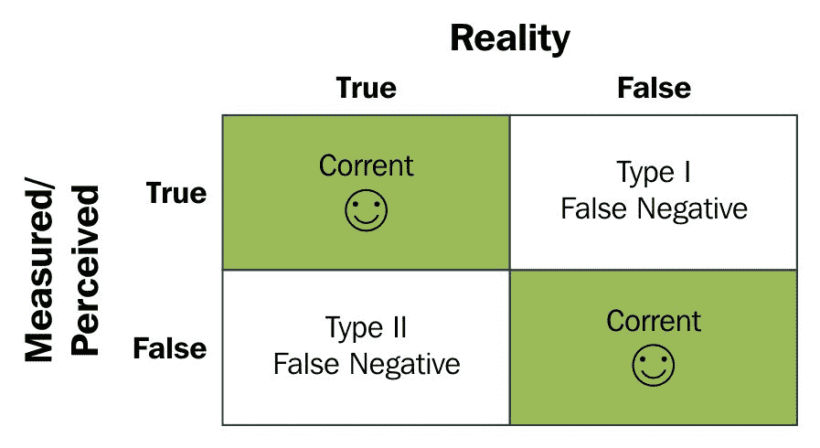

图 1 - 预测和实际值之间的关系

从上表中可以看出，绿色区域代表我们在个体中*正确*预测疾病的存在/不存在，而白色区域代表我们的预测是错误的。这些错误的预测分为两类，称为**Type I**和**Type II**错误：

+   **Type I 错误**：当我们拒绝零假设（即一个人没有携带疾病），而实际上，实际上是真的

+   **Type II 错误**：当我们预测个体携带疾病时，实际上个体并没有携带疾病

显然，这两种错误都不好，但在实践中，有些错误比其他错误更可接受。

考虑这样一种情况，即我们的模型产生的 II 型错误明显多于 I 型错误；在这种情况下，我们的模型会预测患病的人数比实际上更多 - 保守的方法可能比我们未能识别疾病存在的 II 型错误更为*可接受*。确定每种错误的*成本*是所提出的问题的函数，这是数据科学家必须考虑的事情。在我们建立第一个尝试预测希格斯玻色子粒子存在/不存在的二元分类模型之后，我们将重新讨论错误和模型质量的一些其他指标。

# 寻找希格斯玻色子粒子

2012 年 7 月 4 日，来自瑞士日内瓦的欧洲 CERN 实验室的科学家们提出了强有力的证据，证明了他们认为是希格斯玻色子的粒子，有时被称为*上帝粒子*。为什么这一发现如此有意义和重要？正如知名物理学家和作家迈克·卡库所写：

"在量子物理学中，是一种类似希格斯的粒子引发了宇宙大爆炸（即大爆炸）。换句话说，我们周围看到的一切，包括星系、恒星、行星和我们自己，都归功于希格斯玻色子。"

用通俗的话来说，希格斯玻色子是赋予物质质量的粒子，并为地球最初的形成提供了可能的解释，因此在主流媒体渠道中备受欢迎。

# LHC 和数据生成

为了检测希格斯玻色子的存在，科学家们建造了人造最大的机器，称为日内瓦附近的**大型强子对撞机**（**LHC**）。LHC 是一个环形隧道，长 27 公里（相当于伦敦地铁的环线），位于地下 100 米。

通过这条隧道，亚原子粒子在磁铁的帮助下以接近光速的速度相反方向发射。一旦达到临界速度，粒子就被放在碰撞轨道上，探测器监视和记录碰撞。有数以百万计的碰撞和亚碰撞！ - 而由此产生的*粒子碎片*有望检测到希格斯玻色子的存在。

# 希格斯玻色子的理论

相当长一段时间以来，物理学家已经知道一些基本粒子具有质量，这与标准模型的数学相矛盾，该模型规定这些粒子应该是无质量的。在 20 世纪 60 年代，彼得·希格斯和他的同事们通过研究大爆炸后的宇宙挑战了这个质量难题。当时，人们普遍认为粒子应该被视为量子果冻中的涟漪，而不是彼此弹来弹去的小台球。希格斯认为，在这个早期时期，所有的粒子果冻都像水一样稀薄；但随着宇宙开始*冷却*，一个粒子果冻，最初被称为*希格斯场*，开始凝结变厚。因此，其他粒子果冻在与希格斯场相互作用时，由于惯性而被吸引；根据艾萨克·牛顿爵士的说法，任何具有惯性的粒子都应该含有质量。这种机制解释了标准模型中的粒子如何获得质量 - 起初是无质量的。因此，每个粒子获得的质量量与其感受到希格斯场影响的强度成正比。

文章[`plus.maths.org/content/particle-hunting-lhc-higgs-boson`](https://plus.maths.org/content/particle-hunting-lhc-higgs-boson)是对好奇读者的一个很好的信息来源。

# 测量希格斯玻色子

测试这个理论回到了粒子果冻波纹的最初概念，特别是希格斯果冻，它 a）可以波动，b）在实验中会类似于一个粒子：臭名昭著的希格斯玻色子。那么科学家们如何利用 LHC 检测这种波纹呢？

为了监测碰撞和碰撞后的结果，科学家们设置了探测器，它们就像三维数字摄像机，测量来自碰撞的粒子轨迹。这些轨迹的属性 - 即它们在磁场中的弯曲程度 - 被用来推断生成它们的粒子的各种属性；一个非常常见的可以测量的属性是电荷，据信希格斯玻色子存在于 120 到 125 吉电子伏特之间。也就是说，如果探测器发现一个电荷存在于这两个范围之间的事件，这将表明可能存在一个新的粒子，这可能是希格斯玻色子的迹象。

# 数据集

2012 年，研究人员向科学界发布了他们的研究结果，随后公开了 LHC 实验的数据，他们观察到并确定了一种信号，这种信号表明存在希格斯玻色子粒子。然而，在积极的发现中存在大量的背景噪音，这导致数据集内部不平衡。我们作为数据科学家的任务是构建一个机器学习模型，能够准确地从背景噪音中识别出希格斯玻色子粒子。你现在应该考虑这个问题的表述方式，这可能表明这是一个二元分类问题（即，这个例子是希格斯玻色子还是背景噪音？）。

您可以从[`archive.ics.uci.edu/ml/datasets/HIGGS`](https://archive.ics.uci.edu/ml/datasets/HIGGS)下载数据集，或者使用本章的`bin`文件夹中的`getdata.sh`脚本。

这个文件有 2.6 吉字节（未压缩），包含了 1100 万个被标记为 0 - 背景噪音和 1 - 希格斯玻色子的例子。首先，您需要解压缩这个文件，然后我们将开始将数据加载到 Spark 中进行处理和分析。数据集总共有 29 个字段：

+   字段 1：类别标签（1 = 希格斯玻色子信号，2 = 背景噪音）

+   字段 2-22：来自碰撞探测器的 21 个“低级”特征

+   字段 23-29：由粒子物理学家手工提取的七个“高级”特征，用于帮助将粒子分类到适当的类别（希格斯或背景噪音）

在本章的后面，我们将介绍一个**深度神经网络**（**DNN**）的例子，它将尝试通过非线性转换层来*学习*这些手工提取的特征。

请注意，为了本章的目的，我们将使用数据的一个子集，即前 100,000 行，但我们展示的所有代码也适用于原始数据集。

# Spark 启动和数据加载

现在是时候启动一个 Spark 集群了，这将为我们提供 Spark 的所有功能，同时还允许我们使用 H2O 算法和可视化我们的数据。和往常一样，我们必须从[`spark.apache.org/downloads.html`](http://spark.apache.org/downloads.html)下载 Spark 2.1 分发版，并在执行之前声明执行环境。例如，如果您从 Spark 下载页面下载了`spark-2.1.1-bin-hadoop2.6.tgz`，您可以按照以下方式准备环境：

```scala
tar -xvf spark-2.1.1-bin-hadoop2.6.tgz 
export SPARK_HOME="$(pwd)/spark-2.1.1-bin-hadoop2.6 
```

当环境准备好后，我们可以使用 Sparkling Water 包和本书包启动交互式 Spark shell：

```scala
export SPARKLING_WATER_VERSION="2.1.12"
export SPARK_PACKAGES=\
"ai.h2o:sparkling-water-core_2.11:${SPARKLING_WATER_VERSION},\
ai.h2o:sparkling-water-repl_2.11:${SPARKLING_WATER_VERSION},\
ai.h2o:sparkling-water-ml_2.11:${SPARKLING_WATER_VERSION},\
com.packtpub:mastering-ml-w-spark-utils:1.0.0"

$SPARK_HOME/bin/spark-shell \      

            --master 'local[*]' \
            --driver-memory 4g \
            --executor-memory 4g \
            --packages "$SPARK_PACKAGES"

```

H2O.ai 一直在与 Spark 项目的最新版本保持同步，以匹配 Sparkling Water 的版本。本书使用 Spark 2.1.1 分发版和 Sparkling Water 2.1.12。您可以在[`h2o.ai/download/`](http://h2o.ai/download/)找到适用于您版本 Spark 的最新版本 Sparkling Water。

本案例使用提供的 Spark shell，该 shell 下载并使用 Sparkling Water 版本 2.1.12 的 Spark 软件包。这些软件包由 Maven 坐标标识 - 在本例中，`ai.h2o`代表组织 ID，`sparkling-water-core`标识 Sparkling Water 实现（对于 Scala 2.11，因为 Scala 版本不兼容），最后，`2.1.12`是软件包的版本。此外，我们正在使用本书特定的软件包，该软件包提供了一些实用工具。

所有已发布的 Sparkling Water 版本列表也可以在 Maven 中央仓库上找到：[`search.maven.org`](http://search.maven.org)

该命令在本地模式下启动 Spark - 也就是说，Spark 集群在您的计算机上运行一个单节点。假设您成功完成了所有这些操作，您应该会看到标准的 Spark shell 输出，就像这样：

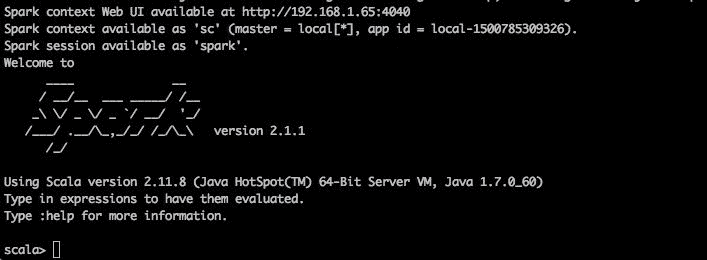

图 2 - 注意 shell 启动时显示的 Spark 版本。

提供的书籍源代码为每一章提供了启动 Spark 环境的命令；对于本章，您可以在`chapter2/bin`文件夹中找到它。

Spark shell 是一个基于 Scala 的控制台应用程序，它接受 Scala 代码并以交互方式执行。下一步是通过导入我们将在示例中使用的软件包来准备计算环境。

```scala
import org.apache.spark.mllib 
import org.apache.spark.mllib.regression.LabeledPoint 
import org.apache.spark.mllib.linalg._ 
import org.apache.spark.mllib.linalg.distributed.RowMatrix 
import org.apache.spark.mllib.util.MLUtils 
import org.apache.spark.mllib.evaluation._ 
import org.apache.spark.mllib.tree._ 
import org.apache.spark.mllib.tree.model._ 
import org.apache.spark.rdd._ 
```

让我们首先摄取您应该已经下载的`.csv`文件，并快速计算一下我们的子集中有多少数据。在这里，请注意，代码期望数据文件夹"data"相对于当前进程的工作目录或指定的位置：

```scala
val rawData = sc.textFile(s"${sys.env.get("DATADIR").getOrElse("data")}/higgs100k.csv")
println(s"Number of rows: ${rawData.count}") 

```

输出如下：

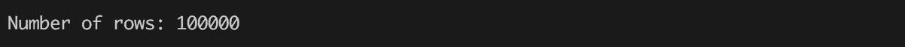

您可以观察到执行命令`sc.textFile(...)`几乎没有花费时间并立即返回，而执行`rawData.count`花费了大部分时间。这正好展示了 Spark **转换**和**操作**之间的区别。按设计，Spark 采用**惰性评估** - 这意味着如果调用了一个转换，Spark 会直接记录它到所谓的**执行图/计划**中。这非常适合大数据世界，因为用户可以堆叠转换而无需等待。另一方面，操作会评估执行图 - Spark 会实例化每个记录的转换，并将其应用到先前转换的输出上。这个概念还帮助 Spark 在执行之前分析和优化执行图 - 例如，Spark 可以重新组织转换的顺序，或者决定如果它们是独立的话并行运行转换。

现在，我们定义了一个转换，它将数据加载到 Spark 数据结构`RDD[String]`中，其中包含输入数据文件的所有行。因此，让我们看一下前两行：

```scala
rawData.take(2) 
```

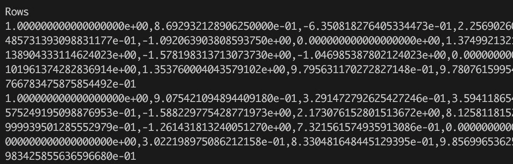

前两行包含从文件加载的原始数据。您可以看到一行由一个响应列组成，其值为 0,1（行的第一个值），其他列具有实际值。但是，这些行仍然表示为字符串，并且需要解析和转换为常规行。因此，基于对输入数据格式的了解，我们可以定义一个简单的解析器，根据逗号将输入行拆分为数字：

```scala
val data = rawData.map(line => line.split(',').map(_.toDouble)) 

```

现在我们可以提取响应列（数据集中的第一列）和表示输入特征的其余数据：

```scala
val response: RDD[Int] = data.map(row => row(0).toInt)   
val features: RDD[Vector] = data.map(line => Vectors.dense(line.slice(1, line.size))) 
```

进行这个转换之后，我们有两个 RDD：

+   一个代表响应列

+   另一个包含持有单个输入特征的数字的密集向量

接下来，让我们更详细地查看输入特征并进行一些非常基本的数据分析：

```scala
val featuresMatrix = new RowMatrix(features) 
val featuresSummary = featuresMatrix.computeColumnSummaryStatistics() 
```

我们将这个向量转换为分布式*RowMatrix*。这使我们能够执行简单的摘要统计（例如，计算均值、方差等）。

```scala

import org.apache.spark.utils.Tabulizer._ 
println(s"Higgs Features Mean Values = ${table(featuresSummary.mean, 8)}")

```

输出如下：

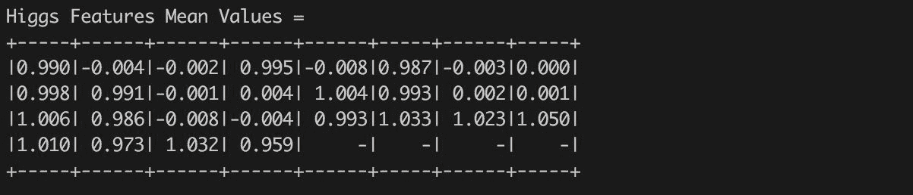

看一下以下代码：

```scala
println(s"Higgs Features Variance Values = ${table(featuresSummary.variance, 8)}") 

```

输出如下：

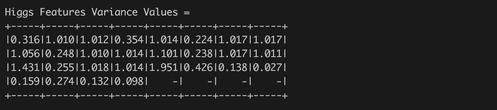

接下来，让我们更详细地探索列。我们可以直接获取每列中非零值的数量，以确定数据是密集还是稀疏。密集数据主要包含非零值，稀疏数据则相反。数据中非零值的数量与所有值的数量之间的比率代表了数据的稀疏度。稀疏度可以驱动我们选择计算方法，因为对于稀疏数据，仅迭代非零值更有效：

```scala
val nonZeros = featuresSummary.numNonzeros 
println(s"Non-zero values count per column: ${table(nonZeros, cols = 8, format = "%.0f")}") 
```

输出如下：

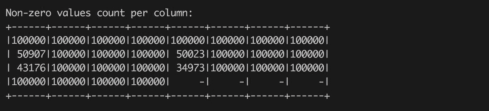

然而，该调用只是给出了所有列的非零值数量，这并不那么有趣。我们更感兴趣的是包含一些零值的列：

```scala
val numRows = featuresMatrix.numRows
 val numCols = featuresMatrix.numCols
 val colsWithZeros = nonZeros
   .toArray
   .zipWithIndex
   .filter { case (rows, idx) => rows != numRows }
 println(s"Columns with zeros:\n${table(Seq("#zeros", "column"), colsWithZeros, Map.empty[Int, String])}")
```

在这种情况下，我们通过每个值的索引增加了原始的非零向量，然后过滤掉原始矩阵中等于行数的所有值。然后我们得到：

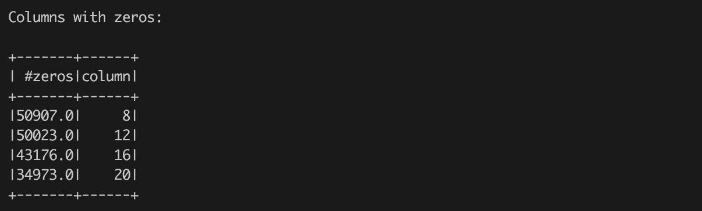

我们可以看到列 8、12、16 和 20 包含一些零数，但仍然不足以将矩阵视为稀疏。为了确认我们的观察，我们可以计算矩阵的整体稀疏度（剩余部分：矩阵不包括响应列）：

```scala
val sparsity = nonZeros.toArray.sum / (numRows * numCols)
println(f"Data sparsity: ${sparsity}%.2f") 
```

输出如下：

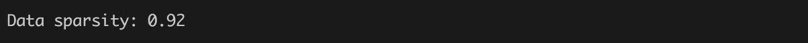

计算出的数字证实了我们之前的观察 - 输入矩阵是密集的。

现在是时候更详细地探索响应列了。作为第一步，我们通过计算响应向量中的唯一值来验证响应是否只包含值`0`和`1`：

```scala
val responseValues = response.distinct.collect
 println(s"Response values: ${responseValues.mkString(", ")}") 
```

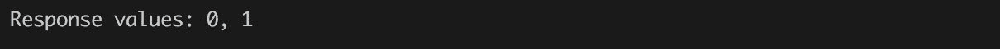

下一步是探索响应向量中标签的分布。我们可以直接通过 Spark 计算速率：

```scala
val responseDistribution = response.map(v => (v,1)).countByKey
 println(s"Response distribution:\n${table(responseDistribution)}") 
```

输出如下：

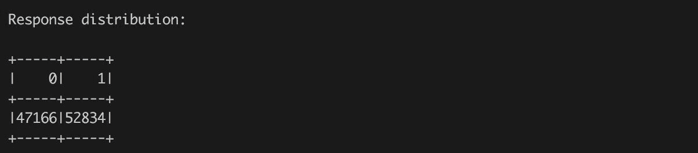

在这一步中，我们简单地将每行转换为表示行值的元组，以及表示该值在行中出现一次的`1`。拥有成对 RDDs 后，Spark 方法`countByKey`通过键聚合成对，并给我们提供了键计数的摘要。它显示数据意外地包含了略微更多代表希格斯玻色子的情况，但我们仍然可以认为响应是平衡的。

我们还可以利用 H2O 库以可视化的方式探索标签分布。为此，我们需要启动由`H2OContext`表示的 H2O 服务：

```scala
import org.apache.spark.h2o._ 
val h2oContext = H2OContext.getOrCreate(sc) 

```

该代码初始化了 H2O 库，并在 Spark 集群的每个节点上启动了 H2O 服务。它还提供了一个名为 Flow 的交互式环境，用于数据探索和模型构建。在控制台中，`h2oContext`打印出了暴露的 UI 的位置：

```scala
h2oContext: org.apache.spark.h2o.H2OContext =  
Sparkling Water Context: 
 * H2O name: sparkling-water-user-303296214 
 * number of executors: 1 
 * list of used executors: 
  (executorId, host, port) 
  ------------------------ 
  (driver,192.168.1.65,54321) 
  ------------------------ 
  Open H2O Flow in browser: http://192.168.1.65:54321 (CMD + click in Mac OSX) 
```

现在我们可以直接打开 Flow UI 地址并开始探索数据。但是，在这样做之前，我们需要将 Spark 数据发布为名为`response`的 H2O 框架：

```scala
val h2oResponse = h2oContext.asH2OFrame(response, "response")
```

如果您导入了`H2OContext`公开的隐式转换，您将能够根据赋值左侧的定义类型透明地调用转换：

例如：

```scala
import h2oContext.implicits._ 
val h2oResponse: H2OFrame = response 
```

现在是时候打开 Flow UI 了。您可以通过访问`H2OContext`报告的 URL 直接打开它，或者在 Spark shell 中键入`h2oContext.openFlow`来打开它。

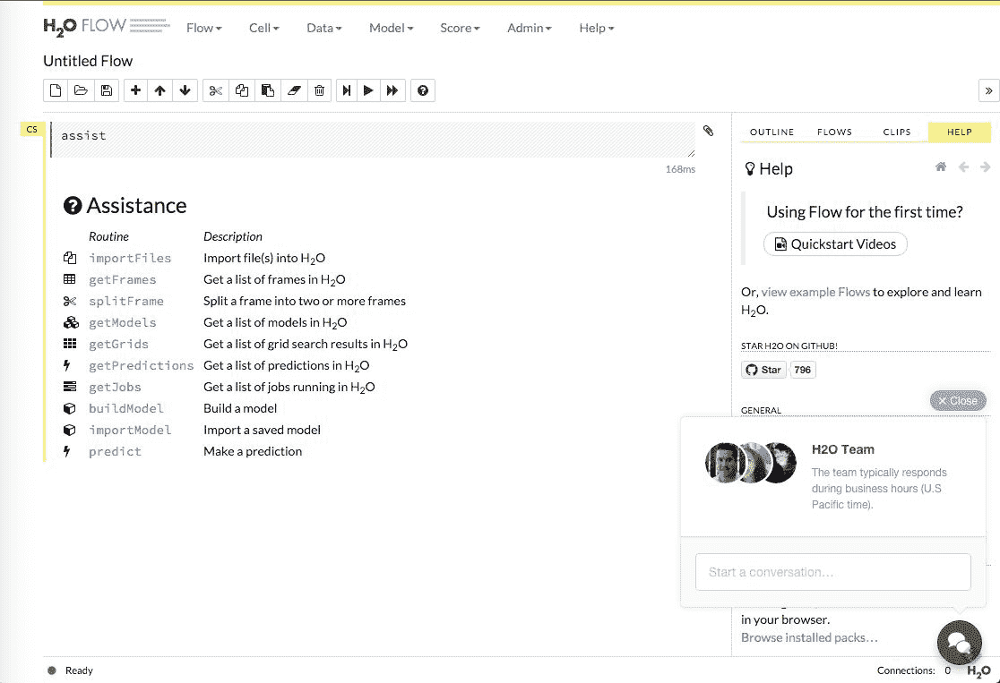

图 3 - 交互式 Flow UI

Flow UI 允许与存储的数据进行交互式工作。让我们通过在突出显示的单元格中键入`getFrames`来查看 Flow 暴露的数据：

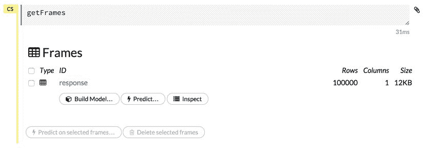

图 4 - 获取可用的 H2O 框架列表

通过点击响应字段或键入`getColumnSummary "response", "values"`，我们可以直观地确认响应列中值的分布，并看到问题略微不平衡：

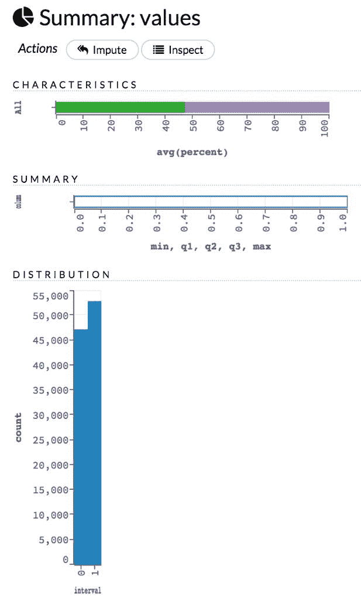

图 5 - 名为“response”的列的统计属性。

# 标记点向量

在使用 Spark MLlib 运行任何监督机器学习算法之前，我们必须将数据集转换为标记点向量，将特征映射到给定的标签/响应；标签存储为双精度，这有助于它们用于分类和回归任务。对于所有二元分类问题，标签应存储为`0`或`1`，我们从前面的摘要统计中确认了这一点对我们的例子成立。

```scala
val higgs = response.zip(features).map {  
case (response, features) =>  
LabeledPoint(response, features) } 

higgs.setName("higgs").cache() 
```

标记点向量的示例如下：

```scala
(1.0, [0.123, 0.456, 0.567, 0.678, ..., 0.789]) 
```

在前面的例子中，括号内的所有双精度数都是特征，括号外的单个数字是我们的标签。请注意，我们尚未告诉 Spark 我们正在执行分类任务而不是回归任务，这将在稍后发生。

在这个例子中，所有输入特征只包含数值，但在许多情况下，数据包含分类值或字符串数据。所有这些非数值表示都需要转换为数字，我们将在本书的后面展示。

# 数据缓存

许多机器学习算法具有迭代性质，因此需要对数据进行多次遍历。然而，默认情况下，存储在 Spark RDD 中的所有数据都是瞬时的，因为 RDD 只存储要执行的转换，而不是实际数据。这意味着每个操作都会通过执行 RDD 中存储的转换重新计算数据。

因此，Spark 提供了一种持久化数据的方式，以便我们需要对其进行迭代。Spark 还发布了几个`StorageLevels`，以允许使用各种选项存储数据：

+   `NONE`：根本不缓存

+   `MEMORY_ONLY`：仅在内存中缓存 RDD 数据

+   `DISK_ONLY`：将缓存的 RDD 数据写入磁盘并释放内存

+   `MEMORY_AND_DISK`：如果无法将数据卸载到磁盘，则在内存中缓存 RDD

+   `OFF_HEAP`：使用不属于 JVM 堆的外部内存存储

此外，Spark 为用户提供了以两种方式缓存数据的能力：*原始*（例如`MEMORY_ONLY`）和*序列化*（例如`MEMORY_ONLY_SER`）。后者使用大型内存缓冲区直接存储 RDD 的序列化内容。使用哪种取决于任务和资源。一个很好的经验法则是，如果你正在处理的数据集小于 10 吉字节，那么原始缓存优于序列化缓存。然而，一旦超过 10 吉字节的软阈值，原始缓存比序列化缓存占用更大的内存空间。

Spark 可以通过在 RDD 上调用`cache()`方法或直接通过调用带有所需持久目标的 persist 方法（例如`persist(StorageLevels.MEMORY_ONLY_SER)`）来强制缓存。有用的是 RDD 只允许我们设置存储级别一次。

决定缓存什么以及如何缓存是 Spark 魔术的一部分；然而，黄金法则是在需要多次访问 RDD 数据并根据应用程序偏好选择目标时使用缓存，尊重速度和存储。一个很棒的博客文章比这里提供的更详细，可以在以下链接找到：

[`sujee.net/2015/01/22/understanding-spark-caching/#.VpU1nJMrLdc`](http://sujee.net/2015/01/22/understanding-spark-caching/#.VpU1nJMrLdc)

缓存的 RDD 也可以通过在 H2O Flow UI 中评估带有`getRDDs`的单元格来访问：

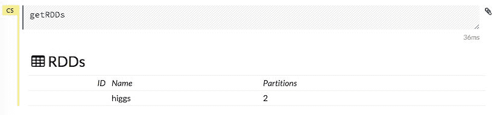

# 创建训练和测试集

与大多数监督学习任务一样，我们将创建数据集的拆分，以便在一个子集上*教*模型，然后测试其对新数据的泛化能力，以便与留出集进行比较。在本例中，我们将数据拆分为 80/20，但是拆分比例没有硬性规定，或者说 - 首先应该有多少拆分：

```scala
// Create Train & Test Splits 
val trainTestSplits = higgs.randomSplit(Array(0.8, 0.2)) 
val (trainingData, testData) = (trainTestSplits(0), trainTestSplits(1)) 
```

通过在数据集上创建 80/20 的拆分，我们随机抽取了 880 万个示例作为训练集，剩下的 220 万个作为测试集。我们也可以随机抽取另一个 80/20 的拆分，并生成一个具有相同数量示例（880 万个）但具有不同数据的新训练集。这种*硬*拆分我们原始数据集的方法引入了抽样偏差，这基本上意味着我们的模型将学会拟合训练数据，但训练数据可能不代表“现实”。鉴于我们已经使用了 1100 万个示例，这种偏差并不像我们的原始数据集只有 100 行的情况那样显著。这通常被称为模型验证的**留出法**。

您还可以使用 H2O Flow 来拆分数据：

1.  将希格斯数据发布为 H2OFrame：

```scala
val higgsHF = h2oContext.asH2OFrame(higgs.toDF, "higgsHF") 
```

1.  在 Flow UI 中使用`splitFrame`命令拆分数据（见*图 07*）。

1.  然后将结果发布回 RDD。

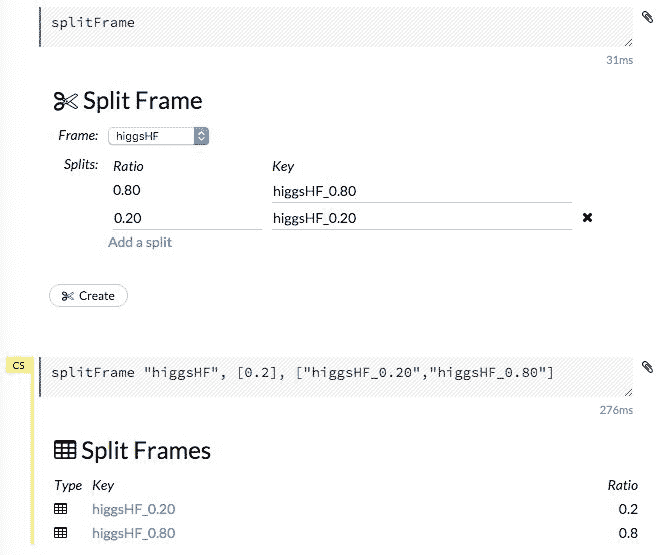

图 7 - 将希格斯数据集拆分为代表 80%和 20%数据的两个 H2O 框架。

与 Spark 的惰性评估相比，H2O 计算模型是急切的。这意味着`splitFrame`调用会立即处理数据并创建两个新框架，可以直接访问。

# 交叉验证呢？

通常，在较小的数据集的情况下，数据科学家会使用一种称为交叉验证的技术，这种技术在 Spark 中也可用。`CrossValidator`类首先将数据集分成 N 折（用户声明），每个折叠被用于训练集 N-1 次，并用于模型验证 1 次。例如，如果我们声明希望使用**5 折交叉验证**，`CrossValidator`类将创建五对（训练和测试）数据集，使用四分之四的数据集创建训练集，最后四分之一作为测试集，如下图所示。

我们的想法是，我们将看到我们的算法在不同的随机抽样数据集上的性能，以考虑我们在 80%的数据上创建训练/测试拆分时固有的抽样偏差。一个不太好泛化的模型的例子是，准确性（例如整体错误）会在不同的错误率上大幅度变化，这表明我们需要重新考虑我们的模型。

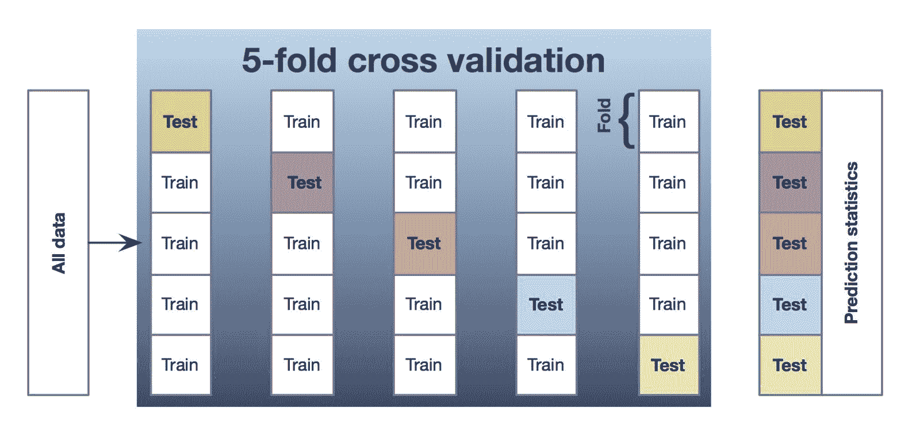

图 8 - 5 折交叉验证的概念模式。

关于应该执行多少次交叉验证并没有固定的规则，因为这些问题在很大程度上取决于所使用的数据类型、示例数量等。在某些情况下，进行极端的交叉验证是有意义的，其中 N 等于输入数据集中的数据点数。在这种情况下，**测试**集只包含一行。这种方法称为**留一法**（**LOO**）验证，计算成本更高。

一般来说，建议在模型构建过程中进行一些交叉验证（通常建议使用 5 折或 10 折交叉验证），以验证模型的质量 - 尤其是当数据集很小的时候。

# 我们的第一个模型 - 决策树

我们尝试使用决策树算法来对希格斯玻色子和背景噪音进行分类。我们故意不解释这个算法背后的直觉，因为这已经有大量支持文献供读者消化（[`www.saedsayad.com/decision_tree.htm`](http://www.saedsayad.com/decision_tree.htm), http://spark.apache.org/docs/latest/mllib-decision-tree.html）。相反，我们将专注于超参数以及如何根据特定标准/错误度量来解释模型的有效性。让我们从基本参数开始：

```scala
val numClasses = 2 
val categoricalFeaturesInfo = Map[Int, Int]() 
val impurity = "gini" 
val maxDepth = 5 
val maxBins = 10 
```

现在我们明确告诉 Spark，我们希望构建一个决策树分类器，用于区分两类。让我们更仔细地看看我们决策树的一些超参数，看看它们的含义：

`numClasses`：我们要分类多少类？在这个例子中，我们希望区分希格斯玻色子粒子和背景噪音，因此有四类：

+   `categoricalFeaturesInfo`：一种规范，声明哪些特征是分类特征，不应被视为数字（例如，邮政编码是一个常见的例子）。在这个数据集中，我们不需要担心有分类特征。

+   `杂质`：节点标签同质性的度量。目前在 Spark 中，关于分类有两种杂质度量：基尼和熵，回归有一个杂质度量：方差。

+   `maxDepth`：限制构建树的深度的停止准则。通常，更深的树会导致更准确的结果，但也会有过拟合的风险。

+   `maxBins`：树在进行分裂时考虑的箱数（考虑“值”）。通常，增加箱数允许树考虑更多的值，但也会增加计算时间。

# 基尼与熵

为了确定使用哪种杂质度量，重要的是我们先了解一些基础知识，从**信息增益**的概念开始。

在本质上，信息增益就是它听起来的样子：在两种状态之间移动时的信息增益。更准确地说，某个事件的信息增益是事件发生前后已知信息量的差异。衡量这种信息的一种常见方法是查看**熵**，可以定义为：

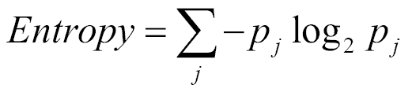

其中*p[j]*是节点上标签*j*的频率。

现在您已经了解了信息增益和熵的概念，我们可以继续了解**基尼指数**的含义（与基尼系数完全没有关联）。

**基尼指数**：是一个度量，表示如果随机选择一个元素，根据给定节点的标签分布随机分配标签，它会被错误分类的频率。

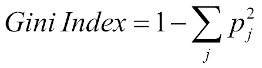

与熵的方程相比，由于没有对数计算，基尼指数的计算速度应该稍快一些，这可能是为什么它是许多其他机器学习库（包括 MLlib）的**默认**选项。

但这是否使它成为我们决策树分裂的**更好**度量？事实证明，杂质度量的选择对于单个决策树算法的性能几乎没有影响。根据谭等人在《数据挖掘导论》一书中的说法，原因是：

“...这是因为杂质度量在很大程度上是一致的 [...]. 实际上，用于修剪树的策略对最终树的影响大于杂质度量的选择。”

现在是时候在训练数据上训练我们的决策树分类器了：

```scala
val dtreeModel = DecisionTree.trainClassifier( 
trainingData,  
numClasses,  
categoricalFeaturesInfo, 
impurity,  
maxDepth,  
maxBins) 

// Show the tree 
println("Decision Tree Model:\n" + dtreeModel.toDebugString) 
```

这应该产生一个最终输出，看起来像这样（请注意，由于数据的随机分割，您的结果可能会略有不同）：

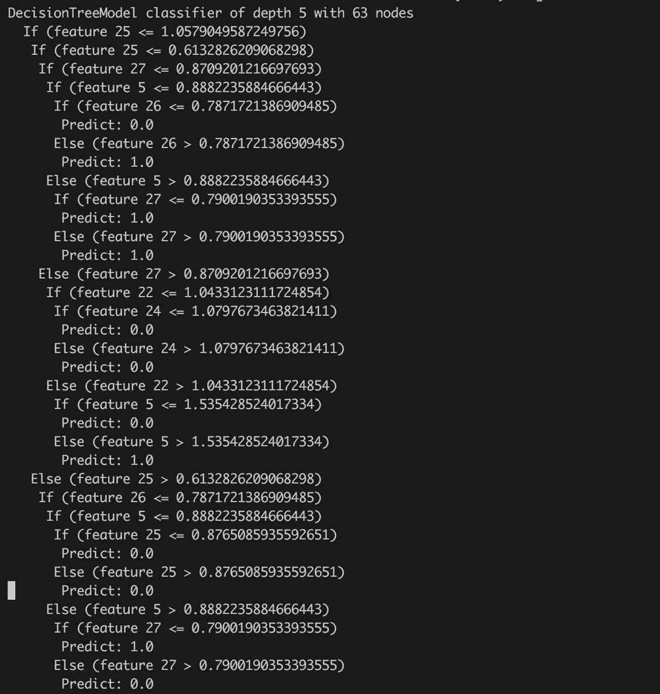

输出显示决策树的深度为`5`，有`63`个节点按层次化的决策谓词组织。让我们继续解释一下，看看前五个*决策*。它的读法是：“如果特征 25 的值小于或等于 1.0559 并且小于或等于 0.61558 并且特征 27 的值小于或等于 0.87310 并且特征 5 的值小于或等于 0.89683 并且最后，特征 22 的值小于或等于 0.76688，那么预测值为 1.0（希格斯玻色子）。但是，这五个条件必须满足才能成立。”请注意，如果最后一个条件不成立（特征 22 的值大于 0.76688），但前四个条件仍然成立，那么预测将从 1 变为 0，表示背景噪音。

现在，让我们对我们的测试数据集对模型进行评分并打印预测错误：

```scala
val treeLabelAndPreds = testData.map { point =>
   val prediction = dtreeModel.predict(point.features)
   (point.label.toInt, prediction.toInt)
 }

 val treeTestErr = treeLabelAndPreds.filter(r => r._1 != r._2).count.toDouble / testData.count()
 println(f"Tree Model: Test Error = ${treeTestErr}%.3f") 
```

输出如下：

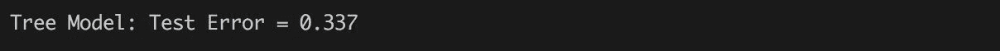

一段时间后，模型将对所有测试集数据进行评分，然后计算一个我们在前面的代码中定义的错误率。同样，你的错误率可能会略有不同，但正如我们所展示的，我们的简单决策树模型的错误率约为 33%。然而，正如你所知，我们可能会犯不同类型的错误，因此值得探索一下通过构建混淆矩阵来了解这些错误类型是什么：

```scala
val cm = treeLabelAndPreds.combineByKey( 
  createCombiner = (label: Int) => if (label == 0) (1,0) else (0,1),  
  mergeValue = (v:(Int,Int), label:Int) => if (label == 0) (v._1 +1, v._2) else (v._1, v._2 + 1), 
  mergeCombiners = (v1:(Int,Int), v2:(Int,Int)) => (v1._1 + v2._1, v1._2 + v2._2)).collect 
```

前面的代码使用了高级的 Spark 方法`combineByKey`，它允许我们将每个(K,V)对映射到一个值，这个值将代表按键操作的输出。在这种情况下，(K,V)对表示实际值 K 和预测值 V。我们通过创建一个组合器（参数`createCombiner`）将每个预测映射到一个元组 - 如果预测值为`0`，则映射为`(1,0)`；否则，映射为`(0,1)`。然后我们需要定义组合器如何接受新值以及如何合并组合器。最后，该方法产生：

```scala
cm: Array[(Int, (Int, Int))] = Array((0,(5402,4131)), (1,(2724,7846))) 
```

生成的数组包含两个元组 - 一个用于实际值`0`，另一个用于实际值`1`。每个元组包含预测`0`和`1`的数量。因此，很容易提取所有必要的内容来呈现一个漂亮的混淆矩阵。

```scala
val (tn, tp, fn, fp) = (cm(0)._2._1, cm(1)._2._2, cm(1)._2._1, cm(0)._2._2) 
println(f"""Confusion Matrix 
  |   ${0}%5d ${1}%5d  ${"Err"}%10s 
  |0  ${tn}%5d ${fp}%5d ${tn+fp}%5d ${fp.toDouble/(tn+fp)}%5.4f 
  |1  ${fn}%5d ${tp}%5d ${fn+tp}%5d ${fn.toDouble/(fn+tp)}%5.4f 
  |   ${tn+fn}%5d ${fp+tp}%5d ${tn+fp+fn+tp}%5d ${(fp+fn).toDouble/(tn+fp+fn+tp)}%5.4f 
  |""".stripMargin) 
```

该代码提取了所有真负和真正的预测，还有错过的预测和基于*图 9*模板的混淆矩阵的输出：

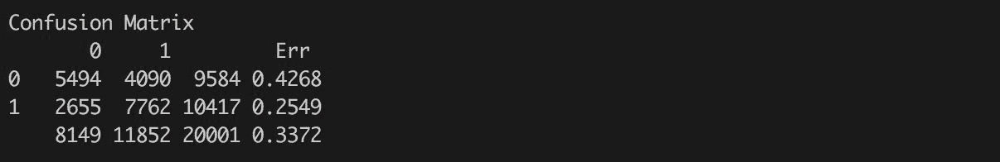

在前面的代码中，我们使用了一个强大的 Scala 特性，称为*字符串插值*：`println(f"...")`。它允许通过组合字符串输出和实际的 Scala 变量来轻松构造所需的输出。Scala 支持不同的字符串“插值器”，但最常用的是*s*和*f*。*s*插值器允许引用任何 Scala 变量甚至代码：`s"True negative: ${tn}"`。而*f*插值器是类型安全的 - 这意味着用户需要指定要显示的变量类型：`f"True negative: ${tn}%5d"` - 并引用变量`tn`作为十进制类型，并要求在五个十进制空间上打印。

回到本章的第一个例子，我们可以看到我们的模型在检测实际的玻色子粒子时出现了大部分错误。在这种情况下，代表玻色子检测的所有数据点都被错误地分类为非玻色子。然而，总体错误率非常低！这是一个很好的例子，说明总体错误率可能会对具有不平衡响应的数据集产生误导。

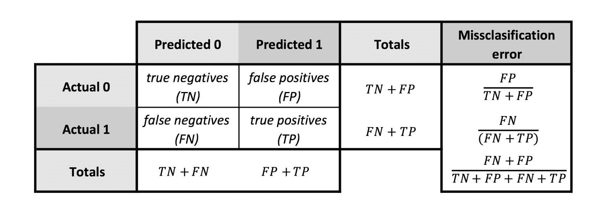

图 9 - 混淆矩阵模式。

接下来，我们将考虑另一个用于评判分类模型的建模指标，称为**曲线下面积**（受试者工作特征）**AUC**（请参见下图示例）。**受试者工作特征**（**ROC**）曲线是**真正率**与**假正率**的图形表示：

+   真正阳性率：真正阳性的总数除以真正阳性和假阴性的总和。换句话说，它是希格斯玻色子粒子的真实信号（实际标签为 1）与希格斯玻色子的所有预测信号（我们的模型预测标签为 1）的比率。该值显示在*y*轴上。

+   假正率：假阳性的总数除以假阳性和真阴性的总和，这在*x*轴上绘制。

+   有关更多指标，请参见“从混淆矩阵派生的指标”图。

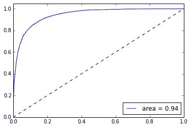

图 10 - 具有 AUC 值 0.94 的样本 AUC 曲线

由此可见，ROC 曲线描绘了我们的模型在给定决策阈值下 TPR 与 FPR 的权衡。因此，ROC 曲线下的面积可以被视为*平均模型准确度*，其中 1.0 代表完美分类，0.5 代表抛硬币（意味着我们的模型在猜测 1 或 0 时做了一半的工作），小于 0.5 的任何值都意味着抛硬币比我们的模型更准确！这是一个非常有用的指标，我们将看到它可以用来与不同的超参数调整和不同的模型进行比较！让我们继续创建一个函数，用于计算我们的决策树模型的 AUC，以便与其他模型进行比较：

```scala
type Predictor = {  
  def predict(features: Vector): Double 
} 

def computeMetrics(model: Predictor, data: RDD[LabeledPoint]): BinaryClassificationMetrics = { 
    val predAndLabels = data.map(newData => (model.predict(newData.features), newData.label)) 
      new BinaryClassificationMetrics(predAndLabels) 
} 

val treeMetrics = computeMetrics(dtreeModel, testData) 
println(f"Tree Model: AUC on Test Data = ${treeMetrics.areaUnderROC()}%.3f") 
```

输出如下：

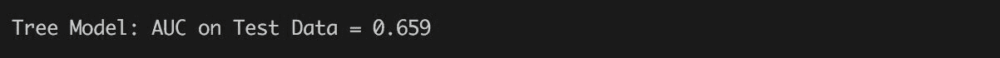

Spark MLlib 模型没有共同的接口定义；因此，在前面的例子中，我们必须定义类型`Predictor`，公开方法`predict`并在方法`computeMetrics`的定义中使用 Scala 结构化类型。本书的后面部分将展示基于统一管道 API 的 Spark ML 包。

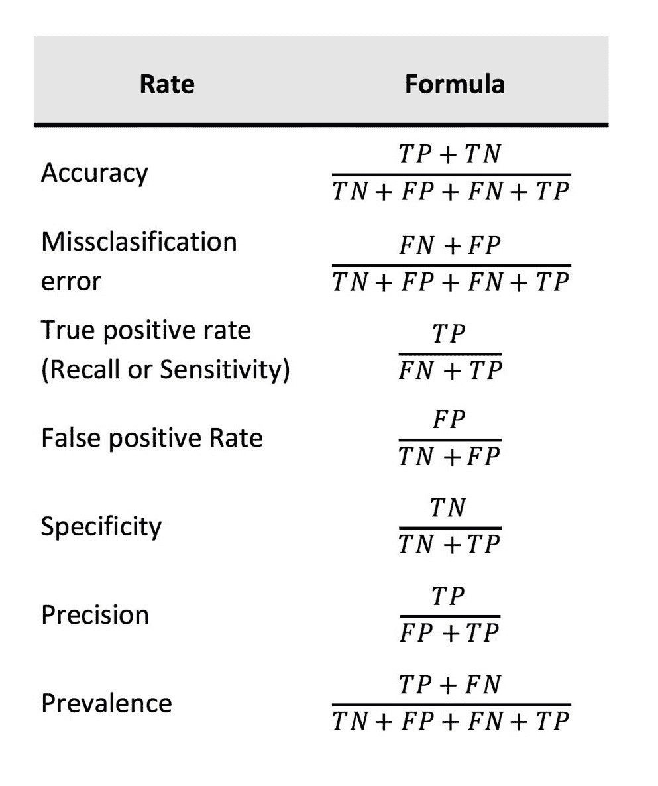

图 11 - 从混淆矩阵派生的指标。

对这个主题感兴趣吗？没有一本圣经是万能的。斯坦福大学著名统计学教授 Trevor Hastie 的书《统计学习的要素》是一个很好的信息来源。这本书为机器学习的初学者和高级实践者提供了有用的信息，强烈推荐。

需要记住的是，由于 Spark 决策树实现在内部使用`RandomForest`算法，如果未指定随机生成器的种子，运行之间的结果可能会略有不同。问题在于 Spark 的 MLLib API`DecisionTree`不允许将种子作为参数传递。

# 下一个模型 - 树集成

随机森林（RF）或梯度提升机（GBM）（也称为梯度提升树）等算法是目前在 MLlib 中可用的集成基于树的模型的两个例子；您可以将集成视为代表基本模型集合的*超级模型*。想要了解集成在幕后的工作原理，最好的方法是考虑一个简单的类比：

“假设你是一家著名足球俱乐部的主教练，你听说了一位来自巴西的不可思议的运动员的传闻，签下这位年轻运动员可能对你的俱乐部有利，但你的日程安排非常繁忙，所以你派了 10 名助理教练去评估这位球员。你的每一位助理教练都根据他/她的教练理念对球员进行评分——也许有一位教练想要测量球员跑 40 码的速度，而另一位教练认为身高和臂展很重要。无论每位教练如何定义“运动员潜力”，你作为主教练，只想知道你是否应该立即签下这位球员或者等待。于是你的教练们飞到巴西，每位教练都做出了评估；到达后，你走到每位教练面前问：“我们现在应该选这位球员还是等一等？”根据多数投票的简单规则，你可以做出决定。这是一个关于集成在分类任务中背后所做的事情的例子。”

您可以将每个教练看作是一棵决策树，因此您将拥有 10 棵树的集合（对应 10 个教练）。每个教练如何评估球员都是非常具体的，我们的树也是如此；对于创建的 10 棵树，每个节点都会随机选择特征（因此 RF 中有随机性，因为有很多树！）。引入这种随机性和其他基本模型的原因是防止过度拟合数据。虽然 RF 和 GBM 都是基于树的集合，但它们训练的方式略有不同，值得一提。

GBM 必须一次训练一棵树，以最小化`loss`函数（例如`log-loss`，平方误差等），通常比 RF 需要更长的时间来训练，因为 RF 可以并行生成多棵树。

然而，在训练 GBM 时，建议制作浅树，这反过来有助于更快的训练。

+   RFs 通常不像 GBM 那样过度拟合数据；也就是说，我们可以向我们的森林中添加更多的树，而不容易过度拟合，而如果我们向我们的 GBM 中添加更多的树，就更容易过度拟合。

+   RF 的超参数调整比 GBM 简单得多。在他的论文《超参数对随机森林准确性的影响》中，Bernard 等人通过实验证明，在每个节点选择的 K 个随机特征数是模型准确性的关键影响因素。相反，GBM 有更多必须考虑的超参数，如`loss`函数、学习率、迭代次数等。

与大多数数据科学中的“哪个更好”问题一样，选择 RF 和 GBM 是开放式的，非常依赖任务和数据集。

# 随机森林模型

现在，让我们尝试使用 10 棵决策树构建一个随机森林。

```scala
val numClasses = 2 
val categoricalFeaturesInfo = Map[Int, Int]() 
val numTrees = 10 
val featureSubsetStrategy = "auto"  
val impurity = "gini" 
val maxDepth = 5 
val maxBins = 10 
val seed = 42 

val rfModel = RandomForest.trainClassifier(trainingData, numClasses, categoricalFeaturesInfo, 
  numTrees, featureSubsetStrategy, impurity, maxDepth, maxBins, seed) 

```

就像我们的单棵决策树模型一样，我们首先声明超参数，其中许多参数您可能已经从决策树示例中熟悉。在前面的代码中，我们将创建一个由 10 棵树解决两类问题的随机森林。一个不同的关键特性是特征子集策略，描述如下：

`featureSubsetStrategy`对象给出了要在每个节点进行分割的候选特征数。可以是一个分数（例如 0.5），也可以是基于数据集中特征数的函数。设置`auto`允许算法为您选择这个数字，但一个常见的软规则是使用您拥有的特征数的平方根。

现在我们已经训练好了我们的模型，让我们对我们的留出集进行评分并计算总误差：

```scala
def computeError(model: Predictor, data: RDD[LabeledPoint]): Double = {  
  val labelAndPreds = data.map { point => 
    val prediction = model.predict(point.features) 
    (point.label, prediction) 
  } 
  labelAndPreds.filter(r => r._1 != r._2).count.toDouble/data.count 
} 
val rfTestErr = computeError(rfModel, testData) 
println(f"RF Model: Test Error = ${rfTestErr}%.3f") 
```

输出如下：

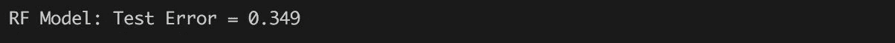

还可以使用已定义的`computeMetrics`方法计算 AUC：

```scala

val rfMetrics = computeMetrics(rfModel, testData) 
println(f"RF Model: AUC on Test Data = ${rfMetrics.areaUnderROC}%.3f") 
```

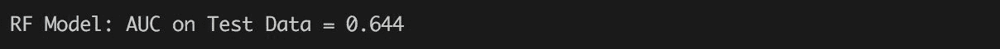

我们的 RF - 在其中硬编码超参数 - 相对于整体模型错误和 AUC 表现得比我们的单棵决策树要好得多。在下一节中，我们将介绍网格搜索的概念以及我们如何尝试变化超参数值/组合并衡量对模型性能的影响。

再次强调，结果在运行之间可能略有不同。但是，与决策树相比，可以通过将种子作为`RandomForest.trainClassifier`方法的参数传递来使运行确定性。

# 网格搜索

在 MLlib 和 H2O 中，与大多数算法一样，有许多可以选择的超参数，这些超参数对模型的性能有显著影响。鉴于可能存在无限数量的组合，我们是否可以以智能的方式开始查看哪些组合比其他组合更有前途？幸运的是，答案是“YES！”解决方案被称为网格搜索，这是运行使用不同超参数组合的许多模型的 ML 术语。

让我们尝试使用 RF 算法运行一个简单的网格搜索。在这种情况下，RF 模型构建器被调用，用于从定义的超参数空间中的每个参数组合：

```scala
val rfGrid =  
    for ( 
    gridNumTrees <- Array(15, 20); 
    gridImpurity <- Array("entropy", "gini"); 
    gridDepth <- Array(20, 30); 
    gridBins <- Array(20, 50)) 
        yield { 
    val gridModel = RandomForest.trainClassifier(trainingData, 2, Map[Int, Int](), gridNumTrees, "auto", gridImpurity, gridDepth, gridBins) 
    val gridAUC = computeMetrics(gridModel, testData).areaUnderROC 
    val gridErr = computeError(gridModel, testData) 
    ((gridNumTrees, gridImpurity, gridDepth, gridBins), gridAUC, gridErr) 
  } 
```

我们刚刚写的是一个`for`循环，它将尝试不同组合的数量，涉及树的数量、不纯度类型、树的深度和 bin 值（即要尝试的值）；然后，对于基于这些超参数排列组合创建的每个模型，我们将对训练模型进行评分，同时计算 AUC 指标和整体错误率。总共我们得到*2*2*2*2=16*个模型。再次强调，您的模型可能与我们在此处展示的模型略有不同，但您的输出应该类似于这样：

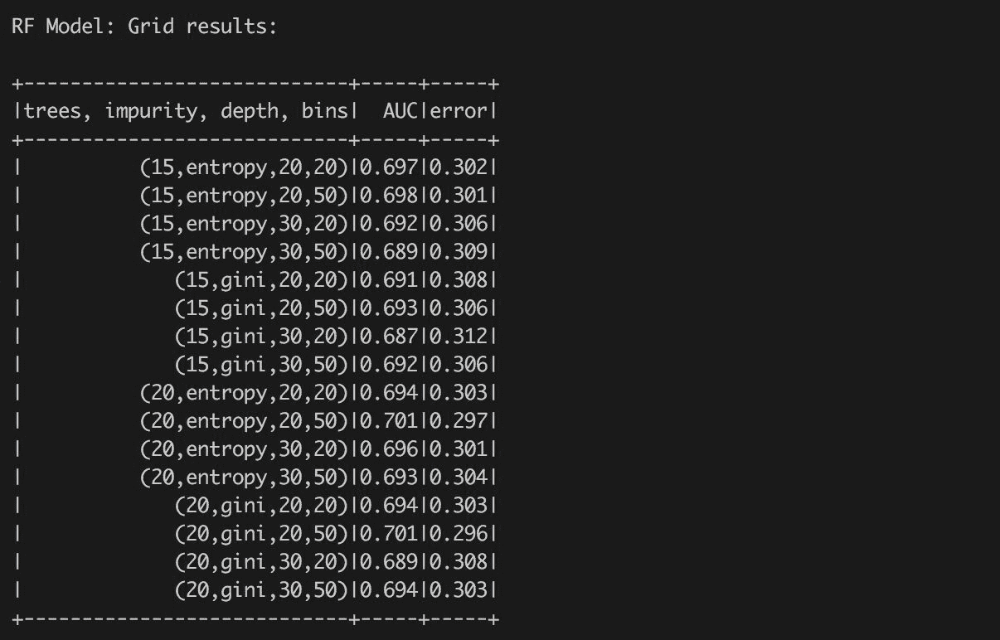

查看我们输出的第一个条目：

```scala
|(15,entropy,20,20)|0.697|0.302|
```

我们可以这样解释：对于 15 棵决策树的组合，使用熵作为我们的不纯度度量，以及树深度为 20（对于每棵树）和 bin 值为 20，我们的 AUC 为`0.695`。请注意，结果按照您最初编写它们的顺序显示。对于我们使用 RF 算法的网格搜索，我们可以轻松地获得产生最高 AUC 的超参数组合：

```scala
val rfParamsMaxAUC = rfGrid.maxBy(g => g._2)
println(f"RF Model: Parameters ${rfParamsMaxAUC._1}%s producing max AUC = ${rfParamsMaxAUC._2}%.3f (error = ${rfParamsMaxAUC._3}%.3f)") 
```

输出如下：

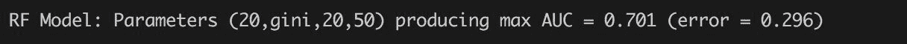

# 梯度提升机

到目前为止，我们能够达到的最佳 AUC 是一个 15 棵决策树的 RF，其 AUC 值为`0.698`。现在，让我们通过相同的过程来运行一个使用硬编码超参数的单个梯度提升机，然后对这些参数进行网格搜索，以查看是否可以使用该算法获得更高的 AUC。

回顾一下，由于其迭代性质试图减少我们事先声明的总体`loss`函数，GBM 与 RF 略有不同。在 MLlib 中，截至 1.6.0，有三种不同的损失函数可供选择：

+   **对数损失**：对于分类任务使用这个`loss`函数（请注意，对于 Spark，GBM 仅支持二元分类。如果您希望对多类分类使用 GBM，请使用 H2O 的实现，我们将在下一章中展示）。

+   **平方误差**：对于回归任务使用这个`loss`函数，它是这种类型问题的当前默认`loss`函数。

+   **绝对误差**：另一个可用于回归任务的`loss`函数。鉴于该函数取预测值和实际值之间的绝对差异，它比平方误差更好地控制异常值。

考虑到我们的二元分类任务，我们将使用`log-loss`函数并开始构建一个 10 棵树的 GBM 模型：

```scala
import org.apache.spark.mllib.tree.GradientBoostedTrees
 import org.apache.spark.mllib.tree.configuration.BoostingStrategy
 import org.apache.spark.mllib.tree.configuration.Algo

 val gbmStrategy = BoostingStrategy.defaultParams(Algo.Classification)
 gbmStrategy.setNumIterations(10)
 gbmStrategy.setLearningRate(0.1)
 gbmStrategy.treeStrategy.setNumClasses(2)
 gbmStrategy.treeStrategy.setMaxDepth(10)
 gbmStrategy.treeStrategy.setCategoricalFeaturesInfo(java.util.Collections.emptyMap[Integer, Integer])

 val gbmModel = GradientBoostedTrees.train(trainingData, gbmStrategy)
```

请注意，我们必须在构建模型之前声明一个提升策略。原因是 MLlib 不知道我们要解决什么类型的问题：分类还是回归？因此，这个策略让 Spark 知道这是一个二元分类问题，并使用声明的超参数来构建我们的模型。

以下是一些训练 GBM 时要记住的超参数：

+   `numIterations`：根据定义，GBM 一次构建一棵树，以最小化我们声明的`loss`函数。这个超参数控制要构建的树的数量；要小心不要构建太多的树，因为测试时的性能可能不理想。

+   `loss`：您声明使用哪个`loss`函数取决于所提出的问题和数据集。

+   `learningRate`：优化学习速度。较低的值（<0.1）意味着学习速度较慢，泛化效果更好。然而，它也需要更多的迭代次数，因此计算时间更长。

让我们对保留集对这个模型进行评分，并计算我们的 AUC：

```scala
val gbmTestErr = computeError(gbmModel, testData) 
println(f"GBM Model: Test Error = ${gbmTestErr}%.3f") 
val gbmMetrics = computeMetrics(dtreeModel, testData) 
println(f"GBM Model: AUC on Test Data = ${gbmMetrics.areaUnderROC()}%.3f") 
```

输出如下：

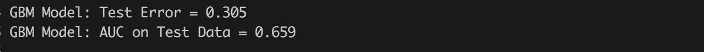

最后，我们将对一些超参数进行网格搜索，并且与我们之前的 RF 网格搜索示例类似，输出组合及其相应的错误和 AUC 计算：

```scala
val gbmGrid =  
for ( 
  gridNumIterations <- Array(5, 10, 50); 
  gridDepth <- Array(2, 3, 5, 7); 
  gridLearningRate <- Array(0.1, 0.01))  
yield { 
  gbmStrategy.numIterations = gridNumIterations 
  gbmStrategy.treeStrategy.maxDepth = gridDepth 
  gbmStrategy.learningRate = gridLearningRate 

  val gridModel = GradientBoostedTrees.train(trainingData, gbmStrategy) 
  val gridAUC = computeMetrics(gridModel, testData).areaUnderROC 
  val gridErr = computeError(gridModel, testData) 
  ((gridNumIterations, gridDepth, gridLearningRate), gridAUC, gridErr) 
} 
```

我们可以打印前 10 行结果，按 AUC 排序：

```scala
println(
s"""GBM Model: Grid results:
      |${table(Seq("iterations, depth, learningRate", "AUC", "error"), gbmGrid.sortBy(-_._2).take(10), format = Map(1 -> "%.3f", 2 -> "%.3f"))}
""".stripMargin)
```

输出如下：

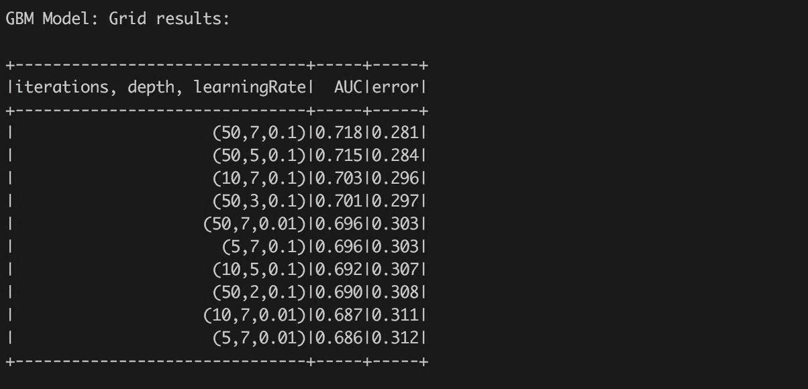

而且我们可以很容易地得到产生最大 AUC 的模型：

```scala
val gbmParamsMaxAUC = gbmGrid.maxBy(g => g._2) 
println(f"GBM Model: Parameters ${gbmParamsMaxAUC._1}%s producing max AUC = ${gbmParamsMaxAUC._2}%.3f (error = ${gbmParamsMaxAUC._3}%.3f)") 
```

输出如下：

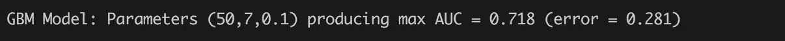

# 最后一个模型-H2O 深度学习

到目前为止，我们使用 Spark MLlib 构建了不同的模型；然而，我们也可以使用 H2O 算法。所以让我们试试吧！

首先，我们将我们的训练和测试数据集传输到 H2O，并为我们的二元分类问题创建一个 DNN。重申一遍，这是可能的，因为 Spark 和 H2O 共享相同的 JVM，这有助于将 Spark RDD 传递到 H2O 六角框架，反之亦然。

到目前为止，我们运行的所有模型都是在 MLlib 中，但现在我们将使用 H2O 来使用相同的训练和测试集构建一个 DNN，这意味着我们需要将这些数据发送到我们的 H2O 云中，如下所示：

```scala
val trainingHF = h2oContext.asH2OFrame(trainingData.toDF, "trainingHF") 
val testHF = h2oContext.asH2OFrame(testData.toDF, "testHF") 
```

为了验证我们已成功转移我们的训练和测试 RDD（我们转换为数据框），我们可以在我们的 Flow 笔记本中执行这个命令（所有命令都是用*Shift+Enter*执行的）。请注意，我们现在有两个名为`trainingRDD`和`testRDD`的 H2O 框架，您可以通过运行命令`getFrames`在我们的 H2O 笔记本中看到。

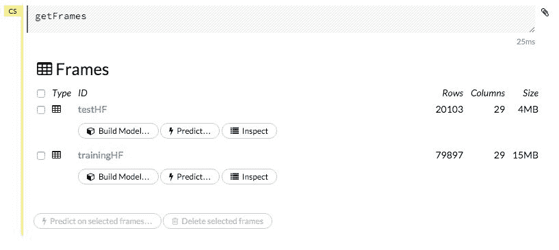

图 12 - 通过在 Flow UI 中输入“getFrames”可以查看可用的 H2O 框架列表。

我们可以很容易地探索框架，查看它们的结构，只需在 Flow 单元格中键入`getFrameSummary "trainingHF"`，或者只需点击框架名称（参见*图 13*）。

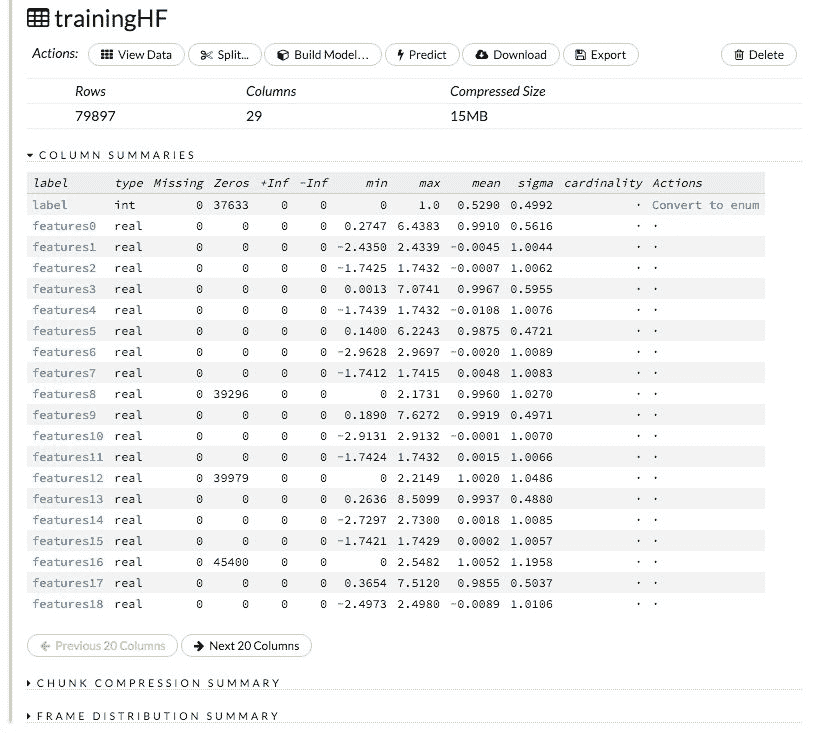

图 13 - 训练框架的结构。

上图显示了训练框架的结构-它有 80,491 行和 29 列；有名为*features0*、*features1*的数值列，具有实际值，第一列标签包含整数值。

由于我们想进行二元分类，我们需要将“label”列从整数转换为分类类型。您可以通过在 Flow UI 中点击*Convert to enum*操作或在 Spark 控制台中执行以下命令来轻松实现：

```scala
trainingHF.replace(0, trainingHF.vecs()(0).toCategoricalVec).remove() 
trainingHF.update() 

testHF.replace(0, testHF.vecs()(0).toCategoricalVec).remove() 
testHF.update() 
```

该代码将第一个向量替换为转换后的向量，并从内存中删除原始向量。此外，调用`update`将更改传播到共享的分布式存储中，因此它们对集群中的所有节点都是可见的。

# 构建一个 3 层 DNN

H2O 暴露了略有不同的构建模型的方式；然而，它在所有 H2O 模型中是统一的。有三个基本构建模块：

+   **模型参数**：定义输入和特定算法参数

+   **模型构建器**：接受模型参数并生成模型

+   **模型**：包含模型定义，但也包括有关模型构建的技术信息，如每次迭代的得分时间或错误率。

在构建我们的模型之前，我们需要为深度学习算法构建参数：

```scala
import _root_.hex.deeplearning._ 
import DeepLearningParameters.Activation 

val dlParams = new DeepLearningParameters() 
dlParams._train = trainingHF._key 
dlParams._valid = testHF._key 
dlParams._response_column = "label" 
dlParams._epochs = 1 
dlParams._activation = Activation.RectifierWithDropout 
dlParams._hidden = ArrayInt 
```

让我们浏览一下参数，并找出我们刚刚初始化的模型：

+   `train`和`valid`：指定我们创建的训练和测试集。请注意，这些 RDD 实际上是 H2O 框架。

+   `response_column`：指定我们使用的标签，我们之前声明的是每个框架中的第一个元素（从 0 开始索引）。

+   `epochs`：这是一个非常重要的参数，它指定网络应该在训练数据上传递多少次；通常，使用更高`epochs`训练的模型允许网络*学习*新特征并产生更好的模型结果。然而，这种训练时间较长的网络容易出现过拟合，并且可能在新数据上泛化效果不佳。

+   `激活`：这些是将应用于输入数据的各种非线性函数。在 H2O 中，有三种主要的激活函数可供选择：

+   `Rectifier`：有时被称为**整流线性单元**（**ReLU**），这是一个函数，其下限为**0**，但以线性方式达到正无穷大。从生物学的角度来看，这些单元被证明更接近实际的神经元激活。目前，这是 H2O 中默认的激活函数，因为它在图像识别和速度等任务中的结果。

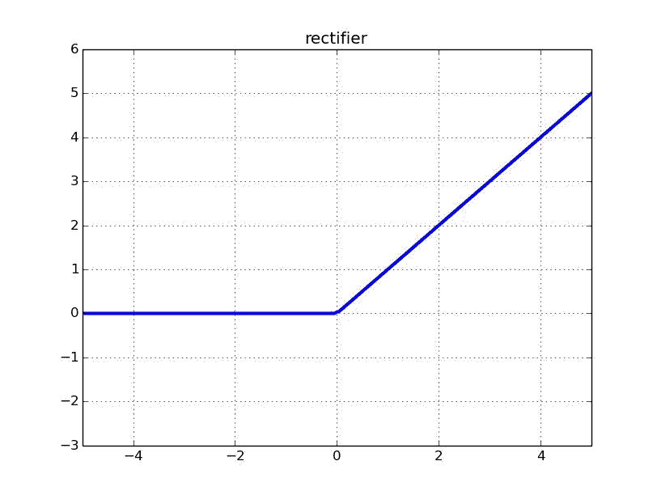

图 14 - 整流器激活函数

+   `Tanh`：一个修改后的逻辑函数，其范围在**-1**和**1**之间，但在(0,0)处通过原点。由于其在**0**周围的对称性，收敛通常更快。

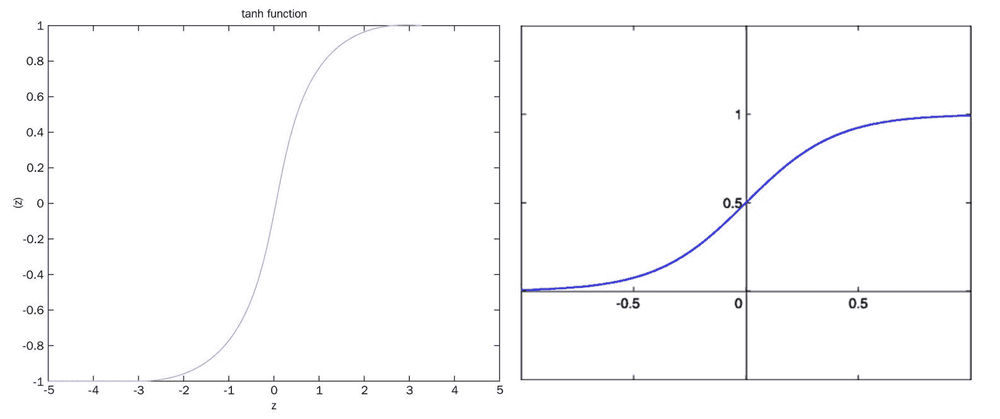

图 15 - 双曲正切激活函数和逻辑函数 - 注意双曲正切之间的差异。

+   `Maxout`：一种函数，其中每个神经元选择来自 k 个单独通道的最大值：

+   **hidden**：另一个非常重要的超参数，这是我们指定两件事的地方：

+   层的数量（您可以使用额外的逗号创建）。请注意，在 GUI 中，默认参数是一个具有每层 200 个隐藏神经元的两层隐藏网络。

+   每层的神经元数量。与大多数关于机器学习的事情一样，关于这个数字应该是多少并没有固定的规则，通常最好进行实验。然而，在下一章中，我们将介绍一些额外的调整参数，这将帮助您考虑这一点，即：L1 和 L2 正则化和丢失。

# 添加更多层

增加网络层的原因来自于我们对人类视觉皮层工作原理的理解。这是大脑后部的一个专门区域，用于识别物体/图案/数字等，并由复杂的神经元层组成，用于编码视觉信息并根据先前的知识进行分类。

毫不奇怪，网络需要多少层才能产生良好的结果并没有固定的规则，强烈建议进行实验！

# 构建模型和检查结果

现在您已经了解了一些关于参数和我们想要运行的模型的信息，是时候继续训练和检查我们的网络了：

```scala
val dl = new DeepLearning(dlParams) 
val dlModel = dl.trainModel.get 
```

代码创建了`DeepLearning`模型构建器并启动了它。默认情况下，`trainModel`的启动是异步的（即它不会阻塞，但会返回一个作业），但可以通过调用`get`方法等待计算结束。您还可以在 UI 中探索作业进度，甚至可以通过在 Flow UI 中键入`getJobs`来探索未完成的模型（参见*图 18*）。

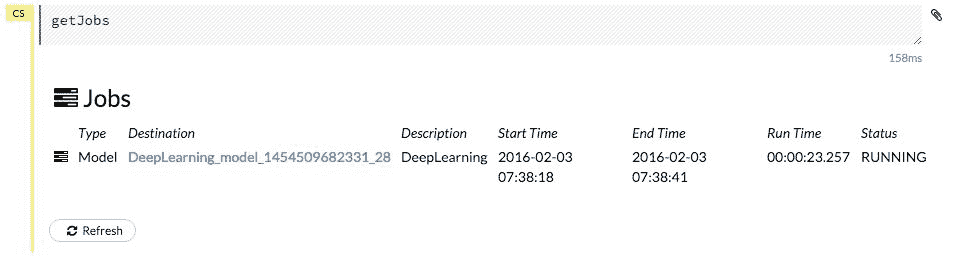

图 18 - 命令 getJobs 提供了一个已执行作业的列表及其状态。

计算的结果是一个深度学习模型 - 我们可以直接从 Spark shell 探索模型及其细节：

```scala
println(s"DL Model: ${dlModel}") 
```

我们还可以通过调用模型的`score`方法直接获得测试数据的预测框架：

```scala
val testPredictions = dlModel.score(testHF) 

testPredictions: water.fvec.Frame = 
Frame _95829d4e695316377f96db3edf0441ee (19912 rows and 3 cols): 
         predict                   p0                    p1 
    min           0.11323123896925524  0.017864442175851737 
   mean            0.4856033079851807    0.5143966920148184 
 stddev            0.1404849885490033   0.14048498854900326 
    max            0.9821355578241482    0.8867687610307448 
missing                           0.0                   0.0 
      0        1   0.3908680007591152    0.6091319992408847 
      1        1   0.3339873797352686    0.6660126202647314 
      2        1   0.2958578897481016    0.7041421102518984 
      3        1   0.2952981947808155    0.7047018052191846 
      4        0   0.7523906949762337   0.24760930502376632 
      5        1   0.53559438105240... 
```

表格包含三列：

+   `predict`：基于默认阈值的预测值

+   `p0`：选择类 0 的概率

+   `p1`：选择类 1 的概率

我们还可以获得测试数据的模型指标：

```scala
import water.app.ModelMetricsSupport._ 
val dlMetrics = binomialMM(dlModel, testHF) 

```

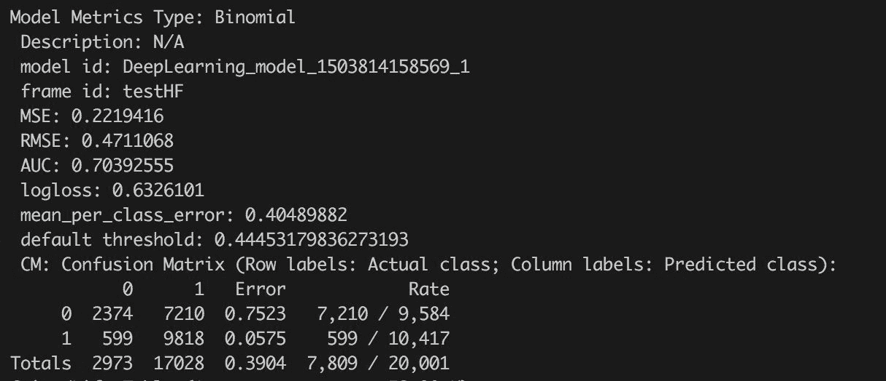

输出直接显示了 AUC 和准确率（相应的错误率）。请注意，该模型在预测希格斯玻色子方面确实很好；另一方面，它的假阳性率很高！

最后，让我们看看如何使用 GUI 构建类似的模型，只是这一次，我们将从模型中排除物理学家手工提取的特征，并在内部层使用更多的神经元：

1.  选择用于 TrainingHF 的模型。

正如您所看到的，H2O 和 MLlib 共享许多相同的算法，但功能级别不同。在这里，我们将选择*深度学习*，然后取消选择最后八个手工提取的特征。

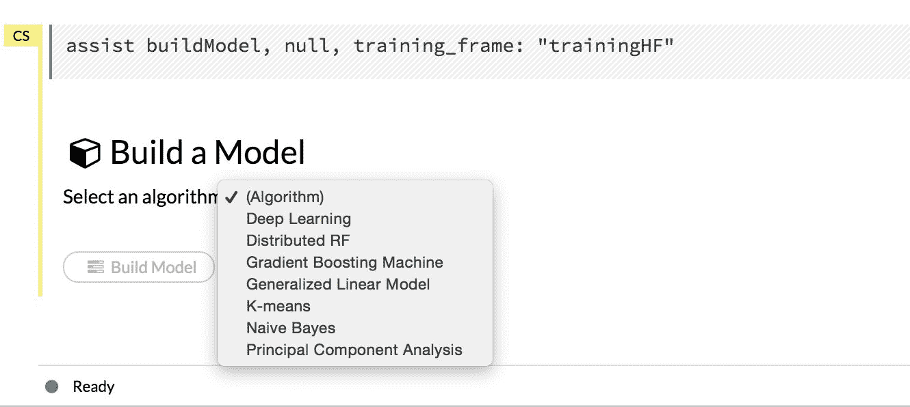

图 19- 选择模型算法

1.  构建 DNN 并排除手工提取的特征。

在这里，我们手动选择忽略特征 21-27，这些特征代表物理学家提取的特征，希望我们的网络能够学习它们。还要注意，如果选择这条路线，还可以执行 k 折交叉验证。

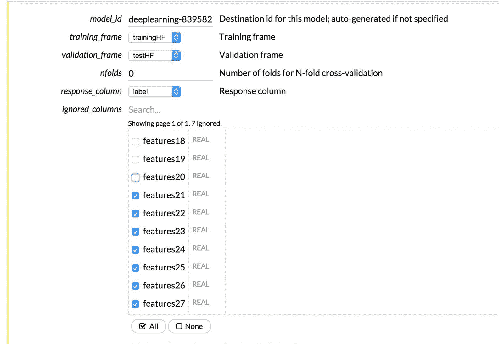

图 20 - 选择输入特征。

1.  指定网络拓扑。

正如您所看到的，我们将使用整流器激活函数构建一个三层 DNN，其中每一层将有 1,024 个隐藏神经元，并且将运行 100 个`epochs`。

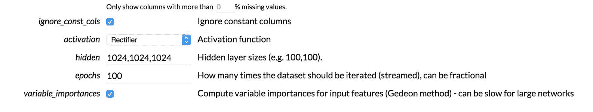

图 21 - 配置具有 3 层，每层 1024 个神经元的网络拓扑。

1.  探索模型结果。

运行此模型后，需要一些时间，我们可以单击“查看”按钮来检查训练集和测试集的 AUC：

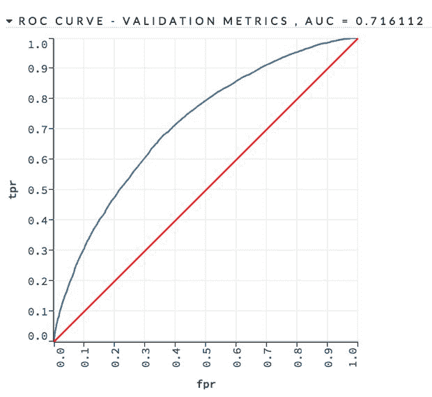

图 22 - 验证数据的 AUC 曲线。

如果您点击鼠标并在 AUC 曲线的某个部分上拖放，实际上可以放大该曲线的特定部分，并且 H2O 会提供有关所选区域的阈值的准确性和精度的摘要统计信息。

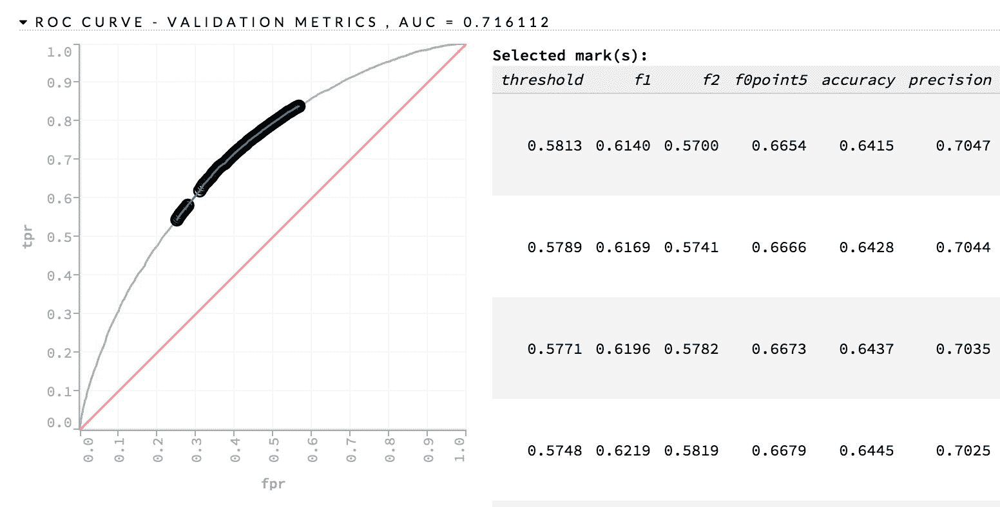

图 23 - ROC 曲线可以轻松探索以找到最佳阈值。

此外，还有一个标有预览**普通的 Java 对象**（**POJO**）的小按钮，我们将在后面的章节中探讨，这是您将模型部署到生产环境中的方式。

好的，我们已经建立了几十个模型；现在是时候开始检查我们的结果，并找出哪一个在整体错误和 AUC 指标下给我们最好的结果。有趣的是，当我们在办公室举办许多聚会并与顶级 kagglers 交谈时，这些显示结果的表格经常被构建，这是一种跟踪 a）什么有效和什么无效的好方法，b）回顾您尝试过的东西作为一种文档形式。

| 模型 | 错误 | AUC |
| --- | --- | --- |
| 决策树 | 0.332 | 0.665 |
| 网格搜索：随机森林 | 0.294 | 0.704 |
| **网格搜索：GBM** | **0.287** | **0.712** |
| 深度学习 - 所有特征 | 0.376 | 0.705 |
| 深度学习 - 子集特征 | 0.301 | 0.716 |

那么我们选择哪一个？在这种情况下，我们喜欢 GBM 模型，因为它提供了第二高的 AUC 值和最低的准确率。但是这个决定总是由建模目标驱动 - 在这个例子中，我们严格受到模型在发现希格斯玻色子方面的准确性的影响；然而，在其他情况下，选择正确的模型或模型可能会受到各种方面的影响 - 例如，找到并构建最佳模型的时间。

# 摘要

本章主要讨论了二元分类问题：真或假，对于我们的示例来说，信号是否表明希格斯玻色子或背景噪音？我们已经探索了四种不同的算法：单决策树、随机森林、梯度提升机和 DNN。对于这个确切的问题，DNN 是当前的世界冠军，因为这些模型可以继续训练更长时间（即增加`epochs`的数量），并且可以添加更多的层。

除了探索四种算法以及如何对许多超参数执行网格搜索之外，我们还研究了一些重要的模型指标，以帮助您更好地区分模型并了解如何定义“好”的方式。我们本章的目标是让您接触到不同算法和 Spark 和 H2O 中的调整，以解决二元分类问题。在下一章中，我们将探讨多类分类以及如何创建模型集成（有时称为超学习者）来找到我们真实示例的良好解决方案。
