# 第三章：多类分类的集成方法

我们现代世界已经与许多收集有关人类行为数据的设备相互连接-例如，我们的手机是我们口袋里的小间谍，跟踪步数、路线或我们的饮食习惯。甚至我们现在戴的手表也可以追踪从我们走的步数到我们在任何给定时刻的心率的一切。

在所有这些情况下，这些小工具试图根据收集的数据猜测用户正在做什么，以提供一天中用户活动的报告。从机器学习的角度来看，这个任务可以被视为一个分类问题：在收集的数据中检测模式，并将正确的活动类别分配给它们（即，游泳、跑步、睡觉）。但重要的是，这仍然是一个监督问题-这意味着为了训练模型，我们需要提供由实际类别注释的观察。

在本节中，我们将重点关注集成方法来建模多类分类问题，有时也称为多项分类，使用 UCI 数据集库提供的传感器数据集。

请注意，多类分类不应与多标签分类混淆，多标签分类可以为给定示例预测多个标签。例如，一篇博客文章可以被标记为多个标签，因为一篇博客可以涵盖任意数量的主题；然而，在多类分类中，我们*被迫*选择一个*N*个可能主题中的一个，其中*N >* 2 个可能标签。

读者将在本章学习以下主题：

+   为多类分类准备数据，包括处理缺失值

+   使用 Spark RF 算法进行多类分类

+   使用不同的指标评估 Spark 分类模型的质量

+   构建 H2O 基于树的分类模型并探索其质量

# 数据

在本章中，我们将使用由尔湾大学机器学习库发布的**Physical Activity Monitoring Data Set**（**PAMAP2**）：[`archive.ics.uci.edu/ml/datasets/PAMAP2+Physical+Activity+Monitoring`](https://archive.ics.uci.edu/ml/datasets/PAMAP2+Physical+Activity+Monitoring)

完整的数据集包含**52**个输入特征和**3,850,505**个事件，描述了 18 种不同的身体活动（例如，步行、骑车、跑步、看电视）。数据是由心率监测器和三个惯性测量单元记录的，分别位于手腕、胸部和主侧踝部。每个事件都由描述地面真相的活动标签和时间戳进行注释。数据集包含由值`NaN`表示的缺失值。此外，一些传感器生成的列被标记为无效（“方向”-请参阅数据集描述）：

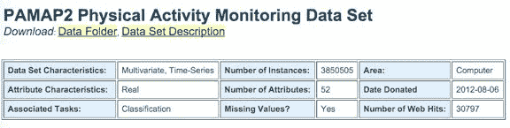

图 1：由尔湾大学机器学习库发布的数据集属性。

该数据集代表了活动识别的完美示例：我们希望训练一个强大的模型，能够根据来自物理传感器的输入数据来预测执行的活动。

此外，数据集分布在多个文件中，每个文件代表一个单个主体的测量，这是由多个数据源产生的数据的另一个现实方面，因此我们需要利用 Spark 从目录中读取并合并文件以创建训练/测试数据集的能力。

以下行显示了数据的一个样本。有几个重要的观察值值得注意：

+   个别值由空格字符分隔

+   每行中的第一个值表示时间戳，而第二个值保存了`activityId`

```scala
199.38 0 NaN 34.1875 1.54285 7.86975 5.88674 1.57679 7.65264 5.84959 -0.0855996 ... 1 0 0 0 
199.39 11 NaN 34.1875 1.46513 7.94554 5.80834 1.5336 7.81914 5.92477 -0.0907069 ...  1 0 0 0 
199.4 11 NaN 34.1875 1.41585 7.82933 5.5001 1.56628 8.03042 6.01488 -0.0399161 ...  1 0 0 0 
```

`activityId`由数字值表示；因此，我们需要一个翻译表来将 ID 转换为相应的活动标签，数据集提供了这个翻译表，我们如下所示：

| 1 躺着 | 2 坐着 |
| --- | --- |
| 3 站立 | 4 步行 |
| 5 跑步 | 6 骑车 |
| 7 挪威步行 | 9 看电视 |
| 10 电脑工作 | 11 开车 |
| 12 上楼梯 | 13 下楼梯 |
| 16 吸尘 | 17 熨烫 |
| 18 叠衣服 | 19 打扫房子 |
| 20 踢足球 | 24 跳绳 |
| 0 其他（瞬态活动） |  |

示例行代表一个“其他活动”，然后是两个代表“开车”的测量值。

第三列包含心率测量，而其余列代表来自三种不同惯性测量单位的数据：列 4-20 来自手部传感器，21-37 包含来自胸部传感器的数据，最后列 38-54 包含踝部传感器的测量数据。每个传感器测量 17 个不同的值，包括温度、3D 加速度计、陀螺仪和磁力计数据以及方向。然而，在这个数据集中，方向列被标记为无效。

输入数据包含两个不同的文件夹 - 协议和可选测量，其中包含一些执行了一些额外活动的受试者的数据。在本章中，我们将只使用可选文件夹中的数据。

# 建模目标

在这个例子中，我们希望基于有关身体活动的信息构建模型，以对未知数据进行分类并用相应的身体活动进行注释。

# 挑战

对于传感器数据，有许多探索和构建模型的方法。在本章中，我们主要关注分类；然而，有几个方面需要更深入的探索，特别是以下方面：

+   训练数据代表了一系列事件的时间顺序流，但我们不打算反映时间信息，而是将数据视为一整个完整的信息

+   测试数据也是一样 - 单个活动事件是在执行活动期间捕获的事件流的一部分，如果了解实际上下文，可能更容易对其进行分类

然而，目前，我们忽略时间维度，并应用分类来探索传感器数据中可能存在的模式，这些模式将表征执行的活动。

# 机器学习工作流程

为了构建初始模型，我们的工作流程包括几个步骤：

1.  数据加载和预处理，通常称为**提取-转换-加载**（**ETL**）。

+   加载

+   解析

+   处理缺失值

1.  将数据统一成算法所期望的形式。

+   模型训练

+   模型评估

+   模型部署

# 启动 Spark shell

第一步是准备 Spark 环境进行分析。与上一章一样，我们将启动 Spark shell；但是，在这种情况下，命令行稍微复杂一些：

```scala
export SPARKLING_WATER_VERSION="2.1.12" 
export SPARK_PACKAGES=\ 
"ai.h2o:sparkling-water-core_2.11:${SPARKLING_WATER_VERSION},\ 
ai.h2o:sparkling-water-repl_2.11:${SPARKLING_WATER_VERSION},\ 
ai.h2o:sparkling-water-ml_2.11:${SPARKLING_WATER_VERSION},\ 
com.packtpub:mastering-ml-w-spark-utils:1.0.0" 

$SPARK_HOME/bin/spark-shell \ 
        --master 'local[*]' \ 
        --driver-memory 8g \ 
        --executor-memory 8g \ 
        --conf spark.executor.extraJavaOptions=-XX:MaxPermSize=384M
        \ 
        --conf spark.driver.extraJavaOptions=-XX:MaxPermSize=384M \ 
        --packages "$SPARK_PACKAGES" 
```

在这种情况下，我们需要更多的内存，因为我们将加载更大的数据。我们还需要增加 PermGen 的大小 - JVM 内存的一部分，它存储有关加载的类的信息。只有在使用 Java 7 时才需要这样做。

Spark 作业的内存设置是作业启动的重要部分。在我们使用的简单的基于`local[*]`的场景中，Spark 驱动程序和执行程序之间没有区别。然而，对于部署在独立或 YARN Spark 集群上的较大作业，驱动程序内存和执行程序内存的配置需要反映数据的大小和执行的转换。

此外，正如我们在上一章中讨论的，您可以通过使用巧妙的缓存策略和正确的缓存目的地（例如磁盘，离堆内存）来减轻内存压力。

# 探索数据

第一步涉及数据加载。在多个文件的情况下，SparkContext 的`wholeTextFiles`方法提供了我们需要的功能。它将每个文件读取为单个记录，并将其作为键值对返回，其中键包含文件的位置，值包含文件内容。我们可以通过通配符模式`data/subject*`直接引用输入文件。这不仅在从本地文件系统加载文件时很有用，而且在从 HDFS 加载文件时尤为重要。

```scala
val path = s"${sys.env.get("DATADIR").getOrElse("data")}/subject*"
val dataFiles = sc.wholeTextFiles(path)
println(s"Number of input files: ${dataFiles.count}")
```

由于名称不是输入数据的一部分，我们定义一个变量来保存列名：

```scala
val allColumnNames = Array( 
  "timestamp", "activityId", "hr") ++ Array( 
  "hand", "chest", "ankle").flatMap(sensor => 
    Array( 
      "temp",  
      "accel1X", "accel1Y", "accel1Z", 
      "accel2X", "accel2Y", "accel2Z", 
      "gyroX", "gyroY", "gyroZ", 
      "magnetX", "magnetY", "magnetZ", 
      "orientX", "orientY", "orientZ"). 
    map(name => s"${sensor}_${name}")) 
```

我们简单地定义了前三个列名，然后是每个三个位置传感器的列名。此外，我们还准备了一个在建模中无用的列索引列表，包括时间戳和方向数据：

```scala
val ignoredColumns =  
  Array(0,  
    3 + 13, 3 + 14, 3 + 15, 3 + 16, 
    20 + 13, 20 + 14, 20 + 15, 20 + 16, 
    37 + 13, 37 + 14, 37 + 15, 37 + 16) 
```

下一步是处理引用文件的内容并创建一个`RDD`，我们将其用作数据探索和建模的输入。由于我们希望多次迭代数据并执行不同的转换，我们将在内存中缓存数据：

```scala
val rawData = dataFiles.flatMap { case (path, content) =>  
  content.split("\n") 
}.map { row =>  
  row.split(" ").map(_.trim). 
  zipWithIndex. 
  map(v => if (v.toUpperCase == "NAN") Double.NaN else v.toDouble). 
  collect {  
    case (cell, idx) if !ignoredColumns.contains(idx) => cell 
  } 
} 
rawData.cache() 

println(s"Number of rows: ${rawData.count}") 
```

输出如下：

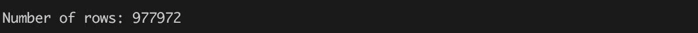

在这种情况下，对于每个键值对，我们提取其内容并根据行边界进行拆分。然后我们根据文件分隔符对每行进行转换，该分隔符是特征之间的空格。由于文件只包含数值和字符串值`NaN`作为缺失值的标记，我们可以简单地将所有值转换为 Java 的`Double`，将`Double.NaN`作为缺失值的表示。

我们可以看到我们的输入文件有 977,972 行。在加载过程中，我们还跳过了时间戳列和数据集描述中标记为无效的列（参见`ignoredColumns`数组）。

RDD 的接口遵循函数式编程的设计原则，这个原则也被 Scala 编程语言采用。这个共享的概念为操作数据结构提供了统一的 API；另一方面，了解何时在本地对象（数组、列表、序列）上调用操作，以及何时导致分布操作（`RDD`）是很重要的。

为了保持数据集的一致视图，我们还需要根据在先前步骤中准备的忽略列的列表来过滤列名：

```scala
import org.apache.spark.utils.Tabulizer._
 val columnNames = allColumnNames.
   zipWithIndex.
   filter { case (_, idx) => !ignoredColumns.contains(idx) }.
   map { case (name, _) => name }

 println(s"Column names:${table(columnNames, 4, None)}") 
```

输出如下：

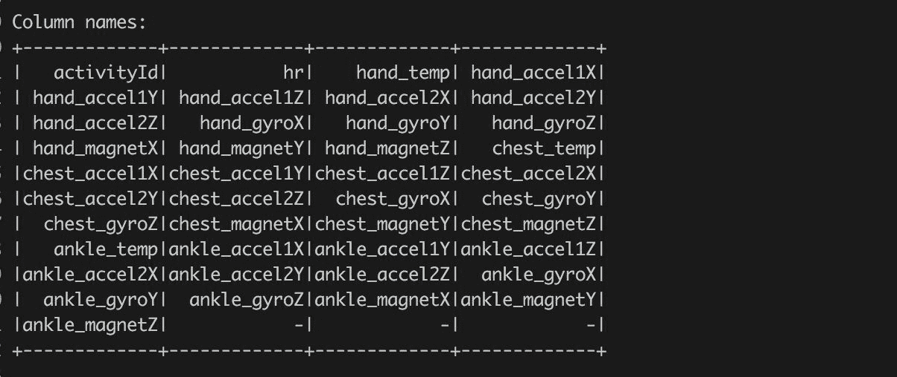

始终要摆脱对建模无用的数据。动机是在计算和建模过程中减轻内存压力。例如，可以删除包含随机 ID、时间戳、常量列或已在数据集中表示的列等的列。

从直觉上讲，例如对建模 ID 术语进行建模并不太有意义，考虑到该领域的性质。特征选择是一个非常重要的话题，我们将在本书的后面花费大量时间来讨论这个话题。

现在让我们看看数据集中个体活动的分布。我们将使用与上一章相同的技巧；但是，我们也希望看到活动的实际名称，而不仅仅是基于数字的表示。因此，首先我们定义了描述活动编号与其名称之间关系的映射：

```scala
val activities = Map( 
  1 -> "lying", 2 -> "sitting", 3 -> "standing", 4 -> "walking",  
  5 -> "running", 6 -> "cycling", 7 -> "Nordic walking",  
  9 -> "watching TV", 10 -> "computer work", 11 -> "car driving", 
 12 -> "ascending stairs", 13 -> "descending stairs",  
 16 -> "vacuum cleaning", 17 -> "ironing", 
 18 -> "folding laundry", 19 -> "house cleaning", 
 20 -> "playing soccer", 24 -> "rope jumping", 0 -> "other") 

```

然后我们使用 Spark 方法`reduceByKey`计算数据中个体活动的数量。

```scala
val dataActivityId = rawData.map(l => l(0).toInt)

 val activityIdCounts = dataActivityId.
   map(n => (n, 1)).
   reduceByKey(_ + _)

 val activityCounts = activityIdCounts.
   collect.
   sortBy { case (activityId, count) =>
     -count
 }.map { case (activityId, count) =>
   (activitiesMap(activityId), count)
 }

 println(s"Activities distribution:${table({activityCounts})}")
```

该命令计算个体活动的数量，将活动编号转换为其标签，并根据计数按降序对结果进行排序：

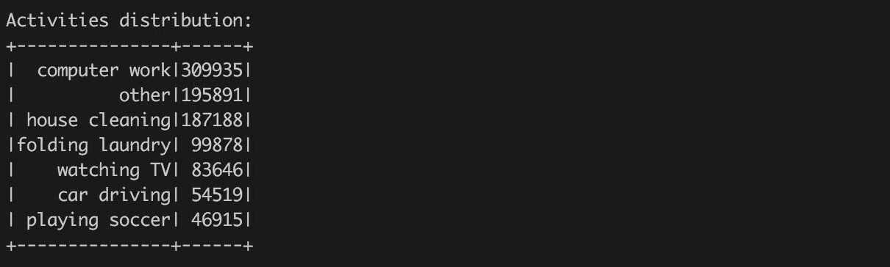

或者根据活动频率进行可视化，如*图 2*所示。

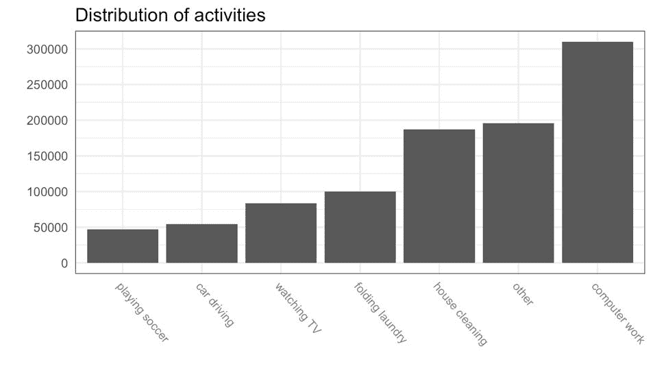

图 2：输入数据中不同活动的频率。

始终要考虑对数据应用的个体转换的顺序。在前面的例子中，我们在使用 Spark `collect`操作将所有数据收集到本地后应用了`sortBy`转换。在这种情况下，这是有道理的，因为我们知道`collect`操作的结果是相当小的（我们只有 22 个活动标签），而`sortBy`是应用在本地集合上的。另一方面，在`collect`操作之前放置`sortBy`会强制调用 Spark RDD 的转换，并安排排序作为 Spark 分布式任务。

# 缺失数据

数据描述提到用于活动跟踪的传感器并不完全可靠，结果包含缺失数据。我们需要更详细地探索它们，看看这个事实如何影响我们的建模策略。

第一个问题是我们的数据集中有多少缺失值。我们从数据描述中知道，所有缺失值都由字符串`NaN`标记（即，不是一个数字），现在在`RDD` `rawData`中表示为`Double.NaN`。在下一个代码片段中，我们计算每行的缺失值数量和数据集中的总缺失值数量：

```scala
val nanCountPerRow = rawData.map { row => 
  row.foldLeft(0) { case (acc, v) =>  
    acc + (if (v.isNaN) 1 else 0)  
  } 
} 
val nanTotalCount = nanCount.sum 

val ncols = rawData.take(1)(0).length 
val nrows = rawData.count 

val nanRatio = 100.0 * nanTotalCount / (ncols * nrows)  

println(f"""|NaN count = ${nanTotalCount}%.0f 
            |NaN ratio = ${nanRatio}%.2f %%""".stripMargin) 
```

输出如下：

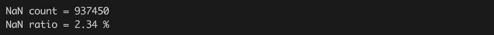

现在，我们已经对我们的数据中缺失值的数量有了整体的了解。但我们不知道缺失值是如何分布的。它们是均匀分布在整个数据集上吗？还是有包含更多缺失值的行/列？在接下来的文本中，我们将尝试找到这些问题的答案。

一个常见的错误是使用比较运算符比较数值和`Double.NaN`。例如，`if (v == Double.NaN) { ... }`是错误的，因为 Java 规范规定：

"`NaN`是无序的：（1）如果一个或两个操作数是`NaN`，则数值比较运算符`<`、`<=`、`>`和`>=`返回`false`，（2）等式运算符`==`如果任一操作数是`NaN`，则返回`false`。"

因此，`Double.NaN == Double.NaN`总是返回`false`。用正确的方式比较数值和`Double.NaN`是使用`isNaN`方法：`if (v.isNaN) { ... }`（或使用相应的静态方法`java.lang.Double.isNaN`）。

首先，考虑到我们已经计算了上一步中每行的缺失值数量。对它们进行排序并取唯一值，让我们了解到行是如何受缺失值影响的：

```scala
val nanRowDistribution = nanCountPerRow.
   map( count => (count, 1)).
   reduceByKey(_ + _).sortBy(-_._1).collect

 println(s"${table(Seq("#NaN","#Rows"), nanRowDistribution, Map.empty[Int, String])}") 
```

输出如下：

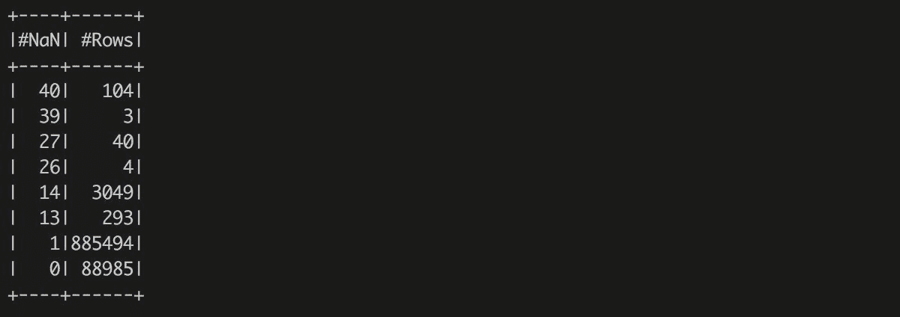

现在我们可以看到大多数行包含一个缺失值。然而，有很多行包含 13 或 14 个缺失值，甚至有 40 行包含 27 个*NaNs*，以及 107 行包含超过 30 个缺失值（104 行包含 40 个缺失值，3 行包含 39 个缺失值）。考虑到数据集包含 41 列，这意味着有 107 行是无用的（大部分值都缺失），剩下 3386 行至少有两个缺失值需要关注，以及 885,494 行有一个缺失值。我们现在可以更详细地查看这些行。我们选择所有包含超过给定阈值的缺失值的行，例如 26。我们还收集行的索引（这是基于零的索引！）：

```scala
val nanRowThreshold = 26 
val badRows = nanCountPerRow.zipWithIndex.zip(rawData).filter(_._1._1 > nanRowThreshold).sortBy(-_._1._1) 
println(s"Bad rows (#NaN, Row Idx, Row):\n${badRows.collect.map(x => (x._1, x._2.mkString(","))).mkString("\n")}") 
```

现在我们确切地知道哪些行是没有用的。我们已经观察到有 107 行是不好的，它们不包含任何有用的信息。此外，我们可以看到有 27 个缺失值的行是在代表手和脚踝 IMU 传感器的位置上。

最后，大多数行都分配了`activityId` 10、19 或 20，分别代表`computer work`、`house cleaning`和`playing soccer`活动，这些是数据集中频率最高的类别。这可能导致我们的理论是“坏”行是由受试者明确拒绝测量设备而产生的。此外，我们还可以看到每行错误的索引，并在输入数据集中验证它们。现在，我们将留下坏行，专注于列。

我们可以问同样的问题关于列 - 是否有任何包含更多缺失值的列？我们可以删除这样的列吗？我们可以开始收集每列的缺失值数量：

```scala
val nanCountPerColumn = rawData.map { row =>
   row.map(v => if (v.isNaN) 1 else 0)
 }.reduce((v1, v2) => v1.indices.map(i => v1(i) + v2(i)).toArray)

 println(s"""Number of missing values per column:
      ^${table(columnNames.zip(nanCountPerColumn).map(t => (t._1, t._2, "%.2f%%".format(100.0 * t._2 / nrows))).sortBy(-_._2))}
      ^""".stripMargin('^')) 
```

输出如下：

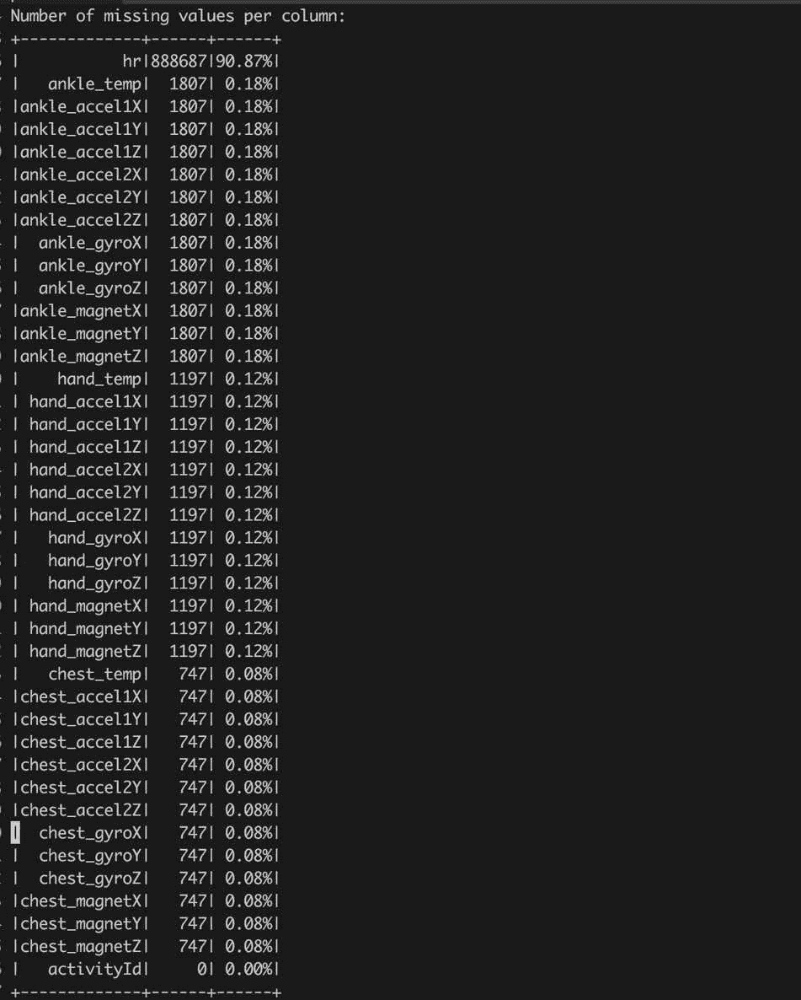

结果显示，第二列（不要忘记我们在数据加载过程中已经删除了无效列），代表受试者心率的列，包含了大量的缺失值。超过 90%的数值被标记为`NaN`，这可能是由实验的测量过程引起的（受试者可能在日常活动中不佩戴心率监测器，只有在进行运动时才佩戴）。

其余的列包含零星的缺失值。

另一个重要的观察是，包含`activityId`的第一列不包含任何缺失值——这是个好消息，意味着所有的观察都被正确注释，我们不需要删除任何观察（例如，没有训练目标，我们就无法训练模型）。

RDD 的`reduce`方法代表动作。这意味着它强制评估`RDD`的结果，并且 reduce 的结果是一个单一的值而不是`RDD`。不要将其与`reduceByKey`混淆，后者是一个`RDD`操作，返回一个新的键值对`RDD`。

下一步是决定如何处理缺失数据。有许多策略可供选择；然而，我们需要保留数据的含义。

我们可以简单地删除包含缺失数据的所有行或列——事实上这是一个非常常见的方法！对于受到太多缺失值污染的行来说是有意义的，但在这种情况下这并不是一个好的全局策略，因为我们观察到缺失值几乎分布在所有的列和行上。因此，我们需要一个更好的策略来处理缺失值。

缺失值来源和插补方法的摘要可以在 A. Gelman 和 J. Hill 的书*Data Analysis Using Regression and Mutlilevel/Hierarchical Models*（[`www.stat.columbia.edu/~gelman/arm/missing.pdf`](http://www.stat.columbia.edu/~gelman/arm/missing.pdf)）或演示文稿[`www.amstat.org/sections/srms/webinarfiles/ModernMethodWebinarMay2012.pdf`](https://www.amstat.org/sections/srms/webinarfiles/ModernMethodWebinarMay2012.pdf)或[`www.utexas.edu/cola/prc/_files/cs/Missing-Data.pdf`](https://www.utexas.edu/cola/prc/_files/cs/Missing-Data.pdf)中找到。

首先考虑心率列，我们不能删除它，因为高心率和运动活动之间存在明显的联系。然而，我们仍然可以用一个合理的常数填充缺失值。在心率的情境下，用列值的平均值替换缺失值——有时被称为*平均计算缺失值*的技术是有意义的。我们可以用以下代码来计算它：

```scala
val heartRateColumn = rawData. 
  map(row => row(1)). 
  filter(_.isNaN). 
  map(_.toInt) 

val heartRateValues = heartRateColumn.collect 
val meanHeartRate = heartRateValues.sum / heartRateValues.count 
scala.util.Sorting.quickSort(heartRateValues) 
val medianHeartRate = heartRateValues(heartRateValues.length / 2) 

println(s"Mean heart rate: ${meanHeartRate}") 
println(s"Median heart rate: ${medianHeartRate}") 
```

输出如下：

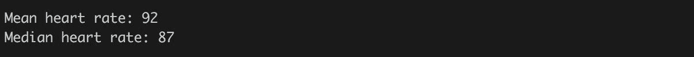

我们可以看到`平均心率`是一个相当高的值，这反映了心率测量主要与运动活动相关（读者可以验证）。但是，例如，考虑到`看电视`这项活动，超过 90 的数值略高于预期值，因为平均静息心率在 60 到 100 之间（根据维基百科）。

因此，在这种情况下，我们可以用平均静息心率（80）替换缺失的心率值，或者我们可以采用计算得到的心率的平均值。之后，我们将填补计算得到的平均值并比较或合并结果（这称为多重插补方法）。或者我们可以附加一个标记有缺失值的列（例如，参见[`www.utexas.edu/cola/prc/_files/cs/Missing-Data.pdf`](https://www.utexas.edu/cola/prc/_files/cs/Missing-Data.pdf)）。

下一步是替换其余列中的缺失值。我们应该执行与心率列相同的分析，并查看缺失数据是否存在模式，或者它们只是随机缺失。例如，我们可以探索缺失值与我们的预测目标（在本例中为`activityId`）之间的依赖关系。因此，我们再次收集每列的缺失值数量；但是，现在我们还记住了每个缺失值的`activityId`：

```scala
def incK,V], v: (K, V)) // (3)
             (implicit num: Numeric[V]): Seq[(K,V)] =
 if (l.exists(_._1 == v._1)) l.map(e => e match {
   case (v._1, n) => (v._1, num.plus(n, v._2))
   case t => t
 }) else l ++ Seq(v)

 val distribTemplate = activityIdCounts.collect.map { case (id, _) => (id, 0) }.toSeq
 val nanColumnDistribV1 = rawData.map { row => // (1)
   val activityId = row(0).toInt
   row.drop(1).map { v =>
     if (v.isNaN) inc(distribTemplate, (activityId, 1)) else distribTemplate
   } // Tip: Make sure that we are returning same type
 }.reduce { (v1, v2) =>  // (2)
   v1.indices.map(idx => v1(idx).foldLeft(v2(idx))(inc)).toArray
 }

 println(s"""
         ^NaN Column x Response distribution V1:
         ^${table(Seq(distribTemplate.map(v => activitiesMap(v._1)))
                  ++ columnNames.drop(1).zip(nanColumnDistribV1).map(v => Seq(v._1) ++ v._2.map(_._2)), true)}
           """.stripMargin('^')) 

```

输出如下：

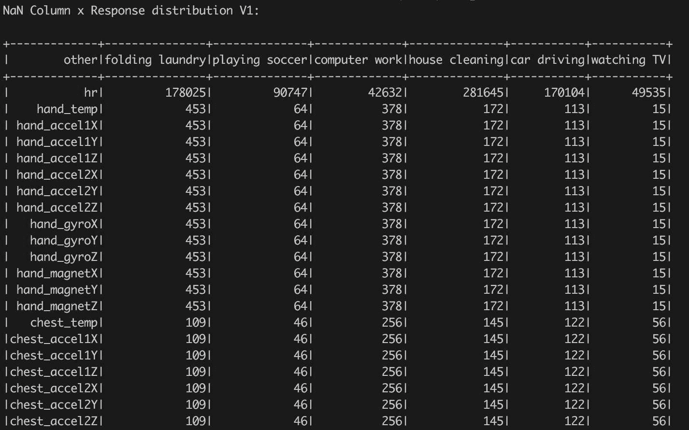

前面的代码稍微复杂，值得解释。调用`(1)`将每行中的每个值转换为`(K, V)`对的序列，其中`K`表示存储在行中的`activityId`，如果相应的列包含缺失值，则`V`为`1`，否则为`0`。然后，reduce 方法`(2)`递归地将由序列表示的行值转换为最终结果，其中每列都有一个分布，由`(K,V)`对的序列表示，其中`K`是`activityId`，`V`表示具有`activityId`的行中的缺失值数量。该方法很简单，但使用了一个非平凡的函数`inc` `(3)`，过于复杂。此外，这种天真的解决方案在内存效率上非常低，因为对于每一列，我们都重复了关于`activityId`的信息。

因此，我们可以通过略微改变结果表示来重申天真的解决方案，不是按列计算分布，而是计算所有列，每个`activityId`的缺失值计数：

```scala
val nanColumnDistribV2 = rawData.map(row => {
   val activityId = row(0).toInt
   (activityId, row.drop(1).map(v => if (v.isNaN) 1 else 0))
 }).reduceByKey( (v1, v2) =>
   v1.indices.map(idx => v1(idx) + v2(idx)).toArray
 ).map { case (activityId, d) =>
   (activitiesMap(activityId), d)
 }.collect

 println(s"""
         ^NaN Column x Response distribution V2:
         ^${table(Seq(columnNames.toSeq) ++ nanColumnDistribV2.map(v => Seq(v._1) ++ v._2), true)}
         """.stripMargin('^'))
```

在这种情况下，结果是一个键值对数组，其中键是活动名称，值包含各列中缺失值的分布。通过运行这两个样本，我们可以观察到第一个样本所需的时间比第二个样本长得多。此外，第一个样本具有更高的内存需求，而且更加复杂。

最后，我们可以将结果可视化为热图，其中*x*轴对应列，*y*轴表示活动，如图 3 所示。这样的图形表示给我们提供了一个清晰的概述，说明了缺失值如何与响应列相关：

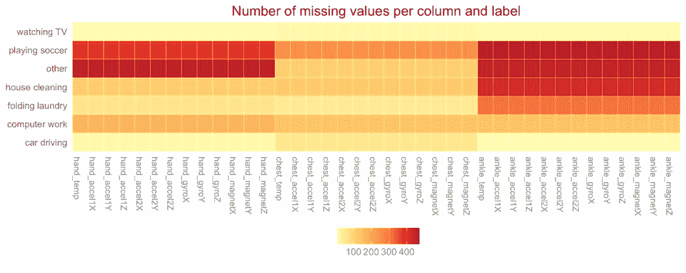

图 3：热图显示按活动分组的每列缺失值数量。

生成的热图很好地显示了缺失值的相关性。我们可以看到缺失值与传感器相连。如果传感器不可用或发生故障，那么所有测量值都不可用。例如，这在踝传感器和`踢足球`等其他活动中是可见的。另一方面，活动`看电视`并没有显示与传感器相关的任何缺失值模式。

此外，缺失数据与活动之间没有其他直接可见的联系。因此，目前我们可以决定用`0.0`填充缺失值，以表示缺失传感器提供默认值。但是，我们的目标是灵活地尝试不同的插补策略（例如，使用相同`activityId`的观测均值来插补）。 

# 缺失值分析摘要

现在我们可以总结我们对缺失值学到的所有事实：

+   有 107 行是无用的，需要被过滤掉

+   有 44 行有`26`或`27`个缺失值。这些行似乎是无用的，所以我们将它们过滤掉。

+   心率列包含大部分缺失值。由于我们期望该列包含可以帮助区分不同运动活动的重要信息，我们不打算忽略该列。但是，我们将根据不同的策略填补缺失值：

+   基于医学研究的平均静息心率

+   根据可用数据计算的`平均心率`

+   其余列中的缺失值存在一种模式 - 缺失值严格与传感器相关。我们将用值`0.0`替换所有这些缺失值。

# 数据统一

这种探索性分析给了我们关于数据形状和我们需要执行的操作的概述，以处理缺失值。然而，我们仍然需要将数据转换为 Spark 算法所期望的形式。这包括：

+   处理缺失值

+   处理分类值

# 缺失值

缺失值处理步骤很容易，因为我们已经在前一节中执行了缺失值探索，并总结了所需的转换。接下来的步骤将实现它们。

首先，我们定义一个缺失值列表 - 对于每一列，我们分配一个单一的`Double`值：

```scala
val imputedValues = columnNames.map { 
  _ match { 
    case "hr" => 60.0 
    case _ => 0.0 
  } 
} 
```

以及一个允许我们将值注入数据集的函数：

```scala
import org.apache.spark.rdd.RDD 
def imputeNaN( 
  data: RDD[Array[Double]],  
  values: Array[Double]): RDD[Array[Double]] = { 
    data.map { row => 
      row.indices.map { i => 
        if (row(i).isNaN) values(i) 
        else row(i) 
      }.toArray 
    } 
} 
```

定义的函数接受一个 Spark `RDD`，其中每一行都表示为一个`Double`数字数组，以及一个包含每列替换缺失值的值的参数。

在下一步中，我们定义一个行过滤器 - 一个方法，它删除包含的缺失值超过给定阈值的所有行。在这种情况下，我们可以轻松地重用已经计算的值`nanCountPerRow`：

```scala
def filterBadRows( 
  rdd: RDD[Array[Double]], 
  nanCountPerRow: RDD[Int], 
  nanThreshold: Int): RDD[Array[Double]] = { 
    rdd.zip(nanCountPerRow).filter { case (row, nanCount) => 
      nanCount > nanThreshold 
  }.map { case (row, _) => 
        row 
  } 
} 
```

请注意，我们参数化了定义的转换。保持代码足够灵活以允许进一步尝试不同的参数是一个好的做法。另一方面，最好避免构建复杂的框架。经验法则是参数化功能，我们希望在不同上下文中使用，或者我们需要在配置代码常量时具有自由度。

# 分类值

Spark 算法可以处理不同形式的分类特征，但它们需要被转换为算法所期望的形式。例如，决策树可以处理分类特征，而线性回归或神经网络需要将分类值扩展为二进制列。

在这个例子中，好消息是我们数据集中的所有输入特征都是连续的。然而，目标特征 - `activityId` - 表示多类特征。Spark MLlib 分类指南（[`spark.apache.org/docs/latest/mllib-linear-methods.html#classification`](https://spark.apache.org/docs/latest/mllib-linear-methods.html#classification)）说：

“训练数据集在 MLlib 中由 LabeledPoint 的 RDD 表示，其中标签是从零开始的类索引。”

但是我们的数据集包含不同数量的 activityIds - 参见计算的变量`activityIdCounts`。因此，我们需要通过定义从`activityId`到`activityIdx`的映射，将它们转换为 MLlib 所期望的形式：

```scala
val activityId2Idx = activityIdCounts. 
  map(_._1). 
  collect. 
  zipWithIndex. 
  toMap 
```

# 最终转换

最后，我们可以将所有定义的功能组合在一起，为模型构建准备数据。首先，`rawData` `RDD`被过滤，所有不良行都被`filterBadRows`移除，然后结果由`imputeNaN`方法处理，该方法在缺失值的位置注入给定的值：

```scala
val processedRawData = imputeNaN( 
  filterBadRows(rawData, nanCountPerRow, nanThreshold = 26), 
  imputedValues) 
```

最后，通过至少计算行数来验证我们调用了正确的转换：

```scala
println(s"Number of rows before/after: ${rawData.count} / ${ processedRawData.count}") 
```

输出如下：

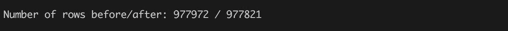

我们可以看到，我们过滤掉了 151 行，这对应于我们之前的观察。

了解数据是数据科学的关键点。这也包括了解缺失数据。永远不要跳过这个阶段，因为它可能导致产生过于良好结果的偏见模型。而且，正如我们不断强调的那样，不了解你的数据将导致你提出不好的问题，最终导致乏味的答案。

# 用随机森林对数据建模

随机森林是一种可以用于不同问题的算法 - 如我们在上一章中展示的二项式，回归，或者多类分类。随机森林的美妙之处在于它将由决策树表示的多个弱学习器组合成一个整体。

此外，为了减少单个决策树的方差，算法使用了 bagging（自举聚合）的概念。每个决策树都是在通过随机选择并替换生成的数据子集上训练的。

不要混淆装袋和提升。提升通过训练每个新模型来强调先前模型错误分类的观察结果来逐步构建集成。通常，在将弱模型添加到集成后，数据会被重新加权，错误分类的观察结果会增加权重，反之亦然。此外，装袋可以并行调用，而提升是一个顺序过程。然而，提升的目标与装袋的目标相同 - 结合几个弱模型的预测，以改善单个模型的泛化和鲁棒性。

提升方法的一个例子是**梯度提升机**（**GBM**），它使用提升方法将弱模型（决策树）组合成一个集成；然而，它通过允许使用任意损失函数来概括这种方法：而不是试图纠正先前的弱模型错误分类的观察结果，GBM 允许您最小化指定的损失函数（例如，回归的均方误差）。

GBM 有不同的变体 - 例如，将提升与装袋相结合的随机 GBM。常规 GBM 和随机 GBM 都可以在 H2O 的机器学习工具箱中找到。此外，重要的是要提到 GBM（以及 RandomForest）是一种在不需要广泛调整参数的情况下构建相当不错模型的算法。

有关 GBM 的更多信息可以在 J.H. Friedman 的原始论文中找到：*贪婪函数逼近：梯度提升机* [`www-stat.stanford.edu/~jhf/ftp/trebst.pdf`](http://www-stat.stanford.edu/~jhf/ftp/trebst.pdf)。

此外，RandomForest 采用所谓的“特征装袋” - 在构建决策树时，它选择一个随机特征子集来做出分裂决策。动机是构建一个弱学习器并增强泛化能力 - 例如，如果一个特征对于给定的目标变量是一个强预测因子，它将被大多数树选择，导致高度相似的树。然而，通过随机选择特征，算法可以避免强预测因子，并构建能够找到数据更精细结构的树。

RandomForest 还有助于轻松选择最具预测性的特征，因为它允许以不同的方式计算变量重要性。例如，通过计算所有树的整体特征不纯度增益，可以很好地估计强特征的重要性。

从实现的角度来看，RandomForest 可以很容易地并行化，因为*构建树*步骤是独立的。另一方面，分布 RandomForest 计算是一个稍微困难的问题，因为每棵树都需要探索几乎完整的数据集。

RandomForest 的缺点是解释性复杂。得到的集成很难探索和解释个别树之间的交互。然而，如果我们需要获得一个不需要高级参数调整的良好模型，它仍然是最好的模型之一。

RandomForest 的一个很好的信息来源是 Leo Breiman 和 Adele Cutler 的原始论文，例如可以在这里找到：[`www.stat.berkeley.edu/~breiman/RandomForests/cc_home.htm`](https://www.stat.berkeley.edu/~breiman/RandomForests/cc_home.htm)。

# 使用 Spark RandomForest 构建分类模型

在前一节中，我们探索了数据并将其统一成一个没有缺失值的形式。我们仍然需要将数据转换为 Spark MLlib 所期望的形式。如前一章所述，这涉及到创建`LabeledPoints`的`RDD`。每个`LabeledPoint`由一个标签和定义输入特征的向量组成。标签用作模型构建者的训练目标，并引用分类变量的索引（参见准备好的转换`activityId2Idx`）：

```scala
import org.apache.spark.mllib 
import org.apache.spark.mllib.regression.LabeledPoint 
import org.apache.spark.mllib.linalg.Vectors 
import org.apache.spark.mllib.tree.RandomForest 
import org.apache.spark.mllib.util.MLUtils 

val data = processedRawData.map { r =>  
    val activityId = r(0) 
    val activityIdx = activityId2Idx(activityId) 
    val features = r.drop(1) 
    LabeledPoint(activityIdx, Vectors.dense(features)) 
} 

```

下一步是为训练和模型验证准备数据。我们简单地将数据分为两部分：80%用于训练，剩下的 20%用于验证：

```scala
val splits = data.randomSplit(Array(0.8, 0.2)) 
val (trainingData, testData) =  
    (splits(0), splits(1)) 
```

在这一步之后，我们准备调用工作流程的建模部分。构建 Spark RandomForest 模型的策略与我们在上一章中展示的 GBM 相同，通过在对象`RandomForest`上调用静态方法`trainClassifier`来实现：

```scala
import org.apache.spark.mllib.tree.configuration._ 
import org.apache.spark.mllib.tree.impurity._ 
val rfStrategy = new Strategy( 
  algo = Algo.Classification, 
  impurity = Entropy, 
  maxDepth = 10, 
  maxBins = 20, 
  numClasses = activityId2Idx.size, 
  categoricalFeaturesInfo = Map[Int, Int](), 
  subsamplingRate = 0.68) 

val rfModel = RandomForest.trainClassifier( 
    input = trainingData,  
    strategy = rfStrategy, 
    numTrees = 50,  
    featureSubsetStrategy = "auto",  
    seed = 42) 
```

在这个例子中，参数被分成两组：

+   定义构建决策树的常见参数的策略

+   RandomForest 特定参数

策略参数列表与上一章讨论的决策树算法的参数列表重叠：

+   `input`：引用由`LabeledPoints`的`RDD`表示的训练数据。

+   `numClasses`：输出类的数量。在这种情况下，我们仅对输入数据中包含的类建模。

+   `categoricalFeaturesInfo`：分类特征及其度量的映射。我们的输入数据中没有分类特征，因此我们传递一个空映射。

+   `impurity`：用于树节点分裂的不纯度度量。

+   `subsamplingRate`：用于构建单棵决策树的训练数据的分数。

+   `maxDepth`：单棵树的最大深度。深树倾向于对输入数据进行编码和过拟合。另一方面，在 RandomForest 中，通过组装多棵树来平衡过拟合。此外，更大的树意味着更长的训练时间和更高的内存占用。

+   `maxBins`：连续特征被转换为具有最多`maxBins`可能值的有序离散特征。离散化是在每个节点分裂之前完成的。

RandomForest 特定参数如下：

+   `numTrees`：结果森林中的树的数量。增加树的数量会减少模型的方差。

+   `featureSubsetStrategy`：指定一种方法，用于选择用于训练单棵树的特征数量。例如："sqrt"通常用于分类，而"onethird"用于回归问题。查看`RandomForest.supportedFeatureSubsetStrategies`的值以获取可用值。

+   `seed`：用于随机生成器初始化的种子，因为 RandomForest 依赖于特征和行的随机选择。

参数`numTrees`和`maxDepth`经常被引用为停止标准。Spark 还提供了额外的参数来停止树的生长并生成细粒度的树：

+   `minInstancesPerNode`：如果节点提供的左节点或右节点包含的观察次数小于此参数指定的值，则不再分裂节点。默认值为 1，但通常对于回归问题或大树，该值应该更高。

+   `minInfoGain`：分裂必须获得的最小信息增益。默认值为 0.0。

此外，Spark RandomForest 接受影响执行性能的参数（请参阅 Spark 文档）。

RandomForest 在定义上是一个依赖于随机化的算法。然而，如果您试图重现结果或测试边缘情况，那么非确定性运行并不是正确的行为。在这种情况下，seed 参数提供了一种固定执行并提供确定性结果的方法。

这是非确定性算法的常见做法；然而，如果算法是并行化的，并且其结果取决于线程调度，那么这还不够。在这种情况下，需要采用临时方法（例如，通过仅使用一个计算线程限制并行化，通过限制输入分区的数量限制并行化，或切换任务调度程序以提供固定的调度）。

# 分类模型评估

现在，当我们有一个模型时，我们需要评估模型的质量，以决定模型是否足够满足我们的需求。请记住，与模型相关的所有质量指标都需要根据您的特定情况考虑，并与您的目标目标（如销售增长、欺诈检测等）一起评估。

# Spark 模型指标

首先，使用 Spark API 提供的嵌入模型指标。我们将使用与上一章相同的方法。我们首先定义一个方法，用于提取给定模型和数据集的模型指标：

```scala
import org.apache.spark.mllib.evaluation._ 
import org.apache.spark.mllib.tree.model._ 
def getMetrics(model: RandomForestModel, data: RDD[LabeledPoint]): 
    MulticlassMetrics = { 
        val predictionsAndLabels = data.map(example => 
            (model.predict(example.features), example.label) 
        ) 
        new MulticlassMetrics(predictionsAndLabels) 
} 
```

然后我们可以直接计算 Spark 的`MulticlassMetrics`：

```scala
val rfModelMetrics = getMetrics(rfModel, testData) 
```

然后首先查看有趣的分类模型指标，称为`混淆矩阵`。它由类型`org.apache.spark.mllib.linalg.Matrix`表示，允许您执行代数运算：

```scala
println(s"""|Confusion matrix: 
  |${rfModelMetrics.confusionMatrix}""".stripMargin) 
```

输出如下：

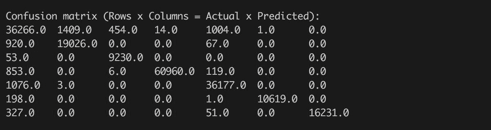

在这种情况下，Spark 在列中打印预测的类。预测的类存储在`rfModelMetrics`对象的`labels`字段中。然而，该字段仅包含已翻译的索引（请参见创建的变量`activityId2Idx`）。尽管如此，我们可以轻松地创建一个函数来将标签索引转换为实际的标签字符串：

```scala
def idx2Activity(idx: Double): String =  
  activityId2Idx. 
  find(e => e._2 == idx.asInstanceOf[Int]). 
  map(e => activitiesMap(e._1)). 
  getOrElse("UNKNOWN") 

val rfCMLabels = rfModelMetrics.labels.map(idx2Activity(_)) 
println(s"""|Labels: 
  |${rfCMLabels.mkString(", ")}""".stripMargin) 
```

输出如下：

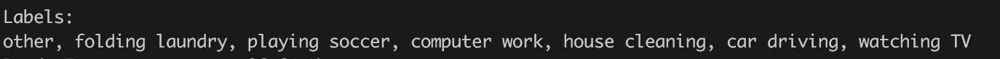

例如，我们可以看到其他活动与其他活动多次被错误预测 - 它在`36455`个案例中被正确预测；然而，在`1261`个案例中，模型预测了`其他`活动，但实际活动是`家务清洁`。另一方面，模型预测了`叠衣服`活动而不是`其他`活动。

您可以直接看到，我们可以基于`混淆矩阵`对角线上正确预测的活动直接计算整体预测准确度：

```scala
val rfCM = rfModelMetrics.confusionMatrix 
val rfCMTotal = rfCM.toArray.sum 
val rfAccuracy = (0 until rfCM.numCols).map(i => rfCM(i,i)).sum / rfCMTotal 
println(f"RandomForest accuracy = ${rfAccuracy*100}%.2f %%") 
```

输出如下：

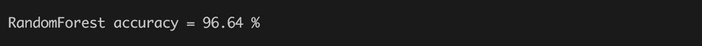

然而，总体准确度可能会在类别不均匀分布的情况下产生误导（例如，大多数实例由单个类别表示）。在这种情况下，总体准确度可能会令人困惑，因为模型只是预测一个主导类将提供高准确度。因此，我们可以更详细地查看我们的预测，并探索每个单独类别的准确度。然而，首先我们查看实际标签和预测标签的分布，以查看`(1)`是否有主导类，以及`(2)`模型是否保留了类别的输入分布并且没有偏向于预测单一类别：

```scala
import org.apache.spark.mllib.linalg.Matrix
 def colSum(m: Matrix, colIdx: Int) = (0 until m.numRows).map(m(_, colIdx)).sum
 def rowSum(m: Matrix, rowIdx: Int) = (0 until m.numCols).map(m(rowIdx, _)).sum
 val rfCMActDist = (0 until rfCM.numRows).map(rowSum(rfCM, _)/rfCMTotal)
 val rfCMPredDist = (0 until rfCM.numCols).map(colSum(rfCM, _)/rfCMTotal)

 println(s"""^Class distribution
             ^${table(Seq("Class", "Actual", "Predicted"),
                      rfCMLabels.zip(rfCMActDist.zip(rfCMPredDist)).map(p => (p._1, p._2._1, p._2._2)),
                      Map(1 -> "%.2f", 2 -> "%.2f"))}
           """.stripMargin('^')) 
```

输出如下：

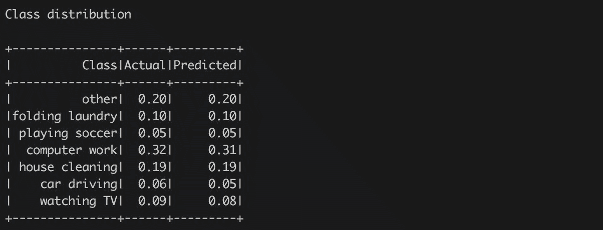

我们很容易看到没有主导类；然而，这些类并不是均匀分布的。值得注意的是，该模型保留了实际类别的分布，并且没有倾向于偏爱单一类别。这只是确认了我们基于`混淆矩阵`的观察。

最后，我们可以查看各个类别并计算精确度（又称阳性预测值）、召回率（或称灵敏度）和`F-1`分数。为了提醒上一章的定义：精确度是给定类别的正确预测的比例（即 TP/TP+TF），而召回率被定义为所有正确预测的类实例的比例（即 TP/TP+FN）。最后，`F-1`分数结合了它们两个，因为它是精确度和召回率的加权调和平均数。我们可以使用我们已经定义的函数轻松计算它们：

```scala
def rfPrecision(m: Matrix, feature: Int) = m(feature, feature) / colSum(m, feature)
 def rfRecall(m: Matrix, feature: Int) = m(feature, feature) / rowSum(m, feature)
 def rfF1(m: Matrix, feature: Int) = 2 * rfPrecision(m, feature) * rfRecall(m, feature) / (rfPrecision(m, feature) + rfRecall(m, feature))

 val rfPerClassSummary = rfCMLabels.indices.map { i =>
   (rfCMLabels(i), rfRecall(rfCM, i), rfPrecision(rfCM, i), rfF1(rfCM, i))
 }

 println(s"""^Per class summary:
             ^${table(Seq("Label", "Recall", "Precision", "F-1"),
                      rfPerClassSummary,
                      Map(1 -> "%.4f", 2 -> "%.4f", 3 -> "%.4f"))}
           """.stripMargin('^')) 
```

输出如下：

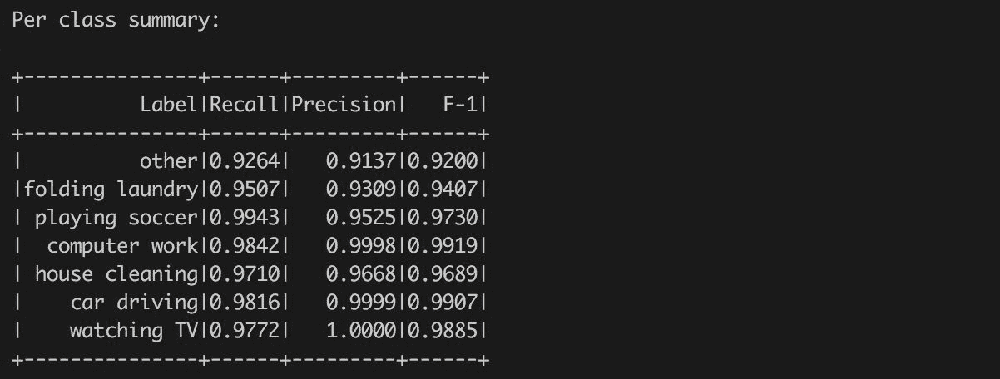

在我们的案例中，我们处理了一个相当不错的模型，因为大多数值都接近于 1.0。这意味着该模型对每个输入类别的表现良好 - 生成了较少的假阳性（精确度）和假阴性（召回）。

Spark API 的一个很好的特性是它已经提供了计算我们手动计算的所有三个指标的方法。我们可以轻松调用`precision`、`recall`、`fMeasure`方法，并使用标签索引获得相同的值。然而，在 Spark 的情况下，每次调用都会收集`混淆矩阵`，从而增加整体计算时间。

在我们的案例中，我们使用已经计算的`混淆矩阵`并直接获得相同的结果。读者可以验证以下代码是否给出了与`rfPerClassSummary`中存储的相同数字：

```scala
val rfPerClassSummary2 = rfCMLabels.indices.map { i =>  
    (rfCMLabels(i), rfModelMetrics.recall(i), rfModelMetrics.precision(i), rfModelMetrics.fMeasure(i))  
} 
```

通过每个类的统计数据，我们可以通过计算每个计算指标的平均值来简单地计算宏平均指标：

```scala
val rfMacroRecall = rfCMLabels.indices.map(i => rfRecall(rfCM, i)).sum/rfCMLabels.size 
val rfMacroPrecision = rfCMLabels.indices.map(i => rfPrecision(rfCM, i)).sum/rfCMLabels.size 
val rfMacroF1 = rfCMLabels.indices.map(i => rfF1(rfCM, i)).sum/rfCMLabels.size 

println(f"""|Macro statistics 
  |Recall, Precision, F-1 
  |${rfMacroRecall}%.4f, ${rfMacroPrecision}%.4f, ${rfMacroF1}%.4f""".stripMargin) 
```

输出如下：

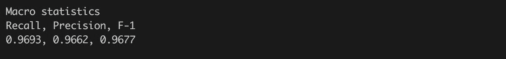

`Macro`统计数据为我们提供了所有特征统计的整体特征。我们可以看到预期值接近 1.0，因为我们的模型在测试数据上表现相当不错。

此外，Spark ModelMetrics API 还提供了加权精度、召回率和`F-1`分数，这些主要在处理不平衡的类时非常有用：

```scala
println(f"""|Weighted statistics 
  |Recall, Precision, F-1 
  |${rfModelMetrics.weightedRecall}%.4f, ${rfModelMetrics.weightedPrecision}%.4f, ${rfModelMetrics.weightedFMeasure}%.4f 
  |""".stripMargin) 
```

输出如下：

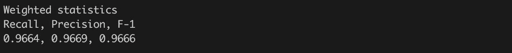

最后，我们将看一种计算模型指标的方法，这种方法在类别分布不均匀的情况下也很有用。该方法称为一对所有，它提供了分类器相对于一个类的性能。这意味着我们将为每个输出类别计算一个`混淆矩阵` - 我们可以将这种方法视为将分类器视为一个二元分类器，预测一个类作为正例，其他任何类作为负例：

```scala
import org.apache.spark.mllib.linalg.Matrices 
val rfOneVsAll = rfCMLabels.indices.map { i => 
    val icm = rfCM(i,i) 
    val irowSum = rowSum(rfCM, i) 
    val icolSum = colSum(rfCM, i) 
    Matrices.dense(2,2,  
      Array( 
        icm, irowSum - icm, 
        icolSum - icm, rfCMTotal - irowSum - icolSum + icm)) 
  } 
println(rfCMLabels.indices.map(i => s"${rfCMLabels(i)}\n${rfOneVsAll(i)}").mkString("\n")) 
```

这将为我们提供每个类别相对于其他类别的性能，由简单的二进制`混淆矩阵`表示。我们可以总结所有矩阵并得到一个`混淆矩阵`，以计算每个类的平均准确度和微平均指标：

```scala
val rfOneVsAllCM = rfOneVsAll.foldLeft(Matrices.zeros(2,2))((acc, m) => 
  Matrices.dense(2, 2,  
    Array(acc(0, 0) + m(0, 0),  
          acc(1, 0) + m(1, 0), 
          acc(0, 1) + m(0, 1), 
          acc(1, 1) + m(1, 1))) 
) 
println(s"Sum of oneVsAll CM:\n${rfOneVsAllCM}") 
```

输出如下：

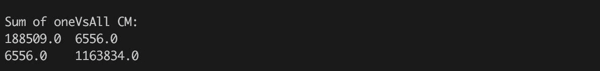

有了整体的`混淆矩阵`，我们可以计算每个类的平均准确度：

```scala
println(f"Average accuracy: ${(rfOneVsAllCM(0,0) + rfOneVsAllCM(1,1))/rfOneVsAllCM.toArray.sum}%.4f") 
```

输出如下：

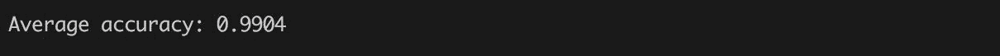

该矩阵还给出了`微平均指标`（召回率、精度、`F-1`）。然而，值得一提的是我们的`rfOneVsAllCM`矩阵是对称的。这意味着`召回率`、`精度`和`F-1`具有相同的值（因为 FP 和 FN 是相同的）：

```scala
println(f"Micro-averaged metrics: ${rfOneVsAllCM(0,0)/(rfOneVsAllCM(0,0)+rfOneVsAllCM(1,0))}%.4f") 
```

输出如下：

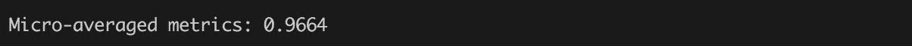

Spark ModelMetrics API 的概述由 Spark 文档提供[`spark.apache.org/docs/latest/mllib-evaluation-metrics.html`](https://spark.apache.org/docs/latest/mllib-evaluation-metrics.html)。

此外，了解模型指标，特别是多类分类中`混淆矩阵`的作用是至关重要的，但不仅仅与 Spark API 有关。一个很好的信息来源是 Python scikit 文档（[`scikit-learn.org/stable/modules/model_evaluation.html`](http://scikit-learn.org/stable/modules/model_evaluation.html)）或各种 R 包（例如，[`blog.revolutionanalytics.com/2016/03/com_class_eval_metrics_r.html`](http://blog.revolutionanalytics.com/2016/03/com_class_eval_metrics_r.html)）。

# 使用 H2O RandomForest 构建分类模型

H2O 提供了多种算法来构建分类模型。在本章中，我们将再次专注于树集成，但我们将演示它们在传感器数据问题的背景下的使用。

我们已经准备好了数据，可以直接用来构建 H2O RandomForest 模型。要将它们转换为 H2O 格式，我们需要创建`H2OContext`，然后调用相应的转换：

```scala
import org.apache.spark.h2o._ 
val h2oContext = H2OContext.getOrCreate(sc) 

val trainHF = h2oContext.asH2OFrame(trainingData, "trainHF") 
trainHF.setNames(columnNames) 
trainHF.update() 
val testHF = h2oContext.asH2OFrame(testData, "testHF") 
testHF.setNames(columnNames) 
testHF.update() 
```

我们创建了两个表，分别以`trainHF`和`testHF`命名。代码还通过调用`setNames`方法更新了列的名称，因为输入的`RDD`不包含有关列的信息。重要的一步是调用`update`方法将更改保存到 H2O 的分布式内存存储中。这是 H2O API 暴露的一个重要模式 - 对对象进行的所有更改都是在本地完成的；为了使它们对其他计算节点可见，有必要将它们保存到内存存储中（所谓的**分布式键值存储**（**DKV**））。

将数据存储为 H2O 表后，我们可以通过调用`h2oContext.openFlow`打开 H2O Flow 用户界面，并以图形方式探索数据。例如，数值特征`activityId`列的分布如*图 4*所示：

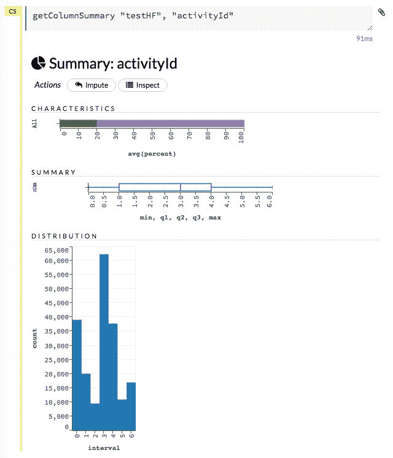

图 4：需要转换为分类类型的数值列 activityId 的视图。

我们可以直接比较结果，并通过一段 Spark 代码验证我们观察到正确的分布：

```scala
println(s"""^Distribution of activityId:
             ^${table(Seq("activityId", "Count"),
                      testData.map(row => (row.label, 1)).reduceByKey(_ + _).collect.sortBy(_._1),
                      Map.empty[Int, String])}
             """.stripMargin('^')) 
```

输出如下：

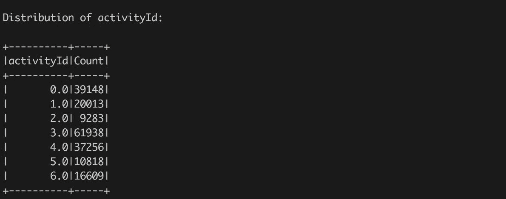

下一步是准备输入数据来运行 H2O 算法。首先，我们需要验证列类型是否符合算法所期望的形式。H2O Flow UI 提供了带有基本属性的列的列表（*图 5*）：

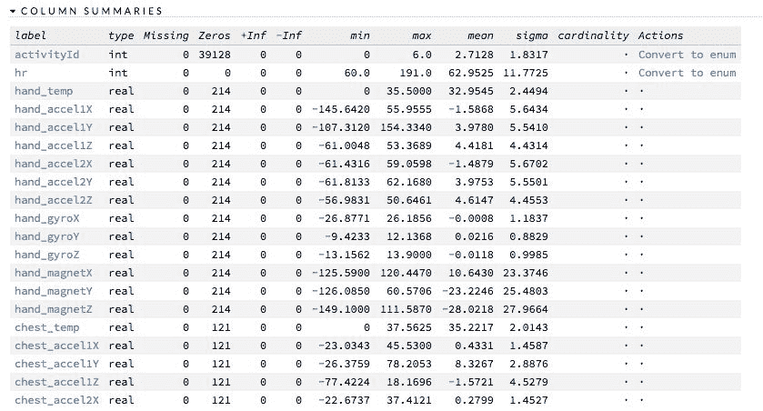

图 5：在 Flow UI 中显示的导入训练数据集的列。

我们可以看到`activityId`列是数值的；然而，为了进行分类，H2O 要求列必须是分类的。因此，我们需要通过在 UI 中点击"转换为枚举"或以编程方式进行转换： 

```scala
trainHF.replace(0, trainHF.vec(0).toCategoricalVec).remove 
trainHF.update 
testHF.replace(0, testHF.vec(0).toCategoricalVec).remove 
testHF.update 
```

再次，我们需要通过调用`update`方法更新内存存储中的修改后的帧。此外，我们正在将一个向量转换为另一个向量类型，我们不再需要原始向量，因此我们可以在`replace`调用的结果上调用`remove`方法。

转换后，`activityId`列是分类的；然而，向量域包含值"0"，"1"，..."6" - 它们存储在字段`trainHF.vec("activityId").domain`中。然而，我们可以使用实际的类别名称更新向量。我们已经准备好了索引到名称转换，称为`idx2Activity` - 因此我们准备一个新的域，并更新训练和测试表的`activityId`向量域：

```scala
val domain = trainHF.vec(0).domain.map(i => idx2Activity(i.toDouble)) 
trainHF.vec(0).setDomain(domain) 
water.DKV.put(trainHF.vec(0)) 
testHF.vec(0).setDomain(domain) 
water.DKV.put(testHF.vec(0)) 
```

在这种情况下，我们还需要更新内存存储中修改后的向量 - 代码不是调用`update`方法，而是显式调用`water.DKV.put`方法，直接将对象保存到内存存储中。

在 UI 中，我们可以再次探索测试数据集的`activityId`列，并将其与计算结果进行比较- *图 6：*

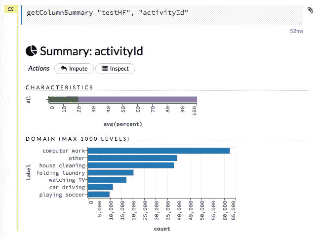

图 6：测试数据集中的 activityId 值分布。

在这一点上，我们已经准备好执行模型构建的数据。H2O RandomForest 的分类问题配置遵循我们在上一章中介绍的相同模式：

```scala
import _root_.hex.tree.drf.DRF 
import _root_.hex.tree.drf.DRFModel 
import _root_.hex.tree.drf.DRFModel.DRFParameters 
import _root_.hex.ScoreKeeper._ 
import _root_.hex.ConfusionMatrix 
import water.Key.make 

val drfParams = new DRFParameters 
drfParams._train = trainHF._key 
drfParams._valid = testHF._key 
drfParams._response_column = "activityId" 
drfParams._max_depth = 20 
drfParams._ntrees = 50 
drfParams._score_each_iteration = true 
drfParams._stopping_rounds = 2 
drfParams._stopping_metric = StoppingMetric.misclassification 
drfParams._stopping_tolerance = 1e-3 
drfParams._seed = 42 
drfParams._nbins = 20 
drfParams._nbins_cats = 1024 

val drfModel = new DRF(drfParams, makeDRFModel).trainModel.get 
```

H2O 算法与 Spark 之间有几个重要的区别。第一个重要的区别是我们可以直接指定验证数据集作为输入参数（`_valid`字段）。这并不是必需的，因为我们可以在构建模型后进行验证；然而，当指定验证数据集时，我们可以在构建过程中实时跟踪模型的质量，并在我们认为模型已经足够好时停止模型构建（参见*图 7* - "取消作业"操作停止训练，但模型仍然可用于进一步操作）。此外，稍后我们可以继续模型构建并添加更多的树，如果需要的话。参数`_score_each_iteration`控制评分应该多频繁进行：

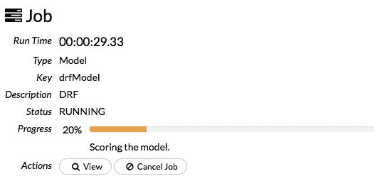

图 7：在 Flow UI 中可以跟踪模型训练，并通过按下"取消作业"按钮停止。

另一个区别在于参数`_nbins`、`_nbins_top_level`和`_nbins_cats`。Spark RandomForest 实现接受参数`maxBins`来控制连续特征的离散化。在 H2O 的情况下，它对应于参数`_nbins`。然而，H2O 机器学习平台允许对离散化进行更精细的调整。由于顶层分割最重要，并且可能因为离散化而导致信息丢失，H2O 允许通过参数`_nbins_top_level`临时增加离散类别的数量。此外，高值分类特征（> 1,024 个级别）通常会通过强制算法考虑所有可能的分割成两个不同子集来降低计算性能。对于这种情况，H2O 引入了参数`_nbins_cats`，它控制分类级别的数量 - 如果一个特征包含的分类级别多于参数中存储的值，则这些值将重新分组以适应`_nbins_cats`个箱子。

最后一个重要的区别是，我们在集成中指定了额外的停止标准，以及传统的深度和树的数量。该标准限制了在验证数据上计算的误分类的改善 - 在这种情况下，我们指定，如果验证数据上连续两次评分测量（字段`_stopping_rounds`）不提高 0.001（字段`_stopping_tolerance`的值），则模型构建应该停止。如果我们知道模型的预期质量并希望限制模型训练时间，这是一个完美的标准。在我们的情况下，我们可以探索生成集成中的树的数量：

```scala
println(s"Number of trees: ${drfModel._output._ntrees}") 
```

输出如下：

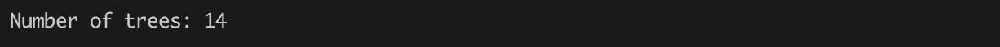

即使我们要求 50 棵树，由于模型训练在给定阈值下未改善误分类率，因此生成的模型只有`14`棵树。

H2O API 公开了多个停止标准，可以被任何算法使用 - 用户可以使用 AUC 值进行二项问题或 MSE 进行回归问题。这是最强大的功能之一，可以让您在探索大量超参数空间时减少计算时间。

模型的质量可以通过两种方式来探索：（1）直接使用 Scala API 并访问模型字段`_output`，其中包含所有输出指标，或者（2）使用图形界面以更用户友好的方式来探索指标。例如，可以在 Flow UI 中的模型视图中直接显示指定验证集上的`混淆矩阵`。参考下图：


图 8：由 14 棵树组成的初始 RandomForest 模型的混淆矩阵。

它直接给出了错误率（0.22%）和每个类别的误分类，我们可以直接与使用 Spark 模型计算的准确性进行比较。此外，`混淆矩阵`可以用于计算我们探索的其他指标。

例如，计算每个类别的召回率、精确度和`F-1`指标。我们可以简单地将 H2O 的`混淆矩阵`转换为 Spark 的`混淆矩阵`，并重用所有定义的方法。但是我们必须小心不要混淆结果`混淆矩阵`中的实际值和预测值（Spark 矩阵的预测值在列中，而 H2O 矩阵的预测值在行中）：

```scala
val drfCM = drfModel._output._validation_metrics.cm 
def h2oCM2SparkCM(h2oCM: ConfusionMatrix): Matrix = { 
  Matrices.dense(h2oCM.size, h2oCM.size, h2oCM._cm.flatMap(x => x)) 
} 
val drfSparkCM = h2oCM2SparkCM(drfCM) 
```

您可以看到指定验证数据集的计算指标存储在模型输出字段`_output._validation_metrics`中。它包含`混淆矩阵`，还包括在训练过程中跟踪的模型性能的其他信息。然后我们简单地将 H2O 表示转换为 Spark 矩阵。然后我们可以轻松地计算每个类别的宏性能：

```scala
val drfPerClassSummary = drfCM._domain.indices.map { i =>
   (drfCM._domain(i), rfRecall(drfSparkCM, i), rfPrecision(drfSparkCM, i), rfF1(drfSparkCM, i))
 }

 println(s"""^Per class summary
             ^${table(Seq("Label", "Recall", "Precision", "F-1"),
                      drfPerClassSummary,
                      Map(1 -> "%.4f", 2 -> "%.4f", 3 -> "%.4f"))}
           """.stripMargin('^')) 
```

输出如下：

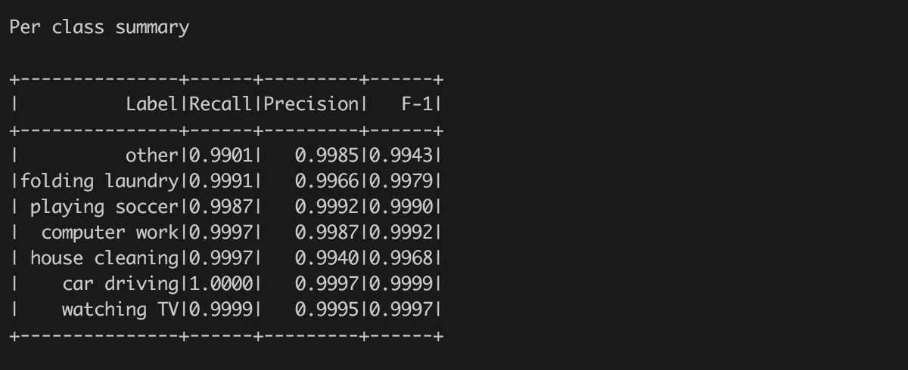

您可以看到，结果略优于之前计算的 Spark 结果，尽管 H2O 使用的树较少。解释需要探索 H2O 实现的随机森林算法 - H2O 使用的算法是基于为每个输出类生成一个回归决策树的方法 - 这种方法通常被称为“一对所有”方案。该算法允许针对各个类别进行更精细的优化。因此，在这种情况下，14 个随机森林树在内部由 14*7 = 98 个内部决策树表示。

读者可以在 Ryan Rifkin 和 Aldebaro Klautau 的论文*In Defense of One-Vs-All Classification*中找到更多关于“一对所有”方案在多类分类问题中的好处的解释。作者表明，该方案与其他方法一样准确；另一方面，该算法强制生成更多的决策树，这可能会对计算时间和内存消耗产生负面影响。

我们可以探索关于训练模型的更多属性。随机森林的一个重要指标是变量重要性。它存储在模型的字段`_output._varimp`下。该对象包含原始值，可以通过调用`scaled_values`方法进行缩放，或者通过调用`summary`方法获得相对重要性。然而，它们可以在 Flow UI 中以图形方式进行探索，如*图 9*所示。图表显示，最重要的特征是来自所有三个传感器的测量温度，其次是各种运动数据。令人惊讶的是，与我们的预期相反，心率并未包含在最重要的特征中。

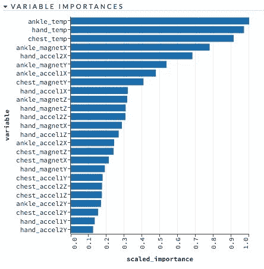

图 9：模型“drfModel”的变量重要性。最重要的特征包括测量温度。

如果我们对模型的质量不满意，可以通过增加更多的树来扩展它。我们可以重用定义的参数，并以以下方式修改它们：

+   设置所需的集成树的数量（例如，20）。

+   禁用早停准则，以避免在达到所需数量的树之前停止模型训练。

+   配置所谓的*模型检查点*，指向先前训练过的模型。模型检查点是 H2O 机器学习平台的独特功能，适用于所有已发布的模型。在需要通过执行更多的训练迭代来改进给定模型的情况下，它非常有用。

之后，我们可以简单地再次启动模型构建。在这种情况下，H2O 平台简单地继续模型训练，重建模型状态，并构建并附加新树到新模型中。

```scala
drfParams._ntrees = 20 
drfParams._stopping_rounds = 0 
drfParams._checkpoint = drfModel._key 

val drfModel20 = new DRF(drfParams, makeDRFModel).trainModel.get 
println(s"Number of trees: ${drfModel20._output._ntrees}") 
```

输出如下：

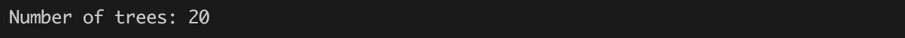

在这种情况下，只构建了`6`棵树 - 要查看这一点，用户可以在控制台中探索模型训练输出，并找到一个以模型训练输出和报告结束的行：

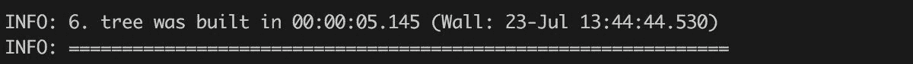

第 6 棵树在 2 秒内生成，并且是附加到现有集成中创建新模型的最后一棵树。我们可以再次探索新构建模型的`混淆矩阵`，并看到整体错误率从 0.23 降至 0.2%的改善（见*图 9*）：

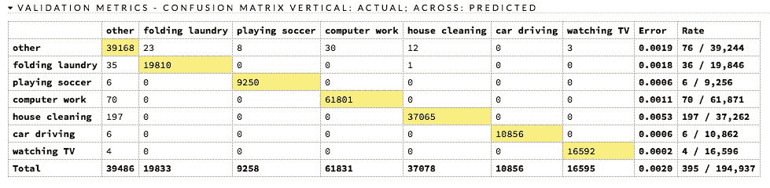

图 10：具有 20 棵树的随机森林模型的混淆矩阵。

# 总结

本章介绍了几个重要概念，包括数据清理和处理缺失和分类值，使用 Spark 和 H2O 训练多分类模型，以及分类模型的各种评估指标。此外，本章介绍了模型集成的概念，以 RandomForest 作为决策树的集成。

读者应该看到数据准备的重要性，在每个模型训练和评估过程中都起着关键作用。在不了解建模背景的情况下训练和使用模型可能会导致误导性的决策。此外，每个模型都需要根据建模目标进行评估（例如，最小化假阳性）。因此，了解分类模型的不同模型指标的权衡是至关重要的。

在本章中，我们没有涵盖所有可能的分类模型建模技巧，但还有一些对好奇的读者来说仍然是开放的。

我们使用了一个简单的策略来填补心率列中的缺失值，但还有其他可能的解决方案 - 例如，均值插补，或者将插补与额外的二进制列相结合，标记具有缺失值的行。这两种策略都可以提高模型的准确性，我们将在本书的后面部分使用它们。

此外，奥卡姆剃刀原则表明，更倾向于选择一个简单的模型，而不是一个复杂的模型，尽管它们提供相同的准确性是一个好主意。因此，一个好主意是定义一个参数的超空间，并使用探索策略找到最简单的模型（例如，更少的树木，更少的深度），它提供与本章训练的模型相同（或更好）的准确性。

总结本章，重要的是要提到，本章介绍的树集成是集成和超学习器强大概念的一个原始实例，我们将在本书的后面部分介绍。
