# 第四章：使用 NLP 和 Spark 流处理预测电影评论

在本章中，我们将深入研究**自然语言处理**（**NLP**）领域，不要与神经语言编程混淆！NLP 有助于分析原始文本数据并提取有用信息，如句子结构、文本情感，甚至不同语言之间的翻译。由于许多数据源包含原始文本（例如评论、新闻文章和医疗记录），NLP 变得越来越受欢迎，因为它提供了对文本的洞察，并有助于更轻松地做出自动化决策。

在幕后，NLP 通常使用机器学习算法来提取和建模文本的结构。如果将 NLP 应用于另一个机器方法的背景下，例如文本可以代表输入特征之一，NLP 的力量就更加明显。

在本章中，我们将应用 NLP 来分析电影评论的*情感*。基于标注的训练数据，我们将构建一个分类模型，用于区分正面和负面的电影评论。重要的是要提到，我们不直接从文本中提取情感（基于诸如爱、恨等词语），而是利用我们在上一章中已经探讨过的二元分类。

为了实现这一目标，我们将采用事先手动评分的原始电影评论，并训练一个集成模型-一组模型-如下所示：

1.  处理电影评论以合成我们模型的特征。

在这里，我们将探讨使用文本数据创建各种特征的方法，从词袋模型到加权词袋模型（例如 TF-IDF），然后简要探讨 word2vec 算法，我们将在第五章中详细探讨，即预测和聚类的 Word2vec。

与此同时，我们将研究一些基本的特征选择/省略方法，包括去除停用词和标点，或者词干提取。

1.  利用生成的特征，我们将运行各种监督的二元分类算法，帮助我们对正面和负面的评论进行分类，其中包括以下内容：

+   分类决策树

+   朴素贝叶斯

+   随机森林

+   梯度提升树

1.  利用四种不同学习算法的综合预测能力，我们将创建一个超级学习模型，该模型将四种模型的所有“猜测”作为元特征，训练一个深度神经网络输出最终预测。

1.  最后，我们将为此过程创建一个 Spark 机器学习管道，该管道执行以下操作：

+   从新的电影评论中提取特征

+   提出一个预测

+   在 Spark 流应用程序中输出这个预测（是的，你将在本书的剩余章节中构建你的第一个机器学习应用程序！）

如果这听起来有点雄心勃勃，那就放心吧！我们将以一种有条理和有目的的方式逐步完成这些任务，这样你就可以有信心构建自己的 NLP 应用；但首先，让我们简要了解一下这个令人兴奋的领域的一些背景历史和理论。

# NLP - 简要介绍

就像人工神经网络一样，NLP 是一个相对“古老”的主题，但最近由于计算能力的提升和机器学习算法在包括但不限于以下任务中的各种应用，它引起了大量关注：

+   机器翻译（MT）：在其最简单的形式中，这是机器将一种语言的词翻译成另一种语言的词的能力。有趣的是，机器翻译系统的提议早于数字计算机的创建。第一个自然语言处理应用之一是在二战期间由美国科学家沃伦·韦弗（Warren Weaver）创建的，他的工作是试图破译德国密码。如今，我们有高度复杂的应用程序，可以将一段文本翻译成我们想要的任意数量的不同语言！

+   语音识别（SR）：这些方法和技术试图利用机器识别和翻译口语到文本。我们现在在智能手机中看到这些技术，这些手机使用语音识别系统来帮助我们找到最近的加油站的方向，或者查询谷歌周末的天气预报。当我们对着手机说话时，机器能够识别我们说的话，然后将这些话翻译成计算机可以识别并执行某些任务的文本。

+   信息检索（IR）：你是否曾经阅读过一篇文章，比如新闻网站上的一篇文章，然后想看看与你刚刚阅读的文章类似的新闻文章？这只是信息检索系统的一个例子，它以一段文本作为“输入”，并寻求获取与输入文本类似的其他相关文本。也许最简单和最常见的信息检索系统的例子是在基于网络的搜索引擎上进行搜索。我们提供一些我们想要“了解更多”的词（这是“输入”），输出是搜索结果，希望这些结果与我们的输入搜索查询相关。

+   信息提取（IE）：这是从非结构化数据（如文本、视频和图片）中提取结构化信息的任务。例如，当你阅读某个网站上的博客文章时，通常会给这篇文章打上几个描述这篇文章一般主题的关键词，这可以使用信息提取系统进行分类。信息提取的一个极其受欢迎的领域是称为*视觉信息提取*，它试图从网页的视觉布局中识别复杂实体，这在典型的自然语言处理方法中无法捕捉到。

+   文本摘要（该项没有缩写！）：这是一个非常受欢迎的研究领域。这是通过识别主题等方式，对各种长度的文本进行摘要的任务。在下一章中，我们将通过主题模型（如潜在狄利克雷分配（LDA）和潜在语义分析（LSA））来探讨文本摘要的两种流行方法。

在本章中，我们将使用自然语言处理技术来帮助我们解决来自国际电影数据库（IMDb）的电影评论的二元分类问题。现在让我们将注意力转移到我们将使用的数据集，并学习更多关于使用 Spark 进行特征提取的技术。

# 数据集

最初发表在 Andrew L. Maas 等人的论文《为情感分析学习词向量》中的《大型电影评论数据库》可以从[`ai.stanford.edu/~amaas/data/sentiment/`](http://ai.stanford.edu/~amaas/data/sentiment/)下载。

下载的存档包含两个标记为*train*和*test*的文件夹。对于训练，有 12,500 条正面评价和 12,500 条负面评价，我们将在这些上训练一个分类器。测试数据集包含相同数量的正面和负面评价，总共有 50,000 条正面和负面评价在这两个文件中。

让我们看一个评论的例子，看看数据是什么样子的：

“Bromwell High”简直太棒了。剧本写得精彩，表演完美，这部对南伦敦公立学校的学生和老师进行讽刺的喜剧让你捧腹大笑。它粗俗、挑衅、机智而敏锐。角色们是对英国社会（或者更准确地说，是对任何社会）的绝妙夸张。跟随凯莎、拉特丽娜和娜特拉的冒险，我们的三位“主角”，这部节目毫不避讳地对每一个可以想象的主题进行了讽刺。政治正确在每一集中都被抛在了窗外。如果你喜欢那些不怕拿每一个禁忌话题开玩笑的节目，那么《布朗韦尔高中》绝对不会让你失望！

看起来我们唯一需要处理的是来自电影评论的原始文本和评论情感；除了文本之外，我们对发布日期、评论者以及其他可能有用的数据一无所知。

# 数据集准备

在运行任何数据操作之前，我们需要像在前几章中那样准备好 Spark 环境。让我们启动 Spark shell，并请求足够的内存来处理下载的数据集：

```scala
export SPARK_HOME="<path to your Spark2.0 distribution"
export SPARKLING_WATER_VERSION="2.1.12"
export SPARK_PACKAGES=\
"ai.h2o:sparkling-water-core_2.11:${SPARKLING_WATER_VERSION},\
ai.h2o:sparkling-water-repl_2.11:${SPARKLING_WATER_VERSION},\
ai.h2o:sparkling-water-ml_2.11:${SPARKLING_WATER_VERSION},\
com.packtpub:mastering-ml-w-spark-utils:1.0.0"
$SPARK_HOME/bin/spark-shell \
--master 'local[*]' \
--driver-memory 10g \
--executor-memory 10g \
--confspark.executor.extraJavaOptions=-XX:MaxPermSize=384M \
--confspark.driver.extraJavaOptions=-XX:MaxPermSize=384M \
--packages "$SPARK_PACKAGES" "$@"
```

为了避免 Spark 产生过多的日志输出，可以通过在 SparkContext 上调用`setLogLevel`来直接控制运行时的日志级别：

`sc.setLogLevel("WARN")`

该命令减少了 Spark 输出的冗长程度。

下一个挑战是读取训练数据集，它由 25,000 条积极和消极的电影评论组成。以下代码将读取这些文件，然后创建我们的二进制标签，0 表示消极评论，1 表示积极评论。

我们直接利用了暴露的 Spark `sqlContext`方法`textFile`，它允许读取多个文件并返回 Dataset[String]。这与前几章提到的方法不同，前几章使用的是`wholeTextFiles`方法，产生的是 RDD[String]：

```scala
val positiveReviews= spark.sqlContext.read.textFile("../data/aclImdb/train/pos/*.txt") 
   .toDF("reviewText") 
println(s"Number of positive reviews: ${positiveReviews.count}") 
Number of positive reviews: 12500
```

我们可以直接使用数据集方法`show`来显示前五行（您可以修改截断参数以显示评论的完整文本）：

```scala
println("Positive reviews:")
positiveReviews.show(5, truncate = true)
```

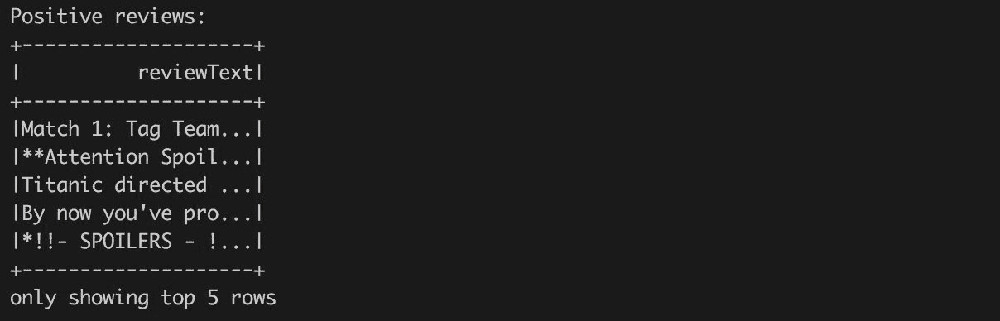

接下来，我们将对消极评论做同样的处理：

```scala
val negativeReviews= spark.sqlContext.read.textFile("../data/aclImdb/train/neg/*.txt")
                .toDF("reviewText")
println(s"Number of negative reviews: ${negativeReviews.count}")
```

看一下以下的截图：

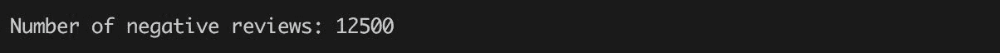

现在，*positiveReview*和*negativeReviews*变量分别表示加载的评论的 RDD。数据集的每一行包含一个表示单个评论的字符串。然而，我们仍然需要生成相应的标签，并将加载的两个数据集合并在一起。

标记很容易，因为我们将消极和积极的评论加载为分开的 Spark 数据框。我们可以直接添加一个表示消极评论的标签 0 和表示积极评论的标签 1 的常量列：

```scala
import org.apache.spark.sql.functions._
val pos= positiveReviews.withColumn("label", lit(1.0))
val neg= negativeReviews.withColumn("label", lit(0.0))
var movieReviews= pos.union(neg).withColumn("row_id", monotonically_increasing_id)
println("All reviews:")
movieReviews.show(5)
```

看一下以下的截图：

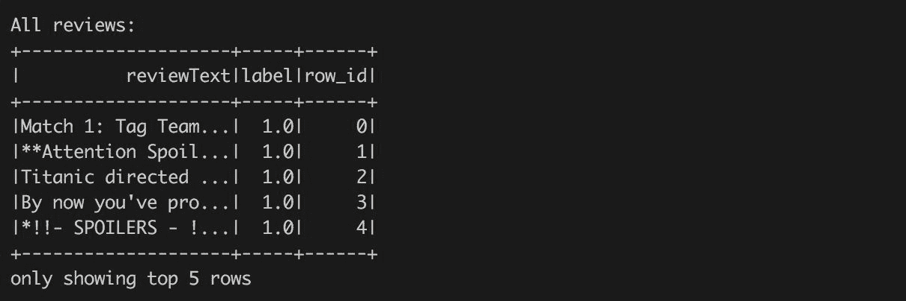

在这种情况下，我们使用了`withColumn`方法，它会在现有数据集中添加一个新列。新列`lit(1.0)`的定义意味着一个由数字文字*1.0*定义的常量列。我们需要使用一个实数来定义目标值，因为 Spark API 需要它。最后，我们使用`union`方法将这两个数据集合并在一起。

我们还添加了魔术列`row_id`，它唯一标识数据集中的每一行。这个技巧简化了我们在需要合并多个算法的输出时的工作流程。

为什么我们使用双精度值而不是字符串标签表示？在代码标记单个评论时，我们使用了表示双精度数字的数字文字来定义一个常量列。我们也可以使用*lit("positive")*来标记积极的评论，但是使用纯文本标签会迫使我们在后续步骤中将字符串值转换为数值。因此，在这个例子中，我们将直接使用双精度值标签来简化我们的生活。此外，我们直接使用双精度值，因为 Spark API 要求这样做。

# 特征提取

在这个阶段，我们只有一个代表评论的原始文本，这不足以运行任何机器学习算法。我们需要将文本转换为数字格式，也就是进行所谓的“特征提取”（就像它听起来的那样；我们正在提取输入数据并提取特征，这些特征将用于训练模型）。该方法基于输入特征生成一些新特征。有许多方法可以将文本转换为数字特征。我们可以计算单词的数量、文本的长度或标点符号的数量。然而，为了以一种系统化的方式表示文本，反映文本结构，我们需要更复杂的方法。

# 特征提取方法-词袋模型

现在我们已经摄取了我们的数据并创建了我们的标签，是时候提取我们的特征来构建我们的二元分类模型了。顾名思义，词袋模型方法是一种非常常见的特征提取技术，我们通过这种方法将一段文本，比如一部电影评论，表示为它的单词和语法标记的袋子（也称为多重集）。让我们通过几个电影评论的例子来看一个例子： 

**评论 1：** *《侏罗纪世界》真是个失败！*

**评论 2：** *《泰坦尼克号》……一个经典。摄影和表演一样出色！*

对于每个标记（可以是一个单词和/或标点符号），我们将创建一个特征，然后计算该标记在整个文档中的出现次数。我们的词袋数据集对于第一条评论将如下所示：

| **评论 ID** | **a** | **失败** | **侏罗纪** | **如此** | **世界** | **!** |
| --- | --- | --- | --- | --- | --- | --- |
| 评论 1 | 1 | 1 | 1 | 1 | 1 | 1 |

首先，注意到这个数据集的排列方式，通常称为*文档-术语矩阵*（每个文档[行]由一定的一组单词[术语]组成，构成了这个二维矩阵）。我们也可以以不同的方式排列它，并转置行和列，创建-你猜对了-一个*术语-文档矩阵*，其中列现在显示具有该特定术语的文档，单元格内的数字是计数。还要意识到单词的顺序是按字母顺序排列的，这意味着我们失去了任何单词顺序的意义。这意味着“失败”一词与“侏罗纪”一词的相似度是相等的，虽然我们知道这不是真的，但这突显了词袋模型方法的一个局限性：*单词顺序丢失了，有时，不同的文档可以有相同的表示，但意思完全不同。*

在下一章中，您将了解到一种在谷歌开发并包含在 Spark 中的极其强大的学习算法，称为**word-to-vector**（**word2vec**），它本质上是将术语数字化以“编码”它们的含义。

其次，注意到对于我们给定的包括标点符号在内的六个标记的评论，我们有六列。假设我们将第二条评论添加到我们的文档-术语-矩阵中；我们原始的词袋模型会如何改变？

| **评论 ID** | **a** | **表演** | **一个** | **和** | **摄影** | **经典** | **失败** | **出色** | **瞬间** | **侏罗纪** | **如此** | **泰坦尼克号** | **是** | **世界** | **.** | **!** |
| --- | --- | --- | --- | --- | --- | --- | --- | --- | --- | --- | --- | --- | --- | --- | --- | --- |
| 评论 1 | 1 | 0 | 0 | 0 | 0 | 0 | 1 | 0 | 0 | 1 | 1 | 0 | 0 | 1 | 0 | 1 |
| 评论 2 | 0 | 1 | 1 | 2 | 1 | 1 | 0 | 1 | 1 | 0 | 0 | 1 | 1 | 0 | 1 | 2 |

我们将我们原始的特征数量从五个增加到 16 个标记，这带来了这种方法的另一个考虑。鉴于我们必须为每个标记创建一个特征，很容易看出我们很快将拥有一个非常宽且非常稀疏的矩阵表示（稀疏是因为一个文档肯定不会包含每个单词/符号/表情符号等，因此大多数单元格输入将为零）。这对于我们的算法的维度来说提出了一些有趣的问题。

考虑这样一种情况，我们试图在文本文档上使用词袋方法训练一个随机森林，其中有 200,000 多个标记，其中大多数输入将为零。请记住，在基于树的学习器中，它要做出“向左还是向右”的决定，这取决于特征类型。在词袋示例中，我们可以将特征计数为真或假（即，文档是否具有该术语）或术语的出现次数（即，文档具有该术语的次数）。对于我们树中的每个后续分支，算法必须考虑所有这些特征（或者至少考虑特征数量的平方根，例如在随机森林的情况下），这可能是非常宽泛和稀疏的，并且做出影响整体结果的决定。

幸运的是，您将要学习 Spark 如何处理这种类型的维度和稀疏性，以及我们可以在下一节中采取的一些步骤来减少特征数量。

# 文本标记化

要执行特征提取，我们仍然需要提供组成原始文本的单词标记。但是，我们不需要考虑所有的单词或字符。例如，我们可以直接跳过标点符号或不重要的单词，如介词或冠词，这些单词大多不会带来任何有用的信息。

此外，常见做法是将标记规范化为通用表示。这可以包括诸如统一字符（例如，仅使用小写字符，删除变音符号，使用常见字符编码，如 utf8 等）或将单词放入通用形式（所谓的词干提取，例如，“cry”/“cries”/“cried”表示为“cry”）的方法。

在我们的示例中，我们将使用以下步骤执行此过程：

1.  将所有单词转换为小写（“Because”和“because”是相同的单词）。

1.  使用正则表达式函数删除标点符号。

1.  删除停用词。这些基本上是没有上下文意义的禁令和连接词，例如*in*，*at*，*the*，*and*，*etc*，等等，这些词对我们想要分类的评论没有任何上下文意义。

1.  查找在我们的评论语料库中出现次数少于三次的“稀有标记”。

1.  最后，删除所有“稀有标记”。

前述序列中的每个步骤都代表了我们在对文本进行情感分类时的最佳实践。对于您的情况，您可能不希望将所有单词转换为小写（例如，“Python”语言和“python”蛇类是一个重要的区别！）。此外，您的停用词列表（如果选择包含）可能会有所不同，并且会根据您的任务融入更多的业务逻辑。一个收集停用词列表做得很好的网站是[`www.ranks.nl/stopwords`](http://www.ranks.nl/stopwords)。

# 声明我们的停用词列表

在这里，我们可以直接重用 Spark 提供的通用英语停用词列表。但是，我们可以通过我们特定的停用词来丰富它：

```scala
import org.apache.spark.ml.feature.StopWordsRemover 
val stopWords= StopWordsRemover.loadDefaultStopWords("english") ++ Array("ax", "arent", "re")
```

正如前面所述，这是一项非常微妙的任务，严重依赖于您要解决的业务问题。您可能希望在此列表中添加与您的领域相关的术语，这些术语不会帮助预测任务。

声明一个标记器，对评论进行标记，并省略所有停用词和长度太短的单词：

```scala
val *MIN_TOKEN_LENGTH* = 3
val *toTokens*= (minTokenLen: Int, stopWords: Array[String], 
    review: String) =>
      review.split("""\W+""")
            .map(_.toLowerCase.replaceAll("[^\\p{IsAlphabetic}]", ""))
            .filter(w =>w.length>minTokenLen)
            .filter(w => !stopWords.contains(w))
```

让我们逐步查看这个函数，看看它在做什么。它接受单个评论作为输入，然后调用以下函数：

+   `.split("""\W+""")`：这将电影评论文本拆分为仅由字母数字字符表示的标记。

+   `.map(_.toLowerCase.replaceAll("[^\\p{IsAlphabetic}]", ""))`: 作为最佳实践，我们将标记转换为小写，以便在索引时*Java = JAVA = java*。然而，这种统一并不总是成立，你需要意识到将文本数据转换为小写可能会对模型产生的影响。例如，计算语言"Python"转换为小写后是"python"，这也是一种蛇。显然，这两个标记不相同；然而，转换为小写会使它们相同！我们还将过滤掉所有的数字字符。

+   `.filter(w =>w.length>minTokenLen)`: 只保留长度大于指定限制的标记（在我们的例子中，是三个字符）。

+   `.filter(w => !stopWords.contains(w))`: 使用之前声明的停用词列表，我们可以从我们的标记化数据中删除这些术语。

现在我们可以直接将定义的函数应用于评论的语料库：

```scala
import spark.implicits._ 
val toTokensUDF= udf(toTokens.curried(MIN_TOKEN_LENGTH)(stopWords)) 
movieReviews= movieReviews.withColumn("reviewTokens", 
                                      toTokensUDF('reviewText)) 
```

在这种情况下，我们通过调用`udf`标记将函数`toTokens`标记为 Spark 用户定义的函数，这将公共 Scala 函数暴露给在 Spark DataFrame 上下文中使用。之后，我们可以直接将定义的`udf`函数应用于加载的数据集中的`reviewText`列。函数的输出创建了一个名为`reviewTokens`的新列。

我们将`toTokens`和`toTokensUDF`的定义分开，因为在一个表达式中定义它们会更容易。这是一个常见的做法，可以让你在不使用和了解 Spark 基础设施的情况下单独测试`toTokens`方法。

此外，你可以在不一定需要基于 Spark 的不同项目中重用定义的`toTokens`方法。

以下代码找到了所有的稀有标记：

```scala
val RARE_TOKEN = 2
val rareTokens= movieReviews.select("reviewTokens")
               .flatMap(r =>r.getAs[Seq[String]]("reviewTokens"))
               .map((v:String) => (v, 1))
               .groupByKey(t => t._1)
               .reduceGroups((a,b) => (a._1, a._2 + b._2))
               .map(_._2)
               .filter(t => t._2 <RARE_TOKEN)
               .map(_._1)
               .collect()
```

稀有标记的计算是一个复杂的操作。在我们的例子中，输入由包含标记列表的行表示。然而，我们需要计算所有唯一标记及其出现次数。

因此，我们使用`flatMap`方法将结构展平为一个新的数据集，其中每行表示一个标记。

然后，我们可以使用在前几章中使用的相同策略。我们可以为每个单词生成键值对*(word, 1)*。

这对表示了给定单词的出现次数。然后，我们只需将所有具有相同单词的对分组在一起（`groupByKey`方法），并计算代表一组的单词的总出现次数（`reduceGroups`）。接下来的步骤只是过滤掉所有太频繁的单词，最后将结果收集为单词列表。

下一个目标是找到稀有标记。在我们的例子中，我们将考虑出现次数少于三次的每个标记：

```scala
println(s"Rare tokens count: ${rareTokens.size}")
println(s"Rare tokens: ${rareTokens.take(10).mkString(", ")}")
```

输出如下：

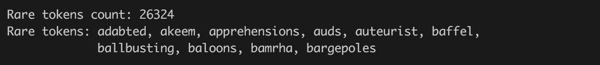

现在我们有了我们的标记化函数，是时候通过定义另一个 Spark UDF 来过滤出稀有标记了，我们将直接应用于`reviewTokens`输入数据列：

```scala
val rareTokensFilter= (rareTokens: Array[String], tokens: Seq[String]) =>tokens.filter(token => !rareTokens.contains(token)) 
val rareTokensFilterUDF= udf(rareTokensFilter.curried(rareTokens)) 

movieReviews= movieReviews.withColumn("reviewTokens", rareTokensFilterUDF('reviewTokens)) 

println("Movie reviews tokens:") 
movieReviews.show(5) 
```

电影评论的标记如下：

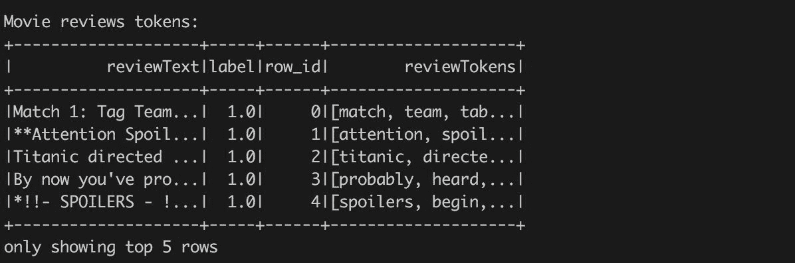

根据你的特定任务，你可能希望添加或删除一些停用词，或者探索不同的正则表达式模式（例如，使用正则表达式挖掘电子邮件地址是非常常见的）。现在，我们将使用我们拥有的标记构建我们的数据集。

# 还原和词形还原

在 NLP 中一个非常流行的步骤是将单词还原为它们的词根形式。例如，"accounts"和"accounting"都会被还原为"account"，乍一看似乎非常合理。然而，还原会出现以下两个问题，你应该注意：

1\. **过度还原**：这是指还原未能将具有不同含义的两个单词区分开。例如，还原("general," "genetic") = "gene"。

2. **欠词干化**：这是无法将具有相同含义的单词减少到它们的根形式的能力。例如，stem（"jumping"，"jumpiness"）= *jumpi*，但 stem（"jumped"，"jumps"）= "jump"。在这个例子中，我们知道前面的每个术语只是根词"jump"的一个变形；然而，根据您选择使用的词干提取器（最常见的两种词干提取器是 Porter [最古老和最常见]和 Lancaster），您可能会陷入这种错误。

考虑到语料库中单词的过度和不足词干化的可能性，自然语言处理从业者提出了词形还原的概念来帮助解决这些已知问题。单词"lemming"是根据单词的上下文，以*一组相关单词*的规范（词典）形式。例如，lemma（"paying"，"pays"，"paid"）= "pay"。与词干提取类似，词形还原试图将相关单词分组，但它进一步尝试通过它们的词义来分组单词，因为毕竟，相同的两个单词在不同的上下文中可能有完全不同的含义！考虑到本章已经很深入和复杂，我们将避免执行任何词形还原技术，但感兴趣的人可以在[`stanfordnlp.github.io/CoreNLP/`](http://stanfordnlp.github.io/CoreNLP/)上进一步阅读有关这个主题的内容。

# 特征化-特征哈希

现在，是时候将字符串表示转换为数字表示了。我们采用词袋方法；然而，我们使用了一个叫做特征哈希的技巧。让我们更详细地看一下 Spark 如何使用这种强大的技术来帮助我们高效地构建和访问我们的标记数据集。我们使用特征哈希作为词袋的时间高效实现，正如前面所解释的。

在其核心，特征哈希是一种快速和空间高效的方法，用于处理高维数据-在处理文本时很典型-通过将任意特征转换为向量或矩阵中的索引。这最好用一个例子来描述。假设我们有以下两条电影评论：

1.  *电影《好家伙》物有所值。演技精湛！*

1.  *《好家伙》是一部扣人心弦的电影，拥有一流的演员阵容和精彩的情节-所有电影爱好者必看！*

对于这些评论中的每个标记，我们可以应用"哈希技巧"，从而为不同的标记分配一个数字。因此，前面两条评论中唯一标记的集合（在小写+文本处理后）将按字母顺序排列：

```scala
{"acting": 1, "all": 2, "brilliant": 3, "cast": 4, "goodfellas": 5, "great": 6, "lover": 7, "money": 8, "movie": 9, "must": 10, "plot": 11, "riveting": 12, "see": 13, "spent": 14, "well": 15, "with": 16, "worth": 17}
```

然后，我们将应用哈希来创建以下矩阵：

```scala
[[1, 1, 0, 1, 0, 0, 0, 0, 1, 0, 0, 0, 0, 1, 1, 0, 1]
[0, 1, 1, 1, 1, 1, 1, 0, 0, 1, 0, 1, 1, 0, 0, 1, 0]]
```

特征哈希的矩阵构造如下：

+   行*代表*电影评论编号。

+   列*代表*特征（而不是实际单词！）。特征空间由一系列使用的哈希函数表示。请注意，对于每一行，列的数量是相同的，而不仅仅是一个不断增长的宽矩阵。

+   因此，矩阵中的每个条目（*i，j*）= *k*表示在第*i*行，特征*j*出现*k*次。例如，标记"movie"被哈希到特征 9 上，在第二条评论中出现了两次；因此，矩阵（2，9）= 2。

+   使用的哈希函数会产生间隙。如果哈希函数将一小组单词哈希到大的数字空间中，得到的矩阵将具有很高的稀疏性。

+   重要的一点是要考虑的是哈希碰撞的概念，即两个不同的特征（在这种情况下是标记）被哈希到我们的特征矩阵中的相同索引号。防范这种情况的方法是选择大量要哈希的特征，这是我们可以在 Spark 中控制的参数（Spark 中的默认设置是 2²⁰〜100 万个特征）。

现在，我们可以使用 Spark 的哈希函数，它将每个标记映射到一个哈希索引，这将组成我们的特征向量/矩阵。与往常一样，我们将从我们需要的类的导入开始，然后将创建哈希的特征的默认值更改为大约 4096（2¹²）。

在代码中，我们将使用 Spark ML 包中的`HashingTF`转换器（您将在本章后面学习更多关于转换的内容）。它需要输入和输出列的名称。对于我们的数据集`movieReviews`，输入列是`reviewTokens`，其中包含在前面步骤中创建的标记。转换的结果存储在一个名为`tf`的新列中：

```scala
val hashingTF= new HashingTF hashingTF.setInputCol("reviewTokens")
                   .setOutputCol("tf")
                   .setNumFeatures(1 <<12) // 2¹²
                   .setBinary(false)
val tfTokens= hashingTF.transform(movieReviews)
println("Vectorized movie reviews:")
tfTokens.show(5)
```

输出如下：

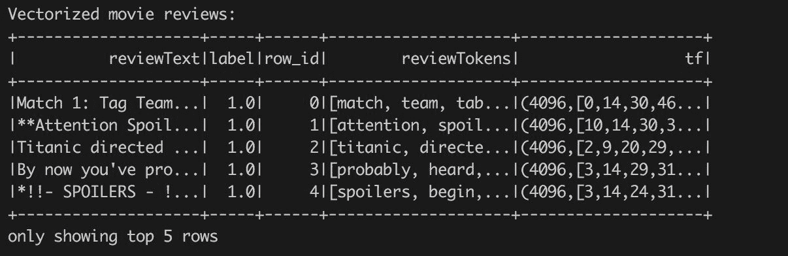

调用转换后，生成的`tfTokens`数据集中除了原始数据之外，还包含一个名为`tf`的新列，该列保存了每个输入行的`org.apache.spark.ml.linalg`实例。向量。在我们的情况下，向量是稀疏向量（因为哈希空间远大于唯一标记的数量）。

# 术语频率-逆文档频率（TF-IDF）加权方案

现在，我们将使用 Spark ML 应用一个非常常见的加权方案，称为 TF-IDF，将我们的标记化评论转换为向量，这将成为我们机器学习模型的输入。这种转换背后的数学相对简单：

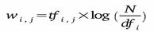

对于每个标记：

1.  找到给定文档（在我们的情况下是电影评论）内的术语频率。

1.  将此计数乘以查看标记在所有文档中出现的频率的对数的逆文档频率（通常称为语料库）。

1.  取逆是有用的，因为它将惩罚在文档中出现太频繁的标记（例如，“电影”），并提升那些不太频繁出现的标记。

现在，我们可以根据先前解释的逆文档频率公式来缩放术语。首先，我们需要计算一个模型-关于如何缩放术语频率的规定。在这种情况下，我们使用 Spark `IDF` 估计器基于前一步`hashingTF`生成的输入数据创建模型：

```scala
import org.apache.spark.ml.feature.IDF
val idf= new IDF idf.setInputCol(hashingTF.getOutputCol)
                    .setOutputCol("tf-idf")
val idfModel= idf.fit(tfTokens)
```

现在，我们将构建一个 Spark 估计器，该估计器在输入数据（=上一步转换的输出）上进行了训练（拟合）。IDF 估计器计算单个标记的权重。有了模型，就可以将其应用于包含在拟合期间定义的列的任何数据：

```scala
val tfIdfTokens= idfModel.transform(tfTokens)
println("Vectorized and scaled movie reviews:")
tfIdfTokens.show(5)
```

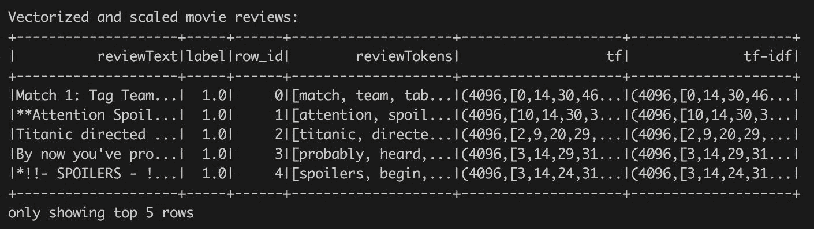

让我们更详细地看一下单个行和`hashingTF`和`IDF`输出之间的差异。这两个操作都产生了相同长度的稀疏向量。我们可以查看非零元素，并验证这两行在相同位置包含非零值：

```scala
import org.apache.spark.ml.linalg.Vector
val vecTf= tfTokens.take(1)(0).getAsVector.toSparse
val vecTfIdf= tfIdfTokens.take(1)(0).getAsVector.toSparse
println(s"Both vectors contains the same layout of non-zeros: ${java.util.Arrays.equals(vecTf.indices, vecTfIdf.indices)}")
```

我们还可以打印一些非零值：

```scala
println(s"${vecTf.values.zip(vecTfIdf.values).take(5).mkString("\n")}")
```

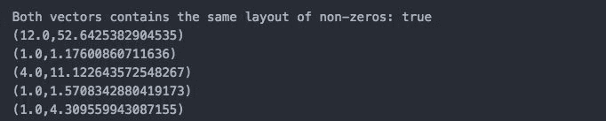

您可以直接看到，在句子中具有相同频率的标记根据它们在所有句子中的频率而产生不同的分数。

# 让我们进行一些（模型）训练！

此时，我们已经对文本数据进行了数值表示，以简单的方式捕捉了评论的结构。现在是建模的时候了。首先，我们将选择需要用于训练的列，并拆分生成的数据集。我们将保留数据集中生成的`row_id`列。但是，我们不会将其用作输入特征，而只会将其用作简单的唯一行标识符：

```scala
valsplits = tfIdfTokens.select("row_id", "label", idf.getOutputCol).randomSplit(Array(0.7, 0.1, 0.1, 0.1), seed = 42)
val(trainData, testData, transferData, validationData) = (splits(0), splits(1), splits(2), splits(3))
Seq(trainData, testData, transferData, validationData).foreach(_.cache())
```

请注意，我们已经创建了数据的四个不同子集：训练数据集、测试数据集、转移数据集和最终验证数据集。转移数据集将在本章后面进行解释，但其他所有内容应该已经非常熟悉了。

此外，缓存调用很重要，因为大多数算法将迭代地查询数据集数据，我们希望避免重复评估所有数据准备操作。

# Spark 决策树模型

首先，让我们从一个简单的决策树开始，并对一些超参数进行网格搜索。我们将遵循第二章中的代码，*探测暗物质：希格斯玻色子粒子*来构建我们的模型，这些模型经过训练以最大化 AUC 统计量。然而，我们将不再使用 MLlib 库中的模型，而是采用 Spark ML 包中的模型。在后面需要将模型组合成管道时，使用 ML 包的动机将更加清晰。然而，在下面的代码中，我们将使用`DecisionTreeClassifier`，将其拟合到`trainData`，为`testData`生成预测，并借助`BinaryClassificationEvaluato`评估模型的 AUC 性能：

```scala
import org.apache.spark.ml.classification.DecisionTreeClassifier
import org.apache.spark.ml.classification.DecisionTreeClassificationModel
import org.apache.spark.ml.evaluation.BinaryClassificationEvaluator
import java.io.File
val dtModelPath = s" $ MODELS_DIR /dtModel"
val dtModel= {
  val dtGridSearch = for (
    dtImpurity<- Array("entropy", "gini");
    dtDepth<- Array(3, 5))
    yield {
      println(s"Training decision tree: impurity $dtImpurity,
              depth: $dtDepth")
      val dtModel = new DecisionTreeClassifier()
          .setFeaturesCol(idf.getOutputCol)
          .setLabelCol("label")
          .setImpurity(dtImpurity)
          .setMaxDepth(dtDepth)
          .setMaxBins(10)
          .setSeed(42)
          .setCacheNodeIds(true)
          .fit(trainData)
      val dtPrediction = dtModel.transform(testData)
      val dtAUC = new BinaryClassificationEvaluator().setLabelCol("label")
          .evaluate(dtPrediction)
      println(s" DT AUC on test data: $dtAUC")
      ((dtImpurity, dtDepth), dtModel, dtAUC)
    }
    println(dtGridSearch.sortBy(-_._3).take(5).mkString("\n"))
    val bestModel = dtGridSearch.sortBy(-_._3).head._2
    bestModel.write.overwrite.save(dtModelPath)
    bestModel
  }
```

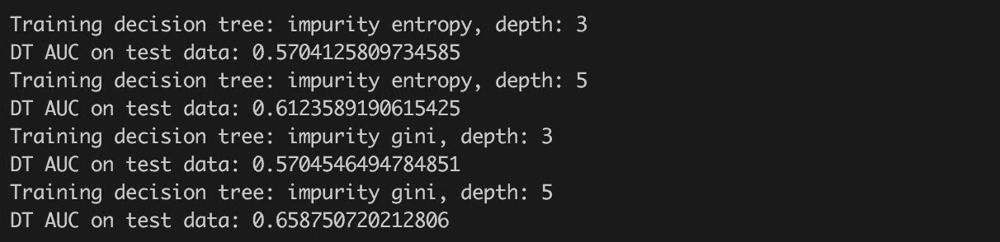

在选择最佳模型之后，我们将把它写入文件。这是一个有用的技巧，因为模型训练可能会耗费时间和资源，下一次，我们可以直接从文件中加载模型，而不是重新训练它：

```scala
val dtModel= if (new File(dtModelPath).exists()) {
  DecisionTreeClassificationModel.load(dtModelPath)
} else { /* do training */ }
```

# Spark 朴素贝叶斯模型

接下来，让我们来使用 Spark 的朴素贝叶斯实现。作为提醒，我们故意避免深入算法本身，因为这在许多机器学习书籍中已经涵盖过；相反，我们将专注于模型的参数，最终，我们将在本章后面的 Spark 流应用中“部署”这些模型。

Spark 对朴素贝叶斯的实现相对简单，我们只需要记住一些参数。它们主要如下：

+   **getLambda**：有时被称为“加法平滑”或“拉普拉斯平滑”，这个参数允许我们平滑观察到的分类变量的比例，以创建更均匀的分布。当你尝试预测的类别数量非常低，而你不希望由于低采样而错过整个类别时，这个参数尤为重要。输入 lambda 参数可以通过引入一些类别的最小表示来“帮助”你解决这个问题。

+   **getModelType**：这里有两个选项：“*multinomial*”（默认）或“*Bernoulli*”。*Bernoulli*模型类型会假设我们的特征是二进制的，在我们的文本示例中将是“*评论中是否有单词 _____？是或否？*”然而，*multinomial*模型类型采用离散的词频。另一个目前在 Spark 中朴素贝叶斯中没有实现但你需要知道的模型类型是高斯模型类型。这使我们的模型特征可以来自正态分布。

考虑到在这种情况下我们只有一个超参数要处理，我们将简单地使用我们的 lamda 的默认值，但是你也可以尝试网格搜索方法以获得最佳结果：

```scala
import org.apache.spark.ml.classification.{NaiveBayes, NaiveBayesModel}
val nbModelPath= s"$MODELS_DIR/nbModel"
val nbModel= {
  val model = new NaiveBayes()
      .setFeaturesCol(idf.getOutputCol)
      .setLabelCol("label")
      .setSmoothing(1.0)
      .setModelType("multinomial") // Note: input data are multinomial
      .fit(trainData)
  val nbPrediction = model.transform(testData)
  val nbAUC = new BinaryClassificationEvaluator().setLabelCol("label")
                 .evaluate(nbPrediction)
  println(s"Naive Bayes AUC: $nbAUC")
  model.write.overwrite.save(nbModelPath)
  model
}
```

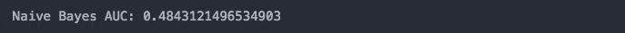

比较不同模型在相同输入数据集上的性能是很有趣的。通常情况下，即使是简单的朴素贝叶斯算法也非常适合文本分类任务。部分原因在于该算法的第一个形容词：“朴素”。具体来说，这个特定的算法假设我们的特征——在这种情况下是全局加权的词项频率——是相互独立的。在现实世界中这是真的吗？更常见的情况是这个假设经常被违反；然而，这个算法仍然可以表现得和更复杂的模型一样好，甚至更好。

# Spark 随机森林模型

接下来，我们将转向我们的随机森林算法，正如你从前面的章节中记得的那样，它是各种决策树的集成，我们将再次进行网格搜索，交替使用不同的深度和其他超参数，这将是熟悉的：

```scala
import org.apache.spark.ml.classification.{RandomForestClassifier, RandomForestClassificationModel}
val rfModelPath= s"$MODELS_DIR/rfModel"
val rfModel= {
  val rfGridSearch = for (
    rfNumTrees<- Array(10, 15);
    rfImpurity<- Array("entropy", "gini");
    rfDepth<- Array(3, 5))
    yield {
      println( s"Training random forest: numTrees: $rfNumTrees, 
              impurity $rfImpurity, depth: $rfDepth")
     val rfModel = new RandomForestClassifier()
         .setFeaturesCol(idf.getOutputCol)
         .setLabelCol("label")
         .setNumTrees(rfNumTrees)
         .setImpurity(rfImpurity)
         .setMaxDepth(rfDepth)
         .setMaxBins(10)
         .setSubsamplingRate(0.67)
         .setSeed(42)
         .setCacheNodeIds(true)
         .fit(trainData)
     val rfPrediction = rfModel.transform(testData)
     val rfAUC = new BinaryClassificationEvaluator()
                 .setLabelCol("label")
                 .evaluate(rfPrediction)
     println(s" RF AUC on test data: $rfAUC")
     ((rfNumTrees, rfImpurity, rfDepth), rfModel, rfAUC)
   }
   println(rfGridSearch.sortBy(-_._3).take(5).mkString("\n"))
   val bestModel = rfGridSearch.sortBy(-_._3).head._2 
   // Stress that the model is minimal because of defined gird space^
   bestModel.write.overwrite.save(rfModelPath)
   bestModel
}
```

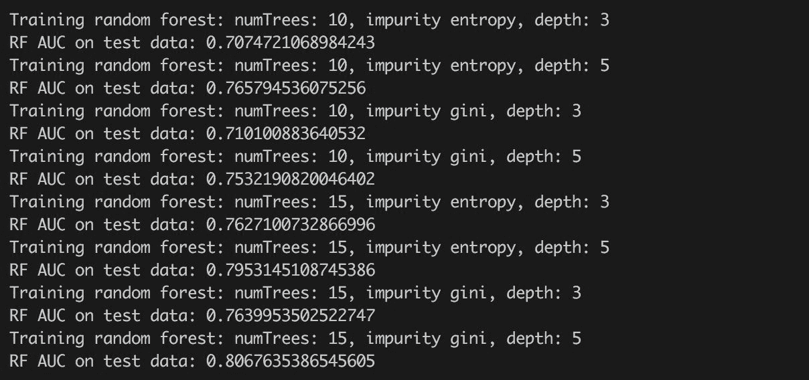

从我们的网格搜索中，我们看到的最高 AUC 是`0.769`。

# Spark GBM 模型

最后，我们将继续使用**梯度提升机**（**GBM**），这将是我们模型集成中的最终模型。请注意，在之前的章节中，我们使用了 H2O 的 GBM 版本，但现在，我们将坚持使用 Spark，并使用 Spark 的 GBM 实现如下：

```scala
import org.apache.spark.ml.classification.{GBTClassifier, GBTClassificationModel}
val gbmModelPath= s"$MODELS_DIR/gbmModel"
val gbmModel= {
  val model = new GBTClassifier()
      .setFeaturesCol(idf.getOutputCol)
      .setLabelCol("label")
      .setMaxIter(20)
      .setMaxDepth(6)
      .setCacheNodeIds(true)
      .fit(trainData)
  val gbmPrediction = model.transform(testData)
  gbmPrediction.show()
  val gbmAUC = new BinaryClassificationEvaluator()
      .setLabelCol("label")
      .setRawPredictionCol(model.getPredictionCol)
      .evaluate(gbmPrediction)
  println(s" GBM AUC on test data: $gbmAUC")
  model.write.overwrite.save(gbmModelPath)
  model
}
```

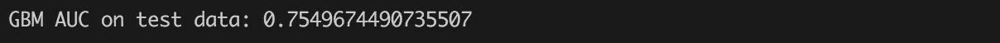

现在，我们已经训练了四种不同的学习算法：（单个）决策树、随机森林、朴素贝叶斯和梯度提升机。每个模型提供了不同的 AUC，如表中所总结的。我们可以看到表现最好的模型是随机森林，其次是 GBM。然而，公平地说，我们并没有对 GBM 模型进行详尽的搜索，也没有使用通常建议的高数量的迭代：

| 决策树 | 0.659 |
| --- | --- |
| 朴素贝叶斯 | 0.484 |
| 随机森林 | 0.769 |
| GBM | 0.755 |

# 超级学习者模型

现在，我们将结合所有这些算法的预测能力，借助神经网络生成一个“超级学习者”，该神经网络将每个模型的预测作为输入，然后尝试给出更好的预测，考虑到各个单独训练模型的猜测。在高层次上，架构会看起来像这样：

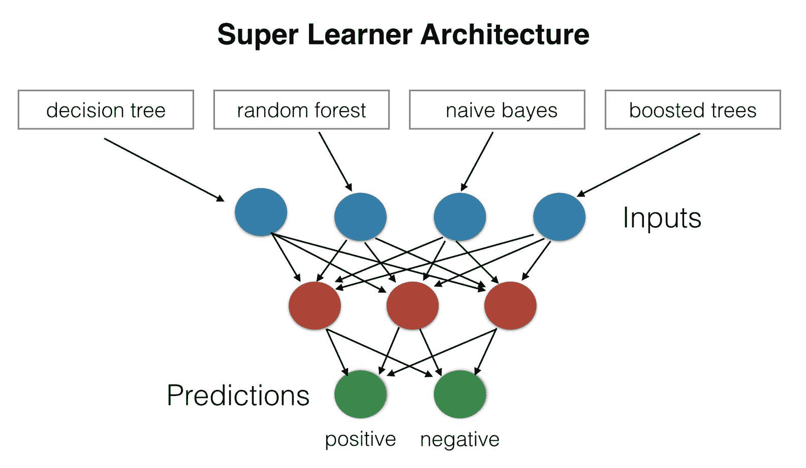

我们将进一步解释构建“超级学习者”的直觉和这种方法的好处，并教您如何构建您的 Spark 流应用程序，该应用程序将接收您的文本（即，您将写的电影评论）并将其通过每个模型的预测引擎。使用这些预测作为输入到您的神经网络，我们将利用各种算法的综合能力产生积极或消极的情绪。

# 超级学习者

在前面的章节中，我们训练了几个模型。现在，我们将使用深度学习模型将它们组合成一个称为超级学习者的集成。构建超级学习者的过程很简单（见前面的图）：

1.  选择基本算法（例如，GLM、随机森林、GBM 等）。

1.  选择一个元学习算法（例如，深度学习）。

1.  在训练集上训练每个基本算法。

1.  对这些学习者进行 K 折交叉验证，并收集每个基本算法的交叉验证预测值。

1.  从每个 L 基本算法中交叉验证预测的 N 个值可以组合成一个新的 NxL 矩阵。这个矩阵连同原始响应向量被称为“一级”数据。

1.  在一级数据上训练元学习算法。

1.  超级学习者（或所谓的“集成模型”）由 L 个基本学习模型和元学习模型组成，然后可以用于在测试集上生成预测。

集成的关键技巧是将一组不同的强学习者组合在一起。我们已经在随机森林算法的上下文中讨论了类似的技巧。

Erin LeDell 的博士论文包含了关于超级学习者及其可扩展性的更详细信息。您可以在[`www.stat.berkeley.edu/~ledell/papers/ledell-phd-thesis.pdf`](http://www.stat.berkeley.edu/~ledell/papers/ledell-phd-thesis.pdf)找到它。

在我们的示例中，我们将通过跳过交叉验证但使用单个留出数据集来简化整个过程。重要的是要提到，这不是推荐的方法！

作为第一步，我们使用训练好的模型和一个转移数据集来获得预测，并将它们组合成一个新的数据集，通过实际标签来增强它。

这听起来很容易；然而，我们不能直接使用*DataFrame#withColumn*方法并从不同数据集的多个列创建一个新的`DataFrame`，因为该方法只接受左侧`DataFrame`或常量列的列。

然而，我们已经通过为每一行分配一个唯一的 ID 来为这种情况准备了数据集。在这种情况下，我们将使用它，并根据`row_id`来合并各个模型的预测。我们还需要重命名每个模型预测列，以便在数据集中唯一标识模型预测：

```scala
import org.apache.spark.ml.PredictionModel 
import org.apache.spark.sql.DataFrame 

val models = Seq(("NB", nbModel), ("DT", dtModel), ("RF", rfModel), ("GBM", gbmModel)) 
def mlData(inputData: DataFrame, responseColumn: String, baseModels: Seq[(String, PredictionModel[_, _])]): DataFrame= { 
baseModels.map{ case(name, model) => 
model.transform(inputData) 
     .select("row_id", model.getPredictionCol ) 
     .withColumnRenamed("prediction", s"${name}_prediction") 
  }.reduceLeft((a, b) =>a.join(b, Seq("row_id"), "inner")) 
   .join(inputData.select("row_id", responseColumn), Seq("row_id"), "inner") 
} 
val mlTrainData= mlData(transferData, "label", models).drop("row_id") 
mlTrainData.show() 
```

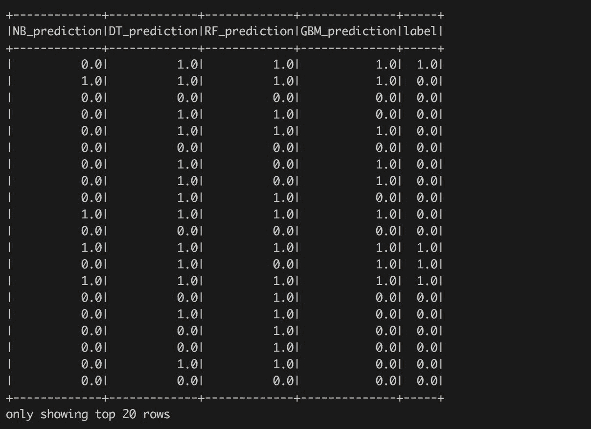

该表由模型的预测组成，并由实际标签注释。看到个体模型在预测值上的一致性/不一致性是很有趣的。

我们可以使用相同的转换来准备超级学习器的验证数据集：

```scala
val mlTestData = mlData(validationData, "label", models).drop("row_id") 
```

现在，我们可以构建我们的元学习算法。在这种情况下，我们将使用 H2O 机器学习库提供的深度学习算法。但是，它需要一点准备-我们需要将准备好的训练和测试数据发布为 H2O 框架：

```scala
import org.apache.spark.h2o._ 
val hc= H2OContext.getOrCreate(sc) 
val mlTrainHF= hc.asH2OFrame(mlTrainData, "metaLearnerTrain") 
val mlTestHF= hc.asH2OFrame(mlTestData, "metaLearnerTest") 
```

我们还需要将`label`列转换为分类列。这是必要的；否则，H2O 深度学习算法将执行回归，因为`label`列是数值型的：

```scala
importwater.fvec.Vec
val toEnumUDF= (name: String, vec: Vec) =>vec.toCategoricalVec
mlTrainHF(toEnumUDF, 'label).update()
mlTestHF(toEnumUDF, 'label).update()
```

现在，我们可以构建一个 H2O 深度学习模型。我们可以直接使用该算法的 Java API；但是，由于我们希望将所有步骤组合成一个单独的 Spark 管道，因此我们将利用一个暴露 Spark 估计器 API 的包装器：

```scala
val metaLearningModel= new H2ODeepLearning()(hc, spark.sqlContext)
      .setTrainKey(mlTrainHF.key)
      .setValidKey(mlTestHF.key)
      .setResponseColumn("label")
      .setEpochs(10)
      .setHidden(Array(100, 100, 50))
      .fit(null)
```

由于我们直接指定了验证数据集，我们可以探索模型的性能：

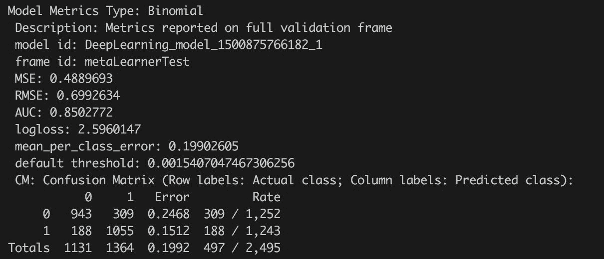

或者，我们可以打开 H2O Flow UI（通过调用`hc.openFlow`）并以可视化形式探索其性能：

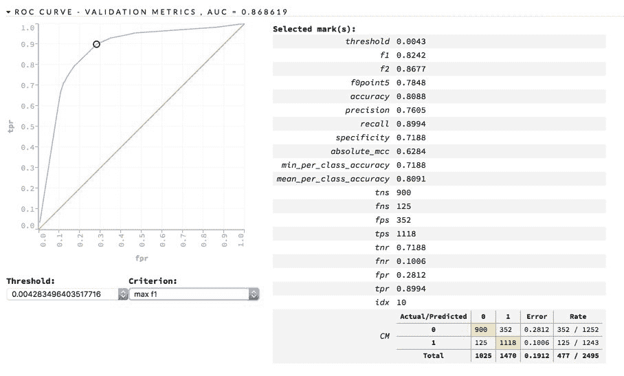

您可以轻松地看到该模型在验证数据集上的 AUC 为 0.868619-高于所有个体模型的 AUC 值。

# 将所有转换组合在一起

在前一节中，我们使用了 Spark 原语（即 UDF、本地 Spark 算法和 H2O 算法）开发了个别步骤。但是，要在未知数据上调用所有这些转换需要大量的手动工作。因此，Spark 引入了管道的概念，主要受到 Python scikit 管道的启发（[`scikit-learn.org/stable/modules/generated/sklearn.pipeline.Pipeline.html`](http://scikit-learn.org/stable/modules/generated/sklearn.pipeline.Pipeline.html)）。

要了解 Python 背后的设计决策更多信息，我们建议您阅读 Lars Buitinck 等人的优秀论文"API design for machine learning software: experiences from the scikit-learn project"（[`arxiv.org/abs/1309.0238`](https://arxiv.org/abs/1309.0238)）。

管道由由估计器和转换器表示的阶段组成：

+   **估计器**：这些是核心元素，公开了一个创建模型的 fit 方法。大多数分类和回归算法都表示为估计器。

+   **转换器**：这些将输入数据集转换为新数据集。转换器公开了`transform`方法，该方法实现了转换的逻辑。转换器可以生成单个或多个向量。大多数估计器生成的模型都是转换器-它们将输入数据集转换为表示预测的新数据集。本节中使用的 TF 转换器就是一个例子。

管道本身公开了与估计器相同的接口。它有 fit 方法，因此可以进行训练并生成"管道模型"，该模型可用于数据转换（它具有与转换器相同的接口）。因此，管道可以按层次结合在一起。此外，单个管道阶段按顺序调用；但是，它们仍然可以表示有向无环图（例如，一个阶段可以有两个输入列，每个列由不同的阶段产生）。在这种情况下，顺序必须遵循图的拓扑排序。

在我们的示例中，我们将把所有的转换组合在一起。然而，我们不会定义一个训练管道（即，一个将训练所有模型的管道），而是使用已经训练好的模型来设置管道阶段。我们的动机是定义一个可以用来对新的电影评论进行评分的管道。

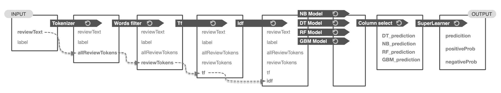

因此，让我们从我们示例的开始开始-我们在输入数据上应用的第一个操作是一个简单的分词器。它是由一个 Scala 函数定义的，我们将其包装成了 Spark UDF 的形式。然而，为了将其作为管道的一部分使用，我们需要将定义的 Scala 函数包装成一个转换。Spark 没有提供任何简单的包装器来做到这一点，因此需要从头开始定义一个通用的转换。我们知道我们将把一个列转换成一个新列。在这种情况下，我们可以使用`UnaryTransformer`，它确切地定义了一对一的列转换。我们可以更加通用一些，定义一个 Scala 函数（也就是 Spark UDFs）的通用包装器：

```scala
import org.apache.spark.ml.{Pipeline, UnaryTransformer} 
import org.apache.spark.sql.types._ 
import org.apache.spark.ml.param.ParamMap
import org.apache.spark.ml.util.{MLWritable, MLWriter} 

class UDFTransformerT, U 
extendsUnaryTransformer[T, U, UDFTransformer[T, U]] with MLWritable { 

override protected defcreateTransformFunc: T =>U = f 

override protected defvalidateInputType(inputType: DataType): Unit = require(inputType == inType) 

override protected defoutputDataType: DataType = outType 

override defwrite: MLWriter = new MLWriter { 
override protected defsaveImpl(path: String): Unit = {} 
 } 
} 
```

`UDFTransformer`类包装了一个函数`f`，该函数接受一个通用类型`T`，并产生类型`U`。在 Spark 数据集级别上，它将一个输入列（参见`UnaryTransformer`）的类型`inType`转换为一个新的输出列（同样，该字段由`UnaryTransformer`定义）的`outType`类型。该类还具有特质`MLWritable`的虚拟实现，支持将转换器序列化到文件中。

现在，我们只需要定义我们的分词器转换器：

```scala
val tokenizerTransformer= new UDFTransformer[String, Array[String]](
  "tokenizer", toTokens.curried(MIN_TOKEN_LENGTH)(stopWords),
  StringType, new ArrayType(StringType, true))
```

定义的转换器接受一个字符串列（即电影评论），并产生一个包含表示电影评论标记的字符串数组的新列。该转换器直接使用了我们在本章开头使用的`toTokens`函数。

接下来的转换应该是删除稀有单词。在这种情况下，我们将使用与上一步类似的方法，并利用定义的`UDFTransformer`函数：

```scala
val rareTokensFilterTransformer= new UDFTransformer[Seq[String], Seq[String]](
  "rareWordsRemover",
  rareTokensFilter.curried(rareTokens),
  newArrayType(StringType, true), new ArrayType(StringType, true))
```

这个转换器接受一个包含标记数组的列，并产生一个包含过滤后标记数组的新列。它使用了已经定义的`rareTokensFilter` Scala 函数。

到目前为止，我们还没有指定任何输入数据依赖关系，包括输入列的名称。我们将把它留到最终的管道定义中。

接下来的步骤包括使用`TF`方法进行向量化，将字符串标记哈希成一个大的数字空间，然后基于构建的`IDF`模型进行转换。这两个转换已经以期望的形式定义好了-第一个`hashingTF`转换已经是一个将一组标记转换为数值向量的转换器，第二个`idfModel`接受数值向量并根据计算的系数对其进行缩放。

这些步骤为训练好的二项模型提供了输入。每个基础模型代表一个产生多个新列的转换器，例如预测、原始预测和概率。然而，重要的是要提到，并非所有模型都提供完整的列集。例如，Spark GBM 目前（Spark 版本 2.0.0）只提供预测列。尽管如此，对于我们的示例来说已经足够了。

生成预测后，我们的数据集包含许多列；例如，输入列、带有标记的列、转换后的标记等等。然而，为了应用生成的元学习器，我们只需要基础模型生成的预测列。因此，我们将定义一个列选择器转换，删除所有不必要的列。在这种情况下，我们有一个接受 N 列并产生一个新的 M 列数据集的转换。因此，我们不能使用之前定义的`UnaryTransformer`，我们需要定义一个名为`ColumnSelector`的新的特定转换：

```scala
import org.apache.spark.ml.Transformer 
class ColumnSelector(override valuid: String, valcolumnsToSelect: Array[String]) extends Transformer with MLWritable { 

  override deftransform(dataset: Dataset[_]): DataFrame= { 
    dataset.select(columnsToSelect.map(dataset.col): _*) 
  } 

  override deftransformSchema(schema: StructType): StructType = { 
    StructType(schema.fields.filter(col=>columnsToSelect
                            .contains(col.name))) 
  } 

  override defcopy(extra: ParamMap): ColumnSelector = defaultCopy(extra) 

  override defwrite: MLWriter = new MLWriter { 
    override protected defsaveImpl(path: String): Unit = {} 
  } 
} 
```

`ColumnSelector`表示一个通用的转换器，它从输入数据集中仅选择给定的列。重要的是要提到整体的两阶段概念-第一阶段转换模式（即，与每个数据集相关联的元数据）和第二阶段转换实际数据集。这种分离允许 Spark 在调用实际数据转换之前对转换器进行早期检查，以查找不兼容之处。

我们需要通过创建`columnSelector`的实例来定义实际的列选择器转换器-请注意指定要保留的正确列：

```scala
val columnSelector= new ColumnSelector( 
  "columnSelector",  Array(s"DT_${dtModel.getPredictionCol}", 
  s"NB_${nbModel.getPredictionCol}", 
  s"RF_${rfModel.getPredictionCol}", 
  s"GBM_${gbmModel.getPredictionCol}") 
```

在这一点上，我们的转换器已经准备好组成最终的“超级学习”管道。管道的 API 很简单-它接受按顺序调用的单个阶段。然而，我们仍然需要指定单个阶段之间的依赖关系。大多数情况下，依赖关系是由输入和输出列名描述的：

```scala
val superLearnerPipeline = new Pipeline() 
 .setStages(Array( 
// Tokenize 
tokenizerTransformer 
     .setInputCol("reviewText") 
     .setOutputCol("allReviewTokens"), 
// Remove rare items 
rareTokensFilterTransformer 
     .setInputCol("allReviewTokens") 
     .setOutputCol("reviewTokens"), 
hashingTF, 
idfModel, 
dtModel 
     .setPredictionCol(s"DT_${dtModel.getPredictionCol}") 
     .setRawPredictionCol(s"DT_${dtModel.getRawPredictionCol}") 
     .setProbabilityCol(s"DT_${dtModel.getProbabilityCol}"), 
nbModel 
     .setPredictionCol(s"NB_${nbModel.getPredictionCol}") 
     .setRawPredictionCol(s"NB_${nbModel.getRawPredictionCol}") 
     .setProbabilityCol(s"NB_${nbModel.getProbabilityCol}"), 
rfModel 
     .setPredictionCol(s"RF_${rfModel.getPredictionCol}") 
     .setRawPredictionCol(s"RF_${rfModel.getRawPredictionCol}") 
     .setProbabilityCol(s"RF_${rfModel.getProbabilityCol}"), 
gbmModel// Note: GBM does not have full API of PredictionModel 
.setPredictionCol(s"GBM_${gbmModel.getPredictionCol}"), 
columnSelector, 
metaLearningModel 
 )) 
```

有一些值得一提的重要概念：

+   `tokenizerTransformer`和`rareTokensFilterTransformer`通过列`allReviewTokens`连接-第一个是列生产者，第二个是列消费者。

+   `dtModel`、`nbModel`、`rfModel`和`gbmModel`模型都将相同的输入列定义为`idf.getOutputColumn`。在这种情况下，我们有效地使用了计算 DAG，它是按拓扑顺序排列成一个序列

+   所有模型都具有相同的输出列（在 GBM 的情况下有一些例外），由于管道期望列的唯一名称，因此不能将所有模型的输出列一起追加到结果数据集中。因此，我们需要通过调用`setPredictionCol`、`setRawPredictionCol`和`setProbabilityCol`来重命名模型的输出列。重要的是要提到，GBM 目前不会产生原始预测和概率列。

现在，我们可以拟合管道以获得管道模型。实际上，这是一个空操作，因为我们的管道只由转换器组成。然而，我们仍然需要调用`fit`方法：

```scala
val superLearnerModel= superLearnerPipeline.fit(pos)
```

哇，我们有了我们的超级学习模型，由多个 Spark 模型组成，并由 H2O 深度学习模型编排。现在是使用模型进行预测的时候了！

# 使用超级学习模型

模型的使用很简单-我们需要提供一个名为`reviewText`的单列数据集，并用`superLearnerModel`进行转换：

```scala
val review = "Although I love this movie, I can barely watch it, it is so real....."
val reviewToScore= sc.parallelize(Seq(review)).toDF("reviewText")
val reviewPrediction= superLearnerModel.transform(reviewToScore)
```

返回的预测`reviewPrediction`是一个具有以下结构的数据集：

```scala
reviewPrediction.printSchema()
```

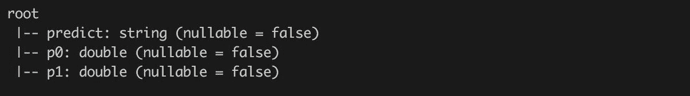

第一列包含基于 F1 阈值决定的预测值。列`p0`和`p1`表示各个预测类别的概率。

如果我们探索返回的数据集的内容，它包含一行：

```scala
reviewPrediction.show()
```

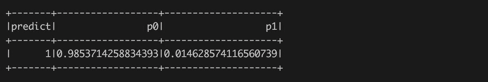

# 总结

本章演示了三个强大的概念：文本处理、Spark 管道和超级学习者。

文本处理是一个强大的概念，正在等待被行业广泛采用。因此，我们将在接下来的章节中深入探讨这个主题，并看看自然语言处理的其他方法。

对于 Spark 管道也是一样，它们已经成为 Spark 的固有部分和 Spark ML 包的核心。它们提供了一种优雅的方式，在训练和评分时重复使用相同的概念。因此，我们也希望在接下来的章节中使用这个概念。

最后，通过超级学习者，也就是集成学习，您学会了如何通过元学习器的帮助从多个模型中获益的基本概念。这提供了一种简单但强大的方式来构建强大的学习者，这些学习者仍然足够简单易懂。
