# 第五章：用于预测和聚类的 Word2vec

在前几章中，我们涵盖了一些基本的 NLP 步骤，比如分词、停用词移除和特征创建，通过创建一个**词频-逆文档频率**（**TF-IDF**）矩阵，我们执行了一个监督学习任务，预测电影评论的情感。在本章中，我们将扩展我们之前的例子，现在包括由 Google 研究人员 Tomas Mikolov 和 Ilya Sutskever 推广的词向量的惊人力量，他们在论文*Distributed Representations of Words and Phrases and their Compositionality*中提出。

我们将从词向量背后的动机进行简要概述，借鉴我们对之前 NLP 特征提取技术的理解，然后解释代表 word2vec 框架的一系列算法的概念（确实，word2vec 不仅仅是一个单一的算法）。然后，我们将讨论 word2vec 的一个非常流行的扩展，称为 doc2vec，我们在其中对整个文档进行*向量化*，转换为一个固定长度的 N 个数字的数组。我们将进一步研究这个极其流行的 NLP 领域，或认知计算研究。接下来，我们将把 word2vec 算法应用到我们的电影评论数据集中，检查生成的词向量，并通过取个别词向量的平均值来创建文档向量，以执行一个监督学习任务。最后，我们将使用这些文档向量来运行一个聚类算法，看看我们的电影评论向量有多好地聚集在一起。

词向量的力量是一个爆炸性的研究领域，谷歌和 Facebook 等公司都在这方面进行了大量投资，因为它具有对个别单词的语义和句法含义进行编码的能力，我们将很快讨论。不是巧合的是，Spark 实现了自己的 word2vec 版本，这也可以在谷歌的 Tensorflow 库和 Facebook 的 Torch 中找到。最近，Facebook 宣布了一个名为 deep text 的新的实时文本处理，使用他们预训练的词向量，他们展示了他们对这一惊人技术的信念以及它对他们的业务应用产生的或正在产生的影响。然而，在本章中，我们将只涵盖这个激动人心领域的一小部分，包括以下内容：

+   解释 word2vec 算法

+   word2vec 思想的泛化，导致 doc2vec

+   两种算法在电影评论数据集上的应用

# 词向量的动机

与我们在上一章中所做的工作类似，传统的 NLP 方法依赖于将通过分词创建的个别单词转换为计算机算法可以学习的格式（即，预测电影情感）。这需要我们将*N*个标记的单个评论转换为一个固定的表示，通过创建一个 TF-IDF 矩阵。这样做在*幕后*做了两件重要的事情：

1.  个别的单词被分配了一个整数 ID（例如，一个哈希）。例如，单词*friend*可能被分配为 39,584，而单词*bestie*可能被分配为 99,928,472。认知上，我们知道*friend*和*bestie*非常相似；然而，通过将这些标记转换为整数 ID，任何相似性的概念都会丢失。

1.  通过将每个标记转换为整数 ID，我们因此失去了标记使用的上下文。这很重要，因为为了理解单词的认知含义，从而训练计算机学习*friend*和*bestie*是相似的，我们需要理解这两个标记是如何使用的（例如，它们各自的上下文）。

考虑到传统 NLP 技术在编码单词的语义和句法含义方面的有限功能，托马斯·米科洛夫和其他研究人员探索了利用神经网络来更好地将单词的含义编码为*N*个数字的向量的方法（例如，向量*好朋友* = [0.574, 0.821, 0.756, ... , 0.156]）。当正确计算时，我们会发现*好朋友*和*朋友*的向量在空间中是接近的，其中接近是指余弦相似度。事实证明，这些向量表示（通常称为*单词嵌入*）使我们能够更丰富地理解文本。

有趣的是，使用单词嵌入还使我们能够学习跨多种语言的相同语义，尽管书面形式有所不同（例如，日语和英语）。例如，电影的日语单词是*eiga*（）；因此，使用单词向量，这两个单词，*movie*和*，在向量空间中应该是接近的，尽管它们在外观上有所不同。因此，单词嵌入允许应用程序是语言无关的——这也是为什么这项技术非常受欢迎的另一个原因！

# word2vec 解释

首先要明确的是，word2vec 并不代表*单一*算法，而是一系列试图将单词的语义和句法*含义*编码为*N*个数字的向量的算法（因此，word-to-vector = word2vec）。我们将在本章中深入探讨这些算法的每一个，同时也给您机会阅读/研究文本*向量化*的其他领域，这可能会对您有所帮助。

# 什么是单词向量？

在其最简单的形式中，单词向量仅仅是一种独热编码，其中向量中的每个元素代表词汇中的一个单词，给定的单词被编码为`1`，而所有其他单词元素被编码为`0`。假设我们的词汇表只包含以下电影术语：**爆米花**，**糖果**，**苏打水**，**电影票**和**票房大片**。

根据我们刚刚解释的逻辑，我们可以将术语**电影票**编码如下：

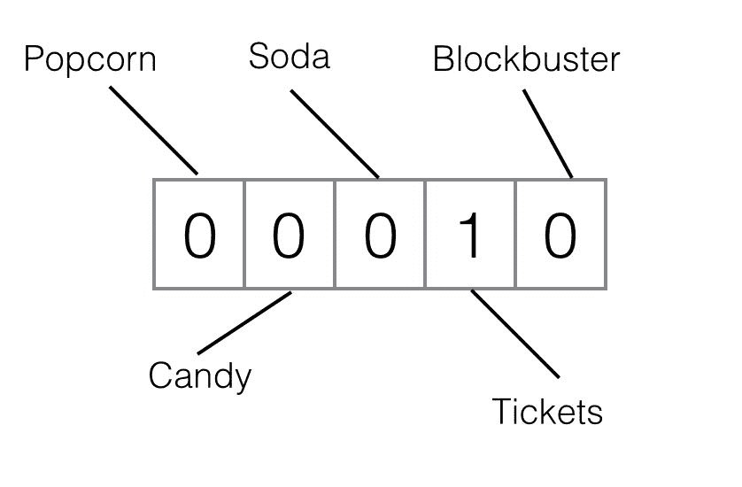

使用这种简单的编码形式，也就是我们创建词袋矩阵时所做的，我们无法对单词进行有意义的比较（例如，*爆米花是否与苏打水相关；糖果是否类似于电影票？*）。

考虑到这些明显的限制，word2vec 试图通过为单词提供分布式表示来解决这个问题。假设对于每个单词，我们有一个分布式向量，比如说，由 300 个数字表示一个单词，其中我们词汇表中的每个单词也由这 300 个元素中的权重分布来表示。现在，我们的情况将会发生显著变化，看起来会像这样：

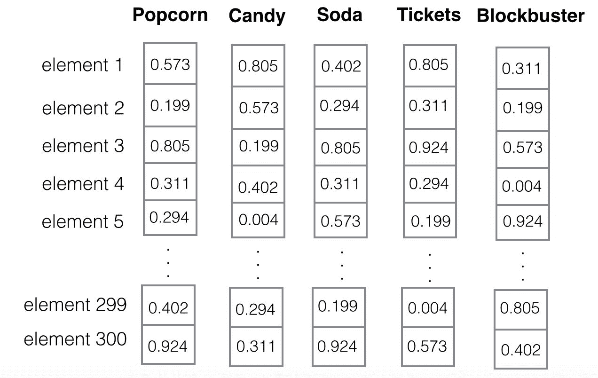

现在，鉴于将单词的分布式表示为 300 个数字值，我们可以使用余弦相似度等方法在单词之间进行有意义的比较。也就是说，使用**电影票**和**苏打水**的向量，我们可以确定这两个术语不相关，根据它们的向量表示和它们之间的余弦相似度。这还不是全部！在他们具有突破性的论文中，米科洛夫等人还对单词向量进行了数学函数的运算，得出了一些令人难以置信的发现；特别是，作者向他们的 word2vec 字典提出了以下*数学问题*：

*V(国王) - V(男人) + V(女人) ~ V(皇后)*

事实证明，与传统 NLP 技术相比，这些单词的分布式向量表示在比较问题（例如，A 是否与 B 相关？）方面非常强大，这在考虑到这些语义和句法学习知识是来自观察大量单词及其上下文而无需其他信息时显得更加令人惊讶。也就是说，我们不需要告诉我们的机器*爆米花*是一种食物，名词，单数等等。

这是如何实现的呢？Word2vec 以一种受监督的方式利用神经网络的力量来学习单词的向量表示（这是一项无监督的任务）。如果一开始听起来有点像矛盾，不用担心！通过一些示例，一切都会变得更清晰，首先从**连续词袋**模型开始，通常简称为**CBOW**模型。

# CBOW 模型

首先，让我们考虑一个简单的电影评论，这将成为接下来几节中的基本示例：

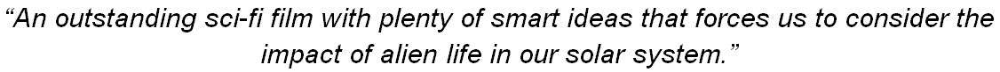

现在，想象我们有一个窗口，它就像一个滑块，包括当前焦点单词（在下图中用红色突出显示），以及焦点单词前后的五个单词（在下图中用黄色突出显示）：

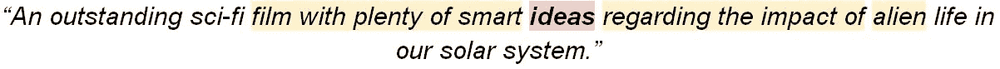

黄色的单词形成了围绕当前焦点单词*ideas*的上下文。这些上下文单词作为输入传递到我们的前馈神经网络，每个单词通过单热编码（其他元素被清零）编码，具有一个隐藏层和一个输出层：

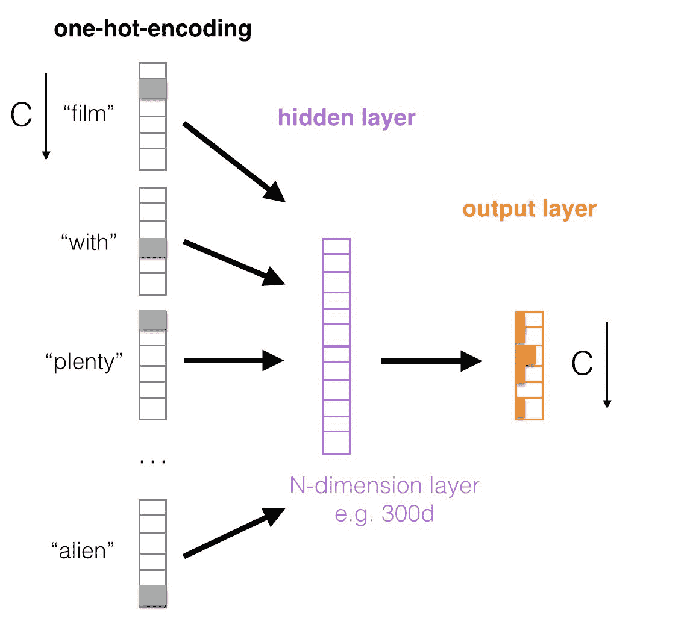

在上图中，我们的词汇表的总大小（例如，分词后）由大写 C 表示，我们对上下文窗口中的每个单词进行单热编码--在这种情况下，是焦点单词*ideas*前后的五个单词。在这一点上，我们通过加权和将编码向量传播到我们的隐藏层，就像*正常*的前馈神经网络一样--在这里，我们预先指定了隐藏层中的权重数量。最后，我们将一个 sigmoid 函数应用于单隐藏层到输出层，试图预测当前焦点单词。这是通过最大化观察到焦点单词（*idea*）在其周围单词的上下文（**film**，**with**，**plenty**，**of**，**smart**，**regarding**，**the**，**impact**，**of**和**alien**）的条件概率来实现的。请注意，输出层的大小也与我们最初的词汇表 C 相同。

这就是 word2vec 算法族的有趣特性所在：它本质上是一种无监督学习算法，并依赖于监督学习来学习单词向量。这对于 CBOW 模型和跳字模型都是如此，接下来我们将介绍跳字模型。需要注意的是，在撰写本书时，Spark 的 MLlib 仅包含了 word2vec 的跳字模型。

# 跳字模型

在先前的模型中，我们使用了焦点词前后的单词窗口来预测焦点词。跳字模型采用了类似的方法，但是颠倒了神经网络的架构。也就是说，我们将以焦点词作为输入到我们的网络中，然后尝试使用单隐藏层来预测周围的上下文单词：

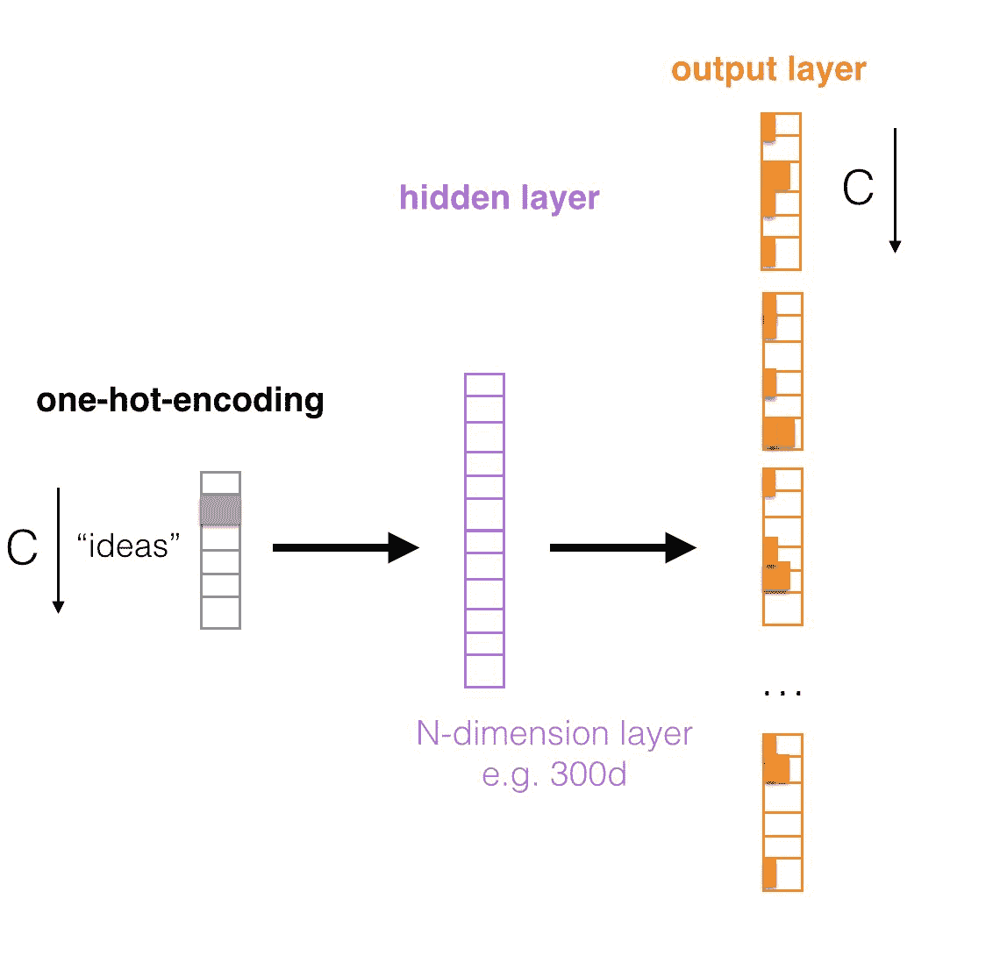

正如您所看到的，跳字模型与 CBOW 模型完全相反。网络的训练目标是最小化输出层中所有上下文单词的预测误差之和，在我们的示例中，输入是*ideas*，输出层预测*film*，*with*，*plenty*，*of*，*smart*，*regarding*，*the*，*impact*，*of*和*alien*。

在前一章中，您看到我们使用了一个分词函数，该函数删除了停用词，例如*the*，*with*，*to*等，我们故意没有在这里展示，以便清楚地传达我们的例子，而不让读者迷失。在接下来的示例中，我们将执行与第四章相同的分词函数，*使用 NLP 和 Spark Streaming 预测电影评论*，它将删除停用词。

# 单词向量的有趣玩法

现在我们已经将单词（标记）压缩成数字向量，我们可以对它们进行一些有趣的操作。您可以尝试一些来自原始 Google 论文的经典示例，例如：

+   **数学运算**：正如前面提到的，其中一个经典的例子是*v(国王) - v(男人) + v(女人) ~ v(皇后)*。使用简单的加法，比如*v(软件) + v(工程师)*，我们可以得出一些迷人的关系；以下是一些更多的例子：

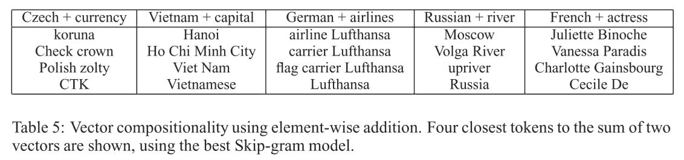

+   **相似性**：鉴于我们正在处理一个向量空间，我们可以使用余弦相似度来比较一个标记与许多其他标记，以查看相似的标记。例如，与*v(Spark)*相似的单词可能是*v(MLlib)*、*v(scala)*、*v(graphex)*等等。

+   **匹配/不匹配**：给定一个单词列表，哪些单词是不匹配的？例如，*doesn't_match[v(午餐, 晚餐, 早餐, 东京)] == v(东京)*。

+   **A 对 B 就像 C 对？**：根据 Google 的论文，以下是通过使用 word2vec 的 skip-gram 实现可能实现的单词比较列表：

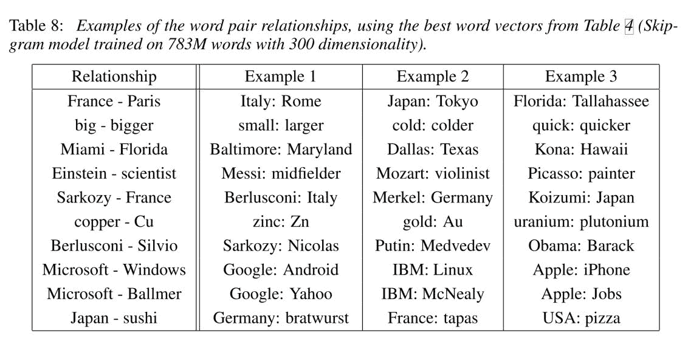

# 余弦相似度

通过余弦相似度来衡量单词的相似性/不相似性，这个方法的一个很好的特性是它的取值范围在`-1`和`1`之间。两个单词之间的完全相似将产生一个得分为`1`，没有关系将产生`0`，而`-1`表示它们是相反的。

请注意，word2vec 算法的余弦相似度函数（目前仅在 Spark 中的 CBOW 实现中）已经内置到 MLlib 中，我们很快就会看到。

看一下下面的图表：

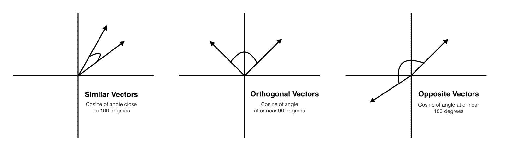

对于那些对其他相似性度量感兴趣的人，最近发表了一项研究，强烈建议使用**Earth-Mover's Distance**（**EMD**），这是一种与余弦相似度不同的方法，需要一些额外的计算，但显示出了有希望的早期结果。

# 解释 doc2vec

正如我们在本章介绍中提到的，有一个 word2vec 的扩展，它编码整个*文档*而不是单个单词。在这种情况下，文档可以是句子、段落、文章、散文等等。毫不奇怪，这篇论文是在原始 word2vec 论文之后发表的，但同样也是由 Tomas Mikolov 和 Quoc Le 合著的。尽管 MLlib 尚未将 doc2vec 引入其算法库，但我们认为数据科学从业者有必要了解这个 word2vec 的扩展，因为它在监督学习和信息检索任务中具有很大的潜力和结果。

与 word2vec 一样，doc2vec（有时称为*段落向量*）依赖于监督学习任务，以学习基于上下文单词的文档的分布式表示。Doc2vec 也是一类算法，其架构将与你在前几节学到的 word2vec 的 CBOW 和 skip-gram 模型非常相似。接下来你会看到，实现 doc2vec 将需要并行训练单词向量和代表我们所谓的*文档*的文档向量。

# 分布式记忆模型

这种特定的 doc2vec 模型与 word2vec 的 CBOW 模型非常相似，算法试图预测一个*焦点单词*，给定其周围的*上下文单词*，但增加了一个段落 ID。可以将其视为另一个帮助预测任务的上下文单词向量，但在我们认为的文档中是恒定的。继续我们之前的例子，如果我们有这个电影评论（我们定义一个文档为一个电影评论），我们的焦点单词是*ideas*，那么我们现在将有以下架构：

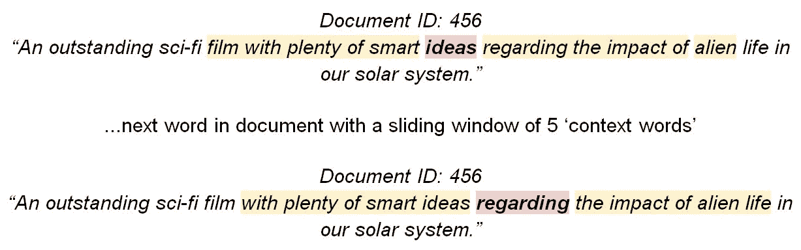

请注意，当我们在文档中向下移动并将*焦点单词*从*ideas*更改为*regarding*时，我们的上下文单词显然会改变；然而，**文档 ID：456**保持不变。这是 doc2vec 中的一个关键点，因为文档 ID 在预测任务中被使用：

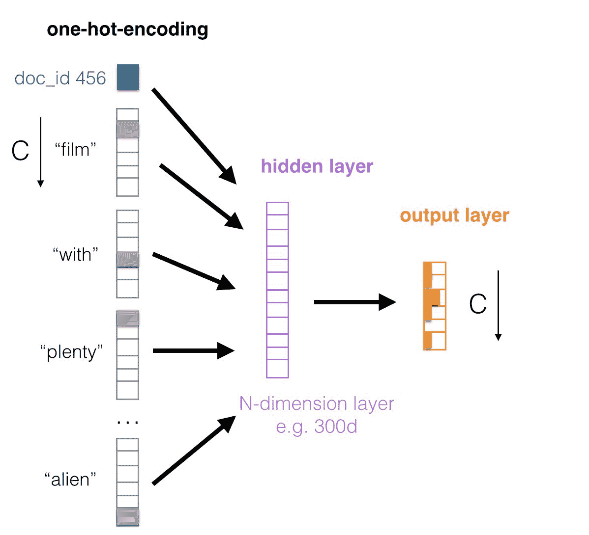

# 分布式词袋模型

doc2vec 中的最后一个算法是模仿 word2vec 跳字模型，唯一的区别是--我们现在将文档 ID 作为输入，尝试预测文档中*随机抽样*的单词，而不是使用*焦点*单词作为输入。也就是说，我们将完全忽略输出中的上下文单词：

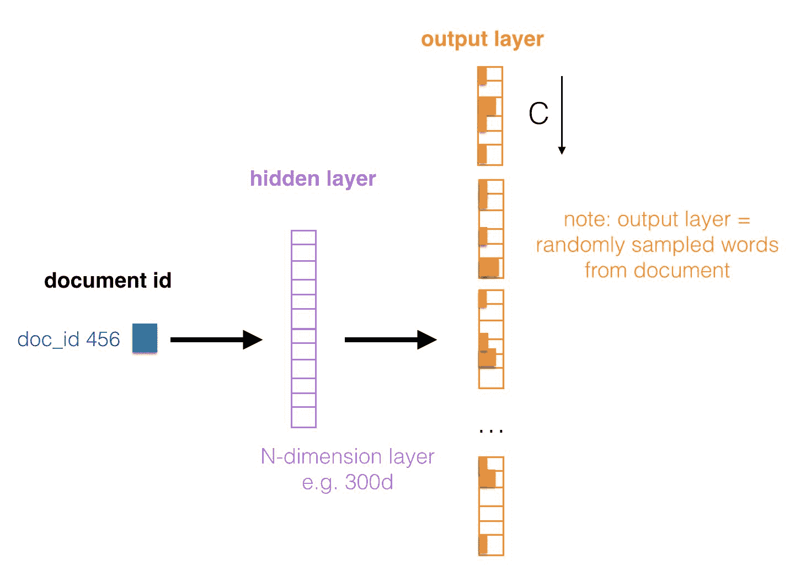

与 word2vec 一样，我们可以使用这些*段落向量*对 N 个单词的文档进行相似性比较，在监督和无监督任务中都取得了巨大成功。以下是 Mikolov 等人在最后两章中使用的相同数据集进行的一些实验！

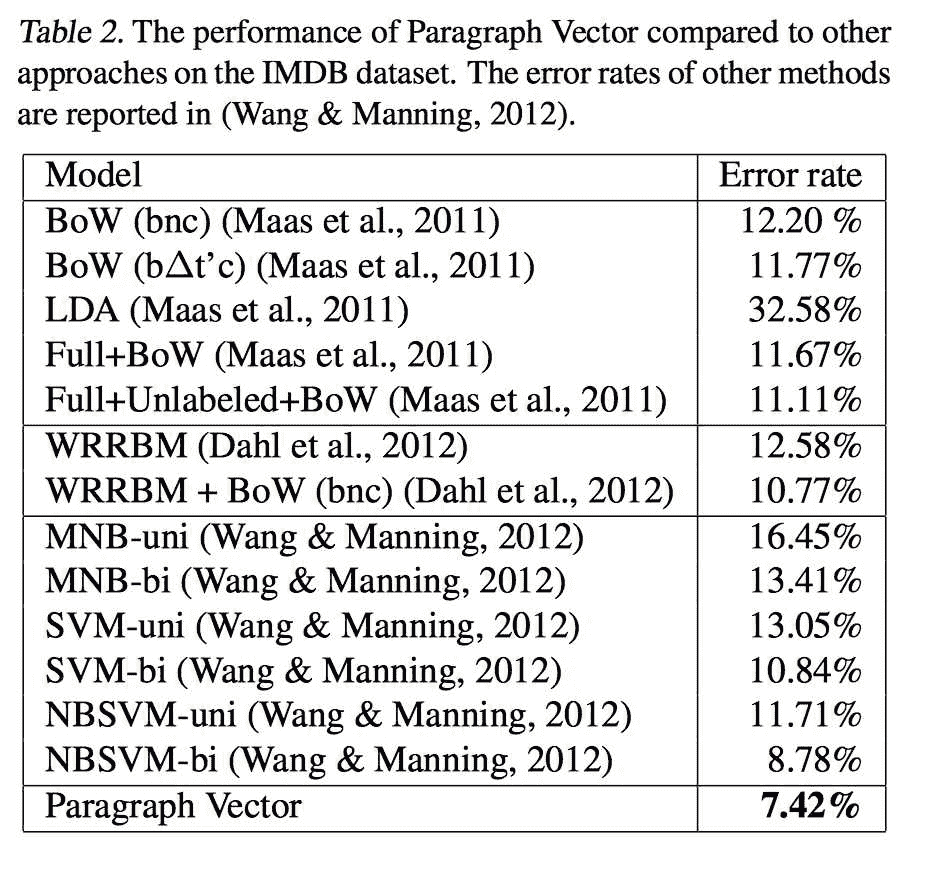

信息检索任务（三段，第一段应该*听起来*比第三段更接近第二段）：

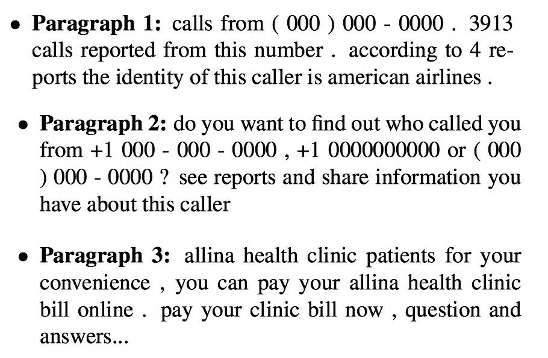

在接下来的章节中，我们将通过取个别词向量的平均值来创建一个*穷人的文档向量*，以将 n 长度的整个电影评论编码为 300 维的向量。

在撰写本书时，Spark 的 MLlib 没有 doc2vec 的实现；然而，有许多项目正在利用这项技术，这些项目处于孵化阶段，您可以测试。

# 应用 word2vec 并使用向量探索我们的数据

现在您已经对 word2vec、doc2vec 以及词向量的强大功能有了很好的理解，是时候将我们的注意力转向原始的 IMDB 数据集，我们将进行以下预处理：

+   在每个电影评论中按空格拆分单词

+   删除标点符号

+   删除停用词和所有字母数字单词

+   使用我们从上一章的标记化函数，最终得到一个逗号分隔的单词数组

因为我们已经在第四章中涵盖了前面的步骤，*使用 NLP 和 Spark Streaming 预测电影评论*，我们将在本节中快速重现它们。

像往常一样，我们从启动 Spark shell 开始，这是我们的工作环境：

```scala
export SPARKLING_WATER_VERSION="2.1.12" 
export SPARK_PACKAGES=\ 
"ai.h2o:sparkling-water-core_2.11:${SPARKLING_WATER_VERSION},\ 
ai.h2o:sparkling-water-repl_2.11:${SPARKLING_WATER_VERSION},\ 
ai.h2o:sparkling-water-ml_2.11:${SPARKLING_WATER_VERSION},\ 
com.packtpub:mastering-ml-w-spark-utils:1.0.0" 

$SPARK_HOME/bin/spark-shell \ 
        --master 'local[*]' \ 
        --driver-memory 8g \ 
        --executor-memory 8g \ 
        --conf spark.executor.extraJavaOptions=-XX:MaxPermSize=384M \ 
        --conf spark.driver.extraJavaOptions=-XX:MaxPermSize=384M \ 
        --packages "$SPARK_PACKAGES" "$@"
```

在准备好的环境中，我们可以直接加载数据：

```scala
val DATASET_DIR = s"${sys.env.get("DATADIR").getOrElse("data")}/aclImdb/train"
 val FILE_SELECTOR = "*.txt" 

case class Review(label: Int, reviewText: String) 

 val positiveReviews = spark.read.textFile(s"$DATASET_DIR/pos/$FILE_SELECTOR")
     .map(line => Review(1, line)).toDF
 val negativeReviews = spark.read.textFile(s"$DATASET_DIR/neg/$FILE_SELECTOR")
   .map(line => Review(0, line)).toDF
 var movieReviews = positiveReviews.union(negativeReviews)
```

我们还可以定义标记化函数，将评论分割成标记，删除所有常见单词：

```scala
import org.apache.spark.ml.feature.StopWordsRemover
 val stopWords = StopWordsRemover.loadDefaultStopWords("english") ++ Array("ax", "arent", "re")

 val MIN_TOKEN_LENGTH = 3
 val toTokens = (minTokenLen: Int, stopWords: Array[String], review: String) =>
   review.split("""\W+""")
     .map(_.toLowerCase.replaceAll("[^\\p{IsAlphabetic}]", ""))
     .filter(w => w.length > minTokenLen)
     .filter(w => !stopWords.contains(w))
```

所有构建块准备就绪后，我们只需将它们应用于加载的输入数据，通过一个新列`reviewTokens`对它们进行增强，该列保存从评论中提取的单词列表：

```scala

 val toTokensUDF = udf(toTokens.curried(MIN_TOKEN_LENGTH)(stopWords))
 movieReviews = movieReviews.withColumn("reviewTokens", toTokensUDF('reviewText))
```

`reviewTokens`列是 word2vec 模型的完美输入。我们可以使用 Spark ML 库构建它：

```scala
val word2vec = new Word2Vec()
   .setInputCol("reviewTokens")
   .setOutputCol("reviewVector")
   .setMinCount(1)
val w2vModel = word2vec.fit(movieReviews)
```

Spark 实现具有几个额外的超参数：

+   `setMinCount`：这是我们可以创建单词的最小频率。这是另一个处理步骤，以便模型不会在低计数的超级稀有术语上运行。

+   `setNumIterations`：通常，我们看到更多的迭代次数会导致更*准确*的词向量（将这些视为传统前馈神经网络中的时代数）。默认值设置为`1`。

+   `setVectorSize`：这是我们声明向量大小的地方。它可以是任何整数，默认大小为`100`。许多*公共*预训练的单词向量倾向于更大的向量大小；然而，这纯粹取决于应用。

+   `setLearningRate`：就像我们在第二章中学到的*常规*神经网络一样，数据科学家需要谨慎--学习率太低，模型将永远无法收敛。然而，如果学习率太大，就会有风险在网络中得到一组非最优的学习权重。默认值为`0`。

现在我们的模型已经完成，是时候检查一些我们的词向量了！请记住，每当您不确定您的模型可以产生什么值时，总是按*tab*按钮，如下所示：

```scala
w2vModel.findSynonyms("funny", 5).show()

```

输出如下：

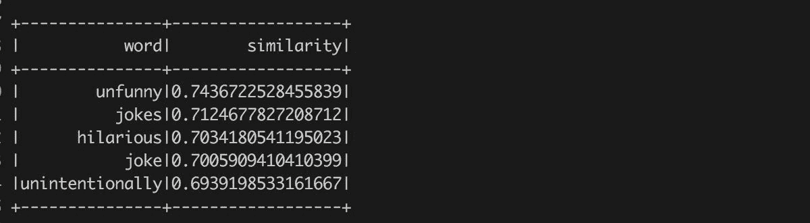

让我们退一步考虑我们刚刚做的事情。首先，我们将单词*funny*压缩为由 100 个浮点数组成的向量（回想一下，这是 Spark 实现的 word2vec 算法的默认值）。因为我们已经将评论语料库中的所有单词都减少到了相同的分布表示形式，即 100 个数字，我们可以使用余弦相似度进行比较，这就是结果集中的第二个数字所反映的（在这种情况下，最高的余弦相似度是*nutty*一词）*.*

请注意，我们还可以使用`getVectors`函数访问*funny*或字典中的任何其他单词的向量，如下所示：

```scala
w2vModel.getVectors.where("word = 'funny'").show(truncate = false)
```

输出如下：

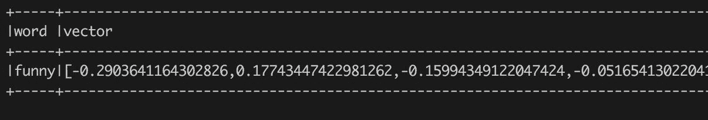

基于这些表示，已经进行了许多有趣的研究，将相似的单词聚类在一起。在本章后面，当我们在下一节执行 doc2vec 的破解版本后，我们将重新讨论聚类。

# 创建文档向量

所以，现在我们可以创建编码单词*含义*的向量，并且我们知道任何给定的电影评论在标记化后是一个由*N*个单词组成的数组，我们可以开始创建一个简易的 doc2vec，方法是取出构成评论的所有单词的平均值。也就是说，对于每个评论，通过对个别单词向量求平均值，我们失去了单词的具体顺序，这取决于您的应用程序的敏感性，可能会产生差异：

*v(word_1) + v(word_2) + v(word_3) ... v(word_Z) / count(words in review)*

理想情况下，人们会使用 doc2vec 的一种变体来创建文档向量；然而，截至撰写本书时，MLlib 尚未实现 doc2vec，因此，我们暂时使用这个简单版本，正如您将看到的那样，它产生了令人惊讶的结果。幸运的是，如果模型包含一个标记列表，Spark ML 实现的 word2vec 模型已经对单词向量进行了平均。例如，我们可以展示短语*funny movie*的向量等于`funny`和`movie`标记的向量的平均值：

```scala
val testDf = Seq(Seq("funny"), Seq("movie"), Seq("funny", "movie")).toDF("reviewTokens")
 w2vModel.transform(testDf).show(truncate=false)
```

输出如下：

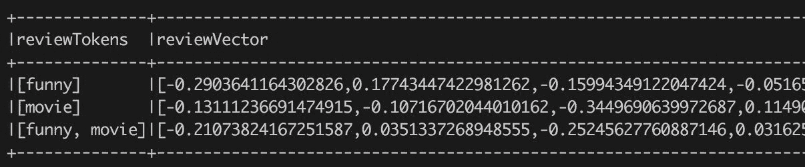

因此，我们可以通过简单的模型转换准备我们的简易版本 doc2vec：

```scala
val inputData = w2vModel.transform(movieReviews)
```

作为这个领域的从业者，我们有机会与各种文档向量的不同变体一起工作，包括单词平均、doc2vec、LSTM 自动编码器和跳跃思想向量。我们发现，对于单词片段较小的情况，单词的顺序并不重要，简单的单词平均作为监督学习任务效果出奇的好。也就是说，并不是说它不能通过 doc2vec 和其他变体来改进，而是基于我们在各种客户应用程序中看到的许多用例的观察结果。

# 监督学习任务

就像在前一章中一样，我们需要准备训练和验证数据。在这种情况下，我们将重用 Spark API 来拆分数据：

```scala
val trainValidSplits = inputData.randomSplit(Array(0.8, 0.2))
val (trainData, validData) = (trainValidSplits(0), trainValidSplits(1))
```

现在，让我们使用一个简单的决策树和一些超参数进行网格搜索：

```scala
val gridSearch =
for (
     hpImpurity <- Array("entropy", "gini");
     hpDepth <- Array(5, 20);
     hpBins <- Array(10, 50))
yield {
println(s"Building model with: impurity=${hpImpurity}, depth=${hpDepth}, bins=${hpBins}")
val model = new DecisionTreeClassifier()
         .setFeaturesCol("reviewVector")
         .setLabelCol("label")
         .setImpurity(hpImpurity)
         .setMaxDepth(hpDepth)
         .setMaxBins(hpBins)
         .fit(trainData)

val preds = model.transform(validData)
val auc = new BinaryClassificationEvaluator().setLabelCol("label")
         .evaluate(preds)
       (hpImpurity, hpDepth, hpBins, auc)
     }
```

我们现在可以检查结果并显示最佳模型 AUC：

```scala
import com.packtpub.mmlwspark.utils.Tabulizer.table
println(table(Seq("Impurity", "Depth", "Bins", "AUC"),
               gridSearch.sortBy(_._4).reverse,
Map.empty[Int,String]))
```

输出如下：

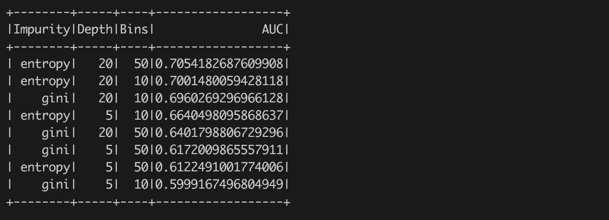

使用这个简单的决策树网格搜索，我们可以看到我们的*简易 doc2vec*产生了 0.7054 的 AUC。让我们还将我们的确切训练和测试数据暴露给 H2O，并尝试使用 Flow UI 运行深度学习算法：

```scala
import org.apache.spark.h2o._
val hc = H2OContext.getOrCreate(sc)
val trainHf = hc.asH2OFrame(trainData, "trainData")
val validHf = hc.asH2OFrame(validData, "validData")
```

现在我们已经成功将我们的数据集发布为 H2O 框架，让我们打开 Flow UI 并运行深度学习算法：

```scala
hc.openFlow()
```

首先，请注意，如果我们运行`getFrames`命令，我们将看到我们无缝从 Spark 传递到 H2O 的两个 RDD：

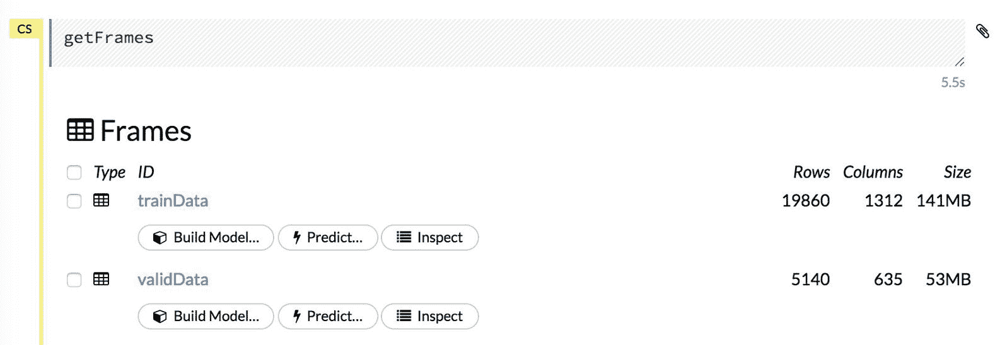

我们需要通过单击 Convert to enum 将标签列的类型从数值列更改为分类列，对两个框架都进行操作：

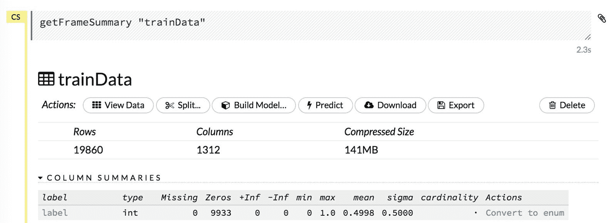

接下来，我们将运行一个深度学习模型，所有超参数都设置为默认值，并将第一列设置为我们的标签：

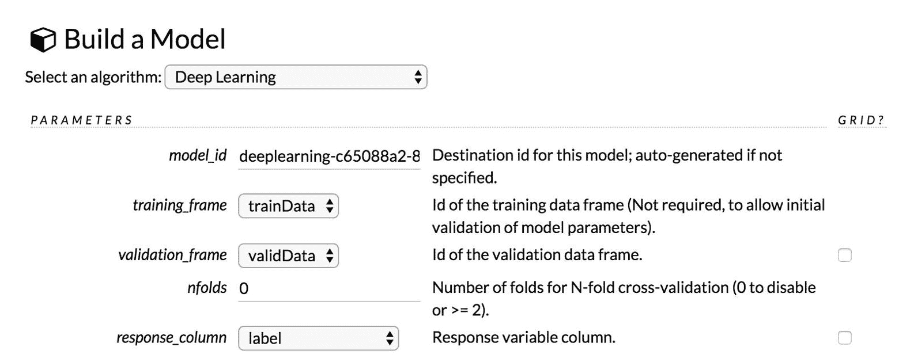

如果您没有明确创建训练/测试数据集，您还可以使用先前的*nfolds*超参数执行*n 折交叉验证*：

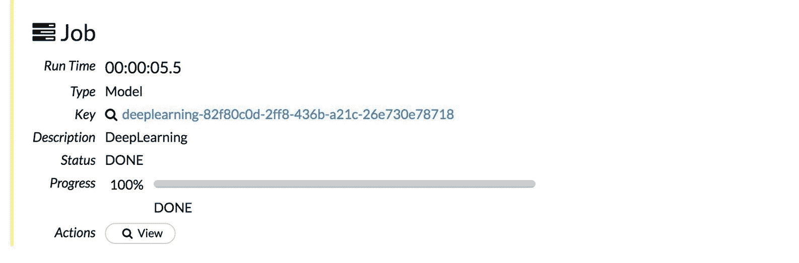

运行模型训练后，我们可以点击“查看”查看训练和验证数据集上的 AUC：

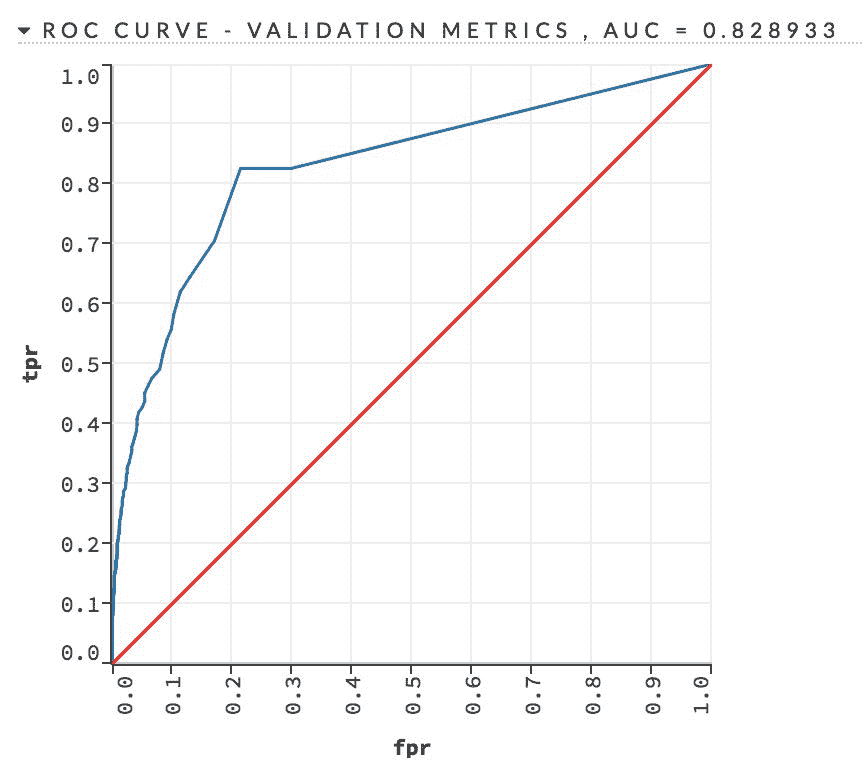

我们看到我们简单的深度学习模型的 AUC 更高，约为 0.8289。这是没有任何调整或超参数搜索的结果。

我们可以执行哪些其他步骤来进一步改进 AUC？我们当然可以尝试使用网格搜索超参数来尝试新算法，但更有趣的是，我们可以调整文档向量吗？答案是肯定和否定！这部分是否定的，因为正如您所记得的，word2vec 本质上是一个无监督学习任务；但是，通过观察返回的一些相似单词，我们可以了解我们的向量的强度。例如，让我们看看单词`drama`：

```scala
w2vModel.findSynonyms("drama", 5).show()
```

输出如下：

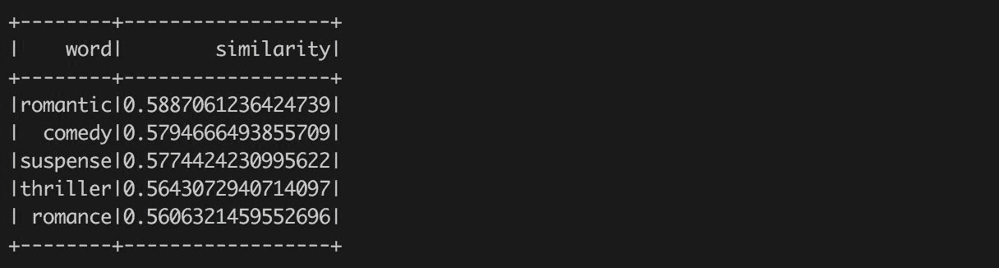

直观地，我们可以查看结果，并询问这五个单词是否*真的是*单词*drama*的最佳同义词（即最佳余弦相似性）。现在让我们尝试通过修改其输入参数重新运行我们的 word2vec 模型：

```scala
val newW2VModel = new Word2Vec()
   .setInputCol("reviewTokens")
   .setOutputCol("reviewVector")
   .setMinCount(3)
   .setMaxIter(250)
   .setStepSize(0.02)
   .fit(movieReviews)
    newW2VModel.findSynonyms("drama", 5).show()
```

输出如下：

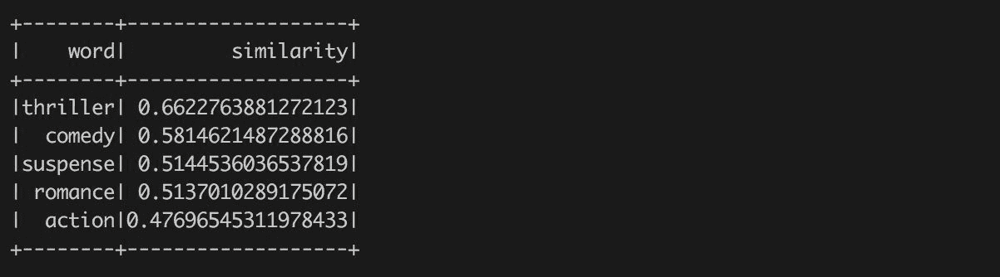

您应该立即注意到同义词在相似性方面*更好*，但也要注意余弦相似性对这些术语来说显着更高。请记住，word2vec 的默认迭代次数为 1，现在我们已将其设置为`250`，允许我们的网络真正定位一些高质量的词向量，这可以通过更多的预处理步骤和进一步调整 word2vec 的超参数来进一步改进，这应该产生更好质量的文档向量。

# 总结

许多公司（如谷歌）免费提供预训练的词向量（在 Google News 的子集上训练，包括前三百万个单词/短语）以供各种向量维度使用：例如，25d、50d、100d、300d 等。您可以在此处找到代码（以及生成的词向量）。除了 Google News，还有其他来源的训练词向量，使用维基百科和各种语言。您可能会有一个问题，即如果谷歌等公司免费提供预训练的词向量，为什么还要自己构建？这个问题的答案当然是应用相关的；谷歌的预训练词典对于单词*java*有三个不同的向量，基于大小写（JAVA、Java 和 java 表示不同的含义），但也许，您的应用只涉及咖啡，因此只需要一个*版本*的 java。

本章的目标是为您清晰简洁地解释 word2vec 算法以及该算法的非常流行的扩展，如 doc2vec 和序列到序列学习模型，这些模型采用各种风格的循环神经网络。正如总是一章的时间远远不足以涵盖自然语言处理这个极其激动人心的领域，但希望这足以激发您的兴趣！

作为这一领域的从业者和研究人员，我们（作者）不断思考将文档表示为固定向量的新方法，有很多论文致力于解决这个问题。您可以考虑*LDA2vec*和*Skip-thought Vectors*以进一步阅读该主题。

其他一些博客可添加到您的阅读列表，涉及**自然语言处理**（**NLP**）和*向量化*，如下所示：

+   谷歌的研究博客（[`research.googleblog.com/`](https://research.googleblog.com/)）

+   NLP 博客（始终考虑周到的帖子，带有大量链接供进一步阅读，）（[`nlpers.blogspot.com/`](http://nlpers.blogspot.com/)）

+   斯坦福 NLP 博客（[`nlp.stanford.edu/blog/`](http://nlp.stanford.edu/blog/)）

在下一章中，我们将再次看到词向量，我们将结合到目前为止学到的所有知识来解决一个需要在各种处理任务和模型输入方面“应有尽有”的问题。 敬请关注！
