# 第六章：从点击流数据中提取模式

在收集个别测量或事件之间的真实世界数据时，通常会有非常复杂和高度复杂的关系需要观察。本章的指导示例是用户在网站及其子域上生成的点击事件的观察。这样的数据既有趣又具有挑战性。它有趣，因为通常有许多*模式*显示出用户在其浏览行为中的行为和某些*规则*。至少对于运行网站的公司和可能成为他们数据科学团队的焦点，了解用户群体的见解是有趣的。方法论方面，建立一个能够实时检测模式的生产系统，例如查找恶意行为，技术上可能非常具有挑战性。能够理解和实施算法和技术两方面是非常有价值的。

在本章中，我们将深入研究两个主题：在 Spark 中进行*模式挖掘*和处理*流数据*。本章分为两个主要部分。在第一部分中，我们将介绍 Spark 目前提供的三种可用模式挖掘算法，并将它们应用于一个有趣的数据集。在第二部分中，我们将更加技术化地看待问题，并解决使用第一部分算法部署流数据应用时出现的核心问题。特别是，您将学习以下内容：

+   频繁模式挖掘的基本原则。

+   应用程序的有用和相关数据格式。

+   如何加载和分析用户在[`MSNBC.com`](http://MSNBC.com)上生成的点击流数据集。

+   在 Spark 中了解和比较三种模式挖掘算法，即*FP-growth，关联规则*和**前缀跨度**。

+   如何将这些算法应用于 MSNBC 点击数据和其他示例以识别相关模式。

+   *Spark Streaming*的基础知识以及它可以涵盖哪些用例。

+   如何通过使用 Spark Streaming 将任何先前的算法投入生产。

+   使用实时聚合的点击事件实现更实际的流应用程序。

通过构建，本章在技术上更加涉及到了末尾，但是通过*Spark Streaming*，它也允许我们介绍 Spark 生态系统中另一个非常重要的工具。我们首先介绍模式挖掘的一些基本问题，然后讨论如何解决这些问题。

# 频繁模式挖掘

当面对一个新的数据集时，一个自然的问题序列是：

+   我们看什么样的数据；也就是说，它有什么结构？

+   数据中可以经常发现哪些观察结果；也就是说，我们可以在数据中识别出哪些模式或规则？

+   我们如何评估什么是频繁的；也就是说，什么是良好的相关性度量，我们如何测试它？

在非常高的层次上，频繁模式挖掘正是在解决这些问题。虽然很容易立即深入研究更高级的机器学习技术，但这些模式挖掘算法可以提供相当多的信息，并帮助建立对数据的直觉。

为了介绍频繁模式挖掘的一些关键概念，让我们首先考虑一个典型的例子，即购物车。对顾客对某些产品感兴趣并购买的研究长期以来一直是全球营销人员的主要关注点。虽然在线商店确实有助于进一步分析顾客行为，例如通过跟踪购物会话中的浏览数据，但已购买的物品以及购买行为中的模式的问题也适用于纯线下场景。我们很快将看到在网站上积累的点击流数据的更复杂的例子；目前，我们将在假设我们可以跟踪的事件中只有物品的实际支付交易的情况下进行工作。

例如，对于超市或在线杂货购物车的给定数据，会引发一些有趣的问题，我们主要关注以下三个问题：

+   *哪些物品经常一起购买？*例如，有传闻证据表明啤酒和尿布经常在同一次购物会话中一起购买。发现经常一起购买的产品的模式可能允许商店将这些产品放在彼此更近的位置，以增加购物体验或促销价值，即使它们乍一看并不属于一起。在在线商店的情况下，这种分析可能是简单推荐系统的基础。

+   基于前面的问题，*在购物行为中是否有任何有趣的影响或规则？*继续以购物车为例，我们是否可以建立关联，比如*如果购买了面包和黄油，我们也经常在购物车中找到奶酪*？发现这样的关联规则可能非常有趣，但也需要更多澄清我们认为的*经常*是什么意思，也就是，频繁意味着什么。

+   注意，到目前为止，我们的购物车只是被简单地视为一个*物品袋*，没有额外的结构。至少在在线购物的情况下，我们可以为数据提供更多信息。我们将关注物品的*顺序性*;也就是说，我们将注意产品被放入购物车的顺序。考虑到这一点，类似于第一个问题，人们可能会问，*我们的交易数据中经常可以找到哪些物品序列？*例如，购买大型电子设备后可能会跟随购买额外的实用物品。

我们之所以特别关注这三个问题，是因为 Spark MLlib 正好配备了三种模式挖掘算法，它们大致对应于前面提到的问题，能够回答这些问题。具体来说，我们将仔细介绍*FP-growth*、*关联规则*和*前缀跨度*，以解决这些问题，并展示如何使用 Spark 解决这些问题。在这样做之前，让我们退一步，正式介绍到目前为止我们已经为之努力的概念，以及一个运行的例子。我们将在接下来的小节中提到前面的三个问题。

# 模式挖掘术语

我们将从一组项目*I = {a[1], ..., a[n]}*开始，这将作为所有以下概念的基础。*事务* T 只是 I 中的一组项目，如果它包含*l*个项目，则我们说 T 是长度为*l*的事务。*事务数据库* D 是事务 ID 和它们对应的事务的数据库。

为了给出一个具体的例子，考虑以下情况。假设要购物的完整物品集由*I = {面包，奶酪，菠萝，鸡蛋，甜甜圈，鱼，猪肉，牛奶，大蒜，冰淇淋，柠檬，油，蜂蜜，果酱，羽衣甘蓝，盐}*给出。由于我们将查看很多物品子集，为了使以后的事情更容易阅读，我们将简单地用它们的第一个字母缩写这些物品，也就是说，我们将写*I = {b，c，a，e，d，f，p，m，g，i，l，o，h，j，k，s}*。给定这些物品，一个小的交易数据库 D 可能如下所示：

| 交易 ID | 交易 |
| --- | --- |
| 1 | a, c, d, f, g, i, m, p |
| 2 | a, b, c, f, l, m, o |
| 3 | b, f, h, j, o |
| 4 | b, c, k, s, p |
| 5 | a, c, e, f, l, m, n, p |

表 1：一个包含五个交易的小购物车数据库

# 频繁模式挖掘问题

鉴于交易数据库的定义，*模式*P 是包含在 D 中的交易，模式的支持*supp(P)*是这个为真的交易数量，除以或归一化为 D 中的交易数量：

*supp(s) = suppD = |{ s' ∈ S | s <s'}| / |D|*

我们使用*<*符号来表示*s*作为*s'*的子模式，或者反过来，称*s'*为*s*的超模式。请注意，在文献中，您有时也会找到一个略有不同的支持版本，它不会对值进行归一化。例如，模式*{a，c，f}*可以在交易 1、2 和 5 中找到。这意味着*{a，c，f}*是我们数据库 D 中支持为 0.6 的模式的模式。

支持是一个重要的概念，因为它给了我们一个测量模式频率的第一个例子，这正是我们追求的。在这种情况下，对于给定的最小支持阈值*t*，我们说*P*是一个频繁模式，当且仅当*supp(P)*至少为*t*。在我们的运行示例中，长度为 1 且最小支持*0.6*的频繁模式是*{a}，{b}，{c}，{p}，和{m}*，支持为 0.6，以及*{f}*，支持为 0.8。在接下来的内容中，我们经常会省略项目或模式的括号，并写*f*代替*{f}*，例如。

给定最小支持阈值，找到所有频繁模式的问题被称为*频繁模式挖掘问题*，实际上，这是前面提到的第一个问题的形式化版本。继续我们的例子，我们已经找到了*t = 0.6*的长度为 1 的所有频繁模式。我们如何找到更长的模式？在理论上，鉴于资源是无限的，这并不是什么大问题，因为我们所需要做的就是计算项目的出现次数。然而，在实际层面上，我们需要聪明地处理这个问题，以保持计算的高效性。特别是对于足够大以至于 Spark 能派上用场的数据库来说，解决频繁模式挖掘问题可能会非常计算密集。

一个直观的解决方法是这样的：

1.  找到所有长度为 1 的频繁模式，这需要进行一次完整的数据库扫描。这就是我们在前面的例子中开始的方式。

1.  对于长度为 2 的模式，生成所有频繁 1-模式的组合，即所谓的候选项，并通过对 D 的另一次扫描来测试它们是否超过最小支持。

1.  重要的是，我们不必考虑不频繁模式的组合，因为包含不频繁模式的模式不能变得频繁。这种推理被称为**先验原则**。

1.  对于更长的模式，迭代地继续这个过程，直到没有更多的模式可以组合。

这种算法使用生成和测试方法进行模式挖掘，并利用先验原则来限制组合，称为先验算法。这种基线算法有许多变体，它们在可扩展性方面存在类似的缺点。例如，需要进行多次完整的数据库扫描来执行迭代，这对于庞大的数据集可能已经成本过高。此外，生成候选本身已经很昂贵，但计算它们的组合可能根本不可行。在下一节中，我们将看到 Spark 中的*FP-growth*算法的并行版本如何克服刚才讨论的大部分问题。

# 关联规则挖掘问题

为了进一步介绍概念，让我们接下来转向*关联规则*，这是首次在*大型数据库中挖掘项集之间的关联规则*中引入的，可在[`arbor.ee.ntu.edu.tw/~chyun/dmpaper/agrama93.pdf`](http://arbor.ee.ntu.edu.tw/~chyun/dmpaper/agrama93.pdf)上找到。与仅计算数据库中项的出现次数相反，我们现在想要理解模式的规则或推论。我的意思是，给定模式*P[1]*和另一个模式*P[2]*，我们想知道在*D*中可以找到*P[1]*时，*P[2]*是否经常出现，我们用*P[1 ]⇒ P[2]*来表示这一点。为了更加明确，我们需要一个类似于模式支持的规则频率的概念，即*置信度*。对于规则*P[1 ]⇒ P[2]*，置信度定义如下：

*conf(P[1] ⇒ P[2]) = supp(P[1] ∪ P[2]) / supp(P[1])*

这可以解释为*P[1]*给出*P[2]*的条件支持；也就是说，如果将*D*限制为支持*P[1]*的所有交易，那么在这个受限制的数据库中，*P[2]*的支持将等于*conf(P[1 ]⇒ P[2])*。如果它超过最小置信度阈值*t*，我们称*P[1 ]⇒ P[2]*为*D*中的规则，就像频繁模式的情况一样。找到置信度阈值的所有规则代表了第二个问题*关联规则挖掘*的正式答案。此外，在这种情况下，我们称*P[1 ]*为*前提*，*P[2]*为*结论*。通常，对前提或结论的结构没有限制。但在接下来的内容中，为简单起见，我们将假设结论的长度为 1。

在我们的运行示例中，模式*{f，m}*出现了三次，而*{f，m，p}*只出现了两次，这意味着规则*{f，m}⇒{p}*的置信度为*2/3*。如果我们将最小置信度阈值设置为*t = 0.6*，我们可以轻松地检查以下具有长度为 1 的前提和结论的关联规则对我们的情况有效：

*{a}⇒{c}，{a}⇒{f}，{a}⇒{m}，{a}⇒{p}，{c}⇒{a}，{c}⇒{f}，{c}⇒{m}，{c}⇒{p}，{f}⇒{a}，{f}⇒{c}，{f}⇒{m}，{m}⇒{a}，{m}⇒{c}，{m}⇒{f}，{m}⇒{p}，{p}⇒{a}，{p}⇒{c}，{p}⇒{f}，{p}⇒{m}*

从置信度的前面定义可以清楚地看出，一旦我们有了所有频繁模式的支持值，计算关联规则就相对简单。实际上，正如我们将很快看到的那样，Spark 对关联规则的实现是基于预先计算频繁模式的。

此时应该指出的是，虽然我们将限制自己在支持和置信度的度量上，但还有许多其他有趣的标准可用，我们无法在本书中讨论；例如，*信念、杠杆、*或*提升*的概念。有关其他度量的深入比较，请参阅[`www.cse.msu.edu/~ptan/papers/IS.pdf`](http://www.cse.msu.edu/~ptan/papers/IS.pdf)。

# 顺序模式挖掘问题

让我们继续正式化，这是我们在本章中处理的第三个也是最后一个模式匹配问题。让我们更详细地看一下*序列*。序列与我们之前看到的交易不同，因为现在顺序很重要。对于给定的项目集*I*，长度为*l*的序列*S*在*I*中定义如下：

*s = <s[1,] s[2],..., s[l]>*

在这里，每个单独的*s[i]*都是项目的连接，即*s[i] = (a[i1] ... a[im)]*，其中*a[ij]*是*I*中的一个项目。请注意，我们关心序列项*s[i]*的顺序，但不关心*s[i]*中各个*a[ij]*的内部顺序。序列数据库*S*由序列 ID 和序列的成对组成，类似于我们之前的内容。这样的数据库示例可以在下表中找到，其中的字母代表与我们之前的购物车示例中相同的项目：

| **序列 ID** | **序列** |
| --- | --- |
| 1 | *<a(abc)(ac)d(cf)>* |
| 2 | *<(ad)c(bc)(ae)>* |
| 3 | *<(ef)(ab)(df)cb>* |
| 4 | *<eg(af)cbc>* |

表 2：一个包含四个短序列的小序列数据库。

在示例序列中，注意圆括号将单个项目分组为序列项。还要注意，如果序列项由单个项目组成，我们会省略这些冗余的大括号。重要的是，子序列的概念需要比无序结构更加小心。我们称*u = (u[1], ..., u[n])*为*s = (s[1],..., s[l])*的*子序列*，并写为*u <s*，如果存在索引*1 **≤ i1 < i2 < ... < in ≤ m*，使得我们有以下关系：

*u[1] < s[i1], ..., u[n] <s[in]*

在这里，最后一行中的*< *符号表示*u[j]*是*s[ij]*的子模式。粗略地说，如果*u*的所有元素按给定顺序是*s*的子模式，那么*u*就是*s*的子序列。同样地，我们称*s*为*u*的超序列。在前面的例子中，我们看到*<a(ab)ac>*和*a(cb)(ac)dc>*是*<a(abc)(ac)d(cf)>*的子序列的例子，而*<(fa)c>*是*<eg(af)cbc>*的子序列的例子。

借助超序列的概念，我们现在可以定义给定序列数据库*S*中序列*s*的*支持度*如下：

*suppS = supp(s) = |{ s' ∈ S | s <s'}| / |S|*

请注意，结构上，这与无序模式的定义相同，但*<*符号表示的是另一种含义，即子序列。与以前一样，如果上下文中的信息清楚，我们在*支持度*的表示法中省略数据库下标。具备了*支持度*的概念，顺序模式的定义完全类似于之前的定义。给定最小支持度阈值*t*，序列*S*中的序列*s*如果*supp(s)*大于或等于*t*，则称为*顺序模式*。第三个问题的形式化被称为*顺序模式挖掘问题*，即找到在给定阈值*t*下*S*中的所有顺序模式的完整集合。

即使在我们只有四个序列的小例子中，手动检查所有顺序模式也可能是具有挑战性的。举一个*支持度为 1.0*的顺序模式的例子，所有四个序列的长度为 2 的子序列是*<ac>*。找到所有顺序模式是一个有趣的问题，我们将在下一节学习 Spark 使用的所谓*前缀 span*算法来解决这个问题。

# 使用 Spark MLlib 进行模式挖掘

在激发和介绍了三个模式挖掘问题以及必要的符号来正确讨论它们之后，我们将讨论如何使用 Spark MLlib 中可用的算法解决这些问题。通常情况下，由于 Spark MLlib 为大多数算法提供了方便的`run`方法，实际应用算法本身相当简单。更具挑战性的是理解算法及其随之而来的复杂性。为此，我们将逐一解释这三种模式挖掘算法，并研究它们是如何实现以及如何在玩具示例中使用它们。只有在完成所有这些之后，我们才会将这些算法应用于从[`MSNBC.com`](http://MSNBC.com)检索到的点击事件的真实数据集。

Spark 中模式挖掘算法的文档可以在[`spark.apache.org/docs/2.1.0/mllib-frequent-pattern-mining.html`](https://spark.apache.org/docs/2.1.0/mllib-frequent-pattern-mining.html)找到。它为希望立即深入了解的用户提供了一个很好的入口点。

# 使用 FP-growth 进行频繁模式挖掘

当我们介绍频繁模式挖掘问题时，我们还快速讨论了一种基于 apriori 原则来解决它的策略。这种方法是基于一遍又一遍地扫描整个交易数据库，昂贵地生成不断增长长度的模式候选项并检查它们的支持。我们指出，这种策略对于非常大的数据可能是不可行的。

所谓的*FP-growth 算法*，其中**FP**代表**频繁模式**，为这个数据挖掘问题提供了一个有趣的解决方案。该算法最初是在*Mining Frequent Patterns without Candidate Generation*中描述的，可在[`www.cs.sfu.ca/~jpei/publications/sigmod00.pdf`](https://www.cs.sfu.ca/~jpei/publications/sigmod00.pdf)找到。我们将首先解释这个算法的基础知识，然后继续讨论其分布式版本*parallel FP-growth*，该版本在*PFP: Parallel FP-Growth for Query Recommendation*中介绍，可在[`static.googleusercontent.com/media/research.google.com/en//pubs/archive/34668.pdf`](https://static.googleusercontent.com/media/research.google.com/en//pubs/archive/34668.pdf)找到。虽然 Spark 的实现是基于后一篇论文，但最好先了解基线算法，然后再进行扩展。

FP-growth 的核心思想是在开始时精确地扫描感兴趣的交易数据库 D 一次，找到所有长度为 1 的频繁模式，并从这些模式构建一个称为*FP-tree*的特殊树结构。一旦完成了这一步，我们不再使用 D，而是仅对通常要小得多的 FP-tree 进行递归计算。这一步被称为算法的*FP-growth 步骤*，因为它从原始树的子树递归构造树来识别模式。我们将称这个过程为*片段模式增长*，它不需要我们生成候选项，而是建立在*分而治之*策略上，大大减少了每个递归步骤中的工作量。

更准确地说，让我们首先定义 FP 树是什么，以及在示例中它是什么样子。回想一下我们在上一节中使用的示例数据库，显示在*表 1*中。我们的项目集包括以下 15 个杂货项目，用它们的第一个字母表示：*b*，*c*，*a*，*e*，*d*，*f*，*p*，*m*，*i*，*l*，*o*，*h*，*j*，*k*，*s*。我们还讨论了频繁项目；也就是说，长度为 1 的模式，对于最小支持阈值*t = 0.6*，由*{f, c, b, a, m, p}*给出。在 FP-growth 中，我们首先利用了一个事实，即项目的排序对于频繁模式挖掘问题并不重要；也就是说，我们可以选择呈现频繁项目的顺序。我们通过按频率递减的顺序对它们进行排序。总结一下情况，让我们看一下下表：

| **交易 ID** | **交易** | **有序频繁项** |
| --- | --- | --- |
| 1 | *a, c, d, f, g, i, m, p* | *f, c, a, m, p* |
| 2 | *a, b, c, f, l, m, o* | *f, c, a, b, m* |
| 3 | *b, f, h, j, o* | *f, b* |
| 4 | *b, c, k, s, p* | *c, b, p* |
| 5 | *a, c, e, f, l, m, n, p* | *f, c, a, m, p* |

表 3：继续使用表 1 开始的示例，通过有序频繁项扩充表格。

正如我们所看到的，像这样有序的频繁项已经帮助我们识别一些结构。例如，我们看到项集*{f, c, a, m, p}*出现了两次，并且稍微改变为*{f, c, a, b, m}*。FP 增长的关键思想是利用这种表示来构建树，从有序频繁项中反映出项在*表 3*的第三列中的结构和相互依赖关系。每个 FP 树都有一个所谓的*根*节点，用作连接构造的有序频繁项的基础。在以下图表的右侧，我们可以看到这是什么意思：

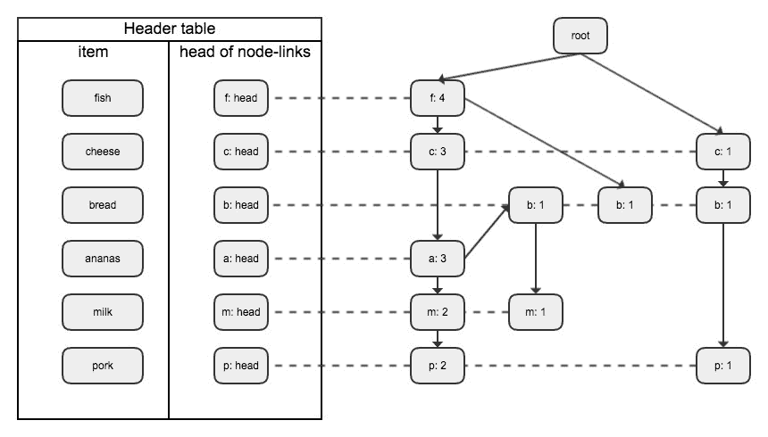

图 1：FP 树和我们频繁模式挖掘的运行示例的表头表。

*图 1*的左侧显示了我们将在稍后解释和正式化的表头表，右侧显示了实际的 FP 树。对于我们示例中的每个有序频繁项，都有一条从根开始的有向路径，从而表示它。树的每个节点不仅跟踪频繁项本身，还跟踪通过该节点的路径数。例如，五个有序频繁项集中有四个以字母*f*开头，一个以*c*开头。因此，在 FP 树中，我们在顶层看到`f: 4`和`c: 1`。这个事实的另一个解释是，*f*是四个项集的*前缀*，*c*是一个。对于这种推理的另一个例子，让我们将注意力转向树的左下部，即叶节点`p: 2`。两次*p*的出现告诉我们，恰好有两条相同的路径到此结束，我们已经知道：*{f, c, a, m, p}*出现了两次。这个观察很有趣，因为它已经暗示了 FP 增长中使用的一种技术--从树的叶节点开始，或者项集的后缀，我们可以追溯每个频繁项集，所有这些不同根节点路径的并集产生所有路径--这对于并行化是一个重要的想法。

*图 1*左侧的表头表是一种存储项的聪明方式。请注意，通过树的构造，一个节点不同于一个频繁项，而是，项可以并且通常会多次出现，即每个它们所属的不同路径都会出现一次。为了跟踪项及其关系，表头表本质上是项的*链表*，即每个项的出现都通过这个表与下一个项相连。我们在*图 1*中用水平虚线表示每个频繁项的链接，仅用于说明目的。

有了这个例子，现在让我们给出 FP 树的正式定义。FP 树*T*是一棵树，由根节点和从根节点开始的频繁项前缀子树以及频繁项表头表组成。树的每个节点由一个三元组组成，即项名称、出现次数和一个节点链接，指向相同名称的下一个节点，如果没有这样的下一个节点，则为`null`。

为了快速回顾，构建*T*，我们首先计算给定最小支持阈值*t*的频繁项，然后，从根开始，将每个由事务的排序频繁模式列表表示的路径插入树中。现在，我们从中获得了什么？要考虑的最重要的属性是，解决频繁模式挖掘问题所需的所有信息都被编码在 FP 树*T*中，因为我们有效地编码了所有频繁项的重复共现。由于*T*的节点数最多与频繁项的出现次数一样多，*T*通常比我们的原始数据库 D 小得多。这意味着我们已经将挖掘问题映射到了一个较小的数据集上，这本身就降低了与之前草率方法相比的计算复杂性。

接下来，我们将讨论如何从构建的 FP 树中递归地从片段中生长模式。为此，让我们做出以下观察。对于任何给定的频繁项*x*，我们可以通过跟随*x*的节点链接，从*x*的头表条目开始，通过分析相应的子树来获得涉及*x*的所有模式。为了解释具体方法，我们进一步研究我们的例子，并从头表的底部开始，分析包含*p*的模式。从我们的 FP 树*T*来看，*p*出现在两条路径中：*(f:4, c:3, a:3, m:3, p:2)*和*(c:1, b:1, p:1)*，跟随*p*的节点链接。现在，在第一条路径中，*p*只出现了两次，也就是说，在原始数据库 D 中*{f, c, a, m, p}*模式的总出现次数最多为两次。因此，在*p*存在的条件下，涉及*p*的路径实际上如下：*(f:2, c:2, a:2, m:2)*和*(c:1, b:1)*。事实上，由于我们知道我们想要分析模式，给定*p*，我们可以简化符号，简单地写成*(f:2, c:2, a:2, m:2)*和*(c:1, b:1)*。这就是我们所说的**p 的条件模式基**。再进一步，我们可以从这个条件数据库构建一个新的 FP 树。在*p*出现三次的条件下，这棵新树只包含一个节点，即*(c:3)*。这意味着我们最终得到了*{c, p}*作为涉及*p*的单一模式，除了*p*本身。为了更好地讨论这种情况，我们引入以下符号：*p*的条件 FP 树用*{(c:3)}|p*表示。

为了更直观，让我们考虑另一个频繁项并讨论它的条件模式基。继续从底部到顶部并分析*m*，我们再次看到两条相关的路径：*(f:4, c:3, a:3, m:2)*和*(f:4, c:3, a:3, b:1, m:1)*。请注意，在第一条路径中，我们舍弃了末尾的*p:2*，因为我们已经涵盖了*p*的情况。按照相同的逻辑，将所有其他计数减少到所讨论项的计数，并在*m*的条件下，我们得到了条件模式基*{(f:2, c:2, a:2), (f:1, c:1, a:1, b:1)}*。因此，在这种情况下，条件 FP 树由*{f:3, c:3, a:3}|m*给出。现在很容易看出，实际上每个*m*与*f*、*c*和*a*的每种可能组合都形成了一个频繁模式。给定*m*，完整的模式集合是*{m}*、*{am}*、*{cm}*、*{fm}*、*{cam}*、*{fam}*、*{fcm}*和*{fcam}*。到目前为止，应该清楚如何继续了，我们不会完全进行这个练习，而是总结其结果如下表所示：

| **频繁模式** | **条件模式基** | **条件 FP 树** |
| --- | --- | --- |
| *p* | *{(f:2, c:2, a:2, m:2), (c:1, b:1)}* | *{(c:3)}&#124;p* |
| *m* | *{(f :2, c:2, a:2), (f :1, c:1, a:1, b:1)}* | *{f:3, c:3, a:3}&#124;m* |
| *b* | *{(f :1, c:1, a:1), (f :1), (c:1)}* | null |
| *a* | *{(f:3, c:3)}* | *{(f:3, c:3)}&#124;a* |
| *c* | *{(f:3)}* | *{(f:3)}&#124;c* |
| *f* | null | null |

表 4：我们运行示例的条件 FP 树和条件模式基的完整列表。

由于这种推导需要非常仔细的注意，让我们退一步总结一下到目前为止的情况：

1.  从原始 FP 树*T*开始，我们使用节点链接迭代所有项目。

1.  对于每个项目*x*，我们构建了它的条件模式基和条件 FP 树。这样做，我们使用了以下两个属性：

+   在每个潜在模式中，我们丢弃了跟随*x*之后的所有项目，即我们只保留了*x*的*前缀*。

+   我们修改了条件模式基中的项目计数，以匹配*x*的计数。

1.  使用后两个属性修改路径，我们称*x*的转换前缀路径。

最后，要说明算法的 FP 增长步骤，我们需要两个在示例中已经隐含使用的基本观察结果。首先，在条件模式基中项目的支持与其在原始数据库中的表示相同。其次，从原始数据库中的频繁模式*x*和任意一组项目*y*开始，我们知道如果且仅当*y*是频繁模式时*xy*也是频繁模式。这两个事实可以很容易地一般推导出来，但在前面的示例中应该清楚地证明。

这意味着我们可以完全专注于在条件模式基中查找模式，因为将它们与频繁模式连接又是一种模式，这样，我们可以找到所有模式。因此，通过计算条件模式基递归地增长模式的机制被称为模式增长，这就是为什么 FP 增长以此命名。考虑到所有这些，我们现在可以用伪代码总结 FP 增长过程，如下所示：

```scala
def fpGrowth(tree: FPTree, i: Item):
    if (tree consists of a single path P){
        compute transformed prefix path P' of P
        return all combinations p in P' joined with i
    }
    else{
        for each item in tree {
            newI = i joined with item
            construct conditional pattern base and conditional FP-tree newTree
            call fpGrowth(newTree, newI)
        }
    }
```

通过这个过程，我们可以总结完整的 FP 增长算法的描述如下：

1.  从 D 计算频繁项，并从中计算原始 FP 树*T*（*FP 树计算*）。

1.  运行`fpGrowth(T, null)`（*FP 增长计算*）。

在理解了基本构造之后，我们现在可以继续讨论基于 Spark 实现的 FP 增长的并行扩展，即 Spark 实现的基础。**并行 FP 增长**，或简称**PFP**，是 FP 增长在诸如 Spark 之类的并行计算引擎中的自然演变。它解决了基线算法的以下问题：

+   *分布式存储：*对于频繁模式挖掘，我们的数据库 D 可能无法适应内存，这已经使得原始形式的 FP 增长不适用。出于明显的原因，Spark 在这方面确实有所帮助。

+   *分布式计算：*有了分布式存储，我们将不得不适当地并行化算法的所有步骤，并且 PFP 正是这样做的。

+   *适当的支持值*：在处理查找频繁模式时，我们通常不希望将最小支持阈值*t*设置得太高，以便在长尾中找到有趣的模式。然而，一个小的*t*可能会导致 FP 树无法适应足够大的 D 而强制我们增加*t*。PFP 也成功地解决了这个问题，我们将看到。

考虑到 Spark 的实现，PFP 的基本概述如下：

+   **分片**：我们将数据库 D 分布到多个分区，而不是将其存储在单个机器上。无论特定的存储层如何，使用 Spark，我们可以创建一个 RDD 来加载 D。

+   **并行频繁项计数**：计算 D 的频繁项的第一步可以自然地作为 RDD 上的映射-归约操作执行。

+   **构建频繁项组**：频繁项集被划分为多个组，每个组都有唯一的组 ID。

+   **并行 FP 增长**：FP 增长步骤分为两步，以利用并行性：

+   **映射阶段**：映射器的输出是一对，包括组 ID 和相应的交易。

+   **减少阶段**：Reducer 根据组 ID 收集数据，并对这些组相关的交易进行 FP 增长。

+   **聚合**：算法的最后一步是对组 ID 的结果进行聚合。

鉴于我们已经花了很多时间研究 FP-growth 本身，而不是深入了解 Spark 中 PFP 的太多实现细节，让我们看看如何在我们一直在使用的玩具示例上使用实际算法：

```scala
import org.apache.spark.mllib.fpm.FPGrowth
import org.apache.spark.rdd.RDD

val transactions: RDD[Array[String]] = sc.parallelize(Array(
  Array("a", "c", "d", "f", "g", "i", "m", "p"),
  Array("a", "b", "c", "f", "l", "m", "o"),
  Array("b", "f", "h", "j", "o"),
  Array("b", "c", "k", "s", "p"),
  Array("a", "c", "e", "f", "l", "m", "n", "p")
))

val fpGrowth = new FPGrowth()
  .setMinSupport(0.6)
  .setNumPartitions(5)
val model = fpGrowth.run(transactions)

model.freqItemsets.collect().foreach { itemset =>
  println(itemset.items.mkString("[", ",", "]") + ", " + itemset.freq)
}
```

代码很简单。我们将数据加载到`transactions`中，并使用最小支持值为*0.6*和*5*个分区初始化 Spark 的`FPGrowth`实现。这将返回一个模型，我们可以在之前构建的交易上运行。这样做可以让我们访问指定最小支持的模式或频繁项集，通过调用`freqItemsets`，以格式化的方式打印出来，总共有 18 个模式的输出如下：

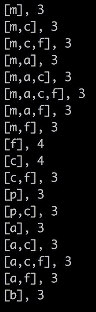

请记住，我们已经将交易定义为“集合”，我们通常称它们为项目集。这意味着在这样的项目集中，特定项目只能出现一次，`FPGrowth`依赖于此。例如，如果我们将前面示例中的第三个交易替换为`Array("b", "b", "h", "j", "o")`，在这些交易上调用`run`将会抛出错误消息。我们将在后面看到如何处理这种情况。

在类似于我们刚刚在 FP-growth 中所做的方式中已经解释了关联规则和前缀跨度之后，我们将转向在真实数据集上应用这些算法。

# 关联规则挖掘

回想一下关联规则介绍中，在计算关联规则时，一旦我们有了频繁项集，也就是指定最小阈值的模式，我们就已经完成了大约一半。事实上，Spark 的关联规则实现假设我们提供了一个`FreqItemsets[Item]`的 RDD，我们已经在之前调用`model.freqItemsets`中看到了一个例子。除此之外，计算关联规则不仅作为一个独立的算法可用，而且还可以通过`FPGrowth`使用。

在展示如何在我们的运行示例上运行相应算法之前，让我们快速解释一下 Spark 中如何实现关联规则：

1.  该算法已经提供了频繁项集，因此我们不需要再计算它们了。

1.  对于每一对模式 X 和*Y*，计算同时出现的 X 和 Y 的频率，并存储（*X*，（*Y*，supp（*X* ∪ *Y*））。我们称这样的模式对为“候选对”，其中*X*充当潜在的前提，*Y*充当结论。

1.  将所有模式与候选对连接起来，以获得形式为（X，（（Y，supp（*X* ∪ *Y*）），supp（*X*）））的语句。

1.  然后，我们可以通过所需的最小置信度值过滤形式为（X，（（Y，supp（*X* ∪ *Y*）），supp（*X*）））的表达式，以返回所有具有该置信度水平的规则*X ⇒ Y*。

假设我们在上一节中没有通过 FP-growth 计算模式，而是只给出了这些项目集的完整列表，我们可以从头开始创建一个 RDD，然后在其上运行`AssociationRules`的新实例：

```scala
import org.apache.spark.mllib.fpm.AssociationRules
import org.apache.spark.mllib.fpm.FPGrowth.FreqItemset

val patterns: RDD[FreqItemset[String]] = sc.parallelize(Seq(
  new FreqItemset(Array("m"), 3L),
  new FreqItemset(Array("m", "c"), 3L),
  new FreqItemset(Array("m", "c", "f"), 3L), 
  new FreqItemset(Array("m", "a"), 3L), 
  new FreqItemset(Array("m", "a", "c"), 3L),
  new FreqItemset(Array("m", "a", "c", "f"), 3L),  
  new FreqItemset(Array("m", "a", "f"), 3L), 
  new FreqItemset(Array("m", "f"), 3L), 
  new FreqItemset(Array("f"), 4L), 
  new FreqItemset(Array("c"), 4L), 
  new FreqItemset(Array("c", "f"), 3L), 
  new FreqItemset(Array("p"), 3L), 
  new FreqItemset(Array("p", "c"), 3L), 
  new FreqItemset(Array("a"), 3L), 
  new FreqItemset(Array("a", "c"), 3L), 
  new FreqItemset(Array("a", "c", "f"), 3L), 
  new FreqItemset(Array("a", "f"), 3L), 
  new FreqItemset(Array("b"), 3L)
))

val associationRules = new AssociationRules().setMinConfidence(0.7)
val rules = associationRules.run(patterns)

rules.collect().foreach { rule =>
  println("[" + rule.antecedent.mkString(",") + "=>"
    + rule.consequent.mkString(",") + "]," + rule.confidence)
}
```

请注意，在初始化算法后，我们将最小置信度设置为`0.7`，然后收集结果。此外，运行`AssociationRules`将返回一个`Rule`类型的规则 RDD。这些规则对象具有`antecedent`、`consequent`和`confidence`的访问器，我们使用这些访问器来收集结果，结果如下：

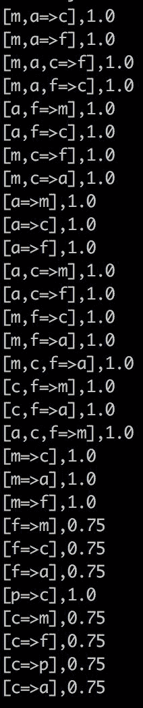

我们从头开始展示这个例子的原因是为了传达关联规则在 Spark 中确实是一个独立的算法。由于目前在 Spark 中计算模式的唯一内置方式是通过 FP-growth，而且关联规则无论如何都依赖于`FreqItemset`的概念（从`FPGrowth`子模块导入），这似乎有点不切实际。使用我们从之前的 FP-growth 示例中得到的结果，我们完全可以编写以下内容来实现相同的效果：

```scala
val patterns = model.freqItemsets
```

有趣的是，关联规则也可以直接通过`FPGrowth`的接口进行计算。继续使用之前示例中的符号，我们可以简单地写出以下内容，以得到与之前相同的一组规则：

```scala
val rules = model.generateAssociationRules(confidence = 0.7)
```

在实际情况下，虽然这两种表述都有用，但后一种肯定会更简洁。

# 使用前缀跨度进行顺序模式挖掘

转向顺序模式匹配，前缀跨度算法比关联规则稍微复杂一些，因此我们需要退一步，首先解释基础知识。前缀跨度首次在[`hanj.cs.illinois.edu/pdf/tkde04_spgjn.pdf`](http://hanj.cs.illinois.edu/pdf/tkde04_spgjn.pdf)中被描述为所谓的 FreeSpan 算法的自然扩展。该算法本身相对于其他方法（如**广义顺序模式**（GSP））来说是一个显著的改进。后者基于先验原则，我们之前讨论的关于许多基于它的算法的缺点也适用于顺序挖掘，即昂贵的候选生成，多次数据库扫描等。

前缀跨度，在其基本形式中，使用与 FP-growth 相同的基本思想，即将原始数据库投影到通常较小的结构中进行分析。而在 FP-growth 中，我们递归地为原始 FP 树中的每个分支的后缀构建新的 FP 树，前缀跨度通过考虑前缀来增长或跨越新的结构，正如其名称所示。

让我们首先在序列的上下文中正确定义前缀和后缀的直观概念。在接下来的内容中，我们将始终假设序列项内的项目按字母顺序排列，也就是说，如果 s = <s[1,] s[2],..., s[l]>是 S 中的一个序列，每个 s[i]都是项目的连接，也就是 s[i] = (a[i1] ... a[im])，其中 a[ij]是 I 中的项目，我们假设 s[i]中的所有 a[ij]都按字母顺序排列。在这种情况下，如果 s' = <s'[1,] s'[2],..., s'm>是 s 的前缀，当且仅当满足以下三个属性时，s'被称为 s 的前缀：

+   对于所有 i < m，我们有序列项的相等，也就是 s'[i] = s[i]

+   s'[m] < s[m]，也就是说，s'的最后一项是 s[m]的子模式

+   如果我们从 s[m]中减去 s'[m]，也就是从 s[m]中删除子模式 s'[m]，那么 s[m] - s'[m]中剩下的所有频繁项都必须在 s'[m]中的所有元素之后按字母顺序排列

前两点都相当自然，最后一点可能看起来有点奇怪，所以让我们通过一个例子来解释。给定一个序列< a(abc)>，来自数据库 D，其中 a，b 和 c 确实频繁，那么< aa>和< a(ab)>是< a(abc)>的前缀，但< ab>不是，因为在最后序列项的差异中，<(abc)> - <b> = <(ac)>，字母 a 并不按字母表顺序在<ab>后面。基本上，第三个属性告诉我们，前缀只能在它影响的最后序列项的开头切除部分。

有了前缀的概念，现在很容易说出后缀是什么。使用与之前相同的符号，如果 s'是 s 的前缀，那么 s'' = <(s[m] - s'[m]), s[m+1], ..., s[l]>就是这个前缀的后缀，我们将其表示为 s'' = s / s'。此外，我们将 s = s's''写成乘积符号。例如，假设< a(abc)>是原始序列，< aa>是前缀，我们将此前缀的后缀表示如下：

<(_bc)> = <a(abc)> / <aa>

请注意，我们使用下划线符号来表示前缀对序列的剩余部分。

前缀和后缀的概念都有助于将原始的顺序模式挖掘问题分割成更小的部分，如下所示。让{<p[1]>, ...,<p[n]>}成为长度为 1 的完整顺序模式集。然后，我们可以得出以下观察结果：

+   所有的顺序模式都以*p[i]*中的一个开头。这意味着我们可以将所有的顺序模式分成*n*个不相交的集合，即以*p[i]*开头的那些，其中*i*在*1*和*n*之间。

+   应用这种推理递归地，我们得到以下的陈述：如果*s*是一个给定的长度为 1 的顺序模式，*{s¹, ..., s^m}*是长度为*l+1*的*s*的完整顺序超模式列表，那么所有具有前缀*s*的顺序模式可以被分成*m*个由*s^i*为前缀的集合。

这两个陈述都很容易得出，但提供了一个强大的工具，将原始问题集合划分为不相交的较小问题。这种策略被称为“分而治之”。有了这个想法，我们现在可以非常类似于 FP-growth 中对条件数据库所做的事情，即根据给定的前缀对数据库进行投影。给定一个顺序模式数据库 S 和一个前缀*s*，**s-投影数据库**，*S|[s]*，是 S 中所有*s*的后缀的集合。

我们需要最后一个定义来陈述和分析前缀跨度算法。如果*s*是 S 中的一个顺序模式，*x*是一个具有前缀*s*的模式，那么在*S|[s]*中*x*的*支持计数*，用*suppS|s*表示，是*S|[s]*中序列*y*的数量，使得*x < sy*；也就是说，我们简单地将支持的概念延续到了 s-投影数据库。我们可以从这个定义中得出一些有趣的性质，使得我们的情况变得更容易。例如，根据定义，我们看到对于任何具有前缀*s*的序列*x*，我们有以下关系：

*suppS = suppS|s*

也就是说，在这种情况下，无论我们在原始数据库中还是在投影数据库中计算支持度都没有关系。此外，如果*s'*是*s*的前缀，很明显*S|[s] = (S|[s'])|[s]*，这意味着我们可以连续地添加前缀而不会丢失信息。从计算复杂性的角度来看，最后一个最重要的陈述是，投影数据库的大小不会超过其原始大小。这个性质应该再次从定义中清楚地看出来，但它对于证明前缀跨度的递归性质是极其有帮助的。

有了所有这些信息，我们现在可以用伪代码勾勒出前缀跨度算法，如下所示。请注意，我们区分一个项目`s'`被附加到顺序模式`s`的末尾和从`s'`生成的序列`<s'>`被添加到`s`的末尾。举个例子，我们可以将字母*e*添加到*<a(abc)>*形成*<a(abce)>*，或者在末尾添加*<e>*形成*<a(abc)e>*：

```scala
def prefixSpan(s: Prefix, l: Length, S: ProjectedDatabase):
  S' = set of all s' in S|s if {
    (s' appended to s is a sequential pattern) or
    (<s'> appended to s is a sequential pattern)
  }
  for s' in S' {
    s'' = s' appended to s
    output s''
    call prefixSpan(s'', l+1, S|s'')
  }
}
call prefixSpan(<>, 0, S)
```

如所述，前缀跨度算法找到所有的顺序模式；也就是说，它代表了解决顺序模式挖掘问题的解决方案。我们无法在这里概述这个陈述的证明，但我们希望已经为您提供了足够的直觉来看到它是如何以及为什么它有效的。

以 Spark 为例，注意我们没有讨论如何有效地并行化基线算法。如果您对实现细节感兴趣，请参阅[`github.com/apache/spark/blob/v2.2.0/mllib/src/main/scala/org/apache/spark/mllib/fpm/PrefixSpan.scala`](https://github.com/apache/spark/blob/v2.2.0/mllib/src/main/scala/org/apache/spark/mllib/fpm/PrefixSpan.scala)，因为并行版本涉及的内容有点太多，不适合在这里介绍。我们将首先研究*表 2*中提供的示例，即四个序列*<a(abc)(ac)d(cf)>*，*<(ad)c(bc)(ae)>*，*<(ef)(ab)(df)cb>*和*<eg(af)cbc>*。为了编码序列的嵌套结构，我们使用字符串的数组数组，并将它们并行化以创建 RDD。初始化和运行`PrefixSpan`的实例的方式与其他两个算法基本相同。这里唯一值得注意的是，除了通过`setMinSupport`将最小支持阈值设置为`0.7`之外，我们还通过`setMaxPatternLength`将模式的最大长度指定为`5`。最后一个参数用于限制递归深度。尽管实现很巧妙，但算法（特别是计算数据库投影）可能需要很长时间：

```scala
import org.apache.spark.mllib.fpm.PrefixSpan

val sequences:RDD[Array[Array[String]]] = sc.parallelize(Seq(
  Array(Array("a"), Array("a", "b", "c"), Array("a", "c"), Array("d"), Array("c", "f")),
 Array(Array("a", "d"), Array("c"), Array("b", "c"), Array("a", "e")),
 Array(Array("e", "f"), Array("a", "b"), Array("d", "f"), Array("c"), Array("b")),
 Array(Array("e"), Array("g"), Array("a", "f"), Array("c"), Array("b"), Array("c")) ))
val prefixSpan = new PrefixSpan()
  .setMinSupport(0.7)
  .setMaxPatternLength(5)
val model = prefixSpan.run(sequences)
model.freqSequences.collect().foreach {
  freqSequence => println(freqSequence.sequence.map(_.mkString("[", ", ", "]")).mkString("[", ", ", "]") + ", " + freqSequence.freq) }
```

在您的 Spark shell 中运行此代码应该产生 14 个顺序模式的以下输出：

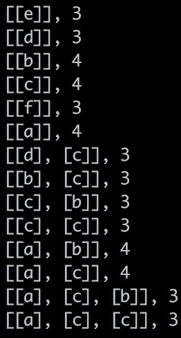

# MSNBC 点击流数据的模式挖掘

在花费了相当多的时间来解释模式挖掘的基础知识之后，让我们最终转向一个更现实的应用。我们接下来要讨论的数据来自[`msnbc.com`](http://msnbc.com)的服务器日志（部分来自[`msn.com`](http://msn.com)，与新闻相关），代表了这些网站用户的页面浏览活动的整整一天。这些数据是在 1999 年 9 月收集的，并且已经可以在[`archive.ics.uci.edu/ml/machine-learning-databases/msnbc-mld/msnbc990928.seq.gz`](http://archive.ics.uci.edu/ml/machine-learning-databases/msnbc-mld/msnbc990928.seq.gz)上下载。将此文件存储在本地并解压缩，`msnbc990928.seq`文件基本上由标题和长度不等的整数的空格分隔行组成。以下是文件的前几行：

```scala
% Different categories found in input file:

frontpage news tech local opinion on-air misc weather msn-news health living business msn-sports sports summary bbs travel

% Sequences:

1 1 
2 
3 2 2 4 2 2 2 3 3 
5 
1 
6 
1 1 
6 
6 7 7 7 6 6 8 8 8 8 
```

这个文件中的每一行都是用户当天的编码页面访问*序列*。页面访问并没有被收集到最精细的级别，而是被分成了 17 个与新闻相关的类别，这些类别被编码为整数。与这些类别对应的类别名称列在前面的标题中，大多数都是不言自明的（除了`bbs`，它代表**公告板服务**）。此列表中的第 n 个项目对应于第 n 个类别；例如，`1`代表`frontpage`，而`travel`被编码为`17`。例如，这个文件中的第四个用户点击了`opinion`一次，而第三个用户总共有九次页面浏览，从`tech`开始，以`tech`结束。

重要的是要注意，每行中的页面访问确实已经按*时间顺序*存储，也就是说，这确实是关于页面访问顺序的顺序数据。总共收集了 989,818 个用户的数据；也就是说，数据集确实有这么多序列。不幸的是，我们不知道有多少个 URL 已经分组成每个类别，但我们确实知道它的范围相当广，从 10 到 5,000。有关更多信息，请参阅[`archive.ics.uci.edu/ml/machine-learning-databases/msnbc-mld/msnbc.data.html`](http://archive.ics.uci.edu/ml/machine-learning-databases/msnbc-mld/msnbc.data.html)上提供的描述。

仅从这个数据集的描述中，就应该清楚到目前为止我们讨论过的所有三种模式挖掘问题都可以应用于这些数据--我们可以在这个序列数据库中搜索顺序模式，并且忽略顺序性，分析频繁模式和关联规则。为此，让我们首先使用 Spark 加载数据。接下来，我们将假设文件的标题已被删除，并且已经从存储序列文件的文件夹创建了一个 Spark shell 会话：

```scala
val transactions: RDD[Array[Int]] = sc.textFile("./msnbc990928.seq") map { line =>
  line.split(" ").map(_.toInt)
}
```

首先将序列文件加载到整数值数组的 RDD 中。回想一下，频繁模式挖掘中交易的一个假设是项目集实际上是集合，因此不包含重复项。因此，为了应用 FP-growth 和关联规则挖掘，我们必须删除重复的条目，如下所示：

```scala
val uniqueTransactions: RDD[Array[Int]] = transactions.map(_.distinct).cache()
```

请注意，我们不仅限制了每个交易的不同项目，而且缓存了生成的 RDD，这是所有三种模式挖掘算法的推荐做法。这使我们能够在这些数据上运行 FP-growth，为此我们必须找到一个合适的最小支持阈值*t*。到目前为止，在玩具示例中，我们选择了*t*相当大（在 0.6 和 0.8 之间）。在更大的数据库中，不现实地期望*任何*模式具有如此大的支持值。尽管我们只需要处理 17 个类别，但用户的浏览行为可能会因人而异。因此，我们选择支持值只有 5%来获得一些见解：

```scala
val fpGrowth = new FPGrowth().setMinSupport(0.05)
val model = fpGrowth.run(uniqueTransactions)
val count = uniqueTransactions.count()

model.freqItemsets.collect().foreach { itemset =>
    println(itemset.items.mkString("[", ",", "]") + ", " + itemset.freq / count.toDouble )
}
```

这个计算的输出显示，对于*t=0.05*，我们只恢复了 14 个频繁模式，如下所示：

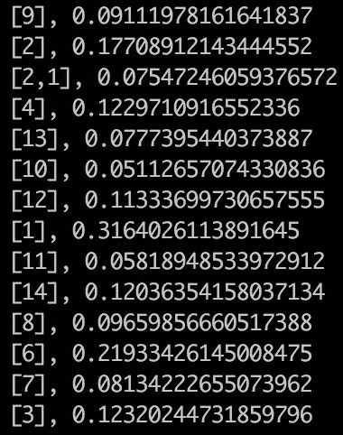

不仅模式可能比您预期的要少，而且在这些模式中，除了一个之外，所有模式的长度都为*1*。不足为奇的是，*front page*被最频繁地访问，占 31%，其次是*on-air*和*news*类别。*front page*和*news*站点只有 7%的用户在当天访问过，没有其他一对站点类别被超过 5%的用户群体访问。类别 5、15、16 和 17 甚至都没有进入列表。如果我们将实验重复一次，将*t*值改为 1%，模式的数量将增加到总共 74 个。

让我们看看其中有多少长度为 3 的模式：

```scala
model.freqItemsets.collect().foreach { itemset =>
  if (itemset.items.length >= 3)
    println(itemset.items.mkString("[", ",", "]") + ", " + itemset.freq / count.toDouble )
}
```

使用最小支持值*t=0.01*的`FPGrowth`实例运行这个操作将产生以下结果：

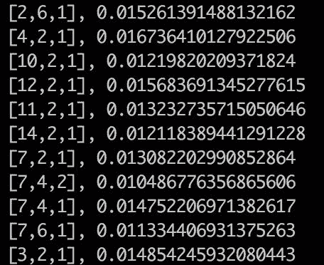

正如人们可能猜到的那样，最频繁的长度为 1 的模式也是 3 模式中占主导地位的。在这 11 个模式中，有 10 个涉及*front page*，而九个涉及*news*。有趣的是，根据先前的分析，*misc*类别虽然只有 7%的访问量，但在总共的四个 3 模式中出现。如果我们对潜在的用户群有更多的信息，跟进这个模式将是有趣的。可以推测，对许多*杂项*主题感兴趣的用户最终会进入这个混合类别，以及其他一些类别。

接下来进行关联规则的分析在技术上很容易；我们只需运行以下代码来从现有的 FP-growth `model`中获取所有置信度为`0.4`的规则：

```scala
val rules = model.generateAssociationRules(confidence = 0.4)
rules.collect().foreach { rule =>
  println("[" + rule.antecedent.mkString(",") + "=>"
    + rule.consequent.mkString(",") + "]," + (100 * rule.confidence).round / 100.0)
}
```

请注意，我们可以方便地访问相应规则的前提、结果和置信度。这次输出的结果如下；这次将置信度四舍五入到两位小数：

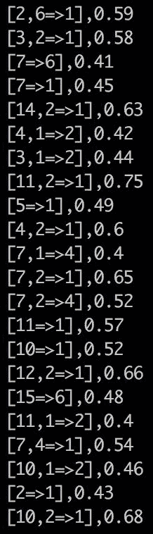

同样，自然地，最频繁的长度为 1 的模式出现在许多规则中，尤其是*frontpage*作为结果。在这个例子中，我们选择了支持和置信度的值，以便输出简短且计数容易手动验证，但是让我们对规则集进行一些自动计算，不受限制：

```scala
rules.count
val frontPageConseqRules = rules.filter(_.consequent.head == 1)
frontPageConseqRules.count
frontPageConseqRules.filter(_.antecedent.contains(2)).count
```

执行这些语句，我们看到大约三分之二的规则都有*front page*作为结果，即总共 22 条规则中的 14 条，其中有九条包含*news*在它们的前提中。

接下来是针对这个数据集的序列挖掘问题，我们需要将原始的`transactions`转换为`Array[Array[Int]]`类型的 RDD，因为嵌套数组是 Spark 中用于对前缀 span 编码序列的方式，正如我们之前所见。虽然有些显而易见，但仍然很重要指出，对于序列，我们不必丢弃重复项目的附加信息，就像我们刚刚对 FP-growth 所做的那样。

事实上，通过对单个记录施加顺序性，我们甚至可以获得更多的结构。要进行刚刚指示的转换，我们只需执行以下操作：

```scala
val sequences: RDD[Array[Array[Int]]] = transactions.map(_.map(Array(_))).cache()
```

再次，我们缓存结果以提高算法的性能，这次是`prefixspan`。运行算法本身与以前一样：

```scala
val prefixSpan = new PrefixSpan().setMinSupport(0.005).setMaxPatternLength(15)
val psModel = prefixSpan.run(sequences)
```

我们将最小支持值设置得非常低，为 0.5%，这样这次可以得到一个稍微更大的结果集。请注意，我们还搜索不超过 15 个序列项的模式。通过运行以下操作来分析频繁序列长度的分布：

```scala
psModel.freqSequences.map(fs => (fs.sequence.length, 1))
  .reduceByKey(_ + _)
  .sortByKey()
  .collect()
  .foreach(fs => println(s"${fs._1}: ${fs._2}"))
```

在这一系列操作中，我们首先将每个序列映射到一个由其长度和计数 1 组成的键值对。然后进行一个 reduce 操作，通过键对值进行求和，也就是说，我们计算这个长度出现的次数。其余的只是排序和格式化，得到以下结果：

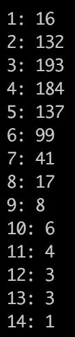

正如我们所看到的，最长的序列长度为 14，这特别意味着我们的最大值 15 并没有限制搜索空间，我们找到了所选支持阈值`t=0.005`的所有顺序模式。有趣的是，大多数用户的频繁顺序访问在[`msnbc.com`](http://msnbc.com)上的触点数量在两到六个之间。

为了完成这个例子，让我们看看每个长度的最频繁模式是什么，以及最长的顺序模式实际上是什么样的。回答第二个问题也会给我们第一个答案，因为只有一个长度为 14 的模式。计算这个可以这样做：

```scala
psModel.freqSequences
  .map(fs => (fs.sequence.length, fs))
  .groupByKey()
  .map(group => group._2.reduce((f1, f2) => if (f1.freq > f2.freq) f1 else f2))
  .map(_.sequence.map(_.mkString("[", ", ", "]")).mkString("[", ", ", "]"))
  .collect.foreach(println)
```

由于这是我们迄今为止考虑的比较复杂的 RDD 操作之一，让我们讨论一下涉及的所有步骤。我们首先将每个频繁序列映射到一个由其长度和序列本身组成的对。这一开始可能看起来有点奇怪，但它允许我们按长度对所有序列进行分组，这是我们在下一步中要做的。每个组由其键和频繁序列的迭代器组成。我们将每个组映射到其迭代器，并通过仅保留具有最大频率的序列来减少序列。然后，为了正确显示此操作的结果，我们两次使用`mkString`来从否则不可读的嵌套数组（在打印时）中创建字符串。前述链的结果如下：

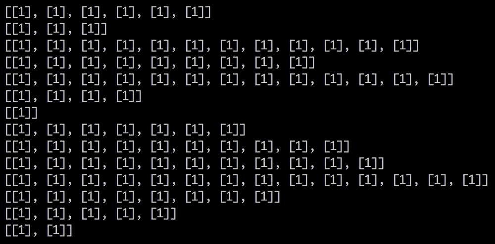

我们之前讨论过*首页*是迄今为止最频繁的项目，这在直觉上是有很多意义的，因为它是网站的自然入口点。然而，令人惊讶的是，在所选阈值下，所有长度最频繁的序列都只包括*首页*点击。显然，许多用户在首页及其周围花费了大量时间和点击，这可能是它相对于其他类别页面的广告价值的第一个迹象。正如我们在本章的介绍中所指出的，分析这样的数据，特别是如果结合其他数据源，对于各自网站的所有者来说可能具有巨大的价值，我们希望已经展示了频繁模式挖掘技术如何在其中发挥作用。

# 部署模式挖掘应用

在上一节中开发的示例是一个有趣的实验场，可以应用我们在整章中精心制定的算法，但我们必须承认一个事实，那就是我们只是被交给了数据。在撰写本书时，构建数据产品的文化往往在实时数据收集和聚合之间，以及（通常是离线的）数据分析之间划清界限，然后将获得的见解反馈到生产系统中。虽然这种方法有其价值，但也有一定的缺点。不考虑整体情况，我们可能不会准确了解数据的收集细节。缺少这样的信息可能导致错误的假设，最终得出错误的结论。虽然专业化在一定程度上既有用又必要，但至少从业者应该努力获得对应用程序的基本理解。

当我们在上一节介绍 MSNBC 数据集时，我们说它是从网站的服务器日志中检索出来的。我们大大简化了这意味着什么，让我们仔细看一看：

+   高可用性和容错性：网站上的点击事件需要在一天中的任何时间点进行跟踪，而不会出现停机。一些企业，特别是在涉及任何形式的支付交易时，例如在线商店，不能承受丢失某些事件的风险。

+   实时数据的高吞吐量和可扩展性：我们需要一个系统，可以实时存储和处理这些事件，并且可以在不减速的情况下处理一定的负载。例如，MSNBC 数据集中大约一百万个独立用户意味着平均每秒大约有 11 个用户的活动。还有许多事件需要跟踪，特别是要记住我们只测量了页面浏览。

+   流数据和批处理：原则上，前两点可以通过将事件写入足够复杂的日志来解决。然而，我们甚至还没有涉及聚合数据的话题，我们更需要一个在线处理系统来做到这一点。首先，每个事件都必须归因于一个用户，该用户将必须配备某种 ID。接下来，我们将不得不考虑用户会话的概念。虽然 MSNBC 数据集中的用户数据已经在日常级别上进行了聚合，但这对于许多目的来说还不够细粒度。分析用户的行为在他们实际活跃的时间段内是有意义的。因此，习惯上考虑活动窗口，并根据这些窗口聚合点击和其他事件。

+   流数据分析：假设我们有一个像我们刚刚描述的系统，并且实时访问聚合的用户会话数据，我们可以希望实现什么？我们需要一个分析平台，允许我们应用算法并从这些数据中获得见解。

Spark 解决这些问题的提议是其 Spark Streaming 模块，我们将在下文简要介绍。使用 Spark Streaming，我们将构建一个应用程序，至少可以模拟生成和聚合事件，然后应用我们研究的模式挖掘算法到事件流中。

# Spark Streaming 模块

在这里没有足够的时间对 Spark Streaming 进行深入介绍，但至少我们可以涉及一些关键概念，提供一些示例，并为更高级的主题提供一些指导。

Spark Streaming 是 Spark 的流数据处理模块，它确实具备我们在前面列表中解释的所有属性：它是一个高度容错、可扩展和高吞吐量的系统，用于处理和分析实时数据流。它的 API 是 Spark 本身的自然扩展，许多可用于 RDD 和 DataFrame 的工具也适用于 Spark Streaming。

Spark Streaming 应用程序的核心抽象是“DStream”的概念，它代表“离散流”。为了解释这个术语，我们经常将数据流想象为连续的事件流，当然，这是一个理想化的想法，因为我们所能测量的只是离散的事件。无论如何，这连续的数据流将进入我们的系统，为了进一步处理它，我们将其离散化为不相交的数据批次。这个离散数据批次流在 Spark Streaming 中被实现为 DStream，并且在内部被实现为一系列 RDD。

以下图表概述了 Spark Streaming 的数据流和转换：

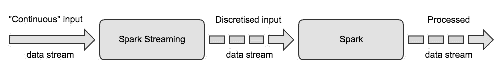

图 2：输入数据被馈入 Spark Streaming，它将这个流离散化为所谓的 DStream。然后，这些 RDD 序列可以通过 Spark 和其任何模块进一步转换和处理。

正如图表所示，数据通过输入数据流进入 Spark Streaming。这些数据可以从许多不同的来源产生和摄入，我们将在后面进一步讨论。我们称生成事件的系统为 Spark Streaming 可以处理的“来源”。输入 DStreams 通过这些来源的“接收器”从来源获取数据。一旦创建了输入 DStream，它可以通过丰富的 API 进行处理，这个 API 允许进行许多有趣的转换。将 DStreams 视为 RDD 的序列或集合，并通过与 Spark 核心中 RDD 非常接近的接口对其进行操作是一个很好的思维模型。例如，map-reduce 和 filter 等操作也适用于 DStreams，并且可以将相应功能从单个 RDD 转移到 RDD 序列。我们将更详细地讨论所有这些内容，但首先让我们转向一个基本示例。

作为开始使用 Spark Streaming 的第一个示例，让我们考虑以下情景。假设我们已经从先前加载了 MSNBC 数据集，并从中计算出了前缀跨度模型（`psModel`）。这个模型是用来自单日用户活动的数据拟合的，比如昨天的数据。今天，新的用户活动事件进来了。我们将创建一个简单的 Spark Streaming 应用程序，其中包含一个基本的源，精确地生成用户数据，其模式与我们在 MSNBC 数据中的模式相同；也就是说，我们得到了包含 1 到 17 之间数字的空格分隔字符串。然后，我们的应用程序将接收这些事件并从中创建`DStream`。然后，我们可以将我们的前缀跨度模型应用于`DStream`的数据，以找出新输入到系统中的序列是否确实是根据`psModel`频繁的序列。

首先，我们需要创建一个所谓的`StreamingContext`API，按照惯例，它将被实例化为`ssc`。假设我们从头开始启动一个应用程序，我们创建以下上下文：

```scala
import org.apache.spark.streaming.{Seconds, StreamingContext}
import org.apache.spark.{SparkConf, SparkContext}

val conf = new SparkConf()
  .setAppName("MSNBC data first streaming example")
  .setMaster("local[2]")
val sc = new SparkContext(conf)
val ssc = new StreamingContext(sc, batchDuration = Seconds(10))
```

如果您使用 Spark shell，除了第一行和最后一行之外，其他行都是不必要的，因为在这种情况下，您将已经提供了一个 Spark 上下文（`sc`）。我们包括后者的创建，因为我们的目标是一个独立的应用程序。创建一个新的`StreamingContext`API 需要两个参数，即`SparkContext`和一个名为`batchDuration`的参数，我们将其设置为 10 秒。批处理持续时间是告诉我们*如何离散化*`DStream`数据的值，通过指定流数据应该收集多长时间来形成`DStream`中的批处理，即序列中的一个 RDD。我们还想要吸引您的注意的另一个细节是，通过设置`local[2]`，Spark 主节点设置为两个核心。由于我们假设您是在本地工作，将至少分配两个核心给应用程序是很重要的。原因是一个线程将用于接收输入数据，而另一个线程将空闲以处理数据。在更高级的应用程序中，如果有更多的接收器，您需要为每个接收器保留一个核心。

接下来，我们基本上重复了前缀跨度模型的部分，以完善这个应用程序。与之前一样，序列是从本地文本文件加载的。请注意，这次我们假设文件在项目的资源文件夹中，但您可以选择将其存储在任何位置：

```scala
val transactions: RDD[Array[Int]] = sc.textFile("src/main/resources/msnbc990928.seq") map { line =>
  line.split(" ").map(_.toInt)
}
val trainSequences = transactions.map(_.map(Array(_))).cache()
val prefixSpan = new PrefixSpan().setMinSupport(0.005).setMaxPatternLength(15)
val psModel = prefixSpan.run(trainSequences)
val freqSequences = psModel.freqSequences.map(_.sequence).collect()
```

在前面计算的最后一步中，我们在主节点上收集所有频繁序列，并将它们存储为`freqSequences`。我们这样做的原因是要将这些数据与传入的数据进行比较，以查看新数据的序列是否与当前模型（`psModel`）相对频繁。不幸的是，与 MLlib 中的许多算法不同，Spark 中的三个可用的模式挖掘模型都不是在训练后接受新数据的，因此我们必须自己使用`freqSequences`进行比较。

接下来，我们最终可以创建一个`String`类型的`DStream`对象。为此，我们在流处理上下文中调用`socketTextStream`，这将允许我们从运行在`localhost`端口`8000`上的服务器上接收数据，监听 TCP 套接字：

```scala
val rawSequences: DStream[String] = ssc.socketTextStream("localhost", 8000)
```

我们称之为`rawSequences`的数据是通过该连接接收的，离散为 10 秒的间隔。在讨论*如何实际发送数据*之前，让我们先继续处理一旦接收到数据的示例。请记住，输入数据的格式与之前相同，因此我们需要以完全相同的方式对其进行预处理，如下所示：

```scala
val sequences: DStream[Array[Array[Int]]] = rawSequences
 .map(line => line.split(" ").map(_.toInt))
 .map(_.map(Array(_)))
```

我们在这里使用的两个`map`操作在原始 MSNBC 数据上在结构上与之前相同，但请记住，这次`map`具有不同的上下文，因为我们使用的是 DStreams 而不是 RDDs。定义了`sequences`，一个`Array[Array[Int]]`类型的 RDD 序列，我们可以使用它与`freqSequences`进行匹配。我们通过迭代 sequences 中的每个 RDD，然后再次迭代这些 RDD 中包含的每个数组来做到这一点。接下来，我们计算`freqSequences`中相应数组的出现频率，如果找到了，我们打印出与`array`对应的序列确实是频繁的：

```scala
print(">>> Analyzing new batch of data")
sequences.foreachRDD(
 rdd => rdd.foreach(
   array => {
     println(">>> Sequence: ")
     println(array.map(_.mkString("[", ", ", "]")).mkString("[", ", ", "]"))
     freqSequences.count(_.deep == array.deep) match {
       case count if count > 0 => println("is frequent!")
       case _ => println("is not frequent.")
     }
   }
 )
)
print(">>> done")
```

请注意，在前面的代码中，我们需要比较数组的深层副本，因为嵌套数组不能直接比较。更准确地说，可以检查它们是否相等，但结果将始终为 false。

完成转换后，应用程序接收端唯一剩下的事情就是实际告诉它开始监听传入的数据：

```scala
ssc.start()
ssc.awaitTermination()
```

通过流上下文`ssc`，我们告诉应用程序启动并等待其终止。请注意，在我们特定的上下文中，以及对于这种类型的大多数其他应用程序，我们很少想要终止程序。按设计，该应用程序旨在作为*长时间运行的作业*，因为原则上，我们希望它无限期地监听和分析新数据。当然，会有维护的情况，但我们也可能希望定期使用新获取的数据更新（重新训练）`psModel`。

我们已经看到了一些关于 DStreams 的操作，并建议您参考最新的 Spark Streaming 文档（[`spark.apache.org/docs/latest/streaming-programming-guide.html`](http://spark.apache.org/docs/latest/streaming-programming-guide.html)）以获取更多详细信息。基本上，许多（功能性）编程功能在基本的 Scala 集合上都是可用的，我们也从 RDD 中知道，它们也可以无缝地转移到 DStreams。举几个例子，这些是`filter`、`flatMap`、`map`、`reduce`和`reduceByKey`。其他类似 SQL 的功能，如 cogroup、`count`、`countByValue`、`join`或`union`，也都可以使用。我们将在第二个例子中看到一些更高级的功能。

现在我们已经涵盖了接收端，让我们简要讨论一下如何为我们的应用程序创建数据源。从命令行通过 TCP 套接字发送输入数据的最简单方法之一是使用*Netcat*，它适用于大多数操作系统，通常是预安装的。要在本地端口`8000`上启动 Netcat，在与您的 Spark 应用程序或 shell 分开的终端中运行以下命令：

```scala
nc -lk 8000
```

假设您已经启动了用于接收数据的 Spark Streaming 应用程序，现在我们可以在 Netcat 终端窗口中输入新的序列，并通过按*Enter*键确认每个序列。例如，在*10 秒内*输入以下四个序列：

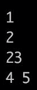

你会看到以下输出：

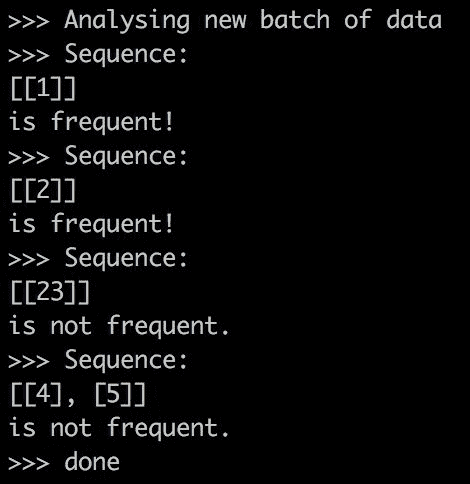

如果你打字速度很慢，或者在 10 秒窗口快要结束时开始打字，输出可能会分成更多部分。看看实际的输出，你会发现经常讨论的*首页*和*新闻*，由类别 1 和 2 表示，是频繁的。此外，由于 23 不是原始数据集中包含的序列项，它不能是频繁的。最后，序列<4, 5>显然也不频繁，这是我们以前不知道的。

选择 Netcat 作为本例的示例是一个自然的选择，但在严肃的生产环境中，你永远不会看到它用于这个目的。一般来说，Spark Streaming 有两种类型的可用源：基本和高级。基本源还可以是 RDD 队列和其他自定义源，除了文件流，前面的例子就是代表。在高级源方面，Spark Streaming 有许多有趣的连接器可供选择：Kafka、Kinesis、Flume 和高级自定义源。这种广泛的高级源的多样性使其成为将 Spark Streaming 作为生产组件并入其他基础架构组件的吸引力所在。

退后几步，考虑一下我们通过讨论这个例子所取得的成就，你可能会倾向于说，除了介绍 Spark Streaming 本身并与数据生产者和接收者一起工作之外，应用程序本身并没有解决我们之前提到的许多问题。这种批评是有效的，在第二个例子中，我们希望解决我们方法中的以下剩余问题：

+   我们的 DStreams 的输入数据与我们的离线数据具有相同的结构，也就是说，它已经针对用户进行了预聚合，这并不是非常现实的。

+   除了两次对`map`的调用和一次对`foreachRDD`的调用之外，我们在操作 DStreams 方面并没有看到太多功能和附加值

+   我们没有对数据流进行任何分析，只是将它们与预先计算的模式列表进行了检查

为了解决这些问题，让我们稍微重新定义我们的示例设置。这一次，让我们假设一个事件由一个用户点击一个站点来表示，其中每个站点都属于 1-17 中的一个类别，就像以前一样。现在，我们不可能模拟一个完整的生产环境，所以我们做出了简化的假设，即每个唯一的用户已经被分配了一个 ID。有了这些信息，让我们假设事件以用户 ID 和此点击事件的类别组成的键值对的形式出现。

有了这个设置，我们必须考虑如何对这些事件进行聚合，以生成序列。为此，我们需要在给定的*窗口*中为每个用户 ID 收集数据点。在原始数据集中，这个窗口显然是一整天，但根据应用程序的不同，选择一个更小的窗口可能是有意义的。如果我们考虑用户浏览他最喜欢的在线商店的情景，点击和其他事件可能会影响他或她当前的购买欲望。因此，在在线营销和相关领域做出的一个合理假设是将感兴趣的窗口限制在大约 20-30 分钟，即所谓的*用户会话*。为了让我们更快地看到结果，我们将在我们的应用程序中使用一个更小的 20 秒窗口。我们称之为**窗口长度**。

现在我们知道了我们想要从给定时间点分析数据的时间跨度，我们还必须定义*多久*我们想要进行聚合步骤，我们将其称为*滑动间隔*。一个自然的选择是将两者都设置为相同的时间，导致不相交的聚合窗口，即每 20 秒。然而，选择一个更短的 10 秒滑动窗口也可能很有趣，这将导致每 10 秒重叠的聚合数据。以下图表说明了我们刚刚讨论的概念：

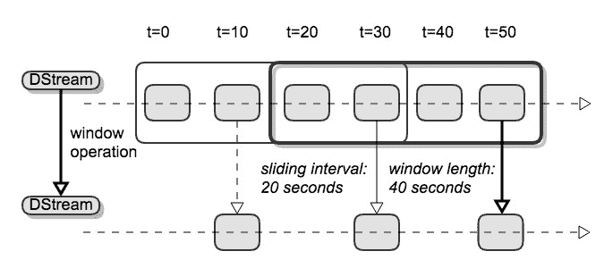

图 3：将 DStream 转换为另一个的窗口操作的可视化。在这个例子中，Spark Streaming 应用程序的批处理持续时间设置为 10 秒。用于对数据批次进行转换的窗口长度为 40 秒，我们每 20 秒进行一次窗口操作，导致每次重叠 20 秒，并得到一个以 20 秒为一块的 DStream。

要将这些知识转化为具体示例，我们假设事件数据的形式为*键:值*，也就是说，这样的一个事件可能是`137: 2`，意味着 ID 为`137`的用户点击了一个类别为*新闻*的页面。为了处理这些事件，我们必须修改我们的预处理如下：

```scala
val rawEvents: DStream[String] = ssc.socketTextStream("localhost", 9999)
val events: DStream[(Int, String)] = rawEvents.map(line => line.split(": "))
 .map(kv => (kv(0).toInt, kv(1)))
```

有了这些键值对，我们现在可以着手进行必要的聚合，以便按用户 ID 对事件进行分组。如前所述，我们通过在给定的 20 秒窗口上进行聚合，并设置 10 秒的滑动间隔来实现这一点：

```scala
val duration = Seconds(20)
val slide = Seconds(10)

val rawSequencesWithIds: DStream[(Int, String)] = events
  .reduceByKeyAndWindow((v1: String, v2: String) => v1 + " " + v2, duration, slide)
val rawSequences = rawSequencesWithIds.map(_.2)
// remainder as in previous example
```

在前面的代码中，我们使用了更高级的 DStreams 操作，即`reduceByKeyAndWindow`，其中我们指定了键值对的值的聚合函数，以及窗口持续时间和滑动间隔。在计算的最后一步中，我们剥离了用户 ID，使`rawSequences`的结构与之前的示例相同。这意味着我们已成功将我们的示例转换为在未处理的事件上运行，并且它仍将检查我们基线模型的频繁序列。我们不会展示此应用程序输出的更多示例，但我们鼓励您尝试一下这个应用程序，并看看如何对键值对进行聚合。

为了结束这个示例和本章，让我们再看一种有趣的聚合事件数据的方法。假设我们想要动态计算某个 ID 在事件流中出现的频率，也就是说，用户生成了多少次页面点击。我们已经定义了我们之前的`events` DStream，所以我们可以按照以下方式处理计数：

```scala
val countIds = events.map(e => (e._1, 1))
val counts: DStream[(Int, Int)] = countIds.reduceByKey(_ + _)
```

在某种程度上，这符合我们的意图；它计算了 ID 的事件数量。但是，请注意，返回的是一个 DStream，也就是说，我们实际上没有在流式窗口之间进行聚合，而只是在 RDD 序列内进行聚合。为了在整个事件流中进行聚合，我们需要从一开始就跟踪计数状态。Spark Streaming 提供了一个用于此目的的 DStreams 方法，即`updateStateByKey`。通过提供`updateFunction`，它可以使用当前状态和新值作为输入，并返回更新后的状态。让我们看看它在实践中如何为我们的事件计数工作：

```scala
def updateFunction(newValues: Seq[Int], runningCount: Option[Int]): Option[Int] = {
  Some(runningCount.getOrElse(0) + newValues.sum)
}
val runningCounts = countIds.updateStateByKeyInt
```

我们首先定义了我们的更新函数本身。请注意，`updateStateByKey`的签名要求我们返回一个`Option`，但实质上，我们只是计算状态和传入值的运行总和。接下来，我们为`updateStateByKey`提供了一个`Int`类型的签名和先前创建的`updateFunction`方法。这样做，我们就得到了我们最初想要的聚合。

总结一下，我们介绍了事件聚合、DStreams 上的两个更复杂的操作（`reduceByKeyAndWindow`和`updateStateByKey`），并使用这个示例在流中计算了事件的数量。虽然这个示例在所做的事情上仍然很简单，但我们希望为读者提供了更高级应用的良好入口点。例如，可以扩展这个示例以计算事件流上的移动平均值，或者改变它以在每个窗口基础上计算频繁模式。

# 总结

在本章中，我们介绍了一类新的算法，即频繁模式挖掘应用，并向您展示了如何在实际场景中部署它们。我们首先讨论了模式挖掘的基础知识以及可以使用这些技术解决的问题。特别是，我们看到了如何在 Spark 中实现三种可用的算法，即 FP-growth、关联规则和前缀跨度。作为我们应用的运行示例，我们使用了 MSNBC 提供的点击流数据，这也帮助我们在质量上比较了这些算法。

接下来，我们介绍了 Spark Streaming 的基本术语和入口点，并考虑了一些实际场景。我们首先讨论了如何首先部署和评估频繁模式挖掘算法与流上下文。之后，我们解决了从原始流数据中聚合用户会话数据的问题。为此，我们必须找到一种解决方案来模拟提供点击数据作为流事件。
