# 第七章：GraphX 的图形分析

在我们相互连接的世界中，图形是无处不在的。**万维网**（**WWW**）只是一个我们可以考虑为图形的复杂结构的例子，其中网页代表着通过它们之间的传入和传出链接连接的实体。在 Facebook 的社交图中，成千上万的用户形成一个网络，连接着全球的朋友。我们今天看到并且可以收集数据的许多其他重要结构都具有自然的图形结构；也就是说，它们可以在非常基本的层面上被理解为一组通过我们称之为*边*的方式相互连接的*顶点*的集合。以这种一般性的方式陈述，这一观察反映了图形是多么普遍。它的价值在于图形是经过深入研究的结构，并且有许多可用的算法可以让我们获得关于这些图形代表的重要见解。

Spark 的 GraphX 库是研究大规模图形的自然入口点。利用 Spark 核心中的 RDD 来编码顶点和边，我们可以使用 GraphX 对大量数据进行图形分析。在本章中，您将学习以下主题：

+   基本图形属性和重要的图形操作

+   GraphX 如何表示属性图形以及如何处理它们

+   以各种方式加载图形数据并生成合成图形数据以进行实验

+   使用 GraphX 的核心引擎来实现基本图形属性

+   使用名为 Gephi 的开源工具可视化图形

+   使用 GraphX 的两个关键 API 实现高效的图形并行算法。

+   使用 GraphFrames，这是 DataFrame 到图形的扩展，并使用优雅的查询语言研究图形

+   在社交图上运行 GraphX 中可用的重要图形算法，包括转发和一起出现在电影中的演员的图形

# 基本图形理论

在深入研究 Spark GraphX 及其应用之前，我们将首先在基本层面上定义图形，并解释它们可能具有的属性以及在我们的上下文中值得研究的结构。在介绍这些属性的过程中，我们将给出更多我们在日常生活中考虑的图形的具体例子。

# 图形

为了简要地形式化引言中简要概述的图形概念，在纯数学层面上，图形*G = (V, E)*可以描述为一对*顶点*V 和*边*E，如下所示：

*V = {v[1], ..., v[n]}*

*E = {e[1], ..., e[m]}*

我们称 V 中的元素*v[i]*为一个顶点，称 E 中的*e[i]*为一条边，其中连接两个顶点*v[1]*和*v[2]*的每条边实际上只是一对顶点，即*e[i] = (v[1], v[2])*。让我们构建一个由五个顶点和六条边组成的简单图形，如下图所示：

*V ={v[1], v[2], v[3], v[4], v[5]}*

*E = {e[1] = (v[1], v[2]), e[2] = (v[1], v[3]), e[3] = (v[2], v[3]),*

*       e[4] = (v[3], v[4]), e[5] = (v[4], v[1]), e[6] = (v[4], v[5])}*

这就是图形的样子：

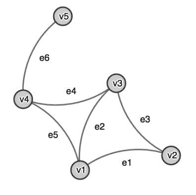

图 1：一个由五个顶点和六条边组成的简单无向图

请注意，在*图 1*中实现的图形的实现中，节点相对位置、边的长度和其他视觉属性对于图形是不重要的。实际上，我们可以通过变形以任何其他方式显示图形。图形的定义完全决定了它的*拓扑*。

# 有向图和无向图

在构成边*e*的一对顶点中，按照惯例，我们称第一个顶点为*源*，第二个顶点为*目标*。这里的自然解释是，边*e*所代表的连接具有*方向*；它从源流向目标。请注意，在*图 1*中，显示的图形是无向的；也就是说，我们没有区分源和目标。

使用完全相同的定义，我们可以创建我们图的有向版本，如下图所示。请注意，图在呈现方式上略有不同，但顶点和边的连接保持不变：

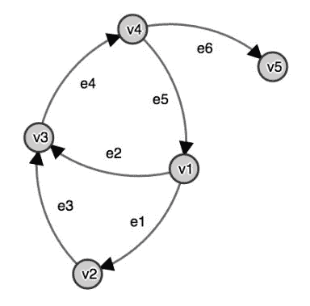

图 2：具有与前一个相同拓扑结构的有向图。事实上，忘记边的方向将产生与图 1 中相同的图形

每个有向图自然地有一个相关的无向图，通过简单地忘记所有边的方向来实现。从实际角度来看，大多数图的实现本质上都建立在有向边上，并在需要时抑制方向的附加信息。举个例子，将前面的图看作是由关系“友谊”连接的五个人组成的。我们可以认为友谊是一种对称属性，如果你是我的朋友，我也是你的朋友。根据这种解释，方向性在这个例子中并不是一个非常有用的概念，因此我们实际上最好将其视为一个无向图的例子。相比之下，如果我们要运行一个允许用户主动向其他用户发送好友请求的社交网络，有向图可能更适合编码这些信息。

# 顺序和度

对于任何图，无论是有向的还是不是，我们都可以得出一些基本的性质，这些性质在本章后面会讨论。我们称顶点的数量|V|为图的*顺序*，边的数量|E|为它的*度*，有时也称为*价度*。顶点的度是具有该顶点作为源或目标的边的数量。对于有向图和给定的顶点*v*，我们还可以区分*入度*，即指向*v*的所有边的总和，和*出度*，即从*v*开始的所有边的总和。举个例子，图 1 中的无向图的顺序为 5，度为 6，与图 2 中显示的有向图相同。在后者中，顶点 v1 的出度为 2，入度为 1，而 v5 的出度为 0，入度为 1。

在最后两个例子中，我们用它们各自的标识符注释了顶点和边，如定义*G = (V, E)*所指定的那样。对于接下来的大多数图形可视化，我们将假设顶点和边的标识是隐含已知的，并将通过为我们的图形加上额外信息来代替它们。我们明确区分标识符和标签的原因是 GraphX 标识符不能是字符串，我们将在下一节中看到。下图显示了一个带有一组人的关系的标记图的示例：

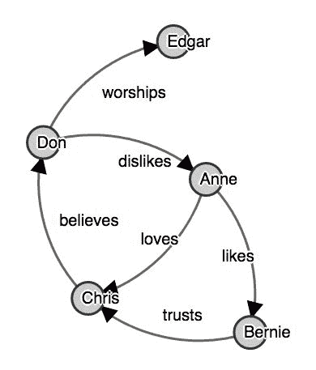

图 3：显示了一组人及其关系的有向标记图

# 有向无环图

我们接下来要讨论的概念是无环性。*循环图*是指至少有一个顶点，通过图中的路径连接到自身。我们称这样的路径为*循环*。在无向图中，任何形成循环的链都可以，而在有向图中，只有当我们可以通过遵循有向边到达起始顶点时，我们才谈论循环。例如，考虑我们之前看到的一些图。在图 2 中，由{e2, e4, e5}形成了一个循环，而在其无向版本中，即图 1 中，有两个循环，分别是{e2, e4, e5}和{e1, e2, e3}。

有几种值得在这里提到的循环图的特殊情况。首先，如果一个顶点通过一条边与自身相连，我们将说图中有一个*循环*。其次，一个不包含任何两个顶点之间双向边的有向图被称为*定向图*。第三，包含*三角形*的图被认为包含三角形。三角形的概念是重要的，因为它经常用于评估图的连通性，我们将在后面讨论。以下图显示了一个具有不同类型循环的人工示例：

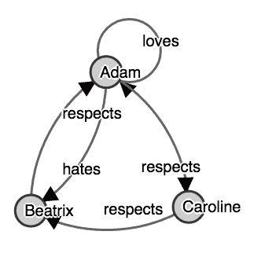

图 4：一个玩具图，说明了循环或自环、双向边和三角形。

一般来说，研究图中任意自然数*n*的循环可以告诉你很多关于图的信息，但三角形是最常见的。由于有向循环不仅计算成本更高，而且比它们的无向版本更少见，我们通常只会在图中寻找无向三角形；也就是说，我们会忽略它的有向结构。

在许多应用程序中反复出现的一类重要图是**有向无环图**（DAGs）。我们已经从上一段知道了 DAG 是什么，即一个没有循环的有向图，但由于 DAG 是如此普遍，我们应该花更多的时间来了解它们。

我们在前面的所有章节中隐式使用的一个 DAG 实例是 Spark 的作业执行图。请记住，任何 Spark 作业都由按特定顺序执行的阶段组成。阶段由在每个分区上执行的任务组成，其中一些可能是独立的，而其他则彼此依赖。因此，我们可以将 Spark 作业的执行解释为由阶段（或任务）组成的有向图，其中边表示一个计算的输出被下一个计算所需。典型的例子可能是需要前一个映射阶段的输出的减少阶段。自然地，这个执行图不包含任何循环，因为这意味着我们要将一些运算符的输出无限地输入到图中，从而阻止我们的程序最终停止。因此，这个执行图可以被表示，并实际上在 Spark 调度器中实现为 DAG：

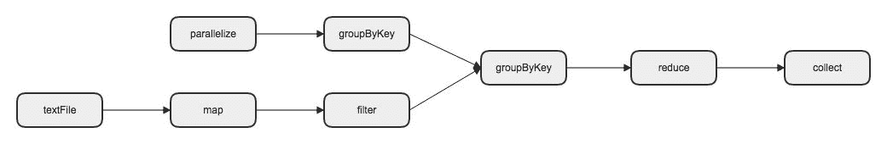

图 5：用 Spark 在 RDD 上执行的一系列操作的可视化。执行图从定义上是一个 DAG。

# 连通分量

图的另一个重要属性是*连通性*。如果我们选择的任意两个顶点之间存在一条边的路径，无论边的方向如何，我们就说图是*连通的*。因此，对于有向图，我们在这个定义中完全忽略方向。对于有向图，可以使用更严格的连通性定义吗？如果任意两个顶点都可以通过有向边连接，我们就说图是*强连通的*。请注意，强连通性是对有向图施加的一个非常严格的假设。特别地，任何强连通图都是循环的。这些定义使我们能够定义（强）连通分量的相关概念。每个图都可以分解为连通分量。如果它是连通的，那么恰好有一个这样的分量。如果不是，那么至少有两个。正式定义，连通分量是给定图的最大子图，仍然是连通的。强连通分量也是同样的道理。连通性是一个重要的度量，因为它使我们能够将图的顶点聚类成自然属于一起的组。

例如，一个人可能对社交图中表示友谊的连接组件数量感兴趣。在一个小图中，可能有许多独立的组件。然而，随着图的规模变大，人们可能会怀疑它更有可能只有一个连接的组件，遵循着普遍接受的理由，即每个人都通过大约六个连接与其他人相连。

我们将在下一节中看到如何使用 GraphX 计算连接组件；现在，让我们只检查一个简单的例子。在下面的图表中，我们看到一个有十二个顶点的有向图：

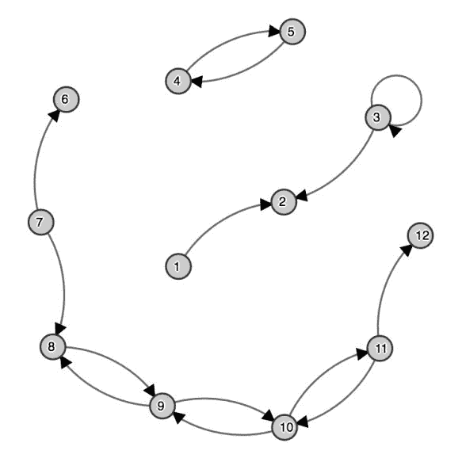

图 6：在小图中，连接和强连接组件可以很容易地读取，但对于更大的图来说，这变得越来越困难。

我们可以立即看到它有三个连接的组件，即三组顶点*{1, 2, 3}, {4, 5}*, 和 *{6, 7, 8, 9, 10, 11, 12}*。至于强连接组件，这需要比快速的视觉检查更多的努力。我们可以看到*{4, 5}*形成了一个强连接组件，*{8, 9, 10, 11}*也是如此。其他六个顶点形成了自己的强连接组件，也就是说，它们是孤立的。这个例子继续说明，对于一个有数百万个顶点的大图，通过正确的可视化工具，我们可能会幸运地找到大致连接的组件，但强连接组件的计算会更加复杂，这正是 Spark GraphX 派上用场的一个用例。

# 树

有了我们手头的连接组件的定义，我们可以转向另一类有趣的图，即树。*树*是一个连接的图，在其中恰好有一条路径连接任何给定的顶点到另一个顶点。由一组树的不相交组成的图称为森林。在下面的图表中，我们看到了一个在众所周知的鸢尾花数据集上运行的示意*决策树*。请注意，这仅用于说明目的，即展示此算法的输出如何被视为一个图：

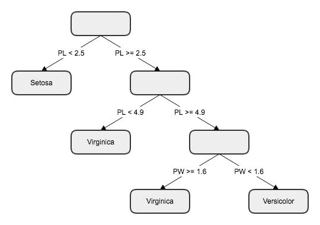

图 7：在鸢尾花数据集上运行的简单决策树，通过两个特征，即花瓣长度（PL）和花瓣宽度（PW），将其分类为三个类别 Setosa，Virginica 和 Versicolor

# 多重图

一般来说，没有环或多重边的图被称为*简单*。在本章的应用中，我们将遇到的大多数图都不具备这个属性。通常，从现实世界数据构建的图会在顶点之间有多重边。在文献中，具有多重边的图被称为多重图或伪图。在整个章节中，我们将坚持多重图的概念，并遵循这样一个约定，即这样的多重图也可以包括环。由于 Spark 支持多重图（包括环），这个概念在应用中将非常有用。在下面的图表中，我们看到了一个复杂的多重图，其中有多个连接的组件：

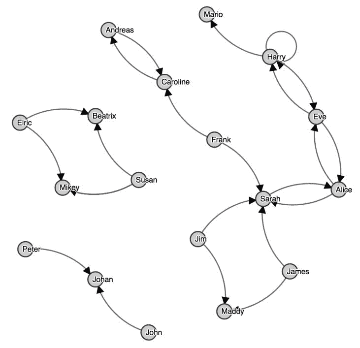

图 8：一个稍微复杂的社交多重图，带有环和多重边。

# 属性图

在我们继续介绍 GraphX 作为图处理引擎之前，让我们看一下我们之前所见过的图的扩展。我们已经考虑过标记的图作为一种方便的方式来命名顶点和边。一般来说，在应用中我们将考虑的图数据将附加更多信息到顶点和边上，我们需要一种方法在我们的图中对这些额外的信息进行建模。为此，我们可以利用*属性图*的概念。

从图的基本定义作为顶点和边的一对开始，直接向这两个结构附加额外信息是不可能的。历史上，规避这一点的一种方法是扩展图并创建更多与属性对应的顶点，通过新的边与原始顶点连接，这些边编码与新顶点的关系。例如，在我们之前的朋友图示例中，如果我们还想在图中编码家庭地址，表示一个人的每个顶点必须与表示他们地址的顶点连接，它们之间的边是*lives at*。不难想象，这种方法会产生很多复杂性，特别是如果顶点属性相互关联。通过主语-谓语-宾语*三元组*在图中表示属性已经在所谓的**资源描述框架**（**RDF**）中得到了形式化，并且其结果被称为 RDF 模型。RDF 是一个独立的主题，并且比我们所介绍的更灵活。无论如何，熟悉这个概念并了解其局限性是很好的。

相比之下，在*属性图*中，我们可以为顶点和边增加基本上任意的附加结构。与任何事物一样，获得这种一般性的灵活性通常是一种权衡。在我们的情况下，许多图数据库中实现的基本图允许对查询进行强大的优化，而在属性图中，当涉及性能时，我们应该小心。在下一节中，当我们展示 Spark GraphX 如何实现属性图时，我们将更详细地讨论这个话题。

在本章的其余部分，我们将使用以下约定来表示属性图。附加到顶点的额外数据称为*顶点数据*，附加到边的数据称为*边数据*。为了举例更复杂的顶点和边数据，请参见以下图表，扩展了我们扩展朋友图的想法。这个例子也展示了我们所说的*三元组*，即带有其相邻顶点及其所有属性的边：

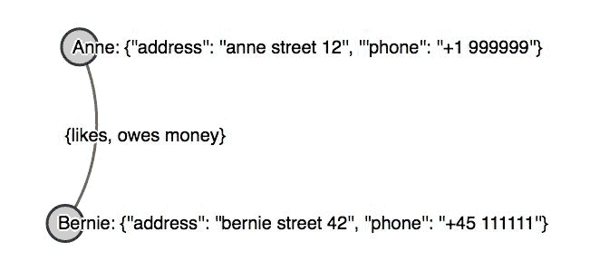

图 9：显示通过地址数据增强的朋友属性图，通过多个关系连接。属性数据以 JSON 格式编码。

请注意，在前面的例子中，我们故意保持简单，但在更现实的情况下，我们需要嵌套数据结构--例如，回答欠款金额和到期时间。

在我们的上下文中，属性图的一个有趣的特殊情况是*加权图*，其中边、顶点或两者都具有权重，例如，附加到它们的整数或浮点数。这种情况的一个典型例子是一个由一组城市作为顶点组成的图，连接它们的边携带着位置之间的距离。在这种情况下会出现一些经典问题。一个例子是找到两个给定城市之间的最短路径。相关问题是*旅行推销员问题*，其中一个假设的推销员被要求使用可能的最短路线访问每个城市。

作为本节的结束语，重要的是要知道，在文献中，有一个广泛使用的与顶点同义的概念，即节点。我们在这里不使用这个术语，因为在 Spark 的上下文中，它很容易与执行任务的计算节点混淆。相反，我们将在整个章节中坚持使用顶点。此外，每当我们谈论图时，我们通常假设它是一个*有限*的*图*，也就是说，顶点和边的数量是有限的，在实践中，这几乎不算是限制。

# GraphX 分布式图处理引擎

除了 Spark MLlib 用于机器学习，我们在本书中已经遇到了几次，以及其他组件，如我们将在第八章“Lending Club Loan Prediction”中介绍的 Spark Streaming，Spark GraphX 是 Spark 生态系统的核心组件之一。GraphX 通过构建在 RDD 之上，专门用于以高效的方式处理大型图形。

使用上一节开发的命名法，GraphX 中的图形是一个带有环的有限多重图，其中*图形*实际上是指之前讨论的属性图扩展。接下来，我们将看到 GraphX 中图形是如何在内部构建的。

对于使用的示例，我们建议在本地启动`spark-shell`，这将自动为 GraphX 提供依赖项。要测试这在您的设置中是否正常工作，请尝试使用 Scala 的通配符运算符导入完整的 GraphX 核心模块，如下所示：

```scala
import org.apache.spark.graphx._
```

在您的屏幕上，您应该看到以下提示：

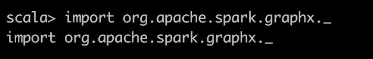

如果您更愿意通过使用 sbt 构建一个包来跟随示例，您应该在您的`build.sbt`中包含以下`libraryDependencies`：

```scala
"org.apache.spark" %% "spark-graphx" % "2.1.1"
```

这样做应该允许你导入 GraphX，就像之前展示的那样，创建一个你可以用 spark-submit 调用的应用程序。

# GraphX 中的图形表示

回想一下，对于我们来说，属性图是一个具有自定义数据对象的有向多重图。GraphX 的中心入口点是`Graph` API，具有以下签名：

```scala
class Graph[VD, ED] {
  val vertices: VertexRDD[VD]
  val edges: EdgeRDD[ED]
}
```

因此，在 GraphX 中，图形内部由一个编码顶点的 RDD 和一个编码边的 RDD 表示。在这里，`VD`是顶点数据类型，`ED`是我们属性图的边数据类型。我们将更详细地讨论`VertexRDD`和`EdgeRDD`，因为它们对接下来的内容非常重要。

在 Spark GraphX 中，顶点具有`Long`类型的唯一标识符，称为`VertexId`。`VertexRDD[VD]`实际上只是`RDD[(VertexId, VD)]`的扩展，但经过优化并具有大量的实用功能列表，我们将详细讨论。因此，简而言之，GraphX 中的顶点是带有标识符和顶点数据的 RDD，这与之前发展的直觉相一致。

为了解释`EdgeRDD`的概念，让我们快速解释一下 GraphX 中的`Edge`是什么。简化形式上，`Edge`由以下签名定义：

```scala
case class Edge[ED] (
  var srcId: VertexId,
  var dstId: VertexId,
  var attr: ED
)
```

因此，边完全由源顶点 ID（称为`srcId`）、目标或目的地顶点 ID（称为`dstId`）和`ED`数据类型的属性对象`attr`确定。与前面的顶点 RDD 类似，我们可以将`EdgeRDD[ED]`理解为`RDD[Edge[ED]]`的扩展。因此，GraphX 中的边由`ED`类型的边的 RDD 给出，这与我们迄今讨论的内容一致。

我们现在知道，从 Spark 2.1 开始，GraphX 中的图形本质上是顶点和边 RDD 的对。这是重要的信息，因为它原则上允许我们将 Spark 核心的 RDD 的全部功能和能力应用到这些图形中。然而，需要警告的是，图形带有许多针对图形处理目的进行优化的功能。每当你发现自己在使用基本的 RDD 功能时，看看是否可以找到特定的图形等效功能，这可能会更高效。

举个具体的例子，让我们使用刚刚学到的知识从头开始构建一个图。我们假设您有一个名为`sc`的 Spark 上下文可用。我们将创建一个人与彼此连接的图，即上一节中*图 3*中的图，即一个带标签的图。在我们刚刚学到的 GraphX 语言中，要创建这样一个图，我们需要顶点和边数据类型都是`String`类型。我们通过使用`parallelize`来创建顶点，如下所示：

```scala
import org.apache.spark.rdd.RDD
val vertices: RDD[(VertexId, String)] = sc.parallelize(
  Array((1L, "Anne"),
    (2L, "Bernie"),
    (3L, "Chris"),
    (4L, "Don"),
    (5L, "Edgar")))
```

同样，我们可以创建边；请注意以下定义中`Edge`的使用：

```scala
val edges: RDD[Edge[String]] = sc.parallelize(
  Array(Edge(1L, 2L, "likes"),
    Edge(2L, 3L, "trusts"),
    Edge(3L, 4L, "believes"),
    Edge(4L, 5L, "worships"),
    Edge(1L, 3L, "loves"),
    Edge(4L, 1L, "dislikes")))
```

拥有这两个准备好的 RDD 已经足以创建`Graph`，就像以下一行一样简单：

```scala
val friendGraph: Graph[String, String] = Graph(vertices, edges)
```

请注意，我们明确地为所有变量写出类型，这只是为了清晰。我们可以把它们留空，依赖 Scala 编译器为我们推断类型。此外，如前面的签名所示，我们可以通过`friendGraph.vertices`访问顶点，通过`friendGraph.edges`访问边。为了初步了解可能的操作，我们现在可以收集所有顶点并打印它们如下：

```scala
friendGraph.vertices.collect.foreach(println)
```

以下是输出：

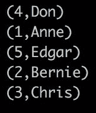

请注意，这不使用任何 GraphX 特定的功能，只是使用我们已经从 RDD 中知道的知识。举个例子，让我们计算所有源 ID 大于目标 ID 的边的数量。可以这样做：

```scala
friendGraph.edges.map( e => e.srcId > e.dstId ).filter(_ == true).count
```

这给出了预期的答案，即`1`，但有一个缺点。一旦我们在图上调用`.edges`，我们就完全失去了之前拥有的所有图结构。假设我们想要进一步处理具有转换边的图，这不是正确的方法。在这种情况下，最好使用内置的`Graph`功能，比如以下的`mapEdges`方法：

```scala
val mappedEdgeGraph: Graph[String, Boolean] = 
  friendGraph.mapEdges( e => e.srcId > e.dstId )
```

请注意，这种情况下的返回值仍然是一个图，但是边的数据类型现在是`Boolean`，正如预期的那样。我们将在接下来看到更多关于图处理可能性的例子。看完这个例子后，让我们退一步，讨论为什么 Spark GraphX 实现图的方式。一个原因是我们可以有效地利用*数据并行性*和*图并行性*。在前几章中，我们已经了解到 Spark 中的 RDD 和数据框利用数据并行性，通过在每个节点上将数据分布到分区中并将数据保存在内存中。因此，如果我们只关心顶点或边本身，而不想研究它们的关系，那么使用顶点和边 RDD 将非常高效。

相比之下，通过图并行性，我们指的是相对于图的概念进行并行操作。例如，图并行任务将是对每个顶点的所有入边的权重进行求和。要执行此任务，我们需要处理顶点和边数据，这涉及多个 RDD。要高效地执行此操作，需要合适的内部表示。GraphX 试图在这两种范式之间取得平衡，而其他一些替代程序则没有提供这种平衡。

# 图属性和操作

看完另一个人工例子后，让我们转而看一个更有趣的例子，用它来研究我们在上一节中学习的一些核心属性。本章中我们将考虑的数据可以在[`networkrepository.com/`](http://networkrepository.com/)找到，这是一个拥有大量有趣数据的开放网络数据存储库。首先，我们将加载从 Twitter 获取的一个相对较小的数据集，可以从[`networkrepository.com/rt-occupywallstnyc.php`](http://networkrepository.com/rt-occupywallstnyc.php)下载。下载此页面上提供的 zip 文件，即存储 rt_occupywallstnyc.zip 并解压以访问文件 rt_occupywallstnyc.edges。该文件以逗号分隔的 CSV 格式。每一行代表了有关纽约市占领华尔街运动的推文的转发。前两列显示了 Twitter 用户 ID，第三列表示转发的 ID；也就是说，第二列中的用户转发了第一列中相应用户的推文。

前十个项目如下所示：

```scala
3212,221,1347929725
3212,3301,1347923714
3212,1801,1347714310
3212,1491,1347924000
3212,1483,1347923691
3212,1872,1347939690
1486,1783,1346181381
2382,3350,1346675417
2382,1783,1342925318
2159,349,1347911999
```

例如，我们可以看到用户 3,212 的推文至少被转发了六次，但由于我们不知道文件是否以任何方式排序，并且其中包含大约 3.6k 个顶点，我们应该利用 GraphX 来为我们回答这样的问题。

要构建一个图，我们将首先从该文件创建一个边的 RDD，即`RDD[Edge[Long]]`，使用基本的 Spark 功能：

```scala
val edges: RDD[Edge[Long]] =
  sc.textFile("./rt_occupywallstnyc.edges").map { line =>
    val fields = line.split(",")
    Edge(fields(0).toLong, fields(1).toLong, fields(2).toLong)
  }
```

请记住，GraphX 中的 ID 是`Long`类型，这就是为什么在加载文本文件并通过逗号拆分每一行后，我们将所有值转换为`Long`的原因；也就是说，在这种情况下，我们的边数据类型是`Long`。在这里，我们假设所讨论的文件位于我们启动`spark-shell`的同一文件夹中；如果需要，可以根据自己的需求进行调整。有了这样的边 RDD，我们现在可以使用`Graph`伴生对象的`fromEdges`方法，如下所示：

```scala
val rtGraph: Graph[String, Long] = Graph.fromEdges(edges, defaultValue =  "")
```

也许不足为奇的是，我们需要为这个方法提供`edges`，但`defaultValue`关键字值得一些解释。请注意，到目前为止，我们只知道边，虽然顶点 ID 隐式地作为边的源和目标可用，但我们仍然没有确定任何 GraphX 图所需的顶点数据类型`VD`。`defaultValue`允许您创建一个默认的顶点数据值，带有一个类型。在我们的情况下，我们选择了一个空字符串，这解释了`rtGraph`的签名。

加载了这个第一个真实世界的数据图后，让我们检查一些基本属性。使用之前的符号，图的*顺序*和*度*可以计算如下：

```scala
val order = rtGraph.numVertices
val degree = rtGraph.numEdges
```

前面的代码将分别产生 3,609 和 3,936。至于各个顶点的度，GraphX 提供了 Graphs 上的`degrees`方法，返回整数顶点数据类型的图，用于存储度数。让我们计算一下我们的转发图的平均度：

```scala
val avgDegree = rtGraph.degrees.map(_._2).reduce(_ + _) / order.toDouble
```

这个操作的结果应该大约是`2.18`，这意味着每个顶点平均连接了大约两条边。这个简洁操作中使用的符号可能看起来有点密集，主要是因为使用了许多通配符，所以让我们来详细解释一下。为了解释这一点，我们首先调用 degrees，如前所述。然后，我们通过映射到对中的第二个项目来提取度数；也就是说，我们忘记了顶点 ID。这给我们留下了一个整数值的 RDD，我们可以通过加法减少来总结。最后一步是将`order.toDouble`转换为确保我们得到浮点除法，然后除以这个总数。下一个代码清单显示了相同的四个步骤以更详细的方式展开：

```scala
val vertexDegrees: VertexRDD[Int] = rtGraph.degrees
val degrees: RDD[Int] = vertexDegrees.map(v => v._2)
val sumDegrees: Int = degrees.reduce((v1, v2) => v1 + v2 )
val avgDegreeAlt = sumDegrees / order.toDouble
```

接下来，我们通过简单地调用`inDegrees`和`outDegrees`来计算这个有向图的入度和出度。为了使事情更有趣，让我们计算图中所有顶点的最大入度，以及最小出度，并返回其 ID。我们首先解决最大入度：

```scala
val maxInDegree: (Long, Int) = rtGraph.inDegrees.reduce(
  (v1,v2) => if (v1._2 > v2._2) v1 else v2
)
```

进行这个计算，你会看到 ID 为`1783`的顶点的入度为 401，这意味着具有这个 ID 的用户转发了 401 条不同的推文。因此，一个有趣的后续问题是，“这个用户转发了多少不同用户的推文？”同样，我们可以通过计算所有边中这个目标的不同来源来非常快速地回答这个问题：

```scala
rtGraph.edges.filter(e => e.dstId == 1783).map(_.srcId).distinct()
```

执行这个命令应该会提示 34，所以平均而言，用户`1783`从任何给定的用户那里转发了大约 12 条推文。这反过来意味着我们找到了一个有意义的多图的例子--在这个图中有许多不同连接的顶点对。现在回答最小出度的问题就很简单了：

```scala
val minOutDegree: (Long, Int) = rtGraph.outDegrees.reduce(
  (v1,v2) => if (v1._2 < v2._2) v1 else v2
)
```

在这种情况下，答案是`1`，这意味着在这个数据集中，每条推文至少被转发了一次。

请记住，属性图的*三元组*由边及其数据以及连接顶点及其各自的数据组成。在 Spark GraphX 中，这个概念是在一个叫做`EdgeTriplet`的类中实现的，我们可以通过`attr`检索边数据，通过`srcAttr`、`dstAttr`、`srcId`和`dstId`自然地检索顶点数据和 ID。为了获得我们的转发图的三元组，我们可以简单地调用以下内容：

```scala
val triplets: RDD[EdgeTriplet[String, Long]] = rtGraph.triplets
```

三元组通常很实用，因为我们可以直接检索相应的边和顶点数据，否则这些数据将分别存在于图中的不同 RDD 中。例如，我们可以通过执行以下操作，快速将生成的三元组转换为每次转发的可读数据：

```scala
val tweetStrings = triplets.map(
  t => t.dstId + " retweeted " + t.attr + " from " + t.srcId
)
tweetStrings.take(5)
```

前面的代码产生了以下输出：

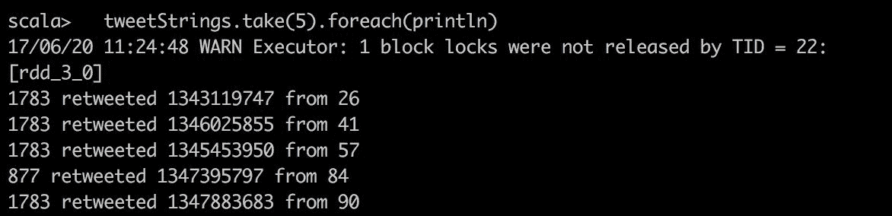

当我们之前讨论`friendGraph`示例时，我们注意到`mapEdges`在某些方面优于先调用`edges`然后再`map`它们。对于顶点和三元组也是如此。假设我们想要将图的顶点数据简单地更改为顶点 ID 而不是先前选择的默认值。这可以通过以下方式最快、最有效地实现：

```scala
val vertexIdData: Graph[Long, Long] = rtGraph.mapVertices( (id, _) => id)
```

同样地，我们可以直接从我们的初始图开始，而不是首先检索三元组，然后使用`mapTriplets`直接转换三元组，返回一个具有修改后的边数据的图形对象。为了实现与前面的`tweetStrings`相同的效果，但保持图形结构不变，我们可以运行以下操作：

```scala
val mappedTripletsGraph = rtGraph.mapTriplets(
  t => t.dstId + " retweeted " + t.attr + " from " + t.srcId
)
```

作为基本图处理功能的最后一个示例，我们现在将看一下给定图的子图以及如何将图形彼此连接。考虑提取我们的图中至少被转发 10 次的所有 Twitter 用户的信息的任务。我们已经看到如何从`rtGraph.outDegrees`中获取出度。为了使这些信息在我们的原始图中可访问，我们需要将这些信息连接到原始图中。为此，GraphX 提供了`outerJoinVertices`的功能。为了这样做，我们需要提供一个顶点数据类型`U`的`VertexRDD`，以及一个确定如何聚合顶点数据的函数。如果我们称要加入的 RDD 为`other`，那么在纸上看起来如下：

```scala
def outerJoinVerticesU, VD2])
  (mapFunc: (VertexId, VD, Option[U]) => VD2): Graph[VD2, ED]
```

请注意，由于我们进行了外连接，原始图中的所有 ID 可能在`other`中没有相应的值，这就是为什么我们在相应的映射函数中看到`Option`类型的原因。对于我们手头的具体例子，这样做的工作方式如下：

```scala
val outDegreeGraph: Graph[Long, Long] =
  rtGraph.outerJoinVerticesInt, Long(
    mapFunc = (id, origData, outDeg) => outDeg.getOrElse(0).toLong
  )
```

我们将我们的原始图与出度`VertexRDD`连接，并将映射函数简单地丢弃原始顶点数据并替换为出度。如果没有出度可用，我们可以使用`getOrElse`将其设置为`0`来解决`Option`。

接下来，我们想要检索该图的子图，其中每个顶点至少有 10 次转发。图的子图由原始顶点和边的子集组成。形式上，我们定义子图为对边、顶点或两者的*谓词*的结果。我们指的是在顶点或边上评估的表达式，返回 true 或 false。图上子图方法的签名定义如下：

```scala
def subgraph(
  epred: EdgeTriplet[VD,ED] => Boolean = (x => true),
  vpred: (VertexId, VD) => Boolean = ((v, d) => true)): Graph[VD, ED]
```

请注意，由于提供了默认函数，我们可以选择只提供`vpred`或`epred`中的一个。在我们具体的例子中，我们想要限制至少有`10`度的顶点，可以按照以下方式进行：

```scala
val tenOrMoreRetweets = outDegreeGraph.subgraph(
  vpred = (id, deg) => deg >= 10
)
tenOrMoreRetweets.vertices.count
tenOrMoreRetweets.edges.count
```

生成的图仅有`10`个顶点和`5`条边，但有趣的是这些有影响力的人似乎彼此之间的连接大致与平均水平相当。

为了结束这一部分，一个有趣的技术是*掩码*。假设我们现在想知道具有少于 10 次转发的顶点的子图，这与前面的`tenOrMoreRetweets`相反。当然，这可以通过子图定义来实现，但我们也可以通过以下方式掩盖原始图形`tenOrMoreRetweets`。

```scala
val lessThanTenRetweets = rtGraph.mask(tenOrMoreRetweets)
```

如果我们愿意，我们可以通过将`tenOrMoreRetweets`与`lessThanTenRetweets`连接来重建`rtGraph`。

# 构建和加载图

在上一节中，我们在图分析方面取得了很大进展，并讨论了一个有趣的转发图。在我们深入研究更复杂的操作之前，让我们退一步考虑使用 GraphX 构建图的其他选项。完成了这个插曲后，我们将快速查看可视化工具，然后转向更复杂的应用。

实际上，我们已经看到了创建 GraphX 图的两种方法，一种是显式地构建顶点和边 RDD，然后从中构建图；另一种是使用`Graph.fromEdges`。另一个非常方便的可能性是加载所谓的*边列表文件*。这种格式的一个例子如下：

```scala
1 3
5 3
4 2
3 2
1 5
```

因此，边列表文件是一个文本文件，每行有一对 ID，用空格分隔。假设我们将前面的数据存储为`edge_list.txt`在当前工作目录中，我们可以使用`GraphLoader`接口从中一行加载一个图对象：

```scala
import org.apache.spark.graphx.GraphLoader
val edgeListGraph = GraphLoader.edgeListFile(sc, "./edge_list.txt")
```

这代表了一个非常方便的入口点，因为我们有以正确格式提供的数据。加载边列表文件后，还必须将其他顶点和边数据连接到生成的图中。从前面的数据构建图的另一种类似方法是使用`Graph`对象提供的`fromEdgeTuples`方法，可以像下面的代码片段中所示那样使用：

```scala
val rawEdges: RDD[(VertexId, VertexId)] = sc.textFile("./edge_list.txt").map { 
  line =>
    val field = line.split(" ")
    (field(0).toLong, field(1).toLong)
}
val edgeTupleGraph = Graph.fromEdgeTuples(
  rawEdges=rawEdges, defaultValue="")
```

与之前的构建不同之处在于，我们创建了一个原始边 RDD，其中包含顶点 ID 对，连同顶点数据的默认值，一起输入到图的构建中。

通过最后一个例子，我们基本上已经看到了 GraphX 目前支持的从给定数据加载图的每一种方式。然而，还有*生成*随机和确定性图的可能性，这对于测试、快速检查和演示非常有帮助。为此，我们导入以下类：

```scala
import org.apache.spark.graphx.util.GraphGenerators
```

这个类有很多功能可供使用。两种确定性图构建方法有助于构建*星形*和*网格*图。星形图由一个中心顶点和几个顶点组成，这些顶点只通过一条边连接到中心顶点。以下是如何创建一个有十个顶点连接到中心顶点的星形图：

```scala
val starGraph = GraphGenerators.starGraph(sc, 11)
```

以下图片是星形图的图形表示：

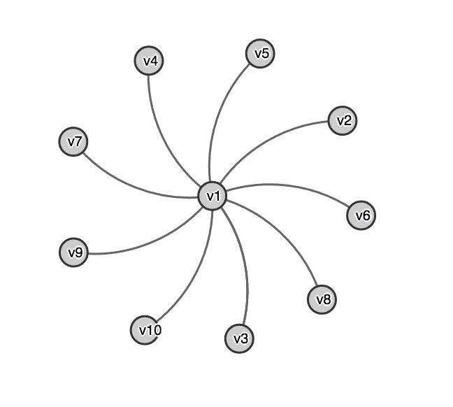

图 10：一个星形图，有十个顶点围绕着一个中心顶点。

图的另一种确定性构建方法是构建网格，意味着顶点被组织成一个矩阵，每个顶点都与其直接邻居在垂直和水平方向上连接。在一个有*n*行和*m*列的网格图中，有精确地*n(m-1) + m(n-1)*条边--第一项是所有垂直连接，第二项是所有水平网格连接。以下是如何在 GraphX 中构建一个有 40 条边的`5`乘`5`网格：

```scala
val gridGraph = GraphGenerators.gridGraph(sc, 5, 5)
```

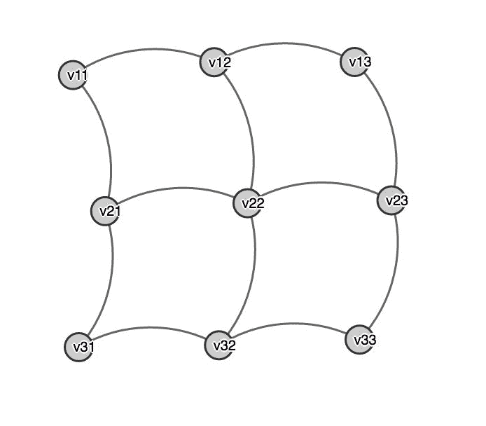

图 11：一个由 12 个顶点组成的 3x3 的二次网格图。

就随机图而言，我们将介绍一种创建方法，它在结构上大致反映了许多现实世界的图，即*对数正态图*。现实生活中许多结构都遵循*幂律*，其中一个实体的度量由另一个的幂给出。一个具体的例子是帕累托原则，通常称为 80/20 原则，它意味着 80%的财富由 20%的人拥有，也就是说，大部分财富归属于少数人。这个原则的一个变体，称为*齐夫定律*，适用于我们的情景，即少数顶点具有非常高的度，而大多数顶点连接很少。在社交图的背景下，很少有人倾向于拥有很多粉丝，而大多数人拥有很少的粉丝。这导致了顶点度数的分布遵循*对数正态分布*。*图 10*中的星形图是这种行为的一个极端变体，其中所有的边都集中在一个顶点周围。

在 GraphX 中创建一个具有 20 个顶点的对数正态图很简单，如下所示：

```scala
val logNormalGraph  = GraphGenerators.logNormalGraph(
  sc, numVertices = 20, mu=1, sigma = 3
)
```

在上述代码片段中，我们还对每个顶点施加了一个平均出度和三个标准差。让我们看看是否可以确认顶点出度的对数正态分布：

```scala
logNormalGraph.outDegrees.map(_._2).collect().sorted
```

这将产生一个 Scala 数组，应该如下所示。

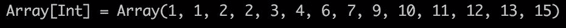

请注意，由于图是随机生成的，您可能会得到不同的结果。接下来，让我们看看如何可视化我们迄今为止构建的一些图。

# 使用 Gephi 可视化图形

GraphX 没有内置的图形可视化工具，因此为了处理可视化大规模图形，我们必须考虑其他选项。有许多通用的可视化库，以及一些专门的图形可视化工具。在本章中，我们选择*Gephi*基本上有两个原因：

+   这是一个免费的开源工具，适用于所有主要平台

+   我们可以利用一个简单的交换格式 GEXF 来保存 GraphX 图，并可以将它们加载到 Gephi GUI 中，以指定可视化。

虽然第一个观点应该被普遍认为是一个优点，但并不是每个人都喜欢 GUI，对于大多数开发人员来说，以编程方式定义可视化更符合精神。请注意，事实上，使用 Gephi 也是可能的，但稍后再详细讨论。我们选择上述方法的原因是为了使本书内容自包含，而关于 Spark 的编码部分仅使用 Gephi 提供的强大可视化。

# Gephi

要开始，请从[`gephi.org/`](https://gephi.org/)下载 Gephi 并在本地安装在您的机器上。在撰写本书时，稳定版本是 0.9.1，我们将在整个过程中使用。打开 Gephi 应用程序时，您将收到欢迎消息，并可以选择一些示例来探索。我们将使用`Les Miserables.gexf`来熟悉工具。我们将在稍后更详细地讨论 GEXF 文件格式；现在，让我们专注于应用程序。这个例子的基础图数据包括代表作品《悲惨世界》中的角色的顶点，以及表示角色关联的边，*加权*表示连接的重要性评估。

Gephi 是一个非常丰富的工具，我们只能在这里讨论一些基础知识。一旦您打开前面的文件，您应该已经看到示例图的预览。Gephi 有三个主要视图：

+   **概述**：这是我们可以操纵图的所有视觉属性并获得预览的视图。对于我们的目的，这是最重要的视图，我们将更详细地讨论它。

+   **数据实验室**：此视图以表格格式显示原始图形数据，分为*节点*和*边*，也可以根据需要进行扩展和修改。

+   **预览**：预览视图用于查看结果，即图形可视化，它也可以导出为各种格式，如 SVG、PDF 和 PNG。

如果尚未激活，请选择概述以继续。在应用程序的主菜单中，可以选择各种选项卡。确保打开图形、预览设置、外观、布局和统计，如下图所示：

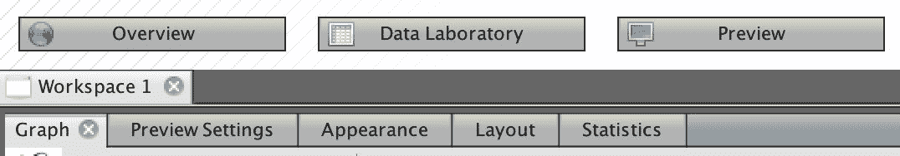

图 12：Gephi 的三个主要视图和概述视图中使用的基本选项卡

Graphtab 可以用于最后的润色和视觉检查，您应该已经看到了样本*悲惨世界*图的视觉表示。例如，窗口左侧的*矩形选择*允许您通过选择顶点来选择子图，而使用*拖动*，您可以根据自己的审美需求移动顶点。

在*预览设置*中，可能是我们最感兴趣的选项卡，我们可以配置图形的大部分视觉方面。*预设*允许您更改图形的一般样式，例如曲线与直线边。我们将保持*默认*设置不变。您可能已经注意到，图形预览没有顶点或边的标签，因此无法看到每个顶点代表什么。我们可以通过在*节点标签*类别中选择*显示标签*，然后取消选择*比例大小*复选框来更改这一点，以便所有标签具有相同的大小。如果现在转到*预览*视图，您看到的图形应该如下图所示：

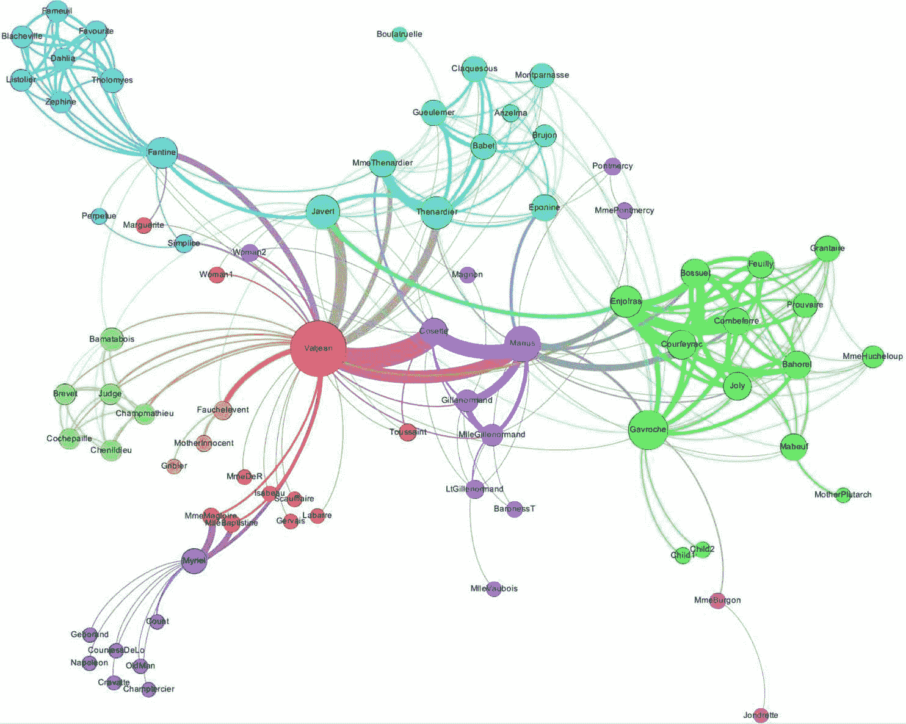

图 13：悲惨世界示例图，经过 Gephi 轻微修改。顶点是作品中的角色，边表示连接的重要性，通过边的粗细表示。顶点大小由度确定，顶点还根据颜色分组以表示家族成员资格，后者在打印中看不到。

请注意，前面的图形具有我们没有专门设置的视觉属性。顶点大小与顶点度成比例，边的粗细由权重决定，图形的颜色编码显示了个体角色所属的家族。为了了解这是如何完成的，我们接下来讨论*外观*选项卡，它还区分了*节点*和*边*。在该选项卡的右上角，有四个选项可供选择，我们选择*大小*，它用一个显示几个圆圈的图标表示。这样做后，我们可以首先在左上角选择*节点*，然后在其下方选择*排名*。在下拉菜单中，我们可以选择一个属性来确定节点的大小，前面的例子中是*度*。同样，前面讨论过的另外两个属性也可以配置。

继续，我们讨论的下一个选项卡是*布局*，在这里我们可以选择自动排列图形的方法。有趣的布局包括两种可用的*力引导*方案，它们模拟顶点相互吸引和排斥的属性。在*图 13*中，没有选择布局，但探索一下可能会很有趣。无论您选择哪种布局，都可以通过点击*运行*按钮来激活它们。

使用*统计*选项卡，我们可以在 Gephi 内探索图形属性，例如连通分量和 PageRank。由于我们将讨论如何在 GraphX 中执行此操作，而且 GraphX 的性能也更高，因此我们将就此结束，尽管鼓励您在此选项卡中尝试功能，因为它可以帮助快速建立直觉。

在我们根据需要配置属性后，我们现在可以切换到*预览*视图，看看生成的图形是否符合我们的预期。假设一切顺利，*预览设置*选项卡的 SVG/PDF/PNG 按钮可以用来导出我们的最终信息图，以供在您的产品中使用，无论是报告、进一步分析还是其他用途。

# 创建 GEXF 文件从 GraphX 图

要将 Gephi 的图形可视化能力与 Spark GraphX 图形连接起来，我们需要解决两者之间的通信方式。这样做的标准候选者是 Gephi 的**图形交换 XML 格式**（**GEXF**），其描述可以在[`gephi.org/gexf/format/`](https://gephi.org/gexf/format/)找到。在以下代码清单中显示了如何以这种格式描述图形的一个非常简单的示例：

```scala
<?xml version="1.0" encoding="UTF-8"?>
<gexf  version="1.2">
    <meta lastmodifieddate="2009-03-20">
        <creator>Gexf.net</creator>
        <description>A hello world! file</description>
    </meta>
    <graph mode="static" defaultedgetype="directed">
        <nodes>
            <node id="0" label="Hello" />
            <node id="1" label="Word" />
        </nodes>
        <edges>
            <edge id="0" source="0" target="1" />
        </edges>
    </graph>
</gexf>
```

除了 XML 的头部和元数据之外，图形编码本身是不言自明的。值得知道的是，前面的 XML 只是图形描述所需的最低限度，实际上，GEXF 还可以用于编码其他属性，例如边的权重或甚至 Gephi 自动捕捉的视觉属性。

为了连接 GraphX，让我们编写一个小的辅助函数，它接受一个`Graph`版本并返回前面 XML 格式的`String`版本：

```scala
def toGexfVD, ED: String = {
  val header =
    """<?xml version="1.0" encoding="UTF-8"?>
      |<gexf  version="1.2">
      |  <meta>
      |    <description>A gephi graph in GEXF format</description>
      |  </meta>
      |    <graph mode="static" defaultedgetype="directed">
    """.stripMargin

  val vertices = "<nodes>\n" + g.vertices.map(
    v => s"""<node id=\"${v._1}\" label=\"${v._2}\"/>\n"""
  ).collect.mkString + "</nodes>\n"

  val edges = "<edges>\n" + g.edges.map(
    e => s"""<edge source=\"${e.srcId}\" target=\"${e.dstId}\" label=\"${e.attr}\"/>\n"""
  ).collect.mkString + "</edges>\n"

  val footer = "</graph>\n</gexf>"

  header + vertices + edges + footer
}
```

虽然代码乍一看可能有点神秘，但实际上发生的事情很少。我们定义了 XML 的头部和尾部。我们需要将边和顶点属性映射到`<nodes>`和`<edges>` XML 标签。为此，我们使用 Scala 方便的`${}`符号直接将变量注入到字符串中。改变一下，让我们在一个完整的 Scala 应用程序中使用这个`toGexf`函数，该应用程序使用了我们之前的简单朋友图。请注意，为了使其工作，假设`toGexf`对`GephiApp`可用。因此，要么将其存储在相同的对象中，要么存储在另一个文件中以从那里导入。如果您想继续使用 spark-shell，只需粘贴导入和主方法的主体，不包括创建`conf`和`sc`，应该可以正常工作：

```scala
import java.io.PrintWriter
import org.apache.spark._
import org.apache.spark.graphx._
import org.apache.spark.rdd.RDD

object GephiApp {
  def main(args: Array[String]) {

    val conf = new SparkConf()
      .setAppName("Gephi Test Writer")
      .setMaster("local[4]")
    val sc = new SparkContext(conf)

    val vertices: RDD[(VertexId, String)] = sc.parallelize(
      Array((1L, "Anne"),
        (2L, "Bernie"),
        (3L, "Chris"),
        (4L, "Don"),
        (5L, "Edgar")))

    val edges: RDD[Edge[String]] = sc.parallelize(
      Array(Edge(1L, 2L, "likes"),
        Edge(2L, 3L, "trusts"),
        Edge(3L, 4L, "believes"),
        Edge(4L, 5L, "worships"),
        Edge(1L, 3L, "loves"),
        Edge(4L, 1L, "dislikes")))

    val graph: Graph[String, String] = Graph(vertices, edges)

    val pw = new PrintWriter("./graph.gexf")
    pw.write(toGexf(graph))
    pw.close()
  }
}
```

这个应用程序将我们的朋友图存储为`graph.gexf`，我们可以将其导入到 Gephi 中使用。要这样做，转到“文件”，然后点击“打开”以选择此文件并导入图形。通过使用之前描述的选项卡和方法调整视觉属性，以下图表显示了此过程的结果：

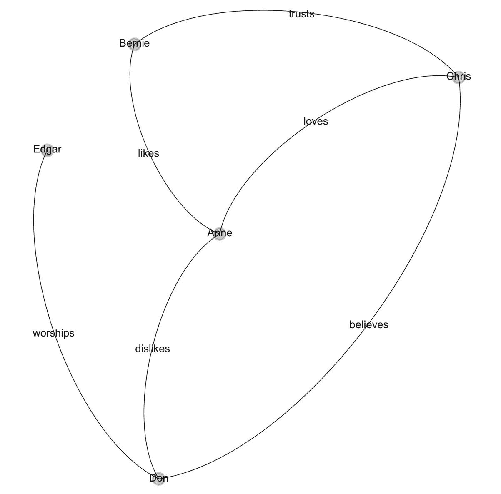

图 14：使用 Gephi 显示的我们的示例朋友图

正如前面所述，确实可以使用*Gephi Toolkit*以编程方式定义视觉属性，这是一个可以导入到项目中的 Java 库。还有其他语言包装器可用，但这是支持的库，可作为单个 JAR 文件使用。讨论工具包远远超出了本书的范围，但如果您感兴趣，可以参考[`gephi.org/toolkit/`](https://gephi.org/toolkit/)，这是一个很好的入门点。

# 高级图处理

在快速介绍了图生成和可视化之后，让我们转向更具挑战性的应用程序和更高级的图分析技术。总结一下，到目前为止，我们在图处理方面所做的只是使用 GraphX 图的基本属性，以及一些转换，包括`mapVertices`、`mapEdges`和`mapTriplets`。正如我们所见，这些技术已经非常有用，但单独使用还不足以实现图并行算法。为此，GraphX 图有两个强大的候选者，我们将在下一节讨论。包括三角形计数、PageRank 等大多数内置的 GraphX 算法都是使用其中一个或另一个实现的。

# 聚合消息

首先，我们讨论 GraphX 图带有的`aggregateMessages`方法。基本思想是在整个图中并行沿着边传递消息，合适地聚合这些消息并将结果存储以供进一步处理。让我们更仔细地看一下`aggregateMessages`是如何定义的：

```scala
def aggregateMessagesMsg: ClassTag => Msg,
  tripletFields: TripletFields = TripletFields.All
): VertexRDD[Msg]
```

如您所见，要实现`aggregateMessages`算法，我们需要指定消息类型`Msg`并提供三个函数，我们将在下面解释。您可能会注意到我们之前没有遇到的两种额外类型，即`EdgeContext`和`TripletFields`。简而言之，边上下文是我们已经看到的`EdgeTriplets`的扩展，即边加上所有关于相邻顶点的信息，唯一的区别是我们还可以额外发送信息到源顶点和目标顶点，定义如下：

```scala
def sendToSrc(msg: A): Unit
def sendToDst(msg: A): Unit
```

`TripletFields`允许限制计算中使用的`EdgeContext`字段，默认为所有可用字段。实际上，在接下来的内容中，我们将简单地使用`tripletFields`的默认值，并专注于`sendMsg`和`mergeMsg`。如本主题的介绍所示，`sendMsg`用于沿着边传递消息，`mergeMsg`对它们进行聚合，并将此操作的结果存储在`Msg`类型的顶点 RDD 中。为了使这更具体化，考虑以下示例，这是一种计算先前的小伙伴图中所有顶点的入度的替代方法：

```scala
val inDegVertexRdd: VertexRDD[Int] = friendGraph.aggregateMessagesInt,
  mergeMsg = (msg1, msg2) => msg1+msg2
)
assert(inDegVertexRdd.collect.deep == friendGraph.inDegrees.collect.deep)
```

在这个例子中，发送消息是通过使用其`sendToDst`方法从边上下文中定义的，向每个目标顶点发送一个整数消息，即数字 1。这意味着并行地，对于每条边，我们向该边指向的每个顶点发送一个 1。这样，顶点就会收到我们需要合并的消息。这里的`mergeMsg`应该被理解为 RDD 中`reduce`的方式，也就是说，我们指定了如何合并两个消息，并且这个方法被用来将所有消息合并成一个。在这个例子中，我们只是将所有消息求和，这根据定义得到了每个顶点的入度。我们通过断言在主节点上收集到的`inDegVertexRdd`和`friendGraph.inDegrees`的数组的相等性来确认这一点。

请注意，`aggregateMessages`的返回值是顶点 RDD，而不是图。因此，使用这种机制进行迭代，我们需要在每次迭代中生成一个新的图对象，这并不理想。由于 Spark 在迭代算法方面特别强大，因为它可以将分区数据保存在内存中，而且许多有趣的图算法实际上都是迭代的，接下来我们将讨论略微复杂但非常强大的 Pregel API。

# Pregel

Pregel 是 Google 内部开发的系统，其伴随论文非常易于访问，并可在[`www.dcs.bbk.ac.uk/~dell/teaching/cc/paper/sigmod10/p135-malewicz.pdf`](http://www.dcs.bbk.ac.uk/~dell/teaching/cc/paper/sigmod10/p135-malewicz.pdf)上下载。它代表了一种高效的迭代图并行计算模型，允许实现大量的图算法。GraphX 对 Pregel 的实现与前述论文略有不同，但我们无法详细讨论这一点。

在口味上，GraphX 的`Pregel`实现与`aggregateMessages`非常接近，但有一些关键的区别。两种方法共享的特征是发送和合并消息机制。除此之外，使用 Pregel，我们可以定义一个所谓的*顶点程序*`vprog`，在发送之前执行以转换顶点数据。此外，我们在每个顶点上都有一个共享的初始消息，并且可以指定要执行*vprog-send-merge*循环的迭代次数，也就是说，迭代是规范的一部分。

Pregel 实现的`apply`方法是草图。请注意，它接受两组输入，即由图本身、初始消息、要执行的最大迭代次数和名为`activeDirection`的字段组成的四元组。最后一个参数值得更多关注。我们还没有讨论的 Pregel 规范的一个细节是，*我们只从在上一次迭代中收到消息的顶点发送新消息*。活动方向默认为`Either`，但也可以是`In`或`Out`。这种行为自然地让算法在许多情况下收敛，并且也解释了为什么第三个参数被称为`maxIterations` - 我们可能会比指定的迭代次数提前停止：

```scala
object Pregel {
  def apply[VD: ClassTag, ED: ClassTag, A: ClassTag]
    (graph: Graph[VD, ED],
     initialMsg: A,
     maxIterations: Int = Int.MaxValue,
     activeDirection: EdgeDirection = EdgeDirection.Either)
    (vprog: (VertexId, VD, A) => VD,
     sendMsg: EdgeTriplet[VD, ED] => Iterator[(VertexId, A)],
     mergeMsg: (A, A) => A)
  : Graph[VD, ED]
}
```

Pregel 的第二组参数是我们已经草拟的三元组，即顶点程序，以及发送和合并消息函数。与以前的唯一值得注意的区别是`sendMsg`的签名，它返回一个*顶点 ID 和消息对的迭代器*。这对我们来说没有太大变化，但有趣的是，在 Spark 1.6 之前，`aggregateMessage`中`sendMsg`的签名一直是这样的迭代器，并且在 Spark 2.0 的更新中已更改为我们之前讨论的内容。很可能，Pregel 的签名也会相应地进行更改，但截至 2.1.1，它仍然保持原样。

为了说明 Pregel API 的可能性，让我们草拟一个计算连接组件的算法的实现。这是对 GraphX 中当前可用的实现的轻微修改。我们定义了`ConnectedComponents`对象，其中有一个名为`run`的方法，该方法接受任何图和最大迭代次数。算法的核心思想很容易解释。对于每条边，每当其源 ID 小于其目标 ID 时，将源 ID 发送到目标 ID，反之亦然。为了聚合这些消息，只需取所有广播值的最小值，并迭代此过程足够长，以便它耗尽更新。在这一点上，与另一个顶点连接的每个顶点都具有相同的 ID 作为顶点数据，即原始图中可用的最小 ID：

```scala
import org.apache.spark.graphx._
import scala.reflect.ClassTag

object ConnectedComponents extends Serializable {

  def runVD: ClassTag, ED: ClassTag
  : Graph[VertexId, ED] = {

    val idGraph: Graph[VertexId, ED] = graph.mapVertices((id, _) => id)

    def vprog(id: VertexId, attr: VertexId, msg: VertexId): VertexId = {
      math.min(attr, msg)
    }

    def sendMsg(edge: EdgeTriplet[VertexId, ED]): Iterator[(VertexId, VertexId)] = {
      if (edge.srcAttr < edge.dstAttr) {
        Iterator((edge.dstId, edge.srcAttr))
      } else if (edge.srcAttr > edge.dstAttr) {
        Iterator((edge.srcId, edge.dstAttr))
      } else {
        Iterator.empty
      }
    }

    def mergeMsg(v1: VertexId, v2: VertexId): VertexId = math.min(v1, v2)

    Pregel(
      graph = idGraph,
      initialMsg = Long.MaxValue,
      maxIterations,
      EdgeDirection.Either)(
      vprog,
      sendMsg,
      mergeMsg)
  }
}
```

逐步进行，算法的步骤如下。首先，我们通过定义`idGraph`来忘记所有先前可用的顶点数据。接下来，我们定义顶点程序以发出当前顶点数据属性和当前消息的最小值。这样我们就可以将最小顶点 ID 存储为顶点数据。`sendMsg`方法将较小的 ID 传播到源或目标的每条边上，如前所述，`mergeMsg`再次只是取 ID 的最小值。定义了这三个关键方法后，我们可以简单地在指定的`maxIterations`上运行`idGraph`上的`Pregel`。请注意，我们不关心消息流向的方向，因此我们使用`EdgeDirection.Either`。此外，我们从最大可用的 Long 值作为我们的初始消息开始，这是有效的，因为我们在顶点 ID 上取最小值。

定义了这一点使我们能够在先前的转发图`rtGraph`上找到连接的组件，如下所示，选择五次迭代作为最大值：

```scala
val ccGraph = ConnectedComponents.run(rtGraph, 5)
cc.vertices.map(_._2).distinct.count
```

对结果图的不同顶点数据项进行计数，可以得到连接组件的数量（在这种情况下只有一个组件），也就是说，如果忘记方向性，数据集中的所有推文都是连接的。有趣的是，我们实际上需要五次迭代才能使算法收敛。使用更少的迭代次数运行它，即 1、2、3 或 4，会得到 1771、172、56 和 4 个连接组件。由于至少有一个连接组件，我们知道进一步增加迭代次数不会改变结果。然而，一般情况下，我们宁愿不指定迭代次数，除非时间或计算能力成为问题。通过将前面的 run 方法包装如下，我们可以在图上运行此算法，而无需显式提供迭代次数：

```scala
def runVD: ClassTag, ED: ClassTag
: Graph[VertexId, ED] = {
  run(graph, Int.MaxValue)
}
```

只需将此作为`ConnectedComponents`对象的附加方法。对于转发图，我们现在可以简单地编写。看过`aggregateMessages`和 Pregel 后，读者现在应该足够有能力开发自己的图算法：

```scala
val ccGraph = ConnectedComponents.run(rtGraph)
```

# GraphFrames

到目前为止，为了计算给定图上的任何有趣的指标，我们必须使用图的计算模型，这是我们从 RDDs 所知的扩展。考虑到 Spark 的 DataFrame 或 Dataset 概念，读者可能会想知道是否有可能使用类似 SQL 的语言来对图进行分析运行查询。查询语言通常提供了一种快速获取结果的便捷方式。

GraphFrames 确实可以做到这一点。该库由 Databricks 开发，并作为 GraphX 图的自然扩展到 Spark DataFrames。不幸的是，GraphFrames 不是 Spark GraphX 的一部分，而是作为 Spark 软件包提供的。要在启动 spark-submit 时加载 GraphFrames，只需运行

`spark-shell --packages graphframes:graphframes:0.5.0-spark2.1-s_2.11`

并适当调整您首选的 Spark 和 Scala 版本的先前版本号。将 GraphX 图转换为`GraphFrame`，反之亦然，就像变得那么容易；在接下来，我们将我们之前的朋友图转换为`GraphFrame`，然后再转换回来：

```scala
import org.graphframes._

val friendGraphFrame = GraphFrame.fromGraphX(friendGraph)
val graph = friendGraphFrame.toGraphX
```

如前所述，GraphFrames 的一个附加好处是您可以与它们一起使用 Spark SQL，因为它们是建立在 DataFrame 之上的。这也意味着 GraphFrames 比图快得多，因为 Spark 核心团队通过他们的 catalyst 和 tungsten 框架为 DataFrame 带来了许多速度提升。希望我们在接下来的发布版本中看到 GraphFrames 添加到 Spark GraphX 中。

我们不再看 Spark SQL 示例，因为这应该已经在之前的章节中很熟悉了，我们考虑 GraphFrames 可用的另一种查询语言，它具有非常直观的计算模型。GraphFrames 从图数据库*neo4j*中借用了*Cypher* SQL 方言，可以用于非常表达式的查询。继续使用`friendGraphFrame`，我们可以非常容易地找到所有长度为 2 的路径，这些路径要么以顶点"Chris"结尾，要么首先通过边"trusts"，只需使用一个简洁的命令：

```scala
friendGraphFrame.find("(v1)-[e1]->(v2); (v2)-[e2]->(v3)").filter(
  "e1.attr = 'trusts' OR v3.attr = 'Chris'"
).collect.foreach(println)
```

注意我们可以以一种让您以实际图的方式思考的方式指定图结构，也就是说，我们有两条边*e1*和*e2*，它们通过一个共同的顶点*v2*连接在一起。此操作的结果列在以下屏幕截图中，确实给出了满足前述条件的三条路径：

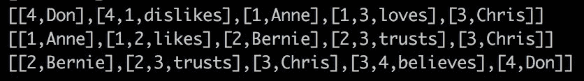

不幸的是，我们无法在这里更详细地讨论 GraphFrames，但感兴趣的读者可以参考[`graphframes.github.io/`](https://graphframes.github.io/)上的文档获取更多详细信息。相反，我们现在将转向 GraphX 中可用的算法，并将它们应用于大规模的演员数据图。

# 图算法和应用

在这个应用程序部分中，我们将讨论三角形计数、（强）连通组件、PageRank 和 GraphX 中可用的其他算法，我们将从[`networkrepository.com/`](http://networkrepository.com/)加载另一个有趣的图数据集。这次，请从[`networkrepository.com/ca-hollywood-2009.php`](http://networkrepository.com/ca-hollywood-2009.php)下载数据，该数据集包含一个无向图，其顶点表示出现在电影中的演员。文件的每一行包含两个顶点 ID，表示这些演员在一部电影中一起出现。

该数据集包括约 110 万个顶点和 5630 万条边。尽管文件大小即使解压后也不是特别大，但这样大小的图对于图处理引擎来说是一个真正的挑战。由于我们假设您在本地使用 Spark 的独立模式工作，这个图很可能不适合您计算机的内存，并且会导致 Spark 应用程序崩溃。为了防止这种情况发生，让我们稍微限制一下数据，这也给了我们清理文件头的机会。我们假设您已经解压了`ca-hollywood-2009.mtx`并将其存储在当前工作目录中。我们使用 unix 工具*tail*和*head*删除前两行，然后限制到前一百万条边：

`tail -n+3 ca-hollywood-2009.mtx | head -1000000 > ca-hollywood-2009.txt`

如果这些工具对您不可用，任何其他工具都可以，包括手动修改文件。从前面描述的结构中，我们可以简单地使用`edgeListFile`功能将图加载到 Spark 中，并确认它确实有一百万条边：

```scala
val actorGraph = GraphLoader.edgeListFile(sc, "./ca-hollywood-2009.txt")
actorGraph.edges.count()
```

接下来，让我们看看 GraphX 能够如何分析这个图。

# 聚类

给定一个图，一个自然的问题是是否有任何子图与之自然地相连，也就是说，以某种方式对图进行聚类。这个问题可以用许多种方式来解决，其中我们已经自己实现了一种，即通过研究连接的组件。这次我们不使用我们自己的实现，而是使用 GraphX 的内置版本。为此，我们可以直接在图本身上调用`connectedComponents`：

```scala
val actorComponents = actorGraph.connectedComponents().cache 
actorComponents.vertices.map(_._2).distinct().count
```

与我们自己的实现一样，图的顶点数据包含集群 ID，这些 ID 对应于集群中可用的最小顶点 ID。这使我们能够直接计算连接的组件，通过收集不同的集群 ID。我们受限制的集群图的答案是 173。计算组件后，我们缓存图，以便可以进一步用于其他计算。例如，我们可能会询问连接的组件有多大，例如通过计算顶点数量的最大值和最小值来计算。我们可以通过使用集群 ID 作为键，并通过计算每个组的项数来减少每个组来实现这一点：

```scala
val clusterSizes =actorComponents.vertices.map(
  v => (v._2, 1)).reduceByKey(_ + _)
clusterSizes.map(_._2).max
clusterSizes.map(_._2).min
```

结果表明，最大的集群包含了一个庞大的 193,518 名演员，而最小的集群只有三名演员。接下来，让我们忽略这样一个事实，即所讨论的图实际上没有方向性，因为一起出现在电影中是对称的，并且假装边对是有方向性的。我们不必在这里强加任何东西，因为在 Spark GraphX 中，边始终具有源和目标。这使我们也能够研究*强*连接的组件。我们可以像对连接的组件那样调用这个算法，但在这种情况下，我们还必须指定迭代次数。原因是在“追踪”有向边方面，与我们对连接的组件和收敛速度相比，计算要求更高，收敛速度更慢。

让我们只进行一次迭代来进行计算，因为这非常昂贵：

```scala
val strongComponents = actorGraph.stronglyConnectedComponents(numIter = 1)
strongComponents.vertices.map(_._2).distinct().count
```

这个计算可能需要几分钟才能完成。如果您在您的机器上运行甚至这个例子时遇到问题，请考虑进一步限制`actorGraph`。

接下来，让我们为演员图计算三角形，这是另一种对其进行聚类的方法。为此，我们需要稍微准备一下图，也就是说，我们必须*规范化*边并指定*图分区策略*。规范化图意味着摆脱循环和重复边，并确保对于所有边，源 ID 始终小于目标 ID：

```scala
val canonicalGraph = actorGraph.mapEdges(
  e => 1).removeSelfEdges().convertToCanonicalEdges()
```

图分区策略，就像我们已经遇到的 RDD 分区一样，关注的是如何有效地在集群中分发图。当然，有效意味着在很大程度上取决于我们对图的处理方式。粗略地说，有两种基本的分区策略，即*顶点切割*和*边切割*。顶点切割策略意味着通过切割顶点来强制以不相交的方式分割边，也就是说，如果需要，顶点会在分区之间重复。边切割策略则相反，其中顶点在整个集群中是唯一的，但我们可能会复制边。GraphX 有四种基于顶点切割的分区策略。我们不会在这里详细讨论它们，而是只使用`RandomVertexCut`，它对顶点 ID 进行哈希处理，以便使顶点之间的所有同向边位于同一分区。

请注意，当创建图时没有指定分区策略时，图会通过简单地采用已提供用于构建的底层 EdgeRDD 的结构来进行分发。根据您的用例，这可能不是理想的，例如因为边的分区可能非常不平衡。

为了对`canonicalGraph`进行分区并继续进行三角形计数，我们现在使用上述策略对我们的图进行分区，如下所示：

```scala
val partitionedGraph = canonicalGraph.partitionBy(PartitionStrategy.RandomVertexCut)
```

计算三角形在概念上是很简单的。我们首先收集每个顶点的所有相邻顶点，然后计算每条边的这些集合的交集。逻辑是，如果源顶点和目标顶点集合都包含相同的第三个顶点，则这三个顶点形成一个三角形。作为最后一步，我们将*交集集合的计数*发送到源和目标，从而将每个三角形计数两次，然后我们简单地除以二得到每个顶点的三角形计数。现在进行三角形计数实际上就是运行：

```scala
import org.apache.spark.graphx.lib.TriangleCount
val triangles = TriangleCount.runPreCanonicalized(partitionedGraph)
```

事实上，我们可以不需要显式地规范化`actorGraph`，而是可以直接在初始图上直接施加`triangleCount`，也就是通过计算以下内容：

```scala
actorGraph.triangleCount()
```

同样，我们也可以导入`TriangleCount`并在我们的 actor 图上调用它，如下所示：

```scala
import org.apache.spark.graphx.lib.TriangleCount
TriangleCount.run(actorGraph)
```

然而，需要注意的是，这两个等价操作实际上将以相同的方式规范化所讨论的图，而规范化是一个计算上非常昂贵的操作。因此，每当你看到已经以规范形式加载图的机会时，第一种方法将更有效。

# 顶点重要性

在一个相互连接的朋友图中，一个有趣的问题是谁是群体中最有影响力的人。是拥有最多连接的人，也就是具有最高度的顶点吗？对于有向图，入度可能是一个很好的第一猜测。或者更确切地说，是那些认识一些人，而这些人本身又有很多连接的人？肯定有很多方法来描述一个顶点的重要性或权威性，具体的答案将在很大程度上取决于问题域，以及我们在图中附加的其他数据。此外，在我们给出的例子中，对于图中的特定人物，另一个人可能因为他们自己非常主观的原因而是最有影响力的。

寻找给定图中顶点的重要性是一个具有挑战性的问题，一个历史上重要的算法示例是*PageRank*，它在 1998 年的开创性论文"The Anatomy of a Large-Scale Hypertextual Web Search Engine"中被描述，可以在[`ilpubs.stanford.edu:8090/361/1/1998-8.pdf`](http://ilpubs.stanford.edu:8090/361/1/1998-8.pdf)上找到。在这篇论文中，Sergey Brin 和 Larry Page 奠定了他们的搜索引擎 Google 在公司刚刚起步时运行的基础。虽然 PageRank 对于在由链接连接的庞大网页图中找到相关的搜索结果产生了重大影响，但这个算法在多年来已经被 Google 内部的其他方法所取代。然而，PageRank 仍然是如何对网页或图进行排名的一个主要示例，以获得更深入的理解。GraphX 提供了 PageRank 的实现，在描述算法本身之后我们将对其进行介绍。

PageRank 是一个针对有向图的迭代算法，通过将相同的值*1/N*初始化为每个顶点的值，其中*N*表示图的阶数，也就是顶点的数量。然后，它重复相同的更新顶点值的过程，也就是它们的 PageRank，直到我们选择停止或满足某些收敛标准。更具体地说，在每次迭代中，一个顶点将其*当前 PageRank 除以其出度*发送到所有它有出站连接的顶点，也就是说，它将其当前 PageRank 均匀分布到所有出站边上。然后顶点们将接收到的所有值相加以设置它们的新 PageRank。如果整体 PageRank 在上一次迭代中没有发生太大变化，则停止该过程。这是算法的非常基本的公式，我们将在讨论 GraphX 实现时进一步指定停止标准。

然而，我们还需要通过引入*阻尼因子 d*稍微扩展基线算法。阻尼因子是为了防止所谓的*排名汇*。想象一个强连接组件，它只有来自图的其余部分的入边，那么按照前面的规定，这个组件将在每次迭代中通过入边积累越来越多的 PageRank，但从不通过出边“释放”任何 PageRank。这种情况被称为排名汇，为了摆脱它，我们需要通过阻尼引入更多的*排名源*。PageRank 所做的是模拟一个完全随机的用户，以链接目标的 PageRank 给出的概率随机地跟随链接。阻尼的概念改变了这一点，引入了一个概率 d 的机会，用户按照他们当前的路径前进，并以概率(*1-d*)继续阅读一个完全不同的页面。

在上面的排名示例中，用户将离开强连接组件，然后在图中的其他地方停留，从而增加了其他部分的相关性，也就是 PageRank。为了总结这个解释，带有阻尼的 PageRank 更新规则可以写成如下形式：

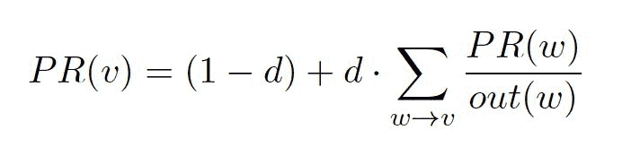

也就是说，为了更新顶点*v*的 PageRank *PR*，我们对所有入边顶点*w*的 PageRank 除以它们各自的出度*out(w)*求和。

Spark GraphX 有两种 PageRank 的实现，一种称为静态，另一种称为动态。在静态版本中，我们只需对预先指定的固定次数`numIter`执行前面的更新规则。在动态版本中，我们为收敛指定了一个*容差*`tol`，即如果顶点在上一次迭代中其 PageRank 至少没有变化`tol`，那么它将退出计算，这意味着它既不会发出新的 PageRanks，也不会再更新自己。让我们为微小的`friendGraph`计算静态和动态版本的 PageRank。使用 10 次迭代的静态版本如下调用：

```scala
friendGraph.staticPageRank(numIter = 10).vertices.collect.foreach(println)
```

运行算法后，我们只需在主节点上收集所有顶点并打印它们，得到以下结果：

```scala
 (1,0.42988729103845036)
 (2,0.3308390977362031)
 (3,0.6102873825386869)
 (4,0.6650182732476072)
 (5,0.42988729103845036)
```

看到 PageRanks 随着迭代次数的变化而变化是很有趣的；请参阅以下表格以获取详细信息：

| **numIter / vertex** | **Anne** | **Bernie** | **Chris** | **Don** | **Edgar** |
| --- | --- | --- | --- | --- | --- |
| 1 | 0.213 | 0.213 | 0.341 | 0.277 | 0.213 |
| 2 | 0.267 | 0.240 | 0.422 | 0.440 | 0.267 |
| 3 | 0.337 | 0.263 | 0.468 | 0.509 | 0.337 |
| 4 | 0.366 | 0.293 | 0.517 | 0.548 | 0.366 |
| 5 | 0.383 | 0.305 | 0.554 | 0.589 | 0.383 |
| 10 | 0.429 | 0.330 | 0.610 | 0.665 | 0.429 |
| 20 | 0.438 | 0.336 | 0.622 | 0.678 | 0.438 |
| 100 | 0.438 | 0.336 | 0.622 | 0.678 | 0.483 |

虽然在只有两次迭代后，哪个顶点比其他顶点更重要的一般趋势已经确定，但请注意，即使对于这个微小的图形，PageRanks 稳定下来也需要大约 20 次迭代。因此，如果您只对粗略排名顶点感兴趣，或者运行动态版本太昂贵，静态算法可以派上用场。要计算动态版本，我们将容差`tol`指定为`0.0001`，将所谓的`resetProb`指定为`0.15`。后者不过是*1-d*，也就是说，离开当前路径并在图中的随机顶点出现的概率。实际上，`0.15`是`resetProb`的默认值，并反映了原始论文的建议：

```scala
friendGraph.pageRank(tol = 0.0001, resetProb = 0.15)
```

运行这个程序会产生以下的 PageRank 值，显示在*图 15*中。这些数字应该看起来很熟悉，因为它们与具有 20 次或更多迭代的静态版本相同：

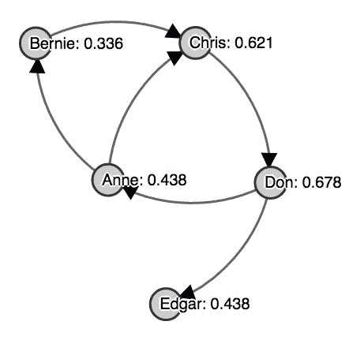

图 15：使用动态 GraphX 实现计算的我们的玩具朋友图的 PageRanks。

对于一个更有趣的例子，让我们再次转向演员图。使用与前面示例中相同的容差，我们可以快速找到具有最高 PageRank 的顶点 ID：

```scala
val actorPrGraph: Graph[Double, Double] = actorGraph.pageRank(0.0001)
actorPrGraph.vertices.reduce((v1, v2) => {
  if (v1._2 > v2._2) v1 else v2
})
```

这返回 ID 33024，PageRank 为 7.82。为了突出 PageRank 与简单地将入度作为顶点重要性的想法有何不同，考虑以下分析：

```scala
actorPrGraph.inDegrees.filter(v => v._1 == 33024L).collect.foreach(println)
```

限制为所讨论的顶点 ID 并检查其入度结果为 62 个入边。让我们看看图中最高的十个入度是什么：

```scala
actorPrGraph.inDegrees.map(_._2).collect().sorted.takeRight(10)
```

这导致`Array(704, 733, 746, 756, 762, 793, 819, 842, 982, 1007)`，这意味着具有最高 PageRank 的顶点甚至没有接近具有最高入度的顶点。事实上，总共有 2167 个顶点至少有 62 个入边，可以通过运行以下命令来查看：

```scala
actorPrGraph.inDegrees.map(_._2).filter(_ >= 62).count
```

因此，虽然这仍然意味着该顶点在入度方面处于所有顶点的前 2%，但我们看到 PageRank 得出了与其他方法完全不同的答案。

# GraphX 的上下文

在整个章节中看到了许多图分析的应用之后，一个自然的问题是 GraphX 如何适应 Spark 生态系统的其他部分，以及我们如何将其与之前看到的 MLlib 等系统一起用于机器学习应用。

简而言之，尽管图的概念仅限于 Spark GraphX，但由于图的基础顶点和边 RDD，我们可以无缝地与 Spark 的任何其他模块进行交流。事实上，我们在整个章节中使用了许多核心 RDD 操作，但并不止于此。MLlib 确实在一些特定的地方使用了 GraphX 功能，比如*潜在狄利克雷分析*或*幂迭代聚类*，但这超出了本章的范围。相反，我们专注于从第一原理解释 GraphX 的基础知识。然而，鼓励读者将本章学到的知识与之前的知识结合起来，并尝试使用前面的算法进行实验。为了完整起见，GraphX 中完全实现了一种机器学习算法，即*SVD++*，您可以在[`public.research.att.com/~volinsky/netflix/kdd08koren.pdf`](http://public.research.att.com/~volinsky/netflix/kdd08koren.pdf)上了解更多信息，这是一种基于图的推荐算法。

# 总结

在本章中，我们已经看到了如何使用 Spark GraphX 将大规模图分析付诸实践。将实体关系建模为具有顶点和边的图是一种强大的范例，可以评估许多有趣的问题。

在 GraphX 中，图是有限的、有向的属性图，可能具有多个边和环。GraphX 对顶点和边 RDD 的高度优化版本进行图分析，这使您可以利用数据和图并行应用。我们已经看到这样的图可以通过从`edgeListFile`加载或从其他 RDD 单独构建来读取。除此之外，我们还看到了如何轻松地创建随机和确定性图数据进行快速实验。仅使用`Graph`模型的丰富内置功能，我们已经展示了如何调查图的核心属性。为了可视化更复杂的图形，我们介绍了*Gephi*及其接口，这使得我们可以直观地了解手头的图结构。

在 Spark GraphX 提供的许多其他可能性中，我们介绍了两种强大的图分析工具，即`aggregateMessages`和`Pregel` API。大多数 GraphX 内置算法都是使用这两个选项之一编写的。我们已经看到如何使用这些 API 编写我们自己的算法。我们还简要介绍了 GraphFrames 包，它建立在 DataFrames 之上，配备了一种优雅的查询语言，这种语言在普通的 GraphX 中不可用，并且可以在分析目的上派上用场。

在实际应用方面，我们看到了一个有趣的转发图，以及好莱坞电影演员图的应用。我们仔细解释并应用了谷歌的 PageRank 算法，研究了图的（强）连通组件，并计算三角形作为聚类的手段。最后，我们讨论了 Spark MLlib 和 GraphX 在高级机器学习应用中的关系。
