# 第八章：Lending Club 贷款预测

我们几乎已经到了本书的结尾，但最后一章将利用我们在前几章中涵盖的所有技巧和知识。我们向您展示了如何利用 Spark 的强大功能进行数据处理和转换，以及我们向您展示了包括线性模型、树模型和模型集成在内的数据建模的不同方法。本质上，本章将是各种问题的“综合章节”，我们将一次性处理许多问题，从数据摄入、处理、预处理、异常值处理和建模，一直到模型部署。

我们的主要目标之一是提供数据科学家日常生活的真实画面——从几乎原始数据开始，探索数据，构建几个模型，比较它们，找到最佳模型，并将其部署到生产环境——如果一直都这么简单就好了！在本书的最后一章中，我们将借鉴 Lending Club 的一个真实场景，这是一家提供点对点贷款的公司。我们将应用您学到的所有技能，看看是否能够构建一个确定贷款风险性的模型。此外，我们将与实际的 Lending Club 数据进行比较，以评估我们的过程。

# 动机

Lending Club 的目标是最小化提供坏贷款的投资风险，即那些有很高违约或延迟概率的贷款，但也要避免拒绝好贷款，从而损失利润。在这里，主要标准是由接受的风险驱动——Lending Club 可以接受多少风险仍然能够盈利。

此外，对于潜在的贷款，Lending Club 需要提供一个反映风险并产生收入的适当利率，或者提供贷款调整。因此，如果某项贷款的利率较高，我们可能推断出这种贷款的固有风险比利率较低的贷款更大。

在我们的书中，我们可以从 Lending Club 的经验中受益，因为他们提供了不仅是良好贷款而且是坏贷款的历史追踪。此外，所有历史数据都可用，包括代表最终贷款状态的数据，这为扮演 Lending Club 数据科学家的角色并尝试匹配甚至超越他们的预测模型提供了独特的机会。

我们甚至可以再进一步——我们可以想象一个“自动驾驶模式”。对于每笔提交的贷款，我们可以定义投资策略（即，我们愿意接受多少风险）。自动驾驶将接受/拒绝贷款，并提出机器生成的利率，并计算预期收益。唯一的条件是，如果您使用我们的模型赚了一些钱，我们希望分享利润！

# 目标

总体目标是创建一个机器学习应用程序，能够根据给定的投资策略训练模型，并将这些模型部署为可调用的服务，处理进入的贷款申请。该服务将能够决定是否批准特定的贷款申请并计算利率。我们可以从业务需求开始，自上而下地定义我们的意图。记住，一个优秀的数据科学家对所提出的问题有着牢固的理解，这取决于对业务需求的理解，具体如下：

+   我们需要定义投资策略的含义以及它如何优化/影响我们的机器学习模型的创建和评估。然后，我们将采用模型的发现，并根据指定的投资策略将其应用于我们的贷款组合，以最大程度地优化我们的利润。

+   我们需要定义基于投资策略的预期回报计算，并且应用程序应该提供出借人的预期回报。这对于投资者来说是一个重要的贷款属性，因为它直接连接了贷款申请、投资策略（即风险）和可能的利润。我们应该记住这一点，因为在现实生活中，建模管道是由不是数据科学或统计专家的用户使用的，他们更感兴趣于对建模输出的更高层次解释。

+   此外，我们需要设计并实现一个贷款预测管道，其中包括以下内容：

+   基于贷款申请数据和投资策略的模型决定贷款状态-贷款是否应该被接受或拒绝。

+   模型需要足够健壮，以拒绝所有不良贷款（即导致投资损失的贷款），但另一方面，不要错过任何好贷款（即不要错过任何投资机会）。

+   模型应该是可解释的-它应该解释为什么会拒绝贷款。有趣的是，关于这个主题有很多研究；关键利益相关者希望得到比“模型说了算”更具体的东西。

对于那些对模型可解释性感兴趣的人，UCSD 的 Zachary Lipton 有一篇名为*模型可解释性的神话*的杰出论文，[`arxiv.org/abs/1606.03490`](https://arxiv.org/abs/1606.03490)直接讨论了这个话题。对于那些经常需要解释他们的魔法的数据科学家来说，这是一篇特别有用的论文！

+   +   还有另一个模型，它推荐接受贷款的利率。根据指定的贷款申请，模型应该决定最佳利率，既不能太高以至于失去借款人，也不能太低以至于错失利润。

+   最后，我们需要决定如何部署这个复杂的、多方面的机器学习管道。就像我们之前的章节一样，将多个模型组合成一个管道，我们将使用数据集中的所有输入-我们将看到它们是非常不同类型的-并进行处理、特征提取、模型预测和基于我们的投资策略的推荐：这是一个艰巨的任务，但我们将在本章中完成！

# 数据

Lending Club 提供所有可用的贷款申请及其结果。2007-2012 年和 2013-2014 年的数据可以直接从[`www.lendingclub.com/info/download-data.action`](https://www.lendingclub.com/info/download-data.action)下载。

下载拒绝贷款数据，如下截图所示：

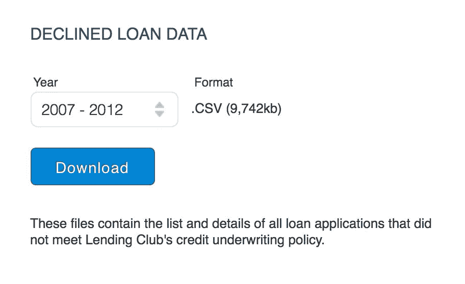

下载的文件包括`filesLoanStats3a.CSV`和`LoanStats3b.CSV`。

我们拥有的文件包含大约 230k 行，分为两个部分：

+   符合信用政策的贷款：168k

+   不符合信用政策的贷款：62k（注意不平衡的数据集）

和往常一样，建议通过查看样本行或前 10 行来查看数据；鉴于我们这里的数据集的大小，我们可以使用 Excel 来查看一行是什么样子：

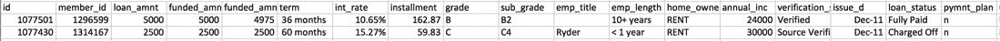

要小心，因为下载的文件可能包含一行 Lending Club 下载系统的注释。最好在加载到 Spark 之前手动删除它。

# 数据字典

Lending Club 下载页面还提供了包含单独列解释的数据字典。具体来说，数据集包含 115 个具有特定含义的列，收集关于借款人的数据，包括他们的银行历史、信用历史和贷款申请。此外，对于已接受的贷款，数据包括付款进度或贷款的最终状态-如果完全支付或违约。研究数据字典的一个重要原因是防止使用可能会预示你试图预测的结果的列，从而导致模型不准确。这个信息很清楚但非常重要：研究并了解你的数据！

# 环境准备

在本章中，我们将使用 Scala API 构建两个独立的 Spark 应用程序，一个用于模型准备，另一个用于模型部署，而不是使用 Spark shell。在 Spark 的情况下，Spark 应用程序是一个正常的 Scala 应用程序，具有作为执行入口的主方法。例如，这是一个用于模型训练的应用程序的框架：

```scala
object Chapter8 extends App {

val spark = SparkSession.builder()
     .master("local[*]")
     .appName("Chapter8")
     .getOrCreate()

val sc = spark.sparkContext
sc.setLogLevel("WARN")
script(spark, sc, spark.sqlContext)

def script(spark: SparkSession, sc: SparkContext, sqlContext: SQLContext): Unit = {
      // ...code of application
}
}

```

此外，我们将尝试提取可以在两个应用程序之间共享的部分到一个库中。这将使我们能够遵循 DRY（不要重复自己）原则：

```scala
object Chapter8Library {
    // ...code of library
  }
```

# 数据加载

通常情况下，第一步涉及将数据加载到内存中。在这一点上，我们可以决定使用 Spark 或 H2O 的数据加载能力。由于数据存储在 CSV 文件格式中，我们将使用 H2O 解析器快速地了解数据：

```scala
val DATASET_DIR = s"${sys.env.get("DATADIR").getOrElse("data")}" val DATASETS = Array("LoanStats3a.CSV", "LoanStats3b.CSV")
import java.net.URI

import water.fvec.H2OFrame
val loanDataHf = new H2OFrame(DATASETS.map(name => URI.create(s"${DATASET_DIR}/${name}")):_*)
```

加载的数据集可以直接在 H2O Flow UI 中进行探索。我们可以直接验证存储在内存中的数据的行数、列数和大小：

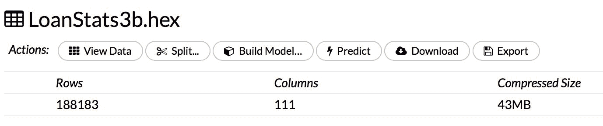

# 探索-数据分析

现在，是时候探索数据了。我们可以问很多问题，比如：

+   我们想要模拟支持我们目标的目标特征是什么？

+   每个目标特征的有用训练特征是什么？

+   哪些特征不适合建模，因为它们泄漏了关于目标特征的信息（请参阅前一节）？

+   哪些特征是无用的（例如，常量特征，或者包含大量缺失值的特征）？

+   如何清理数据？对缺失值应该怎么处理？我们能工程化新特征吗？

# 基本清理

在数据探索过程中，我们将执行基本的数据清理。在我们的情况下，我们可以利用两种工具的力量：我们使用 H2O Flow UI 来探索数据，找到数据中可疑的部分，并直接用 H2O 或者更好地用 Spark 进行转换。

# 无用的列

第一步是删除每行包含唯一值的列。这种典型的例子是用户 ID 或交易 ID。在我们的情况下，我们将根据数据描述手动识别它们：

```scala
import com.packtpub.mmlwspark.utils.Tabulizer.table
val idColumns = Seq("id", "member_id")
println(s"Columns with Ids: ${table(idColumns, 4, None)}")

```

输出如下：

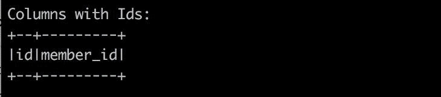

下一步是识别无用的列，例如以下列：

+   常量列

+   坏列（只包含缺失值）

以下代码将帮助我们做到这一点：

```scala
val constantColumns = loanDataHf.names().indices
   .filter(idx => loanDataHf.vec(idx).isConst || loanDataHf.vec(idx).isBad)
   .map(idx => loanDataHf.name(idx))
println(s"Constant and bad columns: ${table(constantColumns, 4, None)}")
```

输出如下：

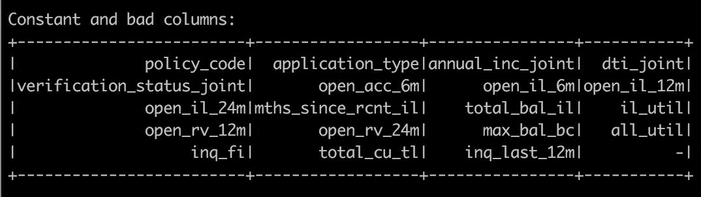

# 字符串列

现在，是时候探索数据集中不同类型的列了。简单的步骤是查看包含字符串的列-这些列就像 ID 列一样，因为它们包含唯一值：

```scala
val stringColumns = loanDataHf.names().indices
   .filter(idx => loanDataHf.vec(idx).isString)
   .map(idx => loanDataHf.name(idx))
println(s"String columns:${table(stringColumns, 4, None)}")
```

输出显示在以下截图中：

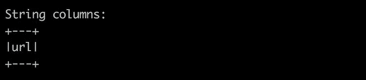

问题是`url`特征是否包含我们可以提取的任何有用信息。我们可以直接在 H2O Flow 中探索数据，并在以下截图中查看特征列中的一些数据样本：

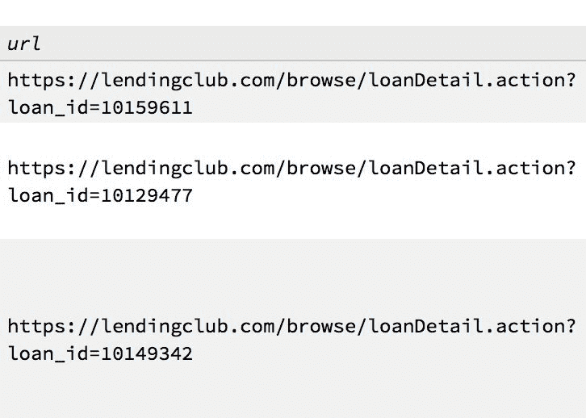

我们可以直接看到`url`特征只包含指向 Lending Club 网站的指针，使用我们已经删除的应用程序 ID。因此，我们可以决定删除它。

# 贷款进度列

我们的目标是基于贷款申请数据做出固有风险的预测，但是一些列包含了关于贷款支付进度的信息，或者它们是由 Lending Club 自己分配的。在这个例子中，为了简单起见，我们将放弃它们，只关注贷款申请流程中的列。重要的是要提到，在现实场景中，甚至这些列可能包含有用的信息（例如支付进度）可用于预测。然而，我们希望基于贷款的初始申请来构建我们的模型，而不是在贷款已经被 a）接受和 b）有历史支付记录的情况下。根据数据字典，我们检测到以下列：

```scala
val loanProgressColumns = Seq("funded_amnt", "funded_amnt_inv", "grade", "initial_list_status",
"issue_d", "last_credit_pull_d", "last_pymnt_amnt", "last_pymnt_d",
"next_pymnt_d", "out_prncp", "out_prncp_inv", "pymnt_plan",
"recoveries", "sub_grade", "total_pymnt", "total_pymnt_inv",
"total_rec_int", "total_rec_late_fee", "total_rec_prncp")
```

现在，我们可以直接记录所有我们需要删除的列，因为它们对建模没有任何价值：

```scala
val columnsToRemove = (idColumns ++ constantColumns ++ stringColumns ++ loanProgressColumns)
```

# 分类列

在下一步中，我们将探索分类列。H2O 解析器只有在列包含有限的字符串值集时才将列标记为分类列。这是与标记为字符串列的列的主要区别。它们包含超过 90%的唯一值（例如，我们在上一段中探索的`url`列）。让我们收集我们数据集中所有分类列的列表，以及各个特征的稀疏性：

```scala
val categoricalColumns = loanDataHf.names().indices
  .filter(idx => loanDataHf.vec(idx).isCategorical)
  .map(idx => (loanDataHf.name(idx), loanDataHf.vec(idx).cardinality()))
  .sortBy(-_._2)

println(s"Categorical columns:${table(tblize(categoricalColumns, true, 2))}")
```

输出如下：

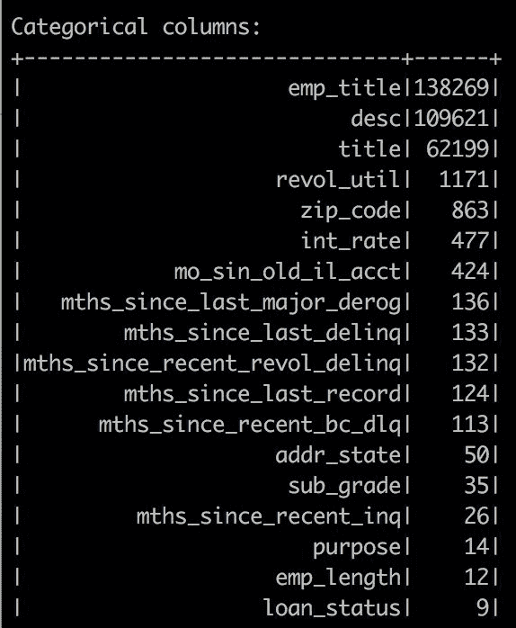

现在，我们可以探索单独的列。例如，“purpose”列包含 13 个类别，主要目的是债务合并：

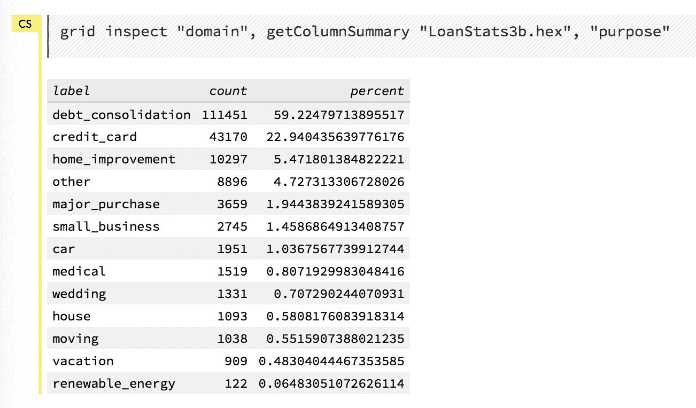

这个列看起来是有效的，但现在，我们应该关注可疑的列，即，首先是高基数列：`emp_title`，`title`，`desc`。有几个观察结果：

+   每列的最高值是一个空的“值”。这可能意味着一个缺失的值。然而，对于这种类型的列（即，表示一组值的列），一个专门的级别用于缺失值是非常合理的。它只代表另一个可能的状态，“缺失”。因此，我们可以保持它不变。

+   “title”列与“purpose”列重叠，可以被删除。

+   `emp_title`和`desc`列纯粹是文本描述。在这种情况下，我们不会将它们视为分类，而是应用 NLP 技术以后提取重要信息。

现在，我们将专注于以“mths_”开头的列，正如列名所示，该列应该包含数字值，但我们的解析器决定这些列是分类的。这可能是由于收集数据时的不一致性造成的。例如，当我们探索“mths_since_last_major_derog”列的域时，我们很容易就能发现一个原因：

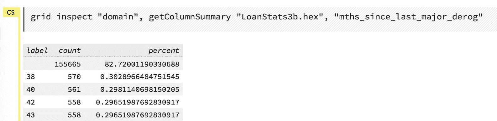

列中最常见的值是一个空值（即，我们之前已经探索过的相同缺陷）。在这种情况下，我们需要决定如何替换这个值以将列转换为数字列：它应该被缺失值替换吗？

如果我们想尝试不同的策略，我们可以为这种类型的列定义一个灵活的转换。在这种情况下，我们将离开 H2O API 并切换到 Spark，并定义我们自己的 Spark UDF。因此，与前几章一样，我们将定义一个函数。在这种情况下，一个给定替换值和一个字符串的函数，产生代表给定字符串的浮点值，或者如果字符串为空则返回指定值。然后，将该函数包装成 Spark UDF：

```scala
import org.apache.spark.sql.functions._
val toNumericMnths = (replacementValue: Float) => (mnths: String) => {
if (mnths != null && !mnths.trim.isEmpty) mnths.trim.toFloat else replacementValue
}
val toNumericMnthsUdf = udf(toNumericMnths(0.0f))
```

一个好的做法是保持我们的代码足够灵活，以允许进行实验，但不要使其过于复杂。在这种情况下，我们只是为我们期望更详细探讨的情况留下了一个开放的大门。

还有两列需要我们关注：`int_rate`和`revol_util`。两者都应该是表示百分比的数字列；然而，如果我们对它们进行探索，我们很容易看到一个问题--列中包含“％”符号而不是数字值。因此，我们有两个更多的候选列需要转换：

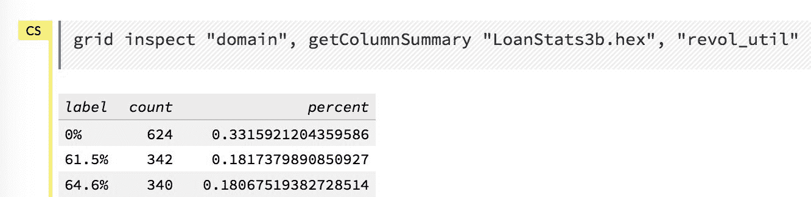

然而，我们不会直接处理数据，而是定义 Spark UDF 转换，将基于字符串的利率转换为数字利率。但是，在我们的 UDF 定义中，我们将简单地使用 H2O 提供的信息，确认两列中的类别列表只包含以百分号结尾的数据：

```scala
import org.apache.spark.sql.functions._
val toNumericRate = (rate: String) => {
val num = if (rate != null) rate.stripSuffix("%").trim else ""
if (!num.isEmpty) num.toFloat else Float.NaN
}
val toNumericRateUdf = udf(toNumericRate)
```

定义的 UDF 将在稍后与其他 Spark 转换一起应用。此外，我们需要意识到这些转换需要在训练和评分时应用。因此，我们将它们放入我们的共享库中。

# 文本列

在前面的部分中，我们确定了`emp_title`和`desc`列作为文本转换的目标。我们的理论是这些列可能包含有用的信息，可以帮助区分好坏贷款。

# 缺失数据

我们数据探索旅程的最后一步是探索缺失值。我们已经观察到一些列包含表示缺失值的值；然而，在本节中，我们将专注于纯缺失值。首先，我们需要收集它们：

```scala
val naColumns = loanDataHf.names().indices
   .filter(idx => loanDataHf.vec(idx).naCnt() >0)
   .map(idx =>
          (loanDataHf.name(idx),
            loanDataHf.vec(idx).naCnt(),
f"${100*loanDataHf.vec(idx).naCnt()/loanDataHf.numRows().toFloat}%2.1f%%")
   ).sortBy(-_._2)
println(s"Columns with NAs (#${naColumns.length}):${table(naColumns)}")
```

列表包含 111 列，缺失值的数量从 0.2％到 86％不等：

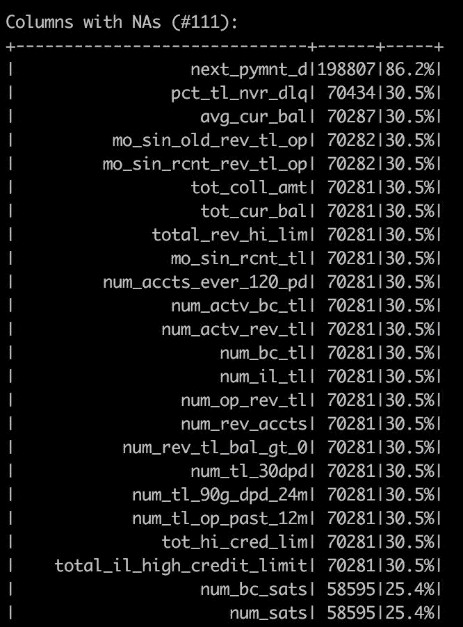

有很多列缺少五个值，这可能是由于错误的数据收集引起的，如果它们呈现出某种模式，我们可以很容易地将它们过滤掉。对于更“污染的列”（例如，有许多缺失值的列），我们需要根据数据字典中描述的列语义找出每列的正确策略。

在所有这些情况下，H2O Flow UI 允许我们轻松快速地探索数据的基本属性，甚至执行基本的数据清理。但是，对于更高级的数据操作，Spark 是正确的工具，因为它提供了一个预先准备好的转换库和本地 SQL 支持。

哇！正如我们所看到的，数据清理虽然相当费力，但对于数据科学家来说是一项非常重要的任务，希望能够得到对深思熟虑的问题的良好答案。在解决每一个新问题之前，这个过程必须经过仔细考虑。正如古老的广告语所说，“垃圾进，垃圾出”-如果输入不正确，我们的模型将遭受后果。

此时，可以将所有确定的转换组合成共享库函数：

```scala
def basicDataCleanup(loanDf: DataFrame, colsToDrop: Seq[String] = Seq()) = {
   (
     (if (loanDf.columns.contains("int_rate"))
       loanDf.withColumn("int_rate", toNumericRateUdf(col("int_rate")))
else loanDf)
       .withColumn("revol_util", toNumericRateUdf(col("revol_util")))
       .withColumn("mo_sin_old_il_acct", toNumericMnthsUdf(col("mo_sin_old_il_acct")))
       .withColumn("mths_since_last_delinq", toNumericMnthsUdf(col("mths_since_last_delinq")))
       .withColumn("mths_since_last_record", toNumericMnthsUdf(col("mths_since_last_record")))
       .withColumn("mths_since_last_major_derog", toNumericMnthsUdf(col("mths_since_last_major_derog")))
       .withColumn("mths_since_recent_bc", toNumericMnthsUdf(col("mths_since_recent_bc")))
       .withColumn("mths_since_recent_bc_dlq", toNumericMnthsUdf(col("mths_since_recent_bc_dlq")))
       .withColumn("mths_since_recent_inq", toNumericMnthsUdf(col("mths_since_recent_inq")))
       .withColumn("mths_since_recent_revol_delinq", toNumericMnthsUdf(col("mths_since_recent_revol_delinq")))
   ).drop(colsToDrop.toArray :_*)
 }
```

该方法以 Spark DataFrame 作为输入，并应用所有确定的清理转换。现在，是时候构建一些模型了！

# 预测目标

进行数据清理后，是时候检查我们的预测目标了。我们理想的建模流程包括两个模型：一个控制贷款接受的模型，一个估计利率的模型。你应该已经想到，第一个模型是一个二元分类问题（接受或拒绝贷款），而第二个模型是一个回归问题，结果是一个数值。

# 贷款状态模型

第一个模型需要区分好坏贷款。数据集已经提供了`loan_status`列，这是我们建模目标的最佳特征表示。让我们更详细地看看这一列。

贷款状态由一个分类特征表示，有七个级别：

+   全额支付：借款人支付了贷款和所有利息

+   当前：贷款按计划积极支付

+   宽限期内：逾期付款 1-15 天

+   逾期（16-30 天）：逾期付款

+   逾期（31-120 天）：逾期付款

+   已冲销：贷款逾期 150 天

+   违约：贷款丢失

对于第一个建模目标，我们需要区分好贷款和坏贷款。好贷款可能是已全额偿还的贷款。其余的贷款可以被视为坏贷款，除了需要更多关注的当前贷款（例如，存活分析），或者我们可以简单地删除包含“Current”状态的所有行。为了将 loan_status 特征转换为二进制特征，我们将定义一个 Spark UDF：

```scala
val toBinaryLoanStatus = (status: String) => status.trim.toLowerCase() match {
case "fully paid" =>"good loan"
case _ =>"bad loan"
}
val toBinaryLoanStatusUdf = udf(toBinaryLoanStatus)
```

我们可以更详细地探索各个类别的分布。在下面的截图中，我们还可以看到好贷款和坏贷款之间的比例非常不平衡。在训练和评估模型时，我们需要牢记这一事实，因为我们希望优化对坏贷款的召回概率：

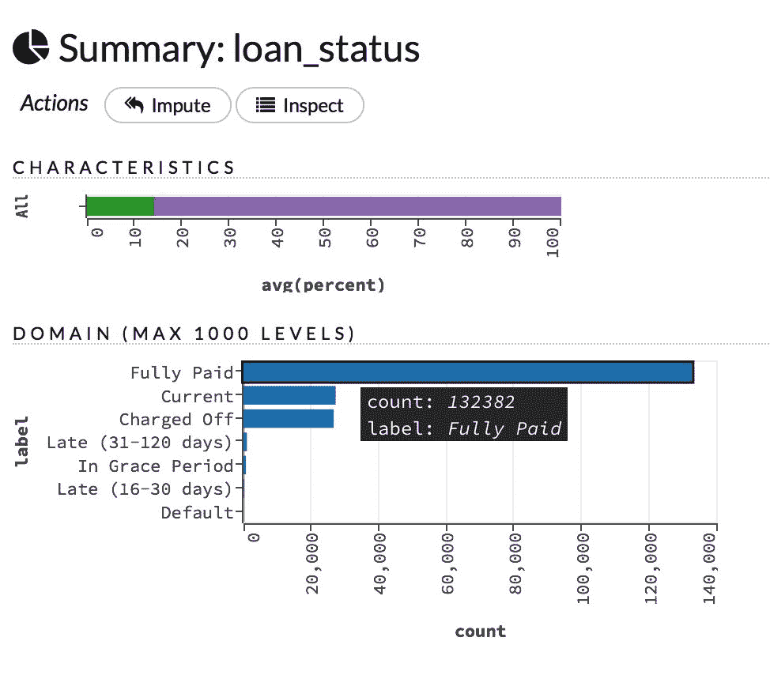

loan_status 列的属性。

# 基本模型

此时，我们已经准备好了目标预测列并清理了输入数据，现在可以构建一个基本模型了。基本模型可以让我们对数据有基本的直觉。为此，我们将使用除了被检测为无用的列之外的所有列。我们也将跳过处理缺失值，因为我们将使用 H2O 和 RandomForest 算法，它可以处理缺失值。然而，第一步是通过定义的 Spark 转换来准备数据集：

```scala
import com.packtpub.mmlwspark.chapter8.Chapter8Library._
val loanDataDf = h2oContext.asDataFrame(loanDataHf)(sqlContext)
val loanStatusBaseModelDf = basicDataCleanup(
   loanDataDf
     .where("loan_status is not null")
     .withColumn("loan_status", toBinaryLoanStatusUdf($"loan_status")),
   colsToDrop = Seq("title") ++ columnsToRemove)
```

我们将简单地删除所有已知与我们的目标预测列相关的列，所有携带文本描述的高分类列（除了`title`和`desc`，我们稍后会使用），并应用我们在前面部分确定的所有基本清理转换。

下一步涉及将数据分割成两部分。像往常一样，我们将保留大部分数据用于训练，其余部分用于模型验证，并将其转换为 H2O 模型构建器接受的形式：

```scala
val loanStatusDfSplits = loanStatusBaseModelDf.randomSplit(Array(0.7, 0.3), seed = 42)

val trainLSBaseModelHf = toHf(loanStatusDfSplits(0).drop("emp_title", "desc"), "trainLSBaseModelHf")(h2oContext)
val validLSBaseModelHf = toHf(loanStatusDfSplits(1).drop("emp_title", "desc"), "validLSBaseModelHf")(h2oContext)
def toHf(df: DataFrame, name: String)(h2oContext: H2OContext): H2OFrame = {
val hf = h2oContext.asH2OFrame(df, name)
val allStringColumns = hf.names().filter(name => hf.vec(name).isString)
     hf.colToEnum(allStringColumns)
     hf
 }
```

有了清理后的数据，我们可以轻松地构建一个模型。我们将盲目地使用 RandomForest 算法，因为它直接为我们提供了数据和个体特征的重要性。我们之所以说“盲目”，是因为正如你在第二章中回忆的那样，*探测暗物质 - 强子玻色子粒子*，RandomForest 模型可以接受许多不同类型的输入，并使用不同的特征构建许多不同的树，这让我们有信心使用这个算法作为我们的开箱即用模型，因为它在包括所有特征时表现得非常好。因此，该模型也定义了一个我们希望通过构建新特征来改进的基线。

我们将使用默认设置。RandomForest 提供了基于袋外样本的验证模式，因此我们暂时可以跳过交叉验证。然而，我们将增加构建树的数量，但通过基于 Logloss 的停止准则限制模型构建的执行。此外，我们知道预测目标是不平衡的，好贷款的数量远远高于坏贷款，因此我们将通过启用 balance_classes 选项要求对少数类进行上采样：

```scala

import _root_.hex.tree.drf.DRFModel.DRFParameters
import _root_.hex.tree.drf.{DRF, DRFModel}
import _root_.hex.ScoreKeeper.StoppingMetric
import com.packtpub.mmlwspark.utils.Utils.let

val loanStatusBaseModelParams = let(new DRFParameters) { p =>
   p._response_column = "loan_status" p._train = trainLSBaseModelHf._key
p._ignored_columns = Array("int_rate")
   p._stopping_metric = StoppingMetric.logloss
p._stopping_rounds = 1
p._stopping_tolerance = 0.1
p._ntrees = 100
p._balance_classes = true p._score_tree_interval = 20
}
val loanStatusBaseModel1 = new DRF(loanStatusBaseModelParams, water.Key.makeDRFModel)
   .trainModel()
   .get()
```

模型构建完成后，我们可以像在之前的章节中那样探索其质量，但我们首先要看的是特征的重要性：

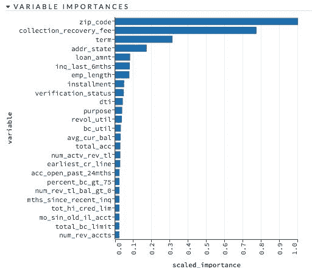

最令人惊讶的事实是，zip_code 和 collection_recovery_fee 特征的重要性远高于其他列。这是可疑的，可能表明该列与目标变量直接相关。

我们可以重新查看数据字典，其中将**zip_code**列描述为“借款人在贷款申请中提供的邮政编码的前三个数字”，第二列描述为“后收费用”。后者指示与响应列的直接联系，因为“好贷款”将具有等于零的值。我们还可以通过探索数据来验证这一事实。在 zip_code 的情况下，与响应列没有明显的联系。

因此，我们将进行一次模型运行，但在这种情况下，我们将尝试忽略`zip_code`和`collection_recovery_fee`列：

```scala
loanStatusBaseModelParams._ignored_columns = Array("int_rate", "collection_recovery_fee", "zip_code")
val loanStatusBaseModel2 = new DRF(loanStatusBaseModelParams, water.Key.makeDRFModel)
   .trainModel()
   .get()
```

构建模型后，我们可以再次探索变量重要性图，并看到变量之间的重要性分布更有意义。根据图表，我们可以决定仅使用前 10 个输入特征来简化模型的复杂性并减少建模时间。重要的是要说，我们仍然需要考虑已删除的列作为相关的输入特征：

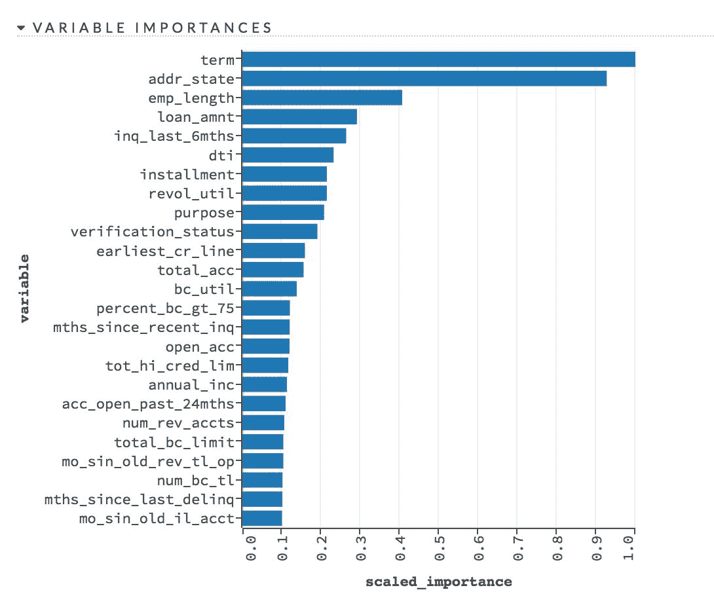

**基础模型性能**

现在，我们可以查看创建模型的模型性能。我们需要记住，在我们的情况下，以下内容适用：

+   模型的性能是基于袋外样本报告的，而不是未见数据。

+   我们使用固定参数作为最佳猜测；然而，进行随机参数搜索将有益于了解输入参数如何影响模型的性能。

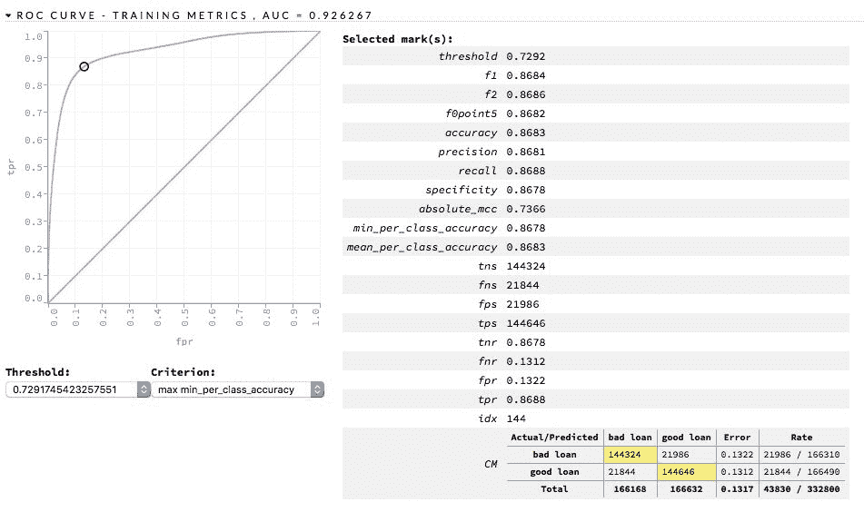

我们可以看到在袋外样本数据上测得的 AUC 相当高。即使对于最小化各个类别准确率的选择阈值，各个类别的错误率也很低。然而，让我们探索模型在未见数据上的性能。我们将使用准备好的部分数据进行验证：

```scala
import _root_.hex.ModelMetrics
val lsBaseModelPredHf = loanStatusBaseModel2.score(validLSBaseModelHf)
println(ModelMetrics.getFromDKV(loanStatusBaseModel2, validLSBaseModelHf))
```

输出如下：

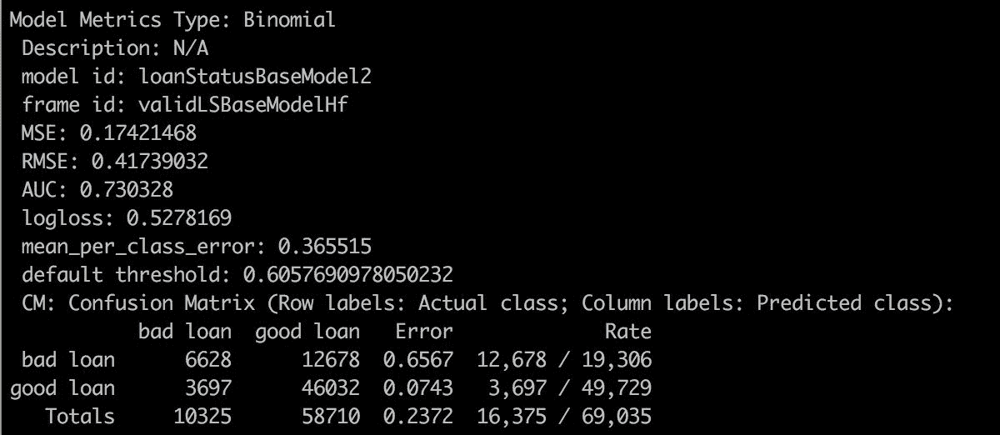

计算得到的模型指标也可以在 Flow UI 中进行可视化探索。

我们可以看到 AUC 较低，各个类别的错误率较高，但仍然相当不错。然而，所有测量的统计属性都无法给我们任何关于模型的“业务”价值的概念-借出了多少钱，违约贷款损失了多少钱等等。在下一步中，我们将尝试为模型设计特定的评估指标。

声明模型做出错误预测是什么意思？它可以将良好的贷款申请视为不良的，这将导致拒绝申请。这也意味着从贷款利息中损失利润。或者，模型可以将不良的贷款申请推荐为良好的，这将导致全部或部分借出的资金损失。让我们更详细地看看这两种情况。

前一种情况可以用以下函数描述：

```scala
def profitMoneyLoss = (predThreshold: Double) =>
     (act: String, predGoodLoanProb: Double, loanAmount: Int, intRate: Double, term: String) => {
val termInMonths = term.trim match {
case "36 months" =>36
case "60 months" =>60
}
val intRatePerMonth = intRate / 12 / 100
if (predGoodLoanProb < predThreshold && act == "good loan") {
         termInMonths*loanAmount*intRatePerMonth / (1 - Math.pow(1+intRatePerMonth, -termInMonths)) - loanAmount
       } else 0.0
}
```

该函数返回如果模型预测了不良贷款，但实际数据表明贷款是良好的时候损失的金额。返回的金额考虑了预测的利率和期限。重要的变量是`predGoodLoanProb`，它保存了模型预测的将实际贷款视为良好贷款的概率，以及`predThreshold`，它允许我们设置一个标准，当预测良好贷款的概率对我们来说足够高时。

类似地，我们将描述后一种情况：

```scala
val loanMoneyLoss = (act: String, predGoodLoanProb: Double, predThreshold: Double, loanAmount: Int) => {
if (predGoodLoanProb > predThreshold /* good loan predicted */
&& act == "bad loan" /* actual is bad loan */) loanAmount else 0
}
```

要意识到我们只是按照假阳性和假阴性的混淆矩阵定义，并应用我们对输入数据的领域知识来定义特定的模型评估指标。

现在，是时候利用这两个函数并定义`totalLoss`了-如果我们遵循模型的建议，接受不良贷款和错过良好贷款时我们可以损失多少钱：

```scala
import org.apache.spark.sql.Row
def totalLoss(actPredDf: DataFrame, threshold: Double): (Double, Double, Long, Double, Long, Double) = {

val profitMoneyLossUdf = udf(profitMoneyLoss(threshold))
val loanMoneyLossUdf = udf(loanMoneyLoss(threshold))

val lostMoneyDf = actPredDf
     .where("loan_status is not null and loan_amnt is not null")
     .withColumn("profitMoneyLoss", profitMoneyLossUdf($"loan_status", $"good loan", $"loan_amnt", $"int_rate", $"term"))
     .withColumn("loanMoneyLoss", loanMoneyLossUdf($"loan_status", $"good loan", $"loan_amnt"))

   lostMoneyDf
     .agg("profitMoneyLoss" ->"sum", "loanMoneyLoss" ->"sum")
     .collect.apply(0) match {
case Row(profitMoneyLossSum: Double, loanMoneyLossSum: Double) =>
       (threshold,
         profitMoneyLossSum, lostMoneyDf.where("profitMoneyLoss > 0").count,
         loanMoneyLossSum, lostMoneyDf.where("loanMoneyLoss > 0").count,
         profitMoneyLossSum + loanMoneyLossSum
       )
   }
 }
```

`totalLoss`函数是为 Spark DataFrame 和阈值定义的。Spark DataFrame 包含实际验证数据和预测，由三列组成：默认阈值的实际预测、良好贷款的概率和不良贷款的概率。阈值帮助我们定义良好贷款概率的合适标准；也就是说，如果良好贷款概率高于阈值，我们可以认为模型建议接受贷款。

如果我们对不同的阈值运行该函数，包括最小化各个类别错误的阈值，我们将得到以下表格：

```scala
import _root_.hex.AUC2.ThresholdCriterion
val predVActHf: Frame = lsBaseModel2PredHf.add(validLSBaseModelHf)
 water.DKV.put(predVActHf)
val predVActDf = h2oContext.asDataFrame(predVActHf)(sqlContext)
val DEFAULT_THRESHOLDS = Array(0.4, 0.45, 0.5, 0.55, 0.6, 0.65, 0.7, 0.75, 0.8, 0.85, 0.9, 0.95)

println(
table(Array("Threshold", "Profit Loss", "Count", "Loan loss", "Count", "Total loss"),
         (DEFAULT_THRESHOLDS :+
               ThresholdCriterion.min_per_class_accuracy.max_criterion(lsBaseModel2PredModelMetrics.auc_obj()))
          .map(threshold =>totalLoss(predVActDf, threshold)),
Map(1 ->"%,.2f", 3 ->"%,.2f", 5 ->"%,.2f")))
```

输出如下：

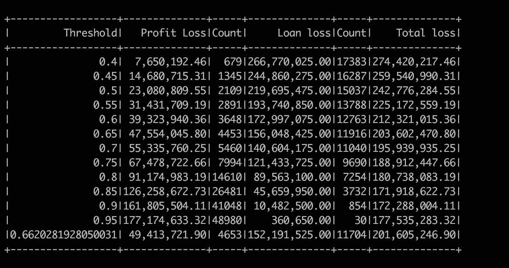

从表中可以看出，我们的指标的最低总损失是基于阈值`0.85`，这代表了一种相当保守的策略，侧重于避免坏账。

我们甚至可以定义一个函数，找到最小的总损失和相应的阈值：

```scala
// @Snippet
def findMinLoss(model: DRFModel,
                 validHf: H2OFrame,
                 defaultThresholds: Array[Double]): (Double, Double, Double, Double) = {
import _root_.hex.ModelMetrics
import _root_.hex.AUC2.ThresholdCriterion
// Score model
val modelPredHf = model.score(validHf)
val modelMetrics = ModelMetrics.getFromDKV(model, validHf)
val predVActHf: Frame = modelPredHf.add(validHf)
   water.DKV.put(predVActHf)
//
val predVActDf = h2oContext.asDataFrame(predVActHf)(sqlContext)
val min = (DEFAULT_THRESHOLDS :+ ThresholdCriterion.min_per_class_accuracy.max_criterion(modelMetrics.auc_obj()))
     .map(threshold =>totalLoss(predVActDf, threshold)).minBy(_._6)
   ( /* Threshold */ min._1, /* Total loss */ min._6, /* Profit loss */ min._2, /* Loan loss */ min._4)
 }
val minLossModel2 = findMinLoss(loanStatusBaseModel2, validLSBaseModelHf, DEFAULT_THRESHOLDS)
println(f"Min total loss for model 2: ${minLossModel2._2}%,.2f (threshold = ${minLossModel2._1})")
```

输出如下：

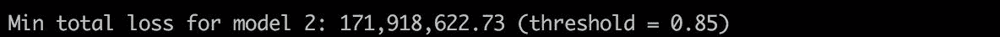

基于报告的结果，我们可以看到模型将总损失最小化到阈值约为`0.85`，这比模型识别的默认阈值（F1 = 0.66）要高。然而，我们仍然需要意识到这只是一个基本的朴素模型；我们没有进行任何调整和搜索正确的训练参数。我们仍然有两个字段，`title`和`desc`，我们可以利用。是时候改进模型了！

# emp_title 列转换

第一列`emp_title`描述了就业头衔。然而，它并不统一-有多个版本具有相同的含义（“Bank of America”与“bank of america”）或类似的含义（“AT&T”和“AT&T Mobility”）。我们的目标是将标签统一成基本形式，检测相似的标签，并用一个共同的标题替换它们。理论上，就业头衔直接影响偿还贷款的能力。

标签的基本统一是一个简单的任务-将标签转换为小写形式并丢弃所有非字母数字字符（例如“&”或“.”）。对于这一步，我们将使用 Spark API 进行用户定义的函数：

```scala
val unifyTextColumn = (in: String) => {
if (in != null) in.toLowerCase.replaceAll("[^\\w ]|", "") else null
}
val unifyTextColumnUdf = udf(unifyTextColumn)
```

下一步定义了一个分词器，一个将句子分割成单独标记并丢弃无用和停用词（例如，太短的词或连词）的函数。在我们的情况下，我们将使最小标记长度和停用词列表作为输入参数灵活：

```scala
val ALL_NUM_REGEXP = java.util.regex.Pattern.compile("\\d*")
val tokenizeTextColumn = (minLen: Int) => (stopWords: Array[String]) => (w: String) => {
if (w != null)
     w.split(" ").map(_.trim).filter(_.length >= minLen).filter(!ALL_NUM_REGEXP.matcher(_).matches()).filter(!stopWords.contains(_)).toSeq
else Seq.empty[String]
 }
import org.apache.spark.ml.feature.StopWordsRemover
val tokenizeUdf = udf(tokenizeTextColumn(3)(StopWordsRemover.loadDefaultStopWords("english")))
```

重要的是要提到，Spark API 已经提供了停用词列表作为`StopWordsRemover`转换的一部分。我们对`tokenizeUdf`的定义直接利用了提供的英文停用词列表。

现在，是时候更详细地查看列了。我们将从已创建的 DataFrame `loanStatusBaseModelDf`中选择`emp_title`列，并应用前面定义的两个函数：

```scala
val empTitleColumnDf = loanStatusBaseModelDf
   .withColumn("emp_title", unifyTextColumnUdf($"emp_title"))
   .withColumn("emp_title_tokens", tokenizeUdf($"emp_title"))
```

现在，我们有一个重要的 Spark DataFrame，其中包含两个重要的列：第一列包含统一的`emp_title`，第二列由标记列表表示。借助 Spark SQL API，我们可以轻松地计算`emp_title`列中唯一值的数量，或者具有超过 100 个频率的唯一标记的数量（即，这意味着该单词在超过 100 个`emp_titles`中使用）：

```scala
println("Number of unique values in emp_title column: " +
        empTitleColumn.select("emp_title").groupBy("emp_title").count().count())
println("Number of unique tokens with freq > 100 in emp_title column: " +
        empTitleColumn.rdd.flatMap(row => row.getSeqString.map(w => (w, 1)))
          .reduceByKey(_ + _).filter(_._2 >100).count)
```

输出如下：

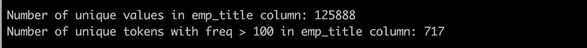

您可以看到`emp_title`列中有许多唯一值。另一方面，只有`717`个标记一遍又一遍地重复。我们的目标是*压缩*列中唯一值的数量，并将相似的值分组在一起。我们可以尝试不同的方法。例如，用一个代表性标记对每个`emp_title`进行编码，或者使用基于 Word2Vec 算法的更高级的技术。

在前面的代码中，我们将 DataFrame 查询功能与原始 RDD 的计算能力相结合。许多查询可以用强大的基于 SQL 的 DataFrame API 来表达；然而，如果我们需要处理结构化数据（例如前面示例中的字符串标记序列），通常 RDD API 是一个快速的选择。

让我们看看第二个选项。Word2Vec 算法将文本特征转换为向量空间，其中相似的单词在表示单词的相应向量的余弦距离方面彼此靠近。这是一个很好的特性；然而，我们仍然需要检测“相似单词组”。对于这个任务，我们可以简单地使用 KMeans 算法。

第一步是创建 Word2Vec 模型。由于我们的数据在 Spark DataFrame 中，我们将简单地使用`ml`包中的 Spark 实现：

```scala
import org.apache.spark.ml.feature.Word2Vec
val empTitleW2VModel = new Word2Vec()
  .setInputCol("emp_title_tokens")
  .setOutputCol("emp_title_w2vVector")
  .setMinCount(1)
  .fit(empTitleColumn)
```

算法输入由存储在“tokens”列中的句子表示的标记序列定义。`outputCol`参数定义了模型的输出，如果用于转换数据的话：

```scala

 val empTitleColumnWithW2V =   w2vModel.transform(empTitleW2VModel)
 empTitleColumnWithW2V.printSchema()
```

输出如下：

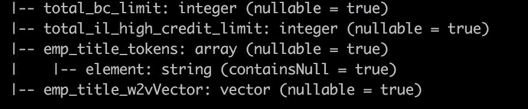

从转换的输出中，您可以直接看到 DataFrame 输出不仅包含`emp_title`和`emp_title_tokens`输入列，还包含`emp_title_w2vVector`列，它代表了 w2vModel 转换的输出。

需要提到的是，Word2Vec 算法仅针对单词，但 Spark 实现也将句子（即单词序列）转换为向量，方法是通过对句子表示的所有单词向量进行平均。

接下来，我们将构建一个 K 均值模型，将代表个人就业头衔的向量空间划分为预定义数量的聚类。在这之前，重要的是要考虑为什么这样做是有益的。想想你所知道的“软件工程师”的许多不同变体：程序分析员，SE，高级软件工程师等等。鉴于这些本质上意思相同并且将由相似向量表示的变体，聚类为我们提供了一种将相似头衔分组在一起的方法。然而，我们需要指定我们应该检测到多少 K 个聚类-这需要更多的实验，但为简单起见，我们将尝试`500`个聚类：

```scala
import org.apache.spark.ml.clustering.KMeans
val K = 500
val empTitleKmeansModel = new KMeans()
  .setFeaturesCol("emp_title_w2vVector")
  .setK(K)
  .setPredictionCol("emp_title_cluster")
  .fit(empTitleColumnWithW2V)
```

该模型允许我们转换输入数据并探索聚类。聚类编号存储在一个名为`emp_title_cluster`的新列中。

指定聚类数量是棘手的，因为我们正在处理无监督的机器学习世界。通常，从业者会使用一个简单的启发式方法，称为肘部法则（参考以下链接：[`en.wikipedia.org/wiki/Determining_the_number_of_clusters_in_a_data_set`](https://en.wikipedia.org/wiki/Determining_the_number_of_clusters_in_a_data_set)），基本上通过许多 K 均值模型，增加 K 聚类的数量作为每个聚类之间的异质性（独特性）的函数。通常情况下，随着 K 聚类数量的增加，收益会递减，关键是找到增加变得边际的点，以至于收益不再值得运行时间。

另外，还有一些信息准则统计量，被称为**AIC**（**阿凯克信息准则**）（[`en.wikipedia.org/wiki/Akaike_information_criterion`](https://en.wikipedia.org/wiki/Akaike_information_criterion)）和**BIC**（**贝叶斯信息准则**）（[`en.wikipedia.org/wiki/Bayesian_information_criterion`](https://en.wikipedia.org/wiki/Bayesian_information_criterion)），对此感兴趣的人应该进一步了解。需要注意的是，在撰写本书时，Spark 尚未实现这些信息准则，因此我们不会详细介绍。

看一下以下代码片段：

```scala
val clustered = empTitleKmeansModel.transform(empTitleColumnWithW2V)
clustered.printSchema()
```

输出如下：

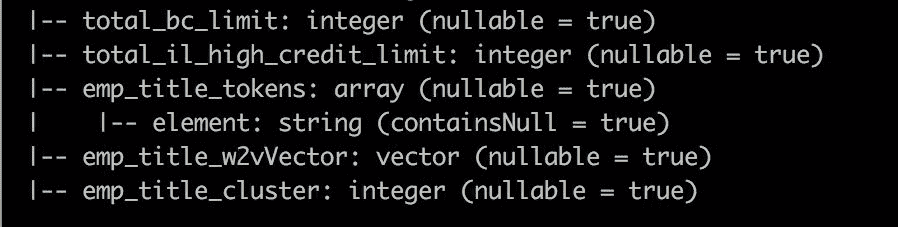

此外，我们可以探索与随机聚类相关的单词：

```scala
println(
s"""Words in cluster '133':
 |${clustered.select("emp_title").where("emp_title_cluster = 133").take(10).mkString(", ")}
 |""".stripMargin)
```

输出如下：

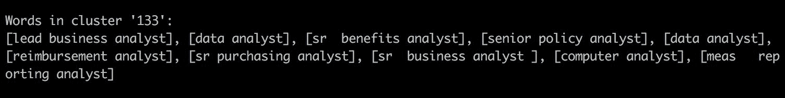

看看前面的聚类，问自己，“这些标题看起来像是一个逻辑聚类吗？”也许需要更多的训练，或者也许我们需要考虑进一步的特征转换，比如运行 n-grammer，它可以识别高频发生的单词序列。感兴趣的人可以在 Spark 中查看 n-grammer 部分。

此外，`emp_title_cluster`列定义了一个新特征，我们将用它来替换原始的`emp_title`列。我们还需要记住在列准备过程中使用的所有步骤和模型，因为我们需要重现它们来丰富新数据。为此，Spark 管道被定义为：

```scala
import org.apache.spark.ml.Pipeline
import org.apache.spark.sql.types._

val empTitleTransformationPipeline = new Pipeline()
   .setStages(Array(
new UDFTransformer("unifier", unifyTextColumn, StringType, StringType)
       .setInputCol("emp_title").setOutputCol("emp_title_unified"),
new UDFTransformer("tokenizer",
                        tokenizeTextColumn(3)(StopWordsRemover.loadDefaultStopWords("english")),
                        StringType, ArrayType(StringType, true))
       .setInputCol("emp_title_unified").setOutputCol("emp_title_tokens"),
     empTitleW2VModel,
     empTitleKmeansModel,
new ColRemover().setKeep(false).setColumns(Array("emp_title", "emp_title_unified", "emp_title_tokens", "emp_title_w2vVector"))
   ))
```

前两个管道步骤代表了用户定义函数的应用。我们使用了与第四章中使用的相同技巧，将 UDF 包装成 Spark 管道转换器，并借助定义的`UDFTransformer`类。其余步骤代表了我们构建的模型。

定义的`UDFTransformer`类是将 UDF 包装成 Spark 管道转换器的一种好方法，但对于 Spark 来说，它是一个黑匣子，无法执行所有强大的转换。然而，它可以被 Spark SQLTransformer 的现有概念所取代，后者可以被 Spark 优化器理解；另一方面，它的使用并不那么直接。

管道仍然需要拟合；然而，在我们的情况下，由于我们只使用了 Spark 转换器，拟合操作将所有定义的阶段捆绑到管道模型中：

```scala
val empTitleTransformer = empTitleTransformationPipeline.fit(loanStatusBaseModelDf)
```

现在，是时候评估新特征对模型质量的影响了。我们将重复我们之前在评估基本模型质量时所做的相同步骤：

+   准备训练和验证部分，并用一个新特征`emp_title_cluster`来丰富它们。

+   构建模型。

+   计算总损失金额并找到最小损失。

对于第一步，我们将重用准备好的训练和验证部分；然而，我们需要用准备好的管道对它们进行转换，并丢弃“原始”列`desc`：

```scala
val trainLSBaseModel3Df = empTitleTransformer.transform(loanStatusDfSplits(0))
val validLSBaseModel3Df = empTitleTransformer.transform(loanStatusDfSplits(1))
val trainLSBaseModel3Hf = toHf(trainLSBaseModel3Df.drop("desc"), "trainLSBaseModel3Hf")(h2oContext)
val validLSBaseModel3Hf = toHf(validLSBaseModel3Df.drop("desc"), "validLSBaseModel3Hf")(h2oContext)
```

当数据准备好时，我们可以使用与基本模型训练相同的参数重复模型训练，只是我们使用准备好的输入训练部分：

```scala
loanStatusBaseModelParams._train = trainLSBaseModel3Hf._key
val loanStatusBaseModel3 = new DRF(loanStatusBaseModelParams, water.Key.makeDRFModel)
   .trainModel()
   .get()
```

最后，我们可以在验证数据上评估模型，并根据总损失金额计算我们的评估指标：

```scala
val minLossModel3 = findMinLoss(loanStatusBaseModel3, validLSBaseModel3Hf, DEFAULT_THRESHOLDS)
println(f"Min total loss for model 3: ${minLossModel3._2}%,.2f (threshold = ${minLossModel3._1})")
```

输出如下：

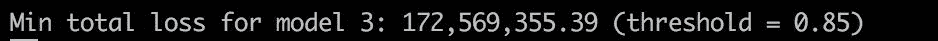

我们可以看到，利用自然语言处理技术来检测相似的职位标题略微提高了模型的质量，导致了在未知数据上计算的总美元损失的减少。然而，问题是我们是否可以根据`desc`列进一步改进我们的模型，其中可能包含有用的信息。

# desc 列转换

我们将要探索的下一列是`desc`。我们的动机仍然是从中挖掘任何可能的信息，并提高模型的质量。`desc`列包含了借款人希望贷款的纯文本描述。在这种情况下，我们不打算将它们视为分类值，因为大多数都是唯一的。然而，我们将应用自然语言处理技术来提取重要信息。与`emp_title`列相反，我们不会使用 Word2Vec 算法，而是尝试找到能够区分坏贷款和好贷款的词语。

为了达到这个目标，我们将简单地将描述分解为单独的单词（即标记化），并根据 tf-idf 赋予每个使用的单词权重，并探索哪些单词最有可能代表好贷款或坏贷款。我们可以使用词频而不是 tf-idf 值，但 tf-idf 值更好地区分了信息性词语（如“信用”）和常见词语（如“贷款”）。

让我们从我们在`emp_title`列的情况下执行的相同过程开始，定义将`desc`列转录为统一标记列表的转换：

```scala
import org.apache.spark.sql.types._
val descColUnifier = new UDFTransformer("unifier", unifyTextColumn, StringType, StringType)
   .setInputCol("desc")
.setOutputCol("desc_unified")

val descColTokenizer = new UDFTransformer("tokenizer",
                                           tokenizeTextColumn(3)(StopWordsRemover.loadDefaultStopWords("english")),
                                           StringType, ArrayType(StringType, true))
.setInputCol("desc_unified")
.setOutputCol("desc_tokens")
```

转换准备了一个包含每个输入`desc`值的单词列表的`desc_tokens`列。现在，我们需要将字符串标记转换为数字形式以构建 tf-idf 模型。在这种情况下，我们将使用`CountVectorizer`，它提取所使用的单词的词汇表，并为每一行生成一个数值向量。数值向量中的位置对应于词汇表中的单个单词，值表示出现的次数。我们希望将标记转换为数值向量，因为我们希望保留向量中的数字与表示它的标记之间的关系。与 Spark HashingTF 相反，`CountVectorizer`保留了单词与生成向量中其出现次数之间的双射关系。我们稍后将重用这种能力：

```scala
import org.apache.spark.ml.feature.CountVectorizer
val descCountVectorizer = new CountVectorizer()
   .setInputCol("desc_tokens")
   .setOutputCol("desc_vector")
   .setMinDF(1)
   .setMinTF(1)
```

定义 IDF 模型：

```scala
import org.apache.spark.ml.feature.IDF
val descIdf = new IDF()
   .setInputCol("desc_vector")
   .setOutputCol("desc_idf_vector")
   .setMinDocFreq(1)
```

当我们将所有定义的转换放入单个管道中时，我们可以直接在输入数据上训练它：

```scala
import org.apache.spark.ml.Pipeline
val descFreqPipeModel = new Pipeline()
   .setStages(
Array(descColUnifier,
           descColTokenizer,
           descCountVectorizer,
           descIdf)
   ).fit(loanStatusBaseModelDf)
```

现在，我们有一个管道模型，可以为每个输入`desc`值转换一个数值向量。此外，我们可以检查管道模型的内部，并从计算的`CountVectorizerModel`中提取词汇表，从`IDFModel`中提取单词权重：

```scala
val descFreqDf = descFreqPipeModel.transform(loanStatusBaseModelDf)
import org.apache.spark.ml.feature.IDFModel
import org.apache.spark.ml.feature.CountVectorizerModel
val descCountVectorizerModel = descFreqPipeModel.stages(2).asInstanceOf[CountVectorizerModel]
val descIdfModel = descFreqPipeModel.stages(3).asInstanceOf[IDFModel]
val descIdfScores = descIdfModel.idf.toArray
val descVocabulary = descCountVectorizerModel.vocabulary
println(
s"""
     ~Size of 'desc' column vocabulary: ${descVocabulary.length} ~Top ten highest scores:
     ~${table(descVocabulary.zip(descIdfScores).sortBy(-_._2).take(10))}
""".stripMargin('~'))
```

输出如下：

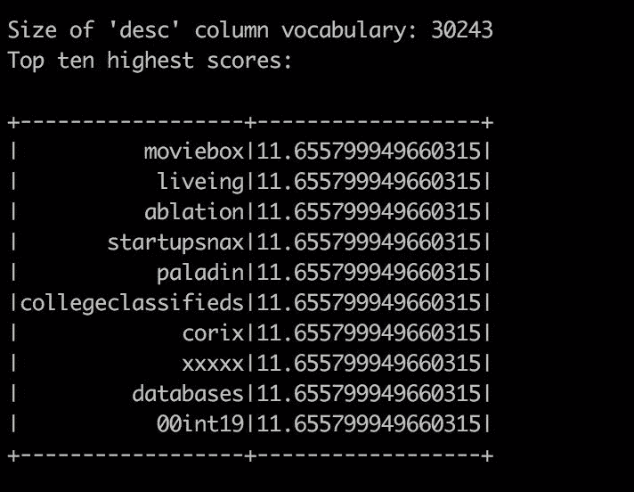

在这一点上，我们知道单词的权重；然而，我们仍然需要计算哪些单词被“好贷款”和“坏贷款”使用。为此，我们将利用由准备好的管道模型计算的单词频率信息，并存储在`desc_vector`列中（实际上，这是`CountVectorizer`的输出）。我们将分别为好贷款和坏贷款单独总结所有这些向量：

```scala
import org.apache.spark.ml.linalg.{Vector, Vectors}
val rowAdder = (toVector: Row => Vector) => (r1: Row, r2: Row) => {
Row(Vectors.dense((toVector(r1).toArray, toVector(r2).toArray).zipped.map((a, b) => a + b)))
 }

val descTargetGoodLoan = descFreqDf
   .where("loan_status == 'good loan'")
   .select("desc_vector")
   .reduce(rowAdder((row:Row) => row.getAsVector)).getAsVector.toArray

val descTargetBadLoan = descFreqDf
   .where("loan_status == 'bad loan'")
   .select("desc_vector")
   .reduce(rowAdder((row:Row) => row.getAsVector)).getAsVector.toArray
```

计算了值之后，我们可以轻松地找到只被好/坏贷款使用的单词，并探索它们计算出的 IDF 权重：

```scala
val descTargetsWords = descTargetGoodLoan.zip(descTargetBadLoan)
   .zip(descVocabulary.zip(descIdfScores)).map(t => (t._1._1, t._1._2, t._2._1, t._2._2))
println(
s"""
      ~Words used only in description of good loans:
      ~${table(descTargetsWords.filter(t => t._1 >0 && t._2 == 0).sortBy(-_._1).take(10))} ~
      ~Words used only in description of bad loans:
      ~${table(descTargetsWords.filter(t => t._1 == 0 && t._2 >0).sortBy(-_._1).take(10))}
""".stripMargin('~'))
```

输出如下：

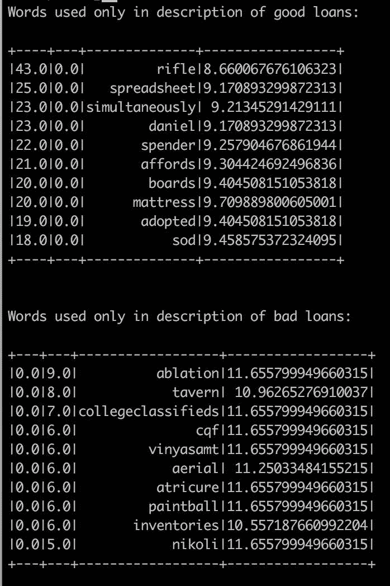

产生的信息似乎并不有用，因为我们只得到了非常罕见的单词，这些单词只允许我们检测到一些高度特定的贷款描述。然而，我们希望更通用，并找到更常见的单词，这些单词被两种贷款类型使用，但仍然允许我们区分好坏贷款。

因此，我们需要设计一个单词得分，它将针对在好（或坏）贷款中高频使用的单词，但惩罚罕见的单词。例如，我们可以定义如下：

```scala
def descWordScore = (freqGoodLoan: Double, freqBadLoan: Double, wordIdfScore: Double) =>
   Math.abs(freqGoodLoan - freqBadLoan) * wordIdfScore * wordIdfScore
```

如果我们在词汇表中的每个单词上应用单词得分方法，我们将得到一个基于得分降序排列的单词列表：

```scala
val numOfGoodLoans = loanStatusBaseModelDf.where("loan_status == 'good loan'").count()
val numOfBadLoans = loanStatusBaseModelDf.where("loan_status == 'bad loan'").count()

val descDiscriminatingWords = descTargetsWords.filter(t => t._1 >0 && t. _2 >0).map(t => {
val freqGoodLoan = t._1 / numOfGoodLoans
val freqBadLoan = t._2 / numOfBadLoans
val word = t._3
val idfScore = t._4
       (word, freqGoodLoan*100, freqBadLoan*100, idfScore, descWordScore(freqGoodLoan, freqBadLoan, idfScore))
     })
println(
table(Seq("Word", "Freq Good Loan", "Freq Bad Loan", "Idf Score", "Score"),
     descDiscriminatingWords.sortBy(-_._5).take(100),
Map(1 ->"%.2f", 2 ->"%.2f")))
```

输出如下：

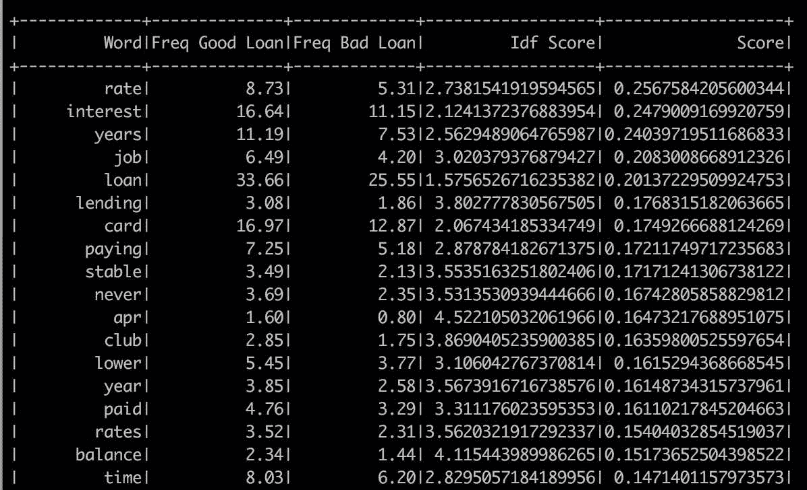

根据生成的列表，我们可以识别有趣的单词。我们可以选择其中的 10 个或 100 个。然而，我们仍然需要弄清楚如何处理它们。解决方案很简单；对于每个单词，我们将生成一个新的二进制特征-如果单词出现在`desc`值中，则为 1；否则为 0：

```scala
val descWordEncoder = (denominatingWords: Array[String]) => (desc: String) => {
if (desc != null) {
val unifiedDesc = unifyTextColumn(desc)
       Vectors.dense(denominatingWords.map(w =>if (unifiedDesc.contains(w)) 1.0 else 0.0))
     } else null }
```

我们可以在准备好的训练和验证样本上测试我们的想法，并衡量模型的质量。再次，第一步是准备带有新特征的增强数据。在这种情况下，新特征是一个包含由 descWordEncoder 生成的二进制特征的向量：

```scala
val trainLSBaseModel4Df = trainLSBaseModel3Df.withColumn("desc_denominating_words", descWordEncoderUdf($"desc")).drop("desc")
val validLSBaseModel4Df = validLSBaseModel3Df.withColumn("desc_denominating_words", descWordEncoderUdf($"desc")).drop("desc")
val trainLSBaseModel4Hf = toHf(trainLSBaseModel4Df, "trainLSBaseModel4Hf")
val validLSBaseModel4Hf = toHf(validLSBaseModel4Df, "validLSBaseModel4Hf")
 loanStatusBaseModelParams._train = trainLSBaseModel4Hf._key
val loanStatusBaseModel4 = new DRF(loanStatusBaseModelParams, water.Key.makeDRFModel)
   .trainModel()
   .get()
```

现在，我们只需要计算模型的质量：

```scala
val minLossModel4 = findMinLoss(loanStatusBaseModel4, validLSBaseModel4Hf, DEFAULT_THRESHOLDS)
println(f"Min total loss for model 4: ${minLossModel4._2}%,.2f (threshold = ${minLossModel4._1})")
```

输出如下：

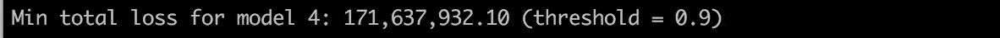

我们可以看到新特征有所帮助，并提高了我们模型的精度。另一方面，它也为实验开辟了很多空间-我们可以选择不同的单词，甚至在单词是`desc`列的一部分时使用 IDF 权重而不是二进制值。

总结我们的实验，我们将比较我们产生的三个模型的计算结果：（1）基础模型，（2）在通过`emp_title`特征增强的数据上训练的模型，以及（3）在通过`desc`特征丰富的数据上训练的模型：

```scala
println(
s"""
     ~Results:
     ~${table(Seq("Threshold", "Total loss", "Profit loss", "Loan loss"),
Seq(minLossModel2, minLossModel3, minLossModel4),
Map(1 ->"%,.2f", 2 ->"%,.2f", 3 ->"%,.2f"))}
""".stripMargin('~'))
```

输出如下：

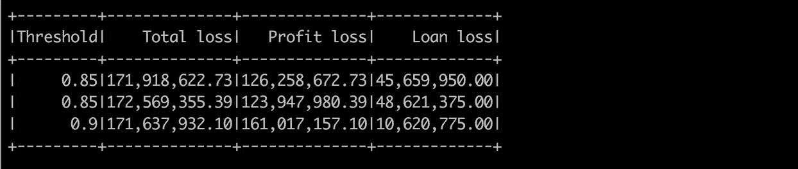

我们的小实验展示了特征生成的强大概念。每个新生成的特征都改善了基础模型的质量，符合我们的模型评估标准。

此时，我们可以完成对第一个模型的探索和训练，以检测好/坏贷款。我们将使用我们准备的最后一个模型，因为它给出了最好的质量。仍然有许多方法可以探索数据和提高我们的模型质量；然而，现在是构建我们的第二个模型的时候了。

# 利率模型

第二个模型预测已接受贷款的利率。在这种情况下，我们将仅使用对应于良好贷款的训练数据的部分，因为它们已经分配了适当的利率。然而，我们需要了解，剩下的坏贷款可能携带与利率预测相关的有用信息。

与其他情况一样，我们将从准备训练数据开始。我们将使用初始数据，过滤掉坏贷款，并删除字符串列：

```scala
val intRateDfSplits = loanStatusDfSplits.map(df => {
   df
     .where("loan_status == 'good loan'")
     .drop("emp_title", "desc", "loan_status")
     .withColumn("int_rate", toNumericRateUdf(col("int_rate")))
 })
val trainIRHf = toHf(intRateDfSplits(0), "trainIRHf")(h2oContext)
val validIRHf = toHf(intRateDfSplits(1), "validIRHf")(h2oContext)
```

在下一步中，我们将利用 H2O 随机超空间搜索的能力，在定义的参数超空间中找到最佳的 GBM 模型。我们还将通过额外的停止标准限制搜索，这些标准基于请求的模型精度和整体搜索时间。

第一步是定义通用的 GBM 模型构建器参数，例如训练、验证数据集和响应列：

```scala
import _root_.hex.tree.gbm.GBMModel.GBMParameters
val intRateModelParam = let(new GBMParameters()) { p =>
   p._train = trainIRHf._key
p._valid = validIRHf._key
p._response_column = "int_rate" p._score_tree_interval  = 20
}
```

下一步涉及定义要探索的参数超空间。我们可以对任何有趣的值进行编码，但请记住，搜索可能使用任何参数组合，甚至是无用的参数：

```scala
import _root_.hex.grid.{GridSearch}
import water.Key
import scala.collection.JavaConversions._
val intRateHyperSpace: java.util.Map[String, Array[Object]] = Map[String, Array[AnyRef]](
"_ntrees" -> (1 to 10).map(v => Int.box(100*v)).toArray,
"_max_depth" -> (2 to 7).map(Int.box).toArray,
"_learn_rate" ->Array(0.1, 0.01).map(Double.box),
"_col_sample_rate" ->Array(0.3, 0.7, 1.0).map(Double.box),
"_learn_rate_annealing" ->Array(0.8, 0.9, 0.95, 1.0).map(Double.box)
 )
```

现在，我们将定义如何遍历定义的参数超空间。H2O 提供两种策略：简单的笛卡尔搜索，逐步构建每个参数组合的模型，或者随机搜索，从定义的超空间中随机选择参数。令人惊讶的是，随机搜索的性能相当不错，特别是当用于探索庞大的参数空间时：

```scala
import _root_.hex.grid.HyperSpaceSearchCriteria.RandomDiscreteValueSearchCriteria
val intRateHyperSpaceCriteria = let(new RandomDiscreteValueSearchCriteria) { c =>
   c.set_stopping_metric(StoppingMetric.RMSE)
   c.set_stopping_tolerance(0.1)
   c.set_stopping_rounds(1)
   c.set_max_runtime_secs(4 * 60 /* seconds */)
 }
```

在这种情况下，我们还将通过两个停止条件限制搜索：基于 RMSE 的模型性能和整个网格搜索的最大运行时间。此时，我们已经定义了所有必要的输入，现在是启动超级搜索的时候了：

```scala
val intRateGrid = GridSearch.startGridSearch(Key.make("intRateGridModel"),
                                              intRateModelParam,
                                              intRateHyperSpace,
new GridSearch.SimpleParametersBuilderFactory[GBMParameters],
                                              intRateHyperSpaceCriteria).get()
```

搜索结果是一组称为`grid`的模型。让我们找一个具有最低 RMSE 的模型：

```scala
val intRateModel = intRateGrid.getModels.minBy(_._output._validation_metrics.rmse())
println(intRateModel._output._validation_metrics)
```

输出如下：

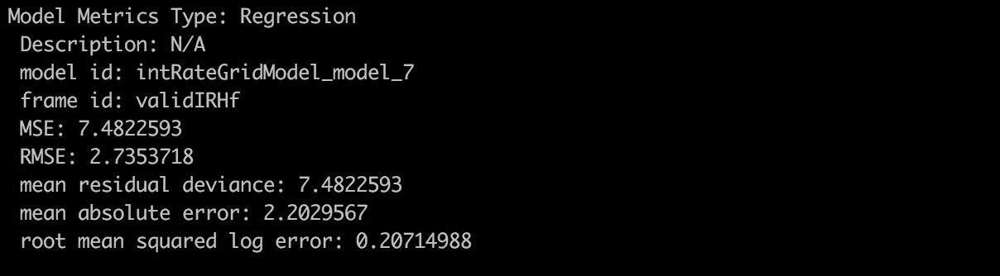

在这里，我们可以定义我们的评估标准，并选择正确的模型，不仅基于选择的模型指标，还要考虑预测值和实际值之间的差异，并优化利润。然而，我们将相信我们的搜索策略找到了最佳的可能模型，并直接跳入部署我们的解决方案。

# 使用模型进行评分

在前几节中，我们探索了不同的数据处理步骤，并构建和评估了几个模型，以预测已接受贷款的贷款状态和利率。现在，是时候使用所有构建的工件并将它们组合在一起，对新贷款进行评分了。

有多个步骤需要考虑：

1.  数据清理

1.  `emp_title`列准备管道

1.  将`desc`列转换为表示重要单词的向量

1.  用于预测贷款接受状态的二项模型

1.  用于预测贷款利率的回归模型

要重用这些步骤，我们需要将它们连接成一个单一的函数，该函数接受输入数据并生成涉及贷款接受状态和利率的预测。

评分函数很简单-它重放了我们在前几章中所做的所有步骤：

```scala
import _root_.hex.tree.drf.DRFModel
def scoreLoan(df: DataFrame,
                     empTitleTransformer: PipelineModel,
                     loanStatusModel: DRFModel,
                     goodLoanProbThreshold: Double,
                     intRateModel: GBMModel)(h2oContext: H2OContext): DataFrame = {
val inputDf = empTitleTransformer.transform(basicDataCleanup(df))
     .withColumn("desc_denominating_words", descWordEncoderUdf(col("desc")))
     .drop("desc")
val inputHf = toHf(inputDf, "input_df_" + df.hashCode())(h2oContext)
// Predict loan status and int rate
val loanStatusPrediction = loanStatusModel.score(inputHf)
val intRatePrediction = intRateModel.score(inputHf)
val probGoodLoanColName = "good loan" val inputAndPredictionsHf = loanStatusPrediction.add(intRatePrediction).add(inputHf)
   inputAndPredictionsHf.update()
// Prepare field loan_status based on threshold
val loanStatus = (threshold: Double) => (predGoodLoanProb: Double) =>if (predGoodLoanProb < threshold) "bad loan" else "good loan" val loanStatusUdf = udf(loanStatus(goodLoanProbThreshold))
   h2oContext.asDataFrame(inputAndPredictionsHf)(df.sqlContext).withColumn("loan_status", loanStatusUdf(col(probGoodLoanColName)))
 }
```

我们使用之前准备的所有定义-`basicDataCleanup`方法，`empTitleTransformer`，`loanStatusModel`，`intRateModel`-并按相应顺序应用它们。

请注意，在`scoreLoan`函数的定义中，我们不需要删除任何列。所有定义的 Spark 管道和模型只使用它们定义的特征，并保持其余部分不变。

该方法使用所有生成的工件。例如，我们可以以以下方式对输入数据进行评分：

```scala
val prediction = scoreLoan(loanStatusDfSplits(0), 
                            empTitleTransformer, 
                            loanStatusBaseModel4, 
                            minLossModel4._4, 
                            intRateModel)(h2oContext)
 prediction.show(10)
```

输出如下：

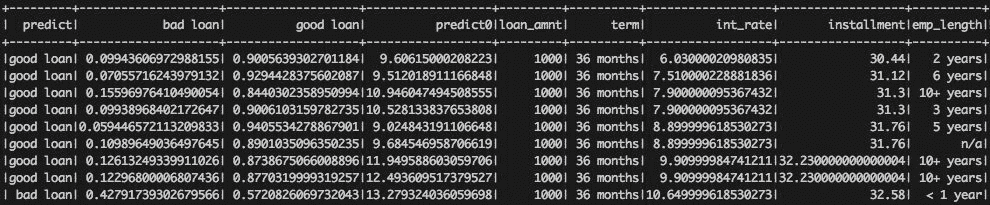

然而，为了独立于我们的训练代码对新贷款进行评分，我们仍然需要以某种可重复使用的形式导出训练好的模型和管道。对于 Spark 模型和管道，我们可以直接使用 Spark 序列化。例如，定义的`empTitleTransormer`可以以这种方式导出：

```scala
val MODELS_DIR = s"${sys.env.get("MODELSDIR").getOrElse("models")}" val destDir = new File(MODELS_DIR)
 empTitleTransformer.write.overwrite.save(new File(destDir, "empTitleTransformer").getAbsolutePath)
```

我们还为`desc`列定义了转换为`udf`函数`descWordEncoderUdf`。然而，我们不需要导出它，因为我们将其定义为共享库的一部分。

对于 H2O 模型，情况更加复杂，因为有几种模型导出的方式：二进制、POJO 和 MOJO。二进制导出类似于 Spark 导出；然而，要重用导出的二进制模型，需要运行 H2O 集群的实例。其他方法消除了这种限制。POJO 将模型导出为 Java 代码，可以独立于 H2O 集群进行编译和运行。最后，MOJO 导出模型以二进制形式存在，可以在不运行 H2O 集群的情况下进行解释和使用。在本章中，我们将使用 MOJO 导出，因为它简单直接，也是模型重用的推荐方法。

```scala
loanStatusBaseModel4.getMojo.writeTo(new FileOutputStream(new File(destDir, "loanStatusModel.mojo")))
 intRateModel.getMojo.writeTo(new FileOutputStream(new File(destDir, "intRateModel.mojo")))
```

我们还可以导出定义输入数据的 Spark 模式。这对于新数据的解析器的定义将很有用：

```scala
def saveSchema(schema: StructType, destFile: File, saveWithMetadata: Boolean = false) = {
import java.nio.file.{Files, Paths, StandardOpenOption}

import org.apache.spark.sql.types._
val processedSchema = StructType(schema.map {
case StructField(name, dtype, nullable, metadata) =>StructField(name, dtype, nullable, if (saveWithMetadata) metadata else Metadata.empty)
case rec => rec
    })

   Files.write(Paths.get(destFile.toURI),
               processedSchema.json.getBytes(java.nio.charset.StandardCharsets.UTF_8),
               StandardOpenOption.TRUNCATE_EXISTING, StandardOpenOption.CREATE)
 }
```

```scala
saveSchema(loanDataDf.schema, new File(destDir, "inputSchema.json"))
```

请注意，`saveSchema`方法处理给定的模式并删除所有元数据。这不是常见的做法。然而，在这种情况下，我们将删除它们以节省空间。

还要提到的是，从 H2O 框架中创建数据的过程会隐式地将大量有用的统计信息附加到生成的 Spark DataFrame 上。

# 模型部署

模型部署是模型生命周期中最重要的部分。在这个阶段，模型由现实生活数据提供支持决策的结果（例如，接受或拒绝贷款）。

在本章中，我们将构建一个简单的应用程序，结合 Spark 流式处理我们之前导出的模型和共享代码库，这是我们在编写模型训练应用程序时定义的。

最新的 Spark 2.1 引入了结构化流，它建立在 Spark SQL 之上，允许我们透明地利用 SQL 接口处理流数据。此外，它以“仅一次”语义的形式带来了一个强大的特性，这意味着事件不会被丢弃或多次传递。流式 Spark 应用程序的结构与“常规”Spark 应用程序相同：

```scala
object Chapter8StreamApp extends App {

val spark = SparkSession.builder()
     .master("local[*]")
     .appName("Chapter8StreamApp")
     .getOrCreate()

script(spark,
          sys.env.get("MODELSDIR").getOrElse("models"),
          sys.env.get("APPDATADIR").getOrElse("appdata"))

def script(ssc: SparkSession, modelDir: String, dataDir: String): Unit = {
// ...
val inputDataStream = spark.readStream/* (1) create stream */

val outputDataStream = /* (2) transform inputDataStream */

 /* (3) export stream */ outputDataStream.writeStream.format("console").start().awaitTermination()
   }
 }
```

有三个重要部分：（1）输入流的创建，（2）创建流的转换，（3）写入结果流。

# 流创建

有几种方法可以创建流，Spark 文档中有描述（[`spark.apache.org/docs/2.1.1/structured-streaming-programming-guide.html)`](https://spark.apache.org/docs/2.1.1/structured-streaming-programming-guide.html)），包括基于套接字、Kafka 或基于文件的流。在本章中，我们将使用基于文件的流，指向一个目录并传递出现在目录中的所有新文件。

此外，我们的应用程序将读取 CSV 文件；因此，我们将将流输入与 Spark CSV 解析器连接。我们还需要使用从模型训练应用程序中导出的输入数据模式配置解析器。让我们先加载模式：

```scala
def loadSchema(srcFile: File): StructType = {
import org.apache.spark.sql.types.DataType
StructType(
     DataType.fromJson(scala.io.Source.fromFile(srcFile).mkString).asInstanceOf[StructType].map {
case StructField(name, dtype, nullable, metadata) =>StructField(name, dtype, true, metadata)
case rec => rec
     }
   )
 }
```

```scala
val inputSchema = Chapter8Library.loadSchema(new File(modelDir, "inputSchema.json"))
```

`loadSchema`方法通过将所有加载的字段标记为可为空来修改加载的模式。这是一个必要的步骤，以允许输入数据在任何列中包含缺失值，而不仅仅是在模型训练期间包含缺失值的列。

在下一步中，我们将直接配置一个 CSV 解析器和输入流，以从给定的数据文件夹中读取 CSV 文件：

```scala
val inputDataStream = spark.readStream
   .schema(inputSchema)
   .option("timestampFormat", "MMM-yyy")
   .option("nullValue", null)
   .CSV(s"${dataDir}/*.CSV")
```

CSV 解析器需要进行一些配置，以设置时间戳特征的格式和缺失值的表示。在这一点上，我们甚至可以探索流的结构：

```scala
inputDataStream.schema.printTreeString()
```

输出如下：

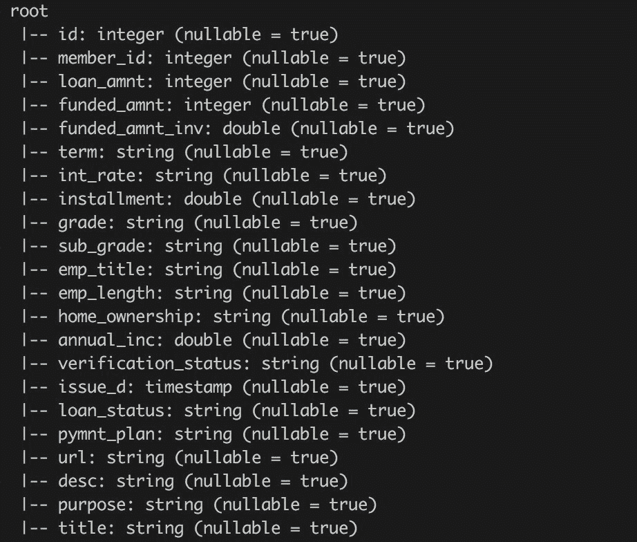

# 流转换

输入流发布了与 Spark DataSet 类似的接口；因此，它可以通过常规 SQL 接口或机器学习转换器进行转换。在我们的情况下，我们将重用在前几节中保存的所有训练模型和转换操作。

首先，我们将加载`empTitleTransformer`-它是一个常规的 Spark 管道转换器，可以借助 Spark 的`PipelineModel`类加载：

```scala
val empTitleTransformer = PipelineModel.load(s"${modelDir}/empTitleTransformer")
```

`loanStatus`和`intRate`模型以 H2O MOJO 格式保存。要加载它们，需要使用`MojoModel`类：

```scala
val loanStatusModel = MojoModel.load(new File(s"${modelDir}/loanStatusModel.mojo").getAbsolutePath)
val intRateModel = MojoModel.load(new File(s"${modelDir}/intRateModel.mojo").getAbsolutePath)
```

此时，我们已经准备好所有必要的工件；但是，我们不能直接使用 H2O MOJO 模型来转换 Spark 流。但是，我们可以将它们包装成 Spark transformer。我们已经在第四章中定义了一个名为 UDFTransfomer 的转换器，*使用 NLP 和 Spark Streaming 预测电影评论*，因此我们将遵循类似的模式：

```scala
class MojoTransformer(override val uid: String,
                       mojoModel: MojoModel) extends Transformer {

case class BinomialPrediction(p0: Double, p1: Double)
case class RegressionPrediction(value: Double)

implicit def toBinomialPrediction(bmp: AbstractPrediction) =
BinomialPrediction(bmp.asInstanceOf[BinomialModelPrediction].classProbabilities(0),
                        bmp.asInstanceOf[BinomialModelPrediction].classProbabilities(1))
implicit def toRegressionPrediction(rmp: AbstractPrediction) =
RegressionPrediction(rmp.asInstanceOf[RegressionModelPrediction].value)

val modelUdf = {
val epmw = new EasyPredictModelWrapper(mojoModel)
     mojoModel._category match {
case ModelCategory.Binomial =>udf[BinomialPrediction, Row] { r: Row => epmw.predict(rowToRowData(r)) }
case ModelCategory.Regression =>udf[RegressionPrediction, Row] { r: Row => epmw.predict(rowToRowData(r)) }
     }
   }

val predictStruct = mojoModel._category match {
case ModelCategory.Binomial =>StructField("p0", DoubleType)::StructField("p1", DoubleType)::Nil
case ModelCategory.Regression =>StructField("pred", DoubleType)::Nil
}

val outputCol = s"${uid}Prediction" override def transform(dataset: Dataset[_]): DataFrame = {
val inputSchema = dataset.schema
val args = inputSchema.fields.map(f => dataset(f.name))
     dataset.select(col("*"), modelUdf(struct(args: _*)).as(outputCol))
   }

private def rowToRowData(row: Row): RowData = new RowData {
     row.schema.fields.foreach(f => {
       row.getAsAnyRef match {
case v: Number => put(f.name, v.doubleValue().asInstanceOf[Object])
case v: java.sql.Timestamp => put(f.name, v.getTime.toDouble.asInstanceOf[Object])
case null =>// nop
case v => put(f.name, v)
       }
     })
   }

override def copy(extra: ParamMap): Transformer =  defaultCopy(extra)

override def transformSchema(schema: StructType): StructType =  {
val outputFields = schema.fields :+ StructField(outputCol, StructType(predictStruct), false)
     StructType(outputFields)
   }
 }
```

定义的`MojoTransformer`支持二项式和回归 MOJO 模型。它接受一个 Spark 数据集，并通过新列对其进行丰富：对于二项式模型，两列包含真/假概率，对于回归模型，一个列代表预测值。这体现在`transform`方法中，该方法使用 MOJO 包装器`modelUdf`来转换输入数据集：

dataset.select(*col*(**"*"**), *modelUdf*(*struct*(args: _*)).as(*outputCol*))

`modelUdf`模型实现了将数据表示为 Spark Row 转换为 MOJO 接受的格式，调用 MOJO 以及将 MOJO 预测转换为 Spark Row 格式的转换。

定义的`MojoTransformer`允许我们将加载的 MOJO 模型包装成 Spark transformer API：

```scala
val loanStatusTransformer = new MojoTransformer("loanStatus", loanStatusModel)
val intRateTransformer = new MojoTransformer("intRate", intRateModel)
```

此时，我们已经准备好所有必要的构建模块，并且可以将它们应用于输入流：

```scala
val outputDataStream =
   intRateTransformer.transform(
     loanStatusTransformer.transform(
       empTitleTransformer.transform(
         Chapter8Library.basicDataCleanup(inputDataStream))
         .withColumn("desc_denominating_words", descWordEncoderUdf(col("desc"))))
```

代码首先调用共享库函数`basicDataCleanup`，然后使用另一个共享库函数`descWordEncoderUdf`转换`desc`列：这两种情况都是基于 Spark DataSet SQL 接口实现的。其余步骤将应用定义的转换器。同样，我们可以探索转换后的流的结构，并验证它是否包含我们转换引入的字段：

```scala
outputDataStream.schema.printTreeString()
```

输出如下：

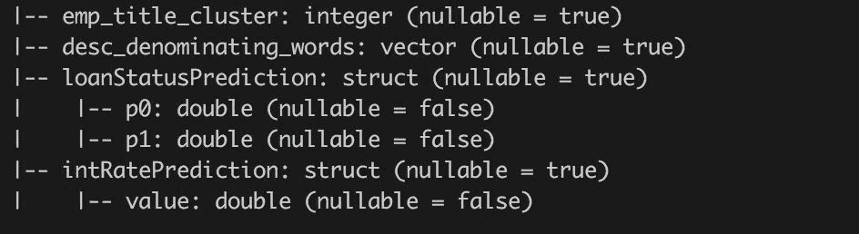

我们可以看到模式中有几个新字段：empTitle 集群的表示，命名词向量和模型预测。概率来自贷款状态模型，实际值来自利率模型。

# 流输出

Spark 为流提供了所谓的“输出接收器”。接收器定义了流如何以及在哪里写入；例如，作为 parquet 文件或作为内存表。但是，对于我们的应用程序，我们将简单地在控制台中显示流输出：

```scala
outputDataStream.writeStream.format("console").start().awaitTermination()
```

前面的代码直接启动了流处理，并等待应用程序终止。该应用程序简单地处理给定文件夹中的每个新文件（在我们的情况下，由环境变量`APPDATADIR`给出）。例如，给定一个包含五个贷款申请的文件，流会生成一个包含五个评分事件的表：

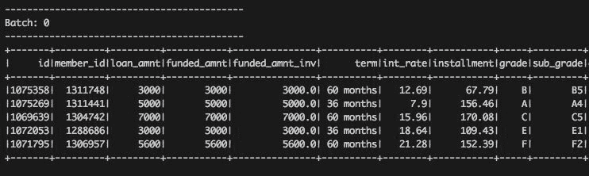

事件的重要部分由最后一列表示，其中包含预测值：

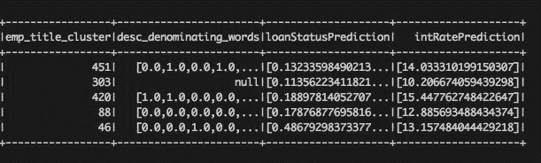

如果我们在文件夹中再写入一个包含单个贷款申请的文件，应用程序将显示另一个评分批次：

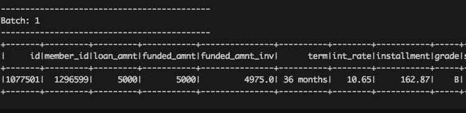

通过这种方式，我们可以部署训练模型和相应的数据处理操作，并让它们评分实际事件。当然，我们只是演示了一个简单的用例；实际情况会复杂得多，涉及适当的模型验证，当前使用模型的 A/B 测试，以及模型的存储和版本控制。

# 摘要

本章总结了整本书中你学到的一切，通过端到端的示例。我们分析了数据，对其进行了转换，进行了几次实验，以找出如何设置模型训练流程，并构建了模型。本章还强调了需要良好设计的代码，可以在多个项目中共享。在我们的示例中，我们创建了一个共享库，用于训练时和评分时使用。这在称为“模型部署”的关键操作上得到了证明，训练好的模型和相关工件被用来评分未知数据。

本章还将我们带到了书的结尾。我们的目标是要展示，用 Spark 解决机器学习挑战主要是关于对数据、参数、模型进行实验，调试数据/模型相关问题，编写可测试和可重用的代码，并通过获得令人惊讶的数据洞察和观察来获得乐趣。
