# 第一章. 将效果应用于图像

通常，图像包含的信息比任何特定任务所需的信息要多。因此，我们需要预处理图像，以便它们只包含应用程序所需的信息，从而减少所需的计算时间。

在本章中，我们将学习不同的预处理操作，具体如下：

+   模糊

+   去噪

+   锐化

+   腐蚀和膨胀

+   阈值和自适应阈值

在本章结束时，我们将看到如何将 OpenCV 集成到现有的 Android 应用程序中。

在我们查看各种特征检测算法及其实现之前，让我们首先构建一个基本的 Android 应用程序，我们将在此章中逐步添加特征检测算法。

# 开始使用

当我们看到一张图片时，我们将其感知为颜色和物体。然而，计算机视觉系统将其视为一个数字矩阵（见以下图片）。这些数字根据所使用的颜色模型被不同地解释。计算机不能直接在图像中检测模式或物体。计算机视觉系统的目标是解释这个数字矩阵为特定类型的物体。

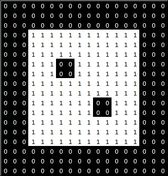

二值图像的表示

# 设置 OpenCV

OpenCV 是开源计算机视觉库的简称。它是使用最广泛的计算机视觉库。它是一组常用的函数，执行与计算机视觉相关的操作。OpenCV 是用 C/C++原生编写的，但提供了 Python、Java 以及任何 JVM 语言的包装器，这些包装器旨在创建 Java 字节码，例如 Scala 和 Clojure。由于大多数 Android 应用程序开发都是在 C++/Java 中进行的，因此 OpenCV 也被移植为 SDK，开发者可以使用它在其应用程序中实现，并使它们具有视觉功能。

现在，我们将看看如何开始设置 Android 平台的 OpenCV，并开始我们的旅程。我们将使用 Android Studio 作为我们的首选 IDE，但任何其他 IDE 经过轻微修改后也应该可以工作。按照以下步骤开始：

1.  从[`developer.android.com/sdk/`](https://developer.android.com/sdk/)下载 Android Studio，从[`sourceforge.net/projects/opencvlibrary/files/opencv-android/`](http://sourceforge.net/projects/opencvlibrary/files/opencv-android/)下载 OpenCV4Android SDK。

1.  将两个文件提取到已知位置。

1.  创建一个普通的 Android 项目，并将其命名为`FirstOpenCVApp`。导航到**文件** | **导入**。

1.  选择`OpenCV_SDK_location/sdk/java/`目录。

1.  导航到**构建** | **重建项目**。

1.  导航到**文件** | **项目结构**。

1.  通过在左侧列中选择**app**模块，将 OpenCV 模块添加到您的应用程序中。在依赖项选项卡中点击绿色按钮，最后选择 OpenCV 模块。

1.  现在，你已经准备好在你的 Android 项目中使用 OpenCV 了。它应该看起来像这样：

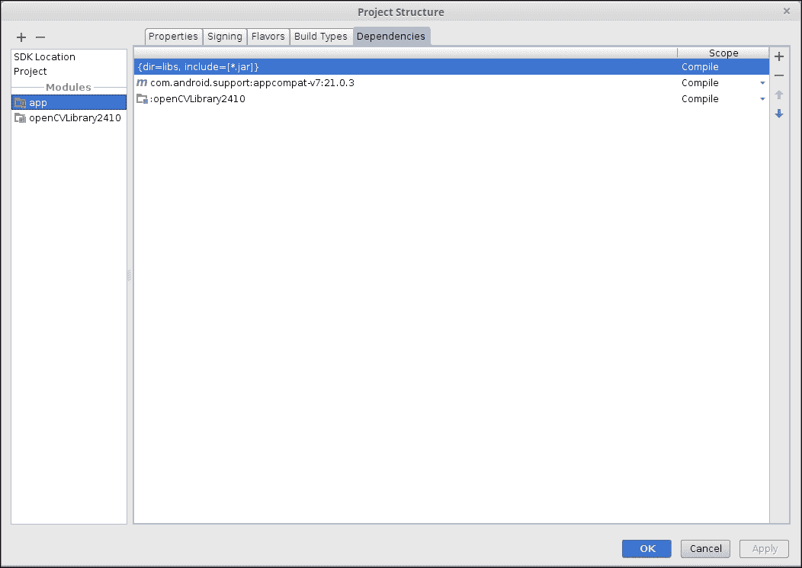

# OpenCV 中的图像存储

OpenCV 将图像存储为称为**Mat**的自定义对象。该对象存储有关行、列、数据等信息，这些信息可用于在需要时唯一识别和重新创建图像。不同的图像包含不同数量的数据。例如，彩色图像比相同图像的灰度版本包含更多的数据。这是因为使用 RGB 模型时，彩色图像是 3 通道图像，而灰度图像是 1 通道图像。以下图显示了如何存储 1 通道和多通道（此处为 RGB）图像（这些图像来自[docs.opencv.org](http://docs.opencv.org))：

图像的 1 通道表示如下：

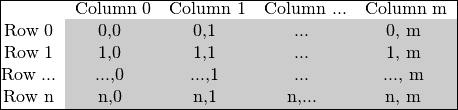

灰度（1 通道）图像表示：

图像的一种更详细的形式是 RGB 表示，如下所示：

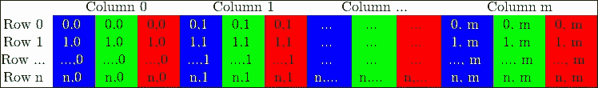

RGB（3 通道）图像表示

在灰度图像中，数字代表该特定颜色的强度。当使用整数表示时，它们在 0-255 的范围内表示，其中 0 是纯黑色，255 是纯白色。如果我们使用浮点表示，像素在 0-1 的范围内表示，其中 0 是纯黑色，1 是纯白色。在 OpenCV 中的 RGB 图像中，第一个通道对应蓝色，第二个通道对应绿色，第三个通道对应红色。因此，每个通道代表任何特定颜色的强度。正如我们所知，红色、绿色和蓝色是原色，它们可以以不同的比例组合以生成人类眼睛可见的任何颜色。以下图显示了不同颜色及其相应的整数格式下的 RGB 等效值：

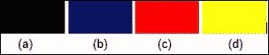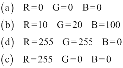

现在我们已经看到了图像在计算术语中的表示方式，我们将看到如何修改像素值，以便在执行实际任务时需要更少的计算时间。

# OpenCV 中的线性滤波器

我们都喜欢清晰的图像。谁不喜欢呢？然而，这里需要做出权衡。更多信息意味着图像在完成相同任务时需要比信息较少的图像更多的计算时间。因此，为了解决这个问题，我们应用模糊操作。

许多线性滤波算法都使用一个称为核的数字数组。核可以被视为一个滑动的窗口，它遍历每个像素并计算该像素的输出值。通过查看以下图示可以更清楚地理解这一点（此线性滤波/卷积图像取自[`test.virtual-labs.ac.in/labs/cse19/neigh/convolution.jpg`](http://test.virtual-labs.ac.in/labs/cse19/neigh/convolution.jpg)):

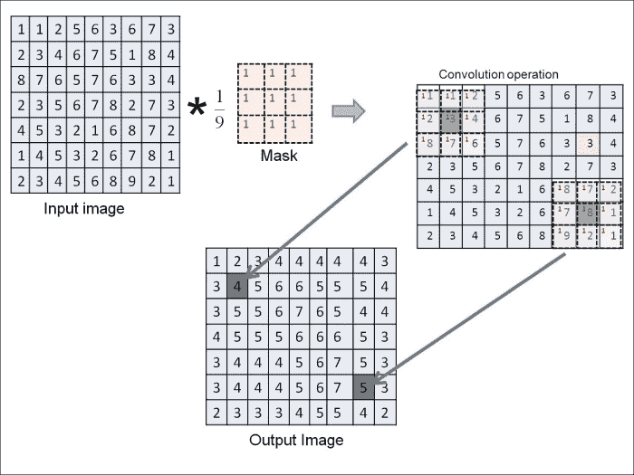

在前面的图中，一个 3 x 3 的核被应用于一个 10 x 10 的图像。

用于线性滤波的最通用操作之一是卷积。核中的值是对应像素乘法系数。最终结果存储在锚点，通常是核的中心：

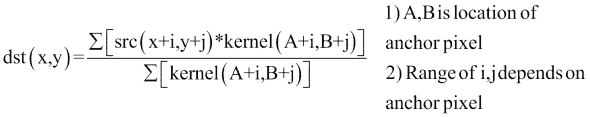

### 注意

线性滤波操作通常不是就地操作，因为对于每个像素，我们使用原始图像中的值，而不是修改后的值。

线性滤波最常见的一种用途是去除噪声。噪声是图像中亮度或颜色信息的随机变化。我们使用模糊操作来减少图像中的噪声。

## 均值模糊方法

均值滤波是最简单的模糊形式。它计算给定核覆盖的所有像素的平均值。用于此类操作的核是一个简单的 Mat，其所有值均为 1，即每个相邻像素具有相同的权重。

对于本章，我们将从图库中选择一张图片并应用相应的图像变换。为此，我们将添加基本代码。我们假设 OpenCV4Android SDK 已设置并正在运行。

我们可以使用本章开头创建的第一个 OpenCV 应用程序来完成本章的目的。在创建项目时，默认名称将如下所示：

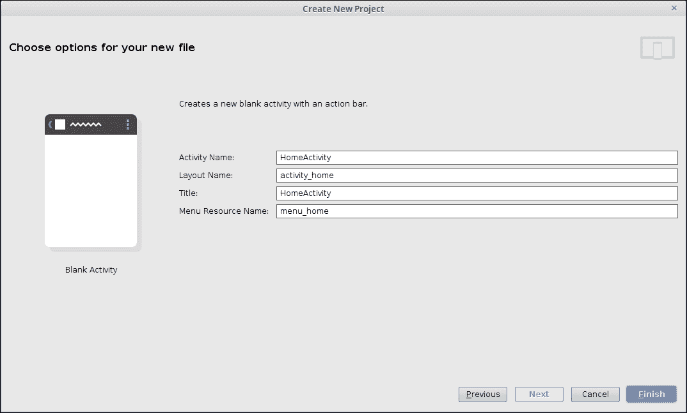

通过在 Java 文件夹上右键单击并导航到**新建** | **活动**来添加一个新的活动。然后，选择**空白活动**。将活动命名为`MainActivity.java`，XML 文件命名为`activity_main.xml`。转到`res/menu/menu_main.xml`。添加如下项：

```py
<item android:id="@+id/action_load_image"
        android:title="@string/action_load_image"
        android:orderInCategory="1"
        android:showAsAction="ifRoom" />
```

由于`MainActivity`是我们将用于执行 OpenCV 特定任务的活动，我们需要实例化 OpenCV。将其添加为`MainActivity.java`的全局成员：

```py
private BaseLoaderCallback mOpenCVCallBack = new BaseLoaderCallback(this) {
        @Override
        public void onManagerConnected(int status) {
            switch (status) {
                case LoaderCallbackInterface.SUCCESS:
                    //DO YOUR WORK/STUFF HERE
                    break;
                default:
                    super.onManagerConnected(status);
                    break;
            }
        }
    };
@Override
    protected void onResume() {
        super.onResume();
        OpenCVLoader.initAsync(OpenCVLoader.OPENCV_VERSION_2_4_10, this,
                mOpenCVCallBack);
    }
```

这是一个回调，它检查 OpenCV 管理器是否已安装。我们需要在设备上安装 OpenCV 管理器应用程序，因为它定义了所有 OpenCV 函数。如果我们不希望使用 OpenCV 管理器，我们可以将函数以本地方式提供，但这样 APK 的大小会显著增加。如果 OpenCV 管理器不存在，应用程序将重定向用户到 Play Store 下载它。`onResume`中的函数调用加载 OpenCV 以供使用。

接下来，我们将向`activity_home.xml`添加一个按钮：

```py
<Button
            android:id="@+id/bMean"
            android:layout_height="wrap_content"
            android:layout_width="wrap_content"
            android:text="Mean Blur" />
```

然后，在`HomeActivity.java`中，我们将实例化这个按钮，并为此按钮设置一个`onClickListener`：

```py
Button bMean = (Button)findViewById(R.id.bMean);
bMean.setOnClickListener(new View.OnClickListener() {
            @Override
            public void onClick(View v) {
                Intent i = new Intent(getApplicationContext(),MainActivity.class);
                i.putExtra("ACTION_MODE", MEAN_BLUR);
                startActivity(i);
            }
        });
```

### 小贴士

**下载示例代码**

您可以从[`www.packtpub.com`](http://www.packtpub.com)下载您购买的所有 Packt Publishing 书籍的示例代码文件。如果您在其他地方购买了这本书，您可以访问[`www.packtpub.com/support`](http://www.packtpub.com/support)并注册，以便将文件直接通过电子邮件发送给您。

在前面的代码中，`MEAN_BLUR`是一个值为`1`的常量，它指定了我们想要执行的操作类型。

在这里，我们在活动包中添加了额外的信息。这是为了区分我们将执行哪种操作。

打开`activity_main.xml`。将所有内容替换为以下代码片段。此片段添加了两个`ImageView`项目：一个用于原始图像，一个用于处理后的图像：

```py
<?xml version="1.0" encoding="utf-8"?>
<LinearLayout 
    android:orientation="vertical" 
    android:layout_width="match_parent"
    android:layout_height="match_parent">

    <ImageView
        android:layout_width="match_parent"
        android:layout_height="match_parent"
        android:layout_weight="0.5"
        android:id="@+id/ivImage" />

    <ImageView
        android:layout_width="match_parent"
        android:layout_height="match_parent"
        android:layout_weight="0.5"
        android:id="@+id/ivImageProcessed" />

</LinearLayout>
```

我们需要以编程方式将这些`ImageView`项目链接到我们的`MainActivity.java`中的`ImageView`项目：

```py
    private final int SELECT_PHOTO = 1;
    private ImageView ivImage, ivImageProcessed;
    Mat src;
    static int ACTION_MODE = 0;

    @Override
    protected void onCreate(Bundle savedInstanceState) {
// Android specific code
ivImage = (ImageView)findViewById(R.id.ivImage);
        ivImageProcessed = (ImageView)findViewById(R.id.ivImageProcessed);
        Intent intent = getIntent();

        if(intent.hasExtra("ACTION_MODE")){
            ACTION_MODE = intent.getIntExtra("ACTION_MODE", 0);
}
```

在这里，Mat 和 ImageView 已经被设置为类的全局变量，这样我们就可以在其他函数中使用它们，而无需将它们作为参数传递。我们将使用`ACTION_MODE`变量来识别要执行的操作。

现在，我们将添加从图库加载图像的代码。为此，我们将使用我们之前创建的菜单按钮。当您点击菜单按钮时，我们将加载`menu_main.xml`文件：

```py
@Override
    public boolean onCreateOptionsMenu(Menu menu) {
        getMenuInflater().inflate(R.menu.menu_main, menu);
        return true;
    }
```

然后，我们将添加一个监听器，当选择操作项时执行所需操作。我们将使用`Intent.ACTION_PICK`从图库中获取图像：

```py
    @Override
    public boolean onOptionsItemSelected(MenuItem item) {
        int id = item.getItemId();
        if (id == R.id.action_load_image) {
            Intent photoPickerIntent = new Intent(Intent.ACTION_PICK);
            photoPickerIntent.setType("image/*");
            startActivityForResult(photoPickerIntent, SELECT_PHOTO);
            return true;
        }
        return super.onOptionsItemSelected(item);
    }
```

如您所见，我们使用了`startActivityForResult()`。这将发送选定的图像到`onActivityResult()`。我们将使用这个方法来获取 Bitmap 并将其转换为 OpenCV Mat。一旦操作完成，我们希望从其他活动获取图像。为此，我们创建了一个新的函数`onActivityResult()`，当活动完成其工作并返回调用活动时会被调用。将以下代码添加到`onActivityResult()`中：

```py
        switch(requestCode) {
            case SELECT_PHOTO:
                if(resultCode == RESULT_OK){
                    try {
                        //Code to load image into a Bitmap and convert it to a Mat for processing.
            final Uri imageUri = imageReturnedIntent.getData();
            final InputStream imageStream = getContentResolver().openInputStream(imageUri);
            final Bitmap selectedImage = BitmapFactory.decodeStream(imageStream);
                src = new Mat(selectedImage.getHeight(), selectedImage.getWidth(), CvType.CV_8UC4);
                        Utils.bitmapToMat(selectedImage, src);

                        switch (ACTION_MODE){
                            //Add different cases here depending on the required operation
                        }
                            //Code to convert Mat to Bitmap to load in an ImageView. Also load original image in imageView

                   } catch (FileNotFoundException e) {
                        e.printStackTrace();
                   }
    }
            break;
  }
```

要对图像应用均值模糊，我们使用 OpenCV 提供的`blur()`函数。我们为此目的使用了一个 3 x 3 的核：

```py
case HomeActivity.MEAN_BLUR:
Imgproc.blur(src, src, new Size(3,3));
      break;
```

现在，我们将此图像设置在 ImageView 中，以查看操作的结果：

```py
Bitmap processedImage = Bitmap.createBitmap(src.cols(), src.rows(), Bitmap.Config.ARGB_8888);
Utils.matToBitmap(src, processedImage);
ivImage.setImageBitmap(selectedImage);
ivImageProcessed.setImageBitmap(processedImage);
```

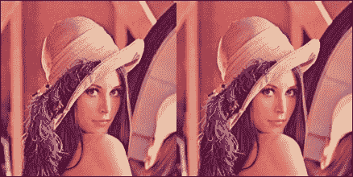

原始图像（左侧）和应用均值模糊后的图像（右侧）

## 高斯模糊方法

高斯模糊是最常用的模糊方法。高斯核是通过以下给出的高斯函数获得的：

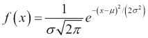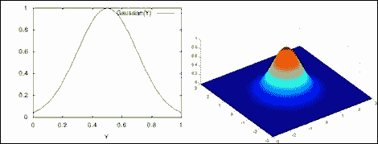

一维和二维的高斯函数

锚点像素被认为是位于（0，0）。正如我们所见，靠近锚点像素的像素比远离它的像素赋予更高的权重。这通常是理想的情况，因为附近的像素应该比远离的像素对特定像素的结果有更大的影响。以下图中显示了大小为 3、5 和 7 的高斯核（“高斯核”图像取自[`www1.adept.com/main/KE/DATA/ACE/AdeptSight_User/ImageProcessing_Operations.html`](http://www1.adept.com/main/KE/DATA/ACE/AdeptSight_User/ImageProcessing_Operations.html)）：

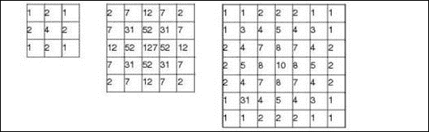

这些是大小为 3 x 3、5 x 5 和 7 x 7 的高斯核。

要在您的应用程序中使用高斯模糊，OpenCV 提供了一个名为**GaussianBlur**的内置函数。我们将使用此函数并得到以下结果图像。我们将向之前使用的相同 switch 块添加一个新情况。对于此代码，声明一个常量`GAUSSIAN_BLUR`，其值为 2：

```py
case HomeActivity.GAUSSIAN_BLUR:
    Imgproc.GaussianBlur(src, src, new Size(3,3), 0);
    break;
```

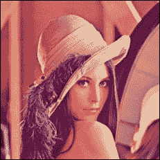

对原始图像应用高斯模糊后的图像

## 中值模糊方法

图像中常见的一种噪声类型被称为盐和胡椒噪声。在这种噪声中，稀疏出现的黑白像素分布在图像上。为了去除这种类型的噪声，我们使用中值模糊。在这种模糊中，我们按升序/降序排列我们的核覆盖的像素，并将中间元素的值设置为锚点像素的最终值。使用这种类型过滤的优势在于，盐和胡椒噪声是稀疏出现的，因此当平均它们的值时，其影响仅限于少数像素。因此，在更大的区域内，噪声像素的数量少于有用像素的数量，如下面的图像所示：

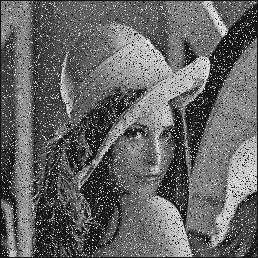

盐和胡椒噪声的示例

要在 OpenCV 中应用中值模糊，我们使用内置函数`medianBlur`。与之前的情况一样，我们必须添加一个按钮并添加`OnClickListener`函数。我们将为此操作添加另一个情况条件：

```py
case HomeActivity.MEDIAN_BLUR:
    Imgproc.medianBlur(src, src, 3);
    break;
```

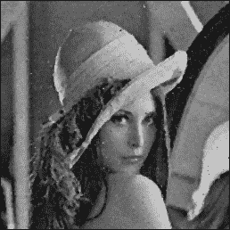

应用中值模糊后的结果图像

### 注意

中值模糊不使用卷积。

## 创建自定义核

我们已经看到了不同类型的核如何影响图像。如果我们想为 OpenCV 未原生提供的不同应用创建自己的核，会怎样呢？在本节中，我们将看到如何实现这一点。我们将尝试从给定的输入中形成更清晰的图像。

锐化可以被视为一种线性滤波操作，其中锚点像素具有高权重，而周围的像素具有低权重。满足此约束条件的核如下表所示：

| 0 | -1 | 0 |
| --- | --- | --- |
| -1 | 5 | -1 |
| 0 | -1 | 0 |

我们将使用此核对我们的图像进行卷积：

```py
case HomeActivity.SHARPEN:
    Mat kernel = new Mat(3,3,CvType.CV_16SC1); 
          kernel.put(0, 0, 0, -1, 0, -1, 5, -1, 0, -1, 0);
```

这里我们已将图像深度设置为 `16SC1`。这意味着我们的图像中的每个像素包含一个 16 位有符号整数（16S），并且图像有 1 个通道（C1）。

现在我们将使用 `filter2D()` 函数，该函数在给定输入图像和核时执行实际的卷积。我们将在 ImageView 中显示图像。我们将在之前创建的 switch 块中添加另一个情况：

```py
    Imgproc.filter2D(src, src, src.depth(), kernel);
```

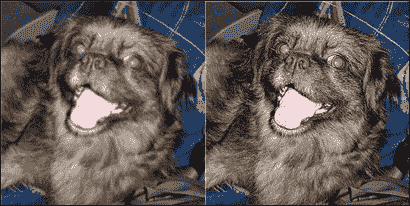

原始图像（左）和锐化图像（右）

## 形态学操作

形态学操作是一组基于图像特征和结构元素的图像处理操作。这些操作通常在二值或灰度图像上工作。在继续探讨更高级的形态学操作之前，我们将先看看一些基本的形态学操作。

### 膨胀

膨胀是一种通过扩展图像的亮区来实现的操作。为了实现这一点，我们取一个所需大小的核，并用核重叠的最大值替换锚点像素。膨胀可以用来合并可能已经断裂的对象。

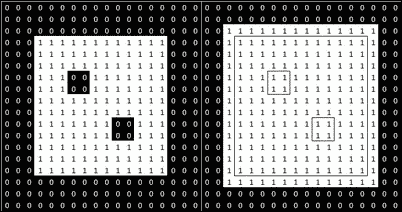

二值图像（左）和应用膨胀操作后的结果（右）

要应用此操作，我们使用 `dilate()` 函数。我们需要使用一个核来进行膨胀。我们使用 `getStructuringElement()` OpenCV 函数来获取所需的核。

OpenCV 提供 `MORPH_RECT`、`MORPH_CROSS` 和 `MORPH_ELLIPSE` 作为创建所需核的选项：

```py
case HomeActivity.DILATE:
    Mat kernelDilate = Imgproc.getStructuringElement(Imgproc.MORPH_RECT, new Size(3, 3));
    Imgproc.dilate(src, src, kernelDilate);
    break;
```

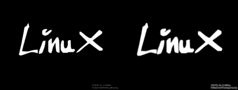

原始图像（左）和膨胀图像（右）

如果我们使用矩形结构元素，图像将呈矩形增长。同样，如果我们使用椭圆形结构元素，图像将呈椭圆形增长。

### 腐蚀

同样，腐蚀是一种通过扩展图像的暗区来实现的操作。为了实现这一点，我们取一个所需大小的核，并用核重叠的最小值替换锚点像素。腐蚀可以用来从图像中去除噪声。

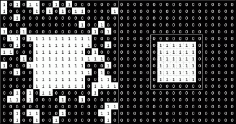

二值图像（左）和应用腐蚀操作后的结果（右）

要应用此操作，我们使用 `erode()` 函数：

```py
case HomeActivity.ERODE:
    Mat kernelErode = Imgproc.getStructuringElement(Imgproc.MORPH_ELLIPSE, new Size(5, 5));
    Imgproc.erode(src, src, kernelErode);
         break;
```

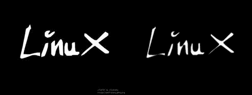

原始图像（左）和腐蚀图像（右）

### 注意

腐蚀和膨胀不是逆操作。

## 阈值化

阈值化是将我们希望分析的图像部分分割出来的方法。每个像素的值与预定义的阈值值进行比较，并根据此结果修改像素的值。OpenCV 提供了五种类型的阈值化操作。

要执行阈值化，我们将使用以下代码作为模板，并根据所需的阈值化类型更改参数。我们需要将 `THRESH_CONSTANT` 替换为所需的阈值化方法的常数：

```py
case HomeActivity.THRESHOLD:
    Imgproc.threshold(src, src, 100, 255, Imgproc.THRESH_CONSTANT);
    break;
```

在这里，`100` 是阈值值，`255` 是最大值（纯白色的值）。

常数列在以下表中：

| 阈值方法名称 | 阈值函数 | 常数 |
| --- | --- | --- |
| 二值阈值 | 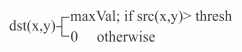 | `THRESH_BINARY` |
| 阈值置零 |  | `THRESH_TOZERO` |
| 截断 | 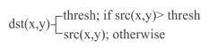 | `THRESH_TRUNC` |
| 二值阈值，反转 | 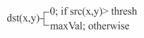 | `THRESH_BINARY_INV` |
| 阈值置零，反转 | 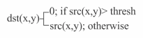 | `THRESH_TOZERO_INV` |

以下用于阈值结果的图像取自[`docs.opencv.org/trunk/d7/d4d/tutorial_py_thresholding.html`](http://docs.opencv.org/trunk/d7/d4d/tutorial_py_thresholding.html):

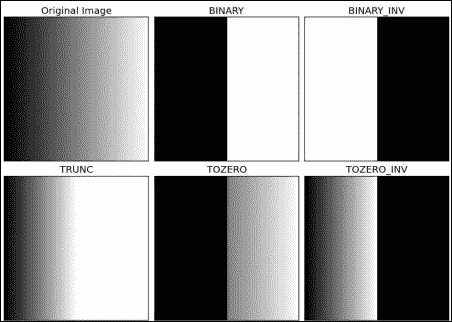

## 自适应阈值

在进行分割时设置全局阈值值可能不是最佳选择。光照条件影响像素的强度。因此，为了克服这一限制，我们将尝试根据每个像素的相邻像素计算阈值值。

我们将使用三个参数来计算图像的自适应阈值：

1.  **自适应方法**：以下是我们将使用的两种方法：

    +   `ADAPTIVE_THRESH_MEAN_C`: 阈值值是相邻像素的平均值

    +   `ADAPTIVE_THRESH_GAUSSIAN_C`: 阈值值是相邻像素值的加权总和，其中权重是高斯核

1.  **块大小**：这是邻域的大小

1.  **C**：这是从每个像素计算出的均值/加权均值中减去的常数：

    ```py
    case HomeActivity.ADAPTIVE_THRESHOLD:
        Imgproc.cvtColor(src, src, Imgproc.COLOR_BGR2GRAY);
        Imgproc.adaptiveThreshold(src, src, 255, Imgproc.ADAPTIVE_THRESH_GAUSSIAN_C, Imgproc.THRESH_BINARY, 3, 0);
        break;
    ```

    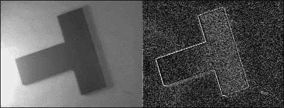

    原始图像（左）和应用自适应阈值后的图像（右）

在这里，结果图像中存在很多噪声。这可以通过在应用自适应阈值之前应用模糊操作来避免，以平滑图像。

# 摘要

在本章中，我们学习了如何在 Android 项目中开始使用 OpenCV。然后我们探讨了图像处理中的不同过滤器，特别是线性过滤器，以及它们如何在 Android 设备上实现。这些过滤器将构成您尝试构建的任何计算机视觉应用的基础。在接下来的章节中，我们将探讨更复杂的图像过滤器，并了解如何从图像中提取边缘、角点等信息。
