# 第三章. 检测对象

计算机视觉的一个常见应用是在图像或视频中检测对象。例如，我们可以使用这种方法在许多书籍中检测特定的书籍。检测对象的一种方法是**特征匹配**。在本章中，我们将学习以下主题：

+   什么是特征？

+   图像中的特征检测、描述和匹配

+   SIFT 检测器和描述符

+   SURF 检测器和描述符

+   ORB 检测器和描述符

+   BRISK 检测器和描述符

+   FREAK 描述符

# 什么是特征？

特征是独特且易于追踪和比较的特定模式。好的特征是可以明显定位的。以下图像显示了不同类型的特征：

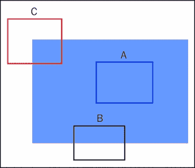

解释特征类型

在前面的图像中，补丁 A 是一个平坦区域，难以精确定位。如果我们把矩形移动到框内的任何地方，补丁内容保持不变。补丁 B 沿着边缘，是一个稍微好一些的特征，因为如果你垂直于边缘移动它，它会改变。然而，如果你平行于边缘移动它，它就与初始补丁相同。因此，我们可以在至少一个维度上定位这类特征。补丁 C 是一个角，是一个好的特征，因为无论你将矩形向哪个方向移动，补丁的内容都会改变，并且可以很容易地定位。因此，好的特征是那些可以很容易定位的，因此也容易追踪。

在前面的章节中，我们看到了一些边缘和角点检测算法。在本章中，我们将探讨一些更多可以通过它们找到特征的算法。这被称为**特征检测**。仅仅检测特征是不够的。我们需要能够区分不同的特征。因此，我们使用**特征描述**来描述检测到的特征。这些描述使我们能够在其他图像中找到相似的特征，从而使我们能够识别物体。特征也可以用来对齐图像并将它们拼接在一起。我们将在本书的后续章节中探讨这些应用。

现在我们将探讨一些常见的检测特征的算法，例如 SIFT、SURF、BRIEF、FAST 和 BRISK。

### 注意

注意，SIFT 和 SURF 是专利算法，因此它们的免费使用仅限于学术和研究目的。对于这些算法的任何商业用途，您需要遵守专利规则和法规，或者与相关人员联系。

# 尺度不变特征变换

**尺度不变特征变换**（**SIFT**）是最广泛认可的特征检测算法之一。它由 David Lowe 于 2004 年提出。

### 注意

论文链接：[`www.cs.ubc.ca/~lowe/papers/ijcv04.pdf`](http://www.cs.ubc.ca/~lowe/papers/ijcv04.pdf)

SIFT 的一些特性如下：

+   它对物体缩放和旋转变化具有不变性

+   它对 3D 视点和光照变化也有部分不变性

+   可以从一个单独的图像中提取大量关键点（特征）

## 理解 SIFT 的工作原理

SIFT 遵循匹配鲁棒局部特征的战略。它分为四个部分：

+   尺度空间极值检测

+   关键点定位

+   方向分配

+   关键点描述符

### 尺度空间极值检测

在这个步骤中，通过高斯模糊逐步模糊图像以去除图像中的某些细节。在合理的假设下，已经从数学上证明（进行高斯模糊是唯一有效执行此操作的方法）。

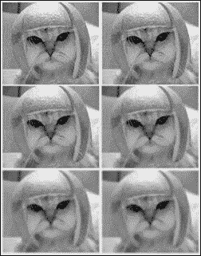

一个八度的图像

逐步模糊的图像构成一个八度。通过将前一个八度的原始图像大小减半然后逐步模糊它来形成一个新的八度。Lowe 建议您使用每个八度五幅图像的最佳结果。

因此，我们看到第一个八度的图像是通过逐步模糊原始图像形成的。第二个八度的第一幅图像是通过调整第一个八度中原始图像的大小获得的。第二个八度中的其他图像是通过逐步模糊第二个八度的第一幅图像形成的，依此类推。

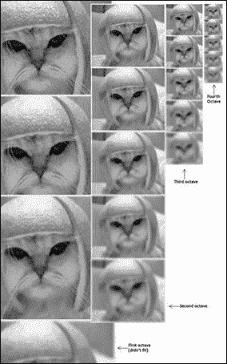

所有八度的图像

为了精确检测图像中的边缘，我们使用拉普拉斯算子。在这个方法中，首先稍微模糊图像，然后计算其二阶导数。这定位了边缘和角落，这对于找到关键点是很有帮助的。这个操作被称为高斯拉普拉斯。

二阶导数对噪声极其敏感。模糊有助于平滑噪声并稳定二阶导数。问题是计算所有这些二阶导数在计算上非常昂贵。因此，我们稍微作弊一下：

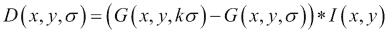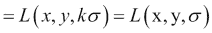

在这里，*k*是一个常数乘法因子，它表示尺度空间中每个图像的模糊量。尺度空间表示为了计算关键点而放大或缩小的一组图像。例如，如图所示，有两组图像：一组是经过不同模糊半径模糊的五幅原始图像，另一组是缩小后的图像。不同的参数值可以在下表中看到：

|   | 尺度 |   |   |   |   |
| --- | --- | --- | --- | --- | --- |
| **八度** | 0.707107 | 1.000000 | 1.414214 | 2.000000 | 2.828427 |
|   | 1.414214 | 2.000000 | 2.828427 | 4.000000 | 5.656854 |
|   | 2.828427 | 4.000000 | 5.656854 | 8.000000 | 11.313708 |
|   | 5.656854 | 8.000000 | 11.313708 | 16.000000 | 22.627417 |

为了生成高斯拉普拉斯图像，我们在八度音阶中计算连续两幅图像之间的差异。这被称为**高斯差分**（**DoG**）。这些 DoG 图像大约等于通过计算高斯拉普拉斯得到的图像。使用 DoG 还有额外的优点。得到的图像也是尺度不变的。

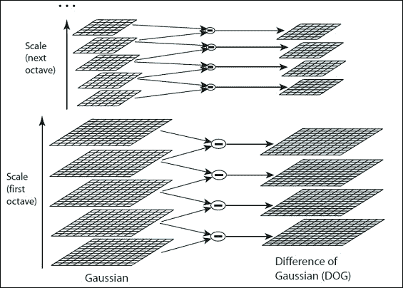

高斯差分

使用高斯拉普拉斯不仅计算量大，而且依赖于应用模糊的程度。由于归一化的结果，这在 DoG 图像中得到了处理。

### 关键点定位

现在这些图像已经足够预处理，使我们能够找到局部极值。为了定位关键点，我们需要遍历每个像素，并将其与其所有邻居进行比较。我们不仅比较该图像中的八个邻居，还比较该像素在该图像中的值以及在该八度音阶上下方的图像中的值，这些图像各有九个像素：

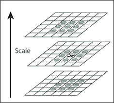

关键点定位

因此，我们可以看到我们比较了一个像素的值与其**26 个邻居**。如果一个像素是其 26 个邻居中的最小值或最大值，则它是一个关键点。通常，非极大值或非极小值不需要进行所有 26 次比较，因为我们可能在几次比较中就找到了结果。

我们在八度音阶中最顶层和最底层图像中不计算关键点，因为我们没有足够的邻居来识别极值。

大多数情况下，极值永远不会位于确切的像素上。它们可能存在于像素之间，但我们无法在图像中访问这些信息。定位到的关键点是它们的平均位置。我们使用尺度空间函数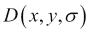的泰勒级数展开（到二次项）并平移到当前点作为原点，得到：

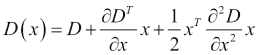

在这里，*D*及其导数是在我们当前测试极值的点上计算的。使用这个公式，通过微分并将结果等于零，我们可以轻松找到亚像素关键点位置：

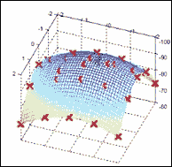

亚像素极值定位

SIFT 建议生成两个这样的极值图像。因此，为了生成两个极值，我们需要四个 DoG 图像。为了生成这四个 DoG 图像，我们需要五个高斯模糊图像。因此，我们需要一个八度音阶中的五个图像。还发现，当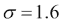和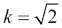时，可以获得最佳结果。

到目前为止，定位的关键点数量相当高。其中一些关键点要么位于边缘上，要么对比度不足，对我们来说没有用处。因此，我们需要去除这些关键点。这种方法与**哈里斯角检测器**中用于去除边缘的方法类似。

为了去除低对比度的关键点，我们只需将当前像素的强度值与预先选择的阈值值进行比较。如果它小于阈值值，则被拒绝。因为我们已经使用了亚像素关键点，所以我们再次需要使用泰勒级数展开来获取亚像素位置的强度值。

为了稳定性，仅仅拒绝低对比度的关键点是不够的。DoG 函数会在边缘处产生强烈的响应，即使边缘的位置确定得不好，因此对噪声的稳定性较差。

为了消除边缘上的关键点，我们在关键点处计算两个相互垂直的梯度。关键点周围区域可以是以下三种类型之一：

+   一个平坦区域（两个梯度都会很小）

+   一个边缘（在这里，与边缘平行的梯度会很小，但垂直于它的梯度会很大）

+   一个角（两个梯度都会很大）

因为我们只想将角作为我们的关键点，所以我们只接受那些两个梯度值都很高的关键点。

为了计算这个，我们使用**海森矩阵**。这与哈里斯角检测器类似。在哈里斯角检测器中，我们计算两个不同的特征值，而在 SIFT 中，我们通过直接计算它们的比率来节省计算。海森矩阵如下所示：

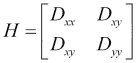

### 方向分配

到目前为止，我们已经有了稳定的关键点，并且我们知道这些关键点是在哪些尺度上被检测到的。因此，我们具有尺度不变性。现在我们尝试为每个关键点分配一个方向。这个方向帮助我们实现旋转不变性。

我们尝试计算每个关键点的高斯模糊图像的幅度和方向。这些幅度和方向是使用以下公式计算的：

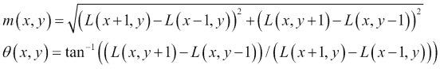

我们计算关键点周围所有像素的幅度和方向。我们创建一个覆盖 360 度方向范围的 36 个桶直方图。添加到直方图中的每个样本都由其梯度幅度和一个以σ为宽度的高斯加权圆形窗口加权，σ是关键点尺度的 1.5 倍。假设你得到一个如图所示的直方图：

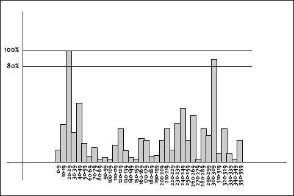

在对特定关键点的所有相邻像素完成此操作后，我们将在直方图中得到一个峰值。在先前的图中，我们可以看到直方图在**20-29**的区域达到峰值。因此，我们将这个方向分配给关键点。此外，任何超过**80%**值的峰值也被转换为关键点。这些新关键点与原始关键点具有相同的位置和比例，但其方向被分配给对应于新峰值的值。

### 关键点描述符

到目前为止，我们已经实现了缩放和旋转不变性。现在我们需要为各种关键点创建一个描述符，以便能够将其与其他关键点区分开来。

为了生成一个描述符，我们在关键点周围取一个 16x16 的窗口，并将其分成 16 个 4x4 大小的窗口。这可以在以下图像中看到：

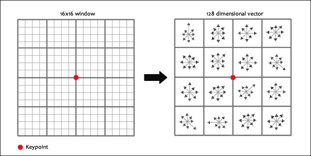

我们这样做是为了考虑到两个图像中的对象很少是完全相同的。因此，我们在计算中尝试牺牲一些精度。在每个 4x4 窗口内，计算梯度幅度和方向。这些方向被放入一个 8 个分箱的直方图中。每个分箱代表 45 度的方向角。

现在我们有了一个较大的区域需要考虑，我们需要考虑从关键点到向量的距离。为了实现这一点，我们使用高斯加权函数：

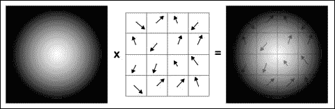

我们将 16 个向量放入每个 8 个分箱的直方图中，并对每个 4x4 窗口进行此操作，我们得到 4x4x8 = 128 个数字。一旦我们有了所有这些 128 个数字，我们就对这些数字进行归一化（通过将每个数字除以它们的平方和）。这组 128 个归一化数字形成了特征向量。

通过引入特征向量，会产生一些不希望的依赖关系，如下所示：

+   **旋转依赖性**：特征向量使用梯度方向。因此，如果我们旋转图像，我们的特征向量会改变，梯度方向也会受到影响。为了实现旋转不变性，我们从每个方向中减去关键点的旋转。因此，每个梯度方向现在相对于关键点的方向。

+   **光照依赖性**：通过在特征向量中设置大值阈值，可以实现光照独立性。因此，任何大于 0.2 的值都被改变为 0.2，并且结果特征向量再次进行归一化。我们现在已经获得了一个光照独立特征向量。

既然我们已经从理论上了解了 SIFT 是如何工作的，让我们看看它在 OpenCV 中是如何工作的以及它匹配对象的能力。

### 注意

您可以在[`www.aishack.in/`](http://www.aishack.in/)找到 Utkarsh Sinha 对 SIFT 的图像和简化解释。

## OpenCV 中的 SIFT

我们将设置一个新的应用程序，名为`Chapter3`，它类似于前面章节中创建的应用程序。我们将对`MainActivity.java`进行修改。还需要对`HomeActivity.java`进行一些修改，但它们将是自解释的。

首先，我们打开`res` | `main_menu.xml`文件。在这个文件中，我们将创建两个条目。一个用于选择要匹配的每一张图像。按照惯例，我们将第一张图像作为要检测的对象，第二张图像作为我们想要在其中检测它的场景：

```py
<menu 

    tools:context="com.packtpub.masteringopencvandroid.chapter3.MainActivity">
    <item android:id="@+id/action_load_first_image"
        android:title="@string/action_load_first_image"
        android:orderInCategory="1"
        android:showAsAction="never" />
    <item android:id="@+id/action_load_second_image"
        android:title="@string/action_load_second_image"
        android:orderInCategory="2"
        android:showAsAction="never" />
</menu>
```

现在，我们需要将这些项目编程到我们的 Java 代码中。这类似于第一章，*对图像应用效果*，在那里我们使用意图打开了照片选择器。我们将有两个标志变量，将存储每个已选的图像。如果它被选中，我们将执行我们的计算。

我们将在`AsyncTask`中执行我们的实际计算，因为这些任务计算量很大；为了避免长时间阻塞 UI 线程，我们将计算卸载到异步后台工作线程——`AsyncTasks`，它使我们能够执行多线程：

```py
new AsyncTask<Void, Void, Bitmap>() {
    private long startTime, endTime;
    @Override
    protected void onPreExecute() {
        super.onPreExecute();
        startTime = System.currentTimeMillis();
    }

    @Override
    protected Bitmap doInBackground(Void... params) {
        return executeTask();
    }

    @Override
    protected void onPostExecute(Bitmap bitmap) {
        super.onPostExecute(bitmap);
        endTime = System.currentTimeMillis();
        ivImage1.setImageBitmap(bitmap);
        tvKeyPointsObject1.setText("Object 1 : "+keypointsObject1);
        tvKeyPointsObject2.setText("Object 2 : "+keypointsObject2);
        tvKeyPointsMatches.setText("Keypoint Matches : "+keypointMatches);
        tvTime.setText("Time taken : "+(endTime-startTime)+" ms");
    }
}.execute();
```

在这里，已经调用了`executeTask`函数，它将执行所有我们的计算。首先，我们需要检测关键点，然后我们需要使用描述符来描述它们。

我们首先声明所有变量：

```py
FeatureDetector detector;
MatOfKeyPoint keypoints1, keypoints2;
DescriptorExtractor descriptorExtractor;
Mat descriptors1, descriptors2;
```

然后，根据算法，我们初始化这些变量。对于 SIFT，我们使用以下代码片段：

```py
switch (ACTION_MODE){
        case HomeActivity.MODE_SIFT:
                detector = FeatureDetector.create(FeatureDetector.SIFT);
                descriptorExtractor = DescriptorExtractor.create(DescriptorExtractor.SIFT);
                //Add SIFT specific code
                break;
        //Add cases for other algorithms
}
```

现在我们检测关键点：

```py
detector.detect(src2, keypoints2);
detector.detect(src1, keypoints1);
keypointsObject1 = keypoints1.toArray().length; //These have been added to display the number of keypoints later.
keypointsObject2 = keypoints2.toArray().length;
```

现在我们有了关键点，我们将计算它们的描述符：

```py
descriptorExtractor.compute(src1, keypoints1, descriptors1);
descriptorExtractor.compute(src2, keypoints2, descriptors2);
```

# 匹配特征和检测对象

一旦我们在两个或更多对象中检测到特征，并且有它们的描述符，我们就可以匹配特征以检查图像是否有任何相似性。例如，假设我们想在许多书籍堆中搜索一本书。OpenCV 为我们提供了两种特征匹配算法：

+   暴力匹配器

+   基于 FLANN 的匹配器

我们将在以下章节中看到这两个是如何工作的。

对于匹配，我们首先需要声明一些变量：

```py
DescriptorMatcher descriptorMatcher;
MatOfDMatch matches = new MatOfDMatch();
```

## 暴力匹配器

它将第一组中的一个特征的描述符与第二组中的所有其他特征进行匹配，使用距离计算，并返回最近的那个。

BF 匹配器有两个可选参数。第一个是距离测量类型，`normType`。对于 SIFT 和 SURF 等描述符，我们应该使用`NORM_L2`。对于基于二进制字符串的描述符，如 ORB 和 BRISK，我们使用`NORM_HAMMING`作为距离测量。第二个是`crosscheck`。如果设置为 true，匹配器只返回具有值（i，j）的匹配，其中第一张图像中的第 i 个描述符与第二组中的第 j 个描述符是最佳匹配，反之亦然。

在我们的 SIFT 案例中，我们添加以下代码：

```py
descriptorMatcher = DescriptorMatcher.create(DescriptorMatcher.BRUTEFORCE_SL2);
```

## 基于 FLANN 的匹配器

**FLANN**代表**快速近似最近邻库**。它包含了一组针对在大数据集和高维特征中进行快速最近邻搜索优化的算法。对于大数据集，它比 BF 匹配器运行得更快。

对于基于 FLANN 的匹配器，我们需要传递两个字典，这些字典指定了要使用的算法、相关参数等。第一个是`IndexParams`。对于不同的算法，要传递的信息在 FLANN 文档中有解释。

第二个字典是`SearchParams`。它指定了索引中树应该递归遍历的次数。更高的值会提供更好的精度，但也会花费更多的时间。

要使用基于 FLANN 的匹配器，我们需要按照以下方式初始化它：

```py
descriptorMatcher = DescriptorMatcher.create(DescriptorMatcher.FLANNBASED);
```

## 匹配点

一旦我们有了`DescriptorMatcher`对象，我们就使用`match()`和`knnMatch()`函数。第一个函数返回所有匹配项，而第二个函数返回用户定义的*k*个匹配项。

在我们计算了描述符之后，我们可以使用以下方法来匹配关键点：

```py
descriptorMatcher.match(descriptors1, descriptors2, matches);1
```

现在我们展示使用`drawMatches()`获得的匹配项，这有助于我们绘制匹配项。它将两个图像水平堆叠，并从第一幅图像到第二幅图像绘制线条，显示最佳匹配。还有一个`drawMatchesKnn()`函数，它绘制所有*k*个最佳匹配。如果*k = 2*，它将为每个关键点绘制两条匹配线。因此，如果我们想选择性地绘制它，我们必须传递一个掩码。

为了绘制匹配项，我们将添加一个函数，该函数将查询图像和训练图像合并到一张图中，并在同一张图中显示匹配项：

```py
static Mat drawMatches(Mat img1, MatOfKeyPoint key1, Mat img2, MatOfKeyPoint key2, MatOfDMatch matches, boolean imageOnly){
        Mat out = new Mat();
        Mat im1 = new Mat();
        Mat im2 = new Mat();
        Imgproc.cvtColor(img1, im1, Imgproc.COLOR_BGR2RGB);
        Imgproc.cvtColor(img2, im2, Imgproc.COLOR_BGR2RGB);
        if (imageOnly){
            MatOfDMatch emptyMatch = new MatOfDMatch();
            MatOfKeyPoint emptyKey1 = new MatOfKeyPoint();
            MatOfKeyPoint emptyKey2 = new MatOfKeyPoint();
            Features2d.drawMatches(im1, emptyKey1, im2, emptyKey2, emptyMatch, out);
        } else {
            Features2d.drawMatches(im1, key1, im2, key2, matches, out);
        }
        Bitmap bmp = Bitmap.createBitmap(out.cols(), out.rows(), Bitmap.Config.ARGB_8888);
        Imgproc.cvtColor(out, out, Imgproc.COLOR_BGR2RGB);
        Core.putText(out, "FRAME", new Point(img1.width() / 2,30), Core.FONT_HERSHEY_PLAIN, 2, new Scalar(0,255,255),3);
        Core.putText(out, "MATCHED", new Point(img1.width() + img2.width() / 2,30), Core.FONT_HERSHEY_PLAIN, 2, new Scalar(255,0,0),3);
        return out;
    }
```

由于 SIFT 和 SURF 是受专利保护的算法，它们不是由 OpenCV 自动构建的。我们需要手动构建`nonfree`模块，以便能够在 OpenCV 中使用它们。为此，您需要下载 Android NDK，它允许我们与 Java 代码一起使用原生 C++代码。它可在[`developer.android.com/tools/sdk/ndk/index.html`](https://developer.android.com/tools/sdk/ndk/index.html)找到。然后，将其提取到合适的位置。

首先，您需要从 OpenCV 的源代码库下载一些文件，该库位于[`github.com/Itseez/opencv/tree/master/modules`](https://github.com/Itseez/opencv/tree/master/modules)。这些是`nonfree_init.cpp`、`precomp.cpp`、`sift.cpp`和`surf.cpp`。这些文件也将与本章的代码一起提供，因此您也可以直接从那里下载它们。现在，在您的`src`目录中创建一个名为`jni`的文件夹，并将这些文件复制到那里。我们需要对这些文件进行一些修改。

打开`precomp.hpp`并删除`#include "cvconfig.h"`和`#include "opencv2/ocl/private/util.hpp"`这两行代码。

打开`nonfree_init.cpp`并删除从`#ifdef HAVE_OPENCV_OCL`开始到`#endif`结束的代码行。

现在我们将创建一个名为`Android.mk`的文件，并将以下代码行复制到其中。您需要相应地替换`<OpenCV4Android_SDK_location>`：

```py
LOCAL_PATH := $(call my-dir)

include $(CLEAR_VARS)

OPENCV_CAMERA_MODULES:=on
OPENCV_INSTALL_MODULES:=on

include <OpenCV4Android_SDK_location>/sdk/native/jni/OpenCV.mk

LOCAL_MODULE    := nonfree
LOCAL_SRC_FILES := nonfree_init.cpp \
sift.cpp \
surf.cpp
LOCAL_LDLIBS +=  -llog -ldl
include $(BUILD_SHARED_LIBRARY)
```

接下来，创建一个名为`Application.mk`的文件，并将以下代码行复制到其中。这些定义了我们的库将要构建的架构：

```py
APP_STL := gnustl_static
APP_CPPFLAGS := -frtti -fexceptions
APP_ABI := armeabi-v7a
APP_PLATFORM := android-8
```

在你的 `app` 文件夹中打开 `build.gradle` 文件。在 `android` 部分下，添加以下内容：

```py
sourceSets.main {
    jniLibs.srcDir 'src/main/libs'
    jni.srcDirs = [] //disable automatic ndk-build call
}
```

如果你在 Windows 上，请打开一个终端或命令窗口。然后，使用 `cd` 命令将目录更改为你的项目。在命令窗口中输入以下内容：

```py
cd <project_directory>/app/src/main/jni

```

在终端窗口中，输入以下内容，将 `<ndk_dir>` 替换为适当的目录位置：

```py
<ndk_dir>/ndk-build

```

之后，我们的库应该已经成功构建，并且应该可以在 `src` | `obj` 文件夹下，在正确的架构中找到。

现在，我们需要从我们的 Java 代码中加载这个库。打开 `MainActivity.java`，在我们的 OpenCV Manager 的回调变量（`mOpenCVCallback` 文件的 `onManagerConnected` 函数）中，在 `LoaderCallbackInterface.SUCCESS` 的情况下添加以下代码行：

```py
System.loadLibrary("nonfree");
```

库的名称 `nonfree` 与 `Android.mk` 文件中定义的模块名称相同。


SIFT 特征匹配

## 检测对象

在前面的章节中，我们在多张图像中检测特征并将它们与另一张图像中相应的特征匹配。我们获得的信息足以在场景中定位对象。

我们使用 OpenCV 的 `calib3d` 模块中的函数 `findHomography()`。使用此函数，我们可以找到对象的透视变换，即旋转和倾斜的结果。然后我们使用 `perspectiveTransform()` 在场景中定位对象。我们需要至少四个匹配点才能成功计算变换。

我们已经看到在匹配过程中可能会出现一些可能的错误，这可能会影响结果。为了解决这个问题，算法使用 `RANSAC` 或 `LEAST_MEDIAN`（可以通过标志指定）。提供正确估计的匹配称为内点，其余的称为外点。`findHomography()` 返回一个掩码，指定内点和外点。

现在，我们将查看实现该算法的算法。

首先，我们在两幅图像中检测和匹配关键点。这已经在前面的章节中完成。然后，我们设定一个条件，必须有一定数量的匹配才能检测到对象。

如果找到足够的匹配，我们将从两幅图像中提取匹配关键点的位置。它们被传递以找到透视变换。一旦我们得到这个 3x3 的变换矩阵，我们就用它将 `queryImage` 的角点变换到 `trainImage` 中相应的点。然后，我们绘制它。

最后，我们绘制我们的内点（如果我们成功找到对象）或匹配的关键点（如果失败）。

# 加速鲁棒特征

**加速鲁棒特征** (**SURF**) 由赫伯特·贝（Herbert Bay）、蒂内·图伊特劳斯（Tinne Tuytelaars）和卢克·范·古尔（Luc Van Gool）于 2006 年提出。SIFT 的一些缺点是它速度慢且计算成本高。为了解决这个问题，人们想到了 SURF。除了提高速度之外，SURF 背后的其他动机如下：

+   快速兴趣点检测

+   独特兴趣点描述

+   加速描述符匹配

+   对以下常见图像变换保持不变：

    +   图像旋转

    +   尺度变化

    +   照明变化

    +   视点的小变化

## SURF 检测器

正如 SIFT 近似高斯图像的拉普拉斯变换为高斯差分，SURF 使用积分图像来近似高斯图像的拉普拉斯变换。积分图像（求和面积表）是图像的中间表示，包含图像的灰度像素值之和。它被称为**快速 Hessian**检测器。另一方面，描述符描述了兴趣点邻域内 Haar 小波响应的分布。

### 注意

您可以参考以下论文：[`www.vision.ee.ethz.ch/~surf/eccv06.pdf`](http://www.vision.ee.ethz.ch/~surf/eccv06.pdf)。

为了选择关键点的位置和尺度，SURF 使用 Hessian 矩阵的行列式。SURF 证明高斯被高估了，因为当降低分辨率时没有新的结构出现这一性质仅在 1D 中得到了证明，但不适用于 2D 情况。鉴于 SIFT 在 LoG 近似方面的成功，SURF 进一步使用盒滤波器近似 LoG。盒滤波器近似高斯，并且可以非常快速地计算。以下图像显示了高斯作为盒滤波器的近似：

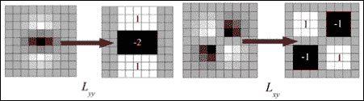

由于使用了盒滤波器和积分图像，我们不再需要执行重复的高斯平滑。我们直接将不同大小的盒滤波器应用到积分图像上。我们不是迭代地缩小图像，而是放大滤波器的大小。因此，尺度分析仅使用单个图像完成。前一个 9x9 滤波器的输出被认为是初始尺度层。其他层通过使用逐渐更大的滤波器进行过滤获得。第一八度图像使用 9x9、15x15、21x21 和 27x27 大小的滤波器获得。在更大的尺度上，滤波器之间的步长也应相应地放大。因此，对于每个新的八度，滤波器大小的步长加倍（即从 6 到 12 到 24）。在下八度中，滤波器的大小是 39x39、51x51 等等。

为了在图像和不同尺度上定位兴趣点，对 3x3x3 邻域应用了非极大值抑制。然后使用布朗和其他人提出的方法，在尺度空间和图像空间中对 Hessian 矩阵行列式的极大值进行插值。在我们的情况下，尺度空间插值尤为重要，因为每个八度第一层的尺度差异相对较大。

## SURF 描述符

现在我们已经定位了关键点，我们需要为每个关键点创建一个描述符，以便能够从其他关键点中唯一地识别它。SURF 在类似 SIFT 的原理上工作，但复杂性较低。Bay 和其他人也提出了一种不考虑旋转不变性的 SURF 变体，称为**U-SURF**（垂直 SURF）。在许多应用中，相机的方向保持相对稳定。因此，我们可以通过忽略旋转不变性来节省大量的计算。

首先，我们需要基于从以关键点为中心的圆形区域获得的信息来固定一个可重复的定位。然后，我们构建一个基于所选定位旋转并对齐的正方形区域，然后我们可以从中提取 SURF 描述符。

### 定位分配

为了增加旋转不变性，关键点的定位必须稳健且可重复。为此，SURF 提出在 *x* 和 *y* 方向上计算 Haar 小波响应。响应是在关键点周围半径为 6 s 的圆形邻域内计算的，其中 s 是图像的尺度（即σ的值）。为了计算 Haar 小波响应，SURF 提出使用 4 s 大小的波 let。在获得小波响应并用以关键点为中心的高斯核 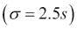 加权后，响应表示为向量。向量表示为沿横轴的横向响应强度，以及沿纵轴的纵向响应强度。然后，将覆盖 60 度角度的滑动定位窗口内的所有响应相加。计算出的最长向量被设置为描述符的方向：

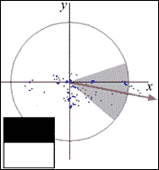

60 度角度内的 Haar 小波响应

滑动窗口的大小被作为一个参数，需要通过实验计算。小的窗口大小会导致单一的占主导地位的波 let 响应，而大的窗口大小会导致向量长度上的极大值不足以描述。两者都会导致兴趣区域的定位不稳定。对于 U-SURF，这一步被跳过，因为它不需要旋转不变性。

### 基于 Haar 小波响应的描述符

对于描述符的提取，第一步是构建一个以兴趣点为中心、沿前一小节中选定的方向对齐的正方形区域。对于 U-SURF 来说，这一步不是必需的。窗口的大小为 20 s。寻找描述符的步骤如下：

1.  将兴趣区域分割成 4x4 的正方形子区域，每个子区域内部有 5x5 均匀分布的采样点。

1.  计算 Haar 小波响应 *d^x* 和 *d^y* [*d^x* = x 方向上的 Haar 小波响应；*d^y* = y 方向上的 Haar 小波响应。使用的滤波器大小为 2 s]。

1.  使用以兴趣点为中心的高斯核对响应进行加权。

1.  分别对每个子区域的响应进行求和，形成长度为 32 的特征向量，用于*d^x*和*d^y*。

1.  为了引入关于强度变化极性的信息，提取响应绝对值的和，这是一个长度为 64 的特征向量。

1.  将向量归一化到单位长度。

小波响应对光照偏差（偏移）是不变的。通过将描述符转换为单位向量（归一化）来实现对对比度（尺度因子）的不变性。

实验中，Bay 等人测试了一种 SURF 的变体，它添加了一些额外的特征（SURF-128）。对于*d^y < 0*和*d^y ≥ 0*，分别单独计算*d^x*和*|d^x|*的和。同样，根据*d^x*的符号，将*d^y*和*|d^y|*的和分开，从而将特征数量翻倍。这个版本的 SURF-128 优于 SURF。

以下表格显示了在各种算法中寻找特征时的比较：

|   | U-SURF | SURF | SIFT |
| --- | --- | --- | --- |
| **时间 (ms)** | 225 | 354 | 1036 |

虽然 SIFT 和 SURF 在寻找良好特征方面表现良好，但它们用于商业用途是**专利的**。因此，如果您用于商业目的，您必须支付一些费用。

我们从 SURF 获得的一些结果如下：

+   SURF 的速度比 SIFT 快三倍，并且召回精度不低于 SIFT

+   SURF 擅长处理模糊或旋转的图像

+   SURF 在处理视角变化的图像方面表现不佳

## OpenCV 中的 SURF

SURF 的代码只需要稍作修改。我们只需要在我们的 switch case 结构中添加一个 case：

```py
case HomeActivity.MODE_SURF:
    detector = FeatureDetector.create(FeatureDetector.SURF);
    descriptorExtractor = DescriptorExtractor.create(DescriptorExtractor.SURF);
    descriptorMatcher = DescriptorMatcher.create(DescriptorMatcher.BRUTEFORCE_SL2);
    break;
```


SURF 特征匹配

# 定向 FAST 和旋转 BRIEF

**定向 FAST 和旋转 BRIEF**（**ORB**）由 Ethan Rublee、Vincent Rabaud、Kurt Konolige 和 Gary R. Bradski 于 2011 年在 OpenCV 实验室开发，作为一种高效且可行的 SIFT 和 SURF 的替代方案。ORB 主要因为 SIFT 和 SURF 是专利算法而构思。然而，ORB 是免费使用的。

ORB 在这些任务上的表现与 SIFT 相当（并且优于 SURF），同时几乎快两个数量级。ORB 建立在著名的 FAST 关键点检测器和 BRIEF 描述符之上。这两种技术都因其良好的性能和低成本而具有吸引力。ORB 的主要贡献如下：

+   将快速且精确的定向组件添加到 FAST 中

+   定向 BRIEF 特征的快速计算

+   对定向 BRIEF 特征的方差和相关性分析

+   一种在旋转不变性下去相关 BRIEF 特征的学习方法，从而在最近邻应用中实现更好的性能

## oFAST – FAST 关键点方向

FAST 是一种广为人知的特征检测算法，因其快速计算特性而受到认可。它不提出一个描述符来唯一标识特征。此外，它没有方向组件，因此在平面旋转和尺度变化方面表现不佳。我们将探讨 ORB 是如何为 FAST 特征添加方向组件的。

### FAST 检测器

首先，我们检测 FAST 关键点。FAST 从用户那里获取一个参数，即中心像素和围绕它的圆形环中的像素之间的阈值值。我们使用 9 像素的环半径，因为它提供了良好的性能。FAST 还会产生沿边缘的关键点。为了克服这一点，我们使用 Harris 角测量法对关键点进行排序。如果我们想得到 N 个关键点，我们首先将阈值设置得足够低，以生成超过 N 个关键点，然后根据 Harris 角测量法选择最上面的 N 个。

FAST 不产生多尺度特征。ORB 使用图像的尺度金字塔，并在金字塔的每一级产生 FAST 特征（通过 Harris 滤波器过滤）。

### 通过强度质心进行定位

为了给角赋予方向，我们使用强度质心。我们假设角偏离强度质心，并使用此向量将方向赋予一个关键点。

为了计算质心的坐标，我们使用矩。矩的计算如下：

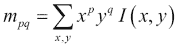

质心的坐标可以计算如下：

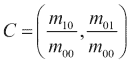

我们从关键点的中心*O*到质心*C*构建一个向量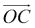。通过以下方式获得补丁的方向：

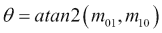

这里，*atan2*是具有象限意识的*arctan*版本。为了提高该测量的旋转不变性，我们确保在半径*r*的圆形区域内计算*x*和*y*的矩。我们经验性地选择*r*为补丁大小，使得*x*和*y*从*[−r, r]*运行。当*|C|*接近*0*时，该测量变得不稳定；通过 FAST 角，我们发现这种情况很少发生。这种方法也可以在噪声严重的图像中很好地工作。

## rBRIEF – 旋转感知 BRIEF

BRIEF 是一种特征描述算法，也因其计算速度快而闻名。然而，BRIEF 对旋转并不具有不变性。ORB 试图添加这一功能，同时不牺牲 BRIEF 的速度特性。BRIEF 通过*n*个二进制测试获得的特征向量如下：

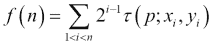

其中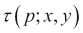定义为：

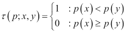

*p(x)*是像素*x*的强度值。

### 指向 BRIEF

BRIEF 的匹配性能在平面旋转超过几度时急剧下降。ORB 提出了一种根据关键点方向调整 BRIEF 的方法。对于任何位于(x^i, y^i)位置的 n 个二进制测试的特征集，我们定义一个*2 x n*矩阵：

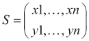

我们使用补丁方向*θ*和相应的旋转矩阵*R^θ*，构建*Steered*版本*S^θ*的*S*：


现在，Steered BRIEF 算子变为：

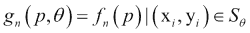

我们将角度离散化为*2π/30*（12 度）的增量，并构建一个预计算的 BRIEF 模式的查找表。只要关键点方向*θ*在视图中保持一致，就会使用正确的点集*S^θ*来计算其描述符。

### 方差和相关性

BRIEF 的一个特性是每个位特征都有很大的方差和接近 0.5 的平均值。0.5 的平均值给位特征提供了最大样本方差 0.25。Steered BRIEF 为二进制测试产生更均匀的外观。高方差导致特征对输入的反应差异更大。

拥有不相关特征是理想的，因为在这种情况下，每个测试都对结果有贡献。我们在所有可能的二进制测试中搜索，以找到那些具有高方差（以及平均值接近 0.5）且不相关的测试。

ORB 指定 rBRIEF 算法如下：

设置一个由 PASCAL 2006 集中的图像抽取的约 300 k 个关键点的训练集。然后，枚举从 31x31 像素补丁中抽取的所有可能的二进制测试。每个测试是补丁的 5x5 子窗口对。如果我们记补丁的宽度为*w^p = 31*，测试子窗口的宽度为*w^t = 5*，那么我们有*N = (wp − w^t)²*个可能的子窗口。我们希望从中选择两个，所以我们有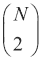2 个二进制测试。我们消除重叠的测试，最终得到*N = 205590*个可能的测试。算法如下：

+   将每个测试与所有训练补丁进行匹配。

+   按测试与 0.5 平均值的距离对测试进行排序，形成向量 T。

+   执行贪婪搜索：

    +   将第一个测试放入结果向量 R 中，并从 T 中移除它。

    +   从 T 中取出下一个测试，并将其与 R 中的所有测试进行比较。如果其绝对相关性大于阈值，则丢弃它；否则将其添加到 R 中。

    +   重复前面的步骤，直到 R 中有 256 个测试。如果少于 256 个，则提高阈值并再次尝试。

rBRIEF 在方差和相关性方面相对于 Steered BRIEF 有显著改进。ORB 在户外数据集上优于 SIFT 和 SURF。在室内数据集上表现大致相同；请注意，像 SIFT 这样的块检测关键点在涂鸦类型图像上往往表现更好。

## OpenCV 中的 ORB

ORB 的代码与 SIFT 和 SURF 类似。然而，ORB 作为一个基于二进制字符串的描述符，我们将在我们的 BF 匹配器中使用汉明码。

对 SURF 的代码只需稍作修改。我们只需在我们的 switch case 结构中添加一个情况：

```py
case HomeActivity.MODE_ORB:
    detector = FeatureDetector.create(FeatureDetector.ORB);
    descriptorExtractor = DescriptorExtractor.create(DescriptorExtractor.ORB);
    descriptorMatcher = DescriptorMatcher.create(DescriptorMatcher.BRUTEFORCE_HAMMING);
    break;
```

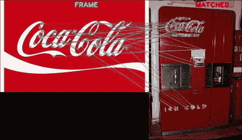

ORB 特征匹配

# 二值鲁棒可伸缩关键点

**二值鲁棒可伸缩关键点**（**BRISK**）是由 Leutenegger、Chli 和 Siegwart 提出的，旨在成为最先进特征检测、描述和匹配算法的高效替代方案。BRISK 背后的动机是开发一种鲁棒算法，能够以计算效率的方式重现特征。在某些情况下，BRISK 在特征匹配的质量上与 SURF 相当，但所需的计算时间却少得多。

## 尺度空间关键点检测

BRISK 检测器基于 AGAST 检测器，它是 FAST 更快性能版本的一个扩展。为了实现尺度不变性，BRISK 使用 FAST 分数（s）作为比较参数，在尺度空间中寻找最大值。尽管在比其他高性能检测器（例如快速 Hessian）更粗的间隔处对尺度轴进行离散化，但 BRISK 检测器估计每个关键点在连续尺度空间中的真实尺度。BRISK 的尺度空间包括 n 个八度，c^i 和 n 个跨八度，以及*d^i [i = {0, 1, 2, …, n-1}]*。BRISK 建议使用*n = 4*。

将原始图像作为*c⁰*，每个后续八度是从前一个八度的一半采样得到的。每个跨八度 d^i 是下采样得到的，使其位于*c^i*和*c^i+1*之间。第一个跨八度*d⁰*是通过将*c⁰*以 1.5 的倍数下采样得到的。后续的跨八度是通过前一个跨八度的一半采样得到的。

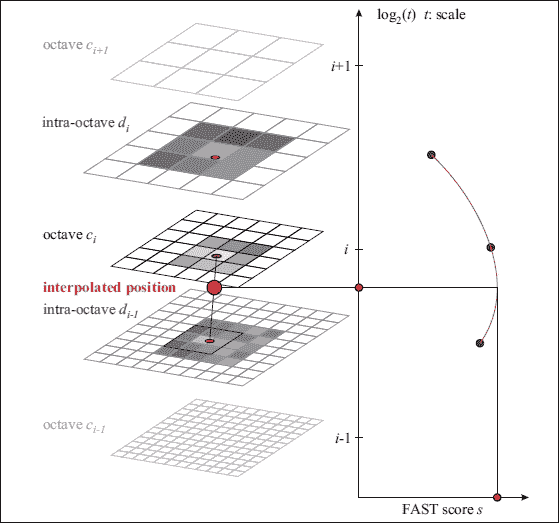

展示八度和跨八度的图像

FAST 9-16 检测器要求在 16 像素的圆形半径内，至少有 9 个像素比中心像素亮或暗，以满足 FAST 标准。BRISK 提出了使用这种 FAST 9-16 检测器。

对于每个八度和跨八度分别计算 FAST 分数。FAST 检测器的分数 s 是计算每个像素的最大阈值，使得图像点被认为是角点。

在应用 FAST 9-16 检测器后，对尺度空间中的关键点进行非极大值抑制。关键点应该是其八个相邻 FAST 分数在同一八度或跨八度中的最大值。此点还必须比其上下层的点具有更高的 FAST 分数。然后我们在具有 2 像素边长的等大小正方形块中检查该层，其中怀疑存在最大值。在块的边界处进行插值，因为相邻层使用与当前层不同的离散化表示。

我们尝试计算在早期步骤中检测到的每个最大值的亚像素位置。将一个二维二次函数拟合到围绕像素的 3x3 像素块，并确定亚像素最大值。这同样适用于当前层上下方的层。然后使用一维抛物线在尺度空间中进行插值，并选择局部最大值作为特征的尺度。

## 关键点描述

BRISK 描述符通过连接简单亮度比较测试的结果来构成一个二进制字符串。在 BRISK 中，我们需要识别每个关键点的特征方向以实现旋转不变性。

### 采样模式及旋转估计

BRISK 描述符利用一种用于采样关键点邻域的模式。该模式定义了与关键点同心圆上等间距的 N 个位置，如图所示：

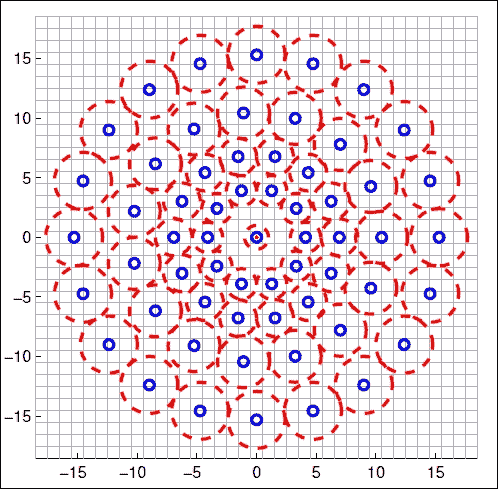

BRISK 采样模式

为了避免在采样模式中点 p^i 的图像强度时出现混叠效应，我们应用高斯平滑，其标准差  与相应圆上点之间的距离成正比。然后我们计算两个采样点之间的梯度。

使用的公式是：

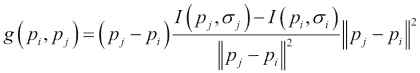

BRISK 定义了一个短距离配对子集 *S* 和另一个长距离配对子集 *L*，如下所示：

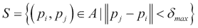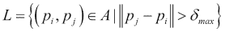

其中 *A* 是所有采样点对的集合，如下所示：

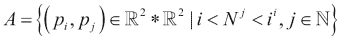

阈值距离设置为 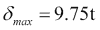 和 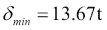 (*t* 是关键点的尺度)。BRISK 估计关键点 *k* 的整体特征模式方向为：

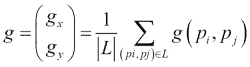

### 构建描述符

为了开发一个旋转和尺度不变描述符，BRISK 在关键点 *k* 附近应用了一个旋转角度 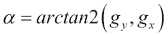 的采样模式。计算点对之间的短距离强度比较，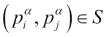（即在旋转模式中），以获得位向量描述符 *d^k*。每个位 *b* 对应于：

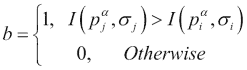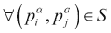

BRISK 使用确定性采样模式，导致在关键点周围给定半径处的采样点密度均匀。由于这个原因，高斯平滑在比较两个相邻采样点时不会修改亮度比较的信息内容。BRISK 使用的采样点比简单的成对比较少（因为单个点参与更多的比较），从而减少了查找强度值的复杂性。由于亮度变化只需要局部一致，因此这里所做的比较在空间上受到限制。我们使用采样模式和之前显示的距离阈值获得长度为 512 位的字符串。

## OpenCV 中的 BRISK

再次，我们将做出的唯一改变是向我们的 switch case 结构中添加另一个情况：

```py
case HomeActivity.MODE_BRISK:
    detector = FeatureDetector.create(FeatureDetector.BRISK);
    descriptorExtractor = DescriptorExtractor.create(DescriptorExtractor.BRISK);
    descriptorMatcher = DescriptorMatcher.create(DescriptorMatcher.BRUTEFORCE_HAMMING);
    break;
```


BRISK 特征匹配

# 快速视网膜关键点

**快速视网膜关键点**（**FREAK**）提出了一种鲁棒的描述符，用于唯一标识关键点，在此过程中，需要更少的计算时间和内存。FREAK 受到了人类视网膜的启发。

## 视网膜采样模式

FREAK 建议使用视网膜采样网格，它也是圆形的，但与 BRISK 不同的是，中心附近点的密度更高。随着我们远离中心点，点的密度呈指数下降。这与 BRISK 类似，只是指数下降。

每个关键点都需要进行平滑处理，以降低对噪声的敏感性。与 BRIEF 和 ORB 不同，它们对所有点使用相同的核，FREAK 为每个关键点使用不同的核。高斯核的半径与σ的值成比例。

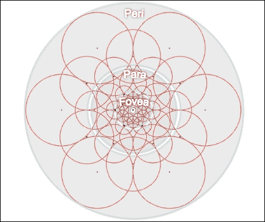

视网膜采样模式

FREAK 遵循 ORB 的方法，通过最大化对之间的方差并选择不相关的对来尝试了解对，以便为每个关键点提供最大信息。

## 粗到细的描述符

我们需要找到采样点的对，以便创建一个位向量。我们使用类似于 ORB 的方法，即不是匹配每一对，而是尝试了解哪些对会给出最佳结果。我们需要找到不相关的点。算法如下：

+   我们创建了一个包含近 50,000 个提取的关键点的矩阵 D。每一行对应一个关键点，该关键点通过其大描述符表示，描述符由视网膜采样模式中的所有可能对组成。我们使用 43 个感受野，导致大约 1,000 对。

+   我们计算每列的平均值。平均值为 0.5 会产生最高的方差。

+   按照列的方差降序排列。

+   选择最佳列，并迭代地添加剩余的列，使它们与所选列的低相关性。

在这种方法中，我们首先选择比较外区域采样点的对，而最后几对是在图案的内环中的比较点。这在某种程度上类似于我们的视网膜工作方式，即我们首先尝试定位一个对象，然后通过精确匹配靠近对象密集分布的点来验证它。

## 眨眼搜索

人类不会以固定方式观察场景。他们的眼睛以不连续的单独运动（称为眨眼）在场景中移动。黄斑区域捕捉高分辨率信息；因此，它在对象的识别和匹配中至关重要。周边区域捕捉低分辨率信息，因此，它被用来大致定位对象。

FREAK 尝试通过搜索描述符的前 16 个字节来模仿视网膜的功能，这些字节代表粗略信息。如果距离小于一个阈值，我们继续搜索下一个字节以获得更精确的结果。由于这个原因，进行了一系列比较，进一步加速了匹配步骤，因为超过 90% 的采样点在第一个 16 字节比较中被丢弃。

## 方向

FREAK 方法用于赋值方向的方法与 BRISK 类似，不同之处在于，FREAK 不是使用长距离对，而是使用一组预定义的 45 对对称采样对。

## FREAK 在 OpenCV 中的应用

FREAK 的代码与之前算法使用的代码类似。然而，鉴于 FREAK 只提供描述符，我们将使用 FAST 检测器来检测关键点：

```py
case HomeActivity.MODE_FREAK:
    detector = FeatureDetector.create(FeatureDetector.FAST);
    descriptorExtractor = DescriptorExtractor.create(DescriptorExtractor.FREAK);
    descriptorMatcher = DescriptorMatcher.create(DescriptorMatcher.BRUTEFORCE_HAMMING);
    break;
```

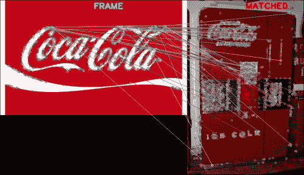

FREAK 特征匹配

# 摘要

在本章中，我们看到了如何检测图像中的特征并将它们与其它图像中的特征进行匹配。为了执行这个任务，我们研究了各种算法，如 SIFT、SURF、ORB、BRISK 和 FREAK，以及它们的优缺点。我们还看到了如何使用这些算法来定位场景中的特定物体。这些方法有一个限制，即必须场景图像中存在确切的对象才能正确检测。在下一章中，我们将进一步探索检测更一般类别的对象，例如人类、面部、手等。
