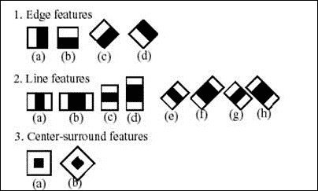
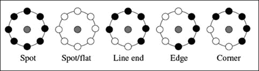
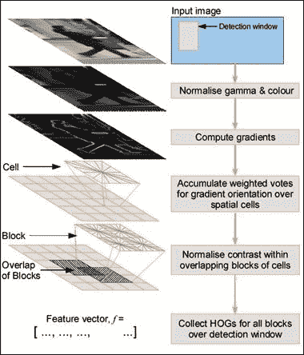

# 第四章.深入对象检测——使用级联分类器

在上一章中，我们探讨了用于对象检测的一些非常复杂的算法。在本章中，我们计划进一步探讨另一组被称为级联分类器和 HOG 描述符的算法。这些算法广泛用于检测人类表情，并在监控系统、人脸识别系统和其他简单的生物识别系统中得到应用。人脸检测是**级联分类器**（Haar 级联分类器）的第一个应用之一，从那时起，已经开发了许多不同的应用。

你是否曾经想过相机是如何在图像中检测到微笑的面孔并自动拍照的？这并不是什么火箭科学。本章将讨论检测人类表情的不同方法，使用这些方法你可以在 Android 平台上构建上述应用的自己的版本。

在本章中，我们将探讨以下算法：

+   级联分类器

+   HOG 描述符

# 级联分类器简介

什么是级联分类器？让我们分别看看这两个词的含义，然后再将它们结合起来，看看这个短语实际上是什么意思。分类器就像黑盒，根据训练集将对象分类到不同的类别。最初，我们取一个大的训练数据集，将其输入到任何学习算法中，并计算一个训练好的模型（分类器），该模型能够对新的未知数据进行分类。

让我们了解一下“级联”这个词。在字面上，级联意味着形成一条链。在当前语境中，级联意味着形成一个多阶段分类器，其中前一阶段的输出传递到下一阶段，依此类推。级联分类器用于那些你拥有较低的计算能力且不想在算法速度上妥协的情况。

本章将涵盖的级联分类器如下：

+   Haar 级联（Viola 和 Jones – 人脸检测）

+   LBP 级联

让我们简要了解 Haar 级联和 LBP 级联，然后构建一个使用这些级联在图像中检测人脸的 Android 应用程序。

## Haar 级联

Viola 和 Jones 开发的第一种实时人脸检测算法，其灵感来源于 Haar 小波的概念。该算法利用人脸固有的结构和相似性。例如，在每个人的脸上，眼区域比脸颊暗，鼻梁区域比眼睛暗。利用人脸的这些特征，我们学习人脸的通用模型，然后使用这些训练好的模型在图像中检测人脸。

初始时，我们向学习算法提供正面图像（含人脸的图像）和负面图像（不含人脸的图像）并学习分类器。然后我们使用卷积核从图像中提取 Haar 特征（如下面的图像所示）。特征值是通过从白色矩形下的白色像素总和减去黑色矩形下的像素总和得到的。我们将这些核（即 Haar 特征）在整个图像上滑动并计算特征值。如果值高于某个用户定义的阈值，我们说存在匹配，否则我们拒绝该区域。为了减少计算，我们使用了积分图像。

### 小贴士

在[`en.wikipedia.org/wiki/Summed_area_table`](http://en.wikipedia.org/wiki/Summed_area_table)可以找到积分图像的解释。



Haar 特征

在使用分类器之前每次都对其进行训练在性能方面是不可接受的，因为它需要花费很多时间；有时多达 6-7 小时或更长。因此，我们使用 OpenCV（或任何其他来源）提供的预训练分类器。

## LBP 级联

**局部二值模式**（**LBP**）级联是另一种广泛用于计算机视觉的级联分类器。与 Haar 级联相比，LBP 级联处理整数而不是双精度值。因此，使用 LBP 级联进行训练和测试更快，因此在开发嵌入式应用程序时更受欢迎。LBP 的另一个重要特性是对光照变化的容忍度。

在 LBP 中，对于图像中的每个像素，通过考虑八个相邻像素（左上、右上、左、右、左下和右下）创建一个 8 位二进制特征向量。对于每个相邻像素，都有一个相应的位，如果像素值大于中心像素的值，则分配值为 1，否则为 0。8 位特征向量被视为一个二进制数（稍后将其转换为十进制值），并使用每个像素的十进制值计算一个 256 个分箱的直方图。这个直方图被用作图像的代表性。

LBP 特征中包含一些原语，如下面的图像所示：



纹理原语示例

对于 Haar 级联，我们也制作了一组正面图像（含人脸）和负面图像（不含人脸）。我们为每个图像计算直方图并将其输入到任何学习算法中。

# 使用级联分类器进行人脸检测

级联分类器最常见的一个应用是面部检测。在 Android 上使用 OpenCV 实现 Haar 和 LBP 分类器的实现非常相似；唯一的区别在于我们用来检测面部的模型。让我们为面部检测创建一个通用应用程序，并对应用程序进行相关更改以适应 Haar 和 LBP 级联。该应用程序将在整个屏幕上显示相机预览（横屏方向），并在每一帧周围绘制矩形。它还将提供一个选项来切换前后摄像头。以下是创建此应用程序的步骤：

1.  创建一个新的 Eclipse（或 Android Studio）项目，包含一个空白活动，并将应用程序命名为 *Face Detection*。它将是一个横屏应用，具有全屏相机预览。

1.  在应用程序标签中，添加以下行以创建全屏应用程序：

    ```py
    android:theme="@android:style/Theme.NoTitleBar.Fullscreen"
    ```

1.  在 `AndroidManifest.xml` 中授予以下权限：

    ```py
    <uses-permission android:name="android.permission.CAMERA"/>
        <uses-feature android:name="android.hardware.camera" android:required="false"/>
        <uses-feature android:name="android.hardware.camera.autofocus"      android:required="false"/>
        <uses-feature android:name="android.hardware.camera.front" android:required="false"/>
        <uses-feature android:name="android.hardware.camera.front.autofocus" android:required="false"/>
    ```

1.  在主活动中，添加一个相机预览视图。这将显示相机输出到屏幕上。使用以下行添加视图：

    ```py
    <org.opencv.android.JavaCameraView
            android:layout_width="fill_parent"
            android:layout_height="fill_parent"
            android:id="@+id/java_surface_view" />
    ```

    ### 注意

    OpenCV 提供了两种相机预览视图：`JavaCameraView` 和 `NativeCameraView`。这两个视图的工作方式相似，但有一些不同。有关差异的详细说明，请参阅 [`docs.opencv.org/doc/tutorials/introduction/android_binary_package/dev_with_OCV_on_Android.html?highlight=nativecameraview`](http://docs.opencv.org/doc/tutorials/introduction/android_binary_package/dev_with_OCV_on_Android.html?highlight=nativecameraview)。

在此应用程序中，我们将实现 `CvCameraViewListener2` 接口，该接口具有提供一些对相机控制的功能定义（请参阅 OpenCV 的相机预览教程）。我们将在本节稍后查看这些函数。

与本书中迄今为止看到的其它应用程序不同，此应用程序对 `BaseLoaderCallback` 类有不同的实现（对于那些无法回忆起的人来说，`BaseLoaderCallback` 类在应用程序中初始化和加载 OpenCV 模块）。

对于此应用程序，我们将在我们的应用程序中加载 OpenCV 之后加载级联分类器。以下是此应用程序的 `BaseLoaderCallback` 类：

```py
private BaseLoaderCallback mLoaderCallback = new BaseLoaderCallback(this) {
        @Override
        public void onManagerConnected(int status) {
            switch (status) {
                case LoaderCallbackInterface.SUCCESS:
                {
                    Log.i(TAG, "OpenCV loaded successfully");
                    try{
                        InputStream is = getResources().openRawResource(<INSERT_RESOURCE_IDENTIFIER>);
                        File cascadeDir = getDir("cascade", Context.MODE_PRIVATE);
                        mCascadeFile = new File(cascadeDir, "cascade.xml");
                        FileOutputStream os = new FileOutputStream(mCascadeFile);

                        byte[] buffer = new byte[4096];
                        int bytesRead;
                        while((bytesRead = is.read(buffer)) != -1)
                        {
                            os.write(buffer, 0, bytesRead);
                        }
                        is.close();
                        os.close();

                        haarCascade = new CascadeClassifier(mCascadeFile.getAbsolutePath());
                        if (haarCascade.empty())
                        {
                            Log.i("Cascade Error","Failed to load cascade classifier");
                            haarCascade = null;
                        }
                    }
                    catch(Exception e)
                    {
                        Log.i("Cascade Error: ","Cascase not found");
                    }
                    mOpenCvCameraView.enableView();
                } break;
                default:
                {
                    super.onManagerConnected(status);
                } break;
            }
        }
    };
```

在前面的代码片段中，我们首先检查 OpenCV 是否成功加载。完成此操作后，我们使用 `InputStream` 和 `FileOutputStream` 将级联文件从项目资源复制到我们的应用程序中，如下所示。创建一个新的文件夹 `cascade`，并将级联文件的副本复制到该文件夹中的新文件中。现在来看看使用 Haar 级联和 LBP 级联的区别。将 `<INSERT_RESOURCE_IDENTIFIER>` 替换为你喜欢的级联文件。

注意：其余的代码与您选择的级联类型无关。

### 注意

OpenCV 为 Haar 和 LBP 都提供了预学习的级联。将级联文件复制到你的 Android 项目中的 `res/raw` 文件夹。假设你的 Haar 和 LBP 的级联文件分别命名为 `haar_cascade.xml` 和 `lbp_cascade.xml`。将 `<INSERT_RESOURCE_IDENTIFIER>` 替换为 `R.raw.id.haar_casacde` 或 `R.raw.id.lbp_cascade`，具体取决于你想使用哪个分类器。

我们同时复制和保存文件的原因是将文件从你的项目目录传输到手机的文件系统中：

```py
InputStream is = getResources().openRawResource(<INSERT_RESOURCE_IDENTIFIER>);
File cascadeDir = getDir("cascade", Context.MODE_PRIVATE);
mCascadeFile = new File(cascadeDir, "cascade.xml");
FileOutputStream os = new FileOutputStream(mCascadeFile);

byte[] buffer = new byte[4096];
int bytesRead;
while((bytesRead = is.read(buffer)) != -1)
{
os.write(buffer, 0, bytesRead);
}
is.close();
os.close();
```

完成此操作后，创建一个新的 `CascadeClassifier` 对象，稍后将在摄像头流中检测人脸，如下代码片段所示：

```py
haarCascade = new CascadeClassifier(mCascadeFile.getAbsolutePath());
if (cascade.empty())
{
    Log.i("Cascade Error","Failed to load cascade classifier");
    cascade = null;
}
```

到目前为止，我们已经能够在项目中初始化 OpenCV，并将我们喜欢的级联分类器加载到应用程序中。下一步是准备摄像头预览。如前所述，我们正在实现 `CvCameraViewListener2` 接口，因此我们需要实现其成员函数：

```py
    @Override
    public void onCameraViewStarted(int width, int height) {
        mRgba = new Mat(height, width, CvType.CV_8UC4);
    }

    @Override
    public void onPause()
    {
        super.onPause();
        if (mOpenCvCameraView != null)
            mOpenCvCameraView.disableView();
    }

    @Override
    public void onResume()
    {
        super.onResume();
        OpenCVLoader.initAsync(OpenCVLoader.OPENCV_VERSION_2_4_9, this, mLoaderCallback);
    }

    public void onDestroy() {
        super.onDestroy();
        if (mOpenCvCameraView != null)
            mOpenCvCameraView.disableView();
    }
```

另一个需要实现的功能是 `onCameraFrame()`。这里发生所有魔法。在这个函数中，我们将处理每一帧并找到其中的面孔：

```py
@Override
    public Mat onCameraFrame(CameraBridgeViewBase.CvCameraViewFrame inputFrame) {

        //Rotating the input frame
        Mat mGray = inputFrame.gray();
        mRgba = inputFrame.rgba();
        if (mIsFrontCamera)
        {
            Core.flip(mRgba, mRgba, 1);
        }

        //Detecting face in the frame
        MatOfRect faces = new MatOfRect();
        if(cascade != null)
        {
            cascade.detectMultiScale(mGray, faces, 1.1, 2, 2, new Size(200,200), new Size());
        }

        Rect[] facesArray = faces.toArray();
        for (int i = 0; i < facesArray.length; i++)
            Core.rectangle(mRgba, facesArray[i].tl(), facesArray[i].br(), new Scalar(100), 3);
        return mRgba;
    }
```

在这里，我们首先将摄像头的输出存储在 `mRgba` 中，`mGray` 存储摄像头的灰度图像输出。然后我们检查是否正在使用手机的正面摄像头或背面摄像头（如何处理正面摄像头将在本章后面解释）通过一个布尔值 `mIsFrontCamera`（类的数据成员）。如果正在使用正面摄像头，只需翻转图像。现在创建一个 `MatOfRect` 对象，它将存储在帧中包围人脸的矩形。然后，调用神奇的功能：

```py
cascade.detectMultiScale(mGray, faces, 1.1, 2, 2, new Size(200,200), new Size());
```

`detectMultiScale()` 函数接收一个灰度图像并返回包含人脸（如果有）的矩形。该函数的第三个参数是缩放因子，它指定了在每次图像缩放时图像大小减少的程度。为了获得更准确的结果，人脸检测会在不同的尺度上进行。最后两个参数是可以检测到的最小和最大人脸尺寸。这些参数在一定程度上决定了应用程序的运行速度。设置最小尺寸可能会导致应用程序性能不佳，即每秒帧数非常少。设置这些参数时要小心。

完成！应用程序几乎完成了，只剩下一项功能尚未实现：处理前置摄像头。为了做到这一点，请遵循以下步骤：

1.  我们首先在应用程序菜单中添加一个菜单选项，允许用户在前后摄像头之间切换，如下所示：

    ```py
    @Override
        public boolean onCreateOptionsMenu(Menu menu) {
            // Inflate the menu; this adds items to the action bar if it is present.
            getMenuInflater().inflate(R.menu.menu_main, menu);
            Log.i(TAG, "called onCreateOptionsMenu");
            mItemSwitchCamera = menu.add("Toggle Front/Back camera");
            return true;
        }
    ```

1.  在 `onOptionsItemSelected()` 函数中，添加在摄像头之间切换的功能：

    ```py
    @Override
        public boolean onOptionsItemSelected(MenuItem item) {
            String toastMesage = "";

            if (item == mItemSwitchCamera) {
                mOpenCvCameraView.setVisibility(SurfaceView.GONE);
                mIsFrontCamera = !mIsFrontCamera;
                mOpenCvCameraView = (CameraBridgeViewBase) findViewById(R.id.java_surface_view);
                if (mIsFrontCamera) {

                    mOpenCvCameraView.setCameraIndex(1);
                    toastMesage = "Front Camera";
                } else {
                    mOpenCvCameraView.setCameraIndex(-1);
                    toastMesage = "Back Camera";
                }

                mOpenCvCameraView.setVisibility(SurfaceView.VISIBLE);
                mOpenCvCameraView.setCvCameraViewListener(this);
                mOpenCvCameraView.enableView();
                Toast toast = Toast.makeText(this, toastMesage, Toast.LENGTH_LONG);
                toast.show();
            }

            return true;
        }
    ```

1.  当用户选择此选项时，我们首先切换 `isFrontCamera` 的值。之后，通过运行以下代码更改 `mOpenCvCameraView` 对象的摄像头索引：

    ```py
    mOpenCvCameraView.setCameraIndex(-1);
    ```

Android 中的默认相机索引是`-1`，代表后置摄像头。前置摄像头的索引是 1（这不是一个固定的数字；它可能因手机而异）。根据前面的代码中的`isFrontCamera`值设置相机索引，并设置通知用户的消息。

通过这个，我们成功构建了我们自己的面部检测应用程序版本！

# HOG 描述符

**方向梯度直方图**（**HOG**）描述符是使用梯度强度方向和边缘方向的特性描述符。对于 HOG 描述符，我们将图像划分为小的单元，为每个单元计算一个直方图，并将这些直方图进一步组合以计算一个单一的描述符。在这一点上，它们与 SIFT 描述符类似，因为两者都使用图像梯度，并且都将图像划分为空间箱并形成直方图，但 SIFT 描述符帮助您匹配局部区域（使用关键点位置），而 HOG 描述符使用滑动窗口来检测对象。HOG 描述符在几何和光照变换方面表现良好，但在对象方向上表现不佳（与 SIFT 不同，SIFT 在方向变化方面表现良好）。

HOG 描述符被分为多个步骤：

+   **计算梯度**：我们首先使用任何导数掩模在图像的水平方向和垂直方向上计算图像中所有像素的梯度值（您可以选择一个方向或两个方向）。一些常见的导数掩模是 Sobel 算子、Prewitt 算子等，但原始算法建议您使用 1D 导数掩模，即[-1, 0, +1]。

+   **方向分箱**：创建一个直方图，该直方图包含之前步骤中计算的加权梯度。梯度值被分为箱值，范围从 0 到 180，或 0 到 360（取决于我们是否使用有符号或无符号梯度值）。

+   **组合单元格形成块**：在为每个单元格计算直方图之后，我们将这些单元格组合成块，并使用其构成单元格的归一化直方图形成块的组合直方图。最终的 HOG 描述符是归一化直方图的向量。

+   **构建分类器**：在算法的最后一步，将之前步骤中计算出的 HOG 特征向量输入到您喜欢的学习算法中，并构建一个模型，该模型将用于在图像中检测对象：

    HOG 描述符流程图

让我们看看一个使用 HOG 描述符检测对象的 Android 应用程序。

由于 OpenCV 提供了用于在图像中检测人员的预训练 HOG 描述符，我们将编写一个 Android 应用程序，可以检测图像中的人员（我们不需要训练我们的描述符）。由于计算 HOG 描述符所需的计算量很大，在有限的计算资源移动平台上制作实时应用程序变得非常困难。因此，我们将构建一个应用程序，它将只检测单张图像中的人员。

对于这个，让我们参考第二章，*图像中的基本特征检测*，在那里我们构建了一个应用程序，可以从你的手机相册中读取图像并根据用户的选择执行任何操作（希望你仍然在某处保存了那个项目）。我们不需要整个应用程序。我们只需取那个应用程序的基础部分，并创建一个新的函数来检测相册中的任何图像中的人。

如果你保存了第二章的项目，*图像中的基本特征检测*，对其进行以下修改。向应用程序菜单中添加一个新的菜单选项*检测面部*（参考第二章，*图像中的基本特征检测*），并在`onSelectedOptionItem()`函数中添加以下行：

```py
else if (id == R.id.FaceDetect) {
            //Detec Faces
            HOGDescriptor();
        }
```

创建一个新的函数`HOGDescriptor()`，我们将按照以下方式实现人员检测：

```py
void HOGDescriptor() {
        Mat grayMat = new Mat();
        Mat people = new Mat();

        //Converting the image to grayscale
        Imgproc.cvtColor(originalMat, grayMat, Imgproc.COLOR_BGR2GRAY);

        HOGDescriptor hog = new HOGDescriptor();
        hog.setSVMDetector(HOGDescriptor.getDefaultPeopleDetector());

        MatOfRect faces = new MatOfRect();
        MatOfDouble weights = new MatOfDouble();

        hog.detectMultiScale(grayMat, faces, weights);
        originalMat.copyTo(people);
        //Draw faces on the image
        Rect[] facesArray = faces.toArray();
        for (int i = 0; i < facesArray.length; i++)
            Core.rectangle(people, facesArray[i].tl(), facesArray[i].br(), new Scalar(100), 3);

        //Converting Mat back to Bitmap
        Utils.matToBitmap(people, currentBitmap);
        loadImageToImageView();
    }
```

在前面的代码片段中，我们首先将图像转换为灰度图像。然后，我们使用以下行初始化`HOGDescriptor`，使用预训练模型（使用 SVM）：

```py
HOGDescriptor hog = new HOGDescriptor();
hog.setSVMDetector(HOGDescriptor.getDefaultPeopleDetector());
```

下一步很简单；我们将调用`detectMultiScale()`函数，该函数将返回图像中的所有面孔。函数的第二个参数存储了检测到人的区域。然后我们将遍历所有这些区域，并在图像上围绕它们绘制矩形。

# 项目 – 快乐相机

实践胜于理论。现在是时候应用本章所学，构建一个酷炫的相机应用程序，当它检测到微笑的面孔时会自动拍照。

诀窍在于我们将使用两种不同类型的级联分类器。首先，我们将使用 Haar 级联在图像中找到面孔并存储所有面孔的位置。然后我们将使用 Haar 级联在图像中检测微笑并存储它们。现在我们尝试匹配带有微笑的面孔。对于每个微笑，我们在图像中找到相应的面孔。这是简单的：如果微笑区域在任何检测到的面孔区域内，我们就说这是一个匹配。

在定位到图像中所有微笑的面部后，计算微笑面部与所有面部（微笑和不微笑）的比例，如果这个比例超过某个阈值，我们就说这是一张快乐的图片，然后点击图片。不过这里要注意的一点是我们使用的比例。我们可以使用不同的指标来标记图像为快乐图像。如果我们计算微笑面部与总面部的比例，会存在一个问题，如果你图像中只有两个人，其中一个人没有微笑（或者有标准表情），那么我们的应用程序将不会点击图片。因此，为了避免这种情况，我们选择对微笑面部与不微笑面部的比例采取宽松的策略，以便将图像分类为快乐图像。

我们如何构建这个应用程序？本章已经讨论了应用程序的大部分内容。应用程序剩余的部分如下：

1.  **添加微笑检测器**：这非常简单。它与我们检测面部的方法完全相同；在这里，我们将使用 Haar 级联来检测微笑。你可以在[`github.com/Itseez/opencv/blob/master/data/haarcascades/haarcascade_smile.xml`](https://github.com/Itseez/opencv/blob/master/data/haarcascades/haarcascade_smile.xml)找到预训练模型。

1.  **关联面部和微笑**：一旦我们有了面部和微笑，我们需要在图像中找到匹配的面部和微笑对。我们为什么要关联它们？为什么不直接使用微笑的数量呢？是的，我们可以这样做。没有必要关联面部和微笑。这样做额外步骤的唯一优势是减少误报。如果一个微笑没有对应的面部，我们可以在计算中忽略那个微笑。

1.  **标记快乐图像**：一旦你准备好了面部和微笑对，计算（前面解释过）的比例，并决定是否保存那张图像。

1.  **实际上保存图像**：在标记图像为快乐图像后，创建一个函数，将图像实际保存到你的手机上。

你刚刚创建了一个酷炫的相机应用程序！

只有在你自己尝试构建这个应用程序之后，你才能查看本书附带的代码包中的示例实现。

# 摘要

本章是上一章的延续，其中我们看到了一些基本特征检测算法。在这里，我们学习了更多可以用于面部、眼睛和人体检测的算法。级联分类器是一种监督学习模型，我们首先使用一些标记数据训练一个分类器，然后使用训练好的模型来检测新的未遇到的数据。

在接下来的章节中，我们将探讨图像拼接以及如何在计算机视觉算法中使用机器学习等主题。
