# 第五章：视频中的目标跟踪

目标跟踪是计算机视觉最重要的应用之一。它可以用于许多应用，以下是一些例子：

+   人机交互：我们可能想要追踪人的手指位置，并使用其运动来控制我们机器上的光标

+   监控：街上的摄像头可以捕捉到行人的运动，这些运动可以被追踪以检测可疑活动

+   视频稳定和压缩

+   体育统计：通过追踪足球比赛中球员的运动，我们可以提供诸如行进距离、热图等统计数据

在本章中，你将学习以下主题：

+   光流

+   图像金字塔

+   全局运动估计

+   KLT 追踪器

# 光流

光流是一种检测视频连续帧之间物体或边缘运动模式的算法。这种运动可能是由物体的运动或摄像机的运动引起的。光流是从第一帧到第二帧点的运动的向量。

光流算法基于两个基本假设：

+   像素强度在连续帧之间几乎保持恒定

+   相邻像素具有与锚点像素相同的运动

我们可以用 *f(x,y,t)* 来表示任何帧中像素的强度。在这里，参数 *t* 代表视频中的帧。让我们假设，在下一个 *dt* 时间内，像素移动了 *(dx,dy)*。由于我们假设强度在连续帧之间没有变化，因此我们可以说：

*f(x,y,t) = f(x + dx,y + dy,t + dt)*

现在我们对前面方程的右侧进行泰勒级数展开：

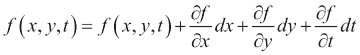

消除公共项，我们得到：

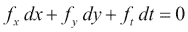

其中 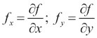。

将方程两边除以 *dt*，我们得到：

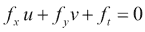

这个方程被称为光流方程。重新排列方程，我们得到：

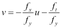

我们可以看到，这代表了 *(u,v)* 平面上的直线方程。然而，只有一个方程可用，有两个未知数，因此目前这个问题处于约束状态。在下文中，我们将解释计算光流最广泛使用的两种方法。

## Horn 和 Schunck 方法

考虑到我们的假设，我们得到：

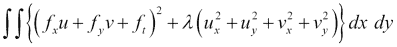

我们可以说，由于我们的假设亮度在连续帧之间是恒定的，因此第一个项将很小。所以，这个项的平方将更小。第二个项对应于相邻像素与锚点像素具有相似运动的假设。我们需要最小化前面的方程。为此，我们对前面的方程关于 *u* 和 *v* 求导。我们得到以下方程：

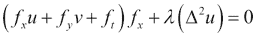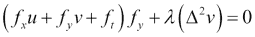

这里，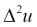和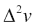分别是*u*和*v*的拉普拉斯算子。

## 卢卡斯-卡纳德方法

我们从之前推导出的光流方程开始，并注意到它是不受约束的，因为它有一个方程和两个变量：


为了克服这个问题，我们利用假设，即 3x3 邻域内的像素具有相同的光流：

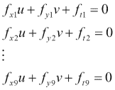

我们可以将这些方程重写为矩阵形式，如下所示：

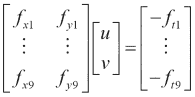

这可以重写为以下形式：

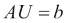

其中：

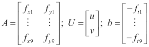

如我们所见，*A*是一个 9x2 的矩阵，*U*是一个 2x1 的矩阵，*b*是一个 9x1 的矩阵。理想情况下，为了求解*U*，我们只需要在方程的两边乘以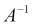。然而，这是不可能的，因为我们只能取方阵的逆。因此，我们尝试通过在方程的两边乘以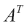来将*A*转换成一个方阵：

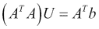

现在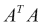是一个 2x2 维度的方阵。因此，我们可以取其逆：

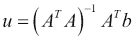

解这个方程，我们得到：


这种先乘转置再取逆的方法称为**伪逆**。

这个方程也可以通过找到以下方程的最小值来获得：

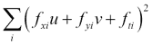

根据光流方程和我们的假设，这个值应该等于零。由于邻域像素的值并不完全与锚点像素相同，这个值非常小。这种方法称为**最小二乘误差**。为了求解最小值，我们对这个方程关于*u*和*v*求导，并将其等于零。我们得到以下方程：

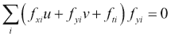

现在我们有两个方程和两个变量，因此这个方程组可以求解。我们将前面的方程重写如下：

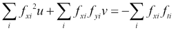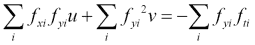

因此，将这些方程排列成矩阵形式，我们得到与之前相同的方程：

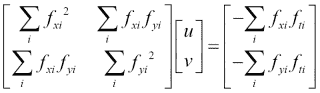

由于矩阵 *A* 现在是一个 2x2 矩阵，因此可以取其逆。取逆后，得到的方程如下：

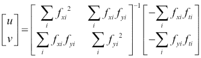

这可以简化为：

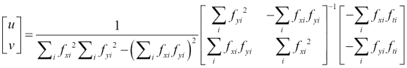

解算 *u* 和 *v*，我们得到：

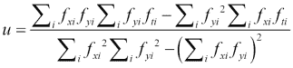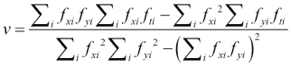

现在我们有了所有 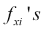，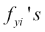，和 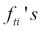 的值。因此，我们可以找到每个像素的 *u* 和 *v* 的值。

当我们实现此算法时，观察到光流在物体边缘附近不是很平滑。这是由于亮度约束未得到满足。为了克服这种情况，我们使用 **图像金字塔**（在以下章节中详细解释）。

## 检查 Android 上的光流

要在 Android 上查看光流的效果，我们将在来自摄像头的视频流上创建一个点阵，然后为每个点绘制线条，以描绘视频上该点的运动，该点叠加在网格点上。

在我们开始之前，我们将设置我们的项目以使用 OpenCV 并从摄像头获取视频流。我们将处理帧以计算光流。

首先，在 Android Studio 中创建一个新的项目，就像我们在前面的章节中所做的那样。我们将活动名称设置为 `MainActivity.java`，并将 XML 资源文件设置为 `activity_main.xml`。其次，我们将给应用授予访问摄像头的权限。在 `AndroidManifest.xml` 文件中，将以下行添加到 manifest 标签中：

```py
<uses-permission android:name="android.permission.CAMERA" />
```

确保您的 `MainActivity` 活动标签包含以下行作为属性：

```py
android:screenOrientation="landscape"
```

我们的 `activity_main.xml` 文件将包含一个简单的 `JavaCameraView`。这是一个自定义的 OpenCV 定义布局，它使我们能够访问摄像头帧并将它们作为正常的 `Mat` 对象处理。XML 代码如下所示：

```py
<LinearLayout 

    android:layout_width="match_parent"
    android:layout_height="match_parent"
    android:orientation="horizontal">

    <org.opencv.android.JavaCameraView
        android:layout_width="fill_parent"
        android:layout_height="fill_parent"
        android:id="@+id/main_activity_surface_view" />

</LinearLayout>
```

现在，让我们编写一些 Java 代码。首先，我们将定义一些全局变量，我们将在代码的后续部分或其他章节中使用它们：

```py
private static final String    TAG = "com.packtpub.masteringopencvandroid.chapter5.MainActivity";

    private static final int       VIEW_MODE_KLT_TRACKER = 0;
    private static final int       VIEW_MODE_OPTICAL_FLOW = 1;

    private int                    mViewMode;
    private Mat                    mRgba;
    private Mat                    mIntermediateMat;
    private Mat                    mGray;
    private Mat                    mPrevGray;

    MatOfPoint2f prevFeatures, nextFeatures;
    MatOfPoint features;

    MatOfByte status;
    MatOfFloat err;

    private MenuItem               mItemPreviewOpticalFlow, mItemPreviewKLT;

    private CameraBridgeViewBase   mOpenCvCameraView;
```

我们需要创建一个类似于之前的 OpenCV 回调函数。除了我们之前使用的代码之外，我们还将启用 `CameraView` 捕获用于处理的帧：

```py
private BaseLoaderCallback  mLoaderCallback = new BaseLoaderCallback(this) {
        @Override
        public void onManagerConnected(int status) {
            switch (status) {
                case LoaderCallbackInterface.SUCCESS:
                {
                    Log.i(TAG, "OpenCV loaded successfully");

                    mOpenCvCameraView.enableView();
                } break;
                default:
                {
                    super.onManagerConnected(status);
                } break;
            }
        }
    };
```

现在，我们将检查手机上是否安装了 OpenCV 管理器，其中包含所需的库。在 `onResume` 函数中，添加以下代码行：

```py
OpenCVLoader.initAsync(OpenCVLoader.OPENCV_VERSION_2_4_10, this, mLoaderCallback);
```

在 `onCreate()` 函数中，在调用 `setContentView` 之前添加以下行，以防止在使用应用时屏幕关闭：

```py
getWindow().addFlags(WindowManager.LayoutParams.FLAG_KEEP_SCREEN_ON);
```

现在，我们将初始化我们的 `JavaCameraView` 对象。在调用 `setContentView` 之后添加以下行：

```py
mOpenCvCameraView = (CameraBridgeViewBase) findViewById(R.id.main_activity_surface_view);
mOpenCvCameraView.setCvCameraViewListener(this);
```

注意，我们使用`this`参数调用了`setCvCameraViewListener`。为此，我们需要让我们的活动实现`CvCameraViewListener2`接口。所以，你的`MainActivity`类的类定义应该看起来像以下代码：

```py
public class MainActivity extends Activity implements CvCameraViewListener2
```

我们将向这个活动添加一个菜单来在章节中的不同示例之间切换。将以下行添加到`onCreateOptionsMenu`函数中：

```py
mItemPreviewKLT = menu.add("KLT Tracker");
mItemPreviewOpticalFlow = menu.add("Optical Flow");
```

现在，我们将向菜单项添加一些操作。在`onOptionsItemSelected`函数中，添加以下行：

```py
if (item == mItemPreviewOpticalFlow) {
            mViewMode = VIEW_MODE_OPTICAL_FLOW;
            resetVars();
        } else if (item == mItemPreviewKLT){
            mViewMode = VIEW_MODE_KLT_TRACKER;
            resetVars();
        }

        return true;
```

我们使用了一个`resetVars`函数来重置所有的`Mat`对象。它已经被定义为以下内容：

```py
private void resetVars(){
        mPrevGray = new Mat(mGray.rows(), mGray.cols(), CvType.CV_8UC1);
        features = new MatOfPoint();
        prevFeatures = new MatOfPoint2f();
        nextFeatures = new MatOfPoint2f();
        status = new MatOfByte();
        err = new MatOfFloat();
    }
```

我们还将添加代码以确保，当我们的应用程序挂起或被杀死时，摄像头可以供其他应用程序使用。因此，将以下代码片段添加到`onPause`和`onDestroy`函数中：

```py
if (mOpenCvCameraView != null)
            mOpenCvCameraView.disableView();
```

在 OpenCV 摄像头启动后，会调用`onCameraViewStarted`函数，这是我们添加所有对象初始化的地方：

```py
public void onCameraViewStarted(int width, int height) {
        mRgba = new Mat(height, width, CvType.CV_8UC4);
        mIntermediateMat = new Mat(height, width, CvType.CV_8UC4);
        mGray = new Mat(height, width, CvType.CV_8UC1);
        resetVars();
    }
```

类似地，当停止捕获帧时，会调用`onCameraViewStopped`函数。在这里，我们将释放在视图开始时创建的所有对象：

```py
public void onCameraViewStopped() {
        mRgba.release();
        mGray.release();
        mIntermediateMat.release();
    }
```

现在，我们将添加处理从摄像头捕获的每一帧的实现。OpenCV 为每一帧调用`onCameraFrame`方法，并将帧作为参数。我们将使用这个方法来处理每一帧。我们将使用`viewMode`变量来区分光流和 KLT 跟踪器，并为这两个提供不同的 case 结构：

```py
public Mat onCameraFrame(CvCameraViewFrame inputFrame) {
        final int viewMode = mViewMode;
        switch (viewMode) {
            case VIEW_MODE_OPTICAL_FLOW:
```

我们将使用`gray()`函数来获取包含捕获帧的灰度格式的 Mat 对象。OpenCV 还提供了一个名为`rgba()`的类似函数来获取彩色帧。然后我们将检查这是否是第一次运行。如果是第一次运行，我们将创建并填充一个`features`数组，该数组存储网格中所有点的位置，我们将在这里计算光流：

```py
                mGray = inputFrame.gray();
                if(features.toArray().length==0){
                    int rowStep = 50, colStep = 100;
                    int nRows = mGray.rows()/rowStep, nCols = mGray.cols()/colStep;

                    Point points[] = new Point[nRows*nCols];
                    for(int i=0; i<nRows; i++){
                        for(int j=0; j<nCols; j++){
                            points[i*nCols+j]=new Point(j*colStep, i*rowStep);
                        }
                    }

                    features.fromArray(points);

                    prevFeatures.fromList(features.toList());
                    mPrevGray = mGray.clone();
                    break;
                }
```

`mPrevGray`对象指的是灰度格式的上一帧。我们将点复制到一个`prevFeatures`对象中，我们将使用它来计算光流，并将相应的点存储在下一帧的`nextFeatures`中。所有的计算都是在 OpenCV 定义的`calcOpticalFlowPyrLK`函数中进行的。这个函数接受上一帧的灰度版本、当前灰度帧、一个包含需要计算光流的特征点的对象，以及一个将存储当前帧中相应点位置的对象：

```py
                nextFeatures.fromArray(prevFeatures.toArray());
                Video.calcOpticalFlowPyrLK(mPrevGray, mGray, prevFeatures, nextFeatures, status, err);
```

现在，我们有了点的网格位置以及它们在下一帧中的位置。因此，我们现在将绘制一条线来描述网格上每个点的运动：

```py
                List<Point> prevList=features.toList(), nextList=nextFeatures.toList();
                Scalar color = new Scalar(255);

                for(int i = 0; i<prevList.size(); i++){
                    Core.line(mGray, prevList.get(i), nextList.get(i), color);
                }
```

在循环结束之前，我们必须将当前帧复制到`mPrevGray`，以便我们可以在后续帧中计算光流：

```py
                mPrevGray = mGray.clone();
                break;
default: mViewMode = VIEW_MODE_OPTICAL_FLOW;
```

在我们结束 switch case 结构后，我们将返回一个 Mat 对象。这是将作为应用程序用户输出的图像显示的图像。在这里，由于我们的所有操作和处理都是在灰度图像上进行的，我们将返回此图像：

```py
return mGray;
```

因此，这就是关于光流的所有内容。结果可以在以下图像中看到：

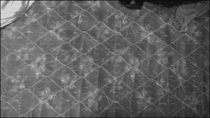

相机馈送中不同点的光流

# 图像金字塔

金字塔是相同图像的多个副本，它们的大小不同。它们以层的形式表示，如下所示。金字塔中的每一层都是通过将行和列减半获得的。因此，实际上，我们将图像的大小减少到原始大小的四分之一：

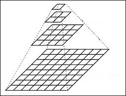

金字塔的相对大小

金字塔本质上定义了**减少**和**扩展**为其两个操作。减少指的是图像大小的减少，而扩展指的是图像大小的增加。

### 注意

我们将使用一个约定，即金字塔中的较低层表示缩小后的图像，而较高层表示放大后的图像。

## 高斯金字塔

在减少操作中，我们使用以下方程来连续找到金字塔中的层级，同时使用一个 5x5 的滑动窗口。请注意，图像的大小减少到原始大小的四分之一：

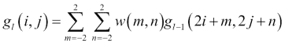

权重核的元素，*w*，应该加起来等于 1。我们为此任务使用了一个 5x5 的高斯核。这个操作类似于卷积，但结果图像的大小与原始图像不同。以下图像展示了减少操作：

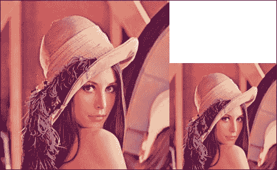

减少操作

扩展操作是减少操作的逆过程。我们尝试从属于较低层的图像生成较大尺寸的图像。因此，结果图像是模糊的，并且分辨率较低。我们用于执行扩展的方程如下：

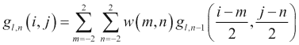

在这种情况下，权重核*w*与用于执行减少操作的权重核相同。以下图像展示了扩展操作：

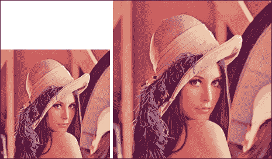

扩展操作

权重是使用我们在第一章中使用的，*对图像应用效果*，高斯函数来执行高斯模糊计算的。

## 拉普拉斯金字塔

拉普拉斯金字塔通常表示边缘。它们是从高斯金字塔获得的。它们使用以下公式计算：

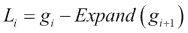

*g[i]和扩展* (*g*[*i*+1])在我们缩小图像后不再相同；我们丢失了信息，这些信息无法恢复。

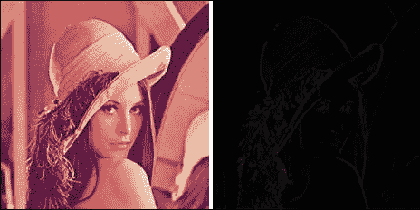

### OpenCV 中的高斯和拉普拉斯金字塔

要了解 OpenCV 中如何创建金字塔，我们将创建两个新的活动，分别称为 `PyramidActivity` 和 `HomeActivity`。`PyramidActivity` 类将从图库中加载一张图片，然后根据用户的选项执行所需的操作。`HomeActivity` 用于根据用户提供的选项调用 `PyramidActivity` 或 `MainActivity`。因此，首先，我们为 `HomeActivity` 类创建资源，并将其命名为 `activity_home.xml`：

```py
<?xml version="1.0" encoding="utf-8"?>

<ScrollView

    android:layout_width="match_parent"
    android:layout_height="match_parent" >
    <LinearLayout
        android:layout_height="match_parent"
        android:layout_width="match_parent"
        android:orientation="vertical" >

        <Button
            android:id="@+id/bPyramids"
            android:layout_height="wrap_content"
            android:layout_width="wrap_content"
            android:text="Image Pyramids" />

        <Button
            android:id="@+id/bOptFlowKLT"
            android:layout_height="wrap_content"
            android:layout_width="wrap_content"
            android:text="Optical Flow and KLT Tracker" />

    </LinearLayout>
</ScrollView>
```

在我们的 Java 代码中，我们将为这些按钮添加监听器以调用相应的活动，如下所示：

```py
Button bPyramids, bOptFlowKLT;
        bPyramids = (Button) findViewById(R.id.bPyramids);
        bOptFlowKLT = (Button) findViewById(R.id.bOptFlowKLT);
        bOptFlowKLT.setOnClickListener(new View.OnClickListener() {
            @Override
            public void onClick(View v) {
                Intent i = new Intent(getApplicationContext(), MainActivity.class);
                startActivity(i);
            }
        });
        bPyramids.setOnClickListener(new View.OnClickListener() {
            @Override
            public void onClick(View v) {
                Intent i = new Intent(getApplicationContext(), PyramidActivity.class);
                startActivity(i);
            }
        });
```

现在我们转向 `PyramidActivity` 的实现。首先，我们将查看 `activity_pyramid.xml`。我们将添加按钮以执行用户选项的各种操作。可能的选项是高斯金字塔向上、高斯金字塔向下和拉普拉斯金字塔计算。以下代码被插入到 `ScrollView` 内部的 `LinearLayout`：

```py
<ImageView
            android:layout_width="match_parent"
            android:layout_height="0dp"
            android:layout_weight="0.5"
            android:id="@+id/ivImage" />
        <LinearLayout
            android:layout_width="match_parent"
            android:layout_height="wrap_content"
            android:orientation="horizontal">
            <Button
                android:layout_width="match_parent"
                android:layout_height="wrap_content"
                android:layout_weight="0.5"
                android:id="@+id/bGaussianPyrUp"
                android:text="Gaussian Pyramid Up"/>
            <Button
                android:layout_width="match_parent"
                android:layout_height="wrap_content"
                android:layout_weight="0.5"
                android:id="@+id/bGaussianPyrDown"
                android:text="Gaussian Pyramid Down"/>
        </LinearLayout>

        <LinearLayout
            android:layout_width="match_parent"
            android:layout_height="wrap_content"
            android:orientation="horizontal">
            <Button
                android:layout_width="match_parent"
                android:layout_height="wrap_content"
                android:id="@+id/bLaplacianPyr"
                android:text="Laplacian Pyramid"/>
        </LinearLayout>
```

我们还将为这个活动创建一个菜单文件，用于从图库中加载图片。我们将有一个类似于前面章节中加载图片的方法。在 `PyramidActivity.java` 中，我们将有以下行：

```py
@Override
    public boolean onCreateOptionsMenu(Menu menu) {
        getMenuInflater().inflate(R.menu.menu_pyramid, menu);
        return true;
    }

    @Override
    public boolean onOptionsItemSelected(MenuItem item) {
        int id = item.getItemId();

        if (id == R.id.action_load_first_image) {
            Intent photoPickerIntent = new Intent(Intent.ACTION_PICK);
            photoPickerIntent.setType("image/*");
            startActivityForResult(photoPickerIntent, SELECT_PHOTO);
            return true;
        }

        return super.onOptionsItemSelected(item);
    }
```

现在我们将定义一些全局变量，我们将需要它们：

```py
private final int SELECT_PHOTO = 1;
private ImageView ivImage;
Mat src;
static int ACTION_MODE = 0;
static final int MODE_NONE = 0, MODE_GAUSSIAN_PYR_UP = 1, MODE_GAUSSIAN_PYR_DOWN = 2, MODE_LAPLACIAN_PYR = 3;
private boolean srcSelected = false;
Button bGaussianPyrUp, bGaussianPyrDown, bLaplacianPyr;
```

我们还需要指定 OpenCV 回调函数并在 `onResume` 中初始化它，就像我们之前做的那样。

在我们的 `onCreate` 函数中，初始化所有按钮之后，我们将首先禁用它们，直到从图库中加载了一张图片。因此，在这个活动中初始化所有按钮之后，添加以下行：

```py
bGaussianPyrDown.setEnabled(false);
bGaussianPyrUp.setEnabled(false);
bLaplacianPyr.setEnabled(false);
```

在我们的 `onActivityResult` 中，我们将检查图片是否已成功加载，如果是，我们将激活按钮。我们还将图片加载到 `Mat` 中并存储起来以供以后使用：

```py
switch(requestCode) {
            case SELECT_PHOTO:
                if(resultCode == RESULT_OK){
                    try {
                        final Uri imageUri = imageReturnedIntent.getData();
                        final InputStream imageStream = getContentResolver().openInputStream(imageUri);
                        final Bitmap selectedImage = BitmapFactory.decodeStream(imageStream);
                        src = new Mat(selectedImage.getHeight(), selectedImage.getWidth(), CvType.CV_8UC4);
                        Utils.bitmapToMat(selectedImage, src);
                        srcSelected = true;
                        bGaussianPyrUp.setEnabled(true);
                        bGaussianPyrDown.setEnabled(true);
                        bLaplacianPyr.setEnabled(true);
                    } catch (FileNotFoundException e) {
                        e.printStackTrace();
                    }
                }
                break;
        }
```

现在我们将为每个按钮添加监听器。在你的 `onCreate` 中，添加以下行：

```py
bGaussianPyrUp.setOnClickListener(new View.OnClickListener() {
            @Override
            public void onClick(View v) {
                ACTION_MODE = MODE_GAUSSIAN_PYR_UP;
                executeTask();
            }
        });

bGaussianPyrDown.setOnClickListener(new View.OnClickListener() {
            @Override
            public void onClick(View v) {
                ACTION_MODE = MODE_GAUSSIAN_PYR_DOWN;
                executeTask();
            }
        });

bLaplacianPyr.setOnClickListener(new View.OnClickListener() {
            @Override
            public void onClick(View v) {
                ACTION_MODE = MODE_LAPLACIAN_PYR;
                executeTask();
            }
        });
```

现在我们将实现 `executeTask` 函数，该函数将在 `AsyncTask` 中执行所需的计算，并在完成后将它们加载到我们布局中的 `ImageView`：

```py
private void executeTask(){
        if(srcSelected){

            new AsyncTask<Void, Void, Bitmap>() {
                @Override
                protected void onPreExecute() {
                    super.onPreExecute();
                }

                @Override
                protected Bitmap doInBackground(Void... params) {
                    Mat srcRes = new Mat();
                    switch (ACTION_MODE){
                        case MODE_GAUSSIAN_PYR_UP:
                            Imgproc.pyrUp(src, srcRes);
                            break;
                        case MODE_GAUSSIAN_PYR_DOWN:
                            Imgproc.pyrDown(src, srcRes);
                            break;
                        case MODE_LAPLACIAN_PYR:
                            Imgproc.pyrDown(src, srcRes);
                            Imgproc.pyrUp(srcRes, srcRes);
                            Core.absdiff(src, srcRes, srcRes);
                            break;
                    }

                    if(ACTION_MODE != 0) {
                        Bitmap image = Bitmap.createBitmap(srcRes.cols(), srcRes.rows(), Bitmap.Config.ARGB_8888);

                        Utils.matToBitmap(srcRes, image);
                        return image;
                    }
                    return null;
                }

                @Override
                protected void onPostExecute(Bitmap bitmap) {
                      super.onPostExecute(bitmap);
                      if(bitmap!=null) {
                        ivImage.setImageBitmap(bitmap);
                    }
                }
            }.execute();
        }
    }
```

在这里，我们只用了两个参数调用了 `pyrUp` 和 `pyrDown`；然而，你可以通过调用函数 `Imgproc.pyrUp(srcMat, dstMat, resultSize)` 来指定自定义的结果大小。

OpenCV 不提供单独的函数来计算拉普拉斯金字塔，但我们可以使用高斯金字塔来生成我们的拉普拉斯金字塔。

# 基本二维变换

3D 空间中的对象可以在 2D 空间中投射出与原始投影不同的投影。这种变换称为二维变换。它们在以下图像中显示。我们将使用其中一些变换来解释本章后面以及在其他章节中讨论的概念：

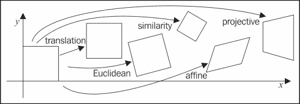

我们将这些变换写成数学形式，以及它们的矩阵表示，如下所示：

+   **平移**：平移变换的数学表示如下：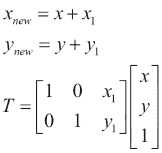

+   **仿射**：仿射变换的数学表示如下：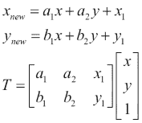

+   **刚性**：刚性变换的数学表示如下：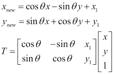

+   **投影**：投影变换的数学表示如下：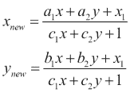

# 全球运动估计

如其名所示，全球运动估计是在计算中使用帧中所有像素来检测运动。全球运动估计的一些应用包括：

+   视频稳定化

+   视频编码/解码

+   物体分割

该方法由 Bergen 等人（1992 年）提出。在此方法中，当相机与背景场景之间的距离很大时，我们可以将对象的运动近似为仿射变换。我们之前看到的方程如下：

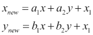

我们可以将这些方程重写为以下矩阵形式：

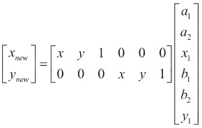

这可以写成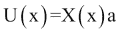。

根据光流方程：

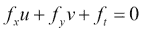

我们试图估计图像中的运动，使得所有像素都满足它。因此，我们求和所有像素的光流方程，并尝试生成一个估计：


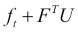理想情况下应为零，但实际上是一个小值。因此，平方误差将很小。因此，我们需要最小化它以获得最佳结果：

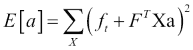

该方程可以相对于最小化到以下线性方程：


这个线性方程可以写成：


该算法现在分为四个子部分：金字塔构建、运动估计、图像扭曲和从粗到细的细化。

对于金字塔构建，我们首先对时间 *t* 和 *t-1* 的图像进行高斯金字塔，然后从最底层开始迭代计算全局流，逐渐向更底层移动。

然后，对于每一层，为了找到运动估计，我们使用之前推导出的线性方程来计算时间 *t* 和 *t-1* 的帧的 A 和 B，并使用这些信息来计算 *a*  的估计。然后我们将时间 *t-1* 的图像扭曲到另一个图像，该图像试图从原始图像生成对象运动。这个新图像与时间 *t* 捕获的图像进行比较。然后我们迭代扭曲在 *t-1* 获得的图像帧以计算  的值。有了  的这个值，我们生成另一个扭曲图像，然后将其与时间 *t* 的图像进行比较。我们使用  的这个值来更新 *a* 的值。这个过程执行多次，直到我们得到图像运动的足够好的估计。

图像扭曲是将任何变换应用于图像以产生另一个图像的过程。对于这种方法，我们执行仿射变换，因为我们之前的假设：


对于最后一步，从粗到细的细化，我们利用图像金字塔将我们的模型扩展到包括密集图像（例如，表示深度图）。

# Kanade-Lucas-Tomasi 跟踪器

在了解了局部和全局运动估计之后，我们现在将看看目标跟踪。跟踪目标是计算机视觉最重要的应用之一。**Kanade-Lucas-Tomasi**（**KLT**）跟踪器通过光流在视频中跟踪对象。实现该算法的步骤如下所述：

1.  在视频的第一帧中检测 Harris 角点。

1.  对于每个检测到的 Harris 角点，使用光流（translator）和局部仿射变换（affine）计算连续帧之间的运动。

1.  现在将这些运动矢量从一帧链接到另一帧以跟踪角点。

1.  在特定数量的帧（例如，10 到 20 帧）之后生成新的 Harris 角点，以补偿场景中进入的新点或丢弃场景外的点。

1.  跟踪新的和旧的 Harris 点。

## 在 OpenCV 上检查 KLT 跟踪器

如我们之前所见，KLT 跟踪器是可用的最佳算法之一，用于在视频中跟踪对象。对于这个例子，我们将从摄像头获取输入，检测一些可跟踪的特征，并将这些特征更新到新位置，如 `calcOpticalFlowPyrLK` 函数获得的位置。我们只需将一个新的情况构造添加到我们为光流编写的代码中：

```py
case VIEW_MODE_KLT_TRACKER:
                mGray = inputFrame.gray();

                if(features.toArray().length==0){
                    Imgproc.goodFeaturesToTrack(mGray, features, 10, 0.01, 10);
                    prevFeatures.fromList(features.toList());
                    mPrevGray = mGray.clone();
                    break;
                }
```

`goodFeaturesToTrack` 函数使用 Shi-Tomasi 方法来计算图像中的良好可追踪特征。这可以被任何可靠的特征计算技术所替代。它以灰度格式作为输入帧，并返回特征列表。它还接受要追踪的最大特征数量、特征的质最以及特征之间的最小距离作为参数。在本示例中，我们只将在第一帧中计算特征，并在后续帧中追踪这些特征。

现在我们将获得之前获得的特征点的光流。请注意，`nextFeatures` 包含在 `prevFeatures` 中的前一个帧中相应点的位置。我们将用圆圈标记特征点的位置。请注意，我们是在特征的新位置上画圆圈：

```py
                Video.calcOpticalFlowPyrLK(mPrevGray, mGray, prevFeatures, nextFeatures, status, err);
                List<Point> drawFeature = nextFeatures.toList();
                for(int i = 0; i<drawFeature.size(); i++){
                    Point p = drawFeature.get(i);
                    Core.circle(mGray, p, 5, new Scalar(255));
                }
```

现在我们需要将当前帧设置为前一个帧，并将当前特征点的位置设置为前一个帧中特征的位置，以便启用追踪：

```py
                mPrevGray = mGray.clone();
                prevFeatures.fromList(nextFeatures.toList());
                break;
```

Shi-Tomasi 追踪器和 KLT 追踪器的结果可以在以下图像中看到：


以下图像中的白色圆圈代表我们正在追踪的特征：


如图中所示，有一些点没有正确追踪。例如，考虑 *L* 键上的特征点。如您所见，在一个帧中，它位于 *L* 键上，而在另一个帧中，它移动到了带有分号的键上。如果您考虑 *Y* 和 *J* 键上的特征点，它们保持在它们的位置。这是因为 *Y* 和 *J* 键上有定义良好的角点；因此，特征点在那里更好。

# 摘要

在本章中，我们学习了如何在视频中检测局部和全局运动，以及如何追踪对象。我们还了解了高斯和拉普拉斯金字塔，以及它们如何被用来提高某些计算机视觉任务的性能。

在下一章中，我们将学习如何对多张图像进行对齐，以及如何将它们拼接在一起形成全景图像。
