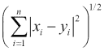
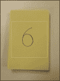
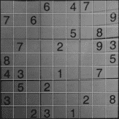

# 第七章. 使用 OpenCV 机器学习让您的应用生动起来

在我们周围有如此多的数据，我们需要更好的系统和应用程序来处理它们，并从中提取相关信息。处理这一问题的计算机科学领域是**机器学习**。在本章中，我们将探讨可以用来利用我们周围的所有数据并构建能够处理未遇到的情况或场景的智能应用程序的不同机器学习技术，而不需要任何形式的人类干预。

近年来，计算机视觉和机器学习之间形成了强大的协同作用，从而使得一些极其高效和有用的技术得以实现。类人机器人、机械臂和装配线是计算机视觉和机器学习应用的一些例子。开发者和研究人员现在正试图利用移动平台构建轻量级的应用程序，供普通人使用。在下一节中，我们将使用标准的 OpenCV 和 Android API 构建一个用于**光学字符识别**（**OCR**）的应用程序。在结尾部分，我们将回顾我们在第二章中开始开发的应用程序——*图像中的基本特征检测*。

我们将在构建应用程序的同时理解机器学习技术。

# 光学字符识别

**光学字符识别**（**OCR**）是计算机视觉和机器学习中最受欢迎的研究主题之一。对于 OCR，有许多现成的有效实现和算法可供选择，但为了更好地理解概念，我们将构建自己的 OCR Android 应用程序。在我们开始编写应用程序的代码之前，让我们花一些时间来了解一下不同的字符识别技术及其工作原理。在本章中，我们将使用两种标准的机器学习技术：**k 最近邻**（**KNN**）和**支持向量机**（**SVM**），来构建我们的应用程序。

本章的目标是构建一个实时数字识别应用程序。该应用程序将在移动屏幕上显示实时摄像头输出，一旦摄像头捕捉到一个数字，我们就会识别该数字。

## 使用 k 最近邻进行 OCR

k 最近邻是用于监督分类的最简单算法之一。在 KNN 中，我们提供训练数据集及其相应的标签作为输入。创建一个 n 维空间（其中*n*是每个训练数据的长度），并将每个训练数据点绘制在该空间中。在分类过程中，我们将要分类的数据绘制到相同的 n 维空间中，并计算该点与空间中其他点的距离。计算出的距离用于为测试数据找到一个合适的类别。

下面是算法工作步骤的逐步解释：

1.  选择用户定义的*k*值。

1.  将训练数据及其类别以行向量的形式存储。

1.  将输入查询（待分类的数据）与训练数据中的每个行向量之间的距离计算出来（距离的含义将在下面的框中解释）。

1.  按照查询数据（在上一步计算的距离）的升序对所有的行向量进行排序。

1.  最后，从第一个*k*个排序后的行向量中选择具有多数行向量的类别（训练标签），作为预测类别。

### 注意

**向量之间的距离**

在欧几里得空间中，我们定义两个向量之间的距离如下：



其中，*xi*和*yi*分别是两个向量*x*和*y*的第*i*个维度值。*n*是训练向量（在我们的例子中是*x*和*y*）的长度。该算法不对我们可以使用的距离类型施加任何限制。我们可以使用的其他一些距离类型包括**曼哈顿距离**、最大距离等。有关其他距离定义，请参阅[`en.wikipedia.org/wiki/Distance`](http://en.wikipedia.org/wiki/Distance)。

简单到极点！我们如何使用它来处理图像数据？为了能够使用 KNN 处理图像数据，我们需要将训练图像转换为某种行向量。

考虑一个 10x10 的灰度图像，该图像可以是 1 到 9 中的任意一个数字。从 10x10 图像中获取特征向量的最简单和最快的方法是将它转换成一个 1x100 的行向量。这可以通过将图像中的行依次连接起来完成。这样，我们可以将训练集中的所有图像转换为行向量，以便以后在 KNN 分类器中使用。

为了使我们能够构建数字识别应用程序，我们将将其分解为以下列出的较小部分，并最终将它们组合在一起：

+   制作相机应用程序

+   处理训练数据

+   识别捕获的数字

### 制作相机应用程序

我们将首先构建一个简单的相机应用程序，该程序在屏幕上显示相机输出，就像我们在第四章中做的那样，*深入对象检测 - 使用级联分类器*：

+   在 Eclipse（或 Android Studio）中创建一个新的 Android 项目

+   在项目中初始化 OpenCV（参考第一章，*应用图像效果*）。

+   使用以下代码片段将`JavaCameraView`添加到主活动：

    ```py
    <org.opencv.android.JavaCameraView
            android:layout_width="fill_parent"
            android:layout_height="fill_parent"
            android:visibility="gone"
            android:id="@+id/java_surface_view"
            opencv:camera_id="any" />
    ```

一旦相机就位，在屏幕上画一个方框，这将帮助用户定位他/她想要识别的数字。用户将指向该数字并尝试将其带入屏幕上画出的方框内（如图 1 所示）。将以下代码片段复制到 Mat `onCameraFrame()`函数中：

```py
Mat temp = inputFrame.rgba();

Core.rectangle(temp, new Point(temp.cols()/2 - 200, temp.rows() / 2 - 200), new Point(temp.cols() / 2 + 200, temp.rows() / 2 + 200), new Scalar(255,255,255),1);
```

在此代码中，我们取移动摄像头捕获的帧的大小，并在图像中心绘制一个 400x400（可根据屏幕大小调整）的白色矩形（如图 1 所示）。就这样。相机应用就准备好了。接下来，是处理应用中的训练数据。



图 1. 相机应用截图

### 处理训练数据

这是应用程序中最复杂的一部分。训练数据在任何机器学习应用中都起着至关重要的作用。此类应用处理的数据量通常在几兆字节左右。对于普通桌面应用来说，这可能不是问题，但对于移动应用（由于资源限制），即使正确处理约 50 兆字节的数据也可能导致性能问题。代码需要简洁、直接，并且应尽量减少内存泄漏。

对于此应用，我们将使用公开可用的手写数字数据集——MNIST 来训练 KNN 分类器。

### 注意

从此页面提供的 MNIST 手写数字数据库 ([`yann.lecun.com/exdb/mnist/`](http://yann.lecun.com/exdb/mnist/)) 包含 60,000 个示例的训练集和 10,000 个示例的测试集。它是 MNIST 可用的大集合的一个子集。数字已被尺寸归一化并居中在固定大小的图像中。（文本摘自 Yann LeCun 教授的网页，该网页可在 [`yann.lecun.com`](http://yann.lecun.com) 上找到。）

首先，使用以下链接下载 MNIST 训练数据：

+   训练图像位于 [`yann.lecun.com/exdb/mnist/train-images-idx3-ubyte.gz`](http://yann.lecun.com/exdb/mnist/train-images-idx3-ubyte.gz)

+   训练标签位于 [`yann.lecun.com/exdb/mnist/train-labels-idx1-ubyte.gz`](http://yann.lecun.com/exdb/mnist/train-labels-idx1-ubyte.gz)

提取下载的文件并将它们传输到 Android 手机上（确保你有大约 60 MB 的可用空间）。

回到我们的应用，创建一个新的 `DigitRecognizer` 类，该类将处理与数字识别相关的所有任务，包括将数据集加载到应用中、训练分类器以及最终识别数字。将一个新的 Java 类添加到项目中，并将其命名为 `DigitRecognizer`。

因此，我们已经在手机中存储了训练图像和训练标签。我们需要将这些数据加载到应用中。为此，我们只需从这些文件中读取数据，并使其与 OpenCV 的 API 兼容。

在之前创建的 `DigitRecognizer` 类中添加一个新的函数 `void ReadMNISTData()`。这个函数将读取 MNIST 数据集并以 Mat（OpenCV 存储图像的类）的形式存储。将数据集分为两部分读取：首先，训练图像，然后是训练标签。

在`ReadMNISTData()`中，创建一个新的`File`对象，它将存储手机 SD 卡的路径（如下所示）。如果文件在手机的内部存储中，则跳过此步骤，并提供我们希望在代码中稍后使用的文件的绝对路径：

```py
File external_storage = Environment.getExternalStorageDirectory();
```

完成这些操作后，创建另一个`File`对象，它将指向我们希望在应用程序中读取的确切文件，以及一个`InputStreamReader`对象，它将帮助我们读取文件：

```py
File mnist_images_file = new File(external_storage, images_path);

FileInputStream images_reader = new FileInputStream(mnist_images_file);
```

在这里，`images_path`是`train-images-idx3-ubyte.idx3`训练图像文件的绝对路径。

在我们继续编写代码之前，我们需要了解图像是如何存储在文件中的。以下是训练图像文件内容的描述：

```py
[offset] [type]          [value]          [description] 
0000     32 bit integer  0x00000803(2051) magic number 
0004     32 bit integer  60000            number of images 
0008     32 bit integer  28               number of rows 
0012     32 bit integer  28               number of columns 
0016     unsigned byte  ??                pixel 
0017     unsigned byte   ??               pixel 
........ 
xxxx     unsigned byte   ??               pixel
```

像素按行组织。像素值从 0 到 255，其中 0 表示背景（白色），255 表示前景（黑色）。

有了这些信息，我们可以继续编写代码：

```py
Mat training_images = null;

try{
            //Read the file headers which contain the total number of images and dimensions. First 16 bytes hold the header
            /*
            byte 0 -3 : Magic Number (Not to be used)
            byte 4 - 7: Total number of images in the dataset
            byte 8 - 11: width of each image in the dataset
            byte 12 - 15: height of each image in the dataset
            */

            byte [] header = new byte[16];
            images_reader.read(header, 0, 16);

            //Combining the bytes to form an integer
            ByteBuffer temp = ByteBuffer.wrap(header, 4, 12);
            total_images = temp.getInt();
            width = temp.getInt();
            height = temp.getInt();

            //Total number of pixels in each image
            int px_count = width * height;
            training_images = new Mat(total_images, px_count, CvType.CV_8U);

            //images_data = new byte[total_images][px_count];
            //Read each image and store it in an array.

            for (int i = 0 ; i < total_images ; i++)
            {
                byte[] image = new byte[px_count];
                images_reader.read(image, 0, px_count);
                training_images.put(i,0,image);
            }
            training_images.convertTo(training_images, CvType.CV_32FC1);
            images_reader.close();
        }
        catch (IOException e)
        {
            Log.i("MNIST Read Error:", "" + e.getMessage());
        }
```

在前面的代码中，首先读取文件的前 16 个字节，这些字节存储了图像的数量、高度和宽度（参考上述描述文件内容的表格）。通过组合四个字节，每个整数一个字节，使用`ByteBuffer`类从 16 个字节中获取四个整数。

在 OpenCV 中，KNN 的实现要求我们使用 Mat 类传递所有特征向量。每个训练图像都需要被转换为一个行向量，这将形成 Mat 对象的行，然后传递给 KNN 分类器。例如，如果我们有 5,000 个训练图像，每个图像的尺寸为 20x20，我们需要一个 5000x400 维度的 Mat 对象，可以传递给 OpenCV 的 KNN 训练函数。困惑了吗？继续阅读！

从训练数据集中取一个 20x20 的图像，并将其通过逐行追加的方式转换为 1x400 的向量。对所有图像都这样做。最后，我们将拥有 5,000 个这样的 1x400 向量。现在，创建一个新的 Mat 对象，其维度为 5000x400，这个新 Mat 对象的每一行都将是我们刚才通过调整数据集中原始图像的大小而获得的 1x400 向量。

这就是前面那段代码想要做的。首先，使用以下代码读取图像中的所有像素：

```py
byte[] image = new byte[px_count];
images_reader.read(image, 0, px_count);
```

在这里，`px_count`是训练图像中像素的总数，`image`是一个行向量，用于存储图像。如前所述，我们需要将这些行向量复制到 Mat 对象中（`training_images`指的是将用于存储这些训练图像的 Mat 对象）。按照以下方式将`image`行向量复制到`training_images`中：

```py
training_images.put(i,0,image);
```

训练数据已经就绪。我们现在需要它们的对应标签。正如我们为训练图像所做的那样，它们的对应标签（标签值从 0 到 9）也可以以相同的方式读取。`labels`文件的内容按以下方式排列：

```py
[offset] [type]         [value]          [description] 
0000     32 bit integer  0x00000801(2049) magic 
  number (MSB first)
0004     32 bit integer  60000            number of items 
0008     unsigned byte   ??               label 
0009     unsigned byte   ??               label 
........ 
xxxx     unsigned byte   ??               label
```

下面是读取标签的代码：

```py
//Read Labels
        Mat training_labels = null;

        labels_data = new byte[total_images];
        File mnist_labels_file = new File(external_storage, labels_path);
        FileInputStream labels_reader = new FileInputStream(mnist_labels_file);

        try{

            training_labels = new Mat(total_images, 1, CvType.CV_8U);
            Mat temp_labels = new Mat(1, total_images, CvType.CV_8U);
            byte[] header = new byte[8];
            //Read the header
            labels_reader.read(header, 0, 8);
            //Read all the labels at once
            labels_reader.read(labels_data,0,total_images);
            temp_labels.put(0,0, labels_data);

            //Take a transpose of the image
            Core.transpose(temp_labels, training_labels);
            training_labels.convertTo(training_labels, CvType.CV_32FC1);
            labels_reader.close();
        }
        catch (IOException e)
        {
            Log.i("MNIST Read Error:", "" + e.getMessage());
        }
```

上述代码的基础与用于读取图像的代码类似。

我们已经成功地将训练数据加载到我们的应用程序中。此时，你可以使用 Android 的某些诊断工具来检查应用程序的内存使用情况。你需要注意的一个重要点是不要重复数据。这样做会增加内存消耗量，这可能会影响你应用程序的性能以及手机上运行的其他应用程序的性能。将 `training_images` 和 `training_labels` Mat 对象传递给 OpenCV 的 KNN 分类器对象：

```py
knn = new CvKNearest();
knn.train(training_images, training_labels, new Mat(), false, 10, false);
```

KNN 分类器已经准备好了。我们现在可以开始对数据进行分类了。

### 识别数字

这是应用程序的最后一部分。在这里，我们将从摄像头捕获的帧作为分类器的输入，并允许分类器预测帧中的数字。

首先，在上一节创建的 `DigitRecognizer` 类中添加一个新的函数 `void FindMatch()`，如下所示：

```py
void FindMatch(Mat test_image)
    {

        //Dilate the image
        Imgproc.dilate(test_image, test_image, Imgproc.getStructuringElement(Imgproc.CV_SHAPE_CROSS, new Size(3,3)));
        //Resize the image to match it with the sample image size
        Imgproc.resize(test_image, test_image, new Size(width, height));
        //Convert the image to grayscale
        Imgproc.cvtColor(test_image, test_image, Imgproc.COLOR_RGB2GRAY);
        //Adaptive Threshold
        Imgproc.adaptiveThreshold(test_image,test_image,255,Imgproc.ADAPTIVE_THRESH_MEAN_C, Imgproc.THRESH_BINARY_INV,15, 2);

        Mat test = new Mat(1, test_image.rows() * test_image.cols(), CvType.CV_32FC1);
        int count = 0;
        for(int i = 0 ; i < test_image.rows(); i++)
        {
            for(int j = 0 ; j < test_image.cols(); j++) {
                test.put(0, count, test_image.get(i, j)[0]);
                count++;
            }
        }

        Mat results = new Mat(1, 1, CvType.CV_8U);

        knn.find_nearest(test, 10, results, new Mat(), new Mat());
        Log.i("Result:", "" + results.get(0,0)[0]);

    }
```

### 注意

注意：训练数据集中的图像是 28x28 的二进制图像。

摄像头输出不能直接使用。我们需要对图像进行预处理，使其尽可能接近训练数据集中的图像，以便我们的分类器给出准确的结果。

执行以下步骤（最好是按相同顺序）以使摄像头输出可用于 KNN 分类器：

1.  扩展图像以使数字在图像中更加突出，并减少任何背景噪声。

1.  将图像调整大小为 28x28。训练图像也是这个尺寸。

1.  将图像转换为灰度图像。

1.  对图像执行自适应阈值以获得二值图像。

### 注意

这里使用的所有参数都受光照条件的影响。请根据您的环境调整这些参数以获得最佳结果。

在完成这些步骤后，我们将有一个需要放入我们在上一节中训练的 KNN 分类器的测试。在这之前，还需要对测试图像进行一项操作——将图像转换为行向量（记得我们对训练图像所做的转换？）。将 28x28 的测试图像转换为 1x784 的行向量。使用以下代码片段进行转换：

```py
Mat test = new Mat(1, test_image.rows() * test_image.cols(), CvType.CV_32FC1);
int count = 0;
for(int i = 0 ; i < test_image.rows(); i++)
{
    for(int j = 0 ; j < test_image.cols(); j++) {
        test.put(0, count, test_image.get(i, j)[0]);
        count++;
    }
}
```

最后，将转换后的 `test` 图像传递给 KNN 分类器，并将结果存储在 1x1 Mat 对象 `results` 中。`find_nearest` 函数中的最后两个参数是可选的：

```py
knn.find_nearest(test, 10, results, new Mat(), new Mat());
```

最后一件事情，我们何时以及如何调用 `FindMatch` 函数？由于我们正在构建一个实时数字识别应用程序，我们需要在摄像头的每一帧输出上执行匹配操作。因此，我们需要在主活动类的 `onCameraFrame()` 中调用这个函数。函数最终应该看起来像这样：

```py
public Mat onCameraFrame(CvCameraViewFrame inputFrame) {

        //Get image size and draw a rectangle on the image for reference
        Mat temp = inputFrame.rgba();
        Core.rectangle(temp, new Point(temp.cols()/2 - 200, temp.rows() / 2 - 200), new Point(temp.cols() / 2 + 200, temp.rows() / 2 + 200), new Scalar(255,255,255),1);
        Mat digit = temp.submat(temp.rows()/2 - 180, temp.rows() / 2 + 180, temp.cols() / 2 - 180, temp.cols() / 2 + 180).clone();
        Core.transpose(digit,digit);
        mnist.FindMatch(digit);

        return temp;
    }
```

我们从摄像头的 RGBA 输出中提取出我们在屏幕上之前画出的矩形所包围的图像部分。我们希望用户将数字放入矩形内，以便成功识别。

由于我们的应用程序是为横幅模式编写的（在`AndroidManifest.xml`文件中设置），但我们使用的是竖屏模式，因此在我们运行识别算法之前需要转置测试图像。因此，运行以下命令：

```py
Core.transpose(digit,digit);
```

我们已经成功创建了一个实时数字识别应用程序。让我们看看另一种可以用于识别数字的机器学习技术。

## 使用支持向量机进行 OCR

**支持向量机**（**SVMs**）是常用的监督学习算法，常用于分类和回归。在 SVMs 中，训练数据被无限超平面划分为不同的区域，每个区域代表一个类别。为了测试数据，我们在与训练点相同的空间中绘制点，并使用超平面计算测试点所在的区域。SVMs 在处理高维数据时非常有用。

### 注意

关于 SVMs 的详细信息，您可以参考[`www.support-vector-machines.org/`](http://www.support-vector-machines.org/)。

在本节中，我们将学习如何使用 SVMs 进行数字识别。与 KNN 一样，为了训练 SVM，我们将直接使用训练图像，而不进行任何图像处理或检测额外特征。

### 注意

而不是直接使用训练图像，我们可以从图像中提取一些特征，并使用这些特征作为 SVM 的训练数据。一个用 Python 实现的 OpenCV 教程采用了不同的路径。在这里，他们首先使用仿射变换来校正图像，然后计算方向梯度直方图（Histogram of Orientation Gradients）。这些 HoG 特征被用来训练 SVM。我们不遵循相同路径的原因是因为计算仿射变换和 HoG 所涉及的计算成本。

在我们之前构建的应用程序中使用 SVM 而不是 KNN 只涉及轻微的修改。基本的相机应用程序和处理训练数据保持不变。唯一需要修改的是数字识别部分，在那里我们训练分类器。

在`ReadMNISTData()`函数中，我们不会创建 KNN 分类器对象，而是创建一个 SVM 对象。删除以下声明和初始化 KNN 对象的行：

```py
knn = new CvKNearest();
knn.train(training_images, training_labels, new Mat(), false, 10, false);
```

现在，用以下行替换它们（声明和初始化一个 SVM 对象）：

```py
svm = new CvSVM();
svm.train(training_images, training_labels);
```

SVM 分类器现在已经准备好了。KNN 分类器的下一步是将测试图像传递给分类器并检查结果。为此，我们需要修改`FindMatch()`函数。将使用 KNN 进行分类的行替换为使用 SVM 的适当行。

### 注意

用户可以在前面的应用程序中采用的一种优化是，他们可以将训练好的分类器保存到设备上的文件中。这将节省重复训练分类器的时间。

让我们看看以下命令：

```py
knn.find_nearest(test, 10, results, new Mat(), new Mat());
```

我们需要将前面的命令替换为以下命令：

```py
svm.predict(test);
```

这就结束了。我们的应用程序已经准备好了。我们可以运行应用程序，检查结果，并可能比较在什么条件下哪个算法运行得更好。

# 解决数独谜题

记得第二章 *检测图像的基本特征* 中提到的数独谜题项目吗？现在是重新审视这个项目的完美时机，看看我们是否可以用本章学到的任何东西来完成这个应用程序。所以，在第二章 *检测图像的基本特征* 中，我们成功检测到了数独谜题。在那个应用程序中，只剩下两件事要做：识别数字和解决数独谜题。

## 识别谜题中的数字

让我们从第二章 *检测图像的基本特征* 中我们留下的地方继续前进。在成功检测到网格后，我们需要进一步将网格分解成 81 个小方格。有许多可能的方法来做这件事，但在这里，我们只会查看三种技术。

首先，最容易的方法是在图像上绘制九条等距的垂直和水平线，并假设数字将被放置在这些线形成的方框内。



图 2. 数独网格上绘制的垂直和水平线

第二种方法是使用霍夫线。在数独网格上应用霍夫线，并存储返回的所有线。理想情况下，应该返回九条垂直线和九条水平线，但这种情况发生的可能性非常小，除非你有一个非常好的相机和完美的照明条件。可能会有缺失或不完整的线，这会降低应用程序的性能或可能导致错误的结果。

第三种方法是使用角点检测。运行任何角点检测算法，并获取图像中的所有角点。这些角点代表了包围数字的方框的顶点。一旦你有了所有角点，你可以连接四个角来形成一个方框，并提取该图像部分。

之前提到的方法并不总是能保证完美的结果。不同的技术可能在不同环境和使用的相机类型下表现更好。

使用之前提到的任何技术提取所有 89 张图像，并将它们通过一个预训练的数字分类器——SVM 或 KNN（如前几节所示）进行分类。完成！将分类器的输出转换为你的代码中的 9x9 整数矩阵，并用从网格中识别出的相应数字填充它。现在我们有了这个网格。使用任何暴力破解或人工智能算法来获取数独谜题的正确解决方案。可以使用的不同算法如下：

+   回溯法

+   遗传算法

+   数独作为约束问题

有关这些算法的详细解释，请参阅[`en.wikipedia.org/wiki/Sudoku_solving_algorithms`](http://en.wikipedia.org/wiki/Sudoku_solving_algorithms)。

# 摘要

在本章中，我们探讨了如何通过将机器学习融入其中来使应用程序变得智能。我们讨论了支持向量机（Support Vector Machines）和 KNN（K-Nearest Neighbors），以及我们如何使用它们来构建能够从用户输入数据中学习模式的应用程序。到目前为止，我们已经详细介绍了许多计算机视觉算法及其实现。在下一章中，我们将探讨在构建此类应用程序时常见的一些错误，以及一些有助于使应用程序更高效的最佳实践。
