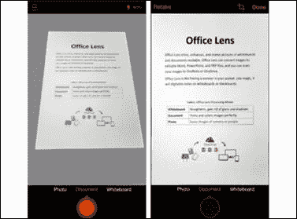
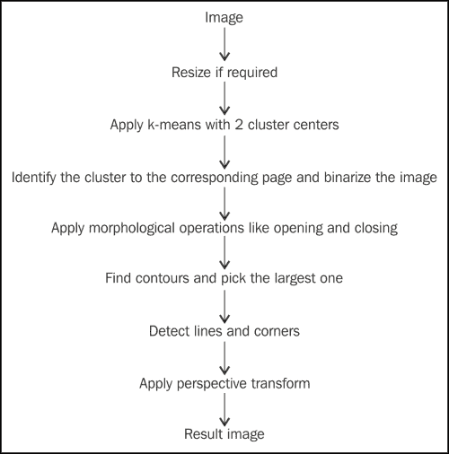
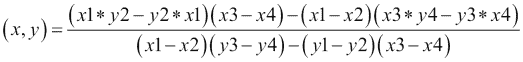
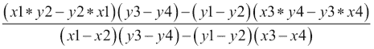
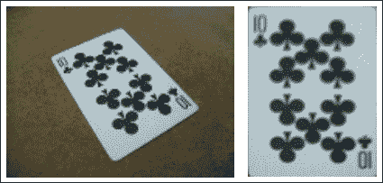

# 第九章. 开发文档扫描应用

在本章中，我们将构建一个类似于微软的 Office Lens 的文档扫描应用。这个应用可能会大幅提高生产力。例如，你可以在纸上写下笔记，然后只需点击它的图片，无需担心与设备对齐。然后，使用我们在前面章节中学到的一些算法，我们可以检测页面并仅抓取图像的这部分。

在本章中，我们将直接进入代码，并在每一步看到输出。为了了解本章结束时我们将实现什么，让我们看一下以下图。下面的图像显示了微软的 Office Lens 的实际操作截图：



# 让我们开始

首先，我们需要设置我们的 Android 项目，就像我们在前面的章节中所做的那样。我们将使用项目 ID `com.masteringopencvandroid.chapter9`。对于这个应用，我们不会编写任何 C++代码，因为这个任务不是非常计算密集型，它依赖于速度。然而，如果你需要，这个项目可以使用我们前面章节中使用的原生 C++代码来完成。

首先，我们将在我们的 `AndroidManifest.xml` 文件中声明所需的权限。我们需要这个项目的相机权限和将结果图像保存到内存的权限。因此，在清单标签中添加以下行：

```py
<uses-permission 
        android:name="android.permission.CAMERA"/>
<uses-permission
        android:name="android.permission.WRITE_EXTERNAL_STORAGE"/>
        <uses-permission
        android:name="android.permission.READ_EXTERNAL_STORAGE"/>
```

现在，我们将声明我们项目中的活动。为了演示目的，我们只需要一个活动。我们将称之为 `LensActivity`。因此，我们将向我们的应用程序标签中添加以下内容：

```py
<activity
    android:name=".LensActivity"
    android:label="@string/title_activity_lens"
    android:theme="@style/AppTheme"  >
    <intent-filter>
        <action android:name="android.intent.action.MAIN" />

        <category android:name="android.intent.category.LAUNCHER" />
    </intent-filter>
</activity>
```

接下来，我们将设置我们的布局文件。我们将称之为 `activity_lens.xml`。我们的布局将有两个按钮：一个可以用来调用 Android 系统的相机意图，另一个将用于从文件中选择图像。然后，我们将处理系统返回的图像以检测和提取图像中的页面。它还将有一个 `ImageView` 标签来显示结果图像，如下面的代码所示：

```py
<?xml version="1.0" encoding="utf-8"?>
<ScrollView 
    android:layout_width="match_parent"
    android:layout_height="match_parent" >
    <LinearLayout android:orientation="vertical" android:layout_width="match_parent"
        android:layout_height="wrap_content">

        <ImageView
            android:layout_width="match_parent"
            android:layout_height="0dp"
            android:layout_weight="0.5"
            android:id="@+id/ivImage" />
        <LinearLayout
            android:layout_width="match_parent"
            android:layout_height="wrap_content"
            android:orientation="horizontal">
            <Button
                android:layout_width="match_parent"
                android:layout_height="wrap_content"
                android:layout_weight="0.5"
                android:id="@+id/bClickImage"
                android:text="Click image"/>
            <Button
                android:layout_width="match_parent"
                android:layout_height="wrap_content"
                android:layout_weight="0.5"
                android:id="@+id/bLoadImage"
                android:text="Load image"/>
        </LinearLayout>

    </LinearLayout>
</ScrollView>
```

现在我们已经准备好了布局，我们可以深入到 Java 代码中。在下一节中，我们将看到算法的逐步解释。

# 算法

在本节中，让我们看看我们将采取的步骤以实现我们的结果。我们的第一个任务是检测纸张与背景。为此，我们将应用具有两个聚类中心的 k-means 算法。通过这两个聚类中心，我们可以检测哪一个代表页面，哪一个对应于背景，并创建一个二值图像。

现在，我们将使用代表纸张的聚类并尝试使用矩形核进行形态学开闭操作来去除一些噪声和填补一些空隙。

接下来，我们将尝试找到页面的外边界并使用它来检测角落。为此，我们将检测二值图像中的轮廓，然后识别面积最大的轮廓。

一旦我们有了最大的轮廓，我们将使用概率霍夫变换检测线条。然后，我们将连接这些线条并检测角落。

一旦我们有了角落，我们将检测哪个角落对应于哪个其他角落，然后应用透视变换以仅从整个图像中获取页面。

下图以流程图的形式展示了快速参考的步骤：



这个过程的某些假设和限制是页面必须是白色的，并且必须容易与背景区分开来。

# 在 Android 上实现

打开`LensActivity.java`文件。首先，我们将声明并初始化我们的`Button`和`ImageView`。然后，我们将为按钮添加`onClickListener`。我们将调用`ImageCapture`意图，这将打开相机应用以点击图片，如下所示：

```py
ivImage = (ImageView)findViewById(R.id.ivImage);
Button bClickImage, bLoadImage;

bClickImage = (Button)findViewById(R.id.bClickImage);
bLoadImage = (Button)findViewById(R.id.bLoadImage);

bClickImage.setOnClickListener(new View.OnClickListener() {
    @Override
    public void onClick(View v) {
        Intent intent = new 
        Intent(MediaStore.ACTION_IMAGE_CAPTURE);
        errorMsg = null;
        File imagesFolder = new File(FILE_LOCATION);
        imagesFolder.mkdirs();
        File image = new File(imagesFolder, "image_10.jpg");
        fileUri = Uri.fromFile(image);
        Log.d("LensActivity", "File URI = " + fileUri.toString());
        intent.putExtra(MediaStore.EXTRA_OUTPUT, fileUri); 

        // start the image capture Intent
        startActivityForResult(intent, CLICK_PHOTO);
    }
});        
bLoadImage.setOnClickListener(new View.OnClickListener() {
    @Override
    public void onClick(View v) {
        Intent intent = new Intent();
        intent.setType("image/*");
        intent.setAction(Intent.ACTION_GET_CONTENT);
        intent.addCategory(Intent.CATEGORY_OPENABLE);
        errorMsg = null;
        startActivityForResult(intent, LOAD_PHOTO);
    }
});
```

现在，我们将添加接收这些意图调用结果的代码部分，由我们的活动来处理：

```py
@Override
protected void onActivityResult(int requestCode, int 
  resultCode, Intent imageReturnedIntent) {
    super.onActivityResult(requestCode, resultCode, 
      imageReturnedIntent);

    Log.d("LensActivity", requestCode + " " + CLICK_PHOTO + " 
      " + resultCode + " " + RESULT_OK);

    switch(requestCode) {
        case CLICK_PHOTO:
            if(resultCode == RESULT_OK){
                try {
                    Log.d("LensActivity", fileUri.toString());
                    final InputStream imageStream = 
                      getContentResolver().
                      openInputStream(fileUri);
                    final Bitmap selectedImage = 
                      BitmapFactory.decodeStream(imageStream);
                    srcOrig = new Mat(selectedImage.
                      getHeight(), selectedImage.
                      getWidth(), CvType.CV_8UC4);
                    src = new Mat();
                    Utils.bitmapToMat(selectedImage, srcOrig);

                    scaleFactor = calcScaleFactor(
                      srcOrig.rows(), srcOrig.cols());

                    Imgproc.resize(srcOrig, src, new 
                      Size(srcOrig.rows()/scaleFactor, 
                      srcOrig.cols()/scaleFactor));
                    getPage();
                } catch (FileNotFoundException e) {
                    e.printStackTrace();
                }
            }
            break;
        case LOAD_PHOTO:
            if(resultCode == RESULT_OK){
                try {
                    InputStream stream = getContentResolver().
                      openInputStream(
                      imageReturnedIntent.getData());
                    final Bitmap selectedImage = 
                      BitmapFactory.decodeStream(stream);
                    stream.close();
                    ivImage.setImageBitmap(selectedImage);
                    srcOrig = new Mat(selectedImage.
                      getHeight(), selectedImage.
                      getWidth(), CvType.CV_8UC4);
                    Imgproc.cvtColor(srcOrig, srcOrig, 
                      Imgproc.COLOR_BGR2RGB);
                    Utils.bitmapToMat(selectedImage, srcOrig);
                    scaleFactor = calcScaleFactor(
                      srcOrig.rows(), srcOrig.cols());
                    src = new Mat();
                    Imgproc.resize(srcOrig, src, new 
                      Size(srcOrig.rows()/scaleFactor, 
                      srcOrig.cols()/scaleFactor));
                    Imgproc.GaussianBlur(src, src, 
                      new Size(5,5), 1);
                    getPage();
                } catch (FileNotFoundException e) {
                    e.printStackTrace();
                } catch (IOException e) {
                    e.printStackTrace();
                }
            }
            break;
    }
}
private static int calcScaleFactor(int rows, int cols){
    int idealRow, idealCol;
    if(rows<cols){
        idealRow = 240;
        idealCol = 320;
    } else {
        idealCol = 240;
        idealRow = 320;
    }
    int val = Math.min(rows / idealRow, cols / idealCol);
    if(val<=0){
        return 1;
    } else {
        return val;
    }
}
```

如您所见，我们有一个名为`getScaleFactor`的函数。由于手持设备的内存和处理能力有限，我们将以最大分辨率 240x320 来减小我们的图像。`getPage`函数是我们主要算法所在的位置。在这个函数中，我们使用`AsyncTask`来执行我们的计算，这样就不会阻塞我们的 UI 线程，从而防止 Android 崩溃。

首先，我们将使我们的图像以所需的形式呈现，以便进行具有两个聚类的 k-means 聚类。应用 k-means 的直觉是背景和前景将与背景截然不同，并且大部分区域将被页面占据：

```py
Mat samples = new Mat(src.rows() * src.cols(), 3, CvType.CV_32F);
for( int y = 0; y < src.rows(); y++ ) {
    for( int x = 0; x < src.cols(); x++ ) {
        for( int z = 0; z < 3; z++) {
            samples.put(x + y*src.cols(), z, src.get(y,x)[z]);
        }
    }
}
```

然后，我们将如下应用 k-means 算法：

```py
int clusterCount = 2;
Mat labels = new Mat();
int attempts = 5;
Mat centers = new Mat();

Core.kmeans(samples, clusterCount, labels, new 
  TermCriteria(TermCriteria.MAX_ITER | 
  TermCriteria.EPS, 10000, 0.0001), attempts, 
  Core.KMEANS_PP_CENTERS, centers);
```

现在，我们有了两个簇中心和原始图像中每个像素的标签。我们将使用两个簇中心来检测哪一个对应于纸张。为此，我们将找到两个中心颜色和纯白色颜色之间的欧几里得距离。离纯白色颜色更近的一个将被认为是前景：

```py
double dstCenter0 = calcWhiteDist(centers.get(0, 
  0)[0], centers.get(0, 1)[0], centers.get(0, 2)[0]);
double dstCenter1 = calcWhiteDist(centers.get(1, 
  0)[0], centers.get(1, 1)[0], centers.get(1, 2)[0]);
int paperCluster = (dstCenter0 < dstCenter1)?0:1;

static double calcWhiteDist(double r, double g, double b){
    return Math.sqrt(Math.pow(255 - r, 2) + 
      Math.pow(255 - g, 2) + Math.pow(255 - b, 2));
}
```

我们需要定义两个 Mat 对象，我们将在下一步中使用它们：

```py
Mat srcRes = new Mat( src.size(), src.type() );
Mat srcGray = new Mat();
```

现在，我们将执行一个分割，我们将显示所有前景像素为白色，所有背景像素为黑色：

```py
for( int y = 0; y < src.rows(); y++ ) {
    for( int x = 0; x < src.cols(); x++ )
    {
        int cluster_idx = (int)labels.get(x + y*src.cols(),0)[0];
        if(cluster_idx != paperCluster){
            srcRes.put(y,x, 0, 0, 0, 255);
        } else {
            srcRes.put(y,x, 255, 255, 255, 255);
        }
    }
}
```

现在，我们将进行下一步；即检测图像中的轮廓。首先，我们将应用 Canny 边缘检测器来检测边缘，然后应用轮廓算法：

```py
Imgproc.cvtColor(src, srcGray, Imgproc.COLOR_BGR2GRAY);
Imgproc.Canny(srcGray, srcGray, 50, 150);
List<MatOfPoint> contours = new ArrayList<MatOfPoint>();
Mat hierarchy = new Mat();

Imgproc.findContours(srcGray, contours, hierarchy, 
  Imgproc.RETR_TREE, Imgproc.CHAIN_APPROX_SIMPLE);
```

现在，我们假设页面占据了前景的最大部分，因此它对应于我们找到的最大轮廓：

```py
int index = 0;
double maxim = Imgproc.contourArea(contours.get(0));

for (int contourIdx = 1; contourIdx < contours.size(); 
  contourIdx++) {
    double temp;
    temp=Imgproc.contourArea(contours.get(contourIdx));
    if(maxim<temp)
    {
        maxim=temp;
        index=contourIdx;
    }
}
Mat drawing = Mat.zeros(srcRes.size(), CvType.CV_8UC1);
Imgproc.drawContours(drawing, contours, index, new Scalar(255), 
  1);
```

现在，我们将检测图像中的线条，这些线条只包含最大的轮廓。我们将尝试找到这些线条的交点，并使用这个点来检测图像中纸张的角：

```py
Mat lines = new Mat();
Imgproc.HoughLinesP(drawing, lines, 1, Math.PI/180, 70, 30, 10);

ArrayList<Point> corners = new ArrayList<Point>();
for (int i = 0; i < lines.cols(); i++)
{
    for (int j = i+1; j < lines.cols(); j++) {
        double[] line1 = lines.get(0, i);
        double[] line2 = lines.get(0, j);

        Point pt = findIntersection(line1, line2);
        Log.d("com.packtpub.chapter9", pt.x+" "+pt.y);
        if (pt.x >= 0 && pt.y >= 0 && pt.x <= 
          drawing.cols() && pt.y <= drawing.rows()){
            if(!exists(corners, pt)){
                corners.add(pt);
            }
        }
    }
}

static Point findIntersection(double[] line1, double[] line2) {
    double start_x1 = line1[0], start_y1 = line1[1], 
      end_x1 = line1[2], end_y1 = line1[3], start_x2 = 
      line2[0], start_y2 = line2[1], end_x2 = line2[2], 
      end_y2 = line2[3];
    double denominator = ((start_x1 - end_x1) * (start_y2 - 
      end_y2)) - ((start_y1 - end_y1) * (start_x2 - end_x2));

    if (denominator!=0)
    {
        Point pt = new Point();
        pt.x = ((start_x1 * end_y1 - start_y1 * end_x1) * 
          (start_x2 - end_x2) - (start_x1 - end_x1) * 
          (start_x2 * end_y2 - start_y2 * end_x2)) / 
          denominator;
        pt.y = ((start_x1 * end_y1 - start_y1 * end_x1) * 
          (start_y2 - end_y2) - (start_y1 - end_y1) * 
          (start_x2 * end_y2 - start_y2 * end_x2)) / 
          denominator;
        return pt;
    }
    else
        return new Point(-1, -1);
}
```

通过连接点(*x1*, *y1*)和(*x2*, *y2*)（形成第一条线），以及(*x3*, *y3*)和(*x4*, *y4*)（形成第二条线）形成的两条线的交点可以使用以下公式计算：



如果分母为 0，我们可以说这些线是平行的。

一旦我们得到了交点，我们将尝试移除一些冗余点。为此，我们说点之间至少需要有一个 10 像素的间隔，这样它们才能被认为是不同的。当修改你正在使用的分辨率时，这个数字应该被修改。为了检查这一点，我们添加了一个名为`exists`的函数，如下所示：

```py
static boolean exists(ArrayList<Point> corners, Point pt){
    for(int i=0; i<corners.size(); i++){
        if(Math.sqrt(Math.pow(corners.get(i).x-pt.x, 
          2)+Math.pow(corners.get(i).y-pt.y, 2)) < 10){
            return true;
        }
    }
    return false;
}
```

现在，我们将检查我们是否完美地检测到了四个角。如果没有，算法将返回一个错误信息：

```py
if(corners.size() != 4){
    errorMsg =  "Cannot detect perfect corners";
    return null;
}
```

现在我们已经检测到了四个角，我们将尝试在四边形上确定它们的相对位置。为此，我们将比较每个角的位置与四边形的中心，该中心是通过取每个角坐标的平均值得到的：

```py
static void sortCorners(ArrayList<Point> corners)
{
    ArrayList<Point> top, bottom;

    top = new ArrayList<Point>();
    bottom = new ArrayList<Point>();

    Point center = new Point();

    for(int i=0; i<corners.size(); i++){
        center.x += corners.get(i).x/corners.size();
        center.y += corners.get(i).y/corners.size();
    }

    for (int i = 0; i < corners.size(); i++)
    {
        if (corners.get(i).y < center.y)
            top.add(corners.get(i));
        else
            bottom.add(corners.get(i));
    }
    corners.clear();

    if (top.size() == 2 && bottom.size() == 2){
        Point top_left = top.get(0).x > top.get(1).x ? 
          top.get(1) : top.get(0);
        Point top_right = top.get(0).x > top.get(1).x ? 
          top.get(0) : top.get(1);
        Point bottom_left = bottom.get(0).x > bottom.get(1).x 
          ? bottom.get(1) : bottom.get(0);
        Point bottom_right = bottom.get(0).x > bottom.get(1).x 
          ? bottom.get(0) : bottom.get(1);

        top_left.x *= scaleFactor;
        top_left.y *= scaleFactor;

        top_right.x *= scaleFactor;
        top_right.y *= scaleFactor;

        bottom_left.x *= scaleFactor;
        bottom_left.y *= scaleFactor;

        bottom_right.x *= scaleFactor;
        bottom_right.y *= scaleFactor;

        corners.add(top_left);
        corners.add(top_right);
        corners.add(bottom_right);
        corners.add(bottom_left);
    }
}
```

在这里，我们乘以了角值的缩放因子，因为这些很可能是原始图像中角的位置。现在，我们只想得到结果图像中的纸张。我们需要确定结果图像的大小。为此，我们将使用之前步骤中计算的角坐标：

```py
double top = Math.sqrt(Math.pow(corners.get(0).x - corners.get(1).x, 2) + Math.pow(corners.get(0).y - corners.get(1).y, 2));

double right = Math.sqrt(Math.pow(corners.get(1).x - corners.get(2).x, 2) + Math.pow(corners.get(1).y - corners.get(2).y, 2));

double bottom = Math.sqrt(Math.pow(corners.get(2).x - corners.get(3).x, 2) + Math.pow(corners.get(2).y - corners.get(3).y, 2));

double left = Math.sqrt(Math.pow(corners.get(3).x - corners.get(1).x, 2) + Math.pow(corners.get(3).y - corners.get(1).y, 2));
Mat quad = Mat.zeros(new Size(Math.max(top, bottom), Math.max(left, right)), CvType.CV_8UC3);
```

现在，我们需要使用透视变换来扭曲图像，以便占据整个图像。为此，我们需要创建参考角，对应于`corners`数组中的每个角：

```py
ArrayList<Point> result_pts = new ArrayList<Point>();
result_pts.add(new Point(0, 0));
result_pts.add(new Point(quad.cols(), 0));
result_pts.add(new Point(quad.cols(), quad.rows()));
result_pts.add(new Point(0, quad.rows()));
```

注意到`corners`中的元素与`result_pts`中的顺序相同。这是为了执行适当的透视变换。接下来，我们将执行透视变换：

```py
Mat cornerPts = Converters.vector_Point2f_to_Mat(corners);
Mat resultPts = Converters.vector_Point2f_to_Mat(result_pts);

Mat transformation = Imgproc.getPerspectiveTransform(cornerPts, 
  resultPts);
Imgproc.warpPerspective(srcOrig, quad, transformation,
  quad.size());
Imgproc.cvtColor(quad, quad, Imgproc.COLOR_BGR2RGBA);
Bitmap bitmap = Bitmap.createBitmap(quad.cols(), quad.rows(),
  Bitmap.Config.ARGB_8888);
Utils.matToBitmap(quad, bitmap);

return bitmap;
```

现在你有了只包含纸张的结果图像，你可以执行应用程序所需的任何更多处理。

现在我们需要做的只是将结果图像显示在`ImageView`中。在`onPostExecute`中添加以下行：

```py
if(bitmap!=null) {
    ivImage.setImageBitmap(bitmap);
} else if (errorMsg != null){
    Toast.makeText(getApplicationContext(), 
      errorMsg, Toast.LENGTH_SHORT).show();
}
```

这就结束了从场景中分割出一张纸并扭曲成完美矩形的算法。您可以在以下屏幕截图中看到算法的结果：



原始图像（L）和结果图像（R）

# 摘要

在本章中，我们看到了如何使用多个计算机视觉算法来完成更大的任务，并实现了一个类似于微软的 Office Lens 的系统。这个算法可以通过更好的分割和角点检测算法进行扩展和改进。此外，一旦你得到了最终图像中的页面，你就可以应用机器学习算法来检测页面上的文本。
