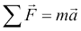

# 第一章：为预测建模做准备

在本章的第一章中，我们将首先建立一个用于模型的标准语言，并对预测建模过程进行深入探讨。预测建模的大部分内容涉及统计学和机器学习的关键概念，本章将简要介绍这些领域的核心特征，这些特征对于预测模型师来说是必备的知识。特别是，我们将强调了解如何评估适合我们试图解决的问题类型的模型的重要性。最后，我们将展示我们的第一个模型，即 k 近邻模型，以及`caret`，这是一个对预测模型师非常有用的 R 包。

# 模型

模型是预测分析的核心，因此，我们将从讨论模型及其外观开始我们的旅程。简单来说，模型是我们想要理解和推理的状态、过程或系统的表示。我们建立模型是为了从中得出推论，并且对我们这本书来说更重要的是，对世界做出预测。模型有多种不同的格式和风味，本书将探讨其中的一些多样性。模型可以是连接我们可以观察或测量的数量的方程；它们也可以是一组规则。我们大多数人从学校时代就熟悉的一个简单模型是牛顿的第二运动定律。该定律表明，作用在物体上的合力使物体沿着力的方向加速，加速度与力的结果大小成正比，与物体的质量成反比。

我们通常通过使用字母 *F*、*m* 和 *a* 来表示涉及的数量，通过方程来总结这些信息。我们还使用大写希腊字母 sigma (*Σ*) 来表示我们对力进行求和，并在字母上方使用箭头来表示矢量量（即具有大小和方向的量）：



这个简单但强大的模型使我们能够对世界做出一些预测。例如，如果我们对一个已知质量的物体施加一个已知的力，我们可以使用这个模型来预测它将加速多少。像大多数模型一样，这个模型做出了一些假设和概括。例如，它假设物体的颜色、环境的温度以及它在空间中的精确坐标都与模型所指定的三个数量如何相互作用无关。因此，模型抽象掉了特定过程或系统实例的众多细节，在这种情况下，是我们感兴趣的特定物体的运动，并且只关注那些重要的属性。

牛顿第二定律并不是描述物体运动的唯一可能模型。物理学学生很快会发现其他更复杂的模型，例如考虑相对论质量的模型。一般来说，如果模型考虑了更多的量或其结构更复杂，则认为模型更复杂。例如，非线性模型通常比线性模型更复杂。确定在实际情况中应使用哪个模型并不像简单地选择一个更复杂的模型而不是一个简单的模型那样简单。事实上，这是我们将在本书中探讨的许多不同模型中反复出现的核心主题。为了构建我们对为什么是这样的直觉，考虑这样一种情况，即我们测量物体质量和施加力的仪器非常嘈杂。在这种情况下，投资使用更复杂的模型可能没有意义，因为我们知道由于输入的噪声，预测的额外准确性不会产生影响。另一种情况下，我们可能想要使用更简单的模型，因为我们应用中根本不需要额外的准确性。第三种情况是，一个更复杂的模型涉及一个我们无法测量的量。最后，如果由于复杂性，训练或做出预测需要太长时间，我们可能不想使用更复杂的模型。

## 从数据中学习

在这本书中，我们将要研究的模型有两个重要且定义性的特征。第一个特征是，我们不会使用数学推理或逻辑归纳从已知事实中产生模型，也不会从技术规范或业务规则中构建模型；相反，预测分析领域是从数据中构建模型的。更具体地说，我们将假设对于任何我们想要完成的预测任务，我们都会从与（或从）当前任务以某种方式相关（或派生）的数据开始。例如，如果我们想要构建一个模型来预测一个国家不同地区的年降雨量，我们可能已经收集（或拥有收集）了不同地点的降雨数据，同时测量潜在的感兴趣量，如海拔高度、纬度和经度。构建模型以执行我们的预测任务的力量源于这样一个事实，即我们将使用有限列表地点的降雨测量示例来预测我们没有收集任何数据的地方的降雨量。

我们将要构建的模型的问题的第二个重要特征是，在从某些数据构建模型以描述特定现象的过程中，我们必然会遇到一些随机性的来源。我们将称之为模型的**随机**或**非确定性**成分。可能的情况是，我们试图模拟的系统本身并不具有固有的随机性，但数据中包含随机成分。数据中随机性的一个很好的例子是从温度等数量读取的测量误差。不包含固有随机成分的模型被称为**确定性模型**，牛顿第二定律就是这样一个很好的例子。一个随机模型是假设被模拟的过程具有内在随机性的模型。有时，这种随机性的来源可能是无法测量可能影响系统的所有变量，我们只是选择用概率来模拟这种情况。一个纯随机模型的例子是掷一个公平的六面骰子。回想一下，在概率论中，我们使用**随机变量**这个术语来描述实验或随机过程的特定结果的值。在我们的掷骰子例子中，我们可以定义随机变量*Y*为掷一次骰子后正面朝上的面的点数，从而得到以下模型：


这个模型告诉我们，掷出特定数字的概率，比如说 3，是六分之一。请注意，我们并没有对掷骰子特定结果的预测做出明确判断；相反，我们是在说每个结果的可能性是相等的。

### 备注

概率是一个在日常生活中经常使用的术语，但同时也可能对其实际解释产生混淆。实际上，存在多种不同的概率解释方式。两种常见的解释是**频率主义概率**和**贝叶斯概率**。频率主义概率与可重复的实验相关联，例如掷一个单面的骰子。在这种情况下，看到数字 3 的概率，就是如果这个实验无限次重复，数字 3 出现的相对比例。贝叶斯概率与看到特定结果的主观信念程度或惊讶程度相关，因此可以用来赋予一次性事件意义，例如总统候选人赢得选举的概率。在我们的掷骰子实验中，我们看到数字 3 出现的惊讶程度与其他任何数字一样。请注意，在这两种情况下，我们仍在谈论相同的概率数值（1/6）；只是解释不同。

在骰子模型的例子中，我们没有需要测量的变量。然而，在大多数情况下，我们将研究涉及多个独立变量的预测模型，这些变量将被用来预测一个因变量。预测建模借鉴了许多不同的领域，因此，根据你参考的特定文献，你经常会发现这些名称的不同。在我们进一步探讨这一点之前，让我们将一个数据集加载到 R 中。R 附带了一些常用的数据集已经加载，我们将选择其中最著名的，即*鸢尾花数据集*：

```py
> head(iris, n = 3)
  Sepal.Length Sepal.Width Petal.Length Petal.Width Species
1          5.1         3.5          1.4         0.2  setosa
2          4.9         3.0          1.4         0.2  setosa
3          4.7         3.2          1.3         0.2  setosa
```

### 小贴士

要查看 R 附带的其他数据集，我们可以使用`data()`命令来获取数据集列表以及每个数据集的简要描述。如果我们修改了数据集中的数据，我们可以通过将数据集的名称作为输入参数提供给`data()`命令来重新加载它；例如，`data(iris)`重新加载了鸢尾花数据集。

`iris`数据集包含了对 150 个不同品种的鸢尾花样本进行的测量。在前面的代码中，我们可以看到每个样本进行了四个测量，即花瓣和萼片的长度和宽度。鸢尾花数据集通常被用作预测鸢尾花样本物种的典型基准，前提是提供前面提到的四个测量值。在文献中，萼片长度、萼片宽度、花瓣长度和花瓣宽度统称为**特征**、**属性**、**预测变量**、**维度**或**自变量**。在这本书中，我们更喜欢使用“特征”这个词，但其他术语同样有效。同样，数据框中的物种列是我们试图用我们的模型预测的内容，因此它被称为**因变量**、**输出**或**目标**。再次强调，在这本书中，我们将为了保持一致性而偏好一种形式，并使用“输出”。数据框中对应单个数据点的每一行被称为**观测值**，尽管它通常涉及观察多个特征值。

由于我们将使用数据集，例如前面描述的鸢尾花数据，来构建我们的预测模型，因此建立一些符号约定也是有帮助的。在这里，这些约定在大多数文献中都很常见。我们将使用大写字母 *Y* 来指代输出变量，并使用下标大写字母 *X[i]* 来表示第 *i* 个特征。例如，在我们的鸢尾花数据集中，我们有四个特征，我们可以将其称为 *X[1]* 到 *X[4]*。我们将使用小写字母表示单个观测值，因此 *x[1]* 对应于第一个观测值。请注意，*x[1]* 本身是一个特征成分的向量，*x[ij]*，因此 *x[12]* 指的是第一个观测值中第二个特征的价值。我们将尽量少地使用双下标，并且为了简单起见，我们不会使用箭头或其他形式的向量符号。通常，我们讨论的是观测值或特征，因此变量的大小写将使读者清楚我们正在引用的是这两个中的哪一个。

当考虑使用数据集的预测模型时，我们通常假设对于具有 *n* 个特征的模型，存在一个真实或理想的函数 *f*，它将特征映射到输出：


我们将把这个函数称为我们的**目标函数**。在实践中，当我们使用我们可用的数据训练模型时，我们将产生我们自己的函数，我们希望这个函数是对目标函数的良好估计。我们可以通过在符号 *f* 上面放置一个撇号来表示我们的预测函数，以及输出 *Y*，因为预测函数的输出是预测输出。不幸的是，我们的预测输出并不总是与所有观测值（在我们的数据或一般情况中）的实际输出一致：


基于此，我们可以将预测建模概括为一个产生函数以预测一个数量的过程，同时最小化它与目标函数之间的误差。此时我们可以提出的一个好问题是，误差从何而来？换句话说，为什么我们通常不能通过分析数据集来精确地再现底层的目标函数？

这个问题的答案在于现实中存在几个潜在的误差来源，我们必须处理。记住，我们数据集中的每一个观测值都包含 *n* 个特征值，因此我们可以将我们的观测值几何地视为 *n* 维特征空间中的点。在这个空间中，我们的目标函数应该通过这些点，这正是目标函数的定义。如果我们现在考虑将函数拟合到有限点集的这个问题，我们会很快意识到实际上有无限多的函数可以穿过相同的点集。预测建模的过程涉及到在数据所使用的模型类型上做出选择，从而限制我们可以拟合数据的可能目标函数的范围。同时，无论我们选择什么模型，数据的固有随机性是无法消除的。这些想法使我们注意到在建模过程中遇到的误差类型的重要区别，即**可减少误差**和**不可减少误差**。

可减少误差基本上是指我们作为预测模型师可以通过选择一个对建模过程做出有效假设且其预测函数与潜在目标函数具有相同形式的模型结构来最小化的误差。例如，正如我们将在下一章中看到的，线性模型通过在其特征之间施加线性关系来组成输出。

这个限制性假设意味着，无论我们使用什么训练方法，我们有多少数据，以及我们投入多少计算能力，如果特征在现实世界中不是线性相关的，那么我们的模型必然会对至少一些可能的观测值产生误差。相比之下，一个不可减少误差的例子出现在尝试用不足的特征集构建模型时。这通常是常态而不是例外。通常，发现要使用哪些特征是构建准确模型中最耗时的一项活动。

有时候，我们可能无法直接测量一个我们知道很重要的特征。在其他时候，收集太多特征的数据可能只是不切实际或过于昂贵。此外，解决这个问题的方法并不仅仅是添加尽可能多的特征。向模型添加更多特征会使模型更加复杂，我们冒着添加与输出无关的特征的风险，从而在我们的模型中引入噪声。这也意味着我们的模型函数将有更多的输入，因此将是一个更高维空间中的函数。

向模型添加更多特征可能带来的潜在实际后果包括增加训练模型所需的时间，使最终解决方案的收敛更困难，以及在某些情况下（例如，与高度相关的特征一起）实际上降低模型精度。最后，我们必须接受的不可减少误差的另一个来源是我们测量特征时的误差，这样数据本身可能就是嘈杂的。

可减少误差不仅可以通过选择正确的模型来实现，还可以通过确保模型被正确训练来实现。因此，可减少误差也可能来自没有找到正确的特定函数来使用，考虑到模型假设。例如，即使我们正确选择了训练线性模型，我们仍然可以使用无限多的特征线性组合。正确选择模型参数（在这种情况下是线性模型的系数）也是最小化可减少误差的一个方面。当然，正确训练模型的大部分工作涉及使用良好的优化程序来拟合模型。在本书中，我们将至少给出我们研究的每个模型是如何训练的直观理解。我们通常避免深入探讨优化程序如何工作的数学，但我们确实为感兴趣的读者提供了相关文献的指针。

## 模型的核心理念

到目前为止，我们已经建立了一些模型背后的核心概念和讨论数据的通用语言。在本节中，我们将探讨统计模型的核心理念是什么。主要组件通常是：

+   一组需要调整参数的方程

+   一些代表我们试图建模的系统或过程的代表性数据

+   一个描述模型拟合优度的概念

+   一种更新参数以改进模型拟合优度的方法

正如我们将在本书中看到的，大多数模型，如神经网络、线性回归和支持向量机，都有某些参数化方程来描述它们。让我们看看一个线性模型，它试图从三个输入特征（我们将它们称为 *X[1]*、*X[2]* 和 *X[3]*）预测输出 *Y*：


这个模型恰好有一个方程来描述它，这个方程提供了模型的线性结构。该方程由四个参数参数化，在这种情况下称为系数，它们是四个 *β* 参数。在下一章中，我们将看到这些参数的确切作用，但在此讨论中，重要的是要注意线性模型是参数化模型的一个例子。参数集通常比可用的数据量小得多。

给定一组方程和一些数据，我们接下来讨论训练模型。这涉及到为模型的参数赋值，以便模型能更准确地描述数据。我们通常采用某些标准度量来描述模型对数据的拟合优度，即模型描述训练数据的好坏。训练过程通常是一个迭代过程，涉及到对数据进行计算，以便可以计算参数的新值，从而提高模型的拟合优度。例如，模型可以有一个目标或误差函数。通过对该函数求导并令其等于零，我们可以找到一组参数组合，它给我们带来最小的误差。一旦我们完成这个过程，我们就称该模型为训练好的模型，并说该模型已经从数据中学习到了。这些术语来自机器学习文献，尽管通常与统计学领域（该领域有自己的术语）进行比较。在这本书中，我们将主要使用机器学习的术语。

## 我们的第一个模型 - k 最近邻

为了使本章的一些想法更清晰，我们将介绍本书的第一个模型，**k 最近邻**，通常缩写为**kNN**。简而言之，这种方法实际上避免了构建一个显式的模型来描述我们数据中的特征是如何组合以产生目标函数的。相反，它依赖于这样的观点：如果我们试图对从未见过的数据点进行预测，我们将查看原始训练数据，并找到与我们的新数据点最相似的*k*个观测值。然后，我们可以使用某种平均技术对这些**k 个邻居**的目标函数已知值进行计算，以得出预测。让我们通过一个例子来理解这一点。假设我们收集到一个新的未识别的鸢尾花样本，其测量值如下：

```py
> new_sample
Sepal.Length  Sepal.Width Petal.Length  Petal.Width 
4.8          2.9          3.7          1.7
```

我们希望使用 kNN 算法来预测我们应该使用哪种花卉种类来识别我们的新样本。使用 kNN 算法的第一步是确定新样本的 k 个最近邻。为了做到这一点，我们不得不给出一个更精确的定义，即两个观测值彼此相似意味着什么。一种常见的方法是在特征空间中计算两个观测值之间的数值距离。直观上，相似的两个观测值在特征空间中会彼此靠近，因此它们之间的距离会很小。为了计算特征空间中两个观测值之间的距离，我们通常使用**欧几里得距离**，这是两点之间直线段的长度。两个观测值*x[1]*和*x[2]*之间的欧几里得距离计算如下：


记住，前面公式中的第二个后缀*j*对应于*j^(th)*特征。所以，这个公式本质上告诉我们的是，对于每个特征，取两个观测值值差的平方，将这些平方差加起来，然后取结果的平方根。有许多其他可能的距离定义，但在 kNN 设置中这是最常遇到的一种。我们将在第十一章*推荐系统*中看到更多的距离度量。

为了找到我们新样本鸢尾花的最近邻居，我们必须计算与鸢尾数据集中每个点的距离，然后对结果进行排序。我们将首先对鸢尾数据框进行子集化，只包括我们的特征，从而排除物种列，这是我们试图预测的内容。然后，我们将定义自己的函数来计算欧几里得距离。接下来，我们将使用`apply()`函数计算数据框中每个鸢尾观测值的距离。最后，我们将使用 R 的`sort()`函数，并将`index.return`参数设置为`TRUE`，这样我们也会得到对应于每个计算出的距离的行号索引：

```py
> iris_features <- iris[1:4]
> dist_eucl <- function(x1, x2) sqrt(sum((x1 - x2) ^ 2))
> distances <- apply(iris_features, 1,
                     function(x) dist_eucl(x, new_sample))
> distances_sorted <- sort(distances, index.return = T)

> str(distances_sorted)
List of 2
 $ x : num [1:150] 0.574 0.9 0.9 0.949 0.954 ...
 $ ix: int [1:150] 60 65 107 90 58 89 85 94 95 99 ...
```

`$x`属性包含计算出的样本鸢尾花与鸢尾数据框中的观测值之间的距离的实际值。`$ix`属性包含相应观测值的行号。如果我们想找到最近的五个邻居，我们可以使用`$ix`属性的前五个条目作为行号来对原始鸢尾数据框进行子集化：

```py
> nn_5 <- iris[distances_sorted$ix[1:5],]
> nn_5
    Sepal.Length Sepal.Width Petal.Length Petal.Width    Species
60           5.2         2.7          3.9         1.4 versicolor
65           5.6         2.9          3.6         1.3 versicolor
107          4.9         2.5          4.5         1.7 virginica
90           5.5         2.5          4.0         1.3 versicolor
58           4.9         2.4          3.3         1.0 versicolor
```

如我们所见，我们样本的五个最近邻居中有四个是**versicolor**物种，而剩下的一个是**virginica**物种。对于这种选择类标签的问题，我们可以使用多数投票作为我们的平均技术来做出最终预测。因此，我们将我们的新样本标记为 versicolor 物种。请注意，将*k*的值设置为奇数是一个好主意，因为它使得我们遇到平局投票的可能性更小（当输出标签的数量为两个时，完全消除了平局）。

在出现平局的情况下，通常的做法是随机从平局的标签中选取一个来解决问题。请注意，在整个过程中，我们并没有尝试描述我们的四个特征与输出之间的关系。因此，我们通常将 kNN 模型称为**懒惰学习器**，因为本质上，它所做的只是记住训练数据，并在预测时直接使用它。我们将在 kNN 模型上有更多要说的，但首先我们将回到我们对模型的通用讨论，并讨论不同的分类方法。

# 模型的类型

在对模型的基本组成部分有一个广泛了解之后，我们准备探索一些模型师用来对不同的模型进行分类的常见区别。

## 监督学习、无监督学习、半监督学习和强化学习模型

我们已经研究了鸢尾花数据集，它包含四个特征和一个输出变量，即物种变量。在训练数据中，所有观测值都可用输出变量是**监督学习**设置的标志性特征，这代表了最常遇到的场景。简而言之，在监督学习设置下训练模型的优点是我们有正确的答案，这是我们应为训练数据中的数据点预测的。正如我们在上一节中看到的，kNN 是一个使用监督学习的模型，因为它通过结合该点附近少数邻居的输出变量值来对输入点进行预测。在这本书中，我们将主要关注监督学习。

使用输出变量值的可用性作为区分不同模型的方式，我们还可以设想第二种场景，其中输出变量未指定。这被称为**无监督学习**设置。无监督版本的鸢尾花数据集将只包含四个特征。如果我们没有可用的物种输出变量，那么我们显然不知道每个观测值指的是哪种物种。实际上，我们甚至不知道数据集中有多少种花卉物种，或者每种物种有多少观测值。乍一看，似乎没有这些信息，就无法执行任何有用的预测任务。事实上，我们可以检查数据，并基于我们可用的四个特征，根据观测值之间的相似性创建观测值组。这个过程被称为**聚类**。聚类的优点之一是我们可以在数据中发现自然的数据点组；例如，我们可能能够发现我们的鸢尾花集的无监督版本中的花样本形成了三个不同的组，分别对应三种不同的物种。

在无监督方法和监督方法之间，这两种方法在输出变量的可用性方面是两种绝对的区别，存在着**半监督学习**和**强化学习**设置。半监督模型是使用那些包含输出变量值的数据构建的，其中通常只有一小部分数据包含这些值，而其余的数据则完全未标记。许多这样的模型首先使用数据集的有标签部分来粗略地训练模型，然后通过将模型在此点之前预测的标签投影到未标记数据中，来包含这些未标记数据。

在强化学习环境中，输出变量不可用，但提供了与输出变量直接相关的其他信息。一个例子是根据完整棋局的数据预测下一步的最佳走法。在训练数据中，单个棋步没有输出值，但对于每一场比赛，每个玩家的集体走法序列最终导致胜利或失败。由于篇幅限制，本书没有涵盖半监督和强化学习设置。

## 参数和非参数模型

在前一个部分，我们提到了我们将遇到的大多数模型都是**参数模型**，并看到了一个简单线性模型的例子。参数模型的特点是它们倾向于定义**函数形式**。这意味着它们将选择目标函数所有可能函数的问题简化为特定函数族，该函数族形成一个参数集。选择将定义模型的特定函数本质上涉及选择参数的精确值。因此，回到我们三个特征线性模型的例子，我们可以看到我们有以下两种可能的参数选择（当然，选择是无限的；这里我们只演示两个具体的例子）：


在这里，我们使用输出变量 *Y* 的下标来表示两种不同的可能模型。哪一种可能更好？答案是这取决于数据。如果我们将我们的每个模型应用于数据集中的观测值，我们将为每个观测值得到预测输出。在监督学习中，我们训练数据集中的每个观测值都带有输出变量的正确值。为了评估我们模型拟合的好坏，我们可以定义一个误差函数，该函数衡量我们的预测输出与正确输出之间的差异程度。然后我们使用这个函数在这两种候选模型之间进行选择，但更普遍的是通过一系列逐渐更好的候选模型来迭代改进模型。

一些参数模型比线性模型更灵活，这意味着它们可以用来捕捉更多可能的函数。线性模型要求输出是输入特征的线性加权组合，被认为是严格的。我们可以直观地看到，更灵活的模型更有可能让我们以更高的精度近似输入数据；然而，当我们看到过拟合时，我们会看到这并不总是好事。更灵活的模型也往往更复杂，因此训练它们通常比训练不那么灵活的模型更困难。

模型不一定需要参数化，实际上，没有参数的模型类别（不出所料）被称为**非参数模型**。非参数模型通常不对输出函数的特定形式做出假设。有不同方式构建没有参数的目标函数。**样条函数**是非参数模型的一个常见例子。样条函数背后的关键思想是我们设想输出函数，其形式对我们来说是未知的，它在对应于我们训练数据中所有观察点的点上被精确地定义。在点之间，函数通过使用平滑的多项式函数进行局部插值。本质上，输出函数是在我们的训练数据点之间的空间中以分段方式构建的。与大多数情况不同，样条函数将保证在训练数据上达到 100%的准确率，而我们的训练数据中存在一些错误是完全正常的。另一个很好的非参数模型例子是我们已经看到的 k-最近邻算法。

## 回归和分类模型

**回归**和**分类**模型之间的区别与我们要预测的输出类型有关，通常与监督学习相关。回归模型试图预测一个数值或定量值，例如股票市场指数、降雨量或项目的成本。分类模型试图从有限（尽管可能很大）的类别或类别集中预测一个值。这类例子包括预测网站的主题、用户接下来将要输入的下一个单词、一个人的性别，或者根据一系列症状预测患者是否患有特定疾病。在这本书中，我们将研究的多数模型都相当清晰地属于这两个类别之一，尽管一些模型，如神经网络，可以适应解决这两种类型的问题。在此强调，这里的区别仅在于输出，而不是用于预测输出的特征值本身是定量还是定性。一般来说，特征可以被编码成一种方式，使得定性和定量特征都可以在回归和分类模型中使用。早些时候，当我们构建一个 kNN 模型来根据花样本的测量值预测鸢尾花的物种时，我们解决的是一个分类问题，因为我们的物种输出变量只能取三个不同的标签之一。

kNN 方法也可以用于回归设置；在这种情况下，模型通过取平均值或中位数来结合所选最近邻的输出变量的数值，以便做出最终的预测。因此，kNN 也是一个可以在回归和分类设置中使用的模型。

## 实时和批量机器学习模型

预测模型可以使用**实时机器学习**，也可以涉及**批量学习**。实时机器学习的术语可以指两种不同的场景，尽管它当然不是指实时机器学习涉及在实时内做出预测，即在通常较小的时间限制内做出预测。例如，一旦训练好，一个神经网络模型只需进行少量计算（取决于输入数量和网络层数）就能产生其输出预测。但这并不是我们谈论实时机器学习时所指的是什么。

一个使用实时机器学习的良好例子是使用来自各种气象仪器的实时读数流进行天气预报的模型。在这里，模型的实时性指的是我们只取最近的一个读数窗口来预测天气。时间越往回推，读数的相关性就越低，因此我们可以选择只使用最新信息来做出预测。当然，用于实时环境的模型也必须能够快速计算其预测——如果早晨进行测量的系统需要数小时才能计算出晚上的预测，那么这几乎没有什么用处，因为当计算结束时，预测已经没有多少价值了。

当我们谈论考虑近期获得的信息来做出预测的模型时，我们通常指的是那些在假设代表未来模型将被要求做出预测的所有数据上训练过的模型。当我们描述检测到被建模的过程的性质以某种方式发生变化时，实时机器学习的第二种解释就出现了。当我们查看时间序列模型时，本书将重点关注第一种类型的例子。

# 预测建模的过程

通过查看一些不同的模型特征，我们已经暗示了预测建模过程中的各种步骤。在本节中，我们将按顺序介绍这些步骤，并确保我们理解每个步骤如何有助于整个工作的成功。

## 定义模型的客观目标

简而言之，每个项目的第一步是精确地确定期望的结果，因为这有助于我们在项目过程中做出良好的决策。在预测分析项目中，这个问题涉及到深入探讨我们想要进行的预测类型，并详细了解任务。例如，假设我们正在尝试构建一个预测公司员工流失率的模型。我们首先需要精确地定义这个任务，同时尽量避免使问题过于宽泛或过于具体。我们可以将流失率衡量为新全职员工在公司前六个月内离职的百分比。请注意，一旦我们正确地定义了问题，我们已经在思考我们将要使用的数据方面取得了一些进展。例如，我们不需要从兼职承包商或实习生那里收集数据。这项任务还意味着我们应该只从我们自己的公司收集数据，同时认识到我们的模型可能并不一定适用于为不同公司的员工群体做出预测。如果我们只对流失率感兴趣，这也意味着我们不需要预测员工的表现或病假（尽管避免未来的惊喜，询问我们为之人构建模型的人是有益的）。

一旦我们对想要构建的模型有了足够精确的想法，下一个合乎逻辑的问题是要问我们感兴趣实现什么样的性能，以及我们将如何衡量这一点。也就是说，我们需要为我们的模型定义一个性能指标，然后定义一个可接受的最低性能阈值。本书将详细讨论如何评估模型性能。现在，我们想要强调的是，尽管在用一些数据训练模型后讨论评估模型性能并不罕见，但在实践中，记住定义我们模型的期望和性能目标是预测模型师在项目初期就应该与项目利益相关者讨论的事情。模型永远不会完美，很容易陷入永远试图提高性能的模式。明确的目标性能不仅有助于我们决定使用哪些方法，而且有助于我们知道何时我们的模型已经足够好。

最后，我们还需要考虑在收集数据时我们将能够获得的数据，以及模型将被使用的上下文。例如，假设我们知道我们的员工流失率模型将作为决定我们公司新申请人是否被录用的因素之一。在这种情况下，我们应该只收集在我们招聘之前就可供使用的现有员工的数据。我们不能使用他们的第一次绩效评估结果，因为这项数据不会对潜在申请人可用。

## 收集数据

训练一个模型进行预测通常是一个数据密集型的项目，在这个行业中，如果你有什么东西永远都不嫌多，那就是数据。收集数据往往是整个过程中耗时和资源消耗最多的部分，这就是为什么确保定义任务和确定要收集的正确数据的第一步得到妥善处理是如此关键。当我们了解像逻辑回归这样的模型是如何工作时，我们通常是通过一个示例数据集来做到的，这也是本书我们将遵循的主要方法。不幸的是，我们没有一种方法来模拟收集数据的过程，可能会给人一种大部分努力都花在训练和改进模型上的印象。当我们使用现有数据集了解模型时，我们应该记住，通常已经投入了大量努力来收集、整理和预处理数据。我们将在下一节更详细地探讨数据预处理。

在收集数据的过程中，我们应始终牢记我们是否在收集正确类型的数据。我们在数据预处理期间对数据进行的大量合理性检查也适用于收集过程中，以便我们能够及早发现过程中是否犯了错误。例如，我们应该始终检查我们是否正确测量了特征以及是否使用了正确的单位。我们还应确保我们从足够新、可靠且与当前任务相关的来源收集数据。在我们之前章节中描述的员工流失模型中，当我们收集关于过去员工的信息时，我们应该确保我们在测量特征方面的一致性。例如，当我们测量一个人在我们公司工作了多少天时，我们应该始终一致地使用日历日或工作日。我们还必须检查在收集日期时，例如一个人加入或离开公司时，我们始终要么使用美国格式（月/日），要么使用欧洲格式（日/月），并且不要混合两种格式，否则像 03/05/2014 这样的日期将会模糊不清。我们还应尽可能从尽可能广泛的样本中获取信息，并在数据收集过程中避免引入隐藏的偏差。例如，如果我们想建立一个关于员工流失的通用模型，我们就不想只从女性员工或单一部门的员工那里收集数据。

我们如何知道我们已经收集了足够的数据？在早期收集数据时，如果我们还没有构建和测试任何模型，我们无法知道我们最终需要多少数据，也没有任何简单的经验法则可以遵循。然而，我们可以预测，我们问题的某些特征将需要更多的数据。例如，当我们构建一个将学会从三个类别之一进行预测的分类器时，我们可能想检查我们是否有了足够代表每个类别的观察结果。

我们拥有的输出类别越多，就需要收集更多的数据。同样，对于回归模型，检查训练数据中输出变量的范围是否与我们想要预测的范围相符也是有用的。如果我们正在构建一个覆盖较大输出范围的回归模型，与在相同精度要求下覆盖较小输出范围的回归模型相比，我们也需要收集更多的数据。

另一个帮助我们估计需要多少数据的重要因素是期望的模型性能。直观地讲，我们需要的模型精度越高，就应该收集更多的数据。我们还应该意识到，提高模型性能不是一个线性过程。从 90%的准确率提升到 95%，通常需要更多的努力和更多的数据，与从 70%提升到 90%相比，这种跨越需要更多的努力和数据。具有较少参数或设计更简单的模型，例如线性回归模型，通常比更复杂的模型，如神经网络，需要的数据更少。最后，我们想要将更多特征纳入模型，就应该收集更多的数据。此外，我们还应该意识到，这种对额外数据的需求也不是线性的。也就是说，构建具有两倍特征数量的模型，通常需要的原始数据量远不止两倍。如果我们考虑模型需要处理的不同输入组合的数量，这一点应该很容易理解。增加两倍的维度会导致可能的输入组合数量远超过两倍。为了理解这一点，假设我们有一个具有三个输入特征的模型，每个特征有 10 个可能的值。我们有 10³=1000 个可能的输入组合。增加一个额外的特征，该特征也有 10 个值，将组合数量提升到 10,000，这比我们初始输入组合的数量多得多。

人们尝试过获取一个更量化的视角来判断我们是否为特定数据集收集了足够的数据，但在这本书中我们没有时间涵盖这些内容。学习更多关于预测建模这一领域的好方法是从研究**学习曲线**开始。简而言之，我们通过从数据的一小部分开始，并在数据集上连续构建模型，逐步添加更多数据来构建模型。其理念是，如果在整个过程中，测试数据的预测精度始终在提高而没有下降，那么我们可能从获取更多数据中受益。作为数据收集阶段的最后一点，即使我们认为我们已经有了足够的数据，在决定停止收集并开始建模之前，我们也应该考虑获取更多数据将花费我们多少（以时间和资源衡量）。

## 选择模型

一旦我们明确了预测任务，并且拥有了正确类型的数据，下一步就是选择我们的第一个模型。首先，没有一种模型在总体上是最优的，甚至没有一个基于一些经验法则的最佳模型。在大多数情况下，从一个简单的模型开始，比如在分类任务中使用朴素贝叶斯模型或逻辑回归，或者在回归任务中使用线性模型，是有意义的。一个简单的模型将为我们提供一个起始的基准性能，然后我们可以努力提高。一开始选择一个简单的模型也可能有助于回答一些有用的问题，例如每个特征如何对结果产生影响，也就是说，每个特征的重要性如何，以及与输出的关系是正相关还是负相关。有时，这种分析本身就需要首先生产一个简单的模型，然后是一个更复杂的模型，该模型将用于最终的预测。

有时，一个简单的模型可能已经足够准确，以至于我们不需要投入更多努力来获得一点额外的效果。另一方面，一个简单的模型通常不足以完成任务，需要我们选择更复杂的模型。选择比简单模型更复杂的模型并不总是直截了当的决定，即使我们可以看到复杂模型的准确性将大大提高。某些约束，如我们拥有的特征数量或数据的可用性，可能阻止我们转向更复杂的模型。了解如何选择模型涉及到理解我们工具箱中各种模型的优势和局限性。对于本书中遇到的每个模型，我们将特别关注学习这些要点。在实际项目中，为了帮助指导我们的决策，我们通常会回到任务要求，并问一些问题，例如：

+   我们的任务类型是什么？有些模型只适合特定的任务，如回归、分类或聚类。

+   模型需要解释其预测吗？一些模型，如决策树，在提供易于解释的见解方面做得更好，可以解释为什么它们做出了特定的预测。

+   我们对预测时间有什么限制？

+   我们是否需要频繁地更新模型，因此训练时间很重要？

+   如果我们具有高度相关的特征，模型是否表现良好？

+   我们拥有的特征数量和数据量是否适合模型扩展？如果我们有大量的数据，我们可能需要一个可以并行化训练过程以利用并行计算机架构的模型，例如。

在实践中，即使我们的初步分析指向了特定的模型，我们很可能在做出最终决定之前会尝试多种选项。

## 数据预处理

在我们能够使用数据来训练模型之前，我们通常需要对其进行预处理。在本节中，我们将讨论我们通常执行的一些常见预处理步骤。其中一些是为了检测和解决我们数据中的问题所必需的，而其他一些则是为了转换我们的数据，使它们适用于我们选择的模型。

### 探索性数据分析

一旦我们有一些数据并决定开始工作于特定的模型，我们首先想要做的就是查看数据本身。这并不一定是一个结构化的过程部分；它主要涉及理解每个特征所测量的内容，以及对我们收集到的数据的感知。真正重要的是要理解每个特征代表什么以及它的测量单位。检查单位的一致使用也是一个非常好的主意。我们有时将探索和可视化我们数据的这一调查过程称为**探索性数据分析**。

一个很好的实践是使用 R 的 `summary()` 函数对我们的数据框进行操作，以获取每个特征的某些基本指标，例如均值和方差，以及最大值和最小值。有时，通过数据中的不一致性，我们很容易发现数据收集过程中出现了错误。例如，对于一个回归问题，具有相同特征值但输出结果差异极大的多个观测值（根据应用情况）可能是一个信号，表明存在错误的测量。同样，了解是否存在任何在存在显著噪声的情况下测量的特征也是一个好主意。这有时可能导致模型选择的不同，或者意味着该特征应该被忽略。

### 小贴士

另一个用于总结数据框中特征的常用函数是 `psych` 包中的 `describe()` 函数。该函数返回有关每个特征偏斜程度的信息，以及位置（如均值和中位数）和分散度（如标准差）的常规度量。

探索性数据分析的一个基本部分是使用图表来可视化我们的数据。根据上下文，我们可以使用各种图表。例如，我们可能想要创建数值特征的箱线图来可视化范围和四分位数。条形图和马赛克图有助于可视化不同组合的类别输入特征的数值比例。我们不会进一步详细介绍信息可视化，因为这是一个独立的领域。

### 小贴士

R 是一个创建可视化的优秀平台。`base` R 软件包提供了一系列不同的函数来绘制数据。两个用于创建更高级图表的优秀包是 `lattice` 和 `ggplot2`。这两本书都是 Springer 出版的 Use R! 系列中的，分别是 *Lattice: Multivariate Data Visualization with R* 和 *ggplot2: Elegant Graphics for Data Analysis*，它们也是制作有效可视化所使用原则的良好参考。

### 特征转换

通常，我们会发现我们的数值特征是在完全不同的尺度上测量的。例如，我们可能会用摄氏度来测量一个人的体温，因此数值通常在 36-38 之间。同时，我们也可能测量一个人每微升血液中的白细胞计数。这个特征通常取值在数千。如果我们将这些特征作为算法（如 kNN）的输入，我们会发现白细胞计数的较大值会主导欧几里得距离计算。我们可能会有几个在输入中重要的特征，对分类很有用，但如果它们是在产生数值远小于一千的尺度上测量的，我们实际上主要是基于单个特征（即白细胞计数）来选择最近的邻居。这个问题经常出现，并且适用于许多模型，而不仅仅是 kNN。我们通过在模型中使用之前对输入特征进行转换（也称为缩放）来处理这个问题。

我们将讨论三种流行的特征缩放选项。当我们知道我们的输入特征接近正态分布时，可以使用的一种可能的转换是 **Z 分数标准化**，它通过减去平均值并除以标准差来实现：


*E(x)* 是 *x* 的期望或平均值，标准差是 *x* 方差的平方根，写作 *Var(x)*。注意，由于这种转换，新的特征将围绕零平均值和单位方差进行中心化。另一种可能的转换，当输入均匀分布时更好，是将所有特征和输出缩放，使它们位于单个区间内，通常是单位区间 *[0,1]*：


第三种选项被称为 **Box-Cox 转换**。这通常在我们输入特征高度偏斜（不对称）且我们的模型要求输入特征至少是正态分布或对称时应用：


由于*λ*位于分母中，它必须取一个非零的值。实际上，这个变换是对零值的*λ*定义的：在这种情况下，它由输入特征的自然对数*ln(x)*给出。请注意，这是一个参数化变换，因此需要指定*λ*的具体值。从数据本身估计一个合适的*λ*值有多种方法。例如，我们将提到一种称为交叉验证的技术，我们将在本书的第五章中遇到，即*支持向量机*。

### 注意

Box-Cox 变换的原始参考文献是 1964 年由皇家统计学会期刊发表的一篇论文，标题为《变换分析》，作者是*G. E. P. Box*和*D. R. Cox*。

为了了解这些转换在实际中的工作方式，我们将尝试在我们的鸢尾花数据集的`Sepal.Length`特征上应用它们。然而，在我们这样做之前，我们将介绍我们将要使用的第一个 R 包，即`caret`包。

`caret`包是一个非常实用的包，它有几个目标。它提供了一系列在预测建模过程中常用的有用函数，从数据预处理和可视化，到特征选择和重采样技术。它还提供了一个统一接口，用于许多预测建模函数，并提供并行处理的功能。

### 注意

使用`caret`包进行预测建模的权威参考文献是一本名为《应用预测建模》的书，由*Max Kuhn*和*Kjell Johnson*撰写，并由*Springer*出版。*Max Kuhn*是`caret`包的主要作者。这本书还附带一个配套网站，网址为[`appliedpredictivemodeling.com`](http://appliedpredictivemodeling.com)。

当我们将输入特征转换为用于训练模型的训练数据时，我们必须记住，我们还需要将相同的转换应用于预测时将使用的后续输入的特征。因此，使用`caret`包转换数据分为两个步骤。在第一步中，我们使用`preProcess()`函数来存储要应用于数据的转换参数，在第二步中，我们使用`predict()`函数来实际计算转换。我们倾向于只使用一次`preProcess()`函数，然后在需要将相同的转换应用于某些数据时每次使用`predict()`函数。`preProcess()`函数的第一个输入是一个包含一些数值的数据框，我们还将指定一个包含要应用于`method`参数的转换名称的向量。然后`predict()`函数将前一个函数的输出以及我们想要转换的数据作为输入，在这种情况下，训练数据本身可能就是相同的数据框。让我们看看这一切是如何运作的：

```py
> library("caret")
> iris_numeric <- iris[1:4]
> pp_unit <- preProcess(iris_numeric, method = c("range"))
> iris_numeric_unit <- predict(pp_unit, iris_numeric)
> pp_zscore <- preProcess(iris_numeric, method = c("center", "scale"))
> iris_numeric_zscore <- predict(pp_zscore, iris_numeric)
> pp_boxcox <- preProcess(iris_numeric, method = c("BoxCox"))
> iris_numeric_boxcox <- predict(pp_boxcox, iris_numeric)
```

### 小贴士

**下载示例代码：**

您可以从[`www.packtpub.com`](http://www.packtpub.com)下载示例代码文件，以获取您购买的所有 Packt Publishing 书籍。如果您在其他地方购买了这本书，您可以访问[`www.packtpub.com/support`](http://www.packtpub.com/support)并注册，以便将文件直接通过电子邮件发送给您。

我们为鸢尾花数据的数值特征创建了三个新版本，区别在于每种情况下我们使用了不同的转换。我们可以通过使用`density()`函数绘制每个缩放数据框的`Sepal.Length`特征的密度，并绘制结果来可视化我们转换的效果，如下所示：


注意，Z 分数和单位区间转换在平移和缩放值的同时保留了密度的整体形状，而 Box-Cox 转换也改变了整体形状，导致密度比原始密度更少偏斜。

### 编码分类特征

许多模型，从线性回归到神经网络，都需要所有输入都是数值的，因此我们通常需要一种方法来对分类字段进行数值编码。例如，如果我们有一个大小特征，其值在集合*{small, medium, large}*中，我们可能希望用数值 1、2 和 3 分别表示它。在有序分类的情况下，例如前面描述的大小特征，这种映射可能是有意义的。

数字 3 是这个尺度上最大的，它对应于*大*类别，它比*小*类别（由数字 1 表示）更远离，比*中*类别（由值 2 表示）更近。使用这个尺度只是一种可能的映射，特别是它迫使*中*类别与*大*和*小*类别等距，这可能是或不可能是基于我们对特定特征的知识的适当做法。在无序类别的情况下，例如品牌或颜色，我们通常避免将它们映射到单个数值尺度上。例如，如果我们将集合*{blue, green, white, red, orange}*分别映射到数字一至五，那么这个尺度是任意的，没有理由说明为什么*red*比*white*更近，而比*blue*更远。为了克服这一点，我们创建了一系列指标特征，*I[i]*，它们具有以下形式：


我们需要的指标特征数量与类别数量相同，所以对于我们的颜色示例，我们会创建五个指标特征。在这种情况下，*I[1]*可能如下所示：


以这种方式，我们的原始颜色特征将被映射到五个指标特征，并且对于每一个观测，这些指标特征中只有一个取值为 1，其余为 0，因为每个观测将涉及我们原始特征中的一个颜色值。指标特征是二元特征，因为它们只取两个值：0 和 1。

### 注意

我们可能会经常遇到一种替代方法，它只使用*n-1*个二元特征来编码*n*个因素的水平。这是通过选择一个水平作为参考水平，并且指示每个*n-1*个二元特征取值为 0 的位置来实现的。这样做可以在特征数量上更加经济，并避免引入它们之间的线性依赖性，但它违反了所有特征彼此等距的性质。

### 缺失数据

有时，数据中包含缺失值，其中对于某些观测，一些特征不可用或无法正确测量。例如，假设在我们的鸢尾花数据集中，我们丢失了一个特定观测的瓣长测量值。那么，在这个花朵样本的`Petal.Length`特征中，我们就会有一个缺失值。大多数模型都没有处理缺失数据的内在能力。通常，缺失值在我们的数据中表现为空白条目或符号*NA*。我们应该检查我们的数据中是否确实存在缺失值，但被错误地分配了值，例如*0*，这通常是一个非常合法的特征值。

在决定如何处理缺失数据之前，尤其是当我们打算简单地丢弃具有缺失值的观测值时，我们应该认识到缺失的特定值可能遵循某种模式。具体来说，我们通常区分不同所谓的缺失值机制。在理想的**完全随机缺失**（**MCAR**）场景中，缺失值独立于它们出现的特征的真实值，以及所有其他特征。在这种情况下，如果我们缺少特定鸢尾花花瓣长度的值，那么这独立于花瓣的实际长度以及任何其他特征的值，例如观察值是否来自**杂色**物种或**设特兰**物种。**随机缺失**（**MAR**）场景是一个不太理想的情况。在这里，缺失值独立于所讨论特征的真正值，但可能与另一个特征相关。这种情况的一个例子是，在我们的鸢尾花数据集中，缺失花瓣长度值主要出现在**设特兰**样本中，只要它们仍然独立于真正的花瓣长度值。

在**非随机缺失**（**MNAR**）场景中，这是最棘手的情况，存在某种模式，可以解释基于特征的真正值何时可能缺失。例如，如果我们很难测量非常小的花瓣长度，并最终得到缺失值，那么简单地删除不完整的样本将导致具有高于平均花瓣长度的观测值的样本，因此我们的数据将存在偏差。

处理缺失值的方法有很多，但在这本书中我们不会深入探讨这个问题。在极少数情况下，如果我们遇到缺失值，我们会将它们从数据集中排除，但请注意，在实际项目中，我们会调查缺失值的原因，以确保我们可以安全地这样做。另一种方法是尝试猜测或估计缺失值。kNN 算法本身通过找到具有缺失值的特征样本的最近邻来做到这一点。这是通过使用排除包含缺失值的维度的距离计算来完成的。然后，缺失值被计算为该维度最近邻值的平均值。

### 注意

对此感兴趣的读者可以在由 Wiley 出版的**《缺失数据统计分析》**（**第二版**）中找到如何处理缺失值的详细说明，作者是**Roderick J. A. Little**和**Donald B. Rubin**。

### 异常值

**异常值**也是一个经常需要解决的问题。异常值是指在其一个或多个特征中，与数据集中其他数据点距离非常远的特定观测值。在某些情况下，这可能代表一个实际罕见的情形，是我们试图建模的系统的一种合法行为。在其他情况下，可能是因为测量错误。例如，在报告人们的年龄时，110 岁可能是一个异常值，这可能是由于实际值为 11 的报告中出现了错误。它也可能是有效但极其罕见的测量结果。通常，我们问题的领域会给我们一个很好的指示，说明异常值是否可能是测量错误，如果是这样，作为数据预处理的一部分，我们通常会希望完全排除数据中的异常值。在第二章 *线性回归*中，我们将更详细地探讨异常值的排除。

### 移除问题特征

预处理数据集还可能涉及决定删除一些特征，如果我们知道它们会给我们模型带来问题。一个常见的例子是当两个或更多特征彼此之间高度相关时。在 R 中，我们可以使用`cor()`函数轻松地在数据框上计算成对的相关性：

```py
> cor(iris_numeric)
             Sepal.Length Sepal.Width Petal.Length Petal.Width
Sepal.Length    1.0000000  -0.1175698    0.8717538   0.8179411
Sepal.Width    -0.1175698   1.0000000   -0.4284401  -0.3661259
Petal.Length    0.8717538  -0.4284401    1.0000000   0.9628654
Petal.Width     0.8179411  -0.3661259    0.9628654   1.0000000
```

在这里，我们可以看到`Petal.Length`特征与`Petal.Width`特征高度相关，相关系数超过 0.96。`caret`包提供了`findCorrelation()`函数，它接受一个相关矩阵作为输入，以及可选的`cutoff`参数，该参数指定成对相关系数的绝对值阈值。然后它返回一个（可能为零长度）向量，显示由于相关性需要从我们的数据框中删除的列。`cutoff`的默认设置为 0.9：

```py
> iris_cor <- cor(iris_numeric)
> findCorrelation(iris_cor)
[1] 3
> findCorrelation(iris_cor, cutoff = 0.99)
integer(0)
> findCorrelation(iris_cor, cutoff = 0.80)
[1] 3 4
```

移除相关性的另一种方法是完全转换整个特征空间，正如在许多降维方法中（如**主成分分析**（PCA）和**奇异值分解**（SVD））所做的那样。我们很快就会看到前者，后者我们将在第十一章 *推荐系统*中探讨。

类似地，我们可能想要删除彼此是**线性组合**的特征。通过特征的线性组合，我们指的是特征的总和，其中每个特征都乘以一个标量常数。为了了解`caret`如何处理这些，我们将创建一个新的 iris 数据框，并添加两个额外的列，我们将它们称为`Cmb`和`Cmb.N`，如下所示：

```py
> new_iris <- iris_numeric
> new_iris$Cmb <- 6.7 * new_iris$Sepal.Length –
                  0.9 * new_iris$Petal.Width
> set.seed(68)
> new_iris$Cmb.N <- new_iris$Cmb +   
                    rnorm(nrow(new_iris), sd = 0.1)
> options(digits = 4)
> head(new_iris,n = 3)
  Sepal.Length Sepal.Width Petal.Length Petal.Width   Cmb Cmb.N
1          5.1         3.5          1.4         0.2 33.99 34.13
2          4.9         3.0          1.4         0.2 32.65 32.63
3          4.7         3.2          1.3         0.2 31.31 31.27
```

如我们所见，`Cmb` 是 `Sepal.Length` 和 `Petal.Width` 特征的完美线性组合。`Cmb.N` 是一个与 `Cmb` 相同的特征，但添加了一些均值为零且标准差非常小（*0.1*）的高斯噪声，因此其值非常接近 `Cmb` 的值。`caret` 包可以使用 `findLinearCombos()` 函数检测特征的确切线性组合，尽管当特征有噪声时则不行：

```py
> findLinearCombos(new_iris)
$linearCombos
$linearCombos[[1]]
[1] 5 1 4

$remove
[1] 5
```

如我们所见，该函数仅建议我们应该从数据框中移除第五个特征（`Cmb`），因为它是一、四两个特征的精确线性组合。精确的线性组合很少见，但有时在我们有非常多的特征且它们之间存在冗余时会出现。相关特征以及线性组合都是线性回归模型的问题，正如我们将在第二章，*线性回归*中很快看到的，也是一个问题。在本章中，我们还将看到一个检测特征彼此之间几乎为线性组合的方法。

我们将探讨的最后一个问题是具有特征在数据集中完全没有变化，或者具有几乎零方差的问题。对于某些模型，具有这些类型的特征不会引起我们问题。对于其他模型，它可能会造成问题，我们将展示为什么这是这种情况。与前面的例子一样，我们将创建一个新的鸢尾花数据框，如下所示：

```py
> newer_iris <- iris_numeric
> newer_iris$ZV <- 6.5
> newer_iris$Yellow <- ifelse(rownames(newer_iris) == 1, T, F
> head(newer_iris, n = 3)
  Sepal.Length Sepal.Width Petal.Length Petal.Width  ZV Yellow
1          5.1         3.5          1.4         0.2 6.5   TRUE
2          4.9         3.0          1.4         0.2 6.5  FALSE
3          4.7         3.2          1.3         0.2 6.5  FALSE
```

`ZV` 列对所有观测值都有恒定的数字 `6.5`。`Yellow` 列是一个虚构的列，记录观测值的花瓣上是否有黄色。除了第一个观测值外，所有观测值都被设置为具有此特征的 `FALSE`，因此这是一个几乎零方差列。`caret` 包使用一种定义来检查特征所取的唯一值数量与观测总数相比非常小，或者最常见值与第二常见值（称为频率比）的比率非常高。将 `nearZeroVar()` 函数应用于数据框返回一个包含具有零或几乎零方差特征的向量。通过将 `saveMetrics` 参数设置为 `TRUE`，我们可以看到关于数据框中特征更多的信息：

```py
> nearZeroVar(newer_iris)
[1] 5 6
> nearZeroVar(newer_iris, saveMetrics = T)
             freqRatio percentUnique zeroVar   nzv
Sepal.Length     1.111       23.3333   FALSE FALSE
Sepal.Width      1.857       15.3333   FALSE FALSE
Petal.Length     1.000       28.6667   FALSE FALSE
Petal.Width      2.231       14.6667   FALSE FALSE
ZV               0.000        0.6667    TRUE  TRUE
Yellow         149.000        1.3333   FALSE  TRUE
```

在这里，我们可以看到`ZV`列已被识别为零方差列（这根据定义也是一个接近零方差列）。`黄色`列确实有一个非零方差，但它的频率比高和唯一值百分比低，使其成为一个接近零方差列。在实践中，我们倾向于移除零方差列，因为它们对我们的模型没有任何信息可以提供。然而，移除接近零方差列却很棘手，应该谨慎进行。为了理解这一点，考虑这样一个事实：一个用于物种预测的模型，使用我们更新的鸢尾花数据集，可能会学习到如果一个样本的花瓣是黄色的，那么无论其他所有预测因素如何，我们都会预测为*塞托萨*物种，因为这是在我们整个数据集中唯一一个花瓣呈黄色的观察结果对应的物种。在现实中，这可能是真的，在这种情况下，黄色特征是有信息的，我们应该保留它。另一方面，鸢尾花花瓣上出现黄色可能是完全随机的，并不表明物种，但也是一个极其罕见的事件。这可以解释为什么在我们的数据集中只有一个观察结果的花瓣是黄色的。在这种情况下，保留这个特征是危险的，因为上述结论。保留这个特征的另一个潜在问题将在我们查看将数据分为训练集和测试集，以及其他数据分割情况时变得明显，例如在第五章中描述的交叉验证，*支持向量机*。在这里，问题是我们的数据中的一个分割可能会导致接近零方差列的唯一值，例如，我们的`黄色`鸢尾花列中只有`FALSE`值。

## 特征工程和降维

我们在模型中使用特征的数量和类型是在预测建模过程中我们将做出的最重要的决定之一。拥有适合模型的特征将确保我们有足够的证据来基于此进行预测。另一方面，我们处理特征的数量正是模型维度的数量。大量的维度可能成为几个复杂问题的源头。高维问题通常遭受**数据稀疏性**的困扰，这意味着由于可用的维度数量，所有特征之间可能值的组合范围变得非常大，以至于我们不太可能收集到足够的数据，以便有足够的代表性示例用于训练。在类似的情况下，我们经常谈论**维度诅咒**。这描述了这样一个事实，由于可能的输入空间极其庞大，我们收集的数据点在特征空间中可能彼此相距甚远。因此，使用训练数据中靠近我们试图进行预测的点进行预测的局部方法，如 k 最近邻，在高维中可能不会工作得很好。大型特征集也存在问题，因为它可能会显著增加我们训练（在某些情况下预测）模型所需的时间。

因此，特征工程涉及两种类型的过程。其中第一种，即扩展特征空间，是基于我们数据中的特征设计新特征。有时，一个新特征可能是两个原始特征的乘积或比率，可能会工作得更好。有许多方法可以将现有特征组合成新的特征，并且通常需要从问题的特定应用领域获取专家知识来指导我们。然而，总的来说，这个过程需要经验和大量的试错。请注意，添加新特征并不保证不会降低性能。有时，添加一个非常嘈杂或与现有特征高度相关的特征实际上可能导致我们失去准确性。

特征工程中的第二个过程是特征减少或收缩，它减少了特征空间的大小。在数据预处理的前一节中，我们探讨了如何检测可能对我们模型有问题的单个特征。**特征选择**是指从原始特征集中选择出对目标输出最有信息量的特征子集的过程。一些方法，如基于树的模型，具有内置的特征选择功能，我们将在第六章（第六章，*基于树的算法*）中看到。在第二章（第二章，*线性回归*）中，我们还将探讨为线性模型执行特征选择的方法。

另一种减少特征总数的方法，称为**降维**，是将整个特征集转换成数量更少的新特征集。这个概念的典型例子是**主成分分析**（PCA）。

简而言之，主成分分析（PCA）创建了一组新的输入特征，称为**主成分**，这些主成分都是原始输入特征的线性组合。对于第一个主成分，线性组合的权重被选择以捕捉数据中的最大变异量。如果我们能将第一个主成分可视化为原始特征空间中的一条线，那么这条线就是数据变化最大的线。同时，这条线也是原始特征空间中所有数据点最近的一条线。每一个后续的主成分都试图捕捉一条最大变异的线，但以这种方式，新的主成分与已经计算出的前一个主成分不相关。因此，第二个主成分选择原始输入特征中数据变异程度最高的线性组合，同时与第一个主成分不相关。

主成分根据它们捕捉的变异量自然地按降序排列。这允许我们通过保留前*N*个成分来简单地执行降维，其中我们选择*N*，使得所选成分包含原始数据集中最小量的方差。我们不会深入探讨计算主成分所需的底层线性代数的细节。

相反，我们将注意力转向这样一个事实，这个过程对原始特征的方差和尺度很敏感。因此，我们在执行此过程之前通常会对特征进行缩放。为了可视化 PCA 的有用性，我们再次转向我们忠实的鸢尾花数据集。我们可以使用`caret`包来执行 PCA。为此，我们在`preProcess()`函数的`method`参数中指定`pca`。我们还可以使用`thresh`参数，该参数指定我们必须保留的最小方差。我们将明确使用值`0.95`以保留原始数据的 95%方差，但请注意，这也是此参数的默认值：

```py
> pp_pca <- preProcess(iris_numeric,  method = c("BoxCox", "center", "scale", "pca"), thresh = 0.95)
> iris_numeric_pca <- predict(pp_pca, iris_numeric)
> head(iris_numeric_pca, n = 3)
     PC1     PC2
1 -2.304 -0.4748
2 -2.151  0.6483
3 -2.461  0.3464
```

由于这种转换，我们现在只剩下两个特征，因此我们可以得出结论，数值鸢尾花特征的前两个主成分包含了数据中超过 95%的变异。

如果我们感兴趣的是学习用于计算主成分的权重，我们可以检查`pp_pca`对象的`rotation`属性：

```py
> options(digits = 2)
> pp_pca$rotation
               PC1    PC2
Sepal.Length  0.52 -0.386
Sepal.Width  -0.27 -0.920
Petal.Length  0.58 -0.049
Petal.Width   0.57 -0.037
```

这意味着第一个主成分`PC1`的计算如下：


有时，我们可能不想直接指定由主成分捕获的总方差阈值，而是想检查每个主成分及其方差的图表。这被称为**碎石图**，我们可以通过首先执行 PCA 并指示我们想要保留所有成分来构建这个图表。为此，我们不是指定方差阈值，而是设置`pcaComp`参数，这是我们想要保留的主成分数量。我们将将其设置为`4`，这包括所有成分，记住主成分的总数与原始特征或维度的总数相同。然后我们将计算这些成分的方差和累积方差，并将其存储在一个数据框中。最后，我们将在这个后续的图表中绘制这些数据，注意括号中的数字是方差捕获的累积百分比：

```py
> pp_pca_full <- preProcess(iris_numeric,  method = c("BoxCox", "center", "scale", "pca"), pcaComp = 4)
> iris_pca_full <- predict(pp_pca_full, iris_numeric)
> pp_pca_var <- apply(iris_pca_full, 2, var)
> iris_pca_var <- data.frame(Variance = round(100 * pp_pca_var / sum(pp_pca_var), 2), CumulativeVariance = round(100 * cumsum(pp_pca_var) / sum(pp_pca_var), 2))
> iris_pca_var
    Variance CumulativeVariance
PC1    73.45              73.45
PC2    22.82              96.27
PC3     3.20              99.47
PC4     0.53             100.00
```


如我们所见，在鸢尾花数据集中，第一主成分解释了总方差的 73.45%，而与第二个成分一起，总方差捕获率为 96.27%。PCA 是一种降维的无监督方法，即使输出变量可用，也不使用输出变量。相反，它在特征空间中从几何角度观察数据。这意味着我们无法保证 PCA 会给我们一个新的特征空间，这个空间在我们的预测问题中表现良好，除了具有更少特征的计算优势之外。这些优势可能会使得 PCA 即使在模型精度有所降低的情况下（只要这种降低是小的且对特定任务可接受）也是一个可行的选择。最后，我们应该指出，主成分的权重，通常被称为**载荷**，只要它们被归一化，其符号翻转是唯一的。在我们有完全相关的特征或完美的线性组合的情况下，我们将获得几个恰好为零的主成分。

## 训练和评估模型

在我们之前关于参数模型的讨论中，我们看到了它们使用一组训练数据来训练模型的程序。非参数模型通常会执行懒惰学习，在这种情况下，实际上并没有真正的训练程序，除了记住训练数据之外，或者，就像样条曲线的情况一样，在训练数据上执行局部计算。

无论哪种方式，如果我们想要评估我们模型的性能，我们需要将我们的数据分为**训练集**和**测试集**。关键思想是我们希望根据我们预期它在未见过的未来数据上的表现来评估我们的模型。我们通过使用测试集来完成这一点，这是我们收集并为此目的保留的数据的一部分（通常是 15-30%），在训练过程中我们没有使用这部分数据。例如，一种可能的划分是，将原始数据中的 80%作为训练集，剩下的 20%作为测试集。我们需要测试集的原因是我们不能使用训练集来公平地评估我们的模型性能，因为我们已经将模型拟合到训练数据上，它并不代表我们之前未见过的数据。从预测的角度来看，如果我们的目标是仅在我们自己的训练数据上最大化性能，那么最好的做法就是简单地记住输入数据以及期望的输出值，因此我们的模型将只是一个简单的查找表！

一个值得问的问题是：我们如何决定用于训练和测试的数据量？这里涉及到的权衡使得这个问题的答案并不简单。一方面，我们希望尽可能多地使用训练集中的数据，这样模型就有更多的例子来学习。另一方面，我们希望有一个大的测试集，这样我们可以使用许多例子来测试我们的训练模型，以最小化我们对模型预测性能估计的方差。如果我们测试集中的观察值只有几个，那么我们实际上无法对模型在未见数据上的整体表现进行概括。

另一个需要考虑的因素是我们收集了多少起始数据。如果我们数据非常少，我们可能需要使用更多的数据来训练我们的模型，例如 85-15 的分割。如果我们有足够的数据，那么我们可能会考虑 70-30 的分割，以便在测试集上获得更准确的预测。

要使用`caret`包分割数据集，我们可以使用`createDataPartition()`函数创建一个包含我们将用于训练集的行索引的采样向量。这些是通过随机采样行直到达到指定的行比例来选择的，使用`p`参数：

```py
> set.seed(2412)
> iris_sampling_vector <- createDataPartition(iris$Species, p = 0.8, list = FALSE)
```

### 小贴士

在报告涉及随机数生成的统计分析结果时，一个好的做法是在随机选择的但固定的数字上应用`set.seed()`函数。这个函数确保每次代码运行时，从下一个涉及随机数生成的函数调用生成的随机数都是相同的。这样做是为了让阅读分析的其他人能够精确地重现结果。注意，如果我们代码中有几个执行随机数生成的函数，或者同一个函数被多次调用，我们理想上应该在它们每一个之前应用`set.seed()`。

使用我们为鸢尾花数据集创建的采样向量，我们可以构建我们的训练集和测试集。我们将为之前在尝试不同的特征转换时构建的几个版本的鸢尾花数据集做这件事：

```py
> iris_train     <- iris_numeric[iris_sampling_vector,]
> iris_train_z   <- iris_numeric_zscore[iris_sampling_vector,]
> iris_train_pca <- iris_numeric_pca[iris_sampling_vector,]
> iris_train_labels <- iris$Species[iris_sampling_vector]
>
> iris_test        <- iris_numeric[-iris_sampling_vector,]
> iris_test_z      <- iris_numeric_zscore[-iris_sampling_vector,]
> iris_test_pca    <- iris_numeric_pca[-iris_sampling_vector,]
> iris_test_labels <- iris$Species[-iris_sampling_vector]
```

我们现在可以构建并测试三种不同的模型来处理鸢尾花数据集。这些模型依次是未归一化模型、一个输入特征经过 Z 分数变换进行中心化和缩放的模型，以及具有两个主成分的 PCA 模型。我们可以在构建这些模型后使用测试集来衡量每个模型的预测性能；然而，这意味着，在我们的最终未见准确度估计中，我们将使用测试集进行模型选择，从而产生一个有偏的估计。因此，我们通常保留一个与测试集大小相当的数据分割，通常称为**验证集**。这个验证集用于调整模型参数，例如 kNN 中的*k*，以及在使用测试集预测未见性能之前，对输入特征的编码和变换进行不同的调整。在第五章中，我们将讨论这种方法的替代方法，称为交叉验证。

一旦我们分割了数据，按照它所需的相关训练程序训练了模型，并调整了模型参数，我们接下来就必须评估它在测试集上的表现。通常，我们在测试集上不会找到与训练集相同的性能。有时，我们甚至可能发现，当我们部署模型时看到的性能与我们根据训练或测试集的性能所期望看到的不一致。这种性能差异可能有多种原因。首先，我们可能收集的数据可能既不代表我们正在建模的过程，或者我们没有在训练数据中遇到某些特征输入的组合。这可能导致与我们的预期不一致的结果。这种情况可能发生在现实世界中，也可能发生在我们的测试集中，例如，如果它包含异常值。另一个常见的情况是模型**过度拟合**的问题。

过度拟合是一个问题，其中一些模型，尤其是更灵活的模型，在它们的训练数据集上表现良好，但在未见过的测试集上表现显著较差。这发生在模型过于紧密地匹配训练数据中的观察结果，而无法对未见数据泛化时。换句话说，模型正在捕捉训练数据集中的虚假细节和变化，而这些细节和变化并不代表整个潜在人群。过度拟合是我们不根据模型在训练数据上的表现来选择模型的关键原因之一。训练数据和测试数据性能之间的其他差异来源是模型偏差和方差。这些因素实际上形成了统计建模中一个众所周知的权衡，称为**偏差-方差权衡**。

统计模型的方差指的是，如果使用一个不同选择的训练集（但来自我们试图预测的原始过程的或系统的确切相同过程）来训练模型，该模型的预测函数会有多大的变化。我们希望有较低的方差，因为本质上，我们不希望使用从同一过程生成的不同训练集来预测一个非常不同的函数。模型偏差指的是由于特定模型可以学习的函数形式有限制而固有的预测函数中的误差。例如，线性模型在尝试逼近非线性函数时引入偏差，因为它们只能学习线性函数。一个好的预测模型的理想情况是既具有低方差又具有低偏差。对于预测模型师来说，了解存在一个由模型选择引起的偏差-方差权衡的事实非常重要。由于它们对目标函数的假设较少，通常更复杂的模型更容易出现偏差，但比简单但更受限制的模型（如线性模型）具有更高的方差。这是因为更复杂的模型能够由于其灵活性而更接近地逼近训练数据，但作为结果，它们对训练数据的变化更敏感。当然，这也与复杂模型通常表现出的过拟合问题有关。

我们实际上可以通过首先在我们的鸢尾花数据集上训练一些 kNN 模型来看到过拟合的影响。有许多软件包提供了 kNN 算法的实现，但我们将使用我们熟悉的`caret`包中提供的`knn3()`函数。要使用此函数训练模型，我们只需提供包含数值输入特征的 DataFrame、输出标签的向量以及我们想要用于预测的最近邻数量`k`：

```py
> knn_model     <- knn3(iris_train, iris_train_labels, k = 5)
> knn_model_z   <- knn3(iris_train_z, iris_train_labels, k = 5)
> knn_model_pca <- knn3(iris_train_pca, iris_train_labels, k = 5)
```

为了看到不同`k`值的影响，我们将使用方便地以二维形式可用的鸢尾花 PCA 模型，以便我们可视化并反复训练：


在前面的图中，我们使用了不同的符号来表示不同物种对应的数据点。图中显示的线条对应于不同物种之间的**决策边界**，即我们输出变量的类别标签。请注意，使用较低的`k`值，例如`1`，可以非常紧密地捕捉数据的局部变化，因此决策边界非常不规则。较高的`k`值使用许多邻居来创建预测，从而产生平滑效果和更平滑的决策边界。在 kNN 中调整`k`值是调整模型参数以平衡过拟合影响的例子。

我们在本节中没有提到任何具体的性能指标。对于回归和分类，存在不同的模型质量度量标准，我们将在讨论完预测建模过程之后解决这些问题。

## 使用不同模型和最终模型选择

在这个过程的第一次迭代（这非常是一个迭代过程！）中，我们通常到达这个阶段，已经训练并评估了一个简单的模型。简单的模型通常允许我们以最小的努力快速获得一个粗略的解决方案，从而让我们及早了解我们离一个能够以合理精度进行预测的模型还有多远。简单的模型也非常擅长为我们提供一个基线水平的表现，我们可以用它来衡量未来模型的表现。作为模型构建者，我们往往对某一方法比对其他方法有偏好，但重要的是要记住，尝试不同的方法来解决问题并且使用数据来帮助我们决定最终使用哪种方法，通常是非常值得的。

在选择最终模型之前，考虑是否使用多个模型来解决问题可能是一个好主意。在第七章中，我们花费了一整章来研究涉及许多模型共同工作以提升整体系统预测精度的技术。

## 模型部署

一旦我们选择了要使用的最终模型，我们希望最终确定其实施方案，以便最终用户可以可靠地使用它。程序员将这个过程称为**部署到生产环境**。这是声音的软件工程原则变得极其重要的地方。以下指南提供了一些有用的建议：

+   模型应该被优化以提高其计算预测的速度。例如，这意味着确保在运行时计算的任何特征都执行得非常高效。

+   模型应该有良好的文档记录。最终的输入特征应该被明确定义，用于训练的方法和数据应该被存储起来，以便在需要时可以轻松重新训练。训练集和测试集上的原始性能也应该被存储起来，作为后续改进的参考。

+   模型的性能应该随着时间的推移进行监控。这很重要，不仅是为了验证模型是否按预期工作，也是为了捕捉任何潜在的数据变化。如果正在建模的过程随时间变化，那么我们的模型性能可能会下降，这将表明需要训练一个新的模型。

+   用于实现模型的软件应该使用标准的单元和集成测试进行适当的测试。通常，我们会使用很多已经过测试的现有 R 包，其函数已经过测试，但模型的最终部署可能需要我们亲自编写一些额外的代码，例如用于特征计算。

+   部署的模型应该能够处理输入中的错误。例如，如果某些输入特征缺失，应该通过适当的错误信息向用户清楚地说明模型无法进行预测的原因。错误和警告也应该被记录，尤其是在模型在实时设置中用于连续预测时。

# 摘要

在本章中，我们探讨了围绕预测模型的基本思想。我们看到了有很多方法可以分类模型，在学习过程中学习到重要区别，例如监督学习与无监督学习以及回归与分类的区别。接下来，我们概述了构建预测模型涉及的步骤，从数据收集过程一直到模型评估和部署。关键的是，这个过程是迭代的，我们通常在尝试和训练了几个不同的模型之后才得到最终的模型。

我们还介绍了我们的第一个模型，即 k 最近邻模型，它在执行分类和回归方面都很有用。kNN 是一个非常灵活的模型，它不对底层数据做出任何明确的假设。因此，它可以适应非常复杂的决策边界。它是一个懒惰的学习者，因为它不会构建一个模型来描述输入特征与输出变量之间的关系。因此，它不需要长时间的训练。另一方面，对于具有许多维度的数据，它可能需要很长时间才能产生预测，并且由于模型需要记住所有训练数据以找到目标点的最近邻，它通常也需要大量的内存。kNN 不区分不同特征的重要性，并且它在其预测中使用距离度量的事实意味着，一方面，它没有内置的处理缺失数据的方法，另一方面，它通常需要将特征转换为相似的尺度。最后，可以通过选择合适的*k*值，即最近邻的数量，来调整模型，以平衡过拟合的程度。在牢固掌握预测建模过程的基本知识之后，我们将在下一章中探讨线性回归。
