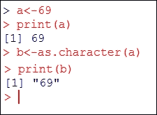
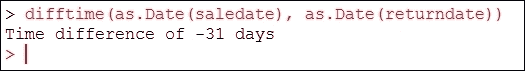
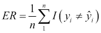
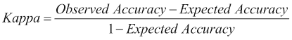
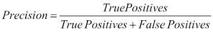
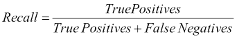
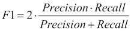
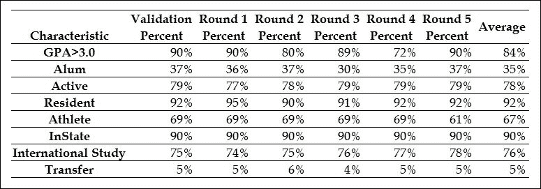
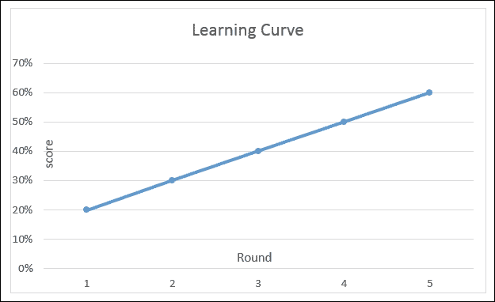
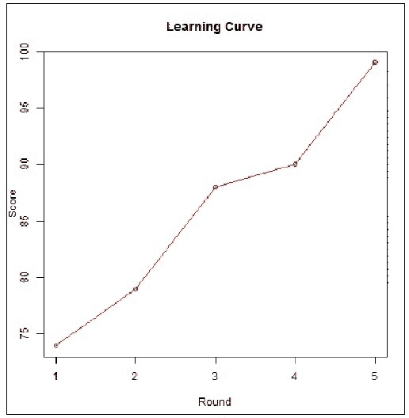

# 第二章.整理数据与衡量性能

在本章中，我们将涵盖整理数据以准备预测建模、性能指标、交叉验证和学习曲线等主题。

在统计学中，有一个公认的概念，即有两种类型的数据，它们是：

+   杂乱

+   整洁

杂乱的数据被认为是原始的或混乱的；整洁的数据是经过质量保证流程并准备好使用的。

# 开始

在我们开始讨论整理数据的过程之前，指出以下几点是非常谨慎的：无论你如何整理数据，你都应该确保：

1.  创建并保存您的脚本，以便您可以在新的或类似的数据源中再次使用它们。这被称为**可重用性**。为什么要在不需要的情况下花费时间重新创建相同的代码、规则或逻辑？这适用于*同一项目*中的*新数据*（脚本是为该项目开发的）或您未来可能参与的新的项目。

1.  尽可能“上游”地整理数据，也许甚至在原始来源处。换句话说，保存并维护原始数据，但使用程序脚本进行清理、修复错误，并保存该*清理后的*数据集以供进一步分析。

# 整理数据

值得明确的是，*整理数据*的概念。整理数据是重新组织（或可能只是组织）数据的过程，以及解决在您的数据中识别出的任何问题或担忧。问题会影响数据的质量。当然，数据质量是相对于拟议的用途（数据）而言的。

# 数据质量分类

或许有一个公认的观点，即数据质量问题可以归类到以下一个领域：

+   准确性

+   完整性

+   更新状态

+   相关性

+   一致性（跨来源）

+   可靠性

+   适当性

+   可访问性

您的数据的质量或质量水平可能受到其输入、存储和管理方式的影响。解决数据质量（通常称为**数据质量保证**（**DQA**））的过程需要定期和常规地审查和评估数据，并执行称为*配置文件*和*清理*的持续过程（即使数据存储在多个不同的系统中，这些过程也很困难）。

在这里，整理数据将更加以项目为中心，因为我们可能不关心创建正式的 DQA 流程，而只是确保数据对您的特定预测项目是正确的。

在统计学中，数据科学家尚未观察到的数据或尚未审查的数据被认为是*原始的*，不能在预测项目中可靠地使用。整理数据的过程通常涉及几个步骤。强烈建议花额外的时间将工作分解出来（而不是随意地一起解决多个数据问题）。

## 第一步

第一步需要将数据带到可能被称为**机械**正确性的状态。在这一步中，你关注的是如下事项：

+   **文件格式和组织**：字段顺序、列标题、记录数量等

+   **记录数据类型**（例如，将数值存储为字符串）

+   **日期和时间处理**（通常将值重新格式化为标准格式或一致格式）

+   **缺失内容**：错误的类别标签、未知或意外的字符编码等

## 下一步

第二步是解决数据的**统计可靠性**。在这里，我们纠正那些可能是**机械上正确**但很可能会（根据主题内容）影响统计结果的问题。

这些问题可能包括：

+   **正负不匹配**：年龄变量可能报告为负数

+   **无效（基于接受逻辑）数据**：一个未成年的人可能被登记为拥有驾照

+   **缺失数据**：关键数据值可能只是从数据源中缺失

## 最后一步

最后，在实际上使用数据之前，最后一步可能是**重新格式化**步骤。在这一步中，数据科学家将根据预期的用途或目标，确定数据必须采取的形式，以便最有效地处理它。

例如，一个人可能会决定：

+   **重新排序或重复**列；也就是说，某些最终处理可能需要在文件源中生成冗余或重复的数据，以便正确或更易于处理

+   **删除**列和/或记录（基于特定标准）

+   **设置小数位数**

+   **数据透视**数据

+   **截断或重命名**值

+   等等

使用 R 解决上述数据错误有多种相对常规的方法。

例如：

+   **更改数据类型**：也称为“数据类型转换”，可以使用 R 的 `is` 函数来测试对象的数据类型，以及 `as` 函数来进行显式转换。以下是一个最简单的例子：

+   **日期和时间**：使用 R 管理日期信息有多种方式。实际上，我们可以扩展前面的例子，并提到 `as.Date` 函数。通常，日期值对统计模型很重要，因此花时间了解模型日期字段的格式并确保它们得到适当处理是很重要的。大多数情况下，日期和时间将以原始数据格式作为字符串出现，可以按需转换和格式化。在下面的代码中，包含 `saledate` 和 `returndate` 的字符串字段被转换为日期类型值，并使用一个常见的时间函数 `difftime`：

+   类别标签对于统计建模以及数据可视化至关重要。使用标签对分类数据的样本进行标记的一个例子可能是为研究中的参与者分配一个标签，例如通过**教育水平**：1 = 博士，2 = 硕士，3 = 学士，4 = 专科，5 = 非学位，6 = 一些大学，7 = 高中，或 8 = 无：

    ```py
    > participant<-c(1,2,3,4,5,6,7,8)
    > recode<-c(Doctoral=1, Masters=2, Bachelors=3, Associates=4, Nondegree=5, SomeCollege=6, HighSchool=7, None=8))
    > (participant<-factor (participant, levels=recode, labels=names(recode)))
    [1] Doctoral Masters Bachelors Associates Nondegree SomeCollege HighSchool None       
    Levels: Doctoral Masters Bachelors Associates Nondegree SomeCollege HighSchool None
    ```

+   为数据分配标签不仅有助于可读性，而且允许机器学习算法从样本中学习，并将相同的标签应用于其他未标记的数据。

+   **缺失数据参数**：很多时候，只需设置适当的参数值，就可以将缺失数据从计算中排除。例如，R 函数 `var`、`cov` 和 `cor` 用于计算变量的方差、协方差或相关系数。这些函数有设置 `na.rm` 为 TRUE 的选项。这样做会告诉 R 排除任何带有缺失值的记录或案例。

+   在您的数据中可能存在各种其他*数据整理*的烦恼，例如错误标记的数值数据（即，对于如参与者年龄之类的数据，为负值），基于接受场景逻辑的数据值无效（例如，参与者的年龄与教育水平相比，一个 10 岁的孩子获得硕士学位是不可能的），数据值简单缺失（参与者未作回应是否表示该问题不适用或存在错误？），等等。幸运的是，至少有几种方法可以处理这些数据场景，使用 R 语言。

# 性能指标

在上一章中，我们讨论了预测建模过程，我们深入探讨了使用训练集和测试集来评估训练模型性能的重要性。在本节中，我们将探讨在描述不同模型的预测准确性时经常遇到的具体性能指标。结果是，根据问题的类别，我们需要使用稍微不同的方式来评估（模型的）性能。由于本书专注于监督模型，我们将探讨如何评估回归模型和分类模型。对于分类模型，我们还将讨论一些用于二元分类任务的额外指标，这是一种非常重要且经常遇到的问题类型。

### 注意

注意：在统计学中，性能一词通常与准确性可以互换使用。

## 评估回归模型

在回归场景中，让我们回顾一下，通过我们的模型，我们正在构建一个估计理论上的目标函数 *f* 的函数。模型的输入是我们选择的输入特征值。如果我们将这个函数应用于我们的训练数据中的每一个观测值，*x[i]*，这些数据被标记为函数的真实值，*y[i]*，我们将获得一组配对。为了确保我们清楚这一点，第一个条目是我们训练数据中第 *i* 个观测值的输出变量的实际值，第二个条目是使用我们的模型对这一观测值的特征值进行预测得到的值。

如果我们的模型很好地拟合了数据，这两个值在训练集中将非常接近。如果这在我们的测试集中也是真的，那么我们认为我们的模型很可能会在未来的未见观测值上表现良好。为了量化预测值和正确值对所有观测值在数据集中都接近这一概念，我们定义了一个称为 **均方误差** (**MSE**) 的度量，如下所示：


在这里，*n* 是数据集中观测值的总数。因此，这个方程告诉我们首先计算测试集中每个观测值 *i* 的输出值与其预测值之间的平方差，然后将这些值的总和除以观测值的数量来取平均值。因此，应该清楚为什么这个度量被称为均方误差。这个数字越低，实际输出变量的值与我们的预测值之间的平均误差就越低，因此我们的模型就越准确。我们有时会提到 **均方根误差** (**RMSE**)，它只是 MSE 的平方根，以及 **平方和误差** (**SSE**)，它与 MSE 类似，但没有除以训练示例数量 *n* 导致的归一化。这些量在训练数据集上计算时是有价值的，因为低数值表示我们已经很好地训练了模型。我们知道通常我们不期望这个值为零，而且由于过度拟合的问题，我们不能根据这些量来决定模型之间的优劣。

计算这些度量的关键地方是在测试数据上。在大多数情况下，一个模型的训练数据 MSE（或者同样，RMSE 或 SSE）将低于在测试数据上计算的相应度量。一个与另一个模型 *m[2]* 相比过度拟合数据的模型 *m[1]*，通常可以通过 *m[1]* 模型产生比模型 *m[2]* 更低的训练 MSE 但更高的测试 MSE 来识别。

## 评估分类模型

在回归模型中，我们的预测函数对特定观察值 *x[i]* 的输出 *y[i]* 的近似程度，是通过均方误差（MSE）来考虑的。具体来说，大的误差会被平方，因此一个数据点的非常大的偏差可能比多个数据点的几个小偏差有更大的影响。正是因为我们在回归中处理的是数值输出，所以我们不仅可以测量哪些观察值在预测上做得不好，还可以测量我们偏离的程度有多远。

对于执行分类的模型，我们同样可以定义一个错误率，但在这里我们只能谈论我们的模型所做的错误分类的数量。具体来说，我们有一个由以下公式给出的错误率：



这个度量使用 `indicator` 函数，当预测的类别与标记的类别不同时返回值为 1。因此，错误率是通过计算输出变量类别被错误预测的次数，并将这个计数除以数据集中的观察值数量来计算的。这样，我们可以看到错误率实际上是我们模型做出的错误分类观察值的百分比。需要注意的是，这个度量将所有类型的错误分类视为相等。如果某些错误分类的成本高于其他错误分类，那么可以通过添加权重来调整这个度量，这些权重将每个错误分类乘以与其成本成比例的量。

如果我们想要诊断回归问题中最大的错误来源，我们通常会查看预测值与实际值之间误差最大的点。在进行分类时，计算所谓的混淆矩阵通常非常有用。这是一个显示我们在数据上所做的所有成对错误分类的矩阵。现在，我们将回到我们的鸢尾花物种分类问题。在前一节中，我们训练了三个 kNN 模型。现在，我们将看到我们如何评估它们的性能。像许多分类模型一样，kNN 可以返回最终类别标签或与每个可能的输出类别相关的分数集。有时，就像这里的情况一样，这些分数实际上是模型分配给每个可能输出的概率。无论分数是否是实际概率，我们都可以根据这些分数来决定选择哪个输出标签，通常是通过简单地选择得分最高的标签。

在 R 语言中，最常用的进行模型预测的函数是 `predict()` 函数，我们将使用它来与我们的 kNN 模型一起使用：

```py
> knn_predictions_prob <- predict(knn_model, iris_test,
  type = "prob")
> tail(knn_predictions_prob, n = 3)
      setosa versicolor virginica
[28,]      0        0.0       1.0
[29,]      0        0.4       0.6
[30,]      0        0.0       1.0
```

在 kNN 模型中，我们可以通过计算属于每个输出标签的最近邻的比例来直接将输出分数作为概率。在所展示的三个测试示例中，virginica 物种在其中的两个示例中具有单位概率，但在剩余的示例中只有 60% 的概率。其余的 40% 归属于 versicolor 物种，因此似乎在后者的情况下，五个最近邻中有三个属于 virginica 物种，而另外两个属于 versicolor 物种。很明显，我们应该对前两种分类比后一种分类更有信心。

现在，我们将计算三个模型在测试数据上的类别预测：

```py
> knn_predictions <- predict(knn_model, iris_test, type = "class")
> knn_predictions_z <- predict(knn_model_z, iris_test_z, type = "class")
> knn_predictions_pca <- predict(knn_model_pca, iris_test_pca, type = "class")
```

我们可以使用 `caret` 包中的 `postResample()` 函数来显示我们模型的测试集准确度指标：

```py
> postResample(knn_predictions, iris_test_labels)
 Accuracy     Kappa 
0.9333333 0.9000000 
> postResample(knn_predictions_z, iris_test_labels)
 Accuracy     Kappa 
0.9666667 0.9500000 
> postResample(knn_predictions_pca, iris_test_labels)
Accuracy    Kappa 
    0.90     0.85
```

在这里，准确度是误差率的倒数，因此是正确分类观察值的百分比。我们可以看到，所有模型在准确度方面表现非常接近，使用 Z 分数归一化的模型占主导地位。考虑到测试集的大小很小，这种差异并不显著。

这被定义为如下：



Kappa 统计量旨在抵消随机因素的影响，其值在 [-1,1] 的区间内，其中 1 表示完美准确，-1 表示完美不准确，当准确度正好是随机猜测者所能获得的准确度时，出现 0。请注意，对于分类模型，随机猜测者猜测最频繁的类别。在我们的鸢尾花分类模型中，三种物种在数据中均匀分布，因此预期的准确度是三分之一。鼓励读者检查一下，通过使用这个值作为预期的准确度，我们可以从准确度值中获得 Kappa 统计量的观察值。

我们还可以通过混淆矩阵来检查我们的模型所犯的具体错误分类。

这可以通过将预测与正确的输出标签进行交叉表来简单地构建：

```py
> table(knn_predictions, iris_test_labels) 
               iris_test_labels
knn_predictions setosa versicolor virginica
     setosa         10          0         0
     versicolor      0          9         1
     virginica       0          1         9
```

`caret` 包还包含一个非常有用的 `confusionMatrix()` 函数，该函数会自动计算这个表格以及其他几个性能指标，其解释可以在 [`topepo.github.io/caret/other.html`](http://topepo.github.io/caret/other.html) 找到。

在先前的混淆矩阵中，我们可以看到正确分类的总观测数是 28，这是主对角线上数字`10`、`9`和`9`的总和。输出表显示，setosa 物种似乎更容易用我们的模型预测，因为它从未与其他物种混淆。然而，`versicolor`和`virginica`物种可能会相互混淆，并且模型错误地将每种物种的一个实例分类。因此，我们可以推断出计算混淆矩阵是一项有用的练习。识别经常混淆的类别对将指导我们改进模型，例如，通过寻找可能有助于区分这些类别的特征。

### 评估二元分类模型

一种称为二元分类的特殊分类情况发生在我们有两个类别时。以下是一些典型的二元分类场景：

+   我们想根据电子邮件的内容和标题将收到的电子邮件分类为垃圾邮件或非垃圾邮件

+   我们想根据患者的症状和病史将患者分类为患有疾病或未患病

+   我们想根据查询中的单词和文档中的单词将来自大型文档数据库的文档分类为与查询相关的文档

+   我们想将装配线上的产品分类为有缺陷或无缺陷

+   我们想根据客户的信用评分和财务状况预测申请银行信贷的客户是否会违约

在二元分类任务中，我们通常将我们的两个类别称为正类和负类。按照惯例，正类对应于我们的模型试图预测的特殊情况，并且通常比负类更罕见。从前面的例子中，我们会用正类标签来标记垃圾邮件、有缺陷的装配线产品、违约客户等等。现在考虑一个医学诊断领域的例子，我们试图训练一个模型来诊断一种我们知道在人口中只有 1/10000 的人会患上的疾病。我们会将正类分配给患有这种疾病的病人。请注意，在这种情况下，错误率本身并不是衡量模型的一个充分指标。例如，我们可以设计一个最简单的分类器，其错误率仅为 0.01%，通过预测每个病人都将健康，但这样的分类器将毫无用处。我们可以通过检查混淆矩阵来得出更有用的指标。假设我们构建了一个用于诊断罕见疾病的模型，并在 100,000 个病人的测试样本上获得了以下混淆矩阵：

```py
> table(actual,predicted)
          predicted
actual     negative positive
  negative    99900       78
  positive        9       13
```

二元分类问题如此普遍，以至于二元混淆矩阵的单元格有自己的名称。在主对角线上，它包含正确分类的条目，我们称这些元素为真正的负例和真正的正例。在我们的案例中，我们有 99900 个真正的负例和 13 个真正的正例。当我们错误地将一个观察值分类为正类，而实际上它属于负类时，我们就有了一个假阳性，也称为 I 型错误。当我们错误地将一个正类观察值分类为负类时，就发生了假阴性或 II 型错误。在我们的案例中，我们的模型有 78 个假阳性和 9 个假阴性。

我们现在将介绍在二元分类背景下两个非常重要的度量指标，即精确度和召回率。精确度定义为正确预测的正类实例数与预测的正类实例总数的比率。使用前一个二元混淆矩阵的标签，精确度可以表示为：



因此，精确度本质上衡量了我们预测正类时的准确性。根据定义，我们可以通过从不为正类做出任何预测来达到 100%的精确度，因为这样我们保证不会犯任何错误。相比之下，召回率定义为在数据集中所有正类成员中正确预测的正类数量。再次使用二元混淆矩阵的标签，我们可以看到召回率的定义如下：



召回率衡量我们识别数据集中所有正类成员的能力。我们可以通过总是预测所有数据点的正类来轻松实现最大召回率。我们将会犯很多错误，但我们将不会有任何假阴性。请注意，精确度和召回率在我们的模型性能中形成了一种权衡。在一端，如果我们不对我们的任何数据点预测正类，我们将有零召回率但最大精确度。在另一端，如果所有我们的数据点都被预测为属于正类（记住，这通常是一个罕见的类别），我们将有最大召回率但极低的精确度。换句话说，试图减少 I 型错误会导致增加 II 型错误，反之亦然。这种反向关系通常在特定问题的精确度-召回率曲线上绘制。通过使用适当的阈值参数，我们通常可以调整我们模型的性能，以便在精确度-召回率曲线上达到一个适合我们情况的特定点。例如，在某些问题域中，我们倾向于倾向于有比高精确度更高的召回率，因为将正类观察误分类为负类的成本很高。因为我们经常想用一个单一的数字来描述模型的性能，所以我们定义了一个称为 F1 分数的度量，它结合了精确度和召回率。具体来说，F1 分数定义为精确度和召回率的调和平均数：



读者应验证，在我们的示例混淆矩阵中，精确度为 14.3%，召回率为 59.1%，F1 分数为 0.23。

# 交叉验证

交叉验证（你可能听到一些数据科学家将其称为*旋转估计*，或简单地作为一种评估模型的一般技术），是评估模型性能（或其准确性）的另一种方法。

主要用于预测建模来估计模型在实际应用中可能表现出的准确性，人们可能会看到交叉验证被用来检查模型潜在的泛化能力；换句话说，模型将如何将其从样本中推断出的信息应用到整个群体（或数据集）中。

使用交叉验证，你将一个（已知）数据集作为你的验证数据集，在该数据集上运行训练，以及一个未知数据集（或首次看到的数据集），模型将对其进行测试（这被称为你的测试数据集）。目标是确保像过度拟合（允许非包容性信息影响结果）等问题得到控制，以及提供有关模型如何泛化实际问题或真实数据文件的见解。

此过程将包括将数据分为相似子集的样本，在一个子集（称为训练集）上执行分析，并在另一个子集（称为验证集或测试集）上验证分析：

分离 → 分析 → 验证

为了减少变异性，使用不同的分区进行多次迭代（也称为折或轮）的交叉验证，并将验证结果在轮次中平均。通常，数据科学家会使用模型的不变性来确定应该执行的实际交叉验证轮次数量。

再次强调，通过思考选择数据子集并手动计算结果，可以更好地理解交叉验证方法。一旦你知道正确的结果，它们可以与模型产生的结果（使用另一个数据子集）进行比较。这是一轮。将执行多轮，比较结果平均并审查，最终提供一个公平的模型预测性能估计。

假设一所大学提供其学生群体随时间变化的数据。学生被描述为具有各种特征，例如高中 GPA 是否大于或小于 3.0，是否有家庭成员从该校毕业，学生是否在非编程活动中活跃，是否是居民（住在校园内），是否是学生运动员等等。我们的预测模型想要预测提前毕业的学生具有哪些特征。

下表展示了使用五轮交叉验证过程预测模型预期准确性的结果表示：



根据前面的图表，我认为我们的预测模型预计将非常准确！

总结来说，交叉验证通过（平均）拟合度（预测误差）的度量来推导出模型预测性能的更准确估计。这种方法通常用于数据不足以进行测试而不失去显著建模或测试质量的情况下。

# 学习曲线

评估模型性能的另一种方法是通过评估模型的学习增长或模型通过额外经验（例如，更多轮次的交叉验证）提高学习（获得更好的分数）的能力。

### 注意

学习是获取新知识或修改和加强现有知识的行为。

表示模型结果或分数与数据文件群体信息的数据可以与其他分数结合，以显示一条线或曲线，这被称为模型的学习曲线。

学习曲线是学习增长（垂直轴上显示的分数）与练习（水平轴上显示的个体数据文件或轮次）之间关系的图形表示。

这也可以被概念化为：

+   重复相同的任务

+   随时间学习到的知识体系

下图展示了一个假设的学习曲线，显示了通过交叉验证轮次得到的分数来提高预测模型学习的情况：



来源链接：[`en.wikipedia.org/wiki/File:Alanf777_Lcd_fig01.png`](https://en.wikipedia.org/wiki/File:Alanf777_Lcd_fig01.png)

### 小贴士

很有趣；一个人可能知道熟悉的表达“it's a steep learning curve”是用来描述一个难以学习的活动，但在统计学中，一个陡峭的学习曲线实际上代表的是快速进步。

将模型性能与经验相关的学习曲线通常在执行模型评估时被发现被使用。

如我们在此节之前所提到的，性能（或分数）是指模型的准确度，而经验（或轮次）可能是指用于优化模型参数的训练样本数、数据集或迭代次数。

## 绘图和 ping

使用两个通用的 R 函数，我们可以展示一个简单的学习曲线可视化。ping 将打开一个包含我们的学习曲线可视化的图像文件，这样我们就可以轻松地将其包含在文档中，而 plot 将绘制我们的图形。

以下是我们示例 R 代码语句：

```py
# -- 5 rounds of numeric test scores saved in a vector named "v"
v <-c(74,79, 88, 90, 99)

# -- create an image file for the visualization for later use
png(file = "c:/simple example/learning curve.png", type = c("windows", "cairo", "cairo-png"))

# -- plot the model scores round by round
plot(v, type = "o", col = "red", xlab = "Round", ylab = "Score", main = "Learning Curve")

# -- close output 
dev.off()
```

前面的陈述创建了一个以下图形的文件：



# 摘要

在本章中，我们探讨了围绕数据质量问题及其类型分类的基本思想，以及整理数据的建议。

为了比较一个人可能创建的不同模型的性能，我们进一步建立了一些关于模型性能的基本概念，例如回归的**均方误差**（**MSE**）和分类的错误率。

我们还介绍了交叉验证作为一种通用的评估技术，用于数据量有限的情况。

最后，学习曲线被讨论为判断模型提高分数或学习能力的一种方式。

在对预测建模过程的基本原理有了坚实的了解之后，我们将在下一章中探讨线性回归。
