# 第三章。线性回归

我们从前几章了解到，回归问题*涉及预测数值输出*。最简单但最常见的一种回归是线性回归。在本章中，我们将探讨为什么线性回归如此常用，其局限性以及扩展，然后简要介绍*多项式回归*，当线性关系不适合你的情况时，你可能需要考虑它。

# 线性回归简介

在**线性回归**中，输出变量是通过输入特征的线性加权组合来预测的。以下是一个简单线性模型的例子：

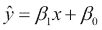

前面的模型本质上表示我们正在估计一个输出，这是一个单一预测变量（即特征）的线性函数，用字母 *x* 表示。涉及希腊字母 *β* 的项是模型的参数，被称为**回归系数**。一旦我们训练了模型并确定了这些参数的值，我们就可以通过在我们的方程中进行简单的替换来对任何 *x* 值的输出变量进行预测。另一个线性模型的例子，这次有三个特征并分配了回归系数的值，如下方程所示：

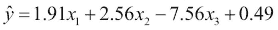

在这个方程中，就像前一个方程一样，我们可以观察到我们有一个比特征数量多的系数。这个额外的系数，*β[0]*，被称为**截距**，是当所有输入特征值为零时模型的期望值。其他 *β* 系数可以解释为输出值随特征单位增加的期望变化。例如，在前面的方程中，如果特征 *x[1]* 的值增加一个单位，输出值的期望值将增加 1.91 个单位。同样，特征 *x[3]* 的单位增加会导致输出值减少 7.56 个单位。在一个简单的一维回归问题中，我们可以在图的 *y* 轴上绘制输出，在 *x* 轴上绘制输入特征。在这种情况下，模型预测这两个变量之间存在直线关系，其中 *β[0]* 代表直线与 *y* 轴相交或截取的点，而 *β[1]* 代表直线的斜率。我们通常将只有一个特征（因此有两个回归系数）的情况称为**简单线性回归**，而将有两个或更多特征的情况称为**多元线性回归**。

## 线性回归的假设

在我们深入探讨如何训练线性回归模型及其表现之前，我们将查看模型假设。模型假设本质上描述了模型对我们试图预测的输出变量 *y* 的信念。具体来说，线性回归模型假设输出变量是一组特征变量的加权线性函数。此外，模型假设对于特征变量的固定值，输出是正态分布且方差恒定。这等同于说模型假设真实输出变量 *y* 可以用一个如下的方程表示，这里展示了两个输入特征：

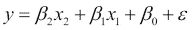

在这里，*ε* 代表一个误差项，它服从均值为零、方差为常数 *σ²* 的正态分布：

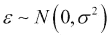

我们可能会遇到**同方差性**这个术语，作为描述恒定方差概念的一种更正式的方式。通过同方差性或恒定方差，我们指的是误差成分的方差不会随着输入特征的值或水平而变化。在下面的图中，我们可视化了一个具有**异方差**误差的假设线性关系示例，这些误差没有恒定的方差。在输入特征的低值处，数据点靠近线，因为在这个图的这个区域方差较低，但在输入特征的高值处，由于方差较高，数据点远离线：

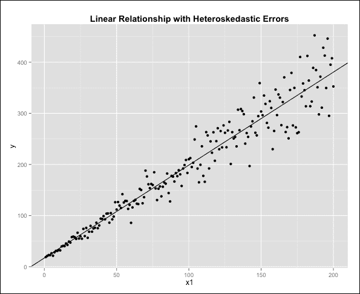

*ε* 项是真实函数 *y* 的不可约误差组成部分，可以用来表示随机误差，例如特征值中的测量误差。在训练线性回归模型时，我们总是期望在我们的输出估计中观察到一定量的误差，即使我们拥有所有正确的特征、足够的数据，并且所建模的系统确实是线性的。

换句话说，即使有一个真正的线性函数，我们仍然期望一旦我们通过训练示例找到一个最佳拟合线，由于误差成分所表现出的这种固有方差，我们的线不会穿过所有，甚至任何，我们的数据点。然而，关键要记住的是，在这个理想场景中，因为我们的误差成分具有零均值和恒定方差，我们的训练标准将允许我们在足够大的样本下接近回归系数的真实值，因为误差将会相互抵消。

另一个重要的假设与误差项的独立性相关。这意味着我们并不期望与一个特定观测值相关的**残差**或误差项以某种方式与另一个观测值相关联。如果观测值彼此是函数关系，这一假设可能会被违反，这通常是测量误差的结果。如果我们从我们的训练数据中取出一部分，将所有特征和输出的值加倍，并将这些新的数据点添加到我们的训练数据中，我们可以创造出拥有更大数据集的假象；然而，由此将会有成对的观测值，它们的误差项将相互依赖，因此我们的模型假设将被违反。顺便提一下，以这种方式人工增加数据集在任何模型中都是不可接受的。同样，如果观测值通过一个未测量的变量以某种方式相关联，也可能出现相关的误差项。例如，如果我们正在测量装配线零部件的故障率，那么来自同一工厂的零部件可能存在误差的相关性：例如，由于装配过程中使用了不同的标准和协议。因此，如果我们不将工厂作为特征，我们可能会在我们的样本中观察到来自同一工厂的零部件之间的相关误差。**实验设计**的研究涉及识别和减少误差项中的相关性，但这超出了本书的范围。

最后，另一个重要的假设涉及特征本身在统计上相互独立的概念。在这里值得澄清的是，在线性模型中，尽管输入特征必须是线性加权的，但它们自身可能是另一个函数的输出。为了说明这一点，人们可能会惊讶地看到以下是一个包含三个特征*sin(z[1]**)*、*ln(z[2]* *)*和*exp(z*[3]*)*的线性模型：

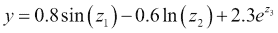

我们可以通过对输入特征进行一些变换，然后在我们的模型中进行替换，来看到这是一个线性模型：

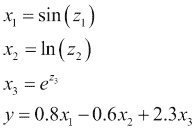

现在，我们有一个更易被识别为线性回归模型的方程。如果先前的例子让我们相信几乎所有东西都可以转化为线性模型，那么接下来的两个例子将明确地让我们相信这实际上并非如此：

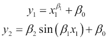

由于第一个回归系数（*β[1]*），这两个模型都不是线性模型。第一个模型不是线性模型，因为*β[1]*充当第一个输入特征的指数。在第二个模型中，*β[1]*位于一个*正弦*函数内部。从这些例子中可以吸取的重要教训是，在某些情况下，我们可以对我们的输入特征应用变换，以便将数据拟合到线性模型中；然而，我们需要小心，确保我们的回归系数始终是结果新特征的线性权重。

# 简单线性回归

下面是简单线性回归模型的代码：

```py
> set.seed(5427395)
> nObs = 100
> x1minrange = 5
> x1maxrange = 25
> x1 = runif(nObs, x1minrange, x1maxrange)
> e = rnorm(nObs, mean = 0, sd = 2.0)
> y = 1.67 * x1 - 2.93 + e
> df = data.frame(y, x1)
```

对于我们的输入特征，我们从均匀分布中随机采样点。我们使用均匀分布来获得数据点的良好分布。请注意，我们的最终`df`数据框旨在模拟我们在实践中获得的数据框；因此，我们不包含误差项，因为在现实世界的设置中这些误差项对我们是不可用的。

当我们使用某些数据（如我们的数据框中的数据）训练线性模型时，我们实际上希望产生一个与数据的潜在模型具有相同系数的线性模型。换句话说，原始系数定义了一个**总体回归线**。在这种情况下，总体回归线代表了数据的真实潜在模型。一般来说，我们会发现自己试图模拟一个不一定是线性的函数。在这种情况下，我们仍然可以将总体回归线定义为最佳可能的线性回归线，但线性回归模型显然不会表现同样好。

## 估计回归系数

对于我们的简单线性回归模型，训练模型的过程相当于从我们的数据集中估计两个回归系数。正如我们可以从我们之前构建的数据框中看到的那样，我们的数据实际上是一系列观察结果，每个观察结果是一对值（*x[i]*，*y[i]*），其中这对值的第一个元素是输入特征值，第二个元素是对应的输出标签。结果证明，对于简单线性回归的情况，我们可以写出两个方程来计算我们的两个回归系数。我们不会仅仅展示这些方程，而是首先简要回顾一些读者可能之前已经遇到的一些非常基本的统计量，因为它们将在不久的将来被介绍。

一组值的**均值**就是这些值的平均值，通常被描述为位置度量，给出值在其测量尺度上的中心位置。在统计文献中，随机变量的平均值通常被称为**期望**，所以我们经常发现随机变量 *X* 的均值表示为 *E(X)*。另一种常用的表示法是横线表示法，其中我们可以通过在该变量上方放置横线来表示取该变量的平均值。为了说明这一点，以下两个方程显示了输出变量 *y* 和输入特征 *x* 的均值：


第二个非常常见的量，你也应该很熟悉，是变量的**方差**。方差衡量各个值与均值之间的平均平方距离。因此，它是一个分散度度量，所以低方差意味着大多数值都聚集在均值附近，而高方差会导致值分布得更广。请注意，方差的定义涉及到均值的定义，因此我们将在以下方程中看到带有横线的 *x* 变量的使用，该方程显示了我们的输入特征 *x* 的方差：

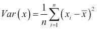

最后，我们将使用以下方程定义两个随机变量 *x* 和 *y* 之间的**协方差**：

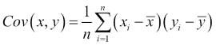

从前面的方程中，应该很明显，我们之前定义的方差实际上是一个特殊的情况，即协方差中的两个变量是相同的。协方差衡量两个变量之间相互关联的强度，可以是正的也可以是负的。正协方差意味着正相关；也就是说，当一个变量增加时，另一个变量也会增加。负协方差表示相反的情况；当一个变量增加时，另一个变量往往会减少。当两个变量在统计上相互独立且因此不相关时，它们的协方差将为零（尽管应该注意的是，零协方差并不一定意味着统计独立性）。

拥有这些基本概念后，我们现在可以给出简单线性回归中两个回归系数估计的方程：

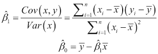

第一个回归系数可以计算为输出特征与输入特征之间的协方差与输入特征方差的比率。请注意，如果输出特征与输入特征独立，协方差将为零，因此，我们的线性模型将是一条没有斜率的水平线。在实践中，应注意，即使两个变量在统计上独立，我们通常也会看到由于误差的随机性质而存在一定程度的协方差；因此，如果我们训练一个线性回归模型来描述它们之间的关系，我们的第一个回归系数通常不会为零。稍后，我们将看到如何使用显著性测试来检测我们不应包括在模型中的特征。

在 R 中实现线性回归时，没有必要执行这些计算，因为 R 为我们提供了`lm()`函数，该函数为我们构建线性回归模型。以下代码示例使用我们之前创建的`df`数据框并计算回归系数：

```py
> myfit <- lm(y~x1, df)
> myfit

Call:
lm(formula = y ~ x1, data = df)

Coefficients:
(Intercept)           x1  
     -2.380        1.641  
```

在第一行中，我们看到使用`lm()`函数的用法包括首先指定一个公式，然后是`data`参数，在我们的情况下是数据框。在简单线性回归的情况下，我们为`lm()`函数指定的公式的语法是输出变量的名称，后跟波浪号(*~*)，然后是单个输入特征的名称。当我们在本章后面进一步研究多元线性回归时，我们将看到如何指定更复杂的公式。最后，输出显示了两个回归系数的值。请注意，*β[0]*系数被标记为截距，而*β[1]*系数被标记为对应特征（在这种情况下，`x[1]`）的名称，在线性模型的方程中：

下面的图表显示了人口线和估计线在同一图上的情况：

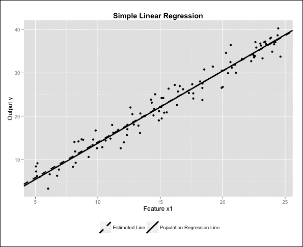

如我们所见，这两条线非常接近，几乎无法区分，这表明模型非常接近地估计了真实的人口线。从第一章《准备预测建模》中，我们知道我们可以形式化我们的模型与数据集匹配的紧密程度，以及它将如何使用均方误差与类似的测试集匹配。在本章中，我们将检查这一点以及几个其他模型性能和质量的指标，但首先我们将泛化我们的回归模型以处理多个输入特征。

# 多元线性回归

每当我们有多个输入特征并想要构建线性回归模型时，我们就处于多元线性回归的领域。具有*k*个输入特征的多元线性回归模型的一般方程是：

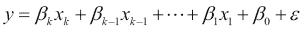

我们对模型和误差分量*ε*的假设与简单线性回归相同，记住我们现在有多个输入特征，我们假设它们是相互独立的。我们不会使用模拟数据来展示多重线性回归，而是将分析两个真实世界的数据集。

## 预测 CPU 性能

我们第一个真实世界的数据集是由研究人员*Dennis F. Kibler*、*David W. Aha*和*Marc K. Albert*在 1989 年发表的一篇题为*Instance-based prediction of real-valued attributes*的论文中提出的，该论文发表在*Journal of Computational Intelligence*杂志上。数据包含了不同 CPU 模型的特征，例如周期时间和缓存内存的大小。在决定处理器之间选择时，我们希望考虑所有这些因素，但理想情况下，我们希望在一个单一的数值尺度上比较处理器。因此，我们经常开发程序来基准测试 CPU 的相对性能。我们的数据集还包含了我们 CPU 的已发布相对性能，我们的目标将是使用可用的 CPU 特征来预测这一点。该数据集可以通过以下链接从 UCI 机器学习仓库在线获取：[`archive.ics.uci.edu/ml/datasets/Computer+Hardware`](http://archive.ics.uci.edu/ml/datasets/Computer+Hardware)。

### 提示

UCI 机器学习仓库是一个优秀的在线资源，它托管了大量的数据集，其中许多数据集经常被书籍和教程的作者引用。熟悉这个网站及其数据集是值得努力的。学习预测分析的一个非常好的方法是练习使用你在本书中学到的技术在不同数据集上进行分析，而 UCI 仓库提供了许多这样的数据集，正好用于这个目的。

`machine.data`文件包含了我们所有的数据，以逗号分隔的格式，每行对应一个 CPU 模型。我们将使用 R 导入这些数据并标记所有列。请注意，总共有 10 列，但我们的分析不需要前两列，因为这些只是 CPU 的品牌和型号名称。同样，最后一列是研究人员自己产生的相对性能预测估计；我们的实际输出变量 PRP 在第 9 列。我们将需要的所有数据存储在一个名为`machine`的数据框中：

```py
> machine <- read.csv("machine.data", header = F)
> names(machine) <- c("VENDOR", "MODEL", "MYCT", "MMIN", "MMAX", "CACH", "CHMIN", "CHMAX", "PRP", "ERP")
> machine <- machine[, 3:9]
> head(machine, n = 3)
  MYCT MMIN  MMAX CACH CHMIN CHMAX PRP
1  125  256  6000  256    16   128 198
2   29 8000 32000   32     8    32 269
3   29 8000 32000   32     8    32 220
```

该数据集还包含了数据列的定义：

| 列名 | 定义 |
| --- | --- |
| `MYCT` | 机器周期时间（纳秒） |
| `MMIN` | 最小主内存（千字节） |
| `MMAX` | 最大主内存（千字节） |
| `CACH` | 缓存内存（千字节） |
| `CHMIN` | 最小通道数（单位） |
| `CHMAX` | 最大通道数（单位） |
| `PRP` | 已发布的相对性能（我们的输出变量） |

数据集不包含缺失值，因此不需要移除或修改任何观测值。我们会注意到，我们只有大约 200 个数据点，这在一般情况下被认为是一个非常小的样本。尽管如此，我们将继续将我们的数据分为训练集和测试集，比例为 85-15，如下所示：

```py
> library(caret)
> set.seed(4352345)
> machine_sampling_vector <- createDataPartition(machine$PRP, p = 0.85, list = FALSE)
> machine_train <- machine[machine_sampling_vector,]
> machine_train_features <- machine[, 1:6]
> machine_train_labels <- machine$PRP[machine_sampling_vector]
> machine_test <- machine[-machine_sampling_vector,]
> machine_test_labels <- machine$PRP[-machine_sampling_vector]
```

现在我们已经设置了数据集并开始运行，我们通常会想进一步调查并检查我们的一些线性回归假设是否有效。例如，我们想知道我们是否有高度相关的特征。为此，我们可以使用`cor()`函数构建一个相关矩阵，并使用`caret`包中的`findCorrelation()`函数来获取关于哪些特征需要移除的建议：

```py
> machine_correlations <- cor(machine_train_features)
> findCorrelation(machine_correlations)
integer(0)
> findCorrelation(machine_correlations, cutoff = 0.75)
[1] 3
> cor(machine_train$MMIN, machine_train$MMAX)
[1] 0.7679307
```

使用默认的`0.9`截止值以获得高度相关性，我们发现我们没有任何特征应该被移除。当我们把这个截止值降低到`0.75`时，我们看到`caret`建议我们移除第三个特征（MMAX）。正如前面代码的最后一行所示，这个特征和 MMIN 之间的相关性为`0.768`。虽然这个值不是很高，但它仍然足够高，让我们对它可能会影响我们的模型产生一定的担忧。直观上，当然，如果我们查看我们输入特征的定义，我们肯定会倾向于期望一个最小主存值相对较高的模型也可能会有一个相对较高的最大主存值。线性回归有时仍然可以用相关变量给出一个好的模型，但我们预计如果我们的变量不相关，我们会得到更好的结果。目前，我们决定保留这个数据集的所有特征。

## 预测二手车价格

我们的第二个数据集包含在`caret`包中的`cars`数据框中，由*Shonda Kuiper*在 2008 年从*Kelly Blue Book*网站收集，[www.kbb.com](http://www.kbb.com)。这是一个在线资源，可以获取可靠的二手车价格。数据集包括 804 辆通用汽车，所有车辆都是 2005 年的型号。它包括许多汽车属性，如里程和发动机尺寸以及建议的售价。许多特征是二元指示变量，例如 Buick 特征，表示一辆特定汽车的制造商是否为 Buick。当定价时，这些汽车都处于极好状态且不到一年，因此汽车状况没有被包括为特征。我们的目标是构建一个模型，使用这些属性的值来预测汽车的售价。特征的定义如下：

| 列名 | 定义 |
| --- | --- |
| `价格` | 美元（我们的输出变量）的建议零售价 |
| `里程` | 汽车行驶的英里数 |
| `汽缸数` | 汽车发动机的汽缸数 |
| `车门数` | 车门数量 |
| `Cruise` | 表示汽车是否具有定速巡航的指示变量 |
| `Sound` | 表示汽车是否升级了扬声器的指示变量 |
| `Leather` | 表示汽车是否配备了真皮座椅的指示变量 |
| `Buick` | 表示汽车品牌是否为别克 的指示变量 |
| `Cadillac` | 表示汽车品牌是否为凯迪拉克的指示变量 |
| `Chevy` | 表示汽车品牌是否为雪佛兰的指示变量 |
| `Pontiac` | 表示汽车品牌是否为庞蒂亚克的指示变量 |
| `Saab` | 表示汽车品牌是否为萨博的指示变量 |
| `Saturn` | 表示汽车品牌是否为土星的指示变量 |
| `convertible` | 表示汽车类型是否为敞篷车的指示变量 |
| `coupe` | 表示汽车类型是否为敞篷车的指示变量 |
| `hatchback` | 表示汽车类型是否为掀背车的指示变量 |
| `sedan` | 表示汽车类型是否为轿车的指示变量 |
| `wagon` | 表示汽车类型是否为旅行车的指示变量 |

与机器数据集一样，我们应该调查输入特征之间的相关性：

```py
> library(caret)
> data(cars)
> cars_cor <- cor(cars_train_features)
> findCorrelation(cars_cor)
integer(0)
> findCorrelation(cars_cor, cutoff = 0.75)
[1] 3
> cor(cars$Doors,cars$coupe)
[1] -0.8254435
> table(cars$coupe,cars$Doors)

      2   4
  0  50 614
  1 140   0
```

就像机器数据集一样，当我们把`caret`包中的`findCorrelation()`函数的`cutoff`设置为`0.75`时，会出现相关性。通过直接检查相关矩阵，我们发现`Doors`特征和`coupe`特征之间存在相对较高的相关性。通过交叉表分析这两个特征，我们可以看到为什么会出现这种情况。如果我们知道一辆车的类型是敞篷车，那么车门数量总是两个。如果汽车不是敞篷车，那么它很可能有四个车门。

汽车数据中另一个问题方面是，一些特征是其他特征的精确线性组合。这是通过使用`caret`包中的`findLinearCombos()`函数发现的：

```py
> findLinearCombos(cars)
$linearCombos
$linearCombos[[1]]
[1] 15  4  8  9 10 11 12 13 14

$linearCombos[[2]]
 [1] 18  4  8  9 10 11 12 13 16 17

$remove
[1] 15 18
```

在这里，我们被建议删除`coupe`和`wagon`列，它们分别是第 15 和第 18 个特征，因为它们是其他特征的精确线性组合。我们将从我们的数据框中删除这两列，从而消除我们之前看到的关联问题。

接下来，我们将数据分为训练集和测试集：

```py
> cars <- cars[,c(-15, -18)]
> set.seed(232455)
> cars_sampling_vector <- createDataPartition(cars$Price, p = 
  0.85, list = FALSE)
> cars_train <- cars[cars_sampling_vector,]
> cars_train_features <- cars[,-1]
> cars_train_labels <- cars$Price[cars_sampling_vector]
> cars_test <- cars[-cars_sampling_vector,]
> cars_test_labels <- cars$Price[-cars_sampling_vector]
```

现在我们已经准备好了数据，我们将构建一些模型。

# 评估线性回归模型

我们将再次使用`lm()`函数将线性回归模型拟合到我们的数据上。对于我们的两个数据集，我们希望使用各自数据框中剩余的所有输入特征。R 为我们提供了一个简写，可以编写包含数据框所有列作为特征的公式，排除选定的输出列。这可以通过单个点来完成，如下面的代码片段所示：

```py
> machine_model1 <- lm(PRP ~ ., data = machine_train)
> cars_model1 <- lm(Price ~ ., data = cars_train)
```

一旦我们准备好了所有数据，训练线性回归模型可能只是一行代码的事情，但重要的工作紧接着就开始了，我们需要研究模型以确定我们做得如何。幸运的是，我们可以通过使用`summary()`函数立即获取有关模型的一些重要信息。此函数对我们 CPU 数据集的输出如下所示：

```py
> summary(machine_model1)

Call:
lm(formula = PRP ~ ., data = machine_train)

Residuals:
    Min      1Q  Median      3Q     Max 
-199.29  -24.15    6.91   26.26  377.47 

Coefficients:
              Estimate Std. Error t value Pr(>|t|)    
(Intercept) -5.963e+01  8.861e+00  -6.730 2.43e-10 ***
MYCT         5.210e-02  1.885e-02   2.764 0.006335 ** 
MMIN         1.543e-02  2.025e-03   7.621 1.62e-12 ***
MMAX         5.852e-03  6.867e-04   8.522 7.68e-15 ***
CACH         5.311e-01  1.494e-01   3.555 0.000488 ***
CHMIN        7.761e-02  1.055e+00   0.074 0.941450    
CHMAX        1.498e+00  2.304e-01   6.504 8.20e-10 ***
---
Signif. codes:  0 '***' 0.001 '**' 0.01 '*' 0.05 '.' 0.1 ' ' 1

Residual standard error: 61.31 on 172 degrees of freedom
Multiple R-squared:  0.874,	Adjusted R-squared:  0.8696 
F-statistic: 198.8 on 6 and 172 DF,  p-value: < 2.2e-16
```

在重复调用`lm()`函数本身之后，`summary()`函数提供的信息被组织成三个不同的部分。第一部分是模型残差的总结，这些残差是我们模型在训练数据上观测到的误差。第二部分是一个表格，包含模型系数的预测值以及它们显著性测试的结果。最后几行显示了模型的总体性能指标。如果我们对汽车数据集重复同样的过程，我们会在模型总结中注意到以下这一行：

```py
Coefficients: (1 not defined because of singularities)
```

这种情况发生是因为我们仍然有一个特征，其影响输出效果与其他特征不可区分，这是由于潜在的依赖关系。这种现象被称为**混叠**。`alias()`命令显示了我们需要从模型中移除的特征：

```py
> alias(cars_model1)
Model :
Price ~ Mileage + Cylinder + Doors + Cruise + Sound + Leather + 
    Buick + Cadillac + Chevy + Pontiac + Saab + Saturn + convertible + hatchback + sedan

Complete :
       (Intercept) Mileage Cylinder Doors Cruise Sound
Saturn  1           0       0        0     0      0   
       Leather Buick Cadillac Chevy Pontiac Saab convertible
Saturn  0      -1    -1       -1    -1      -1    0         
       hatchback sedan
Saturn  0         0   
```

如我们所见，问题特征是`Saturn`，因此我们将移除这个特征并重新训练模型。要排除线性回归模型中的一个特征，我们在公式中包含它，并在其后加上一个减号：

```py
> cars_model2 <- lm(Price ~. -Saturn, data = cars_train)
> summary(cars_model2)

Call:
lm(formula = Price ~ . - Saturn, data = cars_train)

Residuals:
    Min      1Q  Median      3Q     Max 
-9324.8 -1606.7   150.5  1444.6 13461.0 

Coefficients:
              Estimate Std. Error t value Pr(>|t|)    
(Intercept)  -954.1919  1071.2553  -0.891  0.37340    
Mileage        -0.1877     0.0137 -13.693  < 2e-16 ***
Cylinder     3640.5417   123.5788  29.459  < 2e-16 ***
Doors        1552.4008   284.3939   5.459 6.77e-08 ***
Cruise        330.0989   324.8880   1.016  0.30998    
Sound         388.4549   256.3885   1.515  0.13022    
Leather       851.3683   274.5213   3.101  0.00201 ** 
Buick        1104.4670   595.0681   1.856  0.06389 .  
Cadillac    13288.4889   673.6959  19.725  < 2e-16 ***
Chevy        -553.1553   468.0745  -1.182  0.23772    
Pontiac     -1450.8865   524.9950  -2.764  0.00587 ** 
Saab        12199.2093   600.4454  20.317  < 2e-16 ***
convertible 11270.4878   597.5162  18.862  < 2e-16 ***
hatchback   -6375.4970   669.6840  -9.520  < 2e-16 ***
sedan       -4441.9152   490.8347  -9.050  < 2e-16 ***
---
Signif. codes:  0 '***' 0.001 '**' 0.01 '*' 0.05 '.' 0.1 ' ' 1

Residual standard error: 2947 on 669 degrees of freedom
Multiple R-squared:  0.912,	Adjusted R-squared:  0.9101 
F-statistic: 495.1 on 14 and 669 DF,  p-value: < 2.2e-16
```

## 残差分析

残差简单来说就是我们的模型对特定观测值产生的误差。换句话说，它是实际输出值与我们的预测值之间的差异：

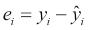

在构建一个好的回归模型时，分析残差非常重要，因为残差揭示了我们的模型的各种方面，从违反的假设和拟合质量到其他问题，例如异常值。为了理解残差摘要中的指标，想象一下将残差从小到大排序。除了出现在序列两端的极值最小值和最大值之外，摘要还显示了第一和第三四分位数，它们分别代表在这个序列中四分之一和三分之四处的值。**中位数**是序列中间的值。**四分位距**是第一和第三四分位数之间的序列部分，并且根据定义包含了一半的数据。首先看看我们 CPU 模型的残差摘要，有趣的是，与最小值和最大值相比，第一和第三四分位数的值相当小。这是第一个迹象，表明可能有一些点具有较大的残差误差。在理想情况下，我们的残差将有一个中位数为零，并且四分位数将具有较小的值。我们可以通过注意由`lm()`函数生成的模型具有`residuals`属性来重现残差摘要：

```py
> summary(cars_model2$residuals)
   Min. 1st Qu.  Median    Mean 3rd Qu.    Max. 
-9325.0 -1607.0   150.5     0.0  1445.0 13460.0 
> mean(cars_train$Price)
[1] 21320.2
```

注意，在我们之前的 cars 模型示例中，我们需要将残差值与输出变量的平均值进行比较，以便了解残差是否很大。因此，之前的结果表明，我们训练数据中汽车的平均售价约为 21 千美元，并且 50%的预测值大致在正确值的±1.6 千美元范围内，这似乎相当合理。显然，我们 CPU 模型的残差绝对值都小得多，因为该模型的输出变量值，即发布的相对性能，比 cars 模型中的`Price`值小得多。

在线性回归中，我们假设模型中的不可减少误差是随机分布的，服从正态分布。一种称为**分位数-分位数图**（**Q-Q 图**）的诊断图有助于我们直观地评估这种假设的成立程度。这种图背后的关键思想是，我们可以通过比较两个分布的**分位数**来比较这两个分布。分布的分位数实际上是随机变量的等间距区间，每个区间具有相同的概率；例如，四分位数是四分位数，因为它们将分布分成四个等可能的四部分。如果两个分布相同，那么图表应该是一条线*y = x*的图。为了检查我们的残差是否服从正态分布，我们可以将它们的分布与正态分布进行比较，并看看我们离*y = x*线有多近。

### 小贴士

有许多其他方法可以检查模型残差是否呈正态分布。一个好的地方是查看`nortest` R 包，它实现了许多著名的正态性测试，包括安德森-达尔林测试和 Lilliefors 测试。此外，`stats`包包含用于执行 Shapiro-Wilk 正态性测试的`shapiro.test()`函数。

以下代码生成我们的两个数据集的 Q-Q 图：

```py
> par(mfrow = c(2, 1))
> machine_residuals <- machine_model1$residuals
> qqnorm(machine_residuals, main = "Normal Q-Q Plot for CPU data set")
> qqline(machine_residuals)
> cars_residuals <- cars_model2$residuals
> qqnorm(cars_residuals, main = "Normal Q-Q Plot for Cars \data set")
> qqline(cars_residuals)
```

下图显示了 Q-Q 图：

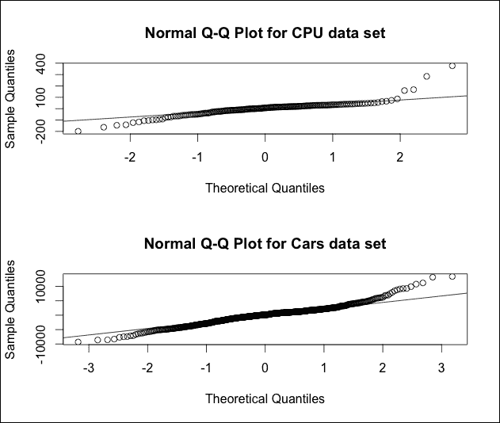

两个模型的残差似乎合理地接近正态分布的理论分位数，尽管拟合并不完美，这在大多数现实世界的数据中是典型的。对于线性回归来说，第二个非常有用的诊断图是所谓的**残差图**。这是训练数据中观测值的残差与对应拟合值的图。换句话说，这是(*i*, *e[i]*)对的图。残差图有两个重要的特性特别引起我们的兴趣。首先，我们希望通过检查残差是否在拟合值的不同范围内平均上不是更大，而是更小，来确认我们的常数方差假设。其次，我们应该验证残差中是否存在某种模式。然而，如果观察到模式，这可能表明基础模型在涉及的特征方面是非线性的，或者我们的模型中缺少一些我们没有包括的额外特征。实际上，发现可能对我们模型有用的新特征的一种方法是寻找与我们模型残差相关的特征。

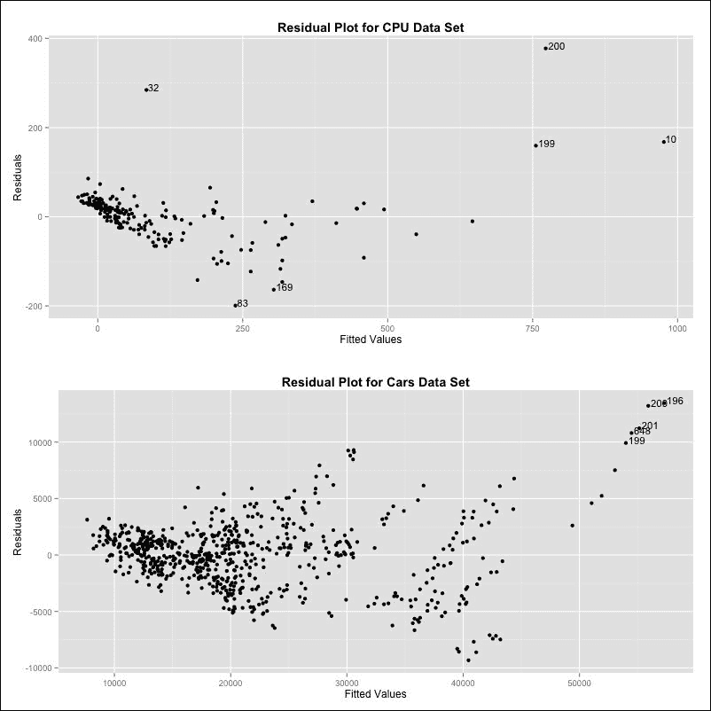

两个图都显示了图形左侧残差略微减少的模式。更令人担忧的是，残差的方差似乎对于两个输出变量的较高值都要高一些，这可能表明误差不是同方差。这在第二个关于汽车数据集的图中更为明显。在前两个残差图中，我们还标记了一些较大的残差（以绝对值计）。我们很快就会看到这些是潜在的异常值候选者。另一种获得残差图的方法是使用`lm()`函数生成的模型上的`plot()`函数。这生成了四个诊断图，包括残差图和 Q-Q 图。

## 线性回归的显著性测试

在仔细审查残差摘要之后，我们接下来应该关注的是我们模型产生的系数表。在这里，每个估计系数都伴随着一组额外的数字，以及一个或多个星号或点在末尾。起初，由于数字的冲击，这可能会让人感到困惑，但所有这些信息都包含在内是有很好的理由的。当我们对某些数据进行测量并指定一组特征来构建线性回归模型时，通常情况下，这些特征中的一个或多个实际上与我们要预测的输出无关。当然，在我们收集数据之前，我们通常不会意识到这一点。理想情况下，我们希望我们的模型不仅找到与我们的输出实际依赖的特征相对应的系数的最佳值，而且还告诉我们哪些特征我们不需要。

确定我们模型中某个特定特征是否需要的可能方法之一是训练两个模型而不是一个。第二个模型将包含第一个模型的所有特征，但不包括我们试图确定其重要性的特定特征。然后，我们可以通过查看它们的残差分布来测试这两个模型是否不同。这正是 R 为我们每个模型中指定的所有特征所做的事情。对于每个系数，都会为对应特征与输出变量无关的零假设构建一个**置信区间**。具体来说，对于每个系数，我们考虑一个包含所有其他特征的线性模型，除了与该系数对应的特征。然后，我们测试是否将这个特定特征添加到模型中会显著改变残差误差的分布，这将作为该特征与输出之间存在线性关系的证据，并且其系数不应为零。R 的`lm()`函数会自动为我们运行这些测试。

### 注意

在统计学中，置信区间结合了点估计的精度。这是通过指定一个区间来完成的，在该区间内，估计的参数的真实值预计将在一定程度的置信度下。一个参数的 95%全局置信区间基本上告诉我们，如果我们从同一实验中收集 100 个数据样本，并为每个样本中估计的参数构建一个 95%的置信区间，那么目标参数的真实值将位于其对应的置信区间内 95 个数据样本。对于具有高方差的点估计构建的置信区间，例如当使用非常少的数据点进行估计时，往往会定义一个更宽的区间，以相同的置信度来定义，比使用低方差进行的估计。

让我们看一下 CPU 模型的摘要输出的快照，它显示了 CPU 模型中截距和 MYCT 特征的系数：

```py
              Estimate Std. Error t value Pr(>|t|)    
(Intercept) -5.963e+01  8.861e+00  -6.730 2.43e-10 ***
MYCT         5.210e-02  1.885e-02   2.764 0.006335 ** 
```

目前专注于 MYCT 特征，其所在行中的第一个数字是它系数的估计值，这个数字大约是 0.05（*5.210×10^(-2)*）。**标准误差**是这个估计值的标准差，这个值接下来给出为 0.01885。我们可以通过计算零和我们的系数估计值之间的标准误差数量来衡量我们对系数值是否真正为零（表示此特征的线性关系不存在）的信心。为此，我们可以将我们的系数估计值除以我们的标准误差，这正是**t 值**的定义，我们行中的第三个值：

```py
> (q <- 5.210e-02 / 1.885e-02)
[1] 2.763926
```

因此，我们的 MYCT 系数几乎有 3 个标准误差远离零，这是一个相当好的指标，表明这个系数不太可能是零。t 值越高，我们越有可能在我们的线性模型中包含我们的特征，并且系数不为零。我们可以将这个绝对值转换成一个概率，告诉我们系数真正为零的可能性有多大。这个概率是从 Student's t 分布获得的，称为**p 值**。对于 MYCT 特征，这个概率是 0.006335，这个值很小。我们可以使用`pt()`函数获得这个值：

```py
> pt(q, df = 172, lower.tail = F) * 2
[1] 0.006333496
```

`pt()`函数是 t 分布的分布函数，它是对称的。为了理解为什么我们的 p 值是这样计算的，请注意，我们感兴趣的是 t 值的绝对值大于我们计算出的值的概率。为了获得这个值，我们首先获得 t 分布的上尾或右尾的概率，然后乘以 2，以便包括下尾。在 R 中使用基本分布函数是一个非常重要的技能，如果这个例子看起来过于困难，我们已经在我们的在线教程章节中包含了示例。t 分布由自由度参数化。

### 注意

自由度基本上是我们计算特定统计量（如系数估计）时可以自由改变的变量的数量。在我们的线性回归背景下，这相当于我们的训练数据中的观测数减去模型中的参数数（回归系数的数量）。对于我们的 CPU 模型，这个数字是*179 – 7 = 172*。对于数据点更多的汽车模型，这个数字是 664。这个名字来源于它与作为系统输入应用的独立维度或信息数量的关系，因此反映了系统在不违反任何输入约束的情况下可以自由配置的程度。

一般来说，我们希望我们的 p 值小于 0.05，这意味着我们希望我们的系数估计的 95%置信区间不包括零。每个系数旁边的星号数量为我们提供了一个快速的可视辅助工具，以了解置信水平，一个星号对应我们的 95%经验法则，而两个星号则代表 99%的置信区间。因此，我们模型总结中没有任何星号的每个系数都对应一个特征，我们不太确定是否应该使用我们的经验法则将其包含在模型中。在 CPU 模型中，CHMIN 特征是唯一一个可疑的特征，其他特征的 p 值都非常小。在 cars 模型中，情况则不同。这里，我们有四个可疑的特征，包括截距项。

在我们的线性回归模型背景下，正确理解 p 值的解释非常重要。首先，我们不能也不应该将 p 值相互比较，以判断哪个特征最重要。其次，高 p 值并不一定意味着特征与输出之间没有线性关系；它仅仅表明，在所有其他模型特征存在的情况下，这个特征不会为输出变量提供任何新的信息。最后，我们应始终记住，95%的经验法则并非完美无缺，并且只有在特征和系数数量不是很大时才真正有用。在 95%的置信水平下，如果我们模型中有 1,000 个特征，我们平均可以期望有 50 个系数的结果是错误的。因此，线性回归系数显著性检验在处理高维问题时不那么有用。

显著性检验的最终结果实际上出现在`lm()`输出摘要的底部，位于最后一行。这一行提供了**F 统计量**，这个名字来源于 F 检验，该检验检查两个（理想情况下为正态分布）分布的方差之间是否存在统计显著性。在这个情况下，F 统计量试图评估所有系数为零的模型的残差方差与训练模型的残差方差之间是否存在显著的差异。

换句话说，F 检验将告诉我们训练的模型是否解释了输出中的部分方差，因此我们知道至少有一个系数不为零。虽然当我们有许多系数时并不那么有用，但这个测试一起测试了系数的显著性，并且不会像对单个系数的 t 检验那样出现问题。总结显示了一个极小的 p 值，因此我们知道至少有一个系数不为零。我们可以使用`anova()`函数重现所运行的 F 检验，该函数代表**方差分析**。这个测试比较了**零模型**，即仅包含截距而没有特征构建的模型，与我们的训练模型。我们将在这里展示 CPU 数据集的示例：

```py
> machine_model_null <- lm(PRP ~ 1, data = machine_train)
> anova(machine_model_null, machine_model1)
Analysis of Variance Table

Model 1: PRP ~ 1
Model 2: PRP ~ MYCT + MMIN + MMAX + CACH + CHMIN + CHMAX
  Res.Df     RSS Df Sum of Sq      F    Pr(>F)    
1    178 5130399                                  
2    172  646479  6   4483919 198.83 < 2.2e-16 ***
---
Signif. codes:  0 '***' 0.001 '**' 0.01 '*' 0.05 '.' 0.1 ' ' 1
```

注意，零模型公式为 `PRP ~ 1`，其中 1 代表截距。

## 线性回归的性能指标

我们总结中的最后细节涉及模型的整体性能以及线性模型拟合数据的程度。为了理解我们如何评估线性回归拟合，我们首先应该指出，线性回归模型的训练标准是最小化数据上的 MSE。换句话说，将线性模型拟合到一组数据点相当于找到一个斜率和位置，使得这些点到直线的平方距离之和（或平均值）最小。由于我们将数据点与其在直线上的预测值之间的误差称为残差，我们可以将**残差平方和**（**RSS**）定义为所有平方残差的和：

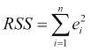

换句话说，RSS 仅仅是**平方误差之和**（**SSE**），因此我们可以通过这个简单的方程与我们所熟悉的 MSE（均方误差）联系起来：

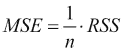

除去某些历史原因之外，RSS 是一个需要关注的 重要指标，因为它与另一个重要的指标 RSE（残差平方和）相关，我们将在下一节中讨论。为此，我们首先需要建立起对训练线性回归模型时会发生什么的感觉。如果我们多次运行我们的简单线性回归实验，每次改变随机种子以获得不同的随机样本，我们会看到我们会得到多条回归线，这些回归线很可能非常接近真实总体线，正如我们的单次运行所显示的那样。这说明了线性模型通常具有低方差的特点。当然，我们试图逼近的未知函数可能非常非线性，因此，即使是总体回归线也不太可能很好地拟合非线性函数的数据。这是因为线性假设非常严格，因此，线性回归是一种具有高偏差的方法。

我们定义了一个称为**残差标准误差**（**RSE**）的度量，它估计了我们的模型与目标函数的标准差。也就是说，它大致衡量了我们的模型平均偏离总体回归线的距离。这是以输出变量的单位来衡量的，是一个绝对值。因此，它需要与*y*的值进行比较，以判断对于特定的样本它是否很高。具有*k*个输入特征的模型的通用 RSE 计算如下：


对于简单线性回归，这仅仅是*k = 1*时的情况：

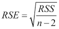

我们可以使用前面的公式来计算我们两个模型的 RSE，如下所示：

```py
> n_machine <- nrow(machine_train)
> k_machine <- length(machine_model1$coefficients) - 1
> sqrt(sum(machine_model1$residuals ^ 2) / (n_machine - k_machine - 1))
[1] 61.30743

> n_cars <- nrow(cars_train)
> k_cars <- length(cars_model2$coefficients) - 1
> sqrt(sum(cars_model2$residuals ^ 2) / (n_cars - k_cars - 1))
[1] 2946.98
```

为了解释我们两个模型的 RSE 值，我们需要将它们与我们的输出变量均值进行比较：

```py
> mean(machine_train$PRP)
[1] 109.4804
> mean(cars_train$Price)
[1] 21320.2
```

注意，在汽车模型中，61.3 的 RSE 与汽车模型的 RSE 相比非常小，后者大约为 2,947。然而，当我们从这些数字与各自输出变量均值接近的程度来看时，我们了解到实际上汽车模型的 RSE 显示出更好的拟合。

现在，尽管 RSE 作为一个绝对值是有用的，因为可以将其与输出变量的均值进行比较，但我们经常想要一个相对值，我们可以用它来比较不同的训练场景。为此，在评估线性回归模型的拟合度时，我们通常也会查看**R²统计量**。在总结中，这表示为多重 R 平方。在我们提供方程之前，我们首先介绍**总平方和**（**TSS**）的概念。总平方和与输出变量的总方差成比例，旨在衡量我们在进行回归之前该变量的内在变异性。TSS 的公式是：

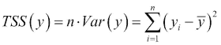

R²统计量的背后的思想是，如果一个线性回归模型与真实总体模型非常接近，它应该能够完全捕捉输出中的所有方差。实际上，我们经常将 R²统计量称为相对量，它显示了输出方差中有多少比例是由回归解释的。当我们应用我们的回归模型来获得输出变量的估计时，我们看到我们的观察误差被称为残差，而 RSS 基本上与我们的预测和输出函数真实值之间剩余的方差成比例。因此，我们可以定义 R²统计量，即我们的线性回归模型解释的输出*y*中的方差量，作为起始方差（TSS）和结束方差（RSS）相对于起始方差（TSS）的差值。作为一个公式，这仅仅是：

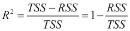

从这个方程中，我们可以看到 R²的范围在 0 到 1 之间。一个接近 1 的值表明拟合良好，因为它意味着输出变量的大部分方差已经被回归模型解释。另一方面，一个低值表明模型中仍然存在显著的误差方差，这表明我们的模型不是一个好的拟合。让我们看看如何手动计算我们两个模型的 R²统计量：

```py
compute_rsquared <- function(x, y) {
     rss <- sum((x - y) ^ 2)
     tss <- sum((y - mean(y)) ^ 2)
     return(1 - (rss / tss))
 }

> compute_rsquared(machine_model1$fitted.values, machine_train$PRP)
[1] 0.8739904
> compute_rsquared(cars_model2$fitted.values, cars_train$Price)
[1] 0.9119826
```

我们使用了由`lm()`训练的模型的`fitted.values`属性，这是模型在训练数据上做出的预测。这两个值都相当高，汽车模型再次显示出略微更好的拟合。我们现在已经看到了两个评估线性回归模型的重要指标，即 RSE 和 R²统计量。在这个时候，我们可能考虑是否存在一个更通用的度量两个变量之间线性关系的指标，我们也可以将其应用于我们的案例。从统计学中，我们可能会回忆起相关性的概念正是描述这一点。

两个随机变量*X*和*Y*之间的**相关性**由以下公式给出：

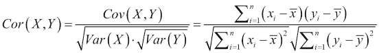

结果表明，在简单回归的情况下，输出变量和输入特征之间的相关性的平方与 R²统计量相同，这一结果进一步强调了后者作为一个有用指标的重要性。

## 比较不同的回归模型

当我们想要比较在相同输入特征集上训练的两个不同的回归模型时，R²统计量非常有用。然而，通常我们想要比较两个没有相同数量输入特征的模型。例如，在特征选择的过程中，我们可能想知道是否在我们的模型中包含某个特定特征是一个好主意。R²统计量的一个局限性是它往往对于具有更多输入参数的模型更高。

**调整 R²**试图纠正 R²总是对于具有更多输入特征的模型更高的现象，因此容易过拟合。调整 R²通常低于 R²本身，正如我们可以通过检查我们的模型摘要中的值来验证的那样。调整 R²的公式是：

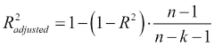

*n*和*k*的定义与 R²统计量的定义相同。现在，让我们在 R 中实现这个函数并计算我们两个模型的调整 R²：

```py
compute_adjusted_rsquared <- function(x, y, k) {
     n <- length(y)
     r2 <- compute_rsquared(x, y)
     return(1 - ((1 - r2) * (n - 1) / (n - k - 1)))
 }

> compute_adjusted_rsquared(machine_model1$fitted.values, 
                            machine_train$PRP, k_machine)
[1] 0.8695947
> compute_adjusted_rsquared(cars_model2$fitted.values, 
                            cars_train$Price, k_cars)
[1] 0.9101407
```

### 注意

有几种其他常用的性能指标，旨在比较具有不同特征数量的模型。**赤池信息量准则（AIC**）使用信息论方法，通过平衡模型复杂度和准确性来评估模型的相对质量。对于通过最小化平方误差训练的线性回归模型，这与其他已知的统计量**马尔可夫 Cp（Mallow's Cp**）成比例，因此它们可以互换使用。第三个指标是**贝叶斯信息量准则（BIC**）。与之前的指标相比，它倾向于对具有更多变量的模型进行更重的惩罚。

## 测试集性能

到目前为止，我们已经从训练数据的角度来评估我们模型的性能。这对于判断一个线性模型是否能够很好地拟合数据非常重要，但它并不能给我们一个关于未见数据预测准确性的良好感觉。为此，我们转向我们的测试数据集。为了使用我们的模型进行预测，我们可以使用`predict()`函数。这是 R 中一个通用的函数，许多包都对其进行了扩展。对于使用`lm()`训练的模型，我们只需要提供模型和一个包含我们想要预测的观测值的数据框：

```py
> machine_model1_predictions <- predict(machine_model1, 
                                        machine_test)
> cars_model2_predictions <- predict(cars_model2, cars_test)
```

接下来，我们将定义我们自己的函数来计算均方误差（MSE）：

```py
compute_mse <- function(predictions, actual) { 
     mean( (predictions - actual) ^ 2 ) 
}
> compute_mse(machine_model1$fitted.values, machine_train$PRP)
[1] 3611.616
> compute_mse(machine_model1_predictions, machine_test$PRP)
[1] 2814.048
> 
> compute_mse(cars_model2$fitted.values, cars_train$Price)
[1] 8494240
> compute_mse(cars_model2_predictions, cars_test$Price)
[1] 7180150
```

对于每个模型，我们已经使用我们的`compute_mse()`函数来返回训练和测试的 MSE。在这种情况下，两个测试 MSE 值都小于训练 MSE 值。测试 MSE 是略微大于还是小于训练 MSE 并不特别重要。重要的问题是测试 MSE 并没有显著大于训练 MSE，因为这会表明我们的模型正在过度拟合数据。请注意，特别是对于 CPU 模型，原始数据集中的观测数非常少，这导致了测试集的大小也非常小。因此，我们应该对我们的模型在未见数据上的预测性能的准确性保持谨慎，因为使用小测试集大小做出的预测将具有更高的方差。

# 线性回归问题

在本章中，我们已经看到了一些例子，说明尝试构建线性回归模型可能会遇到问题。我们讨论的一个大类别的问题与我们的模型假设——线性、特征独立性和误差的同方差性和正态性有关。特别是，我们看到了通过绘图（如残差图）或使用识别相关成分的函数来诊断这些问题的方法。在本节中，我们将探讨一些可能出现在线性回归中的更多问题。

## 多重共线性

作为预处理步骤的一部分，我们勤奋地移除了彼此之间线性相关的特征。在这个过程中，我们寻找的是精确的线性关系，这是一个**完全共线性**的例子。**共线性**是描述两个特征大约处于线性关系时的属性。这给线性回归带来了问题，因为我们试图为几乎相互为线性函数的变量分配单独的系数。这可能导致两个高度共线性特征具有高 p 值，表明它们与输出变量无关，但如果我们移除其中一个并重新训练模型，剩下的那个将具有低 p 值。共线性的另一个经典迹象是其中一个系数的异常符号；例如，对于一个预测收入的线性模型，教育背景的系数为负。可以通过成对相关性检测两个特征之间的共线性。处理共线性的方法之一是将两个特征合并成一个新的特征（例如，通过平均）；另一种方法简单地丢弃其中一个特征。

当线性关系涉及超过两个特征时，就会发生**多重共线性**。检测这种关系的一个标准方法是计算线性模型中每个输入特征的**方差膨胀因子**（**VIF**）。简而言之，VIF 试图估计由于该特征与其他特征共线性而导致的特定系数估计中观察到的方差增加。这通常是通过拟合一个线性回归模型来完成的，我们将其中一个特征作为输出特征，将剩余的特征作为常规输入特征。然后我们计算这个线性模型的 R²统计量，并据此使用公式 *1 / (1 – R²)* 计算我们选择特征的 VIF。在 R 中，`car`包包含`vif()`函数，它可以方便地计算线性回归模型中每个特征的 VIF 值。这里的一个经验法则是，如果一个特征的 VIF 得分超过 4，那么它是可疑的，而得分超过 10 则表明存在多重共线性的可能性很大。鉴于我们注意到我们的汽车数据具有线性相关的特征，我们必须移除它们，让我们调查剩下的那些是否有多重共线性：

```py
> library("car")
> vif(cars_model2)
    Mileage    Cylinder       Doors      Cruise       Sound 
   1.010779    2.305737    4.663813    1.527898    1.137607 
    Leather       Buick    Cadillac       Chevy     Pontiac 
   1.205977    2.464238    3.158473    4.138318    3.201605 
       Saab convertible   hatchback       sedan 
   3.515018    1.620590    2.481131    4.550556
```

在这里，我们看到三个略高于`4`的值，但没有超过这个值的值。例如，以下代码展示了如何计算`sedan`的 VIF 值：

```py
> sedan_model <- lm(sedan ~ .-Price -Saturn, data = cars_train)
> sedan_r2 <- compute_rsquared(sedan_model$fitted.values, cars_train$sedan)
> 1 / (1-sedan_r2)
[1] 4.550556
```

## 异常值

当我们查看两个模型的残差时，我们发现某些观测的残差明显高于其他观测。例如，参考 CPU 模型的残差图，我们可以看到观测 200 有一个非常高的残差。这是一个**异常值**的例子，其预测值与实际值相差甚远。由于残差的平方，异常值往往会显著影响 RSS，让我们有一种感觉，即我们没有好的模型拟合。异常值可能由于测量误差而产生，检测它们可能很重要，因为它们可能表示不准确或不有效的数据。

另一方面，异常值可能仅仅是由于没有正确的特征或构建了错误类型的模型。

由于我们在数据收集过程中通常无法知道一个异常值是错误还是真实的观测，处理异常值可能非常棘手。有时，尤其是当我们只有很少的异常值时，一种常见的做法是移除它们，因为包括它们通常会显著改变预测模型的系数。我们说异常值通常是具有高**影响力**的点。

### 注意

异常值并不是唯一可能具有高影响力的观测。**高杠杆点**是指至少有一个特征具有极端值的观测，因此它们与其他大多数观测点相距甚远。**库克距离**是一个典型的指标，它结合了异常值和高杠杆的概念，以识别对数据具有高影响力的点。对于线性回归诊断的更深入探索，一本非常好的参考书是《应用回归的 R 伴侣》，作者约翰·福克斯，由 Sage Publications 出版。

为了说明移除异常值的效果，我们将使用不包含观测编号 200 的训练数据创建一个新的 CPU 模型。然后，我们将看看我们的模型在训练数据上是否有更好的拟合。在这里，我们展示了所采取的步骤和截断后的模型摘要，只包含最后三行：

```py
> machine_model2 <- lm(PRP ~ ., data = machine_ train[!(rownames(machine_train)) %in% c(200),])
> summary(machine_model2)
...
Residual standard error: 51.37 on 171 degrees of freedom
Multiple R-squared:  0.8884,	Adjusted R-squared:  0.8844
F-statistic: 226.8 on 6 and 171 DF,  p-value: < 2.2e-16
```

如我们所见，RSE 降低和 R2 提高，表明我们在训练数据上有了更好的拟合。当然，模型准确性的真正衡量标准是测试数据的性能，而且我们无法保证将观测 200 标记为虚假异常值是正确的决定。

```py
> machine_model2_predictions <- predict(machine_model2, 
                                        machine_test)
> compute_mse(machine_model2_predictions, machine_test$PRP)
[1] 2555.355
```

我们现在的测试均方误差（MSE）比之前低，这通常是一个好兆头，表明我们做出了正确的选择。然而，由于我们的测试集很小，尽管 MSE 给出了积极的指示，我们仍然不能确定这一点。

# 特征选择

我们的 CPU 模型只包含六个特征。通常，我们会遇到来自各种测量的具有大量特征的现实世界数据集。或者，当我们不确定哪些特征会对影响我们的输出变量产生重要影响时，我们可能需要提出大量特征。此外，我们可能还有许多可能级别的分类变量，我们必须从中创建大量新的指示变量，正如我们在 第一章 中所见到的，*为预测建模做准备*。当我们的场景涉及大量特征时，我们通常发现我们的输出只依赖于这些特征的一个子集。给定 *k* 个输入特征，我们可以形成 *2^k* 个不同的子集，因此对于特征数量适中的情况，子集空间太大，我们无法通过在每个子集上拟合模型来完全探索。

### 小贴士

理解为什么存在 *2^k* 个可能的特征子集的一个简单方法是这样的：我们可以为每个子集分配一个唯一的识别码，这个识别码是一个长度为 *k* 的二进制数字字符串，其中某个位置 *i* 的数字为 1 表示我们选择了包含第 *i* 个特征（特征可以任意排序）的子集。例如，如果我们有三个特征，字符串 101 对应的子集只包含第一个和第三个特征。通过这种方式，我们从长度为 *k* 的零字符串形成所有可能的二进制字符串，直到长度为 *k* 的全一字符串；因此我们得到了从 0 到 *2^(k-1)* 和 *2^k* 个总子集的所有数字。

**特征选择** 指的是在模型中选择特征子集的过程，以便形成一个具有较少特征的新模型。这移除了我们认为与输出变量无关的特征，从而得到一个更简单的模型，这个模型更容易训练和解释。有许多方法旨在完成这项任务，它们通常不涉及对可能子集空间的全面搜索，而是通过这个空间进行有指导的搜索。

一种这样的方法是**前向选择**，它是一个**逐步回归**的例子，通过一系列步骤进行特征选择。使用前向选择时，我们的想法是从一个没有任何特征选择的空模型开始。然后我们进行 *k* 个简单的线性回归（每个特征一个），并选择最好的一个。在这里，我们比较具有相同数量特征的模型，这样我们就可以使用 R² 统计量来指导我们的选择，尽管我们也可以使用 AIC 等指标。一旦我们选择了要添加的第一个特征，我们就从剩余的 *k-1* 个特征中选择另一个特征来添加。因此，我们现在为每个可能的特征对运行 *k-1* 个多重回归，其中一对特征中的一个是我们第一步中选择的特征。我们继续以这种方式添加特征，直到我们评估了包含所有特征的模型并停止。请注意，在每一步中，我们都要做出一个关于要包含哪个特征以供所有后续步骤使用的艰难选择。

例如，具有一个以上特征且不包含我们在此过程的第一步中选择的特征的模型永远不会被考虑。因此，我们不会彻底搜索我们的空间。实际上，如果我们考虑到我们还要评估空模型，我们可以计算出我们对多少个模型进行了线性回归的总数如下：

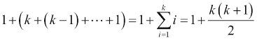

这种计算的量级在 *k²* 的范围内，对于 *k* 的较小值来说，这已经比 *2^k* 小得多。在前向选择过程结束时，我们必须在 *k+1* 个模型之间进行选择，这些模型对应于过程每一步结束时获得的子集。由于过程的最后部分涉及比较具有不同数量特征的模型，我们通常使用 AIC 或调整后的 R² 等标准来做出最终模型选择。我们可以通过运行以下命令来演示我们的 CPU 数据集的过程：

```py
> machine_model3 <- step(machine_model_null, scope = list(lower = machine_model_null, upper = machine_model1), direction = "forward")
```

`step()` 函数实现了前向选择的过程。我们首先向它提供通过在我们的训练数据上拟合没有特征的线性模型得到的空模型。对于 `scope` 参数，我们指定我们希望我们的算法从空模型逐步过渡到包含所有六个特征的完整模型。在 R 中发出这些命令的效果是输出一个演示迭代每一步中指定的特征子集的输出。为了节省空间，我们将结果以及每个模型的 AIC 值以以下表格的形式呈现。请注意，AIC 值越低，模型越好。

| 步骤 | 子集特征 | AIC 值 |
| --- | --- | --- |
| 0 | `{}` | 1839.13 |
| 1 | `{MMAX}` | 1583.38 |
| 2 | `{MMAX, CACH}` | 1547.21 |
| 3 | `{MMAX, CACH, MMIN}` | 1522.06 |
| 4 | `{MMAX, CACH, MMIN, CHMAX}` | 1484.14 |
| 5 | `{MMAX, CACH, MMIN, CHMAX, MYCT}` | 1478.36 |

`step()` 函数使用了一种替代的前向选择规范，即在没有任何剩余特征可以添加到当前特征子集并且会提高我们的分数时终止。对于我们的数据集，最终模型中只遗漏了一个特征，因为添加它并没有提高整体分数。有趣且多少有些令人放心的是，这个特征是 CHMIN，它是唯一一个相对高 p 值的变量，这表明在其他特征存在的情况下，我们并不确定我们的输出变量与这个特征相关。

有些人可能会想知道我们是否可以通过从完整模型开始，逐个删除特征，根据哪个特征被删除时会使模型分数提高最大来进行变量选择。这确实可能，这个过程被称为**向后选择**或**向后消除**。在 R 中，可以通过指定 `backward` 作为方向并从完整模型开始，使用 `step()` 函数来完成此操作。我们将在我们的汽车数据集上展示这一点，并将结果保存到一个新的汽车模型中：

```py
> cars_model_null <- lm(Price ~ 1, data = cars_train)
> cars_model3 <- step(cars_model2, scope = list( 
  lower=cars_model_null, upper=cars_model2), direction = "backward")
```

汽车数据集上最终线性回归模型的公式是：

```py
Call:
lm(formula = Price ~ Mileage + Cylinder + Doors + Leather + Buick + Cadillac + Pontiac + Saab + convertible + hatchback + sedan,
    data = cars_train)
```

如我们所见，最终模型已经丢弃了 `Cruise`、`Sound` 和 `Chevy` 特征。查看我们之前的模型摘要，我们可以看到这三个特征具有高 p 值。前两种方法是**贪婪算法**的例子。这意味着一旦关于是否包含变量的选择被做出，它就变得最终且不能在以后撤销。为了解决这个问题，一种称为**混合选择**或**双向消除**的变量选择方法开始时是前向选择，使用前向步骤添加变量，但在这些步骤可以提高 AIC 时也包括向后步骤。可预测的是，当 `direction` 被指定为 `both` 时，`step()` 函数会这样做。

现在我们有了两个新的模型，我们可以看到它们在测试集上的表现：

```py
> machine_model3_predictions <- predict(machine_model3, machine_test)
> compute_mse(machine_model3_predictions, machine_test$PRP)
[1] 2805.762
> 
> cars_model3_predictions <- predict(cars_model3, cars_test)
> compute_mse(cars_model3_predictions, cars_test$Price)
[1] 7262383
```

对于 CPU 模型，我们在测试集上的表现略好于我们的原始模型。一个合适的下一步可能是调查这个特征集是否与移除我们的异常值结合使用效果更好；这留给读者作为练习。相比之下，对于汽车模型，我们看到由于移除了所有这些特征，测试 MSE 略有增加。

# 正则化

变量选择是一个重要的过程，因为它试图通过消除与输出无关的变量，使模型更容易解释、更容易训练，并且没有虚假关联。这是处理过拟合问题的一种可能方法。一般来说，我们不期望模型完全拟合我们的训练数据；事实上，过拟合的问题通常意味着如果我们对训练数据拟合得太好，可能会损害我们的预测模型在未见数据上的准确性。在本节关于**正则化**的内容中，我们将研究一种减少变量数量的替代方法，以处理过拟合问题。正则化本质上是在我们的训练过程中引入一个有意的偏差或约束，以防止我们的系数取大值。由于这是一个试图缩小系数的过程，因此我们将会探讨的方法也被称为**收缩方法**。

## 岭回归

当参数数量非常大，尤其是与可用观测值的数量相比时，线性回归往往会表现出非常高的方差。这意味着观测值中的一些微小变化会导致系数发生显著变化。**岭回归**是一种通过其约束引入偏差的方法，但能有效减少模型的方差。岭回归试图最小化残差平方和的总和，并使用一个涉及系数平方和乘以一个常数的项，我们将使用希腊字母*λ*来表示这个常数。对于一个有*k*个参数的模型（不包括常数项*β[0]*），以及一个有*n*个观测值的数据库，岭回归最小化以下量：

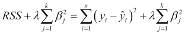

我们仍在最小化均方误差（RSS），但第二项是惩罚项，当任何系数较高时，该惩罚项会增大。因此，在最小化过程中，我们实际上是在将系数推向更小的值。*λ*参数被称为**元参数**，我们需要选择或调整它。*λ*的值非常大时，会掩盖 RSS 项，并将系数推向零。*λ*的值过小则对防止过拟合的效果不佳，而*λ*参数为 0 则仅执行普通线性回归。

在进行岭回归时，我们通常希望通过将所有特征值除以它们的方差来进行缩放。这与普通线性回归不同，因为如果某个特征值乘以 10 倍，那么系数将简单地乘以十分之一来补偿。在岭回归中，一个特征的缩放会通过惩罚项影响其他所有特征的计算。

## 最小绝对收缩和选择算子（lasso）

**lasso**是岭回归的一种替代正则化方法。差异仅出现在惩罚项上，该惩罚项涉及最小化系数绝对值的总和。

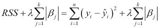

结果表明，惩罚项的差异非常显著，因为 lasso 结合了收缩和选择，它将一些系数收缩到正好为零，而岭回归则不是这样。尽管如此，这两种方法之间并没有明确的胜者。依赖于输入特征子集的模型倾向于使用 lasso 表现更好；具有许多不同变量系数分布广泛的模型倾向于使用岭回归表现更好。通常尝试这两种方法都是值得的。

### 注意

岭回归中的惩罚通常被称为 *l[2]* 惩罚，而 lasso 中的惩罚项则被称为 *l[1]* 惩罚。这源于向量 **范数** 的数学概念。向量的范数是一个函数，它将一个正数分配给该向量以表示其长度或大小。有许多不同类型的范数。*l[1]* 和 *l[2]* 范数是称为 **p-范数** 的范数族中的例子，对于具有 *n* 个分量的向量 *v*，它们具有以下一般形式：

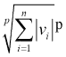

## 在 R 中实现正则化

有许多不同的函数和包实现了岭回归，例如来自 `MASS` 包的 `lm.ridge()` 和来自 `genridge` 包的 `ridge()`。对于 lasso，也有 `lars` 包。在本章中，我们将使用来自 `glmnet` 包的 `glmnet()` 函数，因为它具有一致且友好的界面。使用正则化的关键是确定一个合适的 *λ* 值。`glmnet()` 函数使用的方法是使用不同 *λ* 值的网格，并为每个值训练一个回归模型。然后，可以选择手动选择一个值或使用一种技术来估计最佳的 lambda。我们可以通过 `lambda` 参数指定要尝试的 *λ* 值序列；否则，将使用默认的包含 100 个值的序列。`glmnet()` 函数的第一个参数必须是一个特征矩阵，我们可以使用 `model.matrix()` 函数构建它。

第二个参数是一个包含输出变量的向量。最后，`alpha` 参数是在岭回归（0）和 lasso（1）之间的开关。我们现在已经准备好在 cars 数据集上训练一些模型：

```py
> library(glmnet)
> cars_train_mat <- model.matrix(Price ~ .-Saturn, cars_train)[,-1]
> lambdas <- 10 ^ seq(8, -4, length = 250)
> cars_models_ridge <- 
  glmnet(cars_train_mat, cars_train$Price, alpha = 0, lambda = lambdas)
> cars_models_lasso <- 
  glmnet(cars_train_mat, cars_train$Price, alpha = 1, lambda = lambdas)
```

由于我们提供了一系列 250 个 *λ* 值，我们实际上训练了 250 个岭回归模型和另外 250 个 lasso 模型。我们可以从 `glmnet()` 函数生成的对象的 `lambda` 属性中看到 *λ* 的值，然后应用 `coef()` 函数来检索第 100 个模型的相应系数，如下所示：

```py
> cars_models_ridge$lambda[100]
[1] 1694.009
> coef(cars_models_ridge)[,100]
  (Intercept)       Mileage      Cylinder         Doors 
 6217.5498831    -0.1574441  2757.9937160   371.2268405 
       Cruise         Sound       Leather         Buick 
 1694.6023651   100.2323812  1326.7744321  -358.8397493 
     Cadillac         Chevy       Pontiac          Saab 
11160.4861489 -2370.3268837 -2256.7482905  8416.9209564 
  convertible     hatchback         sedan 
10576.9050477 -3263.4869674 -2058.0627013
```

我们可以使用 `plot()` 函数来获得一个图表，显示系数的值如何随着 *λ* 的对数变化而变化。

如下所示，同时展示岭回归和 lasso 的对应图表非常有帮助：

```py
> layout(matrix(c(1, 2), 1, 2))
> plot(cars_models_ridge, xvar = "lambda", main = "Ridge 
  Regression\n")
> plot(cars_models_lasso, xvar = "lambda", main = "Lasso\n")
```

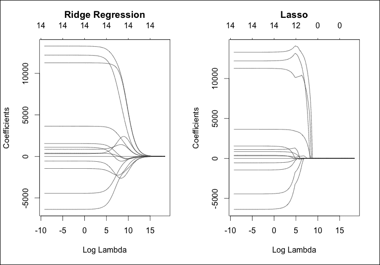

这两个图的关键区别在于，lasso 强制许多系数恰好降到零，而岭回归中它们倾向于平滑下降，只有在λ的极端值时才整体变为零。这一点通过阅读两个图顶部水平轴上的数值可以进一步证实，这些数值显示了随着λ的变化非零系数的数量。这样，lasso 在特征选择（因为零系数的特征实际上不包括在模型中）以及提供正则化以最小化过拟合问题方面具有显著优势。我们可以通过更改`xvar`参数提供的值来获得其他有用的图。值`norm`在 x 轴上绘制系数的 l[1]范数，而`dev`绘制解释的偏差百分比。我们将在下一章学习偏差。

为了解决寻找合适的*λ*值的问题，`glmnet()`包提供了`cv.glmnet()`函数。这个函数使用一种称为交叉验证的技术（我们将在第五章中学习），*支持向量机*）在训练数据上找到合适的*λ*值，以最小化均方误差（MSE）：

```py
> ridge.cv <- cv.glmnet(cars_train_mat, cars_train$Price, alpha = 0)
> lambda_ridge <- ridge.cv$lambda.min
> lambda_ridge
[1] 641.6408

> lasso.cv <- cv.glmnet(cars_train_mat, cars_train$Price, alpha = 1)
> lambda_lasso <- lasso.cv$lambda.min
> lambda_lasso
[1] 10.45715
```

如果我们绘制`cv.glmnet()`函数产生的结果，我们可以看到均方误差如何随λ的不同值而变化：

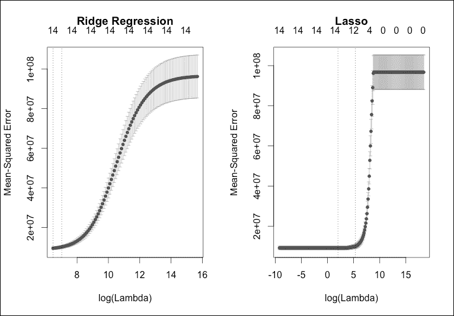

每个点上方和下方的条形是误差条，表示每个绘制的λ值估计的 MSE 上方和下方的一个标准差。这些图还显示了两条垂直虚线。第一条垂直线对应于`lambda.min`的值，这是交叉验证提出的最佳值。第二条垂直线在右侧的值是`lambda.1se`属性中的值。这对应于比`lambda.min`大一个标准误差的值，并产生一个更正则化的模型。

使用`glmnet`包，`predict()`函数现在可以在各种上下文中运行。例如，我们可以获取一个不在我们原始列表中的λ值的模型系数。

例如，我们有以下内容：

```py
> predict(cars_models_lasso, type = "coefficients", s = lambda_lasso)
15 x 1 sparse Matrix of class "dgCMatrix"
                        1
(Intercept)  -521.3516739
Mileage        -0.1861493
Cylinder     3619.3006985
Doors        1400.7484461
Cruise        310.9153455
Sound         340.7585158
Leather       830.7770461
Buick        1139.9522370
Cadillac    13377.3244020
Chevy        -501.7213442
Pontiac     -1327.8094954
Saab        12306.0915679
convertible 11160.6987522
hatchback   -6072.0031626
sedan       -4179.9112364
```

注意，在这种情况下，lasso 似乎没有强制任何系数为零，这表明根据 MSE，它不建议从 cars 数据集中删除任何系数。最后，再次使用`predict()`函数，我们可以使用`newx`参数提供特征矩阵来对观察值进行预测，从而使用正则化模型进行预测：

```py
> cars_test_mat <- model.matrix(Price ~ . -Saturn, cars_test)[,-1]
> cars_ridge_predictions <- predict(cars_models_ridge, s = 
                            lambda_ridge, newx = cars_test_mat)
> compute_mse(cars_ridge_predictions, cars_test$Price)
[1] 7609538
> cars_lasso_predictions <- predict(cars_models_lasso, s = 
                            lambda_lasso, newx = cars_test_mat)
> compute_mse(cars_lasso_predictions, cars_test$Price)
[1] 7173997
```

Lasso 模型表现最佳，并且与岭回归不同，在这种情况下，在测试数据上也略微优于常规模型。

# 多项式回归

多项式回归是一种*类型的*线性回归。

当预测变量和响应变量都是连续的并且线性相关时，这就是线性回归，响应变量会以恒定的比率相对于预测变量增加或减少（即，呈直线），而在多项式回归中，会依次添加预测变量的*不同幂次*，以查看它们是否能显著调整响应。随着这些增加被添加到方程中，数据点的线条将改变其形状，将线性回归模型从最佳拟合线转变为最佳拟合曲线。

那么，为什么你应该费心去考虑多项式回归呢？普遍接受的答案或思维过程是：当线性模型似乎不是你数据的最佳模型时。

有三个主要条件表明线性关系可能不是一个好的模型：

+   在你的数据中，将会有一些变量关系，你*假设*它们是曲线关系。

+   在检查你的变量时，你*建立*（使用散点图是最常见的方法）一个曲线关系。

+   在你实际上创建了线性回归模型之后，通过残差（使用散点图）的检查显示，中间有许多正残差值，但在两端（或反之）有负残差值的块状区域。

### 注意

注意：在曲线关系中，值会一起增加到一定水平（如正相关关系），然后，随着一个值的增加，另一个值减少（负相关关系）或反之。

因此，在这里，我们考虑一个类似于刚才提到的涉及用户汽车的一个例子。在我们的车辆数据中，我们有许多属性的信息，包括每辆车的选项数量。假设我们感兴趣的是汽车拥有的选项数量（如空调或加热座椅）与二手价格之间的关系。

人们可能会认为，一辆车拥有的选项越多，其售价就越高。

然而，在更仔细地分析这些数据后，我们发现情况并非如此：

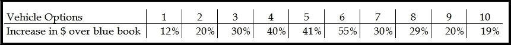

如果我们绘制数据，我们可以看到可能是一个受益于多项式回归的情景的教科书示例：

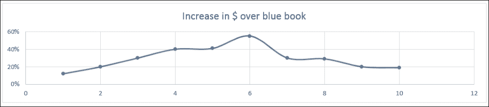

在这个假设场景中，自变量*x*（二手价格相对于蓝皮书价值的百分比增加）和因变量*y*（车辆拥有的选项数量）之间的关系可以用*x*的*n*次幂多项式来建模。

# 摘要

在本章中，我们研究了线性回归，这是一种允许我们在有多个输入特征和单个数值输出的监督学习环境中拟合线性模型的方法。简单线性回归是指我们只有一个输入特征的情况，而多重线性回归描述的是我们拥有多个输入特征的情况。线性回归是非常常用的回归问题解决方案的第一步。它假设输出是输入特征的线性加权组合，存在一个不可减少的误差成分，该误差成分服从正态分布，均值为零，方差恒定。该模型还假设特征是独立的。线性回归的性能可以通过多种不同的指标来评估，从更标准的均方误差（MSE）到其他指标，如 R²统计量。我们探讨了几个模型诊断和显著性测试，旨在检测违反假设的问题和异常值。最后，我们还讨论了如何使用逐步回归进行特征选择，以及如何使用岭回归和 Lasso 进行正则化。

线性回归是一个具有多个优点的模型，包括快速且成本低廉的参数计算，以及由于其简单形式，非常容易解释和从中得出推论。有大量的测试可用于诊断模型拟合问题，并执行假设检验以检查系数的显著性。总的来说，作为一种方法，它被认为是低方差，因为它对数据中的小误差具有鲁棒性。然而，从负面来看，因为它做出了非常严格的假设，特别是输出函数在模型参数中必须是线性的，这引入了很高的偏差，对于复杂或高度非线性的通用函数，这种方法往往表现不佳。此外，我们看到了当我们转向大量输入特征时，我们实际上不能真正依赖于系数的显著性测试。这一事实，加上特征之间的独立性假设，使得线性回归在处理高维特征空间时成为一个相对较差的选择。

我们还提到了多项式回归作为线性回归不足以拟合数据时的一个选项，这基于你的数据点值之间的关系，或者当线性回归模型的残差显示出某些正负关系时。

在下一章中，我们将研究逻辑回归，这是在分类问题中使用的 重要方法。
