# 第八章。维度缩减

构建一个有用的预测模型需要分析适当数量的观察（或案例）。这个数字将根据你的项目或目标而变化。严格来说，分析的*变化*（不一定是更多的*数据*）越多，模型的结果或结果就越好。

本章将讨论通过各种常见方法（如*相关性分析*、*主成分分析*、*独立成分分析*、*共同因素分析*和*非负矩阵分解*）在不影响分析结果（或项目的成功）的情况下，缩减观察数据的大小或数量的概念。

让我们先从澄清“维度缩减”的含义开始。

# 定义 DR

人们普遍认为，难以理解或可视化超过三个维度的数据。

**维度**（-**性**）**缩减**是指尝试减少在统计考虑下的随机变量（或数据维度）的数量，或者也许更好地说：找到对感兴趣的特性集的低维表示。

这使得数据科学家可以：

+   避免所谓的维度灾难

    ### 注意

    维度灾难是指当尝试分析高维空间（通常具有数百或数千个维度）中的数据时出现的一种现象，而在低维设置或日常经验中并不存在。

+   减少正确分析数据所需的时间和内存量

+   使数据更容易可视化

+   消除与模型目的无关的特征

+   减少模型噪声

数据维度缩减的一个有用（尽管可能被过度使用）的概念示例是计算机生成的面孔或面孔或单个人类面孔的图像，实际上是由成千上万张单个人类面孔的图像组成的。如果我们考虑每个个体的面部特征，数据可能会变得难以处理；然而，如果我们将这些图像的维度缩减为几个主成分（眼睛、鼻子、嘴唇等），数据就会变得更容易管理。

以下各节概述了一些最常见的维度缩减方法和策略。

## 相关数据分析

人们通常认为术语**依赖性**和**关联性**具有相同的意义。这些术语用于描述两个（或更多）随机变量或双变量数据之间的关系。

### 注意

随机变量是一个变量量，其值取决于可能的结果；双变量数据是包含两个变量且可能或可能没有暴露关系的资料。

**相关数据**，或具有相关性的数据，描述了一种（通常是线性的）统计关系。相关性的一个流行例子是产品定价，例如当产品的受欢迎程度推动制造商的定价策略时。

识别相关性非常有用，因为它们可以是可被利用或用于在人群或数据文件中降低维度的**预测关系**。

常见的相关性和预测关系例子通常涉及天气，但另一个想法可以在[`www.nfl.com/`](http://www.nfl.com/)找到。如果你熟悉国家橄榄球联盟并访问过该网站，那么你就会知道每个 NFL 球队都销售带有球队标志的商品，而赢得胜利赛季的球队那年很可能有更高的产品销售额。

在这个例子中，存在一种**因果关系**，因为一支球队的胜利赛季**导致**其球迷购买更多球队商品。然而，通常来说，存在**相关性**并不足以推断出（甚至）存在**因果关系**（关于这一点，本章后面将有更多讨论）。

## 散点图

作为旁白，**散点图**常用于图形表示两个变量之间的关系，因此是可视化相关数据的绝佳选择。

使用 R 的`plot`函数，你可以轻松生成我们获胜队伍示例的相当不错的视觉效果，如下所示：

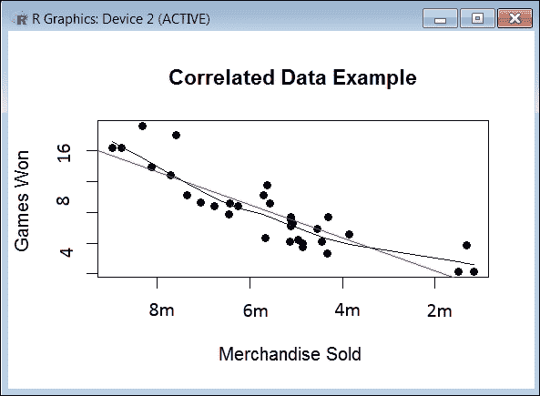

### 备注

作为其他可视化选项，箱线图和小提琴图也可以使用。

如前图所述，**相关性**描述或衡量两个或多个变量一起**波动**的水平或程度（在前面的例子中，**赢得的比赛**和**销售的纪念品**）。

这种测量可以归类为正相关性或负相关性，其中**正相关性**表明这些变量在平行增加或减少的程度，而**负相关性**表明一个变量增加时另一个变量减少的程度。

**相关系数**是衡量一个变量的值的变化将如何或可以预测另一个变量的值的变化程度的统计量。

当一个变量的变化可靠地预测另一个变量相似的变化时，人们往往会倾向于认为这意味着一个变量的变化导致另一个变量的变化。然而，**相关性**并不意味着**因果关系**。[例如，可能存在一个影响两个变量的未知因素]。

为了说明，想象一下一种数据相关性情况，其中电视广告暗示穿某一品牌鞋的运动员跑得更快。然而，这些运动员每个人都聘请了个人教练，这可能是影响因素。

因此，相关性（或进行相关性分析）是一种*统计技术*，可以显示变量对之间的相关程度以及是否存在相关性。当识别出强相关的变量时，从分析中移除其中一个变量在统计学上是有意义的；然而，当变量对看起来相关但关系较弱时，最好让两个变量都保留在总体中。

例如，赢得职业足球比赛的球队和球队商品的销售是相关的，因为赛季赢得比赛的球队通常销售更多的商品。然而，一些球队比其他球队有更忠实的追随者，即使他们输的比赢的多，商品销售仍然很高。尽管如此，赢得超过 50%比赛的球队的销售额平均要高于输掉 50%比赛的球队，赢得超过 75%比赛的球队销售额要超过输掉 75%比赛的球队，依此类推。那么，赢得比赛对球队商品销售的影响是什么？这可能很难确定，但确定数据点之间的相关性可以告诉你一个球队的业绩变化中有多少与他们的商品销售相关。

虽然赢得比赛和销售商品的相关性可能很明显，但我们的例子可能包含*未预料到的数据*相关性。你也可能怀疑存在其他相关性，但不确定哪一个是最强的。

对数据进行周密、彻底的相关性分析可以加深你对数据的理解；然而，就像所有统计技术一样，相关性只适用于某些类型的数据。**相关性适用于可量化数据**，其中数字是有意义的——通常是某种数量（如销售的产品）。它不能用于纯粹分类数据，如个人的性别、品牌偏好或教育水平。

让我们继续更详细地看看因果关系。

## 因果关系

理解因果关系及其与相关性的比较概念非常重要。

在统计学中，因果关系被定义为可以导致另一个变量或其内部发生变化的变量。这种效果的结果可以*总是*被预测，从而在变量之间建立一种可以确定的关系。

因果关系涉及相关性，但相关性并不一定意味着因果关系。每个与另一个变量有某种联系的变量可能看起来暗示了因果关系。这并不总是这样；将一件事与另一件事联系起来并不总是证明结果是由另一件事引起的。经验法则是：只有当你可以直接将一个变量的变化或变化与另一个变量的变化联系起来时，你才能说它是因果关系。

## 相关系数的程度

为了表示或量化变量之间的统计关系，我们使用一个称为*相关系数*的数字：

+   它的范围从-1.0 到+1.0

+   它越接近+1 或-1，两个变量之间的关系就越紧密

+   如果为零，这意味着它所代表的变量之间没有 *关系*

+   如果是正数，这意味着，当一个变量增加时，另一个变量也增加

+   如果是负数，这意味着，当一个变量增加时，另一个变量减少

## 报告相关性

虽然相关系数通常简单地报告（一个介于 -1 和 +1 之间的值），但它们通常首先被平方，以便更容易理解。

如果相关系数是 *r*，那么 *r* 的平方（你移除小数点）等于一个变量的变化与另一个变量的变化相关的百分比。据此，相关系数为 .5 意味着变化百分比为 25%。

在本章的早期部分，我们查看了一个简单的可视化，展示了赢得比赛数量与一支球队商品销售额之间的相关性。在实践中，当创建 *相关性报告* 时，你也可以展示第二个图表——统计显著性。添加显著性将显示所识别的相关信息中的错误概率。最后，由于样本大小可能会对结果产生重大影响，因此展示样本大小也是一个好的做法。

总结来说，识别观察数据中的相关性是一种常见且被接受的方法来实现降维。另一种方法是 *主成分分析*，我们将在下一节中介绍。

## 主成分分析

**主成分分析**（**PCA**）是另一种流行的统计技术，用于数据降维。

### 注意

PCA 也被称为 Karhunen-Loeve `变换` 方法，实际上，根据听众的不同，PCA 被说成是最常用的降维技术。

PCA 是一种试图不仅降低数据维度，而且尽可能保留数据中变化的技术。

### 注意

主成分分析是因子分析（将在本章后面讨论）的一种方法，它考虑了数据文件中的 *总方差*。

PCA 的过程使用所谓的 *正交变换* 过程将一组可能 *相关* 的变量的观察值转换为一组线性 *不相关* 的变量的值。这些变量被称为 **主成分**，或数据的变动的首要模式。

通过 PCA 的努力，主成分（或变量）的数量应该 **小于或等于** 原始变量的数量或原始观察的数量，从而 *降低数据的独立维度*（即降维）或独立维度的数量。

这些主成分被定义和排列，使得第一个主成分尽可能多地解释数据中的变异性，并且每个后续主成分都有可能的最大方差，前提是它必须与前一个成分正交。

执行**主成分分析**的一般概念或目标是观察，无论是对独立变量还是对因变量产生影响，都会得到相同的结果，无论是否单独对变量的影响进行建模。

PCA 通常用作在执行**探索性数据分析**或数据概览时的工具，因为其操作可以被认为是以最佳方式揭示数据内部结构，从而解释数据的方差，但它也可以在预测建模中有所帮助。

### 注意

**数据概览**涉及通过查询、实验和审查逻辑地了解数据。在概览过程之后，你可以使用你收集到的信息为数据添加上下文（以及/或应用新的视角）。向数据添加上下文需要操作数据，例如通过添加计算、聚合或额外的列，以及重新排序等。

主成分分析或 PCA 是常见**因子分析**（将在本章后面讨论）的另一种形式。因子分析通常包含更多关于被观察数据潜在结构的特定领域假设，并解算一个略微不同的矩阵的特征向量。

在一个非常高的层面上理解，可以将 PCA 想象为持续地为一个*n*-维椭球体拟合一个绘制的数据文件，其中椭球体的每个轴代表该数据的一个**主成分**。如果椭球体的某个轴很小，那么该轴上的方差也较小，通过从数据文件中省略该轴（及其对应的主成分），我们将只丢失关于数据文件的信息的一小部分；否则，该轴（主成分）将保留，代表数据文件整体均值的一些变异程度。

## 使用 R 理解 PCA

如前一段所述，如果对 PCA 的理解不需要太多的努力和逻辑，你可以使用通用的 R 函数`princomp`。

`princomp`函数通过使用数据文件主成分的计算标准差来揭示数据中的变异来源，从而简化复杂的数据文件。这最好通过经典的 iris 数据文件（在安装 R 编程语言时提供）来说明。

数据文件（部分显示在下述截图）包含超过 150 种`iris`的花朵属性（花瓣宽度、花瓣长度、萼片宽度和萼片长度）：

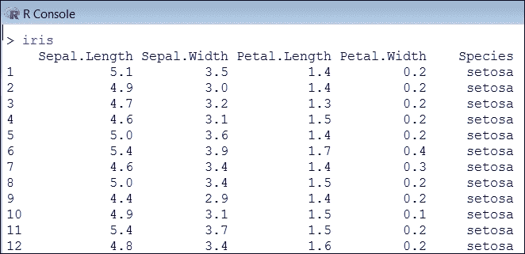

我们应该注意，`princomp`函数无法处理字符串数据（这没关系，因为我们的 PCA 分析只对识别主成分的数值变化感兴趣），因此我们可以通过以下 R 代码行将数据的前五行保存到名为`pca`的新对象中（省略`Species`列）：

```py
pca<-princomp(iris[-5])

```

接下来，我们可以使用我们刚刚创建的`pca`对象上的 R `summary`命令。生成的输出如下所示：

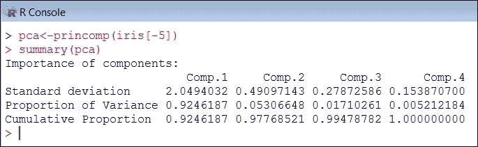

你可以从前面的图像中看到，数据集中的 92.4%的变化仅由**第一个成分**解释，而 97.8%由**前两个成分**解释！

为了更好地理解，我们可以使用 R 的`screeplot`函数和我们的`pca`对象来可视化前面的观察结果，如下所示：

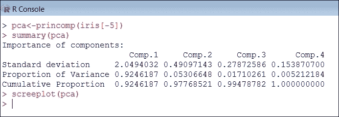

`screeplot`函数生成一个屏幕图，显示在主成分分析中，每个组件解释的数据文件中总变异的比例，显示了需要多少主成分来总结数据。

我们生成的可视化如下：

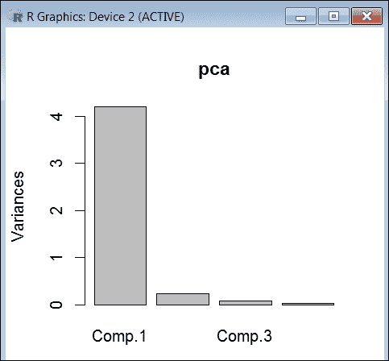

PCA 的结果通常根据每个组件的得分（有时称为*因子得分*）来考虑，这些得分是对应于数据文件中特定数据点的转换变量值，以及加载，即每个标准化原始变量应该乘以的权重，以获得组件得分。

我们可以使用 R 的`loadings`和`scores`命令来查看我们的加载和得分信息，如下所示：

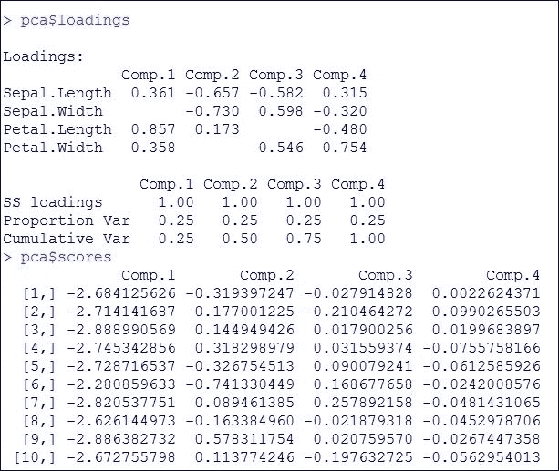

## 独立成分分析

另一个关于降维的概念是 ICA，或**独立成分分析**（**ICA**）。这是一个尝试在高度数据源中揭示或验证**统计独立**变量或维度的过程。

使用一个选定的 ICA 过程，可以识别数据中的每个变量或维度，检查其独立性，然后选择性地从整体数据分析中移除或保留。

### 注意

如果读者花时间对 ICA 进行任何额外的研究，他/她将遇到一个常见的应用示例，称为鸡尾酒会问题，即在嘈杂的房间里监听一个人的讲话。

## 定义独立性

ICA 试图通过最大化组件的**统计独立性**来寻找数据中的独立成分。但变量独立性的定义究竟是什么呢？

如果一个变量的实现不影响另一个变量的概率分布，则**确定**这些组件是独立的。

确定独立性的方法有很多，你的选择将决定使用的 ICA 算法的形式。

独立性的两种最广泛使用的定义（对于 ICA）是：

+   **最小化互信息**（**MMI**）：互信息衡量两个或多个组件共享的信息，衡量知道这些变量中的一个变量在多大程度上减少了关于其他变量的不确定性。组件包含的互信息越少，该组件就越独立。

+   **非高斯最大化**（**NGM**）：非高斯最大化旨在避免或减少平均值，换句话说，突出一个成分中的可变性（其独立性的水平）。

## ICA 预处理

在将任何 ICA 逻辑应用于数据之前，典型的 ICA 方法使用诸如*中心化*和*白化*等预处理步骤，以便简化并减少问题的复杂性，并突出数据中平均或协方差无法轻易解释的特征。

换句话说，在尝试确定成分独立性水平之前，可以使用各种预处理方法来审查和操作数据文件，使其更容易理解。

中心化是最常用的基本预处理方法，正如其名所示，涉及通过减去其均值来中心化数据点（或*x*），从而使其成为一个零均值变量。白化是另一种预处理方法，它将数据点（*x*）线性变换，使其成分不相关且等于单位一。

## 因子分析

**因子分析**是另一种重要的统计方法，用于确定和描述数据（或数据成分）在*观测*、相关变量与（可能）较少的*未观测*（或也称为*潜在*）变量或数据*因子*之间的可变性。

### 注意

*观测变量*是指那些你应该在数据文件中有明确测量的变量，而*未观测变量*是指那些你没有明确测量的变量，也许是从数据文件中的某些观测变量中推断出来的。

换句话说，我们考虑：六种观测变量的变化是否反映了仅两种未观测变量中发现的相同变化？

当数据文件包含大量似乎反映较少未观测变量的*观测变量*时，可以使用因子分析，这为我们提供了降维的机会，减少了需要研究的项目数量，并观察它们是如何相互关联的。

总体而言，因子分析涉及使用技术来帮助产生更少的变量线性组合，尽管变量数量减少了，但它们解释了数据成分中的大部分方差。

简而言之，对数据文件进行因子分析试图寻找先前未观测变量中的*协同变化*。

## 探索和确认

通常，人们会从探索数据文件开始进行因子分析，探索一组*数据观测变量*的可能潜在因子结构，而不强加一个预定的结果。这个过程被称为**探索性因子分析**（**EFA**）。

在探索性因子分析阶段，我们试图确定未观察或隐藏变量的数量，并提出一种使用更少的隐藏变量来解释数据中变异的方法；换句话说，我们正在压缩观察所需的信息。

一旦做出确定（形成一个或多个假设），接下来就会想要确认（或测试或验证）在 EFA 过程中揭示的因子结构。这一步骤通常被称为**验证性因子分析**（**CFA**）。

## 使用 R 进行因子分析

如同往常，R 编程语言提供了多种执行适当因子分析的方法。

例如，我们有 R 函数`factanal`。此函数对一个数值矩阵执行最大似然因子分析。在其最简单形式中，此函数需要*x*（你的数值矩阵对象）和要考虑的因子数量（或拟合）：

```py
factanal(x, factors = 3)
```

我们可以在这里运行一个简单的示例，以澄清基于 R 文档和许多通用函数。

首先，通过将随机数值列表组合成六个变量（保存为 R 向量 v1 到 v6）来构建一个*数值矩阵*。

如下所示，R 代码：

```py
> v1 <- c(1,1,1,1,1,1,1,1,1,1,3,3,3,3,3,4,5,6)
> v2 <- c(1,2,1,1,1,1,2,1,2,1,3,4,3,3,3,4,6,5)
> v3 <- c(3,3,3,3,3,1,1,1,1,1,1,1,1,1,1,5,4,6)
> v4 <- c(3,3,4,3,3,1,1,2,1,1,1,1,2,1,1,5,6,4)
> v5 <- c(1,1,1,1,1,3,3,3,3,3,1,1,1,1,1,6,4,5)
> v6 <- c(1,1,1,2,1,3,3,3,4,3,1,1,1,2,1,6,5,4)
```

下一步是从我们的六个变量创建一个数值矩阵，命名为`m1`。

要完成此操作，我们可以使用 R 的`cbind`函数：

```py
> m1 <- cbind(v1,v2,v3,v4,v5,v6)
```

以下截图显示了我们的代码执行情况，以及我们的对象`m1`的摘要：

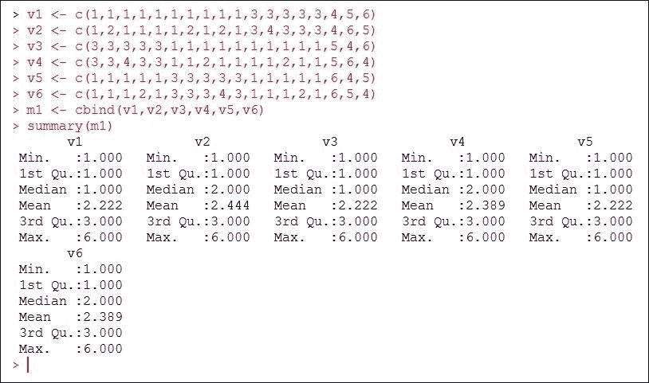

R 函数`summary`为我们提供了关于我们六个变量的有趣细节，例如最小值和最大值、中位数和平均值。

现在我们有一个数值矩阵，我们可以通过运行 R 的`cor`函数来*审查*我们六个变量之间的方差。

以下截图显示了由`cor`函数生成的输出：

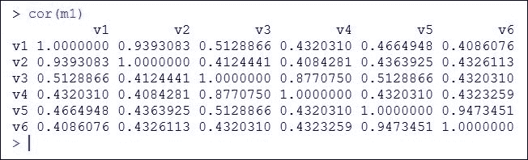

有趣的信息，但让我们继续前进。

最后，我们现在准备好使用（R 函数）`factanal`。

再次，使用函数的最简单形式——只需提供要分析的数据名称（`m1`）和要考虑的因子数量（让我们使用`3`）——以下输出就为我们生成了：

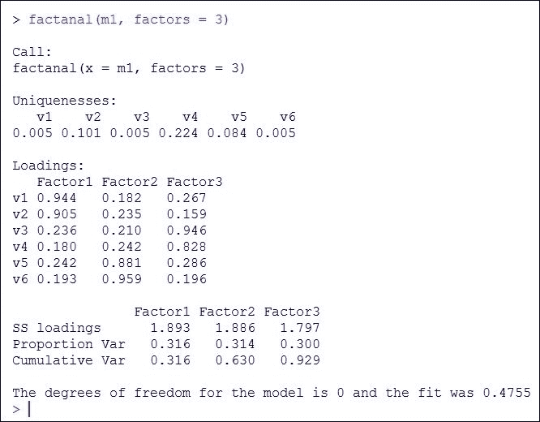

## 输出

R 函数`factanal`首先计算*独特性*。独特性是每个变量独有的方差，不与其他变量共享。

因子*载荷*也被计算并显示在*因子矩阵*中。因子矩阵是包含所有变量在所有提取的因子上的因子载荷的矩阵。因子载荷表示因子与变量之间的简单相关，例如观察分数与未观察分数之间的相关。一般来说，越高越好。

注意前一个截图生成的最终消息：

**模型的自由度为 0，拟合度为 0.4755**

自由度的数量可以定义为可以完全指定系统位置的独立坐标的最小数量（因此，零不是那么好）。所以，如果我们通过增加因素的数目到四个进行一点实验，我们会看到`factanal`足够聪明，能告诉我们，只有六个变量时，四个因素太多了。

以下截图显示了使用四个因素生成的（全局）输出：

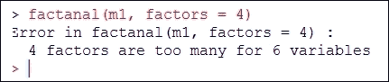

根据显示的结果，现在让我们尝试将因素的数目减少到两个：

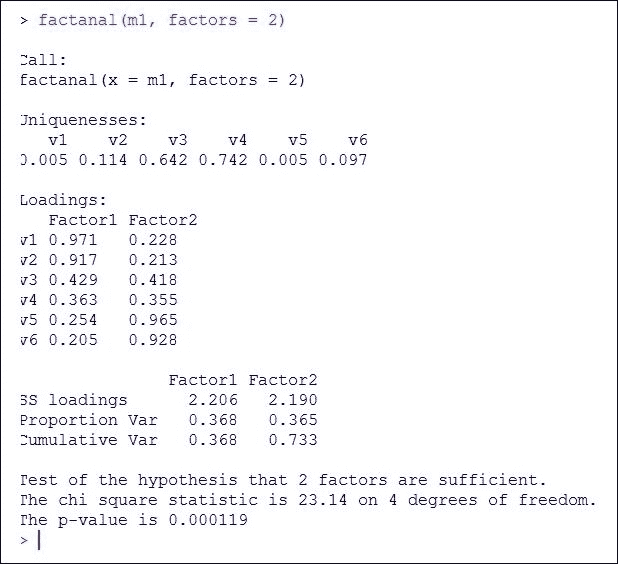

注意这次我们看到两个因素就足够了。

根据前面的内容，我们简单的因子分析结果似乎有所改善，但这是否意味着变量的数量可以正确地描述数据？

显然，需要更多的数据、更多的变量和更多的实验！

## NNMF

术语*分解*指的是分解的过程或行为，即把一个对象分解成其他对象（或*因子*）的结果，当它们相乘时等于原始对象。因此，*矩阵分解*就是分解矩阵，或者找到两个（或更多）矩阵，当它们相乘时等于原始矩阵。

**非负矩阵分解**（**NMF**，**NNMF**）是使用算法将矩阵分解成（通常是）两个矩阵，这三个矩阵都具有没有负元素的特性。这种非负性使得生成的矩阵更容易分析。

# 摘要

在本章中，我们介绍了（数据）*降维*的概念及其目的：在创建预测模型时减少需要考虑的总观测数。

对减少的最常见方法、策略和概念进行了回顾，包括相关数据分析、报告相关性、PCA、ICA 和因子分析。

在下一章中，我们思考几个训练好的模型如何作为一个集成体一起工作，以产生一个比单个模型更强大的单一模型。
