# 第十章。概率图模型

概率图模型，或简称为我们在本章中将要提到的图模型，是使用图的表示来描述一系列随机变量之间的条件独立性关系的模型。近年来，这一主题受到了越来越多的关注，概率图模型已经在从医学诊断到图像分割等任务中得到了成功的应用。在本章中，我们将介绍一些必要的背景知识，这将有助于理解最基本的图模型——朴素贝叶斯分类器。然后，我们将探讨一个稍微复杂一些的图模型，称为**隐马尔可夫模型**（**HMM**）。要进入这个领域，我们首先必须了解图以及它们为什么有用。

# 一点图论

图论是数学的一个分支，它处理称为**图**的数学对象。在这里，图没有我们更习惯于谈论的日常意义，即具有 *x* 和 *y* 轴的图表或图解。在图论中，一个图由两个集合组成。第一个是顶点集合，也被称为**节点**。我们通常使用整数来标记和列举顶点。第二个集合由这些顶点之间的**边**组成。

因此，图不过是一些点的描述以及它们之间的连接。这些连接可以有方向，使得边从**源**或**尾**顶点指向**目标**或**头**顶点。在这种情况下，我们有一个**有向图**。或者，边可以没有方向，这样图就是**无向图**。

描述图的一种常见方式是通过**邻接矩阵**。如果我们有一个图中的 *V* 个顶点，那么邻接矩阵是一个 *V×V* 矩阵，其条目如果行号表示的顶点与列号表示的顶点不相连，则为 0。如果存在连接，则条目为 1（然而，当你在使用加权图时，条目值不总是 1）。

在无向图中，每条边上的节点都相互连接，因此邻接矩阵是对称的。对于有向图，一个顶点 *v[i]* 通过边 (*v[i]*,*v[j]*) 与顶点 *v[j]* 相连；也就是说，其中 *v[i]* 是尾节点，*v[j]* 是头节点。以下是一个具有七个节点的图的邻接矩阵示例：

```py
> adjacency_m
  1 2 3 4 5 6 7
1 0 0 0 0 0 1 0
2 1 0 0 0 0 0 0
3 0 0 0 0 0 0 1
4 0 0 1 0 1 0 1
5 0 0 0 0 0 0 0
6 0 0 0 1 1 0 1
7 0 0 0 0 1 0 0
```

这个矩阵不是对称的，因此我们知道我们正在处理一个有向图。矩阵第一行中的第一个 `1` 值表示从顶点 1 出发并结束在顶点 6 的边。当节点数量较少时，很容易可视化一个图。我们只需画圆圈来表示顶点，并在它们之间画线来表示边。

对于有向图，我们在线段上使用箭头来表示边的方向。需要注意的是，我们可以在页面上以无限多种不同的方式绘制相同的图。这是因为图告诉我们关于节点在空间中的位置信息很少；我们只关心它们是如何相互连接的。以下是我们刚才看到的邻接矩阵描述的图的不同但同样有效的方式：

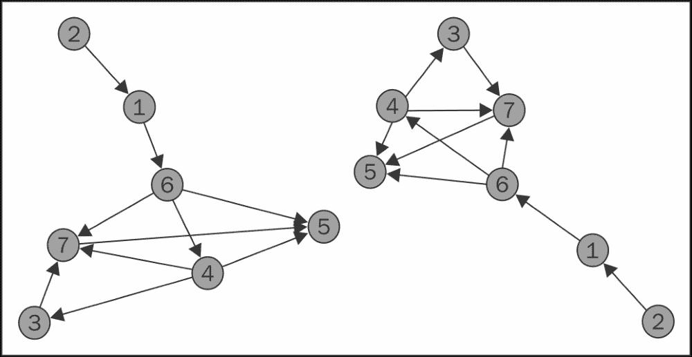

如果两个顶点之间存在边（在有向图的情况下，注意顺序），则称这两个顶点相互连接。如果我们可以从顶点 *v[i]* 通过移动到顶点 *v[j]*，从第一个顶点开始，在第二个顶点结束，沿着图中的边移动并通过任意数量的图顶点，那么这些中间边形成这两个顶点之间的**路径**。请注意，这个定义要求路径上的所有顶点和边彼此不同（可能只有第一个和最后一个顶点除外）。

例如，在我们的图中，顶点 6 可以通过通过顶点 1 的路径从顶点 2 到达。有时，图中可能会有许多这样的可能路径，而我们通常对最短路径感兴趣，即通过最少数量的中间顶点。我们可以在图中定义两个节点之间的距离为它们之间最短路径的长度。起点和终点相同的路径称为**环**。没有环的图称为**无环图**。如果一个无环图有有向边，则称为**有向无环图**，通常缩写为**DAG**。

### 小贴士

关于图论有许多优秀的参考资料。其中之一是可在网上找到的《图论》，作者为*Reinhard Diestel*，*Springer*出版社。这本里程碑式的参考书现在已出到*第 4 版*，可在[`diestel-graph-theory.com/`](http://diestel-graph-theory.com/)找到。

起初可能并不明显，但事实是，许多现实世界的情况可以方便地使用图来描述。例如，社交媒体网站上的友谊网络，如 Facebook，或 Twitter 上的关注者，都可以表示为图。在 Facebook 上，友谊关系是相互的，因此图是无向的。在 Twitter 上，关注者关系则不是，因此图是有向的。

另一个图是网络上的网站网络，其中从一个网页到下一个网页的链接形成有向边。运输网络、通信网络和电网都可以表示为图。对于预测模型师来说，结果是存在一类称为**概率图模型**或简称**图模型**的特殊模型，这些模型涉及图结构。

在图形模型中，节点代表随机变量，节点之间的边代表它们之间的依赖关系。在我们可以进一步详细说明之前，我们需要短暂地偏离一下，以便访问贝叶斯定理，这是统计学中的一个经典定理，尽管它很简单，但在统计推断和预测方面具有深远和实用的意义。

# 贝叶斯定理

假设我们感兴趣的两个事件是 *A* 和 *B*。在这种情况下，事件 *A* 可能代表患者患有阑尾炎，而事件 *B* 可能代表患者有高白细胞计数。事件 *A* 在事件 *B* 发生条件下的**条件概率**实际上是在我们知道事件 *B* 已经发生时事件 *A* 发生的概率。

形式上，我们定义事件 *A* 在事件 *B* 发生条件下的条件概率为两个事件同时发生的联合概率除以事件 *B* 发生的概率：

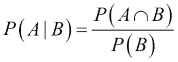

注意，这与我们定义的统计独立性是一致的。当两个事件同时发生的联合概率只是这两个事件各自概率的乘积时，就发生了统计独立性。如果我们用这个替换我们之前的方程，我们得到：

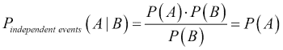

这从直观上是有意义的，因为如果我们知道两个事件是相互独立的，那么知道事件 *B* 已经发生并不会改变事件 *A* 发生的概率。现在，我们可以重新排列我们的条件概率方程，并注意我们可以交换事件 *A* 和 *B* 来得到另一种形式：

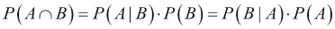

这最后一步使我们能够以最简单形式表述贝叶斯定理：

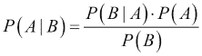

在前一个方程中，*P(A)* 被称为事件 *A* 的**先验概率**，因为它代表了在获得任何新信息之前事件 *A* 发生的概率。*P(A|B)*，即在事件 *B* 发生的情况下事件 *A* 的条件概率，通常也被称为 *A* 的**后验概率**。这是在接收到一些新信息后事件 *A* 发生的概率；在这种情况下，事件 *B* 已经发生的事实。

所有这些都可能看起来像是代数技巧，但如果我们回顾一下事件 *A* 代表患者患有阑尾炎，事件 *B* 代表患者有高白细胞计数的例子，贝叶斯定理的有用性将得到揭示。知道 *P(A|B)*，即在观察到患者有高白细胞计数（以及其他症状）的情况下患有阑尾炎的条件概率，对于医生来说是非常有用的知识。这将使他们能够利用可以观察到的（高白细胞计数）来对不易观察到的（阑尾炎）进行诊断。

不幸的是，这很难估计，因为高白细胞计数可能是一系列其他疾病或病理症状的表现。然而，逆概率 *P(B|A)*（即在患者已经患有阑尾炎的情况下，高白细胞计数的条件概率）则容易得多。只需要检查过去阑尾炎病例的记录并检查这些病例的血液检查结果。贝叶斯定理是预测建模的基本福音，因为它允许我们通过观察效果来估计原因。

# 条件独立性

从统计学我们知道，统计独立性的概念表明两个随机变量 *A* 和 *B* 的联合概率只是它们（边缘）概率的乘积。有时，两个变量可能一开始就不相互统计独立，但观察第三个变量 *C* 可能会导致它们相互独立。简而言之，我们说在 *C* 的条件下，事件 *A* 和 *B* 是**条件独立的**，我们可以用以下方式表示：

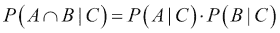

例如，假设 *J* 代表在特定公司获得工作机会的概率，而 *G* 代表在特定大学被录取的概率。这两个概率都可能依赖于一个变量 *U*，即一个人在本科学习中的表现。这可以用以下图表示：

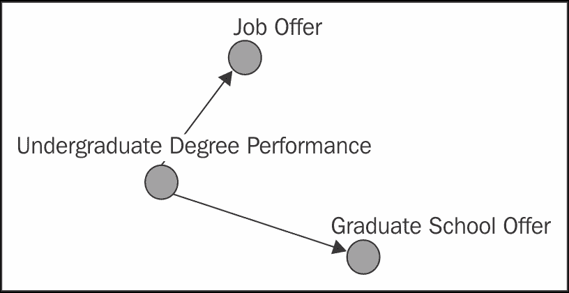

当我们不知道 *U*，即一个人的本科学习成绩时，知道他们被研究生院录取可能会增加我们对其获得工作机会的信心，反之亦然。这是因为我们倾向于相信他们在本科学习表现良好，这影响了那个人获得工作的机会。因此，这两个事件 *J* 和 *G* 并不相互独立。

然而，如果我们被告知一个人的本科学习成绩，我们可能会假设这个人获得工作机会的机会可能与进入研究生院的机会独立。这是因为可能影响这一点的其他因素，例如某一天这个人的工作面试或其他潜在候选人的工作质量，这些因素不受这个人申请研究生院的影响。

# 贝叶斯网络

**贝叶斯网络**是一种涉及有向无环图结构的图形模型。我们通常将图形模型中一条有向边的尾节点称为**父节点**，而头节点称为**子节点**或**后代节点**。实际上，我们推广了这种后一种概念，即如果模型中从节点 *A* 到节点 *B* 存在一条路径，那么节点 *B* 就是节点 *A* 的后代。我们可以通过说后者是**直接后代**来区分节点 *A* 与节点 *B* 直接相连的特殊情况。

在贝叶斯网络中，父节点关系和子节点关系是互斥的，因为它没有循环。贝叶斯网络具有一个显著特性，即给定其父节点，网络中的每个节点在条件上独立于网络中所有不是其子节点的其他节点。这有时被称为**局部马尔可夫性质**。这是一个重要的特性，因为它意味着我们可以通过简单地注意图中的边来轻松分解模型中所有随机变量的联合概率函数。

为了理解这是如何工作的，我们将从三个变量的概率乘法定律开始，该定律如下（以 *G*、*J* 和 *U* 作为示例变量）：

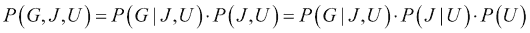

这是一条普遍适用的规则，在没有任何普遍性损失的情况下始终成立。让我们回到我们的学生申请人示例。这实际上是一个简单的贝叶斯网络，其中 *G* 和 *J* 以 *U* 为父节点。利用贝叶斯网络的局部马尔可夫性质，我们可以简化联合概率分布的方程如下：

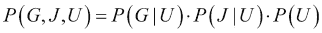

以这种方式分解概率分布的能力是有用的，因为它简化了我们需要的计算。它还可以使我们能够以更紧凑的形式表示整个分布。假设每个随机变量的分布是离散的，并取有限集合中的值，例如，随机变量 *G* 和 *J* 可以分别取两个离散值 {是，否}。为了在不分解的情况下存储联合概率分布，并考虑独立性关系，我们需要考虑每个随机变量的所有可能组合。

相比之下，如果分布分解为更简单分布的乘积，如我们之前所见，我们需要考虑的随机变量组合总数要少得多。对于具有多个随机变量且取许多值的网络，这种节省确实是实质性的。

除了计算和存储之外，另一个显著的好处是，当我们想要确定给定某些数据时随机变量的联合概率分布，由于已知的独立性关系，当我们能够分解它时，这样做会变得简单得多。我们将在下一节详细研究贝叶斯网络的一个重要示例时看到这一点。

为了总结本节，我们将注意贝叶斯网络的联合概率函数的分解，该网络由本章第一幅图中看到的图表示，并将其留作读者的练习以验证：

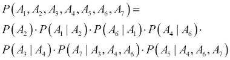

# 天真贝叶斯分类器

现在我们有了学习我们第一个也是最简单的图形模型——**朴素贝叶斯分类器**所必需的工具。这是一个包含单个父节点和一系列子节点的有向图形模型，这些子节点代表仅依赖于该节点的随机变量，它们之间没有依赖关系。以下是一个示例：

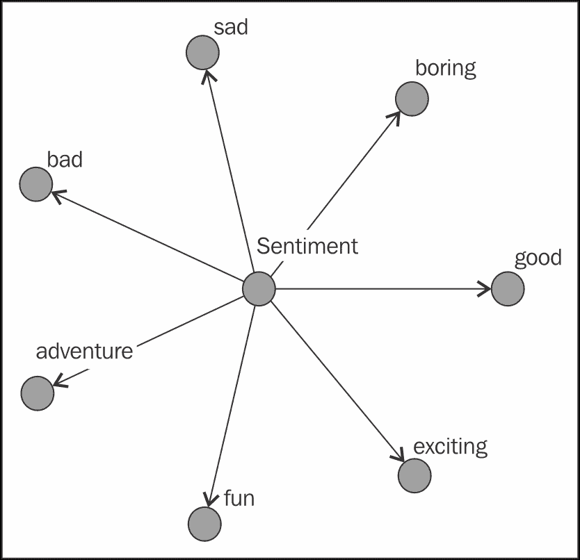

我们通常将单个父节点解释为因果节点，因此在我们特定的例子中，*Sentiment* 节点的值将影响 *sad* 节点、*fun* 节点等的值。由于这是一个贝叶斯网络，局部马尔可夫性质可以用来解释模型的核心假设。给定 *Sentiment* 节点，所有其他节点都是相互独立的。

在实践中，我们使用朴素贝叶斯分类器在一个可以观察和测量子节点并尝试估计父节点作为我们的输出的环境中。因此，子节点将成为我们模型的输入特征，而父节点将是输出变量。例如，子节点可能代表各种医疗症状，而父节点可能表示是否存在特定的疾病。

为了理解模型在实际中的工作方式，我们求助于贝叶斯定理，其中 *C* 是父节点，*F[i]* 是子节点或特征节点：

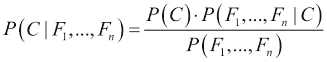

我们可以使用网络的条件独立性假设来简化这一点：

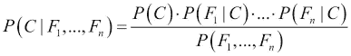

为了从这个概率模型中构建一个分类器，我们的目标是选择最大化后验概率 *P(Ci|F[1]* *…F[n]* *)* 的类 *C[i]*；即给定观察到的特征的这个类的后验概率。分母是观察特征的联合概率，它不受所选类的影响。因此，最大化后验类概率等同于最大化前一个方程的分子：

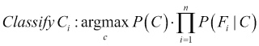

给定一些数据，我们可以估计特征 *F[i]* 的所有不同值的概率 *P(F[i]* *|C[j]* *)*，作为类 *C[j]* 中具有每个不同特征 *F[i]* 的观察值的相对比例。我们还可以估计 *P(C[j]* *)*，作为分配给类 *C[j]* 的观察值的相对比例。这些都是最大似然估计。在下一节中，我们将看到朴素贝叶斯分类器在真实示例中的工作方式。

## 预测电影评论的情感

在在线评论、论坛和社交媒体的世界中，一个已经并且继续受到越来越多关注的是**情感分析**的任务。简单来说，这个任务就是分析一段文本，以确定作者所表达的情感。一个典型的场景是收集在线评论、博客文章或推文，并构建一个模型来预测用户是否试图表达正面或负面的感受。有时，这个任务可以扩展以捕捉更广泛的情感，例如中性情感或情感程度，如轻微负面与非常负面。

在本节中，我们将限制自己只进行区分正面和负面情感这一更简单的任务。我们将通过使用与上一节中看到类似的贝叶斯网络来建模情感。情感是我们的目标输出变量，可以是正面或负面。我们的输入特征是所有二元特征，描述特定单词是否出现在电影评论中。关键思想是，表达负面情感的用户倾向于在他们评论中选择一组具有特征性的单词，这与用户在撰写正面评论时选择的特征性单词集不同。

通过使用朴素贝叶斯模型，我们的假设是，如果我们知道表达的情感，文本中每个词的存在将独立于所有其他词。当然，这是一个非常严格的假设，并且根本无法说明真实文本的写作过程。尽管如此，我们将展示即使在这些严格的假设下，我们也能构建一个表现合理的模型。

我们将使用*大型电影评论数据集*，该数据集首次在题为*学习用于情感分析的词向量*的论文中提出，该论文由*安德鲁·L·马斯*、*雷蒙德·E·戴利*、*彼得·T·范*、*丹·黄*、*安德鲁·Y·吴*和*克里斯托弗·波茨*撰写，发表于*第 49 届计算语言学协会年会*（*ACL 2011*）。数据托管在[`ai.stanford.edu/~amaas/data/sentiment/`](http://ai.stanford.edu/~amaas/data/sentiment/)，包含一个由 25,000 条电影评论组成的训练集和一个由另外 25,000 条电影评论组成的测试集。

为了展示模型的工作原理，我们希望将模型的训练时间保持得尽可能低。因此，我们将原始训练集划分为一个新的训练集和测试集，但强烈建议读者使用原始数据集的一部分更大的测试数据集重复此练习。下载后，数据组织在`train`文件夹和`test`文件夹中。`train`文件夹包含一个名为`pos`的文件夹，其中包含 12,500 条正面电影评论，每个评论都在一个单独的文本文件中，同样，还有一个名为`neg`的文件夹，包含 12,500 条负面电影评论。

我们的首要任务是将其所有信息加载到 R 中并进行一些必要的预处理。为此，我们将安装并使用`tm`包，这是一个专门用于执行文本挖掘操作的包。当处理文本数据时，这个包非常有用，我们将在下一章再次使用它。

当使用`tm`包工作时，首要任务是组织各种文本来源到一个**语料库**中。在语言学中，这通常指的是一系列文档的集合。在`tm`包中，它只是表示单个文本来源的字符串集合，以及一些描述这些信息的元数据，例如从哪些文件中检索到的文件名。

使用`tm`包，我们通过`Corpus()`函数构建语料库，我们必须提供要导入的各种文档的来源。我们可以创建一个字符串向量，并将其作为参数传递给`Corpus()`函数使用`VectorSource()`函数。相反，由于我们的数据源是一个目录中的文本文件序列，我们将使用`DirSource()`函数。首先，我们将创建两个字符串变量，它们将包含我们机器上上述`neg`和`pos`文件夹的绝对路径（这取决于数据集下载的位置）。

然后，我们可以使用`Corpus()`函数两次来创建两个语料库，分别用于正面和负面评论，然后合并成一个单一的语料库：

```py
> path_to_neg_folder <- "~/aclImdb/train/neg"
> path_to_pos_folder <- "~/aclImdb/train/pos"
> library("tm")
> nb_pos <- Corpus(DirSource(path_to_pos_folder), 
                   readerControl = list(language = "en"))
> nb_neg <- Corpus(DirSource(path_to_neg_folder), 
                  readerControl = list(language = "en"))
> nb_all <- c(nb_pos, nb_neg, recursive = T)
```

`Corpus()`函数的第二个参数`readerControl`是一个可选参数列表。我们使用它来指定我们的文本文件的语言是英语。在`c()`函数中用于合并两个语料库的`recursive`参数是必要的，以保持存储在语料库对象中的元数据信息。

注意，我们可以合并这两个语料库而不丢失情感标签。代表电影评论的每个文本文件都使用格式`<counter>_<score>.txt`命名，并且这些信息存储在由`Corpus()`函数创建的语料库对象的元数据部分中。我们可以使用`meta()`函数查看我们语料库中第一个评论的元数据：

```py
> meta(nb_all[[1]])
Metadata:
  author       : character(0)
  datetimestamp: 2015-04-19 09:17:48
  description  : character(0)
  heading      : character(0)
  id           : 0_9.txt
  language     : en
  origin       : character(0)
```

因此，`meta()`函数检索我们语料库中每个条目的元数据对象。该对象中的`ID`属性包含文件名。名称中的分数部分是一个介于 0 到 10 之间的数字，其中较大的数字表示正面评论，而较小的数字表示负面评论。在训练数据中，我们只有极性评论；也就是说，评论在 0-4 和 7-10 的范围内。因此，我们可以使用这些信息来创建一个文档名称向量：

```py
> ids <- sapply( 1 : length(nb_all),
                 function(x) meta(nb_all[[x]], "id"))
> head(ids)
[1] "0_9.txt"     "1_7.txt"     "10_9.txt"    "100_7.txt"
[5] "1000_8.txt"  "10000_8.txt"
```

从这个文档名称列表中，我们将使用`sub()`函数和适当的正则表达式提取分数组件。如果电影评论的分数小于或等于 5，则它是负面评论；如果分数更高，则是正面评论：

```py
> scores <- as.numeric(sapply(ids,
            function(x) sub("[0-9]+_([0-9]+)\\.txt", "\\1", x)))
> scores <- factor(ifelse(scores >= 5, "positive", "negative"))
> summary(scores)
negative positive
   12500    12500
```

### 小贴士

`sub()` 函数只是 R 语言中众多使用正则表达式的函数之一。对于不熟悉这个概念的人来说，正则表达式本质上是一种用于描述字符串的模式语言。在线教程很容易找到。关于正则表达式以及更广泛的文本处理，一个极好的资源是 *《语音与语言处理 第二版》*，作者为 *Jurafsky 和 Martin*。

我们模型的特征将是描述字典中特定单词存在或不存在情况的二进制特征。直观地，我们应该预期包含像 *boring*、*cliché* 和 *horrible* 这样的单词的电影评论很可能是负面评论。而包含像 *inspiring*、*enjoyable*、*moving* 和 *excellent* 这样的单词的电影评论很可能是好评。

当处理文本数据时，我们几乎总是需要执行一系列预处理步骤。例如，我们倾向于将所有单词转换为小写格式，因为我们不希望对于单词 *Excellent* 和 *excellent* 有两个不同的特征。我们还想从文本中移除任何可能作为特征不具信息量的内容。因此，我们倾向于移除标点符号、数字和**停用词**。停用词是一些在英语中非常常用且几乎会出现在所有电影评论中的词，如 *the*、*and*、*in* 和 *he*。最后，因为我们从句子中移除了单词并创建了重复的空格，所以我们将想要移除这些内容，以协助分词（将文本分割成单词的过程）。

`tm` 包有两个函数，`tm_map()` 和 `content_transformer()`，它们可以一起使用来将文本转换应用于语料库中每个条目的内容：

```py
> nb_all <- tm_map(nb_all, content_transformer(removeNumbers))
> nb_all <- tm_map(nb_all, content_transformer(removePunctuation))
> nb_all <- tm_map(nb_all, content_transformer(tolower))
> nb_all <- tm_map(nb_all, content_transformer(removeWords), 
                           stopwords("english"))
> nb_all <- tm_map(nb_all, content_transformer(stripWhitespace))
```

现在我们已经预处理了语料库，我们准备计算我们的特征。本质上，我们需要的是一个称为**文档-词矩阵**的数据结构。矩阵的行是文档。矩阵的列是我们字典中的单词。矩阵中的每个条目都是一个二进制值，其中 `1` 表示列号所代表的单词在行号所代表的评论中出现过。例如，如果第一列对应于单词 `action`，第四行对应于第四篇电影评论，并且矩阵在位置 (4,1) 的值是 `1`，这表示第四篇电影评论包含单词 `action`。

`tm` 包为我们提供了一个 `DocumentTermMatrix()` 函数，它接受一个语料库对象并构建一个文档-词矩阵。构建的特定矩阵具有数值条目，表示特定单词在特定文本中出现的总次数，因此我们将在之后将这些转换为二进制因子：

```py
> nb_dtm <- DocumentTermMatrix(nb_all)
> dim(nb_dtm)
[1]  25000 117473
```

在这种情况下，我们的文档词频矩阵有 117,473 列，这表明我们在语料库中找到了这么多不同的单词。这个矩阵非常稀疏，这意味着大多数条目都是 0。这是构建文本文档的词频矩阵时的一个非常典型场景，尤其是对于像电影评论这样短的文本文档。任何特定的电影评论只会突出词汇表中的一小部分单词。让我们检查我们的矩阵，看看它有多稀疏：

```py
> nb_dtm
<<DocumentTermMatrix (documents: 25000, terms: 117473)>>
Non-/sparse entries: 2493414/2934331586
Sparsity           : 100%
Maximal term length: 64
Weighting          : term frequency (tf)
```

从非稀疏到稀疏条目的比率来看，我们可以看到矩阵中的 2,936,825,000 个条目（25,000 × 117,473）中，只有 2,493,414 个是非零的。在此阶段，我们应该减少这个矩阵的列数有两个原因。一方面，因为我们的词汇表中的单词将成为我们模型中的特征，我们不希望构建一个使用 117,473 个特征的模型。这将花费很长时间来训练，同时，仅使用 25,000 个数据点，也不太可能提供令人满意的拟合。

我们想要减少列数的另一个重要原因是，许多单词在整个语料库中只出现一次或两次，它们对用户情感的了解程度与在几乎所有文档中出现的单词一样。鉴于这一点，我们有一种自然的方法可以减少文档词频矩阵的维度，即通过删除最稀疏的列（即从特征集中删除某些单词）。我们可以使用`removeSparseTerms()`函数删除具有一定百分比稀疏元素的列。我们必须提供的第一个参数是文档词频矩阵，第二个是我们将允许的最大列稀疏度。选择稀疏度是一个棘手的问题，因为我们不希望丢弃太多的列，这些列将成为我们的特征。我们将通过进行 99%稀疏度的实验来继续进行，同时鼓励读者尝试不同的值，以观察这对特征数量和模型性能的影响。

我们矩阵中有 25,000 行，对应于我们语料库中文档的总数。如果我们允许最大 99%的稀疏度，我们实际上是在删除至少在 25,000 个文档中不出现至少 1%的单词；也就是说，至少在 250 个文档中：

```py
> nb_dtm <- removeSparseTerms(x = nb_dtm, sparse = 0.99)
> dim(nb_dtm)
[1] 25000  1603
```

我们现在已将列数显著减少至 1,603 列。这对于我们来说是一个更加合理的特征数量。接下来，我们使用`tm`库中的另一个函数`weightBin()`将所有条目转换为二进制：

```py
> nb_dtm <- weightBin(nb_dtm)
```

由于文档词频矩阵通常是一个非常稀疏的矩阵，R 使用紧凑的数据结构来存储信息。为了窥视这个矩阵并检查前几个术语，我们将在这个矩阵的一小部分上使用`inspect()`函数：

```py
> inspect(nb_dtm[10:16, 1:6])
<<DocumentTermMatrix (documents: 7, terms: 6)>>
Non-/sparse entries: 2/40
Sparsity           : 95%
Maximal term length: 10
Weighting          : binary (bin)
             Terms
Docs          ability able absolute absolutely absurd academy
  10004_8.txt       0    1        0          0      0       0
  10005_7.txt       0    0        0          0      0       0
  10006_7.txt       0    0        0          0      0       0
  10007_7.txt       0    0        0          0      0       0
  10008_7.txt       0    0        0          0      0       1
  10009_9.txt       0    0        0          0      0       0
  1001_8.txt        0    0        0          0      0       0
```

看起来单词`ability`在前六个文档中没有出现，而单词`able`出现在文档`10004_8.txt`中。我们现在既有特征也有输出向量。下一步是将我们的文档-词矩阵转换为数据框。这是训练朴素贝叶斯模型所需的功能所必需的。然后，在我们训练模型之前，我们将数据分为一个包含 80%文档的训练集和一个包含 20%文档的测试集，如下所示：

```py
> nb_df <- as.data.frame(as.matrix(nb_dtm))
> library(caret)
> set.seed(443452342)
> nb_sampling_vector <- createDataPartition(scores, p = 0.80, 
                                            list = FALSE)
> nb_df_train <- nb_df[nb_sampling_vector,]
> nb_df_test <- nb_df[-nb_sampling_vector,]
> scores_train = scores[nb_sampling_vector]
> scores_test = scores[-nb_sampling_vector]
```

要训练一个朴素贝叶斯模型，我们将使用我们在前面看到的`e1071`包中的`naiveBayes()`函数。我们将提供的第一个参数是我们的特征数据框，第二个参数是我们的输出标签向量：

```py
> library("e1071")
> nb_model <- naiveBayes(nb_dtm_train, scores_train)
```

我们可以使用`predict()`函数对我们的训练数据进行预测：

```py
> nb_train_predictions <- predict(nb_model, nb_df_train)
> mean(nb_train_predictions == scores_train)
[1] 0.83015
> table(actual = scores_train, predictions = nb_train_predictions)
          predictions
actual     negative positive
  negative     8442     1558
  positive     1839     8161
```

我们使用简单的朴素贝叶斯模型达到了超过 83%的训练准确率，诚然，对于一个具有独立性假设的简单模型来说，这已经很不错了，尽管我们知道这个假设对于我们的数据来说并不现实。让我们在测试数据上重复同样的操作：

```py
> nb_test_predictions <- predict(nb_model, nb_df_test)
> mean(nb_test_predictions == scores_test)
[1] 0.8224
> table(actual = scores_test, predictions = nb_test_predictions)
          predictions
actual     negative positive
  negative     2090      410
  positive      478     2022
```

超过 82%的测试准确率与我们在训练数据上看到的结果相当。这里有许多潜在的改进途径。首先，要注意到像*movie*和*movies*这样的单词被不同地对待，尽管它们是同一个单词的不同变形。在语言学中，**变形**是指将单词的基本形式或**词元**修改为与另一个词在诸如时态、格、性别和数量等属性上保持一致的过程。例如，在英语中，动词必须与主语一致。

`tm`包支持**词干提取**，这是一个去除单词变形部分的过程，以保留一个词干或根词。这并不总是与检索所谓的**形态词元**相同，这是我们查字典时查找的内容，但这是一个粗略的近似。`tm`包使用著名的**Porter 词干提取器**。

### 注意

*Martin Porter*，Porter 词干提取器的作者，维护了一个网站[`tartarus.org/martin/PorterStemmer/`](http://tartarus.org/martin/PorterStemmer/)，这是关于他著名算法的极好信息来源。

为了对我们的语料库应用词干提取，我们需要使用`tm_map()`向语料库添加一个最终的转换，然后重新计算我们的文档-词矩阵，因为现在列（即单词特征）现在是词干：

```py
> nb_all <- tm_map(nb_all, stemDocument, language = "english")
> nb_dtm <- DocumentTermMatrix(nb_all) 
> nb_dtm <- removeSparseTerms(x = nb_dtm, sparse = 0.99)
> nb_dtm <- weightBin(nb_dtm)
> nb_df_train <- nb_df[nb_sampling_vector,]
> nb_df_test <- nb_df[-nb_sampling_vector,]
> dim(nb_dtm)
[1] 25000  1553
```

注意，我们匹配 99%最大稀疏度标准的列更少了。我们可以使用这个新的文档-词矩阵来训练另一个朴素贝叶斯分类器，然后在测试集上测量准确率：

```py
> nb_model_stem <- naiveBayes(nb_df_train, scores_train)
> nb_test_predictions_stem <- predict(nb_model_stem, nb_df_test)
> mean(nb_test_predictions_stem == scores_test)
[1] 0.8
> table(actual = scores_test, predictions = 
                              nb_test_predictions_stem)
          predictions
actual     negative positive
  negative     2067      433
  positive      567     1933
```

结果，80%，略低于我们没有进行词干提取时观察到的结果，尽管我们使用的特征比以前少。词干提取并不总是保证是一个好主意，因为在某些问题中它可能会提高性能，而在其他问题中则可能没有区别，甚至可能变得更糟。然而，当处理文本数据时，这是一种常见的转换，值得尝试。

第二种可能的改进是在我们的朴素贝叶斯模型训练过程中使用**加性平滑**（也称为**拉普拉斯平滑**）。这实际上是一种正则化形式，它通过在训练过程中向所有特征和类组合的计数中添加一个固定数值来实现。使用我们的原始文档词频矩阵，我们可以通过指定`laplace`参数来计算具有加性平滑的朴素贝叶斯模型。然而，对于我们的特定数据集，我们没有观察到任何通过这种方式进行的改进。

我们可以尝试使用朴素贝叶斯模型的一些其他方法，并且我们将在这里提出这些方法供读者实验。首先，手动整理用于模型特征的字词列表通常是值得的。当我们研究我们的文档词频矩阵选择的术语时，我们可能会发现有些词在我们的训练数据中很常见，但我们不期望它们在一般情况下很常见，或者不能代表整体人群。此外，我们可能只想实验那些我们知道能暗示情感和情绪的字词。这可以通过指定在构建我们的文档词频矩阵时使用的特定术语字典来完成。以下是一个例子：

```py
> emotion_words <- c("good", "bad", "enjoyed", "hated", "like")
> nb_dtm <- DocumentTermMatrix(nb_all, list(dictionary = 
                                            emotion_words))
```

在互联网上可以相对容易地找到这样的列表示例。与朴素贝叶斯模型一起使用的另一个常见预处理步骤是去除特征之间的相关性。一种实现方式是执行 PCA，正如我们在第一章中看到的，*准备预测建模*。此外，这种方法还允许我们从具有更多术语的稍微稀疏的文档词频矩阵开始，因为我们知道我们将通过 PCA 减少整体特征数量。

尽管有潜在的模型改进，但了解朴素贝叶斯模型强加的限制，这些限制阻碍了我们训练一个高度准确的情感分析器的能力，这一点很重要。假设电影评论中的所有词都是相互独立的，一旦我们知道涉及的 sentiment，这是一个相当不切实际的假设。我们的模型完全忽略了句子结构和词序。例如，评论中的短语*not bad*可能表示积极的 sentiment，但由于我们孤立地看待单词，我们倾向于将单词*bad*与消极的 sentiment 联系起来。

否定在文本处理中通常是最难处理的问题之一。我们的模型也无法处理常见的语言模式，例如讽刺、反语、包含他人观点的引述段落以及其他此类语言手段。

下一个部分将介绍一个更强大的图形模型。

### 注意

**隐马尔可夫模型**

研究朴素贝叶斯分类器的一个好参考是*I. Rish*在 2001 年 IJCAI 关于*人工智能中的经验方法*研讨会上的论文*An empirical study of the Naïve Bayes classifier*。对于情感分析，我们推荐*Bing Liu*在 2011 年 AAAI 教程中的幻灯片（截至本文写作时）[`www.researchgate.net/profile/Irina_Rish/publication/228845263_An_Empirical_Study_of_the_Naive_Bayes_Classifier/links/00b7d52dc3ccd8d692000000/An-Empirical-Study-of-the-Naive-Bayes-Classifier.pdf`](https://www.researchgate.net/profile/Irina_Rish/publication/228845263_An_Empirical_Study_of_the_Naive_Bayes_Classifier/links/00b7d52dc3ccd8d692000000/An-Empirical-Study-of-the-Naive-Bayes-Classifier.pdf)。

**隐马尔可夫模型**，通常缩写为**HMM**，我们在这里将使用它，是一种具有重复结构的贝叶斯网络，通常用于建模和预测序列。在本节中，我们将看到该模型的两个应用：一个用于建模 DNA 基因序列，另一个用于建模构成英语文本的字母序列。HMM 的基本图示如下：

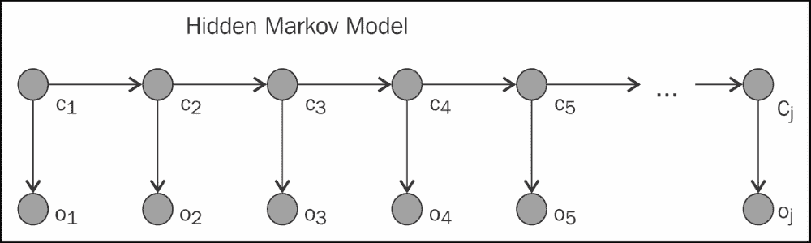

如图中所示，序列从左到右流动，并且对于我们要尝试建模的序列中的每个条目，我们都有一个节点对。标记为*Ci*的节点被称为**潜在状态**、**隐藏状态**或仅仅是**状态**，因为它们通常是不可观察的节点。标记为*Oi*的节点是**观察状态**或**观察结果**。我们将使用术语*状态*和*观察结果*。

现在，由于这是一个贝叶斯网络，我们可以立即识别一些关键属性。所有观察结果在给定它们对应的状态时是相互独立的。此外，每个状态在给定其前面的状态（在网络上是其父节点）的情况下，与序列历史中的任何其他状态都是独立的。因此，隐马尔可夫模型背后的关键思想是模型以线性方式从一个状态移动到下一个状态。

在每个潜在状态中，它产生一个观察结果，这也被称为**发射符号**。这些符号是序列中观察到的部分。隐马尔可夫模型在自然语言处理中非常常见，一个很好的例子是它们在**词性标注**中的应用。词性标注器的任务是读取一个句子，并返回该句子中单词对应的词性标签序列。例如，给定前面的句子，一个词性标注器可能会为单词“The”返回*限定词*，为单词“task”返回*单数名词*，等等。

要使用 HMM 来建模，我们将单词作为发射符号，将词性标签作为潜在状态，因为前者是可观察的，而后者是我们想要确定的。在自然语言处理中，有许多其他序列标注任务已经应用了隐马尔可夫模型，例如**命名实体识别**，其目标是识别句子中指代个人、地点、组织和其他实体的单词。

隐藏马尔可夫模型由五个核心组件组成。第一个是可能的潜在类别标签集合。对于词性标注器的例子，这可能是我们将使用的所有词性标签的列表。第二个组件是所有可能的发射符号集合。对于一个英语词性标注器，这是英语单词的字典。

接下来的三个组件涉及概率。**起始概率向量**是一个概率向量，它告诉我们开始于每个潜在状态的概率。例如，在词性标注中，我们可能会有一个很高的概率以一个像*the*这样的限定词开始。**转移概率矩阵**是一个矩阵，它告诉我们当当前状态是*C[i]*时，转移到状态*C[j]*的概率。因此，这包含了从限定词到名词的转移概率，以我们的词性标注为例。最后，**发射概率矩阵**告诉我们我们字典中每个符号在我们可以处于的每个状态下的概率。请注意，一些单词（如*bank*，它既是名词也是动词）可以标记为多个词性标签，因此将会有从多个状态发射的非零概率。

在词性标注等情况下，我们通常有一组标记序列，因此我们的数据包含观察序列及其相应的状态。在这种情况下，类似于朴素贝叶斯模型，我们使用相对频率计数来填充我们模型中的概率组件。

例如，为了找到一个合适的起始概率向量，我们可以列出我们数据集中每个序列的起始状态，并使用这个来获取每个状态的相对频率。当我们只有未标记的序列时，任务会显著更难，因为我们甚至可能不知道我们需要在我们的模型中包含多少个状态。一种在训练数据中将状态分配给未标记观察序列的方法被称为**Baum-Welch 算法**。

一旦我们知道了我们模型的参数，问题就变成了如何预测观察序列背后的最可能状态序列。给定一个未标记的英文句子，基于 HMM 的词性标注器必须预测词性标签的序列。用于此的最常用算法是基于称为**动态规划**的编程技术，被称为**维特比算法**。

我们在本书中讨论的用于隐马尔可夫模型的算法超出了本书的范围，但它们相当直观，值得深入研究。在了解模型的核心组件及其假设的基本理解之后，我们的下一个目标是看看我们如何将它们应用于一些现实世界的情况。我们将首先看到一个带有标记序列的例子，稍后，我们将看到一个带有未标记序列的例子。

### 小贴士

也许对隐马尔可夫模型最权威和最全面的介绍是 L. R. Rabiner 发表的题为*A Tutorial on Hidden Markov Models and Selected Applications in Speech Recognition*的开创性论文，发表于*IEEE Proceedings, 1989*。我们之前提到的*Jurafsky*和*Martin*教科书也是学习 HMM 的理想参考，包括 Baum-Welch 和 Viterbi 算法的细节，以及诸如词性标注和命名实体识别等应用。

## 预测启动子基因序列

我们将要详细研究的第一个应用来自生物学领域。在那里，我们了解到 DNA 分子的基本构建块实际上是四种被称为**核苷酸**的基本分子。这些被称为*胸腺嘧啶*、*胞嘧啶*、*腺嘌呤*和*鸟嘌呤*，DNA 链中这些分子出现的顺序编码了 DNA 携带的遗传信息。

分子生物学中的一个有趣问题是找到更大 DNA 链中的**启动子序列**。这些是起着重要作用的特殊核苷酸序列，它们在调节称为**基因转录**的遗传过程中扮演着重要角色。这是 DNA 中信息读取机制的第一步。

由 UCI 机器学习仓库托管在[`archive.ics.uci.edu/ml/datasets/Molecular+Biology+(Promoter+Gene+Sequences)`](https://archive.ics.uci.edu/ml/datasets/Molecular+Biology+(Promoter+Gene+Sequences))的*molecular biology (promoter gene sequences)*数据集，包含来自细菌*E. Coli*的 DNA 中的许多基因序列。

当前预测任务是构建一个模型，能够从非启动子基因序列中区分出启动子基因序列。我们将使用 HMM 来解决这个问题。具体来说，我们将为启动子构建一个 HMM，为非启动子构建一个 HMM，然后选择为我们提供测试序列最高概率的模型，以标记该序列：

```py
> promoters <- read.csv("promoters.data", header = F, dec = ",", 
               strip.white = TRUE, stringsAsFactors = FALSE)
> promoters[1,]
  V1  V2                                                        V3
1  + S10 tactagcaatacgcttgcgttcggtggttaagtatgtataatgcgcgggcttgtcgt
```

注意，使用`read.csv()`函数调用中的`strip.white = TRUE`参数设置来去除空白是很重要的，因为一些字段有前导制表符。数据框的第一列包含一个`+`或`-`来表示启动子或非启动子。第二列是特定序列的标识符，第三列是核苷酸序列本身。我们将首先使用第一列将数据分离为启动子序列的正负观察：

```py
> positive_observations <- subset(promoters, V1 == '+', 3)
> negative_observations <- subset(promoters, V1 == '-', 3)
```

为了训练我们的 HMM，我们想要将每个类别的所有观察结果连接成一个单个观察结果。然而，我们确实想要存储每个序列的开始和结束信息。因此，我们将每个序列前面加上字符`S`来表示序列的开始，并在每个序列后面加上字符`X`来表示序列的结束：

```py
> positive_observations <- sapply(positive_observations, 
                           function(x) paste("S", x, "X", sep=""))
> negative_observations <- sapply(negative_observations, 
                           function(x) paste("S", x, "X", sep=""))
> positive_observations[1]
[1] "StactagcaatacgcttgcgttcggtggttaagtatgtataatgcgcgggcttgtcgtX"
```

接下来，我们将使用`strsplit()`函数将每个观察结果从字符串分割成一个字符向量，该函数将用于分割的字符串作为第一个参数，以及用作分割点的字符（分隔符）。在这里，我们使用一个空字符进行分割，这样整个字符串就被分割成单个字符：

```py
> positive_observations <- strsplit(positive_observations, "")
> negative_observations <- strsplit(negative_observations, "")
> head(positive_observations[[1]], n = 15)
 [1] "S" "t" "a" "c" "t" "a" "g" "c" "a" "a" "t" "a" "c" "g" "c"
```

现在我们必须指定我们想要训练的 HMM 的概率矩阵。在这种情况下，状态与发出的符号有一一对应的关系，因此实际上这类问题可以简化为可见马尔可夫模型，在这种情况下它只是一个马尔可夫链。尽管如此，我们将遵循与具有多个符号分配给每个状态的情况相同的过程来将这个问题建模为 HMM。我们将假设正负 HMM 都涉及四个状态，对应于四种核苷酸。尽管这两个模型在每个状态都会发出相同的符号，但它们在从一个状态到下一个状态的转移概率上会有所不同。

除了我们之前提到的四个状态之外，我们在每个序列的末尾创建了一个特殊的终止状态，使用符号*X*表示。我们还创建了一个特殊的起始状态，我们称之为*S*，这样所有其他状态的起始概率都是 0。此外，发射概率很容易计算，因为每个状态只发出一个符号。由于状态与符号之间的一一对应关系，我们将使用相同的字母表来表示状态及其发出的符号：

```py
> states <- c("S", "X", "a", "c", "g", "t")
> symbols <- c("S", "X", "a", "c", "g", "t")
> startingProbabilities <- c(1,0,0,0,0,0)
> emissionProbabilities <- diag(6)
> colnames(emissionProbabilities) <- states
> rownames(emissionProbabilities) <- symbols
> emissionProbabilities
  S X a c g t
S 1 0 0 0 0 0
X 0 1 0 0 0 0
a 0 0 1 0 0 0
c 0 0 0 1 0 0
g 0 0 0 0 1 0
t 0 0 0 0 0 1
```

计算转移概率矩阵需要我们做更多的工作。因此，我们为这个定义了自己的函数：`calculateTransitionProbabilities()`。这个函数的输入是一个由训练序列连接而成的单个向量，以及一个包含状态名称的向量。

函数首先计算一个空的转换概率矩阵。通过遍历每个连续的状态对，它累计状态转换的计数。在遍历完所有数据后，我们通过将矩阵的每一行除以该行的元素总和来归一化转换概率矩阵。这样做是因为这个矩阵的行必须总和为 1。我们使用 `sweep()` 函数，它允许我们使用汇总统计量对矩阵的每个元素应用一个函数。以下是 `calculateTransitionProbabilities()`：

```py
calculateTransitionProbabilities <- function(data, states) {
  transitionProbabilities <- matrix(0, length(states), length(states))
  colnames(transitionProbabilities) <- states
  rownames(transitionProbabilities) <- states
  for (index in 1:(length(data) - 1)) {
    current_state <- data[index]
    next_state <- data[index + 1]
    transitionProbabilities[current_state, next_state] <- 
           transitionProbabilities[current_state, next_state] + 1
  }
  transitionProbabilities <- sweep(transitionProbabilities, 1, 
           rowSums(transitionProbabilities), FUN = "/")
  return(transitionProbabilities)
}
```

现在我们准备训练我们的模型。在这个数据集上，关键观察结果是观察值非常少，实际上每个类只有 53 个。这个数据集太小，无法留出一部分用于测试。相反，我们将实现留一法交叉验证来估计我们模型的准确性。为此，我们将从正观察值中省略一个观察值。这将为我们的负 HMM 计算转换概率矩阵留下所有负观察值：

```py
> negative_observation<-Reduce(function(x, y) c(x, y), 
                               negative_observations, c())
> (transitionProbabilitiesNeg <- 
   calculateTransitionProbabilities(negative_observation, states))
  S          X         a         c         g         t
S 0 0.00000000 0.2264151 0.2830189 0.1320755 0.3584906
X 1 0.00000000 0.0000000 0.0000000 0.0000000 0.0000000
a 0 0.02168022 0.2113821 0.2696477 0.2506775 0.2466125
c 0 0.01256983 0.2500000 0.1634078 0.2667598 0.3072626
g 0 0.01958225 0.3133159 0.2480418 0.1919060 0.2271540
t 0 0.01622971 0.1885144 0.2434457 0.2946317 0.2571785
```

当处于起始状态（`S`）时，我们可以随机移动到核苷酸状态，但移动到停止状态（`X`）或保持在起始状态的几率为零。当处于核苷酸状态时，我们可以随机转换到任何状态，但不能转换回起始状态。最后，从停止状态到起始状态的唯一有效转换是为了新的序列。

现在我们介绍 R 中的 `HMM` 包，它用于处理隐马尔可夫模型，正如其名所示。我们可以使用 `initHMM()` 函数使用一组特定的参数初始化一个 HMM。正如预期的那样，这需要五个输入，对应于我们之前讨论过的隐马尔可夫模型的五个组成部分：

```py
> library("HMM")
> negative_hmm <- initHMM(states, symbols, startProbs = 
  startingProbabilities, transProbs = transitionProbabilitiesNeg,
  emissionProbs = emissionProbabilities)
```

下一步是构建正 HMM，但我们需要多次进行此操作，每次测试时省略一个观察值。这个测试观察值随后将由我们之前训练的负 HMM 和没有该观察值训练的正 HMM 处理。如果正 HMM 对测试观察值的预测概率高于负 HMM，则我们的模型将正确分类测试观察值。以下代码块执行这些计算的循环，针对每个正观察值：

```py
> incorrect <- 0
> for (obs in 1 : length(positive_observations)) {
     positive_observation <- Reduce(function(x, y) c(x, y), 
                             positive_observations[-obs], c())
     transitionProbabilitiesPos  <- 
    calculateTransitionProbabilities(positive_observation, states)
     positive_hmm <- initHMM(states, symbols, 
                          startProbs = startingProbabilities, 
                          transProbs = transitionProbabilitiesPos, 
                          emissionProbs = emissionProbabilities)
     test_observation <- positive_observations[[obs]]
     final_index <- length(test_observation)
     pos_probs <- exp(forward(positive_hmm, test_observation))
     neg_probs <- exp(forward(negative_hmm, test_observation))
     pos_seq_prob <- sum(pos_probs[, final_index])
     neg_seq_prob <- sum(neg_probs[, final_index])
     if (pos_seq_prob < neg_seq_prob) incorrect <- incorrect + 1
 }
```

我们现在将逐步分析之前的代码块。首先，我们使用 `incorrect` 变量跟踪我们犯的任何错误。对于我们的正观察值列表中的每个观察值，我们将训练一个没有此观察值的正 HMM。然后，这个观察值成为我们的测试观察值。

要找到给定特定 HMM 的特定序列的概率，我们使用了`forward()`函数，该函数计算一个包含观察序列中每一步所有前向概率的对数矩阵。这个矩阵的最后一列，其数值索引就是序列的长度，包含了整个序列的前向概率。我们使用我们训练的正 HMM 来计算正序列概率，并使用`exp()`函数来撤销对数运算（尽管在这个情况下不是严格必要的，我们只需要比较）。我们使用负 HMM 重复这个过程来计算负序列概率。由于我们的测试观察是正观察之一，只有当负序列概率大于正序列概率时，我们才会误分类。在代码块执行完成后，我们可以看到我们犯了多少错误：

```py
> incorrect
[1] 13
```

这意味着在 53 个正观察中，我们误分类了 13 个，正确分类了 40 个。尽管如此，我们还没有完成，因为我们还需要对负观察执行类似的循环。这次，我们将使用所有正观察训练一个正 HMM：

```py
> positive_observation <- Reduce(function(x, y) c(x, y), 
                                 positive_observations, c())
> transitionProbabilitiesPos  <- 
  calculateTransitionProbabilities(positive_observation, states)
> positive_hmm = initHMM(states, symbols, startProbs = 
  startingProbabilities, transProbs = transitionProbabilitiesPos, 
  emissionProbs = emissionProbabilities)
```

接下来，我们将迭代所有负观察。我们将通过省略一个观察作为测试观察来训练一个负模型。然后，我们将使用我们刚刚训练的正 HMM 和没有这个观察的训练数据的负 HMM 来处理这个观察。

最后，我们将比较由两个 HMMs 产生的这个测试观察序列的预测概率，并根据哪个模型产生了更高的概率来对测试观察序列进行分类。本质上，我们正在做与我们之前迭代正观察时完全相同的过程。下面的代码块将继续更新我们的`incorrect`变量，并且应该是自解释的：

```py
> for (obs in 1:length(negative_observations)) {
     negative_observation<-Reduce(function(x, y) c(x, y), 
                           negative_observations[-obs], c())
     transitionProbabilitiesNeg <- 
    calculateTransitionProbabilities(negative_observation, states)
     negative_hmm <- initHMM(states, symbols, 
                         startProbs = startingProbabilities, 
                         transProbs = transitionProbabilitiesNeg, 
                         emissionProbs = emissionProbabilities)
     test_observation <- negative_observations[[obs]]
     final_index <- length(test_observation)
     pos_probs <- exp(forward(positive_hmm,test_observation))
     neg_probs <- exp(forward(negative_hmm,test_observation))
     pos_seq_prob <- sum(pos_probs[, final_index])
     neg_seq_prob <- sum(neg_probs[, final_index])
     if (pos_seq_prob > neg_seq_prob) incorrect <- incorrect+1
 }
```

交叉验证中的误分类总数存储在`incorrect`变量中：

```py
> incorrect
[1] 25
> (cross_validation_accuracy <- 1 - (incorrect/nrow(promoters)))
 [1] 0.7641509
```

我们的整体交叉验证准确率大约是 76%。鉴于我们正在使用留一法，并且训练数据的整体大小如此之小，我们预计这个估计将具有相对较高的方差。

在我们的 HMM 中，马尔可夫属性本质上假设只有前一个核苷酸决定了序列中下一个核苷酸的选择。我们可以合理地预期存在更长的范围依赖，因此，我们受到模型假设的限制。因此，存在一些模型，如**三元 HMM**，它们考虑了除了当前状态之外过去的状态。

在下一节中，我们将研究一个示例，其中我们使用未标记的数据来训练一个隐马尔可夫模型。我们将手动定义隐藏状态的数量，并使用 Baum-Welch 算法来训练一个 HMM，同时估计状态转换和发射。

## 预测英语单词中的字母模式

在本节中，我们将模拟构成英语单词的字母模式。除了有不同单词和有时有字母表外，语言之间的不同之处在于构成单词所使用的字母模式。英语单词具有独特的字母和字母序列分布，在本节中，我们将尝试通过使用隐马尔可夫模型以非常简单的方式来模拟单词形成的过程。

我们模型发出的符号将是字母本身，但这次，由于我们使用的是未标记的数据，我们不知道状态可能是什么。因此，我们将只提供我们希望模型拥有的状态数量，然后使用 Baum-Welch 算法来训练我们的 HMM 的参数。

对于这项任务，我们只需要一个英语文本语料库。在本章的早期，我们研究了使用朴素贝叶斯分类器的电影评论，因此我们将使用这些评论以方便起见，尽管也可以使用其他英语文本来源。我们将首先重新加载我们的电影评论，并使用`tm`包将它们全部转换为小写：

```py
> library("tm")
> nb_pos <- Corpus(DirSource(path_to_pos_folder), 
                   readerControl = list(language = "en"))
> nb_neg <- Corpus(DirSource(path_to_neg_folder), 
                  readerControl = list(language = "en"))
> nb_all <- c(nb_pos, nb_neg, recursive = T)
> nb_all <- tm_map(nb_all, content_transformer(tolower))
```

接下来，我们将从每个评论中读取文本，并将这些文本收集到一个单独的向量中：

```py
> texts <- sapply(1 : length(nb_all), function(x) nb_all[[x]])
```

为了简化我们的任务，除了单个字母外，我们还将考虑一个包含所有空白字符（空格、制表符等）的类别，并用大写字母`W`来表示这些字符。对于数字，我们将使用大写字符`N`，对于所有标点符号，我们将使用大写字符`P`，而对于任何剩下的东西，我们将使用大写字符`O`。我们使用正则表达式来完成这项任务：

```py
> texts <- sapply(texts, function(x) gsub("\\s", "W", x))
> texts <- sapply(texts, function(x) gsub("[0-9]", "N", x))
> texts <- sapply(texts, function(x) gsub("[[:punct:]]", "P", x))
> texts <- sapply(texts, function(x) gsub("[^a-zWNP]", "O", x))
```

一旦我们将所有文本转换完毕，我们将挑选一个样本，并将每个评论拆分为字符。然后，每个评论中的字符序列将相互连接，以创建一个长的字符序列。在这个上下文中，这工作得相当好，因为评论语料库包含完整的句子，将它们连接起来相当于连接完整的句子。我们选择了 100 篇电影评论的样本。我们可以使用更多，但训练模型所需的时间会更长：

```py
> big_text_splits <- lapply(texts[1:100], 
                            function(x) strsplit(x, ""))
> big_text_splits <- unlist(big_text_splits, use.names = F)
```

接下来，我们希望初始化我们的 HMM。在这个例子中，我们将考虑一个有三个状态的模式，我们将任意命名为`s1`、`s2`和`s3`。对于发射符号，我们有小写字母和前面提到的四个大写字符，这些字符被用来表示四个特殊字符类别，如数字。`R`变量中包含小写字母的向量`letters`，这对我们来说非常方便：

```py
> states <- c("s1", "s2", "s3")
> numstates <- length(states)
> symbols <- c(letters, "W", "N", "P", "O")
> numsymbols <- length(symbols)
```

接下来，我们将创建随机的起始、发射和传输概率矩阵。我们将使用`runif()`函数在[0,1]区间内生成随机条目。我们需要对这些矩阵的每一行进行归一化，以确保条目对应于概率。为此，我们将使用之前使用的`sweep()`函数：

```py
> set.seed(124124) 
> startingProbabilities <- matrix(runif(numstates), 1, numstates)
> startingProbabilities <- sweep(startingProbabilities, 1, 
                           rowSums(startingProbabilities), FUN = "/")
> set.seed(454235) 
> transitionProbabilities <- matrix(runif(numstates * numstates), 
                      numstates, numstates)
> transitionProbabilities <- sweep(transitionProbabilities, 1, 
                      rowSums(transitionProbabilities), FUN = "/")
> set.seed(923501) 
> emissionProbabilities <- matrix(runif(numstates * numsymbols), 
                      numstates, numsymbols)
> emissionProbabilities <- sweep(emissionProbabilities, 1, 
                      rowSums(emissionProbabilities), FUN = "/")
```

我们现在使用之前获得的大字符序列初始化和训练 HMM。这需要几分钟的时间来运行，具体取决于可用的计算资源，这也是我们之前只抽取文本样本的主要原因：

```py
> hmm <- initHMM(states, symbols,  startProbs =  
      startingProbabilities, transProbs = transitionProbabilities, 
      emissionProbs = emissionProbabilities)
> hmm_trained <- baumWelch(hmm, big_text_splits)
```

我们通过简单地提供字符序列，以完全无监督的方式训练我们的模型。我们没有有意义的测试数据集来评估我们模型的性能；相反，这项练习是值得的，因为它产生了一个具有有趣特性的 HMM。查看每个状态的符号发射概率是有教育意义的。这些概率可以通过`hmm_trained`对象上的`hmm$emissionProbs`属性访问：

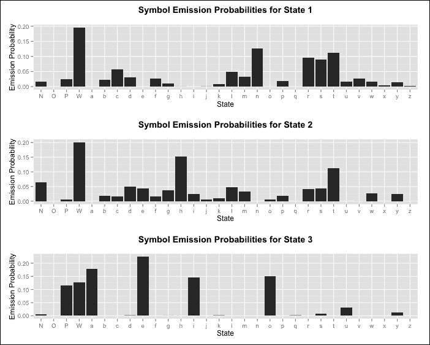

让我们仔细检查这些状态。所有状态都有相对较高的发射空白字符的概率。状态 3 非常有趣，因为它除了空白字符外，似乎还把标点和元音分组在一起。HMM 成功地成功地将字母*a*、*e*、*i*、*o*和*u*归入同一类别，而没有关于英语语言的任何先验信息。

此状态也以明显的概率发射了两个辅音。辅音*y*被发射，我们知道它在诸如*rhythm*和*phylum*等单词中偶尔表现得像元音。辅音*s*也被发射，因为它经常用来构成名词的复数形式，所以我们发现它在单词的末尾，就像标点符号一样。因此，我们看到这个状态似乎将两个主要主题分组在一起。

相比之下，状态 1 倾向于发射辅音而不是元音。事实上，只有元音*u*似乎有从该状态发射的小概率。状态 2 有元音和辅音的混合，但它是唯一一个辅音*h*有高概率的状态。这非常有趣，因为*h*是另一个在发音上具有元音特性的字母（它通常是沉默的或双元音的一部分）。我们可以通过检查状态之间的转移概率来了解更多信息：

```py
> (trained_transition_probabilities <- hmm_trained$hmm$transProbs)
    to
from           s1           s2         s3
  s1 1.244568e-01 5.115204e-01 0.36402279
  s2 7.739387e-05 2.766151e-01 0.72330746
  s3 9.516911e-01 5.377194e-06 0.04830349
```

再次，我们可以发现许多有趣的特性。例如，当我们处于状态 3，即元音状态时，我们有 95%的概率会转到状态 1，即辅音状态。这在直觉上是很明显的，因为英语很少出现连续的元音。当我们处于状态 1 时，我们有 36%的概率转到元音状态，有 51%的概率转到状态 2。

现在我们可以开始理解状态 2 代表什么了。它主要代表当我们有两个连续辅音时，发出第二个辅音的状态。这就是为什么在这个状态下，字母*h*有如此高的概率，因为它参与了非常常见的双元音，如*ch*、*sh*和*th*，当然，*th*在非常常见的单词如*the*中也能找到。从这个状态出发，最常见的后续状态，概率为 72%，是元音状态，正如连续两个辅音之后所预期的。

这个实验值得在不同条件下重复进行。如果我们使用不同的种子或者采样不同数量的电影评论，我们可能会看到不同的结果，因为 Baum-Welch 算法对初始条件敏感，并且是无监督的。具体来说，我们的隐马尔可夫模型可能会学习到一组完全不同的状态。

例如，在某些迭代中，我们注意到所有的标点符号和数字都被归入一个状态，另一个状态变成了元音状态，第三个状态是纯辅音状态。如果我们之前在代码中采样了 40 个文本，并使用 1816、1817 和 1818 这三个数字作为三个种子，我们可以重现这种行为。还有许多其他可能性——其中一些比其他更容易解释。

在这里值得调整的另一个参数是状态的数量。如果我们使用两个状态，那么分割往往是在元音和辅音之间。如果我们增加状态的数量，我们通常会继续找到对于多达 10 个状态可解释的结果。隐马尔可夫模型通常也被称为**生成模型**，因为一旦训练完成，我们可以使用它们来生成状态和观察的示例。我们可以通过提供我们的模型和想要生成的序列长度来使用`simHMM()`函数实现这一点：

```py
> set.seed(987987)
> simHMM(hmm_trained$hmm, 30)
$states
 [1] "s2" "s3" "s1" "s3" "s3" "s1" "s3" "s3" "s1" "s1" "s2" "s3"
[13] "s3" "s1" "s2" "s3" "s1" "s2" "s2" "s2" "s3" "s1" "s2" "s2"
[25] "s3" "s1" "s2" "s3" "s1" "s2"
$observation
 [1] "h" "o" "P" "P" "a" "n" "W" "i" "r" "r" "h" "e" "i" "n" "h"
[16] "o" "n" "l" "W" "h" "e" "s" "t" "W" "e" "t" "c" "e" "P" "W"
```

最后一点，我们可以下载并使用`markovchain`包，取我们学到的转移概率矩阵，并找出在长期中我们的模型在每个状态上花费了多少时间。这是通过**稳态计算**来完成的，其数学原理我们将在本书中不进行探讨。幸运的是，`markovchain`包有一个简单的方法来初始化马尔可夫链，当我们知道涉及的概率时。它是通过使用`simpleMc()`函数来实现的，我们可以在我们的马尔可夫链上使用`steadyStates()`函数来找出稳态分布：

```py
> library("markovchain")
> simpleMc<-new("markovchain", states = c("s1", "s2", "s3"), 
                transitionMatrix = trained_transition_probabilities, 
                name = "simpleMc")
> steadyStates(simpleMc)
            s1       s2        s3
[1,] 0.3806541 0.269171 0.3501748
```

从长远来看，我们在状态 1（第一个辅音状态）上花费了 38%的时间，在状态 2（第二个辅音状态）上花费了 27%的时间，在状态 3（主要的元音状态）上花费了 35%的时间。

# 摘要

在本章中，我们介绍了机器学习研究中的一个非常活跃的领域，即概率图模型领域。这些模型涉及使用图形结构来编码随机变量之间的条件独立性关系。我们看到了贝叶斯定理，一个非常简单的公式，它本质上告诉我们如何通过观察效应来推断原因，可以用来构建一个简单的分类器，即朴素贝叶斯分类器。这是一个简单的模型，我们试图预测一个输出类别，该类别最好地解释了一组观察到的特征，所有这些特征都被假定为在给定输出类别的情况下相互独立。

我们使用这个模型来预测一组电影评论中的用户情感，其中特征是评论中存在的单词。虽然我们获得了合理的准确性，但我们发现我们模型中的假设相当严格，这阻碍了我们取得更好的效果。通常，在建模过程中构建一个朴素贝叶斯模型，以提供我们知道应该超过更复杂模型的基线性能。

我们还研究了隐马尔可夫模型，这些模型通常用于标记和预测序列。序列中的每个位置都由一个隐藏状态和从该状态发出的观察组成。模型的关键假设是，每个状态在给定紧邻的前一个状态的情况下独立于整个序列历史。此外，所有观察都是相互独立的，以及所有其他状态，给定它们发出的状态。

当我们拥有标记序列时，我们可以通过使用从数据本身获得的状态转换和符号发射计数来训练一个隐马尔可夫模型。还可以使用一个非常聪明的算法，即 Baum-Welch 算法，来训练一个无监督的 HMM。尽管我们没有深入算法的细节，但我们通过在一个英文单词的字符序列上训练 HMM 的例子，看到了这种实际操作是如何工作的。

从这里，我们看到了所得到的模型捕捉到了语言的一些有趣特性。顺便提一下，尽管我们没有提到，也可以使用**EM 算法**训练一个带有缺失类标签的朴素贝叶斯模型。尽管 HMMs 也有相对严格的独立性假设，但它们相当强大，并且已经在从语音处理到分子生物学等广泛的应用中取得了成功。

在下一章中，我们将探讨对时间序列进行分析和预测。许多现实世界应用涉及在特定时间段内进行测量，并使用这些测量来预测未来。例如，我们可能想根据今天的天气预测明天的天气，或者根据过去几周的市场波动预测明天的股票市场指数。
