# 第十一章。主题建模

主题建模是一个相对较新且令人兴奋的领域，它起源于自然语言处理和信息检索领域，但同时也被应用于许多其他领域。在分类中，许多问题，如情感分析，涉及将单个类别分配给特定的观察对象。在主题建模中，关键思想是我们可以将不同类别的混合分配给一个观察对象。由于这个领域从信息检索中汲取灵感，我们通常将我们的观察对象视为文档，将我们的输出类别视为主题。在许多应用中，这实际上就是情况，因此我们将重点关注文本文档及其主题的领域，这是一个非常自然的方式来了解这个重要的模型。特别是，我们将关注一种称为**潜在狄利克雷分配**（**LDA**）的技术，这是主题建模中最广泛使用的方法。

# 主题建模概述

在第十章《概率图模型》中，我们看到了如何使用词袋作为朴素贝叶斯模型的特征来执行情感分析。在那里，具体的预测任务涉及确定某个电影评论是表达正面情感还是负面情感。我们明确假设电影评论只表达了一种可能的情感。用作特征的每个单词（如*bad*、*good*、*fun*等）在每个情感下出现在评论中的可能性都不同。

为了计算模型的决策，我们基本上计算了特定评论中所有单词在一个类别下的可能性，并将其与所有单词由另一个类别生成的可能性进行比较。我们使用每个类别的先验概率调整这些可能性，这样，当我们知道训练数据中某个类别更受欢迎时，我们预计在未来未见数据中会更多地发现它。没有机会让电影评论部分为正面，即一些单词来自正面类别，部分为负面，即其余单词出现在负面类别中。

**主题模型**背后的核心前提是我们的问题中有一组特征和一组生成这些特征的隐藏或潜在变量。关键的是，我们数据中的每个观察对象都包含由这些隐藏变量的混合或子集生成的特征。例如，一篇文章、网站或新闻文章可能有一个中心主题或主题，如政治，但也可能包括来自其他主题的一个或多个元素，如人权、历史或经济学。

在图像领域，我们可能对从阴影和表面等视觉特征集合中识别场景中的特定对象感兴趣。这些特征反过来可能是不同对象的混合产物。在主题建模中，我们的任务是观察文档内的单词，或图像的像素和视觉特征，并从这些特征中确定潜在的混合主题和对象。

文本数据上的主题建模可以用多种方式使用。一种可能的应用是将相似的文档分组在一起，无论是基于它们最占主导地位的主题，还是基于它们的主题混合。因此，它可以被视为一种聚类形式。通过研究主题组成、最频繁出现的单词以及我们获得的集群的相对大小，我们能够总结关于特定文档集合的信息。

我们可以使用集群中最频繁出现的单词和主题直接描述一个集群，这反过来可能对自动生成标签有用，例如提高我们文档的信息检索服务的搜索能力。另一个例子可能是在为推文数据库构建了主题模型之后，自动推荐 Twitter 标签。

当我们使用词袋方法描述如网站之类的文档时，每个文档本质上是一个由我们词典中的单词索引的向量。向量的元素是各种单词的计数或捕获单词是否出现在文档中的二元变量。无论如何，这种表示是编码文本到数值格式的好方法，但结果是，由于单词词典通常很大，结果是一个高维空间中的稀疏向量。在主题模型下，每个文档由主题的混合表示。由于这个数字通常比词典大小小得多，主题建模也可以作为一种降维的形式。

最后，主题建模也可以被视为一个分类的预测任务。如果我们有一组用主要主题标签标记的文档，我们可以在该集合上执行主题建模。如果我们从这种方法中获得的主要主题聚类与我们的标记类别一致，我们可以使用该模型来预测未知文档的主题混合，并根据最占主导地位的主题对其进行分类。我们将在本章后面看到一个例子。现在，我们将介绍执行主题建模最著名的技巧，即潜在狄利克雷分配。

# 潜在狄利克雷分配

**潜在狄利克雷分配**（**LDA**）是进行主题建模的原型方法。遗憾的是，LDA 这个缩写也被用于机器学习中的另一种方法。这种方法与 LDA 完全不同，通常用作执行降维和分类的一种方式。

虽然 LDA 涉及大量的数学，但了解其一些技术细节以了解模型的工作原理和它所使用的假设是值得的。首先，我们应该了解**狄利克雷分布**，它为 LDA 命名。

### 注意

关于 LDA 主题模型的更全面处理，一个优秀的参考是*A. Srivastava*和*M. Sahami*编辑的*《文本挖掘：分类、聚类与应用》*一书中关于*主题模型*的章节，由*Chapman & Hall*于 2009 年出版。

## 狄利克雷分布

假设我们有一个具有*K*个类别的分类问题，并且每个类别的概率是固定的。给定一个长度为*K*的向量，包含每个类别的发生次数，我们可以通过将向量中的每个条目除以所有计数之和来估计每个类别的概率。

现在假设我们想要预测每个类别在*N*次试验中出现的次数。如果我们有两个类别，我们可以用二项分布来模拟，就像我们在抛硬币实验中通常做的那样。对于*K*个类别，二项分布推广到**多项式分布**，其中每个类别的概率*pi*是固定的，所有*pi*实例的总和等于一。现在，假设我们想要模拟具有*K*个类别的特定多项式分布的随机选择。狄利克雷分布正是如此。以下是它的形式：

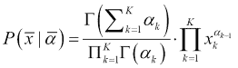

这个方程看起来很复杂，但如果我们将其分解为其组成部分并标注所用的符号，我们就能更好地理解它。首先，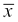项是一个具有*K*个分量的向量，*x[k]*，代表一个特定的多项式分布。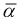向量也是一个*K*个分量的向量，包含狄利克雷分布的*K*个参数，*α[k]*。因此，我们正在计算在给定特定参数组合的情况下选择特定多项式分布的概率。请注意，我们向狄利克雷分布提供了一个参数向量，其长度与它将返回的多项式分布的类别数相同。

方程式右侧大乘积之前的分数是一个归一化常数，它只依赖于狄利克雷参数的值，并以**伽马函数**的形式表示。为了完整性，伽马函数，是阶乘函数的推广，其表达式如下：

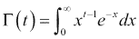

最后，在最终产品中，我们看到每个参数，*α[k]*，都与多项式分布的相应分量*x[k]*配对，形成乘积的项。关于这个分布的重要一点是，通过修改*α[k]*参数，我们正在修改我们可以绘制的不同多项式分布的概率。

我们特别关注*α[k]*参数的总和以及它们之间的相对比例。*α[k]*参数的总和较大往往会产生一个更平滑的分布，涉及许多主题的混合，并且这种分布更有可能遵循α参数的相对比例模式。

狄利克雷分布的一个特殊情况是**对称狄利克雷分布**，其中所有*α[k]*参数具有相同的值。当*α[k]*参数相同且值较大时，我们很可能会抽取一个接近均匀的多项式分布。因此，当我们对特定主题分布没有信息，并且认为所有主题的可能性相等时，我们使用对称狄利克雷分布。

同样，假设我们有一个偏斜的*α[k]*参数向量，其绝对值很大。例如，我们可能有一个向量，其中一个*α[k]*参数远高于其他参数，表明倾向于选择其中一个主题。如果我们将其作为狄利克雷分布的输入，我们很可能会抽取一个多项式分布，其中上述主题是可能的。

与之相反，如果*α[k]*参数的总和是一个小数，这通常会导致一个峰度分布，其中只有一个或两个主题是可能的，其余的则不太可能。因此，如果我们只想对只选择少数主题的多项式抽样过程进行建模，我们会使用低值的*α[k]*参数，而如果我们想要一个良好的混合，我们会使用较大的值。以下两个图将有助于可视化这种行为。第一个图是对称的狄利克雷分布：

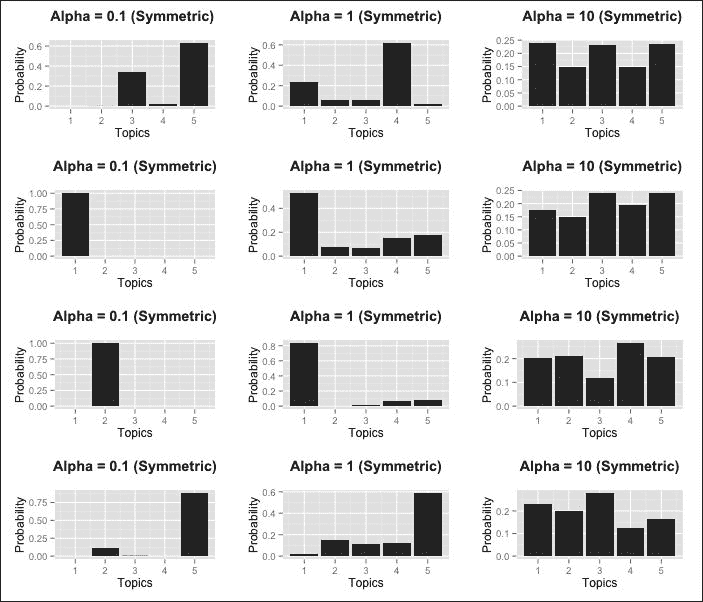

在这个图中，每一列包含使用对称狄利克雷分布为五个主题生成的四个多项式分布的随机样本。在第一列中，所有*α[k]*参数都被设置为 0.1。请注意，分布非常峰度，并且由于所有*α[k]*参数的可能性相等，没有偏好于哪个主题将倾向于被选择为最高的峰值。

在中间列中，*α[k]*参数被设置为 1，由于参数的总和现在更大，我们看到主题的混合更加丰富，即使分布仍然偏斜。当我们把第三列中的*α[k]*参数设置为 10 时，我们看到样本现在与均匀分布非常接近。

在许多情况下，我们使用狄利克雷分布作为**先验分布**；也就是说，一个描述我们关于尝试抽取的多项式分布的先验信念的分布。当*α[k]*参数的总和较高时，我们倾向于认为我们的先验信念非常强烈。在下一张图中，我们将调整*α[k]*参数的分布，以偏袒第一个主题：

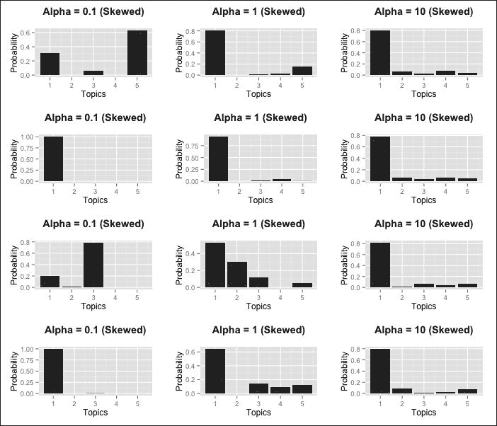

在第一列中，*α[k]*参数的平均值为 0.1，但我们调整了它们的分布，使得*α[1]*，对应于第一个主题，现在的值是其他主题的四倍。我们看到这增加了第一个主题在抽取的多项式分布中显著出现的概率，但它并不保证是分布的模态。

在中间列中，*α[k]*参数的平均值现在是 1，但具有相同的偏斜，主题 1 在所有样本中都是分布的模态。此外，其他主题的选择仍然存在很高的变异性。在第三列中，我们有一个更平滑的分布，它同时混合了所有五个主题，但强制偏好第一个主题。

现在我们已经了解了这种分布的工作原理，我们将在下一节中看到它是如何用于构建 LDA 主题模型的。

## 生成过程

我们对狄利克雷分布进行了深入探讨，因为它在 LDA 主题建模的核心。有了这种理解，我们现在将描述 LDA 背后的**生成过程**。

生成过程被恰当地命名，因为它描述了 LDA 模型假设我们的数据中的文档、主题和单词是如何生成的。这个过程本质上是对模型假设的说明。为了将 LDA 模型拟合到数据中，所使用的优化过程实际上估计了生成过程的参数。我们现在将看到这个过程是如何工作的：

1.  对于我们的 K 个主题中的每一个，我们使用一个由向量α参数化的狄利克雷分布，α的长度为*V*，即我们的词汇表大小，来对词汇表中的单词抽取一个多项式分布。尽管我们每次都从同一个狄利克雷分布中抽取，但我们已经看到，抽取的多项式分布可能彼此不同。

1.  对于我们想要生成的每个文档，*d*：

    +   通过从狄利克雷分布中抽取一个多项式分布，*θ[k]*，该分布由长度为*K*的向量*β*参数化，*K*是主题的数量，来确定这个文档的主题组合。因此，每个文档都将有不同的主题组合。

    +   对于我们想要生成的文档中的每个单词，*w*：

    +   使用这个文档的多项式主题分布，*θ[k]*，来抽取一个与这个单词相关联的主题

    +   使用特定主题的分布，*φ[k]*，来选择实际的单词

注意，在我们的生成过程中，我们使用了两个不同参数化的狄利克雷分布，一个用于抽取主题的多项式分布，另一个用于抽取单词的多项式分布。尽管模型很简单，但它确实捕捉到了关于文档和主题的一些直觉。特别是，它捕捉到了这样一个观点：关于不同主题的文档通常将包含不同的单词，并且比例也不同。一个特定的单词可以与多个主题相关联，但对于某些主题，它出现的频率可能比其他主题高。文档可能有一个中心主题，但它们也可能讨论其他主题，因此我们可以将文档视为处理主题的混合。一个在文档中更重要的主题将是因为文档中处理该主题的单词百分比更高。

狄利克雷分布可以是平滑的或偏斜的，组件的混合可以通过*α[k]*参数来控制。因此，通过适当调整狄利克雷分布，这个过程可以生成具有单一主题的文档，也可以生成涵盖许多主题的文档。

同时，重要的是要记住模型通过它所做出的某些简化假设的限制。该模型完全忽略了文档内部的单词顺序，并且在生成过程中是无记忆的，这意味着当它生成文档的第*n*个单词时，它不会考虑之前为该文档抽取的*n-1*个单词。

此外，LDA 不试图对文档中抽取的主题之间的关系进行建模，因此我们不会尝试组织更可能共同出现的主题，例如天气和旅行或生物学和化学。这是 LDA 模型的一个重大限制，为此已经提出了解决方案。例如，LDA 的一个变体，称为**相关主题模型**（**CTM**），遵循与 LDA 相同的生成过程，但使用不同的分布，允许对主题之间的相关性进行建模。在我们的实验部分，我们还将看到 CTM 模型的实现。

### 注意

相关主题模型在 D. M. Blei 和 J. D. Lafferty 的《科学相关主题模型》一文中提出，该文由 2007 年的《应用统计年鉴》出版。

## 将 LDA 模型拟合

将 LDA 模型拟合到文档语料库本质上涉及通过 LDA 生成过程，计算估计最有可能生成数据的多项式主题和单词分布，即*φ[k]*和*θ[d]*。这些变量是隐藏的或潜在的，这也是为什么这种方法被称为 LDA 的原因。

已经提出了多种优化过程来解决此问题，但数学细节超出了本书的范围。我们将提到其中两种，我们将在下一节中遇到。第一种方法被称为**变分期望最大化**（**VEM**），是著名的**期望最大化**（**EM**）算法的一个变体。第二种被称为 Gibbs 抽样，是一种基于**马尔可夫链蒙特卡洛**（**MCMC**）的方法。

### 注意

对于 EM 算法和 VEM 的教程，我们推荐*《贝叶斯推理的变分近似》*，由*Dimitris G. Tzikas*等人撰写，发表在 2008 年 11 月的*IEEE 信号处理杂志*上。对于 Gibbs 抽样，有一篇 1992 年的文章发表在*《美国统计学家》*上，题为*解释 Gibbs 抽样器*。这两篇文章都很好读，但相当技术性。关于 Gibbs 抽样的更全面的教程是*《Gibbs 抽样入门》*，由*Philip Resnik*和*Eric Hardisty*撰写。最后一个参考资料数学要求较低，可以在[`www.cs.umd.edu/~hardisty/papers/gsfu.pdf`](http://www.cs.umd.edu/~hardisty/papers/gsfu.pdf)在线找到。

# 在线新闻故事的主题建模

为了查看主题模型在真实数据上的表现，我们将查看两个包含 2004-2005 年期间来自 BBC 新闻的文章的数据集。第一个数据集，我们将称之为*BBC 数据集*，包含 2,225 篇文章，这些文章被分为五个主题。这些主题是*商业*、*娱乐*、*政治*、*体育*和*技术*。

第二个数据集，我们将称之为*BBCSports 数据集*，仅包含 737 篇关于体育的文章。这些文章也根据所描述的体育类型分为五个类别。涉及的五种运动是*田径*、*板球*、*足球*、*橄榄球*和*网球*。我们的目标将是看看我们是否可以为这两个数据集中的每一个构建主题模型，这些模型将把同一主要主题的文章分组在一起。

### 注意

两个 BBC 数据集都由*D. Greene*和*P. Cunningham*在 2005 年 10 月发表的论文中提出，该论文题为*从高维数据生成准确可解释的聚类*，并发表在第九届欧洲知识发现与数据挖掘会议（PKDD'05）的论文集中。

两个数据集可以在[`mlg.ucd.ie/datasets/bbc.html`](http://mlg.ucd.ie/datasets/bbc.html)找到。下载后，每个数据集都是一个包含几个不同文件的文件夹。我们将使用变量`bbc_folder`和`bbcsports_folder`来存储这些文件夹在计算机上的路径。

每个文件夹包含三个重要文件。具有`.mtx`扩展名的文件实际上是一个包含稀疏矩阵形式的项文档矩阵的文件。具体来说，矩阵的行是可以在文章中找到的术语，列是文章本身。矩阵中的条目*M[i,j]*包含对应于行*i*的术语在对应于列*j*的文档中出现的次数。因此，项文档矩阵是一个转置的文档术语矩阵，我们在第八章的*概率图模型*中遇到过。在文件中存储矩阵的特定格式是一种称为**矩阵市场格式**的格式，其中每一行对应于矩阵中的一个非空单元格。

通常，当我们处理文本，如新闻文章时，我们需要执行一些预处理步骤，例如去除停用词，就像我们在第八章的例子中使用`tm`包进行情感分析时做的那样，*概率图模型*。幸运的是，这些数据集中的文章已经过处理，以便它们已经被词干提取；停用词已被移除，以及任何出现次数少于三次的术语。

为了解释项文档矩阵，具有`.terms`扩展名的文件包含实际的术语，每行一个，它们是项文档矩阵的行名。同样，项文档矩阵中的文档名（列名）存储在具有`.docs`扩展名的文件中。

我们首先为每个数据集所需的三个文件路径创建变量：

```py
>bbc_folder<- "~/Downloads/bbc/"
>bbcsports_folder<- "~/Downloads/bbcsport/"
>bbc_source<- paste(bbc_folder, "bbc.mtx", sep = "")
>bbc_source_terms<- paste(bbc_folder, "bbc.terms", sep = "")
>bbc_source_docs<- paste(bbc_folder, "bbc.docs", sep = "")
>bbcsports_source<- paste(bbcsports_folder, "bbcsport.mtx", sep = "")
>bbcsports_source_terms<- paste(bbcsports_folder, 
"bbcsport.terms", sep = "")
>bbcsports_source_docs<- paste(bbcsports_folder, 
"bbcsport.docs", sep = "")
```

为了将数据从 Market Matrix 格式的文件加载到 R 中，我们可以使用`Matrix` R 包中的`readMM()`函数。这个函数将数据加载并存储到一个稀疏矩阵对象中。我们可以使用`tm`包中的`as.TermDocumentMatrix()`函数将这个稀疏矩阵转换为`tm`包可以解释的项文档矩阵。除了该函数的第一个参数矩阵对象外，我们还需要指定`weighting`参数。这个参数描述了原始矩阵中的数字代表什么。在我们的例子中，我们有原始的词频，所以我们指定值为`weightTf`：

```py
> library("tm")
> library("Matrix")
>bbc_matrix<- readMM(bbc_source)
>bbc_tdm<- as.TermDocumentMatrix(bbc_matrix, weightTf)
>bbcsports_matrix<- readMM(bbcsports_source)
>bbcsports_tdm<- as.TermDocumentMatrix(bbcsports_matrix, 
weightTf)
```

接下来，我们加载剩余两个文件中的术语和文档标识符，并分别使用这些来为术语-文档矩阵创建适当的行和列名称。我们可以使用标准的`scan()`函数来读取每行只有一个条目的文件，并将条目加载到向量中。一旦我们有了术语向量和文档标识符向量，我们将使用这些来更新术语-文档矩阵的行和列名称。最后，我们将这个矩阵转置成一个文档-术语矩阵，因为这是我们后续步骤所需的格式：

```py
>bbc_rows<- scan(bbc_source_terms, what = "character")
Read 9635 items
>bbc_cols<- scan(bbc_source_docs, what = "character")
Read 2225 items
>bbc_tdm$dimnames$Terms<- bbc_rows
>bbc_tdm$dimnames$Docs<- bbc_cols
> (bbc_dtm<- t(bbc_tdm))
<<DocumentTermMatrix (documents: 2225, terms: 9635)>>
Non-/sparse entries: 286774/21151101
Sparsity           : 99%
Maximal term length: 24
Weighting          : term frequency (tf)
>bbcsports_rows<- scan(bbcsports_source_terms, what =  
"character")
Read 4613 items
>bbcsports_cols<- scan(bbcsports_source_docs, what =  
"character")
Read 737 items
>bbcsports_tdm$dimnames$Terms<- bbcsports_rows
>bbcsports_tdm$dimnames$Docs<- bbcsports_cols
> (bbcsports_dtm<- t(bbcsports_tdm))
<<DocumentTermMatrix (documents: 737, terms: 4613)>>
Non-/sparse entries: 85576/3314205
Sparsity           : 97%
Maximal term length: 17
Weighting          : term frequency (tf)
```

现在我们已经准备好了两个数据集的文档-术语矩阵。我们可以看到 BBC 数据集的术语数量大约是 BBCSports 数据集的两倍，后者也有大约三分之一的文档数量，因此它是一个规模较小的数据集。在我们构建主题模型之前，我们还必须创建包含文章原始主题分类的向量。如果我们检查文档 ID，我们可以看到每个文档标识符的格式是`<topic>.<counter>`：

```py
>bbc_cols[1:5]
[1] "business.001""business.002""business.003""business.004"
[5] "business.005"
>bbcsports_cols[1:5]
[1] "athletics.001""athletics.002""athletics.003"
[4] "athletics.004""athletics.005"
```

要创建具有正确主题分配的向量，我们只需简单地去除每个条目最后的四个字符。如果我们然后将结果转换为因子，我们就可以看到每个主题有多少个文档：

```py
>bbc_gold_topics<- sapply(bbc_cols, 
                           function(x) substr(x, 1, nchar(x) - 4))
>bbc_gold_factor<- factor(bbc_gold_topics)
> summary(bbc_gold_factor)
     business entertainment      politics         sport 
          510           386           417           511 
         tech 
          401 
>bbcsports_gold_topics<- sapply(bbcsports_cols, 
                           function(x) substr(x, 1, nchar(x) - 4))
>bbcsports_gold_factor<- factor(bbcsports_gold_topics)
> summary(bbcsports_gold_factor)
athletics   cricket  football     rugby    tennis 
      101       124       265       147       100
```

这表明 BBC 数据集在主题分布上相当均匀。然而，在 BBCSports 数据中，我们发现足球文章的数量大约是其他四种运动的两倍。

对于我们的两个数据集，我们现在将使用`topicmodels`包构建一些主题模型。这是一个非常有用的包，因为它允许我们使用`tm`包创建的数据结构来执行主题建模。对于每个数据集，我们将构建以下四个不同的主题模型：

+   `LDA_VEM`: 这是一个使用**变分期望最大化**（**VEM**）方法训练的 LDA 模型。这种方法自动估计`α`Dirichlet 参数向量。

+   `LDA_VEM_α`: 这是一个使用 VEM 训练的 LDA 模型，但这里的区别在于`α`Dirichlet 参数向量没有估计。

+   `LDA_GIB`: 这是一个使用吉布斯抽样的 LDA 模型。

+   `CTM_VEM`: 这是一个使用 VEM 训练的**相关主题模型**（**CTM**）的实现。目前，`topicmodels`包不支持使用吉布斯抽样的方法进行训练。

要训练一个 LDA 模型，`topicmodels`包为我们提供了`LDA()`函数。我们将为此函数使用四个关键参数。第一个参数指定我们想要为它构建 LDA 模型的文档-术语矩阵。第二个参数`k`指定我们希望在模型中拥有的目标主题数量。第三个参数`method`允许我们选择要使用的训练算法。默认情况下，它设置为`VEM`，所以我们只需要指定我们的`LDA_GIB`模型，它使用吉布斯抽样。

最后，有一个`控制`参数，它接受一个影响拟合过程的参数列表。由于主题模型的训练中涉及固有的随机成分，我们可以在该列表中指定一个`种子`参数，以便使结果可重复。此外，这也是我们指定是否想要估计*α*Dirichlet 参数的地方。这也是我们可以包括吉布斯抽样过程参数的地方，例如训练过程开始时省略的吉布斯迭代次数（`burnin`）、省略的中间迭代次数（`thin`）和总的吉布斯迭代次数（`iter`）。为了训练一个 CTM 模型，`topicmodels`包为我们提供了`CTM()`函数，其语法与`LDA()`函数类似。

使用这些知识，我们将定义一个函数，该函数根据特定的文档词矩阵、所需的主题数量和种子创建一个包含四个训练模型的列表。对于这个函数，我们使用了上述训练参数的一些标准值，鼓励读者进行实验，理想情况下是在调查了两种优化方法提供的参考文献之后：

```py
compute_model_list<- function (k, topic_seed, myDtm){
LDA_VEM<- LDA(myDtm, k = k, control = list(seed = topic_seed))
LDA_VEM_a<- LDA(myDtm, k = k, control = list(estimate.alpha = 
                   FALSE, seed = topic_seed))
LDA_GIB<- LDA(myDtm, k = k, method = "Gibbs", control = 
                 list(seed = topic_seed, burnin = 1000, thin = 
                 100, iter = 1000))
CTM_VEM<- CTM(myDtm, k = k, control = list(seed = topic_seed, 
var = list(tol = 10^-4), em = list(tol = 10^-3)))
  return(list(LDA_VEM = LDA_VEM, LDA_VEM_a = LDA_VEM_a, 
LDA_GIB = LDA_GIB, CTM_VEM = CTM_VEM))
}
```

我们现在将使用这个函数为两个数据集训练一系列模型：

```py
> library("topicmodels")
> k <- 5
>topic_seed<- 5798252
>bbc_models<- compute_model_list(k, topic_seed,bbc_dtm)
>bbcsports_models<- compute_model_list(k, topic_seed, 
bbcsports_dtm)
```

为了了解主题模型的表现，让我们首先看看每个模型学习的五个主题是否对应于文章最初分配的五个主题。给定这些训练模型之一，我们可以使用`topics()`函数来获取每个文档最可能选择的主题的向量。

这个函数实际上接受第二个参数，*k*，默认设置为`1`，并返回模型预测的前* k* 个主题。在这个特定实例中，我们只想在每个模型中有一个主题。找到最可能的主题后，我们就可以将预测的主题与标记主题的向量进行表格化。这是 BBC 数据集的`LDA_VEM`模型的预测结果：

```py
>model_topics<- topics(bbc_models$LDA_VEM)
> table(model_topics, bbc_gold_factor)
bbc_gold_factor
model_topics business entertainment politics sport tech
           1       11           174        2     0  176
           2        4           192        1     0  202
           3      483             3       10     0    7
           4        9            17      403     4   15
           5        3             0        1   507    1
```

看这张表格，我们可以看到主题 5 几乎完全对应于*体育*类别。同样，主题 4 和 3 似乎分别对应于*政治*和*商业*类别。不幸的是，模型 1 和 2 都包含*娱乐*和*技术*文章的混合，因此这个模型并没有真正成功地区分我们想要的类别。

应该很明显，在理想情况下，每个模型主题应该匹配到一个金主题（我们经常用形容词*金*来指代特定变量的正确或标记值。这源于表达*金标准*，它指的是一个广泛接受的标准）。我们可以在`LDA_GIB`模型上重复这个过程，那里的情况不同：

```py
>model_topics<- topics(bbc_models$LDA_GIB)
> table(model_topics, bbc_gold_factor)
bbc_gold_factor
model_topics business entertainment politics sport tech
           1      471             2       12     1    5
           2        0             0        3   506    3
           3        9             4        1     0  371
           4       27            16      399     3    9
           5        3           364        2     1   13
```

直观地感觉，这个主题模型比第一个模型更好地匹配我们的原始主题，正如每个模型主题主要选择一个金主题的文章所证明的那样。

估计主题模型与我们的目标主题向量之间匹配质量的一个粗略方法是说，每一行中的最大值对应于分配给该行表示的模型主题的黄金主题。然后，总准确度是这些最大行值与总文档数的比率。在先前的例子中，对于`LDA_GIB`模型，这个数字将是*(471+506+371+399+364)/2225 = 2111/2225= 94.9 %*。以下函数计算给定模型和黄金主题向量时的这个值：

```py
compute_topic_model_accuracy<- function(model, gold_factor) {
model_topics<- topics(model)
model_table<- table(model_topics, gold_factor)
model_matches<- apply(model_table, 1, max)
model_accuracy<- sum(model_matches) / sum(model_table)
  return(model_accuracy)
}
```

使用这个准确度的概念，让我们看看在两个数据集中哪个模型表现更好：

```py
>sapply(bbc_models, function(x) 
compute_topic_model_accuracy(x, bbc_gold_factor))
LDA_VEMLDA_VEM_aLDA_GIBCTM_VEM
0.7959551 0.7923596 0.9487640 0.6148315 
>sapply(bbcsports_models, function(x) 
compute_topic_model_accuracy(x, bbcsports_gold_factor))
LDA_VEMLDA_VEM_aLDA_GIBCTM_VEM
0.7924016 0.7788331 0.7856174 0.7503392
```

对于 BBC 数据集，我们看到`LDA_GIB`模型显著优于其他模型，而`CTM_VEM`模型则显著劣于 LDA 模型。对于 BBCSports 数据集，所有模型的表现大致相同，但`LDA_VEM`模型略好。

评估模型拟合质量的另一种方法是计算给定模型的数据的对数似然，记住这个值越大，拟合越好。我们可以使用`topicmodels`包中的`logLik()`函数来做这件事，它表明在两种情况下，最佳模型都是使用吉布斯采样训练的 LDA 模型：

```py
>sapply(bbc_models, logLik)
LDA_VEMLDA_VEM_aLDA_GIBCTM_VEM
 -3201542  -3274005  -3017399  -3245828
>sapply(bbcsports_models, logLik)
LDA_VEMLDA_VEM_aLDA_GIBCTM_VEM
-864357.7 -886561.9 -813889.7 -868561.9 
```

## 模型稳定性

结果表明，在拟合这些模型的过程中，优化程序中的随机成分往往对训练的模型有显著影响。换句话说，我们可能会发现，如果我们使用不同的随机数种子，结果有时可能会显著变化。

理想情况下，我们希望我们的模型是**稳定的**，这意味着我们希望优化过程的初始条件（由随机数种子确定）的影响最小。通过在多个种子上训练我们的四个模型来研究不同种子对模型的影响是一个好主意：

```py
>seeded_bbc_models<- lapply(5798252 : 5798256, 
              function(x) compute_model_list(k, x, bbc_dtm))
>seeded_bbcsports_models<- lapply(5798252 : 5798256, 
              function(x) compute_model_list(k, x, bbcsports_dtm))
```

在这里，我们使用了五个连续的种子序列，并在两个数据集上分别训练了五次模型。完成这些后，我们可以调查不同种子下我们模型的准确度。如果一个方法的准确度在种子之间变化不大，我们可以推断该方法相当稳定，并产生相似的主题模型（尽管在这种情况下，我们只考虑每份文档中最突出的主题）。

```py
>seeded_bbc_models_acc<- sapply(seeded_bbc_models, 
  function(x) sapply(x, function(y) 
compute_topic_model_accuracy(y, bbc_gold_factor)))
>seeded_bbc_models_acc
               [,1]      [,2]      [,3]      [,4]      [,5]
LDA_VEM   0.7959551 0.7959551 0.7065169 0.7065169 0.7757303
LDA_VEM_a 0.7923596 0.7923596 0.6916854 0.6916854 0.7505618
LDA_GIB   0.9487640 0.9474157 0.9519101 0.9501124 0.9460674
CTM_VEM   0.6148315 0.5883146 0.9366292 0.8026966 0.7074157
>seeded_bbcsports_models_acc<- sapply(seeded_bbcsports_models, 
  function(x) sapply(x, function(y) 
compute_topic_model_accuracy(y, bbcsports_gold_factor)))
>seeded_bbcsports_models_acc
               [,1]      [,2]      [,3]      [,4]      [,5]
LDA_VEM   0.7924016 0.7924016 0.8616011 0.8616011 0.9050204
LDA_VEM_a 0.7788331 0.7788331 0.8426052 0.8426052 0.8914518
LDA_GIB   0.7856174 0.7978290 0.8073270 0.7978290 0.7761194
CTM_VEM   0.7503392 0.6309362 0.7435550 0.8995929 0.6526459
```

在两个数据集中，我们可以清楚地看到，吉布斯采样导致模型更稳定，在 BBC 数据集中，它在准确度方面也是明显的赢家。吉布斯采样通常倾向于产生更准确的模型，但尽管在这些数据集中并不明显，一旦数据集变得很大，它可能会比 VEM 方法慢得多。

使用变分方法训练的两个 LDA 模型在两个数据集上都表现出大约 10%的分数变化。在两个数据集上，我们看到`LDA_VEM`始终比`LDA_VEM_a`略好。这种方法在 BBCSports 数据集中，平均而言，所有模型中的准确性也更好。CTM 模型是最不稳定的模型，在两个数据集上都表现出很高的变异性。有趣的是，尽管如此，CTM 模型在五次迭代中的最高性能略逊于使用其他方法可能达到的最佳准确性。

如果我们发现我们的模型在几个种子迭代中不是很稳定，我们可以在训练期间指定`nstart`参数，该参数指定了在优化过程中使用的随机重启次数。为了看到这在实践中是如何工作的，我们创建了一个修改后的`compute_model_list()`函数，我们将其命名为`compute_model_list_r()`，它接受一个额外的参数，`nstart`。

另一个不同之处在于，现在的`seed`参数需要一个与随机重启次数一样多的种子向量。为了处理这个问题，我们将简单地从提供的种子开始创建一个适当大小的种子范围。以下是我们的新函数：

```py
compute_model_list_r<- function (k, topic_seed, myDtm, nstart) {
seed_range<- topic_seed : (topic_seed + nstart - 1)
LDA_VEM<- LDA(myDtm, k = k, control = list(seed = seed_range, 
nstart = nstart))
LDA_VEM_a<- LDA(myDtm, k = k, control = list(estimate.alpha = 
                 FALSE, seed = seed_range, nstart = nstart))
LDA_GIB<- LDA(myDtm, k = k, method = "Gibbs", control = 
                 list(seed = seed_range, burnin = 1000, thin = 
                 100, iter = 1000, nstart = nstart))
CTM_VEM<- CTM(myDtm, k = k, control = list(seed = seed_range, 
var = list(tol = 10^-4), em = list(tol = 10^-3), 
nstart = nstart))
  return(list(LDA_VEM = LDA_VEM, LDA_VEM_a = LDA_VEM_a, 
LDA_GIB = LDA_GIB, CTM_VEM = CTM_VEM))
}
```

我们将使用这个函数来创建一个新的模型列表。请注意，使用随机重启意味着我们正在增加训练所需的时间，所以接下来的几个命令将需要一些时间才能完成：

```py
>nstart<- 5
>topic_seed<- 5798252
>nstarted_bbc_models_r<- 
compute_model_list_r(k, topic_seed, bbc_dtm, nstart)
>nstarted_bbcsports_models_r<- 
compute_model_list_r(k, topic_seed, bbcsports_dtm, nstart)
>sapply(nstarted_bbc_models_r, function(x) 
compute_topic_model_accuracy(x, bbc_gold_factor))
LDA_VEMLDA_VEM_aLDA_GIBCTM_VEM
0.7959551 0.7923596 0.9487640 0.9366292 
>sapply(nstarted_bbcsports_models_r, function(x) 
compute_topic_model_accuracy(x, bbcsports_gold_factor))
LDA_VEMLDA_VEM_aLDA_GIBCTM_VEM
0.9050204 0.8426052 0.7991859 0.8995929
```

注意，即使只使用了五个随机重启，模型的准确性也得到了提高。更重要的是，我们现在看到使用随机重启已经克服了 CTM 模型所经历的波动，因此现在它的表现几乎与每个数据集中最好的模型一样好。

## 寻找主题数量

在这个预测任务中，不同主题的数量是事先已知的。这证明非常重要，因为它被用作训练我们模型的函数的输入。当我们使用主题建模作为探索性分析的一种形式时，我们的目标是简单地根据主题的相似性将文档聚在一起，这时主题的数量可能并不知道。

这是一个具有挑战性的问题，与我们在执行聚类时选择聚类数量的通用问题有一些相似之处。针对这个问题的一个解决方案是在不同数量的主题范围内进行交叉验证。当数据集很大时，这种方法根本无法扩展，特别是当我们考虑到训练单个主题模型已经相当计算密集，尤其是考虑到随机重启等问题。

### 注意

一篇讨论了多种估计主题模型中主题数量方法的文章是*Edoardo M. Airoldi*和其他人撰写的*重新概念化 PNAS 文章的分类*。这篇文章发表在*美国国家科学院院刊*，第 107 卷，2010 年。

## 主题分布

在生成过程的描述中，我们看到了我们使用狄利克雷分布来采样主题的多项分布。在`LDA_VEM`模型中，估计*αk*参数向量。请注意，在所有情况下，此实现中均使用对称分布，因此我们只估计*α*的值，这是所有*α[k]*参数所取的值。对于 LDA 模型，我们可以调查在估计和不估计的情况下使用此参数的哪个值：

```py
>bbc_models[[1]]@alpha
[1] 0.04893411
>bbc_models[[2]]@alpha
[1] 10
>bbcsports_models[[1]]@alpha
[1] 0.04037119
>bbcsports_models[[2]]@alpha
[1] 10
```

正如我们所见，当我们估计*α*的值时，我们获得的*α*值比默认使用的值要低得多，这表明对于两个数据集，主题分布被认为是峰值的。我们可以使用`posterior()`函数来查看每个模型的主题分布。例如，对于 BBC 数据集上的`LDA_VEM`模型，我们发现前几篇文章的主题分布如下：

```py
> options(digits = 4)
> head(posterior(bbc_models[[1]])$topics)
                     1         2      3         4         5
business.001 0.2700360 0.0477374 0.6818 0.0002222 0.0002222
business.002 0.0002545 0.0002545 0.9990 0.0002545 0.0002545
business.003 0.0003257 0.0003257 0.9987 0.0003257 0.0003257
business.004 0.0002153 0.0002153 0.9991 0.0002153 0.0002153
business.005 0.0337131 0.0004104 0.9651 0.0004104 0.0004104
business.006 0.0423153 0.0004740 0.9563 0.0004740 0.0004740
```

下面的图是四个模型预测的最可能主题的后验概率直方图。`LDA_VEM`模型假设一个非常峰值分布，而其他模型则分布更广。`CTM_VEM`模型在非常高的概率处也有峰值，但与`LDA_VEM`不同，概率质量分布在广泛的值范围内。我们可以看到，最可能主题的最小概率为 0.2，因为我们有五个主题：

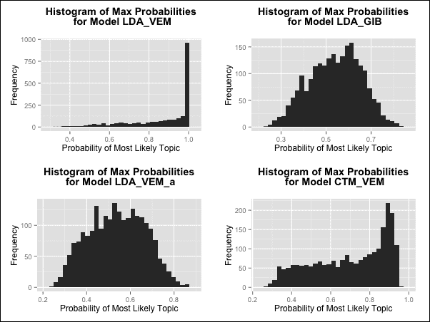

另一种估计主题分布平滑度的方法是计算*模型熵*。我们将定义为不同文档中所有主题分布的平均熵。平滑分布将比峰值分布具有更高的熵。为了计算我们模型的熵，我们将定义两个函数。函数`compute_entropy()`计算文档特定主题分布的熵，而`compute_model_mean_entropy()`函数计算模型中所有不同文档的平均熵：

```py
compute_entropy<- function(probs) {
  return(- sum(probs * log(probs)))
}
compute_model_mean_entropy<- function(model) {
  topics <- posterior(model)$topics
  return(mean(apply(topics, 1, compute_entropy)))
}
```

使用这些函数，我们可以计算在我们两个数据集上训练的模型的平均模型熵：

```py
>sapply(bbc_models, compute_model_mean_entropy)
LDA_VEMLDA_VEM_aLDA_GIBCTM_VEM
0.3119491 1.2664310 1.2720891 0.8373708 
>sapply(bbcsports_models, compute_model_mean_entropy)
LDA_VEMLDA_VEM_aLDA_GIBCTM_VEM
0.3058856 1.3084006 1.3421798 0.7545975
```

这些结果与前面的图表显示的一致，即峰值最高的`LDA_VEM`模型比其他模型的熵要低得多。

## 单词分布

正如前一个部分，我们查看不同文档的主题分布一样，我们通常也感兴趣于了解分配给相同主题的文档中频繁出现的重要术语。我们可以使用`terms()`函数查看模型主题的* k* 个最频繁术语。这个函数接受一个模型和一个指定我们想要检索的最频繁术语数量的数字。让我们看看 BBC 数据集中`LDA_GIB`模型的每个主题的 10 个最重要的单词：

```py
>GIB_bbc_model<- bbc_models[[3]]
> terms(GIB_bbc_model, 10)
      Topic 1   Topic 2   Topic 3     Topic 4  Topic 5 
 [1,] "year""plai""peopl""govern""film"
 [2,] "compani""game""game""labour""year"
 [3,] "market""win""servic""parti""best"
 [4,] "sale""against""technolog""elect""show"
 [5,] "firm""england""mobil""minist""includ"
 [6,] "expect""first""on""plan""on"
 [7,] "share""back""phone""sai""award"
 [8,] "month""player""get""told""music"
 [9,] "bank""world""work""peopl""top"
[10,] "price""time""wai""public""star"
```

如我们所见，给定这个词根列表，我们可以很容易地猜测我们应该将哪个五个主题标签分配给每个主题。通过词云可视化文档集中的频繁词是一个非常方便的方法。R 包`wordcloud`对于创建这些词云非常有用。`wordcloud()`函数允许我们指定一个术语向量以及它们的频率向量，然后这些信息被用于绘图。

不幸的是，我们将不得不对文档词矩阵进行一些操作，以便通过主题计算词频，这样我们就可以将它们输入到这个函数中。为此，我们创建了自己的函数`plot_wordcloud()`，如下所示：

```py
plot_wordcloud<- function(model, myDtm, index, numTerms) {
model_terms<- terms(model,numTerms)
model_topics<- topics(model)
terms_i<- model_terms[,index]
topic_i<- model_topics == index
dtm_i<- myDtm[topic_i, terms_i]
frequencies_i<- colSums(as.matrix(dtm_i))
wordcloud(terms_i, frequencies_i, min.freq = 0)
}
```

我们的功能接受一个模型、一个文档词矩阵、一个主题索引以及我们希望在词云中显示的最频繁词的数量。我们首先通过主题计算模型中最频繁的词，就像我们之前做的那样。我们还计算了最可能的主题分配。接下来，我们子集文档词矩阵，以便我们只获得涉及我们感兴趣的词和对应于我们作为参数传递的索引的主题的文档的单元格。

从这个简化的文档词矩阵中，我们对列进行求和以计算最频繁词的频率，最后我们绘制词云。我们使用这个函数绘制了 BBC 数据集中主题的词云，使用了`LDA_GIB`模型和每个主题 25 个词。如下所示：

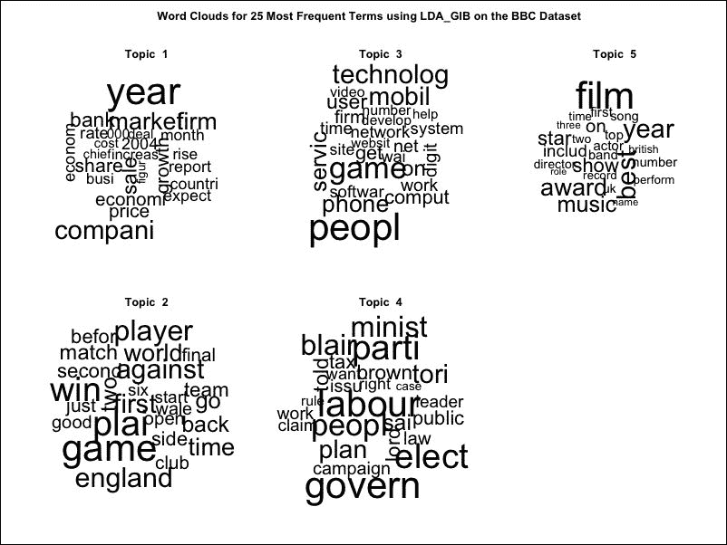

## LDA 扩展

主题模型是研究的热点领域，因此已经提出了几个 LDA 模型的扩展。我们将简要介绍其中的两个。第一个是**监督 LDA**模型，其实现可以在`lda`R 包中找到。这是一种更直接的方式，使用标准 LDA 方法来建模响应变量，并且将是调查本章讨论的应用的一个很好的下一步。

第二个有趣的扩展是**作者-主题模型**。这是为了在生成过程中添加一个额外的步骤来考虑作者信息而设计的，当构建总结或预测作者写作习惯和主题的模型时，这是一个很好的模型。

### 注意

监督 LDA 的标准参考文献是 David M. Blei 和 Jon D. McAuliffe 合著的论文《Supervised Topic Models》。该论文发表于 2007 年《神经信息处理系统》期刊。对于作者-主题模型，请参阅 Michal Rosen-Zvi 等人撰写的论文《The Author-Topic Model for Authors and Documents》。该论文发表在《第 20 届不确定人工智能会议》的论文集中。

# 建模推文主题

在机器学习和自然语言处理中，*主题模型*是一种用于发现文档集合中出现的抽象主题的统计模型。一个很好的例子或用例来阐述这个概念是*Twitter*。假设我们可以分析个人的（或组织的）推文以发现任何主导趋势。让我们看看一个简单的例子。

如果你有一个 Twitter 账户，你可以非常容易地完成这个练习（然后你可以将相同的流程应用于你想要关注的推文存档和/或模型）。首先，我们需要创建一个推文存档文件。

在**设置**中，你可以提交一个请求以接收你的推文存档文件。一旦准备好，你将收到一封包含下载链接的电子邮件：

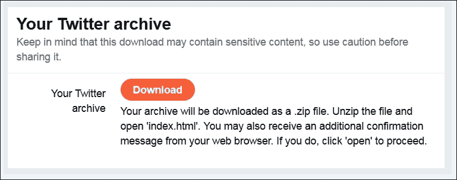

然后将你的文件保存在本地：

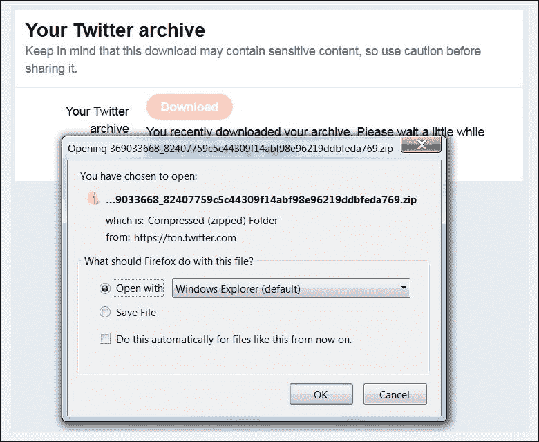

现在我们有了可以工作的数据源，我们可以将推文移动到一个列表*对象*（我们将它称为*x*）中，然后将其转换为 R 数据框对象（df1）：

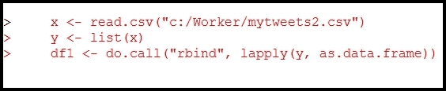

在使用 R 的`tm`包将推文转换为*数据框*之前，首先将推文转换为*语料库*或语料库集合（文本文档对象）：

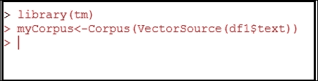

接下来，我们使用以下代码将语料库转换为*文档-词矩阵*对象。这创建了一个*数学矩阵*，它描述了在文档集合中出现的*词频*，在这种情况下，我们的推文集合：

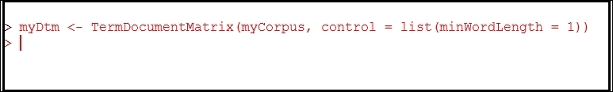

## 词云生成

在构建文档-词矩阵（之前已展示）后，我们可以更轻松地通过*词云*（也称为标签云）来展示我们推文中找到的单词的重要性。我们可以使用 R 包`wordcloud`来完成这项操作：

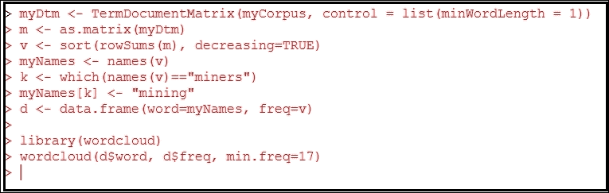

最后，让我们生成词云视觉图：

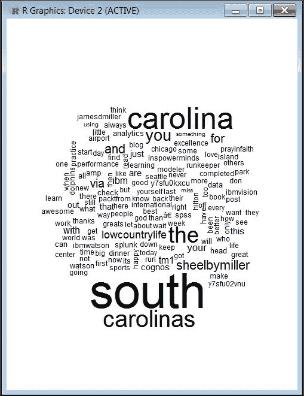

看起来这里可能有一个主题！词云显示，单词**south**和**carolinas**是最重要的单词。

# 摘要

本章致力于学习主题模型；在电影评论的情感分析之后，这是我们第二次涉足处理真实文本数据。这次，我们的预测任务是分类网络新闻文章的主题。我们主要关注的主题建模技术是 LDA。这个名字来源于它假设文档内部可以找到的主题和词分布是由从 Dirichlet 先验中采样的隐藏的多项式分布产生的。我们看到了从这些多项式分布中采样单词和主题的生成过程与我们对这个领域的许多自然直觉相吻合；然而，它明显没有考虑到文档内部可能同时出现的各种主题之间的相关性。

在我们的 LDA 实验中，我们发现拟合 LDA 模型的方式不止一种，特别是我们发现被称为 Gibbs 抽样的方法通常更准确，即使它通常计算成本更高。在性能方面，我们发现，当涉及的主题彼此非常不同时，例如 BBC 数据集中的主题，我们在主题预测中获得了非常高的准确率。

同时，然而，当我们对具有更相似主题的文档进行分类，例如 BBCSports 数据集中的不同体育文档时，我们发现这带来了更大的挑战，我们的结果并不那么高。在我们的案例中，另一个可能起作用的因素是，文档和可用的特征数量都比 BBCSports 数据集要少得多。目前，越来越多的 LDA 变体正在被研究和开发，以应对性能和训练速度的限制。

作为一项有趣的练习，我们还下载了一个推文存档，并使用 R 命令创建了一个**文档-词矩阵**对象，然后我们将其用作创建可视化推文中找到的单词的词云对象的输入。

主题模型可以被视为一种聚类形式，这是我们首次涉足这个领域。在下一章关于推荐系统的章节中，我们将更深入地探讨聚类领域，以便理解像亚马逊这样的网站是如何通过预测购物者最可能感兴趣的产品来做出产品推荐的，这些预测基于他们的购物历史和类似购物者的购物习惯。
