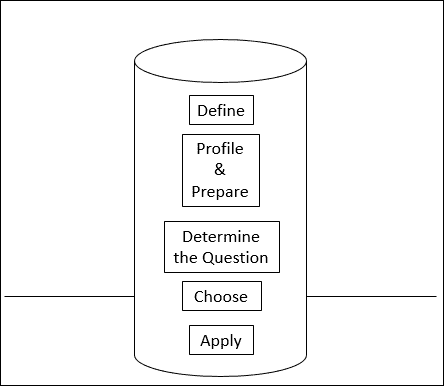
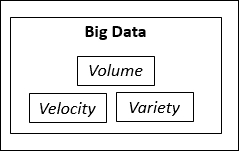
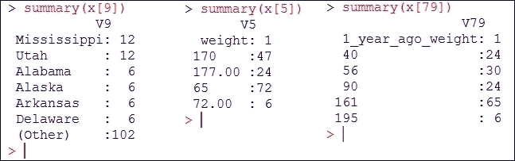
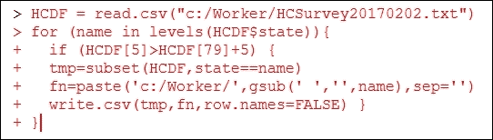
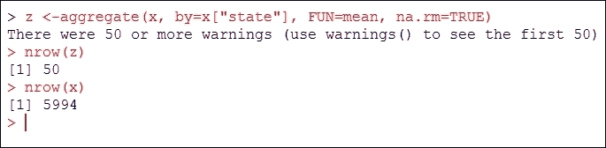

# 第十三章。扩展

到目前为止，我们已经回顾了一系列与*统计学*和特别是*预测分析*相关的重要主题。在本章中，我们将提供一篇教程，专门介绍如何将这些概念和实践应用于非常大的数据集。首先，我们将从定义“非常大”这个短语开始——至少就其用于描述数据定义（我们希望用它来训练我们的预测模型或运行我们的统计算法）而言。接下来，我们将回顾使用更大数据源带来的挑战列表，最后，我们将提出一些应对这些挑战的想法。

我们本章分为以下部分：

+   开始

+   分析项目的阶段

+   经验和数据规模

+   大数据的特征

+   规模化训练模型

+   特定挑战（大数据）

+   前进的道路

# 开始项目

通用预测分析项目的阶段可能很简单，也许很容易（真正具有挑战性的是有效地执行每个阶段）。



预测分析项目的阶段

这些阶段包括：

1.  **定义**（数据）。

1.  **概要和准备**（数据）。

1.  **确定问题**（要预测什么）。

1.  **选择**算法。

1.  **应用**模型。

## 数据定义

一个有趣的思考：

> “……一旦你有了足够的数据，你就会开始看到模式，”他说。“你可以建立一个这些数据如何工作的模型。一旦你建立了模型，你就可以预测……”
> 
> – 贝托鲁奇，2013

在任何（以及每一个）分析项目的开始阶段，数据被定义——审查和分析：来源、格式、状态、间隔等（有些人将此称为调查可用数据的广度和深度的过程）。

一个要求进行的练习是执行所谓的数据源概要分析，或者通过确定其特征、关系和模式（以及上下文）来建立你的数据概要。这个过程有望产生对将要用于项目的数据的内容和质量的一个更清晰的看法——即数据概要。

然后，在完成数据概要分析之后，人们很可能会进行某种形式的数据清洗（这有时也被称为净化或在某些情况下准备），以努力提高其质量水平。在清洗或清洗数据的过程中，你很可能会执行诸如聚合、追加、合并、重新格式化字段、更改变量类型或添加缺失值等任务。

### 注意

数据概要技术可以包括特定的分析类型，例如*单变量分析*，它涉及对分类变量的频率分析以及对连续变量的分布和汇总统计的理解。这有助于处理缺失值、理解分布和异常值处理。

## 经验

当向**主题专家**（SME）寻求建议时，很可能会同意一个经验更丰富的人更有可能提供更好的服务。在预测分析项目中，目标不是数据能告诉我们什么，而是数据能告诉我们关于目标或问题的什么，因此，可用于项目的数据源的大小或数量（经验量）变得更为重要。通常情况下，数据越多，越好。

那么，在什么情况下可以说你的预测项目已经有了足够的数据？对这个问题的政治正确答案是这取决于具体情况。某些类型的数据科学和预测分析项目可能需要比其他项目更具体的数据要求，从而实际上确定了可能的最小数据量。

在极端情况下，预测可能需要跨越多年甚至数十年的数据——因为更多的数据可以产生围绕行为和决策等方面的广泛模式。为什么？因为通常情况下，使用更多数据进行分析（或用数据训练模型）可以发展出更全面的理解或**更好的预测**。

考虑到这一点，可能的一个一般性规则是尽可能收集尽可能多的数据（取决于目标或应用类型）。一些专家可能会建议在开始任何预测分析项目之前收集至少三年的数据，最好是五年的数据。当然，根据应用类型，年可能不是合适的度量单位。例如，案例可能更适合或文本行，等等。

### 注意

在实践中，如果一个应用是基于医院访问构建的，那么患者案例（通常是数百万）越多越好；一个单词预测应用希望拥有尽可能多的文本句子或单词短语（数千万）以有效（使用）。

另一个预测分析数据的争议可能是理解**足够**与**充足**的概念。

在某些情况下，如果数据量或**数量**不足，明智的数据科学家会始终关注数据的**质量**或适用性。这意味着尽管数据量少于预期，但根据项目的目标，数据的质量被认为是足够的。

在理解了所有上述要点之后，评估你的数据以确定你的数据量是否已经达到临界点——即典型分析活动开始变得难以执行的那个点——是很重要的。

在下一节中，我们将介绍如何确定数据量的临界点，因为在开始重型模型训练之前理解和预期挑战总是比在已经开始之后发现困难的方法要好。

## 规模数据——大数据

当我们使用“数据规模”这个短语时，我们并不是指区间、顺序、名义和二分的统计测量尺度。我们在这里使用这个短语是松散的，以传达在您的分析项目中将要使用的数据源的大小、量或复杂性。

现在，众所周知的时髦词**大数据**可能（松散地）适用于这里，所以让我们在这里停下来，定义我们是如何使用大数据这个术语的。

大量的数据集合，如此之大或复杂以至于传统的数据处理应用不足，以及关于我们生活各个方面的数据都被用来定义或指代大数据。

下图说明了大数据的三个 V：



2001 年，当时的 Gartner 分析师**道格·兰尼**提出了 3Vs 概念来描述大数据的发生。根据兰尼的说法，3Vs 是量、种类和速度。Vs 构成了大数据的维度：量（或可测量的数据量）、种类（意味着数据类型的数量）和速度（指处理或处理该数据的速度）。

### 注意

兰尼的解释可以在这里查看：[`blogs.gartner.com/doug-laney/files/2012/01/ad949-3D-Data-Management-Controlling-Data-Volume-Velocity-and-Variety.pdf`](http://blogs.gartner.com/doug-laney/files/2012/01/ad949-3D-Data-Management-Controlling-Data-Volume-Velocity-and-Variety.pdf))。

使用*量*、*种类*和*速度*的概念，可以更容易地预见一个*大数据*源如何变得或迅速变得难以处理，并且随着这些维度的增加或扩展，它们将只会阻碍在数据上有效训练预测模型的能力。

## 使用 Excel 衡量你的数据

微软 Excel 不是一个用来确定你的数据是否符合大数据标准的工具。

**如果你的数据太大以至于无法使用微软 Excel 处理，这并不意味着它一定符合大数据的标准。** 事实上，即使是几吉字节的数据，仍然可以通过各种技术、企业级甚至开源工具来管理，尤其是在今天存储成本较低的情况下。

在选择方法或开始任何配置文件或准备工作之前，能够现实地评估或调整你将在预测项目中使用的数据技术（考虑到预期的数据增长速度）是很重要的。这段时间花得很值得，因为它将节省以后可能因性能瓶颈或重写脚本以使用不同方法（可以处理更大数据源的方法）而失去的时间。

因此，问题变成了，你如何衡量你的数据——它真的是大数据吗？它是可管理的吗？还是它属于需要特殊处理或预处理才能有效用于预测分析目标的那一类？

# 大数据的特征

为了确定你的数据源是否属于大数据或需要特殊处理，你可以从以下方面开始检查你的数据源：

1.  数据的体积（数量）。

1.  数据的多样性。

1.  不同数据源的数量和数据跨度。

让我们逐一考察这些领域。

## 体积

如果你谈论的是行数或记录数，那么你的数据源很可能不是大数据源，因为大数据通常以千兆字节、太字节和拍字节来衡量。然而，空间并不总是意味着大数据，因为这些尺寸测量在体积和功能方面可能有很大的差异。此外，具有数百万条记录的数据源，如果其结构（或缺乏结构）符合条件，也可能被视为大数据。

## 多样性

用于预测模型的数据可能是结构化的、非结构化的（或两者兼有），包括来自数据库的交易、调查结果、网站日志、应用程序消息等（通过使用包含更多样化数据的数据源，你通常能够覆盖更广泛的上下文，从而从其中获得的分析）。多样性与体积一样，被视为大数据的正常标准。

## 数据源和跨度

如果你的预测分析项目数据源是整合了多个来源的结果，你很可能同时满足了体积和多样性的标准，你的数据可以被视为大数据。如果你的项目使用受政府法规影响的数据，如消费者请求的历史分析，你几乎可以确定正在使用大数据。政府法规通常要求某些类型的数据需要存储数年。产品在其生命周期内可能由消费者驱动，并且根据今天的趋势，历史分析数据通常可用超过五年。再次强调，这些都是大数据来源的例子。

## 结构

你经常会发现数据源通常属于以下三个类别之一：

1.  数据结构化程度低或没有结构的数据源（如简单的文本文件）。

1.  包含结构化和非结构化数据（如来自文档管理系统或各种网站的来源）的数据源。

1.  包含高度结构化数据（如存储在关系型数据库中的交易数据）的数据源。

你的数据源如何分类将决定你在预测分析项目的每个阶段如何准备和操作你的数据。

虽然具有结构的数据源显然仍然可以归入大数据类别，但包含结构化和非结构化数据（以及当然完全非结构化数据）的数据源才符合大数据的定义，并且需要特殊处理或预处理。

## 统计噪声

最后，我们应该注意，除了本章中已经讨论的因素之外，其他因素也可以使你的项目数据源被视为难以处理、过于复杂或大数据源。

这包括（但不限于）：

+   统计噪声（一个术语，用于描述数据中未解释的变异量）

+   数据存在理解不匹配（社区、文化、实践等对数据的解释差异）

+   以及其他

一旦你确定你将在预测分析项目中使用的数据源似乎符合大的标准（再次强调，我们在这里使用这个术语），那么你可以继续决定如何管理和操作这个数据源的过程，基于这类数据所要求的已知挑战，以便最有效地进行。

在下一节中，我们将在继续提供可用的解决方案之前，回顾一些这些常见问题。

# 规模化训练模型

在本章的早期部分，我们列出并研究了行业专家一致认为的任何预测分析项目最常见阶段的内容。

回顾一下，它们如下：

+   定义数据源

+   数据源的配置文件和准备

+   确定你想向你的数据提出的问题（们）

+   选择在数据源上训练的算法

+   应用预测模型

在使用大数据的预测分析项目中，这些相同的阶段都存在，但可能略有变化，并需要一些额外的努力。

## 阶段性疼痛

在项目的初期阶段，一旦你选择了数据源（确定了数据源），就必须获取数据。一些行业专家将此描述为数据的获取和记录。在一个涉及更常见数据源的预测项目中，访问数据可能就像在你的本地磁盘上打开一个文件一样简单；而对于大数据源来说，则要复杂得多。例如，假设你的项目从多种设备（多个服务器和许多移动设备，即物联网数据）的组合中获取数据。

这种活动生成数据可能包括网站跟踪信息、应用程序日志、传感器数据——以及其他机器生成内容——非常适合你的分析。你可以看到，将获取这些信息作为你项目单一数据源的努力需要一些努力（以及专业知识！）。

在配置文件和准备阶段，数据被提取、清理和注释。通常，任何分析项目都将需要这种数据预处理：设置上下文、确定操作定义和统计类型等。这一步至关重要，因为这是我们建立对数据挑战理解的过程，以便以后可以最小化意外。这一阶段通常涉及花费时间查询和重新查询数据、创建可视化以验证发现，然后更新数据以解决关注领域。大数据阻碍了这些活动，因为它可能包括更多需要处理的数据，格式可能不一致，并且可能变化迅速。

在问题确定阶段，必须考虑数据集成、聚合和数据表示，以便可以确定向数据提出的问题。这一阶段可以分为三个步骤；准备、集成和问题确定。准备步骤涉及组装数据、识别唯一键、聚合/重复、按要求进行清理、格式操作，也许还有值的映射。集成步骤涉及合并数据、测试和协调。最后，确定项目问题。再次强调，大数据的量、种类和速度可能会显著减缓这一阶段。

选择算法和预测模型的应用是分析、建模和解释数据的阶段。考虑到大数据源的量、种类和速度，选择用于训练数据的适当算法可能更加复杂。一个例子是预测建模在可能的最小粒度下效果最好，在前一阶段，大数据源的 sheer volume 可能需要大量聚合，从而可能埋没了数据中存在的异常和变化。

## 具体挑战

让我们花几分钟时间来讨论一下大数据带来的具体挑战。其中一些主要话题包括：

+   异质性

+   规模

+   位置

+   及时性

+   隐私

+   合作

+   可重复性

### 异质性

通过多样性，我们通常需要考虑数据类型、表示和语义解释的异质性。正确审查和理解大数据源中这些变化的工作可能既耗时又复杂。有趣的是，一个元素在较大尺度上可能是同质的（更均匀），而与较小尺度上的异质（不均匀）相比。这意味着你处理大数据源的方法可能会导致非常不同的结果！

### 规模

我们已经提到了规模的概念——通常规模指的是数据源的 sheer size，但也可能指的是其复杂性。

### 位置

通常情况下，当你决定使用大数据源时，你会发现它并不位于一个地方，而是分散在电子空间中。这意味着任何过程（手动或自动化）都必须在数据能够被项目正确使用之前，对数据进行物理或虚拟的整合。

### 及时性

数据量越大，分析所需的时间就越长。然而，当人们在大数据背景下谈论速度时，并不仅仅是指这个时间。相反，数据获取率是一个挑战。换句话说，当数据源中的数据不断累积或更新时，何时（或多长时间）才能建立正确的快照？此外，扫描整个数据源以找到与特定预测分析目标相关的合适样本显然是不切实际的。

### 隐私

使用任何数据源时，都应该考虑数据隐私，在大数据背景下，这种考虑会变得更加复杂。最著名的例子是电子健康记录——它们受到严格的法律法规约束。

假设，例如，需要预处理一个超过一太字节大小的数据源，以隐藏用户的身份和位置信息？

### 协作

人们可能会认为，在这个时代，分析和预测模型完全是计算性的（尤其是当你听到机器学习这个术语时），然而，无论预测算法或模型声称多么先进，数据中仍然存在许多人类可以轻易察觉但计算机算法在逻辑上难以找到的模式。

### 注意

在分析领域出现了一种新的趋势，这可能被视为*视觉分析*的一个子领域，它利用了领域专家的知识，至少在预测项目的建模和分析阶段是这样。

在预测分析项目中包含一个领域专家可能不是一个大问题，但面对大数据源时，通常需要来自不同领域的多位专家才能真正理解数据的情况，并分享他们各自的结果探索和建议。

这些多位专家可能在空间和时间上分散，难以在某一时间聚集在同一个地点。这再次导致需要花费额外的时间和精力。

### 可重复性

信不信由你，大多数预测分析项目因各种原因而重复进行。例如，如果结果因任何原因受到质疑或数据存在疑点，项目的所有阶段都可能需要重复。大数据分析项目的重复很少是合理的。在大多数情况下，所能做的就是找到大数据资源中的不良数据并将其标记为不良数据。

# 前进的道路

因此，拥有足够多的数据来训练模型的想法似乎非常吸引人。

大数据源似乎能够满足这一需求，然而在实践中，大数据源很少（如果有的话）被完全分析。你可以相当肯定地执行一个广泛的过滤过程，旨在将大数据减少到小（一些）数据（更多内容将在下一节中介绍）。

在下一节中，我们将回顾各种方法，以解决将大数据作为预测分析项目数据源所面临的挑战。

## 机会

在本节中，我们提供了一些关于在预测分析项目中使用 R 处理大数据源的推荐方法。此外，我们还将提供一些实际用例示例。

## 更大的数据，更大的硬件

我们首先从最明显的选项开始。

为了明确，R 将所有对象都保存在内存中，如果数据源太大，这会成为一个限制。在 R 中处理大数据的最简单方法之一就是增加机器的内存。

在撰写本文时，如果 R 在 64 位机器上运行，它可以使用 8 TB 的 RAM（相比之下，32 位机器上只有 2 GB 可寻址 RAM）。用于预测分析项目的大多数机器（至少应该是）已经是 64 位，所以你只需要添加 RAM。

### 注意

R 有 32 位和 64 位版本。请自己方便，使用 64 位版本！

如果你对你的数据源非常了解，并且已经为你的机器添加了适当的内存，那么你很可能能够有效地处理大数据源，特别是如果你使用本章以下部分概述的方法之一。

## 分割

使用 R（或任何语言）驯服大数据源的最直接和最有效的方法之一是从大数据资源中创建可工作的数据子集。

例如，假设我们有一个由患者健康记录组成的当前大数据源。数据中实际上有数万亿的患者病例记录，几乎每分钟都在增加。这些病例记录了基本信息（性别、年龄、身高、体重等）以及患者背景的详细信息（例如，患者是否吸烟、饮酒、目前正在服用药物、是否曾经接受过手术等）。幸运的是，我们的文件不包含任何可以用来识别患者的个人信息（如姓名或社会保障号码），所以我们不会违反任何法律。

数据源由全国各地的医院和诊所提供。我们的预测项目旨在确定患者健康状况与他们居住状态之间的关系。我们不是试图在所有数据上训练（这通常是一项不切实际的尝试），而是可以使用一些逻辑来准备一系列更小、更易于处理的数据子集。例如，我们可以简单地将整体数据源分成 50 个更小的文件——每个州一个。这将有所帮助，但较小的文件可能仍然很大，所以通过对数据进行一点分析，我们可能能够识别出我们可以用来划分数据的其他度量。

数据发现和分离的过程可能看起来非常接近以下步骤：

1.  由于我们正在处理大数据源，并且不确定文件中的案例或记录数，我们可以从创建一个 R 数据对象开始，并限制要读取的记录数：

    ```py
    x<-read.table(file="HCSurvey20170202.txt", sep=",", nrows=150)
    ```

1.  `x`现在包含 150 条记录，我们可以从中查找可能用于逻辑分割数据的有趣度量。您还可以使用 summary 函数评估数据源中的变量。例如，我们看到第 9 列是患者的家庭州，第 5 列是患者的当前体重，而第 79 列表示患者一年前的体重：

1.  现在，我们或许可以创建一系列较小的子集，其中包含 50 个州文件，但每个文件只包含在过去一年中体重增加超过五磅的患者案例：

我们最终确实得到了 50 个文件，但每个文件应该比单个大型大数据源小得多，更容易处理。这只是一个简单的例子，在实践中，你可能（并且很可能）需要重新运行分割代码，并将多个州文件拼接在一起。

这就是大数据研究通常工作方式的一个例子——通过构建可以高效分析的较小数据集！

## 采样

另一种处理大数据源体积的方法是使用总体抽样。

采样是从统计总体中选择或选择子集的案例，目的是估计或代表整个群体的特征。简而言之，要训练的数据量减少了。

有一些担忧认为采样可能会降低模型的性能（不是指处理时间，而是指生成的结果的准确性）。这可能是部分正确的，因为通常模型训练的数据越多，结果越好，但根据目标的不同，性能的下降可能是可以忽略不计的。

总的来说，可以说如果可以避免采样，使用另一种大数据策略是可取的。但如果发现采样是必要的，它仍然可以导致令人满意的模型。

当你使用采样作为大数据预测策略时，你应该尽量使样本尽可能大，仔细考虑样本大小与整个总体之间的比例，并尽可能确保样本没有偏差。

创建样本的最简单方法之一是使用 R 函数 sample。Sample 从`x`的元素中抽取指定大小的样本，可以使用或不使用替换。

以下 R 代码行是一个从原始数据中创建 500 个随机样本的简单示例。注意行数（通过使用 R 函数`nrow`表示）：


## 聚合

另一种减少大数据源大小（再次取决于你的项目目标）的方法是通过数据的统计聚合。换句话说，你可能根本不需要数据中可用的粒度级别。

在统计数据聚合中，可以从多个测量值中组合数据。这意味着观察组的组合被基于这些观察值的汇总统计所取代。聚合在描述性分析中应用广泛，但也可以用于为预测项目准备数据。

对于更大且特别是分布不均的大数据源，可以使用 Hadoop 和 Hive（或类似技术）解决方案来聚合数据。如果数据在事务型数据库中，甚至可能使用原生 SQL。在纯 R 解决方案中，你需要做更多的工作。

R 提供了一个名为 `aggregate` 的方便函数，可用于大数据聚合，一旦你确定如何在你的项目中使用（或需要）数据。

例如，以下代码展示了将函数应用于原始数据（存储在名为 `x` 的数据对象中）并按 3 个变量（患者 `sex`）进行聚合：

```py
aggregate(x, by=x["sex"], FUN=mean, na.rm=TRUE)
```

回到前面的部分，关于将数据拆分成 50 个州文件的例子，我们可能可以使用以下 R 代码来聚合并按州生成汇总统计。注意，原始案例数为 5,994，在聚合数据后，我们有 50 个案例（每个州一个汇总记录）：



## 维度降低

在 第八章，*维度降低*中，我们介绍了维度降低的过程，这个过程（正如我们当时所指出的）允许数据科学家最小化数据的维度，但也可以减少大数据源的整体体积，从而减少处理数据所需的时间和内存，使其更容易可视化，并消除与模型目的无关的特征，减少模型噪声等。

就像将数据拆分成更小的、更易于管理的文件一样，使用维度降低会有所帮助，但这也需要良好的数据理解以及可能的大量处理步骤，最终产生一个可工作的数据集。

# 替代方案

由于 R 是内存语言，它有时被认为无法处理大数据。然而，通过一些创造性和战略性的思考，你可以在预测分析项目中相当成功地使用大数据。

除了上述方法之外，目前还有许多其他替代方法你可能希望研究，例如：

## 分块处理

有一些包可以避免在内存中存储数据。相反，对象存储在硬盘上，并以块的形式进行分析。作为副作用，如果算法允许对块进行并行分析，分块也会自然地导致并行化。你可以搜索：Revolution R Enterprise 了解该主题的一些背景信息。

## 替代语言集成

在 R 中集成性能更高的编程语言正成为处理大数据源的流行替代方案。这个概念将 R 代码的部分内容移动到另一种可能更适合执行逻辑或工作的语言中。这样做既融合了 R 的优点，又避免了性能瓶颈。

将 R 中的代码块外包给另一种语言可以很容易地隐藏在函数中。在这种情况下，开发者必须精通其他编程语言，但用户不需要。

# 摘要

在本章中，我们将典型的预测分析项目分解为阶段，并解释了第一阶段是定义要使用哪些数据的地方。

通常情况下，数据越多，预测模型的性能（或结果）就越好，但在某个时候（例如在大数据源的情况下），数据可能太多，至少难以有效处理。

在回顾了大数据之所以如此具有挑战性的原因之后，我们指导了如何评估你的数据源，将其认定为大数据源，并提供了各种经过验证的技术来解决使用大数据的常见挑战。
