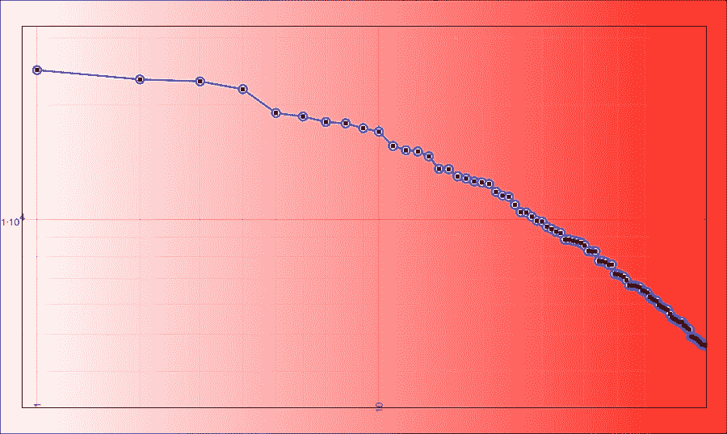
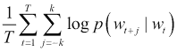
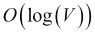
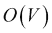

# 第九章：Scala 中的 NLP

本章描述了几个常见的**自然语言处理**（**NLP**）技术，特别是那些可以从 Scala 中受益的技术。开源社区中存在一些 NLP 包。其中最著名的是 NLTK（[`www.nltk.org`](http://www.nltk.org)），它是用 Python 编写的，并且可能还有更多强调 NLP 不同方面的专有软件解决方案。值得提及的是 Wolf（[`github.com/wolfe-pack`](https://github.com/wolfe-pack)）、FACTORIE（[`factorie.cs.umass.edu`](http://factorie.cs.umass.edu)）、ScalaNLP（[`www.scalanlp.org`](http://www.scalanlp.org)）和 skymind（[`www.skymind.io`](http://www.skymind.io)），其中 skymind 部分是专有的。然而，由于一个或多个原因，这个领域的少数开源项目在长时间内保持活跃。大多数项目正被 Spark 和 MLlib 的能力所取代，尤其是在可扩展性方面。

我不会详细描述每个 NLP 项目，这些项目可能包括语音转文本、文本转语音和语言翻译等，而是将在本章提供一些基本技术，专注于利用 Spark MLlib。这一章作为本书的最后一章分析章节，显得非常自然。Scala 是一种非常自然语言看起来像的计算机语言，本章将利用我之前开发的技术。

NLP 可以说是 AI 的核心。最初，AI 的创建是为了模仿人类，而自然语言解析和理解是其不可或缺的一部分。大数据技术已经开始渗透到 NLP 中，尽管传统上，NLP 计算量很大，被视为小数据问题。NLP 通常需要广泛的深度学习技术，而所有书面文本的数据量似乎与今天所有机器生成的日志量以及大数据机器分析的数据量相比并不大。

尽管国会图书馆有数百万份文件，但其中大部分可以数字化为 PB 的实际数字数据，这是一个任何社交网站都能在几秒钟内收集、存储和分析的数据量。大多数多产作者的完整作品可以存储在几个 MB 的文件中（参见表 09-1）。尽管如此，社交网络和 ADTECH 公司每天都会从数百万用户和数百个上下文中解析文本。

| 完整作品 | 生前 | 大小 |
| --- | --- | --- |
| *柏拉图* | 公元前 428/427 年（或 424/423 年） - 公元前 348/347 年 | 2.1 MB |
| *威廉·莎士比亚* | 1564 年 4 月 26 日（洗礼） - 1616 年 4 月 23 日 | 3.8 MB |
| *费奥多尔·陀思妥耶夫斯基* | 1821 年 11 月 11 日 - 1881 年 2 月 9 日 | 5.9 MB |
| *列夫·托尔斯泰* | 1828 年 9 月 9 日 - 1910 年 11 月 20 日 | 6.9 MB |
| *马克·吐温* | 1835 年 11 月 30 日 - 1910 年 4 月 21 日 | 13 MB |

> 表 09-1\. 一些著名作家全集的收集（大多数今天在 Amazon.com 上只需几美元即可购买，后来的作者，尽管可以轻松数字化，但价格更高）

自然语言是一个动态的概念，随着时间的推移、技术的发展和代际的变化而变化。我们看到了表情符号、三字母缩写等的出现。外语倾向于相互借鉴；描述这个动态生态系统本身就是一项挑战。

与前几章一样，我将专注于如何使用 Scala 作为工具来编排语言分析，而不是在 Scala 中重写工具。由于这个主题如此庞大，我并不声称在这里涵盖 NLP 的所有方面。

在本章中，我们将涵盖以下主题：

+   以文本处理流程和阶段为例讨论 NLP

+   从词袋的角度学习简单的文本分析方法

+   学习**词频逆文档频率**（**TF-IDF**）技术，它超越了简单的词袋分析，并在**信息检索**（**IR**）中成为事实上的标准

+   以**潜在狄利克雷分配**（**LDA**）方法为例学习文档聚类

+   使用基于 word2vec n-gram 的算法进行语义分析

# 文本分析流程

在我们继续详细算法之前，让我们看看*图 9-1*中描述的通用文本处理流程。在文本分析中，输入通常以字符流的形式呈现（具体取决于特定语言）。

词汇分析涉及将这个流分解成一系列单词（或语言学分析中的词素）。通常它也被称为标记化（而单词被称为标记）。**ANother Tool for Language Recognition**（**ANTLR**）([`www.antlr.org/`](http://www.antlr.org/))和 Flex([`flex.sourceforge.net`](http://flex.sourceforge.net))在开源社区中可能是最著名的。歧义的一个经典例子是词汇歧义。例如，在短语*I saw a bat.*中，*bat*可以指动物或棒球棒。我们通常需要上下文来弄清楚这一点，我们将在下一节讨论：


图 9-1\. NLP 过程的典型阶段。

语法分析，或称为解析，传统上处理的是将文本结构与语法规则相匹配。这对于不允许任何歧义的计算机语言来说相对更重要。在自然语言中，这个过程通常被称为分块和标记。在许多情况下，人类语言中单词的意义可能受到上下文、语调，甚至肢体语言或面部表情的影响。与大数据方法相比，大数据方法中数据的量胜过复杂性，这种分析的价值仍然是一个有争议的话题——后者的一个例子是 word2vec 方法，稍后将会描述。

语义分析是从句法结构中提取与语言无关的意义的过程。在尽可能的范围内，它还涉及去除特定文化或语言背景中的特定特征，到这种项目可能实现的程度。这一阶段的歧义来源包括：短语附着、连词、名词组结构、语义歧义、反身非字面言语等。同样，word2vec 部分解决了这些问题。

揭示整合部分处理了语境问题：一个句子或成语的意义可能取决于其之前的句子或段落。句法分析和文化背景在这里起着重要作用。

最后，语用分析是试图从意图的角度重新解释所说内容的另一层复杂性。这如何改变世界的状态？它是可执行的吗？

## 简单文本分析

文档的直接表示是一个词袋。Scala 和 Spark 提供了一个出色的范例来执行对词分布的分析。首先，我们读取整个文本集合，然后计算独特的单词：

```py
$ bin/spark-shell 
Welcome to
 ____              __
 / __/__  ___ _____/ /__
 _\ \/ _ \/ _ `/ __/  ''_/
 /___/ .__/\_,_/_/ /_/\_\   version 1.6.1
 /_/

Using Scala version 2.10.5 (Java HotSpot(TM) 64-Bit Server VM, Java 1.8.0_40)
Type in expressions to have them evaluated.
Type :help for more information.
Spark context available as sc.
SQL context available as sqlContext.

scala> val leotolstoy = sc.textFile("leotolstoy").cache
leotolstoy: org.apache.spark.rdd.RDD[String] = leotolstoy MapPartitionsRDD[1] at textFile at <console>:27

scala> leotolstoy.flatMap(_.split("\\W+")).count
res1: Long = 1318234 

scala> val shakespeare = sc.textFile("shakespeare").cache
shakespeare: org.apache.spark.rdd.RDD[String] = shakespeare MapPartitionsRDD[7] at textFile at <console>:27

scala> shakespeare.flatMap(_.split("\\W+")).count
res2: Long = 1051958

```

这只是对相当不同作者的词汇库中不同单词数量的一个估计。找到两个语料库之间交集的最简单方法就是找到共同的词汇（正如*列夫·托尔斯泰*用俄语和法语写作，而*莎士比亚*是一位英语作家，所以它们会有很大的不同）：

```py
scala> :silent

scala> val shakespeareBag = shakespeare.flatMap(_.split("\\W+")).map(_.toLowerCase).distinct

scala> val leotolstoyBag = leotolstoy.flatMap(_.split("\\W+")).map(_.toLowerCase).distinct
leotolstoyBag: org.apache.spark.rdd.RDD[String] = MapPartitionsRDD[27] at map at <console>:29

scala> println("The bags intersection is " + leotolstoyBag.intersection(shakespeareBag).count)
The bags intersection is 11552

```

几千个单词索引在当前实现中是可管理的。对于任何新的故事，我们可以确定它更有可能是由列夫·托尔斯泰还是*威廉·莎士比亚*所写。让我们看看*《圣经的詹姆斯国王版*》，它也可以从 Project Gutenberg 下载（[`www.gutenberg.org/files/10/10-h/10-h.htm`](https://www.gutenberg.org/files/10/10-h/10-h.htm)）：

```py
$ (mkdir bible; cd bible; wget http://www.gutenberg.org/cache/epub/10/pg10.txt)

scala> val bible = sc.textFile("bible").cache

scala> val bibleBag = bible.flatMap(_.split("\\W+")).map(_.toLowerCase).distinct

scala>:silent

scala> bibleBag.intersection(shakespeareBag).count
res5: Long = 7250

scala> bibleBag.intersection(leotolstoyBag).count
res24: Long = 6611

```

这似乎是合理的，因为宗教语言在莎士比亚时代很流行。另一方面，*安东·契诃夫*的戏剧与*列夫·托尔斯泰*的词汇有更大的交集：

```py
$ (mkdir chekhov; cd chekhov;
 wget http://www.gutenberg.org/cache/epub/7986/pg7986.txt
 wget http://www.gutenberg.org/cache/epub/1756/pg1756.txt
 wget http://www.gutenberg.org/cache/epub/1754/1754.txt
 wget http://www.gutenberg.org/cache/epub/13415/pg13415.txt)

scala> val chekhov = sc.textFile("chekhov").cache
chekhov: org.apache.spark.rdd.RDD[String] = chekhov MapPartitionsRDD[61] at textFile at <console>:27

scala> val chekhovBag = chekhov.flatMap(_.split("\\W+")).map(_.toLowerCase).distinct
chekhovBag: org.apache.spark.rdd.RDD[String] = MapPartitionsRDD[66] at distinct at <console>:29

scala> chekhovBag.intersection(leotolstoyBag).count
res8: Long = 8263

scala> chekhovBag.intersection(shakespeareBag).count
res9: Long = 6457 

```

这是一个非常简单但有效的方法，但我们可以进行一些常见的改进。首先，一个常见的技巧是对单词进行词干提取。在许多语言中，单词有一个共同的组成部分，通常称为词根，以及一个可变的前缀或后缀，这可能会根据上下文、性别、时间等因素而变化。词干提取是通过将这种灵活的词形近似到词根、词干或一般形式来提高区分计数和交集的过程。词干形式不需要与单词的形态学词根完全相同，通常只要相关单词映射到相同的词干就足够了，即使这个词干本身不是一个有效的语法词根。其次，我们可能应该考虑单词的频率——虽然我们将在下一节中描述更详细的方法，但为了这个练习的目的，我们将排除计数非常高的单词，这些单词通常在任何文档中都存在，如文章和所有格代词，这些通常被称为停用词，以及计数非常低的单词。具体来说，我将使用我详细描述在章节末尾的优化版**Porter 词干提取器**实现。

### 注意

[`tartarus.org/martin/PorterStemmer/`](http://tartarus.org/martin/PorterStemmer/) 网站包含一些 Porter 词干提取器的实现，包括高度优化的 ANSI C，这可能更高效，但在这里我将提供另一个优化的 Scala 版本，它可以立即与 Spark 一起使用。

Stemmer 示例将提取单词并计算它们之间的相对交集，同时移除停用词：

```py
def main(args: Array[String]) {

    val stemmer = new Stemmer

    val conf = new SparkConf().
      setAppName("Stemmer").
      setMaster(args(0))

    val sc = new SparkContext(conf)

    val stopwords = scala.collection.immutable.TreeSet(
      "", "i", "a", "an", "and", "are", "as", "at", "be", "but", "by", "for", "from", "had", "has", "he", "her", "him", "his", "in", "is", "it", "its", "my", "not", "of", "on", "she", "that", "the", "to", "was", "were", "will", "with", "you"
    ) map { stemmer.stem(_) }

    val bags = for (name <- args.slice(1, args.length)) yield {
      val rdd = sc.textFile(name).map(_.toLowerCase)
      if (name == "nytimes" || name == "nips" || name == "enron")
        rdd.filter(!_.startsWith("zzz_")).flatMap(_.split("_")).map(stemmer.stem(_)).distinct.filter(!stopwords.contains(_)).cache
      else {
        val withCounts = rdd.flatMap(_.split("\\W+")).map(stemmer.stem(_)).filter(!stopwords.contains(_)).map((_, 1)).reduceByKey(_+_)
        val minCount = scala.math.max(1L, 0.0001 * withCounts.count.toLong)
        withCounts.filter(_._2 > minCount).map(_._1).cache
      }
    }

    val cntRoots = (0 until { args.length - 1 }).map(i => Math.sqrt(bags(i).count.toDouble))

    for(l <- 0 until { args.length - 1 }; r <- l until { args.length - 1 }) {
      val cnt = bags(l).intersection(bags(r)).count
      println("The intersect " + args(l+1) + " x " + args(r+1) + " is: " + cnt + " (" + (cnt.toDouble / cntRoots(l) / cntRoots(r)) + ")")
    }

    sc.stop
    }
}
```

当从命令行运行主类示例时，它将输出指定为参数的数据集的提取词袋大小和交集（这些是主文件系统中的目录，包含文档）：

```py
$ sbt "run-main org.akozlov.examples.Stemmer local[2] shakespeare leotolstoy chekhov nytimes nips enron bible"
[info] Loading project definition from /Users/akozlov/Src/Book/ml-in-scala/chapter09/project
[info] Set current project to NLP in Scala (in build file:/Users/akozlov/Src/Book/ml-in-scala/chapter09/)
[info] Running org.akozlov.examples.Stemmer local[2] shakespeare leotolstoy chekhov nytimes nips enron bible
The intersect shakespeare x shakespeare is: 10533 (1.0)
The intersect shakespeare x leotolstoy is: 5834 (0.5293670391596142)
The intersect shakespeare x chekhov is: 3295 (0.4715281914492153)
The intersect shakespeare x nytimes is: 7207 (0.4163369701270161)
The intersect shakespeare x nips is: 2726 (0.27457329089479504)
The intersect shakespeare x enron is: 5217 (0.34431535832271265)
The intersect shakespeare x bible is: 3826 (0.45171392986714726)
The intersect leotolstoy x leotolstoy is: 11531 (0.9999999999999999)
The intersect leotolstoy x chekhov is: 4099 (0.5606253333241973)
The intersect leotolstoy x nytimes is: 8657 (0.47796976891152176)
The intersect leotolstoy x nips is: 3231 (0.3110369262979765)
The intersect leotolstoy x enron is: 6076 (0.38326210407266764)
The intersect leotolstoy x bible is: 3455 (0.3898604013063757)
The intersect chekhov x chekhov is: 4636 (1.0)
The intersect chekhov x nytimes is: 3843 (0.33463022711780555)
The intersect chekhov x nips is: 1889 (0.28679311682962116)
The intersect chekhov x enron is: 3213 (0.31963226496874225)
The intersect chekhov x bible is: 2282 (0.40610513998395287)
The intersect nytimes x nytimes is: 28449 (1.0)
The intersect nytimes x nips is: 4954 (0.30362042173997206)
The intersect nytimes x enron is: 11273 (0.45270741164576034)
The intersect nytimes x bible is: 3655 (0.2625720159205085)
The intersect nips x nips is: 9358 (1.0000000000000002)
The intersect nips x enron is: 4888 (0.3422561629856124)
The intersect nips x bible is: 1615 (0.20229053645165143)
The intersect enron x enron is: 21796 (1.0)
The intersect enron x bible is: 2895 (0.23760453654690084)
The intersect bible x bible is: 6811 (1.0)
[success] Total time: 12 s, completed May 17, 2016 11:00:38 PM

```

在这个例子中，这仅仅证实了假设：圣经的词汇比列夫·托尔斯泰和其他来源更接近**威廉·莎士比亚**。有趣的是，现代的**《纽约时报》**文章和前几章中恩隆的电子邮件的词汇与现代的**列夫·托尔斯泰**的词汇更为接近，这可能是翻译质量的更好指示。

另一点要注意的是，这个相当复杂的分析大约需要 40 行 Scala 代码（不包括库，特别是 Porter 词干提取器，大约有 100 行）和大约 12 秒的时间。Scala 的强大之处在于它可以非常有效地利用其他库来编写简洁的代码。

### 注意

**序列化**

我们已经在第六章*处理非结构化数据*中讨论了序列化。由于 Spark 的任务在不同的线程和潜在的 JVM 中执行，Spark 在传递对象时进行了大量的序列化和反序列化。潜在地，我可以用`map { val stemmer = new Stemmer; stemmer.stem(_) }`代替`map { stemmer.stem(_) }`，但后者在多次迭代中重用对象，在语言上似乎更吸引人。一种建议的性能优化是使用*Kryo 序列化器*，它不如 Java 序列化器灵活，但性能更好。然而，为了集成目的，只需使管道中的每个对象可序列化并使用默认的 Java 序列化就更容易了。

作为另一个例子，让我们计算词频分布，如下所示：

```py
scala> val bags = for (name <- List("shakespeare", "leotolstoy", "chekhov", "nytimes", "enron", "bible")) yield {
 |     sc textFile(name) flatMap { _.split("\\W+") } map { _.toLowerCase } map { stemmer.stem(_) } filter { ! stopwords.contains(_) } cache()
 | }
bags: List[org.apache.spark.rdd.RDD[String]] = List(MapPartitionsRDD[93] at filter at <console>:36, MapPartitionsRDD[98] at filter at <console>:36, MapPartitionsRDD[103] at filter at <console>:36, MapPartitionsRDD[108] at filter at <console>:36, MapPartitionsRDD[113] at filter at <console>:36, MapPartitionsRDD[118] at filter at <console>:36)

scala> bags reduceLeft { (a, b) => a.union(b) } map { (_, 1) } reduceByKey { _+_ } collect() sortBy(- _._2) map { x => scala.math.log(x._2) }
res18: Array[Double] = Array(10.27759958298627, 10.1152465449837, 10.058652004037477, 10.046635061754612, 9.999615579630348, 9.855399641729074, 9.834405391348684, 9.801233318497372, 9.792667717430884, 9.76347807952779, 9.742496866444002, 9.655474810542554, 9.630365631415676, 9.623244409181346, 9.593355351246755, 9.517604459155686, 9.515837804297965, 9.47231994707559, 9.45930760329985, 9.441531454869693, 9.435561763085358, 9.426257878198653, 9.378985497953893, 9.355997944398545, 9.34862295977619, 9.300820725104558, 9.25569607369698, 9.25320827220336, 9.229162126216771, 9.20391980417326, 9.19917830726999, 9.167224080902555, 9.153875834995056, 9.137877200242468, 9.129889247578555, 9.090430075303626, 9.090091799380007, 9.083075020930307, 9.077722847361343, 9.070273383079064, 9.0542711863262...
...

```

在以下图表中展示了对数-对数尺度上的相对频率分布。除了前几个标记之外，频率对排名的依赖几乎呈线性：



图 9-2\. 以对数-对数尺度为典型分布的词相对频率（Zipf 定律）

# Spark 中的 MLlib 算法

让我们暂停在补充其他用 Scala 编写的 NLP 库的 MLlib 上。MLlib 之所以重要，主要是因为其可扩展性，因此支持一些数据准备和文本处理算法，尤其是在特征构造领域（[`spark.apache.org/docs/latest/ml-features.html`](http://spark.apache.org/docs/latest/ml-features.html)）。

## TF-IDF

尽管前面的分析已经可以提供强大的洞察力，但分析中缺失的信息是词频信息。在信息检索中，词频相对更为重要，因为需要根据几个词对文档集合进行搜索和排序。通常，最顶部的文档会被返回给用户。

TF-IDF 是一种标准技术，其中词频被语料库中词的频率所抵消。Spark 实现了 TF-IDF。Spark 使用哈希函数来识别词。这种方法避免了计算全局词到索引映射的需要，但可能会受到潜在的哈希冲突的影响，其概率由哈希表桶的数量决定。默认的特征维度是*2²⁰=1,048,576*。

在 Spark 实现中，每个文档是数据集中的一行。我们可以将其转换为可迭代的 RDD，并按以下代码进行哈希计算：

```py
scala> import org.apache.spark.mllib.feature.HashingTF
import org.apache.spark.mllib.feature.HashingTF

scala> import org.apache.spark.mllib.linalg.Vector
import org.apache.spark.mllib.linalg.Vector

scala> val hashingTF = new HashingTF
hashingTF: org.apache.spark.mllib.feature.HashingTF = org.apache.spark.mllib.feature.HashingTF@61b975f7

scala> val documents: RDD[Seq[String]] = sc.textFile("shakepeare").map(_.split("\\W+").toSeq)
documents: org.apache.spark.rdd.RDD[Seq[String]] = MapPartitionsRDD[263] at map at <console>:34

scala> val tf = hashingTF transform documents
tf: org.apache.spark.rdd.RDD[org.apache.spark.mllib.linalg.Vector] = MapPartitionsRDD[264] at map at HashingTF.scala:76

```

在计算`hashingTF`时，我们只需要对数据进行单次遍历，应用 IDF 需要两次遍历：首先计算 IDF 向量，然后按 IDF 缩放词频：

```py
scala> tf.cache
res26: tf.type = MapPartitionsRDD[268] at map at HashingTF.scala:76

scala> import org.apache.spark.mllib.feature.IDF
import org.apache.spark.mllib.feature.IDF

scala> val idf = new IDF(minDocFreq = 2) fit tf
idf: org.apache.spark.mllib.feature.IDFModel = org.apache.spark.mllib.feature.IDFModel@514bda2d

scala> val tfidf = idf transform tf
tfidf: org.apache.spark.rdd.RDD[org.apache.spark.mllib.linalg.Vector] = MapPartitionsRDD[272] at mapPartitions at IDF.scala:178

scala> tfidf take(10) foreach println
(1048576,[3159,3543,84049,582393,787662,838279,928610,961626,1021219,1021273],[3.9626355004005083,4.556357737874695,8.380602528651274,8.157736974683708,11.513471982269106,9.316247404932888,10.666174121881904,11.513471982269106,8.07948477778396,11.002646358503116])
(1048576,[267794,1021219],[8.783442874448122,8.07948477778396])
(1048576,[0],[0.5688129477150906])
(1048576,[3123,3370,3521,3543,96727,101577,114801,116103,497275,504006,508606,843002,962509,980206],[4.207164322003765,2.9674322162952897,4.125144122691999,2.2781788689373474,2.132236195047438,3.2951341639027754,1.9204575904855747,6.318664992090735,11.002646358503116,3.1043838099579815,5.451238364272918,11.002646358503116,8.43769700104158,10.30949917794317])
(1048576,[0,3371,3521,3555,27409,89087,104545,107877,552624,735790,910062,943655,962421],[0.5688129477150906,3.442878442319589,4.125144122691999,4.462482535201062,5.023254392629403,5.160262034409286,5.646060083831103,4.712188947797486,11.002646358503116,7.006282204641219,6.216822672821767,11.513471982269106,8.898512204232908])
(1048576,[3371,3543,82108,114801,149895,279256,582393,597025,838279,915181],[3.442878442319589,2.2781788689373474,6.017670811187438,3.8409151809711495,7.893585399642122,6.625632265652778,8.157736974683708,10.414859693600997,9.316247404932888,11.513471982269106])
(1048576,[3123,3555,413342,504006,690950,702035,980206],[4.207164322003765,4.462482535201062,3.4399651117812313,3.1043838099579815,11.513471982269106,11.002646358503116,10.30949917794317])
(1048576,[0],[0.5688129477150906])
(1048576,[97,1344,3370,100898,105489,508606,582393,736902,838279,1026302],[2.533299776544098,23.026943964538212,2.9674322162952897,0.0,11.225789909817326,5.451238364272918,8.157736974683708,10.30949917794317,9.316247404932888,11.513471982269106])
(1048576,[0,1344,3365,114801,327690,357319,413342,692611,867249,965170],[4.550503581720725,23.026943964538212,2.7455719545259836,1.9204575904855747,8.268278849083533,9.521041817578901,3.4399651117812313,0.0,6.661441718349489,0.0])

```

在这里，我们看到每个文档都由一组词及其分数表示。

## LDA

在 Spark MLlib 中的 LDA 是一种聚类机制，其中特征向量表示文档中单词的计数。该模型最大化观察到的单词计数的概率，假设每个文档是主题的混合，并且文档中的单词是基于**狄利克雷分布**（多项式情况下的 beta 分布的推广）独立生成的。目标是推导出（潜在）主题分布和单词生成统计模型的参数。

MLlib 的实现基于 2009 年的 LDA 论文([`www.jmlr.org/papers/volume10/newman09a/newman09a.pdf`](http://www.jmlr.org/papers/volume10/newman09a/newman09a.pdf))，并使用 GraphX 实现了一个分布式**期望最大化**（**EM**）算法，用于将主题分配给文档。

让我们以第七章中讨论的 Enron 电子邮件语料库为例，*Working with Graph Algorithms*，在那里我们试图找出通信图。对于电子邮件聚类，我们需要提取电子邮件正文并将其作为单行放置在训练文件中：

```py
$ mkdir enron
$ cat /dev/null > enron/all.txt
$ for f in $(find maildir -name \*\. -print); do cat $f | sed '1,/^$/d;/^$/d' | tr "\n\r" "  " >> enron/all.txt; echo "" >> enron/all.txt; done
$

```

现在，让我们使用 Scala/Spark 构建一个包含文档 ID 的语料库数据集，随后是一个密集的词频数组：

```py
$ spark-shell --driver-memory 8g --executor-memory 8g --packages com.github.fommil.netlib:all:1.1.2
Ivy Default Cache set to: /home/alex/.ivy2/cache
The jars for the packages stored in: /home/alex/.ivy2/jars
:: loading settings :: url = jar:file:/opt/cloudera/parcels/CDH-5.5.2-1.cdh5.5.2.p0.4/jars/spark-assembly-1.5.0-cdh5.5.2-hadoop2.6.0-cdh5.5.2.jar!/org/apache/ivy/core/settings/ivysettings.xml
com.github.fommil.netlib#all added as a dependency
:: resolving dependencies :: org.apache.spark#spark-submit-parent;1.0
 confs: [default]
 found com.github.fommil.netlib#all;1.1.2 in central
 found net.sourceforge.f2j#arpack_combined_all;0.1 in central
 found com.github.fommil.netlib#core;1.1.2 in central
 found com.github.fommil.netlib#netlib-native_ref-osx-x86_64;1.1 in central
 found com.github.fommil.netlib#native_ref-java;1.1 in central
 found com.github.fommil#jniloader;1.1 in central
 found com.github.fommil.netlib#netlib-native_ref-linux-x86_64;1.1 in central
 found com.github.fommil.netlib#netlib-native_ref-linux-i686;1.1 in central
 found com.github.fommil.netlib#netlib-native_ref-win-x86_64;1.1 in central
 found com.github.fommil.netlib#netlib-native_ref-win-i686;1.1 in central
 found com.github.fommil.netlib#netlib-native_ref-linux-armhf;1.1 in central
 found com.github.fommil.netlib#netlib-native_system-osx-x86_64;1.1 in central
 found com.github.fommil.netlib#native_system-java;1.1 in central
 found com.github.fommil.netlib#netlib-native_system-linux-x86_64;1.1 in central
 found com.github.fommil.netlib#netlib-native_system-linux-i686;1.1 in central
 found com.github.fommil.netlib#netlib-native_system-linux-armhf;1.1 in central
 found com.github.fommil.netlib#netlib-native_system-win-x86_64;1.1 in central
 found com.github.fommil.netlib#netlib-native_system-win-i686;1.1 in central
downloading https://repo1.maven.org/maven2/net/sourceforge/f2j/arpack_combined_all/0.1/arpack_combined_all-0.1-javadoc.jar ...
 [SUCCESSFUL ] net.sourceforge.f2j#arpack_combined_all;0.1!arpack_combined_all.jar (513ms)
downloading https://repo1.maven.org/maven2/com/github/fommil/netlib/core/1.1.2/core-1.1.2.jar ...
 [SUCCESSFUL ] com.github.fommil.netlib#core;1.1.2!core.jar (18ms)
downloading https://repo1.maven.org/maven2/com/github/fommil/netlib/netlib-native_ref-osx-x86_64/1.1/netlib-native_ref-osx-x86_64-1.1-natives.jar ...
 [SUCCESSFUL ] com.github.fommil.netlib#netlib-native_ref-osx-x86_64;1.1!netlib-native_ref-osx-x86_64.jar (167ms)
downloading https://repo1.maven.org/maven2/com/github/fommil/netlib/netlib-native_ref-linux-x86_64/1.1/netlib-native_ref-linux-x86_64-1.1-natives.jar ...
 [SUCCESSFUL ] com.github.fommil.netlib#netlib-native_ref-linux-x86_64;1.1!netlib-native_ref-linux-x86_64.jar (159ms)
downloading https://repo1.maven.org/maven2/com/github/fommil/netlib/netlib-native_ref-linux-i686/1.1/netlib-native_ref-linux-i686-1.1-natives.jar ...
 [SUCCESSFUL ] com.github.fommil.netlib#netlib-native_ref-linux-i686;1.1!netlib-native_ref-linux-i686.jar (131ms)
downloading https://repo1.maven.org/maven2/com/github/fommil/netlib/netlib-native_ref-win-x86_64/1.1/netlib-native_ref-win-x86_64-1.1-natives.jar ...
 [SUCCESSFUL ] com.github.fommil.netlib#netlib-native_ref-win-x86_64;1.1!netlib-native_ref-win-x86_64.jar (210ms)
downloading https://repo1.maven.org/maven2/com/github/fommil/netlib/netlib-native_ref-win-i686/1.1/netlib-native_ref-win-i686-1.1-natives.jar ...
 [SUCCESSFUL ] com.github.fommil.netlib#netlib-native_ref-win-i686;1.1!netlib-native_ref-win-i686.jar (167ms)
downloading https://repo1.maven.org/maven2/com/github/fommil/netlib/netlib-native_ref-linux-armhf/1.1/netlib-native_ref-linux-armhf-1.1-natives.jar ...
 [SUCCESSFUL ] com.github.fommil.netlib#netlib-native_ref-linux-armhf;1.1!netlib-native_ref-linux-armhf.jar (110ms)
downloading https://repo1.maven.org/maven2/com/github/fommil/netlib/netlib-native_system-osx-x86_64/1.1/netlib-native_system-osx-x86_64-1.1-natives.jar ...
 [SUCCESSFUL ] com.github.fommil.netlib#netlib-native_system-osx-x86_64;1.1!netlib-native_system-osx-x86_64.jar (54ms)
downloading https://repo1.maven.org/maven2/com/github/fommil/netlib/netlib-native_system-linux-x86_64/1.1/netlib-native_system-linux-x86_64-1.1-natives.jar ...
 [SUCCESSFUL ] com.github.fommil.netlib#netlib-native_system-linux-x86_64;1.1!netlib-native_system-linux-x86_64.jar (47ms)
downloading https://repo1.maven.org/maven2/com/github/fommil/netlib/netlib-native_system-linux-i686/1.1/netlib-native_system-linux-i686-1.1-natives.jar ...
 [SUCCESSFUL ] com.github.fommil.netlib#netlib-native_system-linux-i686;1.1!netlib-native_system-linux-i686.jar (44ms)
downloading https://repo1.maven.org/maven2/com/github/fommil/netlib/netlib-native_system-linux-armhf/1.1/netlib-native_system-linux-armhf-1.1-natives.jar ...
[SUCCESSFUL ] com.github.fommil.netlib#netlib-native_system-linux-armhf;1.1!netlib-native_system-linux-armhf.jar (35ms)
downloading https://repo1.maven.org/maven2/com/github/fommil/netlib/netlib-native_system-win-x86_64/1.1/netlib-native_system-win-x86_64-1.1-natives.jar ...
 [SUCCESSFUL ] com.github.fommil.netlib#netlib-native_system-win-x86_64;1.1!netlib-native_system-win-x86_64.jar (62ms)
downloading https://repo1.maven.org/maven2/com/github/fommil/netlib/netlib-native_system-win-i686/1.1/netlib-native_system-win-i686-1.1-natives.jar ...
 [SUCCESSFUL ] com.github.fommil.netlib#netlib-native_system-win-i686;1.1!netlib-native_system-win-i686.jar (55ms)
downloading https://repo1.maven.org/maven2/com/github/fommil/netlib/native_ref-java/1.1/native_ref-java-1.1.jar ...
 [SUCCESSFUL ] com.github.fommil.netlib#native_ref-java;1.1!native_ref-java.jar (24ms)
downloading https://repo1.maven.org/maven2/com/github/fommil/jniloader/1.1/jniloader-1.1.jar ...
 [SUCCESSFUL ] com.github.fommil#jniloader;1.1!jniloader.jar (3ms)
downloading https://repo1.maven.org/maven2/com/github/fommil/netlib/native_system-java/1.1/native_system-java-1.1.jar ...
 [SUCCESSFUL ] com.github.fommil.netlib#native_system-java;1.1!native_system-java.jar (7ms)
:: resolution report :: resolve 3366ms :: artifacts dl 1821ms
 :: modules in use:
 com.github.fommil#jniloader;1.1 from central in [default]
 com.github.fommil.netlib#all;1.1.2 from central in [default]
 com.github.fommil.netlib#core;1.1.2 from central in [default]
 com.github.fommil.netlib#native_ref-java;1.1 from central in [default]
 com.github.fommil.netlib#native_system-java;1.1 from central in [default]
 com.github.fommil.netlib#netlib-native_ref-linux-armhf;1.1 from central in [default]
 com.github.fommil.netlib#netlib-native_ref-linux-i686;1.1 from central in [default]
 com.github.fommil.netlib#netlib-native_ref-linux-x86_64;1.1 from central in [default]
 com.github.fommil.netlib#netlib-native_ref-osx-x86_64;1.1 from central in [default]
 com.github.fommil.netlib#netlib-native_ref-win-i686;1.1 from central in [default]
 com.github.fommil.netlib#netlib-native_ref-win-x86_64;1.1 from central in [default]
 com.github.fommil.netlib#netlib-native_system-linux-armhf;1.1 from central in [default]
 com.github.fommil.netlib#netlib-native_system-linux-i686;1.1 from central in [default]
 com.github.fommil.netlib#netlib-native_system-linux-x86_64;1.1 from central in [default]
 com.github.fommil.netlib#netlib-native_system-osx-x86_64;1.1 from central in [default]
 com.github.fommil.netlib#netlib-native_system-win-i686;1.1 from central in [default]
 com.github.fommil.netlib#netlib-native_system-win-x86_64;1.1 from central in [default]
 net.sourceforge.f2j#arpack_combined_all;0.1 from central in [default]
 :: evicted modules:
 com.github.fommil.netlib#core;1.1 by [com.github.fommil.netlib#core;1.1.2] in [default]
 --------------------------------------------------------------------
 |                  |            modules            ||   artifacts   |
 |       conf       | number| search|dwnlded|evicted|| number|dwnlded|
 ---------------------------------------------------------------------
 |      default     |   19  |   18  |   18  |   1   ||   17  |   17  |
 ---------------------------------------------------------------------
...
scala> val enron = sc textFile("enron")
enron: org.apache.spark.rdd.RDD[String] = MapPartitionsRDD[1] at textFile at <console>:21

scala> enron.flatMap(_.split("\\W+")).map(_.toLowerCase).distinct.count
res0: Long = 529199 

scala> val stopwords = scala.collection.immutable.TreeSet ("", "i", "a", "an", "and", "are", "as", "at", "be", "but", "by", "for", "from", "had", "has", "he", "her", "him", "his", "in", "is", "it", "its", "not", "of", "on", "she", "that", "the", "to", "was", "were", "will", "with", "you")
stopwords: scala.collection.immutable.TreeSet[String] = TreeSet(, a, an, and, are, as, at, be, but, by, for, from, had, has, he, her, him, his, i, in, is, it, its, not, of, on, she, that, the, to, was, were, will, with, you)
scala> 

scala> val terms = enron.flatMap(x => if (x.length < 8192) x.toLowerCase.split("\\W+") else Nil).filterNot(stopwords).map(_,1).reduceByKey(_+_).collect.sortBy(- _._2).slice(0, 1000).map(_._1)
terms: Array[String] = Array(enron, ect, com, this, hou, we, s, have, subject, or, 2001, if, your, pm, am, please, cc, 2000, e, any, me, 00, message, 1, corp, would, can, 10, our, all, sent, 2, mail, 11, re, thanks, original, know, 12, 713, http, may, t, do, 3, time, 01, ees, m, new, my, they, no, up, information, energy, us, gas, so, get, 5, about, there, need, what, call, out, 4, let, power, should, na, which, one, 02, also, been, www, other, 30, email, more, john, like, these, 03, mark, 04, attached, d, enron_development, their, see, 05, j, forwarded, market, some, agreement, 09, day, questions, meeting, 08, when, houston, doc, contact, company, 6, just, jeff, only, who, 8, fax, how, deal, could, 20, business, use, them, date, price, 06, week, here, net, 15, 9, 07, group, california,...
scala> def getBagCounts(bag: Seq[String]) = { for(term <- terms) yield { bag.count(_==term) } }
getBagCounts: (bag: Seq[String])Array[Int]

scala> import org.apache.spark.mllib.linalg.Vectors
import org.apache.spark.mllib.linalg.Vectors

scala> val corpus = enron.map(x => { if (x.length < 8192) Some(x.toLowerCase.split("\\W+").toSeq) else None } ).map(x => { Vectors.dense(getBagCounts(x.getOrElse(Nil)).map(_.toDouble).toArray) }).zipWithIndex.map(_.swap).cache
corpus: org.apache.spark.rdd.RDD[(Long, org.apache.spark.mllib.linalg.Vector)] = MapPartitionsRDD[14] at map at <console>:30

scala> import org.apache.spark.mllib.clustering.{LDA, DistributedLDAModel}
import org.apache.spark.mllib.clustering.{LDA, DistributedLDAModel}

scala> import org.apache.spark.mllib.linalg.Vectors
import org.apache.spark.mllib.linalg.Vectors

scala> val ldaModel = new LDA().setK(10).run(corpus)
...
scala> ldaModel.topicsMatrix.transpose
res2: org.apache.spark.mllib.linalg.Matrix = 
207683.78495933366  79745.88417942637   92118.63972404732   ... (1000 total)
35853.48027575886   4725.178508682296   111214.8860582083   ...
135755.75666585402  54736.471356209106  93289.65563593085   ...
39445.796099155996  6272.534431534215   34764.02707696523   ...
329786.21570967307  602782.9591026317   42212.22143362559   ...
62235.09960154089   12191.826543794878  59343.24100019015   ...
210049.59592560542  160538.9650732507   40034.69756641789   ...
53818.14660186875   6351.853448001488   125354.26708575874  ...
44133.150537842856  4342.697652158682   154382.95646078113  ...
90072.97362336674   21132.629704311104  93683.40795807641   ...

```

我们也可以按降序列出单词及其在主题中的相对重要性：

```py
scala> ldaModel.describeTopics foreach { x : (Array[Int], Array[Double]) => { print(x._1.slice(0,10).map(terms(_)).mkString(":")); print("-> "); print(x._2.slice(0,10).map(_.toFloat).mkString(":")); println } }
com:this:ect:or:if:s:hou:2001:00:we->0.054606363:0.024220783:0.02096761:0.013669214:0.0132700335:0.012969772:0.012623918:0.011363528:0.010114557:0.009587474
s:this:hou:your:2001:or:please:am:com:new->0.029883621:0.027119286:0.013396418:0.012856948:0.01218803:0.01124849:0.010425644:0.009812181:0.008742722:0.0070441025
com:this:s:ect:hou:or:2001:if:your:am->0.035424445:0.024343235:0.015182628:0.014283071:0.013619815:0.012251413:0.012221165:0.011411696:0.010284024:0.009559739
would:pm:cc:3:thanks:e:my:all:there:11->0.047611523:0.034175437:0.022914853:0.019933242:0.017208714:0.015393614:0.015366959:0.01393391:0.012577525:0.011743208
ect:com:we:can:they:03:if:also:00:this->0.13815293:0.0755843:0.065043546:0.015290086:0.0121941045:0.011561104:0.011326733:0.010967959:0.010653805:0.009674695
com:this:s:hou:or:2001:pm:your:if:cc->0.016605735:0.015834121:0.01289918:0.012708308:0.0125788655:0.011726159:0.011477625:0.010578845:0.010555539:0.009609056
com:ect:we:if:they:hou:s:00:2001:or->0.05537054:0.04231919:0.023271963:0.012856676:0.012689817:0.012186356:0.011350313:0.010887237:0.010778923:0.010662295
this:s:hou:com:your:2001:or:please:am:if->0.030830953:0.016557815:0.014236835:0.013236604:0.013107091:0.0126846135:0.012257128:0.010862533:0.01027849:0.008893094
this:s:or:pm:com:your:please:new:hou:2001->0.03981197:0.013273305:0.012872894:0.011672661:0.011380969:0.010689667:0.009650983:0.009605533:0.009535899:0.009165275
this:com:hou:s:or:2001:if:your:am:please->0.024562683:0.02361607:0.013770585:0.013601272:0.01269994:0.012360005:0.011348433:0.010228578:0.009619628:0.009347991

```

要找出每个主题的前几篇文档或每篇文档的前几个主题，我们需要将此模型转换为 `DistributedLDA` 或 `LocalLDAModel`，它们扩展了 `LDAModel`：

```py
scala> ldaModel.save(sc, "ldamodel")

scala> val sameModel = DistributedLDAModel.load(sc, "ldamode2l")

scala> sameModel.topDocumentsPerTopic(10) foreach { x : (Array[Long], Array[Double]) => { print(x._1.mkString(":")); print("-> "); print(x._2.map(_.toFloat).mkString(":")); println } }
59784:50745:52479:60441:58399:49202:64836:52490:67936:67938-> 0.97146696:0.9713364:0.9661418:0.9661132:0.95249915:0.9519995:0.94945914:0.94944507:0.8977366:0.8791358
233009:233844:233007:235307:233842:235306:235302:235293:233020:233857-> 0.9962034:0.9962034:0.9962034:0.9962034:0.9962034:0.99620336:0.9954057:0.9954057:0.9954057:0.9954057
14909:115602:14776:39025:115522:288507:4499:38955:15754:200876-> 0.83963907:0.83415157:0.8319566:0.8303818:0.8291597:0.8281472:0.82739806:0.8272517:0.82579833:0.8243338
237004:71818:124587:278308:278764:278950:233672:234490:126637:123664-> 0.99929106:0.9968135:0.9964454:0.99644524:0.996445:0.99644494:0.99644476:0.9964447:0.99644464:0.99644417
156466:82237:82252:82242:341376:82501:341367:340197:82212:82243-> 0.99716955:0.94635135:0.9431836:0.94241136:0.9421047:0.9410431:0.94075173:0.9406304:0.9402021:0.94014835
335708:336413:334075:419613:417327:418484:334157:335795:337573:334160-> 0.987011:0.98687994:0.9865438:0.96953565:0.96953565:0.96953565:0.9588571:0.95852506:0.95832515:0.9581657
243971:244119:228538:226696:224833:207609:144009:209548:143066:195299-> 0.7546907:0.7546907:0.59146744:0.59095955:0.59090924:0.45532238:0.45064417:0.44945204:0.4487876:0.44833568
242260:214359:126325:234126:123362:233304:235006:124195:107996:334829-> 0.89615464:0.8961442:0.8106028:0.8106027:0.8106023:0.8106023:0.8106021:0.8106019:0.76834095:0.7570231
209751:195546:201477:191758:211002:202325:197542:193691:199705:329052-> 0.913124:0.9130985:0.9130918:0.9130672:0.5525752:0.5524637:0.5524494:0.552405:0.55240136:0.5026157
153326:407544:407682:408098:157881:351230:343651:127848:98884:129351-> 0.97206575:0.97206575:0.97206575:0.97206575:0.97206575:0.9689198:0.968068:0.9659192:0.9657442:0.96553063

```

# 分词、标注和分块

当文本以数字形式呈现时，找到单词相对容易，因为我们可以在非单词字符上分割流。在口语语言分析中，这变得更加复杂。在这种情况下，分词器试图优化一个指标，例如，最小化词典中不同单词的数量以及短语的长短或复杂性（*《Python 自然语言处理》* by *Steven Bird 等人*，*O'Reilly 媒体公司*，2009 年）。

标注通常指的是词性标注。在英语中，这些包括名词、代词、动词、形容词、副词、冠词、介词、连词和感叹词。例如，在短语 *we saw the yellow dog* 中，*we* 是代词，*saw* 是动词，*the* 是冠词，*yellow* 是形容词，而 *dog* 是名词。

在某些语言中，分块和标注取决于上下文。例如，在中文中，*爱江山人* 直译为 *love country person*，可以表示 *country-loving person* 或 *love country-person*。在俄语中，*казнить нельзя помиловать* 直译为 *execute not pardon*，可以表示 *execute, don't pardon* 或 *don't execute, pardon*。虽然在书面语言中，这可以通过逗号来消除歧义，但在口语中，通常很难识别这种差异，尽管有时语调可以帮助正确地分割短语。

对于基于词袋中词频的技术，一些极其常见的词，它们在帮助选择文档方面价值不大，被明确地从词汇表中排除。这些词被称为停用词。没有好的通用策略来确定停用词表，但在许多情况下，这是排除几乎出现在每份文档中的非常高频词，这些词对于分类或信息检索目的没有帮助。

# 词性标注

词性标注以概率方式为每个词标注其语法功能——名词、动词、形容词等等。通常，词性标注作为句法和语义分析输入。让我们以 FACTORIE 工具包为例演示词性标注，这是一个用 Scala 编写的软件库（[`factorie.cs.umass.edu`](http://factorie.cs.umass.edu)）。首先，您需要从[`github.com/factorie/factorie.git`](https://github.com/factorie/factorie.git)下载二进制镜像或源文件并构建它：

```py
$ git clone https://github.com/factorie/factorie.git
...
$ cd factorie
$ git checkout factorie_2.11-1.2
...
$ mvn package -Pnlp-jar-with-dependencies

```

在构建完成后，这还包括模型训练，以下命令将在`端口 3228`上启动一个网络服务器：

```py
$ $ bin/fac nlp --wsj-forward-pos --conll-chain-ner
java -Xmx6g -ea -Djava.awt.headless=true -Dfile.encoding=UTF-8 -server -classpath ./src/main/resources:./target/classes:./target/factorie_2.11-1.2-nlp-jar-with-dependencies.jar
found model
18232
Listening on port 3228
...

```

现在，所有流向`端口 3228`的流量都将被解释（作为文本），输出将被分词和标注：

```py
$ telnet localhost 3228
Trying ::1...
Connected to localhost.
Escape character is '^]'.
But I warn you, if you don't tell me that this means war, if you still try to defend the infamies and horrors perpetrated by that Antichrist--I really believe he is Antichrist--I will have nothing more to do with you and you are no longer my friend, no longer my 'faithful slave,' as you call yourself! But how do you do? I see I have frightened you--sit down and tell me all the news.

1  1  But  CC  O
2  2  I    PRP  O
3  3  warn    VBP  O
4  4  you    PRP  O
5  5  ,      O
6  6  if    IN  O
7  7  you    PRP  O
8  8  do    VBP  O
9  9  n't    RB  O
10  10  tell    VB  O
11  11  me    PRP  O
12  12  that    IN  O
13  13  this    DT  O
14  14  means    VBZ  O
15  15  war    NN  O
16  16  ,    ,  O
17  17  if    IN  O
18  18  you  PRP  O
19  19  still    RB  O
20  20  try    VBP  O
21  21  to    TO  O
22  22  defend    VB  O
23  23  the    DT  O
24  24  infamies    NNS  O
25  25  and    CC  O
26  26  horrors    NNS  O
27  27  perpetrated    VBN  O
28  28  by    IN  O
29  29  that    DT  O
30  30  Antichrist    NNP  O
31  31  --    :  O
32  1  I  PRP  O
33  2  really    RB  O
34  3  believe    VBP  O
35  4  he    PRP  O
36  5  is    VBZ  O
37  6  Antichrist    NNP  U-MISC
38  7  --    :  O
39  1  I    PRP  O
40  2  will    MD  O
41  3  have    VB  O
42  4  nothing    NN  O
43  5  more    JJR  O
44  6  to    TO  O
45  7  do    VB  O
46  8  with    IN  O
47  9  you    PRP  O
48  10  and    CC  O
49  11  you    PRP  O
50  12  are    VBP  O
51  13  no    RB  O
52  14  longer    RBR  O
53  15  my    PRP$  O
54  16  friend    NN  O
55  17  ,    ,  O
56  18  no    RB  O
57  19  longer    RB  O
58  20  my  PRP$  O
59  21  '    POS  O
60  22  faithful    NN  O
61  23  slave    NN  O
62  24  ,    ,  O
63  25  '    ''  O
64  26  as    IN  O
65  27  you    PRP  O
66  28  call    VBP  O
67  29  yourself    PRP  O
68  30  !    .  O
69  1  But    CC  O
70  2  how    WRB  O
71  3  do    VBP  O
72  4  you    PRP  O
73  5  do    VB  O
74  6  ?    .  O
75  1  I    PRP  O
76  2  see    VBP  O
77  3  I    PRP  O
78  4  have    VBP  O
79  5  frightened    VBN  O
80  6  you    PRP  O
81  7  --    :  O
82  8  sit    VB  O
83  9  down    RB  O
84  10  and    CC  O
85  11  tell    VB  O
86  12  me    PRP  O
87  13  all    DT  O
88  14  the    DT  O
89  15  news    NN  O
90  16  .    .  O

```

这种词性标注是一个单路径左右标注器，可以流式处理文本。内部，算法使用概率技术来找到最可能的分配。让我们也看看其他不使用语法分析但证明对语言理解和解释非常有用的技术。

# 使用 word2vec 寻找词关系

Word2vec 是由 Google 的 Tomas Mikolov 在 2012 年左右开发的。word2vec 背后的原始想法是通过以效率换取模型复杂性来提高效率。word2vec 不是将文档表示为词袋，而是通过尝试分析 n-gram 或 skip-gram（一组可能的标记及其周围标记的集合，其中可能省略了问题标记）来考虑每个词的上下文。单词及其上下文本身由一个浮点数/双精度浮点数数组表示。目标函数是最大化对数似然：



其中：


通过选择最优的并获取全面的词表示（也称为**映射优化**）。基于的余弦相似度度量（点积）找到相似词语。Spark 实现使用层次 softmax，将计算条件概率的复杂性降低到，或词汇大小*V*的对数，而不是，或与*V*成比例。训练在数据集大小上仍然是线性的，但适用于大数据并行化技术。

`Word2vec`传统上用于预测给定上下文中最可能的词或找到具有相似意义的相似词（同义词）。以下代码在*列夫·托尔斯泰的战争与和平*上训练`word2vec`模型，并找到*circle*的同义词。我不得不通过运行`cat 2600.txt | tr "\n\r" " " > warandpeace.txt`命令将古腾堡的*战争与和平*表示转换为单行格式：

```py
scala> val word2vec = new Word2Vec
word2vec: org.apache.spark.mllib.feature.Word2Vec = org.apache.spark.mllib.feature.Word2Vec@58bb4dd

scala> val model = word2vec.fit(sc.textFile("warandpeace").map(_.split("\\W+").toSeq)
model: org.apache.spark.mllib.feature.Word2VecModel = org.apache.spark.mllib.feature.Word2VecModel@6f61b9d7

scala> val synonyms = model.findSynonyms("life", 10)
synonyms: Array[(String, Double)] = Array((freedom,1.704344822168997), (universal,1.682276637692245), (conception,1.6776193389148586), (relation,1.6760497906519414), (humanity,1.67601036253831), (consists,1.6637604144872544), (recognition,1.6526169382380496), (subjection,1.6496559771230317), (activity,1.646671198014248), (astronomy,1.6444424059160712))

scala> synonyms foreach println
(freedom,1.704344822168997)
(universal,1.682276637692245)
(conception,1.6776193389148586)
(relation,1.6760497906519414)
(humanity,1.67601036253831)
(consists,1.6637604144872544)
(recognition,1.6526169382380496)
(subjection,1.6496559771230317)
(activity,1.646671198014248)
(astronomy,1.6444424059160712)

```

虽然在一般情况下，很难与一个目标函数相匹配，并且`freedom`在英语同义词典中没有列为`life`的同义词，但结果确实是有意义的。

在 word2vec 模型中，每个词都表示为一个双精度浮点数数组。另一个有趣的应用是找到关联*a 到 b 与 c 到?相同*，通过执行减法*vector(a) - vector(b) + vector(c)*：

```py
scala> val a = model.getVectors.filter(_._1 == "monarchs").map(_._2).head
a: Array[Float] = Array(-0.0044642715, -0.0013227836, -0.011506443, 0.03691717, 0.020431392, 0.013427449, -0.0036369907, -0.013460356, -3.8938568E-4, 0.02432113, 0.014533845, 0.004130258, 0.00671316, -0.009344602, 0.006229065, -0.005442078, -0.0045390734, -0.0038824948, -6.5973646E-4, 0.021729799, -0.011289608, -0.0030690092, -0.011423801, 0.009100784, 0.011765533, 0.0069619063, 0.017540144, 0.011198071, 0.026103685, -0.017285397, 0.0045515243, -0.0044477824, -0.0074411617, -0.023975836, 0.011371289, -0.022625357, -2.6478301E-5, -0.010510282, 0.010622139, -0.009597833, 0.014937023, -0.01298345, 0.0016747514, 0.01172987, -0.001512275, 0.022340108, -0.009758578, -0.014942565, 0.0040697413, 0.0015349758, 0.010246878, 0.0021413323, 0.008739062, 0.007845526, 0.006857361, 0.01160148, 0.008595...
scala> val b = model.getVectors.filter(_._1 == "princess").map(_._2).head
b: Array[Float] = Array(0.13265875, -0.04882792, -0.08409957, -0.04067986, 0.009084379, 0.121674284, -0.11963971, 0.06699862, -0.20277102, 0.26296946, -0.058114383, 0.076021515, 0.06751665, -0.17419271, -0.089830205, 0.2463593, 0.062816426, -0.10538805, 0.062085453, -0.2483566, 0.03468293, 0.20642486, 0.3129267, -0.12418643, -0.12557726, 0.06725172, -0.03703333, -0.10810595, 0.06692443, -0.046484336, 0.2433963, -0.12762263, -0.18473054, -0.084376186, 0.0037174677, -0.0040220995, -0.3419341, -0.25928706, -0.054454487, 0.09521076, -0.041567303, -0.13727514, -0.04826158, 0.13326299, 0.16228828, 0.08495835, -0.18073058, -0.018380836, -0.15691829, 0.056539804, 0.13673553, -0.027935665, 0.081865616, 0.07029694, -0.041142456, 0.041359138, -0.2304657, -0.17088272, -0.14424285, -0.0030700471, -0...
scala> val c = model.getVectors.filter(_._1 == "individual").map(_._2).head
c: Array[Float] = Array(-0.0013353615, -0.01820516, 0.007949033, 0.05430816, -0.029520465, -0.030641818, -6.607431E-4, 0.026548808, 0.04784935, -0.006470232, 0.041406438, 0.06599842, 0.0074243015, 0.041538745, 0.0030222891, -0.003932073, -0.03154199, -0.028486902, 0.022139633, 0.05738223, -0.03890591, -0.06761177, 0.0055152955, -0.02480924, -0.053222697, -0.028698998, -0.005315235, 0.0582403, -0.0024816995, 0.031634405, -0.027884213, 6.0290704E-4, 1.9750209E-4, -0.05563172, 0.023785716, -0.037577976, 0.04134448, 0.0026664822, -0.019832063, -0.0011898747, 0.03160933, 0.031184288, 0.0025268437, -0.02718441, -0.07729341, -0.009460656, 0.005344515, -0.05110715, 0.018468754, 0.008984449, -0.0053139487, 0.0053904117, -0.01322933, -0.015247412, 0.009819351, 0.038043085, 0.044905875, 0.00402788...
scala> model.findSynonyms(new DenseVector((for(i <- 0 until 100) yield (a(i) - b(i) + c(i)).toDouble).toArray), 10) foreach println
(achievement,0.9432423663884002)
(uncertainty,0.9187759184842362)
(leader,0.9163721499105207)
(individual,0.9048367510621271)
(instead,0.8992079672038455)
(cannon,0.8947818781378154)
(arguments,0.8883634101905679)
(aims,0.8725107984356915)
(ants,0.8593842583047755)
(War,0.8530727227924755)

```

这可以用来在语言中找到关系。

## 代码的 Porter Stemmer 实现

Porter Stemmer 最初在 20 世纪 80 年代开发，有许多实现。详细的步骤和原始参考可在[`tartarus.org/martin/PorterStemmer/def.txt`](http://tartarus.org/martin/PorterStemmer/def.txt)找到。它大致包括 6-9 步的词尾/结尾替换，其中一些取决于前缀或词根。我将提供一个与书籍代码仓库优化的 Scala 版本。例如，步骤 1 涵盖了大多数词干化情况，包括 12 个替换：最后 8 个取决于音节数和词根中的元音存在：

```py
  def step1(s: String) = {
    b = s
    // step 1a
    processSubList(List(("sses", "ss"), ("ies","i"),("ss","ss"), ("s", "")), _>=0)
    // step 1b
    if (!(replacer("eed", "ee", _>0)))
    {
      if ((vowelInStem("ed") && replacer("ed", "", _>=0)) || (vowelInStem("ing") && replacer("ing", "", _>=0)))
      {
        if (!processSubList(List(("at", "ate"), ("bl","ble"), ("iz","ize")), _>=0 ) )
        {
          // if this isn't done, then it gets more confusing.
          if (doublec() && b.last != 'l' && b.last != 's' && b.last != 'z') { b = b.substring(0, b.length - 1) }
          else
            if (calcM(b.length) == 1 && cvc("")) { b = b + "e" }
        }
      }
    }
    // step 1c
    (vowelInStem("y") && replacer("y", "i", _>=0))
    this
  }
```

完整的代码可在[`github.com/alexvk/ml-in-scala/blob/master/chapter09/src/main/scala/Stemmer.scala`](https://github.com/alexvk/ml-in-scala/blob/master/chapter09/src/main/scala/Stemmer.scala)找到。

# 摘要

在本章中，我描述了基本的自然语言处理（NLP）概念，并演示了几种基本技术。我希望展示即使是相当复杂的 NLP 概念也可以用几行 Scala 代码来表示和测试。这无疑是冰山一角，因为现在正在开发许多 NLP 技术，包括作为 GPU 一部分的 CPU 内并行化技术。（例如，参考[`github.com/dlwh/puck`](https://github.com/dlwh/puck)上的**Puck**)。我还介绍了主要的 Spark MLlib NLP 实现。

在下一章，也就是本书的最后一章，我将涵盖系统和模型监控的内容。
