# 第二章 ML Studio 内部结构

在处理预测分析模型时，您通常遵循不同的步骤，例如从一个或多个来源拉取数据，探索和准备数据，或者应用不同的算法以获得所需的输出。然后，您对其进行测试并改进。通常，这是一个迭代的过程。一旦您对模型满意，您就会找到方法使其可以部署到生产环境中，其他人或应用程序可以消费或使用您开发出的模型。

要执行前面的任务，您需要一个具有正确工具的环境。ML Studio 为您提供开发和应用预测模型所需的一切。

在您了解如何创建 Microsoft 账户和 Azure ML 工作区之后，您将开始探索 ML Studio。然后，您将了解 ML Studio 的不同部分，并学习如何创建一个实验。您还可以简要了解如何在 ML Studio 中协作地处理其他项目。本章旨在让您熟悉环境，而无需进行任何实际工作，这是接下来几章的内容。

# ML Studio 简介

ML Studio 为您提供了一个交互式可视化工作区，可以轻松构建、测试和迭代预测分析模型。

您可以将数据集和分析模块拖放到一个交互式画布上，将它们连接起来形成一个实验，然后将它提交给 ML Studio 以运行或执行。要迭代模型设计，您编辑实验，如果需要的话保存一个副本，然后再次提交。

对于此操作，不需要编程；通过视觉连接数据集和模块来构建您的预测分析模型就足够了。然而，如果您需要比 ML Studio 中默认可用的视觉功能更多的功能，您可以编写**R**或**Python**代码来获得所需的结果。R 或 Python 编程并不是使用 ML Studio 的绝对必须。

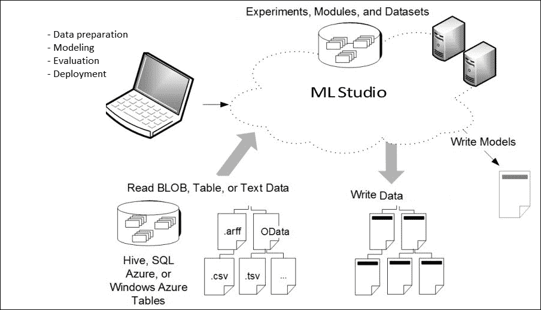

https://azure.microsoft.com/en-gb/documentation/articles/machine-learning-what-is-ml-studio/

在您开始使用 ML Studio 之前，您需要为 Microsoft Azure 获取一个订阅并登录到 ML Studio。以下部分将引导您完成这个过程，如果您不熟悉它的话。

# 开始使用 Microsoft Azure

涉及到**Microsoft Azure**的细节超出了本书的范围。然而，以下小节详细介绍了通过创建账户和开始订阅来开始使用它的步骤。

## Microsoft 账户和订阅

如果您还没有 Microsoft 账户，您需要通过访问[`www.microsoft.com/account`](http://www.microsoft.com/account)来创建一个。这个 URL 可能会在未来发生变化，如果这样的话，您只需在网上搜索**Microsoft Account**来找到正确的 URL。

在撰写此书时，如果你是首次注册，Microsoft 为你提供一个月的免费试用和 200 美元的信用额度，用于在 Azure 上购买服务，如果你只是需要跟随本书中的示例并仅使用 ML Studio，这已经足够了。

一旦你成功登录，你可以访问[`manage.windowsazure.com/`](https://manage.windowsazure.com/)以找到通过 Azure 提供的服务。

## 创建和管理 ML 工作区

你可以在 Azure 服务面板的左侧滚动，并点击**机器学习**。

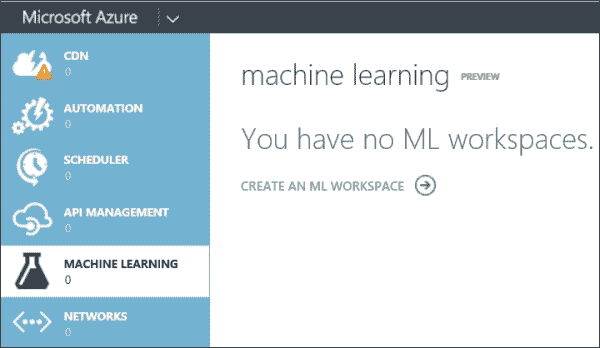

要在机器学习中创建一个项目，请按照以下步骤操作：

1.  再次点击**创建一个 ML 工作区**选项。

1.  在**快速创建**页面，输入你的工作区信息。

    ### 备注

    注意，**工作区所有者**选项是你的 Microsoft 账户（`name@outlook.com`）或组织账户。

1.  点击**创建一个 ML 工作区**选项。

1.  在创建 ML 工作区后，你将在机器学习页面上看到它列出来，如下面的截图所示：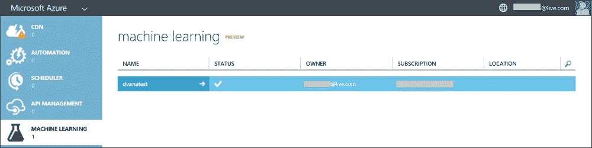

你可以创建多个工作区，并从该区域管理它们。点击已创建的工作区，它将带你去其仪表板页面，在那里你还可以找到配置它的选项。然后，点击**在工作室中打开**链接进入 ML Studio。

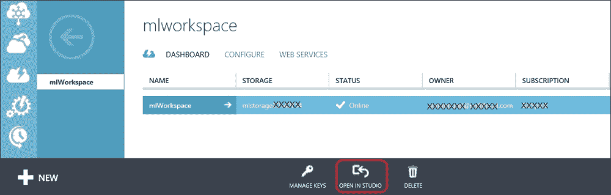

你也可以直接使用[`studio.azureml.net/home`](https://studio.azureml.net/home)进入 ML Studio。

# 在 ML Studio 内部

你通常会到达包含指向不同资源链接的 ML Studio 主页，包括文档和快速入门视频。

除了 ML Studio 主页外，你还会在屏幕左侧找到以下标签页：

+   **实验**：这些是已经创建、运行并保存的实验

+   **Web 服务**：这是你已发布的实验列表

+   **数据集**：这是所有已上传或从实验中保存的数据集的集合，包括所有样本数据集

+   **训练模型**：这是所有训练模型的列表

+   **设置**：这是一系列你可以用来配置你的账户和资源的设置

## 实验

您可以将实验视为在 ML Studio 中执行的任何分析——它可以是简单的，例如简单的统计分析，也可以是复杂的预测分析。ML Studio 中的实验是按层次连接的模块集合。模块是一个封装了 ML Studio 中提供的机器学习库并执行机器学习场景中常见任务的单元。上传到 ML Studio 后的数据集也可以作为模块用于实验。您只需将模块拖放到实验画布上，并将一个模块的输出端口可视地连接到另一个模块的输入端口，即可构建您模型的流程。模块可能有一个或多个输入端口，或者根本没有输入端口。然而，它必须至少有一个输出端口。您可以将模块视为一个可能接受输入并为每个输出端口生成数据集的块。

您可以在一个工作区中创建多个实验。

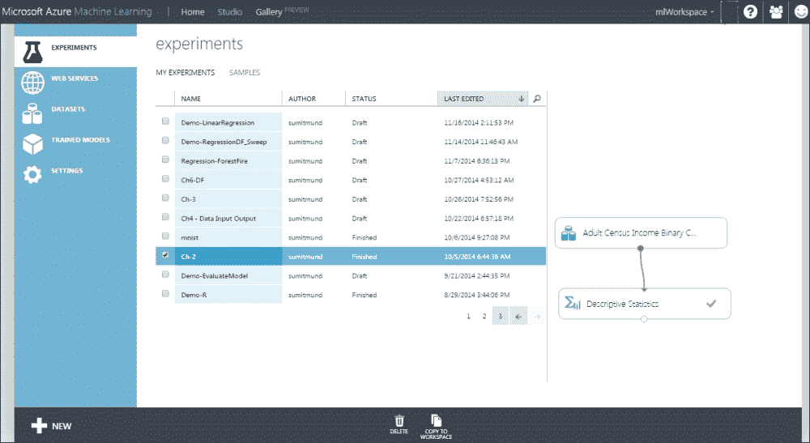

### 创建和编辑实验

要创建一个新的实验，请点击屏幕左侧底部的**+ NEW**按钮，然后选择**空白实验**。将出现一个新的实验。

当您创建一个新的实验时，您将看到以下视图。界面包括模块面板、实验画布、属性面板以及屏幕顶部、底部和远左侧的各种菜单和控制。

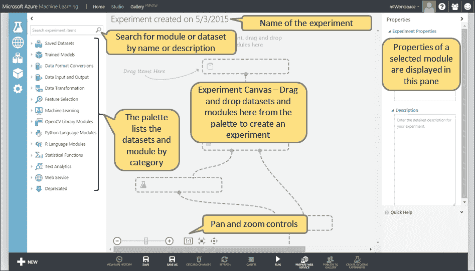

在编辑实验时，屏幕看起来类似于以下屏幕截图。点击模块将显示实验画布右侧的属性面板中的参数——您可以在该面板中查看和修改参数。

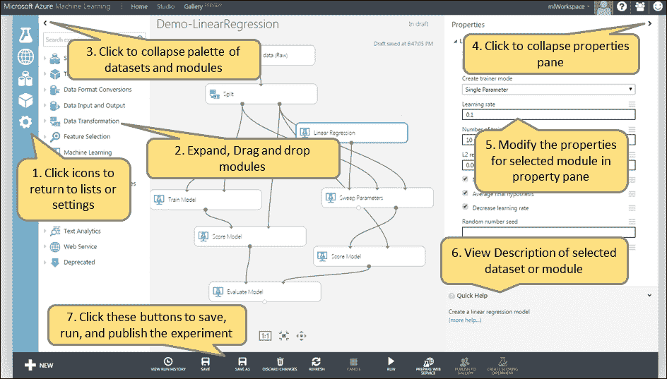

要检查屏幕上出现的各种选项，请按照以下步骤操作：

1.  点击屏幕上的图标以返回列表或设置。

1.  扩展拖放。

1.  点击**<**图标以折叠数据集和模块面板，如图所示的前一个屏幕截图。

1.  点击**>**图标以折叠属性面板，如图所示的前一个屏幕截图。

1.  在属性面板中修改所选模块的属性。

1.  查看所选数据集或模块的描述。

1.  点击这些按钮以保存、运行和发布实验。

要缩放和移动实验画布，您可以使用页面底部的控件。

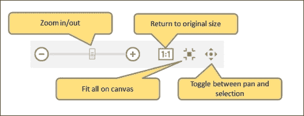

左侧的滑动条可以放大和缩小实验画布。您可以点击**-**和**+**按钮或使用鼠标滑动条左右移动。

点击**1:1**按钮将实验恢复到实际大小；您也可以在键盘上输入*9*来实现。**1:1**按钮右侧的按钮将实验缩放到适合画布；您也可以在键盘上输入*0*来实现。

### 运行实验

当你点击实验画布下方的**运行**按钮时，实验将被提交到 ML Studio 进行执行。

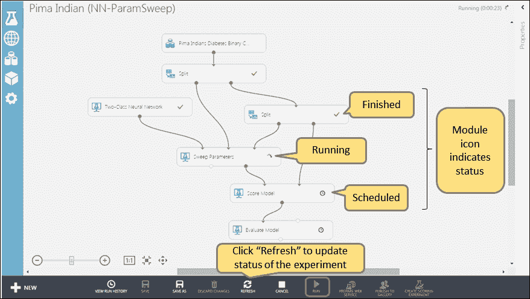

提交实验后，你可以点击实验画布下方的**刷新**按钮，以更新每个模块在实验执行过程中的状态。模块上的状态图标表示模块的状态信息（数据集不显示状态指示器）。让我们看一下以下表格：

| **时钟** |  | 此图标告诉你模块已计划运行 |
| --- | --- | --- |
| **忙碌指示器** |  | 此图标表示模块正在运行 |
| **绿色勾选标记** |  | 此图标表示模块已成功运行 |
| **红色 X** |  | 此图标表示模块遇到了错误 |

当所有模块都显示绿色勾选标记，表示所有模块都成功执行，或者当某个模块显示红色 X，表示它已失败时，实验即完成。如果模块失败，实验将终止，实验中的其他模块可能不会执行。

一旦模块执行完毕，你就可以查看任何模块的结果。为此，右键单击模块的输出端口，并选择**可视化**选项。你可以查看模块的输出或将输出保存为数据集以在其他实验中使用。如果你保存它，那么它将作为保存的数据集在 ML Studio 中可用。

如果模块失败，你可以检查日志。这些日志对于包含在向微软提交的错误报告中可能很有帮助。选择模块时，可以在属性面板中找到输出和错误日志的链接。你也可以通过右键单击模块并选择**查看日志**选项来访问它们。

实验运行后，你可以修改它并再次运行。编辑实验后，你可以点击实验画布下方的**保存**按钮来保存你的工作，或者你可以点击**另存为**选项以不同名称保存实验的副本。当你准备好再次运行实验时，点击**运行**选项。你保存或运行的每个实验副本都将列在 ML Studio 默认视图中的**实验**列表中。

### 创建和运行实验 – 自己动手做

现在你已经对实验有了足够的了解，让我们创建并运行一个简单的实验：

1.  通过点击屏幕左侧底部的**+ 新建**按钮，然后选择**黑色实验**选项来创建一个新的实验。

1.  在新实验的画布上，将新项目命名为**Ch-2**。

1.  将屏幕左侧的**已保存数据集**模块展开，并将名为**成人人口普查收入二分类数据集**的第一个数据集拖动到画布中心。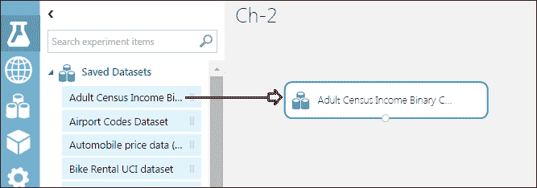

1.  收起**已保存数据集**模块并展开**统计函数**模块。然后，将**描述性统计**模块拖动到画布上。

1.  将**成人人口普查收入二分类数据集**模块的输出端口连接到**描述性统计**模块的输入端口。

1.  点击屏幕底部的**运行**按钮。它应该没有错误标记，以绿色勾号标记**描述性统计**模块，如下面的截图所示：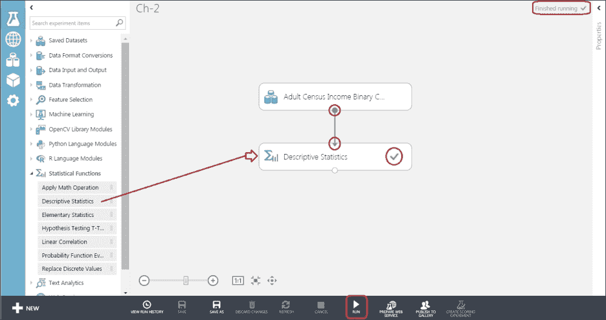

实验运行后，它将自动保存。现在您可以退出工作空间了。在此阶段，我们并不关心调查实验的结果，您将在随后的章节中学习。

# 工作空间作为协作环境

工作空间允许通过将数据、模块和实验汇集在单一位置以供共同使用，使团队能够共同处理常见项目。工作空间让用户能够安全地共享想法和资源。您可以成为多个工作空间的成员，并且可以轻松地在它们之间切换。

作为工作空间的所有者，您可以通过点击屏幕左侧的**设置**图标，然后从顶部选项卡中选择**用户**来邀请其他人加入工作空间。您可以通过添加他们的 Microsoft 账户来邀请其他人加入工作空间。

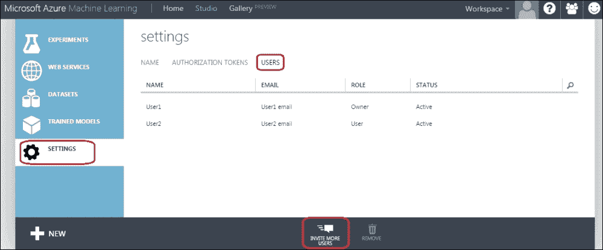

一旦您成功添加了其他用户，他们可以像您作为所有者一样使用相同的工作空间，除非您赋予他们所有权权限，否则他们不能邀请其他人。

一个用户可以是一个或多个工作空间的所有者或用户。

### 注意

注意，工作空间可以被多个用户共享和拥有，但账单仅向创建工作空间的用户收取。

# 摘要

实际上，ML Studio 是**Microsoft Azure 机器学习**！如果您正在进行预测分析，ML Studio 提供了一个平台，用于开发、测试和部署的一切——只需通过鼠标点击即可实现。

在本章中，您从创建 Microsoft 账户和创建 ML 工作空间开始。然后，您从内部探索了 ML Studio。您继续在 ML Studio 中创建一个简单的实验，并快速探索了 ML Studio 如何作为一个协作环境与其他人一起工作。

现在您已经了解了 ML Studio，在下一章中，您将学习如何使用 ML Studio 进行数据探索和数据可视化。
