# 第三章：数据探索与可视化

在你对数据集进行分析并从中找到结果之前，你需要了解数据。你可以通过数据探索和可视化来实现这一点。ML Studio 提供了一个非常基本的选项来做这件事，但提供了最基本的信息。要使用这个工具并了解数据，你需要熟悉一些基本概念，例如数据集中的**平均值**、**标准差**、**变量**或**特征**，以及基本的绘图技术，如**直方图**、**箱线图**、**散点图**等。本章的第一部分将使你熟悉这些概念，然后你将发现如何在 ML Studio 中使用这些概念来应用于一个示例数据集。如果你是从业者或熟悉统计学，可以自由跳过基本概念部分，直接进入下一部分。

# 基本概念

以下是一个非常简单的数据集，包含四个特征或变量：姓名、年龄、性别和每月收入（美元$）。数据集也可以称为一组观测值。在大多数地方，包括本书中，术语“特征”和“变量”是互换使用的。让我们看一下以下表格：

<-----------------特征 ---------->

| 姓名 | 年龄 | 性别 | 每月收入($) |
| --- | --- | --- | --- |
| 人员 A | 20 | 男 | 2000 |
| 人员 B | 45 | 女 | 5000 |
| 人员 C | 36 | 男 | 3000 |
| 人员 D | 55 | 男 | 6500 |
| 人员 E | 27 | 女 | 2800 |
| 人员 F | 31 | 男 | 5900 |
| 人员 G | 33 | 男 | 4800 |
| 人员 X | 59 | 女 | 2400 |
| 人员 Y | 42 | 男 | 7200 |
| 人员 Z | 29 | 女 | 3100 |

数据集中的行或记录在机器学习环境中也被称为示例。这个数据集中有 10 个示例。在这里，**姓名**列代表观测单位——被数据描述的单位，人们对其进行分析。因此，你可以说**人员 A**具有以下特征：20 岁，男，2000 美元。

一个特征可以是数值型或分类型。数值型特征包含数值，例如在这个例子中的**年龄**和**每月收入($)**。你可以对数值型特征应用数学运算。分类型特征通常包含一组类别的字符串值。例如，**性别**可以是两个类别，如这个数据集所示——**男**或**女**。在某些情况下，分类型特征也可以假设数值，例如，你可能喜欢用数字**0**来表示**男**，用数字**1**来表示**女**。因此，特征**性别**将具有 0 和 1 的值，但它仍然是一个分类型特征或变量。

## 平均值

平均值是数字的平均值。计算很简单：将所有数字加起来，然后除以数字的数量。换句话说，它是总和除以计数。

例如，五个数值：5、18、37、20 和 85 的平均值是：

现在让我们更正式一些，你可以将样本的平均值，即算术平均值，表示为：

它是样本值的总和除以样本中的项目数：µ

现在，你可以找出数据集中年龄的平均值（参考表 3.1）。

## 中位数

中位数是在排序后的数字列表中的中间数。如果你有这些数字：5, 18, 37, 20, 和 85。要找到中位数，按升序排列它们：5, 18, **20**, 37, 和 85。正如你可以看到的，中间的数字位于第 3 位，这里有 5 个数字。这里的中位数是 20。

在一个计数为偶数的数字集中，例如 10，中位数将是中间两个数的平均值，所以位于第 5 和第 6 的位置。

现在，你可以找出数据集中年龄变量的中位数是什么（参考表 3.1）。按以下顺序排列它们：

20, 27, 29, 31, **33**, **36**, 42, 45, 55, 和 59

这里中位数可以这样计算：*(33 + 36)/2 = 69/2 = 34.5*。

## 标准差和方差

标准差是方差的平方根。通常用希腊字母 sigma，σ表示，方差表示为**σ2**。你现在可能想知道，方差，或σ2，是如何计算的。它是从平均值到平方差的平均值。以下图表提供了计算方差和标准差的数学公式：

如果你计算数据集中年龄变量的标准差（参考表 3.1），你会发现答案是 12.4637。

方差和标准差解释了数据是如何围绕平均值分布的。当方差较大时，表明数据在平均值周围分布得更广。标准差显示了平均值，平均来说，一个值与平均值相差多少。因此，在数据集（参考表 3.1）中，每个值平均与平均值相差 12.4637，而平均值是 37.7。

将所有数据集合并，ML 工作室可以展示以下统计信息：

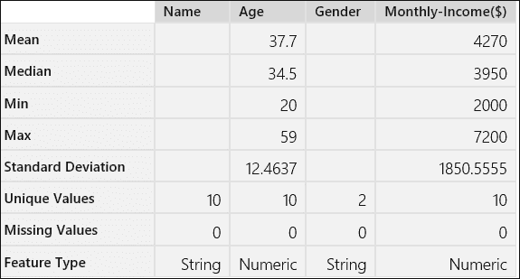

注意，这里的**Min**表示最小值，**Max**表示最大值。因此，最大月收入是 7200，最小年龄是 20。**Unique Values**变量显示了该特征有多少唯一值，例如，对于**Gender**，有两个：男性和女性。**Missing Values**变量标识了值不存在于特征中的案例数量。尽管它被包括在这里，但观察单位（在此称为**Name**）在分析期间不包括。

## 理解直方图

直方图通过不同高度的条形图直观地显示了数据的分布。你可以考虑数据集（参考表 3.1），并想知道年龄是如何分布的。你可以将所有年龄分成两组或两个区间。让我们看一下以下表格：

| 年龄组 | 人数 |
| --- | --- |
| 20 to 39.5 | 6 |
| 39.5 to 59 | 4 |

因此，你将得到年龄的直方图，有两个区间，如下所示：

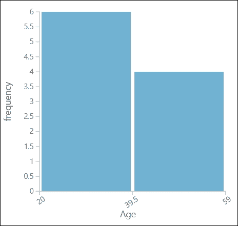

同样，月收入（参见表 3.1）的直方图，有五个区间，看起来可能如下所示：

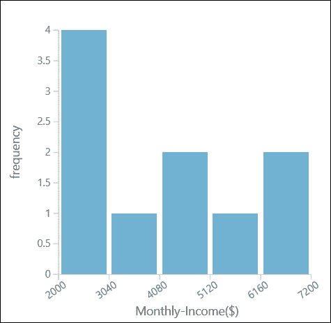

## 箱线和须图

**箱线图**是另一种图形化展示数据分布的方法。它显示了数据的三个四分位数，分别是 Q1、Q2 和 Q3，分别位于箱子的底部、中部和顶部。考虑表 3.1 中的数据集，四分位数将如下所示：

+   *Q1 = 25th percentile = 29.5*

+   *Q2 = 中位数（50th percentile）= 34.5*

+   *Q3 = 75th percentile = 44.25*

根据这些值，可以计算出 IQR（四分位距）为*Q3 – Q1*，以及下边界或下须可以计算为*Q1 – 1.5 * IQR*。

如果最小值大于*Q1 – 1.5 * IQR*，则*下边界或下须 = 最小值*。因此，在我们的例子中，我们考虑*下边界或下须 = 20*。

*上边界或上须 = Q3 + 1.5 * IQR*

如果最大值小于*Q3 + 1.5 * IQR*，则*上边界或上须 = 最大值*。在我们的例子中，我们考虑*上边界或上须 = 59*。

让我们看一下以下图表：

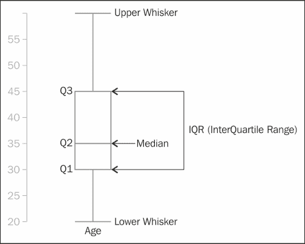

在箱线和须图中，如果任何四分位数之间的距离较短，则数据在该区域聚集；如果距离较长，则表示该区域的数据分布更广。在前面的图中，Q2 是最短的，这意味着该四分位数的数据点更紧凑，而 Q4 较长，表示该区域的数据点分布更广。

### 异常值

任何落在上下须之外的值都称为异常值。在图表中，这些以简单的点表示，如下所示：

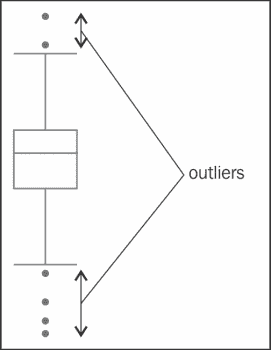

## 散点图

**散点图**是两组变量图形表示。数据以点集的形式显示在二维空间中，一个变量投影在*x*轴上，另一个在*y*轴上。以下是一个散点图，其中年龄在*x*轴上，月收入在*y*轴上（参见表 3.1 中的数据集）：

为了说明，我们已将*x*轴的一个点标记为*55*，将*y*轴的一个点标记为*6500*。因此，这代表了二维空间中年龄和月收入的价值。如果你从该点垂直画一条垂线到*x*轴，它会触及 55；如果你从*y*轴的点水平画一条垂线，它会触及 6500。

散点图直观地显示了两组数据之间的关系。

# ML Studio 中的数据探索

现在，是时候应用这些概念，并使用 ML Studio 开始数据探索和可视化了。你将使用一些默认提供的样本数据集，并进行一些基本的探索。

## 可视化汽车价格数据集

**汽车价格数据（原始）**模块在**已保存数据集**下的左侧模块调色板中可用。这个数据集是关于汽车的数据，根据它们的制造商和型号区分，包括价格和特征，如气缸数、MPG 以及保险风险评分，这是精算师所知的符号化。如果符号化的值为*+3*，这表示汽车有风险；如果值为*-3*，则表示汽车可能非常安全。

在模块调色板中展开**已保存数据集**部分。将**汽车价格数据（原始）**模块拖到画布上。要获取数据的可视化图表，请按照以下步骤操作：

1.  右键单击输出端口。

1.  点击**可视化**。

可视化窗口将以弹出窗口的形式显示：

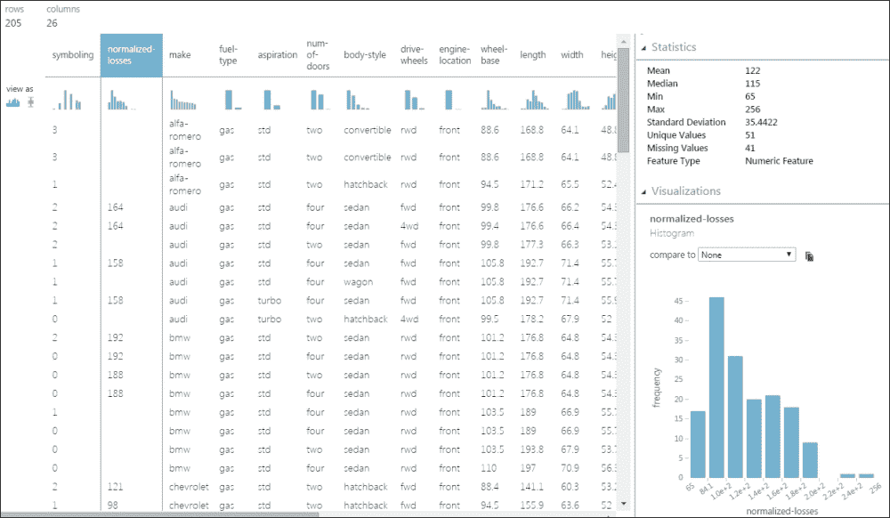

你可以在可视化窗口中找到以下信息：

+   总共有 205 行和 26 列。

+   它显示了数据的前 100 行。

+   在统计区域，当你点击任何列时，它会在屏幕右侧显示基本统计信息：平均值、中位数、最小值、最大标准差值、唯一值的数量和缺失值的数量。它还显示了所选列的特征类型。

+   在可视化区域，屏幕底部右侧是所选特征图表区域。点击特征列上的任何位置，以查看该列的图表。

### 直方图

任何特征，无论是数值还是字符串，都可以以直方图的形式显示。这是屏幕上默认出现的图表。在可视化窗口中，点击**驱动轮**列，你可以找到以下直方图：

当你点击一个数值变量，例如价格，你会找到以下图表：

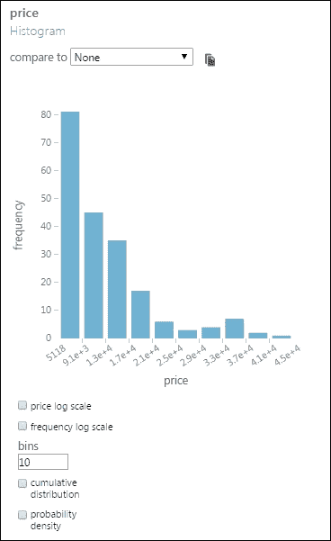

在前面的图表中，价格值以科学记数法显示，但如果你将鼠标悬停在任何一项上，你可以在工具提示中看到实际值。例如，如果你将鼠标悬停在*1.3e+4*上，你会看到值*13174.4*。

在图表中，箱线图的大小设置为默认值 10。然而，你可以更改它，以便更好地理解图表。在之前的图表中，将箱线图更改为**20**，然后在键盘上按*Tab*键以找到更改后的图表。

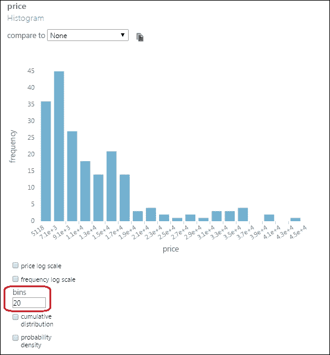

当存在较大值范围时，有时会使用对数刻度，以便更好地表示。点击**价格对数刻度**复选框，以找到以下修改后的图表：

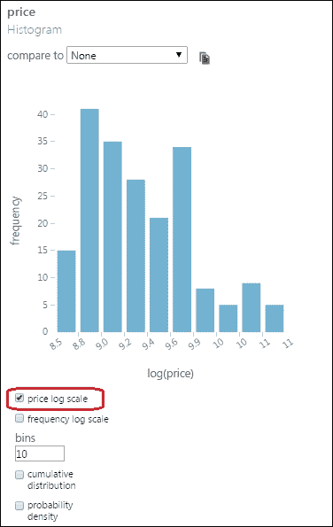

### 箱线图

虽然直方图可以从数值和字符串变量中创建，但箱线图只能从数值变量中创建。当您在视图部分单击箱线图的小图标时，您可以在可视化窗口的顶部列中看到所有可以表示为箱线和须线图的列。

现在，单击**价格**列，并注意箱线图中的异常值，如下面的截图所示：

### 比较特征

您可以选择一个特征并与另一个特征进行比较。如果两个特征都是数值型（并且未标记为标签），则比较将显示为散点图。如果任一特征是非数值型（字符串），则比较将显示为箱线图。

单击**价格**部分，然后在图表区域中选择**比较到**下拉列表中的**make**。注意图中不同制造商的价格分布。**make**列包含不同制造商的名称。

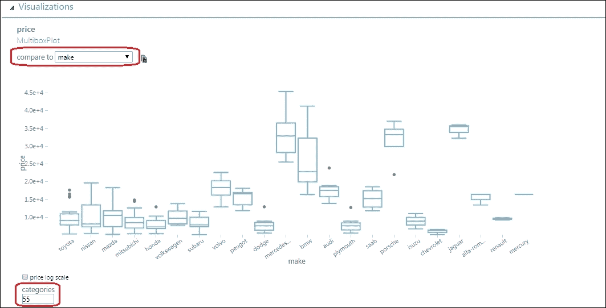

现在，您可以尝试比较两个数值特征。选择**价格**列，然后将其与**normalized-losses**进行比较。

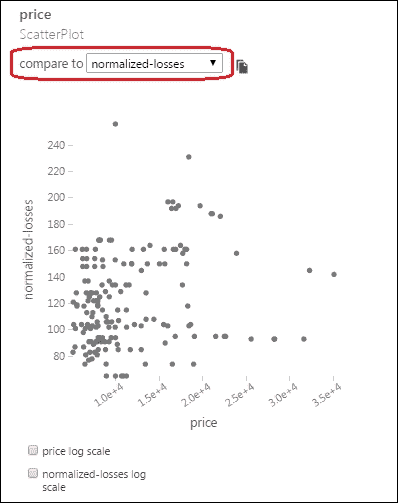

### 一个快照

您可以通过单击图表右上角的快照图标来创建图表的快照。这将创建当前图表的图像，并将其显示在图表的右侧，如下面的截图所示：

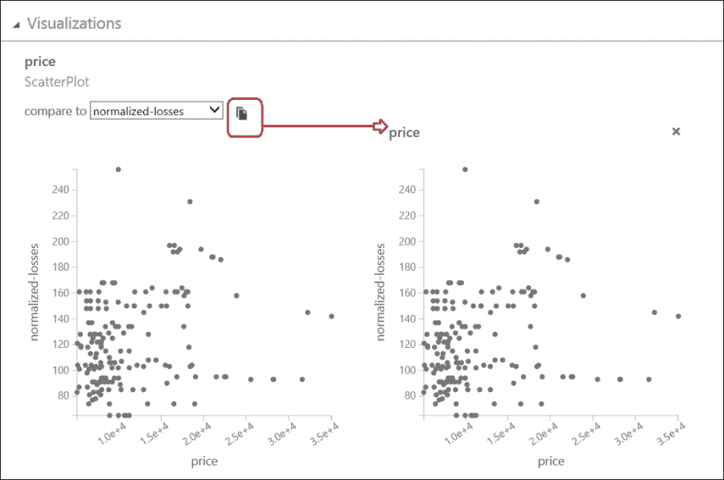

您可以创建任意数量的快照——它们将依次显示在图表的右侧。要关闭快照，请单击图像右上角的**X**符号。

# 亲自动手

**能源效率回归数据**模块是 ML Studio 中默认可用的另一个示例数据集，位于**已保存数据集**部分。使用数据集进行以下操作：

+   可视化数据集

+   查找行数和列数

+   查找所有数值和字符串特征

+   查找基本统计信息，例如平均值、标准差、缺失值等

+   为**加热负荷**特征绘制直方图

+   为**冷却负荷**特征绘制箱线图

+   将加热负荷特征与冷却负荷特征进行比较，并观察散点图

# 摘要

您刚刚完成了一个重要的章节。您从探索统计学的基本概念开始，例如平均值、标准差，以及基本可视化技术，例如直方图、箱线和须线图以及散点图。然后，您通过在 ML Studio 中可视化数据集来探索数据集。在 ML Studio 的可视化弹出窗口中，您找到了数据集的基本统计报告。然后，您使用直方图和箱线图在图表中绘制了特征。您还能够在一个图表中比较两个特征。

当你需要进行任何数据分析时，你需要数据和需要从不同来源导入数据。在下一章中，你将探索你可以将数据导入 ML Studio 的不同方法，以及从 ML Studio 导出数据的方法。
