# 第五章：数据准备

在实际场景中，大多数时候你会发现，用于预测分析的数据不适合这个目的。这主要是由于两个原因：

+   在现实世界中，数据总是杂乱的。它通常有很多不希望出现的项目，如缺失值、重复记录、不同格式的数据、散布在各个地方的数据等等。

+   很常见，数据要么需要以适当的格式提供，要么需要一些预处理，以便在我们应用机器学习算法进行预测分析之前准备好。

因此，你需要准备你的数据或转换你的数据，使其适合所需的分析。ML Studio 提供了不同的数据准备选项，在本章中，你将探索为一些常见场景预处理数据的方法，以及当必要的模块在 ML Studio 中不可用时的数据准备方式。本章旨在使你熟悉这些选项，为你提供一个关于这些选项实际应用的概述，这些选项你将在随后的章节中找到。

# 数据操作

你可能需要操作数据以将其转换为所需的格式。以下是一些常用的场景和可用的模块。

## 清理缺失数据

清理缺失数据和缺失值可能是你在数据分析之前需要解决的最常见问题。当存在缺失值时，某些算法可能无法工作，或者你可能无法得到期望的结果。因此，你需要通过用一些逻辑值替换它们，或者删除现有的行或列来消除缺失值。

ML Studio 提供了一个名为**清理缺失数据**的模块，用于解决这个确切问题。它允许你删除具有缺失值的行或列，或者允许你用以下之一替换行和列中的值：平均值、中位数、众数、自定义值、使用**主成分分析**（**PCA**）的概率形式或**链式方程多重插补**（**MICE**）的值。MICE 是一种统计技术，它使用适当的算法在用默认值初始化缺失条目后更新每一列。这些更新会重复多次，并由`迭代次数`参数指定。默认选项是用自定义值替换行和列的值，你可以指定一个占位符值，例如`0`或`NA`，该值应用于所有缺失值。你应该小心，你指定的值与列的数据类型相匹配。

模块的第一个输出是清理后的数据集，第二个输出是要传递给模块以清理新数据的转换。你可以在模块调色板中的**数据转换** | **操作**下找到**清理缺失数据**模块。

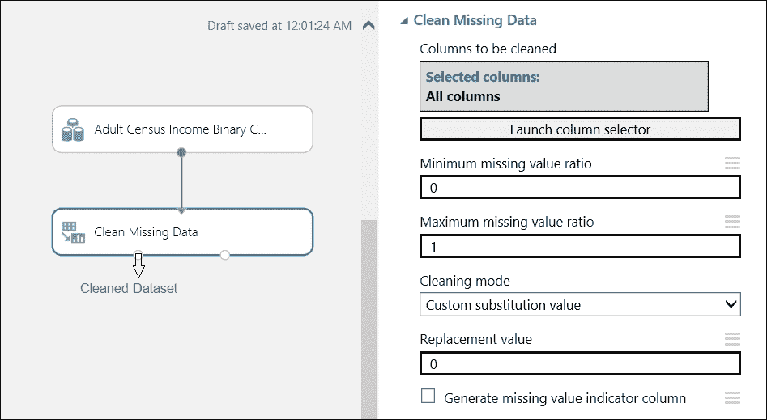

在最后一个参数中，如果您勾选了**生成缺失值指示列**的复选框，那么它将为每个包含缺失值的列添加一个新列，并且对于它找到的每个缺失值行，都会进行相同的指示。

## 移除重复行

您使用**移除重复行**模块根据您指定的列列表从输入数据集中移除重复行。如果所有包含的列的值都相等，则认为两行是重复的。此模块还接受一个输入，即**保留第一个重复行**复选框，作为指示符，指定是否保留一组重复的第一行并丢弃其他行，或者保留遇到的最后一个重复行并丢弃其余行。

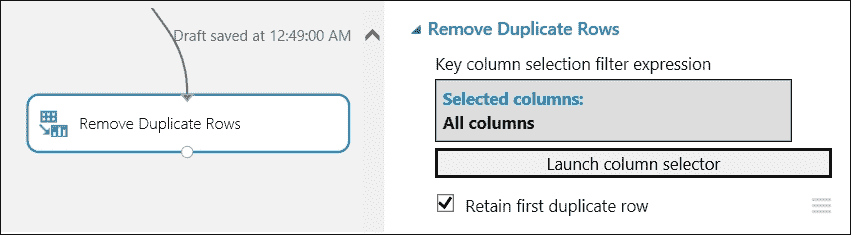

## 项目列

当您需要在数据集中选择特定列进行分析时，可以使用**项目列**模块。根据您的需求，您可以通过排除所有列并包含几个列来实现这一点。或者，您可以从包含所有列开始，然后排除几个列。

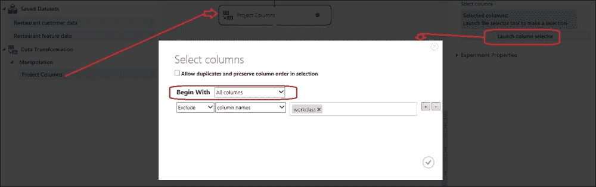

前面的截图说明了**项目列**模块是如何从给定的数据集中排除一个列的。同时请注意，如果您喜欢，可以勾选顶部的复选框，以保持选择中重复行和列的顺序。

## 元数据编辑器模块

**元数据编辑器**模块允许您更改数据集中一个或多个列的元数据。对于给定的数据集，您可以更改以下内容：

+   您可以更改列的数据类型；例如，从字符串更改为整数

+   您可以将列的类型更改为分类或非分类；例如，一个列可能包含用户 ID，它们是整数，但您可能认为它们是分类的

+   您可以更改列的考虑方式，将其视为特征或标签；例如，如果一个数据集有一个包含您感兴趣进行预测的群体收入的列，您可能希望将其视为标签或目标变量

+   您可以更改列的名称

让我们看看以下截图，它解释了**元数据编辑器**模块提供的各种功能：

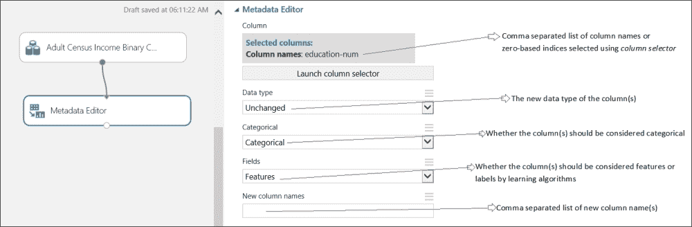

## **添加列**模块

**添加列**模块接受两个数据集作为输入，并通过组合两个数据集的所有列来连接它们，以创建一个单一的数据集。结果数据集将包含两个输入数据集列的总和。

要将两个数据集的列添加到单一数据集中，您需要记住以下几点：

+   每个数据集中的列必须具有相同数量的行。

+   当您使用**添加列**选项时，将连接每个数据集中的所有列。如果您只想添加列的子集，请使用结果集上的**项目列**模块来创建包含您想要的列的数据集。

+   如果有两个具有相同名称的列，则将从右侧输入的列名称添加一个数字后缀。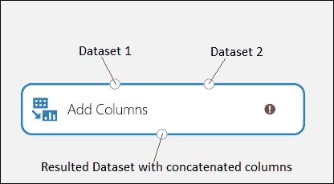

## **添加行**模块

**添加行**模块接受两个数据集作为输入，并通过在第一个数据集之后附加第二个数据集的行来连接它们。

要将两个数据集的行添加到单个数据集中，您需要记住以下事项：

+   两个数据集必须具有相同数量的列

结果数据集将包含两个输入数据集行数的总和：

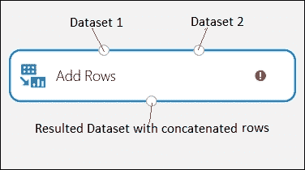

## **Join**模块

**Join**模块允许您合并两个数据集。如果您熟悉 RDBMS，那么您可能会发现它与类似 SQL 的连接操作相似；然而，使用它不需要 SQL 知识。您可以执行以下类型的连接操作：

+   **内连接**：这是一个典型的连接操作。只有当键列的值匹配时，它才返回组合行。

+   **左外连接**：此操作返回左侧表中的所有行的连接行。当左侧表中的某一行在右侧表中没有匹配行时，返回的行包含来自右侧表的所有列的缺失值。

+   **全外连接**：此操作返回两个数据集的连接行，首先是**内连接**操作的结果，然后附加不匹配的行。

+   **左半连接**：当键列（复数）的值匹配时，它仅返回左侧表中的行。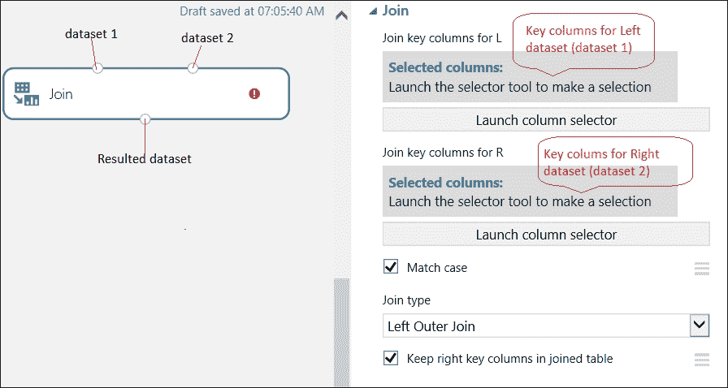

# 数据拆分

很常见，您需要拆分您的数据集；最常见的是，您需要将给定的数据集拆分为用于分析的训练集和测试集。ML Studio 为此目的提供了一个**拆分**模块。它允许您根据指定的分数将数据集拆分为两个数据集。因此，如果您选择**0.8**，则输出第一个数据集，包含输入数据集的 80%，其余 20%作为第二个输出。您还可以选择随机拆分数据。如果您需要在每次运行时都获得相同的结果，则可以指定一个非 0 的随机种子值。您可以在**数据转换** | **样本**下找到**拆分**模块，然后在模块调色板中拆分它：

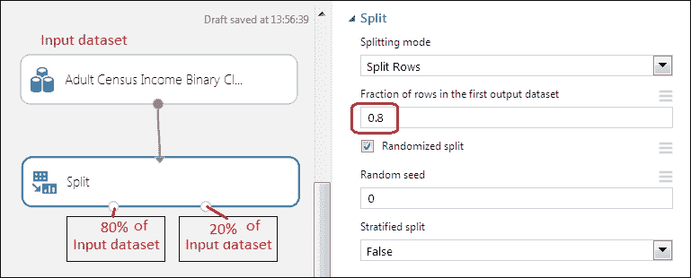

注意，最后一个参数**分层拆分**默认为**False**，只有当您进行分层拆分时才将其设置为**True**，这意味着它首先分组，然后从每个组（层）中随机选择行。在这种情况下，您需要根据**分层键**列指定分组依据。

您还可以指定不同的拆分模式作为参数，而不是指定默认的拆分行数，例如：

+   **推荐拆分**：当您需要将数据拆分以在推荐模型中使用作为训练和测试数据时，可以选择此选项。

+   **正则表达式**：你可以使用此选项指定正则表达式，将数据集分成两行集——匹配表达式的行和所有剩余的行。正则表达式仅应用于数据集中的指定列。此拆分选项对于各种预预处理和过滤任务很有帮助。例如，你可以通过将以下正则表达式应用于字符串列 *text Social* 来过滤包含文本 *Social* 的所有行。

+   **相对表达式**：你可以使用此选项创建作为数值列过滤器的关联表达式；例如，以下表达式选择所有列值大于 2000 的行，如*ColumnName>2000*。

# 自己动手做

开始一个新的实验，并将来自**保存的数据集**组下的**成人人口普查收入二分类**数据集拖到模块调色板中。然后，执行以下操作：

+   可视化数据集并找出所有具有缺失值的列

+   使用**清理缺失数据**模块用 0 替换缺失值

+   在之前使用的**元数据编辑器**模块的结果数据集中，选择除收入外的所有列，并将它们识别为特征字段

+   在之前使用的**分割**模块的结果数据集中，使用相同的模块将数据集分成 80% 和 20%

+   运行实验并从**分割**模块的输出端口可视化数据集

你的实验可能看起来像以下这样：

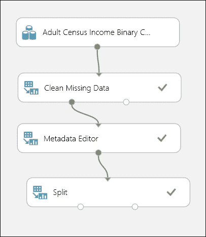

# **应用 SQL 转换**模块

**应用 SQL 转换**模块允许你在输入数据集上运行 SQL 查询并获取所需的结果。你可以在模块调色板中的**数据转换** | **操作**下找到它。该模块可以接受一个、两个或三个数据集作为输入。来自输入 1 的数据集可以引用为**t1**。同样，你可以将来自输入 2 和输入 3 的数据集分别引用为**t2**和**t3**。在模块属性中，**应用 SQL 转换**模块只接受一个参数作为 SQL 查询。它支持的 SQL 语法基于 SQLite 标准。

在以下示例中，该模块从两个数据集中获取数据，将它们连接起来，并选择较少的列。它还通过应用聚合函数 AVG 生成计算列。

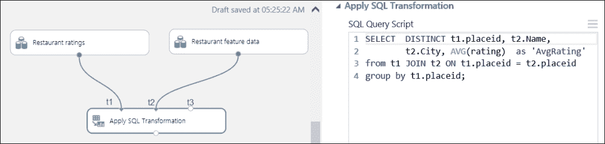

如果你已经熟悉 SQL，你可能会觉得这个模块在数据转换方面非常实用。

# 高级数据预处理

ML Studio 还提供了高级数据处理选项。以下是一些简要讨论的常见选项。

## 移除异常值

异常值是与数据中的其他数据点明显不同的数据点。如果您的数据集中存在异常值，它们可能会通过扭曲您的预测模型而导致不可靠的数据预测。在许多情况下，剪裁或删除异常值是一个好主意。

ML Studio 附带**剪裁值**模块，该模块检测异常值，并允许您使用阈值、平均值、中位数或缺失值剪裁或替换值。默认情况下，它应用于所有数值列，但您可以选择一个或多个列。您可以通过导航到**数据转换**|**缩放**然后**减少**在模块调色板中找到它。

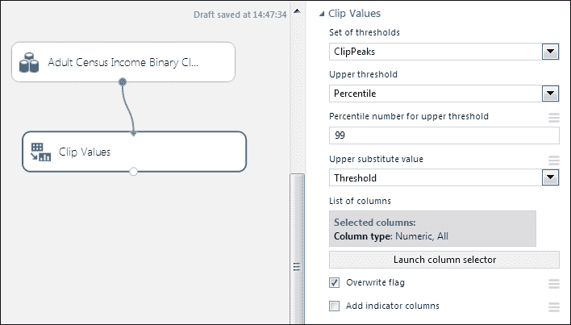

## 数据归一化

通常，数据集中的不同列具有不同的尺度；例如，您可能有一个包含两个列的数据集：年龄，其值范围从 15 到 95，以及年收入，其值范围从$30,000 到$300,000。在某些情况下，这可能会成为问题，因为某些机器算法要求数据具有相同的尺度。

ML Studio 附带**归一化数据**模块，该模块将数学函数应用于数值数据，使数据集的值符合一个共同的尺度；例如，将所有数值列的值转换为介于 0 到 1 之间。默认情况下，该模块应用于所有数值列，但您可以选择一个或多个列。您还可以从以下数学函数中选择：

+   Z 分数

+   最小-最大

+   逻辑回归

+   对数正态

+   Tanh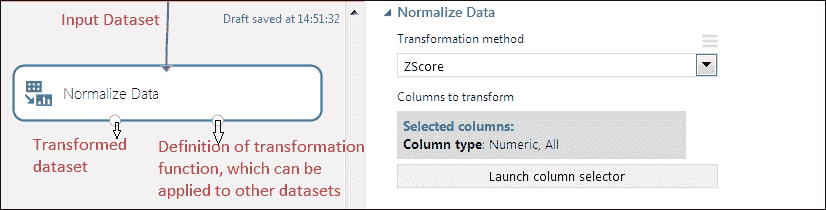

## 应用数学运算模块

有时，您可能需要将数学运算应用于数据集作为数据准备的一部分。在 ML Studio 中，您可以使用**应用数学运算**模块，该模块接受数据集作为输入，并返回一个数据表，其中所选列的元素已通过指定的数学运算进行转换。对于一元运算，如 Abs(x)，运算应用于每个元素。对于二元运算，如 Subtract(x, y)，需要选择两列，并在列之间的元素对上计算结果。它提供了一系列分组在不同类别下的数学函数。默认情况下，它应用于所有数值列，但您可以选择一个或多个列。您可以在模块调色板中的**统计函数**模块下找到它。

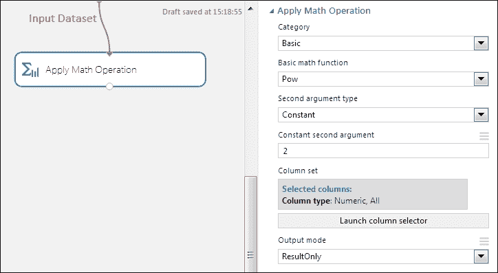

## 特征选择

数据集中的不是所有特征或列都具有相同的预测能力。有时数据中包含许多冗余或不相关的特征。冗余特征不比当前选定的特征提供更多信息，而不相关的特征在任何上下文中都不提供有用信息。因此，在应用预测分析之前，从数据集中去除冗余或不相关的特征是理想的。

ML Studio 附带以下两个用于特征选择的模块，它们接受一个输入数据集和一个带有过滤列或特征的输出数据集。

### **基于过滤的特征选择**模块

**基于过滤的特征选择**模块使用不同的统计测试来确定具有最高预测能力的特征子集。您可以在模块调色板中的**特征选择**下找到它。它接受一个包含两个或更多特征列的数据集作为输入。第一个输出是一个包含前 N 个预测能力强的特征（列）的数据集。第二个输出是一个包含分配给所选列的分数（标量）的数据集。此模块根据您选择的以下启发式选项从数据集中选择重要特征：

+   皮尔逊相关选项

+   互信息选项

+   Kendall 相关选项

+   Spearman 相关选项

+   卡方选项

+   费舍尔评分选项

+   基于计数的选项

皮尔逊相关系数是**基于过滤的特征选择**模块的默认选项。它与数值、逻辑和分类字符串列一起工作。请注意，所有启发式或评分方法并不适用于所有类型的数据。因此，您选择的评分方法部分取决于您拥有的数据类型。有关这些评分方法的更多详细信息，您可以参考产品文档。

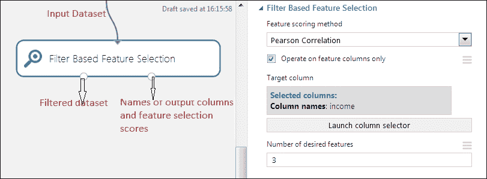

### **费舍尔线性判别分析**模块

**费舍尔** **线性判别分析**模块找到一组特征线性组合，该组合表征或区分两个或多个对象或事件类别。得到的组合通常用于在分类前后进行降维。您可以在模块调色板中的**特征选择**下找到它。

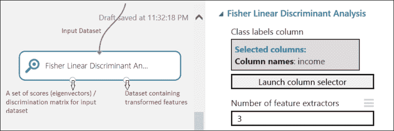

## 超出现成模块的数据准备

虽然 ML Studio 附带了许多数据预处理模块，但您可能会遇到可用模块无法满足您需求的情况。在这些时候，您可能需要用 R 或 Python 编写代码，在 ML Studio 中运行它们，并将这部分作为您的实验的一部分。您可以在第十章 *使用 R 和 Python 进行扩展*中找到有关如何编写代码和扩展 ML Studio 的更多信息。

目前建议，如果您的数据大小在几 GB 以内，您应该在 ML Studio 内部进行任何数据准备。如果您处理的数据更多，那么您应该在 ML Studio 外部准备数据，例如使用 SQL 数据库或使用大数据技术，如微软基于云的 Hadoop 服务**HDInsight**。然后，您应该在 ML Studio 内部消费准备好的数据进行预测分析。

# 摘要

在任何数据分析任务中，数据准备占据了您大部分的时间。在本章中，您了解了 ML Studio 中不同的数据准备选项，从探索数据准备的重要性开始。然后，您熟悉了一些非常常见的数据转换任务，例如处理缺失值、重复值、合并两个数据集的行或列、类似 SQL 的数据集连接、在数据集中选择列以及分割数据集。您还学习了如何应用 SQL 查询来转换数据集。您还探索了通过应用数学函数、归一化和特征选择来转换数据集的一些高级选项。

在下一章中，你可以开始应用机器学习算法，特别是 ML Studio 附带回归算法。
