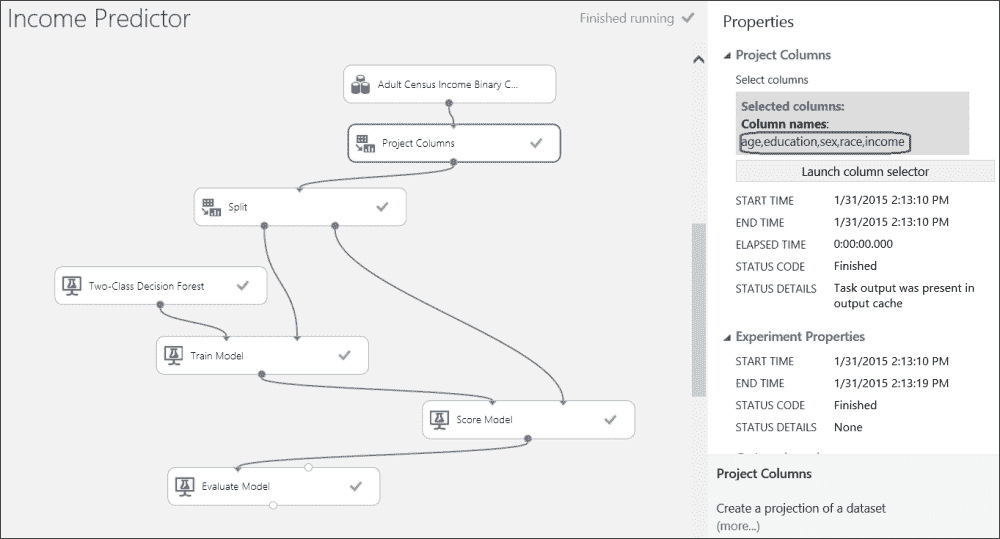
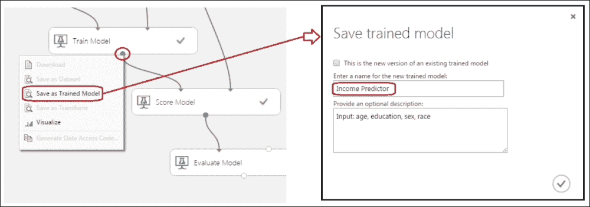
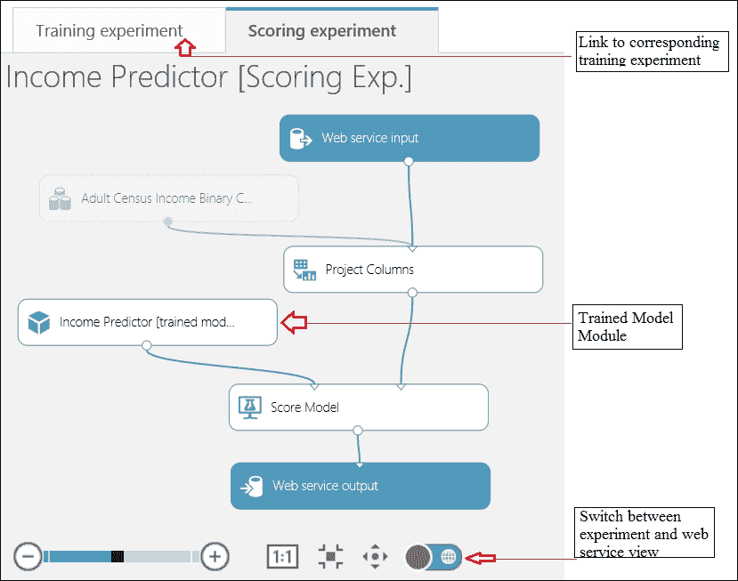
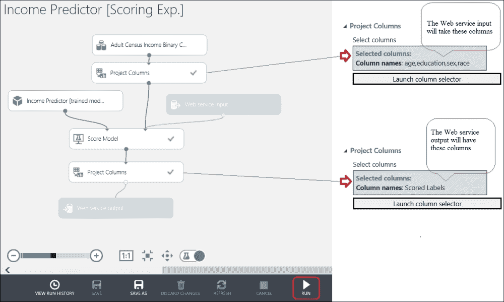
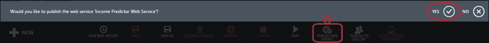
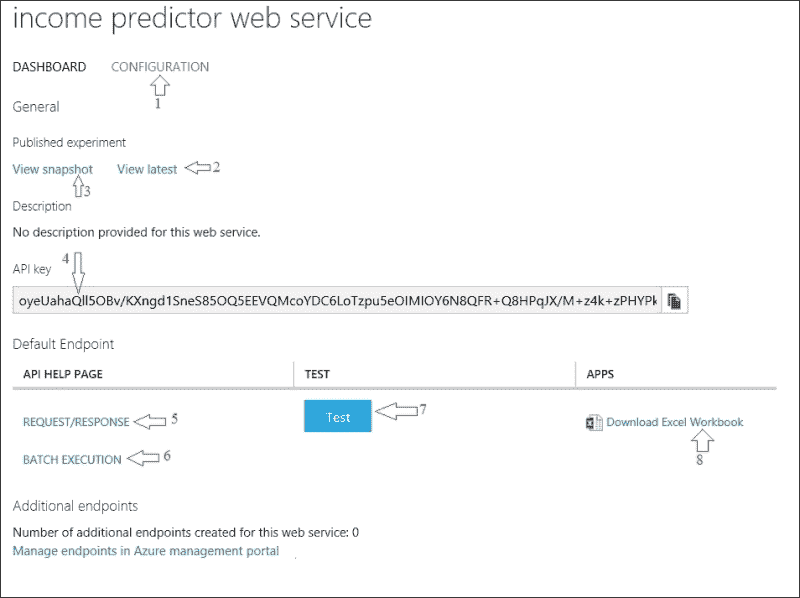
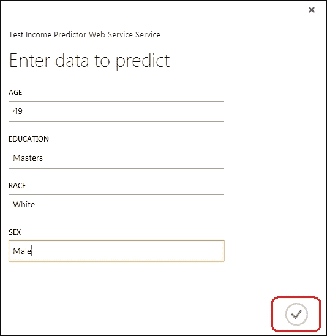
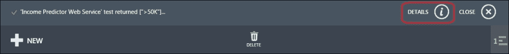
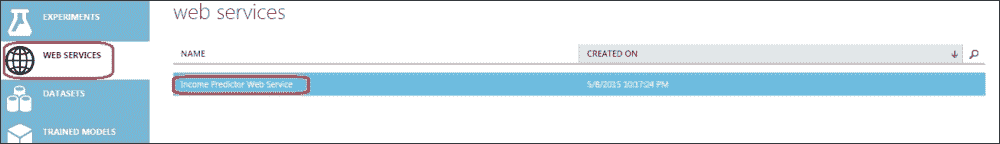

# 第十一章。将模型作为 Web 服务发布

到目前为止，你已经了解了如何构建不同的预测模型作为实验。现在，你可能想知道这在现实生活中的场景中会有什么用途。其中一个用途是在你构建和测试你的模型之后，你可以在实验中直接使用数据集进行预测，但在大多数情况下，模型的结果或预测需要用于其他地方，可能由其他人使用。考虑你构建了一个推荐模型，它推荐买家可能感兴趣的商品。因此，这些预测需要电子商务网站向潜在买家展示推荐的产品项。再考虑一个场景，你使用聚类构建了一个用于市场细分的模型。你的公司的营销主管应该通过将结果集成到他们的软件中或简单地使用熟悉的 Microsoft Excel 来分析这个模型。

基本上，你必须将你构建的预测模型在某个环境中可用，以便组织内部或外部的人可以使用它。传统上，这通常是一项繁琐的工作，需要编写和测试大量代码。然后，根据需要准备基础设施。

现在，Azure ML 消除了所有痛苦。在本章中，你将了解如何轻松地将模型发布到实验中，并将其作为 web 服务 API 使其他人可以使用。

简而言之，你可以按照以下简单步骤发布你的模型：

1.  准备你的模型以作为 web 服务发布。

1.  准备评分实验。

1.  指定 web 服务的输入和输出。

1.  将其作为 web 服务发布和测试。

# 准备要发布的实验

在开始部署之前，你需要准备好你的实验。为此，你需要完成你的实验，成功运行它们，评估并确定要使用的训练好的模型。为了说明，我们这里有一个简单的模型，它根据年龄、教育、性别和种族预测成年人的收入。该模型使用**双分类决策森林**模块来预测一个人是否有超过 50K 的收入。构建实验的详细信息可以在第七章*分类模型*中找到。

## 保存训练好的模型

一旦你对你的模型有信心，你可以将其保存为训练好的模型。为此，在画布上右键单击**训练模型**模块的输出端口，然后单击**另存为训练模型**选项以保存训练好的模型，该模型以后可以使用。当出现**保存训练模型**弹出窗口时，你必须指定一个名称和可选的描述文本。然后，点击屏幕右侧的勾选按钮以保存训练好的模型，如下面的截图所示：

保存的模型将像预测模块一样，可以被**评分模型**模块使用给定的特征集进行评分。它将作为模块出现在屏幕左侧模块调色板中**训练模型**组下。

如果你已经对模型进行了任何更改，比如更改了算法的参数等，那么你必须重新保存训练模型，并且当弹出窗口出现时，在屏幕顶部勾选**这是现有训练模型的新版本**选项，并选择之前保存的模型名称。

# 创建评分实验

**评分实验**是指使用训练好的模型模块进行预测（评分）的实验。你可以创建一个新的实验，使用**训练模型**模块，并使用数据集进行预测。ML Studio 通过一个按钮就能轻松实现这一点，如下面的截图所示：

当训练实验成功运行时，按钮会变为激活状态。成功运行你的**收入预测器**实验后，然后点击**创建评分实验**按钮来创建与现有实验相对应的评分实验。完成此操作后，你将看到以下截图：

在幕后，ML Studio 已经为你完成了以下任务：

1.  它将你的训练模型保存为屏幕左侧模块调色板中**训练模型**部分的模块。

1.  它创建了现有训练实验的副本，然后替换了机器学习算法模块和**训练模型**模块，用保存的训练模型替换。

1.  它移除了评分实验中明显不需要的模块——在这个例子中是**分割**和**评估模型**模块。

1.  它添加了**Web 服务输入**和**Web 服务输出**模块，并将它们连接到实验中的默认位置。

你也可以手动执行这些步骤并创建一个评分实验。然而，通过这种方式创建实验，ML Studio 会将训练和评分实验链接起来。当你打开任何一个链接时，另一个链接将以标签的形式出现，这样你就可以轻松地在训练和评分实验之间切换。

**Web 服务输入**和**Web 服务输出**模块指定了当模型作为 Web 服务发布时输入的去向和输出的来源。现在这些模块已经连接到默认位置，你需要计划和连接到正确的模块。

# 指定 Web 服务的输入和输出

在发布网络服务之前，您需要指定网络服务将接受什么作为输入以及您感兴趣的输出。假设为了我们的说明，我们需要从输入中预测某人的收入水平（即小于或等于 50K 或大于或等于 50K）：年龄、教育、性别和种族。您可以使用**项目列**模块实现这一点。

在您的网络服务中，输入应进入**评分模型**模块。因此，将**网络服务输入**模块连接到**评分模型**模块。添加一个**项目列**模块，并将其输入端口连接到**评分模型**模块的输出。在模块属性面板中，仅选择**评分标签**选项。让我们看看以下截图：

在实验成功运行后，您可以在评分实验中检查两个**项目列**模块的输出；其输出符合预期。现在，这个实验可以发布为网络服务。

# 将模型发布为网络服务

将模型发布为网络服务非常简单。要发布模型，请点击**发布网络服务**按钮，并在它请求确认时点击**是**，如图所示：

这可能需要一段时间，一旦完成，它将带您进入已发布的网络服务仪表板页面。您可以通过点击链接返回父评分实验，该链接是**查看最新**选项（参见图中的**2**）。**查看快照**链接也会带您进入相同的父评分实验，但它以锁定视图显示实验。

默认端点或已发布的网络服务 API 建议如何调用或消费网络服务。**请求/响应**选项（参见图中的**5**）指定您将使用一个特征集调用网络服务，并根据您定义的输出获得一个基于预测的响应。**批量执行**选项（参见图中的**6**）要求您传递一个数据集（特征矩阵）作为文件，并获取作为数据集的输出预测。

## 视觉测试网络服务

您可以通过点击**测试**按钮（参见图中的**7**）来视觉测试已发布的网络服务。点击按钮，将出现一个弹出表单。填写不同的特征以进行预测。填写表单，并点击屏幕右下角的勾选按钮，如图所示：

在从网络服务获得响应后，您将看到以下图所示的消息：

如前图所示，它返回了预测标签**">50K"**。您也可以通过下载 Excel 文件（参考**8**）来测试该网络服务，该文件已配置好以连接到网络服务。只需填写字段即可查看结果。

# 消费已发布的网络服务

现在由于网络服务已发布并作为 API 提供，您可以使用您选择的编程语言编写程序，并消费 API 以获取预测或 API 的结果。API 需要一个**API 密钥**，您可以在已发布的网络服务仪表板页面上找到（参考**4**）。没有 API 密钥，您将无法连接到网络服务。在 API 帮助页面上，您将找到有关已发布 API 的详细文档，包括**C#.Net**、**Python**和**R**中的示例代码，其中包含必要的内联注释。您可以从相同的网络服务仪表板页面找到 API 帮助页面的链接（参考**5**和**6**）。

# 网络服务配置

在发布模型后，网络服务名称将在网络服务页面中可用，并带有指向网络服务仪表板页面的链接，如下图所示：

点击网络服务的名称，在仪表板页面，点击**配置**选项（参考**1**）。在配置页面，您可以自定义与网络服务相关的信息，例如，**显示名称**、**描述**、**输入模式**、**输出模式**等。

# 更新网络服务

在以下两种情况下，您可能需要更新您已发布的网络服务：

+   您的原始模型已更改，例如，您修改了模型参数以改进性能等

+   您需要更改网络服务的输入或输出

对于第一种情况，您需要回到您的原始训练实验，进行更改，运行它，然后点击**更新评分实验**链接以更新评分实验。对于这两种情况，您都必须回到评分实验并重新发布，因此它将覆盖之前发布的实验。

# 摘要

在本章中，您探讨了将模型发布为网络服务的完整步骤，以便其他人可以使用 API 并消费网络服务。您准备了一个实验以使其准备好发布，并保存了一个训练好的模型。然后您创建了一个评分实验并为其设置了输入和输出。您将评分实验发布为网络服务并进行了视觉测试。您还探讨了如何消费网络服务 API，以及如何通过进行配置更改和更新来维护它一段时间。

在下一章中，您将通过解决回归问题案例研究练习来学习如何构建自己的模型。
